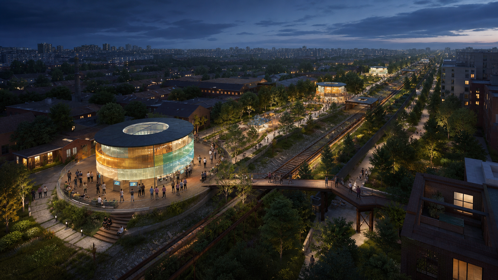
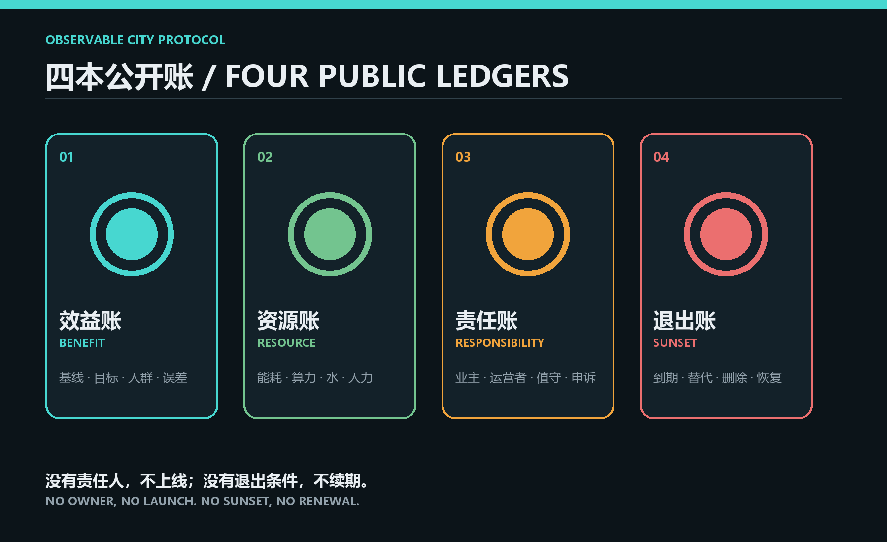
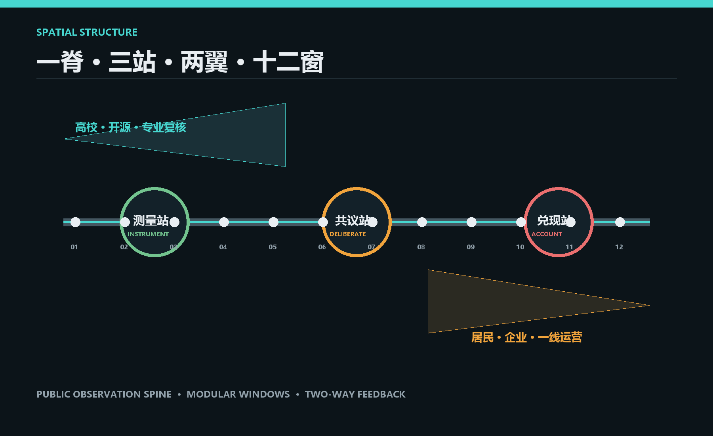
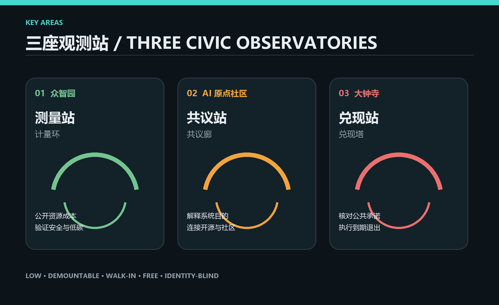
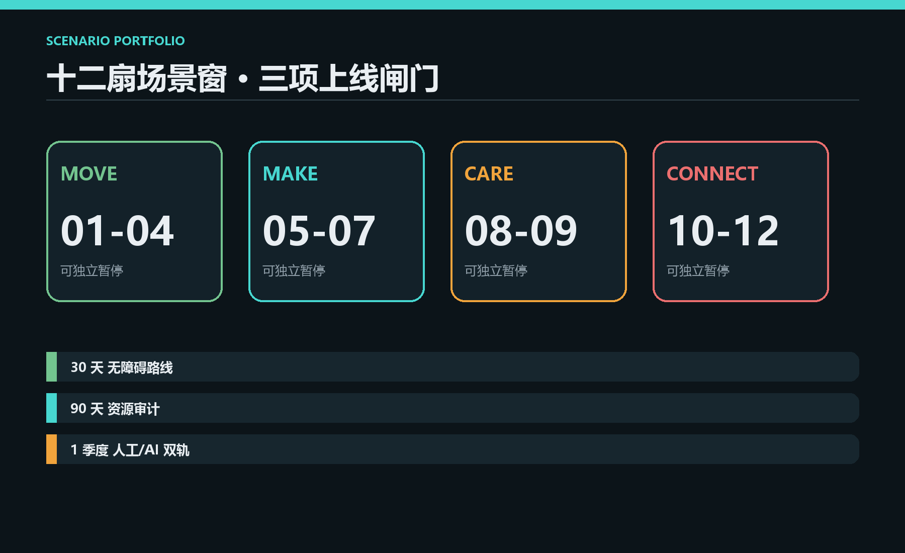
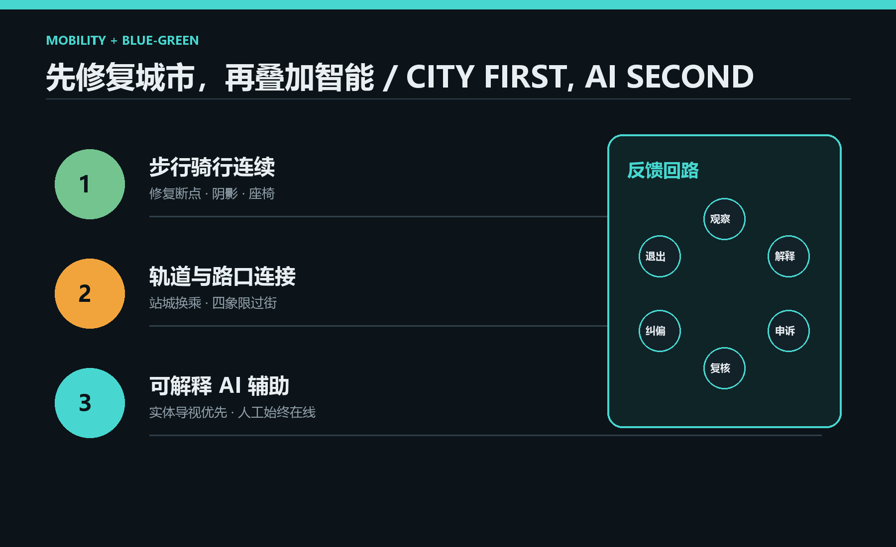

# 京张可观测带

## 一句话提案

**让城市 AI 的公共收益、资源代价、责任主体与退出条件，在真实城市中持续可见。**

今天的城市 AI 多数藏在后台：居民感受到结果，却难以知道系统为何存在、消耗什么、由谁负责、何时停止。本方案不再增加一个“智慧大脑”，而是沿京张遗址公园建立一套公共可观测基础设施。它把每项 AI 场景都压缩为四本公开账：**效益账、资源账、责任账、退出账**。公众可以在现场看到、提出异议、选择人工服务；运营者必须说明目标、数据边界、复核机制与停止条件。

方案与“测试场/校准场”的区别是：测试场回答系统是否通过一次性阈值；可观测城市持续回答**城市生活发生了什么变化、谁受益、谁承担成本、谁能纠偏**。这是一种空间设计，也是一种公共制度。[source:AGENT-TASKBOOK] [standard:MOHURD-URBAN-DESIGN-MEASURES]

## 设计依据与资料清单

本包使用仓库登记的 provisional `SITE_BOUNDARY` 与三处 provisional `KEY_AREA`，仅服务于概念生成、内容审查、结构化自检与可视化，不构成官方红线、法定规划或工程依据。[data:geometry/site_boundary.geojson#SITE-001] [data:geometry/key_areas.geojson#PROV-KEY-001]

当前机器门禁与内容审稿条件就绪；空间几何仍为 provisional，正式专业评分、法定判断和工程判断须等待官方多边形、控规、道路红线、权属、市政、文保与现状建筑资料。`metrics.json` 中场地面积、绿地率与公共空间率仅由提交概念图层复算，置信度为 low；容积率、高度、建筑密度和退线保持 unknown。[metric:site_area_sqm] [depth:risk_missing_data]

设计依据按四级管理：官方公告用于确认三层范围与三处重点区；仓库场地包用于机器可读边界、枚举和校验；国家及行业标准用于专业深度核对；海外公开案例只用于提炼透明登记、测试、绩效与参与机制。任何案例均不替代北京本地法规，也不证明本方案已经取得实施授权。完整引用、用途和许可状态保存在 `sources.json`，缺资料事项保存在 `assumptions.json`。

## 三层范围工作框架

总体结构为：**一条公共观测脊、三座观测站、两条反馈翼、十二扇场景窗。**

- **一条公共观测脊**：沿京张遗址公园串联慢行、雨洪、文化叙事和 AI 场景。每 800-1200 米设置一处无屏或低屏“观察窗”，以灯环、机械翻牌、实体刻度和二维码镜像公开四本账。
- **三座观测站**：众智园“测量站”、AI 原点社区“共议站”、大钟寺“兑现站”。三者不是造型孤岛，而是标准化公共层嵌入既有更新项目。
- **两条反馈翼**：高校与开源社区提供方法审查；居民、企业和一线运营者提供使用反馈。两翼都回到公开议题台与季度复盘。
- **十二扇场景窗**：将交通、产业、社区、文化、生态和公共服务拆为最小可运行单元，任何一窗都可独立暂停，不拖垮整条带。

统筹研究范围用于判断 AI 产业、人才、开源社区与城市生活的协同关系；总体设计范围用于组织遗址公园周边城市更新、交通、蓝绿和设施；三处重点区域用于验证可建造的空间接口与可运营的场景协议。三层之间采用“策略提出 - 图层落位 - 重点区验证 - 指标复算”的闭环，避免总图、场景和实施互相脱节。[depth:three_level_scope_framework] [data:geometry/site_boundary.geojson#SITE-001]

| 公开账 | 必须公开 | 空间表达 | 触发纠偏 |
| --- | --- | --- | --- |
| 效益账 Benefit | 基线、目标、服务人群、误差 | 公共刻度环 + 月度变化 | 连续两期无改善则复审 |
| 资源账 Resource | 能耗、算力、水、维护、人力 | 四象限资源柱 | 超过预算或碳阈值则降级 |
| 责任账 Responsibility | 业主、供应商、值守人、申诉渠道 | “谁在值班”责任牌 | 无责任人则不得上线 |
| 退出账 Sunset | 到期日、人工替代、数据删除、恢复步骤 | 倒计时窗 + 物理停用钮 | 到期未续证即停止 |

## 统筹研究范围产业与未来城市研究

可观测性构成新的创新生态公共品。高校和开源社区负责提出测试方法与可复现证据，初创团队获得低成本合规入口，头部企业公开场景绩效和资源账，社区与一线运营者提供真实使用反馈，城市管理者只对完成登记、测试和退出设计的场景开放公共空间。由此形成“研究 - 转化 - 部署 - 观察 - 纠偏 - 退出”的完整创新链，而不是以模型发布数量衡量创新。

未来城市形态不依赖封闭园区，而依赖可穿行的首层公共界面。创新空间沿公共绿脊分布，研发、孵化、社区服务、文化展示和人才生活通过步行网络连接。三座观测站承担共同协议，各片区保留自身产业特征；这既支持“三区两翼”的协同，又避免建设一个重复、昂贵且单点失效的中心平台。[source:AGENT-TASKBOOK] [standard:MOHURD-URBAN-DESIGN-MEASURES]

## 总体设计范围城市更新与控规深度城市设计

总体设计把“可观测协议”落实为公共空间与更新项目的附加层：观测庭布置在现有或拟更新的公共界面，慢行线连接轨道、社区、高校和企业，低层可拆建筑承载说明、申诉、人工服务和季度复盘。`land_use.geojson`、`roads.geojson`、`green_space.geojson`、`public_space.geojson`、`buildings.geojson` 与 `phasing.geojson` 共同形成概念模型；它们只用于审查结构完整性，不替代控规或工程设计。[data:geometry/land_use.geojson#LU-001] [data:geometry/buildings.geojson#OBS-001]

更新优先级以公共问题而非技术热度排序：第一优先修复断裂步行、无障碍与遮阴；第二优先补齐人工服务和责任界面；第三优先开放可审计的产业测试；最后才部署需要持续传感和算力的功能。缺少官方建筑、权属和道路资料时，不做具体拆除判断；三座地标均视为可拆的概念基底，容积率、高度、密度、退线与建筑规模等待正式条件。

## 重点区域详细设计

| 重点区 | 观测角色 | 空间动作 | 首批验证 |
| --- | --- | --- | --- |
| 众智园 AI 自主创新加速区 | **测量站 / Instrument Yard** | 清河界面设置可拆装资源柱、模型试验庭与低碳算力余热廊；把标准、安全、能耗从机房带到公共界面 | 夜间慢行辅助、低碳算力驿站、无障碍导航 |
| 北京 AI 原点社区 | **共议站 / Civic Observatory** | 近校街区形成开源议题厅、模型说明台和人工服务柜台；校区、园区、社区共同发起季度议题 | 开源成果转化、社区服务助手、公共空间维护 |
| 大钟寺 AI 产业聚集区 | **兑现站 / Impact Exchange** | 围绕站点与四象限步行系统布置承诺墙、退出实验室和企业公共报告厅；把场景续期与公共绩效绑定 | 站城换乘、企业服务、夜间活动治理 |

三处建筑地标分别为**计量环、共议廊、兑现塔**：低层、可拆、可进入、无门票；其照明状态只表达公开审查状态，不展示个人数据。三处均以 provisional 区域作概念定位，最终落点须按官方边界重做。[data:geometry/key_areas.geojson#PROV-KEY-001] [depth:three_key_area_detailed_design]

## AI 创新生态、人才画像与 AI+ 场景

五类核心用户共同决定系统是否值得继续：周边居民需要低门槛人工服务；开发者需要可复现测试；初创团队需要廉价合规入口；高校师生需要开放研究接口；一线运营者需要清晰接管与停机流程。另将儿童、老人、视听障碍者与不使用智能手机者作为跨切片审查对象。

| # | 场景窗 | 位置 | 数据边界 / 人工复核 | 退出条件 |
| --- | --- | --- | --- | --- |
| 01 | 慢行断点诊断 | 公共观测脊 | 只计数不识别；交通工程师复核 | 误报持续或无改善 |
| 02 | 无障碍路线助手 | 三站及站点 | 设备端处理；人工热线并行 | 路线可靠性不足 |
| 03 | 夜间照明调度 | 绿脊节点 | 无人脸；值守员可覆盖 | 节能不达标或投诉上升 |
| 04 | 雨洪与热舒适提示 | 蓝绿空间 | 环境传感；园林人员复核 | 传感漂移未校准 |
| 05 | 低碳算力驿站 | 众智园 | 只公示聚合能耗；能源审计 | 单位服务能耗超阈值 |
| 06 | 安全治理沙盒 | 众智园 | 合成数据优先；红队签字 | 风险未闭环 |
| 07 | 开源成果转化台 | 原点社区 | 代码与许可公开；专家复核 | 依赖或版权不清 |
| 08 | 社区服务助手 | 原点社区 | 最小字段；人工柜台兜底 | 拒绝率或申诉率超阈值 |
| 09 | 公共空间维护派单 | 全线 | 模糊化位置；工单员确认 | 无法缩短维修时间 |
| 10 | 站城换乘助手 | 大钟寺 | 实时客流聚合；站务员接管 | 高峰错误引导 |
| 11 | 企业合规服务台 | 大钟寺 | 企业主动提交；律师复核 | 建议不可追溯 |
| 12 | 京张记忆叙事 | 遗产节点 | 策展来源公开；馆员复核 | 来源争议未解决 |

三项先导测试形成“上线前闸门”：**30 天无障碍路线对照测试**、**90 天低碳算力资源审计**、**一个季度社区服务人工/AI 双轨比较**。它们分别验证可达、资源与公平；任何一项都必须提前登记基线、责任人、申诉方式和停用步骤。[depth:metrics_recalculation]

## 用地、建筑规模与拆改留方案

概念用地维持连续公共绿地、公共服务、研发孵化与混合生活的组合，不通过单一“AI 用地”制造功能隔离。观测庭属于公共空间系统，三座观测建筑按 `community_service` 类型登记，可与文化、教育、孵化或交通设施复合；最终用途分类必须服从官方国土空间用途和控规条件。[standard:MNR-LAND-USE-CLASSIFICATION-GUIDE] [data:geometry/land_use.geojson#LU-001]

拆改留采用“证据先于结论”：具有遗产、连续街道界面或可低碳再用价值的建筑优先保留；可通过首层开放、结构加固和设备更新满足需求的对象优先改造；只有在安全、功能和公共连通性均无法修复且完成权属、文保、碳排与社区影响评估后，才进入拆除研究。当前缺少现状建筑资料，因此包内三个建筑基底仅表达新增公共接口，不指向任何真实建筑拆除。

建筑形态遵循低层、透空、可拆、可维修：计量环强调环形可见流程，共议廊提供长桌和双向入口，兑现塔以小尺度竖向灯标表达状态。灯光只显示“运行、复审、暂停、退出”四种系统状态，不显示个人数据。结构、消防、无障碍、能耗和高度均须由专业团队深化。

## 交通、轨道、市政与公共服务设施

交通策略不是自动驾驶展示，而是用三段式顺序修复日常通行：先做步行与骑行连续性，再做轨道换乘与路口四象限连接，最后叠加可解释的 AI 辅助。沿线采用“实体导视优先、手机服务可选、人工服务始终存在”。[data:geometry/roads.geojson#ROAD-001]

市政与新型基础设施遵循小单元和显性资源账。传感、算力、电源与通信设备集中在可维护柜体，不把设备藏进难以检修的景观构件；能源、水、维护工时和电子废弃物都进入资源账。任何涉及管线迁改、河道、防洪、消防、轨道保护或道路红线的动作，在官方资料到位前只列为待核条件。

公共服务设施以“十五分钟人工兜底”为原则：每座观测站至少有一处可直接找到的值守界面，服务二维码不得成为唯一入口；视听障碍者、老人、儿童和临时访客可以通过实体按钮、纸面说明或现场人员获得等价服务。道路图层只表达概念慢行轴，不宣称道路等级或红线；轨道出入口、停车、非机动车位、消防通道和市政容量都须由正式测绘与专项评估确认。实施前还需以高峰步行时间、无障碍任务成功率、错误引导次数和人工接管时长建立基线，达不到阈值时应回退到实体导视和人工调度，而不是继续扩大自动化范围。[depth:traffic_rail_slow_parking] [data:geometry/roads.geojson#ROAD-001]

## 蓝绿空间、公共空间与城市风貌

蓝绿系统以遗址公园为海绵绿脊，观测窗共用雨水花园、遮阴、座椅与维护接口。所有传感装置可拆、可修、默认不采集身份。设计绿地率与公共空间率为概念模型复算值，并非控规指标。[metric:green_ratio] [metric:public_space_ratio]

文化叙事为“**从看见火车，到看见系统**”：京张铁路曾让人看见现代基础设施如何连接城市；百年后的创新带让人看见数字基础设施如何影响城市。遗产构件、轨枕尺度与站台节奏转译为责任牌、倒计时窗和公共刻度，不复制历史建筑，不把文化变成表皮装饰。

## 更新项目清单、实施政策与分期计划

设立轻量的“京张可观测协议”，不是新行政机构。每个场景由**公共业主、技术运营者、现场值守人、独立复核者**四方签署一页式场景卡；居民代表与无障碍顾问拥有季度复审席位。公开记录采用类似算法透明登记的标准字段，并借鉴 AI Verify 的测试思路与 Helsinki 的公开登记。[source:UK-ATRS] [source:SINGAPORE-AI-VERIFY] [source:HELSINKI-AI-REGISTER]

荷兰算法登记用于比较字段完整性，Boston CityScore 用于理解城市绩效汇总，Decidim 用于连接线上记录和线下共议。这些都是可迁移机制，不是北京本地法定依据。[source:DUTCH-ALGORITHM-REGISTER] [source:BOSTON-CITYSCORE] [source:DECIDIM]

- **0-6 个月，立账**：完成公开字段、责任牌、三项测试协议；采用临时设施，不改变法定用地。
- **6-18 个月，三站试点**：每站上线 1-2 个场景；双轨运行并发布季度复盘。
- **18-36 个月，串联成带**：仅扩展通过续期审查的场景；修复慢行和公共空间断点。
- **36 个月后，按证据续期**：表现不佳者退出，空间回归普通公共服务。

关键绩效不以“模型数量”计，而以**人工兜底可达率、公开记录完整率、申诉闭环时间、单位服务资源消耗、无障碍任务成功率、到期退出完成率**计。所有建议均待权属、资金、运营主体、审批与工程条件确认。[data:geometry/phasing.geojson#PHASE-001]

更新项目分为六类：公共观测庭、三座地标、慢行断点修复、轨道站城连接、低碳算力与维护柜体、季度议题及公开报告。每一类都必须给出位置、责任角色、前置审批、资本与运营预算、开始/停止条件和复盘周期。先导期以临时设施和运营协议为主，避免在证据不足时形成沉没成本；扩展期只复制已通过续期的模块。

## 指标体系、面积复算与合规矩阵

核心空间指标由提交 GeoJSON 在 EPSG:4548 中复算：provisional 场地面积约 11,412,825 平方米，概念绿地率约 12.34%，三处概念观测庭形成的公共空间率约 0.60%，三座观测建筑概念基底合计约 9,635 平方米。[metric:site_area_sqm] [metric:green_ratio] [metric:public_space_ratio]

这些数字只证明包内图层、指标和展示能够互相核对，不表示控规建议值。容积率、建筑高度、建筑密度、退线、正式绿地率与建设规模均为 unknown。运营指标在试点前只给定义和计算式，不填造基线：人工兜底可达率 = 有人工替代的服务点 / 全部服务点；记录完整率 = 完成四本账的场景 / 在线场景；退出完成率 = 按期完成停用与数据处理的场景 / 到期场景。

`compliance_matrix.json` 将公告与 agent.1-agent.6 映射到章节、图层、指标、图纸和网页；`standard_matrix.json` 记录专业标准；`design_depth_matrix.json` 核对三层范围、交通、市政、风貌、更新和实施深度。矩阵是审查索引，不替代正文判断，也不把 provisional 数据升级为官方结论。

## 风险、版权与合规说明

全部文字、结构化数据、图解、网页和 PDF 由 GitHub 参与者 `glove11111-design` 与 OpenAI Codex 协作原创生成；主视觉由 OpenAI 图像生成工具原创生成，无外部品牌、远程素材或跟踪脚本。事实依据和许可边界见 `sources.json` 与 `report/copyright_statement.md`。官方边界发布后须整体复算。

主要风险包括：临时边界导致落点偏差；缺少现状与权属导致拆改留不可判定；模型服务引入偏差、隐私、安全和供应商锁定；公共设施缺乏长期维护预算；数字界面排除不使用智能手机者；活动热度替代日常公共价值。对应措施分别是整体复算、证据先于拆除、数据最小化与人工复核、资源账与退出账、实体导视和人工服务、按季度公共绩效续期。

本方案不声称获得官方批准、实施承诺或专业审定。主视觉是概念图，不是现场实景或精确规划图；图中建筑和铁路环境仅表达设计意向。任何落地动作都须完成规划、国土、文保、交通、市政、消防、生态、无障碍、数据与网络安全等专业审查。

上述风险由缺资料假设、空约束图层和 provisional 边界状态共同记录，不能通过视觉完成度掩盖。[source:SITE-PACKAGE] [data:geometry/constraints.geojson#CONSTRAINTS]

## 参考资料

- 北京市规划和自然资源委员会海淀分局，百年京张 AI 创新带城市设计国际方案征集资格预审公告。
- 仓库 `brief/site-package/`、`agent_taskbook.json`、`allowed_design_space.json`、枚举、范围与 provisional geometry。
- 住房城乡建设部《城市设计管理办法》及控制性详细规划相关依据；自然资源部国土空间用途分类指南。
- UK Algorithmic Transparency Recording Standard；Singapore AI Verify；Helsinki AI Register；Dutch Algorithm Register；Boston CityScore；Decidim。
- 完整网址、用途、许可和置信度见 `sources.json`；机器可读假设见 `assumptions.json`。

机器索引以 [source:OFFICIAL-ANNOUNCEMENT] 与 [source:SOURCE-REGISTRY] 为入口，海外案例仅用于机制比较。
