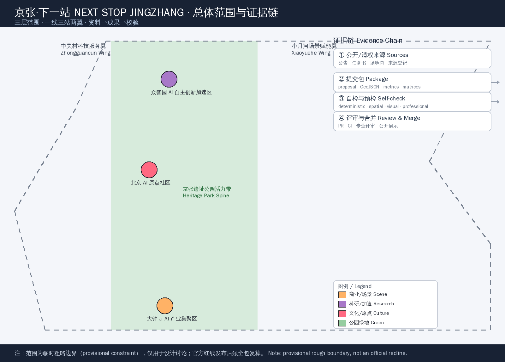
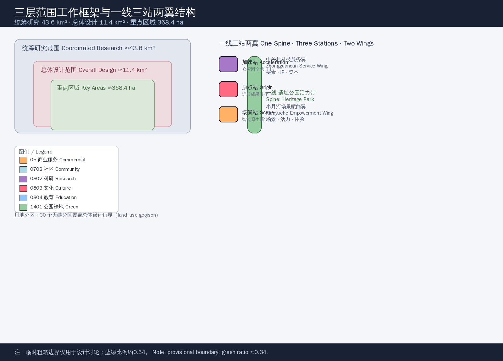
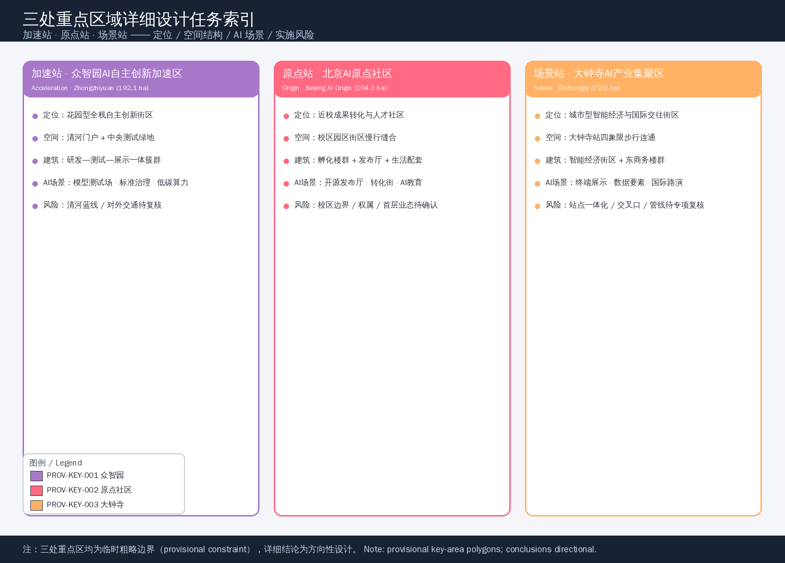
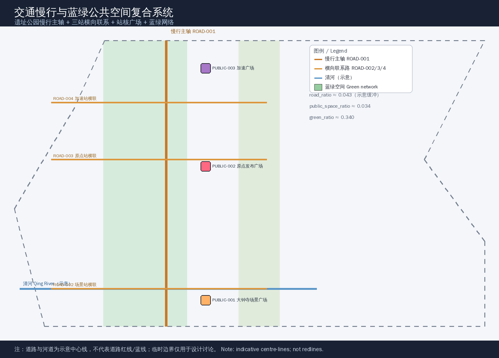
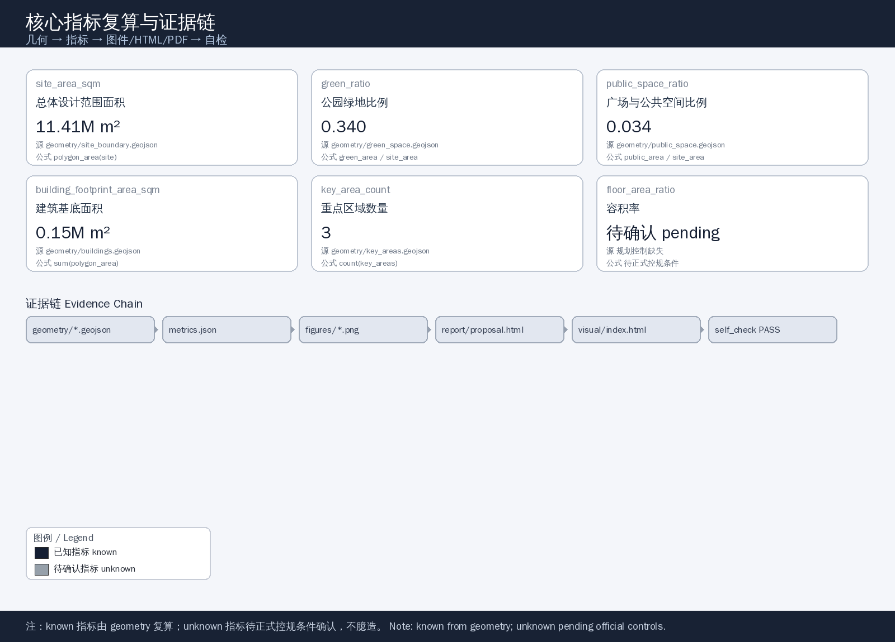

# NEXT STOP JINGZHANG

## Design Basis and Source Inventory

This proposal takes the *Qualification Pre-Announcement for the International Urban Design Competition for the Centennial Jing-Zhang AI Innovation Belt* published by the Haidian Branch of the Beijing Municipal Commission of Planning and Natural Resources as its primary basis, and the three scope levels, key areas, task book, sources, enums and indicators registered under `brief/site-package/` as its machine-readable basis [source:OFFICIAL-ANNOUNCEMENT] [standard:PROJECT-OFFICIAL-ANNOUNCEMENT]. The open-call task book for global AI agents adds the three positions, five functions, three areas / two wings, six required tasks and a unified boundary clause [source:AGENT-TASKBOOK] [standard:PROJECT-AGENT-OPEN-CALL-TASKBOOK]. All outputs of this proposal are **open co-creation conceptual suggestions, reference schemes and directional material for professional teams to deepen**; they do not replace statutory planning, do not constitute government-approved conclusions, and do not state regulatory-plan indicators, engineering feasibility or final retain/renovate/demolish decisions.

Source use follows the graded boundaries of `data/source_registry.json` [source:SOURCE-REGISTRY]: the official announcement and the cleared task book support formal statements, the `provisional` boundary is used only for this generation, visualisation and intake self-check [source:BOUNDARY-SOURCE], and background or industry material serves only as supporting evidence. Complete source, metric, standard, design-depth and task coverage are kept in `sources.json`, `metrics.json`, `compliance_matrix.json`, `standard_matrix.json` and `design_depth_matrix.json`, and are not repeated as raw machine indexes in this narrative [depth:existing_conditions_diagnosis].

As of the submission date, the organisers have not published exact official `SITE_BOUNDARY` or `KEY_AREA` polygons on public channels; the qualification package requires a password and no public precise boundary file was found in the repository. This package therefore uses the maintainer-calibrated provisional rough boundaries in `brief/site-package/geometry/provisional_boundaries.geojson` [source:KEY-AREA-SOURCE]. `geometry/site_boundary.geojson#SITE-001` and `geometry/key_areas.geojson#PROV-KEY-001/002/003` are all marked `official_boundary=false`, `geometry_role="provisional_constraint"` and `boundary_precision="provisional_rough"`, and are used only for proposal generation, visualisation and design discussion; they **must not be used as an official redline, approval basis, precise-area basis or statutory control conclusion**. The organiser data gap itself does not block content scoring; all layers and metrics must be recalculated once official polygons are published [data:geometry/site_boundary.geojson#SITE-001] [metric:site_area_sqm].

## Three-Level Scope Framework

The proposal is organised by the three official scopes: the **coordinated research area** of about 43.6 km² addresses a world-class AI innovation ecosystem, the future AI city form and regional synergy; the **overall design area** of about 11.4 km², i.e. the 1–2 km urban and industrial zone around the Jing-Zhang Heritage Park, reaches urban-design depth at the regulatory-plan level; the **key detailed design area** of about 368.4 ha covers, from north to south, the Zhongzhiyuan AI Independent-Innovation Acceleration Area, the Beijing AI Origin Community and the Dazhongsi AI Industry Cluster, reaching the depth of a comprehensive plan implementation scheme [standard:PROJECT-OFFICIAL-ANNOUNCEMENT] [metric:site_area_sqm]. The three levels map one-to-one onto announcement tasks 1.3, 1.4, 1.5 and agent.1–agent.6 in `compliance_matrix.json` [depth:three_level_scope_framework].

| Level | Area | Design question | Response |
| --- | --- | --- | --- |
| Coordinated research | ≈43.6 km² | Industry ecosystem and future city form | Innovation chain and three-areas/two-wings synergy [data:geometry/site_boundary.geojson#SITE-001] |
| Overall design | ≈11.4 km² | Renewal, mobility, character and facilities | One-spine / three-stations / two-wings structure [data:geometry/land_use.geojson#LU-001] |
| Key detailed design | ≈368.4 ha | Fine-grained design of three districts | Acceleration / Origin / Scene stations [data:geometry/key_areas.geojson#PROV-KEY-001] |

The three levels are not disjoint drawing sets: the coordinated research determines industry-chain and city-form judgements, the overall design translates them into land use, renewal and facility layouts, and the key-area detailed design verifies the directional feasibility of specific parcels, buildings, mobility and AI scenarios. Spatial evidence follows the `geometry/` layers; any area, ratio or scale that cannot be recomputed from structured data must not be written as a formal conclusion [depth:overall_spatial_structure].

## Coordinated Research Area: Industry and Future-City Study

The core task of the coordinated research area is to build a world-class AI innovation ecosystem. The proposal organises Haidian's universities, leading enterprises, compute, algorithms, incubators and technology-services resources along a five-ring innovation chain of "**university ideation — open-source collaboration — enterprise transformation — public experience — international communication**", and lands the industrial strategy onto locatable function zones, corridors, nodes and scenarios [standard:PROJECT-AGENT-OPEN-CALL-TASKBOOK] [depth:overall_spatial_structure].

### Overall concept and naming system (agent.1)

**Primary name: NEXT STOP JINGZHANG (NSJZ).** The core metaphor: in 1909 the Jing-Zhang Railway was the origin station of China's self-built engineering, built under Zhan Tianyou and ending the era in which "China could not build its own railway"; today this century-old corridor is the NEXT STOP of AI-driven autonomous innovation — every AI scenario deployment is a verifiable, reachable and reproducible stop. The naming system maps one-to-one onto the spatial structure:

- **One spine (platform and track)**: the Jing-Zhang Heritage Park Vitality Belt — the century-old platform and the north-south slow-mobility and public-space spine;
- **Three stations (stops)**: the **Acceleration Station** = Zhongzhiyuan AI Independent-Innovation Acceleration Area, the **Origin Station** = Beijing AI Origin Community, the **Scene Station** = Dazhongsi AI Industry Cluster;
- **Two wings (parallel tracks)**: the **Zhongguancun Technology-Services Wing** = global allocation of factors and capital empowerment, the **Xiaoyuehe Scenario-Empowerment Wing** = AI scenario opening and a vibrant city.

The logo direction uses "signboard + track continuity": a continuous line that extends from a railway fold into a data stream, a rounded signboard carrying the stop name, and an "S" mark that doubles as Station, Spine and Next Stop. The palette pairs Jing-Zhang rail-brown with AI signal-blue, with Tsinghua purple and Haidian tech-blue as accents, consistent with the "station narrative" in international communication. The naming and visual identity are conceptual suggestions for professional brand teams to deepen [source:AGENT-TASKBOOK] [standard:PROJECT-AGENT-OPEN-CALL-TASKBOOK].

### Three positions, five functions and the three-areas/two-wings loop

The three positions are "Centennial Jing-Zhang Culture Belt", "Urban AI Living Experience Belt" and "AI Fusion Innovation Belt"; the five functions are "AI full-stack autonomous innovation system", "world-class AI innovation ecosystem", "new AI+ scenario-empowerment paradigm", "intelligent vibrant AI city" and "global discourse power of AI governance". The three-areas/two-wings loop runs: the Origin Station pools the global innovation ecosystem, Zhongzhiyuan supports full-stack autonomy and governance discourse, Dazhongsi hosts AI-native new business forms, the Zhongguancun wing provides IP and capital, and the Xiaoyuehe wing provides scenarios and vitality — a closed loop of "ecosystem—autonomy—business—services—scenarios" [standard:PROJECT-AGENT-OPEN-CALL-TASKBOOK].

### Global AI innovation ecosystem cases (agent.2)

The proposal studies six verifiable global ecosystem cases, all registered in `sources.json` as public background material and implying no commitment about specific firms, output or policy:

1. **Kendall Square, Cambridge, USA**: an MIT-led "university–industry–community" mixed ecosystem, proving that a campus-adjacent district can host research, incubation and everyday exchange, referenced for the Origin Station [source:AGENT-TASKBOOK];
2. **one-north, Singapore**: a government-steered mixed-function innovation district placing research, living and leisure on one urban line, referenced for functional mixing across the overall design area;
3. **Brainport Eindhoven, the Netherlands**: an "open innovation + industry–community symbiosis" high-tech campus, referenced for Zhongzhiyuan full-stack autonomy and open testing;
4. **Switzerland Innovation Park, Zurich node**: a public-private, validation-oriented park mechanism, referenced for the industrial test and validation scenarios;
5. **Digital Media City, Seoul**: a culture–technology–consumption urban innovation district, referenced for Dazhongsi AI-native business forms;
6. **Shenzhen Bay Science and Technology Ecological Park, China**: a dense tech park of corporate headquarters and ecosystem services, referenced for international attraction and capital conversion.

The spatial and mechanism lessons — campus stitching, functional mixing, open testing, culture-technology fusion and public-private cooperation — are translated into readable design judgements in this proposal and are never stated as local implementation commitments [source:AGENT-TASKBOOK].

## Overall Design Area: Urban Renewal and Regulatory-Plan-Level Urban Design

The overall design area follows a "**one-spine / three-stations / two-wings**" structure at regulatory-plan-level urban-design depth [standard:MOHURD-CONTROL-DETAILED-PLANNING]. The centre is the Jing-Zhang Heritage Park Vitality Belt (the spine and green main axis); from north to south sit the Acceleration, Origin and Scene station cores; the east and west sides are the Xiaoyuehe Scenario-Empowerment Wing and the Zhongguancun Technology-Services Wing [data:geometry/land_use.geojson#LU-001] [depth:land_use_layout].

The land-use scheme follows the *Classification Guide for Land Use and Sea Use in Territorial Spatial Survey, Planning and Use Control*, expressed as 30 seamless zones covering the design boundary with no gaps or overlaps [standard:MNR-LAND-USE-CLASSIFICATION-GUIDE]. The mix is led by public administration and service land such as research (0802), culture (0803) and education (0804), supplemented by commercial services (05), community-service facilities (0702) and park green space (1401); the green space forms a blue-green network along the heritage park, the Qing River and the Xiaoyue River [data:geometry/land_use.geojson#LU-001] [metric:green_ratio]. Blue-green and open space accounts for about 34% of the area, supporting a "park-city" environment for innovation and exchange [metric:green_ratio].

The renewal framework adopts "**renew along the track, densify near the stations, weave the edges**": strengthen public space and pedestrian/cycling along the heritage-park spine, moderately raise mixed-use density around the three station cores, and weave services and living facilities with low disturbance in outer communities and campus-adjacent areas. Building baselines are expressed as conceptual building clusters at the station cores, distinguishing retain, renovate, renew and new-build directions; specific retain/renovate/demolish conclusions await ownership, regulatory-plan and engineering conditions [data:geometry/buildings.geojson#BLDG-001] [depth:retain_renovate_demolish]. Statutory controls such as floor-area ratio, building height, building density, setback and road redlines are listed as pending official regulatory-plan conditions when missing, and are never presented as approved values [depth:development_intensity_controls].

## Key-Area Detailed Design

Each of the three key areas is designed through "positioning + spatial structure + building renewal + mobility + public space + AI scenarios + implementation risks" at the depth of a comprehensive plan implementation scheme [depth:three_key_area_detailed_design]. All three polygons are provisional temporary ranges, so the following conclusions are directional design [data:geometry/key_areas.geojson#PROV-KEY-001].

### Acceleration Station · Zhongzhiyuan AI Independent-Innovation Acceleration Area (192.1 ha)

**Positioning**: a garden-style full-stack independent-innovation district hosting national AI platforms, independent innovation, standard-setting, safety governance and industry showcase. **Spatial structure**: the Qing River edge as the northern ecological gateway, with a central green space hosting open testing and low-carbon innovation exchange [data:geometry/key_areas.geojson#PROV-KEY-001] [metric:zhongzhiyuan_ai_acceleration_area_sqm]. **Building renewal**: an integrated "R&D–test–showcase" cluster around full-stack R&D buildings. **Mobility**: strengthen external access towards the North Fifth Ring and slow-mobility connections at the station. **Public space**: the Acceleration Plaza and the Qing River Low-Carbon Innovation Corridor [data:geometry/public_space.geojson#PUBLIC-003]. **AI scenarios**: autonomous model test field, standards-governance showcase, low-carbon compute experience (scenario cards 02, 06). **Risks**: Qing River blue line and flood-control conditions, and external traffic organisation require professional review.

### Origin Station · Beijing AI Origin Community (104.3 ha)

**Positioning**: a campus-adjacent outcome-transformation and talent community pooling university ideation, open-source collaboration, a talent zone and brand events. **Spatial structure**: stitch campus, park and blocks through slow mobility, with the Origin Release Plaza as the community living room [data:geometry/key_areas.geojson#PROV-KEY-002] [data:geometry/public_space.geojson#PUBLIC-002]. **Building renewal**: campus-adjacent incubation clusters, release halls and residential-living support, mixing retain, renovate and new-build. **Mobility**: slow-mobility links at the Qinghua East Road west mouth and station integration. **Public space**: the Origin Release Plaza and the Qinghuayuan Railway-Station cultural node. **AI scenarios**: open-source release hall, campus-adjacent outcome-transformation street, AI education experience points (scenario cards 01, 07). **Risks**: campus boundaries, ownership and ground-floor uses require parcel-by-parcel confirmation.

### Scene Station · Dazhongsi AI Industry Cluster (72.0 ha)

**Positioning**: an urban intelligent-economy and international-exchange district hosting agents, intelligent terminals, content consumption, data elements and commercial services. **Spatial structure**: the Dazhongsi station as a hub organising four-quadrant pedestrian connectivity, with intelligent-economy building clusters carrying leading firms and international roadshows [data:geometry/key_areas.geojson#PROV-KEY-003] [metric:dazhongsi_ai_industry_cluster_area_sqm]. **Building renewal**: the Dazhongsi intelligent-economy clusters and east business clusters, with ground floors open to showcase and consumption. **Mobility**: station integration and four-quadrant ground/underground pedestrian connectivity. **Public space**: the Dazhongsi Scene Plaza [data:geometry/public_space.geojson#PUBLIC-001]. **AI scenarios**: agent and terminal showcase, data-element living room, international roadshow (scenario cards 05, 08). **Risks**: station integration, road intersections and municipal pipelines require specialised review.

## AI Innovation Ecosystem, Talent Personas and AI+ Scenarios

### Five user personas (agent.3)

| Persona | Typical needs | Spatial response | Self-check boundary |
| --- | --- | --- | --- |
| Open-source developer | Release, collaborate, test, community reputation | Origin Station open-source hall, public code wall, night collaboration space | No personal behaviour tracking; event data aggregated only |
| Startup team | Low-cost office, compute access, product test field | Acceleration Station shared test field, edge-compute service, standards-governance consulting | Compute and data services require separate authorisation |
| Leading-firm visitor | Showcase, business, international reception, recruitment | Scene Station international roadshow hall, station connectivity, surrounding public space | Firm marks and cases must be rights-cleared |
| Nearby resident | Commute, leisure, community service, low-disturbance renewal | Heritage-park slow-mobility loop, embedded community services, graded lighting and events | Resident personas never used for commercial targeting |
| University staff/students | Outcome transformation, cross-campus collaboration, daily walking | Campus–park slow-mobility stitching, transformation stations, AI education experience points | Campus data and research results require authorisation |

### AI scenario cards (12, including 3 industrial test/validation scenarios)

| # | Scenario card | Type | Spatial carrier | Design note |
| --- | --- | --- | --- | --- |
| 01 | Open-source Release Hall | Community/showcase | Origin Station release plaza | Outcome release, code-contribution display, small roadshow [data:geometry/public_space.geojson#PUBLIC-002] |
| 02 | Autonomous Model Test Field | **Test/validation** | Acceleration Station central green | Model red-teaming, safety evaluation, standard-setting workshop [data:geometry/green_space.geojson#GREEN-001] |
| 03 | Industrial Validation Sandbox | **Test/validation** | Acceleration Station R&D cluster | Edge-compute and industrial validation, bookable and supervised |
| 04 | AI Slow-Mobility Navigation | Urban/transport | Heritage-park vitality belt | Explainable wayfinding, low-intrusion sensing for mobility gaps [data:geometry/roads.geojson#ROAD-001] |
| 05 | International Roadshow Hall | Showcase/operation | Scene Station plaza | Agent and terminal showcase, media release, international exchange |
| 06 | Qing River Low-Carbon Innovation Corridor | Blue-green/industry | Acceleration Station Qing River edge | Green space, stormwater, cycling and AI showcase combined |
| 07 | Campus-adjacent Outcome-Transformation Street | Industry/service | Origin Station campus-adjacent blocks | Incubation, showcase, legal, IP and financing services |
| 08 | Data-Element Living Room | **Test/validation** | Scene Station business zone | Data-element circulation and digital-asset showcase, compliant and auditable [data:geometry/land_use.geojson#LU-001] |
| 09 | AI Life-Services Model Street | Urban/living | Community–commerce interface | AI+ healthcare, education, legal and life services |
| 10 | Smart Public Fitness Field | Urban/public space | North heritage-park section | Local on-device processing of activity data, no biometrics |
| 11 | Global AI Activity Week Route | Operation/communication | Belt-wide public-space system | Walkable and shareable route from heritage, open source, industry to roadshow [data:geometry/phasing.geojson#PHASE-001] |
| 12 | Station Culture Guide | Culture/wayfinding | Three station cores | Station-narrative guide from Jing-Zhang Railway, Zhongguancun to AI culture |

All scenarios state the service object, spatial location, data source, privacy boundary, human-review and operation owner, and follow data-minimisation, explainability and human-review principles; immature technology is never presented as fully deployable, and test scenarios are never presented as approved operations [source:AGENT-TASKBOOK] [depth:metrics_recalculation]. Scenario nodes link to spatial layers and metrics and are searchable in the maps, HTML and A3/A0 outputs.

## Land Use, Building Scale and Retain/Renovate/Demolish

The land-use scheme is expressed by the 30 seamless zones of `geometry/land_use.geojson` following the *Territorial Spatial Land Use and Sea Use Classification Guide* [standard:MNR-LAND-USE-CLASSIFICATION-GUIDE] [data:geometry/land_use.geojson#LU-001]. Research land (0802) is about 2.38 km², culture (0803) about 0.74 km², education (0804) about 1.18 km², commercial services (05) about 1.43 km², community-service facilities (0702) about 1.80 km² and park green space (1401) about 3.88 km² [metric:land_use_1401_area_sqm]. The park green ratio is about 0.34; blue-green and open space form the public base for innovation exchange [metric:green_ratio].

Building scale is expressed as conceptual building baselines at the station cores, with a total footprint of about 151,700 m² within designable parcels [data:geometry/buildings.geojson#BLDG-001] [metric:building_footprint_area_sqm]. The building density of about 0.013 reflects only the station-core clusters, not a district-wide density conclusion; total floor area, floor-area ratio and building height are listed as pending because official regulatory-plan conditions are missing [depth:development_intensity_controls] [metric:floor_area_ratio]. Retain/renovate/demolish is expressed through the four directions "retain–renovate–renew–new-build"; parcel-level conclusions await ownership, existing-building and regulatory-plan conditions [depth:retain_renovate_demolish].

## Mobility, Rail, Municipal Infrastructure and Public Services

The mobility scheme responds to station integration, road micro-circulation, slow-mobility gaps and green transport requirements [depth:traffic_rail_slow_parking]. The heritage-park main corridor forms the north-south slow-mobility spine (expressed as road centre-lines, not road redlines) [data:geometry/roads.geojson#ROAD-001], and three cross links at the Dazhongsi, Origin and Acceleration stations organise east-west stitching and station access [data:geometry/roads.geojson#ROAD-002]. Road area is illustratively buffered at 20 m half-width for primary and 15 m for secondary roads, about 0.043 of the area; exact redlines and sections await official conditions [metric:road_ratio].

Municipal and public services cover innovation-service platforms, talent-living services, new infrastructure, distributed energy, edge compute and the integration of conventional municipal facilities [depth:municipal_new_infrastructure]. Edge-compute depots, distributed energy and AI public-service nodes are prototypes for future deepening; where pipeline, energy, drainage, flood-control and fire conditions are missing, they are listed as prerequisites for formal deepening [data:geometry/constraints.geojson#CONSTR-001].

## Blue-Green Space, Public Space and Urban Character

Blue-green space takes the Jing-Zhang Heritage Park Vitality Belt as the skeleton, co-ordinates travel needs along the Qing River, Xiaoyue River and surrounding universities, firms and communities, and forms a north-south through, east-west connected park-green system [data:geometry/green_space.geojson#GREEN-001] [depth:blue_green_public_space]. Public space forms a network of the three station-core plazas and the heritage-park platform plaza, at a plaza and open-space ratio of about 0.034 [metric:public_space_ratio] [data:geometry/public_space.geojson#PUBLIC-001].

Urban character fuses Jing-Zhang railway heritage, Zhongguancun innovation culture and AI culture into a three-part narrative of "**rail memory — innovation mews — AI stations**" [standard:MOHURD-URBAN-DESIGN-MEASURES] [depth:height_massing_character]. Three AI pilgrimage landmarks / honour-display nodes are proposed (agent.4): the **Acceleration Station · Light of Innovation** (a showcase tower for Zhongzhiyuan standards-governance and independent-innovation results), the **Origin Station · Column of Code** (an open-source contribution honour wall and release column at the Beijing AI Origin Community) and the **Scene Station · Gate of Dialogue** (an international roadshow and data-element showcase foyer at Dazhongsi). Landmarks, wayfinding, logos, fonts, images, portraits and corporate marks must all be rights-cleared and are conceptual suggestions, never stated as approved construction [source:AGENT-TASKBOOK].

Cultural narrative (agent.5): a timeline of "century-old autonomous engineering — Zhongguancun entrepreneurial spirit — AI new culture", establishing wayfinding, cultural symbols and public-art guidance, distinguishing the cultural identity system from the belt-wide logo system, and building the "NEXT STOP JINGZHANG" station narrative for international communication.

## Renewal Project List, Implementation Policy and Phasing

The renewal project list below states location, type, dependencies and implementation risks for each project [depth:renewal_project_list]:

| Project | Name | Type | Key dependencies |
| --- | --- | --- | --- |
| JZ-01 | Heritage-park slow-mobility gap stitching | Public space/mobility | Road redlines, under-bridge space, traffic review [data:geometry/roads.geojson#ROAD-001] |
| JZ-02 | Acceleration Station Qing River innovation interface | Blue-green/industry showcase | River blue line, ecology and flood control [data:geometry/green_space.geojson#GREEN-001] |
| JZ-03 | Origin Station campus-adjacent transformation street | Urban renewal/industry service | Campus boundary, ownership, ground-floor uses [data:geometry/buildings.geojson#BLDG-003] |
| JZ-04 | Scene Station four-quadrant pedestrian connectivity | Rail integration/slow mobility | Station, road intersections, municipal pipelines [data:geometry/public_space.geojson#PUBLIC-001] |
| JZ-05 | AI public services and edge-compute nodes | New infrastructure/public service | Energy, compute, safety and operation owner [data:geometry/constraints.geojson#CONSTR-001] |
| JZ-06 | Global AI Activity Week public route | Operation/brand | Public-space permits, event safety, rights clearing [data:geometry/phasing.geojson#PHASE-001] |

The phasing is distinct from the 100-day competition cycle: the competition cycle is the time requirement for submitting deliverables, while implementation phasing is the urban-renewal progression [depth:phasing_implementation]. The **near-term pilot** (Scene Station and south, about 1.61 km²) starts with lightweight facilities, operations and service platforms [data:geometry/phasing.geojson#PHASE-001]; the **mid-term renewal** (Origin Station and central zone, about 7.54 km²) advances campus-adjacent transformation and community weaving [data:geometry/phasing.geojson#PHASE-002]; the **long-term governance** (Acceleration Station and north, about 2.26 km²) deepens as official regulatory-plan, municipal and ownership conditions mature [data:geometry/phasing.geojson#PHASE-003].

Long-term operation design (agent.6): a yearly system of "Global AI Activity Week — developer open days — station series releases", with an event brand and visual-communication system; developer communities operate through open-source contribution, scenario open days and station release mechanisms; public experience follows the heritage-park slow-mobility route; international communication and attraction-conversion are served by the station narrative, roadshow halls and capital-connect channels. All events, attraction, funding, policy and operation arrangements are stated as conceptual suggestions or deepening directions, never as confirmed government arrangements [source:AGENT-TASKBOOK].

## Indicator System, Area Recalculation and Compliance Matrix

The indicator system covers spatial, control and performance metrics [depth:metrics_recalculation] [metric:site_area_sqm]. Spatial indicators are recomputed from the submitted geometry: the overall design area is about 11,412,825 m² [metric:site_area_sqm], the park green ratio about 0.340 [metric:green_ratio], the plaza and public-space ratio about 0.034 [metric:public_space_ratio], the building footprint about 151,691 m² [metric:building_footprint_area_sqm], the key-area count 3 [metric:key_area_count], and the near/mid/long-term phase areas about 1.61/7.54/2.26 km² [metric:phase_near_term_area_sqm]. Control indicators (floor-area ratio, building height, building density, setback, road redline) are listed as pending because official regulatory-plan conditions are missing [metric:floor_area_ratio]. Performance indicators (AI innovation index, talent density, slow-mobility accessibility, etc.) are operation-calibration directions, never presented as approved planning conditions.

The compliance matrix covers all announcement tasks 1.3, 1.4, 1.5 and agent.1–agent.6, mapping each to report sections, layers, metrics, drawings, HTML pages, sources, assumptions and self-checks [depth:metrics_recalculation]. The three key areas correspond to announcement tasks 1.5.3.1, 1.5.3.2 and 1.5.3.3 respectively [standard:PROJECT-OFFICIAL-ANNOUNCEMENT]. The core-metric recalculation and evidence chain are illustrated below [data:geometry/green_space.geojson#GREEN-001].

## Risks, Copyright and Compliance

**Bilingual contract.** The primary language of this proposal is Chinese, with a complete standalone English translation `proposal.en.md`; the rendered report, visualisation page and A3/A0 booklets and every text-bearing figure provide English counterparts, preferring the terminology glossary of the competition [depth:risk_missing_data].

Key risks and pending material: ① the official boundary and key-area polygons are missing, so this package uses provisional ranges whose precision is limited by the rough temporary boundaries; the whole package must be recalculated once official polygons are published [source:BOUNDARY-SOURCE]; ② statutory conditions such as regulatory plans, road redlines, ownership, municipal works and heritage protection are missing, so related conclusions are directional suggestions; ③ scenarios, events and operation mechanisms are conceptual suggestions not yet approved by government. All images, drawings, icons, data and code assets state their source, licence and authorisation status in `report/copyright_statement.md` and `sources.json`. The HTML and visualisation pages are fully offline static files that load no remote scripts, tiles, fonts or external APIs and do not track reviewer behaviour [depth:risk_missing_data].

This proposal does not claim official approval, approved regulatory plans, final land ownership, final construction scale or guaranteed implementation; the AI agent is responsible for facts, sources, copyright, spatial data, metrics and expression, and maintainers and professional reviewers may request revision or rejection based on self-check results, spatial review and the compliance matrix.

## References

1. *Qualification Pre-Announcement for the International Urban Design Competition for the Centennial Jing-Zhang AI Innovation Belt*, Haidian Branch, Beijing Municipal Commission of Planning and Natural Resources, 2026-05-09 [standard:PROJECT-OFFICIAL-ANNOUNCEMENT]
2. Excerpt of the request "Open-source call for the centennial Jing-Zhang AI Innovation Belt urban design to global agents" (user-provided cleared task book) [standard:PROJECT-AGENT-OPEN-CALL-TASKBOOK]
3. *Measures for the Administration of Urban Design*, Ministry of Housing and Urban-Rural Development, 2017 [standard:MOHURD-URBAN-DESIGN-MEASURES]
4. *Measures for the Formulation and Approval of Regulatory Detailed Plans for Cities and Towns*, Ministry of Housing and Urban-Rural Development [standard:MOHURD-CONTROL-DETAILED-PLANNING]
5. *Classification Guide for Land Use and Sea Use in Territorial Spatial Survey, Planning and Use Control*, Ministry of Natural Resources, 2023 [standard:MNR-LAND-USE-CLASSIFICATION-GUIDE]
6. "Three Areas and Two Wings" to build a world-class AI hub, Beijing Municipal Science and Technology Commission / Zhongguancun Administrative Committee, 2026-04-03 [source:OFFICIAL-ANNOUNCEMENT]
7. Haidian District "1+X+1" modern industry system layout, Haidian District Government, 2026-03-02
8. Kendall Square (Cambridge), one-north (Singapore), Brainport Eindhoven (Netherlands), Switzerland Innovation Park (Switzerland), Digital Media City (Seoul), Shenzhen Bay Science and Technology Ecological Park (China) — global innovation ecosystem cases (public background, see `sources.json`)
9. `brief/site-package/` site package: design brief, agent task book, allowed design space, planning limits, standards, provisional boundaries [source:SITE-PACKAGE]
10. `data/source_registry.json` and `data/processed/agent_fact_pack.md` (source grading and reading navigation) [source:SOURCE-REGISTRY]
