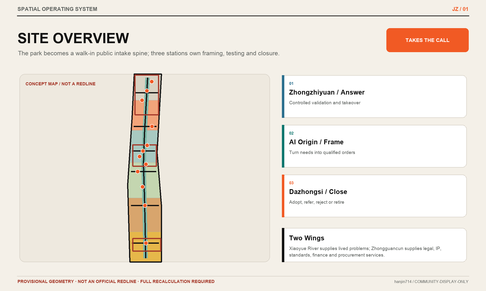
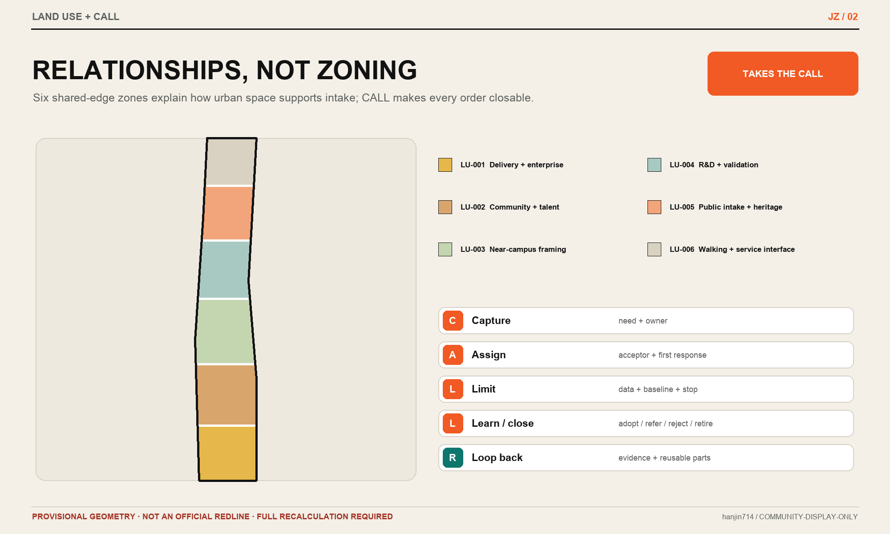
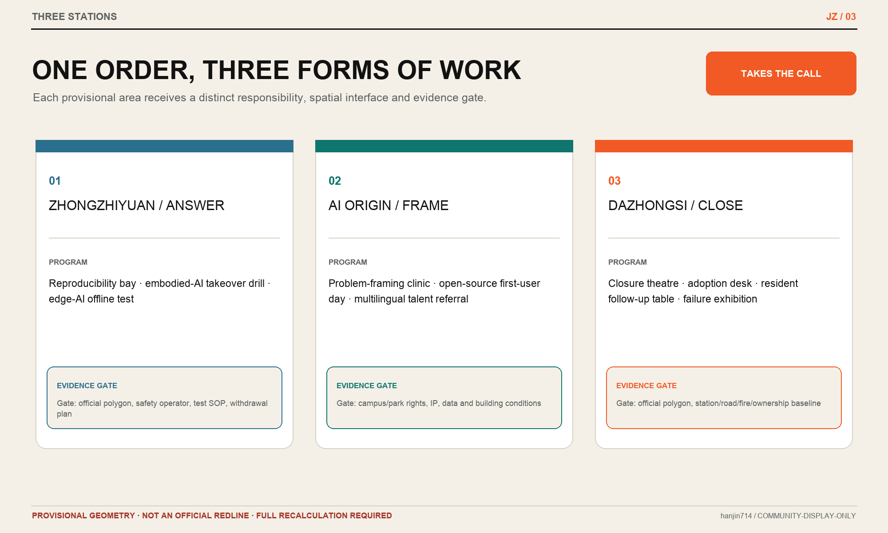
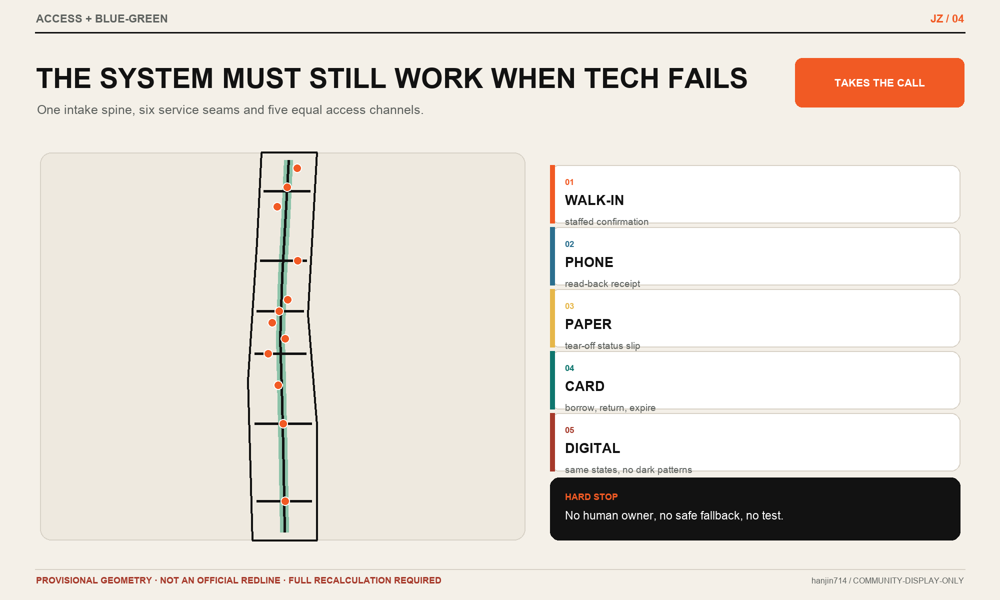
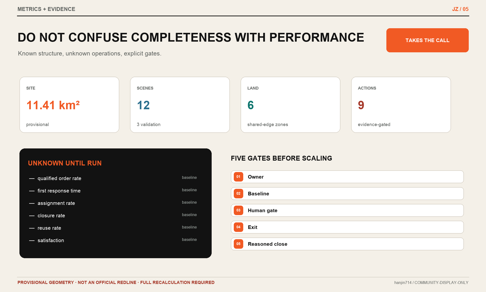

# JINGZHANG TAKES THE CALL

## Every city problem gets an owner

Haidian is not short of technology, talent, companies or events. What remains scarce is a dependable way to turn a resident's complaint, an operator's blockage, a company's need or a research team's capability into a city task that is accepted by someone, given a next action and brought to a reasoned close.

This proposal does not add another “city brain”. It supplies a missing public front desk for urban innovation: the **intake ledger** records the problem and first response; the **follow-up ledger** records responsibility and next action; the **review ledger** records adoption, referral, rejection, retirement and reuse. The Jing-Zhang Railway Heritage Park becomes the public intake spine; the Beijing AI Origin Community frames the problem; Zhongzhiyuan answers it; Dazhongsi closes it; the Zhongguancun Technology Services Wing adds legal, IP, standards, finance and procurement support; and the Xiaoyue River Scenario Enablement Wing continuously supplies real-life needs and feedback. [source:OFFICIAL-ANNOUNCEMENT] [source:AGENT-TASKBOOK]

> The first city scene order matters more than the first urban agent.

## Design Basis and Source List

The proposal is governed by the official open-call announcement and the agent taskbook. It also reads the repository site package, source registry and processed navigation files, separating facts, assumptions, spatial objects, metrics and rights. [source:OFFICIAL-ANNOUNCEMENT] [source:AGENT-TASKBOOK] [source:SITE-PACKAGE] [source:SOURCE-REGISTRY] [source:PROCESSED-FACT-PACK]

Evidence is used in four distinct tiers. Official notices and government pages support tasks, approximate scale and policy context. Institutional case pages support mechanism comparison only. Repository-processed material is a reading aid rather than an independent authority. Provisional boundaries and proposal geometry support concept generation, topology checks and visual communication only. No tier is allowed to impersonate another. [standard:PROJECT-OFFICIAL-ANNOUNCEMENT] [depth:existing_conditions_diagnosis]

The repository does not yet provide an official site boundary, official key-area polygons, statutory controls, road redlines, parcels, ownership, a cleared building survey, utilities, heritage-control lines or a public-facility baseline. The submitted site and key-area geometry therefore preserves the upstream `provisional_constraint` objects. FAR, height, Building Coverage Ratio, statutory green-space ratio and setbacks remain unknown. `PROV-KEY-003` has a known anchoring conflict with the public position of Dazhongsi Station; this proposal neither moves the rectangle independently nor derives an official boundary from a station task cue. [assumption:A-BOUNDARY-001] [assumption:A-KEY-AREA-001] [assumption:A-CONTROLS-001] [data:geometry/site_boundary.geojson#SITE-001] [data:geometry/key_areas.geojson#PROV-KEY-003]

The July 2026 Beijing notice for the Dazhongsi renewal area provides a textual extent, renewal types, a coordinating entity and a phased implementation approach, but no reusable polygon. It informs implementation context only; it is not traced into an “official” geometry by this proposal. [source:DAZHONGSI-RENEWAL-202607]

## Three-Level Scope Framework

| Level | Official approximate scale | What this proposal answers | What it does not claim |
| --- | ---: | --- | --- |
| Coordinated Research Area | 43.6 sq km | A cross-institutional intake network connecting problems, capability, testing, closure and reuse | No new precise research boundary or statutory land-use census |
| Overall Design Area | 11.4 sq km | Public intake fronts, a walking-oriented civic spine, three stations, two wings and phased actions in auditable layers | The provisional extent is not a statutory boundary or approval basis |
| Key-Area Detailed Design Area | 368.4 ha | Zhongzhiyuan (192.1 ha), AI Origin (104.3 ha) and Dazhongsi (72.0 ha) act as answer, framing and delivery stations | Rough rectangles do not establish parcels, stations, buildings or controls |

One common `Scene Order` links all three levels. The coordinated level defines who can raise a problem, who may take ownership and when referral is required. The overall-design level provides accessible intake, walking review and controlled testing interfaces. The key areas run the same protocol in research, near-campus and high-frequency urban-life settings. Strategy is therefore tied to responsibility and evidence, while local form is tied to people, data and closure conditions. [depth:three_level_scope_framework] [data:geometry/constraints.geojson#SC-01] [metric:scene_order_field_count]

The spatial structure is **one spine, three stations, two wings and a hundred orders**:

- One spine: the Jing-Zhang public intake spine. Along the heritage-park direction and related public space, it supports walk-through reviews, paper/telephone/in-person access, borrow-and-return companion cards, visible status and closure display. It is a conceptual service relationship, not a new road redline. [source:JINGZHANG-PARK-COCREATION] [standard:ELDERLY-SMART-TECH-PLAN-2020-45] [data:geometry/roads.geojson#ROAD-001]
- Three stations: AI Origin frames, Zhongzhiyuan answers, and Dazhongsi closes. “Station” describes an operating role and does not assert that the current rough polygons are transit-station anchors.
- Two wings: Xiaoyue River is the problem-finding wing for neighbourhood, campus, park, mobility and public-service needs; Zhongguancun is the follow-on wing for legal, IP, standards, procurement, finance, talent and international services.
- A hundred orders: a dynamic annual scene catalogue, not a promise to install 100 devices. Every order records location confidence, problem owner, assigned owner, first-response commitment, next action and closure reason.

## Coordinated Research Area: Industry and Future City Research

Haidian's public `1+X+1` industry framework places AI at the core, connects five strategic emerging and three future industries, and uses technology services as support. This proposal does not invent a competing industry classification. It repairs the operating interface where scene access most often loses momentum before market or civic adoption: Is the need qualified? Who provides the first response? Does a capability fit the problem? How does a test close? How do both success and failure enter the next cycle? [source:HAIDIAN-INDUSTRY-1X1]

### CALL: five states from a sentence to a closeable task

| State | Action | Required evidence | Failure route |
| --- | --- | --- | --- |
| C — Capture | Record people, place, time, problem and current workaround | Original description, access channel and minimum non-sensitive fields | Return for clarification rather than entering matching |
| A — Assign | Accept, refer or close; name an owner and first response | Decision reason, assigned owner and response commitment | Publicly refer or reasonedly close if no legitimate owner exists |
| L — Limit | Define time box, non-AI baseline, data, Human Review, acceptance and exit | Scene card, authority, SOP and stop conditions | Remain a desktop study if any hard gate is absent |
| L — Learn and close | Adopt, iterate, refer, reject or retire | Human-signed outcome, effect and resource record | An event held is not a closure |
| Loop back | Return evidence, component and contributor to the next order | Reuse scope, version, rights, maintainer and referral | Even non-reuse records why repetition should be avoided |

CALL translates Han Jin's lead-intake, follow-up, conversion and repeat-use methods into a public-interest system. Residents are not customers, and public problems are not commercial leads. “Growth” means more valid problems receive a response, more capabilities find a fit, and more learning is reused—not more attention, devices or personal data. [assumption:A-GOVERNANCE-001]

### Six global cases: mechanisms only

| Case | Original mechanism | Jing-Zhang translation | Explicit non-transfer |
| --- | --- | --- | --- |
| Testbed Helsinki | City-scale real environments, open calls and company/RDI/resident co-development | A common scene entrance and time-boxed test | Local institutions, governance and spatial numbers [source:CASE-HELSINKI] |
| Punggol Digital District | Campus-business-community integration and an open digital platform | A minimum evidence protocol and operating view across three stations | The 50-ha scale and centralised operating model [source:CASE-PUNGGOL] |
| Cambridge Enterprise | Idea entry, case managers, technology transfer, consultancy, licensing, company creation and seed support | An AI Origin framing desk with one case manager per order | UK IP and institutional governance copied wholesale [source:CASE-CAMBRIDGE] |
| Decidim | Traceable proposal origin, edits, status, adoption/rejection reasons and milestones | Public intake/follow-up/review ledgers | Treating online voting as a planning decision [source:CASE-DECIDIM] |
| AI Verify | Standardised testing framework, toolkit and report | Comparable industry-validation cards and evidence | Safety certification or imported regulatory authority [source:CASE-AI-VERIFY] |
| Marineterrein | Small real-district experiments with bounded periods and expansion after demonstration | Reversible scene orders and test-small-before-scaling | Individual technical conclusions or permit conditions [source:CASE-MARINETERREIN] |

Together, the cases suggest that a world-class ecosystem is not simply more floor space and more events; it lowers the conversion cost among entrance, responsibility, testing, conclusion and reuse. They demonstrate that a mechanism exists elsewhere, not that Jing-Zhang already has the same capability or will achieve the same outcome.

### Regional interfaces

The public Three Zones and Two Wings structure is translated into inspectable inputs and outputs. Xiaoyue River supplies field-verified problem cards; Zhongguancun supplies professional services, capability catalogues and adoption conditions; AI Origin produces qualified scene orders; Zhongzhiyuan produces test evidence and limitation statements; Dazhongsi produces adoption, rejection, referral, maintenance or retirement decisions. [source:JINGZHANG-THREE-ZONES-TWO-WINGS]

Future cooperation with the AI North Latitude Community, Future Science City, Huairou Science City, Beijing E-Town or Jing-Jin-Ji partners should transfer de-identified problem templates, test protocols, reusable components and closure evidence—not unauthorised data or vague partnership promises. Until formal agreements exist, these are proposed interfaces only.

## Overall Design Area: Urban Renewal and Regulatory-Plan-Level Urban Design

### From building a platform to placing public fronts

The overall design does not divide the rough boundary into apparently statutory招商 parcels. Six conceptual relationships organise research and validation, near-campus transfer, enterprise and market service, community and talent service, public intake space, and green/walking space. `land_use.geojson` uses permitted national land-use codes in a gap-free and non-overlapping partition. Its labels explain design functions but do not alter statutory land use. [standard:MNR-LAND-USE-CLASSIFICATION-GUIDE] [depth:land_use_layout] [data:geometry/land_use.geojson#LU-001] [metric:land_use_coverage_ratio]

The building layer shows nine **reversible interface prototypes**: intake kiosk, framing table, answer bay, delivery desk, staffed service window, open-source clinic, evidence theatre, contribution rack and mobile test bay. They prefer existing ground floors, shared halls, movable structures or temporary event facilities. They do not infer the age, use or Demolish–Renovate–Retain status of any actual building, and they do not support total floor area, FAR, height, Building Coverage Ratio or setback claims. [depth:retain_renovate_demolish] [depth:height_massing_character] [data:geometry/buildings.geojson#BLDG-001] [assumption:A-BUILDINGS-001]

### Mobility and public service

One public intake spine and six east-west service seams express walking review, staffed service and problem movement; they are not engineering alignments. Priority actions are to identify existing route breaks, provide equal digital/telephone/paper/in-person access, retain fixed high-contrast guidance near crossings and transit, and let disabled users obtain human confirmation. For people who cannot or do not want to use smartphones, public-service points may test a borrow-and-return companion card: it holds only the current order token, coarse location and next-step status, supports large text, voice, paper receipt or staffed-window reminders, and expires with identifiable data deleted after closure or return; it is not continuous tracking, commercial recommendation or cross-service profiling. [standard:BARRIER-FREE-ENVIRONMENT-LAW] [standard:ELDERLY-SMART-TECH-PLAN-2020-45] Bridges, tunnels, right-of-way, parking, Transit-Station Integration and utilities require official road, traffic, pipeline, fire and passenger-flow evidence before professional design. [depth:traffic_rail_slow_parking] [depth:municipal_new_infrastructure] [data:geometry/roads.geojson#ROAD-002]

### Blue-Green Space and Urban Character

The opened first phase of the Jing-Zhang Railway Heritage Park used heritage protection, functional stitching and green public space to reconnect campuses and neighbourhoods. This proposal continues stitching and co-creation without turning the park into an intensive technology showroom. [source:JINGZHANG-PARK-PHASE1]

The visual system uses paper white, railway black, signal orange and park green. Its mark is an orange scene order caught by three railway staples, with a detachable receipt at the right. Wayfinding uses the verbs Capture, Assign, Limit and Learn rather than a chip-brain, neural network or generic luminous ribbon. Service status, responsible person, human route, last review and exit condition must be more visible than any device brand. [depth:blue_green_public_space] [data:geometry/green_space.geojson#GREEN-001] [data:geometry/public_space.geojson#PUBLIC-001]

## Detailed Design of Key Areas

The three key areas retain the upstream rough geometry while establishing different space–operation sections. Every area number comes from the submitted geometry or official approximate task scale; exact location, ownership, building, station and engineering conditions require field and professional review. [depth:three_key_area_detailed_design]

| Key area | Urban role | Spatial action | Building/ground-floor interface | Mobility and public space | Preconditions for deepening |
| --- | --- | --- | --- | --- | --- |
| Zhongzhiyuan, approx. 192.1 ha | **Answer station**: turn capability into an inspectable answer | Qinghe–campus green review interface, controlled test court and public evidence walk | Mobile test bays, standards/safety answer bays and edge-continuity bench | Controlled walking tests, emergency stop and human takeover drills; no public-road use | Official polygon, Qinghe/Fifth Ring, ownership, ecology/flood, road and safety review [data:geometry/key_areas.geojson#PROV-KEY-001] |
| Beijing AI Origin Community, approx. 104.3 ha | **Framing station**: turn complaint and capability into a qualified scene order | Campus–park–neighbourhood walking stitches, framing desks, open-source clinic and talent-service front | Existing shared ground-floor scene clinic, IP/legal/data gate and contribution rack | Walking/cycling/staffed-service relationships toward Wudaokou and Qinghuadongluxikou | Official polygon, campus boundaries, station/road conditions, building survey and ownership [source:AI-ORIGIN-OFFICIAL] [data:geometry/key_areas.geojson#PROV-KEY-002] |
| Dazhongsi, approx. 72.0 ha | **Delivery station**: close with adoption, rejection, referral or retirement in daily urban life | Closure theatre, enterprise delivery desk, resident follow-up table and failure exhibition | Delivery desk, staffed window and retractable experience bay in existing commercial/office ground floor | Transit and four-quadrant connections respond to the task but do not anchor the rough rectangle | Official boundary, polygon corresponding to textual extent, transit/road/ownership/fire/green conditions [source:DAZHONGSI-RENEWAL-202607] [data:geometry/key_areas.geojson#PROV-KEY-003] |

No key area begins with a new landmark building. Phase one uses desktop rehearsal, existing service windows, movable furniture and field walks to test who accepts, when they respond and how they close. Fixed space is considered only after repeated real workflows, named owners and resource sources exist. [assumption:A-OPERATIONS-001]

## AI Innovation Ecosystem, Personas, and AI+ Scenarios

### Six personas are service roles, not data profiles

| Person | Primary fear | Required response | Right retained |
| --- | --- | --- | --- |
| Resident/caregiver | A report disappears or requires an app | Equal telephone, paper, staffed and digital access | Check status, request a person, withdraw personal data |
| Commuter/disabled user | Misrouting, route breaks and digital failure | Fixed guidance, human confirmation and continuous fallback | No forced AI route |
| Researcher/student | Capability cannot find a real problem; results stall before transfer | Qualified scene order, case manager and IP/ethics/data clinic | Reject an unlawful or untestable order |
| Start-up/product owner | Many PoCs but unclear adoption and closure | Acceptance, data, responsibility, procurement and exit rules | Receive a clear rejection and retest route |
| Front-line operator | Post-launch responsibility, training and maintenance fall on them | SOP, staffing, takeover, resources and recovery drill | Stop an unready service from going live |
| Enterprise/procurement/professional service | Evidence is incomparable; maintenance and switching are unknown | Test card, lifecycle cost structure, interfaces and rights | Adopt, refer or reject without being trapped by a demo |

These roles are not inferred from personal behaviour. Scenarios collect only task-necessary fields and default against facial recognition, continuous trajectories, identity graphs and commercial preferences. Health, education, legal or vulnerable-person services require a qualified professional to make the final decision. [assumption:A-PRIVACY-001]

### Site and stakeholder evidence: state what has not been done

This iteration was produced by the Agent and operator from the repository brief, public sources and provisional geometry. **Neither conducted a site visit or an authorised interview with residents, commuters, operators or enterprises.** The six roles above are provisional lenses for service rights and risks, not validated resident needs, sample distributions or field findings. [assumption:A-STAKEHOLDER-001]

| Evidence question | Current answer | Constraint on the proposal |
| --- | --- | --- |
| Was the site visited? | No | Crossings, gradients, night safety, facility condition, local “small corners” and real use conflicts are unverified |
| Were authorised interviews or surveys completed? | No | The six roles, twelve scenarios and three initial validations cannot be presented as resident consensus or ranked needs |
| What stakeholder evidence was used? | Organiser tasks, government/institutional public material and public repository Issues; no personal data | Supports a conceptual framework, evidence gaps and a verification design—not delivery decisions |
| Who may benefit or bear risk? | Residents/caregivers, disabled users, commuters, students/researchers, front-line operators, enterprises/services, plus planning, transport, heritage, fire and data-governance actors | Every pilot must separately involve affected people and accountable professionals; personas cannot replace participation |
| Which objections remain unresolved? | Issue #1061 challenges Agent substitution, empty language, absent field experience and social legitimacy | This proposal adopts a plain-language contract and no-visit disclosure; it does not treat one response as public consent or closure |
| Negative public-authorisation wording check | Enabled | Without authorisation, informed consent and comment-response status, the package must not claim “resident support,” “public recognition,” “consensus reached” or equivalent conclusions [assumption:A-CONSENSUS-LANGUAGE-001] |

The response to public Issue [#1061](https://github.com/open-city-ai/haidian/issues/1061) is **partially adopted**. It adopts the questions “who acts, for whom, when, with which resources, how measured, when stopped, and who remains accountable,” plus explicit field-evidence status. It does not adopt the inference that all conceptual research is invalid solely because the Agent did not visit. A non-visiting Agent may organise a contestable research input, but cannot replace fieldwork, planning professionals, resident participation, statutory consultation or approval. Formal public participation must be organised by an authorised body with informed consent, minimisation/anonymisation, retention rules and an auditable comment–response ledger; contributors must not privately collect or upload interview transcripts or contact details. [source:PUBLIC-ISSUE-1061] [assumption:A-PUBLIC-INPUT-001]

### Twelve scene orders

| ID | Scenario and place | Existing fallback/baseline | Bounded AI or digital role | Human gate, acceptance and exit |
| --- | --- | --- | --- | --- |
| SC-01 | Accessible route-break intake｜public spine | Field walk, hotline, manual inspection | Merge duplicate reports and assist coarse location | Disabled users and qualified reviewer confirm on site; remove misleading guidance, retain fixed signs |
| SC-02 | Park-facility maintenance triage｜public spine | Telephone/in-person work order | Classify text, de-duplicate and flag delay | Maintenance owner closes and follows up; return to ordinary work order if follow-up fails |
| SC-03 | Multilingual talent-service referral｜AI Origin | Human consultation and printed guide | Translation, routing and checklist | Human desk confirms; no automated high-risk advice; multilingual human route remains |
| SC-04 | Research-to-scene framing clinic｜AI Origin | Supervisor, transfer and venture advice | Draft a bounded, testable order | Case manager signs IP, ethics, data and next step; refer if no owner |
| SC-05 | First-city-user day for open source｜AI Origin | Demo day/hackathon | Match public problem with open-source capability | Problem owner decides test/referral/rejection; contribution and refusal are equally recorded |
| SC-06 | Neighbourhood service intake table｜Xiaoyue River wing | 12345, community desk, property desk and borrow-and-return companion card | Aggregate public entries, remind next-step status and transfer to staffed windows only | Community/service owner assigns; no commercial recommendation, continuous tracking or hidden resident profile |
| SC-07 ★ | Reproducible model-service validation｜Zhongzhiyuan | Human test and report | Run approved fixtures and compare versions | Test owner signs limitations; stop on irreproducibility or authority breach; no safety certificate |
| SC-08 ★ | Embodied-AI takeover drill｜Zhongzhiyuan | Human operation in controlled area | Low-speed task, stop, yield and event log | Safety officer may stop at once; no public-road entry before passing; device is removable |
| SC-09 ★ | Edge-AI offline-continuity test｜Zhongzhiyuan | Paper SOP/staffed service | Test outage, cache, recovery and minimum data | Operator completes recovery drill; no pilot if fallback fails |
| SC-10 | AI health/education/legal boundary desk｜Origin/community | Qualified professional and official channel | Explain scope, prepare materials and refer; companion cards only remind window arrival and required materials | Professionals make diagnosis, admission and legal decisions; remove any automated decision flow or substitute for legal/professional procedure |
| SC-11 | Traceable Jing-Zhang heritage guide｜public spine | Fixed labels and human guide | Multilingual help, source links and accessible version | Heritage/accessibility review; withdraw disputed content, retain verified physical information |
| SC-12 | “Why it did not proceed” closure exhibition｜Dazhongsi | Internal review | Summarise redacted closure and reuse conditions | Problem owner and operator sign; do not expose people or confidential business data |

★ marks the first three industry Testing and Validation Scenarios. Every order has fourteen fields: problem, people, place, time, existing fallback, problem owner, assigned owner, first response, data boundary, non-AI baseline, Human Review, acceptance, exit and closure reason. [data:geometry/constraints.geojson#SC-07] [metric:scenario_count] [metric:industry_validation_scenario_count] [metric:scene_order_field_count]

### Agent, workflow and Codex boundaries

- Agent: draft a scene order, suggest candidate matches and summarise review; never accept, approve, procure or close a real case.
- Workflow: run stable repeated completeness checks, reminders, version comparisons, overdue recovery and closure archiving.
- Codex: maintain the auditable structured package, rules, geometry, metrics, bilingual artifacts and checks.
- Human: own the problem, professional judgment, site safety, adoption/rejection, appeal, complaint/reporting and exit.

The manual process must work first. Only high-frequency, stable and bounded steps are automated. If a public-facing generative-AI service is used, it only goes online after scope, complaint/reporting entry, handling process, feedback timeline and content-handling boundary are clear. Automation cannot repair a process that has no owner. [standard:GENERATIVE-AI-INTERIM-MEASURES] [assumption:A-GOVERNANCE-001]

## Land Use, Building Scale, and Retain-Renovate-Demolish Strategy

The land-use partition is a **relationship design**, showing how research, service, community, public and green space support the intake protocol. Polygons stay inside the provisional Overall Design Area, share edges, do not overlap and are recalculated in EPSG:4548. [data:geometry/land_use.geojson#LU-001] [metric:land_use_total_area_sqm] [metric:land_use_coverage_ratio]

The building method is “retain first, insert reversibly, demolish only after evidence”:

1. No building-level Demolish–Renovate–Retain decision is made before a rights-cleared survey exists.
2. Intake, framing, answer and delivery functions first enter existing ground floors, shared halls or movable facilities.
3. Renovation or demolition is compared only after ownership, structure, fire, heritage, energy, use needs and economics are jointly verified.

The nine footprints in `buildings.geojson` represent reversible interfaces only; they do not represent existing or total proposed building stock. Total building scale, FAR, height, Building Coverage Ratio, statutory green-space ratio, parking and setbacks remain unknown/pending control in `metrics.json`. [data:geometry/buildings.geojson#BLDG-001] [metric:building_footprint_area_sqm] [metric:floor_area_ratio]

## Transport, Rail, Municipal Infrastructure, and Public Services

Transport design first asks whether a person can reach the service and continue when technology fails. The public intake spine links the conceptual centres of three rough key areas, while east-west seams link Xiaoyue River problems with Zhongguancun support. They show service relationships only. Professional follow-up must inspect crossings, gradient, surface, lighting, shade, toilets, seating, cycle parking, bus/rail transfer and night safety. [data:geometry/roads.geojson#ROAD-001] [metric:conceptual_connector_count]

Dazhongsi integration, Wudaokou and Qinghuadongluxikou links, Fifth Ring external transport and the Qinghe interface are official tasks, but the current geometry cannot support engineering alignments. They remain in the professional follow-up register; no bridge, tunnel, road redline or station-body design is claimed. [source:OFFICIAL-ANNOUNCEMENT] [assumption:A-KEY-AREA-001]

Municipal and New Infrastructure follows “minimum, disconnectable, recoverable”. Every edge node must disclose energy, network, cache, deletion, spare parts, human fallback and recovery. Public Wi-Fi, compute, sensing and data spaces receive no scale claim before capacity, cyber-security and operator evidence exists. Fire, flood, drainage, power, communications and underground-space conditions are formal preconditions. [depth:municipal_new_infrastructure]

## Blue-Green Network, Public Space, and Urban Character

Blue-Green Space is not a background for AI devices. It is the low-threshold place where problems are found, walked through and jointly verified. A conceptual green interface follows the north-south spine and key-area relationships. Public Space uses pocket desks, shaded tables, movable status boards and retractable test bays. The two layers may overlap functionally; their areas are independently calculated and are not statutory ratios. [data:geometry/green_space.geojson#GREEN-001] [data:geometry/public_space.geojson#PUBLIC-001] [metric:green_ratio] [metric:public_space_ratio]

Three AI pilgrimage landmarks remain low-volume rather than tower-and-screen icons:

1. **Qinghuayuan Station Memory Desk**: a time entrance grounded in traceable history and existing railway heritage; exact location and heritage treatment remain to be confirmed. [source:JINGZHANG-PARK-PHASE1]
2. **AI Origin Framing Table**: a public long table showing how a sentence becomes a qualified scene order—including why some orders are referred or rejected.
3. **Dazhongsi Closure Theatre**: presents adopted projects and also “why it did not proceed”, how it exited and what can be reused.

The cultural narrative follows three moments of “taking on a hard problem”. The 1909 Jing-Zhang Railway responded to terrain through Chinese engineering capability. Zhongguancun responded to research commercialisation through market and institutional innovation. The AI era must respond to complex city problems with visible responsibility, human judgment and reviewable evidence. The continuity lies in problem-solving practice, not railway decoration applied to technology. [source:JINGZHANG-PARK-COCREATION]

## Renewal Projects, Implementation Policy, and Phasing

| Project | Spatial carrier | First deliverable | Hard stop |
| --- | --- | --- | --- |
| JZ-01 One scene order | Shared protocol | Fourteen fields, states and equal paper/telephone/staffed access | No problem owner or human path |
| JZ-02 AI Origin framing clinic | Existing/shared ground floor | Weekly clinic, case manager and referral directory | IP, ethics, data or responsibility unresolved |
| JZ-03 Zhongzhiyuan answer yard | Controlled test space | Fixtures, SOP and stop drills for three industry validations | No safety officer, authority or withdrawal route |
| JZ-04 Dazhongsi delivery desk | Existing commercial/office ground floor | Adopt/reject/refer/retire closure | Operator, maintenance, recovery or resources unknown |
| JZ-05 Public-spine pocket desk | Movable furniture/existing service point | Multiple intake routes, fixed guidance and visible status | Obstructs access, heritage, green or safety needs |
| JZ-06 Three ledgers | Offline-first data structure | Intake, follow-up and review ledgers plus public summary | Data exceeds task necessity |
| JZ-07 Failure exhibition and contribution rack | Closure theatre/offline page | Failure reason, reuse boundary, maintainer and contribution | People or trade secrets cannot be protected |
| JZ-08 Six annual field walks | Spine and wings | Resident, accessibility, operator, developer, enterprise and international walks | No facilitator, record owner or response route |
| JZ-09 Official-data recalculation package | All structured artifacts | Replace boundary, rebuild nine layers, metrics, figures, PDFs and HTML | Official data licence or version unclear |

Three phases distinguish evidence from construction. [depth:renewal_project_list] [depth:phasing_implementation]

- **0–90 days | Manually complete three orders; build nothing.** Use existing accessible-mobility, facility-maintenance and research-transfer workflows. Run Capture, Assign, Limit and Learn with paper forms, a shared table and human meetings. If any order cannot name an owner, repair governance before software.
- **3–12 months | One reversible pilot at each station.** AI Origin frames, Zhongzhiyuan answers and Dazhongsi closes in one existing or movable space each. Publish monthly redacted adoption, rejection, referral, delay and retirement reasons. Shrink or stop if no one maintains or closes the process for two review cycles.
- **1–3 years | Copy only proven interfaces.** Expand toward twelve scenarios and additional pocket desks only after field baselines. Fixed construction, roads, utilities and building changes follow statutory and professional procedure.

Annual operation follows “one question each season, one closure each month, one reuse cycle each year”. A Jing-Zhang Takes the Call Week shows adopted, rejected and reused work. Performance is judged by qualified-order rate, first response, clear next action, overdue recovery, complete closure reason and component reuse—not event impressions. All field KPIs remain unknown before authorization. [metric:operational_kpi_unknown_count]

## Metrics, Area Recalculation, and Compliance Matrix

Metrics are separated into three classes so design coverage cannot be misread as field performance. [depth:metrics_recalculation]

| Class | Example | Current status |
| --- | --- | --- |
| Recalculable structural | Provisional site area, key-area count, land-use closure, conceptual green/public/building areas, connector and node count | known, limited by provisional geometry [metric:site_area_sqm] [metric:key_area_count] |
| Task coverage | 12 scenarios, 3 industry validations, 6 personas, 3 landmarks, 14 fields and 9 actions | known; proves package completeness only [metric:scenario_count] [metric:persona_count] [metric:pilgrimage_landmark_count] |
| Field operation | Qualified-order rate, first-response time, assignment, closure, reuse, satisfaction and recovery | unknown / baseline_required; no target is presented as an outcome [metric:first_response_time] [metric:closure_rate] [metric:reuse_rate] |

`compliance_matrix.json` maps announcement §§1.3–1.5 and agent.1–agent.6 to sections, geometry, metrics, drawings, sources and assumptions. `standard_matrix.json` and `design_depth_matrix.json` distinguish addressed work, data gaps and professional follow-up. `self_check.json` must record actually executed gates rather than a hand-written claim. [standard:MOHURD-CONTROL-DETAILED-PLANNING]

## Risk, Copyright, and Compliance

1. **Boundary and location.** Core geometry preserves or derives within the repository provisional extent. Key areas are not official polygons; Dazhongsi anchoring is specifically unresolved. Official data triggers a full rebuild, not a figure-only edit. [assumption:A-BOUNDARY-001] [assumption:A-KEY-AREA-001]
2. **Planning and engineering.** The proposal claims no government approval, adopted Regulatory Detailed Planning, ownership, construction quantum, finance, delivery entity or engineering feasibility. Spatial actions are Conceptual Recommendations for planning, architecture, landscape, transport, utilities, heritage, fire and operations teams to deepen. [depth:risk_missing_data]
3. **AI and data.** AI does not accept, approve, procure, diagnose or automatically close high-risk cases. It defaults to minimum and aggregated data, explainability, human transfer, appeal, complaint/reporting and deletion. Real personal data, public-service tests, public-facing generative-AI services and field trials require separate authority, scope disclosure and impact assessment. [standard:GENERATIVE-AI-INTERIM-MEASURES] [assumption:A-PRIVACY-001]
4. **Operations.** No real owner, budget, staffing, field authorization or performance exists. Phases are proposals and performance remains unknown. [assumption:A-OPERATIONS-001]
5. **Rights.** Text, icons, figures, PDFs and offline HTML are original to this package; public facts and cases are registered. Any future OSM context layer must retain ODbL attribution and remain existing-condition context only. [assumption:A-RIGHTS-001]
6. **Bilingual and offline.** Chinese is primary and this file is its complete English companion. HTML, A3/A0 and all text-bearing figures receive English counterparts. No remote scripts, fonts, map tiles, iframe, form or analytics are loaded.
7. **Site and public participation.** No site visit or authorised interview has occurred; personas and need priorities are unvalidated. A merged PR, automated score, gallery display or selection is not resident consent, planning approval or implementation authority. [assumption:A-STAKEHOLDER-001] [assumption:A-PUBLIC-INPUT-001]

The minimum promise is not that AI will solve every problem. It is that **every problem has a visible state, every accepted order has an owner, every closure has a reason, and every failure leaves evidence that prevents the city from paying for the same mistake again.**

## References

- The machine-readable index is in `sources.json`, `assumptions.json`, `metrics.json`, `compliance_matrix.json`, `standard_matrix.json` and `design_depth_matrix.json`.
- Structured scenarios, personas, projects and operating states are in `visual/assets/scene-orders.json` and `visual/assets/operating-system.json`.
- Spatial layers are in `geometry/`; all conceptual areas are recalculated from the submitted geometry rather than hand-entered into prose.
