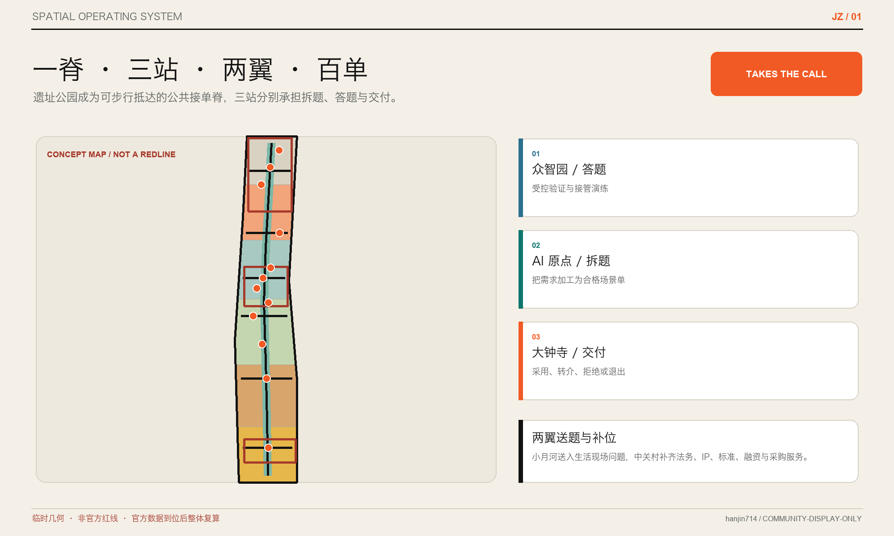
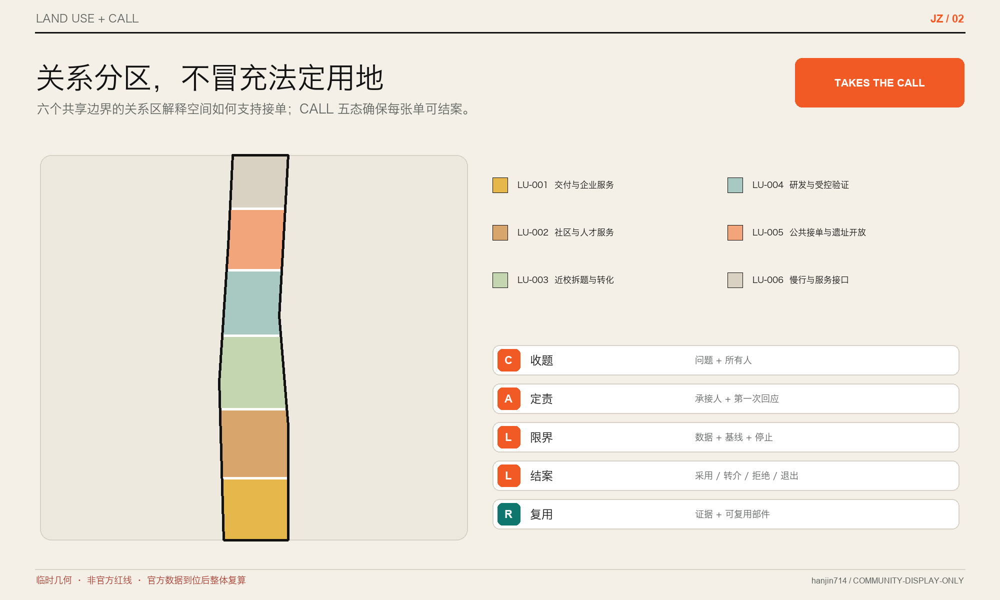
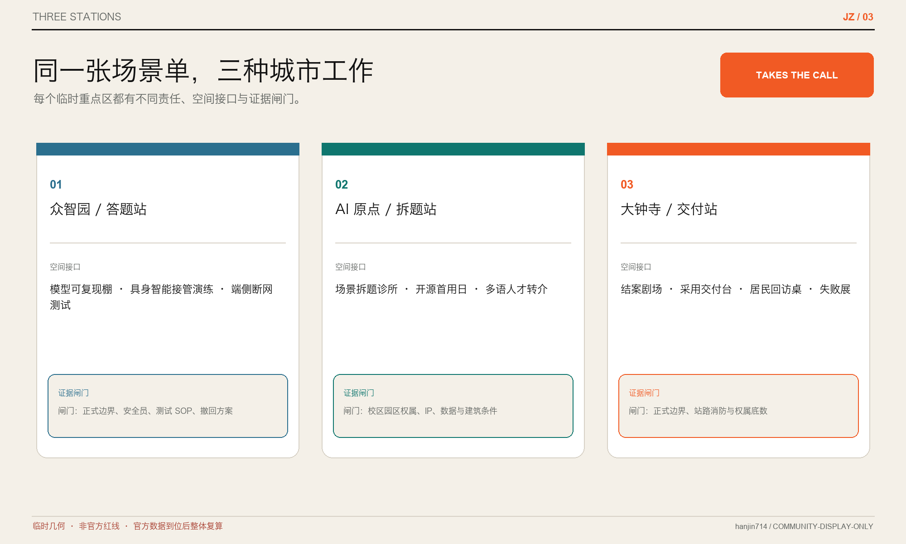
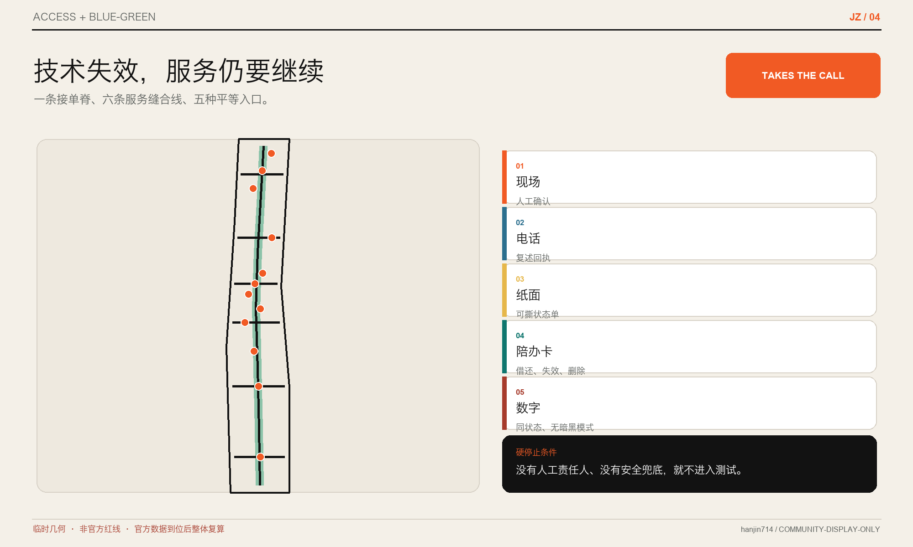
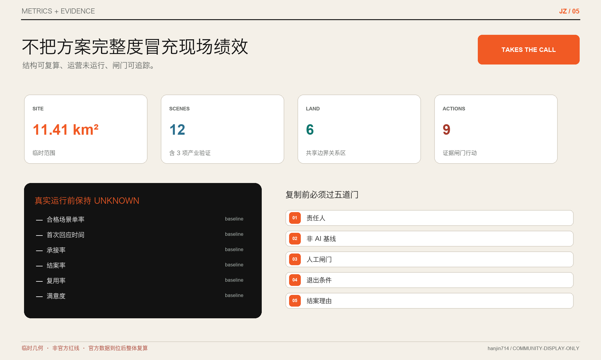

# 京张接单 JINGZHANG TAKES THE CALL

## 让每个城市问题都有承接人

海淀不缺技术、人才、企业和活动。真正稀缺的，是把居民一句抱怨、运营人员一个卡点、企业一次需求、科研团队一项能力，稳定加工成“有人接、下一步明确、最后有结论”的城市任务。

本方案不再增加一个宏大“城市大脑”，而是补上一张城市创新的公共前台：**接单账记录问题和第一次回应，跟单账记录责任与下一步，复盘账记录采用、转介、拒绝和复用。** 京张遗址公园成为任何人都能抵达的接单脊；北京 AI 原点社区负责拆题，众智园负责答题，大钟寺负责交付，中关村科技服务翼补齐法务、知识产权、融资和采购，小月河场景赋能翼持续送入生活现场的问题与反馈。[source:OFFICIAL-ANNOUNCEMENT] [source:AGENT-TASKBOOK]

> 第一张城市场景单，比第一个城市智能体重要。

## 设计依据与资料清单

方案以《百年京张 AI 创新带城市设计国际方案征集资格预审公告》和面向智能体任务书为主控依据。[source:OFFICIAL-ANNOUNCEMENT] [source:AGENT-TASKBOOK] 方案读取仓库 `brief/site-package/`、`data/source_registry.json` 和处理后的任务导航资料，分别建立事实、假设、空间、指标与版权账。[source:SITE-PACKAGE] [source:SOURCE-REGISTRY] [source:PROCESSED-FACT-PACK]

证据分四层使用：官方公告与政府公开资料支撑任务、范围约值和政策背景；机构官网只支撑国际案例的方法比较；仓库处理资料只作为阅读导航；临时边界和本方案几何只用于概念生成、拓扑校验与图件表达。不同层级不得相互冒充。[standard:PROJECT-OFFICIAL-ANNOUNCEMENT] [depth:existing_conditions_diagnosis]

仓库尚未提供 official site boundary、三处 official key-area polygons、法定控规、道路红线、地块权属、清权现状建筑、市政、文保和公共设施底数。[assumption:A-BOUNDARY-001] [assumption:A-KEY-AREA-001] [assumption:A-CONTROLS-001] 因此 `site_boundary.geojson` 与 `key_areas.geojson` 保留上游 `provisional_constraint` 原貌；FAR、高度、密度、绿地率、退线等法定管控指标保持 unknown。尤其 `PROV-KEY-003` 与公开大钟寺站位置存在已知偏移，本案不私移矩形、不以站点任务线索反推官方红线。[data:geometry/site_boundary.geojson#SITE-001] [data:geometry/key_areas.geojson#PROV-KEY-003]

北京市 2026 年 7 月公示的大钟寺更新片区给出文字四至、更新类型、实施主体和近中远期统筹机制，但没有发布可直接复用的 polygon。本方案只把它用作实施语境，不据此手绘“官方边界”。[source:DAZHONGSI-RENEWAL-202607]

## 三层范围工作框架

| 层级 | 官方约值 | 本案回答 | 不做的主张 |
| --- | ---: | --- | --- |
| 统筹研究 | 43.6 km² | 设计“问题—能力—试验—结案—复用”的跨机构承接网络 | 不绘制新的精确研究红线，不统计全域法定用地 |
| 总体设计 | 11.4 km² | 把接单前台、慢行公共脊、三站两翼和分期动作写入可复算图层 | 不把临时范围当法定红线或审批依据 |
| 重点区域 | 368.4 ha | 众智园 192.1 ha、AI 原点 104.3 ha、大钟寺 72.0 ha 分别承担答题、拆题、交付 | 不以临时矩形推定宗地、站点、建筑或控制线 |

三层由一份统一的 `Scene Order / 场景单` 连接。统筹层规定谁可以提出问题、谁能承接、何时转介；总体层安排可达的接单前台、公共走读与受控试验界面；重点片区把同一套流程放入科研、近校和高频城市生活三种环境。上层不只讲战略，下层不只画形态，每一项空间动作都必须回到人、责任、数据和结案条件。[depth:three_level_scope_framework] [data:geometry/constraints.geojson#SC-01] [metric:scene_order_field_count]

总体空间结构为“**一脊、三站、两翼、百单**”：

- 一脊：京张公共接单脊。依托遗址公园方向和关联公共空间，提供走读、纸质/电话/现场入口、可借还陪办卡、状态告知和结案展示；它是概念联系，不是新增道路红线。[source:JINGZHANG-PARK-COCREATION] [standard:ELDERLY-SMART-TECH-PLAN-2020-45] [data:geometry/roads.geojson#ROAD-001]
- 三站：原点拆题站、众智园答题站、大钟寺交付站。“站”表示运营角色，不表示临时 polygon 已精确锚定轨道站点。
- 两翼：小月河寻题翼把社区、校园、公园、交通和公共服务中的真实问题送入；中关村续单翼提供法务、IP、标准、采购、融资、人才和国际合作支持。
- 百单：可增可减的年度场景目录，不是一次建成 100 个设备。每张单都有位置置信度、问题所有者、承接人、第一次回应时限、下一步和结案理由。

## 统筹研究范围产业与未来城市研究

海淀公开的“1+X+1”产业框架以人工智能为核心，联动五大战略性新兴产业、三大未来产业，并以科技服务业支撑。本案不另造产业分类，而是补足从场景开放到市场转化之间最容易掉单的组织接口：需求是否合格、谁负责第一次回应、技术能力与问题是否匹配、试验如何结案、成功或失败怎样进入下一轮。[source:HAIDIAN-INDUSTRY-1X1]

### CALL 五态：把一句话变成一项可结案任务

| 状态 | 动作 | 必备证据 | 失败去向 |
| --- | --- | --- | --- |
| C — Capture / 收题 | 记录对象、位置、时段、痛点与当前替代 | 原始描述、接触渠道、非敏感最小字段 | 信息不足则返回补充，不进入匹配 |
| A — Assign / 定责 | 判断是否承接，指定问题所有者与第一次回应 | 承接/转介/拒绝理由、责任人、回应时限 | 无合适责任主体则公开转介或结案 |
| L — Limit / 限界 | 写清时间盒、非 AI 基线、数据、人工复核、验收和退出 | 场景卡、授权、SOP、停止条件 | 任一硬门不满足则保持桌面研究 |
| L — Learn / 结案 | 采用、迭代、转介或拒绝，公开原因与维护要求 | 人工签署结论、影响与资源记录 | 不以“办过活动”代替结案 |
| ↻ Loop back / 复用 | 把证据、组件和贡献者送回下一张单 | 可复用范围、版本、许可、维护者 | 不可复用也记录原因，防止重复踩坑 |

这个流程把韩金的“线索—承接—跟进—成交—复购”转译为公共创新，但不把居民当客户、不把公共问题商品化。增长指的是**有效问题被回应、能力被匹配、经验被复用**，而不是曝光、设备数或收集更多个人数据。[assumption:A-GOVERNANCE-001]

### 六个全球案例：只迁移机制

| 案例 | 原机制 | 京张转译 | 明确不迁移 |
| --- | --- | --- | --- |
| Testbed Helsinki | 城市真实环境、开放征集、企业/RDI/居民共创 | 一个公开场景入口和时间盒试验 | 当地制度、组织与空间数值 [source:CASE-HELSINKI] |
| Punggol Digital District | 校园、企业、社区协同与开放数字平台 | 三站之间的最小证据协议和运营视图 | 50 ha 规模与集中控制模式 [source:CASE-PUNGGOL] |
| Cambridge Enterprise | 创意入口、case manager、技术转移与咨询链 | 原点“拆题桌”和一单一责任经理 | 英国 IP 与机构治理原样复制 [source:CASE-CAMBRIDGE] |
| Decidim | 提案来源、修改、状态、采纳/拒绝原因和里程碑可追踪 | 接单账、跟单账与公开结案理由 | 把线上投票等同规划决定 [source:CASE-DECIDIM] |
| AI Verify | 标准化测试框架、工具包和报告 | 产业验证卡和可比较证据 | 合格认证或对安全的保证 [source:CASE-AI-VERIFY] |
| Marineterrein | 真实街区小试、限定周期、展示后扩展 | 可逆百单与“先小试再扩容” | 单项技术结论和许可条件 [source:CASE-MARINETERREIN] |

六例共同说明：创新生态的关键不是把所有资源塞进一个平台，而是让入口、责任、验证、结论和复用的转换成本持续下降。案例只证明机制曾被正式机构使用，不证明京张已有相同条件或必然取得相同结果。

### 区域协同接口

“三区两翼”在公开报道中承担不同功能，本案将其改写为可交接的输入输出：小月河翼送入经现场核验的问题卡；中关村翼送入专业服务、能力目录与采用条件；原点社区产出合格场景单；众智园产出测试证据和限制说明；大钟寺产出采用、拒绝、转介、维护与退出结论。[source:JINGZHANG-THREE-ZONES-TWO-WINGS]

未来若与北纬社区、未来科学城、怀柔科学城、经开区或京津冀伙伴协同，传递对象应是脱敏问题模板、测试协议、可复用组件与结案证据，而不是未经授权的数据或笼统合作承诺。没有正式协议前，区域协同保持“建议接口”状态。

## 总体设计范围城市更新与控规深度城市设计

### 空间策略：从“造平台”改为“布前台”

总体设计不把临时边界切成看似法定的招商地块，而以六类概念分区表达城市关系：科研与验证、近校转化、企业与市场服务、社区与人才服务、公共接单开放空间、绿地与慢行空间。[standard:MNR-LAND-USE-CLASSIFICATION-GUIDE] [depth:land_use_layout] `land_use.geojson` 使用仓库允许的国土空间用途代码完成无缝、无重叠拓扑剖分；名称只解释设计功能，不改变法定用地性质。[data:geometry/land_use.geojson#LU-001] [metric:land_use_coverage_ratio]

建筑图层只表达九个**可逆接口原型**：接单亭、拆题桌、答题棚、交付台、人工服务窗口、开源诊所、证据剧场、贡献架和移动测试仓。[depth:retain_renovate_demolish] [depth:height_massing_character] 它们优先进入既有首层、共享厅、可移动构筑物或临时活动设施，不推定任何现状建筑的年代、用途、保留或拆除，也不提供建筑规模、FAR、高度、密度或退线结论。[data:geometry/buildings.geojson#BLDG-001] [assumption:A-BUILDINGS-001]

### 交通、慢行与公共服务

一条公共接单脊和六条东西缝合线表达走读、人工服务和问题流动关系；它们不是工程线位。优先动作包括：识别现有慢行断点、把数字入口与电话/纸质/现场入口并置、在过街和站点周边提供固定高对比导向、为无障碍使用者保留人工确认。对不会或不愿使用智能手机的人，公共服务点可试行“可借还陪办卡/同行卡”：只绑定本次工单令牌、粗粒度位置和下一步状态，提供大字、语音、纸质回执或窗口提醒，结案或归还后失效并删除可识别信息；它不是连续定位、商业推荐或跨服务画像工具。[standard:BARRIER-FREE-ENVIRONMENT-LAW] [standard:ELDERLY-SMART-TECH-PLAN-2020-45] 任何桥隧、路权、停车、轨道一体化和市政容量建议，必须在官方道路、交通、管线、消防和客流资料到位后由专业团队深化。[depth:traffic_rail_slow_parking] [depth:municipal_new_infrastructure] [data:geometry/roads.geojson#ROAD-002]

### 蓝绿公共空间与风貌

已开放的京张铁路遗址公园一期曾通过遗迹保护、功能织补和绿色公共空间缝合周边高校与社区；本案继承“缝合”和“共创”，不把公园变成高强度科技展厅。[source:JINGZHANG-PARK-PHASE1]

公共界面采用纸白、铁路墨黑、信号橙和园林青四种主色。主标是一张被三枚铁路订书钉接住的橙色场景单，右侧保留可撕回执；导视使用“收题—定责—限界—结案”动词，不使用芯片脑、神经网络或泛科技光带。状态、责任人、人工入口、最后复审和退出条件要比设备品牌更醒目。[depth:blue_green_public_space] [data:geometry/green_space.geojson#GREEN-001] [data:geometry/public_space.geojson#PUBLIC-001]

## 重点区域详细设计

三处重点区沿用临时粗略几何，但形成不同的空间—运营剖面。所有面积只复算提交几何；位置、权属、建筑、站点和工程条件必须现场核验。[depth:three_key_area_detailed_design]

| 重点区 | 城市角色 | 空间动作 | 建筑/首层接口 | 交通与公共空间 | 进入深化的前置条件 |
| --- | --- | --- | --- | --- | --- |
| 众智园 192.1 ha（约） | **答题站：把能力变成可审查答案** | 形成清河—园区绿色走读界面、可控测试庭和公开证据廊 | 可移动测试仓、标准/安全答题棚、端侧连续性工作台 | 受控慢行测试、设备急停和人工接管演练；不进入公共道路 | 官方 polygon、清河/五环条件、权属、生态防洪、道路与安全审批 [data:geometry/key_areas.geojson#PROV-KEY-001] |
| AI 原点 104.3 ha（约） | **拆题站：把抱怨和能力加工成合格场景单** | 缝合校区—园区—街区步行关系，设置拆题桌、开源诊所与人才生活服务前台 | 既有首层共享的场景诊所、IP/法务/数据门、开源贡献架 | 五道口与清华东路西口方向的步行/骑行/人工服务关系示意 | 官方 polygon、校园边界、站点和道路条件、现状建筑与权属 [source:AI-ORIGIN-OFFICIAL] [data:geometry/key_areas.geojson#PROV-KEY-002] |
| 大钟寺 72.0 ha（约） | **交付站：在高频生活中给出采用、拒绝或退出结论** | 设置结案剧场、企业服务交付台、居民回访桌和失败展 | 既有商业/办公首层中的交付台、人工窗口和可撤回体验位 | 站区与四象限连通仅为任务响应，临时矩形不作站点锚定 | 正式边界、文字四至对应 polygon、轨道/道路/权属/消防/绿地条件 [source:DAZHONGSI-RENEWAL-202607] [data:geometry/key_areas.geojson#PROV-KEY-003] |

三处都不以建设新地标为先。第一阶段先用桌面演练、现有服务窗口、移动家具和走读验证“谁接、何时回、如何结”；只有连续完成真实流程、责任主体和资源来源明确，才讨论固定设施与空间改造。[assumption:A-OPERATIONS-001]

## AI 创新生态、人才画像与 AI+ 场景

### 六类人物：都不是数据画像

| 人物 | 最怕什么 | 需要什么 | 拥有的权利 |
| --- | --- | --- | --- |
| 周边居民/照护者 | 提了问题无人回应，被迫下载 App | 电话、纸质、现场与数字同权入口 | 查状态、要求转人工、撤回个人信息 |
| 通勤者/无障碍使用者 | 导航误导、慢行断点、数字服务失效 | 固定导向、人工确认、连续替代路径 | 不被 AI 路径强制分流 |
| 高校研究者/学生 | 能力找不到真实问题，成果卡在转化前 | 合格场景单、case manager、IP/伦理/数据问诊 | 拒绝不合规或不可验证的任务 |
| 初创团队/产品负责人 | PoC 很多，采用条件和结案规则不清 | 明确验收、数据、责任、采购和退出 | 获得清晰拒绝原因与复测路径 |
| 一线运营者/街道园区人员 | 技术上线后责任、培训和维护落到自己 | SOP、排班、人工接管、资源与恢复演练 | 有权阻止未准备服务上线 |
| 企业/采购/专业服务方 | 证据不可比、维护和供应商切换不清 | 测试卡、总成本结构、接口和权利清单 | 采用、转介或拒绝，不被概念效果绑架 |

这些是服务角色，不是通过个人数据推断的行为画像。场景只采任务必需字段，默认不采人脸、连续轨迹、身份关系或商业偏好；任何涉及健康、教育、法律或弱势群体的服务必须由相应专业人员最终判断。[assumption:A-PRIVACY-001]

### 现场与利益相关者证据：先公开没做过什么

本轮由 Agent 与操作者基于仓库公开任务、公开资料和 provisional geometry 完成，**没有实地到场，也没有开展获授权的居民、通勤者、运营者或企业访谈**。上表六类人物是为检查服务权利与风险而建立的暂定角色，不是已经验证的居民需求、样本分布或现场结论。[assumption:A-STAKEHOLDER-001]

| 证据问题 | 当前答案 | 对方案的约束 |
| --- | --- | --- |
| 是否到过现场 | 否 | 不能确认过街、坡度、夜间安全、设施状态、空间“小角落”或真实使用冲突 |
| 是否有授权访谈/问卷 | 否 | 不能声称六类人物、十二场景或三项首批验证代表居民共识或需求优先级 |
| 使用了什么利益相关者证据 | 组织方任务、政府/机构公开资料、仓库公开 Issue；不含个人资料 | 只支持概念框架、证据缺口和后续核验设计，不支持实施决策 |
| 谁可能受益或承担风险 | 居民与照护者、无障碍使用者、通勤者、学生/研究者、一线运营者、企业/服务方，以及规划、交通、文保、消防和数据治理主体 | 每项试点必须分别邀请受影响者和责任专业复核，不能用“用户画像”代替参与 |
| 尚未解决的反对意见 | Issue #1061 对 Agent 替代专业、空泛语言、缺现场经验和社会合法性的质疑仍成立 | 本案采用白话合同与未到场披露，但不把单次回应写成公众同意或问题结案 |
| 负向公众授权措辞校验 | 已启用 | 在缺少授权、知情同意和意见回应状态前，禁止把本案写成“居民支持”“公众认可”“已达成共识”或等价结论 [assumption:A-CONSENSUS-LANGUAGE-001] |

对公开意见 [#1061](https://github.com/open-city-ai/haidian/issues/1061) 的响应状态为 **部分采用**：采用“谁做、为谁、何时、用什么资源、怎样测、何时停、谁人工负责”和现场证据披露；不采用“仅因未到场就把概念研究视为无效”的推论。理由是未到场的 Agent 可以整理可质疑的研究输入，却不能替代现场调查、规划专业、居民参与、法定公示和审批。正式公众参与必须由有权组织方建立知情同意、最小化/匿名化、保留期限与“意见—回应”台账，投稿者不私自收集或上传访谈原文与联系方式。[source:PUBLIC-ISSUE-1061] [assumption:A-PUBLIC-INPUT-001]

### 十二张场景单

| ID | 场景与落点 | 当前替代/基线 | AI 或数字工具的受限作用 | 人工 Gate、验收与退出 |
| --- | --- | --- | --- | --- |
| SC-01 | 无障碍慢行断点接单｜公共脊 | 走访、热线、人工巡检 | 合并重复问题、辅助标注位置 | 无障碍使用者与专业人员现场确认；误导即下线，固定导向常驻 |
| SC-02 | 公园设施维护分诊｜公共脊 | 电话/现场报修 | 文本归类、去重和提醒超时 | 维修负责人关闭并回访；不能持续跟进则退回普通工单 |
| SC-03 | 多语人才服务转介｜原点 | 人工咨询与纸质指南 | 翻译、事项路由、材料清单 | 人工窗口确认；高风险事项不得自动答复，保留母语/人工路径 |
| SC-04 | 高校成果拆题诊所｜原点 | 导师、技术转移和创业咨询 | 把能力与问题改写为可验证任务 | case manager 签认 IP、伦理、数据和下一步；无责任方即转介 |
| SC-05 | 开源项目首个城市用户日｜原点 | 路演/黑客松 | 匹配公开问题与开源能力 | 问题所有者决定是否试验；贡献和拒绝原因同等记录 |
| SC-06 | 居民生活服务接单桌｜小月河翼 | 12345、社区窗口、物业、可借还陪办卡 | 只做公开入口汇总、下一步状态提醒和人工窗口转接 | 社区/服务方定责；不得形成商业推荐、连续定位或隐性居民画像 |
| SC-07 ★ | 模型服务可复现验证｜众智园 | 人工测试和测试报告 | 运行预先批准的测试夹具、比对版本 | 测试负责人签署限制；不可复现或越权即停止，不颁发“安全认证” |
| SC-08 ★ | 具身智能接管演练｜众智园 | 受控场地人工操作 | 低速任务、急停、让行和事件日志 | 现场安全员可随时急停；未通过不得进入公共道路，设备可撤回 |
| SC-09 ★ | 端侧 AI 断网连续性｜众智园 | 纸质 SOP/本地人工服务 | 验证断网、缓存、恢复同步和最小数据 | 运营者完成恢复演练；替代路径失败即不进入试点 |
| SC-10 | AI 医疗/教育/法律边界说明｜原点/社区 | 专业机构人工咨询与官方渠道 | 解释适用边界、材料准备和转介；陪办卡只提醒到达窗口和待办材料 | 专业人员最终判断；禁止自动诊断、录取、法律结论或替代法定/专业程序 |
| SC-11 | 京张史实可追踪导览｜公共脊 | 实体展签和人工讲解 | 多语辅助、出处链接和无障碍版本 | 文化专业人员复核；史实/版权争议即撤稿，实体说明保留 |
| SC-12 | “为什么没做”结案展｜大钟寺 | 内部复盘 | 汇总脱敏结案原因与复用条件 | 问题所有者、运营者共同签认；不得公开个人/商业秘密 |

★ 为三项首批产业测试验证场景。十二张单统一包含 14 个字段：问题、对象、位置、时段、现有替代、问题所有者、承接人、第一次回应、数据、非 AI 基线、人工复核、验收、退出、结案理由。[data:geometry/constraints.geojson#SC-07] [metric:scenario_count] 场景数量与三项产业验证、字段数量分别独立登记。[metric:industry_validation_scenario_count] [metric:scene_order_field_count]

### Agent、workflow 与 Codex 的边界

- Agent：处理临时判断，例如从公开问题中生成场景单草稿、匹配候选能力、归纳复盘；不得自行承接、审批、采购或关闭真实事项。
- workflow：处理稳定重复，例如状态提醒、材料完整性、版本比对、超时回收与结案归档。
- Codex：维护可审计的结构化包、规则、图层、指标、双语成果和自动检查。
- 人：拥有问题、责任、专业判断、现场安全、采用/拒绝、申诉、投诉举报与退出权。

先用人工流程跑通，再自动化高频且边界稳定的步骤。若使用面向公众的生成式 AI 服务，只在适用范围、投诉举报入口、处理流程、反馈时限和内容处置边界清楚后上线；自动化不能修复一个没有责任人的流程。[standard:GENERATIVE-AI-INTERIM-MEASURES] [assumption:A-GOVERNANCE-001]

## 用地、建筑规模与拆改留方案

本案的用地剖分是**关系性设计图**：科研、服务、社区、公共空间与绿地怎样支持接单流程，而不是对现状地块重新定性。所有 polygon 完整落在临时总体范围、共享边界且无重叠，面积由 EPSG:4548 复算。[data:geometry/land_use.geojson#LU-001] [metric:land_use_total_area_sqm] [metric:land_use_coverage_ratio]

建筑采取“保留优先、插入可逆、拆除待证”的三级方法：

1. 未取得清权现状建筑数据前，不给出单栋拆改留判断。
2. 优先把接单、拆题、答题和交付功能放入既有首层、共享厅或可移动设施。
3. 只有权属、结构、消防、文保、能耗、使用需求和经济性共同核实后，才进入改造或拆除比较。

`buildings.geojson` 的九个基底仅代表可逆接口原型，不代表现状或拟建总量。建筑总规模、FAR、高度、密度、绿地率、停车和退线均在 `metrics.json` 保持 unknown/pending_control。[data:geometry/buildings.geojson#BLDG-001] [metric:building_footprint_area_sqm] [metric:floor_area_ratio]

## 交通、轨道、市政与公共服务设施

交通设计先服务“能不能抵达、技术失效后能不能继续”。公共接单脊连接三处重点区的概念中心，东西缝合线连接小月河问题入口与中关村服务资源；它们只表达服务关系。现场深化需逐点核对过街、坡度、铺装、照明、遮阴、厕所、座椅、自行车停放、公交/轨道换乘和夜间安全。[data:geometry/roads.geojson#ROAD-001] [metric:conceptual_connector_count]

大钟寺站一体化、五道口与清华东路西口衔接、五环路对外交通和清河界面均来自官方任务，但当前临时几何无法支撑工程线位。相关动作只进入“待专业深化清单”，不画桥梁、隧道、道路红线或站体改造。[source:OFFICIAL-ANNOUNCEMENT] [assumption:A-KEY-AREA-001]

市政与新基建采用“最小、可断、可恢复”原则：端侧节点必须说明能源、网络、缓存、删除、备件、人工替代和故障恢复；公共 Wi-Fi、算力、感知和数据空间均不得在没有容量、网络安全与运营主体资料时给出建设规模。消防、防洪、排水、供电、通信和地下空间条件均为正式深化前置。[depth:municipal_new_infrastructure]

## 蓝绿空间、公共空间与城市风貌

蓝绿策略不是给 AI 设备找背景，而是为真实问题提供低门槛的发现、走读和共同复核场所。概念绿色空间沿南北脊与三处重点区形成连续关系，公共空间采用小尺度口袋站、遮阴桌、可移动状态板和可撤回测试位。[data:geometry/green_space.geojson#GREEN-001] [data:geometry/public_space.geojson#PUBLIC-001] 两者允许功能叠合，但各自面积独立复算，不被表述为法定绿地率或公共空间率。[metric:green_ratio] [metric:public_space_ratio]

三处 AI 朝圣节点不追求高塔和巨屏：

1. **清华园站记忆台**：以可追踪史实和既有铁路遗产为时间入口；具体位置和文保做法待核。[source:JINGZHANG-PARK-PHASE1]
2. **原点拆题桌**：一张公共长桌展示问题如何从一句话变成合格场景单，也展示被转介或拒绝的原因。
3. **大钟寺结案剧场**：既发布被采用的项目，也展示“为什么没做”、怎样退出和哪些组件可以复用。

文化叙事从三次“把难题接住”展开：1909 年京张铁路以中国工程能力回应山河难题；中关村以市场与制度创新回应科技转化难题；AI 时代则要以公开责任、人工判断和可复盘证据回应城市复杂问题。这里的连续性是“解决问题的方法”，不是把铁路符号贴到科技装置上。[source:JINGZHANG-PARK-COCREATION]

## 更新项目清单、实施政策与分期计划

| 项目 | 空间载体 | 先交付什么 | 硬停止条件 |
| --- | --- | --- | --- |
| JZ-01 一张场景单 | 全带统一模板 | 14 字段、状态枚举、纸质/电话/现场入口 | 找不到问题所有者或人工路径 |
| JZ-02 原点拆题诊所 | 既有首层/共享空间 | 每周固定问诊、case manager、转介目录 | IP、伦理、数据或责任不清 |
| JZ-03 众智园答题场 | 受控测试空间 | 三项产业验证的夹具、SOP 和停止演练 | 无现场安全员、授权或撤回方案 |
| JZ-04 大钟寺交付台 | 既有商业/办公首层 | 采用/拒绝/转介/退出四类结案 | 运营者、维护、恢复或资源不清 |
| JZ-05 公共脊口袋站 | 可移动家具/现有服务点 | 多入口接单、固定导向、状态说明 | 影响通行、文保、绿地或安全 |
| JZ-06 三本账 | 离线优先数据结构 | 接单账、跟单账、复盘账与公开摘要 | 采集超出任务必需数据 |
| JZ-07 失败展与贡献架 | 结案剧场/在线离线页面 | 失败原因、复用边界、维护者和贡献记录 | 个人/商业秘密无法脱敏 |
| JZ-08 六场年度走读 | 公共脊与两翼 | 居民、无障碍、一线运营、开发者、企业、国际访客走读 | 无主持人、记录责任和反馈处置 |
| JZ-09 官方数据复算包 | 全部结构化成果 | 边界替换、九图层、指标、图件、PDF/HTML 一键重算 | 官方数据许可或版本不清 |

实施分三段：[depth:renewal_project_list] [depth:phasing_implementation]

- **0—90 天｜先人工接三单，不建设。** 选择无障碍慢行、设施维护和高校成果转化三个既有流程，用纸表、共享表和人工会议跑完收题、定责、限界、结案。三单任一找不到承接人，即先修治理，不开发平台。
- **3—12 个月｜三站各一处可逆试点。** 原点拆题、众智园答题、大钟寺交付各用一个既有/移动空间；每月公开采用、拒绝、转介、超时与退出原因。连续两个复盘周期无人维护或无法结案，缩减或停止。
- **1—3 年｜只复制被证明的接口。** 按真实基线决定扩展至十二场景和更多口袋站；固定建设、道路、市政和建筑改造另行进入法定与专业程序。

年度运营采用“一季一问、一月一结、一年一复用”：每季公开一组问题征集，每月发布脱敏结案摘要，每年举办“京张接单周”，展示被采用、被拒绝和被复用的项目。长期指标不看活动曝光，而看合格场景单率、第一次回应、下一步明确率、超时回收率、结案理由完整率和组件复用率。[metric:operational_kpi_unknown_count]

## 指标体系、面积复算与合规矩阵

指标分三类，防止把概念覆盖误写成现场绩效：[depth:metrics_recalculation]

| 类型 | 示例 | 当前状态 |
| --- | --- | --- |
| 可复算结构指标 | 临时范围面积、重点区数量、用地闭合、概念绿地/公共空间/建筑基底、道路与场景节点数 | known，但受 provisional geometry 限制 [metric:site_area_sqm] [metric:key_area_count] |
| 任务覆盖指标 | 12 场景、3 产业验证、6 人物、3 地标、14 字段、9 项行动 | known，只证明方案完整 [metric:scenario_count] [metric:persona_count] [metric:pilgrimage_landmark_count] |
| 现场运营指标 | 合格单率、首次回应时间、承接率、结案率、复用率、满意度、恢复时间 | unknown / baseline_required，不填目标冒充成果 [metric:first_response_time] [metric:closure_rate] [metric:reuse_rate] |

`compliance_matrix.json` 把公告 1.3—1.5 与 agent.1—agent.6 映射到章节、图层、指标、图纸、来源和假设；`standard_matrix.json` 与 `design_depth_matrix.json` 区分已响应、数据缺口和专业深化；`self_check.json` 只记录实际运行的四门检查，不以手工声明替代脚本结果。[standard:MOHURD-CONTROL-DETAILED-PLANNING]

## 风险、版权与合规说明

1. **边界与位置。** 全部核心几何沿用或裁切自仓库临时范围；三处重点区不等于官方 polygon，大钟寺站关系尤其待核。官方数据发布后整体替换并重算，不能只改一张图。[assumption:A-BOUNDARY-001] [assumption:A-KEY-AREA-001]
2. **规划与工程。** 本案不声称官方批准、审定控规、土地权属、建设规模、资金、实施主体或工程可行；所有空间动作是概念建议，供规划、建筑、景观、交通、市政、文保、消防和运营团队深化。[depth:risk_missing_data]
3. **AI 与数据。** AI 不承接、不审批、不采购、不诊断、不自动关闭高风险事项；默认最小化、聚合化、可解释、可转人工、可申诉、可投诉举报、可删除。涉及真实个人数据、公共服务、面向公众的生成式 AI 服务和现场试验时须另行授权、适用范围说明与影响评估。[standard:GENERATIVE-AI-INTERIM-MEASURES] [assumption:A-PRIVACY-001]
4. **运营。** 当前没有真实承接人、预算、排班、现场授权或绩效数据；三阶段均为建议，现场指标保持 unknown。[assumption:A-OPERATIONS-001]
5. **版权。** 方案文本、图标、图件、PDF 与离线 HTML 为本次原创生成；基础事实与案例逐条登记。若使用 OSM 背景数据，将按 ODbL 署名并仅作为现状参考，不升级为官方控制资料。[assumption:A-RIGHTS-001]
6. **双语与离线。** 中文为主文本，英文伴随稿完整对应；HTML、A3/A0 与所有含文字图件均提供中英版本。离线页面不加载远程脚本、字体、地图瓦片、iframe、表单或分析追踪。
7. **现场与公众参与。** 当前未到现场、未开展授权访谈，人物与需求优先级均未验证；PR 合并、机器评分、展示或入选不等于居民同意、规划批准或实施授权。[assumption:A-STAKEHOLDER-001] [assumption:A-PUBLIC-INPUT-001]

本方案的最低承诺不是“AI 一定解决”，而是：**每个问题都有明确状态，每次承接都有责任人，每项结案都有理由，每次失败都能留下下一次少走弯路的证据。**

## 参考资料

资料不是装饰性书目，而是一条可追踪的证据链。官方公告和智能体任务书界定任务、范围层级与必交内容；北京市、海淀区政府部门公开页面仅用于解释京张遗址公园、AI 原点、大钟寺更新和产业政策背景；六个国际案例一律回到项目或机构官网，只迁移测试床、转化、参与、验证与退出机制，不外推北京本地成效。[source:OFFICIAL-ANNOUNCEMENT] [source:AGENT-TASKBOOK] [source:SOURCE-REGISTRY]

仓库提供的总体范围与重点区几何均为临时约束，其用途是生成、拓扑检查和概念讨论，不是官方红线、权属或精确面积依据。[source:BOUNDARY-SOURCE] [source:KEY-AREA-SOURCE] `sources.json` 保存完整机器索引和使用边界；`assumptions.json` 记录缺资料对结论的影响以及替换触发动作；`metrics.json` 区分可复算结构量与尚未运行的运营 KPI。三份矩阵再把每一项公告任务、专业标准和设计深度定位回正文、图层、图纸、自检与来源，避免“写到了”被误当成“证明了”。

场景、人物、项目与运行状态的结构化版本位于 `visual/assets/scene-orders.json` 与 `visual/assets/operating-system.json`。九个 GeoJSON 图层保留机器可读 ID、来源类型、置信度、用途角色和面积声明；所有概念空间面积以文件实际几何复算为准。正式边界、控规、道路、权属、现状建筑、市政或文保数据一旦发布，应整体重跑生成、渲染、校验和发布链，而不是只替换展板中的一张示意图。[depth:metrics_recalculation] [depth:risk_missing_data]
