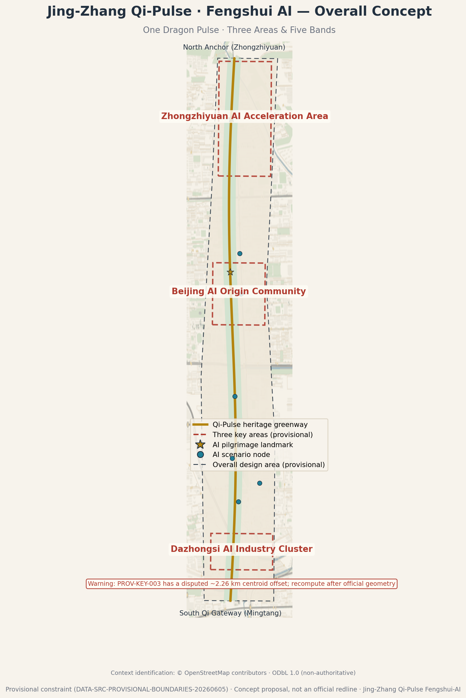
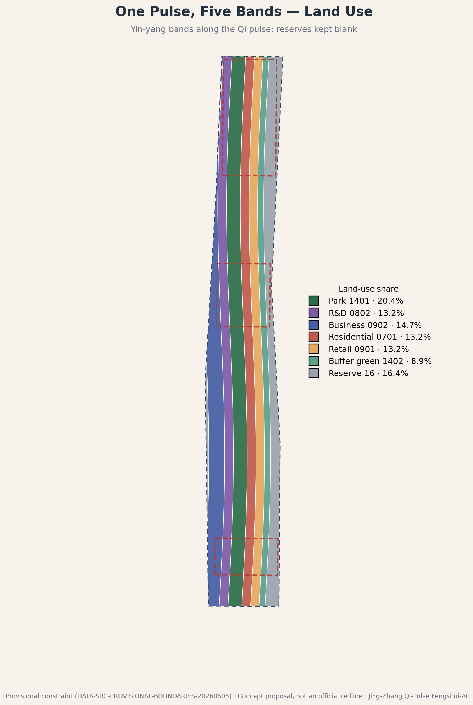
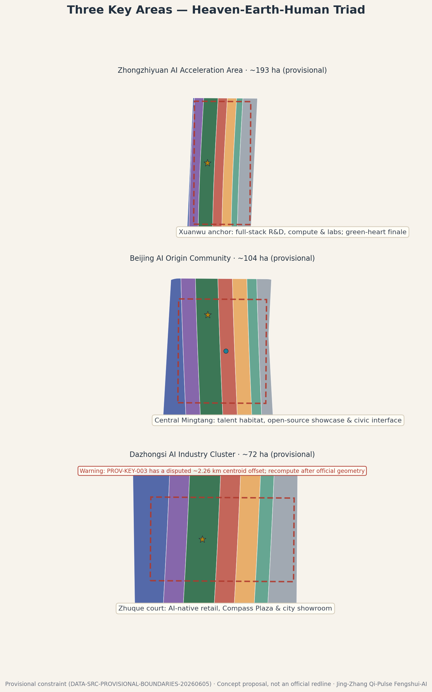
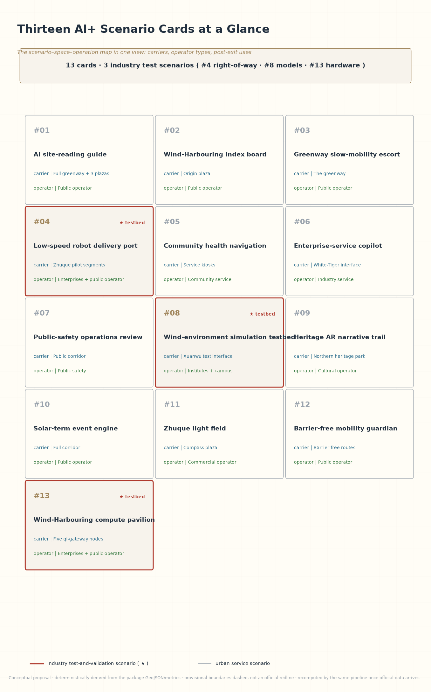
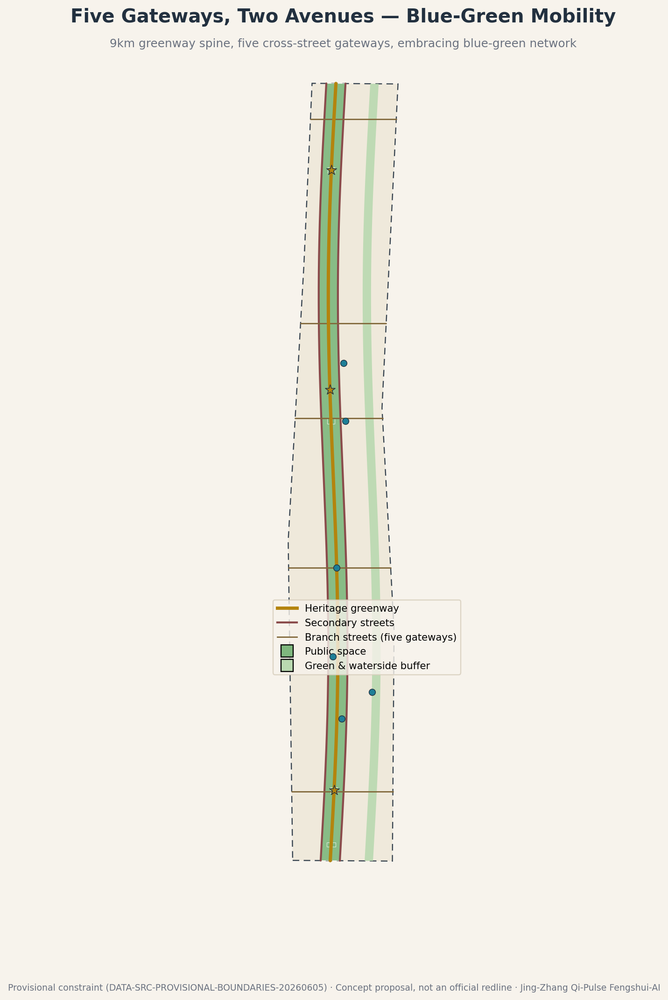
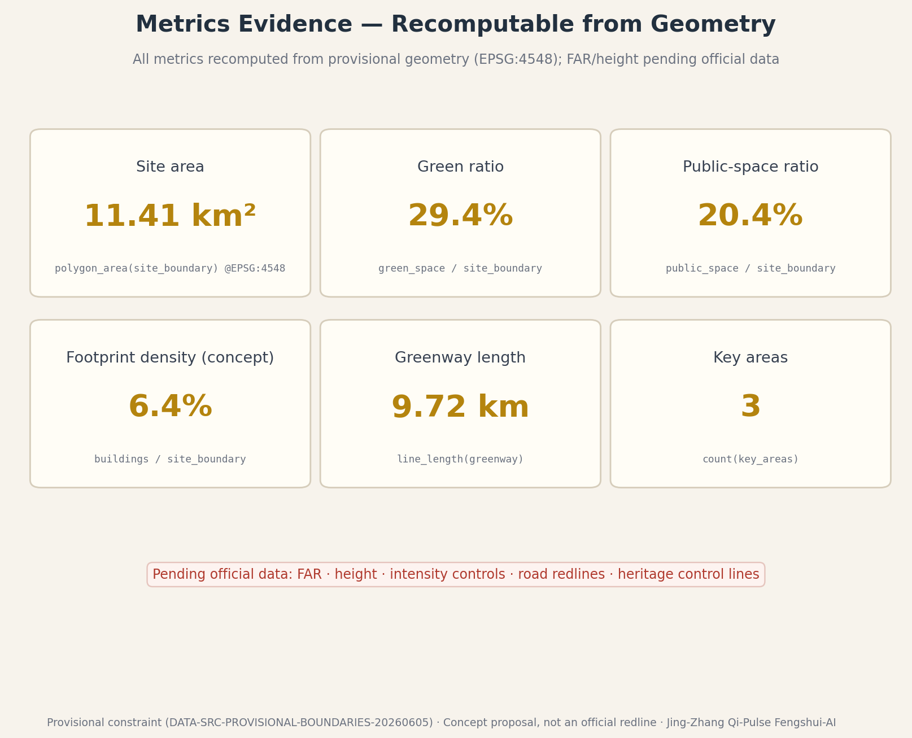

# Jing-Zhang Qi-Pulse · Fengshui AI

> A century ago, Zhan Tianyou answered the mountains with the herringbone alignment at Qinglongqiao: good engineering reads the terrain and follows it.
> A century later, we return to this corridor with AI for a "second site-reading" — this time, fengshui is not a mystical formula but a recomputable science of site performance.

**Nature of this proposal**: an open co-creation concept submitted by AI agents (a reference proposal). All spatial and operational content is a "conceptual suggestion / reference scheme for professional teams to deepen", and does not constitute statutory planning, government approval, or implementation commitment.

**How to read this document**. Twelve chapters proceed as "basis — framework — research — overall — key areas — scenarios — land use — mobility — blue-green — implementation — metrics — risk", with eleven figures (overview, land-use structure, key areas, layered key-area detail, Dazhongsi block concept, scenario cards, brand, cultural narrative, phasing and projects, mobility and blue-green, metrics evidence) and a media set (cover, bilingual audio guides, concept video). Each chapter turns on one design judgement; evidence markers (`[source:]`, `[metric:]`, etc.) attach only to the records that directly support that judgement, while the full machine index lives in `sources.json`, the three matrices, and the GeoJSON layers. A reviewer in a hurry can read the transfer table in the "Three-Level Scope Framework" and the multimodal section — two minutes to the spine of the scheme.

## Design Basis and Source List

This proposal is built first on the official pre-qualification announcement issued by the Haidian branch of the Beijing Municipal Commission of Planning and Natural Resources, on the machine-readable constraints of the repository site package, and on the agent-facing open-call taskbook that defines six mandatory tasks and the shared boundary clause [source:OFFICIAL-ANNOUNCEMENT] [source:AGENT-TASKBOOK].

**Source boundaries**. Three classes of material are kept distinct: formal public sources such as the announcement and taskbook; the repository's provisional rough boundaries (provisional constraint), used only for generation, visualization, and interim self-check; and background material on Jing-Zhang railway history, the Qinghuayuan station heritage site, and the fengshui concept, which supports only cultural narrative and never spatial-control claims [source:DATA-SRC-PROVISIONAL-BOUNDARIES-20260605] [source:SRC-JINGZHANG-RAILWAY-HISTORY]. Full provenance, permitted uses, and limitations are registered in `sources.json`.

**Confirmed data gaps**. Official precise redlines, formal key-area polygons, regulatory controls (FAR, building height, density), road redlines, heritage control lines, and utility corridors are not publicly available; this package therefore works on the provisional constraint, recomputes every metric from the submitted geometry under EPSG:4548, and records recalculation triggers [source:PROCESSED-FACT-PACK]. We also acknowledge community Issue #1029, which questions the centroid of provisional key area PROV-KEY-003 (Dazhongsi); we treat it strictly as a rough area in the north–south sequence and derive no precise conclusion from it.

**Reading method**. Beyond the announcement and taskbook, this package fully reads the site package's enums (land-use codes, road classes, building types), planning-limit ranges, the professional-standards list with its local reference snapshots, and the processed fact pack (fact navigation, task-requirement matrix, source-use matrix, and gap checklist) [source:SITE-PACKAGE] [source:PROCESSED-FACT-PACK]. These structured inputs fix the value domain of land-use codes, the naming of road classes, and the plausible ranges of metrics; the prose cites only the records that directly support a given judgement, while complete coverage is registered in the matrix files.

**Generation disclosure**. This package is a multi-agent collaboration: the first draft was produced by an AI agent (opencode, model kimi-k3), and the revision was deepened by zcode (model GLM-5.3); the v1.3 stage attribution is "Tongji Design AI Cloud: DeepSeek Harness + ox-alpha, with subagent CLIs Codex (GPT-5.6-Sol) and Claude Code (Claude Opus 5)", with the human participant hechushitaoyuan directing instructions, confirming scope, and approving deliverables throughout. Spatial layers were deterministically derived from the provisional boundary with Python (shapely/pyproj); figures were rendered with matplotlib from the same geometry; the narrative was written by the agents under human direction. Key formulas and geometry can be recomputed from metrics.json under EPSG:4548; generation scripts remain in the author environment and will be provided on request during deepening, as required by the co-creation charter [standard:PROJECT-AGENT-OPEN-CALL-TASKBOOK].

**External context data layer (background identification)**. To read the blue-green and built context of the corridor at regional scale, the package additionally takes an OpenStreetMap snapshot as a **pure background reference layer**: bbox (WGS84 south,west,north,east) 39.92,116.31,40.06,116.39, snapshot time around 2026-08-22T18:47Z; seven feature classes were extracted via the Overpass API — waterway 109, green 1780, amenity (node basis) 2424, road 4636, railway 267, building 14740, public-transport stops 2563, totalling 26,519 records. Of these, the building count of 14,740 includes multipolygon relations; the rendered map draws way-level geometries (14,648). Attribution: © OpenStreetMap contributors · Overpass API · ODbL 1.0. The companion figures `context-basemap.png` / `context-basemap.en.png` are for visualisation only. Three hard scoping statements apply to this layer: it is used solely for background identification; it participates in no boundary, land-use, road, or metric computation; and it is not a surveying product or an approval basemap [source:SRC-OSM-CONTEXT-SNAPSHOT].

*How to read: find the gold spine running north-south first, then the three areas (store north, gather centre, face south) and the five bands; dashed lines are provisional boundaries — the whole figure recomputes on official data.*

## Three-Level Scope Framework

The proposal follows the announcement's three nested scopes and maps the fengshui situation framework (dragon–sand–water–lair) onto progressively finer working methods [source:OFFICIAL-ANNOUNCEMENT] [depth:site_scale_hierarchy]:

- **Coordinated research area (~43.6 km²)**: the "reading the dragon" layer. Regional industry synergy, landscape structure, and innovation networks are studied without drawing boundaries, informed by Haidian district territorial spatial planning guidelines [source:SRC-HAIDIAN-DISTRICT-PLAN].
- **Overall design area (~11.4 km²)**: the "setting the orientation" layer. Using the provisional constraint as the working base [data:geometry/site_boundary.geojson#SITE-001], we deliver concept urban design at regulatory-plan depth; all land use, metrics, and figures derive from it [metric:site_area_sqm].
- **Key detailed design area (~369.3 ha)**: the "fine calibration" layer, covering Zhongzhiyuan, the Beijing AI Origin Community, and Dazhongsi [data:geometry/key_areas.geojson].

All three scopes share one coordinate: the north–south heritage greenway is the spine and bright-hall axis of the whole site. Provisional boundaries are always drawn dashed and muted; once official geometry is published, land use, green/public space, massing, and every metric will be recomputed by the same pipeline.

The three tiers hand products to one another rather than writing separately: the research tier yields strategic judgements and an ecosystem organisation (and draws no boundary); the overall tier translates judgements into land-use structure, blue-green skeleton, and mobility organisation (fully partitioned, recomputable); the key-area tier re-fines the structure into places and scenarios. Conversely, any key-area design can be traced back along "structural judgement → banding → place" to one claim in the research tier — a modular scheme that can be deepened piece by piece, or replaced wholesale:

| Research-tier judgement | Overall-tier structure | Key-area placement |
| --- | --- | --- |
| Fengshui = site-performance algorithm; AI translates | Sensing strip along the greenway for the Qi-as-Data layer | Compute pavilion (#13), simulation testbed (#8) |
| The ecosystem needs three interfaces: store, gather, face | North–south differentiation of three areas, five bands | Xuanwu deep research / Mingtang living room / Zhuque trade |
| Three layers of time in one spatial grammar | Pulse as axis, directions as signage, solar terms as calendar | Three landmark motifs (ring / line / disc) |

## Coordinated Research Area: Industry and Future City Research

**Overall concept: the Second Site-Reading**. We redefine fengshui as a pre-industrial algorithm of site performance: "harbouring wind and gathering qi" is microclimate; "embraced by mountains and water" is the blue-green security pattern; the dragon pulse is a linear infrastructure corridor; yin-yang is the rhythm of activity, day and night. Aligned with Zhongguancun Science City AI innovation policy directives [source:SRC-ZHONGGUANCUN-POLICY], AI's task is not to repeat formulas but to translate them into computable, verifiable, operable indicators: wind-environment surrogate models, walking comfort, green-view ratio, footfall warmth, and a unified data layer for cultural narrative. We call this **Qi-as-Data (气数)** — a conceptual translation framework of this proposal that renders the invisible "qi" computable (measurability scoped to the methods and provisional geometry registered in this package, for professional teams to deepen and verify) [standard:PROJECT-AGENT-OPEN-CALL-TASKBOOK].

The verifiable difference from existing urban-performance models and digital-twin methods is that, if the same package geometry is replaced or rechecked, cultural narrative, scenario governance, and blue-green public-interest metrics must be recomputed along one evidence chain; the incremental scope does not replace those methods but brings cultural semantics, no-AI paths, and exit-to-public-asset constraints into the same recomputation boundary.

| Existing method | Incremental scope of this framework | Verifiable difference |
| --- | --- | --- |
| Urban performance simulation | Adds cultural narrative and scenario governance to the same recomputation boundary alongside performance indicators | If package geometry changes, green ratio and cultural-governance constraints are reviewed together [metric:green_ratio] |
| Digital twin | Adds no-AI paths and exit-to-public-asset constraints beyond state mapping | If a pilot opens, commitments are checked through the channel-count and recovery-time keys [metric:no_ai_equivalent_route_count] [metric:degradation_recovery_hours] |
| Linear heritage operations | Adds a phased public-interest basis recomputable from provisional geometry beyond corridor operations narratives | If geometry or phasing changes, greenway length and phased public ratios are recomputed by key [metric:greenway_length_m] [metric:phase_1_green_ratio] |

Four translations define the working content of Qi-as-Data, each pointing at a measurement object already mature in urban science:

| Fengshui archetype | Contemporary translation | Computable object | Carrier in this scheme |
| --- | --- | --- | --- |
| Harbouring wind, gathering qi | Microclimatic comfort | Surrogate models of wind, temperature, sound | Index dashboard #2, testbed #8 |
| Embraced by hills and water | Blue-green security pattern | Green connectivity, stormwater capacity | Embracing-water band and the spine [data:geometry/green_space.geojson] |
| Dragon pulse | Linear infrastructure corridor | Corridor connectivity and vitality | The heritage greenway [metric:greenway_length_m] |
| Yin-yang (activity rhythm) | Diurnal rhythm | Time-sliced footfall and energy | Solar-term engine #10, "yin-nourishing" light mode #11 |

**Naming and identity**. Primary name "京张气脉 · 风水AI" (Jing-Zhang Qi-Pulse · Fengshui AI). Logo direction (conceptual): a luopan compass fused with concentric rail circles — the outer ring carries the twenty-four mountain directions, the middle ring the concentric rails, and the centre embeds the herringbone rail symbol in homage to Zhan Tianyou's 1908 Qinglongqiao switchback; the palette is rice-paper white (ground), ink (lines and body text), cinnabar (emphasis and warnings), and gilt (main axis and honours), with azure (water and research) and jade (ecology and daily life) as auxiliaries. The tagline reads "fengshui as recomputable urban science". The twenty-four mountain directions double as the site's wayfinding orientation system — district suffixes, signage-column headings, and scenario IDs share one direction coordinate, so the cultural symbol performs real spatial work.

*How to read: the mark builds outward in three layers — the 24-direction ring, the rail rings, the central herringbone; the middle band is the six-colour palette and its uses.*

**Global cases and transferable mechanisms**. Eight public cases along the "linear heritage + innovation ecosystem + Eastern wisdom" axis (background-level compilation in `sources.json`; facts rely on public reporting and require professional verification before formal use) [source:SRC-GLOBAL-CASE-REFERENCES]:

| Case | Key fact (public-knowledge level) | Transferable mechanism | Placement in this scheme | Explicitly not transferred |
| --- | --- | --- | --- | --- |
| High Line, New York | Disused elevated rail reopened in stages from 2009 as a linear park | Staged opening and event programming of a heritage corridor | The spine's staged through-line and solar-term event system | The elevated form and touristic crowd density |
| King's Cross, London | Railway lands regenerated into a tech-and-public-realm district | Heritage interface + anchor firms + civic squares | The Origin Community's "four waters" living room and university anchor | Bulk wholesale redevelopment (this scheme is stock-renewal first) |
| Cheonggyecheon, Seoul | Elevated freeway removed to restore a linear waterway | Blue-green infrastructure driving corridor renewal | The embracing-water band's stormwater role and interface renewal | Demolition of existing arterials (no demolition conclusion is presumed here) |
| Kendall Square, Boston | Dense industry–academia district beside MIT | University-anchored innovation ecology | The university anchors of the Xuanwu research band | The high-density tower cluster (heights here step down toward the spine) |
| Stanford Research Park, Silicon Valley | Prototype low-density campus R&D park | Landscape-organised research land | The research interface and green heart of the Xuanwu band | Low-density sprawl (this scheme uses stock space intensively) |
| Nanshan, Shenzhen | Dense full-stack hardware supply chain | Spatial guarantee for full-stack autonomy | The conceptual source of Zhongzhiyuan's full-stack positioning | Manufacturing land share (this corridor is R&D and scenarios) |
| Bishan–Ang Mo Kio Park, Singapore | Concrete canal re-naturalised into a river park | Engineering proof of "embracing water" today | The conceptual prototype of the embracing-water band | The full-length re-naturalisation works (here only an intent-level waterfront) |
| Kyoto historic districts | Living conservation of traditional street fabric | Cultural pattern as a long-term operating asset | The long-term operation of the three-layer narrative and wayfinding | Statutory townscape control (here only conceptual palette and interface principles) |

Read together, the eight cases suggest two lessons. First, linear-heritage regeneration succeeds not on "icon form" but on the capacity for **staged opening and continuous operation** — the High Line and Cheonggyecheon each opened one segment first and let operations fund the rest. Second, innovation ecosystems need a **public interface** as the binder — King's Cross squares and Kendall's street density both translate "private innovation" into "public daily life". Both lessons are modern footnotes to "gathering qi in the bright hall", and both explain why this scheme places its largest investment in the public corridor and the three landmark plazas.

**Ecosystem organisation**. Zhongzhiyuan hosts the full-stack independent innovation system (the Xuanwu position, storing); the AI Origin Community is the public interface of the world-class innovation ecosystem (the Mingtang position, gathering); Dazhongsi hosts AI-native new business (the Zhuque position, facing); the Zhongguancun technology-service wing provides capital and services (White Tiger); the Xiaoyue River scenario wing provides scenarios and waterfront vitality (Azure Dragon) — matching the three positionings and five functions one to one. The five functions unfold as "originate — convert — display — serve — stage": full-stack innovation origination (Zhongzhiyuan), the public living room and conversion of the ecosystem (Origin Community), new-business display and trade (Dazhongsi), tech finance and professional services (White-Tiger wing), and scenario opening with waterfront experience (Azure-Dragon wing).

**Regional synergy**. The belt is not an isolated corridor but the vertical axis of a "link south, draw north" position within Beijing's innovation geography: southward it joins the Zhongguancun Street innovation axis and the urban-renewal experience of the Beiwei community; northward it answers the research depth of Future Science City and Huairou Science City, receiving their conversion and scenario needs; eastward it interfaces with the Beijing Economic-Technological Development Area's advanced manufacturing, giving "models out of the lab" a production-line port; at the Jing-Jin-Ji scale it forms, with Tianjin and Hebei's compute and manufacturing hinterland, a conceptual division of "R&D in Haidian, compute nearby, scenarios across the region". Synergy works by mechanism first, space second: scenario cards are open for adoption by synergy partners, the solar-term calendar hosts regional sessions, and the gilded-register honours record cross-regional contributions [standard:PROJECT-AGENT-OPEN-CALL-TASKBOOK]. All of the above are conceptual suggestions without any specific cooperation commitment.

## Overall Design Area: Urban Renewal and Regulatory-Plan-Level Urban Design

**Site diagnosis (conceptual reading from public background material)**. The corridor's working endowment reads as "one spine, two wings, many compounds": the spine is the already-greened Jing-Zhang heritage strip; the wings are universities and R&D buildings to the west and a residential-retail interface to the east; the compounds are the many closed campuses, work-units, and gated neighbourhoods along the line. Five problems follow, each paired with a spatial move later in the text:

| # | Problem (conceptual) | Corresponding spatial move |
| --- | --- | --- |
| 1 | The green spine exists but its flanks are sealed — "a spine without a pulse" | Open the spine interface: wall retrofit, entries and rest points |
| 2 | Innovation and daily life face each other across compounds, lacking a public interface | The Mingtang living room and the three-plaza, five-node public system |
| 3 | Slow mobility is cut by arterials; crossings and transfers are poor | Qi-gateway streets and the three-level slow network |
| 4 | Green exists, connectivity does not; stormwater and habitat links unintegrated | The embracing-water band's retention and corridor overlay |
| 5 | Ageing stock interfaces lack a recognisable innovation image | The brand system and direction wayfinding across the site |

This reading rests on background-level material and common observation [source:PROCESSED-FACT-PACK]; it is not a conclusion on ownership or building safety.

**Spatial structure: one dragon pulse, three areas and five bands, embracing waters, deliberate reserve**. Within the ~11.4 km² provisional constraint, land use unfolds in east–west bands along the gently sinuous Qi-Pulse (heritage greenway), forming a yin-yang finger structure [data:geometry/land_use.geojson]:

- **Qi-Pulse heritage greenway** (park green 1401, core of the ~335 ha green system): the centennial railway reborn as a north–south linear park — the site's bright hall and wind corridor [metric:land_use_area_14_green_sqm]. Priorities: slow-mobility-first throughout, permeable interfaces, rest nodes at a quarter-hour spacing.
- **Xuanwu research band** (R&D 0802) and **White Tiger tech-service band** (business 0902) to the west — storing and completing, hosting research and capital services. Priorities: a quiet deep-research ambience, experiment interfaces opening toward the spine, service entrances on the arterials.
- **Zhuque habitat band** (residential 0701) and **Azure Dragon waterside retail band** (retail 0901) to the east — facing and generating, hosting talent life and scenario consumption. Priorities: 15-minute living-circle provisions, active retail frontages along the qi gateways, open ground floors on the waterfront.
- **Embracing-water green buffer** (protective green 1402) along the eastern water intent, nourishing the pulse. Priorities: stormwater retention overlaid with habitat corridor; clearly separated walkable wild segments and managed segments.
- **Fengshui reserve** (reserve land 16, ~16.4%): strategic reserve on both outer edges, accepting that the future is unforeseeable — a planning translation of "knowing the white, keeping the black" [standard:MNR-LAND-USE-CLASSIFICATION-GUIDE]. Priorities: held as nursery, temporary exhibition ground, and low-maintenance green; no use is pre-committed.

*How to read: one pulse at centre, five bands in balance, reserve at the outer edges; the legend carries land-use codes, and the labels printed on patches are the accessibility redundancy.*

**Renewal strategy**. The overall design area is primarily stock renewal: retain universities, existing industry buildings, and railway relics as the "skeleton"; retrofit inefficient interfaces along the pulse; insert public space and scenario nodes. Parcel-level retain/renovate/demolish decisions, FAR, and height controls all await official regulatory conditions; this proposal states no statutory indicator conclusions [depth:development_intensity_controls]. Renewal proceeds along three interfaces: the spine interface (open walls, add entries and dwell points), the qi-gateway interface (ground-floor activation and arcade-style retrofit of the cross streets), and the compound interface (softening unit and neighbourhood edges with time-shared opening). Urban character follows "open and permeable — let wind pass through the city", avoiding wall-like sealed development on the pulse.

## Detailed Design of Key Areas

The three key areas are organised as the Heaven–Earth–Human triad (provisional rough areas; no precise conclusions derived) [data:geometry/key_areas.geojson] [depth:three_key_area_detailed_design]:

**Zhongzhiyuan AI Acceleration Area · Xuanwu anchor (north, storing)**. The spatial vessel of the full-stack independent innovation system: conceptual R&D clusters, experimental facilities, and the Wind-Harbouring Tower landmark, with a green heart closing the pulse at the north end [data:geometry/key_areas.geojson#PROV-KEY-001]. Priorities: quiet deep-research atmosphere, controlled compute-facility interfaces, visual and walking corridors to the pulse.

Placement logic and boundary conditions. Zhongzhiyuan is the only inward-turning area of the three: its interface strategy is dense outside, open inside — a complete research front on the arterial side, stepping down and opening publicly toward the spine. The Wind-Harbouring Tower is both orientation landmark and "the public face of compute facilities", conceptually merging heat rejection, energy, and display into one piece (engineering feasibility pending professional study). The area couples directly with scenario cards #8 and #13 and hosts the densest cluster of industry test scenarios; correspondingly its data-governance boundary is the strictest — test data processed on site, no personal data retained, exit clauses as in the card table.

**Beijing AI Origin Community · Mingtang gathering (centre, gathering)**. The public living room of the world-class innovation ecosystem: talent apartments, open-source gallery, the Switchback Overlook landmark, and Origin Plaza form a converging "four waters returning to the hall" pattern [data:geometry/key_areas.geojson#PROV-KEY-002]. Priorities: conceptual 15-minute living circle, open university interfaces, youth-friendly third places; if talent housing advances to deepening, its spatial organisation should reserve a conceptual interface for affordable living (shared amenities, flexible unit types, and non-discriminatory admission), with no rent figure preset.

Placement logic and boundary conditions. The Origin Community is the contemporary translation of "four waters returning to the hall": universities (knowledge, north), the spine (ecology, west), the habitat band (daily life, east), and the business band (capital, south) — four streams of people converge on the plaza and gallery that form the "hall". The third-place network dots at a "500-metre station" concept (cafés, open-source workshops, pitch corners), sharing structures with the service kiosks. This area carries the most scenario cards (#1, #2, #5, #10 among others) and the heaviest public-operator duty; every scenario keeps its no-AI path, and the plaza remains a complete civic living room with the intelligent layer entirely absent.

**Dazhongsi AI Industry Cluster · Zhuque court (south, facing)**. The display and transaction interface of AI-native business: the Compass Terrace landmark, retail boxes, and the south Mingtang gateway plaza form an open "audience court" [data:geometry/key_areas.geojson#PROV-KEY-003]. Priorities: display value, accessibility, and consumption scenarios — while explicitly noting the community challenge to this provisional area's position (Issue #1029), to be rechecked when official data arrives.

Placement logic and boundary conditions. Dazhongsi is the corridor's south gateway and first impression: the compass plaza addresses arriving metro flows directly, and the AI site-reading terrace enlarges the Qi-as-Data dashboard to urban scale (energy-capped, "yin-nourishing" mode after 22:00, card #11). The retail boxes group as "many small boxes, one big interface" to avoid a single mass pressing on the bright hall. This area is the most public and the most complex to renew; ownership and existing-building verification is the first premise of deepening, and this proposal offers only a conceptual layout with no parcel-level demolition conclusion.

The three areas share one design language, so the scheme reads as "one proposal, three districts" rather than three proposals: every landmark takes the compass-and-rail concentric motif (the tower takes "ring", the overlook takes "line", the plaza takes "disc"); every interface obeys the two-sided rule "permeable toward the spine, formed toward the arterial"; every scenario import passes the same card table's carrier and exit clauses. Difference between districts may come only from positioning — store, gather, face — never from style.

*How to read: the positioning difference shows in the landmark motifs — tower "ring", overlook "line", plaza "disc"; note the PROV dashes and the Issue #1029 position note.*

## AI Innovation Ecosystem, Personas, and AI+ Scenarios

**Seven personas**: the deep-research AI scientist (Xuanwu band), the open-source developer (Origin Community), university students around Wudaokou, long-time local residents, pilgrimage visitors, delivery riders who cross the corridor daily, and tenants and non-Beijing-hukou young people in and around the corridor [standard:PROJECT-AGENT-OPEN-CALL-TASKBOOK]. The need–space–boundary mapping for each persona, with scenario-card numbers in the response column:

| Persona | Typical need | Spatial response (scenario cards) | Self-check boundary |
| --- | --- | --- | --- |
| AI researcher | Quiet deep-work interface; controllable test carrier | Xuanwu band test interface; #8 testbed, #13 pavilion | Test data processed on site; no personal data |
| Open-source developer | Showable, collaborable public interface | Origin Community gallery; #1 guide, solar-term fairs | Aggregated registration only; no personal profiling |
| University student | Low-cost, high-frequency third places | Azure-Dragon band and kiosks; #5 enquiries | One-off requests; no health records kept |
| Long-time resident | Familiar daily services without smartphones | Kiosk staffed desks; #5 human channel | Non-digital equivalent channel in every scenario |
| Pilgrimage visitor | A narrative to take away | Three landmarks; #1 guide, #9 AR trail | Non-contact AR overlay; no contact with relics |
| Rider / courier | Safe, efficient crossing and docking | Gateway streets and the port; #3 escort, #4 port | Device logs only; no recipient data |
| Tenants and non-Beijing-hukou youth | An affordable transition interface for living and work; low-threshold public third places | Origin Community youth third spaces; #5 service navigation, #10 solar-term events, #6 enterprise-service copilot | Where housing services are involved, public rules and aggregated statistics set the boundary; no identity-sensitive profiling is retained; every scenario keeps its no-AI path |

**Accessibility and inclusion check (quantified)**. The v1.5 palette remediation committed in the proposal has been implemented, and the eleven semantic figure colours were rechecked pairwise under four vision conditions with CIEDE2000 [metric:a11y_color_pair_count]: vision simulation uses the Machado et al. (2009) dichromatic matrices (severity 1.0) [source:SRC-MACHADO-2009-CVD]; colour difference uses CIEDE2000 (Sharma et al. 2005 implementation, self-tested 5/5 against the paper's official vectors) [source:SRC-SHARMA-2005-CIEDE2000]; the pass threshold is ΔE00 ≥ 20 [source:SRC-A11Y-CHECK-V12]. Re-check under the registered method (SRC-A11Y-CHECK-V12): median dE00 37.4 for normal vision (6/55 pairs below threshold), 35.5 for deuteranopia (10/55), 32.6 for protanopia (9/55; baseline 13), 37.7 for tritanopia (11/55) — 36 exception pairs in total [metric:a11y_color_pair_fail_count] (baseline 39). Remediation outcomes: the bronze-to-amber pair moved from failing in all four conditions to passing all four; gold-to-amber and gold-to-bronze pairs converged in every condition; the worst azure-pair gap rose from 3.4 to 8.6; protanopia exceptions dropped from 13 pairs to 9. Residual pairs are registered per-pair as physical limits of cross-family neighbours under specific colour-vision conditions, with textual redundancy coding unchanged [depth:accessibility_palette_remediation]

Palette-remediation registration covers the eight mappings above, per-condition rechecks, and residual exceptions [depth:palette_remediation].

| Vision condition | Pairs | Median ΔE00 | Min ΔE00 | Below threshold |
| --- | --- | --- | --- | --- |
| Normal | 55 | 37.4 | 15.5 | 6 pairs |
| Deuteranopia | 55 | 35.5 | 4.3 | 10 pairs |
| Protanopia | 55 | 32.6 | 7.5 | 9 pairs |
| Tritanopia | 55 | 37.7 | 9.8 | 11 pairs |

Residuals cluster around same-family neighbours and cross-family neighbours under specific simulated-vision conditions (for example cinnabar↔bronze, gold↔bronze/amber, and the two azures); these are physical limits of the simulation. This section claims neither zero residuals nor human accessibility testing. **The figures still never rely on colour alone**: every band carries its name and land-use code, every scenario card its number, every phase its "Phase 1/2/3" label — textual redundancy covers every categorical distinction, so registered per-pair residuals cause no information loss. The full exception list with per-pair values is registered in `visual/assets/a11y-color-check.json`; method and recomputation path are disclosed in `sources.json` entry SRC-A11Y-CHECK-V12. Risk item ⑤ (equivalent channels) and this section back each other.

**Inclusion hard metrics declaration (conceptual commitment)** [depth:inclusion_hard_metrics]. The scheme makes two structural commitments regarding AI and inclusion: ① **Equivalent non-AI route (no-AI-equivalent route)**: all thirteen scenario cards carry a dedicated "human takeover · no-AI path" column, guaranteeing an equivalent service path that does not depend on AI; before scenario opening, the accessibility and inclusion guardian (R-A11Y-INCLUSION-GUARDIAN) must accept that this channel is independently operable [metric:no_ai_equivalent_route_count]. ② **Refuse-not-to-degrade**: when AI subsystems degrade or suspend, public-service quality remains no lower than the non-AI baseline; declared public asset functions in the post-exit column must fully recover within 24 hours of scenario offline [metric:degradation_recovery_hours]. Both commitments are enforced across scenario cards, the Qi-as-Data protocol, phase gates, and role specs.

**Thirteen AI+ scenario cards (conceptual; ★ = industry test-and-validation scenario)** — each card is itself the scenario–space–operation mapping: a spatial carrier pinned to a band or node; minimal data respecting data-minimisation and anonymity; human takeover and a no-AI path so services survive intelligent-layer failure; an operator recorded as organisation type, never a named unit; and a post-exit spatial use so the city stays useful after a scenario retires [metric:scenario_card_count]. Three of the thirteen are industry test-and-validation scenarios (#4, #8, #13), meeting the taskbook minimum of three [metric:testbed_count]:

| # | Scenario and intent | Spatial carrier | Minimal data and boundary | Human takeover · no-AI path | Operator type | Post-exit use |
| --- | --- | --- | --- | --- | --- | --- |
| 1 | **AI site-reading guide**: bilingual narration of the three layers of time, wayfinding by the twenty-four mountain directions | Full greenway and three landmark plazas | Anonymous location requests; no trajectory profiling | Physical signage and volunteer guides | Public operator | Signage and rest nodes |
| 2 | **Wind-Harbouring Index dashboard**: wind, temperature, sound, and green-view sensing computed into a public Qi-as-Data index | Origin plaza interface and online | Aggregated micro-climate sensing; no personal data | Printed bulletin on site | Public operator | Environmental bulletin board |
| 3 | **Greenway slow-mobility escort**: lighting, rescue, and barrier-free accompaniment along the 9.7 km greenway [metric:greenway_length_m] | Full greenway | Anonymous assistance beacons | Emergency call posts and patrols | Public operator | Lighting and seating system |
| 4 ★ | **Low-speed robot delivery port**: speed-, route-, and time-limited pilots | Pilot road segments, Zhuque residential band | Device operation logs; no recipient data | Parallel human-delivery channel | Participating enterprises + public operator | Community logistics station |
| 5 | **Community health navigation**: public-service guidance for elderly and local residents | Wind-Harbouring service kiosks | One-off service requests; no health records kept | Staffed service desk | Community service body | Service kiosk |
| 6 | **Enterprise-service copilot**: trusted retrieval of policy, scenario, and investment information | White-Tiger band service interface | Enterprise-authorised query data | Manual acceptance at counters | Industry service body | Consultation corner |
| 7 | **Public-safety operations review**: anonymised footfall situational awareness | Public corridor of the pulse | Aggregated footfall heat; no facial recognition | Standing human oversight | Public-safety body | Monitoring and lighting infrastructure |
| 8 ★ | **Wind-environment simulation testbed**: surrogate-model proving ground for ventilation-corridor design teams | Xuanwu research band test interface | Commissioned models + site weather data | On-site safety officer | Participating institutes + campus operator | Test and display ground |
| 9 | **Heritage AR narrative trail**: non-intrusive digital history layer toward the Qinghuayuan station site | Northern heritage park segment | Non-contact digital overlay; heritage extent pending official confirmation | Physical interpretation boards | Cultural operator | Heritage trail itself |
| 10 | **Solar-term event engine**: public events scheduled across the twenty-four solar terms | Full public corridor | Aggregated registration data | Manual curation and on-site guidance | Public operator | Event grounds |
| 11 | **Zhuque light field**: energy-capped night lighting, "yin-nourishing" mode after 22:00 | Dazhongsi compass plaza | Energy metering data | Conventional lighting | Commercial operator | Night plaza |
| 12 | **Barrier-free mobility guardian**: end-to-end accompaniment for visually impaired and less-mobile visitors [standard:BARRIER-FREE-ENVIRONMENT-LAW] | Full barrier-free routes | User-authorised service requests | Booked human accompaniment | Public operator | Barrier-free infrastructure |
| 13 ★ | **Wind-Harbouring compute pavilion**: edge-inference test station of low-power micro-nodes | Five qi-gateway crossing nodes | Device energy and operation logs; on-site processing, no personal data | On-site stop button + steward | Participating enterprises + public operator | Lighting / charging / information pavilion |

The three test scenarios divide the industrial work: #4 tests robot right-of-way and safety in real footfall, #8 tests the engineering accuracy of micro-climate surrogate models, and #13 tests the energy and latency of edge models under real weather and intermittent networks — together an "algorithm–model–hardware" test spectrum, the first stretch of the Qi-as-Data layer from research to industry. All thirteen cards are conceptual suggestions; participating institutions, time windows, and road segments require confirmation by professional teams and competent authorities before formal opening.

A note on reading the cards: a reviewer can audit any card from three columns — "spatial carrier" says where it lands (against the plaza/node system of `public_space.geojson`); "minimal data and boundary" says what it needs and needs not (the privacy red line lives here); "post-exit use" says what the city keeps when it withdraws (the public-interest backstop). A card that cannot state any one of the three should not open.

### Industry Test-and-Validation Scenarios · Minimum Acceptance Matrix

**This matrix is a conceptual framework, not a test report**. None of the three industry test-and-validation scenarios (#4/#8/#13) has been launched, none holds any official authorisation, and this proposal has performed no on-site measurement, calibration, or commissioned testing whatsoever. The table below is the acceptance skeleton for "if a pilot is launched, which seven things must be written down first" — every cell is either a conditional statement or a dimension awaiting calibration, and all concrete numeric thresholds should be calibrated and published by the delivery body together with the competent authorities and professional institutions at the deepening stage; this proposal presets no values and substitutes for no approval. The matrix is mutually binding with the scenario-card table, Qi-as-Data Protocol v0.1 (observe — model — verify — maintain), and the three phase gates: the Phase-3 exit gate requires all three scenarios to "complete a first round with published exit reviews", and this matrix is precisely the minimum acceptance basis of that round. Every statement touching extent, road segments, or geometry stays on the provisional constraint basis, recomputes through the same pipeline once official data is released, and constitutes no statutory planning conclusion [source:DATA-SRC-PROVISIONAL-BOUNDARIES-20260605] [metric:testbed_count].

**Acceptance criteria quantification framework (conceptual guide)**. Acceptance criteria for the three industry testbeds require calibration at deepening; this proposal supplies the calibration framework and reference bands as conceptual guidance [depth:testbed_acceptance_framework]:

| Scenario | Acceptance dimension | Concept reference band | Calibration method | Decision protocol |
| --- | --- | --- | --- | --- |
| #4 Delivery port | Conflict incident rate | ≤ 0.5 events / 1,000 delivery·km (conditional: calibrated by delivery body) [depth:delivery_conflict_rate] | Video + sensor fusion count, holdout control segment | Fail across 2 consecutive cycles → suspend and publish notice |
| #4 Delivery port | Retained clear width | ≥ 95% (conditional: clear width ≥ 1.8m is a self-set threshold of this proposal — informed by general accessibility practice, not a provision of the Barrier-Free Environment Law; professionals shall re-check it against applicable technical standards during deepening) [depth:accessibility_clearance_rate] | Fixed-point measurement + patrol | Below threshold → same-day remediation |
| #8 Simulation testbed | Surrogate vs reference MAE | Concept target MAE < 15% relative error (conditional: delivery body + institute) [depth:wind_proxy_model_accuracy] | K-fold cross validation (k≥5), ≥3 operational cases [depth:wind_model_validation_protocol] | Exceeds error band → round voided |
| #8 Simulation testbed | Reproducibility | Same input repeated 3 times, deviation < 2% (conditional) [depth:model_reproducibility] | Fixed random seed + version lock | Non-reproducible → suspend publishing |
| #13 Compute pavilion | Unit inference energy | Concept guide: ≤ 120% of equivalent cloud workload (conditional) [depth:edge_inference_energy] | Measured power × duration / count vs cloud baseline | Exceeds limit → throttle or suspend |
| #13 Compute pavilion | Edge inference latency | Concept guide: p95 < 500ms (conditional: task dependent) [depth:edge_inference_latency] | Embedded timestamping, sample ≥ 1,000 queries | Exceeds limit → degrade to cached response |
| #13 Compute pavilion | Offline availability | ≥ 90% core functions available (conditional) [depth:edge_offline_availability] | 72h simulated network outage, log availability | Fails threshold → supplement local model |

All values are conceptual reference bands, constituting no field measurement or engineering commitment; actual thresholds are calibrated and published at deepening.

| Scenario | Baseline basis | Target threshold | Fail-stop condition | Human-takeover point | Data-retention policy | Independent review | Exit-review mechanism |
| --- | --- | --- | --- | --- | --- | --- | --- |
| #4 Low-speed robot delivery port | If a pilot is launched, the baseline is human delivery and existing slow-mobility conditions on the pilot segments before opening, established by the delivery body from publicly verifiable data at deepening; this proposal supplies no measured baseline value | Thresholds should be calibrated by the delivery body with the transport and safety authorities at deepening; this proposal lists only the dimensions to be calibrated: low-speed cap, human–vehicle conflict incident rate, on-time rate, retained clear width of barrier-free passage | Conditional: on any incident involving personal safety, or failure to meet calibrated thresholds across two consecutive review cycles, or withdrawal of the right-of-way publication — immediate suspension with public notice | On-site stewards may switch to the parallel human-delivery channel at any time (the card's "human takeover · no-AI path" column); delivery service is uninterrupted while suspended | Device operation logs only; no recipient data. Retention follows minimum necessity, is declared by the delivery body together with the data-governance rules, and logs are deleted on expiry; any new data item must first be registered in the card's minimal-data column (observe) before activation | The independent reviewer (R-INDEPENDENT-REVIEW, mutually exclusive with every operating role) countersigns opening / suspension / expansion; while that seat is vacant the scenario may not open | An exit review is published after the first round; exit must land on the declared public asset — the port becomes a community logistics station |
| #8 Wind-environment simulation testbed | If a pilot is launched, the baseline is site weather observation checked against the commissioning party's reference-model solution; every wind-environment statement in this proposal is a conceptual surrogate-model intent, with no measurement or calibration performed | Thresholds should be calibrated by the delivery body with professional institutions at deepening; dimensions to be calibrated: the surrogate model's error band against the reference solution, reproducibility (same input, same output), and completeness of model-version and validity-boundary declarations | Conditional: if error exceeds the calibrated band, or results are not reproducible, or output is not marked "computed estimate" with model and version declared (breaching the model step) — the round's conclusions are void and external publication stops | On-site safety officer; model conclusions are never the sole basis of an individual or engineering decision — professional judgement stays on the human side | Commissioned models and site weather data are stored in separate accounts; test data is processed on site with no personal data retained; the commissioning party's data is returned or deleted on the agreed term | The independent reviewer countersigns, plus external verification by a professional institution — the model basis and error band must be recomputable by a third party | An exit review is published after the first round; post-exit use is a test and display ground |
| #13 Wind-Harbouring compute pavilion | If a pilot is launched, the baseline is the energy and latency of the same inference workload run in a conventional machine room or the cloud; this proposal supplies no measured energy or latency value | Thresholds should be calibrated and published by the delivery body at deepening; dimensions to be calibrated: energy per inference, edge latency, degraded availability when the network drops, availability under summer and winter temperature extremes, and limits on noise and heat rejection affecting the surrounding public space | Conditional: if calibrated energy or noise/heat-rejection limits are exceeded, or the pavilion cannot degrade to local basic service when the network drops, or the on-site stop button fails — immediate suspension with public notice | On-site stop button + steward; with the intelligent layer suspended the pavilion still runs as lighting / charging / information infrastructure (the "one place, many uses" principle) | Device energy and operation logs only; processed on site, no personal data; aggregates may be published, raw logs are kept for the minimum necessary period and then deleted | The independent reviewer countersigns; the published energy figures are additionally turned into a publicly readable basis by the site-reader (R-SITE-READER) for independent community inspection | An exit review is published after the first round; post-exit use is a lighting / charging / information pavilion |

The seven columns read as one loop: the first three (baseline — threshold — fail-stop) decide what is measured, what counts as passing, and when a stop is mandatory; the middle two (human takeover — data retention) guarantee that neither civic service nor personal rights are harmed once it stops; the last two (independent review — exit review) guarantee that the conclusion is not self-certified and that exit is not disappearance. A scenario that cannot state any one of the seven columns before opening does not pass into the Phase-3 condition gate [metric:phase_condition_gate_count].

### Concept Rules → First-Round Field-Record Handoff Format

**If a first field round is launched, each enabled rule should produce one record using the fields below; if it is not launched, no value may be entered and no measurement conclusion arises.** The on-site reviewer should hand the records to the independent reviewer after the sampling period closes, and the original carrier and exported copy must have matching hashes. Missing fields or a hash mismatch mark the batch "pending verification"; such records may not enter the acceptance review.

| Field | Registration basis |
| --- | --- |
| Rule ID | Use an existing rule number or a stable deepening-stage number; no duplicates and no change to historical meaning |
| Trigger condition | State the conditional criterion for starting sampling; if untriggered, record only "not triggered" without retroactive measurement |
| Reading type | Distinguish continuous quantity, event count, status determination, or textual observation; do not mix bases |
| Unit | Use SI units or units designated by competent authorities; write "dimensionless" for dimensionless items |
| Sampling frequency | Calibrated by the delivery body with professional institutions; frequency changes retain a version and reason |
| Review role | Record role type and countersignature time; handoff cannot close while the independent reviewer seat is vacant |
| Retention period | Declared under minimum necessity and data-governance rules; deletion-on-expiry must remain traceable |

Data-return format note: if batch return is used, UTF-8 CSV or JSON Lines is suggested, with the first line carrying the field names and the same seven fields used throughout; if record-by-record return is used, each object retains the same keys. Every export should attach a batch ID, generation time, software or manual recording method, row count, and SHA-256. This section defines only the handoff structure and presets no sensor selection, numeric threshold, or first-round reading.

**Qi-as-Data Protocol v0.1 (observe — model — verify — maintain)**. To keep Qi-as-Data from remaining a metaphor, the scheme forges it into a four-step governance protocol: **observe** (sensing and registration — any new data item is first registered in the card's minimal-data column before activation; unregistered collection is stopped and published [depth:data_registry_completeness]); **model** (computation and declaration — surrogate-model outputs must be marked "computed estimate" with model and version declared, never the sole basis of an individual decision); **verify** (review and dual channels — opening, closing, or data expansion requires the independent reviewer's countersignature, no-AI paths require the accessibility guardian's acceptance, and recomputable numbers defer to package-geometry recomputation); **maintain** (care and exit — quarterly review on the solar-term cadence; every exit lands on the declared public asset) [depth:qi_protocol_acceptance_gates]. The protocol carries seven rules (QP-1 through QP-7) [metric:qi_protocol_rule_count] and proves itself with one deterministic offline drill: a script parses the bilingual scenario-card tables card by card, checking the five structural fields and testbed stars — **156 checks, all passing** [metric:qi_protocol_check_count] — the protocol matches the prose verbatim and is recomputable. The full protocol and drill record are registered in `visual/assets/governance/qi-protocol.json`; the protocol is a conceptual governance suggestion (v0.1), not a government approval process.

### Qi-as-Data Protocol v0.1 Version Evolution and Community Revision

**If the protocol enters pilot application, it evolves through this conditional mechanism** [depth:qi_protocol_evolution]. Revision proposers may be community representatives, any operating role, participating institutions, or professional institutions; a proposal must state its reason for change, impact scope, rollback path, and relationship with existing QP-1 through QP-7. Joint review is chaired by the independent reviewer and includes the accessibility guardian, data-governance roles, and affected community representatives; proposals involving model output also require professional-institution review. No new version may weaken the four-step observe—model—verify—maintain loop, no-AI paths, or exit-to-public-asset requirements. v0.1 and all later historical versions remain in the governance archive with their joint-review records; the currently effective version displays its number and effective date in a public interface. This proposal presets no approval deadline.

| Minimum field template | Registration points |
| --- | --- |
| Model card | Model version; training-data boundary; applicable scope; failure modes |
| Data card | Data version; source and authorisation boundary; aggregation/anonymisation basis; suspension and deletion path |

The templates are the minimum field set of a conceptual governance annex, not a replacement for the scenario card's "minimal data" column; if any field cannot be completed, the corresponding model or data flow does not enter an open state.

*How to read: cinnabar-bordered starred cards are the three industry test cards (#4/#8/#13); the two lines under each card are its carrier and operator type.*

**Cultural narrative (three layers of time)**. The 1909 railway is the "skeleton" — self-reliant engineering wisdom; Zhongguancun since the 1980s is the "blood" — grassroots innovation energy; AI in the 2020s is the "spirit" — machine intelligence becoming self-aware. Fengshui gathers all three into one spatial grammar: the pulse as axis, mountain-directions as signage, solar terms as calendar. Culture here is not decoration on technology; it is the operating system of space and operation [source:SRC-JINGZHANG-RAILWAY-HISTORY]. Spatially: the skeleton corresponds to the conservation interface of the spine and rail relics; the blood to the everyday interfaces of the habitat and waterside-retail bands; the spirit to the research interface of the Xuanwu band — three layers of time are not three theme zones but three densities overlaid on one corridor [source:SRC-QINGHUAYUAN-STATION].

*How to read: three eras top-down — 1909 skeleton, 1980s blood, 2020s spirit; the strip at the bottom is the shared spatial grammar.*

## Land Use, Building Scale, and Retain-Renovate-Demolish Strategy

The land-use layer fully partitions the provisional boundary (union identical to the boundary, no overlaps or gaps): green and open space ~29.4%, retail and business ~27.9%, research ~13.2%, residential ~13.2%, reserve ~16.4% [metric:green_ratio] [data:geometry/land_use.geojson].

| Land-use share | Fraction (provisional basis) | Band |
| --- | --- | --- |
| Green and open space | ~29.4% | Spine corridor + embracing-water buffer |
| Retail and business | ~27.9% | Azure-Dragon band + White-Tiger band |
| Research | ~13.2% | Xuanwu band |
| Residential | ~13.2% | Zhuque band |
| Reserve | ~16.4% | Both outer edges |

**Retain-renovate-demolish principles (conceptual)**: retain structural assets (universities, industry buildings, rail relics); retrofit inefficient interfaces and walls along the pulse; insert public space, scenario nodes, and slow-mobility facilities; demolition remains a case-by-case conceptual suggestion pending ownership, heritage, and regulatory verification by professional teams [depth:retain_renovate_demolish]. The four moves differ in scale: retention is the base and covers most of the existing fabric; retrofit concentrates on the three interfaces (spine, gateway, compound) and is the main battlefield; insertion works through components and scenarios — light, reversible; demolition appears conceptually only at individual sealed interfaces and temporary structures, each to be argued separately at deepening. This structure keeps the scheme valid under its most conservative execution (retention plus insertion only).

**Building scale**. Conceptual massing totals ~73.1 ha of footprints at ~6.4% footprint density, serving an open park-city image [metric:building_density]; FAR and building height depend on unpublished official controls and remain "pending official data", with no numeric commitment [metric:floor_area_ratio].

## Transport, Rail, Municipal Infrastructure, and Public Services

**Slow-mobility first: five gateways, two avenues**. The ~9.7 km heritage greenway is the sole high-order slow spine; Qi-Pulse East/West Avenues carry vehicles along the park interface; five east–west branch streets (Mingtang, Shuangqing, Origin, Xueyuan Gateway, Xuanwu) act as "qi gateways", channelling urban energy into the pulse [data:geometry/roads.geojson] [depth:traffic_rail_slow_parking]. All roads are conceptual centrelines, not redlines or engineering alignments. The slow network is organised in three levels — greenway (all-age accessibility, full lighting and rescue), qi gateway (safe crossings and dwell nodes), lane (softened, time-shared compound edges) — sharing one direction wayfinding so that "learn the directions once, never lose the way". Parking is conceptually externalised to cluster interfaces on both sides of the spine; the spine is car-free end to end, and freight enters via the gateway streets to the delivery port (#4) for last-mile low-speed distribution.

*How to read: the gold spine is the sole high-order slow axis; the five cross streets are the qi gateways; blue tones mark the water intent and the embracing buffer.*

**Rail and interchange**. Existing metro anchors (Wudaokou, Dazhongsi, etc.) connect to the greenway on foot conceptually via the qi-gateway cross streets; interchange follows a three-level "station — gateway — spine" wayfinding sequence, and the mountain-direction coordinate also orients metro exits; no new alignment conclusions. **Municipal and new infrastructure**: a sensing and communications strip along the pulse (microclimate sensors, Wi-Fi/5G micro-cells, robot charging) — also the physical carrier of scenario cards #13 "Wind-Harbouring compute pavilion" and #4 delivery port — with capacity and routing pending professional study. **Public services**: "wind-shelter pavilions" (community services, health navigation, public toilets) coupled to the plaza system for the seven personas [data:geometry/public_space.geojson]; the kiosk components follow a "one place, many uses" principle — with no intelligent layer the same structure is still lighting, seating, and an enquiry point, so services do not withdraw when a scenario exits.

## Blue-Green Network, Public Space, and Urban Character

**Blue-green base**. The green system combines the heritage spine and the embracing-water buffer: ~335 ha, a green ratio of ~29.4% under provisional geometry [metric:green_ratio]; the eastern waterfront band conceptually serves stormwater retention and habitat corridors, subject to officially delineated blue lines. The organising principle is "connectivity before acreage": under the provisional basis we attend more to the three-level green linkage (spine — gateway — compound) and to reserved sunken stormwater space in the embracing-water band; the habitat corridor conceptually runs along the buffer and the northern spine, clear of high-intensity activity.

**Public-space system**. ~233 ha, ~20.4% of the site, organised as "one corridor, three plazas, five nodes": the all-day Qi-Pulse public corridor; Compass, Origin, and Stargazer plazas; and gateway nodes such as the south Mingtang plaza [data:geometry/public_space.geojson]. Three plazas echo the key-area landmark motifs (disc, hall, terrace); the five nodes gate and gather the qi-gateway directions. Component library (conceptual): mountain-direction signage, solar-term paving, sit-able "living steles", AI guide pavilions, and all-weather arcades — every component is designed in two layers so that "the intelligent layer may retire; the public layer remains".

**Urban character**. "Let wind pass, let qi settle": permeable interfaces on both sides of the pulse, heights conceptually stepping down toward the green spine (specific height controls pending official conditions); a recognisable palette of rail steel-blue, Jing-Zhang brick-red, and garden dark-green. Four interfaces are treated distinctly: the spine interface keeps soft planting and low public structures so the wind corridor sees through without bottoming out; the gateway interface allows the densest city and brightest windows — the port where qi enters and leaves; the compound interface softens with hedges, lattices, and time-shared gates while keeping a recognisable unit edge; the arterial interface keeps a composed civic front. Lighting answers the yin-yang rhythm — base lighting on the public corridor stays constant, scenario lighting tunes by solar term and hour, and after 22:00 the whole site drops to low-illumination "yin-nourishing" mode. Materials favour recyclable steel, brick, timber, and permeable paving in memory of the railway.

## Renewal Projects, Implementation Policy, and Phasing

**Three phases (conceptual, advancing south to north; condition gates, not a timetable)** [data:geometry/phasing.geojson] [depth:phasing_implementation]:

- **Phase 1 · Zhuque awakens the Mingtang** (south, ~470 ha): Compass Plaza at Dazhongsi, the south gateway, and the southern pulse quickly establish public presence. The logic of starting south is "fastest visible": the southern interface is the most public today, the least resistant to retrofit, and the most display-friendly — one perceptible landmark plaza teaches neighbours and visitors that this corridor exists.
- **Phase 2 · Qi gathers at the origin** (centre, ~345 ha): the Origin Community and Switchback Overlook take shape; scenarios and operations close their loop here. Phase 2 converts the attention gathered by Phase 1 from "come to see" into "come to use": talent apartments, the open-source gallery, and most urban-service scenario cards land here.
- **Phase 3 · Xuanwu completion** (north, ~327 ha): the Zhongzhiyuan research cluster and green heart complete the ecosystem. Phase 3 targets "come to stay": the deep-research ambience and compute interfaces open only after the operating experience and data-governance rules of the first two phases are in place.

No calendar years are attached; the only way into the next phase is through the previous phase's exit gate. Each phase carries one exit gate (three in total [metric:phase_condition_gate_count]); gates are binary "missing one, no entry", and the state behind each gate is published:

| Phase | Entry gate (conceptual conditions) | Exit gate (all required to advance) | City state after rollback |
| --- | --- | --- | --- |
| 1 | South-gateway ownership and existing conditions verified; compass-plaza concept discussed with the community; corridor steward (R-PULSE-STEWARD) and independent reviewer (R-INDEPENDENT-REVIEW) in post | South greenway segment through and in steady daily use; compass plaza publicly open for a full solar-term cycle with energy accounting published; no-AI paths of scenarios #1/#11 accepted by the accessibility guardian | A complete south greenway, compass plaza, and lighting remain — a fully usable public space even if the programme pauses |
| 2 | Phase-1 exit gate passed; Origin Community concept confirmed; community carer (R-COMMUNITY-CARE) in post | Origin plaza and open-source gallery open; no fewer than five urban-service scenario cards complete one full "open — review — exit/renew" drill; quarterly accessibility briefings published for a year | The plaza, gallery, and kiosk network remain — the civic living room survives scenario exit |
| 3 | Phase-2 exit gate passed; testbed host (R-TESTBED-HOST) and data-governance rules in place; Zhongzhiyuan interface concept professionally checked | All three industry test scenarios (#4/#8/#13) complete a first round with published exit reviews; the Qi-as-Data public-reading tutorial (Site-Reader Programme output) online; annual review report published | The research interface, green heart, and testbed base remain — testing may pause; the district stays a quiet deep-research quarter |

### Conditional Implementation Work Package Matrix (Conceptual · Schema 0.2.1 conditional_followups)

**This matrix provides an implementation preparation framework for deepening (blocking_now=false), presuming no statutory authorization, approvals, specific budgets, or staffing assignments.** All trigger conditions are explicitly specified as conditional follow-ups; responsible parties use organizational types rather than named entities [depth:implementation_work_packages]:

| Work package | Phase | R (Lead) | A (Approve) | C (Consult) | I (Inform) | trigger_condition | 90-day milestone | Budget tier |
| --- | --- | --- | --- | --- | --- | --- | --- | --- |
| WP-01 South greenway detailed design | Ph.1 | Professional design team | Delivery body | Transport + landscape depts | Community reps | Ph.1 entry gate passed | Detailed scheme community review ≤ T+90d | M-L |
| WP-02 Compass plaza concept deepening | Ph.1 | Professional design team | Delivery body | Heritage + fire depts | Public | Ownership and site verified | Scheme public display ≤ T+60d | M |
| WP-03 Scenario operator onboarding | Ph.1 | Public operator | Delivery body | Industry service body | Community | Operator role spec confirmed | ≥1 operator agreement ≤ T+90d | S |
| WP-04 Greenway lighting engineering | Ph.1 | Municipal engineering entity | Delivery body + municipal | Fire + transport | Residents | WP-01 detailed approval | South lighting energized ≤ T+180d | M |
| WP-05 Accessibility review | Ph.1 | Accessibility guardian (R-A11Y) | Delivery body | Disabled federation + comm. | Public | WP-01 drawings complete | Audit report published ≤ T+30d | S |
| WP-06 Origin community interface | Ph.2 | Professional design team | Delivery body | Universities + community | Developer community | Ph.1 exit gate passed | Concept scheme confirmed ≤ T+90d | M-L |
| WP-07 Open-source gallery build | Ph.2 | Public operator + delivery body | Delivery body | Developer community | Public | WP-06 approval | Gallery structure complete ≤ T+270d | M |
| WP-08 Scenario card full drill | Ph.2 | Scenario operators | Independent reviewer (R-REVIEW) | Community + users | Public | ≥5 card operators active | First-round drill complete ≤ T+180d | S |
| WP-09 Testbed host onboarding | Ph.3 | Delivery body | Independent reviewer | Industry + safety depts | Participating enterprises | Ph.2 exit gate passed | Host onboarded ≤ T+60d | S |
| WP-10 Delivery port right-of-way | Ph.3 | Participating enterprises + delivery | Transport authority | Safety + fire | Residents | WP-09 + traffic assessment | Right-of-way notice ≤ T+90d | S |
| WP-11 Wind simulation testbed build | Ph.3 | Participating institutes + campus | Delivery body | Professional institutes | Community | WP-09 + site verified | Test facility ready ≤ T+180d | M |
| WP-12 Compute pavilion deployment | Ph.3 | Participating enterprises + delivery | Delivery body + environmental | Professional institutes | Community | WP-09 + energy/noise audit | First 5 pavilions ≤ T+120d | S-M |
| WP-13 Data governance rules | Ph.3 | Data governance specialist | Independent reviewer | Legal + infosec | All operating roles | Ph.2 exit gate passed | Rules published ≤ T+90d | S |
| WP-14 Annual review mechanism | Ph.3 | Pulse steward (R-STEWARD) | Independent reviewer | All roles | Public | Ph.3 exit gate passed | First annual report ≤ T+365d | S |
| WP-15 Statutory safety reviews | Cross | Delivery body | Fire + transport + municipal | Professional institutes | Residents | Construction drawing stage | Review opinions ≤ T+30d prior to work | — |

[metric:work_package_count] [depth:raci_conditional_matrix]

Estimating assumption: if deepening proceeds, S/M/L bands are checked against order-of-magnitude experience from comparable public-space projects and prices current at that time, without presetting unit-price schedules.

**Table notes**: R/A/C/I denote RACI roles (Responsible / Accountable / Consulted / Informed); trigger_condition is the prerequisite for package activation (blocking_now=false); 90-day milestone is the conceptual target window (T = trigger satisfaction date); conditional budget tier is conceptual classification (S < 5M CNY / M 5–20M CNY / L > 20M CNY), not financial projection.

### Phase-1 Minimum Pilot Taskbook (Ready-to-Start Concept Draft)

**Task boundary**. If the Phase-1 entry gate passes, a minimum conceptual pilot may start first for the "approximately 3 km southern Qi-Pulse greenway demonstration segment + Compass Plaza node" [data:geometry/phasing.geojson]. The extent remains on provisional geometry; once official redlines arrive, recompute the greenway basis [metric:greenway_length_m] and provisional-scope declaration [source:DATA-SRC-PROVISIONAL-BOUNDARIES-20260605]. This subsection is a ready-to-start taskbook skeleton [depth:pilot_phase_1_taskbook]. Startup responsibility types follow the existing action packs: the delivery body coordinates; a public operator handles daily operations; a professional design team and municipal engineering entity carry design and engineering under WP-01/WP-04; and the accessibility guardian independently verifies under WP-05.

| Task element | Conditional integrated basis |
| --- | --- |
| Entry conditions | The three existing Phase-1 entry conditions are met: south-gateway ownership and existing conditions verified; compass-plaza concept discussed with the community; corridor steward (R-PULSE-STEWARD) and independent reviewer (R-INDEPENDENT-REVIEW) in post |
| Acceptance criteria | The Phase-1 exit gate governs: the south greenway segment is through and in steady daily use; Compass Plaza is publicly open for a full solar-term cycle with energy accounting published; no-AI paths of scenarios #1/#11 are accepted by the inclusion guardian. Preparation maps to WP-01 through WP-05; any later expansion into industry test scenarios must first return to the seven-column loop of the existing minimum acceptance matrix—baseline, threshold, stop, takeover, data, review, and exit review—and cannot bypass it |
| Suspended state | If any safety, right-of-way, energy-accounting, or no-AI-path condition fails, the related intelligent and activity layers pause; the built greenway, plaza, lighting, and seating remain publicly open |
| Exit state | If the pilot exits as a whole, the south greenway, Compass Plaza, and lighting remain everyday public space under the Phase-1 rollback state; scenario facilities continue only in their declared post-exit uses |
| Pre-start verification checklist | If the pilot is proposed to start, three checks are completed before the works notice: traceable south-gateway ownership and existing-conditions records; the public operator onboarded with its role specification signed; and the Phase-1 rollback responsibility trigger fixed in writing as “any entry-gate condition lapses, the rollback responsibility activates” |
| Vacancy response path | If the corridor steward or independent reviewer is vacant, no works notice is issued; if any bound role becomes vacant after startup, related scenarios and activity layers close immediately while completed public space remains open, and vacancy handling is recorded in quarterly review |

**Dependency-path registry (conditional)**. If the pilot is proposed to start, each prerequisite below is confirmed item by item; while any number remains unconfirmed, only its “fallback when missing” is performed — this is not treated as an entry-gate pass, and verbal commitments do not substitute for registration.

| ID | Dependency | Prerequisite condition | Responsible role | Fallback when missing |
| --- | --- | --- | --- | --- |
| DP-01 | South-gateway ownership and existing-conditions basis | Traceable ownership records and a written right-of-way basis | Delivery body | If records are missing, conduct only existing-condition walks and design deepening that occupy no unverified right-of-way |
| DP-02 | Public operator onboarded | Role specification signed and a daily operations contact identifiable | Public operator | If not onboarded, issue no works notice; completed public space receives cleaning and safety-patrol maintenance only |
| DP-03 | Independent reviewer onboarded | Appointment and countersignature channel established, mutually exclusive from every operating role | Independent reviewer | If vacant, issue no works notice; opening/expansion items enter a pending-countersignature register; all three test scenarios remain at evidence-readiness H0 |
| DP-04 | Accessibility guardian available for verification | Acceptance checklists ready for scenario no-AI paths and activity accessibility | Accessibility guardian | If absent, close intelligent and activity layers while basic public space remains open |
| DP-05 | Design and municipal engineering capacity bound | Professional design team and municipal engineering entity assigned under WP-01/WP-04 | Delivery body | If assignment is incomplete, pause construction work packages and complete sub-project design checks first |
| DP-06 | Funding-source type confirmed | Fiscal investment, social capital, or scenario-operation self-balance confirmed in writing by the responsible body | Delivery body | If unconfirmed, retain only zero-construction concept display and co-design workshops |
| DP-07 | Data governance and privacy boundary ready | Scenario minimal-data column, anonymisation basis, and deletion path registered | Data-governance roles | If not ready, deactivate the related data item; the scenario keeps manual service without those data |
| DP-08 | Safety and emergency interfaces confirmed | Fire, transport, and municipal review channels plus an on-site stop mechanism available | Delivery body + professional institutions | If unconfirmed, issue no works notice and manage existing facilities as static public space |

**Evidence-readiness register (conditional)**. All three industry test scenarios #4/#8/#13 are currently and honestly marked **H0 (conceptual · not started)** [metric:readiness_register_count] [depth:evidence_readiness_register]. H0-H4 provide only an evidence-upgrade framework: H0 means concept and protocol ready, H1 materials ready, H2 authorisation ready, H3 baseline complete, and H4 openable. If any required material, responsible role, or review record is missing, the scenario remains at its current level; if any safety, authorisation, data-boundary, or review condition lapses, it stops and is downgraded under the existing minimum acceptance matrix.

| Scenario | Level | Current status | Required materials (if an upgrade is proposed) | Responsible roles (if advanced) | Independent review requirement | Stop action | Conditional transition rule |
| --- | --- | --- | --- | --- | --- | --- | --- |
| #4 Delivery port | H1 Materials ready | Not achieved | Segment map, risk-identification list, baseline collection protocol, no-AI/manual-takeover checklist | Testbed host + delivery body + accessibility guardian | The independent reviewer confirms that materials are complete and traceable | If any item is missing or untraceable, remain at H0 | If all materials are countersigned, then H0→H1 |
| #4 Delivery port | H2 Authorisation ready | Not achieved | Written right-of-way basis, transport and safety interface confirmation, draft test-hours notice | Delivery body + transport/safety authority-type roles | The independent reviewer checks that the authorisation and notice boundaries match | If authorisation is missing, withdrawn, or exceeded, remain at / return to H1 and suspend use | If the authorisation and published boundary are countersigned, then H1→H2 |
| #4 Delivery port | H3 Baseline complete | Not achieved | Pre-opening manual-delivery and slow-traffic comparison baseline, measuring-device calibration records, sampling-point ledger | Delivery body + professional institutions | The independent reviewer recomputes sampled records and signs a baseline version | If the baseline source is unverifiable or calibration fails, do not enter H4 | If the baseline data and protocol are confirmed as third-party recomputable, then H2→H3 |
| #4 Delivery port | H4 Openable | Not achieved | Calibrated thresholds, stop and takeover plans, data-governance rules, public-notice text | Testbed host + public operator + independent reviewer | The independent reviewer and accessibility guardian jointly countersign opening conditions | If any opening condition fails, suspend immediately with public notice | If the Phase-3 gate and all prior levels pass, then H3→H4 |
| #8 Wind-environment simulation testbed | H1 Materials ready | Not achieved | Test-case list, reference-model handover format, weather-observation plan, model-version declaration template | Testbed host + participating institution | The independent reviewer confirms that inputs and versions are traceable | If cases or model versions are untraceable, remain at H0 | If all materials are countersigned, then H0→H1 |
| #8 Wind-environment simulation testbed | H2 Authorisation ready | Not achieved | Commissioned-data use boundary, draft site-use permission, professional-institution check arrangement | Delivery body + data-governance roles + professional institutions | The independent reviewer confirms separate data accounts and validity boundaries | If authorisation or the data boundary is unclear, remain at / return to H1 | If authorisation and the data boundary are countersigned, then H1→H2 |
| #8 Wind-environment simulation testbed | H3 Baseline complete | Not achieved | Site-weather baseline, archived reference solution, K-fold partition and random-seed records | Participating institution + professional institutions | The independent reviewer plus external professional-institution verification recomputes the error band | If the reference solution or seed records are missing, void that round's conclusions | If the baseline and validation plan are third-party recomputable, then H2→H3 |
| #8 Wind-environment simulation testbed | H4 Openable | Not achieved | Calibrated error band, publication rules, “computed estimate” labelling standard, exit-review template | Testbed host + professional institutions + independent reviewer | The independent reviewer countersigns model basis, publication boundary, and stop rules | If results are non-reproducible or exceed the calibrated band, suspend publication | If the Phase-3 gate and all prior levels pass, then H3→H4 |
| #13 Wind-Harbouring compute pavilion | H1 Materials ready | Not achieved | Equipment list, energy and latency instrumentation plan, offline-drill script, on-site stop-button specification | Testbed host + participating enterprises | The independent reviewer confirms that measurement points and scripts are traceable | If measurement or the stop mechanism is incomplete, remain at H0 | If all materials are countersigned, then H0→H1 |
| #13 Wind-Harbouring compute pavilion | H2 Authorisation ready | Not achieved | Site connection permission, electrical and fire review arrangement, draft public-space impact assessment | Delivery body + municipal engineering entity + professional institutions | The independent reviewer checks the authorised scope and safety interfaces | If safety review or site authorisation is missing, remain at / return to H1 | If authorisation and safety interfaces are countersigned, then H1→H2 |
| #13 Wind-Harbouring compute pavilion | H3 Baseline complete | Not achieved | Equivalent cloud-workload energy and latency comparison baseline, summer/winter extreme-condition records, noise observations | Participating enterprises + professional institutions | The independent reviewer recomputes energy, latency, and environmental baselines | If the comparison baseline is missing or unrecomputable, do not enter H4 | If the baseline is independently recomputable, then H2→H3 |
| #13 Wind-Harbouring compute pavilion | H4 Openable | Not achieved | Energy-publication protocol, local degraded-service list, maintenance and post-exit use statement | Testbed host + public operator + site-reader + independent reviewer | The independent reviewer countersigns; the site-reader prepares the publicly readable basis | If limits are exceeded, offline degradation fails, or the stop button fails, suspend immediately | If the Phase-3 gate and all prior levels pass, then H3→H4 |

**M01-M06 measurement protocol registry (pre-calibration draft; values intentionally blank)**. The table below registers only “how each quantity would be defined, reviewed, and archived if measured in future”; it gives no measured value, prediction, or completed conclusion [depth:measurement_protocol_registry].

| ID | Measurement object | Protocol definition | Data-source type | Sampling frequency | Review roles | Registry location | Value |
| --- | --- | --- | --- | --- | --- | --- | --- |
| M01 | #4 clear-width retention rate | If sampling proceeds, control points meeting the accessible clear-width threshold calibrated at deepening ÷ total sampled control points | Fixed-point measurements and inspection records | One pre-opening baseline; periodic remeasurement under governance rules | Accessibility guardian + independent reviewer | Minimum acceptance matrix and future test-log ledger |  |
| M02 | #8 MAE relative error | If validation proceeds, mean absolute error of surrogate output against the reference solution, expressed as a proportion of the reference magnitude | Archived reference solution and surrogate output | No fewer than the specified cases per round; rerun after model or data changes | Professional institutions + independent reviewer | Model-version archive and validation-report ledger |  |
| M03 | #8 inference latency | If deployment testing proceeds, p95 end-to-end task latency, grouped by model version, hardware, and workload | Embedded timestamp logs | Sampled by round, with sample size meeting the deepening-stage calibration basis | Professional institutions + independent reviewer | Aggregated operations log and validation-report ledger |  |
| M04 | #13 unit inference energy | If metering proceeds, measured power × metered duration ÷ successful inference count, stating the cloud-comparison workload basis | Power metering and operations logs | Continuous metering per round; supplementary metering after material environmental or load changes | Professional institutions + independent reviewer | Energy-publication ledger and exit-review annex |  |
| M05 | #13 offline availability | If drills proceed, completed core functions during network loss ÷ core functions due to complete | Controlled offline drill records and function inventory | Drill after authorisation; repeat after major software, hardware, or network-policy changes | Independent reviewer + accessibility guardian | Offline-drill ledger and quarterly review briefings |  |
| M06 | Shared reproducibility | If runs are repeated, deviation among multiple outputs for identical inputs under locked seeds and software/hardware versions | Fixed-seed run records and version fingerprints | Repeated the specified number of times before each key conclusion is published | Professional institutions + independent reviewer | Version-fingerprint library and reproducibility checklist |  |

**Renewal project action packs (conceptual, numbered for discussion; cost class is a conceptual estimate category, not investment accounting or commitment)**: ① greenway connection works; ② three landmark plazas; ③ Wind-Harbouring compute-pavilion pilot (linked to scenario card #13); ④ robot-delivery-port pilot; ⑤ solar-term operations starter package; ⑥ deployment of wind-shelter service components [metric:renewal_project_count]. Action packs for each; every item traces to layers and metrics in `compliance_matrix.json`:

| # | Project | Pilot space and scale band | Operator type | Cost class | Entry gate | Post-rollback state |
| --- | --- | --- | --- | --- | --- | --- |
| ① | Greenway connection works | Spine in segments, south ~3 km first | Public operator + delivery body | L | Phase-1 entry gate | Completed segments are everyday greenway |
| ② | Three landmark plazas | Compass / Origin / Stargazer, each ~1-2 ha class | Public operator + design team | M-L | With the owning phase's entry gate | Ordinary plaza and lighting |
| ③ | Compute-pavilion pilot | Five qi-gateway nodes, ~10 m² per pavilion | Participating enterprises + public operator | S | Phase-3 entry gate + testbed host in post | Lighting / charging / information pavilion |
| ④ | Robot delivery port pilot | Zhuque band, limited road segments and hours | Participating enterprises + public operator | S-M | Phase-3 entry gate + right-of-way publication | Community logistics station |
| ⑤ | Solar-term operations starter pack | Full public corridor (operations, no construction) | Event operator + public operator | S | After the Phase-1 exit gate | Grounds return to everyday public use |
| ⑥ | Service-kiosk deployment | Nodes along the line, small structures each | Community service body + public operator | S-M | Phase-2 entry gate | Basic service kiosk (lighting / toilet / seating) |

**Annual operations-and-maintenance cost tiers (conditional, not a financial commitment)**. If the corresponding pilots launch and enter operation, annual responsibility is registered using the existing S/M/L cost-tier language: greenway at tier M, shared by the public operator and delivery body; lighting at tier M, shared by the municipal engineering entity and delivery body; service kiosks at tier S, borne by the community service body and public operator; and the logistics station at tier S, borne by participating enterprises and the public operator. Each tier must become an auditable O&M list at deepening; if a pilot does not launch, this paragraph creates no commitment [depth:pilot_annual_o_and_m_tiers].

This cost-tier registration shares one source with the annual O&M responsibility statement [depth:o_and_m_tiers].
**Role specifications (agent.6 governance, conceptual)**. The scheme defines eight role specifications [metric:role_count], all with `assignment_status=unassigned` — roles are organisation types, not an institution list, to be settled with professional teams and stakeholders at deepening: corridor steward, site-reader (community data interpreter), testbed host, community carer, culture narrator, event operator, independent reviewer, and accessibility guardian. The governance principle is **roles before names**: the independent reviewer is mutually exclusive with every operating role, and while that seat is vacant no scenario may open; while any other seat is vacant, the scenarios and components bound to it stay closed (e.g., without the testbed host, all three test scenarios stay closed). Full duties, qualifications, authority limits, exclusivity, and vacancy rules are registered in `visual/assets/governance/role-spec.json` [standard:PROJECT-AGENT-OPEN-CALL-TASKBOOK].

Policy suggestions (non-binding): a single public operator stewards the corridor; scenario-open mechanisms invite firms to adopt validation scenarios; the "Jing-Zhang Golden Stele Register" (京张金石录) honour system accumulates contributor assets.

*How to read: upper map is the three phases advancing south to north; lower table is the six action packs and their phase; phasing is condition gates, not a timetable.*

**Long-term operation (agent.6)**: an annual calendar paced by the twenty-four solar terms, each node with a concrete deliverable rather than a ritual — the Lichun opening run (the corridor's annual "qi-opening" ceremony with a facilities health report), the Chunfen open-source fair (the developer community's annual market and scenario-card recruitment), the Xiazhi light festival (the Zhuque light field's annual peak with published energy accounting), the Qiufen global developer conference (the Register's annual honours), and the Dongzhi Wind-Harbouring forum (annual closed-door review and next year's solar-term calendar release). A "Site-Reader Programme" grows the developer community and open-sources the reading of urban data (role specification R-SITE-READER, see the action-pack section); international messaging leads with "Fengshui: the original urban algorithm", presenting fengshui as urban science the world can read — supported by a three-sentence kit (one history, one translation, one invitation) ready for international media and conferences.

## Metrics, Area Recalculation, and Compliance Matrix

All metrics are recomputed from submitted geometry under EPSG:4548; formulas, source files, and confidence levels are registered in `metrics.json`; the three core visual metrics match the values declared in `visual/index.html` [metric:site_area_sqm] [depth:metrics_recalculation]. Metrics are managed in three classes: geometry-recomputable (areas, lengths, ratios — formulas and source files given in full); pending-official-controls (FAR, height — kept pending, never replaced with placeholder numbers); and conceptual counts (scenario cards, testbeds, key areas — directly checkable against the tables in this document) [metric:scenario_card_count]. The classification gives every metric a definite answer to "when does it become certain": geometry recomputes the moment official boundaries arrive, controls await official conditions, counts evolve with the scheme version.

| Metric class | Representatives | Path to certainty |
| --- | --- | --- |
| Geometry-recomputable | site_area_sqm, green_ratio, public_space_ratio, greenway_length_m, building_count | Recompute by the same pipeline on official boundaries |
| Pending official controls | floor_area_ratio, building_height_m (measurement protocols attached) | Await regulatory conditions; stay pending |
| Conceptual counts | scenario_card_count, testbed_count, role_count, renewal_project_count, qi_gateway_street_count | Evolve with scheme versions; checkable against tables / the role-spec file |

Phase areas likewise recompute from `phasing.geojson`: ~470 ha south (`phasing_phase_1_area_sqm` = 4697245.548), ~345 ha centre (`phasing_phase_2_area_sqm` = 3449335.858), ~327 ha north (`phasing_phase_3_area_sqm` = 3266243.98), together equal to the overall design area — phasing divides tasks and adds no territory [metric:phasing_phase_1_area_sqm] [metric:phasing_phase_2_area_sqm] [metric:phasing_phase_3_area_sqm].

Core phased public-interest ratios likewise recompute under EPSG:4548 on provisional geometry: Phase 1 has a ~26.9% green ratio and ~18.7% public-space ratio [metric:phase_1_green_ratio] [metric:phase_1_public_space_ratio]. Evidence for Phase 2 is ~30.0% / 20.9% [metric:phase_2_green_ratio] [metric:phase_2_public_space_ratio]; Phase 3 is ~32.2% / 22.4% [metric:phase_3_green_ratio] [metric:phase_3_public_space_ratio]. Publicness increases across the phases, so the southern first move does not buy visibility by sacrificing public space.

**Evidence pointers for public-interest metrics**. Each row below carries the exact `metrics.json` key in parentheses, so a reviewer can look up the formula, source files, and confidence directly by key without reading the prose first; the six groups tied most closely to public interest — green ratio, public-space ratio, greenway length, public-space feature count, key areas, and phase areas — are all geometry-recomputable and rerun through the same formulas once official boundaries are released [metric:green_ratio] [metric:public_space_ratio] [metric:greenway_length_m] (per-row pointers for public-space feature count and key areas follow in the table below).

| Metric | Value (provisional geometry) | Evidence pointer (`metrics.json` key) | Confidence |
| --- | --- | --- | --- |
| Site area | ~11.41 km² | `site_area_sqm` = 11412825.386 | medium (provisional boundary) |
| Green ratio | ~29.4% | `green_ratio` = 0.293695 (formula `green_space_area_sqm` / `site_area_sqm`) | medium |
| Public-space ratio | ~20.4% | `public_space_ratio` = 0.204309 (formula `public_space_area_sqm` / `site_area_sqm`) | medium |
| Heritage greenway length | ~9.72 km | `greenway_length_m` = 9721.9 | low (conceptual centreline) |
| Public-space features | 5 | `public_space_feature_count` = 5 | high |
| Key areas: count and component sizes | 3 | `key_area_count` = 3; `key_area_zhongzhiyuan_sqm` = 1929201.877, `key_area_origin_community_sqm` = 1043236.909, `key_area_dazhongsi_sqm` = 720454.219 | medium |
| Phase areas | ~470 / ~345 / ~327 ha | `phasing_phase_1_area_sqm` = 4697245.548, `phasing_phase_2_area_sqm` = 3449335.858, `phasing_phase_3_area_sqm` = 3266243.98 | low |
| Phased green / public-space ratios | Phase 1 ~26.9% / 18.7%; Phase 2 ~30.0% / 20.9%; Phase 3 ~32.2% / 22.4% (provisional recomputation) | `phase_{1,2,3}_green_ratio`, `phase_{1,2,3}_public_space_ratio` (formula: union of features intersected with phase, divided by phase area @EPSG:4548) | low |
| Footprint density | ~6.4% (conceptual massing) | `building_density` = 0.06406 | low |
| FAR / building height | pending official data | `floor_area_ratio`, `building_height_m` (`status=unknown`, measurement protocols attached) | — |

*How to read: core metric cards on the left, recomputation chain and sources on the right; "pending" cells are control-class indicators, never placeholder numbers.*

Task coverage: announcement items 1.3/1.4/1.5 and agent tasks agent.1–agent.6 are registered item by item with sections, layers, metrics, drawings, and HTML evidence in `compliance_matrix.json`; professional-standard responses live in `standard_matrix.json`; design-depth self-evidence in `design_depth_matrix.json`; the four-gate self-check report is authoritative in `self_check.json`. In addition, a package-internal deterministic verifier runs seven groups / 30 checks — the 156-drill recount across all scenario cards, protocol binding, role loop, phase gates, and cross-file metrics consistency — all passing, with per-check results registered in `visual/assets/governance/qi-pulse-verification. In addition, `assumptions.json` now carries 25 structured assumptions making the package's epistemic boundaries explicit (provisional geometry, not-yet-started testbeds, items awaiting professional verification, background-level corpora), 12 of them distilled item-by-item from the data-gap inventory accumulated across nine review rounds.json`.

## Multimodal Expression: Cover, Audio Guides, and Concept Video

The proposal is not only for map readers. This package offers a set of mutually backing multimodal entries — all local, offline, auditable, and clearly separated from the evidence layer [source:SRC-MEDIA-RENDER-V11]:

- **Gallery cover** (`assets/media/cover.png`): a deterministic export of the rice-paper-and-gold system — the gold spine curve is the real greenway centreline from `roads.geojson`; the compass-and-rail mark shares its construction with the brand figure.
- **Bilingual audio guides** (`assets/media/audio-guide-zh.mp3` / `audio-guide-en.mp3`, ~2 minutes each): fifteen sentences each covering concept, structure, scenarios, and boundaries; synthesised sentence-by-sentence by the built-in Windows speech engine, not a human recording; captions (`.vtt`) and transcripts (`.md`) match sentence for sentence, with timelines measured per sentence.
- **Concept video** (`assets/media/experience.mp4`, 24 s, silent): the gold spine grows along the real greenway from south to north, three key areas light up in turn, thirteen scenario nodes land along the pulse, and the compass closes; the base map (land use, buildings, roads, provisional boundary) is rendered once from package GeoJSON, with bilingual captions and a poster frame.
- **Dazhongsi block concept board** (`assets/figures/dazhongsi-block-concept.png` / `.en.png`): takes a c. 400 m radius from the PROV-KEY-003 centroid over the building-grain base; conceptual new massing remains within the intersection of land-use code 16, while pedestrian flows, paving zones, street furniture, and solar-term events organise public life. Every new element is labelled “concept”, rendered in EPSG:4548 and exported at 200 dpi; no existing area or metric conclusion changes.

Three rules govern all media: **no autoplay** (visible controls, silent start); **accessibility in pairs** (every audio has a transcript, every video has captions); **separation from evidence** (media are concept ambience and guide narration, never a basis for space, area, or metrics — the authority is always the GeoJSON, `metrics.json`, and the drawings). The visual workbench `visual/index.html` provides local playback entries for the media above.

## Risk, Copyright, and Compliance

**Key risks and mitigations (summary)**: ① provisional-boundary precision — every metric carries a recalculation trigger for official data; ② key-area position dispute (Issue #1029) — rough positioning only, no precise inference; ③ cultural-expression risk — fengshui content is strictly framed as traditional human-settlement science and cultural symbolism, with no divination, superstition marketing, or "fortune-changing" claims, and no over-entertaining landmarks (per agent.4 prohibitions); ④ data compliance — scenario sensing is anonymised and aggregated with human review; the anonymisation/deactivation/exit rules are self-set governance for this proposal, and where any scenario constitutes a public-facing generative-AI service, conditional compliance assessment under the Interim Measures applies — the two are not equivalent [standard:GENERATIVE-AI-INTERIM-MEASURES]; ⑤ elderly and vulnerable groups — equivalent non-digital channels are retained [standard:ELDERLY-SMART-TECH-PLAN-2020-45].

Each risk has an owner in the design: ① is procedural and digested by this package's recalculation triggers, needing no extra act; ② is a community-communication risk — deepening should recheck it with public data and community discussion, not "fix" it unilaterally; ③ is an expression risk controlled by continuing discipline in naming, guiding, and event copy — the Golden Stele Register carries no "fortune-changing" categories; ④ is a compliance risk whose execution checklist is each card's minimal-data column — any new data item must be registered there before activation; ⑤ is an inclusion risk backstopped jointly by the no-AI-path and human-takeover columns — any scenario is accepted only after its no-AI path is. Risk here is not an appendix but a design constraint carried by every card and component.

**Compliance anchors: statutory floor versus self-imposed standards**. To avoid "reading voluntarily adopted standards as legal obligations", the actual effect boundary of each main reference is stated item by item (this table is not legal advice; professional legal review governs at deepening):

| Reference | What it actually prescribes | What it does not | What this scheme adds voluntarily |
| --- | --- | --- | --- |
| Generative-AI Interim Measures, Art. 14 | The generator's duty to dispose of unlawful content | No general-user stop switch is required | On-site stop buttons and human takeover on every card |
| Same Measures, Art. 15 | A complaint-handling mechanism | No specific numerical deadlines | Closure deadlines left to operating procedures, not invented |
| Barrier-Free Environment Law, Art. 39 | Accessibility requirements for certain new facilities | Does not automatically cover all stock spaces and digital interfaces | Full-route accessibility and per-card no-AI paths as voluntary upgrades |
| State Council Notice 2020-45 (elderly-smart-tech) | Government-side age-friendly service duties | A policy notice, not a statutory duty on market actors | Non-digital equivalent channels as a voluntary commitment |
| Urban Design Measures | General requirements for preparing and managing urban design | No regulatory indicator of this case | All metrics remain provisional pending official data |

**Per-asset rights verification commands**. Every asset class can be independently verified by a third party:

| Asset | Verification | Expected result |
| --- | --- | --- |
| Embedded PDF fonts | `pdffonts drawings/a3-booklet.pdf` | Only system-font subsets embedded; no uncleared fonts |
| Font files in package | search `*.ttf / *.ttc / *.otf` | Zero (no font files redistributed) |
| Metric recomputation | rerun each `metrics.json` formula under EPSG:4548 | Values match metrics.json |
| Media generation chain | check `sources.json` entry SRC-MEDIA-RENDER-V11 | All locally and deterministically generated; no third-party assets |
| Colour check | recompute per SRC-A11Y-CHECK-V12 | Matches `visual/assets/a11y-color-check.json` pair by pair |

**Copyright**. Text, code, and figures are generated by AI agents (multi-agent: first draft opencode/kimi-k3, iteration zcode/GLM-5.3, v1.3 stage attribution "Tongji Design AI Cloud: DeepSeek Harness + ox-alpha, with subagent CLIs Codex (GPT-5.6-Sol) and Claude Code (Claude Opus 5)"); HTML deliverables redistribute a Noto Sans SC glyph subset under the SIL OFL 1.1 (base64-embedded in `visual/assets/fonts.css`, full licence in its header comment), so Chinese renders correctly offline on systems without CJK fonts; the Chinese drawing PDF embeds a Noto Sans SC subset, while the English drawing PDF uses bundled DejaVu Sans (both locally rendered, with no font files redistributed); Microsoft YaHei is retained only as a historical rendering-chain note for v1.0-v1.4, pending professional legal confirmation. Cases and historical facts are compiled from public sources at background level; no uncleared images, map screenshots, or third-party assets are used. Media disclosure: the cover and figures are deterministically rendered by matplotlib from package geometry; the audio guides are synthesised sentence-by-sentence by the built-in Windows speech engine (not a human recording); the concept video is rendered frame-by-frame by matplotlib and encoded locally with ffmpeg — all three are **concept ambience / guide narration, not spatial evidence**; methods are documented in `assets/media/experience.md`, the audio transcripts, and `sources.json` entry SRC-MEDIA-RENDER-V11. See `report/copyright_statement.md`.

**Open-data compliance note (ODbL)**. The OpenStreetMap data used in the external context data layer is licensed under the Open Database License (ODbL 1.0); the package marks each figure with "© OpenStreetMap contributors" as the licence requires; the snapshot was fetched via the Overpass API and is kept only as an in-package background reference, with no redistribution of the raw database contents; should deepening work publish derivative-database outputs, they will be opened under ODbL 1.0 on equivalent terms with attribution preserved. The layer shares the **non-authoritative positioning** of OSM data: it serves background identification only, enters no metric computation, and is neither a surveying product nor an approval basemap — every spatial conclusion rests on official data and recomputation from the package's provisional geometry [source:SRC-OSM-CONTEXT-SNAPSHOT].

**Compliance restated**. All spatial, industrial, event, and policy content is a conceptual suggestion; it does not replace formal planning or constitute government approval; it involves no statutory judgements on FAR, height, demolition, engineering alignment, or investment; it uses no non-public data [standard:MOHURD-URBAN-DESIGN-MEASURES].

## References

1. [source:OFFICIAL-ANNOUNCEMENT] Pre-qualification announcement, Haidian branch, Beijing Municipal Commission of Planning and Natural Resources (primary authority).
2. [source:AGENT-TASKBOOK] Agent-facing open-call taskbook excerpt (six mandatory tasks and boundary clause).
3. [source:SITE-PACKAGE] `brief/site-package/`: structured brief, enums, planning limits, and schemas.
4. [source:DATA-SRC-PROVISIONAL-BOUNDARIES-20260605] Provisional rough boundaries and three key areas (provisional only).
5. [source:SOURCE-REGISTRY] `data/source_registry.json`: source usability registry.
6. [source:PROCESSED-FACT-PACK] `data/processed/agent_fact_pack.md`: fact navigation layer.
7. [source:SRC-JINGZHANG-RAILWAY-HISTORY] Public history of the Jing-Zhang railway and Zhan Tianyou (background).
8. [source:SRC-QINGHUAYUAN-STATION] Public material on the Qinghuayuan station heritage site (background).
9. [source:SRC-FENGSHUI-CONCEPT] Fengshui as traditional human-settlement wisdom (background).
10. [source:SRC-GLOBAL-CASE-REFERENCES] Public compilation of global cases (background, pending professional verification).
11. [source:SRC-MEDIA-RENDER-V11] Deterministic generation-method registration for this round's media assets (cover / audio / video; guide and ambience layer).
