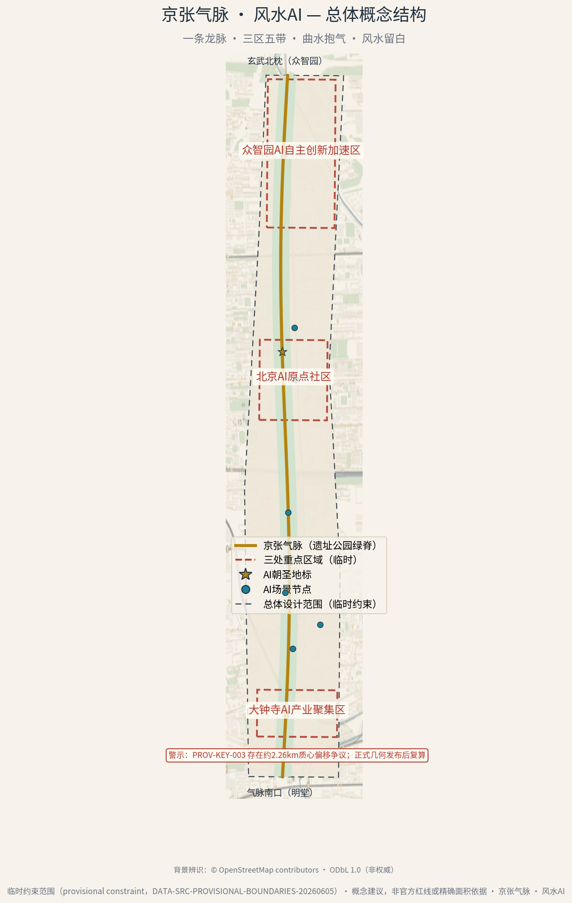
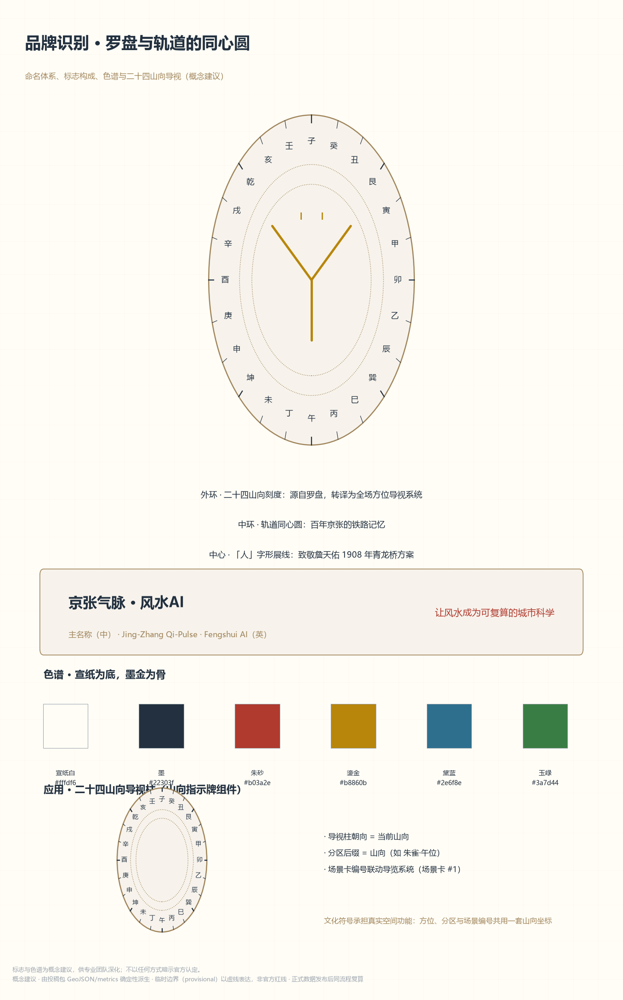
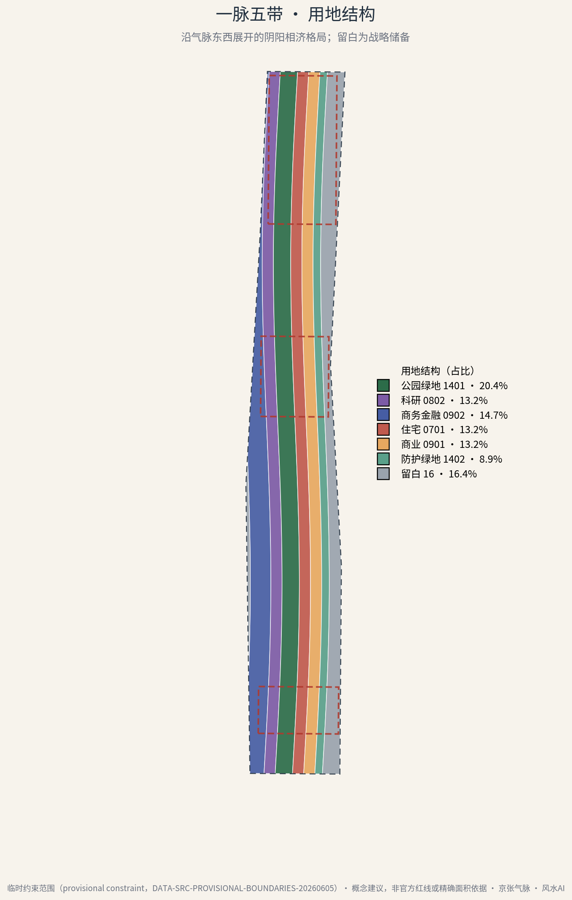
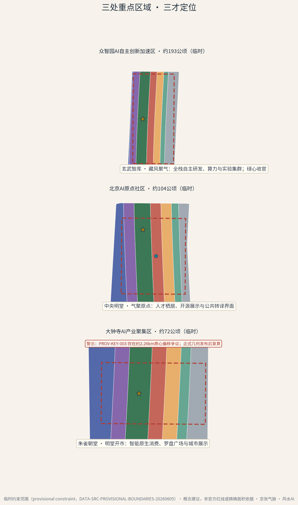
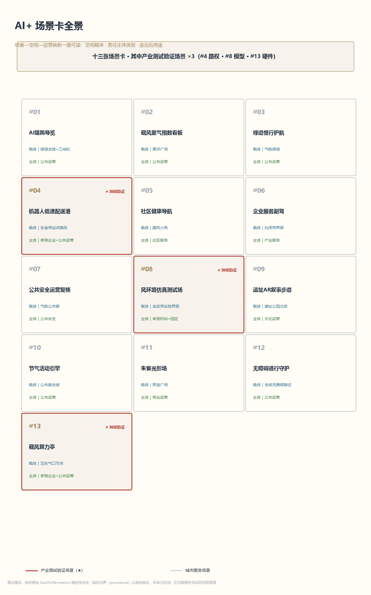
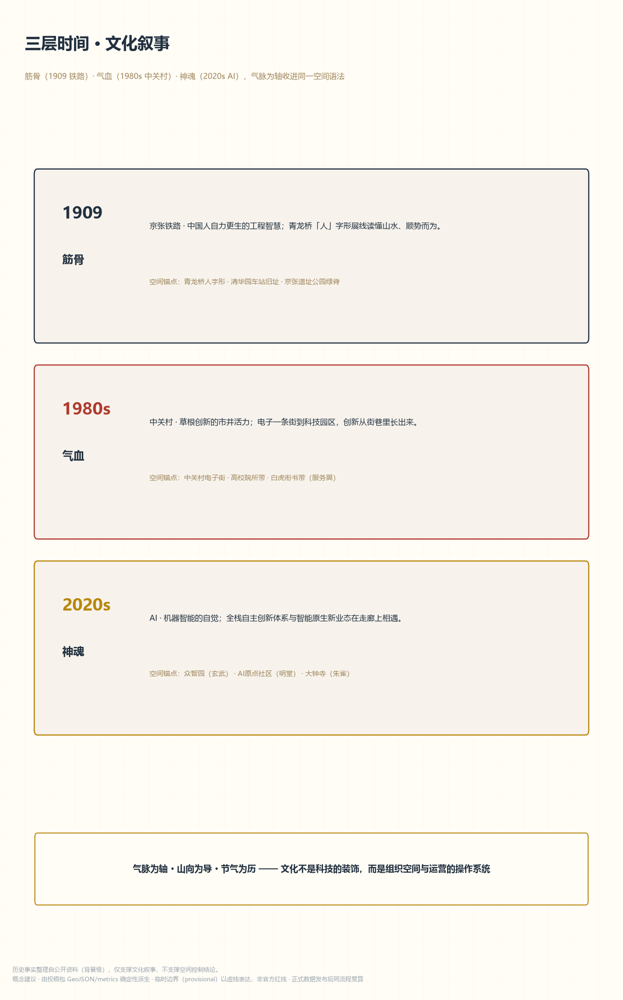
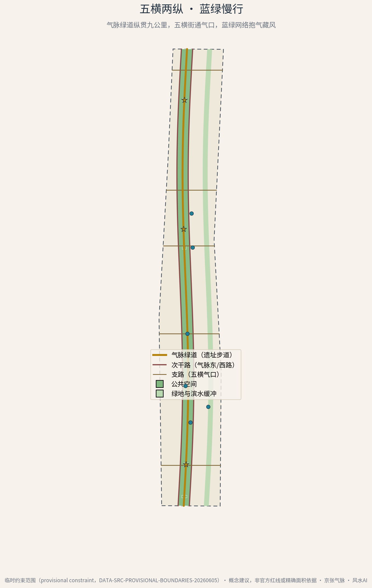
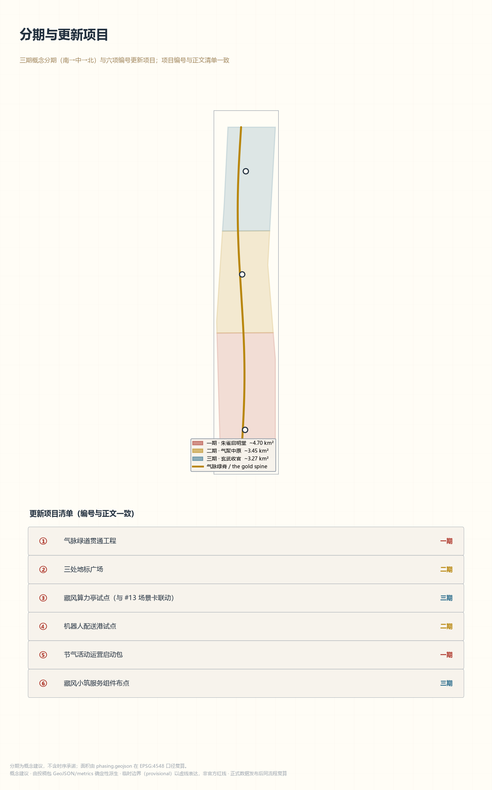
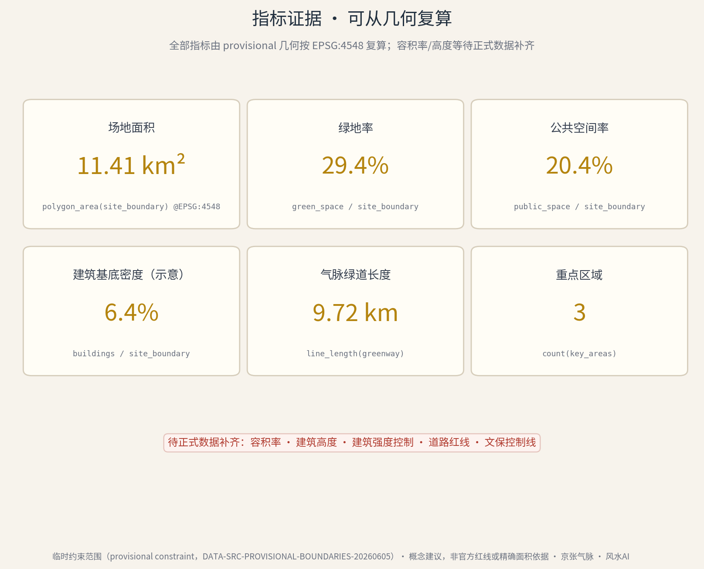

# 京张气脉 · 风水AI

> 一百年前，詹天佑在青龙桥以"人"字形展线告诉世人：好的工程，是读懂山水之后的顺势而为。
> 一百年后，我们带着 AI 回到这条走廊，做一次"第二次堪舆"——这一次，风水不再是玄学口诀，而是可复算的场地性能科学。

**方案性质声明**：本方案为 AI 智能体提交的开放共创概念建议（reference proposal），全部空间与运营内容均为"概念建议/参考方案，可供专业团队深化研究"，不构成法定规划结论、政府审定意见或实施承诺。

**读本导引**。全文十二章按"依据—框架—统筹—总体—重点—场景—用地—交通—蓝绿—实施—指标—风险"推进，配十一张图件（总览、用地结构、重点区、重点区分层详图、大钟寺街区概念板、场景卡、品牌、文化叙事、分期项目、慢行蓝绿、指标证据）与一组多媒体（封面、中英音频导览、概念视频）；每章围绕一个设计判断展开，证据标记（`[source:]`、`[metric:]` 等）只挂在直接支撑该判断的条目上，完整机器索引在 `sources.json`、三个矩阵与 GeoJSON 图层中。赶时间的评审者可先读"三层范围工作框架"的传导表与"多模态表达"一节，两分钟即可抓住方案主轴。

## 设计依据与资料清单

本方案以北京市规划和自然资源委员会海淀分局《百年京张AI创新带城市设计国际方案征集资格预审公告》为第一依据，以仓库 site package 的结构化任务书、枚举、指标区间与资料登记为机器可读约束，并以面向智能体的开源征集任务书界定六项必答任务与统一边界条款 [source:OFFICIAL-ANNOUNCEMENT] [source:AGENT-TASKBOOK]。

**资料使用边界**。方案区分三类资料：公告与任务书等可作为正式依据的公开资料；仓库提供的临时粗略范围（provisional constraint），仅用于生成、可视化与临时自检；以及京张铁路史、清华园车站旧址、风水概念等背景资料，只支撑文化叙事，不支撑空间控制结论 [source:DATA-SRC-PROVISIONAL-BOUNDARIES-20260605] [source:SRC-JINGZHANG-RAILWAY-HISTORY]。完整来源、用途与限制登记于 `sources.json`。

**已确认的资料缺口**。官方精确红线、三处重点区域正式 polygon、控规指标（容积率、建筑高度、建筑密度）、道路红线、文保控制线与市政管线目前均无公开可用的权威几何或数值；本方案以临时约束范围开展概念设计，相关指标均按临时几何在 EPSG:4548 下复算并保留复算触发条件 [source:PROCESSED-FACT-PACK]。此外，我们注意到社区 Issue #1029 对临时重点区 PROV-KEY-003（大钟寺）质心位置的质疑，本方案仅将其作为南北序列中的粗略重点区对待，不据其推导任何精确结论。

**资料阅读方法**。除公告与任务书外，本方案完整读取了 site package 的枚举（用地代码、道路等级、建筑类型）、规划限值区间、专业标准清单与其本地参考快照，以及仓库处理资料包（事实导航、任务要求矩阵、来源用途矩阵与缺口清单）[source:SITE-PACKAGE] [source:PROCESSED-FACT-PACK]。这些结构化输入决定了用地代码的取值域、道路等级的命名与指标的合理区间；正文只回引直接支撑当前判断的条目，完整覆盖登记于各矩阵文件。

**生成方法披露**。本方案由多智能体协作完成：初稿由 AI 智能体（opencode，模型 kimi-k3）生成，迭代由 zcode（模型 GLM-5.3）深化；v1.3 阶段署名为「同济设计AI云：DeepSeek Harness + ox-alpha 以及子智能体 Codex（GPT-5.6-Sol）+ Claude Code（Claude Opus 5）」，人类参与者 hechushitaoyuan 全程负责指令定调、范围确认与成果审定。空间图层由 Python（shapely/pyproj）从临时边界确定性派生，图件由 matplotlib 从同一几何渲染，正文由智能体撰写并经人类指令定调。关键公式与几何可由 metrics.json 于 EPSG:4548 复算；生成脚本于作者环境留存，深化阶段按需提供，符合共创原则的生成方法披露要求 [standard:PROJECT-AGENT-OPEN-CALL-TASKBOOK]。

**外部上下文数据层（背景辨识）**。为在区域尺度辨识走廊的蓝绿与建设本底，方案另取一份 OpenStreetMap 快照作为**纯背景参照层**：bbox（WGS84 南,西,北,东）39.92,116.31,40.06,116.39，快照时间 2026-08-22T18:47Z 前后；经 Overpass API 抽取七类要素——waterway 109、green 1780、amenity（节点口径）2424、road 4636、railway 267、building 14740、公共交通站点 2563，合计 26,519 条。其中 building 计数 14,740 含量关系，图面渲染取 way 级 14,648。来源标注：© OpenStreetMap contributors · Overpass API · ODbL 1.0。配套图件 `context-basemap.png` / `context-basemap.en.png` 仅作可视化。该层有三条硬性范围声明：仅用于背景辨识；不参与任何边界、用地、道路或指标计算；不作测绘成果或审批底图使用 [source:SRC-OSM-CONTEXT-SNAPSHOT]。

*读图：先找纵贯南北的金脊，再看三区（北藏·中聚·南朝）与五带的东西分野；虚线为临时边界，正式数据发布后整图复算。*

## 三层范围工作框架

方案严格对应公告的三层范围，并将风水"龙—砂—水—穴"的形势框架映射为逐层聚焦的工作方法 [source:OFFICIAL-ANNOUNCEMENT] [depth:site_scale_hierarchy]：

- **统筹研究范围（约 43.6 平方公里）**：对应"寻龙望气"层。在区域尺度研究产业协同、山水格局与创新网络，不划定空间边界，结合海淀分区规划导向形成战略判断 [source:SRC-HAIDIAN-DISTRICT-PLAN]。
- **总体设计范围（约 11.4 平方公里）**：对应"点穴立向"层。以临时约束范围为工作底图 [data:geometry/site_boundary.geojson#SITE-001]，完成控规深度的概念性城市设计，全部用地、指标与图件由此派生 [metric:site_area_sqm]。
- **重点范围（约 369.3 公顷）**：对应"理气精微"层。对众智园、AI原点社区、大钟寺三处重点区做详细设计概念 [data:geometry/key_areas.geojson]。

三层范围共用同一套"气脉"坐标：南北向的京张遗址公园绿脊是全场的脊线与明堂轴，所有图层、指标与图件均以它为参照系生成。临时边界在图面中一律以虚线淡色表达，正式数据发布后，用地划分、绿地与公共空间、建筑体量和全部指标将按同一流程自动复算更新。

三层的成果互相传导而非各自成文：统筹层产出战略判断与生态组织方式（不画边界）；总体层把判断转译为用地结构、蓝绿骨架与交通组织（全划分、可复算）；重点层在三个聚焦片区把结构再细化到场所与场景（设计要点 + 场景落位）。反过来说，任何一处重点区设计都能沿"结构判断 → 用地分带 → 场所落位"回溯到统筹层的一条主张，这是本方案可被继续深化、也可被整体替换的模块化方式。

三层成果的传导关系可以概括为一张对照表：

| 统筹层判断 | 总体层结构 | 重点层落位 |
| --- | --- | --- |
| 风水=场地性能算法，AI 负责转译 | 气数数据层沿绿脊布设感知设施带 | 藏风算力亭（#13）、仿真测试场（#8） |
| 生态需要"藏聚朝"三种界面 | 三区五带的南北分异 | 玄武深研 / 明堂客厅 / 朱雀展贸 |
| 文化三层时间收进一个空间语法 | 绿脊为轴、山向为导、节气为历 | 三处地标母题（环/线/盘） |

## 统筹研究范围产业与未来城市研究

**总体概念：第二次堪舆**。我们把风水重新定义为"前工业时代的场地性能算法"——藏风聚气是微气候，山环水抱是蓝绿安全格局，龙脉是线性基础设施走廊，阴阳是动静与昼夜的节律。结合中关村科学城人工智能创新高地政策导向 [source:SRC-ZHONGGUANCUN-POLICY]，AI 的任务不是复刻口诀，而是把这些经验法则转译为可计算、可验证、可运营的当代指标：风环境代理模型、步行舒适度、绿视率、人流热度与文化叙事的统一数据层。我们称之为**"气数"（Qi-as-Data）**——本方案提出的一套把不可见"气"转为可复算指标的概念转译框架（可测量性以包内登记的方法与临时几何为口径，供专业团队深化验证）[standard:PROJECT-AGENT-OPEN-CALL-TASKBOOK]。

与既有城市性能模型和数字孪生方法的可验证差异在于：若同一包内几何被替换或复核，本框架要求文化叙事、场景治理与蓝绿公共性指标沿同一证据链重算；增量口径不是替代既有方法，而是把文化语义、无 AI 通道与退出公共资产约束纳入同一复算边界。

| 既有方法 | 本框架增量口径 | 可验证差异 |
| --- | --- | --- |
| 城市性能模拟 | 在性能指标之外，将文化叙事与场景治理纳入同一复算边界 | 若包内几何变更，则绿地率等指标与文化治理约束同步复核 [metric:green_ratio] |
| 数字孪生 | 在状态映射之外，补充无 AI 通道与退出公共资产约束 | 若试点开放，则以通道数量和恢复时限键名核对承诺 [metric:no_ai_equivalent_route_count] [metric:degradation_recovery_hours] |
| 线性遗产运营 | 在廊道运营叙事之外，给出可由临时几何复算的分期公共口径 | 若几何或分期变更，则绿道长度与分期公共率按键名重算 [metric:greenway_length_m] [metric:phase_1_green_ratio] |

四次转译构成"气数"的工作定义，每一次都指向一个已在城市科学中成熟的量测对象：

| 风水原型 | 当代转译 | 可计算对象 | 本方案载体 |
| --- | --- | --- | --- |
| 藏风聚气 | 微气候舒适 | 风速、温度、声环境的代理模型 | 场景卡 #2 指数看板、#8 仿真测试场 |
| 山环水抱 | 蓝绿安全格局 | 绿地连通性、雨洪调蓄容量 | 曲水抱气带与绿脊 [data:geometry/green_space.geojson] |
| 龙脉 | 线性基础设施走廊 | 廊道连通度与沿线活力 | 气脉绿道 [metric:greenway_length_m] |
| 阴阳（动静昼夜） | 活动节律 | 分时段人流热度与能耗 | #10 节气活动引擎、#11 朱雀光影场"养阴"模式 |

**命名与视觉识别**。主名称"京张气脉 · 风水AI"，英文名 "Jing-Zhang Qi-Pulse · Fengshui AI"，传播语"让风水成为可复算的城市科学"。Logo 方向（概念建议）：罗盘与轨道同心圆的叠合——外圈取罗盘二十四山向刻度，中环是轨道同心圆，中心嵌入"人"字形轨道符号，致敬詹天佑 1908 年青龙桥展线；配色为宣纸米白（底）、墨（线与正文）、朱砂（重点与警示）、鎏金（主轴与荣誉），辅以黛蓝（水与研究）与玉绿（生态与生活）。二十四山向同时转译为全场的方位导视系统：分区后缀、导视柱朝向与场景编号共用一套山向坐标，让文化符号承担真实的空间功能。

*读图：标志构成自外向内三层——二十四山向环、轨道同心环、中心人字形；中段为六色色谱与各自用途。*

**全球案例与可转化机制**。我们选取八个与"线性遗产 + 创新生态 + 东方智慧"相关的公开案例（背景级整理，详见 `sources.json`，引用事实以公开报道为准，落地前需专业团队复核）[source:SRC-GLOBAL-CASE-REFERENCES]：

| 案例 | 关键事实（公开常识级） | 可转化机制 | 在本方案的落点 | 明确不迁移 |
| --- | --- | --- | --- | --- |
| 纽约 High Line | 废弃高架铁路 2009 年起分段再生为线性公园 | 遗产廊道的分段开放与运营节事 | 气脉绿道的分段贯通与节气活动体系 | 悬空高架形态与旅游化的人流密度 |
| 伦敦 King's Cross | 铁路遗产区再生为科技企业与公共领域复合区 | 遗产界面 + 企业锚定 + 公共广场 | 原点社区的"四水归堂"公共客厅与高校锚定 | 大体量整体开发模式（本方案以存量更新为主） |
| 首尔清溪川 | 高架路拆除后恢复线性水脉 | 蓝绿基础设施带动沿线更新 | 曲水抱气带的雨洪调蓄与沿线界面更新 | 拆除既有干道（本方案不预设任何拆除结论） |
| 波士顿 Kendall Square | 依托 MIT 形成产学研高密度街区 | 大学锚定的创新生态 | 玄武智库带的高校院所锚定 | 高密度塔楼群（本方案高度向绿脊递降） |
| 硅谷 Stanford Research Park | 低密度校园式研发园区原型 | 研发用地的景观化组织 | 玄武智库带的研发界面与绿心 | 低密度蔓延（本方案集约使用存量空间） |
| 深圳南山 | 全栈硬件产业链高密度聚集 | 全栈自主创新体系的空间保障 | 众智园"全栈自主创新"定位的思路来源 | 制造业用地占比（海淀走廊以研发与场景为主） |
| 新加坡碧山-宏茂桥公园 | 混凝土水渠恢复为自然河道公园 | "曲水抱气"的当代水敏感工程实证 | 曲水抱气带的概念原型 | 全线自然化河道的工程规模（本方案仅意向性滨水带） |
| 京都历史街区 | 传统街巷格局的活态保护与运营 | 文化格局作为长期运营资产 | 三层时间叙事与山向导视的长期运营 | 严格的风貌法定管制（本方案仅做概念色谱与界面原则） |

八个案例合起来提示两条经验：其一，线性遗产的再生成败不在"造型"而在**分段开放与持续运营**的能力——High Line 与清溪川都是先开一段、以运营养后续；其二，创新生态需要**公共界面**作黏合剂——King's Cross 的广场、Kendall 的街区密度都在把"-private 的创新"翻译成"public 的日常"。这两条恰好是"明堂聚气"的现代注脚，也是本方案把最大投入放在公共廊与三处广场上的原因。

**生态组织**。众智园承接"AI全栈自主创新体系"（藏，玄武之位）；AI原点社区承接"世界级AI创新生态"的公共界面（聚，明堂之位）；大钟寺承接"智能原生新业态"的展示交易（朝，朱雀之位）；中关村科技服务翼提供资本与服务（白虎），小月河场景赋能翼提供场景与水岸活力（青龙），与三大定位、五大功能一一对应。五大功能按"策源—转化—展示—服务—场景"展开：全栈自主创新策源（众智园）、创新生态公共客厅与转化（原点社区）、新业态展示交易（大钟寺）、科技金融与专业服务（白虎翼）、场景开放与水岸体验（青龙翼）。

**区域协同**。一带不是孤立走廊，而是北京创新格局中"南联北引"的竖轴：向南衔接中关村大街创新轴与北纬社区的城市更新经验；向北呼应未来科学城与怀柔科学城的科研纵深，承接其成果转化与场景需求；向东对接经开区的高端制造产业链，为"模型出实验室"提供产线接口；在京津冀尺度上，与天津、河北的算力与制造腹地构成"研发在海淀、算力在周边、场景在区域"的分工概念。协同方式以机制为主、以空间为辅：场景卡对协同对象开放认领，节气活动体系设区域专场，"金石录"荣誉体系登记跨区域贡献 [standard:PROJECT-AGENT-OPEN-CALL-TASKBOOK]。上述协同均为概念建议，不预设任何具体合作承诺。

## 总体设计范围城市更新与控规深度城市设计

**现状诊断（基于公开背景资料的概念性判读）**。这条走廊的现实底子可以概括为"一脊、两翼、多院"：一脊是已绿化的京张遗址带；两翼是西侧的高校院所与研发楼宇、东侧的居住与商业界面；多院是沿线大量校园、单位与小区的封闭院落。由此得出五条问题清单，每条都对应后文的一个空间动作：

| # | 现状问题（概念性判读） | 对应空间动作 |
| --- | --- | --- |
| 1 | 绿脊已成形但两侧界面封闭，"有脊无脉" | 绿脊界面打开：围墙改造、入口与驻留点增补 |
| 2 | 创新功能与城市生活隔院相望，缺乏公共接口 | 明堂客厅与三场五节点公共空间体系 |
| 3 | 慢行网络被城市干道切割，过街与接驳体验差 | 气口横街与三级慢行体系 |
| 4 | 蓝绿系统有绿地缺连通，雨洪与生物廊道断点未整合 | 曲水抱气带的调蓄与廊道复合 |
| 5 | 存量楼宇界面老旧，缺乏可识别的创新场所形象 | 品牌识别系统与山向导视的全场覆盖 |

上述判读基于背景级资料与常识性观察 [source:PROCESSED-FACT-PACK]，不构成现状权属或建筑安全的结论。

**空间结构：一条龙脉，三区五带，曲水抱气，风水留白**。在约 11.4 平方公里临时约束范围内，用地沿微呈 S 形的"气脉"（遗址公园绿脊）东西分带展开，形成阴阳相济的指状格局 [data:geometry/land_use.geojson]：

- **京张气脉主廊**（公园绿地 1401，约 335 公顷绿地系统的核心）：百年铁路遗址转译为纵贯南北的线性公园，是全场的明堂与风廊 [metric:land_use_area_14_green_sqm]。设计要点：全段慢行优先、界面通透、节点间距按"一刻钟歇脚"组织。
- **玄武智库带**（科研 0802）与**白虎衔书带**（商务金融 0902）居西侧，主藏主成，承接研发与资本服务。设计要点：安静的深研氛围、向绿脊开窗的实验界面、服务入口朝城市干道。
- **朱雀栖居带**（住宅 0701）与**青龙得水带**（商业 0901）居东侧，主朝主生，承接人才生活与场景消费。设计要点：15 分钟生活圈配套、沿气口横街的商业活力界面、滨水段的首层开放。
- **曲水抱气带**（防护绿地 1402）沿东侧水意向布置，涵养气脉。设计要点：雨洪调蓄与生物廊道的复合、步行可进入的野趣段与管控段分明。
- **风水留白**（留白用地 16，约 16.4%）：东西外缘保留战略储备，承认未来不可预见——这是风水"知白守黑"的规划转译，也是国土空间弹性留白的概念呼应 [standard:MNR-LAND-USE-CLASSIFICATION-GUIDE]。设计要点：期内以苗圃、临时展场与低维护绿地持有，不预设用途。

*读图：一脉居中、五带左右相济、留白守外缘；图例带用地代码，色块上的文字标注即无障碍冗余编码。*

**更新策略**。总体设计范围以存量更新为主：保留高校、既有产业楼宇与铁路遗存等"筋骨"，改造低效界面，植入沿气脉的公共空间与场景节点；具体地块的拆改留、容积率与高度控制全部留待官方控规条件确认，本方案不给出任何法定指标结论 [depth:development_intensity_controls]。更新在空间上沿三个界面展开：绿脊界面（打开围墙、增补入口与驻留点）、气口界面（横街两侧的首层激活与骑楼化改造）、院落界面（单位与小区的边界柔性化与分时开放）。城市风貌以"轩敞通透、让风穿城"为原则组织廊道与界面，避免在气脉上形成密闭围墙式的开发。

## 重点区域详细设计

三处重点区按"三才"定位组织详细概念设计（临时粗略范围，不据此推导精确结论）[data:geometry/key_areas.geojson] [depth:three_key_area_detailed_design]：

**众智园AI自主创新加速区 · 玄武智库（北枕，主藏）**。定位"AI全栈自主创新体系"的空间容器：概念性布局研发楼群、实验设施与藏风塔地标，北区尽端以绿心收束气脉，形成"背靠玄武"的稳定格局 [data:geometry/key_areas.geojson#PROV-KEY-001]。设计要点：安静的深研氛围、可控的算力设施界面、与气脉保持视线与步行通廊。

落位逻辑与边界条件。众智园是三区中唯一"向内收"的片区：界面策略是外密内疏——临城市干道一侧保持完整的研究形象，临绿脊一侧逐级跌落并向公共开放；藏风塔既是方位地标也是"算力设施的公共面孔"，概念上把散热、供能与展示功能合一（工程可行性待专业测算）。该区与场景卡 #8 风环境仿真测试场、#13 藏风算力亭直接耦合，是产业测试验证场景最集中的片区；相应的数据治理边界也最严——测试数据本地处理、不留个人数据、退出条款与场景卡一致。

**北京AI原点社区 · 明堂聚气（中枢，主聚）**。定位世界级创新生态的公共客厅：人才公寓、开源展示廊、人字回澜台地标与原点广场构成"四水归堂"的汇聚格局 [data:geometry/key_areas.geojson#PROV-KEY-002]。设计要点：15 分钟生活圈的概念性组织、高校界面的开放策略、青年友好的第三空间网络；若人才公寓进入深化，则应在空间组织上预留可负担居住的概念接口（共享配套、弹性户型与非歧视准入），不预设任何租金数字。

落位逻辑与边界条件。原点社区是"四水归堂"的当代转译：高校（北侧知识水源）、绿脊（西侧生态水源）、居住带（东侧生活水源）与商务带（南侧资本水源）四股人流在此汇聚，广场与展示廊是"堂"。第三空间网络按"五百米一驿"概念布点（咖啡馆、开源工坊、路演角），与藏风小筑共用构筑物。该区承载场景卡最多（#1、#2、#5、#10 等），公共运营机构的统筹责任也最重；所有场景保留无 AI 通道，广场在无任何智能层时仍是完整的城市客厅。

**大钟寺AI产业聚集区 · 朱雀朝堂（南朝，主朝）**。定位智能原生新业态的展示与交易界面：罗盘广场·AI堪舆台地标、商业盒群与南入口明堂广场形成开阔的"朝案"空间 [data:geometry/key_areas.geojson#PROV-KEY-003]。设计要点：展示性、可达性与消费场景的复合；同时明示临时重点区位置存在社区质疑（Issue #1029），正式数据发布后需复核。

落位逻辑与边界条件。大钟寺是走廊的"南门户"与第一印象：罗盘广场直接对话轨道站点的到达人流，AI堪舆台把"气数"看板放大为城市尺度的展示装置（能耗受控，22 时后进入养阴模式，对应场景卡 #11）。商业盒群采用"小盒群、大界面"的概念组合，避免单一大体量对明堂的压迫。该区界面最公共、改造预期最复杂，权属与现状建筑核实是深化阶段的第一前提；本方案仅给概念性布局，不涉及任何具体地块拆改结论。

三处重点区共用一套设计语言，保证"一方案三片区"而不是"三个方案"：地标都取自罗盘—轨道的同心圆母题（藏风塔取"环"、人字回澜台取"线"、罗盘广场取"盘"）；界面都遵守"向绿脊通透、向城市干道成界面"的双面规则；场景导入都经过同一张场景卡表的载体与退出条款约束。片区之间的差异只应来自定位差异——藏、聚、朝——而不是风格差异。

*读图：三区的定位差异看地标母题——藏风塔取"环"、人字回澜台取"线"、罗盘广场取"盘"；注意 PROV 虚线与 Issue #1029 位置争议标注。*

## AI 创新生态、人才画像与 AI+ 场景

**用户画像（七类）**：深研的 AI 研究员（玄武智库带）、开源社区的开发者（原点社区）、五道口的高校学生、场地原住的老居民、远道而来的"朝圣"访客、高频穿行走廊的外卖骑手与配送员、以及走廊内外的租户与非京籍青年 [standard:PROJECT-AGENT-OPEN-CALL-TASKBOOK]。每类画像的"需求—空间响应—自检边界"映射如下，空间响应列同时给出对应的场景卡编号：

| 画像 | 典型需求 | 空间响应（场景卡） | 自检边界 |
| --- | --- | --- | --- |
| AI 研究员 | 安静深研界面、可控实验载体 | 玄武智库带实验界面；#8 仿真测试场、#13 算力亭 | 测试数据本地处理，不留个人数据 |
| 开源开发者 | 可展示、可协作的公共界面 | 原点社区开源展示廊；#1 导览、节气市集 | 报名聚合数据，不追踪个人画像 |
| 高校学生 | 低价高频的第三空间 | 青龙得水带与藏风小筑；#5 健康导航问询 | 一次性服务请求，不留健康记录 |
| 老居民 | 熟悉的日常服务、不依赖智能手机 | 藏风小筑人工服务台；#5 的人工通道 | 全场景保留非数字等价通道 |
| 朝圣访客 | 可带走的文化叙事 | 三处地标与 #1 导览、#9 AR 步道 | AR 非接触叠加，不触文物本体 |
| 骑手/配送员 | 安全高效的穿行与停靠 | 气口横街与配送港；#3 慢行护航、#4 配送港 | 设备运行日志，不采集收件人数据 |
| 租户与非京籍青年 | 可负担的居住与就业过渡界面、低门槛公共第三空间 | 原点社区青年第三空间；#5 服务导航、#10 节气活动、#6 企业服务副驾 | 若涉及居住服务，则以公开规则与聚合统计为界，不留身份敏感画像；全部场景保留无 AI 通道 |

**无障碍与包容性核验（量化）**。本方案已按承诺方法完成 v1.5 色板整改，并对图件语义色板（11 色）重做四类色觉条件下的 CIEDE2000 两两色差核验 [metric:a11y_color_pair_count]：色觉模拟采用 Machado 等（2009）二色觉矩阵（严重度 1.0）[source:SRC-MACHADO-2009-CVD]，色差采用 CIEDE2000（Sharma 等 2005 实现，经论文官方测试向量 5/5 自检通过）[source:SRC-SHARMA-2005-CIEDE2000]，判定阈值 ΔE00 ≥ 20 [source:SRC-A11Y-CHECK-V12]。按 SRC-A11Y-CHECK-V12 登记方法复检，结果为：正常视觉中位色差 37.4（6/55 对低于阈值）、绿盲 35.5（10/55）、红盲 32.6（9/55，基线 13）、蓝盲 37.7（11/55），共 36 对例外 [metric:a11y_color_pair_fail_count]（基线 39）。整改成效：古铜金↔琥珀由四类全败转为四类全部通过；鎏金↔琥珀、鎏金↔古铜金逐条件全面收敛；双黛蓝最劣色差由 3.4 提升至 8.6；红盲条件例外由 13 对降至 9 对。残差成对登记为跨族近邻在特定色觉下的物理极限，图件文字冗余编码兜底不变 [depth:accessibility_palette_remediation]。

色板整改登记覆盖上述八项映射、逐条件复检与残差例外 [depth:palette_remediation]。

| 色觉条件 | 色对数 | 中位 ΔE00 | 最小 ΔE00 | 低于阈值 |
| --- | --- | --- | --- | --- |
| 正常 | 55 | 37.4 | 15.5 | 6 对 |
| 绿盲（deuteranopia） | 55 | 35.5 | 4.3 | 10 对 |
| 红盲（protanopia） | 55 | 32.6 | 7.5 | 9 对 |
| 蓝盲（tritanopia） | 55 | 37.7 | 9.8 | 11 对 |

残差集中在同族近邻与特定色觉下的跨族近邻（如朱砂↔古铜金、鎏金↔古铜金/琥珀、双黛蓝），属色觉模拟的物理难点；本节不宣称零残差或真人无障碍测试。**图件仍不单靠颜色传义**：每条用地带标注带名与用地代码、场景卡带编号、分期带"一期/二期/三期"文字标注——文字冗余编码覆盖全部类别区分，逐对残差不造成信息丢失。完整例外清单与逐对数值登记于 `visual/assets/a11y-color-check.json`，核验方法与复算路径在 `sources.json` 条目 SRC-A11Y-CHECK-V12 披露。风险章第 ⑤ 条（弱势群体等价通道）与本节互为呼应。

**包容性硬指标声明（概念承诺）** [depth:inclusion_hard_metrics]。本方案对 AI 与包容性的关系做出两项结构性承诺：① **等价非 AI 路径（no-AI-equivalent route）**：全部十三张场景卡均设"人工接管 · 无 AI 通道"列，保证任何智能服务均有不依赖 AI 的等价替代路径；场景开放前，无障碍与包容性守护者（R-A11Y-INCLUSION-GUARDIAN）须验收该通道独立可用 [metric:no_ai_equivalent_route_count]。② **降级不劣化（refuse-not-to-degrade）**：AI 系统降级或停用时，服务品质不低于无 AI 基线；退出后空间用途列所声明的公共资产功能须在场景下线 24 小时内完全恢复 [metric:degradation_recovery_hours]。两项承诺在场景卡表、气数协议、条件验收门和岗位规格四重交叉约束。

**AI+ 场景卡（十三张，概念建议，★=产业测试验证场景）**——每张卡按统一字段展开，本身就是场景-空间-运营映射：空间载体落到具体带/节点；最小数据坚持数据最小化与匿名边界；人工接管与无 AI 通道保证智能层失效时服务不中断；责任主体只写组织类型、不预设具体单位；退出后空间用途保证场景下线后城市仍有用 [metric:scenario_card_count]。十三卡中三张为产业测试验证场景（#4、#8、#13），满足任务书"不少于三个"的要求 [metric:testbed_count]：

| # | 场景与主旨 | 空间载体 | 最小数据与边界 | 人工接管 · 无AI通道 | 责任主体类型 | 退出后空间用途 |
| --- | --- | --- | --- | --- | --- | --- |
| 1 | **AI堪舆导览**：二十四山向方位系统讲述铁路-中关村-AI 三层时间 | 气脉绿道全线与三处地标广场 | 匿名定位请求，不留轨迹画像 | 实体导览牌与志愿者讲解 | 公共运营机构 | 导览牌与停留节点 |
| 2 | **藏风聚气指数看板**：风温声绿视率演算为公众可读的"气数" | 原点广场界面与线上 | 微气候传感聚合数据，无个人数据 | 现场纸质公示版 | 公共运营机构 | 环境公示牌 |
| 3 | **绿道慢行护航**：9.7 公里绿道的照明、救援与无障碍伴行 [metric:greenway_length_m] | 气脉绿道全线 | 匿名求助信标 | 紧急呼叫柱与巡查员 | 公共运营机构 | 照明与座椅系统 |
| 4 ★ | **机器人低速配送港**：限定低速、限定路段、限定时段的配送试点 | 朱雀栖居带试点路段 | 设备运行日志，不采集收件人数据 | 人工配送通道并行 | 参测企业+公共运营机构 | 配港转为社区物流驿站 |
| 5 | **社区健康导航**：面向老人与居民的公共服务导引 | 藏风小筑服务组件 | 一次性服务请求，不留健康记录 | 人工服务台 | 社区服务机构 | 服务亭 |
| 6 | **企业服务副驾**：政策、场景与投融资信息的可信检索 | 白虎衔书带服务界面 | 企业授权查询数据 | 综合窗口人工受理 | 产业服务机构 | 咨询角 |
| 7 | **公共安全运营复核**：人流热度匿名态势感知 | 气脉公共廊 | 人流热度聚合，无人脸识别 | 常态人工值守 | 公共安全机构 | 监控与照明基础设施 |
| 8 ★ | **风环境仿真测试场**：面向建筑与无人机团队的通风廊道代理模型验证 | 玄武智库带实验界面 | 委托方模型+场地气象数据 | 现场安全员 | 参测机构+园区运营 | 实验展示场 |
| 9 | **遗址AR叙事步道**：清华园车站旧址方向的历史图层叠加 | 遗址公园北段 | 非接触数字叠加，文保范围待官方确认 | 实体解说牌 | 文化运营机构 | 遗址步道本体 |
| 10 | **节气活动引擎**：以二十四节气排布全年公共活动 | 气脉公共廊全线 | 报名聚合数据 | 人工策划与现场引导 | 公共运营机构 | 活动场地 |
| 11 | **朱雀光影场**：能耗受控的夜间光影，22 时后"养阴" | 大钟寺罗盘广场 | 能耗计量数据 | 常规照明 | 商业运营主体 | 夜间广场 |
| 12 | **无障碍通行守护**：视障与行动不便者全程伴行 [standard:BARRIER-FREE-ENVIRONMENT-LAW] | 全线无障碍路径 | 用户授权的服务请求 | 人工伴行预约 | 公共运营机构 | 无障碍设施本体 |
| 13 ★ | **藏风算力亭**：低功耗边缘推理微站的端侧试验站 | 五处气口横街节点 | 设备能耗与运行日志，本地处理无个人数据 | 现场停用按钮+值守 | 参测企业+公共运营机构 | 照明/充电/导览亭 |

三张测试验证场景的产业指向各有分工：#4 验证机器人在真实人流中的路权与安全，#8 验证微气候代理模型的工程精度，#13 验证端侧模型在真实微气候与断续网络下的能耗与时延——三者合起来正好构成"算法-模型-硬件"的完整测试谱系，也是"气数"数据层从研究走向产业的第一段路。全部十三卡均为概念建议，参测机构、时段与路段在正式开放前须经专业团队与相关主管部门确认。

读卡方式提示：评审者可从三列快速核对一张卡的成立性——"空间载体"列回答它落在哪（对 `public_space.geojson` 的 plaza/节点系统），"最小数据与边界"列回答它需要什么、不需要什么（隐私红线在此），"退出后空间用途"列回答它撤出后城市剩下什么（公共性兜底在此）。一张卡若说不清其中任何一列，就不应该开放。

### 产业测试验证场景 · 最小验收矩阵

**本矩阵为概念框架，不是实测报告**。三个产业测试验证场景（#4/#8/#13）目前均未启动、未获任何官方授权，本方案亦未开展任何现场实测、标定或委托测试；下表给出的是"若试点启动，则应当先把哪七件事写清楚"的验收骨架——每格均为条件式表述或"应标定维度"，全部具体数值应由实施主体会同相关主管部门与专业机构在深化阶段标定并公示，本方案一律不预设数值、不替代任何审批。矩阵与场景卡表、气数协议 v0.1（察气—演气—验气—养气）及三期条件门互为约束：三期验收门要求三个场景"完成首轮测试并发布退出复盘"，本矩阵即为那一轮测试的最小验收口径。凡涉及范围、路段与几何的表述仍以临时约束范围（provisional）为口径，正式数据发布后按同一流程复算，不构成法定规划结论 [source:DATA-SRC-PROVISIONAL-BOUNDARIES-20260605] [metric:testbed_count]。

**验收条件量化框架（概念口径）**。三个产业测试场景的验收判据需在深化阶段逐项标定，本方案给出标定维度的量化框架与参考区间作为概念指引 [depth:testbed_acceptance_framework]：

| 场景 | 验收维度 | 概念参考区间 | 标定方法 | 判定协议 |
| --- | --- | --- | --- | --- |
| #4 配送港 | 人车冲突事件率 | ≤ 0.5 次/千配送·公里（条件式：实施主体标定） [depth:delivery_conflict_rate] | 视频+传感器融合计数，holdout 对照区段 | 连续两周期超标 → 停用并公示 |
| #4 配送港 | 无障碍净宽保持率 | ≥ 95%（条件式：净宽 ≥ 1.8m 为本方案自设条件值——参照无障碍通行的一般实践设定，非《无障碍环境建设法》条文规定；深化阶段由专业团队按适用技术标准复核）[depth:accessibility_clearance_rate] | 定点测量+巡检 | 低于阈值即日整改 |
| #8 仿真测试场 | 代理模型 vs 基准解 MAE | 概念目标 MAE < 15% 相对误差（条件式：实施方+专业机构标定） [depth:wind_proxy_model_accuracy] | K-fold 交叉验证（k≥5），不少于 3 个工况 [depth:wind_model_validation_protocol] | 超出误差带 → 该轮结论作废 |
| #8 仿真测试场 | 可复现性 | 同一输入集重复 3 次，结果偏差 < 2%（条件式） [depth:model_reproducibility] | 固定随机种子+版本锁定 | 不可复现 → 暂停发布 |
| #13 算力亭 | 单位推理能耗 | 概念指引：≤ 同等云端任务能耗的 120%（条件式） [depth:edge_inference_energy] | 实测功率 × 时长 / 推理次数，对照云端基线 | 超限 → 降频或停用 |
| #13 算力亭 | 端侧推理时延 | 概念指引：p95 < 500ms（条件式：视任务复杂度标定） [depth:edge_inference_latency] | 嵌入式打点计时，采样 ≥ 1000 次 | 超限 → 降级到缓存响应 |
| #13 算力亭 | 断网降级可用度 | ≥ 90% 核心功能可用（条件式） [depth:edge_offline_availability] | 模拟断网 72 小时，记录功能可用率 | 不达标 → 补充本地模型 |

全部数值为概念建议参考区间，不构成实测结论或工程承诺；实际阈值由实施主体在深化阶段会同相关主管部门与专业机构标定并公示。

| 场景 | 基线口径 | 目标阈值 | 失败停止条件 | 人工接管点 | 数据保留策略 | 独立复核方式 | 退出复盘机制 |
| --- | --- | --- | --- | --- | --- | --- | --- |
| #4 机器人低速配送港 | 若试点启动，则以试点路段开放前的人工配送与既有慢行通行状况为对照基线，该基线由实施主体在深化阶段以公开可核数据建立；本方案不提供任何实测基线数值 | 阈值应由实施主体会同交通与安全主管部门在深化阶段标定；本方案仅列应标定维度：低速上限、人车冲突事件率、准点率、无障碍通行净宽保持率 | 条件式：若发生任一涉人身安全事件、或连续两个复核周期未达已标定阈值、或路权公示被撤回，则即时停用并公示 | 现场值守可随时切换至并行人工配送通道（场景卡"人工接管·无AI通道"列）；停用期间配送服务不中断 | 仅设备运行日志，不采集收件人数据；保留期限取最小必要原则，由实施主体随数据治理规则一并声明，到期删除；新增数据项须先登记于场景卡最小数据列（察气）方可启用 | 由独立复核者（R-INDEPENDENT-REVIEW，与全部运营岗互斥）会签开放/停用/扩围；该岗缺岗则场景不得开放 | 首轮测试后发布退出复盘；退出须落在已声明的公共资产上——配送港转为社区物流驿站 |
| #8 风环境仿真测试场 | 若试点启动，则以场地气象观测与委托方基准模型解的对照为基线；本方案关于风环境的全部表述均为概念性代理模型意向，未做任何实测或标定 | 阈值应由实施主体会同专业机构在深化阶段标定；应标定维度：代理模型相对基准解的误差带、可复现性（同输入同输出）、模型版本与适用边界声明的完备度 | 条件式：若误差超出已标定误差带、或结果不可复现、或输出未按"演算估计"标注模型与版本（违反演气），则该轮结论作废并停止对外发布 | 现场安全员；模型结论一律不作为个体或工程决定的唯一依据，专业判断始终留在人一侧 | 委托方模型与场地气象数据分账保存，测试数据本地处理、不留个人数据；委托方数据按约定期限归还或删除 | 独立复核者会签，另加专业机构外部校核——模型口径与误差带须第三方可复算 | 首轮测试后发布退出复盘；退出后空间用途为实验展示场 |
| #13 藏风算力亭 | 若试点启动，则以同等推理任务在常规机房或云端执行的能耗与时延为对照基线；本方案不提供任何实测能耗或时延数值 | 阈值应由实施主体在深化阶段标定并公示；应标定维度：单位推理能耗、端侧时延、断网降级可用度、夏冬极端气温下的可用率、噪声与热排放对周边公共空间的影响限值 | 条件式：若超出已标定的能耗或噪声/热排放限值、或断网时无法降级到本地基础服务、或现场停用按钮失效，则即时停用并公示 | 现场停用按钮 + 值守；智能层停用时亭体仍作照明/充电/导览设施运行（"一处多能"原则） | 仅设备能耗与运行日志，本地处理、无个人数据；聚合结果可公示，原始日志按最小必要期限保留后删除 | 独立复核者会签；能耗公示数据另由堪舆师（R-SITE-READER）转为公众可读口径，供社区独立查阅 | 首轮测试后发布退出复盘；退出后空间用途为照明/充电/导览亭 |

七列的读法是一条闭环：前三列（基线口径—目标阈值—失败停止条件）决定"测什么、算不算过、什么时候必须停"；中间两列（人工接管点—数据保留策略）保证停下来之后城市服务与个人权益都不受损；后两列（独立复核方式—退出复盘机制）保证结论不是自证、退出不是消失。任一列在开放前说不清，该场景就不进入三期条件门 [metric:phase_condition_gate_count]。

### 概念规则 → 首轮实测记录交接格式

**若首轮实测启动，则每条已启用规则应按下述字段形成一条记录；未启动时不得填写任何数值，也不产生任何实测结论。** 记录应由现场复核岗在采样周期结束后交接给独立复核者，原始载体与导出副本的哈希须一致；字段缺失或哈希不一致时，该批记录标记为"待核验"，不得进入验收复盘。

| 字段 | 登记口径 |
| --- | --- |
| 规则ID | 使用既有规则编号或深化阶段分配的稳定编号；不重复、不变更历史含义 |
| 触发条件 | 写明启动采样的条件式判据；未触发则只登记"未触发"，不补测 |
| 读数类型 | 区分连续量、事件计数、状态判定或文本观察；不混用口径 |
| 单位 | 采用国际单位制或主管部门指定单位；无量纲项写"无量纲" |
| 采样频次 | 由实施主体会同专业机构标定；变更频次须留版本与理由 |
| 复核岗 | 登记岗位类型与会签时间；独立复核者缺岗则不得完成交接 |
| 留存期 | 按最小必要原则和数据治理规则声明；到期删除路径须可追溯 |

数据回流格式说明：若采用批量回流，则建议以 UTF-8 CSV 或 JSON Lines 交付，首行为字段名并使用上述七字段；若采用单条回流，则每条对象仍保留相同键名。所有导出文件应附记录批次号、生成时间、软件或人工登记方式、行数与 SHA-256。本节只定义交接结构，不预设传感器选型、数值阈值或任何首轮读数。

**气数协议 v0.1（察气—演气—验气—养气）**。为了让"气数"不停留在隐喻层，本方案把它锻造成一条四步治理协议：**察气**（感知与登记——任何新增数据项先登记于场景卡"最小数据"列方可启用，未登记即停用并公示 [depth:data_registry_completeness]）；**演气**（演算与声明——代理模型输出必须标注"演算估计"并声明版本，不作个体决定唯一依据）；**验气**（复核与双通道——开放/停用/扩围须经独立复核者会签，无 AI 通道经无障碍守护者验收，可复算数字以包内几何复算为准）；**养气**（养护与退出——按节气节奏季度复核，退出必须落在声明的公共资产上）[depth:qi_protocol_acceptance_gates]。协议附七条规则（QP-1 至 QP-7）[metric:qi_protocol_rule_count]，并以一次确定性离线演练自证：脚本逐卡解析本方案双语场景卡表，检查五个结构字段与测试星标，**156 项检查全部通过** [metric:qi_protocol_check_count]——协议与正文逐字对应、可复算。完整协议与演练记录登记于 `visual/assets/governance/qi-protocol.json`；协议为概念治理建议（v0.1），非政府审批流程。

### 气数协议 v0.1 版本演进与社区修订

**若协议进入试点应用，则按下述条件式机制演进** [depth:qi_protocol_evolution]。修订提案主体可为社区代表、任一运营岗、参测机构或专业机构；提案须写明变更理由、影响范围、回滚方式与对既有 QP-1 至 QP-7 的关系。会审由独立复核者主持，无障碍守护者、数据治理相关岗与受影响社区代表参加；涉及模型输出的提案另须专业机构复核。任何新版本不得削弱察气—演气—验气—养气的四步闭环、无 AI 通道或退出公共资产要求。v0.1 及后续历史版本连同会审记录留存于治理档案，当前生效版本在公开界面标注编号与生效日期；本方案不预设具体审批时限。

| 最小字段模板 | 登记要点 |
| --- | --- |
| 模型卡 | 模型版本；训练数据边界；适用范围；失效模式 |
| 数据卡 | 数据版本；来源与授权边界；聚合/匿名口径；停用与删除路径 |

模板为概念治理附件的最小字段集，不替代场景卡"最小数据"列；若某字段无法填写，则对应模型或数据流不进入开放状态。

*读图：朱砂边框加★的三张是产业测试验证卡（#4/#8/#13）；每卡下两行分别是空间载体与责任主体类型。*

**文化叙事（三层时间）**：1909 年的铁路是"筋骨"——中国人自力更生的工程智慧；1980 年代以来的中关村是"气血"——草根创新的市井活力；2020 年代的 AI 是"神魂"——机器智能的自觉。风水的角色是把三层时间收进同一个空间语法：气脉为轴、山向为导、节气为历。这不是把文化当作科技装饰，而是让文化成为组织空间与运营的操作系统 [source:SRC-JINGZHANG-RAILWAY-HISTORY]。落到空间上：筋骨对应绿脊与铁轨遗迹的保育界面，气血对应朱雀栖居带与青龙得水带的市井界面，神魂对应玄武智库带的研发界面——三层时间不是三个主题区，而是同一走廊上叠加的三种密度 [source:SRC-QINGHUAYUAN-STATION]。

*读图：三个时代自上而下——1909 筋骨、1980s 气血、2020s 神魂；底部一条是共同的空间语法。*

## 用地、建筑规模与拆改留方案

用地划分以临时约束范围为底图做全划分（union 与边界完全一致、无重叠、无缺口），结构为：绿地与开敞空间约 29.4%，商业商务合计约 27.9%，科研约 13.2%，住宅约 13.2%，留白约 16.4% [metric:green_ratio] [data:geometry/land_use.geojson]。

| 用地构成 | 份额（临时几何口径） | 对应带 |
| --- | --- | --- |
| 绿地与开敞空间 | 约 29.4% | 气脉主廊 + 曲水抱气带 |
| 商业商务 | 约 27.9% | 青龙得水带 + 白虎衔书带 |
| 科研 | 约 13.2% | 玄武智库带 |
| 住宅 | 约 13.2% | 朱雀栖居带 |
| 留白 | 约 16.4% | 东西外缘 |

**拆改留原则（概念建议）**：保留——高校、既有产业楼宇、铁路遗存等结构性要素；改造——沿气脉的低效界面与围墙；植入——公共空间、场景节点与慢行设施；拆除——仅作为个别界面的概念性建议，全部留待权属、文保与控规条件核实后由专业团队判断 [depth:retain_renovate_demolish]。四类动作的尺度各不相同：保留是"底"，占现状建成环境的绝大多数；改造集中在三个界面（绿脊、气口、院落），是更新的主战场；植入以组件与场景为主，轻介入、可退出；拆除概念上仅出现在个别封闭界面与临时建构筑物，且每处都应在深化阶段单独论证。这一结构保证方案在"最保守执行"（只做保留+植入）时依然成立。

**建筑规模**。概念体量的建筑基底合计约 73.1 公顷、基底密度约 6.4%，为疏朗的公园城市意象服务 [metric:building_density]；容积率与建筑高度依赖未公开的官方控规条件，本方案保持"待正式数据补齐"，不做任何数值承诺 [metric:floor_area_ratio]。

## 交通、轨道、市政与公共服务设施

**慢行优先的"五横两纵"**。气脉绿道（约 9.7 公里）纵贯南北，是唯一的高等级慢行主轴；气脉东路、西路两条次干路沿公园界面组织机动车；五条东西向支路（明堂横街、双清横街、原点横街、学院气口横街、玄武横街）作为"气口"，把两侧城市活力引入气脉 [data:geometry/roads.geojson] [depth:traffic_rail_slow_parking]。全部道路均为概念性中心线，不对应道路红线与工程线位。慢行网络按三级组织：绿道级（全龄无障碍、照明与救援全覆盖）、气口级（过街安全与驻留节点）、街巷级（院落界面的柔性化与分时共享）；三级共用一套山向导视，保证"一次认方向、全线不迷路"。机动车停靠在概念上外置于绿脊两侧的组团接口，绿脊全段限行，货运与配送经气口横街进入配送港（#4）后转低速配送。

*读图：金色主脊是唯一高等级慢行轴，五条横街为"气口"，蓝色系为水意向带与曲水抱气。*

**轨道与接驳**。场地周边轨道站点（五道口、大钟寺等）作为既有锚点，概念上通过"气口"横街与绿道实现步行接驳；接驳组织遵循"站点—气口—绿脊"三级导视，山向坐标同时服务轨道出口的方向指引；不新增轨道线位结论。**市政与新基建**：沿气脉预留感知与通信设施带（微气候传感、Wi-Fi/5G 微站、机器人充换电），该设施带同时是场景卡 #13「藏风算力亭」与 #4 配送港的物理载体；具体容量与路由待专业测算。**公共服务**：按七类画像配置社区服务、健康导航与公共卫生间等"藏风小筑"组件，点位与公共空间的 plaza 系统耦合 [data:geometry/public_space.geojson]；小筑组件遵循"一处多能"原则——同一构筑物在无智能层时仍是照明、座椅与问询的公共设施，确保场景退出后服务不退场。

## 蓝绿空间、公共空间与城市风貌

**蓝绿本底**。绿地系统由气脉主廊与曲水抱气带构成，合计约 335 公顷、绿地率约 29.4%（临时几何口径）[metric:green_ratio]；东侧滨水意向带承担雨洪调蓄与生物廊道的概念功能，具体蓝线以水行政主管部门正式划定为准。蓝绿组织的原则是"连通优先于面积"：在临时口径下我们更关注绿脊—气口—院落三级绿色连接的连续性，以及曲水抱气带作为雨洪通道的下凹空间预留；生物廊道概念上沿曲水抱气带与绿脊北段贯通，避开高密度活动区。

**公共空间体系**。公共空间合计约 233 公顷、占比约 20.4%，由"一廊三场五节点"构成：气脉公共廊全时段开放；罗盘广场、原点广场、观星台广场三处地标性广场；南入口明堂广场等门户节点 [data:geometry/public_space.geojson]。三场对应三重点区的地标母题（盘、堂、台），五节点承担气口方向的门户与集散。公共空间组件库（概念建议）：山向指示牌、节气铺装、可坐式"活石碑"、AI 导览亭与风雨连廊——组件全部为"智能层可退、公共层仍在"的双层设计。

**城市风貌**。以"让风穿城、让气停留"为总原则：气脉两侧界面通透、高度向绿脊递降（概念性建议，具体高度控制待官方条件）；色彩取铁路的钢青、京张的砖红与园林的黛绿，形成可识别的场所色谱。风貌控制概念上分四个界面分别处理：绿脊界面以软质绿化与低矮公共构筑物为主，保证风廊与视线通而不透到底；气口界面允许最高的城市密度与最亮的橱窗，是"气"进出的口岸；院落界面以绿篱、格栅与分时门禁柔性化，保留单位可识别的边界感；临干道界面维持完整庄重的城市立面。照明体系与"阴阳节律"呼应——公共廊基础照明恒定，场景照明随节气与时段调节，22 时后全场进入低照度的"养阴"模式。材质概念上优先可循环的钢、砖、木与透水铺装，呼应铁路遗产的工业记忆。

## 更新项目清单、实施政策与分期计划

**分期（三期，概念建议，由南向北推进；条件门制而非时间表）** [data:geometry/phasing.geojson] [depth:phasing_implementation]：

- **一期 · 朱雀启明堂**（南部，约 470 公顷）：以大钟寺罗盘广场、南入口明堂与气脉南段为先手，快速建立公众感知。一期选择的逻辑是"最快可见"：南部界面现状最公共、改造阻力最小、展示性最强，先用一个可感知的地标广场让周边居民与访客认识这条走廊。
- **二期 · 气聚中原**（中部，约 345 公顷）：成型原点社区与人字回澜台，场景与运营闭环在此验证。二期承接一期聚起的人气，把"来看"转化为"来用"：人才公寓、开源展示廊与场景卡中的大部分城市服务场景在此落地。
- **三期 · 玄武收官**（北部，约 327 公顷）：众智园研发集群与靠山绿心收官，完成创新生态拼图。三期指向"来留"：深研氛围与算力界面需要前两期的运营经验与数据治理规则就位后再开放。

分期不设固定年份，进入下一期的唯一方式是通过上一期的验收门。三期各设一道验收门（共三道 [metric:phase_condition_gate_count]），门是二元的"缺一不进入"，门后状态对公众公示：

| 期 | 进入门（概念条件） | 验收门（缺一不进入下期） | 回滚后城市状态 |
| --- | --- | --- | --- |
| 一期 | 南门户段权属与现状核实完成；罗盘广场概念方案经社区讨论；气脉公共廊运营者（R-PULSE-STEWARD）与独立复核者（R-INDEPENDENT-REVIEW）到岗 | 南段绿道贯通且日常使用稳定；罗盘广场对公众开放满一个节气周期并完成能耗公示；场景 #1/#11 的无 AI 通道经包容性守护者验收 | 留下完整的南段绿道、罗盘广场与照明系统——即使后续暂停，仍是可日常使用的公共空间 |
| 二期 | 一期验收门通过；原点社区建设概念方案确认；社区服务与照护者（R-COMMUNITY-CARE）到岗 | 原点广场与开源展示廊开放；不少于五张城市服务场景卡完成一次"开放-复核-退出/续期"全流程演练；每季度无障碍巡查简报发布满一年 | 留下广场、展示廊与藏风小筑网络——公共客厅属性不因场景退出而消失 |
| 三期 | 二期验收门通过；测试验证场景主持人（R-TESTBED-HOST）与数据治理规则就位；众智园界面概念方案经专业校核 | 三个产业测试验证场景（#4/#8/#13）完成首轮测试并发布退出复盘；"气数"数据层的公开读法教程（堪舆师计划产物）上线；年度复核年报发布 | 留下研发集群界面、绿心与测试设施基座——测试功能可暂停，空间仍是安静的深研片区 |

### 条件式实施工作包矩阵（概念建议 · Schema 0.2.1 conditional_followups）

**本矩阵为深化阶段的实施准备框架（blocking_now=false），不预设任何法定授权、批文、具体预算或人员指派。** 所有工作包的触发条件（trigger_condition）明确标注，均属 conditional_followups；实施主体（responsible_party）使用组织类型泛称，不指定具体单位 [depth:implementation_work_packages]：

| 工作包 | 阶段 | R（执行） | A（审批） | C（咨询） | I（知会） | trigger_condition | 90天节点 | 条件预算级 |
| --- | --- | --- | --- | --- | --- | --- | --- | --- |
| WP-01 南段绿道详细设计 | 一期 | 专业设计团队 | 实施主体 | 交通+园林主管 | 社区代表 | 一期进入门通过 | 详设方案经社区讨论 ≤ T+90d | M-L |
| WP-02 罗盘广场概念深化 | 一期 | 专业设计团队 | 实施主体 | 文保+消防 | 公众 | 权属与现状核实完成 | 方案公示 ≤ T+60d | M |
| WP-03 场景运营主体招募 | 一期 | 公共运营机构 | 实施主体 | 产业服务机构 | 社区 | 运营者岗位规格确认 | 至少1家运营主体签约 ≤ T+90d | S |
| WP-04 气脉公共廊照明工程 | 一期 | 市政工程单位 | 实施主体+市政主管 | 消防+交通 | 沿线居民 | WP-01 详设批复 | 南段照明通电 ≤ T+180d | M |
| WP-05 无障碍设施专项核验 | 一期 | 无障碍守护者(R-A11Y) | 实施主体 | 残联+社区 | 公众 | WP-01 施工图完成 | 核验报告公示 ≤ T+30d | S |
| WP-06 原点社区界面深化 | 二期 | 专业设计团队 | 实施主体 | 高校+社区 | 开发者社区 | 一期验收门通过 | 概念方案确认 ≤ T+90d | M-L |
| WP-07 开源展示廊建设 | 二期 | 公共运营+实施主体 | 实施主体 | 开发者社区 | 公众 | WP-06 批复 | 展示廊主体完工 ≤ T+270d | M |
| WP-08 场景卡全流程演练 | 二期 | 场景运营者 | 独立复核者(R-REVIEW) | 社区+用户 | 公众 | ≥5张卡运营主体到岗 | 首轮演练完成 ≤ T+180d | S |
| WP-09 测试场景主持人招募 | 三期 | 实施主体 | 独立复核者 | 产业+安全主管 | 参测企业 | 二期验收门通过 | 主持人到岗 ≤ T+60d | S |
| WP-10 配送港试点路权申请 | 三期 | 参测企业+实施主体 | 交通主管 | 安全+消防 | 沿线居民 | WP-09 + 路段交通评估 | 路权公示 ≤ T+90d | S |
| WP-11 风环境测试场建设 | 三期 | 参测机构+园区 | 实施主体 | 专业机构 | 社区 | WP-09 + 场地条件确认 | 测试设施就绪 ≤ T+180d | M |
| WP-12 算力亭部署 | 三期 | 参测企业+实施主体 | 实施主体+环保 | 专业机构 | 社区 | WP-09 + 能耗/噪声评估 | 首批5亭部署 ≤ T+120d | S-M |
| WP-13 数据治理规则制定 | 三期 | 数据治理专员 | 独立复核者 | 法务+信安 | 全体运营岗 | 二期验收门通过 | 规则文本公示 ≤ T+90d | S |
| WP-14 年度复核机制启动 | 三期 | 气脉运营者(R-STEWARD) | 独立复核者 | 全体岗位 | 公众 | 三期验收门通过 | 首份年报发布 ≤ T+365d | S |
| WP-15 消防/交通/市政复核 | 贯穿 | 实施主体 | 消防+交通+市政 | 专业机构 | 沿线居民 | 各期施工图阶段 | 各期开工前 ≤ T+30d 取得意见 | — |

[metric:work_package_count] [depth:raci_conditional_matrix]

估算假设：若进入深化阶段，则以同类公共空间工程的量级经验和当时市场价格作为 S/M/L 分档校核输入，不预设单价清单。

**读表说明**：R/A/C/I 为 RACI 角色（执行/审批/咨询/知会）；trigger_condition 为工作包启动的前置条件（blocking_now=false）；90 天节点为概念建议的里程碑区间（T = trigger_condition 满足日）；条件预算级为概念估算类别（S < 500 万元级 / M 500-2000 万元级 / L > 2000 万元级），不构成投资测算或财务承诺。全部工作包在深化阶段由实施主体按实际条件调整。

### 一期最小试点任务书（可直接启动的概念稿）

**任务边界**。若一期进入门通过，则可先行启动"南段约 3 公里气脉绿道示范段 + 罗盘广场节点"的最小概念试点 [data:geometry/phasing.geojson]。范围仍以临时几何口径为准，正式红线发布后按同一流程复算绿道依据 [metric:greenway_length_m] 与临时范围声明 [source:DATA-SRC-PROVISIONAL-BOUNDARIES-20260605]。本小节为可直接启动的任务书骨架 [depth:pilot_phase_1_taskbook]。启动责任方类型沿用既有行动包口径：实施主体统筹，公共运营机构承担日常运营，专业设计团队与市政工程单位按 WP-01/WP-04 承担设计与工程，无障碍守护者按 WP-05 独立核验。

| 任务要素 | 条件式整合口径 |
| --- | --- |
| 进入条件 | 满足一期进入门三项既有条件：南门户段权属与现状核实完成；罗盘广场概念方案经社区讨论；气脉公共廊运营者（R-PULSE-STEWARD）与独立复核者（R-INDEPENDENT-REVIEW）到岗 |
| 验收判据 | 以一期验收门为准：南段绿道贯通且日常使用稳定；罗盘广场对公众开放满一个节气周期并完成能耗公示；场景 #1/#11 的无 AI 通道经包容性守护者验收。工作准备对应 WP-01 至 WP-05；凡后续扩围到产业测试场景，必须先回到既有最小验收矩阵的七列闭环，不得绕过其基线、阈值、停止、接管、数据、复核与复盘要求 |
| 暂停状态 | 若任一安全、路权、能耗公示或无 AI 通道条件失效，则暂停相关智能层与活动层；已建成绿道、广场、照明与座椅保持公共开放 |
| 退出状态 | 若试点整体退出，则南段绿道、罗盘广场与照明系统按一期回滚状态保留为日常公共空间；场景设施仅在其声明的退出后用途上继续使用 |
| 启动前核验清单 | 若试点拟启动，则在开工令前完成三项核验：南门户段权属与现状核实记录可追溯；公共运营机构到岗且岗位规格签署；一期回滚责任的触发时点书面固定为“任一进入门条件失效即触发” |
| 缺岗处置路径 | 若气脉公共廊运营者或独立复核者缺岗，则不发出开工令；若开工后任一绑定岗缺岗，则相关场景与活动层即时关闭，已建成公共空间维持开放，缺岗处置记录纳入季度复核 |

**依赖路径登记（条件式）**。若试点拟启动，则按下表逐项确认前置状态；任一编号未确认时，只执行其“缺失降级动作”，不视为进入门通过，也不以口头承诺替代登记。

| 编号 | 依赖项 | 前置条件 | 责任岗 | 缺失时的降级动作 |
| --- | --- | --- | --- | --- |
| DP-01 | 南门户段权属与现状依据 | 权属核实记录可追溯且路权口径书面明确 | 实施主体 | 若记录缺失，则仅开展不占用未核实路权的现状踏勘与方案深化 |
| DP-02 | 公共运营机构到岗 | 岗位规格已签署且日常运营责任人可指认 | 公共运营机构 | 若未到岗，则不开工；已完成公共空间仅做保洁与安全巡查级维护 |
| DP-03 | 独立复核者到岗 | 与全部运营岗互斥的任命与会签渠道建立 | 独立复核者 | 若缺岗，则不开工；涉及开放/扩围事项转入待会签台账；三个测试场景实证就绪等级维持 H0 |
| DP-04 | 无障碍守护者可核验 | 场景无 AI 通道与活动无障碍验收清单就绪 | 无障碍守护者 | 若缺岗，则智能层与活动层关闭；基础公共空间保持开放 |
| DP-05 | 设计与市政工程能力绑定 | 专业设计团队与市政工程单位按 WP-01/WP-04 委派 | 实施主体 | 若委派未完成，则暂停施工类工作包，先行完成分项设计复核 |
| DP-06 | 资金来源类型确认 | 财政、社会资本或场景运营自平衡路径经责任主体书面确认 | 实施主体 | 若未确认，则仅保留零土建的概念展示与共设计工作坊 |
| DP-07 | 数据治理与隐私边界就绪 | 场景最小数据列、匿名口径与删除路径完成登记 | 数据治理相关岗 | 若未就绪，则对应数据项停用，场景仅保留无数据人工服务 |
| DP-08 | 安全与应急接口确认 | 消防、交通与市政复核通道及现场停止机制可用 | 实施主体 + 专业机构 | 若未确认，则不发出开工令；已有设施按静态公共空间管理 |

**实证就绪等级登记（条件式）**。三个产业测试验证场景 #4/#8/#13 当前均如实标注 **H0（概念态 · 未启动）** [metric:readiness_register_count] [depth:evidence_readiness_register]。H0-H4 仅是证据升级框架：H0 为概念与口径就绪，H1 为材料就绪，H2 为授权就绪，H3 为基线完成，H4 为可开放。若任一必需材料、责任岗或复核记录缺失，则相关场景维持当前等级；若任一安全、授权、数据边界或复核条件失效，则按既有最小验收矩阵停止并降级登记。

| 场景 | 等级 | 当前状态 | 必需材料（若申请升级） | 责任岗（若推进） | 独立复核要求 | 停止动作 | 条件式转换规则 |
| --- | --- | --- | --- | --- | --- | --- | --- |
| #4 配送港 | H1 材料就绪 | 未达成 | 路段范围图、风险识别清单、基线采集协议、无 AI/人工接管核验单 | 产业测试验证场景主持人 + 实施主体 + 无障碍守护者 | 独立复核者确认材料完整且可追溯 | 若材料缺项或不可追溯，则维持 H0 | 若全部材料经会签确认，则 H0→H1 |
| #4 配送港 | H2 授权就绪 | 未达成 | 书面路权口径、交通与安全接口确认、测试时段公示草案 | 实施主体 + 交通与安全主管类型岗 | 独立复核者核对授权边界与公示范围一致 | 若授权缺失、撤回或越界，则维持/退回 H1 并停用 | 若授权文件与公示边界经会签确认，则 H1→H2 |
| #4 配送港 | H3 基线完成 | 未达成 | 开放前人工配送与慢行对照基线、测量设备校准记录、采样点位台账 | 实施主体 + 专业机构 | 独立复核者复算抽样记录并签署基线版本 | 若基线来源不可核或校准失效，则不得进入 H4 | 若基线数据与口径经第三方可复算确认，则 H2→H3 |
| #4 配送港 | H4 可开放 | 未达成 | 标定阈值、停止与接管预案、数据治理规则、公众告知文本 | 场景主持人 + 公共运营机构 + 独立复核者 | 独立复核者与无障碍守护者共同会签开放条件 | 若任一开放条件失效，则即时停用并公示 | 若三期验收门与本表前置等级全部通过，则 H3→H4 |
| #8 风环境仿真测试场 | H1 材料就绪 | 未达成 | 测试工况清单、基准模型交接格式、气象观测计划、模型版本声明模板 | 产业测试验证场景主持人 + 参测机构 | 独立复核者确认输入集与版本可追溯 | 若工况或模型版本不可追溯，则维持 H0 | 若全部材料经会签确认，则 H0→H1 |
| #8 风环境仿真测试场 | H2 授权就绪 | 未达成 | 委托方数据使用边界、场地使用许可草案、专业机构校核安排 | 实施主体 + 数据治理相关岗 + 专业机构 | 独立复核者确认数据分账与适用边界 | 若授权或数据边界不明，则维持/退回 H1 | 若授权与数据边界经会签确认，则 H1→H2 |
| #8 风环境仿真测试场 | H3 基线完成 | 未达成 | 场地气象基线、基准解存档、K-fold 划分与随机种子记录 | 参测机构 + 专业机构 | 独立复核者加专业机构外部校核复算误差带 | 若基准解或种子记录缺失，则该轮结论作废 | 若基线与验证方案经第三方复算确认，则 H2→H3 |
| #8 风环境仿真测试场 | H4 可开放 | 未达成 | 标定误差带、结果发布规则、“演算估计”标注规范、退出复盘模板 | 场景主持人 + 专业机构 + 独立复核者 | 独立复核者会签模型口径、发布边界与停止规则 | 若结果不可复现或超出已标定误差带，则暂停发布 | 若三期验收门与本表前置等级全部通过，则 H3→H4 |
| #13 藏风算力亭 | H1 材料就绪 | 未达成 | 设备清单、能耗与时延打点方案、断网演练脚本、现场停用按钮规格 | 产业测试验证场景主持人 + 参测企业 | 独立复核者确认测量点与脚本可追溯 | 若测量方案或停用机制不完整，则维持 H0 | 若全部材料经会签确认，则 H0→H1 |
| #13 藏风算力亭 | H2 授权就绪 | 未达成 | 场地接入许可、电气与消防复核安排、公共空间影响评估草案 | 实施主体 + 市政工程单位 + 专业机构 | 独立复核者核对授权范围与安全接口 | 若安全复核或场地授权缺失，则维持/退回 H1 | 若授权与安全接口经会签确认，则 H1→H2 |
| #13 藏风算力亭 | H3 基线完成 | 未达成 | 同等云端任务能耗与时延对照基线、夏冬极端工况记录、噪声观测记录 | 参测企业 + 专业机构 | 独立复核者复算能耗、时延与环境基线 | 若对照基线缺失或不可复算，则不得进入 H4 | 若基线经独立复算确认，则 H2→H3 |
| #13 藏风算力亭 | H4 可开放 | 未达成 | 能耗公示口径、本地降级服务清单、维护与退出用途说明 | 场景主持人 + 公共运营机构 + 堪舆师 + 独立复核者 | 独立复核者会签，堪舆师准备公众可读口径 | 若超限、断网无法降级或停用按钮失效，则即时停用 | 若三期验收门与本表前置等级全部通过，则 H3→H4 |

**M01-M06 测量口径登记（标定前口径草案，数值留白）**。下表只登记“将来若实测应如何定义、由谁复核、在哪里留痕”，不给任何实测值、预测值或已完成结论 [depth:measurement_protocol_registry]。

| 编号 | 测量对象 | 口径定义 | 数据来源类型 | 采样频次 | 复核岗 | 登记位置 | 数值 |
| --- | --- | --- | --- | --- | --- | --- | --- |
| M01 | #4 净宽保持率 | 若开展采样，则为满足深化阶段标定的无障碍净宽条件的控制点数 ÷ 采样控制点总数 | 定点测量与巡检记录 | 开放前基线一次；开放后按治理规则周期复测 | 无障碍守护者 + 独立复核者 | 最小验收矩阵及未来测试日志台账 |  |
| M02 | #8 MAE 相对误差 | 若执行验证，则为代理模型输出相对基准解的平均绝对误差占基准解量级的比例 | 基准解存档与代理模型输出 | 每轮验证不少于既定工况数；模型或数据变更后重跑 | 专业机构 + 独立复核者 | 模型版本档案及验证报告台账 |  |
| M03 | #8 推理时延 | 若部署测试，则为任务端到端时延的 p95，并随模型版本、硬件与工况分组登记 | 嵌入式打点计时日志 | 按轮次采样，样本量满足深化阶段标定口径 | 专业机构 + 独立复核者 | 运行日志聚合表及验证报告台账 |  |
| M04 | #13 单位推理能耗 | 若计量，则为实测功率 × 计量时长 ÷ 成功推理次数，并注明云端对照任务口径 | 功率计量与运行日志 | 每轮连续计量；环境或负载显著变化后补充计量 | 专业机构 + 独立复核者 | 能耗公示台账及退出复盘附件 |  |
| M05 | #13 断网可用度 | 若演练，则为断网期间可完成的核心功能次数 ÷ 应完成核心功能次数 | 受控断网演练记录与功能清单 | 授权后演练；重大软硬件或网络策略变更后复演 | 独立复核者 + 无障碍守护者 | 断网演练台账及季度复核简报 |  |
| M06 | 共性复现性 | 若重复运行，则为同一输入、同一软件与硬件版本多次输出的偏差，种子与版本必须锁定 | 固定种子运行记录与版本指纹 | 每个关键结论发布前重复运行既定次数 | 专业机构 + 独立复核者 | 版本指纹库及可复现性核查表 |  |

**更新项目行动包（概念性，编号供讨论；成本级为概念估算类别，非投资测算与承诺）**：①气脉绿道贯通工程；②三处地标广场；③藏风算力亭试点（与场景卡 #13 联动）；④机器人配送港试点；⑤节气活动运营启动包；⑥藏风小筑服务组件布点 [metric:renewal_project_count]。每项的行动包如下，全部可在 `compliance_matrix.json` 中追溯：

| # | 项目 | 试点空间与规模区间 | 责任主体类型 | 成本级 | 进入门 | 回滚后状态 |
| --- | --- | --- | --- | --- | --- | --- |
| ① | 气脉绿道贯通工程 | 绿脊全线分段，先南段约 3 公里 | 公共运营机构 + 实施主体 | L | 一期进入门 | 已贯通段落即日常绿道 |
| ② | 三处地标广场 | 罗盘/原点/观星台，各约 1-2 公顷级 | 公共运营机构 + 专业设计团队 | M-L | 随所属期进入门 | 常规广场与照明 |
| ③ | 藏风算力亭试点 | 五处气口节点，单亭十平方米级 | 参测企业 + 公共运营机构 | S | 三期进入门 + 测试主持人到岗 | 照明/充电/导览亭 |
| ④ | 机器人配送港试点 | 朱雀带限定路段、限定时段 | 参测企业 + 公共运营机构 | S-M | 三期进入门 + 路权公示 | 社区物流驿站 |
| ⑤ | 节气活动运营启动包 | 气脉公共廊全线（运营类，无土建） | 活动运营者 + 公共运营机构 | S | 一期验收门后即可启动 | 场地回归日常公共使用 |
| ⑥ | 藏风小筑服务组件布点 | 全线若干节点，单组件小型构筑物 | 社区服务机构 + 公共运营机构 | S-M | 二期进入门 | 基础服务亭（照明/卫生间/座椅） |

**年度运维成本级（条件式，非财务承诺）**。若相应试点启动并进入运营，则按既有 S/M/L 成本级语言登记年度运维责任：绿道 M 级由公共运营机构与实施主体共担；照明 M 级由市政工程单位与实施主体共担；服务亭 S 级由社区服务机构与公共运营机构承担；物流驿站 S 级由参测企业与公共运营机构承担。各层级均须在深化阶段转为可审计运维清单；未启动则不发生本段承诺 [depth:pilot_annual_o_and_m_tiers]。

上述成本级登记与年度运维责任同源 [depth:o_and_m_tiers]。
**岗位规格（agent.6 运营治理，概念建议）**。方案定义八类岗位规格 [metric:role_count]，全部 `assignment_status=unassigned`——岗位是组织类型，不是机构名单，深化阶段由专业团队与相关主体议定：气脉公共廊运营者、堪舆师（社区数据解读者）、产业测试验证场景主持人、社区服务与照护者、文化叙事运营者、节气活动运营者、独立复核者、无障碍与包容性守护者。治理原则是**岗位先于人选**：独立复核者与任何运营岗互斥，其缺岗时任何场景不得开放；其余岗位缺岗时，与其绑定的场景或组件保持关闭（如测试主持人缺岗则三个测试场景不开放）。完整职责、资质、权限边界、互斥与缺岗规则登记于 `visual/assets/governance/role-spec.json` [standard:PROJECT-AGENT-OPEN-CALL-TASKBOOK]。

实施政策建议（非承诺）：以公共运营机构统筹气脉公共廊，以场景开放机制吸引企业认领测试验证场景，以"京张金石录"荣誉体系沉淀贡献者资产。

*读图：上半为三期范围（自南向北推进），下半为六项行动包及其分期归属；分期是条件门，不是时间表。*

**长期运营（agent.6）**：年度活动体系按二十四节气排布，每个节气节点都有明确产出物而非单一仪式——立春开工跑（走廊全线的年度"开气"仪式与设施体检报告）、春分开源市集（开发者社区年度集市与场景卡招募）、夏至光影节（朱雀光影场的年度峰值演出与能耗公示）、秋分全球开发者大会（"金石录"荣誉年度颁授）、冬至藏风论坛（年度闭门复盘与来年节气历发布）。开发者社区设"堪舆师计划"，把城市数据的公共读法开源化（对应岗位规格 R-SITE-READER，见上文行动包一节）；国际传播主线为 "Fengshui: the original urban algorithm"，把风水讲成世界听得懂的城市科学——配套三句式传播文案（一句历史、一句转译、一句邀请），供国际媒体与学术会议直接取用。

## 指标体系、面积复算与合规矩阵

全部指标从提交几何在 EPSG:4548 下复算，公式、来源文件与置信度完整登记于 `metrics.json`；三项核心视觉指标与 `visual/index.html` 的数值逐一对应 [metric:site_area_sqm] [depth:metrics_recalculation]。指标按三种性质分开管理：几何可复算类（面积、长度、占比——本包已给全公式与来源文件）；待官方控规类（容积率、建筑高度——保持待补齐，不用占位数字替代）；概念计数类（场景卡、测试场景、重点区数量——直接对正文表格可查）[metric:scenario_card_count]。这样分类的用意是让每类指标的"何时能变成确定值"有明确答案：几何类随正式边界即刻复算，控规类等待官方条件，计数类随方案版本演进。

| 指标分类 | 代表指标 | 确定化路径 |
| --- | --- | --- |
| 几何可复算 | site_area_sqm、green_ratio、public_space_ratio、greenway_length_m、building_count | 正式边界发布后同流程复算 |
| 待官方控规 | floor_area_ratio、building_height_m（已附测量协议） | 等待控规条件；保持待补齐 |
| 概念计数 | scenario_card_count、testbed_count、role_count、renewal_project_count、qi_gateway_street_count | 随方案版本演进，对表格/规格文件可查 |

三期分期面积同样可从 `phasing.geojson` 复算：一期约 470 公顷（南部，`phasing_phase_1_area_sqm` = 4697245.548）、二期约 345 公顷（中部，`phasing_phase_2_area_sqm` = 3449335.858）、三期约 327 公顷（北部，`phasing_phase_3_area_sqm` = 3266243.98），合计与总体设计范围一致——分期只做任务划分，不新增范围 [metric:phasing_phase_1_area_sqm] [metric:phasing_phase_2_area_sqm] [metric:phasing_phase_3_area_sqm]。

分期核心公共性同样按 EPSG:4548 与临时几何复算：一期绿地率约 26.9%、公共空间率约 18.7% [metric:phase_1_green_ratio] [metric:phase_1_public_space_ratio]。二期对应证据为约 30.0% / 20.9% [metric:phase_2_green_ratio] [metric:phase_2_public_space_ratio]；三期约 32.2% / 22.4% [metric:phase_3_green_ratio] [metric:phase_3_public_space_ratio]。公共性随分期递增，先手南部不以牺牲公共性为代价。

**公共利益相关指标的证据指针**。下表逐行括注 `metrics.json` 的精确键名，评审者可按键名直接回查公式、来源文件与置信度，无需先读正文；其中绿地率、公共空间率、绿道长度、公共空间要素数、重点区域与三期规模六组与公共利益直接相关，全部属几何可复算类，正式边界发布后按同一公式复算 [metric:green_ratio] [metric:public_space_ratio] [metric:greenway_length_m]（公共空间要素数、重点区域两组键名见下表逐行指针）。

| 指标 | 数值（临时几何口径） | 证据指针（`metrics.json` 键名） | 置信度 |
| --- | --- | --- | --- |
| 场地面积 | 约 11.41 平方公里 | `site_area_sqm` = 11412825.386 | 中（临时边界） |
| 绿地率 | 约 29.4% | `green_ratio` = 0.293695（公式 `green_space_area_sqm` / `site_area_sqm`） | 中 |
| 公共空间率 | 约 20.4% | `public_space_ratio` = 0.204309（公式 `public_space_area_sqm` / `site_area_sqm`） | 中 |
| 气脉绿道长度 | 约 9.72 公里 | `greenway_length_m` = 9721.9 | 低（概念中心线） |
| 公共空间要素数 | 5 处 | `public_space_feature_count` = 5 | 高 |
| 重点区域数量与分项规模 | 3 处 | `key_area_count` = 3；`key_area_zhongzhiyuan_sqm` = 1929201.877、`key_area_origin_community_sqm` = 1043236.909、`key_area_dazhongsi_sqm` = 720454.219 | 中 |
| 三期分期规模 | 一期约 470 / 二期约 345 / 三期约 327 公顷 | `phasing_phase_1_area_sqm` = 4697245.548、`phasing_phase_2_area_sqm` = 3449335.858、`phasing_phase_3_area_sqm` = 3266243.98 | 低 |
| 分期绿地率 / 公共空间率 | 一期约 26.9% / 18.7%；二期约 30.0% / 20.9%；三期约 32.2% / 22.4%（provisional 复算） | `phase_{1,2,3}_green_ratio`、`phase_{1,2,3}_public_space_ratio`（union 后与分期求交除以分期面积 @EPSG:4548） | 低 |
| 建筑基底密度 | 约 6.4%（示意体量） | `building_density` = 0.06406 | 低 |
| 容积率 / 建筑高度 | 待正式数据补齐 | `floor_area_ratio`、`building_height_m`（`status=unknown`，已附测量协议） | — |

*读图：左列为核心指标卡，右列为复算链与来源；"待补齐"格是控规类指标，不以占位数字替代。*

任务覆盖方面：公告 1.3、1.4、1.5 各条与智能体任务 agent.1–agent.6 的章节、图层、指标、图纸与 HTML 证据逐项登记于 `compliance_matrix.json`；专业标准响应见 `standard_matrix.json`，成果深度自证见 `design_depth_matrix.json`；四门自检报告以 `self_check.json` 为准；`assumptions.json` 以 25 条结构化假设显式登记包的认知边界（provisional 几何、未启动测试场景、待专业核实项与背景级语料），其中 12 条来自九轮评审数据缺口的逐条沉淀；此外，包内确定性验证器对场景卡 156 项演练复算、气数协议绑定、岗位闭环、分期条件门与指标跨文件一致性执行七组 30 项检查，全部通过，逐项结果登记于 `visual/assets/governance/qi-pulse-verification.json`。

## 多模态表达：封面、音频导览与概念视频

方案不只给读图的人看。本包提供一组互为后备的多模态入口，全部本地离线、可审计、与证据层清晰切割 [source:SRC-MEDIA-RENDER-V11]：

- **画廊封面**（`assets/media/cover.png`）：宣纸+金脉视觉体系的确定性导出——金脊曲线取自 `roads.geojson` 真实绿脊中心线，罗盘与人字形标志与品牌图件同源。
- **中英音频导览**（`assets/media/audio-guide-zh.mp3` / `audio-guide-en.mp3`，各约两分钟）：十五句讲清方案的概念、结构、场景与边界；由 Windows 内置语音合成逐句生成，非真人录音；字幕（`.vtt`）与文稿（`.md`）逐句一致，时间轴为逐句实测时长。
- **概念视频**（`assets/media/experience.mp4`，24 秒，无声）：金脊沿真实绿脊自南向北生长，三重点区次第点亮，十三场景节点沿脉落位，罗盘收尾；底图（用地、建筑、道路、临时边界）一次渲染自包内 GeoJSON，配套中英字幕与海报帧。
- **大钟寺街区概念板**（`assets/figures/dazhongsi-block-concept.png` / `.en.png`）：以 PROV-KEY-003 质心为圆心、约400m半径截取建筑肌理底图；概念新增体量只落在 land_use 16 留白类交集内，并以步行流线、铺装分区、街道家具与节气活动组织公共生活。全部新增元素标注“概念示意”，EPSG:4548 渲染、200dpi 导出，不改变既有面积或指标结论。

三条使用规则贯穿全部媒体：**不自动播放**（可见控件、静默起播）；**无障碍成对**（凡音频必有文稿、凡视频必有字幕）；**证据切割**（媒体是概念氛围与导览内容，不构成空间、面积或指标依据——权威数据始终是 GeoJSON、`metrics.json` 与图纸）。视觉工作台 `visual/index.html` 提供上述媒体的本地播放入口。

## 风险、版权与合规说明

**主要风险与对策（摘要）**：①临时边界精度风险——全部指标保留复算触发条件，正式数据发布后自动重算；②重点区位置争议（Issue #1029）——仅作粗略定位，不做精确推论；③文化表达风险——风水内容严格限定在传统人居环境科学与文化符号层面，不含占卜、迷信宣传或商业化的"改运"话术，避免娱乐化地标（对照 agent.4 禁止项）；④数据合规——场景感知数据匿名聚合、保留人工复核；本方案的匿名/停用/退出规则属自设治理口径，若某场景构成面向公众的生成式 AI 服务，则按《生成式人工智能服务管理暂行办法》作条件式合规评估，二者不等同 [standard:GENERATIVE-AI-INTERIM-MEASURES]；⑤老年与弱势群体——数字服务保留等价非数字通道 [standard:ELDERLY-SMART-TECH-PLAN-2020-45]。

五条风险的落地方式各有归属：①属于流程性风险，由本包的复算触发机制消化，无需额外动作；②属于社区沟通风险，深化阶段应以公开数据与社区讨论复核，而非由方案单方面"修复"；③属于表达风险，靠命名、导览与活动文案的持续自律控制，金石录荣誉体系不设任何"风水改运"类条目；④属于合规风险，逐场景卡的最小数据列就是执行清单，任何新增数据项都须回到该列登记后才能启用；⑤属于包容性风险，无 AI 通道列与人工接管列共同兜底，验收任何场景时先验收其无 AI 通道是否成立。风险不是方案的附录，而是每张场景卡、每个组件自带的设计约束。

**合规锚点：法定下限与自设标准的辨析**。为避免"把自愿采用的标准读成法定义务"，本方案逐条辨析主要依据的实际效力边界（本表不作法律意见，深化阶段以专业法律复核为准）：

| 依据 | 实际规定了什么 | 未规定什么 | 本方案的自设部分 |
| --- | --- | --- | --- |
| 《生成式人工智能服务管理暂行办法》第十四条 | 生成服务者的违法内容处置义务 | 未设面向一般用户的停用入口 | 场景卡的现场停用按钮与人工接管为自设 |
| 同办法第十五条 | 投诉举报受理机制 | 未规定处置时限的具体数值 | 工单闭环时限留给运营规程，不虚构承诺 |
| 《无障碍环境建设法》第三十九条 | 特定新建设施的无障碍要求 | 不自动覆盖全部存量空间与数字界面 | 全线无障碍路径与逐卡无 AI 通道为自设加严 |
| 国办发〔2020〕45 号（老年人智能技术方案） | 政府侧适老化服务要求 | 政策通知，非对市场主体的法定义务 | 非数字等价通道为本方案自愿承诺 |
| 《城市设计管理办法》 | 城市设计编制与管理的一般要求 | 未规定本案任何控规指标 | 全部指标保持临时口径待官方数据 |

**逐资产权利核验命令**。包内每类资产都可由第三方独立核验权利与生成链：

| 资产 | 核验方式 | 预期结果 |
| --- | --- | --- |
| PDF 内置字体 | `pdffonts drawings/a3-booklet.pdf` | 仅系统字体子集嵌入，无未清权字体 |
| 包内字体文件 | 检索 `*.ttf / *.ttc / *.otf` | 0 个（不随包分发任何字体） |
| 指标复算 | 按 `metrics.json` 各 formula 于 EPSG:4548 重算 | 与 metrics.json 数值一致 |
| 媒体生成链 | 核对 `sources.json` 条目 SRC-MEDIA-RENDER-V11 | 全部本地确定性生成，零第三方素材 |
| 色觉核验 | 按 SRC-A11Y-CHECK-V12 方法复算 | 与 `visual/assets/a11y-color-check.json` 逐对一致 |

**版权说明**。正文、代码与图件由 AI 智能体生成（多智能体协作：初稿 opencode/kimi-k3，迭代 zcode/GLM-5.3，v1.3 阶段署名「同济设计AI云：DeepSeek Harness + ox-alpha 以及子智能体 Codex（GPT-5.6-Sol）+ Claude Code（Claude Opus 5）」）；HTML 交付物按 SIL OFL 1.1 分发 Noto Sans SC 字符子集（base64 嵌入 `visual/assets/fonts.css`，许可全文见该文件头注释），保证无 CJK 字体环境离线正确渲染；中文图件 PDF 嵌入 Noto Sans SC 子集，英文图件 PDF 使用内置 DejaVu Sans（均为本地渲染，不随包分发字体文件）；微软雅黑仅作 v1.0–v1.4 历史渲染链备注，其许可适用性待专业法律确认。案例与历史事实整理自公开资料并以背景级登记；不使用任何未清权图像、地图截图或第三方素材。多媒体披露：封面与图件由 matplotlib 从包内几何确定性渲染；音频导览由 Windows 内置语音合成逐句生成（非真人录音）；概念视频由 matplotlib 逐帧渲染、ffmpeg 本地编码——三者均为**概念氛围/导览内容，非空间依据**，生成方法详见 `assets/media/experience.md`、各音频文稿及 `sources.json` 条目 SRC-MEDIA-RENDER-V11。详见 `report/copyright_statement.md`。

**开放数据合规说明（ODbL）**。外部上下文数据层使用的 OpenStreetMap 数据遵循 Open Database License（ODbL 1.0），本方案按其要求逐图标注"© OpenStreetMap contributors"；快照经 Overpass API 获取并仅作包内背景参照，不对外再分发原始数据库内容；若深化阶段需要以衍生数据库形式发布相关成果，将按 ODbL 1.0 以同等许可开放并保留来源归属。该层与 OSM 数据同属**非权威定位**：仅用于背景辨识，不参与任何指标计算，不作为测绘成果或审批底图，空间结论一律以官方数据与本包临时几何复算为准 [source:SRC-OSM-CONTEXT-SNAPSHOT]。

**合规边界复述**。本方案全部空间、产业、活动与政策内容均为概念建议，不替代正式规划，不构成政府审定结论；不涉及容积率、建筑高度、拆改留、工程线位、投资测算等法定判断；不使用非公开数据 [standard:MOHURD-URBAN-DESIGN-MEASURES]。

## 参考资料

1. [source:OFFICIAL-ANNOUNCEMENT] 北京市规划和自然资源委员会海淀分局：资格预审公告（第一权威依据）。
2. [source:AGENT-TASKBOOK] 面向全球智能体的开源征集任务书摘录（六项必答任务与边界条款）。
3. [source:SITE-PACKAGE] `brief/site-package/`：结构化任务书、枚举、指标区间与 schemas。
4. [source:DATA-SRC-PROVISIONAL-BOUNDARIES-20260605] 临时粗略边界与三处重点区（provisional only）。
5. [source:SOURCE-REGISTRY] `data/source_registry.json`：资料可用性登记。
6. [source:PROCESSED-FACT-PACK] `data/processed/agent_fact_pack.md`：事实导航层。
7. [source:SRC-JINGZHANG-RAILWAY-HISTORY] 京张铁路与詹天佑公开史料（背景）。
8. [source:SRC-QINGHUAYUAN-STATION] 清华园车站旧址公开资料（背景）。
9. [source:SRC-FENGSHUI-CONCEPT] 风水作为传统人居环境智慧的概念资料（背景）。
10. [source:SRC-GLOBAL-CASE-REFERENCES] 全球案例公开资料整理（背景，待专业复核）。
11. [source:SRC-MEDIA-RENDER-V11] 本轮多媒体资产的确定性生成方法登记（封面/音频/视频，导览与氛围层）。
