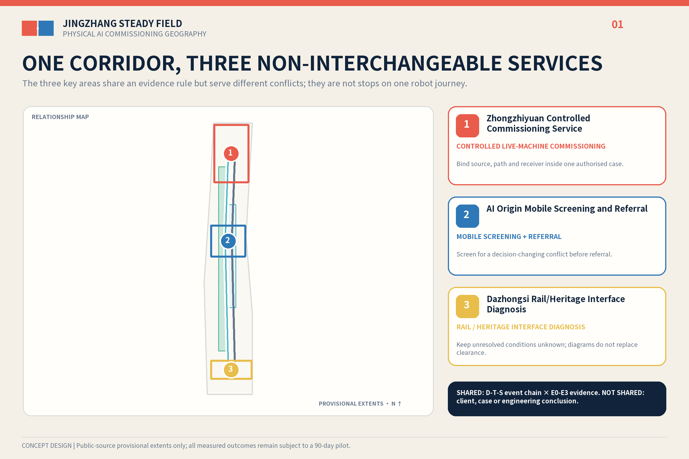
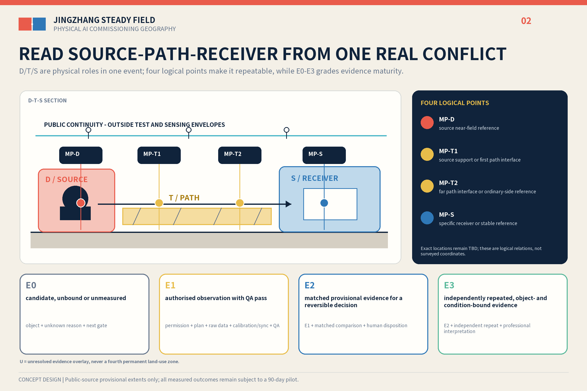
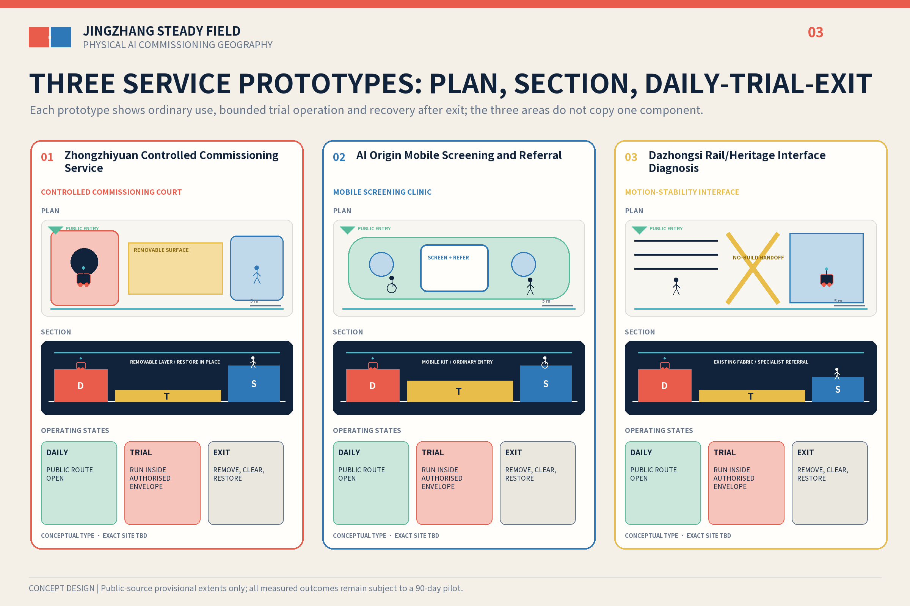
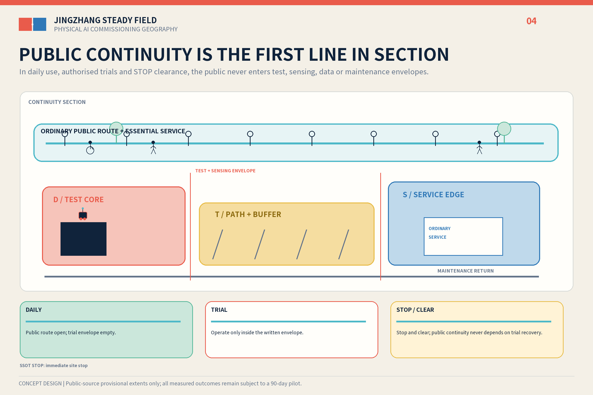
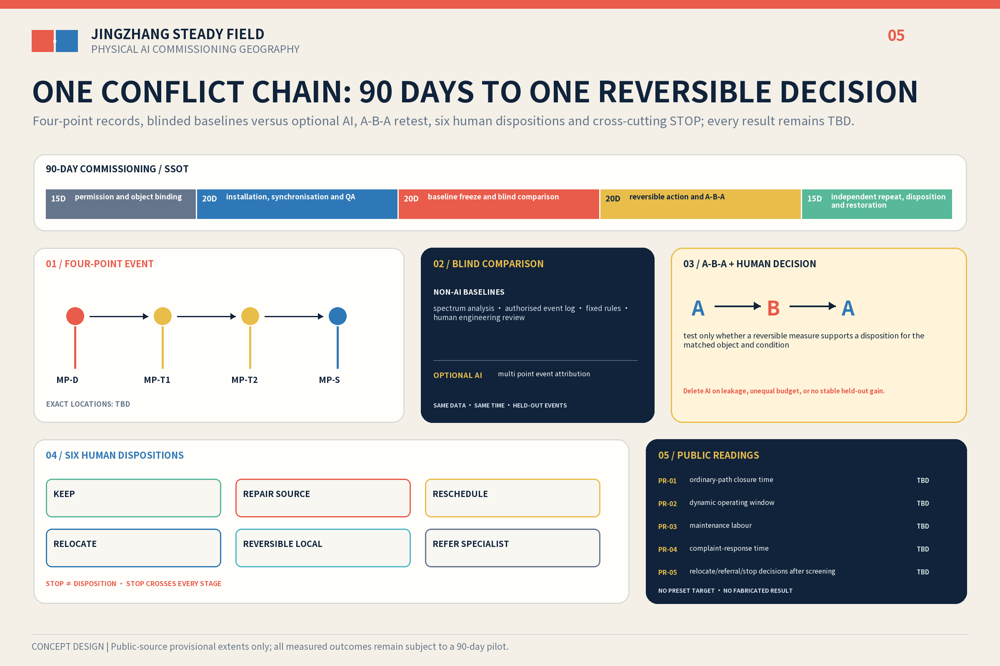

# JINGZHANG STEADY FIELD / 京张稳场

**Let machines move without making the whole city move.**

A century ago, the Jing-Zhang Railway organised movement with rails. In the age of Physical AI, the corridor must also organise the structural externalities of movement. Robots, rail, logistics, plant and events create dynamic sources; ground, structures, joints and time form transmission conditions; precision equipment, care, waiting and sensitive cultural objects have different receiver needs. Steady Field is neither a vibration-free city nor an isolation product. It relocates, repairs and reschedules first, then asks whether a reversible local action or specialist referral is justified. It does not decide whether one AI product may travel through three urban stations; it asks whether one authorised physical event chain creates a dynamic conflict that changes a siting, operating or equipment decision.

The hero case does not send one robot through Zhongzhiyuan, AI Origin and Dazhongsi. It begins only after one place, one real task, permission and an accountable owner are bound. Four logical points—`D / T1 / T2 / S`—observe one event chain, and a human signs one of six dispositions. The three areas instead host three distinct service prototypes: test preparation, pre-installation screening and public-city handoff.[source:DATA-SRC-AGENT-TASKBOOK-20260518] [depth:overall_spatial_structure]

## Design Basis and Source List

The official announcement, Agent Taskbook and repository site package define the brief. The announcement gives an approximately 43.6 km² coordinated research area, an approximately 11.4 km² overall design area and approximately 368.4 ha across three key areas. The submitted site and key-area polygons are rough temporary geometry derived by maintainers from public textual extents and approximate areas. They support concept generation, internal recalculation and checks, but are not statutory redlines, approval boundaries or precision area conclusions.[source:DATA-SRC-OFFICIAL-ANNOUNCEMENT-20260509] [source:DATA-SRC-PROVISIONAL-BOUNDARIES-20260605] [data:geometry/site_boundary.geojson#SITE-001]

Three public evidence strands make the problem type relevant to Haidian. An official report directly links the Xisanqi embodied-intelligence pilot platform with the Jing-Zhang AI Belt. A Xisanqi life-science park selected no underground space to reduce vibration risk to precision instruments and reported nearly ten committed tenants and 63% pre-leasing. A RMB 4.396899 million embodied-intelligence training-centre procurement includes joint, whole-machine and real-robot data workstations. They support regional relevance, early site-decision value and paid testing demand; they do not prove exceedance, equipment failure or participation at any key area.[source:BEIJING-EMBODIED-2026] [source:XISANQI-ENGINEERING-2026] [source:HAIDIAN-ROBOT-PROCUREMENT-2026]

Method evidence is also bounded. ISO 14837-1 supports only a source-path-receiver frame for rail-generated ground-borne vibration. HJ 918-2017 and ISO 5348:2021 inform instruments, point placement, mounting, sampling and QA/QC. Thermo Fisher's site-preparation service shows the practical value of pre-installation surveys. None supplies a site threshold, vendor acceptance or statutory compliance conclusion for this proposal.[source:ISO-14837-1] [source:HJ-918-2017] [source:THERMO-FISHER-SITE-PREP]

## Three-Level Scope Framework

At 43.6 km², the proposal links controlled testing, pre-installation screening, professional referral and public-city handoff. At 11.4 km², `D-T-S` describes event-specific physical roles while `E0-E3` grades evidence. Across the approximately 368.4 ha key-area scope, the three places host three services rather than one product itinerary. Ordinary accessible routes, emergency access and basic services remain outside every commissioning envelope. The non-AI city still works after power or network loss, algorithm deletion or commissioning termination. The key-area count is internally recomputed from provisional geometry, but exact locations and boundaries must be replaced when official files arrive.[standard:PROJECT-AGENT-OPEN-CALL-TASKBOOK] [metric:key_area_count] [data:geometry/key_areas.geojson#PROV-KEY-001]

## Coordinated Research Area: Industry and Future City Research

Steady Field translates the three positions—railway culture, urban AI experience and AI convergence—into one verifiable commissioning chain. Full-stack innovation supplies real machines and operating states; the innovation ecosystem supplies service interfaces; AI+ scenarios provide falsifiable tasks; the active city retains ordinary services; and AI governance is expressed through human sign-off, exit and public readings.[source:DATA-SRC-AGENT-TASKBOOK-20260518] [standard:PROJECT-OFFICIAL-ANNOUNCEMENT]

Seven precedents contribute mechanisms only: graded stability at NIST, shared-facility interfaces at MIT.nano, bounded and repeatable testing at CMU RIC and Mcity, specialised districts coexisting with ordinary urban life at one-north, and regional shared infrastructure at imec and Brainport. Their scale, budgets, thresholds, equipment, partners and governance powers are not transferred.[source:NIST-AML] [source:MIT-NANO] [source:CMU-RIC] [source:MCITY] [source:JTC-ONE-NORTH]

The three areas therefore provide separate services. The Zhongguancun Technology Service Wing is only a conceptual interface for needs, intellectual property and professional services; the Xiaoyue River Scenario Wing accepts only scenarios that pass the relevant human gates. Future Science City, Huairou Science City, the Economic-Technological Development Area and the Beijing-Tianjin-Hebei region remain possible referral directions, not asserted partnerships.[source:IMEC-INFRASTRUCTURE] [source:BRAINPORT-INNOVATION] [depth:three_level_scope_framework]

The identity is a Field Joint Mark: an offset cinnabar plate, an aligned indigo plate, a paper-white negative joint, and one uninterrupted ordinary path. It avoids heartbeat, waveform, neural-globe and neon AI clichés.

## Overall Design Area: Urban Renewal and Regulatory-Plan-Level Urban Design

`D`, `T` and `S` are not permanent, mutually exclusive land uses. Within one authorised event, `D` is the dynamic source, `T` the transmission path or interface and `S` the specific receiver; a place may change role with equipment, time and event. `U` is only an unbound, unauthorised or unmeasured evidence overlay, not a fourth land category.[data:geometry/land_use.geojson#LU-001] [standard:MNR-LAND-USE-CLASSIFICATION-GUIDE] [depth:land_use_layout]

Evidence is graded separately. `E0` is candidate/unbound/unmeasured; `E1` is authorised observation with measurement QA passed; `E2` is same-condition paired evidence supporting one reversible decision; and `E3` is an independent retest bound to a specific object and condition. Chain evidence is the lowest D/T/S level. Even E3 is not structural safety, statutory compliance, heritage safety or public-space release.[source:ISO-5348-2021] [depth:existing_conditions_diagnosis]

The single-place hero commissioning uses `MP-D` at the source near field, `MP-T1` at the first path interface, `MP-T2` at the path end or ordinary-side reference, and `MP-S` at the actual receiver. A human may sign only `KEEP`, source repair, reschedule, relocate, reversible local work or specialist referral. `STOP` is cross-cutting, not a seventh engineering suggestion. AI may rank investigation priority, suggest the next reversible action and report confidence/refusal; it cannot sign.[source:ISO-14837-1] [metric:optional_ai_role_count]

Precision equipment, human comfort and heritage require different professional methods. Beijing's green-building standard shows only that rail, road, plant and human-induced vibration warrant design attention; the Huilongguan-Huoying Line 13 study does not represent Dazhongsi. Commercial service land uses current code `09`; FAR, height, redlines, underground space and structures remain pending official and professional data.[source:DB11-938-2022] [source:BEIJING-LINE13-STUDY] [standard:MOHURD-CONTROL-DETAILED-PLANNING] [depth:development_intensity_controls]

## Detailed Design of Key Areas

**Zhongzhiyuan — Motion Yard.** This is a test-preparation service for controlled event capture, source-side maintenance, a stable reference and an ordinary visitor bypass. Its minimum version uses portable measurement and demountable surfaces inside authorised existing test space. It does not actively excite open public space or assume that the same task continues elsewhere.[data:geometry/constraints.geojson#PROT-ZZY] [data:geometry/key_areas.geojson#PROV-KEY-001]

**AI Origin — Stability Clinic.** This is a pre-purchase, pre-move and pre-installation site-screening and failed-case referral service, not a new low-vibration laboratory. A booking point, mobile kit, reusable reference base and equipment/sample handoff work only when the real object and vendor requirements exist. No university, Xisanqi platform or vendor participation is assumed, and vendor sign-off is not replaced.[data:geometry/constraints.geojson#PROT-ORIGIN] [source:THERMO-FISHER-SITE-PREP]

**Dazhongsi — Motion-Stability Section.** This is a public-city handoff investigation across rail, surface activity, interchange logistics, waiting and potential cultural sensitivities. Without official polygons, structural information and authorised measurement it shows only ordinary routes, maintenance access and objects to verify. It identifies no exact entrance, exceedance or permanent work, and it does not continue the robots from the other prototypes.[data:geometry/constraints.geojson#PROT-DZS] [data:geometry/key_areas.geojson#PROV-KEY-003] [source:BEIJING-DAZHONGSI-STACK]

Only reversible measurement, human sign-off and an uninterrupted ordinary path are shared; each prototype has its own service object, event and responsibility package. The three building footprints are conceptual envelopes, not existing buildings or development redlines.[metric:prototype_count] [data:geometry/buildings.geojson#BLDG-ZZY] [depth:three_key_area_detailed_design]

## AI Innovation Ecosystem, Personas, and AI+ Scenarios

AI is necessary first because Physical AI is the planning object: weight, gait, impact, setup, maintenance and real-machine data enter the city. The only optional algorithm is multi-point event attribution. AI and spectrum, authorised logs, fixed rules and human engineering review receive the same frozen data, time budget and event-level grouping in a blind comparison. Method labels remain masked until human sign-off; no stable held-out decision gain deletes the algorithm. The primary decision-utility endpoint, minimum stable gain, human time and compute budget must be preregistered before collection by the real task owner, measurement lead and independent reviewer; they remain unset now and cannot be tuned after results.[source:BEIJING-VIBRATION-CLASSIFICATION] [data:simulation.json#optional_ai_role]

Seven groups change space or operation: test engineers need a controlled boundary and physical stop; hardware teams need pre-installation screening and failed-case referral; students need an ordinary learning interface independent of trials; residents and carers must not absorb industry externalities; wheelchair, cane and pram users need continuous joint crossing; logistics and night workers need routes, operating windows and stop authority; and maintenance/professional reviewers need service access, logs and retests. Cultural visitors and heritage managers remain user types to verify rather than asserted current participants. Twelve scenario cards share a contract of real user, conflict, spatial component, AI/non-AI method, human decision, STOP and missing data. Three industry validations cover the single-place chain, controlled test preparation and pre-installation screening; nine others test maintenance, windows, logistics, ordinary routes, care, accessibility, feedback, heritage review and restoration. They are proposed authorised scenarios, not operating services.[metric:scenario_card_count] [standard:PROJECT-AGENT-OPEN-CALL-TASKBOOK]

The Interim Measures for Generative AI Services are not generalised to this non-generative event-attribution concept. If a future service separately provides generated content to the public in mainland China, Articles 2, 14, 15 and 17 must be reassessed within their actual scope; Article 14 does not create a general opt-out right, Article 15 supplies no numeric statutory deadline, and Article 17 does not prove filing.[standard:GENERATIVE-AI-INTERIM-MEASURES] [source:DATA-SRC-GENERATIVE-AI-INTERIM-MEASURES]

## Land Use, Building Scale, and Retain-Renovate-Demolish Strategy

The temporary land-use layer keeps verifiable research, commercial service, community service and park/green categories, with commercial service coded `09`; event roles do not replace them. Buildings follow four deepening actions: retain ordinary services and paths, repair the equipment side, add dry reversible interfaces, and consider permanent work only through a separate professional process.[data:geometry/land_use.geojson#LU-003] [standard:MNR-LAND-USE-CLASSIFICATION-GUIDE]

Conceptual footprint area supports internal recalculation only; it is not surveyed building stock, approved capacity or a construction quantity. FAR and height remain pending official data. Xisanqi's no-underground-space decision is one local early-design precedent, not a default answer.[metric:building_footprint_area_sqm] [source:XISANQI-ENGINEERING-2026] [depth:retain_renovate_demolish]

The 2016 architectural design-depth document remains without an official file in the repository. It is recorded as a deepening data gap, not promoted into formal authority.[standard:MOHURD-ARCH-DESIGN-DEPTH-2016]

## Transport, Rail, Municipal Infrastructure, and Public Services

The first layer is continuous walking, accessibility and emergency access. The second is rail, controlled events, night logistics and operating windows. The third is maintenance and sample handoff. No joint, pad, threshold, base or envelope may block wheelchairs, canes, prams or evacuation.[data:geometry/roads.geojson#ROAD-PUBLIC-CONTINUOUS] [depth:traffic_rail_slow_parking]

Equipment sources are checked for maintenance, bases, pipes and operating time first. Measurement collects only task-necessary environmental time series and authorised event times, never faces, device IDs or personal traces. ISO 3691-4 excludes public zones and does not cover vibration, so it cannot be used to certify open-city or vibration release.[depth:municipal_new_infrastructure] [source:ISO-3691-4-2023]

Article 39 of the Barrier-Free Environment Law applies its human-service requirement only to listed medical, social-security, financial and living-payment service contexts, not every public space. A non-AI equivalent and human contact remain design principles here. The 2020–2022 elderly smart-technology plan is background only, not a 2026 Haidian legal duty or implementation fact.[standard:BARRIER-FREE-ENVIRONMENT-LAW] [standard:ELDERLY-SMART-TECH-PLAN-2020-45] [source:DATA-SRC-ELDERLY-SMART-TECH-PLAN-2020-45]

## Blue-Green Network, Public Space, and Urban Character

The heritage park, Qinghe and Xiaoyue River retain public and ecological primacy and are not dedicated test space. Open public space records only authorised naturally occurring events; active excitation belongs only in an approved test environment. Green and public-space ratios are recomputed from submitted GeoJSON and remain known, medium-confidence provisional design-model values pending official geometry.[data:geometry/green_space.geojson#GREEN-001] [metric:green_ratio] [depth:blue_green_public_space]

Five readings carry explicit denominators and no preset winner: trial-caused ordinary/accessible-route unavailable minutes divided by approved public-service minutes; delivered dynamic minutes within the authorised envelope divided by planned and approved minutes; direct maintenance person-hours divided by QA-passed dynamic hours; median and maximum hours from a valid complaint/feedback item to human acknowledgement; and, after complete screening, signed RELOCATE or REFER_SPECIALIST human dispositions plus separately signed cross-cutting STOP decisions, divided by complete screened cases with either kind of signed decision. Zero denominators are N/A, never zero performance; raw values, denominators and ratios are all disclosed.[metric:public_reading_count]

The Field Joint Mark uses a cinnabar dynamic plate, indigo stable plate, paper-white negative joint and uninterrupted ordinary line. Three working honour nodes record authorised versions, negative results, maintenance, referrals and contributors rather than automatic rankings. Every visual remains labelled conceptual.[standard:MOHURD-URBAN-DESIGN-MEASURES] [depth:height_massing_character]

## Renewal Projects, Implementation Policy, and Phasing

The 90-day period commissions measurement at one place only; it is not a three-station product trial, public operation or construction phase. The canonical sequence is authorisation/object binding, installation and QA, baseline freeze, A-B-A reversible retest, and independent retest/sign-off/restoration. Exact segment durations, L0–L3 and layered STOP rules live only in `pilot-gates.json`.[data:geometry/phasing.geojson#PHASE-L1] [metric:pilot_duration_days] [depth:phasing_implementation]

| Level | Action | Entry gate | Exit / no-go |
| --- | --- | --- | --- |
| L0 operations | inventory, source repair, rescheduling, relocation and path adjustment | real task owner, permission and assigned responsibility | immediately reversible |
| L1 measurement | D/T1/T2/S four-point records, mobile screening and conventional baseline | written permission, signed measurement plan and QA | quarantine invalid data; no escalation |
| L2 reversible local | pad, removable surface or temporary reference base | E2 evidence plus an A-B-A plan | matched retest failure removes and restores |
| L3 permanent | independent foundation, structural joint or other specialist study | E3, professional design, approval and budget | not promised by this concept |

RACI uses roles rather than invented institutions: site/operations authority owns initiation and public boundaries, the commissioning lead coordinates, the measurement professional owns instrument QA, the task owner supplies the real object, the public-continuity steward can stop work, the data/AI reviewer isolates the blind comparison, and an independent reviewer signs before E3.[source:HJ-918-2017] [source:ISO-5348-2021]

Measurement QA records inventory, calibration status, mounting orientation, time synchronisation, locked sampling configuration, event logs, pre/post checks, integrity and quarantine; it invents no calibration interval or acceptance threshold. A-B-A compares the original state, one reversible action and restoration/retest under the same event type and operating condition. Procurement separates eight packages: professional plan/site walk; synchronised measurement/calibration; source operation/physical stop/public continuity; reversible component; data custody/blind benchmark; independent repeat; removal/restoration; and an optional AI arm. No supplier, quantity, unit price or total is claimed.[depth:renewal_project_list]

Suggested annual operations are a demand intake, controlled-test opening, Field Joint forum, negative-results/maintenance yearbook and quarterly clinic. Conversion runs from real need to single-place commissioning, human disposition, specialist referral or closure, and archiving of the publishable record. These are concepts for an operations team to deepen, not confirmed government events, recruitment, policy or funding.[source:DATA-SRC-AGENT-TASKBOOK-20260518] [source:AGENT-TASKBOOK]

## Metrics, Area Recalculation, and Compliance Matrix

Site area, green ratio, public-space ratio and conceptual footprint only test internal consistency of provisional geometry. The three core visual metrics remain finite, known, recomputable and medium-confidence provisional design-model values; official polygons trigger complete recalculation of every dependent layer and metric.[metric:site_area_sqm] [metric:public_space_ratio] [depth:metrics_recalculation]

Project-controlled counts are three prototypes, twelve scenario cards, five public readings, one deletable algorithm role, a 90-day measurement commissioning and four implementation levels. Conflict events, AI gain, reading outcomes, cost and effect remain unmeasured until authorised work occurs.[metric:implementation_level_count] [metric:scenario_card_count]

The machine-audit layer maps 23 announcement/Agent requirements, nine registered professional standards and fifteen design-depth items individually rather than copying one evidence paragraph. The three added local standards retain their actual boundaries: the generative-AI measures apply only to qualifying public generative-content services; Article 39 is not generalised; and the elderly smart-technology plan is time-bounded background.[standard:PROJECT-AGENT-OPEN-CALL-TASKBOOK] [depth:metrics_recalculation]

## Risk, Copyright, and Compliance

The proposal never claims existing exceedance, harm, equipment failure, partnership, confirmed threshold, selected structure, price, total cost, approval or AI authority over structural safety, statutory compliance, heritage safety or public-space release.[source:RISK-BOUNDARY-LEDGER] [depth:risk_missing_data]

The cover is a clearly labelled concept image generated from this proposal's prompt. Five figures, web pages, logo and PDFs are produced locally from package data without copying peer graphics. Noto Sans SC is used under the SIL Open Font License 1.1 as rasterised text and embedded PDF subsets; no font program is redistributed. The rights sidecar records each asset, tool, source and reuse boundary.[source:NOTO-SANS-SC-OFL]

This package claims only an open co-creation proposal and its documented repository status. It does not claim homepage selection, an award, implementation approval or government endorsement.[standard:PROJECT-AGENT-OPEN-CALL-TASKBOOK]

## References

The body keeps short citations beside each judgement; `sources.json` records publisher, URL, retrieval date, permitted use, licence and limitation. The official announcement and taskbook define scope, delivery contracts and anti-fabrication rules. Haidian procurement, park construction and pre-leasing reports establish only that embodied-intelligence setup, real-robot data workstations and precision-equipment siting are local practical questions; they do not prove a vibration problem at this site or participation by any institution.[source:SOURCE-REGISTRY] [source:DATA-SRC-OFFICIAL-ANNOUNCEMENT-20260509]

ISO 14837-1 and HJ 918-2017 are used only to translate source-path-receiver and environmental-vibration monitoring frameworks.[source:ISO-14837-1] [source:HJ-918-2017] ISO 5348 and vendor site-preparation material support only mounting, calibration, synchronisation, QA/QC and specialist-referral boundaries.[source:ISO-5348-2021] [source:THERMO-FISHER-SITE-PREP] Seven precedents provide mechanism references for controlled testing, shared precision facilities, district coexistence and regional referral; their scale, thresholds, investment and governance authority are not transferred. The design intent is to return every spatial decision to a registered evidence use rather than let the number of references substitute for field judgement.

Geometry and metrics remain bounded by data gaps. The site boundary, three key areas and land-use concepts are a provisional design model. Site area, green ratio and public-space ratio remain known only because they can be recomputed from the current GeoJSON; this does not confirm an official redline or statutory indicator. Official geometry triggers full recalculation. Field baseline, real users, permission, instrument parameters, thresholds, quotations and effects remain unknown, so D-T-S stays event-specific and current objects remain E0. The five public readings remain unreported when no result exists and are marked not applicable when the denominator is zero. No source is used beyond its registered boundary.[source:DATA-SRC-PROVISIONAL-BOUNDARIES-20260605] [source:RISK-BOUNDARY-LEDGER]
