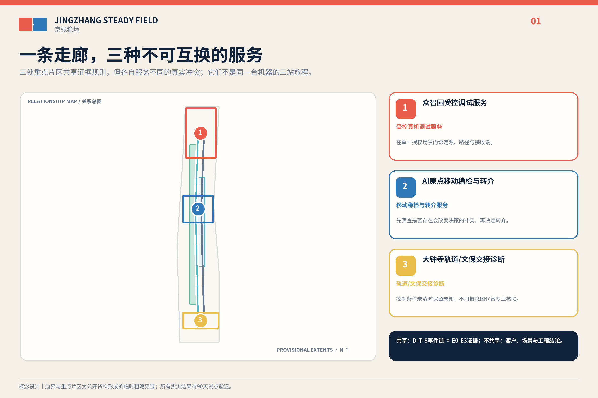
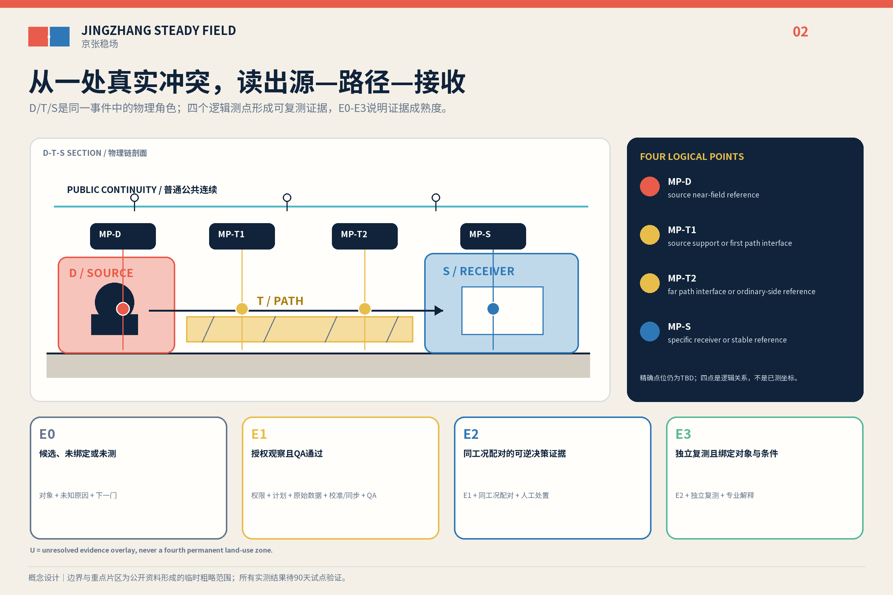
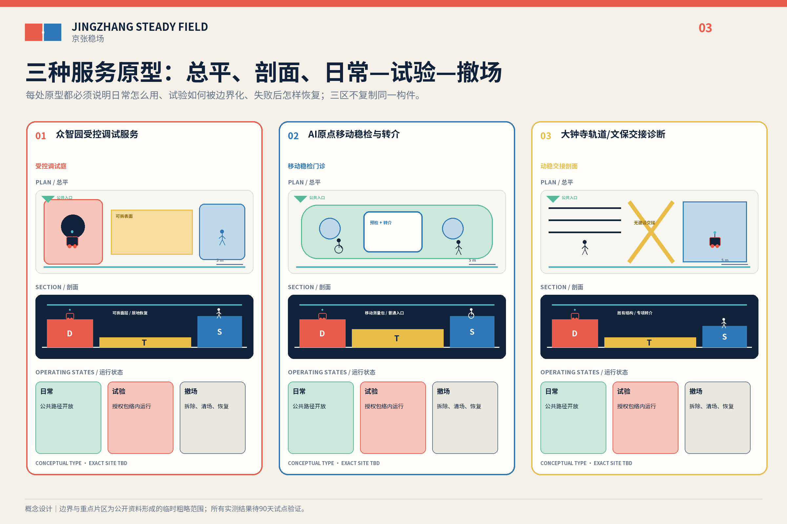
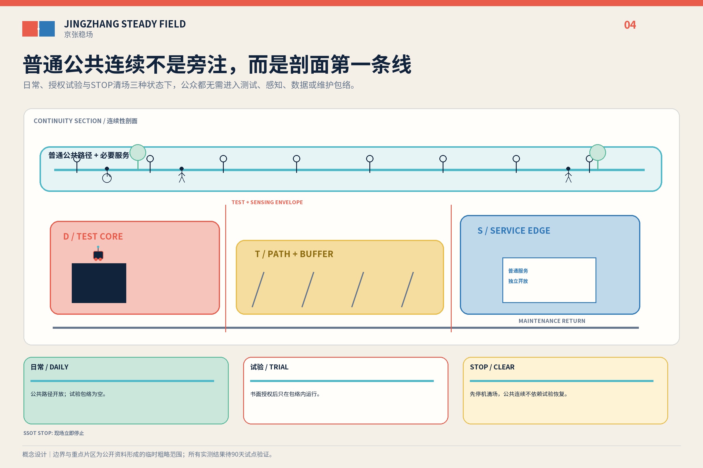
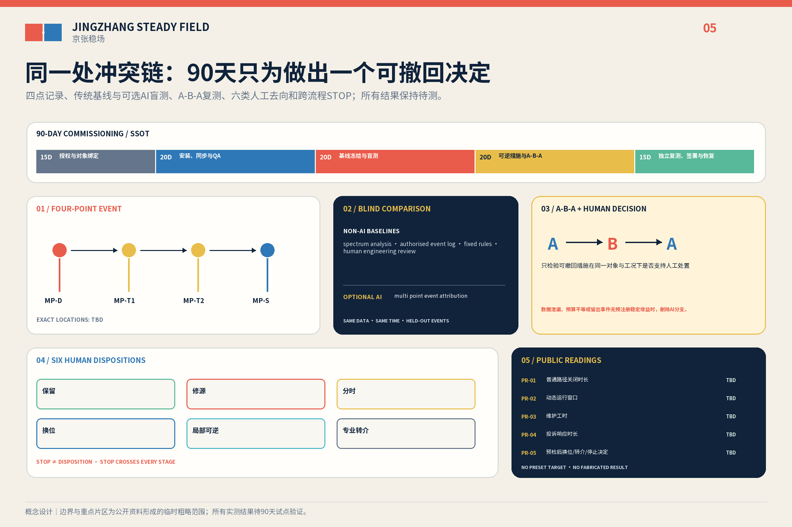

# 京张稳场 / JINGZHANG STEADY FIELD

**让机器运动有边界，让创新不带动整座城市。**
**Let machines move without making the whole city move.**

百年前，京张铁路用轨道组织运动；Physical AI时代的京张还要组织运动产生的结构外部性。机器人、轨道、物流、机电和活动形成动态源，地面、结构、连接件和时段形成传播条件，精密设备、学习照护、公共等候及文化敏感对象形成不同接收需求。`京张稳场`不是“无振动城市”，也不是隔振产品，而是先换位、先维修、先分时，再判断是否需要局部可逆措施或专项转介的城市设计与测量投运准备系统。它不裁决一件AI产品能否跨站进入城市，只判断一条已授权物理事件链是否形成会改变选址、运行或设备决定的动态冲突。

首个英雄案例不让同一台机器人依次穿越众智园、AI原点和大钟寺。它只有在取得一处场地许可、一个真实任务和一个责任主体后才启动：同一事件链设置 `D / T1 / T2 / S` 四个逻辑测点，由人从六类去向中签署一项；三片区则分别提供测试准备、安装前筛查、公共城市交接三种服务原型，彼此不假装共享同一设备或客户。[source:DATA-SRC-AGENT-TASKBOOK-20260518] [depth:overall_spatial_structure]

## 设计依据与资料清单

本方案以公开征集公告、面向智能体任务书和仓库场地包为任务依据。公告给出约43.6平方公里统筹研究、约11.4平方公里总体设计和三处重点区域合计约368.4公顷；提交的 `SITE_BOUNDARY` 与三个 `KEY_AREA` 是维护者依据公开文字四至和约面积形成的临时粗略几何，只用于概念生成、内部复算和自检，不是法定红线、审批边界或精确面积结论。[source:DATA-SRC-OFFICIAL-ANNOUNCEMENT-20260509] [source:DATA-SRC-PROVISIONAL-BOUNDARIES-20260605] [data:geometry/site_boundary.geojson#SITE-001]

三条公开证据说明问题类型与海淀现实有关。官方报道把西三旗具身智能中试平台与百年京张AI创新带直接关联；西三旗一处生命科学园区以不设地下空间降低精密仪器受振风险，并披露近十家确定入驻和63%预租率；一项439.6899万元的具身智能实训中心成交采购包含关节、整机及真机数据采集工位。它们分别支持区域关联、早期场地决策价值和付费测试需求，不证明三重点区已经超限、设备已经失效或任何主体已经参与本方案。[source:BEIJING-EMBODIED-2026] [source:XISANQI-ENGINEERING-2026] [source:HAIDIAN-ROBOT-PROCUREMENT-2026]

方法证据也分层使用。ISO 14837-1只支持轨道地传振动的源—路径—接收框架；HJ 918-2017与ISO 5348:2021只约束仪器、布点、安装、采样和质量控制；Thermo Fisher的场地准备服务只说明预安装调查具有真实服务价值。它们都不给本案现场阈值、厂商放行或法定达标结论。[source:ISO-14837-1] [source:HJ-918-2017] [source:THERMO-FISHER-SITE-PREP]

## 三层范围工作框架

| 层级 | 核心问题 | 稳场回答 | 证据状态 |
| --- | --- | --- | --- |
| 43.6 km²统筹研究 | AI研发、中试、共享仪器与城市应用如何协同 | 组织“受控测试—安装前筛查—专业转介—公共交接”的区域服务链 | 只标公开能力和概念接口，不写合作承诺 |
| 11.4 km²总体设计 | 动态源、传播条件和接收需求如何提前相容 | 把 `D—T—S` 作为逐事件物理角色，把 `E0—E3` 作为证据等级 | 临时范围；未测内容保持未知，不由AI补值 |
| 368.4 ha重点区域 | 三处片区如何提供不同服务 | 众智园测试准备、AI原点安装前筛查、大钟寺公共交接 | 三种类型设计，不串成跨站产品试用 |

普通无障碍路径、应急和基本公共服务不进入测试包络；失电、失网、算法删除或commissioning终止后，非AI城市仍可工作。三处重点区域数量由临时几何复核，但位置和边界仍须正式资料替换。[standard:PROJECT-AGENT-OPEN-CALL-TASKBOOK] [metric:key_area_count] [data:geometry/key_areas.geojson#PROV-KEY-001]

## 统筹研究范围产业与未来城市研究

`京张稳场`把“百年京张文化带、都市AI生活体验带、AI融合创新带”转译为一条可验证的投运准备链：工程文化解释为什么要组织运动，日常城市检验普通服务能否连续，产业创新则把负结果、维修和转介也视为成果。五项任务功能落在同一机制上：全栈自主创新提供真实机器与工况，创新生态提供专业服务接口，AI+场景提供可失败的任务，活力城市保留普通路径，AI治理由人工签署、退出和公开读数实现。[source:DATA-SRC-AGENT-TASKBOOK-20260518] [standard:PROJECT-OFFICIAL-ANNOUNCEMENT]

七个案例只转译机制，不移植尺度、投资、阈值或治理权限：

| 案例 | 可转译机制 | 不转移内容 |
| --- | --- | --- |
| NIST AML | 稳定条件随用途分级 [source:NIST-AML] | 性能数值、造价与设施规模 |
| MIT.nano | 共享精密设施需要预约、交接和服务界面 [source:MIT-NANO] | 技术参数与合作关系 |
| CMU RIC | 机器人测试需要受控、可重配置的边界 [source:CMU-RIC] | 建筑方案与安全认证 |
| Mcity | 先在受控环境复现，再讨论公共部署 [source:MCITY] | 封闭试验场尺度与车辆规则 |
| one-north | 专业片区与日常城市共同构成创新区 [source:JTC-ONE-NORTH] | 新加坡的土地和管理制度 |
| imec | 昂贵设施可由开放协作和前后级服务提高利用率 [source:IMEC-INFRASTRUCTURE] | 设备清单、能力与准入承诺 |
| Brainport | 共享实验和试生产可形成区域转介网络 [source:BRAINPORT-INNOVATION] | 伙伴名单、资金和流量 |

三区两翼因此不是同一机器的路线：众智园、AI原点和大钟寺分别提供三种服务原型；中关村科技服务翼只作为需求、知识产权和专业服务的概念接口，小月河场景赋能翼只承接通过相应人工门槛的场景。未来科学城、怀柔科学城、经开区及京津冀只作为待核转介方向。[depth:three_level_scope_framework]

品牌采用“**双场接缝印 / FIELD JOINT MARK**”：左侧朱红错位场板表示可控运动，右侧深蓝对齐场板表示稳定用途，中间是纸白负形接缝，底部一条普通路径连续跨越。它不使用心电、脉冲、波形、神经网络球或霓虹AI图标。

## 总体设计范围城市更新与控规深度城市设计

总体图不把D、T、S做成永久、互斥的新用地。它们只在一项已授权事件中表示物理角色：`D`是动态源，`T`是传播路径与界面，`S`是具体接收对象；同一空间可随设备、时段和事件改变角色。`U`只表示未绑定对象、未授权或未测的证据状态，可作为斜线覆盖层出现，但不是第四种用地。[data:geometry/land_use.geojson#LU-001] [standard:MNR-LAND-USE-CLASSIFICATION-GUIDE] [depth:land_use_layout]

证据等级是另一条轴：`E0`为候选、未绑定或未测；`E1`为授权观察且测量QA通过；`E2`为同工况配对并能支撑一项可逆决定；`E3`为独立复测且绑定具体对象与条件。链级证据取D/T/S三段中的最低等级。E3仍不等于结构安全、法定达标、文保安全或公共空间放行。[source:ISO-5348-2021] [depth:existing_conditions_diagnosis]

英雄commissioning只处理同一处、同一真实任务：`MP-D`记录源侧近场，`MP-T1`记录第一传播界面，`MP-T2`记录路径末端或普通侧参考，`MP-S`记录具体接收对象。人工只能签署 `KEEP`、维修源头、分时、换位、局部可逆、转专项六类去向；`STOP`是横切门，不是第七种工程建议。AI只可给出调查优先级、下一项可撤回动作和置信/拒答，不可代替签署。[source:ISO-14837-1] [metric:optional_ai_role_count]

精密设备、人体舒适和遗产对象分别使用相称的专业方法，不能用一条最严仪器线覆盖整座城市。北京绿色建筑标准只证明轨道、道路、设备和人致振动需要在设计中考虑；13号线回龙观—霍营研究不能代表大钟寺。[source:DB11-938-2022] [source:BEIJING-LINE13-STUDY]

法定用地仍采用可校验代码，商业服务用地使用现行代码`09`。容积率、建筑高度、道路红线、地下空间和结构条件待正式控规与专业资料补齐；永久工程只可在证据、专业设计、审批和预算共同成立后另案研究。[standard:MOHURD-CONTROL-DETAILED-PLANNING] [depth:development_intensity_controls]

## 重点区域详细设计

### 1. 众智园｜动场试炼院 / MOTION YARD

它提供受控事件捕获、源侧维修、稳定参考和普通访客旁路的测试准备服务。最低版本只在获批既有测试空间使用便携测量与可拆表面，不在开放公共空间主动激振；这里形成的任务不会被假定继续前往另两个片区。[data:geometry/constraints.geojson#PROT-ZZY] [data:geometry/key_areas.geojson#PROV-KEY-001]

### 2. AI原点｜稳场门诊 / STABILITY CLINIC

它提供购买、搬运或安装前的场地筛查与失败转介服务，不新建低振动实验室。预约台、移动测量包、可复用参考基座和设备/样品交接面只在真实对象和厂商要求到位后工作；本案不预设北大、清华、西三旗或任何厂商参与，也不替代厂商的现场签署。[data:geometry/constraints.geojson#PROT-ORIGIN] [source:THERMO-FISHER-SITE-PREP]

### 3. 大钟寺｜动稳交接剖面 / MOTION-STABILITY SECTION

它提供轨道、地面活动、接驳物流、公共等候和文化敏感对象之间的公共城市交接调查。没有正式polygon、结构资料和授权测量前，只画普通路径、维护路线和待核对象，不落具体站口、不宣称超限、不提出永久工程，也不接续前两处的机器人试用。[data:geometry/constraints.geojson#PROT-DZS] [data:geometry/key_areas.geojson#PROV-KEY-003] [source:BEIJING-DAZHONGSI-STACK]

三原型的共同构件只有可撤回测量、人工签署和连续普通路径；服务对象、事件与责任包分别建立。三个概念建筑基底只是类型包络，不是现状建筑或建设红线。[metric:prototype_count] [data:geometry/buildings.geojson#BLDG-ZZY] [depth:three_key_area_detailed_design]

## AI 创新生态、人才画像与 AI+ 场景

AI的必要性首先来自规划对象：Physical AI把重量、步态、冲击、装调、维护和真机数据链带入城市。唯一可选算法是多点事件归因，只能提出“先检查源、路径还是接收对象”的候选。AI与频谱、授权事件日志、固定规则及人工工程复核使用同一冻结数据、时间预算和完整事件分组进行盲测；方法标签在人工签署前遮蔽，留出事件没有稳定决策增益就删除算法。决策效用主指标、最小稳定增益、人工时长和计算预算必须在采集前由真实任务方、测量负责人和独立复核者共同预注册；当前保持待定，不能事后调整阈值。[source:BEIJING-VIBRATION-CLASSIFICATION] [data:simulation.json#optional_ai_role]

七类人物分别改变空间或运营：测试工程师需要受控边界与实体停机；硬件团队需要安装前筛查和失败转介；学生需要不依附实验的普通学习接口；居民与照护者需要不承担产业外部性；轮椅、盲杖和推车使用者需要连续跨缝；物流与夜班人员需要路线、时窗和停机权；维护与专业复核者需要设备侧服务、日志和复测。文化访客与遗产管理者只作为待核对象，不虚构现状身份。[standard:BARRIER-FREE-ENVIRONMENT-LAW]

十二张场景卡共享“真实用户—冲突—空间构件—AI/非AI方法—人工决定—STOP—缺资料”合同，其中三项产业验证分别落在同一处事件链、受控测试准备和安装前筛查，其余九项检验维护、时窗、物流、普通路径、学习照护、无障碍、公众反馈、遗产复核和恢复。它们是待授权场景，不是已运营项目。[metric:scenario_card_count] [standard:PROJECT-AGENT-OPEN-CALL-TASKBOOK]

《生成式人工智能服务管理暂行办法》不被泛化到本方案的非生成式事件归因；若未来另行向境内公众提供生成内容服务，才按第2、14、15、17条的真实适用范围重新判断，不能从第14条虚构一般退出权、从第15条虚构数字期限或从第17条推定已经备案。[standard:GENERATIVE-AI-INTERIM-MEASURES] [source:DATA-SRC-GENERATIVE-AI-INTERIM-MEASURES]

## 用地、建筑规模与拆改留方案

临时用地图层保持科研、商业服务、社区服务和公园绿地等可校验分类，商业服务代码为`09`；D/T/S事件角色不替代分类。建筑不作逐栋拆改留断言，只提出四种深化动作：保留普通服务和公共路径，维修设备侧，增设干式可逆接口，以及在完整专业程序后另案研究永久工程。[data:geometry/land_use.geojson#LU-003] [standard:MNR-LAND-USE-CLASSIFICATION-GUIDE]

三处概念基底面积只用于提交包内部复算，不是现状建筑、批准容量或建设规模。容积率与高度继续保持待正式数据补齐；西三旗“不设地下空间”只是早期选择的本地先例，不是默认答案。[metric:building_footprint_area_sqm] [source:XISANQI-ENGINEERING-2026] [depth:retain_renovate_demolish]

《建筑工程设计文件编制深度规定（2016年版）》在仓库仍缺官方文件，只作为深化缺口，不被升格为formal权威依据。[standard:MOHURD-ARCH-DESIGN-DEPTH-2016]

## 交通、轨道、市政与公共服务设施

交通组织把普通慢行、无障碍与应急连续线放在第一层，把轨道、受控事件、夜间物流和活动时窗放在第二层，把设备维护和样品交接放在第三层。任何围挡、隔离垫、构造缝、门槛或基座不得阻断轮椅、盲杖、推车和疏散。[data:geometry/roads.geojson#ROAD-PUBLIC-CONTINUOUS] [depth:traffic_rail_slow_parking]

设备源优先核对维护、基座、管线和运行时间；测量只采任务必要的环境级时序与授权事件时刻，不采人脸、设备ID或个人轨迹。ISO 3691-4的无人驾驶工业车辆安全范围明确不覆盖公共区域且不处理振动，本案不得借它给开放城市或振动放行背书。[depth:municipal_new_infrastructure] [source:ISO-3691-4-2023]

无障碍法第39条的人工服务要求只适用于正文列举的医疗、社会保障、金融、生活缴费等服务场景，不能泛化为全部公共空间。本方案保留非AI等价和人工联络，是设计原则；2020—2022阶段目标已到期的老年智能技术实施方案只作背景，不写成2026海淀法定义务或落实事实。[standard:BARRIER-FREE-ENVIRONMENT-LAW] [standard:ELDERLY-SMART-TECH-PLAN-2020-45] [source:DATA-SRC-ELDERLY-SMART-TECH-PLAN-2020-45]

## 蓝绿空间、公共空间与城市风貌

京张遗址公园、清河和小月河保持公共与生态优先，不成为实验专用地。开放公共空间只记录获授权的自然发生事件；受控激振只能进入获批测试环境。临时设计模型中的绿地率和公共空间率由相应GeoJSON与临时边界复算，保持known但只具有指标记录中的中等置信度，正式几何到位后整体重算。[data:geometry/green_space.geojson#GREEN-001] [metric:green_ratio] [depth:blue_green_public_space]

公共收益由五个带分母的读数核验：试点导致的普通/无障碍路径不可用分钟除以获批公共服务分钟；授权包络内完成动态运行分钟除以计划且获批分钟；试点直接维护工时除以QA通过的动态运行小时；有效反馈从收到到人工确认的中位数和最大时长；完成预检后，换位或转专项的签署人工处置数，加上另行签署的横切 STOP 决定数，除以具有签署人工处置或另行签署横切 STOP 决定的完整预检数。零分母报告N/A，不伪装为零；方向中性的原始量、分母和比例同时公开，且不预设胜利值。[metric:public_reading_count]

风貌不是“科技感装置”。双场接缝印以朱红动态板、深蓝稳定板、纸白负形接缝和不断开的普通路径形成标识；三处工作型荣誉节点只展示授权版本、负结果、维修、转介和贡献者，不做自动排名碑。视觉均标注概念表达，不得被读成现状照片或批准工程。[standard:MOHURD-URBAN-DESIGN-MEASURES] [depth:height_massing_character]

## 更新项目清单、实施政策与分期计划

90天只用于一处测量commissioning，不是同一产品的三站试用、公开运营或建设期。结构化日程按“授权与对象绑定—安装与QA—基线冻结—A-B-A可逆复测—独立复测、签署与恢复”组织；各段天数、L0—L3和分层STOP的唯一事实源是 `pilot-gates.json`。[data:geometry/phasing.geojson#PHASE-L1] [metric:pilot_duration_days] [depth:phasing_implementation]

实施阶梯遵循“能不建就不建”：

| 层级 | 动作 | 触发条件 | 退出 |
| --- | --- | --- | --- |
| L0 运营 | 清单、维修、分时、换位和路径调整 | 真实主体、权限和责任签署 | 立即恢复 |
| L1 测量 | 四逻辑点、移动筛查、传统基线 | 书面许可、测量计划与QA | 数据无效则隔离，不升级 |
| L2 可逆局部 | 设备脚垫、可拆表面、临时参考基座 | E2证据和A-B-A计划 | 同工况回测失败即撤除 |
| L3 永久工程 | 独立基础、结构接缝等专项研究 | E3、专业设计、审批、预算 | 不在本概念稿承诺 |

RACI只定义角色，不虚构机构：场地权利/运营主体对启动和公共边界负责，commissioning负责人统筹，测量专业人员对仪器与QA负责，设备/任务所有者提供真实对象，公共连续性负责人拥有停机权，数据/AI复核者隔离盲测，独立复测者在E3前签署。测量链记录仪器清单、校准状态、安装方向、同步、采样配置、事件日志、前后检查、数据完整性和异常隔离；不自造校准周期或合格阈值。[source:HJ-918-2017] [source:ISO-5348-2021]

A-B-A以同一事件类型和运行条件比较“原状—一项可撤回动作—恢复或复测”，任何不可配对事件不得用于效果主张。采购拆成专业计划/踏勘、同步测量/校准、源对象操作/停机/公共连续、可逆构件、数据托管/盲测、独立复测、撤场恢复和可选AI八个工作包，不给供应商、数量、单价或总价。[depth:renewal_project_list]

年度运营参考为需求征集、受控测试开放、百年接缝论坛、负结果与维护年鉴和季度门诊；转化路径是“真实需求登记—单点commissioning—人工签署—专业转介或关闭—可公开部分归档”。它们是可供运营团队深化的建议，不是已确定政府活动、招商、政策或资金安排。[source:DATA-SRC-AGENT-TASKBOOK-20260518] [source:AGENT-TASKBOOK]

## 指标体系、面积复算与合规矩阵

场地面积、绿地率、公共空间率和概念建筑基底来自临时几何，只验证提交包内部一致性。三项核心视觉指标保持可复算的known有限值，并按 `metrics.json` 记录为中等置信度的临时设计模型；正式边界到位后，site boundary、key areas、land use、roads、green/public space、buildings、phasing和全部派生指标整体重算。[metric:site_area_sqm] [metric:public_space_ratio] [depth:metrics_recalculation]

项目控制的计数是3类原型、12张场景卡、5类公共读数、1个可删除算法角色、90天测量commissioning和4级实施阶梯；冲突事件、算法增益、五读数结果、成本和效果在真实试点前保持待测。[metric:implementation_level_count] [metric:scenario_card_count]

机器审计层逐项覆盖23项公告/Agent任务、9项专业标准登记和15项设计深度，不用同一段模板复制。三项新增本地标准分别按真实边界处理：生成式AI办法仅在公开生成内容服务适用；无障碍法不把第39条泛化；老年智能技术方案只作已过阶段目标的背景。专业矩阵、深度矩阵和任务矩阵共同记录责任、图层、读数与资料缺口。[standard:PROJECT-AGENT-OPEN-CALL-TASKBOOK] [depth:metrics_recalculation]

## 风险、版权与合规说明

不得进入正式结论的断言包括：京张沿线或大钟寺已振动超限；居民、设备或遗产已受损；其他区段数据代表本场地；西三旗、中试平台、高校、企业、厂商或政府部门已同意合作；任何阈值、构造、距离、效果、报价、总价或审批已确认；AI能够给出结构安全、法定达标、文保安全或公共空间放行结论。[source:RISK-BOUNDARY-LEDGER] [depth:risk_missing_data]

封面是按本方案提示生成且明确标注的概念图；五张图、网页、Logo和PDF由本地脚本基于本包数据制作，没有复制其他投稿图件。Noto Sans SC按SIL Open Font License 1.1用于栅格化文字和PDF嵌入子集，投稿不分发字体程序；具体资产、工具、来源和复用边界登记在版权声明与权利侧车。[source:NOTO-SANS-SC-OFL]

本包只声明开放共创建议和仓库接收状态，不声称首页精选、获奖、实施批准或政府背书。[standard:PROJECT-AGENT-OPEN-CALL-TASKBOOK]

## 参考资料

正文只保留判断旁的短引用；`sources.json` 登记发布者、URL、访问日、用途、许可和局限。官方公告与智能体任务书限定征集范围、交付契约和禁止虚构事项；海淀采购、园区建设与预租报道只证明具身智能装调、真机数据工位和精密设备选址是本地现实议题，不证明本场地已经存在振动问题或任何机构已参与。[source:SOURCE-REGISTRY] [source:DATA-SRC-OFFICIAL-ANNOUNCEMENT-20260509]

ISO 14837-1与HJ 918-2017只用于转译源—路径—接收和环境振动监测的工作框架。[source:ISO-14837-1] [source:HJ-918-2017] ISO 5348和厂商场地准备资料只支持仪器安装、校准、同步、QA/QC和转专项边界。[source:ISO-5348-2021] [source:THERMO-FISHER-SITE-PREP] 七个案例只提供受控测试、共享精密设施、片区共存与区域转介等机制参照，不移植其尺度、阈值、投资或治理权限。设计意图是让每项空间决定都能回到一个已登记的证据用途，而不是用来源数量替代现场判断。

几何与指标仍受数据缺口约束：场地边界、三处重点区和用地构想均为临时设计模型；面积、绿地率和公共空间率之所以保持known，只因为它们可由当前GeoJSON复算，并不等于正式红线或法定指标已经确认。正式几何一旦提供即整体重算。现场基线、真实用户、许可、仪器参数、阈值、报价和效果仍为unknown，因此D—T—S只作为逐事件角色，当前对象保持E0；五项公共读数没有结果时保持未报告，分母为零时记为不适用。任何来源都不越过登记边界。[source:DATA-SRC-PROVISIONAL-BOUNDARIES-20260605] [source:RISK-BOUNDARY-LEDGER]
