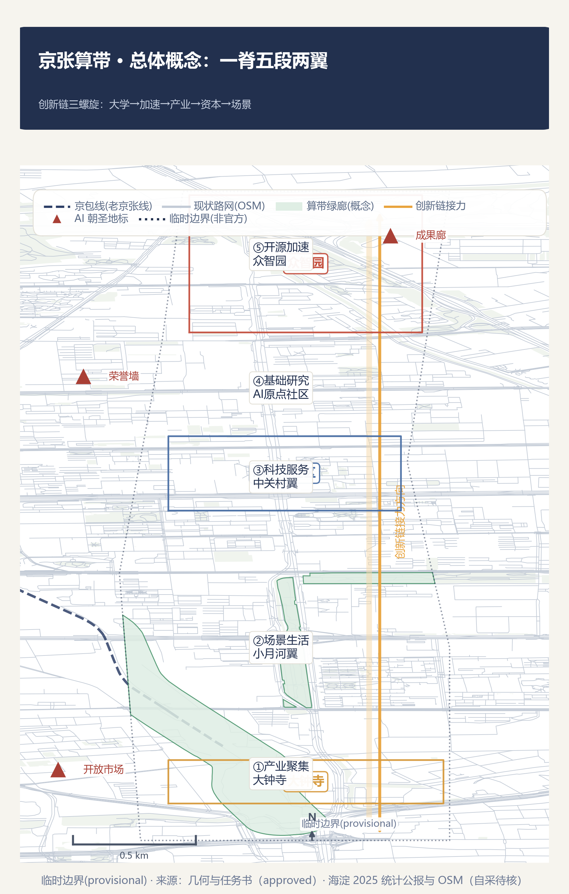
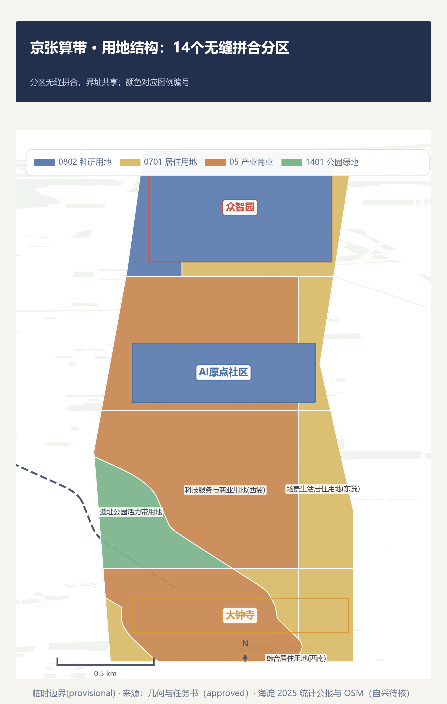
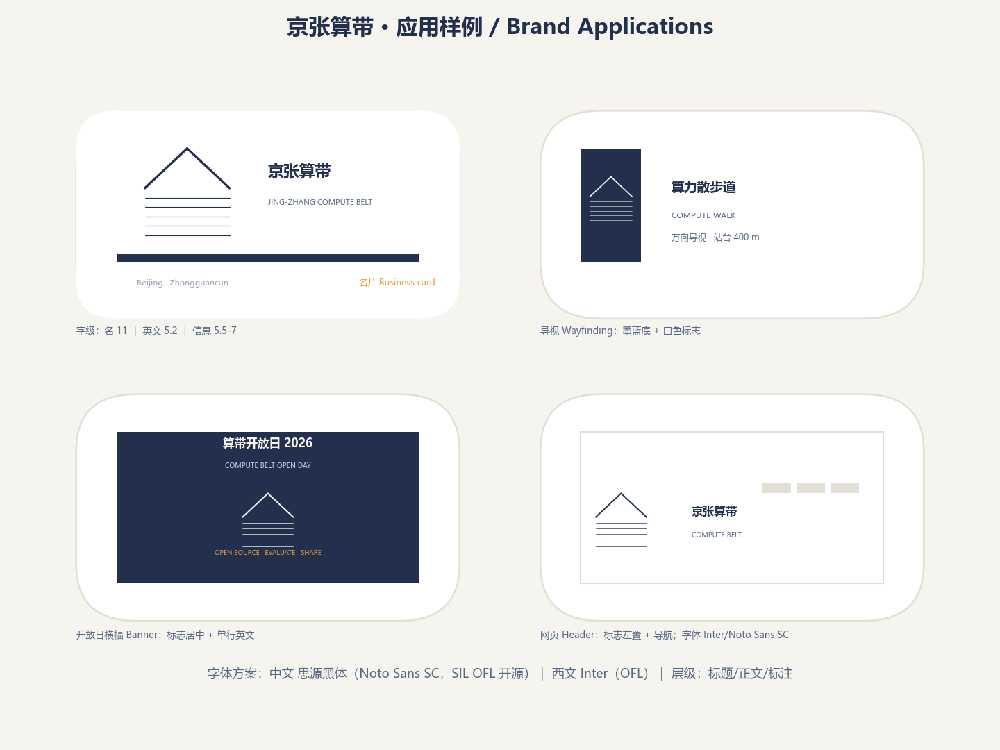
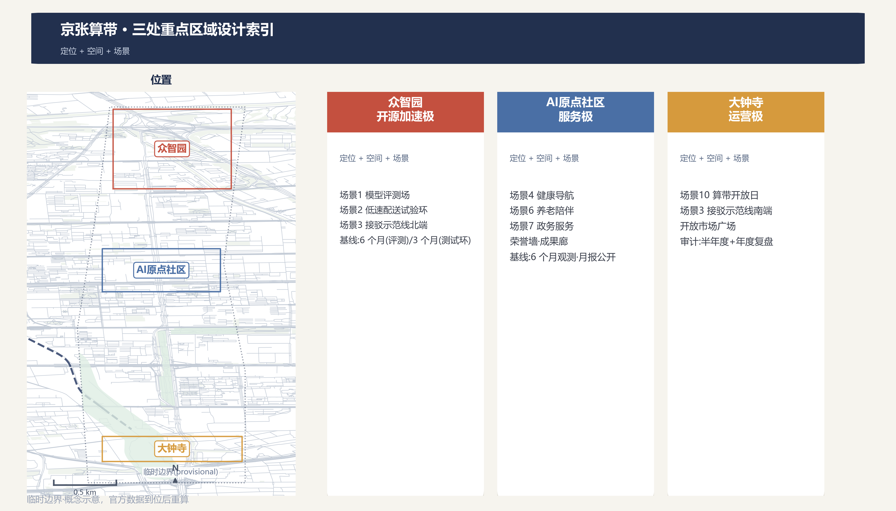
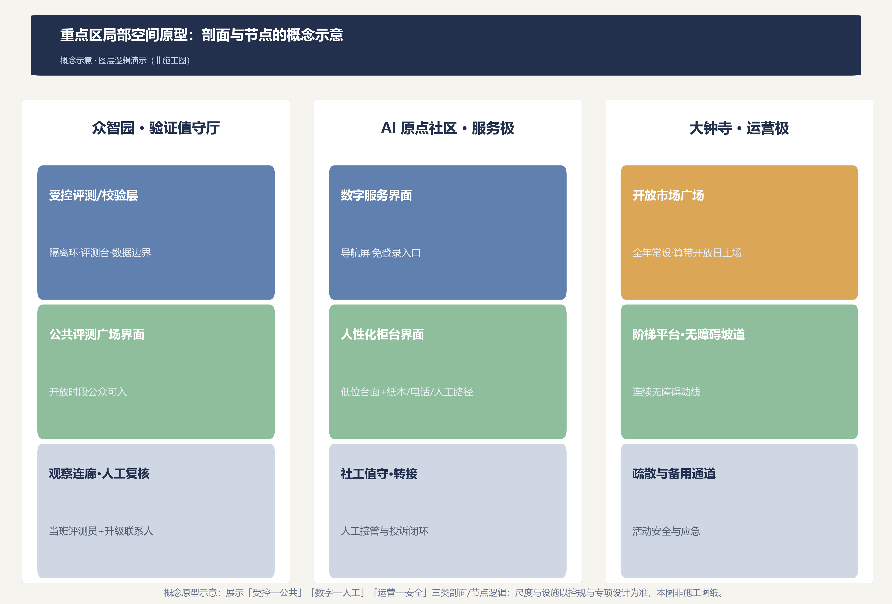
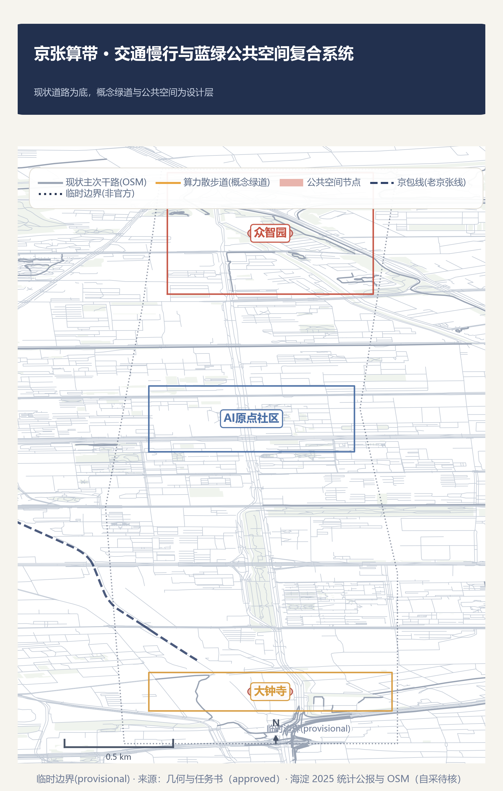
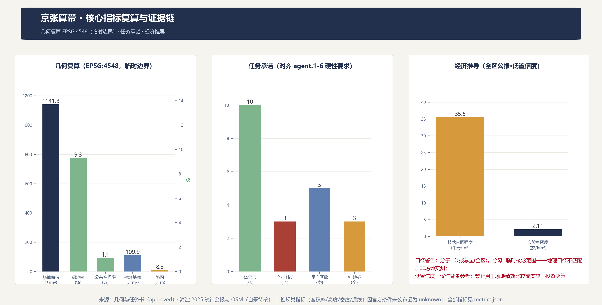

# 京张算带 / Jing-Zhang Compute Belt

> 让同一条走廊完成第二次基础设施跃迁。

一百年前，詹天佑在这里主持修建了中国第一条自主干线铁路，1909 年 9 月 24 日全线通车，当年 10 月 2 日在南口举行通车典礼。[source:JHZ-PEOPLE-1909] [source:JHZ-ARCHIVES] 今天，这条走廊所在的海淀区集聚了北京 60% 的备案上线大模型和全国 17.9% 的全国重点实验室——均为全区级统计口径（2025 年统计公报，非走廊沿线实测，详见「数据与证据」节）。本方案提出：**把这条走廊定义为智能时代的基础设施带——「算带」**。铁轨是工业时代的基础设施，算力是智能时代的基础设施；走廊从「铁轨带」到「算力带」的跃迁，是同一片土地上基础设施逻辑的第二次展开。[source:OFFICIAL-ANNOUNCEMENT] [source:GONGBAO-2025] [standard:PROJECT-OFFICIAL-ANNOUNCEMENT]

## 设计依据与资料清单

本方案以资格预审公告、面向智能体任务书、场地包临时边界、海淀区 2025 年统计公报和 OpenStreetMap 公开测绘为设计依据。空间生成只使用仓库内已登记的临时粗略边界；区级经济数据仅作背景与推导依据，不构成地块级断言。[source:OFFICIAL-ANNOUNCEMENT] [source:AGENT-TASKBOOK] [source:BOUNDARY-PROVISIONAL]；此外，[source:GONGBAO-2025] [source:OSM-2026]

当前未获得官方 `SITE_BOUNDARY` 与三处 `KEY_AREA` polygon。本方案锁定的总体范围与重点区均标记为 `official_boundary=false`、`geometry_role=provisional_constraint`、`boundary_precision=provisional_rough`，只能支持概念生成、内容评审与替换后的复算，不能作为红线、权属、控规或工程依据。[source:BOUNDARY-PROVISIONAL] [data:geometry/site_boundary.geojson#PROV-SITE-001] [depth:existing_conditions_diagnosis]

控规条件（容积率、建筑高度、建筑密度、绿地率、退线）均未由组织方公布，`planning_limits.json` 将其标记为 `missing`。本方案相应指标统一记为 `status=unknown`，并说明待正式数据补齐后的复算路径；不把任何概念体量伪装为法定控制值。[source:OFFICIAL-ANNOUNCEMENT] [metric:floor_area_ratio] [depth:development_intensity_controls]

**来源分层（显式区分，避免误读）**：本方案证据按三类标注，索引见 `sources.json` 的 `registry_tier` 与本文件图件脚注——(1) **approved_formal**（组织方批准、可作正式依据）：资格预审公告、任务书、场地包临时边界（几何另按 provisional 处理）；(2) **self_collected_review（自采待核/背景证据）**：海淀区 2025 统计公报、OpenStreetMap（ODbL）、全球机构案例、区域协同公开报道——仅作背景、机制比较与数据底数，不构成法定控制、既定合作或官方批准证明，其关键数字与适用时点待正式专业复核；(3) **provisional_only**：全部几何（临时粗略边界）。本方案全文所有引用与图件脚注均按以上分层标识；区级分子 ÷ 临时范围分母的经济推导指标（技术合同强度、实验室密度）标注为低置信度背景指标，禁止用于场地绩效比较或实施、投资决策。[source:SOURCE-REGISTRY] [source:OSM-2026]

## 三层范围工作框架

三层范围以同一条创新链逻辑贯通：统筹研究范围回答「创新生态如何组织」，总体设计范围回答「空间结构如何承载创新链」，重点区域范围回答「具体场景如何在街区内落地」。[source:OFFICIAL-ANNOUNCEMENT] [depth:three_level_scope_framework]

| 层级 | 面积 | 工作目标 | 本方案回答 |
| --- | --- | --- | --- |
| 统筹研究范围 | 约 43.6 km² | 产业生态与未来城市战略 | 三定位、五功能、三区两翼协同回路、8 个全球案例、命名体系 |
| 总体设计范围 | 约 11.4 km² | 城市更新与控规深度城市设计 | 五段接力空间结构、用地分区、蓝绿公共空间、分期实施 |
| 重点区域范围 | 约 3.684 km² | 三个重点区详细设计 | 众智园验证极、原点社区服务极、大钟寺运营极 |

官方 polygon 缺失期间，本方案以临时边界（面积复算约 1,141.28 公顷）完成空间生成与指标复算；官方数据到位后，需替换 `site_boundary.geojson`、`key_areas.geojson` 并重算全部面积类指标。[source:BOUNDARY-PROVISIONAL] [metric:site_area_sqm] [depth:metrics_recalculation]

## 统筹研究范围产业与未来城市研究

### 三大定位与五大功能

本方案以「百年京张文化带、都市 AI 生活体验带、AI 融合创新带」为三项定位，与任务书一致；将五大功能解释为创新链上的五个连续动作：基础研究（全栈自主创新）、试验加速（世界级创新生态）、场景转化（AI+ 场景赋能）、活力承载（智能化 AI 活力城市）、治理参与（AI 治理话语权）。五项功能不是五个园区标签，而是同一创新链的环节。[source:AGENT-TASKBOOK] [standard:PROJECT-AGENT-OPEN-CALL-TASKBOOK]

### 命名体系：京张算带

主名「京张算带 / Jing-Zhang Compute Belt」取「算」的三重含义：**算力**（智能时代的基础设施）、**计算**（AI 本体）、**可复算**（本方案的方法论——一切空间决策可复算、可审计）。历史闭环叙事：詹天佑修建的是物理时代的基础设施（铁轨），今天走廊铺陈的是智能时代的基础设施（算力）；从「工程奇迹」到「算力枢纽」，同一条走廊完成两次基础设施跃迁。詹天佑以「人字形折返线」与竖井开凿法攻克关沟段 33‰ 最大坡度，是「工程奇迹」叙事的史实内核。[source:JHZ-CHINANEWS] [source:JHZ-PEOPLE-1909] 历史叙事与「算」字三重含义共同构成本方案的命名体系。[source:AGENT-TASKBOOK] [standard:PROJECT-OFFICIAL-ANNOUNCEMENT]

子品牌体系：**算带枢纽**（三重点区）、**算带走廊**（遗址公园活力带）、**算力散步道**（文化导览绿道）、**算带开放日**（年度活动）、**开源成果展示廊**与**智能体贡献荣誉墙**（公共展示体系）。Logo 方向为「人字展线 × 数据总线」双意象：上部为詹天佑人字展线变形，下部为并行数据总线，形成「值」字负形；深海军蓝（可审计基础设施）、琥珀（当班/活跃）、信号绿（安全可用）、珊瑚红（需接管/停用）构成主色。[source:AGENT-TASKBOOK] [depth:overall_spatial_structure]

VI 规范（构图/单色/最小尺寸/字体/应用样例见图）：标志构图采用 6a×6a 标准网格（a=4mm，安全区 8a×8a），人字展线与数据总线上下 1:1 分割；展线坡度概念引用青龙桥展线 33‰ 史实（图形为象征变形，非实测坡度）；单色正形用于印刷与深底反白，负形用于深色媒介；最小使用尺寸为网页 32px、印刷 8mm，低于此限改用字标或简化形（仅人字展线）；字体方案为中文思源黑体（Noto Sans SC，SIL OFL 开源许可）配西文 Inter（OFL），层级为标题/正文/标注三级；应用样例覆盖名片、导视、开放日横幅与网页头图。[source:AGENT-TASKBOOK] [depth:overall_spatial_structure]

### 三区两翼：创新链的空间展开

三区两翼不是五个并列园区，而是创新链五段的空间映射：[source:AGENT-TASKBOOK] [data:geometry/key_areas.geojson#PROV-KEY-001]

- **北京 AI 原点社区** = 基础研究段。高校实验室共址圈；「原点」双关 AI 发源点与空间坐标系原点。
- **众智园 AI 自主创新加速区** = 开源加速段。命名呼应开源智算系统软件栈「众智」（公报 2025 表述「统一开源智算系统软件栈『众智』迭代升级，彻底摆脱国外智算系统软件栈技术依赖」；命名关联为推断，公报未直接说明两者关系），承担中试平台、开源协议市、模型评测场。[source:GONGBAO-2025]
- **大钟寺 AI 产业聚集区** = 产业落地段。智能原生新业态与运营场景，依托干线交通节点。
- **中关村科技服务翼** = 资本/IP/要素配置段（金融机构 1,568 家、技术合同成交额 4,053.1 亿元的流转节点）。[source:GONGBAO-2025]
- **小月河场景赋能翼** = 场景生活段。AI+ 生活服务与真实用户池（常住人口 311.1 万人）。[source:GONGBAO-2025]

### 全球案例：只借机制，不搬规模

| 案例 | 借入机制 | 明确不照搬 |
| --- | --- | --- |
| 新加坡 Punggol Digital District | 数字平台与真实环境试验联动 | 集中化监控架构、未经本地论证的数据范围 |
| Helsinki Kalasatama | 小规模限时真实用户敏捷试点、到期退出决策 | 强制居民参与 |
| Seoul AI Hub | 教育—孵化—研究—开放创新的阶段服务 | 资金规模与政策承诺 |
| Cambridge (MA) The Foundry | 城市社区艺术与 STEAM 中心：免费社区界面+滑动费率预约（免卡） | 固定面积指标 |
| 深圳 | AI 拆成责任单位场景清单 | 天际线、密度、全城平台规模 |
| 重庆 | 小切口闭环（核实—预警—分类—协同） | 山地立体造型、网红化景观 |
| Paris Station F | 项目+日常配套组织创业服务 | 园区体量、运营模式复制 |
| 杭州云栖小镇 | 开发者社区+年度活动品牌 | 会展经济依赖 |

这些案例均来自机构或项目公开页面，仅作机制比较，不支撑本地法定空间或成效承诺。[source:CASE-PUNGGOL] [source:CASE-KALASATAMA] [source:CASE-SEOUL-AI-HUB]；此外，[source:CASE-FOUNDRY] [source:CASE-SHENZHEN] [source:CASE-CHONGQING]；此外，[source:CASE-STATIONF] [source:CASE-YUNQI]

### 海淀的数据底数：为什么这里可以成为算带

区级公开数据显示创新要素已经在此集聚：备案上线大模型 123 款（占北京全市 60%）、全国重点实验室 92 家（占全市 63.4%、全国 17.9%）、技术合同成交总额 4,053.1 亿元（+6.5%）、计算机通信和电子设备制造业产值 1,887.1 亿元（+7.7%）、信息传输/软件/信息技术服务业投资增长 1.5 倍。这些数据是「算带」定位的宏观证据——海淀区已是北京 AI 要素最密集的城区，本方案的空间设计是为已有集聚提供结构。其中两个经济推导指标（技术合同强度、实验室密度）为背景指标：区级分子 ÷ 临时范围分母、地理口径不匹配、低置信度，仅作背景参考，不得用于场地绩效比较或实施/投资决策（详见 metrics.json 的 display_label 与禁止用途声明）。[source:GONGBAO-2025] [metric:tech_contract_strength_index] [metric:lab_density_per_research_area]

### 区域协同：算带如何嵌入京畿创新网络

算带不是孤立园区。走廊位于中关村科学城腹地，任务书明确要求 agent.1 回答「总体空间结构图和区域创新协同关系」，并将「是否体现与北纬社区、未来科学城、怀柔科学城、经开区及京津冀的创新协同」列为评审维度之一。[source:AGENT-TASKBOOK]

本方案按「分工—流量—接口」三层展开区域协同论证。表中各协同对象的定位引自政府与权威媒体公开来源；一切协作机制均为**概念建议**，需各方协议与来源核实后方可深化，本方案不声称任何既定合作关系。

**分工：一条创新链上的五个协同点**

| 协同对象 | 公开定位 | 建议角色 | 与算带的接口 |
| --- | --- | --- | --- |
| 中关村AI北纬社区 | 海淀科学城北区（西北旺），AI 原生创业孵化平台，聚焦大模型、具身智能、Agent 等前沿方向，首期开放 6 万㎡产业空间 | 早期创业「从 0 到 1」 | 孵化接力：北纬毕业团队进入众智园开源中试与验证，走完「从 1 到 10」 |
| 未来科学城 | 「三城一区」枢纽型主平台之一（昌平南部），「两谷一园」格局，先进能源产业超 2,400 亿元、先进制造超 1,600 亿元 | 先进能源/先进制造场景的 AI 赋能入口 | 算带公共评测与算力服务面向央企战略科研集群开放；能源谷绿色电力与算带「分布式能源+算力废热」概念呼应 |
| 怀柔科学城 | 怀柔综合性国家科学中心，布局 37 个科技设施、6 个大科学装置，17 个设施面向全球开放 | 基础研究→应用验证的接力点 | 大装置数据经合规脱敏后与算带数据沙盒衔接；原始创新成果在算带完成「验证—中试」段 |
| 经开区（亦庄） | 「三城一区」中的「一区」，高精尖产业主阵地，已累计承接「三城」科创项目超 1,000 项，高级别自动驾驶示范区覆盖 600 km² | 中试成果的量产转化 | 试验环运营经验与亦庄示范区准入规则互认（概念）；评测通过的方案进入量产转化（概念） |
| 京津冀 | 北京研发调度 + 天津制造融合 + 河北绿色供给；京津冀算力「一张网」（京内 1ms、京津冀 3ms），北京 2027 年算力规模约 20 万P | 京畿算力网络中的「海淀端点」 | 算带公共算力平台接入京津冀算力调度网络（概念）；张北/廊坊绿色算力与算带端侧算力形成「云—边」协同（概念） |

各区域定位来源：北纬社区见海淀区政府公开报道 [source:REGION-BEIWEI-COMMUNITY]；未来科学城见昌平区园区概况 [source:REGION-FUTURE-SCIENCE-CITY]；怀柔科学城见人民网公开报道 [source:REGION-HUAIROU-SCIENCE-CITY]；亦庄见经开区高精尖产业主阵地意见 [source:REGION-BDA]；京津冀算力布局见新华社公开报道与人民网公开报道 [source:REGION-JINGJINJI] [source:REGION-BJ-COMPUTE-NETWORK]。

分工逻辑与「五段接力」一致：海淀走廊段（算带）负责验证与测试，北纬社区负责早期孵化，怀柔负责原始创新，亦庄负责量产转化，未来科学城与京津冀提供能源、制造与算力底座——五个协同点共享同一条 AI 创新链，谁也不孤岛化。

**流量：三类要素流**

- **人才流**：北纬社区（早期创业者）→ 算带（中试、测试与值守岗位）→ 亦庄（量产制造与场景运营），同一批 AI 人才在京畿内部滚动成长，不必离开北京都市圈。[source:GONGBAO-2025]
- **算力流**：京津冀算力「一张网」下，训练负载调度至张北/廊坊绿色算力集群，推理负载保留在算带端侧节点——「算力在区域内流动，延迟在原地保持」。[source:REGION-JINGJINJI] [source:REGION-BJ-COMPUTE-NETWORK]
- **数据与场景流**：怀柔大装置数据经合规脱敏后与算带数据沙盒衔接；算带公共场景（评测、健康导航、政务柜台）首发验证后，向京津冀城市群复制。[source:REGION-HUAIROU-SCIENCE-CITY]

**接口：四个可深化的合作机制（概念建议）**

- **评测互认接口**：开源评测场的评测结果，与亦庄自动驾驶示范区准入评估、未来科学城产业项目评审互认，减少重复评测成本。
- **测试协同接口**：算带低速试验环与亦庄高级别自动驾驶示范区分级测试衔接——「分级测试、结果互认」。
- **展示联动接口**：算带开放日与中关村论坛、「三城一区」成果巡展联动，让验证成果在京畿创新网络内可见。
- **数据沙盒接口**：参照亦庄数据基础制度先行区模式，在算带建立可审核的数据沙盒，衔接怀柔大装置数据与北纬社区创业数据需求。

以上四个接口均为概念建议：涉及跨区协议的机制需专业团队与各方核实后深化；本方案不承诺任何既定合作、共建或政策安排。

## 总体设计范围城市更新与控规深度城市设计

### 总体结构：一脊五段、两翼串联

「算带」的总体空间结构为**一脊（遗址公园活力带）、五段（创新链五段接力）、两翼（中关村科技服务翼、小月河场景赋能翼）**。遗址公园带是物理脊梁与「总线」——铁轨意象转化为数据总线意象，串联五个创新段；五段沿走廊依次展开，共享同一人才池与公共服务网络。[source:AGENT-TASKBOOK] [data:geometry/land_use.geojson#LU-001] [depth:overall_spatial_structure]

用地意向采用十四个完整拼合分区（从临时边界切割，共享边界坐标，无缝隙无重叠），证明机器可复算与功能结构一致；该分区是概念意向，不是把临时边界切成法定地块。[data:geometry/land_use.geojson] [metric:site_area_sqm] [depth:land_use_layout]

### 五段接力：为什么空间相邻性决定创新效率

经济学逻辑：创新链各环节对空间相邻性的需求不同。基础研究依赖面对面交流（知识溢出随距离快速衰减），必须与高校共址；中试与加速需要专用试验空间（中间产品）；产业化需要交通可达性；资本/IP 服务需要集聚密度；场景生活需要真实用户。五段接力是按「相邻性需求」编排的空间秩序——把最需要近距离共址的环节放在走廊核心，把标准化程度高的环节推向可达性节点。[source:GONGBAO-2025] [depth:land_use_layout]

### 更新逻辑与功能比例

本方案以「保留为主、改造为辅、新建为补」为更新基调：遗址公园带与现状社区以保留活化为主；三个重点区以功能置换与渐进更新为主；新建集中于概念建筑体块（11 栋概念体块，重点区示意）。保留/改造/拆除/新建的确切分类依赖现状建筑、权属与工程条件调查，本方案将其列为待确认事项，不作出地块级结论。[source:OFFICIAL-ANNOUNCEMENT] [metric:building_count] [depth:retain_renovate_demolish]；此外，[depth:height_massing_character]

## 重点区域详细设计

### 1. 众智园：开源加速极（验证值守厅）

定位为「先证明能安全停下，再证明能工作」的开源验证场，命名呼应开源智算栈「众智」。空间结构：公共评测广场 + 中试平台 + 低速机器人隔离试验环 + 开源协议市。功能承载：模型评测开放场（场景卡 1）、低速配送试验环（场景卡 2）、自动驾驶接驳示范线北端（场景卡 3）。风险提示：试验场景的时段、速度、气象与人工监管条件需在运营阶段细化为硬约束；本方案只做概念布置，不构成工程可行性结论。[source:AGENT-TASKBOOK] [data:geometry/key_areas.geojson#PROV-KEY-001] [depth:three_key_area_detailed_design]

### 2. 北京 AI 原点社区：服务极（服务值守厅）

定位为「没有 App 也能完成服务」的 AI 公共服务社区接口，依托高校实验室共址圈。空间结构：免登录人工服务台 + 社区反馈工作室 + 文化展示节点（智能体贡献荣誉墙、开源成果展示廊）。功能承载：AI+健康导航（场景卡 4，实体服务台位于小月河翼）、社区养老陪伴（场景卡 6）、政务服务柜台（场景卡 7，柜台实体位于中关村翼）。所有服务保留纸本、柜台、电话等非数字替代路径；不进行医疗、法律或行政决定的自动化，只做信息导航、材料提示与人工转接。[source:AGENT-TASKBOOK] [data:geometry/key_areas.geojson#PROV-KEY-002] [depth:three_key_area_detailed_design]

### 3. 大钟寺：运营极（运营值守厅）

定位为「算带开放日的常设主场」与智能原生产业运营节点，依托大钟寺交通枢纽的可达性。空间结构：智能原生综合体 + 算力开放市场广场 + 开发者社区空间。功能承载：算带开放日（场景卡 10）、自动驾驶接驳示范线南端（场景卡 3）、年度活动体系主场。风险提示：产业功能与居住功能的混合比例、停车与货运组织依赖控规与交通专项数据，列为待确认。[source:AGENT-TASKBOOK] [data:geometry/key_areas.geojson#PROV-KEY-003] [depth:three_key_area_detailed_design]

### 重点区局部空间原型：剖面与节点的概念示意

在总体与分区尺度之上，补充重点区的「剖面/节点」概念原型，说明「受控—公共」「数字—人工」「运营—安全」三类界面逻辑如何落在空间上：众智园为受控评测层—公共广场界面—观察连廊的三层结构；原点社区为数字界面—人性化柜台—社工值守的递进关系（低位台面、纸本/电话/人工路径与免登录入口并存）；大钟寺为开放市场广场—无障碍阶梯平台—疏散与备用通道的运营安全结构。原型均为概念示意（非施工图），尺度与设施配置以控规与专项设计为准。[depth:three_key_area_detailed_design]

## AI 创新生态、人才画像与 AI+ 场景

### 五类用户画像

1. **初创 AI 工程师（28 岁）**：众智园孵化器入驻者，需要评测台、中试环、开源协议市与 24 小时开放工位。
2. **高校科研人员（35 岁）**：原点社区实验室成员，需要共址交流空间、数据沙盒与成果展示节点。
3. **跨境开发者（30 岁）**：数字游民，需要多语界面、国际活动与长时开放空间。
4. **社区长者（70 岁）**：小月河翼居民，需要免登录人工服务与完全非数字化的替代路径。
5. **中小学生家庭**：学院区居民，需要 AI 教育空间与安全的公共场域。

五类画像对应五种空间与服务诉求，映射到场景卡与空间图层；画像基于公开的人口结构（外来人口占 33%）与教育设施底数（中小学 183 所、社区卫生服务中心 239 个）推定，非实地调研结论。**画像状态：待验证初稿**（初稿级，非居民验证定稿）。[source:GONGBAO-2025] [metric:persona_count]

#### 参与式验证：试点前的强制门禁

画像、非数字替代路径与公共利益 KPI 均以区级资料推定为基础，未经过在场地使用者的参与式验证——这是本方案明确的验证缺口及排查路线，而非已完成的成果：(1) **门禁**：任何试点、场景深化或公共界面上线前，须先完成参与式验证；未完成验证的场景不得进入 M4 受控试运行（见「实施里程碑」）；(2) **人群与方法**：覆盖长者、残障人士、照护者、在校师生、普通居民与一线服务人员代表，采用街区巡回调研、焦点小组与无障碍体验走查（含模拟老年/残障视角），样本按公开人口结构与设施分布抽样；(3) **可核验结果回填**：验证产出（访谈纪要、走查报告、修订画像与替代路径核查清单）进入 P1 试点评审材料，并回填画像（待验证初稿 → 已验证）、非数字替代路径与公共利益 KPI；修订结果随年度可演进循环公开；(4) **边界**：本方案不虚构验证结果或居民意见；当前所有画像、画像 KPI 与「场景卡」中的满意度类指标均为拟议值，验证完成前不作绩效承诺。[source:GONGBAO-2025] [metric:persona_count]

### 十张 AI 场景卡

每张场景卡均填写十项值守表：服务时段、输入数据、模型作用、成熟度、人工接管触发、责任主体、公共利益 KPI、空间设施需求、非数字替代、恢复维护；三张产业测试场景（卡 1-3）另附准入条件。[source:AGENT-TASKBOOK] [standard:GENERATIVE-AI-INTERIM-MEASURES] [metric:scenario_card_count]

| # | 场景 | 落位 | 类型 | 服务对象 |
| --- | --- | --- | --- | --- |
| 1 | 开源模型评测开放场 | 众智园 | **产业测试** | 初创工程师 |
| 2 | 低速机器人配送试验环 | 众智园 | **产业测试** | 初创工程师/社区 |
| 3 | 自动驾驶接驳示范线 | 走廊—大钟寺 | **产业测试** | 通勤人群 |
| 4 | AI+健康服务导航 | 小月河翼 | 生活服务 | 社区长者 |
| 5 | AI+教育自适应课堂 | 学院区 | 教育 | 中小学生家庭 |
| 6 | AI+社区养老陪伴 | 原点社区 | 社区服务 | 社区长者 |
| 7 | AI+政务服务柜台 | 中关村翼 | 公共服务 | 企业/居民 |
| 8 | 算力散步道文化导览 | 遗址公园带 | 文旅 | 游客/居民 |
| 9 | 贡献荣誉墙+成果展示廊 | 原点社区 | 文化地标 | 开发者/公众 |
| 10 | 算带开放日·开发者社区 | 大钟寺 | 运营活动 | 开发者/公众 |

三张产业测试场景（1-3）均设置「停用阈值」：精度下降、环境越界、异常投诉或设备故障达到阈值即自动降级、隔离或下线；测试时段与公共时段分离，公众不被默认纳入测试。[source:AGENT-TASKBOOK] [standard:GENERATIVE-AI-INTERIM-MEASURES] [metric:industry_test_scenario_count]

**十项值守表模板**：输入数据、模型作用、成熟度、人工接管触发、责任主体、公共利益 KPI、空间设施需求七项为可实施性要素；服务时段、非数字替代、恢复维护沿用值守纪律；成熟度与三期实施对应（一期·服务可信、二期·试验可控、三期·运营可持续）。三张产业测试场景附准入条件，构成试点闸门（准入—人工接管—停止—评估）。[source:AGENT-TASKBOOK] [standard:GENERATIVE-AI-INTERIM-MEASURES] [metric:scenario_card_count]

#### 场景卡 1：开源模型评测开放场（众智园 · 产业测试）

| 值守项 | 内容 |
| --- | --- |
| 服务时段 | 工作日 10:00-18:00 评测场开放；夜间仅限预约的受控评测 |
| 输入数据 | 评测基准与模型权重（仅限提交方声明公开部分）、评测日志、场地传感器状态；非公开输入不留存 |
| 模型作用 | 确定性基准跑分与报告生成；不参与评分或排名决策 |
| 成熟度 | P2 试点（二期·众智园）；评测工具链已在开源社区运行，场地集成属试点级 |
| 人工接管触发 | 精度异常、评测环境越界、异常投诉或设备故障任一触发即自动降级，当班评测员人工复核 |
| 责任主体 | 众智园运营主体（概念）当班评测员 + 升级联系人；试点启动需运营评审确认 |
| 公共利益 KPI | 公共评测场开放时长/月、评测结果公开条目数/月、投诉 7 日闭环率 100% 目标 |
| 空间设施需求 | 公共评测广场、评测台、与卡 2 共享的隔离试验环边界、开源协议市 |
| 非数字替代 | 人工登记台、纸质基准说明、电话咨询 |
| 恢复维护 | 恢复前完成工单、版本、原因与人工复核记录 |
| 准入条件 | 提交方完成数据边界协议确认；设备自检通过后方可入场（试点闸门） |

#### 场景卡 2：低速机器人配送试验环（众智园 · 产业测试）

| 值守项 | 内容 |
| --- | --- |
| 服务时段 | 测试时段与公共时段分离（如 09:00-11:00、14:00-16:00）；公众时段不运行 |
| 输入数据 | 试验环实时传感器（行人/障碍物）、气象数据、测试配送单、低速定位（GPS+激光雷达）；公众身份信息不采集 |
| 模型作用 | 隔离环内低速路径规划与避障控制（限速 ≤5 km/h）；不覆盖开放路权场景 |
| 成熟度 | P2 试点（二期·众智园）；隔离环属试验级，配送商业化不在本方案范围 |
| 人工接管触发 | 行人闯入测试区、传感器失联、速度越界、大风/雨雪气象预警任一触发即紧急停机，远程人工接管 |
| 责任主体 | 试验环运营方 + 现场安全员；公众不被默认纳入测试 |
| 公共利益 KPI | 测试时段公众误入事件数（目标 0）、安全事件响应时长、安全演练频次/月 |
| 空间设施需求 | 低速机器人隔离试验环、充电与检修点、围栏与警示标识 |
| 非数字替代 | 公众时段人工配送与自提点保留 |
| 恢复维护 | 停机原因记录、复检合格后恢复；测试数据留存 90 天可删除 |
| 准入条件 | 设备低速自检、现场安全员在岗、气象窗口满足后方可启动（试点闸门） |

#### 场景卡 3：自动驾驶接驳示范线（走廊—大钟寺 · 产业测试）

| 值守项 | 内容 |
| --- | --- |
| 服务时段 | 示范时段（如 07:30-09:30、17:00-19:00）+ 预约体验时段；其余时段常规交通承担 |
| 输入数据 | OSM 现状路网、站点实时客流、天气、车辆遥测；轨道与交通专项数据到位前不承诺运行路线 |
| 模型作用 | 固定线路循迹、避障与车速控制（示范级）；不覆盖开放路权全场景 |
| 成熟度 | P3 示范（三期·大钟寺与南段两翼）；依赖轨道与交通专项数据确认，列为待确认 |
| 人工接管触发 | 随车安全员人工接管、越界/故障/异常客流任一触发即停运 |
| 责任主体 | 示范线运营主体 + 随车安全员；运行许可需交通专项评审（审批闸门） |
| 公共利益 KPI | 示范准点率、乘客量/月、安全事件数（目标 0） |
| 空间设施需求 | 接驳站点（北端众智园、南端大钟寺）、路侧感知节点、停保场（待确认） |
| 非数字替代 | 常规公交与步行替代路径保留 |
| 恢复维护 | 停运原因记录、复检后恢复 |
| 准入条件 | 随车安全员持证、路测里程达标、交通专项评审通过后方可示范（试点闸门） |

#### 场景卡 4：AI+健康服务导航（小月河翼 · 生活服务）

| 值守项 | 内容 |
| --- | --- |
| 服务时段 | 09:00-18:00 柜台服务；导航界面 24 小时开放，夜间人工值守降级 |
| 输入数据 | 公开医疗资源目录（含社区卫生服务中心 239 个的公开分布）、地图数据；不采集个人健康数据 |
| 模型作用 | 信息导航（检索、排序、路径推荐）；不做医疗诊断、用药建议或转诊决定 |
| 成熟度 | P1 先行（一期·原点社区与遗址核心段）；信息服务不涉医疗决策 |
| 人工接管触发 | 用户要求人工、导航结果存疑、涉及紧急情况即转人工/120 |
| 责任主体 | 小月河社区服务运营方 + 社工；医疗信息准确性以卫生部门公开口径为准 |
| 公共利益 KPI | 导航准确率（与公开目录抽检）、老年人使用次数/月、人工转接响应时长 |
| 空间设施需求 | 小月河翼服务柜台、无障碍设施、电话直拨区 |
| 非数字替代 | 纸本指引、人工柜台、电话咨询 |
| 恢复维护 | 资源目录更新与纠错流程 |

#### 场景卡 5：AI+教育自适应课堂（学院区 · 教育）

| 值守项 | 内容 |
| --- | --- |
| 服务时段 | 学期内课后时段（如 16:00-18:00）；不替代正课 |
| 输入数据 | 教材与公开教育资源（已清权）、课堂练习作答（匿名化）；学生个人信息最小化采集 |
| 模型作用 | 练习难度自适应与学情报告生成；辅助教师，不替代教师判断 |
| 成熟度 | P2 试点；需教育部门试点许可与家长同意程序 |
| 人工接管触发 | 学情异常、家长/教师要求、数据安全事件任一触发即停用并人工介入 |
| 责任主体 | 试点学校 + 教育运营方；试点启动需教育部门许可（审批闸门） |
| 公共利益 KPI | 试点班级参与率、教师使用满意度、数据最小化审计通过 |
| 空间设施需求 | 学院区教育空间、自适应课堂设备间 |
| 非数字替代 | 传统课堂与纸质练习保留 |
| 恢复维护 | 数据留存与删除规则、停用复检 |

#### 场景卡 6：AI+社区养老陪伴（原点社区 · 社区服务）

| 值守项 | 内容 |
| --- | --- |
| 服务时段 | 09:00-20:00 陪伴服务；紧急呼叫通道 24 小时 |
| 输入数据 | 公开社区服务资源、用户授权的时间偏好；不采集健康医疗数据，不做医疗判断 |
| 模型作用 | 陪伴对话、日程提醒、紧急情况识别并转人工；不做医疗/法律/行政决定自动化 |
| 成熟度 | P1 先行（一期·原点社区）；适老可用性验证 |
| 人工接管触发 | 情绪/健康异常、用户明确要求、设备故障即转人工（社工/家属/120） |
| 责任主体 | 原点社区运营方 + 社工值班；隐私与最小化采集声明 |
| 公共利益 KPI | 独居老人覆盖数、服务满意度、紧急转接成功率 |
| 空间设施需求 | 原点社区服务点、适老设施、非数字柜台 |
| 非数字替代 | 人工陪伴、电话、上门服务 |
| 恢复维护 | 异常记录、复盘、复检 |

#### 场景卡 7：AI+政务服务柜台（中关村翼 · 公共服务）

| 值守项 | 内容 |
| --- | --- |
| 服务时段 | 与政务大厅同步（如 09:00-17:00） |
| 输入数据 | 公开办事指南、材料清单；不采集超出办事必需的个人信息 |
| 模型作用 | 材料提示、流程指引、材料预检；不替代审批决定 |
| 成熟度 | P1 先行（一期）；信息提示级 |
| 人工接管触发 | 材料存疑、用户要求、涉及行政决定即转人工窗口 |
| 责任主体 | 政务运营方 + 窗口人员；审批决定由行政机关作出 |
| 公共利益 KPI | 办事材料一次性通过率、平均办理时长、人工窗口响应 |
| 空间设施需求 | 中关村翼政务柜台、叫号系统、无障碍设施 |
| 非数字替代 | 人工窗口、电话、纸本材料 |
| 恢复维护 | 办事指南更新、投诉闭环 |

#### 场景卡 8：算力散步道文化导览（遗址公园带 · 文旅）

| 值守项 | 内容 |
| --- | --- |
| 服务时段 | 公园开放时段 |
| 输入数据 | 公开文化史料（1909 京张铁路历史；一级来源已登记：北京市档案馆《京张路工撮影》等，见 sources.json JHZ-*）、地标位置 |
| 模型作用 | 基于已核史料的导览内容生成与语音播报；不生成新史实 |
| 成熟度 | P1 先行（一期·遗址核心段）；内容导览级 |
| 人工接管触发 | 内容存疑、游客投诉、设施故障即转人工导览与维护 |
| 责任主体 | 公园运营方 + 讲解员；史料内容需来源复核 |
| 公共利益 KPI | 导览使用人次、史料准确率（来源核对）、无障碍导览覆盖 |
| 空间设施需求 | 散步道导览节点、二维码/信标、无障碍坡道 |
| 非数字替代 | 人工讲解、导览册 |
| 恢复维护 | 内容更新、来源复核 |

#### 场景卡 9：贡献荣誉墙 + 成果展示廊（原点社区 · 文化地标）

| 值守项 | 内容 |
| --- | --- |
| 服务时段 | 开放日与常设展示时段 |
| 输入数据 | 贡献者名单（清权后）、开源成果公开信息；人物/企业标识未清权不展示 |
| 模型作用 | 无 AI 决策；数字荣誉墙仅做内容渲染 |
| 成熟度 | P1 常设（一期·原点社区）；内容与清权依赖人工 |
| 人工接管触发 | 名单争议、清权未完成即不展示 |
| 责任主体 | 原点社区运营方 + 清权审核流程 |
| 公共利益 KPI | 年度更新次数、清权完成率、公开访问量 |
| 空间设施需求 | 荣誉墙与展示廊空间（原点社区）、可选数字屏 |
| 非数字替代 | 碑刻、实体展板 |
| 恢复维护 | 名单更新流程 |

#### 场景卡 10：算带开放日·开发者社区（大钟寺 · 运营活动）

| 值守项 | 内容 |
| --- | --- |
| 服务时段 | 年度算带开放日 + 月度开发者活动 |
| 输入数据 | 公开活动信息、报名数据（授权采集）；不使用个人敏感信息 |
| 模型作用 | 活动议程推荐（可选）；不自动决策 |
| 成熟度 | P3 运营（三期·大钟寺）；活动运营级 |
| 人工接管触发 | 活动安全事件、内容争议即人工处置 |
| 责任主体 | 大钟寺运营主体 + 活动组织委员会；活动报批为审批闸门 |
| 公共利益 KPI | 活动参与人次、开发者社区活跃度、安全事件数（目标 0） |
| 空间设施需求 | 算力开放市场广场、开发者社区空间、无障碍与疏散通道 |
| 非数字替代 | 现场报名、纸质日程 |
| 恢复维护 | 活动复盘、年度改进 |

无障碍与适老要求贯穿全部场景：公共界面保持免登录人工服务路径与连续无障碍设计，符合无障碍环境建设法规要求；同时参照国办发〔2020〕45 号老年人运用智能技术便利化方案作为背景政策（该文登记为 background_only，不构成本方案法定控制条件）；任何 AI 服务的引入不得以牺牲弱势群体可及性为代价。[standard:BARRIER-FREE-ENVIRONMENT-LAW] [standard:ELDERLY-SMART-TECH-PLAN-2020-45]

### 一期优先场景运营包：RACI、KPI 基线、审计与成本类别

为使三期实施从「概念分期」成为可评审运营包，一期优先场景（卡 1-3 产业测试 + 卡 4 健康导航）补充下述治理与成本框架。三条原则：**先建观测基线、后设绩效承诺**；**每项 KPI 均定义采样与审计规则**；**成本按类别列框架、不预设金额**（正式立项后由专业成本顾问完善，本方案不表述为政府预算安排）。

#### KPI 基线、采样与审计规则

| 场景 | KPI | 基线处理 | 采样 | 审计 |
| --- | --- | --- | --- | --- |
| 卡 1 评测场 | 开放时长/月、结果公开条目/月、投诉 7 日闭环率 | 首 6 个月为观测窗口（月度小样表值），不设绩效目标；基线确认后按「基线+5%」滚动目标 | 月度数据提取（工具链自动）+ 现场人工抽检 10% | 季度第三方抽查 5% 样本；半年度公共 Dashboard（脱敏） |
| 卡 2 配送环 | 公众误入事件数（目标 0）、安全事件响应时长、安全演练频次/月 | 首 3 个月验收期（响应时长只记录不评分） | 每条事件即时记录；月度汇总 | 季度第三方安全审计 + 街道社区通报 |
| 卡 3 接驳线 | 示范准点率、乘客量/月、安全事件数（目标 0） | 试运行首月仅记录、不评分 | 车辆遥测自动记录 + 随车安全员抽报 | 交通专项评审复检 + 半年度运行报告 |
| 卡 4 健康导航 | 导航准确率（抽检）、老年人使用次数/月、人工转接响应时长 | 首 6 个月观测；准确率以卫生部门公开目录口径为准 | 月度抽检 100 条 + 服务日志 | 季度社工代表复核 + 公开内容纠错台账 |

基线值在试点启动时由运营主体与街道社区确认，本方案不预设承诺值。

#### RACI 分工（概念角色，正式主体以许可文件为准）

| 场景 | 组织方（A 审批） | 运营主体（R 执行） | 供应商/模型方（C 咨询） | 街道社区（C 咨询） | 第三方审计（I 知会） |
| --- | --- | --- | --- | --- | --- |
| 卡 1 评测场 | 试点方案批准 | 评测排班、复核、投诉闭环 | 基准与工具链提交 | 听证与试点反馈 | 季度抽查 + 年度审计 |
| 卡 2 配送环 | 试点运行批准 | 现场安全调度、停机、复盘 | 设备与算法迭代 | 动线与公众提示建议 | 年度安全审计 |
| 卡 3 接驳线 | 示范运行批准（交通专项评审） | 运行组织、随车安全、调度 | 车辆与算法 | 站点位置与错峰建议 | 半年度运行审计 |
| 卡 4 健康导航 | 服务上线确认 | 柜台值守、目录维护 | 公开目录与接口 | 社工复核与反馈 | 内容准确率抽检 |

#### 成本类别框架（无金额预设）

| 类别 | 覆盖内容 | 录入与触发 |
| --- | --- | --- |
| 人工值守 | 当班评测员/安全员/社工、升级联系人、试点启动评审 | 按试点时长列支；首期从试点预算安排，正式明细待立项 |
| 设备维护 | 评测台、激光雷达、车辆、充电点、路侧感知节点的检修与备件 | 设备台账 + 年度维护安排公开 |
| 保险 | 公众活动责任险、配送测试第三者责任险、接驳示范乘客责任险 | 试点开关条件：投保未生效不得启动 |
| 退出与恢复 | 停用后的拆除/恢复/数据删除、异常事件复盘、失败运行档案 | 按「停用阈值—恢复流程」触发；退场后保留无障碍替代路径 |

本框架与既有「试点闸门—停用阈值—失败档案—年度可演进循环」联动：KPI 采样数据同时进入年度评估输入，退出成本类别已内含（不另行测算）。[depth:renewal_project_list] [depth:phasing_implementation]

#### 实施台账（卡 1-4，概念等级清单；金额为量级估计类，正式立项前不构成承诺或预算）

| 场景 | 前置调查 | 许可/审批类型 | 概念责任角色 | CAPEX/OPEX 量级（待专业测算） | 周期 | 保险 | 退出恢复与数据删除 |
| --- | --- | --- | --- | --- | --- | --- | --- |
| 卡 1 评测场 | 场地权属与电力自检 | 试点备案（非控规许可） | 众智园运营主体 + 当班评测员 | 10⁶-10⁷ 元级（设备与布设） | 月度窗口 / 6 个月观测 | 公众活动责任险 | 撤台恢复、评测记录 90 天可删除（拟） |
| 卡 2 配送环 | 动线、行人流量与现状障碍调查 | 试点备案 + 安全运行规程发布 | 试验环运营方 + 现场安全员 | 10⁶-10⁷ 元级（隔离环设备与布设） | 3 个月验收期 | 第三者责任险 | 围障拆除、测试数据 90 天可删除（拟） |
| 卡 3 接驳线 | 轨道与交通专项数据（前置） | 交通专项评审 + 示范运行许可 | 示范线运营主体 + 随车安全员 | 10⁷ 元级（车辆与站点改造） | 示范期（月级，逐年续） | 乘客责任险 | 停运退场、车辆处置与站点恢复 |
| 卡 4 健康导航 | 医疗资源目录实测核验 | 服务上线确认（非行政许可） | 社区服务运营方 + 社工 | 10⁵-10⁶ 元级（柜台与目录维护） | 持续运营 / 6 个月观测 | 公众活动责任险 | 下架回退、目录纠错与台账公开 |

上表中角色均为概念角色，未经正式主体确认；许可类型为预期类别，具体以主管部门批复为准。CAPEX/OPEX 量级为同类公开项目信息量级的粗估、假设状态「待专业测算确认」，不作报价或预算解读；「90 天可删除」为拟议值，其适用条件与法定依据待数据保护影响评估（DPIA）确认后落定。

#### 实施里程碑（M1—M7：把卡 1-4 台账展开为七阶段路径）

台账中的前置调查、许可、成本、周期与退出数据删除并非一次性清单，而是按七阶段里程碑推进；每阶段有明确产出，下一阶段以产出为门禁。参与式验证与 DPIA 在试点启动前完成（M2/M3 门禁），不能以后补。

| 阶段 | 关键工作 | 对应场景 | 阶段产出 | 下一阶段门禁 |
| --- | --- | --- | --- | --- |
| M1 现状调查与数据备案 | 场地权属、电力与动线调查、轨道/交通专项数据前置、现状建筑与权属核查 | 卡 1-4 | 现状核查清单、缺失数据台账 | 核查完成，缺口项明确 |
| M2 合规准备（试点前） | 试点备案程序、安全运行规程、DPIA 初稿、保险询价、参与式验证启动 | 卡 1-4、卡 10 | DPIA 初稿、参与式验证报告、投保方案 | DPIA 与参与式验证完成 |
| M3 建设与设备自检 | 评测台、隔离试验环、接驳站点、服务柜台建造/布设，设备自检与安全员到岗 | 卡 1-4 | 竣工自查报告、设备自检记录 | 自检通过、安全员在岗 |
| M4 受控试运行与基线观测 | 隔离时段运行、月度小样表值、公众误入事件（目标 0）记录、投诉闭环 | 卡 1-4 | 基线观测数据（卡 1/4 为 6 个月、卡 2 为 3 个月验收期、卡 3 为试运行首月） | 观测窗口完成、基线数据完整 |
| M5 基线校准与滚动承诺 | 按「基线+5%」设定滚动目标；KPI 采样与审计规则生效 | 卡 1-4 | 绩效承诺表（含审计频次） | 基线由运营主体与街道社区确认 |
| M6 开放扩展与公众互动 | 公共时段开放、开放日与公共 Dashboard（脱敏）上线、季度第三方抽查 | 卡 1-4、卡 10 | 公共 Dashboard、半年度审计报告 | 半年度审计通过 |
| M7 年度演进与升降级 | 年度评估（成熟度升降级/停用）、失败运行档案更新、参与式验证复核 | 全部场景 | 年度路线更新、下一期计划 | 与「年度可演进循环」衔接 |

#### 数据保护矩阵（卡 1—7、卡 10；全部为拟议，待 DPIA 确认后落定）

| 场景 | 数据类别 | 用途 | 采集与最小化 | 留存与删除（拟） | 访问控制 | DPIA 状态 |
| --- | --- | --- | --- | --- | --- | --- |
| 卡 1 评测场 | 评测基准与模型权重（仅提交方声明公开部分）、评测日志、场地传感器状态 | 确定性基准跑分与报告生成 | 非公开输入不留存 | 评测记录 90 天可删除 | 当班评测员 + 众智园运营主体 | 待 DPIA |
| 卡 2 配送环 | 试验环实时传感器（行人/障碍物）、气象、测试配送单、低速定位 | 路径规划与安全监控 | 不采集公众身份信息 | 测试数据 90 天可删除 | 现场安全员 + 试验环运营方 | 待 DPIA |
| 卡 3 接驳线 | 站点客流、天气、车辆遥测 | 运行调度与安全审查 | 站点级聚合为主 | 按持证运行规程留存 | 示范线运营主体 + 随车安全员 | 待 DPIA |
| 卡 4 健康导航 | 公开医疗资源目录、地图数据 | 信息导航与人工转接 | 不采集个人健康数据 | 服务日志按目录更新期留存后清理 | 社区服务运营方 + 社工 | 待 DPIA |
| 卡 5 教育课堂 | 教材与公开教育资源（已清权）、课堂练习作答（匿名化） | 练习自适应与学情报告 | 学生个人信息最小化采集 | 停用即删 | 试点学校 + 教育运营方 | 待 DPIA + 教育部门试点许可 |
| 卡 6 养老陪伴 | 公开社区服务资源、用户授权的时间偏好 | 陪伴与日程提醒 | 不采集健康医疗数据 | 授权范围内留存 | 社区运营方 + 社工 | 待 DPIA |
| 卡 7 政务柜台 | 公开办事指南、材料清单 | 材料提示与预检 | 不采集超出办事必需的个人信息 | 不留存或按政务规程 | 政务运营方 + 窗口人员 | 待 DPIA（政务规程优先） |
| 卡 10 开放日 | 公开活动信息、报名数据（授权采集） | 活动组织与议程推荐 | 不使用个人敏感信息 | 活动结束后删除 | 大钟寺运营主体 + 活动组织委员会 | 待 DPIA |

数据保护矩阵的状态说明：全部条目为拟议设计，正式实施前由项目级 DPIA（含业务对、法定依据、保留期限与删除机制）确认并落定；在上述确认完成前，任何场景不得采集或留存超出最小必要范围的数据。「90 天可删除」为拟议值，其适用条件与法定依据以 DPIA 结论为准。

## 用地、建筑规模与拆改留方案

用地布局覆盖十四个拼合分区（科研 0802、产业商业 05、居住 0701、公园绿地 1401，按《国土空间调查、规划、用途管制用地用海分类指南》（2023）归码；高校共址圈按主导用途计入科研 0802），各分区面积均可从 `geometry/land_use.geojson` 复算。概念建筑体块共 11 栋（基底约 109.9 万平方米，均为概念示意，非现状或批准建筑）。[data:geometry/land_use.geojson] [data:geometry/buildings.geojson] [metric:building_footprint_area_sqm]；此外，[depth:land_use_layout]。概念体量按建筑专业设计深度规定（官方文件到位前作为深化提醒）生成。[standard:MOHURD-ARCH-DESIGN-DEPTH-2016]

控规指标（容积率、建筑高度、建筑密度、退线）全部为 `status=unknown`：组织方尚未公布控规条件，任何数值都将是编造；待正式控制条件到位后，本方案的概念体量可按公式复算校准。[metric:floor_area_ratio] [metric:building_height_m] [depth:development_intensity_controls]

## 交通、轨道、市政与公共服务设施

交通组织以现状路网（OSM 主干路/次干路接入，路网总长约 8.3 万米）为骨架，新增「算力散步道」概念绿道（沿京包线/老京张线线形）作为慢行主轴；三重点区各设轨道站点接驳节点（概念线，依赖轨道专项数据确认）。[source:OSM-2026] [data:geometry/roads.geojson] [metric:road_network_length_m]；此外，[metric:greenway_length_m] [depth:traffic_rail_slow_parking]

市政与新型基础设施：本方案提出「端侧算力 + 分布式能源 + 传统市政融合」的概念方向（推理节点嵌入公共空间、供冷供热与算力废热协同），属方向性建议，依赖市政专项调查，列为待确认。[source:AGENT-TASKBOOK] [depth:municipal_new_infrastructure]

## 蓝绿空间、公共空间与城市风貌

### 算带绿廊：遗址公园活力带

以京张铁路遗址公园（OSM 已测绘）为锚点，沿京包线线形构建概念绿廊（绿色空间约 106.3 万平方米，绿地率约 9.3%，概念值），串联元大都城垣遗址公园、东升八家郊野公园、小月河滨水空间，形成「铁轨绿脊 + 蓝绿支脉」的公共空间网络。[source:OSM-2026] [data:geometry/green_space.geojson] [metric:green_ratio]；此外，[metric:green_space_area_sqm] [depth:blue_green_public_space]

### 三个 AI 朝圣地标

1. **智能体贡献荣誉墙**（原点社区）：永久纪念体系，镌刻参与城市设计共创的 Agent 与贡献者；碑刻每年更新，呼应「贡献可记忆」共创宪章。[source:AGENT-TASKBOOK]
2. **开源成果展示廊**（众智园）：沿众智园公共评测广场布置，展示开源模型、开放基准与开发者成果。
3. **算力开放市场广场**（大钟寺）：年度算带开放日的常设主场，开发者集市与协议签署空间。

三个地标均为概念设计，不是已批准建设；相关人物、企业标识需清权后方可制作。[source:AGENT-TASKBOOK] [metric:ai_landmark_count] [depth:blue_green_public_space]

## 更新项目清单、实施政策与分期计划

### 三期实施

- **一期·原点社区与遗址核心段**（约 39.982°N 以北的走廊核心）：荣誉墙、服务台、绿廊首段——「先证明服务可信」。依赖条件：遗址公园已建成开放段衔接与社区协商完成；服务类场景不涉控规与交通专项审批，可先行。
- **二期·众智园与北段**：评测场、试验环、开源协议市——「再证明试验可控」。依赖条件：场地与权属确认、试点准入规则（评测场数据边界协议、试验环安全运行规程）发布；控规与专项数据到位前以临时边界开展受控试点。
- **三期·大钟寺与南段两翼**：综合体、开放市场、两翼场景——「最后证明运营可持续」。依赖条件：轨道与交通专项数据确认、产业招商与运营主体确定、活动报批通过；涉及更新与混合功能比例的项目待控规确认。

分期逻辑为「可信—可控—可持续」，与五段接力的成熟度匹配；各期面积见 `geometry/phasing.geojson`。[source:AGENT-TASKBOOK] [data:geometry/phasing.geojson] [metric:renewal_project_count]；此外，[metric:phased_area_sqm] [depth:phasing_implementation]

### 全球 AI 创新活动体系与长期运营

本方案提出「算带开放日」年度活动品牌（开源协议市 + 黑客松 + 成果展示 + 开发者社区运营），配套季度开发者工作坊与公共体验路线。活动、招商、资金、政策与运营安排均为概念建议或深化方向，不表述为已确定政府安排。[source:AGENT-TASKBOOK] [depth:renewal_project_list]

**年度可演进循环**：本方案的「可演进」按年度运行，而不是口号——每年春季统计公报发布后更新数据底数（区级经济数据、路网与绿地实测、官方边界与控规条件到位情况），秋季算带开放日发布「上年度验证结果 + 下一年度路线更新」，内容包括：场景卡成熟度升降级、值守表调整、指标复算与三期计划校准。循环与「停用阈值—试点闸门」联动：未通过年度评估的场景卡进入降级或停用，替代方案进入试点。年度节奏与「可信—可控—可持续」三期一致，任何一年都可基于公开证据核对本方案的承诺兑现情况。

### AI 治理可见性：算带如何被看见、被中止

与场景卡「停用阈值」对应，本方案把 AI 治理做成可看见、可旁听、可中止的公共空间，而非后台规则：

- **公共任务队列公示**：众智园验证值守厅设公共公示屏，公布当周在运行的 AI 服务与测试任务清单（任务类型、责任主体、值守状态、停用阈值）；只含任务元信息，不含个人数据与模型内部信息。
- **人工中止通道**：每个重点区值守厅设人工中止通道（值班员一键中止 + 公众申诉入口）；任何人可在公示点发起申诉，中止决定需值守责任主体复核并在公示屏留痕，中止后不得无记录恢复。
- **失败运行档案**：在众智园开源成果展示廊设「失败运行档案」展项，公开展示被中止的任务、未通过年度评估的场景卡与下线原因（脱敏后）。档案不是惩罚陈列，而是「可演进」的证据——公开证明停用阈值与试点闸门真实运转，用诚实换取长期信任。

治理可见性与场景卡值守表共用同一套责任主体与记录体系；中止、申诉、归档均留公开记录（脱敏），与 metrics.json 的评估数据共同构成可审计证据链。[source:AGENT-TASKBOOK]

## 指标体系、面积复算与合规矩阵

核心指标分三类：**几何复算类**（场地面积 1,141.28 公顷、绿地率 9.3%、公共空间率 1.1%、建筑基底 109.9 万平方米、路网 8.3 万米——全部从 GeoJSON 以 EPSG:4548 复算）；**任务承诺类**（场景卡 10、测试场景 3、画像 5、AI 地标 3——与任务书硬性要求对齐）；**经济推导类**（技术合同强度 35,513 元/㎡、实验室密度 2.11 家/km²——全区公报推导，低置信度）。[source:GONGBAO-2025] [metric:site_area_sqm] [metric:green_ratio]；此外，[metric:public_space_ratio] [metric:tech_contract_strength_index] [metric:lab_density_per_research_area]；此外，[depth:metrics_recalculation]

指标的完整来源、公式、置信度与假设见 `metrics.json`；任务覆盖见 `compliance_matrix.json`；标准覆盖见 `standard_matrix.json`；设计深度证据见 `design_depth_matrix.json`。

## 风险、版权与合规说明

- **专业标准遵循**：本方案的设计深度、控规表述与用地分类分别遵循城市设计管理办法、控制性详细规划编制审批办法与国土空间用地用海分类指南；控规条件缺失期间所有相关指标保持 `unknown`，不伪造法定控制值。[standard:MOHURD-URBAN-DESIGN-MEASURES] [standard:MOHURD-CONTROL-DETAILED-PLANNING] [standard:MNR-LAND-USE-CLASSIFICATION-GUIDE]
- **资料边界**：仅使用公开或清权资料；未使用非公开规划图件、内部指标或个人隐私信息。[source:SOURCE-REGISTRY]
- **临时边界**：全部几何为 provisional_rough，不得作为红线、控规、审批或工程依据；官方数据到位后需重算。[source:BOUNDARY-PROVISIONAL]
- **概念属性**：所有空间落地建议为概念建议、参考方案或供专业团队深化材料；不构成政府审定结论或实施承诺。
- **「众智」锚点**：开源智算栈「众智」与「众智园」命名关联为推断（公报未直接说明），表述为「命名呼应」。
- **AI 生成披露**：本方案由 Claude Code（AI Agent）生成，来源与生成方式见 `report/copyright_statement.md`；生成图像/媒体均属解释层，不冒充现场、居民意见、官方边界或实测数据。
- **待补资料**：官方 polygon、控规条件、现状建筑与权属、市政专项、轨道数据——逐项见上游 brief 的 missing-data checklist 与 `sources.json` 的分层说明。[depth:risk_missing_data]

## 参考资料

1. 北京市规划和自然资源委员会海淀分局：《百年京张AI创新带城市设计国际方案征集资格预审公告》，2026-05-09。[source:OFFICIAL-ANNOUNCEMENT]
2. 《面向全球智能体开展百年京张AI创新带城市设计开源征集》任务书摘录（用户提供清权材料），2026-05-18。
3. 海淀统计局队：《海淀区2025年国民经济和社会发展统计公报》，2026-04-10 发布。[source:GONGBAO-2025]
4. 住房和城乡建设部：《城市设计管理办法》，2017。
5. 住房和城乡建设部：《城市、镇控制性详细规划编制审批办法》，2011。
6. 自然资源部：《国土空间调查、规划、用途管制用地用海分类指南》，2023。
7. 国家网信办等：《生成式人工智能服务管理暂行办法》，2023。
8. OpenStreetMap（ODbL）：海淀区京张走廊铁路/道路/绿地/水系测绘数据，2026-08-11 拉取。
9. 开源智算系统软件栈「众智」：海淀区2025年统计公报「科技」条目披露，2026。
10. 海淀区人民政府：《中关村AI北纬社区启动全球招募 首期开放6万平方米优质产业空间》，2025-07-16。[source:REGION-BEIWEI-COMMUNITY]
11. 北京市昌平区人民政府：未来科学城园区概况（「两谷一园」、先进能源与先进制造产业集群），2025-2026 更新。[source:REGION-FUTURE-SCIENCE-CITY]
12. 人民网北京频道：《北京发布怀柔科学城大设施高效运行12条措施 强化原始创新支撑力》，2026-07-15。[source:REGION-HUAIROU-SCIENCE-CITY]
13. 北京市科委/北京经开区：《北京经济技术开发区关于进一步激发创新活力 打造高精尖产业主阵地的若干意见》，2025-04。[source:REGION-BDA]
14. 新华社《经济参考报》：《北京电信织就京津冀算力「一张网」 激活区域数字化发展引擎》，2024-02-23。[source:REGION-JINGJINJI]
15. 人民网：《北京全面布局算力体系建设 2027年算力规模达到约20万P》，2026-01-23。[source:REGION-BJ-COMPUTE-NETWORK]
16. 北京市档案馆：《京张路工撮影》（1909 年京张铁路官方影像档案，178 张）。[source:JHZ-ARCHIVES]
17. 人民网文化频道：《历史上的今天：1909年9月24日 京张铁路通车》，2014-09-24。[source:JHZ-PEOPLE-1909]
18. 中国新闻网：《百年京张的历史跨越》，2019-09-23。[source:JHZ-CHINANEWS]
19. 《中华人民共和国无障碍环境建设法》，2023-09-01 施行。[standard:BARRIER-FREE-ENVIRONMENT-LAW]
20. 国务院办公厅：《关于切实解决老年人运用智能技术困难的实施方案》（国办发〔2020〕45 号），2020。[standard:ELDERLY-SMART-TECH-PLAN-2020-45]

## 附录 A：双语等价性人工核对表

人工核对 `proposal.md`（zh）与 `proposal.en.md`（en）按双语契约 v1 的等价性（核对人：hongshuxifan321，Claude Code 协作者；迭代 v1.4-fixes r7，2026-08-25）。等价性定义：章节对应、主张语义等价、指标数值与单位一致、来源与警告保留、编号一致、图件成对齐全；两版均可独立通过结构校验。

| # | 核对项 | 中文位置 | English location | 结论 |
| --- | --- | --- | --- | --- |
| 1 | 关键主张：第一次基础设施跃迁（1909 通车、算带命名、铁轨→算力） | 引言第 1-2 段 | Intro paras 1-2 | 一致 |
| 2 | 三层范围框架 43.6 / 11.4 / 3.684 km² | 三层范围工作框架表 | Three-Level Scope Framework table | 一致 |
| 3 | 场地面积 1,141.28 公顷 = 1,141.28 ha（单位各自规范表达） | 指标章节 / metrics.json | Metrics section | 一致 |
| 4 | 绿地率 9.3%、公共空间率 1.1%、建筑基底 109.9 万 m² / 1.099M m²、路网 8.3 万米 / 83 km | 指标章节 | Metrics section | 一致 |
| 5 | 来源分层三分（approved / self-collected / provisional） | 「设计依据与资料清单」来源分层段 | Design Basis and Source Inventory | 一致 |
| 6 | 低置信度警告：经济推导指标口径不匹配、禁止用途 | 指标章节与 metrics-evidence 图注 | Metrics section + figure caveat | 一致 |
| 7 | 场景编号：卡 1-10 编号、名称与落位 | 十张场景卡表 + 卡 1-10 | Scenario cards 1-10 | 一致 |
| 8 | 审批限定：试点闸门、停用阈值、许可「以主管部门批复为准」 | 准入条件行、RACI、台账注 | Admission conditions, RACI, ledger notes | 一致 |
| 9 | 数据保护矩阵：90 天拟议、待 DPIA 确认 | 实施里程碑 + 数据保护矩阵 | Implementation milestones + data-protection matrix | 一致 |
| 10 | 图位：5 图 + local-prototypes zh/en 成对、位置与顺序一致 | 正文各图引用 | 对应 `.en.png` 引用 | 一致 |
| 11 | 英文图件表达修正：「Scenario-led living」「Open-source acceleration」「Provisional boundary (unofficial)」 | 图件 assets/figures/*.en.png | — | 一致（中文图件对应词「场景生活」「开源加速」「临时边界(非官方)」不变） |
| 12 | 画像状态「待验证初稿」+ 参与式验证门禁 | 「五类用户画像」+ 参与式验证节 | Personas + participatory verification | 一致 |
| 13 | 术语统一：待专业测算 / pending professional estimate、待 DPIA 确认 / pending DPIA | 全篇 | 全篇 | 一致 |

**图件与 PDF 配对**：10 张 PNG（5 图 × zh/en）由 `build_figures.py` 生成，中英成对、布局同构（本版修复英文标题自动缩放、图例自适应分列、底部对比度）；`a3-booklet(.en).pdf`、`a0-boards(.en).pdf` 由 `build_pdfs.py` 生成（首屏小字已放大）；`visual/index(.en).html`、`report/proposal(.en).html` 由构建脚本从双语 proposal 生成。本表不含 PDF 内嵌图件的逐像素对比（翻译等义性由维护者复查）。
