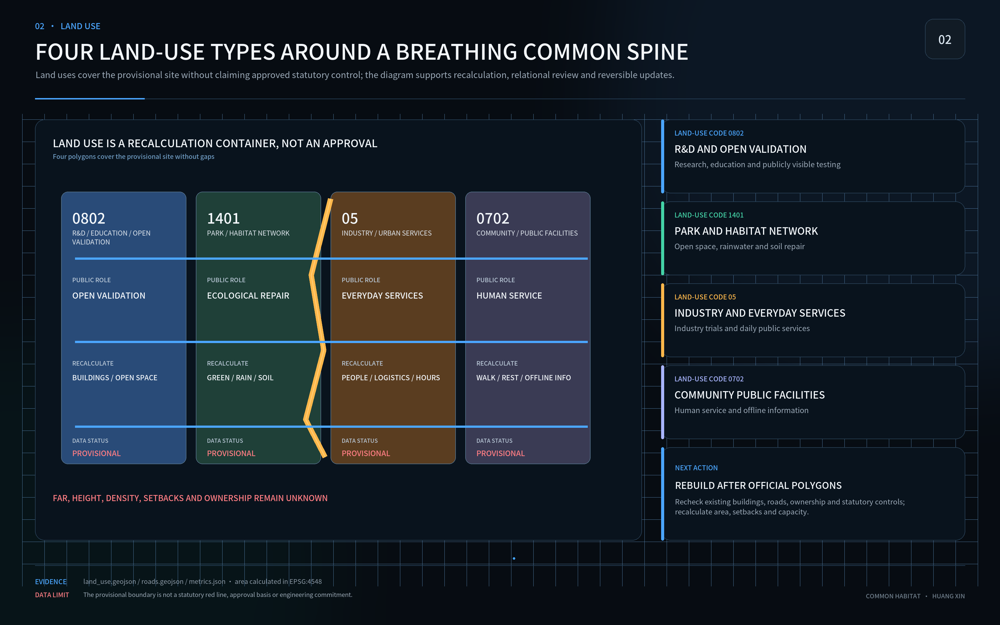
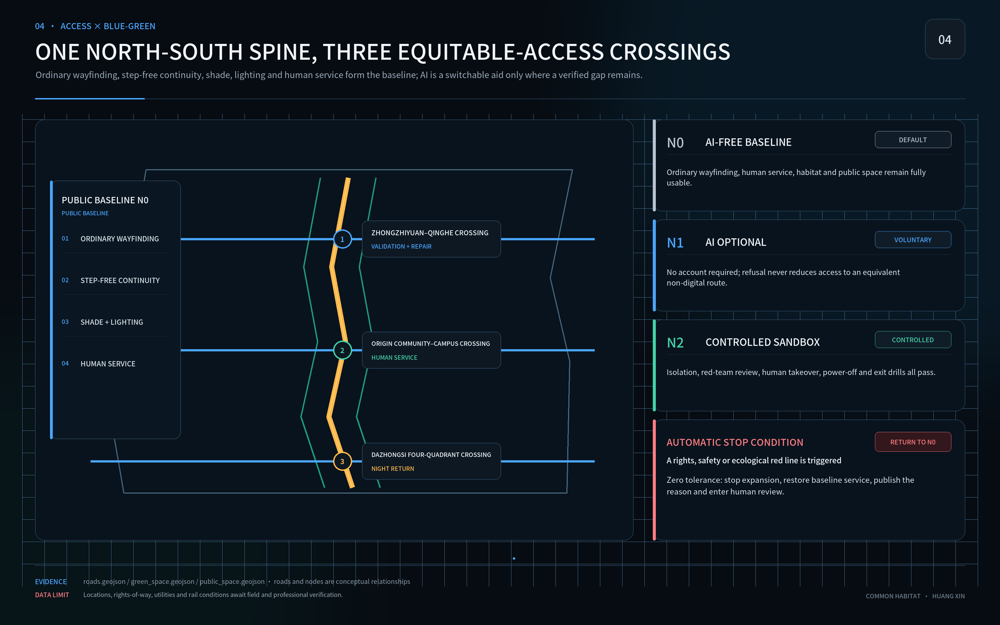
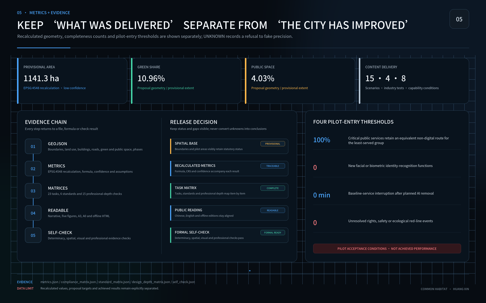

# Common Habitat

## Human–AI–Nature Urban Design for the Centennial Jingzhang Corridor

Author: Huang Xin — GitHub [@huangxin-design](https://github.com/huangxin-design)

This proposal judges urban performance by one question: can people of different ages, bodies, languages, care duties and digital experience independently arrive, orient, rest, participate, get help and return safely? This submission contains a design goal, a test protocol and a pilot proposal. It does not claim measured performance, construction approval, committed funding or operating authority.

The proposal forms a One-Day Common Loop along the Jingzhang heritage and innovation corridor. Continuous access, shade, drinking water, stormwater management, habitat, ordinary signage and human service form the public baseline. Optional AI addresses only the remaining gap, and only when an equivalent non-digital route, accountable maintenance, data limits, energy accounting, human takeover and physical removal are all credible. If a low-tech approach achieves the same public result, AI is not introduced.

## Design Basis and Source List

The official public brief and Agent Taskbook govern the work scope: an approximately 43.6 km² coordinated research area, an approximately 11.4 km² overall design area and three key areas totalling approximately 368.4 ha. Current GeoJSON boundaries are provisional and support concept generation, visualisation and topology checks only. They cannot support a statutory red line, precise area, permit or engineering conclusion. [source:OFFICIAL-ANNOUNCEMENT] [source:SITE-PACKAGE]

Chinese planning, urban-design and accessibility references frame professional depth. International sources calibrate inclusion, child-friendly and age-friendly practice, ecology and AI ethics. International alignment is not certification; policy context is not proof of local implementation. Official attachments, surveys and professional review remain mandatory before engineering decisions. [standard:MOHURD-URBAN-DESIGN-MEASURES] [source:CN-ACCESSIBILITY-LAW]

Nine material datasets still require official confirmation: boundaries, key-area polygons, regulatory controls, ownership and existing buildings, transport counts, municipal capacity, seasonal ecology, heritage controls and operating authority. Missing data does not block concept review, but it blocks statutory, engineering, investment and performance claims. [depth:existing_conditions_diagnosis] [source:BOUNDARY-SOURCE]

## Three-Level Scope Framework

The coordinated level asks how the Jingzhang corridor can operate as an open validation network for public problems. The overall level joins the heritage spine, walking, public services, blue-green systems and renewal projects. The key-area level tests whether a person can complete a real journey through entrances, paths, places to rest and help points. All three levels use the same six-task evidence model. [depth:three_level_scope_framework] [metric:site_area_sqm]

The spatial structure is one spine, two networks and three proposed pilot areas. The Jingzhang Common Spine is supported by an Equitable Access Network and a Water–Soil–Habitat Network. The three proposed pilot areas are Zhongzhiyuan, Beijing AI Origin Community and Dazhongsi, testing maintainability, phone-free public service, and complex interchange and night return respectively. Their locations and boundaries remain provisional and must be recalculated when official polygons arrive. [data:geometry/key_areas.geojson#PROV-KEY-001] [metric:key_area_count]

## Taskbook Alignment: Three Positions, Five Functions, Three Areas and Two Wings

The three positions share one evidence chain rather than three slogans. The Centennial Jingzhang Culture Belt separates verified heritage, engineering knowledge, oral history and open contributions. The Metropolitan AI Life Experience Belt first guarantees public service without a phone, account or identity check. The AI-Integrated Innovation Belt links research, testing, public scrutiny, operation and exit. Their visible outputs are an auditable historical timeline, a complete public day available to everyone, and a City Test Passport with versions, named responsibilities, failures and exit conditions. [source:AGENT-TASKBOOK] [metric:positioning_count]

The five functions form a sequence. Zhongzhiyuan hosts the **full-stack independent AI innovation system**. The three areas and two wings together form a **world-class AI innovation ecosystem**. Xiaoyue River and public-service nodes test a **new model of AI-enabled scenarios**. Dazhongsi and daily-life nodes test an **intelligent, active AI city**. Open protocols, independent recalculation and failure archives support **global discourse on AI governance**. “World-class” and “global discourse” are objectives, not current ratings. [metric:function_count]

| Spatial unit | Proposed task | Interface to the next step | Current boundary |
| --- | --- | --- | --- |
| Zhongzhiyuan AI Independent Innovation Accelerator | R&D, engineering verification, repair, red-teaming and energy testing | Delivers reproducible prototypes and exit plans to public scenarios | Location and operator remain unverified |
| AI Origin Community | Phone-free public service and daily-life testing | Returns access barriers, human workload and correction records | Low-risk reversible pilot only |
| Dazhongsi AI Industry Cluster | Complex interchange, daily services and emerging-service testing | Produces service-process, market-fit and public-interest reviews | No engineering or commercial authorisation is implied |
| Zhongguancun Technology Service Wing | IP, law, standards, talent, capital and international professional services | Provides the back-office interface for R&D, evaluation and transfer | No new statutory land boundary or existing commitment is implied |
| Xiaoyue River Scenario Empowerment Wing | Controlled tests in public space, blue-green systems and urban services | Supplies scenarios, maintenance feedback, ecological evidence and public review | Parks and streets are not default data-collection zones |

Together they form an R&D–public use–complex-environment verification–professional service–scenario feedback loop. This is a spatial and industrial coordination proposal, not an approved institution or investment arrangement. [metric:spatial_zone_count] [metric:collaboration_wing_count]

Regional cooperation begins with revocable task interfaces rather than unverified physical links:

| Node | Proposed interface | Transferable output | Boundary |
| --- | --- | --- | --- |
| Beiwei Community | Community needs, public service and user retesting | Problem ledger, task samples and maintenance feedback | Residents are not default test subjects |
| Future Science City | Knowledge, talent and joint evaluation methods | Research questions, mentors and repeatable protocols | No signed partnership, staffing or special fund is claimed |
| Huairou Science City | Scientific methods, instruments and independent verification | Test design, calibration and recalculation records | Facility access or compute quotas are not assumed |
| Beijing E-Town | Engineering, manufacturing, industrial testing and transfer | Maintainable components, interface specifications, prototyping and exit records | No procurement, location commitment or industrial scale is promised |
| Beijing–Tianjin–Hebei | Cross-city replication, talent exchange and fitness comparison | Open protocols, data dictionaries, version differences and limits | A conceptual network is not presented as an established alliance |

Knowledge, talent, testing, compute and transfer enter only through named agreements, permissions and cost records. Formal partners, funding, space and data arrangements remain subject to confirmation by the relevant parties. [metric:regional_collaboration_node_count]

## Coordinated Research Area: Industry and Future City Research

The corridor is proposed as an openly auditable urban testing process. Enterprises, researchers and public bodies would define real urban tasks and compare a zero-AI baseline, a low-tech solution and an optional AI solution at the same location. Public-interest safeguards become design inputs, test conditions and procurement evidence, reducing the risk of deploying a compelling demonstration that cannot be maintained, explained or removed. [source:AGENT-TASKBOOK] [depth:overall_spatial_structure]

A City Test Passport structures the pathway: problem registration, three-way comparison, isolated verification, shadow operation, limited public trial, independent recalculation, and either procurement discussion or exit. Each gate publishes versions, errors, energy, human takeover, least-served-group results and unresolved issues. Enterprises gain reusable task definitions, open interfaces, a shared testing space and a record of unsuccessful trials; participation alone conveys no procurement preference, certification or partnership.

Industry validation begins with four cross-cutting tests: low-energy edge sensing, a robot shared-space safety sandbox, public-service-agent reliability and red-teaming, and AI energy and exit cost. These tests support accessible mobility, public-service navigation, low-interference cultural guidance, enterprise-service coordination and public-safety review. If ordinary signage, telephone or human service performs better, “do not procure AI” is a legitimate and useful result. [source:INT-UNESCO-AI-ETHICS] [metric:industry_test_count]

## Six International Cases and an Eight-Element Innovation Ecosystem

The cases compare organisational, spatial and governance mechanisms. They are not a ranking, and overseas scale, funding or policy conditions are not converted into Jingzhang forecasts.

| Case and source | Verifiable mechanism | Action transferable to Jingzhang | Limit and non-transferable element |
| --- | --- | --- | --- |
| Vector Institute, Toronto [source:CASE-VECTOR] | A non-profit institute connects universities, industry, health and government across talent, research and trusted adoption | Zhongzhiyuan keeps a shared research–engineering–adoption ledger with public test goals and reusable outputs | Do not reuse its funding, talent or company numbers; research space is not automatically public space |
| Mila, Montréal [source:CASE-MILA] | Research, universities, start-ups, industry and responsible-AI debate coexist over time | Place open lectures, translation, ethics review and public-interest sprints in one operating cycle | Do not copy a star-researcher model or substitute reputation for local evidence |
| Knowledge Quarter, London [source:CASE-KNOWLEDGE-QUARTER] | A walkable institutional network connects culture, research, universities, community and local bodies | Organise a knowledge neighbourhood with a light membership charter and cross-institution problem groups | Institutional density, ownership and transport differ; its spatial scale cannot be transplanted |
| LaunchPad @ one-north, Singapore [source:CASE-LAUNCHPAD] | Enterprise, research, events and daily support are organised at close range | Provide shared verification facilities, short project places and talent support at Zhongzhiyuan | Do not describe planned projects as completed; entrepreneurship cannot displace the public or ecological baseline |
| Seoul AI Hub [source:CASE-SEOUL-AI-HUB] | A city-backed support institution links talent, incubation, R&D infrastructure and collaboration | The three areas share admission, mentoring, testing and exit rules with staged support | Do not copy incentives, investment or planning controls; similar policy remains a research proposal |
| STATION F, Paris [source:CASE-STATION-F] | A reused historic building concentrates programmes, shared services and events | Dazhongsi can study one public entrance with multiple programmes and a shared back office | Do not copy the brand, company list, fee structure or single large-campus form |

Across the six cases, the transferable value is a long-term chain linking research, talent, space, testing and adoption, not a list of companies. The proposed Jingzhang loop is: register an urban problem → compare N0, low-tech and AI → develop at Zhongzhiyuan → complete N2 safety testing → test public use at AI Origin Community and Xiaoyue River → test complex services at Dazhongsi → independently recalculate with resident/professional dual keys → continue, reduce, discuss procurement or exit → return evidence to the Open Ledger. [metric:international_case_count]

| Element | Proposed carrier | Mechanism and release evidence | Accountable role, pending confirmation |
| --- | --- | --- | --- |
| Land | Reversible, reusable, short-cycle space in the three areas | No permanent allocation for unverified technology; restore ordinary public or R&D use on exit | Planning and site owner |
| Space | Shared benches, N2 isolation rooms, public observation and repair positions | Passed and failed projects use the same disclosure format | Operator and safety lead |
| Industry | Zhongzhiyuan R&D, Dazhongsi services and the Zhongguancun wing | Form teams around public problems; no vendor controls interfaces, data or evaluation | Industry convenor and procurement owner |
| Capital | Staged challenge funds or joint R&D, as a proposal | Evidence-gated release; evaluation and failure publication budgets remain independent | Funder and independent reviewer |
| Talent | Researchers, engineers, designers, maintainers and residents in one project unit | Maintainers join early; residents can refuse and receive paid or equivalent participation | Project and co-design leads |
| Compute | Controlled tests and professional-service interfaces | Log quotas, duration, energy and cost; no quota is currently promised | Compute provider and energy manager |
| Data | AI Origin Community, Xiaoyue River and the Open Ledger | Prefer open, synthetic, de-identified or cleared data; keep sensitive data within accountable boundaries | Data and safety lead |
| Scenarios | Xiaoyue River, AI Origin Community and Dazhongsi | Each scenario retains a non-AI baseline, human takeover and an exit drill | Scenario owner and affected-user representative |

All eight elements are conceptual arrangements. Land, funding, compute, data permission, responsible parties and agreements must be confirmed before implementation or performance claims. [metric:innovation_ecosystem_element_count]

## Overall Design Area: Urban Renewal and Regulatory-Plan-Level Urban Design

The One-Day Common Loop connects rail stations, public services, places to rest, weather protection, drinking water, toilets, cultural spaces and human help. Ordinary signage and continuous accessibility define the base version. A removable digital layer may add live information or translation after the baseline works. [depth:overall_spatial_structure] [data:geometry/roads.geojson#ROAD-001]

Official regulatory controls, road red lines, building heights, plot ratios and utility information remain incomplete. The proposal therefore sets a decision order—retain, repair, replace, then trial—without inventing statutory indicators. All current ratios remain provisional calculations with explicit sources, formulas, coordinate status and provisional labels. [standard:MOHURD-CONTROL-DETAILED-PLANNING] [metric:floor_area_ratio]

## Detailed Design of Key Areas

Zhongzhiyuan hosts maintainability and research verification through an open test yard, repair bench, isolated sandbox, records of unsuccessful trials and outage drills. Beijing AI Origin Community hosts ordinary public life through a Common Gateway, continuous shade, rest and water, non-digital signage, a human service desk and six offline information formats. Dazhongsi addresses interchange, night return, culture and complex entrance relationships. [depth:three_key_area_detailed_design] [source:KEY-AREA-SOURCE]

Each area uses the same design card: intended users, six tasks, spatial action, zero-AI route, optional technology, physical location, maintainer, test method, stop condition and restoration action. All placements remain conceptual until boundaries, ownership and operating rights are confirmed.

## Four Landmark Prototypes, Open Recognition and Public Components

The four landmarks are spatial prototypes subject to verification, not fixed sites or approved projects. Each protects ordinary use before adding an optional intelligent layer.

| Prototype | Proposed role | Ordinary use and optional technology | Stop or fallback condition |
| --- | --- | --- | --- |
| L01 AI Origin Contribution Archive / Origin Commons | Public knowledge, timeline, discussion and feedback | Fixed, paper and tactile content remains usable; AI only assists search and translation | Disable the intelligent layer when history or rights are unverified or human correction is impossible |
| L02 Zhongzhiyuan Open Verification Yard | Observable and isolatable industry testing and repair | Shared tools, repair, observation and safety information precede edge, robotics, model-safety and energy tests | No entry to a real community before safety and outage drills pass |
| L03 Dazhongsi Common Gateway | A non-commercial entrance linking interchange, community, life and industry services | Human service, rest, signage and public legal/life information remain; AI is opt-in only | Profiling, commercial steering or obstruction of a necessary route causes suspension |
| L04 Jingzhang Unplugged Platform | A relocatable public dashboard, emergency stop and removal-drill node | Physical models, failures and human takeover remain readable; intelligent parts use standard removal interfaces | No placement until heritage, green-space, structure, power and event conditions are checked |

The Jingzhang Open Ledger recognises five contribution types: finding a public problem, providing cleared data, repairing a component, completing independent replication, and publishing a failure or exit. A record includes a voluntarily disclosed name, date, output link, licence, conflict of interest and version. It is not ranked by sponsorship; essential facilities do not sell naming rights; unverified model scores do not become permanent monuments. Superseded findings keep version history, while non-essential personal information may be removed under the applicable rules. [metric:landmark_count]

| Plug-in component | N0 public function | Optional N1/N2 increment | After intelligent removal |
| --- | --- | --- | --- |
| Quiet Habitat Island | Shaded rest, darkness, habitat and soil repair | Low-frequency non-identifying ecological sensing | Habitat and rest remain |
| No-Threshold Service Point | Seating, water, human help, map and telephone | Opt-in translation | Human and physical information remain |
| Common Crossing Gate | Accessible crossing, walking connection and lighting | Condition and maintenance advice | Ordinary transport operation remains |
| Rainwater Habitat Court | Retention, infiltration, native planting and learning | Irrigation and care advice | Passive drainage and manual care remain |
| Jingzhang Memory Table | Verified history, objects, tactile models and human narration | Captions, audio description and search | Fixed interpretation remains complete |
| Co-Governance Audit Booth | Paper, telephone, in-person feedback and notice | Traceable issue index | Manual numbering and deliberation continue |
| Plug-out Test Cabin | Physical isolation, emergency stop and observation | Time-limited industry test | Space returns to shared use after removal |
| Shade and Supply Point | Trees, seating, water and night lighting | Environmental notice and repair request | Ordinary public facility remains |

The component count is a proposal catalogue, not an inventory of built assets. Location, quantity, structure and maintenance require official boundaries, ownership, heritage, fire-safety and operating confirmation. [metric:public_component_count]

## A Jingzhang–Zhongguancun–AI Narrative of Responsibility

The main line is: **the railway left a scale of engineering; Zhongguancun left a habit of testing; AI must now learn to carry responsibility in the city.** Northern Zhongzhiyuan shows how technology is made, tested, repaired and rejected. The central AI Origin Community shows how it enters ordinary life and is questioned or corrected by residents. Southern Dazhongsi shows how it may become an urban service while preserving a non-commercial, non-profiling entrance. The two wings connect professional support and real scenarios, knowledge and consequence.

Wayfinding uses “rail line + open gap + status colour”: ink blue for ordinary public routes, habitat green for water/soil and quiet space, open blue for optional service, heritage copper for history, and red only for stop, risk and no-entry conditions. Heritage marks, Jingzhang corridor identity, and Common Habitat project/event marks remain distinct so a proposal mark cannot impersonate an official or heritage mark. Portraits, trademarks, paper figures, photographs and fonts do not enter final material before rights clearance. [source:AGENT-TASKBOOK]

## AI Innovation Ecosystem, Personas, and AI+ Scenarios

Recruitment does not assume an average user. Eight capability conditions cover mobility and stamina; vision and colour; hearing and speech; reading and cognitive load; device and digital experience; heat, noise and crowding; care duties; and time or night conditions. A participant may occupy several conditions. Results are published by intersections; an unrepresented high-risk intersection is explicitly marked as missing evidence and cannot pass the gate. [source:INT-UN-CRPD9] [metric:capability_condition_count]

The 90-Day Pioneer Pilot is proposed for one verifiable section of a public-life loop in Beijing AI Origin Community, subject to operator and professional confirmation. Days 0–15 record boundaries, responsibility, existing conditions and six-task baselines. Days 16–30 co-design zero-AI, low-tech and optional-AI candidates. Days 31–60 repeat tests by capability condition and publish unsuccessful trials and maintenance hours. Days 61–75 apply controlled AI shadow testing only to remaining gaps while basic service continues. Days 76–90 complete network, power and removal drills, independently recalculate the evidence, and recommend continuation, modification, reduction or exit.

By day 90, the pilot must deliver: a defect ledger, a zero-AI public baseline, three reversible interventions, a six-format offline guide plan, task-test records, a three-year cost account, maintenance and emergency responsibilities, procurement acceptance clauses and an open evidence pack. The three interventions focus on the Common Gateway and continuous access, human service and multi-format information, and optional route, translation or status assistance. Evidence determines whether AI is used.

## Land Use, Building Scale, and Retain-Renovate-Demolish Strategy

Current land-use and building data explain spatial relationships and recalculation methods; they do not replace official codes, title records, surveys or structural assessment. The sequence protects public-service and heritage continuity, repairs interruptions, and considers new construction last. Permanent work must wait for official boundary, planning, heritage, municipal and structural information. [standard:MNR-LAND-USE-CLASSIFICATION-GUIDE] [data:geometry/land_use.geojson#LU-001]

The 90-day pilot is limited to reversible, low-impact and maintainable components: temporary shade and seating, tactile and large-print signs, a human-service desk, and removable sensors or screens. It may not remove existing public service, occupy emergency routes, alter statutory use or create a compulsory digital entrance. [metric:building_footprint_area_sqm]

## Transport, Rail, Municipal Infrastructure, and Public Services

Transport and services are derived from the six tasks. Every test route needs an accessible entrance, continuous passage, legible landmarks, rest and weather protection, information on water and toilets, human help, night lighting and a safe return. Rail and bus relationships require field verification; the current road-centreline length is only a concept-comparison metric. [data:geometry/roads.geojson#ROAD-001] [metric:road_centerline_length_m]

Basic public service does not require a smartphone, account, identity recognition or AI fluency. The offline plan includes Braille plus a tactile route map, large-print high contrast, child easy-read, older-adult easy-read, audio, and telephone plus on-site human explanation. All six are planned and not yet delivered. QR is supplementary only, and each format must be co-created and tested with its intended users. [source:CN-BRAILLE-LAYOUT-44725-2024] [source:CN-ACCESSIBILITY-LAW]

## Blue-Green Network, Public Space, and Urban Character

The Water–Soil–Habitat Network measures shade, stormwater, soil, native planting, habitat continuity, darkness and maintenance work together. Shade, drinking water and rest support older people, children, persons with disabilities, carers and night workers while providing basic heat and extreme-weather resilience. [source:INT-UNEP-NBS] [depth:blue_green_public_space]

Ecological release requires at least one complete growing season with records of survival, soil compaction, ponding, heat exposure, night disturbance, maintenance frequency and failure. The AI resource account includes electricity, network and storage, device replacement, repair labour, spares and retirement. Expansion stops when ecology worsens, measurement fails or burden shifts to the least-served group. [metric:green_ratio] [data:geometry/green_space.geojson#GREEN-001]

## Renewal Projects, Implementation Policy, and Phasing

Eight actions organise delivery: the One-Day Common Loop, Common Gateway, continuous shade and rest, human service and multi-format information, water and soil repair, low-interference cultural nodes, a trusted urban validation field, and the Jingzhang Open Ledger. Every action records an owner role, prerequisite data, zero-AI version, test group, maintenance resources, stop condition and restoration action. [metric:renewal_project_count] [data:geometry/phasing.geojson#PHASE-001]

Ninety days produces a pioneer-pilot result and a recommendation on whether to enter procurement discussion. It is not a procurement decision or corridor-wide construction. G0 accepts the non-digital baseline; G1 permits a small optional service; G2 permits only isolated or controlled verification. Each gate requires both professional review and affected-user confirmation. Missing critical participants, a red-line event, or interrupted budget and contract automatically returns service to N0.

Required roles are a site owner, public-service owner, accessibility and co-design lead, ecology lead, data and safety lead, and independent reviewer. Names, mandates, funding and long-term maintenance contracts are not yet confirmed and must be secured before construction or a limited public trial.

## Annual Operation, Open Conversion and Three-Year Resource Boundaries

The proposed Common Habitat Open Season is an annual work cycle, not a confirmed event. It advances with evidence rather than a launch date.

| Stage | Core work | Required evidence | Release question |
| --- | --- | --- | --- |
| 1 Public Problem and Baseline Week | Register affected groups, space and the N0 route | Problem map, missing data and six-task baseline | Is the problem real and worth R&D? |
| 2 Open Build and Verification Month | Design prototypes, repair, data and risk controls | Test protocol, maintenance plan, licence and cost boundaries | Is low tech sufficient; can the work enter N2? |
| 3 Jingzhang Field Test Season | Shadow tests, limited live tests and public observation | Primary outcome, guardrails, takeover and minority opinions | Have both benefit and safety gates passed? |
| 4 Unplug AI Week | Graded network, power and removal drills | Service continuity, vendor migration and site-restoration record | Can basic service operate without the intelligent layer? |
| 5 Open Evidence Assembly | Independent recalculation, resident jury, professional review and failure display | Keep, modify, reduce, pause, remove or reconsider | Is the evidence sufficient for another year? |

Routine operation comprises a problem clinic, open repair day, red-team evening school, phone-free walk, habitat record day, developer office hours and failed-project display. The developer community works from open tasks: register beneficiaries, an N0 route, scenario owner and data licence before engineering; use shadow mode before public operation; deposit code, interfaces, data dictionaries, failures and exit records under their licences. Selection conveys no automatic procurement, investment, permit, space or policy support. [metric:annual_operation_stage_count] [metric:routine_activity_type_count]

Every open scenario uses a result contract covering the public problem and beneficiaries; spatial and time boundary; N0, low-tech and AI options; one primary outcome and hard guardrails; retention and deletion; human takeover and appeal; named responsibility; vendor migration; equipment removal, site restoration and expiry decision. Visitors can progress to issue reporting, joint retesting or paid documentation. Developers can progress from a sprint to N2, shadow mode or exit. Enterprises negotiate with the relevant parties only after a common test. External professional teams may reuse protocols and return version differences.

The three-year total-cost account defines resource categories without inventing amounts or public funding commitments:

| Resource category | Three-year record | Required exit item |
| --- | --- | --- |
| N0 basic public service | Human desk, telephone, print, accessible route and service hours | Must continue after intelligent removal |
| Site, permission and insurance | Site use, event permission, safety and liability cover | Restoration duty when permission ends |
| Reversible components and installation | Design, fabrication, transport, installation, checking and rotation | Removal, storage, reuse or compliant disposal |
| People and training | Maintenance, takeover, co-design, accessibility and emergency training | Knowledge transfer after vendor exit |
| Maintenance, spares and failure | Inspection, repair, spares, downtime and human rework | Substitution for discontinued parts and open-interface migration |
| Data, safety and independent evaluation | Clearance, storage, deletion, red-team, replication and appeals | Data deletion, log retention and audit handover |
| Energy, network and compute | Electricity, connectivity, storage, quotas and metering | Degraded and offline operation |
| Removal, restoration and contingency | Equipment clearance, site recovery, ecological repair and incident response | Cannot be controlled by one supplier |

Basic public service, resident participation, independent evaluation and exit restoration cannot depend on a single vendor. Sponsorship cannot purchase test results, resident seats, essential-route naming rights, data privilege or the right to close an issue. Amounts, organiser, venues, partners and three-year contracts all remain unconfirmed. [metric:three_year_resource_category_count]

## Metrics, Area Recalculation, and Compliance Matrix

Metrics distinguish known facts, provisional recalculations, proposal targets and missing data. Current package geometry recalculates approximately 11.41 km² of site, 10.96% green ratio and 4.03% public-space ratio. These figures prove internal traceability only; they are not official current conditions or commitments. [metric:site_area_sqm] [metric:green_ratio] [metric:public_space_ratio]

Pilot admission first checks two public-service baselines: 100% non-digital coverage for critical services and zero new identity-recognition features. [metric:non_digital_service_coverage_target] [metric:new_identity_recognition_features_target]

Two further gates test exit and safety: zero minutes of basic-service interruption after planned AI removal and zero tolerance for rights, safety or ecological red-line events. Results are published by eight capability conditions and intersections, with the least-served and best-performing observed groups shown together. [metric:ai_removal_service_interruption_target_minutes] [metric:red_line_incident_tolerance_count]

AI advances only when it produces a perceptible improvement over both N0 and low-tech versions, repeats under independent testing, fits a three-year cost and maintenance envelope, and does not worsen the least-served group, ecology or human workload. If low tech reaches the target, if the AI result cannot be independently recalculated, or if the exit drill fails, AI is not adopted.

## Risk, Copyright, and Compliance

Principal risks are provisional geometry being mistaken for statutory control, targets being mistaken for achieved results, missing participants in critical capability conditions, AI demonstrations replacing basic services, child-data overreach, hidden energy and maintenance costs, vendor lock-in, decorative ecology and absent owners. Every risk is paired with counter-evidence, a stop action and an accountable role. Negative findings remain in the open record. [source:INT-UNESCO-AI-ETHICS] [depth:risk_missing_data]

Child-facing scenarios default to no collection of identity, biometrics, precise location, raw voice, identifiable work or long-term profiles. Any breach stops the trial. Braille requires professional transcription, independent proofreading by two qualified people, and testing with blind users; tactile route maps require separate orientation review. The guide plan, pilot targets and international alignment are not certificates, compliance opinions or completed deliverables.

This work participates in the Haidian-led open call for the Centennial Jingzhang AI Innovation Belt. It is a competition concept, not a formal plan, government approval, investment promise, procurement decision, engineering conclusion or operating authorisation. Original text and graphics follow the package licence; third-party sources are cited without implying permission to redistribute their pages, imagery or marks.

## References

The official task, site package, source registry and local standard snapshots form the primary evidence layer. UN, WHO, UNESCO, W3C and UNEP materials calibrate methods. The complete source record, permitted uses, prohibited uses, access dates and local paths are in `sources.json`; professional mapping is in `standard_matrix.json` and `design_depth_matrix.json`. [source:SOURCE-REGISTRY] [source:PROCESSED-FACT-PACK]

Spatial data are in `geometry/`, metrics in `metrics.json`, assumptions and gaps in `assumptions.json`, required tasks in `compliance_matrix.json`, and validation in `self_check.json`. These structured files are the audit and recalculation layer; the narrative keeps only evidence anchors necessary for human decisions.
