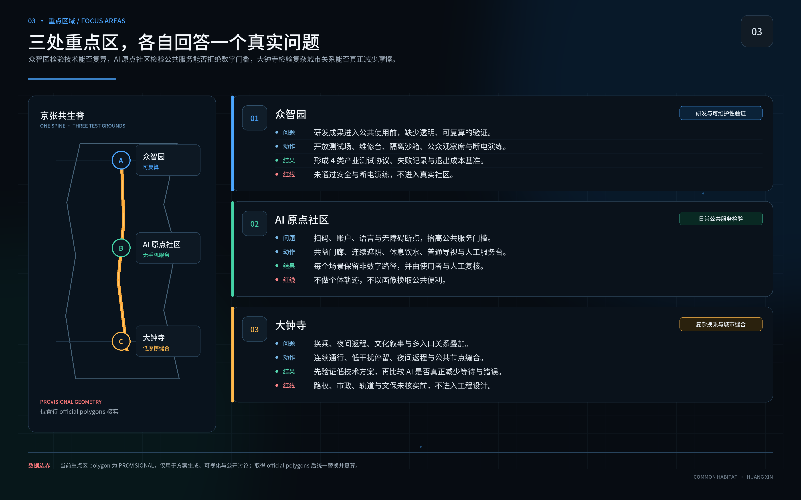
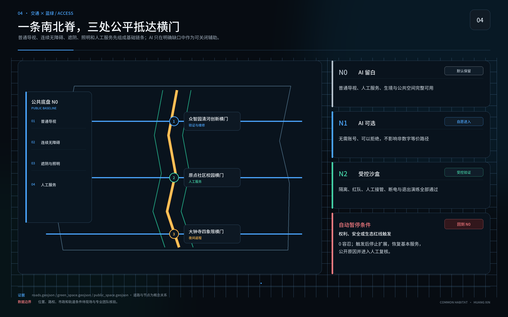
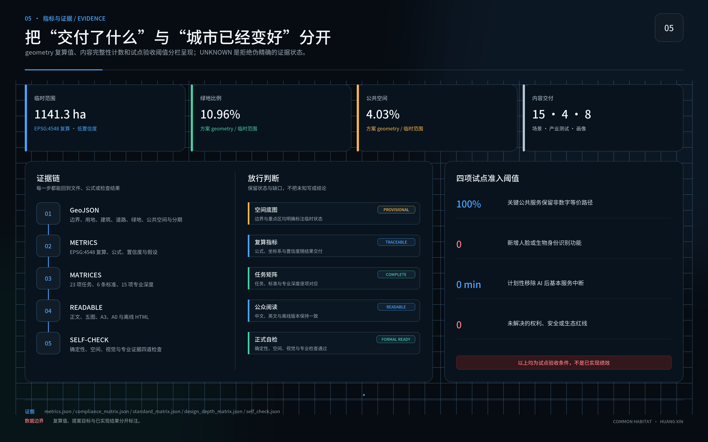

# 共益生境

## 百年京张人—AI—自然共生城市设计 / COMMON HABITAT

作者 / AUTHOR：黄鑫（GitHub [@huangxin-design](https://github.com/huangxin-design)）

本方案只用一个问题判断城市是否有效：无论年龄、身体能力、语言、照护负担或数字经验，每个人是否都能独立完成抵达、识路、休息、参与、求助和安全返程？目前提交的是设计目标、测试协议和试点建议；现场表现、实施主体、建设资金与正式审批均待后续确认。

方案沿京张遗产与创新带组织“一日共益环”：公共底盘先补连续通行、遮阴、饮水、雨水、生境、普通导视和人工服务；可选 AI 只处理仍未解决的缺口。每项技术都要回答受益人、非数字等价路径、维护责任、数据边界、能耗、停机接管与撤除恢复。低技术方案达到同等结果时，不引入 AI。

## 设计依据与资料清单

工作范围以官方公开任务与智能体任务书为主控：统筹研究范围约 43.6 平方公里，总体设计范围约 11.4 平方公里，三处重点区域合计约 368.4 公顷。当前 GeoJSON 为临时粗略边界，只支持概念生成、可视化和拓扑自检，不支持红线、精确面积、许可或工程结论。[source:OFFICIAL-ANNOUNCEMENT] [source:SITE-PACKAGE]

国内专业依据用于约束城市设计、控规衔接、无障碍服务和用地表达；国际资料用于校准包容、公平、儿童友好、老龄友好、生态和 AI 伦理。国际对齐不等于认证，政策背景不等于本地已实施事实；正式工程阶段仍需官方附件、现状测绘和专业审查。[standard:MOHURD-URBAN-DESIGN-MEASURES] [source:CN-ACCESSIBILITY-LAW]

九类关键资料仍待正式补齐：官方边界、重点区多边形边界、控规条件、权属与现状建筑、交通实测、市政容量、四季生态、文保控制和运营授权。缺资料不阻断概念评审，却会阻断法定、工程、投资和绩效结论。[depth:existing_conditions_diagnosis] [source:BOUNDARY-SOURCE]

## 三层范围工作框架

统筹层回答京张创新带如何形成面向公共问题的开放验证网络；总体层回答遗产轴线、慢行、公共服务、蓝绿系统和更新项目如何协同；重点区层回答人在真实入口、路径、停留和求助过程中能否完成一天。三层使用同一套六任务证据，避免区域叙事与现场体验脱节。[depth:three_level_scope_framework] [metric:site_area_sqm]

空间结构概括为“一脊、两网、三处建议试点区”。一脊是京张共生脊；两网是公平抵达网与水土生境网；三处建议试点区分别是众智园、北京 AI 原点社区和大钟寺，依次验证研发与可维护性、无手机公共服务、复杂换乘与夜间返程。位置和边界均为临时建议，官方多边形边界到位后必须统一复算。[data:geometry/key_areas.geojson#PROV-KEY-001] [metric:key_area_count]

## 任务书对齐：三大定位、五大功能与三区两翼

三大定位共用一条证据链：百年京张文化带把遗址、工程知识、口述史与开放贡献分栏呈现；都市 AI 生活体验带先保证无需手机、账号或身份识别的公共服务；AI 融合创新带把研发、测试、公共审查、运营和退出串成可追溯过程。对应的可见结果分别是可核验的历史时间线、人人可完成的一日公共生活，以及带版本、责任人、失败记录和退出条件的城市测试护照。[source:AGENT-TASKBOOK] [metric:positioning_count]

五大功能按顺序形成闭环：众智园承接 **AI 全栈自主创新体系**，三区与两翼共同形成 **世界级 AI 创新生态**，小月河及公共服务节点检验 **AI+ 场景赋能新范式**，大钟寺与日常生活节点检验 **智能化 AI 活力城市**，公开协议、独立复算和失败档案支撑 **AI 治理全球话语权**。这里的“世界级”和“话语权”是工作目标，不是现状评级。[metric:function_count]

| 空间单元 | 概念任务 | 与下一环的接口 | 当前边界 |
| --- | --- | --- | --- |
| 众智园 AI 自主创新加速区 | 研发、工程验证、维修、红队与能耗测试 | 向公共场景交付可复算原型和退出方案 | 位置与运营主体待核验 |
| AI 原点社区 | 无手机公共服务与日常生活检验 | 返回使用障碍、人工负担与修正记录 | 仅建议低风险、可逆试点 |
| 大钟寺 AI 产业集聚区 | 复杂换乘、生活服务与新业态验证 | 输出服务流程、市场适配与公共性复核 | 不预判工程和商业授权 |
| 中关村科技服务翼 | 知识产权、法律、标准、人才、资本和国际专业服务 | 为研发、评测与成果转化提供后台接口 | 不暗示新的法定用地边界或既有承诺 |
| 小月河场景赋能翼 | 公共空间、蓝绿系统和城市服务的受控测试 | 提供场景、维护反馈、生态证据和公众复核 | 不把公园与街道变成默认采集区 |

三区加两翼组成“研发—公共使用—复杂环境验证—专业服务—场景反馈”的回路；它是空间产业协同建议，不是已批准机构或投资安排。[metric:spatial_zone_count] [metric:collaboration_wing_count]

区域协同先从可撤回的任务接口开始，不先画未经核实的物理连线：

| 协同节点 | 建议接口 | 可交换成果 | 不越过的边界 |
| --- | --- | --- | --- |
| 北纬社区 | 社区问题、公共服务与使用者复测 | 问题台账、任务样本、维护反馈 | 不把居民当作默认测试对象 |
| 未来科学城 | 知识、人才与联合评测方法 | 研究题目、导师与可重复协议 | 不虚构签约、编制或专项资金 |
| 怀柔科学城 | 科学方法、仪器能力与独立验证 | 测试设计、校准方法和复算记录 | 不推定设施开放或算力配额 |
| 经开区（亦庄） | 工程化、制造、产业测试与成果转化 | 可维护组件、接口规范、试制与退出记录 | 不承诺采购、落地或产业规模 |
| 京津冀 | 跨城市复现、人才交流和适配性比较 | 开放协议、数据字典、版本差异与适用限制 | 不把概念网络表述为已成立联盟 |

知识、人才、测试、算力与成果转化都须通过具名协议、权限和成本记录进入；正式合作、资金、场地和数据安排由相关主体另行确认。[metric:regional_collaboration_node_count]

## 统筹研究范围产业与未来城市研究

京张创新带需要一套可公开核验的城市试验机制：企业、研究团队和公共部门围绕真实城市任务共同定义问题，在同一地点比较 N0 零 AI、低技术方案和可选 AI 方案。公共利益规则直接转化为研发输入、测试条件和采购证据，减少展示成功却无法维护、无法解释、无法退出的部署风险。[source:AGENT-TASKBOOK] [depth:overall_spatial_structure]

建议建立“城市测试护照”：问题登记 → N0/低技术/AI 三案比较 → 隔离验证 → 影子运行 → 限量公众试用 → 独立复算 → 采购讨论或退出。每一关发布版本、错误、能耗、人工接管、最少获得服务的观察组结果和未解决问题；企业可以获得可复用的任务定义、开放接口、试验空间和未通过记录，但不会因参赛文本自动获得采购、认证或合作资格。

产业验证先从四项横向测试开始：低能耗端侧感知、机器人共享空间安全沙盒、公共服务智能体可靠性与红队、AI 能源与退出成本。这四项测试服务于无障碍交通、公共服务导航、低干扰文化导览，以及企业服务协同和公共安全复核。场景只在问题和责任人明确后进入；若普通导视、电话或人工服务更可靠，测试护照会记录“不采购 AI”作为有效结论。[source:INT-UNESCO-AI-ETHICS] [metric:industry_test_count]

## 六个国际案例与八要素创新生态

国际案例只用于比较组织、空间和治理机制，不做排名，也不把海外规模、资金或政策条件换算成京张预测：

| 案例与来源 | 可核实机制 | 京张可借鉴的动作 | 适用限制与不可照搬项 |
| --- | --- | --- | --- |
| 多伦多 Vector Institute [source:CASE-VECTOR] | 非营利研究机构连接高校、企业、医疗和政府，兼顾人才、研究与可信采用 | 众智园建立“研究—工程—采用”共同台账，项目公开测试目标和复用成果 | 不引用其资金、人才或企业数；研究空间不等于公共开放空间 |
| 蒙特利尔 Mila [source:CASE-MILA] | 研究、高校、初创、产业与负责任 AI 议题长期共处 | 把开放讲座、研究转化、伦理讨论和公益研发冲刺放入同一运营周期 | 不复制明星学者驱动模式，不用声誉代替场景证据 |
| 伦敦 Knowledge Quarter [source:CASE-KNOWLEDGE-QUARTER] | 以步行可达的机构网络连接文化、科研、高校、社区和地方机构 | 以“知识邻里”组织节点，建立轻量成员章程和跨机构议题组 | 机构密度、产权和交通不同，不能直接套用空间尺度 |
| 新加坡 LaunchPad @ one-north [source:CASE-LAUNCHPAD] | 创业、研究、企业、活动与生活配套近距离组织 | 众智园设置共享验证设施、短期项目位，并同步提供人才服务 | 不把规划项目写成已建经验；创业配置不能挤占公共与生态底盘 |
| 首尔 Seoul AI Hub [source:CASE-SEOUL-AI-HUB] | 城市支持机构连接人才培养、孵化、研发设施与产学研协作 | 三区使用同一套准入、导师、测试和退出规则，支持按阶段放行 | 不照搬政策激励、投资或规划控制，类似政策仅是待研究建议 |
| 巴黎 STATION F [source:CASE-STATION-F] | 历史建筑更新中集中多类项目、共享服务和活动 | 大钟寺研究“一个入口、多类项目、共享后台”的服务组织 | 不复制品牌、企业名单、收费结构或单一大体量园区 |

六例共同说明：创新生态要把研究、人才、空间、测试和采用连成长期工作回路，企业名单只是一项背景资料。京张回路为“城市问题登记 → N0/低技术/AI 三案比较 → 众智园研发 → N2 安全测试 → AI 原点社区与小月河公共使用测试 → 大钟寺复杂服务验证 → 独立复算与居民/专业双钥匙 → 继续、缩小、采购讨论或退出 → 证据回到开放档案”。[metric:international_case_count]

| 要素 | 建议载体 | 机制与放行依据 | 责任角色（待确认） |
| --- | --- | --- | --- |
| 土地 | 三区的可逆、可复用、短周期空间 | 不为未验证技术永久让渡；退出后恢复普通公共或研发用途 | 规划与场地责任方 |
| 空间 | 众智园共享实验台、N2 隔离间、公众观察席、维修位 | 通过与未通过项目采用同一披露格式 | 场地运营与安全负责人 |
| 产业 | 众智园研发、大钟寺复杂服务、中关村科技服务翼 | 围绕场景组队，接口、数据和评估规则不得被单一供应商锁定 | 产业组织与采购责任方 |
| 资金 | 分阶段挑战资金或联合研发建议 | 按证据门放行，独立评估和失败公开预算不得由供应商控制 | 资金提供方与独立复核人 |
| 人才 | 科研、工程、设计、维护和居民共同项目单元 | 维护人员前置，居民可拒绝并获得有偿或等价参与 | 项目负责人和共创负责人 |
| 算力 | 受控测试环境与中关村专业服务接口 | 按任务期限、配额、能耗和成本登记；配额尚未承诺 | 算力提供方与能源管理员 |
| 数据 | AI 原点社区、小月河与开放档案 | 优先公开、合成、去标识或清权数据，敏感数据留在责任边界 | 数据与安全负责人 |
| 场景 | 小月河场景赋能翼、AI 原点社区、大钟寺 | 每个场景保留非 AI 底盘、人工接管和退出演练 | 场景责任方与受影响使用者代表 |

八要素均是概念配置。用地、资金、算力、数据权限、责任人和合作协议未落实前，不进入实施或绩效口径。[metric:innovation_ecosystem_element_count]

## 总体设计范围城市更新与控规深度城市设计

总体设计把京张铁路记忆、公共生活和自然过程叠合为连续的“一日共益环”。环线优先连接轨道站点、公共服务、休息节点、避雨遮阴、可饮水设施、卫生间、文化空间和人工求助入口；以普通标识和连续无障碍构成基础版本，再用可撤除的数字层补足实时信息或语言服务。[depth:overall_spatial_structure] [data:geometry/roads.geojson#ROAD-001]

控规、道路红线、建筑高度、容积率和工程管线尚无官方完整附件。方案仅提出保留—修缮—替换—临时试验的决策顺序，不自造法定指标。所有比例来自当前临时几何复算，必须保留来源、公式、坐标状态和“临时建议”标记。[standard:MOHURD-CONTROL-DETAILED-PLANNING] [metric:floor_area_ratio]

## 重点区域详细设计

众智园承担研发与可维护性验证：开放测试场、维修台、隔离沙箱、未通过记录和断电演练被放在可见位置。北京 AI 原点社区承担日常公共服务：共益门廊、连续遮阴、休息饮水、普通导视、人工服务台和六种线下信息版本组成试点核心。大钟寺承担复杂换乘、夜间返程、文化叙事和多入口缝合。[depth:three_key_area_detailed_design] [source:KEY-AREA-SOURCE]

三处重点区共享一张详细设计卡：目标人群、六项任务、空间动作、N0 路径、可选技术、现场位置、维护者、测试方法、停止条件和恢复动作。边界与权属未核实前，所有落位均为概念建议，不触发拆迁、施工或运营承诺。

## 四类地标、开放荣誉与公共组件

四类地标是待核验的空间原型，不是已定选址或建设项目；每一处都先保留普通使用权，再讨论可选智能层：

| 地标原型 | 建议角色 | 普通使用与可选技术 | 停止或退回条件 |
| --- | --- | --- | --- |
| L01 AI 原点·贡献档案馆 / Origin Commons | 公共知识、时间线、讨论与意见入口 | 固定展陈、纸质/触觉检索可独立使用；AI 只辅助检索和转译 | 史实或版权未核、无法人工纠错时关闭智能层 |
| L02 众智园·开放验证场 / Open Verification Yard | 可观察、可隔离的产业测试与维修入口 | 共享仪器、维修位、观察席和安全说明先行；再测试端侧、机器人、模型安全和能耗 | 未通过安全与断电演练，不进入真实社区 |
| L03 大钟寺·共益门厅 / Common Gateway | 换乘、社区、生活和产业服务的非消费入口 | 人工窗口、休息、导视和公共法律/生活信息长期保留；AI 仅在主动选择时辅助 | 画像、商业导流或占用必经通道即暂停 |
| L04 京张可逆试验台 / The Unplugged Platform | 可轮换的公开仪表、急停和撤除演练节点 | 实体模型、失败记录和人工接管可读；智能组件使用标准拆装接口 | 文保、绿地、结构、用电或活动条件未核即不落位 |

“京张开放档案”按发现问题、提供清权数据、修复组件、完成独立复测、公开失败或退出经验五类记录贡献。条目包含自愿公开的名称、时间、成果链接、许可、利益冲突和版本；不按赞助额排序，不出售基本设施冠名，不把未复核成绩刻入永久纪念物。过时或被推翻的结论保留版本历史，非必要个人信息可依规则申请撤下。[metric:landmark_count]

| 可插拔组件 | N0 公共功能 | N1/N2 可选增量 | 移除智能层后 |
| --- | --- | --- | --- |
| 静默栖息岛 | 林下休息、暗夜、生境和土壤修复 | 低频非识别生态监测 | 生境与休息不变 |
| 无门槛驿 | 座椅、饮水、人工、地图、电话 | 主动问询转译 | 人工与实体信息继续 |
| 共益横门 | 无障碍过街、慢行衔接、照明 | 设施状态与维护建议 | 按普通交通模式运行 |
| 雨水生境庭 | 滞蓄、渗透、乡土群落、自然教育 | 灌溉和养护建议 | 被动雨洪与人工养护继续 |
| 京张记忆台 | 史实、实物、触觉模型、人工讲述 | 字幕、语音描述与检索 | 固定展陈完整可读 |
| 共治审计亭 | 纸质、电话、现场反馈与公示 | 可追溯意见索引 | 人工编号和议事照常 |
| 测试插拔舱 | 物理隔离、急停和观察席 | 有期限的产业测试 | 设备清退后恢复共享空间 |
| 阴凉补给点 | 树荫、座椅、饮水与夜间照明 | 环境提示与设施报修 | 作为普通公共设施运行 |

组件数量是方案目录，不是已建资产；具体落位、数量、结构和维护单位须在官方边界、产权、文保、消防与运营条件明确后深化。[metric:public_component_count]

## 京张—中关村—AI 的责任叙事

主叙事是：**一条铁路留下工程的尺度；中关村留下试验的习惯；今天，AI 需要学会在城市里承担责任。** 北段众智园讲技术怎样被做出、测试、维修和否决；中段 AI 原点社区讲技术怎样进入普通生活并被居民质疑和修改；南段大钟寺讲技术怎样成为城市服务，同时守住非消费、非画像入口。横向两翼分别提供专业后台与真实场景，连接知识与后果。

导视使用“轨道线 + 开放缺口 + 状态色”：墨蓝指普通公共路径，生境绿指水土与安静空间，开放蓝指可选服务，遗址铜指历史内容，红色只用于停机、风险和禁止进入。历史文化标识、京张廊道识别与“共益生境”项目/活动标识分开使用，避免把方案标识冒充官方或文保标识。人物、商标、论文图像、照片和字体未清权前不进入正式成果。[source:AGENT-TASKBOOK]

## AI 创新生态、人才画像与 AI+ 场景

测试不按“平均用户”招募。八种能力条件覆盖移动与耐力、视力与色觉、听力与语音、阅读与认知负担、设备与数字经验、热噪声拥挤等感官负担、照护同行责任、夜间与服务时段。同一参与者可以跨越多种条件，结果按交叉组发布；高风险交叉条件缺席时，相关结论不予放行，并明确标记为待补样本。[source:INT-UN-CRPD9] [metric:capability_condition_count]

90 天先锋试点建议设置于北京 AI 原点社区的一段可核实公共生活环，最终位置须由场地管理方与专业团队确认。0—15 天记录边界、责任、现状和六任务基线；16—30 天共创 N0、低技术和可选 AI 方案；31—60 天按能力条件分组复测，公开未通过记录和维护工时；61—75 天只对剩余缺口进行受控 AI 影子测试，同时保持基本服务正常；76—90 天完成断网、停电、撤除演练与独立复算，形成继续、修改、缩小或退出建议。

试点结束时应交出：一张现状缺陷台账、一套 N0 公共底盘、三项可逆装置、六种线下手册计划、任务测试记录、三年全成本账、维护与应急责任页、采购验收条款和开放证据包。三项装置聚焦共益门廊与连续通行、人工服务与多格式信息、可选路径/翻译/状态提示；是否采用 AI 由测试结果决定。

## 用地、建筑规模与拆改留方案

当前用地与建筑层用于解释空间关系和复算流程，不替代官方用地代码、产权、测绘或危房鉴定。拆改留采用“先保留公共服务与遗产连续性、再修复断点、最后评估新增”的顺序；永久建设必须等待官方边界、控规、文保、市政和结构资料。[standard:MNR-LAND-USE-CLASSIFICATION-GUIDE] [data:geometry/land_use.geojson#LU-001]

90 天试点限定为可逆、低干预、可维护构件：临时遮阴与座椅、触觉与大字导视、人工服务桌、可移除传感器或屏幕。不得以试点名义拆除既有公共服务、占用消防疏散、改变法定用途或制造新的强制数字入口。[metric:building_footprint_area_sqm]

## 交通、轨道、市政与公共服务设施

交通与公共服务从六项任务反推：每条测试路径都要有可到达入口、连续无障碍、可辨识节点、休息和避雨点、饮水与卫生间信息、人工求助、夜间照明和安全返程。轨道与公交衔接以现场核验为准，当前道路中心线长度只用于概念比较。[data:geometry/roads.geojson#ROAD-001] [metric:road_centerline_length_m]

公共服务默认不要求智能手机、账号、身份识别或熟练 AI 使用。线下信息计划包含盲文与触觉路线图、低视力大字高对比、儿童易读、老人易读、音频、电话加现场人工六种版本；目前均为计划项，尚未交付。二维码只作补充，每种版本须与对应使用者共创并跑完六项任务测试。[source:CN-BRAILLE-LAYOUT-44725-2024] [source:CN-ACCESSIBILITY-LAW]

## 蓝绿空间、公共空间与城市风貌

水土生境网把遮阴、雨水、土壤、乡土植物、生境连续性、暗夜和维护工时纳入同一套证据。公共空间的树荫、饮水和休息既服务老人、儿童、残障人士、照护者和夜班人员，也构成热风险与极端天气下的基本韧性。[source:INT-UNEP-NBS] [depth:blue_green_public_space]

生态放行至少观察一个完整生长季，记录植物成活、土壤压实、积水、热暴露、夜间干扰、维护频率和未通过原因。AI 资源账同步记录运行用电、网络与存储、设备更换、维修工时、备件和退役；生态层恶化、计量缺失或维护负担转嫁给最少获得服务的群体时暂停扩展。[metric:green_ratio] [data:geometry/green_space.geojson#GREEN-001]

## 更新项目清单、实施政策与分期计划

项目清单以八项行动组织：一日共益环、共益门廊、连续遮阴与休息、人工服务和多格式信息、雨水与土壤修复、低干扰文化节点、可信城市验证场、京张开放档案。每项均登记责任角色、前置资料、N0 版本、测试对象、维护资源、停止条件和恢复动作。[metric:renewal_project_count] [data:geometry/phasing.geojson#PHASE-001]

90 天只形成先锋试点结果，以及是否进入采购讨论的建议，不构成采购决定，更不代表全线施工。G0 验收 N0 公共底盘；G1 允许小规模可选服务；G2 仅允许隔离或受控验证。每道门同时需要专业团队与受影响使用者代表确认；关键能力样本缺席、红线触发、预算或合同中断时，自动退回 N0。

建议的实施责任包括场地责任方、公共服务责任方、无障碍与共创负责人、生态负责人、数据与安全负责人、独立复核人。真实姓名、授权、预算来源和长期维护合同尚未取得，必须在开工或公众试用前补齐。

## 年度运营、开放转化与三年资源边界

“共益开放季”目前仅作为年度工作周期建议，尚未形成确定活动。推进节奏服从问题的真实成熟度，不以发布会日期倒排：

| 阶段 | 核心工作 | 必交证据 | 放行问题 |
| --- | --- | --- | --- |
| 1 公共问题与基线周 | 登记受影响人群、空间和 N0 方案 | 问题地图、缺失资料、六任务基线 | 问题是否真实且值得研发 |
| 2 开放建造与验证月 | 原型、维修、数据和风险设计 | 测试协议、维护方案、许可与成本边界 | 低技术是否已经足够，能否进入 N2 |
| 3 京张现场试验季 | 影子测试、有限真人测试和公众观察 | 主指标、护栏、人工接管与少数意见 | 是否同时通过效果与安全门 |
| 4 拔掉 AI 周 | 分级开展断网、停电和移除演练 | 服务连续性、供应商迁移与场地恢复记录 | 基本服务能否不依赖智能层 |
| 5 开放证据会 | 独立复算、居民陪审、专业审查和失败展 | 保留、修改、缩小、暂停、撤除或复议建议 | 证据是否足以进入下一年度 |

常态运营由问题门诊、维修公开日、红队夜校、无手机体验走、生境记录日、开发者办公时和失败项目陈列七类小活动组成。开发者社区按公开任务工作：先登记受益者、N0 方案、场景责任人和数据许可，再进入工程验证；公共场景先跑影子模式；代码、接口、数据字典、失败和退出记录按许可进入开放档案。入选活动不自动获得采购、投资、许可、场地或政策支持。[metric:annual_operation_stage_count] [metric:routine_activity_type_count]

每个开放场景签署一张“结果合同”，明确问题与受益人、空间和时段、N0/低技术/AI 三案、唯一主指标与护栏、数据保留与删除、人工接管和申诉、具名责任、供应商迁移、设备清退、场地恢复和到期决定。公众可从参观转为问题提出、共同复测或有偿记录；开发者可从研发冲刺转入 N2 验证、影子模式或退出；企业通过统一测试后再与相关主体商谈；外部专业团队可复用协议并回传版本差异。

三年全成本账只列资源类别，不虚构金额或财政承诺：

| 资源类别 | 三年记录口径 | 不能漏掉的退出项 |
| --- | --- | --- |
| N0 基本公共服务 | 人工窗口、电话、纸本、无障碍路径和服务时段 | 智能层停止后仍须持续 |
| 场地、许可与保险 | 场地使用、活动审批、安全与责任保险 | 许可终止后的恢复责任 |
| 可逆构件与安装 | 设计、制作、运输、安装、检测与周转 | 拆除、仓储、再利用或合规处置 |
| 人员与培训 | 维护、人工接管、共创、无障碍和应急培训 | 供应商退出后的知识移交 |
| 维护、备件与故障 | 巡检、维修、备件、停机和人工返工 | 停产件替代与开放接口迁移 |
| 数据、安全与独立评估 | 清权、存储、删除、红队、复算和申诉 | 数据删除、日志留存与审计交接 |
| 能源、网络与算力 | 设备用电、网络、存储、算力配额和计量 | 降级运行与无网络方案 |
| 撤除、恢复与预备金 | 设备清退、场地恢复、生态修复和事故应对 | 不得由单一供应商控制 |

基础公共服务、居民参与、独立评估和退出恢复预算不得依赖单一供应商；赞助不能购买测试结论、居民席位、基本路径冠名、数据特权或问题关闭权。具体金额、主办方、场地、合作方和三年合同均待确认。[metric:three_year_resource_category_count]

## 指标体系、面积复算与合规矩阵

核心指标分为已知事实、临时复算、提案目标和待补数据。当前临时几何复算包括约 11.41 平方公里场地、绿地率约 10.96%、公共空间率约 4.03%；它们仅验证包内几何与指标能互相回溯，不表示官方现状或规划承诺。[metric:site_area_sqm] [metric:green_ratio] [metric:public_space_ratio]

试点准入先检查两项公共服务底线：非数字关键服务覆盖 100%，新增身份识别功能 0。[metric:non_digital_service_coverage_target] [metric:new_identity_recognition_features_target]

另外两项检验可退出性与安全边界：计划性移除 AI 后基本服务中断 0 分钟，权利、安全或生态红线容忍 0。结果按八种能力条件和交叉组发布，获得服务最少的观察组与表现最佳的观察组同时报告，不用总体平均掩盖差异。[metric:ai_removal_service_interruption_target_minutes] [metric:red_line_incident_tolerance_count]

AI 只有同时满足四项条件才进入下一门：相对 N0 和低技术方案带来可感知改善；独立复测可重复；三年总成本与维护工时可承担；最少获得服务的观察组、生态和人工负担不退步。低技术达到目标、AI 结果不可复算或退出演练失败时，结论为不采用。

## 风险、版权与合规说明

主要风险包括临时边界被误读为官方红线、目标值被误读为已实现结果、关键能力条件样本缺席、AI 展示替代基本服务、儿童数据越界、能耗与维护成本漏算、供应商锁定、生态包装化和责任主体缺位。每项风险绑定反证、停止动作和责任角色；不利结果同样进入公开档案。[source:INT-UNESCO-AI-ETHICS] [depth:risk_missing_data]

儿童场景默认不采集身份、生物特征、精确位置、原始声音、可识别作品和长期画像。任何越界即暂停。盲文版本必须由专业人员转写并双人校对，与盲人使用者共同测试；触觉路线图另做定向行走复核。手册计划、试点目标和国际对齐均不构成认证、合规结论或已交付声明。

本成果参加由海淀主导的百年京张 AI 创新带城市设计开源征集，当前为参赛概念建议。文本与自制图形按包内许可展示；第三方资料仅作引用，不推定其页面、图片或商标可再分发。作品不替代正式规划、工程设计、政府审定、投资承诺、采购决定或运营授权。

## 参考资料

官方任务、site package、来源登记表和本地标准快照构成主要证据入口；联合国、WHO、UNESCO、W3C 与 UNEP 资料用于方法校准。完整来源、允许用途、禁止用途、访问日期和本地路径见 `sources.json`；专业要求映射见 `standard_matrix.json` 与 `design_depth_matrix.json`。[source:SOURCE-REGISTRY] [source:PROCESSED-FACT-PACK]

空间数据见 `geometry/`，指标见 `metrics.json`，假设与缺口见 `assumptions.json`，合规任务见 `compliance_matrix.json`，自检结果见 `self_check.json`。上述结构化文件是复算与审查依据，正文只保留与判断直接相关的证据锚点。
