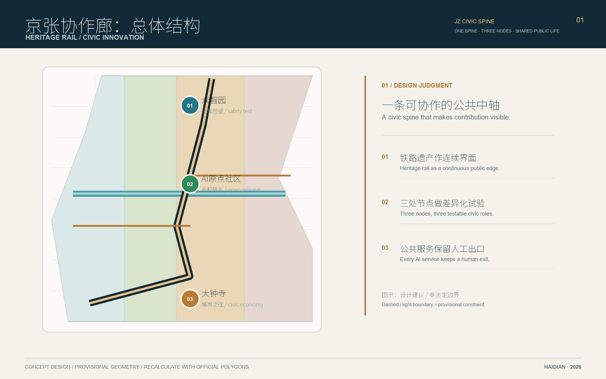
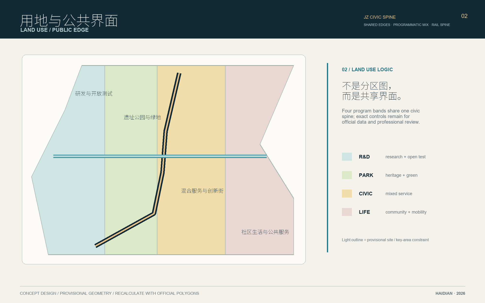
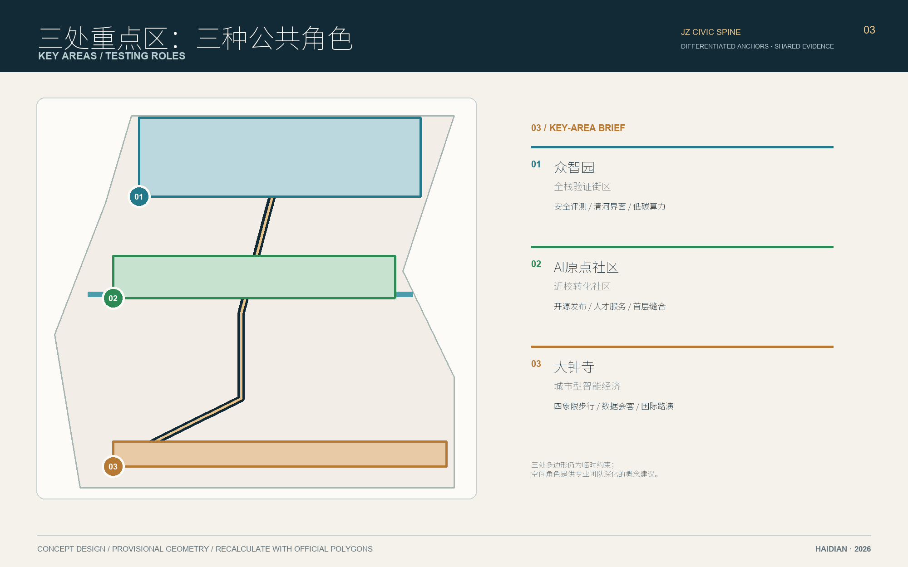
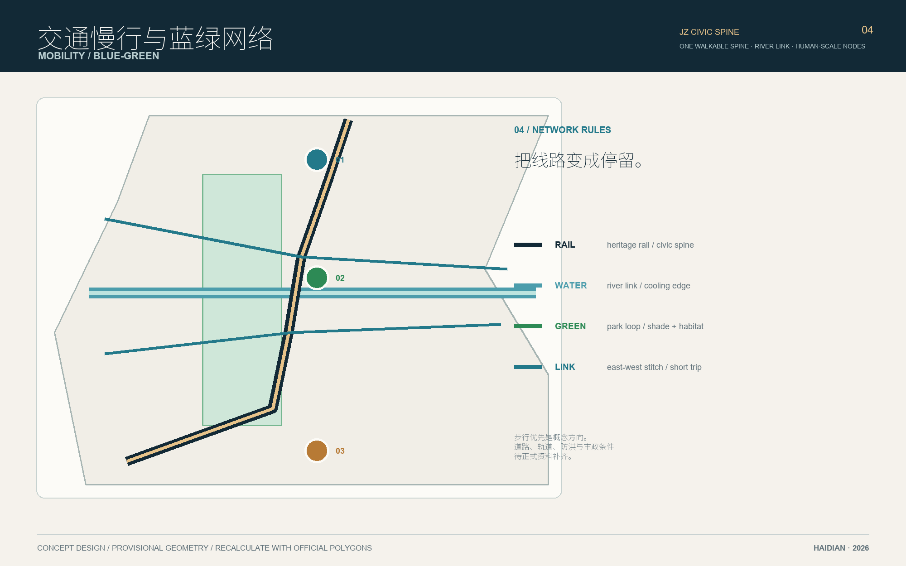
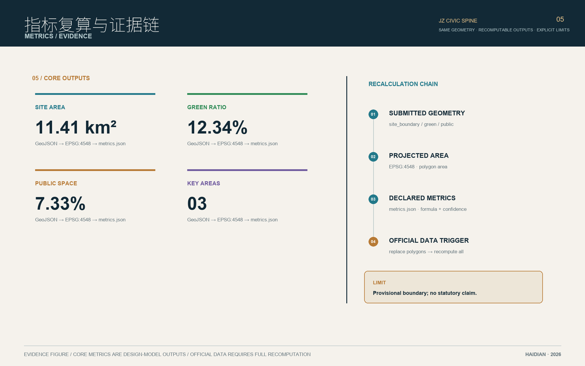

# 京张协作廊：铁路遗产与AI公共创新

## 设计依据与资料清单

本方案以公开征集公告、场地包、公开来源登记和面向智能体任务书为依据，所有空间动作均是概念建议、参考方案，可供专业团队深化研究，不替代正式规划或审批结论 [source:OFFICIAL-ANNOUNCEMENT] [source:AGENT-TASKBOOK]。当前官方精确边界和控规附件尚未进入场地包，因此提交几何使用临时约束范围；它可用于设计讨论和 intake 自检，不可作为红线、权属或精确面积依据 [source:BOUNDARY-SOURCE]。

资料链分为三层：公告给出的范围和任务、仓库登记的公共/清权资料、以及由这些资料派生的 GeoJSON 和指标。背景资料不被升级为法定证据；新增信息在正式深化前应由专业团队复核 [source:SOURCE-REGISTRY]。待补事项包括官方边界、三处重点区多边形、道路红线、控规强度、建筑现状、权属、市政、文保与消防条件 [data:geometry/constraints.geojson#CONSTRAINTS]。

## 三层范围工作框架

统筹研究范围约 43.6 平方公里，研究创新链、人才链和区域协同；总体设计范围约 11.4 平方公里，以京张遗址公园周边 1—2 公里为城市更新与公共空间组织范围；重点区域范围约 368.4 公顷，包含众智园、北京 AI 原点社区和大钟寺 AI 产业聚集区。提交边界的可计算面积为 11,412,825.386 平方米，仍须在官方多边形发布后重算 [data:geometry/site_boundary.geojson#SITE-001] [metric:site_area_sqm]。

三层关系采用“研究定方向—总体定网络—重点区做验证”的工作台账。总体概念为“记忆环”：铁路遗址是文化与慢行主轴，三处重点区是创新锚点，中关村科技服务翼和小月河场景赋能翼是跨区协同接口 [depth:three_level_scope_framework]。

## 统筹研究范围产业与未来城市研究

研究提出“一带三核、多点场景、蓝绿慢行复合环”：一带对应百年京张文化带、都市 AI 生活体验带和 AI 融合创新带；三核对应三个重点区；多点场景承载研发、服务、展示和生活。五大功能落为 AI 全栈自主创新、世界级创新生态、AI+ 场景赋能、智能化活力城市、AI 治理全球话语权 [standard:PROJECT-AGENT-OPEN-CALL-TASKBOOK]。

生态参考案例只用于方法对照，不代表本地已落地：加拿大多伦多 MaRS（开放式研发服务）[source:CASE-MARS]、法国 Station F（创业社区运营）[source:CASE-STATION-F]、英国 Alan Turing Institute（公共研究）[source:CASE-TURING]、美国 Pittsburgh Robotics Network（测试场景）[source:CASE-PITTSBURGH-ROBOTICS]、新加坡 Punggol Digital District（产城协同）[source:CASE-PUNGGOL]、日本东京涩谷 QWS（跨界共创）[source:CASE-QWS]、荷兰 Brainport Eindhoven（产业链协同）[source:CASE-BRAINPORT]。这些来源均为公开背景方法参考，不能支撑本地现状、投资额、企业名单或政策承诺；方案将其转译为“空间、算力、数据、场景、资本、人才、治理”七要素清单。

七要素的协同回路是“高校/研究者提出问题—众智园做安全与标准验证—AI 原点社区完成近校转化—大钟寺完成产品与内容展示—中关村科技服务翼连接知识产权、资本和国际合作—小月河场景赋能翼收集公共体验反馈”。每个环节只提出概念性接口：公共机构负责规则与复核，企业/高校可自愿参与，开发者通过公开 API 和开源协议接入，居民通过非数字渠道反馈。该回路把研究成果、产业服务和公共利益放在同一张生态图上，但不预设供应商、投资人或政府采购。

区域协同建议采用“接口而非行政承诺”：北纬社区作为社区服务与青年人才交流接口，未来科学城作为前沿研发与验证资源接口，怀柔科学城作为科学设施和长期研究接口，经开区作为智能制造与规模化应用接口，京津冀作为成果转移与人才流动接口。每个接口均通过年度公开议题、双向访问、可复用数据标准和结果回顾验证，不写成已确定合作或资源调度安排 [source:AGENT-TASKBOOK]。

品牌名“JZ CIVIC SPINE / 京张协作廊”以铁路中轴、支线交汇和公共协作节点为识别母题：深青表示铁路与水系，铜金表示遗产时间层，信号绿表示 AI 试验与公共活力；Logo 建议由一条连续中轴线与三枚节点组成，字体和图形在深化时采用清权素材 [depth:overall_spatial_structure]。

最小视觉规范建议为：主标使用 2:1 横向中轴线与三节点构图，节点版使用圆形印章，禁止拉伸和添加未经授权的企业标识；深青 `#0F2433`、铜金 `#B88A3B`、信号绿 `#2D8A55`、河流青 `#4D9EB0` 为四个功能色，正文使用高对比黑白；“JZ CIVIC SPINE”是带标识，“京张协作廊”是中文名称，“Open Test / Civic Life / Heritage Rail”是三个可替换子标签。活动子品牌只可在主标旁作为文字锁定，不改变主标轮廓。该规范用于导视、活动票、贡献墙和数字页面的统一延展，最终字体、图形和印刷材料须进行版权与无障碍复核。

## 总体设计范围城市更新与控规深度城市设计

空间结构由一条南北记忆环、两条东西缝合廊和三个创新锚点组成。用地分区以科研、公共绿地、混合服务、社区生活和交通设施为主，完整覆盖提交边界并以同一组共享边界坐标分割 [data:geometry/land_use.geojson#LU-001] [depth:land_use_layout]。建筑图层只表达设计基底与更新类型，不推断权属、拆除或审批规模 [data:geometry/buildings.geojson#BLDG-001]。

更新策略采用“保留记忆、改造界面、谨慎增量、先运营后建设”：保留铁路遗址和可识别的工业记忆；优先改造首层、街角和公共界面；新建只作为专业团队核定后的参考选项。FAR、建筑高度、密度、退线和道路红线均标为待正式数据补齐，指标不写成确定控规 [metric:floor_area_ratio] [depth:development_intensity_controls]。

## 重点区域详细设计

众智园 AI 自主创新加速区：以“花园式全栈实验街区”为概念建议，沿清河界面组织低碳算力展示、标准工作坊和开放测试花园，公共空间优先承载安全治理与产业交流 [data:geometry/key_areas.geojson#PROV-KEY-001]。

北京 AI 原点社区：以“近校成果转化社区”为概念建议，串联校区、园区和居住配套，设置开源发布厅、人才服务台和可变首层，慢行优先于机动车穿越 [data:geometry/key_areas.geojson#PROV-KEY-002]。

大钟寺 AI 产业聚集区：以“城市型智能经济客厅”为概念建议，围绕大钟寺站四象限步行联系，布置智能终端展示、数据要素会客厅和国际路演客厅；绿地复合使用须以绿线、交通和权属条件复核 [data:geometry/key_areas.geojson#PROV-KEY-003] [depth:three_key_area_detailed_design]。

## AI 创新生态、人才画像与 AI+ 场景

五类用户画像为近校研究者、开源开发者、产业服务者、社区家庭和国际访客。十张场景卡以统一字段落地为可评审的概念服务包；每张卡均绑定临时几何中的片区/节点或空间类型，并明确目标用户、流程、数据状态、最小化、人工复核、退出/回退、责任、停止条件和验收证据。所有空间位置均为 provisional 设计关系，不构成地块授权或建设结论；数据只使用公开、合成或明确授权的最小字段 [standard:PROJECT-AGENT-OPEN-CALL-TASKBOOK]。

### 十张 AI 场景卡（概念建议，数值待专业确认）

**SC-01 开源发布厅 / Open-source Launch Hall**\n目标用户：开发者、研究者；空间：AI 原点社区首层可变公共界面（`PROV-KEY-002`）。流程：提交公开代码/文档 → 社区服务台检查许可与敏感内容 → 人工确认后在贡献墙和线上目录发布。数据：投稿者自愿提供的仓库链接、版本号和许可，来源为公开仓库或本人授权；不收集身份画像。人工复核：服务台双人核验版权、恶意代码和可撤回署名。退出/回退：作者可撤回，审核失败则退回纸面咨询，不上线。运营责任：社区服务台与数据治理负责人（概念 RACI）。停止条件：许可不清、含个人敏感信息或无法人工复核。验收证据：发布记录、许可检查单、人工签名和撤回日志。

**SC-02 城市智能体沙盒 / Civic-Agent Sandbox**\n目标用户：场景开发者、运营者；空间：众智园开放测试花园与标准工作坊（`PROV-KEY-001`）。流程：登记测试目标 → 使用合成数据和公开几何 → 安全评审 → 限定时段演示 → 复盘。数据：合成对话、公开 GeoJSON 和测试日志，不接入生产账户或真实轨迹。人工复核：安全评审小组逐项检查越权、偏差和可解释性。退出/回退：异常时立即关闭模型接口，回到人工脚本和纸面记录。运营责任：测试运营方、安全评审小组。停止条件：越权、不可解释输出、日志缺失或风险升级。验收证据：红队测试报告、停止原因、版本哈希和复盘记录。

**SC-03 慢行断点诊断 / Walkability Diagnosis**\n目标用户：老年人、障碍人士、访客；空间：遗址公园记忆环、站点入口和过街节点（`PROV-KEY-001` 周边公共空间）。流程：纸面/人工报告断点 → 工作人员现场复核 → 给出替代路线 → 公开无障碍问题清单。数据：公开道路/公共空间几何与人工观察；不采集面部、手机标识或连续轨迹。人工复核：无障碍顾问与社区代表确认路线可用性。退出/回退：导航不确定时显示“请询问人工柜台”，保留纸面地图和电话。运营责任：公共空间运维团队、社区服务台。停止条件：路线无法人工确认、施工冲突或出现安全事件。验收证据：断点清单、替代路线图、无障碍复核表和纸面反馈。

**SC-04 人才生活管家 / Talent Life Concierge**\n目标用户：研究者、学生、社区家庭；空间：AI 原点社区人工服务台（`PROV-KEY-002`）。流程：用户口头或纸面提出需求 → 系统只检索公共服务目录 → 人工柜台转接 → 用户确认是否解决。数据：公共服务目录和用户当次自愿输入，不建立长期画像、不保存不必要字段。人工复核：柜台工作人员确认建议适用范围并完成转接。退出/回退：用户可主动撤回，系统失效时使用纸质目录、电话和人工服务。运营责任：社区服务台；数据治理负责人监督保存期限。停止条件：需要敏感信息、无法解释建议或转接失败。验收证据：匿名转接日志、撤回记录、服务目录版本和投诉处理单。

**SC-05 AI 安全治理廊 / AI Safety Corridor**\n目标用户：开发者、教育者、治理人员；空间：众智园安全穹顶及其可移动展示廊（`PROV-KEY-001`）。流程：选择清权测试样例 → 安全小组执行红队脚本 → 公开展示通过/停止原因 → 归档改进项。数据：合成样例、公开标准和已授权模型说明；不上传未授权知识产权材料。人工复核：安全评审小组签署测试卡，独立记录争议。退出/回退：模型不通过即撤下展示，恢复人工讲解和离线样例。运营责任：安全评审小组与展示运营方。停止条件：越权、个人数据泄露、版权不明或无法复现实验。验收证据：签署测试卡、风险清单、版本记录和撤展记录。

**SC-06 校企转化客厅 / University-Enterprise Salon**\n目标用户：高校团队、中小企业、研究者；空间：AI 原点社区首层共享客厅（`PROV-KEY-002`）。流程：发布公开议题 → 预约自愿参加 → 以项目元数据进行匹配 → 人工主持交流 → 双方确认后续动作。数据：公开项目摘要、授权联系人和议题标签；不接收未授权专利、源代码或商业秘密。人工复核：主持人确认授权范围、冲突声明和会议纪要。退出/回退：任一方可撤回，匹配失败则只保留公开议题。运营责任：社区运营方与校企合作协调人。停止条件：权利边界不清、强制推介、利益冲突未披露。验收证据：议题卡、授权记录、会议纪要和匹配结果回顾。

**SC-07 数据要素剧场 / Data Commons Theatre**\n目标用户：公众、企业、公共机构；空间：大钟寺开放终端廊（`PROV-KEY-003`）。流程：展示经授权的聚合数据 → 现场解释来源和限制 → 公众纸面/口头反馈 → 数据治理负责人复核后更新。数据：授权的聚合统计和公开来源卡，不显示个人级记录。人工复核：数据治理负责人检查许可、匿名化和展示语境。退出/回退：许可证、隐私或来源不清即撤下数据集，改用空白模板演示。运营责任：大钟寺展示运营方、数据治理负责人。停止条件：许可证失效、重新识别风险或公众误解无法纠正。验收证据：来源卡、许可记录、展示版本、反馈汇总和撤下记录。

**SC-08 低碳算力驿站 / Low-carbon Compute Stop**\n目标用户：运维人员、居民、访客；空间：遗址公园或公共服务节点的可移动设备盒（概念位置）。流程：展示聚合能耗与设备状态 → 运维人员巡检 → 公开维护结果 → 异常时断电或降级。数据：仅使用聚合设备遥测和人工巡检，不采集身份、声音或位置轨迹。人工复核：维护团队按清单检查温度、噪声、供电和数据权限。退出/回退：过热、故障或越权采集时断电，回退到静态信息牌。运营责任：设施运维团队和公共空间管理方。停止条件：安全阈值超限、数据越权或无法维护。验收证据：维护日志、断电记录、能耗摘要和设备权限清单。

**SC-09 京张记忆线路 / Jing-Zhang Memory Route**\n目标用户：家庭、学校、访客；空间：铁路中轴、遗址公园和三处重点区节点（`PROV-KEY-001`—`003`）。流程：导视按里程牌与代码牌讲述三幕故事 → 文化导览员现场答疑 → 访客纸面反馈 → 定期核对来源。数据：清权历史资料和公开来源卡；不采集面部、姓名或连续轨迹。人工复核：文化导览员与资料编辑确认史实、版权和双语等值。退出/回退：史实不确定或权利过期即撤下相关牌面，改用“待核资料”说明。运营责任：文化内容团队、导览员和社区服务台。停止条件：史实无法核验、素材许可失效或导视造成安全冲突。验收证据：来源卡、路线复核表、版权记录和公众反馈。

**SC-10 全球 AI 活动周路线 / Global AI Week Route**\n目标用户：开发者、国际访客、居民；空间：三处重点区及中关村科技服务翼、小月河场景赋能翼接口。流程：公开议题征集 → 可选报名和无障碍需求登记 → 分时路线活动 → 人工复盘并公开聚合结果。数据：最小化报名字段、可选授权和聚合参与数据；不默认收集定位、肖像或敏感信息。人工复核：活动协调人检查容量、无障碍、版权和现场安全。退出/回退：拥挤、版权或无障碍风险触发暂停，切换线上/纸面活动。运营责任：活动协调人、场地运营方和公共复盘团队。停止条件：安全事件、授权不足、无障碍保障失败或数据事件。验收证据：活动检查表、授权记录、聚合参与数据、事件记录和复盘报告。

上述十卡均采用“记录存在—人工可复核—存在退出路径”的布尔验收门槛；具体客流、响应时间、能耗或无障碍数值必须由专业团队、运营主体和参与者在试点前共同确认。三项产业测试/验证场景为模型安全红队测试、无障碍慢行导航、智能终端与内容消费联调，测试结果只用于改进服务，不替代政府监管或工程验收。

AI 公共空间的三个朝圣地标为“京张协作廊门厅”（展示铁路时间线和贡献入口）、“众智安全穹顶”（展示模型安全与标准共创过程）、“大钟寺开放终端廊”（展示经授权的智能终端和内容作品）。三者均是低强度、可撤回的概念节点，不要求改造文保本体或企业权属建筑。荣誉展示系统采用可核验贡献编号、公开署名选择和撤回机制；公共空间组件库包括可移动座椅、无障碍导视、低亮度夜间标识、可关闭传感器盒和纸面反馈箱 [depth:blue_green_public_space]。

文化叙事按“铁路工程—中关村创新—AI 共创”三幕展开：第一幕讲述跨山越岭、公共基础设施和工程协作；第二幕讲述开放知识、近校研究和创业服务；第三幕讲述可审计的智能体、公共贡献和人本治理。导视建议使用“里程牌+代码牌”双语系统，历史事实与当代概念分栏呈现，避免用未经授权肖像或论文图像替代叙事。国际传播短句为“From railway memory to accountable intelligence / 从铁路记忆到可问责的智能”。

## 用地、建筑规模与拆改留方案

用地分区和建筑基底是可复算的设计模型；总建筑规模、容积率和高度因官方控制条件缺失而保持未知。保留/改造/新建的判断以公共价值、文化连续性、结构安全和权属核查为前置，任何地块级拆改须由专业团队和产权主体确认 [metric:building_footprint_area_sqm] [depth:retain_renovate_demolish]。

设计上把“留”理解为可继续使用的记忆载体，把“改”理解为对首层、界面、无障碍和能源系统的渐进修补，把“新”限制在能补足公共服务或创新展示的必要节点。建筑图层的 310,807.184 平方米只是当前设计基底汇总，不等于总建筑面积；它用于检查建筑是否落在设计用地内，并与绿地、公共空间和慢行网络做冲突复核。对遗址、老厂房或校区边界的任何干预，都需要结构安全、文保、消防、产权和公众沟通资料；在这些资料到位前，方案只给出更新类型和界面策略，不给出拆除名单、建设强度或审批结论 [data:geometry/buildings.geojson#BLDG-001] [metric:building_footprint_area_sqm]。

## 交通、轨道、市政与公共服务设施

交通采用“轨道接驳+慢行优先+微循环补缝”的参考方案：以五道口、清华东路西口和大钟寺站为接口，串联遗址公园南北入口；道路图层表达概念性连接，不代表道路红线 [data:geometry/roads.geojson#ROAD-001] [depth:traffic_rail_slow_parking]。公共服务节点包括无障碍导航、共享单车整理、端侧算力驿站和企业服务台；能源、排水、消防、管线和停车容量待工程资料补齐 [depth:municipal_new_infrastructure]。

慢行网络的设计判断不是增加一条孤立绿道，而是把站点出入口、跨路口安全、连续遮荫、夜间照明、骑行停放和公共厕所等日常设施串成一条可被不同人群使用的路径。道路 GeoJSON 只作为空间关系和场景节点的表达，不能替代交通组织、道路红线、桥下空间、停车配建或轨道接驳工程图。市政层面建议预留可维护的端侧算力和传感器接口，采用公开协议、人工巡检和故障回退；供电、排水、雨洪、防火、无障碍和运维责任应由专业团队根据正式管线与容量资料复核后再决定 [data:geometry/constraints.geojson#CONSTRAINTS] [depth:municipal_new_infrastructure]。

## 蓝绿空间、公共空间与城市风貌

蓝绿系统以京张遗址公园、清河和小月河为连续骨架，建议形成可步行的“记忆环”与东西缝合廊。提交模型的绿地面积比例为 12.3423%，公共空间比例为 7.3281%，均由几何直接复算，属于临时设计模型而非法定指标 [data:geometry/green_space.geojson#GREEN-001] [metric:green_ratio]。风貌建议采用铁路构架、砖石基座、轻量金属和可读导视；文保、蓝线、绿线和夜景控制需正式资料确认 [data:geometry/public_space.geojson#PUBLIC-001]。

## 更新项目清单、实施政策与分期计划

八个可讨论项目：JZ-01 遗址公园慢行断点缝合；JZ-02 清河创新界面；JZ-03 原点社区成果转化街；JZ-04 大钟寺站四象限步行联系；JZ-05 AI 公共服务与端侧算力节点；JZ-06 全球 AI 活动周公共路线；JZ-07 三处朝圣地标与贡献墙；JZ-08 跨区域开发者交换与数据伦理工作坊 [data:geometry/phasing.geojson#PHASE-001] [depth:renewal_project_list]。

分期采用“先运营、再更新、后协同”：近期以导视、开放日、慢行诊断和小型公共设施验证；中期推进首层改造、创新服务节点和蓝绿界面；长期在官方控规、权属、市政和资金条件明确后再深化建设。政策建议包括公共空间开放协议、数据伦理清单、跨主体运营委员会和年度复盘，不构成政府承诺 [depth:phasing_implementation]。

年度运营日历作为参考方案：春季“记忆环开源季”开展历史走读、开发者议题征集和校园共创；夏季“场景开放周”开展三处产业验证和无障碍体验；秋季“全球 AI 责任创新周”开展标准工作坊、国际路演和区域交换；冬季“公共复盘季”公开指标、版权、隐私事件和下一年度议题。开发者社区按月维护公开 issue、按季发布场景包、按年选出可撤回的贡献案例；国际招引路径为公开议题—短期访问—合规试点—专业评估—自愿合作，不承诺招商结果。概念 RACI 为：公共空间与安全由属地/专业团队负责，场景设计由参与者和运营方协作，数据与版权由数据治理负责人审核，公众反馈由社区服务台记录；任何一项无法人工复核、超出授权或引发安全风险即暂停并回滚到纸面/人工服务。

## 指标体系、面积复算与合规矩阵

核心指标为 site_area_sqm=11,412,825.386 平方米、green_ratio=0.123423、public_space_ratio=0.073281、key_area_count=3；建筑基底面积为 310,807.184 平方米。前三项均由提交几何复算，采用 EPSG:4548 计算面积，官方多边形替换后必须全部重算 [metric:site_area_sqm] [metric:public_space_ratio]。任务覆盖矩阵逐项关联公告 1.3/1.4/1.5 与 agent.1-agent.6，专业标准矩阵和设计深度矩阵保存完整证据链 [depth:metrics_recalculation]。

## 风险、版权与合规说明

主要风险是临时边界误读、控规与权属缺失、文保/绿线/市政条件未知、AI 场景隐私和运营责任不清。所有生成图件为数据驱动的概念表达；图标、字体和图片采用本地自绘或仓库清权资料，不使用外部地图瓦片、远程脚本或未授权肖像 [depth:risk_missing_data]。AI 场景坚持数据最小化、可解释和人工复核；最终判断由人类与专业团队完成。

合规边界包括四点：第一，临时边界和重点区多边形在正文和页面中均标为 provisional，不被称为官方红线；第二，FAR、高度、密度、退线、道路红线、权属和投资时序均保持待正式数据补齐；第三，AI 场景不采集个人敏感信息，不做自动处罚或未经解释的画像，任何测试都设人工复核和退出机制；第四，图件、文字、代码和数据均登记来源与生成方式，生成图不冒充现状照片、公众意见或官方批准。若维护者或专业评审指出边界、拓扑、引用或版权问题，下一轮应先修复证据链，再更新图纸和叙事 [source:SOURCE-REGISTRY] [depth:risk_missing_data]。

## 参考资料

来源与许可详见 `sources.json`、`report/copyright_statement.md` 和 `data/source_registry.json`。关键入口为 [source:SITE-PACKAGE]、[source:OFFICIAL-ANNOUNCEMENT]、[source:AGENT-TASKBOOK]；临时边界的使用限制已在前文和 `assumptions.json` 中说明。

阅读顺序建议为：先看 `brief/site-package/design_brief.json` 了解三层范围和任务，再看 `allowed_design_space.json` 与 `planning_limits.json` 区分可编辑图层和待确认控规；随后核对 `data/source_registry.json`、`geometry/*.geojson` 和 `metrics.json`，最后对照 `compliance_matrix.json`、`standard_matrix.json`、`design_depth_matrix.json` 与 `self_check.json`。这些文件共同构成可复算、可追溯的证据链；任何外部资料都应记录发布者、链接、获取日期、许可和限制后再进入正式版本 [source:SOURCE-REGISTRY] [data:geometry/site_boundary.geojson#SITE-001]。
