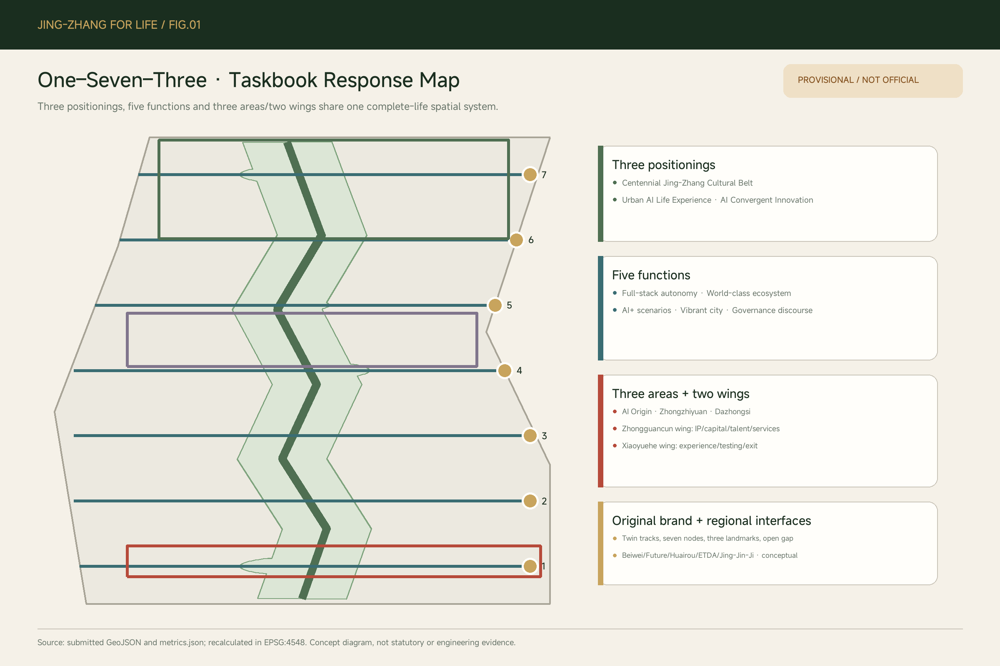
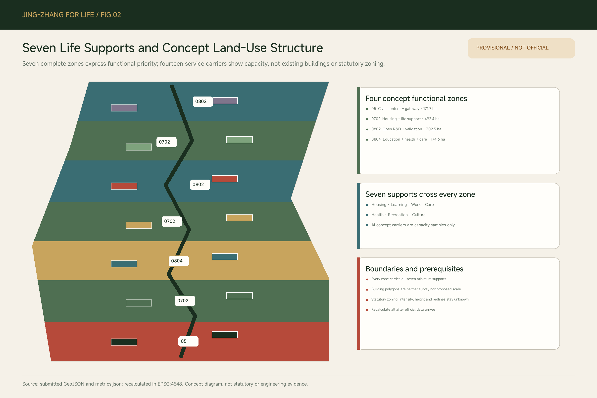
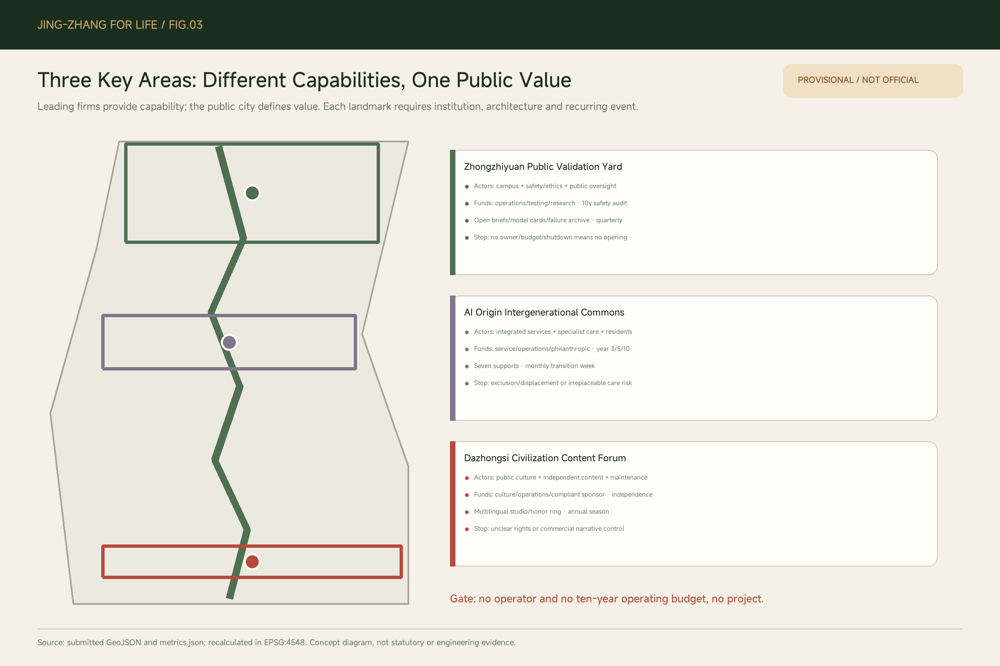
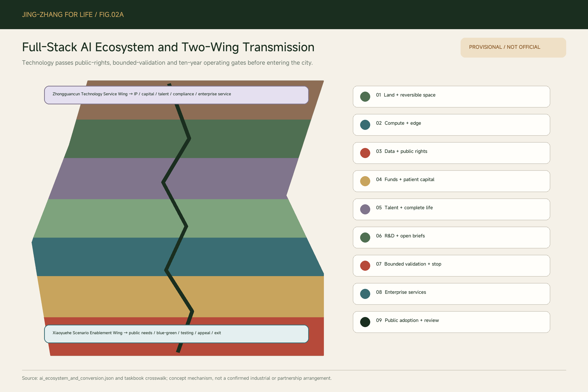
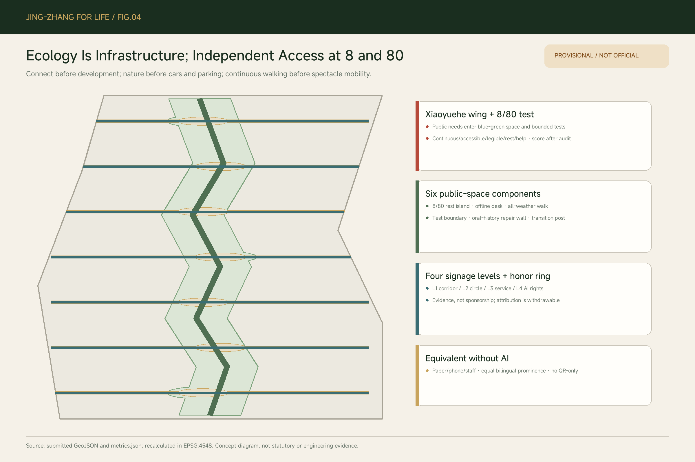
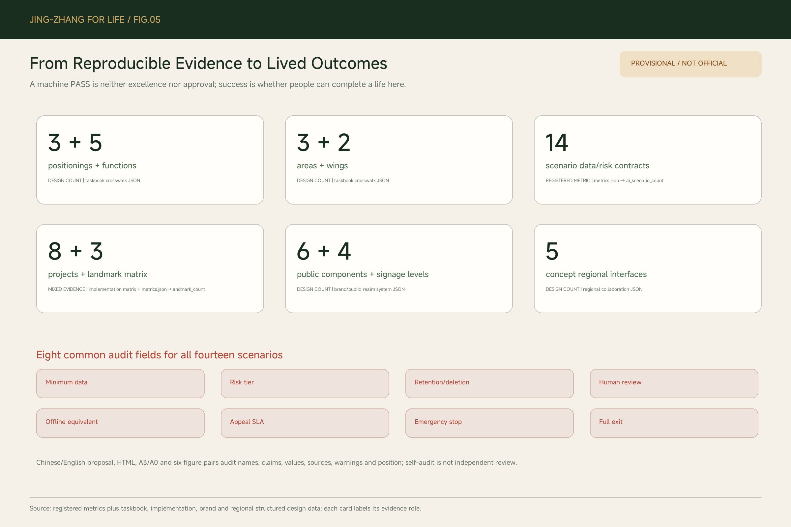

# JING-ZHANG FOR LIFE / 京张一生

> **A century of Jing-Zhang, a city for every life.** A city should accompany a complete life, not only its most productive years.

This proposal moves the primary value of an “AI Innovation Belt” away from technology display and talent competition toward a harder and testable civic promise: a person can study, work, form a family, care for others, change direction, retire and grow old here without being forced to leave at every life transition. `CommonWeave` remains the implementation system, weaving space, time, operations and public rights into enforceable contracts rather than becoming another brand.[source:USER-DESIGN-CHARTER]

## Design Basis and Source List

The official open-call announcement, the agent taskbook and the repository site package define the assignment. The Overall Design Area and three Key-Area Detailed Design Areas still use repository provisional polygons. They are suitable only for intake, topology testing and concept comparison; they are not an Official Boundary, an approval basis or a precise-area source.[source:OFFICIAL-ANNOUNCEMENT] [source:AGENT-TASKBOOK] [source:SITE-PACKAGE]

This revision follows a user-approved design charter: whole-life support with priority at life transitions; shared spaces create intergenerational relationships while specialist rooms protect dignity; AI is “invisible in daily life, visible at public nodes, optional throughout”; and culture is rooted in Jing-Zhang and Haidian through harmony between humanity and nature, intergenerational continuity, self-reliant innovation and craftsmanship.[source:USER-DESIGN-CHARTER]

Urban-design, regulatory-planning, land-use and architectural-depth references continue to govern professional judgement. Without official zoning, ownership, existing-building, road-redline, heritage, utility and service-baseline data, every spatial action remains a Conceptual Recommendation or a reference for professional teams to develop further.[standard:MOHURD-URBAN-DESIGN-MEASURES] [standard:MOHURD-CONTROL-DETAILED-PLANNING]

## Taskbook Response Map

The taskbook's **three positionings** become three values of one spatial system, not three unrelated slogans. The Centennial Jing-Zhang Cultural Belt is carried by railway memory, the Life Corridor and contemporary Chinese culture. The Urban AI Life Experience Belt is carried by seven circles, fourteen optional scenarios and substantively equivalent offline services. The AI Convergent Innovation Belt is carried by three areas, two wings and a nine-layer full-stack ecosystem. A crosswalk takes reviewers directly from each requirement to chapters, figures, scenarios and operating clauses.[source:AGENT-TASKBOOK] [data:visual/assets/taskbook_evidence_crosswalk.json#positionings]

The **five functions** map to full-stack autonomous innovation and public validation at Zhongzhiyuan; a world-class innovation ecosystem and whole-life support at AI Origin; AI+ scenario enablement along the Xiaoyuehe wing; an intelligent and vibrant city formed by seven circles, walking/blue-green networks and degradable services; and public discourse on AI governance formed by six rights, scenario-by-scenario audit and open failure records. All share one gate: public value precedes technology adoption.[data:visual/assets/taskbook_evidence_crosswalk.json#functions]

The **three areas and two wings** are explicit: AI Origin Community, Zhongzhiyuan AI Autonomous Innovation Accelerator and Dazhongsi AI Industry Cluster; the Zhongguancun Technology Service Wing conveys IP, capital, talent, compliance and international enterprise services to the three areas; the Xiaoyuehe Scenario Enablement Wing turns public needs, blue-green public space and bounded testing into experiences that can be appealed and retired. The wings are conceptual transmission relationships, not official administrative boundaries or confirmed projects.[data:visual/assets/taskbook_evidence_crosswalk.json#three_areas_two_wings]

`agent.1` through `agent.6` are answered by brand and overall structure, full-stack ecology, fourteen scenarios, public space and three landmarks, a Jing-Zhang–Zhongguancun–Chinese-civilization narrative, and annual events with long-term operations. The original mark combines twin railway/life-corridor lines, seven support nodes, three institutional landmarks and an open gap for choice and exit. It must not be paired with corporate marks to imply endorsement.[data:visual/assets/brand_and_public_realm_system.json#brand]

## Three-Level Scope Framework

The approximately 43.6 km² Coordinated Research Area asks how a global humanistic and ecological city should organise innovation, daily life and public value. The approximately 11.4 km² Overall Design Area combines the Life Corridor, housing, services, blue-green systems and walking networks. The three Key-Area Detailed Design Areas, approximately 368.4 ha in the announcement, test how institution, architecture, operator and recurring events work together. Announced areas set task scale; the submitted 11.41 km² polygon is a provisional design model, not an official boundary.[source:OFFICIAL-ANNOUNCEMENT] [metric:site_area_sqm]

The three levels are validated upward from lived outcomes rather than imposed downward from investment targets. Key areas test a public institution; the overall area tests proximity and continuous access; the coordinated area decides whether the mechanism should scale. Any pilot that increases displacement, excludes people who reject AI, privatizes public space or increases ecological harm must stop.[depth:three_level_scope_framework]

The structure is “**one corridor, seven circles, three landmarks and multiple cross-links**.” The Jing-Zhang Life Corridor carries nature and memory; each 15-minute life-support circle provides a universal baseline of housing, learning, work, care, health, recreation and culture; three landmarks form public-value peaks; seven east-west links reconnect campuses, workplaces, communities and transit.[data:geometry/roads.geojson#ROAD-001] [metric:life_support_circle_count]

## Coordinated Research Area: Industry and Future City Research

The industrial objective is not an office district across the entire belt. Research, content, making, education, health, care and culture should jointly create urban resilience. A Public-Benefit Contract grants firms access to scenarios and collaboration in exchange for public opening hours, auditable data boundaries, accessible services, training, ecological performance and a failure-exit path. Leading firms provide capability; the public city defines value.

Global cases contribute mechanisms, not copied forms or metrics. Paris places essential functions within a fifteen-minute walk or five-minute cycle and reuses existing facilities. Singapore’s Kampung Admiralty combines senior housing, childcare, healthcare, wellness and green public space. Vienna’s housing allocation responds to study, changing families and aging. Barcelona converts schools, libraries and parks into an accessible climate-shelter network.[source:CASE-PARIS-15M] [source:CASE-KAMPUNG-ADMIRALTY] [source:CASE-VIENNA-LIFE-STAGE-HOUSING]

Helsinki’s Kalasatama offers long-term phased regeneration and public-transport integration; Punggol Digital District offers university-enterprise-community collaboration and living-lab mechanisms; Brooklyn Navy Yard offers productive heritage reuse and a public interface. In Haidian these cases support four principles—life baseline first, reuse existing facilities, operate across institutions, scale after validation—and support no zoning, investment or engineering claim.[source:CASE-KALASATAMA] [source:CASE-PUNGGOL] [source:CASE-BROOKLYN-NAVY-YARD]

### Regional Collaboration Interfaces

Regional collaboration uses testable exchange interfaces, not unconfirmed partnership arrows. Beiwei Community exchanges lived needs, courses and public-service visits. Future Science City exchanges research briefs and whole-life talent services. Huairou Science City exchanges scientific-facility needs, results and public science content. Beijing Economic-Technological Development Area exchanges engineering validation, manufacturing feedback and supply-chain capability. The Beijing-Tianjin-Hebei urban network exchanges talent, public-service methods, cultural content and climate-resilience practices. Every interface specifies a spatial carrier, organization form and metric, such as referral completion, public model cards, safe shutdown time and reuse of open outcomes.[data:visual/assets/regional_collaboration.json#interfaces]

The interfaces use enterprise-service stations on the Zhongguancun wing, bounded testing at Zhongzhiyuan, multilingual content nodes at Dazhongsi and an annual rotating roundtable. They are conceptual mechanisms and do not claim agreement, partnership, funding or planning change by any named place, institution or government.[data:visual/assets/regional_collaboration.json#status]

## Overall Design Area: Urban Renewal and Regulatory-Plan-Level Urban Design

Seven shared cuts create a complete, non-overlapping concept partition. The south is a civic content gateway; the middle combines mixed housing, education, health, care and the AI Origin intergenerational community; the north combines open R&D, stable housing and Zhongzhiyuan making and validation. The partition expresses functional priority only. Statutory land-use codes, FAR, height, Building Coverage Ratio and road redlines remain pending official data.[data:geometry/land_use.geojson#LU-001] [depth:land_use_layout]

Housing is innovation infrastructure. Stable rental options, adaptable units, nearby transfers after family change, accessibility retrofits and anti-displacement protections take priority even when they reduce some high-yield office or commercial development. About 492.45 ha of concept `0702` land expresses the priority of housing and life support; it is neither a residential land-supply promise nor a statutory allocation.[metric:land_use_area_code_0702_sqm]

Renewal follows retain, repair, adaptive reuse, necessary new capacity and demolition only as a last resort. Fourteen building polygons are capacity-carrier samples for seven life supports, not an existing-building survey and not an acquisition or construction basis. Real decisions require ownership, structural, fire, daylight, heritage, carbon and resident-impact review.[data:geometry/buildings.geojson#BLDG-001] [depth:retain_renovate_demolish]

## Detailed Design of Key Areas

**Zhongzhiyuan Public Validation Yard** focuses on making and validation. Its institution holds open briefs, model cards, failure records, risk tiers and resident-visible review results. Its architecture is a reversible validation yard with human shutdown controls and low-disturbance test boundaries. A quarterly public validation day makes the institution recurring. Edge models, rehabilitation devices and accessible-route audits are the three testing scenarios, each bounded by time, place, operator and exit condition.[data:geometry/key_areas.geojson#PROV-KEY-001] [metric:ai_testing_scenario_count]

**AI Origin Intergenerational Commons** focuses on learning and daily life. A courtyard combines childcare, lifelong learning, primary health, caregiver respite, reskilling, inclusive recreation and public culture through space- and time-sharing. Shared rooms create intergenerational encounters; specialist rooms protect dignity in feeding, rehabilitation, mental support and end-of-life care. A monthly Life-Transition Support Week connects the institution to real change rather than continuous consumption.[data:geometry/key_areas.geojson#PROV-KEY-002]

**Dazhongsi Civilization Content Forum** is the global gateway for content technology and Chinese civilization. A Beijing key-project list locates the ByteDance headquarters industrial-park project in Beixiaguan and connects it to Metro Lines 12 and 13. A Dazhongsi AI night school has already linked community space, universities and ByteDance volunteers. The proposal therefore suggests a public newsroom, multilingual civilization studio and annual content season, while claiming no corporate endorsement and allowing no company to define civic value.[source:BYTEDANCE-HQ-PROJECT] [source:DAZHONGSI-AI-NIGHT-SCHOOL]

## AI Innovation Ecosystem, Personas, and AI+ Scenarios

Personas do not freeze people into age, job or income segments. Seven life stages test the city: childhood and family formation; school-age independence; education and first work; family and childcare; midlife transition and dual care; active aging; and advanced care through the end of life. Entry to school, graduation, family formation or rupture, childbirth, job loss and reskilling, retirement, disability and end-of-life support are the moments when urban services most often break.[data:visual/assets/life_support_matrix.json#transition_tests]

Fourteen scenario cards cover housing, learning, work, care, health, recreation and culture: housing transition, anti-displacement warning, lifelong courses, independent child routes, reskilling, childcare coordination, caregiver respite, health navigation, climate routes, oral history and multilingual civilization content. Every card includes human takeover and exit. Testing scenarios additionally require physical separation, professional supervision and emergency shutdown.[data:visual/assets/scenario_cards.json#SC-01] [metric:ai_scenario_count]

Every card now uses one auditable contract: personas and space-operation mapping; minimum data categories; privacy/safety tier; specific retention and deletion; a human-review owner type; a substantively equivalent paper, phone or staffed route; on-site, phone and paper appeal; a one-working-day acknowledgement and five-working-day human-response target; emergency stop; and full decommissioning. Health, children, care, oral history and rehabilitation devices are treated as high or very-high risk. No scenario may create cross-scenario profiles, sell data or let AI decide essential eligibility.[data:visual/assets/scenario_cards.json#rights_baseline]

Six public AI rights are the rights to know, to explanation, to choose, to an offline path, to human takeover, and to correction and exit. AI does not demand attention in everyday space and becomes visible only at learning, validation and public-service nodes. People who cannot or will not use AI receive the same essential service. Covert profiling, model-only high-impact decisions and services without appeal or shutdown are prohibited.[data:visual/assets/public_ai_rights.json#AI-R1] [metric:public_ai_right_count]

### Full-Stack AI Ecosystem and Two-Wing Transmission

The full stack is not a technology procurement list. It is a spatial conversion chain with public gates: **land and reversible space → compute and edge infrastructure → data and public rights → funds and patient capital → talent and complete life → R&D and open briefs → bounded validation → enterprise services and translation → public adoption and annual review**. Zhongzhiyuan hosts controlled validation, AI Origin embeds talent and R&D within complete-life support, and Dazhongsi hosts content-native business and international expression. The Zhongguancun wing provides IP, capital, compliance and enterprise services; the Xiaoyuehe wing provides public experience, blue-green space and scenario testing. Failure at a rights, safety, ecological or operating gate stops the flow.[data:visual/assets/ai_ecosystem_and_conversion.json#layers]

Scenario access follows seven steps: an open problem can also be submitted offline; the operator screens completeness; specialists review safety, privacy, accessibility and ecology; residents judge public value; a time- and place-bounded reversible pilot runs; a public summary and appeal channel open; then the pilot stops, changes or scales. This prevents both technology in search of a use and scenario review hidden inside a company.[data:visual/assets/ai_ecosystem_and_conversion.json#scenario_application_review]

## Land Use, Building Scale, and Retain-Renovate-Demolish Strategy

The concept partition fully covers approximately 11.41 km²: about 492.45 ha of `0702` mixed housing and life support, 302.54 ha of `0802` open R&D and making, 174.59 ha of `0804` education, health and care, and 171.70 ha of `05` civic content and public gateway. Shared cut lines make the totals internally reproducible; they are not a statutory land allocation.[metric:land_use_total_sqm] [data:geometry/land_use.geojson#LU-007]

The fourteen concept carriers total approximately 37.41 ha of footprint and show service capacity and relationships only. They do not imply total floor area. Total floor area, FAR, BCR and height remain unknown because official planning controls and an existing-building inventory are missing. No later document may turn these footprints into proposed construction scale or bill of quantities.[metric:building_footprint_area_sqm] [metric:floor_area_ratio]

Retain–Renovate–Demolish priorities are resident stability and safety first; railway and local memory second; adaptability and whole-life carbon third; public opening value fourth; and short-term development yield last. Where renewal displaces residents or small public services, an affordable alternative with equivalent location and access plus genuine consent is required. A project without an anti-displacement plan does not enter implementation.[depth:development_intensity_controls] [depth:height_massing_character]

## Transport, Rail, Municipal Infrastructure, and Public Services

The mobility standard is not faster passage but independent access for an eight-year-old and an eighty-year-old. One Life Corridor and seven cross-links form approximately 17.56 km of concept walking and cycling relationships, not road mileage. Field audits must test continuity, crossings, slope, lighting, shade, rest, toilets, help and accessibility before any 8/80 route pass rate is calculated.[data:geometry/roads.geojson#ROAD-001] [metric:concept_mobility_length_m]

Transit-Station Integration first resolves at-grade transfer, cycle parking, rain and snow protection, accessibility and legible guidance; it does not prematurely promise tunnels, bridges or new engineering. The Line 12 and 13 context at Dazhongsi informs professional study only. Alignment, section, bridge, tunnel and parking changes require transport, metro, fire and utility review.[source:BYTEDANCE-HQ-PROJECT] [depth:traffic_rail_slow_parking]

Municipal and New Infrastructure must degrade safely offline. Public service points have paper guidance, staffed counters and emergency shutdown. Sensors use minimum-purpose collection, on-site notice, short retention and auditable access. Network, energy, drainage, flood protection, fire and medical systems retain human control. No operator and no ten-year operating budget means no project.[depth:municipal_new_infrastructure]

## Blue-Green Network, Public Space, and Urban Character

Nature is daily infrastructure, not beautification. The concept ecological network covers about 232.47 ha, 20.37% of the provisional boundary, and provides shade, stormwater retention, habitat, play, rest, healing and railway memory. The concept public-space network covers about 86.01 ha, 7.54%, connecting seven circles and cross-links. These are provisional design-model values, not statutory green-space or public-space controls.[metric:green_ratio] [metric:public_space_ratio]

The system combines space sharing and time sharing. Schools, campuses, communities and cultural facilities open at different hours after safety, responsibility and budget are defined. Night-time services support care, health, mobility and help, but a 24-hour life-support city is not a 24-hour consumption city. Nature takes priority over cars, parking and some development intensity; projects must prove they preserve ecological continuity and everyday comfort.[data:geometry/green_space.geojson#GREEN-001] [data:geometry/public_space.geojson#PUBLIC-001]

Culture enters spatial logic, materials and time rather than a pseudo-historical roof. Harmony with nature becomes four-season service; intergenerational continuity becomes shared courtyards and oral history; self-reliant innovation and craftsmanship become visible making, testing, repair and failure records. Contemporary Beijing brick, timber, metal and reused materials support restrained massing, open ground floors and low-disturbance night lighting.[standard:MOHURD-URBAN-DESIGN-MEASURES]

### Public-Space Components, Brand, and Signage

Six reusable components turn principles into public interfaces: an 8/80 Rest Island, Offline Service Desk, All-Weather Resilience Walk, Public Validation Boundary, Oral-History and Repair Wall, and Life-Transition Information Post. They make seating/accessibility, staffed service, climate resilience, test responsibility/shutdown, source/withdrawal, and seven supports/annual calendar visible. They are not a construction standard and require site, fire, structural and accessibility development.[data:visual/assets/brand_and_public_realm_system.json#public_space_component_library]

Four signage levels answer where the Life Corridor goes, what the current circle offers, when and by whom a specific service operates, and what AI does with data plus its human/appeal/shutdown paths. Chinese and English have equal prominence, high contrast, graphic-plus-text and tactile or audio support; a QR code can never be the only route. A “Contribution Growth Ring” at landmarks and service desks displays open briefs, resident contribution, repairs and failure reviews by evidence rather than sponsorship. Personal attribution is opt-in, anonymous or withdrawable.[data:visual/assets/brand_and_public_realm_system.json#signage_system]

## Renewal Projects, Implementation Policy, and Phasing

The near term repairs the life baseline before building landmarks: JZ-01 Life Corridor continuity audit; JZ-02 seven-circle service-gap map; JZ-03 stable-housing and anti-displacement agreement; JZ-04 8/80 independent-route trial; and JZ-05 an offline public-AI rights desk. Every item first names its operator, maintenance responsibility, ten-year budget source and exit mechanism.[data:geometry/phasing.geojson#PHASE-001]

After operating institutions prove effective, the middle term advances JZ-06 Zhongzhiyuan Public Validation Yard, JZ-07 AI Origin Intergenerational Commons and JZ-08 Dazhongsi Civilization Content Forum. Long-term scaling is limited to mechanisms that pass public evaluation, ecological performance, safety review and equity review. Immature scenarios retire; sunk cost cannot block correction.[depth:phasing_implementation]

JZ-01 through JZ-08 and all three landmarks now share an implementation matrix with actor **types**, professional and data preconditions, first reversible pilot scope, funding-source **types**, ten-year maintenance duties, public-participation points, stage metrics and stop/exit conditions. The matrix invents no operator, amount or government commitment. Each landmark follows “test the institution in existing space and recurring events before developing architecture,” with year-three, year-five and year-ten maintenance reviews.[data:visual/assets/implementation_matrix.json#projects]

Only funding-source types are stated: public-service procurement, existing maintenance or public-culture budget types, campus/venue operating income, compliant enterprise testing or sponsorship contracts, and research/philanthropic types. Sponsorship cannot control public narrative. Enterprise contracts accept public-benefit, data, accessibility and failure-exit terms. A missing responsible operator or ring-fenced maintenance source means no project.[data:visual/assets/implementation_matrix.json#portfolio_gate_zh]

Residents define lived value, professional teams protect safety and standards, enterprises provide capability, and government guarantees the public floor and rights. The reference annual rhythm is public validation in spring, climate resilience and public life in summer, Jing-Zhang culture and civilization content in autumn, and evidence review in winter. It is an operating concept, not a government commitment.[data:visual/assets/landmark_operating_contracts.json#LM-01]

### Developer Community, Annual Events, and International Conversion

The “Jing-Zhang Civic Technology Commons” is a shared interface for developers, enterprises, resident organizations and professionals: monthly open-brief clinics, quarterly public-validation days and an annual Jing-Zhang AI Public Value Assembly. Participants accept the Public-Benefit Contract and produce open tools, model cards, failure records and public-service prototypes. Expansion depends on resident value, professional safety and public evidence, not enterprise spend or media heat.[data:visual/assets/ai_ecosystem_and_conversion.json#developer_community]

International attraction uses an exit-capable funnel: multilingual open-problem library → remote compliance and site pre-screen → two-week validation residency → IP/capital/talent support on the Zhongguancun wing → public experience on the Xiaoyuehe wing → landing in one of the three areas or explicit exit → ninety-day review. Success is not attendance; it is the share entering bounded pilots, accepting a Public-Benefit Contract, publishing outcomes and exiting promptly when unsuitable.[data:visual/assets/ai_ecosystem_and_conversion.json#international_attraction_conversion]

## Metrics, Area Recalculation, and Compliance Matrix

Reproducible evidence includes a provisional site area of 11,412,825.386 m²; complete concept land use of 11,412,839.790 m², with a small projection-splitting difference; 2,324,662.354 m² of ecological network; 860,068.732 m² of public network; fourteen service carriers; 17,555.089 m of concept connections; seven circles, seven supports, three landmarks, six public AI rights, fourteen scenarios and three testing scenarios.[metric:site_area_sqm] [metric:green_space_area_sqm] [metric:ai_scenario_count]

Metrics that must remain unknown include total floor area, FAR, BCR, height and road area. Lived-outcome baselines still to establish include housing burden, 8/80 independent routes, service interruption at life transitions, caregiver respite, access to heat shelters, desire to remain and equivalence of non-digital services. Residents, professionals and government should jointly set targets; no attractive number should be invented before data exists.[metric:housing_cost_burden_baseline] [metric:age_8_80_independent_route_pass_rate]

The compliance, standard and design-depth matrices connect every task to chapters, GeoJSON, metrics, drawings, assumptions and self-checks. A machine PASS proves package structure, traceability and internal consistency only. It proves neither design excellence nor official approval.[depth:metrics_recalculation]

The substantive-equivalence audit compares the Chinese and English proposal, HTML, A3/A0 documents and five core figures for section order, controlled names, claims, numbers, source levels, provisional warnings and figure positions. It is a participant self-check and does not replace independent bilingual professional review; human sign-off remains required after final rendering.[data:visual/assets/bilingual_equivalence_audit.json#pairs]

## Risk, Copyright, and Compliance

The first risk is data precision: the overall and three key-area polygons are provisional. Official data must trigger recalculation of every area, ratio, figure and spatial relationship. The second risk is implementation conditions: zoning, ownership, existing buildings, heritage, transit, utilities, fire and public-service baselines are incomplete, so the proposal cannot directly enter planning approval or engineering design.[data:geometry/constraints.geojson#CONSTRAINTS] [depth:risk_missing_data]

Seven non-negotiable red lines are: no resident displacement through renewal; no privatization of public space; no mandatory digitalization; no technology spectacle substituting for public service; no fake historic architecture; no ecology sacrificed for development; and no fabricated data or official endorsement. Company names appear only as sourced context. No logo or implied partnership is used.[source:DAZHONGSI-AI-NIGHT-SCHOOL]

The text, diagrams, HTML and PDFs are original human–AI collaborative work. The concept hero was produced with OpenAI image generation from the disclosed prompt and is explicitly an imagination layer, not a site photograph, basemap or actual building design. Core figures derive from submitted GeoJSON and metrics. To prevent missing Chinese glyphs in offline Linux review, Chinese HTML embeds a Noto Sans SC subset reduced to the characters used in this package; its source and SIL Open Font License are recorded in `sources.json` and the copyright statement. No external case image is copied.[source:ASSET-GENERATION-METHOD] [source:FONT-NOTO-SANS-SC]

## References

Project evidence includes the official announcement [source:OFFICIAL-ANNOUNCEMENT], agent taskbook [source:AGENT-TASKBOOK], site package and source registry [source:SITE-PACKAGE] [source:SOURCE-REGISTRY], provisional overall and key-area polygons [source:BOUNDARY-SOURCE] [source:KEY-AREA-SOURCE], and the user-approved design charter [source:USER-DESIGN-CHARTER].

Local context includes the Beijing key-project entry for the ByteDance headquarters industrial park [source:BYTEDANCE-HQ-PROJECT] and the Beijing government portal item on the Dazhongsi AI night school [source:DAZHONGSI-AI-NIGHT-SCHOOL]. International mechanism cases include Paris, Kampung Admiralty, Vienna, Barcelona, Kalasatama, Punggol and Brooklyn Navy Yard. They remain background cases and support no Haidian spatial control.[source:CASE-PARIS-15M] [source:CASE-KAMPUNG-ADMIRALTY] [source:CASE-BARCELONA-CLIMATE-SHELTERS]

Machine-readable indexes include the site [data:geometry/site_boundary.geojson#SITE-001], key areas [data:geometry/key_areas.geojson#PROV-KEY-003], land use [data:geometry/land_use.geojson#LU-001], carriers [data:geometry/buildings.geojson#BLDG-001], mobility [data:geometry/roads.geojson#ROAD-001], ecology [data:geometry/green_space.geojson#GREEN-001], public space [data:geometry/public_space.geojson#PUBLIC-001], phasing [data:geometry/phasing.geojson#PHASE-001], and evidence for taskbook crosswalk, regional collaboration, full-stack AI, implementation, brand/public realm, bilingual audit, review repair, life support, AI rights, landmark operations and scenarios.

For direct machine traceability, this version also references the processed fact pack [source:PROCESSED-FACT-PACK]. The announcement and agent taskbook entries are [standard:PROJECT-OFFICIAL-ANNOUNCEMENT] [standard:PROJECT-AGENT-OPEN-CALL-TASKBOOK]; land-use classification and architectural design depth are [standard:MNR-LAND-USE-CLASSIFICATION-GUIDE] [standard:MOHURD-ARCH-DESIGN-DEPTH-2016].

The depth positions for existing-conditions diagnosis, overall spatial structure and blue-green public space are [depth:existing_conditions_diagnosis] [depth:overall_spatial_structure] [depth:blue_green_public_space]; the three key areas and renewal project list are [depth:three_key_area_detailed_design] [depth:renewal_project_list].

Registered area values include announced overall-design area, phase area and public space [metric:announced_overall_design_area_sqm] [metric:phase_area_sqm] [metric:public_space_area_sqm]. Civic gateway and housing support are [metric:land_use_area_code_05_sqm] [metric:land_use_area_code_0702_sqm]; open R&D and education-health are [metric:land_use_area_code_0802_sqm] [metric:land_use_area_code_0804_sqm].

Registered system counts include building typologies, cross-belt stitches and key areas [metric:building_typology_count] [metric:cross_belt_stitch_count] [metric:key_area_count]. Landmarks and seven life-support domains are [metric:landmark_count] [metric:life_support_domain_count]. These references complete traceability without upgrading provisional values into official conclusions.
