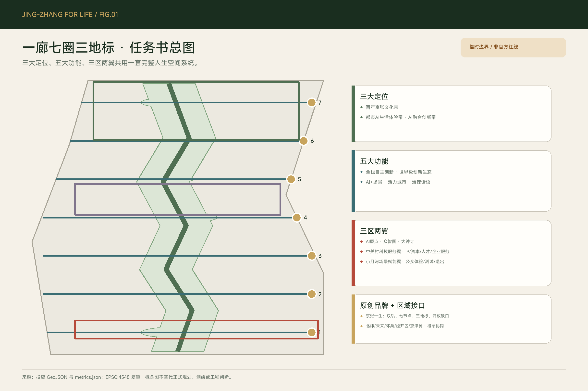
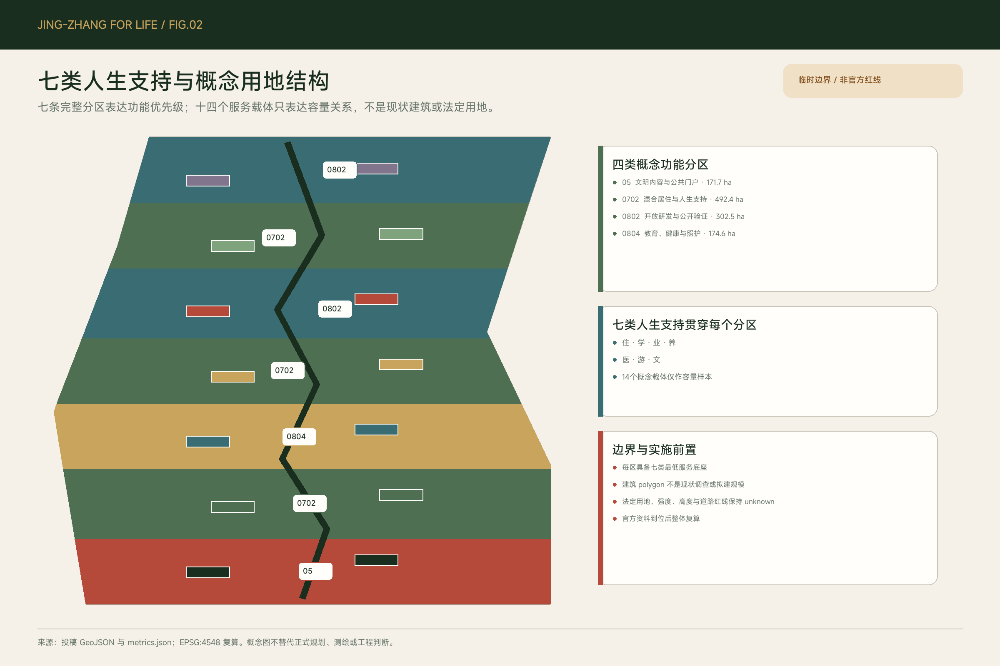
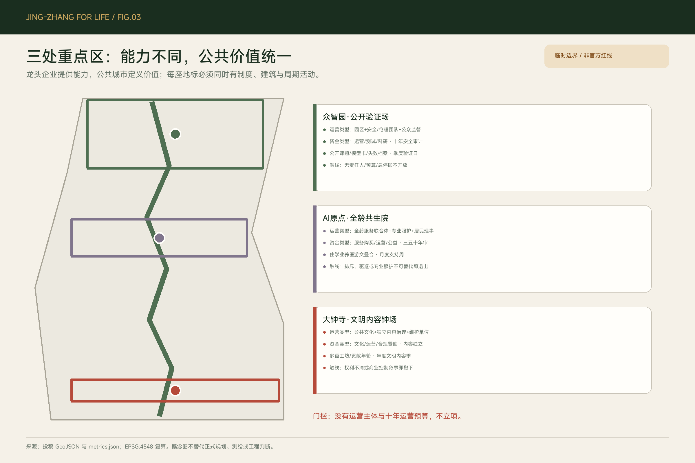
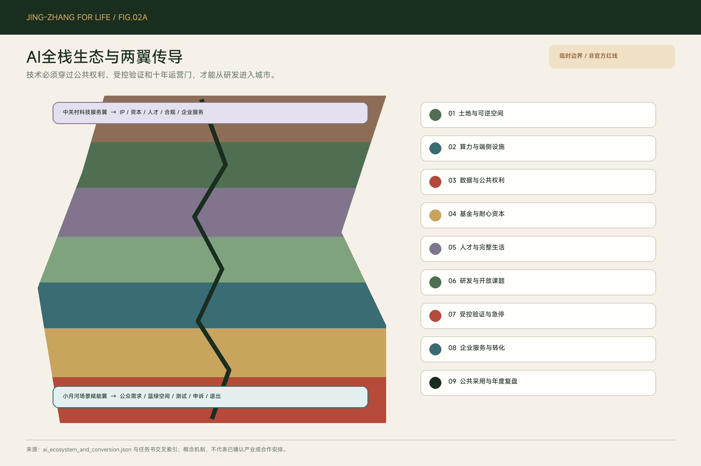
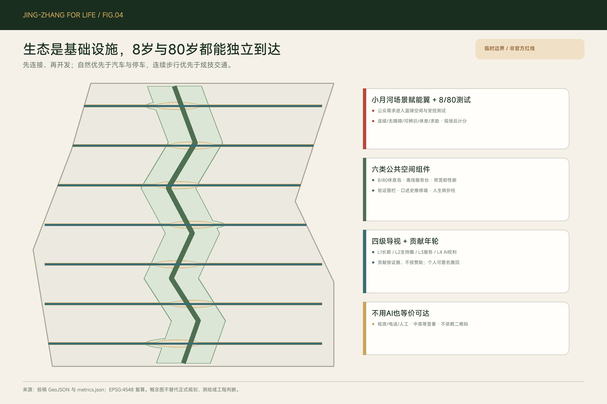
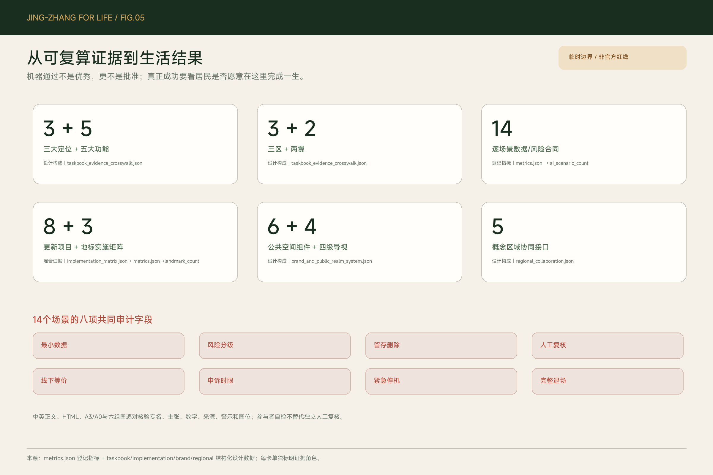

# 京张一生 / JING-ZHANG FOR LIFE

> **百年京张，陪伴一生。** 城市不只服务人的某个高生产力阶段，而要陪伴人的完整一生。

本方案把“AI创新带”的首要价值，从技术展示和人才争夺，转向一种更难也更可检验的城市承诺：一个人可以在这里入学、工作、成家、照护、转型、退休和老去，而不必在每次人生变化时被迫离开。`CommonWeave 人生共织系统`保留为实施机制；它不是新品牌，而是把空间、时间、运营与公共权利编织成可执行合同的方法。[source:USER-DESIGN-CHARTER]

## 设计依据与资料清单

任务依据以官方征集公告、面向智能体任务书和仓库 site package 为主；总体设计范围与三处重点区仍使用仓库提供的 provisional polygon，仅适用于投稿 intake、拓扑验证与概念比较，不是官方红线、审批依据或精确面积依据。[source:OFFICIAL-ANNOUNCEMENT] [source:AGENT-TASKBOOK] [source:SITE-PACKAGE]

本次修订来自一轮逐题确认的用户设计纲领：全生命周期保障、重点修复人生转折；共享空间创造跨代关系，专业设施保障个体尊严；AI“日常隐身、节点可见、全程可选择”；文化扎根京张与海淀，以天人合一、代际传承、自主创新与工匠精神面向世界。[source:USER-DESIGN-CHARTER]

专业判断继续受城市设计、控规深度、用地分类和建筑设计深度要求约束。未取得官方控规、权属、现状建筑、道路红线、文保、市政和服务底数的内容，统一表达为“概念建议”“参考方案”“可供专业团队深化研究”。[standard:MOHURD-URBAN-DESIGN-MEASURES] [standard:MOHURD-CONTROL-DETAILED-PLANNING]

## 任务书响应总图

本方案把任务书的**三大定位**落实为同一空间系统的三层价值，而不是另造三套口号：百年京张文化带由铁路记忆、人生长廊和中华文化的当代表达承载；都市 AI 生活体验带由七个支持圈、14 个可选择场景和线下等价服务承载；AI 融合创新带由三区两翼和九层全栈生态承载。逐项证据位置记录在任务书交叉索引中，便于评审从要求直接抵达章节、图件、场景和运营条款。[source:AGENT-TASKBOOK] [data:visual/assets/taskbook_evidence_crosswalk.json#positionings]

**五大功能**分别落到：众智园的 AI 全栈自主创新与公开验证；AI 原点社区的世界级创新生态与完整生活支持；小月河翼的 AI+ 场景赋能；七圈、慢行蓝绿网络和可降级服务构成的智能化活力城市；六项公共 AI 权利、逐场景审计和失败公开构成的 AI 治理公共话语。它们共享“公共价值先于技术采用”的总门槛。[data:visual/assets/taskbook_evidence_crosswalk.json#functions]

**三区两翼**明确为：AI 原点社区、众智园 AI 自主创新加速区、大钟寺 AI 产业聚集区；中关村科技服务翼把知识产权、资本、人才、合规与企业国际服务输送到三片区，小月河场景赋能翼把公众需求、蓝绿公共空间和受控测试转成可体验、可申诉、可退场的场景。两翼都是概念传导关系，不是官方行政边界或已确认建设项目。[data:visual/assets/taskbook_evidence_crosswalk.json#three_areas_two_wings]

`agent.1` 至 `agent.6` 分别由品牌与总体结构、全栈生态、14 场景、公共空间与三地标、京张—中关村—中华文明叙事、年度活动和长期运营回应。原创标志以“双轨人生长廊 + 七个支持节点 + 三座制度地标 + 开放缺口”构成；不得与企业 Logo 联用以暗示背书，使用规则见品牌系统。[data:visual/assets/brand_and_public_realm_system.json#brand]

## 三层范围工作框架

统筹研究范围约 43.6 km²，回答“全球人文生态城市如何组织创新、生活和公共价值”；总体设计范围约 11.4 km²，回答“人生长廊、支持圈、住房、公共服务、蓝绿系统和慢行网络如何组合”；三处重点区域约 368.4 ha，回答“制度、建筑、运营者和周期活动如何在具体节点落地”。公告面积是任务尺度，提交 polygon 的 11.41 km² 复算值是临时设计模型，两者都不能冒充 official boundary。[source:OFFICIAL-ANNOUNCEMENT] [metric:site_area_sqm]

三层传导不从招商目标向下压空间，而从人生结果向上校验：重点区试验某项公共制度，总体范围验证 15 分钟支持与连续出行，统筹范围再判断是否值得扩展。任何试点若增加搬迁、排斥不会使用 AI 的人、侵占公共空间或加重生态负担，应停止扩展。[depth:three_level_scope_framework]

总体结构为“**一廊、七圈、三地标、多条跨接**”。一条京张人生长廊承载自然与记忆；七个 15 分钟人生支持圈提供住、学、业、养、医、游、文的普惠底座；三座地标建立公共价值的精神高点；七条东西向联系把园区、校园、社区和轨道站点重新缝合。[data:geometry/roads.geojson#ROAD-001] [metric:life_support_circle_count]

## 统筹研究范围产业与未来城市研究

产业目标不是把全带变成办公园区，而是让科研、内容、制造、教育、健康、照护和文化共同构成城市韧性。企业通过“公共利益合同”获得场景、空间和协作机会，同时承诺公共开放时段、可审计的数据边界、无障碍服务、人才培养、生态绩效和失败退出。龙头企业提供能力，公共城市定义价值。

全球案例只提炼机制，不复制形态或指标：巴黎把生活必需功能放在步行十五分钟或骑行五分钟内，并强调复用既有设施；新加坡 Kampung Admiralty 把老年住房、托育、医疗、康乐和公共绿地叠合；维也纳根据学习、家庭变化与老龄阶段调整保障房配置；巴塞罗那把学校、图书馆、公园等转成气候庇护网络。[source:CASE-PARIS-15M] [source:CASE-KAMPUNG-ADMIRALTY] [source:CASE-VIENNA-LIFE-STAGE-HOUSING]

赫尔辛基 Kalasatama 提供长期分期和公共交通导向的更新经验；Punggol Digital District 提供大学、企业、社区和生活实验室的协作机制；Brooklyn Navy Yard 提供生产性遗产再利用和公共界面经验。转化到海淀后，案例共同指向“生活底线先行、既有设施复用、跨机构运营、验证后扩展”，不支撑任何海淀控规或投资结论。[source:CASE-KALASATAMA] [source:CASE-PUNGGOL] [source:CASE-BROOKLYN-NAVY-YARD]

### 区域协同接口

区域协同不画未经确认的“合作箭头”，而定义可检验的交换接口：北纬社区交换生活需求、课程和公共服务互访；未来科学城交换科研课题与复合人才服务；怀柔科学城交换科学装置需求、成果和公众科普内容；北京经济技术开发区交换工程验证、制造反馈和供应链能力；京津冀城市网络交换人才、公共服务、文化内容与气候韧性方法。每个接口都写明空间载体、组织形式和验证指标，例如服务转介完成率、公开模型卡数量、安全关闭时间、开放成果复用数。[data:visual/assets/regional_collaboration.json#interfaces]

这些接口依托中关村科技服务翼的企业服务驿站、众智园受控验证场、大钟寺多语内容节点和年度轮值圆桌运行；均为概念机制，不代表相关地区、机构或政府已经同意、合作、出资或调整规划。[data:visual/assets/regional_collaboration.json#status]

## 总体设计范围城市更新与控规深度城市设计

总体范围采用七条共享切割线形成完整、无重叠的概念用地分区：南端文明内容与公共门户，中段配置混合居住、教育健康、照护协作和 AI 原点全龄社区，北段配置开放研发、稳定居住与众智园造物验证。该分区只表示功能优先级；法定用地代码、容积率、高度、建筑密度和道路红线均待正式资料后重算。[data:geometry/land_use.geojson#LU-001] [depth:land_use_layout]

住房是创新基础设施。方案优先保障稳定租住、可转换户型、家庭变化后的就近换房、无障碍改造和防搬迁机制，即使这意味着减少一部分高收益办公或商业开发。约 492.45 ha 的 `0702` 概念分区体现“居住与人生支持”的空间优先级，但不是住宅供地或法定面积承诺。[metric:land_use_area_code_0702_sqm]

城市更新遵循“保留—修缮—适应性复用—必要新建—审慎拆除”。现有 14 个建筑 polygon 只是七类服务载体的容量样本，不是现状建筑调查，也不用于征收或施工；真正的拆改留必须先完成权属、结构、消防、日照、文保、碳排和居民影响评估。[data:geometry/buildings.geojson#BLDG-001] [depth:retain_renovate_demolish]

## 重点区域详细设计

**众智园·公开验证场**定位“造物与验证”。制度包括公开课题、模型卡、失败档案、风险分级和居民可见的复核结果；建筑是可逆验证庭、人工关闭界面和低扰动测试边界；周期活动为季度公开验证日。至少三类产业测试场景——端侧模型、康复设备、无障碍通行——都必须限定时段、范围、责任人和退出条件。[data:geometry/key_areas.geojson#PROV-KEY-001] [metric:ai_testing_scenario_count]

**AI 原点·全龄共生院**定位“学习与生活”。院落把托育、全龄学习、基层健康、照护喘息、再学习、无门槛运动和公共文化按空间与时段叠合；共享空间制造跨代相遇，专业房间保障喂养、康复、心理支持和临终关怀的尊严。月度“人生转折支持周”把制度落到真实变化，而不是做全年无休的消费场。[data:geometry/key_areas.geojson#PROV-KEY-002]

**大钟寺·文明内容钟场**定位“全球内容科技与中华文明传播门户”。北京市重点项目资料显示字节跳动总部产业园项目位于海淀北下关地区并与轨道 12、13 号线衔接；大钟寺 AI 夜校也已出现高校、社区和字节跳动志愿者共同授课的公共协作线索。本方案据此提出公共编辑室、多语内容工坊和年度文明内容季，但不声称企业背书，也不让企业定义城市价值。[source:BYTEDANCE-HQ-PROJECT] [source:DAZHONGSI-AI-NIGHT-SCHOOL]

## AI 创新生态、人才画像与 AI+ 场景

人才画像不按年龄、职业或收入把人分成固定客群，而按七段人生与七类转折测试城市：童年与家庭起步、少年独立、求学与初入职场、成家育儿、中年转型与双重照护、活力老龄、高龄照护与生命终章。入托入学、毕业就业、家庭形成或变化、生育照护、失业转岗、退休功能变化、失能与临终支持，是最容易发生服务断裂的时刻。[data:visual/assets/life_support_matrix.json#transition_tests]

14 张场景卡覆盖住、学、业、养、医、游、文，包括住房转换、反搬迁预警、全龄课程、少年独立路线、转岗学习、托育照护、照护者喘息、健康导航、韧性路线、口述史和文明多语内容。每张卡同时写明人工接管和退出；测试验证场景另加物理隔离、专业监督和急停。[data:visual/assets/scenario_cards.json#SC-01] [metric:ai_scenario_count]

每张卡现在使用同一份可审计合同：服务对象与空间—运营映射、最小数据类别、隐私/安全风险级、具体保留与删除规则、人工复核责任类型、实质等价的纸质/电话/人工路径、现场/电话/纸质申诉、一个工作日确认和五个工作日人工答复目标、紧急停机以及完整退场。健康、儿童、照护、口述史和康复设备按高或极高风险处理；任何场景不得跨场景画像、出售数据或用 AI 决定基础资格。[data:visual/assets/scenario_cards.json#rights_baseline]

公共 AI 的六项权利是知情、解释、选择、离线、人工接管、纠错与退出。AI 在日常空间中不抢占注意力，只在学习、验证和公共服务节点可见；不会使用 AI 或拒绝 AI 的居民，仍获得同等基础服务。禁止常态化隐性画像、只由模型作高影响决定、没有申诉或停机机制的服务。[data:visual/assets/public_ai_rights.json#AI-R1] [metric:public_ai_right_count]

### AI 全栈生态与两翼传导

全栈不是一张技术采购清单，而是一条带公共门槛的空间转化链：**土地与可逆空间 → 算力与端侧设施 → 数据与公共权利 → 基金与耐心资本 → 人才与完整生活 → 研发与开放课题 → 受控验证 → 企业服务与转化 → 公共采用与年度复盘**。众智园承担可控验证，AI 原点把人才支持和研发嵌入完整生活，大钟寺承担内容新业态与国际表达；中关村翼提供知识产权、资本、合规和企业服务，小月河翼提供公众体验、蓝绿空间和场景测试。任何权利、安全、生态或运营门未通过即停止。[data:visual/assets/ai_ecosystem_and_conversion.json#layers]

场景开放采用七步流程：非技术问题也可线下提交；运营者做完整性筛查；安全、隐私、无障碍和生态专业审查；居民判断公共价值；限时限地可逆试点；公开摘要并受理申诉；最终停止、修订或扩展。由此避免“有技术就找场景”，也避免场景评审只在企业内部完成。[data:visual/assets/ai_ecosystem_and_conversion.json#scenario_application_review]

## 用地、建筑规模与拆改留方案

临时边界内概念分区完整覆盖约 11.41 km²：`0702` 混合居住与人生支持约 492.45 ha，`0802` 开放研发与造物验证约 302.54 ha，`0804` 教育健康与照护约 174.59 ha，`05` 文明内容与公共门户约 171.70 ha。面积来自同一组共享切割线，适用于内部一致性审查，不是 statutory allocation。[metric:land_use_total_sqm] [data:geometry/land_use.geojson#LU-007]

14 个概念载体的基底合计约 37.41 ha，只用于展示服务容量和空间关系；它们不推导总楼面面积。总建筑面积、容积率、建筑密度和高度均保持 unknown，因为官方控规和现状建筑底数尚未提供。任何后续方案都不得把概念基底当作拟建规模或工程量。[metric:building_footprint_area_sqm] [metric:floor_area_ratio]

拆改留的价值排序是：居民稳定与安全、铁路和在地记忆、可适应性与全生命周期碳、公共开放价值、最后才是短期开发收益。若改造导致现有居民或小型公共服务被挤出，必须提供同地段、同可达性、可负担的替代并获得真实同意；没有反搬迁方案的项目不进入实施清单。[depth:development_intensity_controls] [depth:height_massing_character]

## 交通、轨道、市政与公共服务设施

交通标准不是“更快穿过”，而是“8 岁儿童与 80 岁老人都能独立到达”。一条人生长廊与七条横向联系形成约 17.56 km 的概念慢行网络；线长表达关系，不是道路里程。正式评价需现场走查连续性、过街、坡度、照明、遮荫、休息、厕所、求助和无障碍，并在此后才计算 8/80 路线通过率。[data:geometry/roads.geojson#ROAD-001] [metric:concept_mobility_length_m]

站点一体化优先解决地面换乘、骑行停放、雨雪遮蔽、无障碍和清晰导视，不先承诺地下连廊或新桥隧。大钟寺的 12、13 号线联系作为背景条件进入专业深化；任何线位、断面、桥隧和停车调整都需交通、轨道、消防和市政团队复核。[source:BYTEDANCE-HQ-PROJECT] [depth:traffic_rail_slow_parking]

市政与新型基础设施必须离线可降级：公共服务点有纸质导视、人工柜台和应急关闭；传感器用途最小、现场告知、短期保留、可审计；网络、能源、排水、防洪、消防和医疗始终保留人工控制。没有服务运营者、十年运营预算和维护责任的设施，不立项。[depth:municipal_new_infrastructure]

## 蓝绿空间、公共空间与城市风貌

自然不是美化带，而是日常基础设施。概念生态网络约 232.47 ha、占临时边界 20.37%，承担遮荫、雨洪、生境、游戏、休息、疗愈和铁路记忆；概念公共空间网络约 86.01 ha、占 7.54%，把七个支持圈与横向联系叠合。两项比例都是 provisional design model，不是法定绿地率或公共空间控制指标。[metric:green_ratio] [metric:public_space_ratio]

空间同时实行“空间共享 + 时间共享”：学校、园区、社区和文化设施在安全、责任和预算明确后错时开放；夜间保留照护、医疗、交通和求助等生活支持，但不把 24 小时城市理解为 24 小时消费。自然优先于汽车、停车和部分开发强度，更新项目需先证明不会破坏连续生态和日常舒适。[data:geometry/green_space.geojson#GREEN-001] [data:geometry/public_space.geojson#PUBLIC-001]

文化不贴仿古屋顶，而进入空间逻辑、材料和时间：天人合一表现为四季自然服务；代际传承表现为共同院落和口述史；自主创新与工匠精神表现为可见的制作、验证、维修和失败档案。建筑采用当代北京的砖、木、金属和再生材料，体量克制、首层开放、夜景低扰动，让铁路遗存成为可触摸的记忆而非舞台布景。[standard:MOHURD-URBAN-DESIGN-MEASURES]

### 公共空间组件、品牌与导视

六类可复用组件把理念变成公共界面：8/80 休息岛、离线服务台、雨雪韧性廊、公开验证围栏、口述史与维修墙、人生转折公告柱。它们分别公开座椅与无障碍、人工服务、气候韧性、测试责任与急停、来源与撤回、七类服务与年度日历；组件不是标准图集，需在正式场地、消防、结构和无障碍复核后深化。[data:visual/assets/brand_and_public_realm_system.json#public_space_component_library]

四级导视依次回答“人生长廊往哪走、所在支持圈有什么、具体服务何时由谁提供、AI 用什么数据及如何人工/申诉/急停”。中英文等显著、高对比、图形加文字并保留触觉或语音辅助，不能只给二维码。三地标与服务台设置“贡献年轮”，展示公开课题、居民贡献、维修和失败复盘，按证据而非赞助金额排序；个人可匿名、可撤回。[data:visual/assets/brand_and_public_realm_system.json#signage_system]

## 更新项目清单、实施政策与分期计划

近期不是先建地标，而是先补生活底线：JZ-01 人生长廊连续性走查；JZ-02 七圈服务缺口地图；JZ-03 稳定住房与反搬迁协议；JZ-04 8/80 独立路线试验；JZ-05 线下公共 AI 权利服务台。每项先指定运营者、维护责任、十年预算来源和退出办法。[data:geometry/phasing.geojson#PHASE-001]

中期在运营制度有效后推进三座地标：JZ-06 众智园公开验证场；JZ-07 AI 原点全龄共生院；JZ-08 大钟寺文明内容钟场。长期只扩展通过公众评价、生态绩效、安全复核和公平审查的机制；不成熟的场景退场，不以已投入成本阻止纠错。[depth:phasing_implementation]

JZ-01 至 JZ-08 和三座地标均已形成同字段实施矩阵：主体**类型**、专业与资料前置条件、首个可逆试点范围、资金来源**类型**、十年维护责任、公众参与节点、阶段指标、停止/退出条件。矩阵不虚构具体运营单位、金额或政府承诺；三座地标的参考安排统一遵循“先用存量空间和周期活动验证，再决定建筑深化”，并设第三、第五、第十年维护审查。[data:visual/assets/implementation_matrix.json#projects]

资金只声明来源类型而不承诺金额：公共服务购买、既有养护或公共文化预算类型、园区/场地运营收入、合规企业测试或赞助合同、科研与公益资金类型。赞助不得控制公共叙事，企业合同必须接受公共利益、数据、无障碍和失败退出条款；缺任何运营责任人或环形维护来源，不立项。[data:visual/assets/implementation_matrix.json#portfolio_gate_zh]

治理分工是：居民定义生活价值，专业团队守住安全和规范，企业提供技术与运营能力，政府保证公共底线和权利。年度节律为春季公开验证、夏季气候韧性与公共生活、秋季京张文化和文明内容、冬季证据复盘；这是一套参考运营日历，不构成政府承诺。[data:visual/assets/landmark_operating_contracts.json#LM-01]

### 开发者社区、年度活动与国际转化

“京张公共技术公社”是开发者、企业、居民组织和专业人员的共同工作界面：每月开放课题诊所、每季公开验证日、每年“京张 AI 公共价值大会”；参与者接受公共利益合同，输出开源工具、模型卡、失败档案和公共服务原型。场景是否扩展由居民价值、专业安全和公开证据共同决定，不能以企业投入或媒体热度替代。[data:visual/assets/ai_ecosystem_and_conversion.json#developer_community]

国际招引转化采用可退出漏斗：多语开放问题库 → 远程合规与场地预审 → 两周驻留验证 → 中关村翼知识产权/资本/人才对接 → 小月河公众体验 → 三片区落地或明确退出 → 90 天复盘。成功指标不是参会人数，而是进入受控试点、完成公共利益合同、形成公开成果并在不适配时及时退出的比例。[data:visual/assets/ai_ecosystem_and_conversion.json#international_attraction_conversion]

## 指标体系、面积复算与合规矩阵

可复算证据包括：临时边界 11,412,825.386 m²；完整用地分区 11,412,839.790 m²，微小差异来自经纬度切割后分别投影；概念生态网络 2,324,662.354 m²；公共空间网络 860,068.732 m²；14 个服务载体；17,555.089 m 概念联系；7 个支持圈、7 类支持、3 座地标、6 项公共 AI 权利、14 个场景和 3 个测试验证场景。[metric:site_area_sqm] [metric:green_space_area_sqm] [metric:ai_scenario_count]

必须保持 unknown 的指标包括总楼面面积、容积率、建筑密度、高度和道路面积；必须建立现场基线的生活结果包括住房负担、8/80 独立路线、人生转折服务中断、照护者喘息、热浪庇护可达、居民留居意愿和非数字服务等价性。目标值应由居民、专业团队和政府共同确定，不在缺数据时伪造漂亮数字。[metric:housing_cost_burden_baseline] [metric:age_8_80_independent_route_pass_rate]

合规、标准和设计深度矩阵把每项任务映射到章节、GeoJSON、指标、图纸、假设和自检。机器 PASS 只证明结构完整、证据可追溯和内部一致，不证明方案优秀，更不等于官方批准。[depth:metrics_recalculation]

中英文实质等效审计逐对核验正文、HTML、A3/A0 和五组核心图的章节顺序、专名、主张、数字、来源等级、临时性警示和图位。记录只是参与者自检，不能替代独立双语专业复核；最终渲染后仍需人工签署。[data:visual/assets/bilingual_equivalence_audit.json#pairs]

## 风险、版权与合规说明

第一风险是资料精度：总体边界和三处重点区 polygon 均为 provisional，正式数据到位后必须重算全部面积、比例、图件和空间关系。第二风险是实施条件：控规、权属、现状、文保、轨道、市政、消防和公共服务底数不全，相关内容不能直接进入规划审批或工程设计。[data:geometry/constraints.geojson#CONSTRAINTS] [depth:risk_missing_data]

七条不可越过的红线是：不以更新驱逐居民；不把公共空间私有化；不强制数字化；不以科技奇观替代公共服务；不造仿古假历史；不为开发牺牲生态；不编造数据或官方背书。企业名称只用于有来源的背景判断，不使用 Logo，不暗示合作或认可。[source:DAZHONGSI-AI-NIGHT-SCHOOL]

文本、图表、HTML 和 PDF 为本次人机协作原创。概念主视觉由 OpenAI image generation 按本方案提示生成，只作为想象层，明确不是现场照片、测绘底图或真实建筑方案；核心图件由提交 GeoJSON 和 metrics 派生。为保证 Linux 离线审阅不缺字，中文 HTML 内嵌经本稿字符集裁剪的 Noto Sans SC 子集，来源与 SIL Open Font License 记录在 `sources.json` 和版权说明中；未复制外部案例图片。[source:ASSET-GENERATION-METHOD] [source:FONT-NOTO-SANS-SC]

## 参考资料

项目与证据入口包括：官方公告 [source:OFFICIAL-ANNOUNCEMENT]；智能体任务书 [source:AGENT-TASKBOOK]；site package 与公开资料登记 [source:SITE-PACKAGE] [source:SOURCE-REGISTRY]；临时总体边界与重点区 [source:BOUNDARY-SOURCE] [source:KEY-AREA-SOURCE]；用户确认的设计纲领 [source:USER-DESIGN-CHARTER]。

在地背景包括：北京市重点项目计划中的字节跳动总部产业园 [source:BYTEDANCE-HQ-PROJECT]；北京市政府门户转载的大钟寺 AI 夜校信息 [source:DAZHONGSI-AI-NIGHT-SCHOOL]。国际机制案例包括巴黎十五分钟城市、新加坡 Kampung Admiralty、维也纳生命周期住房、巴塞罗那气候庇护、赫尔辛基 Kalasatama、Punggol Digital District 和 Brooklyn Navy Yard；均只作背景，不支撑海淀空间控制。[source:CASE-PARIS-15M] [source:CASE-KAMPUNG-ADMIRALTY] [source:CASE-BARCELONA-CLIMATE-SHELTERS]

机器可读索引包括总体边界 [data:geometry/site_boundary.geojson#SITE-001]、重点区 [data:geometry/key_areas.geojson#PROV-KEY-003]、用地 [data:geometry/land_use.geojson#LU-001]、建筑载体 [data:geometry/buildings.geojson#BLDG-001]、交通 [data:geometry/roads.geojson#ROAD-001]、生态 [data:geometry/green_space.geojson#GREEN-001]、公共空间 [data:geometry/public_space.geojson#PUBLIC-001]、分期 [data:geometry/phasing.geojson#PHASE-001]，以及任务书交叉索引、区域协同、AI 全栈、实施矩阵、品牌公共空间、双语审计、评审修复索引、人生支持、AI 权利、地标运营和场景卡证据数据。

为保证评审机器可以从正文直达全部已登记证据，本稿同时引用处理后事实包 [source:PROCESSED-FACT-PACK]。公告与智能体任务书的标准入口见 [standard:PROJECT-OFFICIAL-ANNOUNCEMENT] [standard:PROJECT-AGENT-OPEN-CALL-TASKBOOK]；用地分类与建筑设计深度入口见 [standard:MNR-LAND-USE-CLASSIFICATION-GUIDE] [standard:MOHURD-ARCH-DESIGN-DEPTH-2016]。

现状诊断、总体空间结构和蓝绿公共空间的深度定位见 [depth:existing_conditions_diagnosis] [depth:overall_spatial_structure] [depth:blue_green_public_space]；三处重点区与更新项目清单见 [depth:three_key_area_detailed_design] [depth:renewal_project_list]。

面积类登记值包括公告总体设计面积、阶段面积和公共空间 [metric:announced_overall_design_area_sqm] [metric:phase_area_sqm] [metric:public_space_area_sqm]。概念用地中的公共门户与居住支持见 [metric:land_use_area_code_05_sqm] [metric:land_use_area_code_0702_sqm]；开放研发与教育健康见 [metric:land_use_area_code_0802_sqm] [metric:land_use_area_code_0804_sqm]。

系统构成的登记值包括建筑类型、横向缝合与重点区 [metric:building_typology_count] [metric:cross_belt_stitch_count] [metric:key_area_count]；地标和七类人生支持分别见 [metric:landmark_count] [metric:life_support_domain_count]。这些引用只补全追溯性，不把临时数据升级为官方结论。
