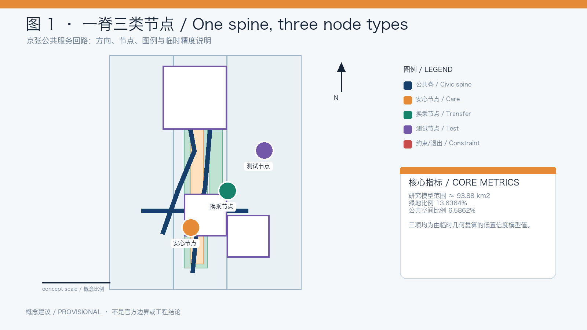
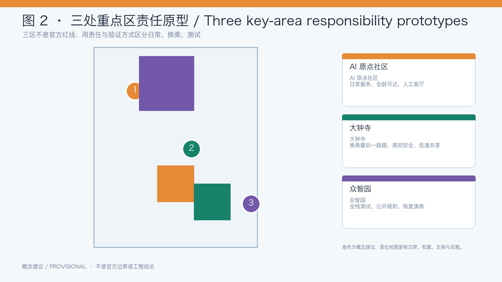
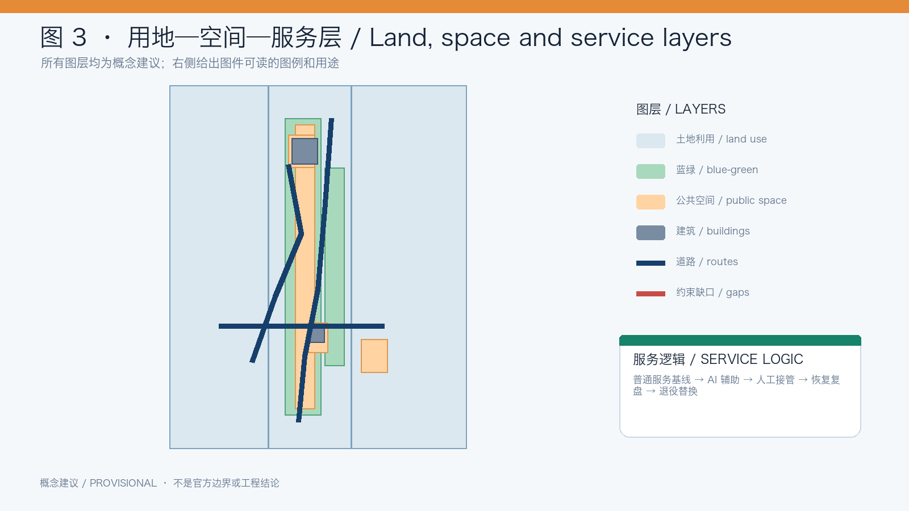
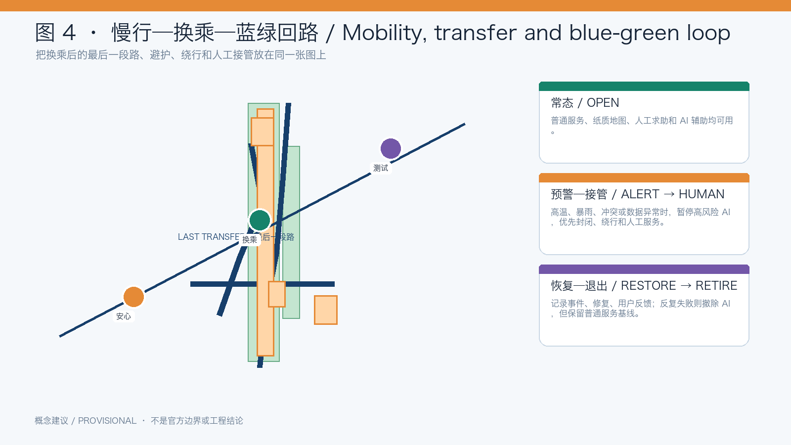
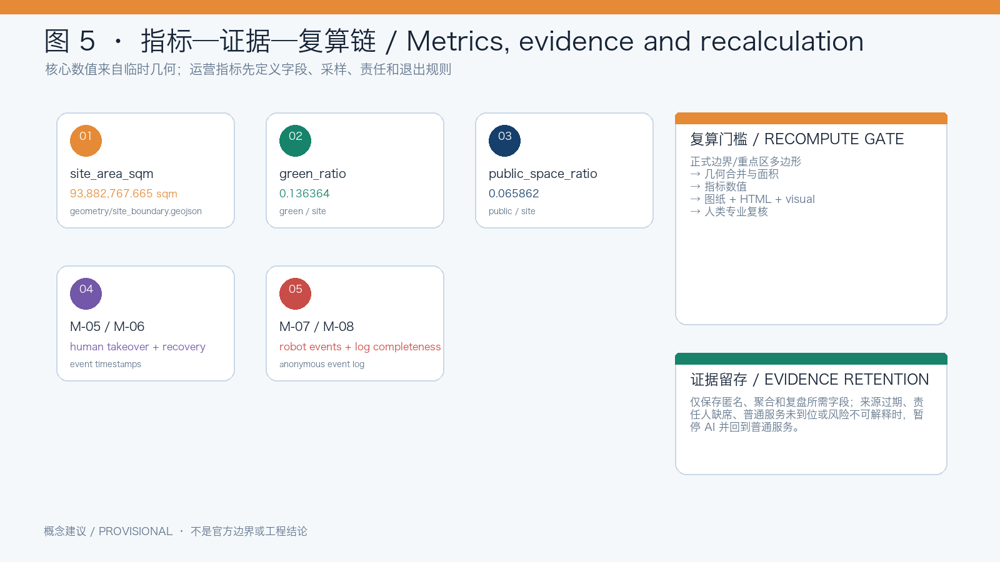

# Never-Off City: Jing-Zhang Resilient Civic Service Loop

> This is an open co-creation concept and reference proposal. It is not statutory planning, an approved government conclusion, engineering design, construction permission, investment commitment, procurement plan or operating authorization. When official boundaries, key-area polygons, heritage, ownership, municipal, road and control-plan data become available, all geometry, metrics, drawings and pages must be recomputed. [source:DATA-SRC-OFFICIAL-ANNOUNCEMENT-20260509] [assumption:A-PROVISIONAL-GEOMETRY]

## 0. One-sentence judgment

The most important capacity of an AI city is not that every device is always online; it is that the city continues to work when networks fail, storms arrive, heat intensifies, equipment breaks or a user cannot operate AI. [source:OFFICIAL-RESILIENCE]

The proposal uses the Jing-Zhang Railway Heritage Park and surrounding public-space structure as a conceptual civic spine. It combines an ordinary-service layer, an AI-assistance layer and a resilience-governance layer. People should be able to walk, rest, ask for help and obtain basic information without an account, QR code or single model; AI enters only when its risk is explainable, responsibility traceable, human takeover possible and service recovery recorded. [source:DATA-SRC-OFFICIAL-ANNOUNCEMENT-20260509] [source:BEIJING-TRANSPORT-2026] [source:OFFICIAL-RESILIENCE]

## 1. Evidence and design basis

The open call covers 43.6 km² between the North Fifth Ring Road and Beijing North Railway Station, centered on the Jing-Zhang Railway Heritage Park and related urban areas. It asks agents to address AI development, ecosystem, future urban form, transport, infrastructure, public space, culture and deployable AI scenarios. [source:OFFICIAL-CALL]

The proposal translates these tasks into seven questions: how to move from “technology always online” to “public service continuously usable”; how to make testing produce public return; how public space can switch between normal, warning, human takeover and recovery; how to repair the last section after a transfer; how to turn railway memory into a continuous safety and civic experience; how to connect railway engineering and AI engineering; and how to make heat refuge, storm detours, non-digital access, accessible routes, robot sharing and failure review spatially legible.

Beijing’s 2025 population was 21.80 million with a negative natural growth rate; the city master plan seeks long-term population stability around 23 million. This supports a shift toward existing-space quality, public service and environmental carrying capacity rather than uncontrolled expansion. [source:BEIJING-STAT-2025] [source:BEIJING-MASTER-PLAN]

Haidian already has a dense AI economy and science-and-education base. The proposal therefore does not invent another generic AI park; it asks how AI can enter everyday public space while producing auditable public value. [source:BEIJING-AI-2025] [source:HAIDIAN-AI-2025]

Beijing’s green travel share reached 76.5%, and public information reports 92.1% of rail stations with bus connections within 50 meters. The design focus is therefore the last section after a transfer, continuity, accessibility and public-space comfort rather than a new trunk network. [source:BEIJING-TRANSPORT-2026]

Beijing’s resilience goals call for stronger capacity to withstand, adapt to and recover from extreme events, including local rainwater retention and use. The park, street and service nodes are therefore treated as a switching infrastructure for shade, refuge, information and recovery. [source:OFFICIAL-RESILIENCE]

The Jing-Zhang corridor has already entered a public planning and comment process. This proposal is discussion material to be checked against planning, heritage, ownership, municipal and professional conditions; it does not replace them. [source:JZ-PLANNING-NOTICE]

### 1.1 Task-to-evidence delivery matrix

The six agent tasks are answered with distinct claims, spatial evidence, responsibilities and gates rather than repeated generic file lists. All spatial positions and implementation language remain conceptual.[source:DATA-SRC-AGENT-TASKBOOK-20260518] [standard:PROJECT-OFFICIAL-ANNOUNCEMENT] [data:data/processed/agent_task_requirements.csv#agent.1-agent.6]

| Task | Specific response | Evidence | Responsibility and gate |
| --- | --- | --- | --- |
| agent.1 overall concept | Never-Off City links three positions—heritage belt, urban AI life-experience belt and AI-integrated innovation belt—with five functions, three areas (AI Origin Community, Zhongzhiyuan, Dazhongsi) and two wings (Zhongguancun technology-service, Xiaoyuehe scenario-empowerment). Regional links to Beiyu Community, Future Science City, Huairou Science City, E-Town and the Beijing-Tianjin-Hebei network are conceptual cooperation directions, not confirmed partnerships. | site-overview, key-areas, naming/identity, three service layers and scope framework | Planning team owns the structure. If official boundaries or heritage interfaces are missing, pause spatial placement and keep only the relationship diagram; next gate is professional and human review. |
| agent.2 full-stack ecosystem | Zhongzhiyuan is a research-compute-data-model-test-governance loop; AI Origin Community is a near-campus innovation and everyday-service loop; the Zhongguancun wing provides open knowledge, talent and service interfaces. Land/space, industry, finance information, talent, compute, data and scenarios are all addressed without promising companies, investment, fiscal support or outputs. | seven case studies, ecosystem-to-space table, land-use/public-space layers and source-status table | Ecosystem operators disclose rules. Unverified business, funding or data claims are downgraded to assumptions and excluded from display; next gate is authorized data and a small pilot. [source:DATA-SRC-OFFICIAL-ANNOUNCEMENT-20260509] |
| agent.3 scenarios | Ten cards, three validation scenes and five personas connect heat/rain, accessibility, robots, non-digital access and health information to Xiaoyuehe’s public-experience path. Health information is explanation and human referral, never diagnosis. | scenario-space-operation matrix, persona table, validation log template | Scenario owner records trigger, takeover, feedback and exit. Unexplainable risk, sensitive data or missing fallback pauses AI and keeps ordinary service. |
| agent.4 public space and landmarks | The park is an east-west stitching and north-south continuity spine; Dazhongsi is a conceptual smart-native consumption/business interface. Three landmarks—Signal Origin, Human Handover Platform and Recovery Wall—use removable components, an honor display and a public-space component library. | public-space/green-space layers, landmark catalogue, display system and component library | Heritage, ownership and safety reviewers can stop placement; next gate is professional confirmation, not a construction conclusion. |
| agent.5 culture | Railway engineering, signals, platforms, maintenance and recovery are connected to Zhongguancun’s open innovation culture and a new AI culture. Bilingual signs use text, color and symbols to distinguish the overall brand, service state and landmark interpretation. | cultural storyline, signage system, bilingual figures and rights ledger | Culture lead checks history and rights; uncertain material becomes original text/abstract graphics or a link-only reference. [source:JZ-PLANNING-NOTICE] [assumption:A-RIGHTS] |
| agent.6 operation | The year has accessibility audit, heat/rain resilience week, pausable-AI/developer testing and failure-replay seasons. Developer rules use a sandbox, field watch, attribution and issue log; scenario opening is application → safety review → pilot → takeover drill → public feedback → scale or retire. Conversion is participant → reproducible prototype → public evidence → professional deepening → partner/international lead, without promising investment or recruitment. | annual calendar, implementation gate matrix, phasing layer, developer and scenario-operation rules | An operations committee retains pause, rollback and retire authority; missing staff, log, fallback, rights or public budget explanation blocks expansion. [depth:long_term_operation_value] |

Formal task evidence uses the approved central source `DATA-SRC-OFFICIAL-ANNOUNCEMENT-20260509`; provisional geometry uses `DATA-SRC-PROVISIONAL-BOUNDARIES-20260605` only for intake visualization and design discussion, never as an official boundary.[source:DATA-SRC-PROVISIONAL-BOUNDARIES-20260605] [assumption:A-PROVISIONAL-GEOMETRY]

## 2. Three-level scope framework

| Level | Public-call scale | Question | Main output |
| --- | --- | --- | --- |
| Strategic research | about 43.6 km² | How can AI industry, universities, communities, mobility, heritage and public service form a regional innovation network? | resilience principles, cases, personas and operation |
| Overall design | about 11.4 km² | How can the park surroundings become walkable, transferable, refuge-ready and recoverable? | civic spine, blue-green system, transfer relations, node types and phasing |
| Key areas | Zhongzhiyuan, AI Origin Community, Dazhongsi and related areas | How can different innovation areas carry different public-service and testing responsibilities? | care, transfer and test node prototypes |

These are conceptual scales. Provisional geometry does not establish statutory boundaries, areas or development controls. [assumption:A-PROVISIONAL-GEOMETRY]

## 3. Concept, naming and identity

Brand: **Never-Off City**. Spatial system: **Jing-Zhang Resilient Civic Loop**. Service layers: Care Node, Transfer Node and Test Node. Operating states: OPEN, ALERT, HUMAN, RESTORE and RETIRE.

“Never-Off” does not promise that devices never fail. It promises that basic public service does not disappear when AI fails. A continuous line, a switchable signal point and a loop that returns to origin form the logo concept. The mark is original to this proposal and is not an official railway mark or registered trademark. [assumption:A-RIGHTS]

## 4. Spatial structure

### 4.1 One civic spine

The existing park and surrounding slow-mobility, transport, community and innovation interfaces form the conceptual civic spine. The first design task is to audit and repair six types of break: park/community interfaces; the last section after rail, bus or bicycle transfers; missing shade, rain cover, water, seating and toilet information; crossings and wayfinding that are difficult for older adults, children, wheelchair users or people with sensory disabilities; weak night-time lighting, staff and help; and conflicts between robots, delivery and pedestrians.

*Figure 1. Concept suggestion: navy is the civic spine; nodes and service interfaces are switchable public-service interfaces. Boundaries and routes remain subject to official data.*

### 4.2 Three node types

- **Care Node:** shade, rain cover, water, seating, accessible wayfinding, paper information and human help. It remains usable offline.
- **Transfer Node:** continuous routes, detours, bicycle parking, lighting and human connection between park, community, bus, rail and bicycle systems.
- **Test Node:** controlled, observable and pausable testing for robots, delivery and public-service AI, with public rules outside and human control inside.

Conceptually, AI Origin Community emphasizes everyday service and all-age access, Dazhongsi emphasizes transfer and night-time interface, and Zhongzhiyuan emphasizes controlled testing and recovery drills. These are design roles, not official land-use decisions. [assumption:A-KEY-AREA-ROLES]

*Figure 2. Concept suggestion: the three node types carry care, transfer and controlled-testing responsibilities; final roles require official data and professional review.*

### 4.3 Three service layers

The ordinary-service layer provides paper maps, physical signs, seating, water, telephone help and visible staff. The AI layer provides weather warnings, accessible routes, congestion and language assistance. The governance layer records status, pause conditions, responsibility, user feedback and recovery. AI adds options; it never makes accounts, QR codes or connectivity a public-service gate.

*Figure 3. Concept suggestion: public space, blue-green systems, transport interfaces and AI services share one node/loop logic; this is not a regulatory plan.*

## 5. Operating state and public-service protocol

Each node uses an auditable state model:

1. **OPEN:** ordinary and AI-assisted services are available;
2. **ALERT:** heat, rain, congestion or equipment anomalies trigger risk guidance;
3. **HUMAN:** high-risk automation pauses and paper, telephone and staff service resumes;
4. **RESTORE:** the incident, repair, feedback and reopening decision are recorded;
5. **RETIRE:** a risky or repeatedly failing AI facility is removed while the ordinary baseline remains.

This is a conceptual organizing tool, not a claim about an existing government platform or engineering control system. [source:OFFICIAL-RESILIENCE]

### 5.1 Scene-space-data-human responsibility and exit evidence

| Scene | Space | Minimum data and AI action | Human responsibility and fallback | Pause/exit rule | Evidence retention |
| --- | --- | --- | --- | --- | --- |
| Heat refuge | shade route, care node, water point | aggregated weather/heat level; suggest rest and detour, no trajectory storage | staff opens the node; paper map and telephone remain available | stale source, unavailable node or unclear advice pauses AI | source/time/node state/action/anonymous feedback; aggregate after 12 months |
| Storm detour | rain node, transfer node, closure and alternative route | rain and field status; output open/detour/closed only | operator places closure signs and confirms detour | field conflict, flooding or communication failure pauses route AI | state snapshot, closure ID, owner and recovery time; no pedestrian imagery |
| Accessible route | ramps, crossings, rest points and human-transfer point | public base-map break records and explainable route suggestion | accessibility advisor and staff verify; manual transfer remains available | incomplete base map, obstruction or conflicting feedback stops recommendation | audit version and anonymous structured feedback; no identity |
| Low-speed robot | test node, stopping bay and visible boundary | speed, yielding, pause and takeover events; no face recognition | test operator and on-site watch have physical stop/withdraw controls | failed yielding, boundary breach, blind spot or absent watch retires the test | event ID, time, anonymous device ID, owner and action |
| Community health information | care node, community ground floor and service desk | retrieval and multilingual explanation of public information, never diagnosis | community worker refers to professional help | stale source, out-of-scope request or no-record request switches to human referral | source version and topic category only; no name, medical record or precise location |

The matrix stores only minimum fields needed for review. If ordinary service, a responsible human, a verifiable source or an explainable risk is missing, the scene cannot pass to the next phase. [data:geometry/constraints.geojson#GAP-MUNICIPAL-001] [depth:scenario_pause_exit_evidence] [assumption:A-DATA-MINIMIZATION]

*Figure 4. Concept suggestion: repair the last section after transfers and connect shade, rain cover, detours, human takeover and recovery records in one civic-service loop.*

## 6. Ecosystem and future-city research

The ecosystem map links research and open collaboration, embodied intelligence, talent and community service, data governance, and green mobility/blue-green systems to care, transfer and test nodes. Each component must have an ordinary-service baseline, a possible AI increment and a public return.

Mechanism references include Punggol Digital District, Barcelona 22@, Amsterdam Nieuwe Meer, Cambridge Kendall Square/Volpe, Paris-Saclay, and two current peer proposals: *Jing-Zhang Civic Loop* and *REN AXIS*. They are used for method comparison only; their policies, ratios, investment, businesses, controls and assets are not transplanted. [source:PEER-CIVIC-LOOP] [source:PEER-REN-AXIS]

## 7. Scenario cards and validation

The ten scenario cards are: heat refuge route; storm detour; non-digital access; all-age slow mobility; accessible route repair; night transfer safety; low-speed robot sharing; community health information; school-park safe connection; and public-service failure replay.

Three validation scenes anchor the proposal:

1. After a storm, close one route and test detour guidance, human closure, paper wayfinding and recovery logging.
2. Put a robot and a wheelchair user on a shared test segment and verify yielding, pause, human takeover and withdrawal.
3. Disable AI assistance and verify that physical signs, telephone, staff and paper workflows still support walking and help-seeking.

## 8. Users

The five core personas are an older resident unfamiliar with smartphones; children, caregivers and school staff; wheelchair, mobility-aid and sensory-disability users; AI workers and students moving between campuses, communities and transport; and robot operators or site managers responsible for low-speed boundaries, pause rules and withdrawal.

## 9. Key-area concepts

- **AI Origin Community — everyday service prototype:** care nodes, human service desk, non-digital route cards, community-park-transport continuity and a night-time public room.
- **Dazhongsi — transfer and night interface prototype:** audit the last section after a transfer, bicycle parking, lighting, shade/rain cover and robot stopping conflicts.
- **Zhongzhiyuan — controlled testing and recovery prototype:** inside testing, outside explanation, human control and removable equipment; expansion follows successful safety, inclusion and recovery checks.

These are conceptual role assignments, not official program locations. [assumption:A-KEY-AREA-ROLES]

## 10. Heritage narrative and landmarks

Three low-intervention, movable or mixed physical/digital landmarks are proposed: **Signal Origin**, explaining railway signals, public-service signals and AI warnings; **Human Handover Platform**, showing who takes over when an AI service pauses; and **Recovery Wall**, publishing service failures, repairs and lessons. Their final location requires heritage, ownership and professional review.

The cultural narrative connects the 1909 railway’s engineering, line, signal, station and operation to contemporary AI engineering. Intelligence is not the elimination of every error; it is the ability to discover, pause, hand over, review and improve. [source:PEER-REN-AXIS]

## 11. Long-term operation

Public-service operators maintain the ordinary baseline and human handover. Site managers maintain shade, water, seats, lighting, accessibility and rain facilities. AI/robotics testers submit boundaries, risks, pause conditions and withdrawal plans. Communities report failures and join drills. Professional teams and authorities confirm planning, heritage, road, municipal, fire and implementation conditions.

The annual cycle is: spring accessibility and slow-mobility audit; summer heat and storm drill; autumn robot and public-service testing; winter failure replay and recovery plan. New functions start in a small test node and expand only after explanation, human takeover and exit drills.

## 12. Phasing

**Phase 1 — ordinary baseline first:** audit a conceptual sample segment for walking, cycling, accessibility, shade, rain cover, water, wayfinding and human help; test low-cost furniture, signs and offline information.

**Phase 2 — pausable AI:** add weather alerts, accessible routing, incident logging and human takeover at a small number of care and transfer nodes without changing ordinary service.

**Phase 3 — controlled testing and connection:** test low-speed robots, delivery, public-service assistants and incident replay at test nodes, expanding only after safety, inclusion and recovery checks.

### 12.1 Implementation, acceptance and exit gates

| Package | Responsible role | Prerequisite | Deliverable | Acceptance | Pause/exit | Next gate |
| --- | --- | --- | --- | --- | --- | --- |
| P-01 civic-spine audit | planning/accessibility advisor + community | official base or a field-verifiable sample | break list, paper map and ownership assignment | breaks are locatable and ordinary fallback is usable | incomplete or unsafe data means record-only | low-cost sample segment |
| P-02 care/transfer baseline | facility manager + public-service operator | owner, maintenance rhythm and service checklist | offline signs, nodes and phone/human workflow | walking, resting, asking and detouring still work offline | missing water, access, night watch or maintenance withdraws optional service | pausable AI pilot |
| P-03 pausable AI scene | scene owner + data/safety reviewer | source status, anonymous data, fallback and log | scene card, model explanation, pause control and takeover drill | trigger, explanation and takeover are reproducible | error, boundary breach or takeover timeout rolls back to ordinary service | public replay then small expansion |
| P-04 robot/developer test | tester + site watch + public representative | visible boundary, speed limit, withdrawal control and permission | test plan, watch roster, event log and retirement plan | yielding, pause, takeover, withdrawal and notice are recorded | conflict, absent watch or unresolved complaint retires the test | professional/human decision |
| P-05 regional/annual operation | operations committee + professional team | prior evidence and publicly explainable responsibility/resources | calendar, developer mechanism, international communication and replay report | participant → prototype → evidence → deepening → communication/transfer chain | unclear responsibility, rights or resources means knowledge-sharing only | re-plan from annual replay |

This is a conceptual governance recommendation, not an investment plan, approval or government commitment. [depth:implementation_gate_matrix] [standard:PROJECT-OFFICIAL-ANNOUNCEMENT] [assumption:A-KEY-AREA-ROLES]

## 13. Metrics

The design layer tracks: ordinary-service coverage without accounts; accessible-route breaks; care-node baseline service count; safe-detour coverage; human takeover time; restoration time; robot yield/pause/conflict/withdrawal events; incident-log completeness; shade, permeability and rain-node relationships; and inclusive-user feedback. These are conceptual or pilot metrics, not statutory controls or engineering acceptance criteria. [assumption:A-PROVISIONAL-GEOMETRY]

Metric execution is fixed as field → sampling → rule → retention → owner:

| Metric group | Fields and sampling | Rule | Evidence retention and owner |
| --- | --- | --- | --- |
| M-01/M-03 ordinary baseline | node ID, shade, rain, water, seat, information, help, availability; item-by-item field check | any missing item is a gap, never a model inference | checklist and anonymous feedback for 12 months; facility manager |
| M-02/M-04 access and detour | break ID, path version, ramp/crossing/closure state, alternative route; before/after human sample | AI route must explain inputs and alternative | audit version, closure record and recovery time; accessibility advisor |
| M-05/M-06 takeover/recovery | pause, human-available, baseline-restored and optional-service-restored timestamps | calculate from event log; baseline and AI remain separate | event ID, owner, action and replay conclusion; operator |
| M-07/M-08 robot/log completeness | yielding, pause, takeover, withdrawal, source, time, owner and feedback fields; full controlled-pilot log | incomplete event cannot be passing evidence | anonymous log and short-lived authorized media; tester |
| M-09/M-10 blue-green/inclusion | official geometry, shade/permeability/rain relation and five persona feedback categories | recompute when official base arrives; no identity collection | script version and aggregate feedback; professional/community review |

These are design-review rules, not engineering tests or authorization to process personal data. [metric:site_area_sqm] [metric:green_ratio] [depth:metrics_evidence_retention]

The public-space ratio must also be recomputed from `site_boundary.geojson` and `public_space.geojson`. [metric:public_space_ratio]

*Figure 5. Concept metric evidence chain: current values are for design comparison only; recompute all values when official boundaries and controls arrive.*

## 14. Risks and limits

Provisional geometry must be replaced; heritage and control zones must be professionally confirmed; conceptual routes are not road or rail projects; personal trajectories, health records and child identity are excluded by default; AI does not make medical, enforcement, eligibility or other irreversible public decisions; every facility needs a responsible operator, maintenance rhythm, pause condition, fallback and recovery record; external visual assets require an individual rights audit.

## 15. Reading order

Review the judgment, three-level framework, spatial system, operating states, scenarios, phasing and metrics first. Then inspect `geometry/*.geojson`, `metrics.json`, `sources.json` and `assumptions.json`. The report and visual page are reading layers; they do not replace structured evidence.
