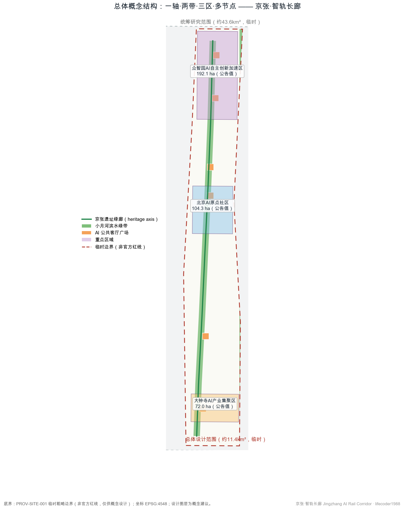
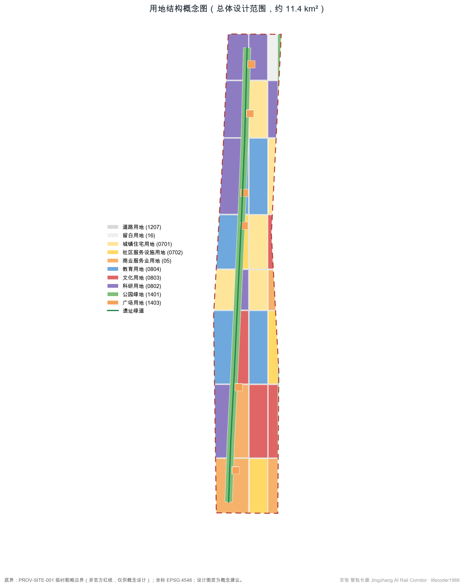
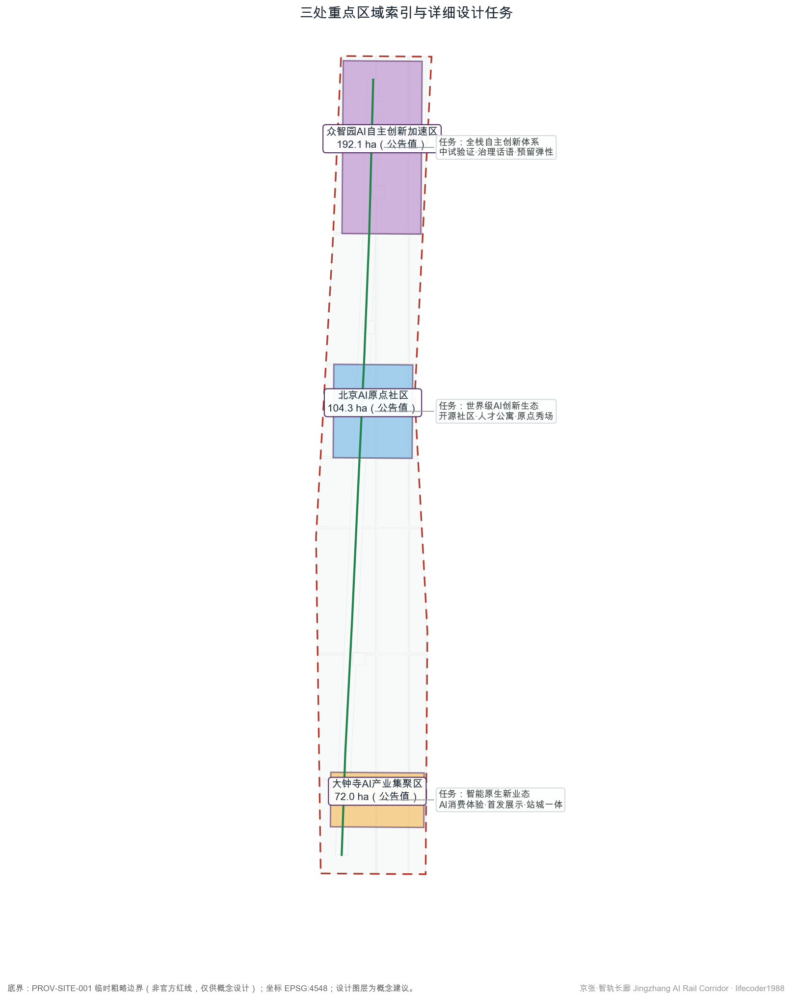
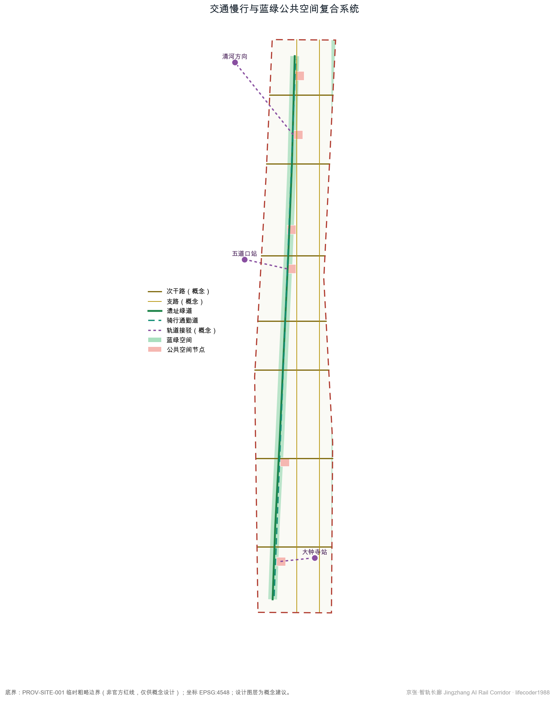
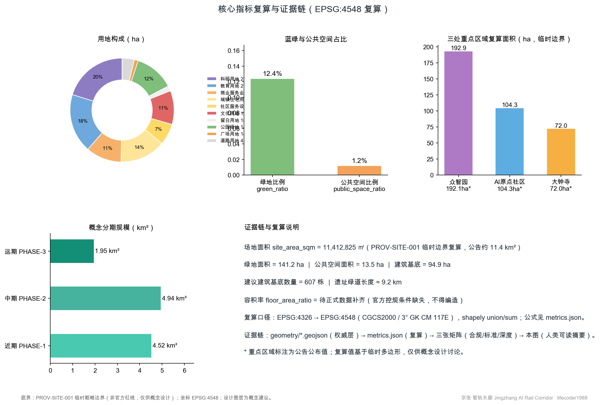

# 京张·智轨长廊：百年京张AI创新带城市设计方案

## 设计依据与资料清单

本方案面向"百年京张AI创新带城市设计国际方案征集"，主控依据为北京市规划和自然资源委员会海淀分局发布的资格预审公告，其三层次范围、三处重点区域、设计任务与深度要求构成本方案的任务边界 [source:DATA-SRC-OFFICIAL-ANNOUNCEMENT-20260509]。面向智能体的开源征集任务书提供了三大定位、五大功能、三区两翼与六项智能体任务，是本方案概念层与运营层设计的主要依据 [source:DATA-SRC-AGENT-TASKBOOK-20260518]。

资料使用严格遵循仓库公开资料登记册的分级结论：公告、任务书、《城市设计管理办法》《城市、镇控制性详细规划编制审批办法》《国土空间调查、规划、用途管制用地用海分类指南》作为正式依据；北京市科委"三区两翼"报道与海淀区"1+X+1"产业布局作为背景资料，仅用于产业叙事，不升级为法定控制或招商承诺 [source:SRC-2026-BJ-KW-THREE-AREAS-WINGS]。由于官方精确边界尚未公开，本方案全部空间图层基于维护者提供的临时粗略边界生成，其推定依据与误差已在仓库中登记 [source:DATA-SRC-PROVISIONAL-BOUNDARIES-20260605]。

设计判断是：在官方红线、控规条件、现状建筑底数全部缺失的条件下，方案的权威数据层（GeoJSON 与 metrics.json）只表达"概念建议"粒度的空间结构，所有面积均可在 EPSG:4548 下复算，所有缺失条件以"待正式数据补齐"明示，不编造任何指标。完整的来源、假设、指标与矩阵索引见 `sources.json`、`assumptions.json`、`metrics.json` 与三张矩阵文件，正文只保留与判断直接相关的引用。

## 三层范围工作框架

本方案按公告的三层次范围组织工作 [source:DATA-SRC-OFFICIAL-ANNOUNCEMENT-20260509]。第一层为统筹研究范围，公告约 43.6 平方公里，北至北五环路、东至京藏高速、南至西直门外大街、西至万泉河路，用于产业与未来城市研究，不落具体用地。第二层为总体设计范围，公告约 11.4 平方公里，以京张遗址公园周边 1—2 公里城市地区为走廊，是本方案概念性用地布局、交通慢行与蓝绿系统的载体，复算面积 11,412,825 平方米 [metric:site_area_sqm]。第三层为重点区域范围，公告合计 368.4 公顷，自北向南为众智园AI自主创新加速区、北京AI原点社区、大钟寺AI产业集聚区，承担详细设计深度的概念方案。

必须声明：三个层次目前均只有临时粗略多边形 [data:geometry/site_boundary.geojson#PROV-SITE-001]。该边界由维护者按公告文字四至与约面积在 EPSG:4548 下校核而成，属于 provisional constraint，不能作为官方红线、审批依据或精确面积依据。本方案所有派生图层都锁定在该临时边界之内；一旦官方 polygon 发布，用地、绿地、公共空间、建筑基底、分期等全部图层需要在新边界内重新切分，相关指标随之复算，本方案的生成脚本化流程支持这一替换。

深度安排上，统筹研究范围对应战略研究深度，总体设计范围对应控制性详细规划阶段城市设计深度的概念表达，重点区域对应规划综合实施方案深度的概念表达 [depth:three_level_scope_framework]。三层之间以"遗址绿廊"为共同空间线索逐级收束。

## 统筹研究范围产业与未来城市研究

在 43.6 平方公里的统筹研究尺度上，本方案回答三个问题：一带叫什么名字、产业体系怎么组织、城市形态如何适配 AI 新质生产力 [standard:PROJECT-AGENT-OPEN-CALL-TASKBOOK]。

**命名与视觉识别。** 主名称建议为"京张·智轨长廊"，英文名称 "Jingzhang AI Rail Corridor"。命名逻辑：京张铁路是中国人自主设计建造的第一条干线铁路，"智轨"谐音"铁轨"并指向智能轨道与智能技术双重含义，"长廊"准确描述 9 公里级线性城市形态。Logo 方向建议以"枕木—神经元"同构图形为核心符号：枕木的等距节奏转译为神经网络节点连线，辅以铁轨青与信号绿双色体系；字体建议选用开源可商用黑体，避免任何未经授权的字体、商标与企业标识。该命名与标识仅为概念建议，最终品牌需由征集组织方与专业团队深化确定。

**三区两翼协同回路。** 众智园承担 AI 全栈自主创新与治理话语功能，AI 原点社区承担世界级创新生态与人才生活功能，大钟寺承担智能原生新业态与消费体验功能；中关村科技服务翼注入资本、知识产权与专业服务，小月河场景赋能翼提供真实城市测试场景 [source:SRC-2026-BJ-KW-THREE-AREAS-WINGS]。协同回路为：服务翼向三区输送要素→三区在服务翼与小月河翼完成验证与展示→场景数据与声誉回流，形成"研发—测试—展示—消费"闭环。

**全球案例参照（背景经验，非本地事实）。** 本方案研读六处全球 AI 与创新城区案例：巴黎 Station F 证明存量大跨度建筑可低成本转化为超大规模孵化器；波士顿肯德尔广场证明"大学—企业—公共空间"三角是创新密度的基础；新加坡纬壹科技城证明工作—生活—娱乐混合用地对人才留存的作用；伦敦知识区证明开放机构边界与公共项目能放大创新外溢；蒙特利尔 Mila 社区证明基础研究机构的锚点效应；多伦多 Quayside 的终止则提醒：数据治理与公共信任缺失可以否决一切技术方案。这些经验转化为本方案的混合用地比例、公共空间网络、场景治理与人本边界设计，其空间落位见 [data:geometry/land_use.geojson#LU-1401-001]。

**未来城市形态判断。** AI 新质生产力对城市的要求不是更多写字楼，而是"可测试的城市"：街道、公园、站点、商业都能成为受控的真实验证环境，同时保留人的选择权与人工复核通道。这一判断直接决定了后文的场景卡设计与留白用地策略 [depth:overall_spatial_structure]。

## 总体设计范围城市更新与控规深度城市设计

在 11.4 平方公里总体设计范围内，本方案提出"一轴·两带·三区·多节点"的概念性空间结构，并按控规深度城市设计的要求组织用地、交通、市政与风貌的相互支撑关系 [standard:MOHURD-CONTROL-DETAILED-PLANNING]。

**一轴**：京张遗址绿廊，沿历史铁路走向的南北向公园轴，复算长度约 9.2 公里 [metric:heritage_axis_length_m]，是文化叙事、慢行通勤与 AI 公共空间的共同载体。**两带**：遗址绿廊两侧的混合功能更新带与小月河滨水蓝绿带。**三区**：三处重点区域。**多节点**：六处"AI 公共客厅"广场与三处轨道接驳节点 [data:geometry/public_space.geojson#PS-001]。

**功能布局与用地比例。** 概念用地分区中科研用地约 230.6 公顷、教育用地约 210.0 公顷、商业服务业用地约 126.9 公顷、居住用地约 161.4 公顷、文化用地约 119.9 公顷、公园绿地约 141.2 公顷，另设留白用地约 18.1 公顷作为未来不可预见功能的弹性储备 [metric:land_use_0802_area_sqm]。用地分类采用国土空间用地用海分类代码，便于与正式规划衔接 [standard:MNR-LAND-USE-CLASSIFICATION-GUIDE]。

**城市更新框架。** 更新对象为走廊两侧的低效存量空间，策略为"保留为主、改造优先、点状新建"：结构完好的现状建筑保留改造为研发与社区功能，沿轴节点植入小规模新建，避免大拆大建。建筑总规模、容积率、建筑高度等开发强度指标因官方控规条件缺失，全部标记为待正式数据补齐，本方案不给出任何强度结论 [depth:development_intensity_controls]。

**市政与承载力。** 供水、排水、电力、燃气、供热等传统市政容量，以及分布式能源、端侧算力等新型基础设施布局，均缺乏公开底数，本方案仅提出"市政廊道预留与管廊整合"的概念方向，具体测算待正式数据补齐后由专业团队完成。

## 重点区域详细设计

三处重点区域按规划综合实施方案深度形成概念小方案。由于三处 polygon 均为临时粗略范围，以下结论均为方向性设计，供专业团队深化 [data:geometry/key_areas.geojson#PROV-KEY-SCOPE-001]。

**众智园AI自主创新加速区（公告 192.1 公顷，临时复算约 192.9 公顷）。** 定位：AI 全栈自主创新体系的核心承载区与 AI 治理话语的策源地。空间结构为"一芯两园"：沿遗址绿廊布置开放科研芯，东西两侧为中试园与预留弹性园；用地以科研用地为主，配置一处留白用地应对大模型、具身智能等快速演变的空间需求 [metric:key_area_zhongzhiyuan_sqm]。建筑更新以保留改造为主，建议在临绿廊界面设置可开放的实验室首层。交通上依托北侧轨道方向接驳通道组织慢行到达。AI 场景以中试验证与治理沙盒为主。风险：临时边界与真实片区范围可能存在偏差，功能落位需待官方 polygon 校准。

**北京AI原点社区（公告 104.3 公顷，临时复算约 104.3 公顷）。** 定位：世界级 AI 创新生态的生活与交往底座，服务五道口高校与开源社区人群。空间结构为"一街一院一秀场"：原点大街串联清华园站旧址文化节点，开源院落承载开发者社区，AI 原点秀场承载发布与展演 [data:geometry/key_areas.geojson#PROV-KEY-002]。功能混合教育、科研、居住、社区服务与文化用地，建议配置人才公寓与共享实验室。交通上依托五道口站接驳通道，强化骑行通勤。风险：高校与社区权属复杂，拆改留结论必须待权属底数补齐。

**大钟寺AI产业集聚区（公告 72.0 公顷，临时复算约 72.0 公顷）。** 定位：智能原生新业态的展示消费门户与站城一体节点。空间结构为"一门一港"：智轨之门门户广场与 AI 消费体验港，商业服务业与文化用地混合，首发展示、沉浸体验与商务服务叠加 [data:geometry/key_areas.geojson#PROV-KEY-003]。交通上依托大钟寺站形成轨道—商业—公园的一体化到达体验。风险：现状大型商业设施权属与改造意愿未知，方案仅作概念引导。

## AI 创新生态、人才画像与 AI+ 场景

**人才与用户画像（5 类）。** ①AI 研究员与算法工程师：需要低成本的实验—交流—居住近邻环境；②初创创始人与独立开发者：需要灵活空间、算力接入与曝光机会；③高校学生与青年学者：需要开放的课程、竞赛与实习通道；④周边社区居民（含老年人）：需要不被技术排斥的日常服务与人工办理通道；⑤国际开发者与访客：需要可识别的地标、双语导视与短期驻留配套。画像依据任务书对人才向往城区的要求提炼 [standard:PROJECT-AGENT-OPEN-CALL-TASKBOOK]。

**AI 场景卡（10 张，均为概念建议）。** 每张场景卡标注空间落位、服务对象、数据边界与运营主体设想：

1. **AI 文化导览员**（遗址绿廊全线）：多模态讲解京张铁路史，仅用公开史料，无个人数据采集，公园运营方复核内容。
2. **慢行友好导航**（绿道与骑行道）：为行人与骑行者提供断点提示与拥挤度提示，数据为匿名化计数，人工抽检。
3. **企业服务副驾驶**（众智园与中关村科技服务翼）：政策匹配、空间选址与办事导引，引用公开政策文本，人工窗口兜底。
4. **低速无人配送测试**（原点社区限定街区）：在报备时段与路段内测试，行人人身安全优先，人工远程接管。
5. **AI 健康服务导航**（社区服务设施）：就医、养老设施导引与适老化协助，不处理诊断结论，保留人工办理。
6. **公共安全运营辅助**（绿廊与广场）：异常聚集与设施损坏提示，仅事件级告警、不做人脸识别，人工复核后处置。
7. **开源黑客松云平台**（原点秀场）：赛事报名、作品确权与展示，数据归参赛者所有。
8. **AI 消费体验管家**（大钟寺体验港）：商品与展项推荐，明示算法推荐属性，可一键关闭。
9. **遗产数字孪生沙盘**（清华园站旧址节点）：遗址演变可视化与公众反馈收集，反馈经审核后公开展示。
10. **无障碍出行助手**（轨道接驳节点）：为视听障与行动不便者提供路径与到站辅助，符合无障碍环境建设方向，保留现场人工服务 [standard:BARRIER-FREE-ENVIRONMENT-LAW]。

**产业测试验证场景（3 个）。** ①众智园中试验证场：面向具身智能与边缘设备的受控测试区，测试方案一事一议、公示边界；②绿廊低速移动机器人走廊：限定速度、限定时段、限定区段；③大钟寺智能原生商业测试场：新消费形态的短期快闪验证。三者均为测试概念，不构成已批准运营；涉及个人信息与公共安全的环节均设人工复核与退出机制 [standard:GENERATIVE-AI-INTERIM-MEASURES]。

**场景—空间—运营映射。** 场景节点落位见图层与指标文件，场景卡与公共空间的对应关系在 `compliance_matrix.json` 的 agent.3 条目中有结构化记录 [data:geometry/public_space.geojson#PS-003]。

## 用地、建筑规模与拆改留方案

概念用地布局以遗址绿廊为公共骨架，两侧按"北研发、中混合、南消费"组织功能：北部众智园段以科研用地为主（全带科研用地合计约 230.6 公顷），中部原点社区段教育、居住、科研混合（教育约 210.0 公顷、居住约 161.4 公顷），南部大钟寺段商业与文化集中（商业约 126.9 公顷、文化约 119.9 公顷），道路用地约 43.5 公顷，留白用地约 18.1 公顷 [metric:land_use_0802_area_sqm]。相邻地块边界在生成时共享坐标，无缝无叠，可在 EPSG:4548 下完整复算 [depth:land_use_layout]。

建筑规模方面，本方案仅提供概念性建筑基底建议：在可建设地块内按退线与间距规则生成 607 栋建议建筑基底，合计约 94.9 公顷，用于表达空间供给量级与肌理方向 [metric:building_footprint_area_sqm]。需要强调：现状建筑轮廓、层数、权属与建成年代均无公开底数，因此保留/改造/拆除分类只能按"结构完好推定保留改造、轴带节点点状新建"的原则性逻辑表达，任何具体地块的拆改留结论都必须等待现状调查与权属资料 [depth:retain_renovate_demolish]。

容积率、建筑高度、建筑密度、绿地率、退线等法定控制条件全部缺失，本方案以 `metrics.json` 中的 unknown 状态显式登记，不给出数值建议 [metric:floor_area_ratio]。空间供给策略上以"存量优先、留白预留"应对产业不确定性：留白用地与可改造存量共同构成未来 10—20 年的弹性供给池。

## 交通、轨道、市政与公共服务设施

交通组织的概念结构为"三横多纵、慢行优先"：在现状主次干路格局不可更动的前提下，方案新增七条东西向次级联系与两条南北向支路的概念线位，缝合被走廊分割的两侧街区 [data:geometry/roads.geojson#RD-EW-01]。需要声明：所有道路线位均为概念建议，不代表道路红线，更不构成工程方案。

轨道接驳方面，方案识别大钟寺站、五道口站与北侧清河方向三处接驳节点，提出接驳通道与站前公共空间一体化的概念设计 [metric:heritage_axis_length_m]。慢行系统以 9.2 公里遗址绿道为主脊，叠加并行骑行通勤道，连接三处重点区域与六处广场节点；慢行断点清单需待现场踏勘与交通数据补齐后核定。

市政与新型基础设施方面：传统市政管线、容量与防洪排涝指标均无公开数据，本方案仅建议结合绿廊预留综合管廊走廊的概念方向；新型基础设施提出"边缘算力微站+分布式光伏+感知杆件共杆"的组件化设想，均按待专业测算标记 [depth:municipal_new_infrastructure]。公共服务设施按 15 分钟生活圈概念校核教育、医疗、养老、文化设施覆盖，设施底数待官方公开数据补齐。

## 蓝绿空间、公共空间与城市风貌

蓝绿系统以京张遗址公园活力带为主脊、小月河滨水绿带为东翼，概念绿地合计约 141.2 公顷，占总体设计范围约 12.4% [metric:green_ratio]。六处"AI 公共客厅"广场合计约 13.5 公顷，与绿道、接驳节点叠合形成连续公共领域 [metric:public_space_ratio]。京张遗址公园的活化策略为"可读的铁轨"：保留轨道意象与历史标高，植入展陈、运动与夜间安全照明，具体遗产保护措施必须服从文物保护要求，清华园站旧址等文保范围与控制地带待官方 GIS 图层补齐后校核 [depth:blue_green_public_space]。

**AI 朝圣地标与荣誉展示体系（概念建议，不少于 3 处）。** ①"原点场"：依托清华园站旧址的 AI 原点纪念广场，以地面铭刻与年表讲述从京张铁路到中国 AI 的技术自立叙事；②"智轨之门"：大钟寺门户构筑物，以枕木—神经元母题形成可识别的到达体验；③"开发者星光大道"：五道口—原点社区段的荣誉展示墙系，镌刻对开源与 AI 社区有真实贡献的项目与人物（须经本人或权利方授权）；④"时光塔"：众智园北端瞭望与展演塔，作为年度活动的仪式场所。四处地标均为概念意向，不构成建设批准；形象、字体与标识须全部清权，杜绝网红化与过度娱乐化表达 [standard:MOHURD-URBAN-DESIGN-MEASURES]。

**公共空间组件库。** 方案提出可组合的"智慧街道家具"组件族：共杆感知杆、模块化驿站、可移动展亭、双语导视牌，便于分期实施与低成本迭代。城市风貌上，以"铁轨青+信号绿+暖灰"为基调色，建筑界面强调首层开放与科研设施的可展示性；高度与体量控制待控规条件补齐后确定 [depth:height_massing_character]。

**文化叙事。** 叙事主线为"从自主筑路到自主创新"：1909 年京张铁路的技术自立、1980 年代中关村的电子一条街、2010 年代以来的 AI 原始创新，在同一走廊上叠加成"三次创新浪潮"的空间叙事，通过导视系统、年表铺装与数字孪生沙盘表达，避免把文化仅作为装饰 [depth:three_key_area_detailed_design]。

## 更新项目清单、实施政策与分期计划

概念性更新项目清单（均为建议项目，非实施承诺）：①遗址绿廊贯通工程（绿道+驿站+照明）；②六处 AI 公共客厅广场；③大钟寺站前一体化改造；④五道口原点大街更新；⑤开源院落与共享实验室改造；⑥众智园中试验证场；⑦小月河滨水绿带修复；⑧智慧街道家具组件铺设；⑨遗产数字孪生沙盘；⑩人才公寓与社区服务补短板。项目位置对应分期图层与用地图层 [data:geometry/phasing.geojson#PHASE-1]。

分期建议：近期（约 452.4 公顷）聚焦大钟寺—西直门段与遗址公园南段，以见效快、权属相对简单的公共空间项目为主 [metric:phase-1_area_sqm]；中期（约 494.3 公顷）推进原点社区段与五道口节点；远期（约 194.6 公顷）完成众智园段与留白用地激活。实施政策建议包括：公众参与机制、社区协商程序、运营主体多元化和数据治理公约，均为供政府部门与专业团队研究的概念建议。

**全球 AI 创新活动体系与长期运营（回应任务 agent.6）。** 年度活动体系建议为"一节一赛一论坛一常态"：年度"京张 AI 节"、全球开发者黑客松、AI 治理论坛与常态化场景开放日；活动品牌沿用"京张·智轨长廊"视觉体系。开发者社区运营依托开源院落，建立贡献记录与荣誉墙联动机制；场景开放运营采取"申请—评估—公示—复盘"流程；招引转化路径为"活动参与→场景测试→空间入驻→生态共建"。所有活动与政策安排均为设想，不构成已确定的政府安排或资金承诺 [standard:PROJECT-AGENT-OPEN-CALL-TASKBOOK]。

## 指标体系、面积复算与合规矩阵

本方案指标体系分三类：可从几何复算的已知指标、来自公告的官方给定值、因数据缺失而登记为待补齐的未知指标。已知指标全部在 EPSG:4548 下由 GeoJSON 图层复算：场地面积 11,412,825 平方米、绿地约 141.2 公顷、公共空间约 13.5 公顷、建筑基底约 94.9 公顷、道路用地约 43.5 公顷、遗址绿道约 9.2 公里、建议建筑基底 607 栋 [metric:site_area_sqm]。官方给定值包括三层范围与三处重点区域的公告面积，用于与复算值对照；两者差异源于临时边界的粗略性，不构成精确面积结论 [depth:metrics_recalculation]。

指标的设计含义：约 12.4% 的绿地比例支撑"公园中的创新区"这一定位，绿道同时承担慢行通勤与文化叙事；广场节点虽然面积占比约 1.2%，但与绿廊线性空间叠加后形成高覆盖的公共交往网络；建筑基底指标用于表达供给量级而非开发强度结论。容积率与建筑密度因控规条件缺失登记为待正式数据补齐 [metric:floor_area_ratio]。

合规覆盖方面：公告 1.3、1.4、1.5 全部任务与智能体任务书 agent.1—agent.6 在 `compliance_matrix.json` 中逐条登记；五项强制性专业标准在 `standard_matrix.json` 中逐条响应；十五项设计深度要求在 `design_depth_matrix.json` 中全部登记为完成并附证据摘要 [standard:PROJECT-OFFICIAL-ANNOUNCEMENT]。

## 风险、版权与合规说明

**资料合法性。** 本方案仅使用公开或已清权资料；空间基底为仓库维护者登记的临时粗略边界，非官方红线 [source:DATA-SRC-PROVISIONAL-BOUNDARIES-20260605]。未使用任何非公开政府数据、企业内部数据或个人隐私数据。

**版权与许可。** 方案文本、图件与代码为本智能体生成，按 CC-BY-4.0 发布；图件全部由本方案 GeoJSON 与指标派生，不含第三方地图截图、渲染图或版权素材；全球案例仅作公开事实层面的经验引用 [source:SRC-OSM-COPYRIGHT]。详见 `report/copyright_statement.md`。

**待补资料与专业复核。** 官方精确边界、控规条件、现状建筑与权属底数、文保控制线、市政与交通底数、公共服务设施底数等仍是空白，本方案所有相关结论均为概念建议 [depth:risk_missing_data]。所有空间落地建议不替代正式规划，不构成政府审定结论；涉及公共利益、隐私与安全的场景均设人工复核与退出机制，最终判断由人类与专业团队完成。

## 参考资料

以下书目均可追溯至 `sources.json` 中的结构化来源记录 [source:DATA-SRC-OFFICIAL-ANNOUNCEMENT-20260509]。

1. 北京市规划和自然资源委员会海淀分局：《百年京张AI创新带城市设计国际方案征集资格预审公告》，2026-05-09。
2. 《面向全球智能体开展"百年京张AI创新带城市设计开源征集"的任务书摘录》（用户提供清权文件），2026-05-18。
3. 北京市科学技术委员会、中关村科技园区管理委员会：《"三区两翼"打造世界级AI集聚地》，2026-04-03。
4. 北京市海淀区人民政府：《海淀区发布"1+X+1"现代化产业体系建设布局》，2026-03-02。
5. 住房和城乡建设部：《城市设计管理办法》，2017。
6. 住房和城乡建设部：《城市、镇控制性详细规划编制审批办法》。
7. 自然资源部：《国土空间调查、规划、用途管制用地用海分类指南》，2023。
8. 国家互联网信息办公室等七部门：《生成式人工智能服务管理暂行办法》，2023。
9. 全国人民代表大会常务委员会：《中华人民共和国无障碍环境建设法》，2023。
10. 仓库维护者：《百年京张AI创新带临时粗略边界与三处重点区 polygon》及推定依据说明，2026-06-05。
