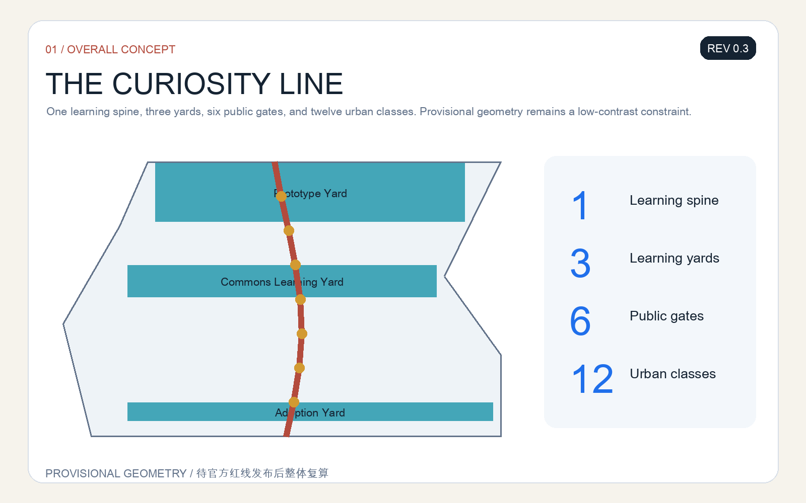
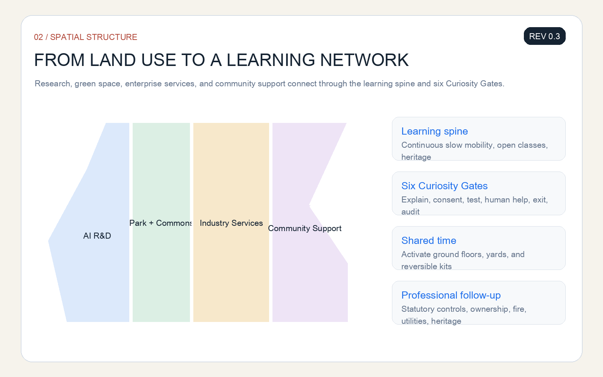
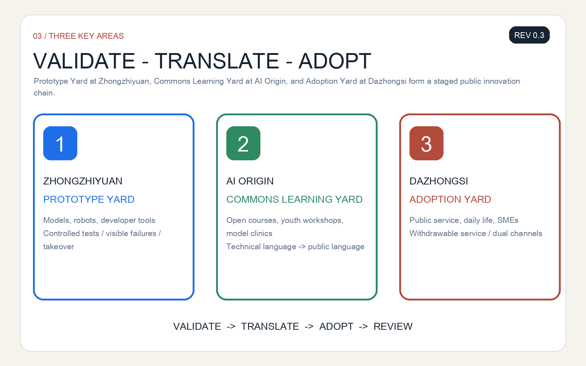
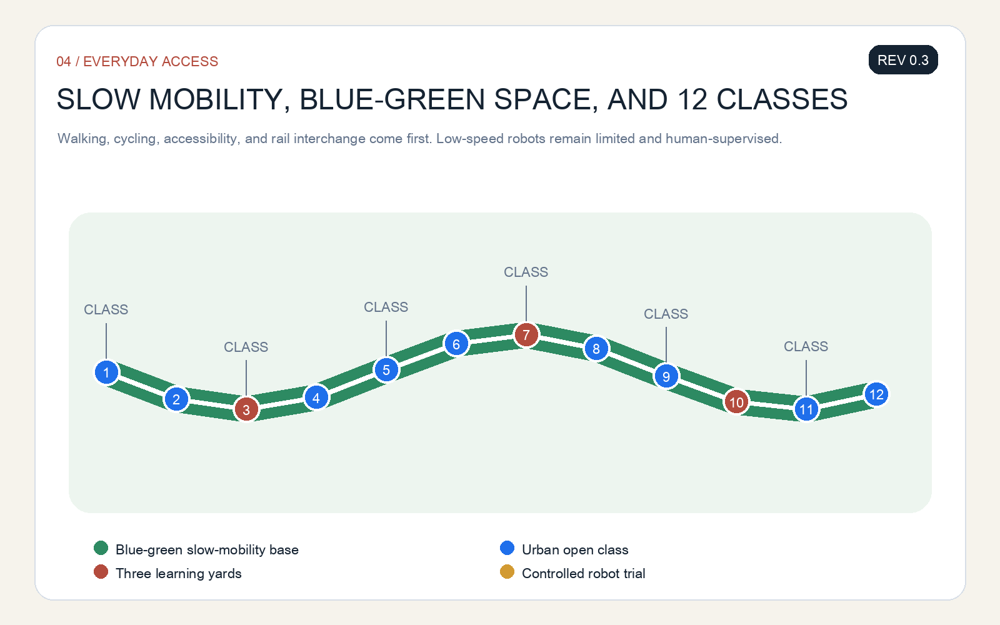
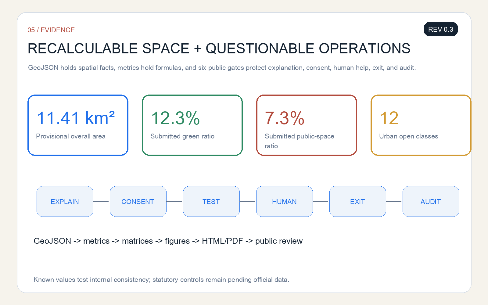

# THE CURIOSITY LINE

> Every spatial intervention is an open co-creation concept, reference scheme, or material for professional teams to develop. It does not replace statutory planning or constitute an approved government decision.

This public pre-submission draft is **REV 0.3 (2026-08-10)**. It includes bilingual narratives, five bilingual core figures, bilingual A3/A0 documents, offline HTML, and structured self-checks. The next iteration will respond to community feedback and recalculate the package when official polygons are published.

The Curiosity Line turns the Centennial Jing-Zhang corridor from a display of technology into a city school without walls. Everyone can understand what an AI system is doing, ask questions, join a controlled trial, choose a human service, and feed experience into the next design cycle. Its framework is “one spine, three learning yards, six public gates, and twelve urban classes”: a heritage-park learning spine; three key areas for prototype validation, public translation, and urban adoption; six rights-based gates controlling the passage from experiment to everyday life; and twelve scenarios linking industrial innovation with civic life. [source:AGENT-TASKBOOK] [depth:overall_spatial_structure]

## Design Basis and Source List

The proposal is based on the official open-call announcement, the Agent taskbook, the site package, local snapshots of professional standards, and the public source registry. The announcement defines the three scope levels, three key areas, and submission depth. The site package supplies machine-readable boundaries, enums, metrics, and validation rules. Professional standards guide public space, accessibility, land-use representation, and regulatory-plan-level language. [source:OFFICIAL-ANNOUNCEMENT] [standard:MOHURD-URBAN-DESIGN-MEASURES] [depth:existing_conditions_diagnosis]

Official precise polygons for the overall area and the three key areas are not yet available in the repository. The proposal therefore uses `provisional_boundaries.geojson` only for conceptual generation, visual communication, and intake validation. Every area-sensitive result must be recalculated when official polygons arrive. [source:BOUNDARY-SOURCE] [data:geometry/site_boundary.geojson#SITE-001]

Six public international references are used as mechanism studies, not as spatial templates: Singapore one-north for research-industry-life mixing; Paris-Saclay for research networks; London Knowledge Quarter for institutional collaboration; Toronto MaRS for translation and venture support; Cambridge Kendall Square for innovation-district interfaces; and Seoul DMC for media technology and public experience. They do not support statutory planning parameters for Jing-Zhang.

## Three-Level Scope Framework

Across the 43.6-square-kilometre coordinated research area, the proposal maps a next-generation AI literacy and talent ecosystem linking universities, research institutes, enterprises, communities, cultural facilities, and public services. Within the approximately 11.4-square-kilometre overall design area, it organizes the public learning spine, east-west walking connections, community learning gates, and enterprise interfaces. In the three key areas, it provides spatial prototypes and operating ledgers for professional development. [source:SITE-PACKAGE] [depth:three_level_scope_framework]

The three levels form one feedback chain. Strategic questions become spatial and service tasks; limited trials take place in the key areas; residents, professionals, and operators then review the result. Each trial needs a fixed term, a named human owner, and an exit path.

## Coordinated Research Area: Industry and Future City Research

The Curiosity Line expands the definition of talent from people who already possess AI skills to people who can understand, question, collaborate with, and continue learning about AI. Its six primary user groups are children and caregivers; teenagers and young creators; university students and researchers; start-ups and small enterprises; residents and older adults; and public-service and urban-maintenance staff. Each group is paired with accessible space, a non-digital alternative, human help, and a feedback route. [source:AGENT-TASKBOOK] [depth:existing_conditions_diagnosis]

The six international references are translated into six local mechanisms: mixed use, institutional alliances, shared instruments, open challenges, public-facing neighbourhood interfaces, and continuous public communication. In Jing-Zhang these become a loop of shared labs, public classes, scenario commissioning, civic review, and annual reflection, without assuming named tenants, investment amounts, or policy commitments.

The AI ecosystem includes land, space, talent, compute, data, scenarios, compliance, and capital. Urban design defines interfaces rather than promises: how shared space is booked, how test zones are separated, how public data is registered, how people appeal, and how validation knowledge becomes reusable. [standard:MOHURD-CONTROL-DETAILED-PLANNING] [depth:municipal_new_infrastructure]

## Overall Design Area: Urban Renewal and Regulatory-Plan-Level Urban Design

The overall structure is “one spine, three learning yards, six gates, and twelve classes.” The spine follows the Jing-Zhang Heritage Park as a continuous learning and slow-mobility interface. The three yards are the Prototype Yard at Zhongzhiyuan, the Commons Learning Yard at the AI Origin Community, and the Adoption Yard at Dazhongsi. The six gates are explanation, consent, testing, human help, exit, and audit. [data:geometry/public_space.geojson#PUBLIC-001] [depth:overall_spatial_structure]

Renewal begins with light, reversible, and maintainable components: shade seating, open classrooms, movable displays, model cards, staffed help desks, controlled low-speed testing barriers, and feedback terminals. Building volume, road redlines, engineering alignments, ownership, and final retain-renovate-demolish decisions require statutory planning, survey, and professional assessment. [depth:retain_renovate_demolish] [standard:MOHURD-ARCH-DESIGN-DEPTH-2016]

## Detailed Design of Key Areas

**Zhongzhiyuan Prototype Yard** supports foundation models, robotics, and developer tools through controlled prototype fields, shared evaluation benches, and a “failures made visible” gallery. Industrial tests remain enclosed or semi-enclosed until safety, privacy, accessibility, and human-takeover checks are complete.

**AI Origin Commons Learning Yard** connects universities, communities, and international visitors through open courses, youth workshops, model clinics, and civic problem desks. It translates technical language into public language and preserves feedback from different ages.

**Dazhongsi Adoption Yard** supports commerce, daily life, and public services through withdrawable smart-service counters, an evening learning lounge, and an SME scenario-release desk. Adoption never means default automation: every service keeps a human channel, a written explanation, and a way to stop. [data:geometry/key_areas.geojson#PROV-KEY-003] [depth:three_key_area_detailed_design]

## AI Innovation Ecosystem, Personas, and AI+ Scenarios

Twelve “urban open classes” create an understandable, testable, and withdrawable scenario set: railway heritage AI guide; model-card kiosk; children’s generative creativity sandbox; youth robot repair class; co-testing of accessible navigation; multilingual learning assistant; public-service navigation; community model clinic; enterprise open challenge; low-speed delivery robot trial; public-safety operations review; and an annual public AI defence. The robot, accessibility, delivery, and operations-review classes are industrial validation scenarios and must be limited, logged, and human-owned. [source:AGENT-TASKBOOK] [depth:three_key_area_detailed_design]

The rule is “explain before consent; limit before expansion; provide human fallback before automation; allow both start and exit.” Children’s scenarios minimize data, prohibit biometric profiling, and exclude commercial recommendation. Health, education, and public-safety outputs remain advisory and require responsible human review.

## Land Use, Building Scale, and Retain-Renovate-Demolish Strategy

The provisional land-use partition fully covers the submitted boundary and organizes discussion around research and innovation, public green space, industrial services, and community support. [data:geometry/land_use.geojson#LU-001] [standard:MNR-LAND-USE-CLASSIFICATION-GUIDE] [depth:land_use_layout]

The building strategy follows “retain first, activate through small changes, add cautiously.” It retains usable research, education, community, and industrial-heritage assets; improves ground-floor interfaces through shared time and reversible components; and postpones major construction until ownership, structure, fire safety, heritage, and statutory planning conditions are known. FAR, height, and final development quantity remain pending official data. [metric:floor_area_ratio] [depth:development_intensity_controls]

## Transport, Rail, Municipal Infrastructure, and Public Services

Walking, cycling, accessible continuity, and rail interchange take priority. The six Curiosity Gates sit at major crossing points and public-service entrances. Low-speed robots use clearly marked controlled times and spaces, never occupy tactile paving or essential walking width, and switch to human control or pause under crowding, extreme weather, malfunction, or public complaint. [data:geometry/roads.geojson#ROAD-001] [depth:traffic_rail_slow_parking]

Public services use dual channels. Smart navigation, booking, and translation may improve access, but staffed service, telephone, or paper information must remain available. Municipal and digital infrastructure is expressed only as interface requirements subject to specialist review.

## Blue-Green Network, Public Space, and Urban Character

The public learning spine combines shade, rain gardens, quiet learning points, sport and play, turning exhibitions into spaces for everyday staying and discussion. Provisional boundaries appear as low-contrast dashed constraints, while the visual focus remains on continuous public space, east-west stitching, and learning routes between key areas. [data:geometry/green_space.geojson#GREEN-001] [metric:green_ratio] [depth:blue_green_public_space]

Three AI pilgrimage landmarks are public knowledge facilities rather than expensive monuments. **Kilometre Zero Open Class** links railway history with indigenous innovation; **Algorithm Playground** turns inputs, bias, and feedback into tangible interaction; **Future Ticket Hall** displays projects that were validated, paused, or improved. The identity system combines railway milestones, an open page, and a question-mark track in brick red, learning blue, and park green.

## Renewal Projects, Implementation Policy, and Phasing

The initial reversible opening kit includes six Curiosity Gates, three staffed help desks, twelve scenario cards, and one public learning route. A medium phase asks professional teams to develop the three yards, slow-mobility crossings, public-service interfaces, and shared labs. A long phase establishes an annual public AI defence, youth co-creation council, developer residency, scenario open days, and an international exchange week. [data:geometry/phasing.geojson#PHASE-001] [depth:phasing_implementation]

Each project uses the same operating card: owner, users, opening times, data list, human fallback, pause conditions, maintenance funding, and annual review. A scenario without an owner and exit mechanism does not proceed.

Phasing follows evidence maturity rather than a simple construction sequence. Phase one uses only activities, signs, movable components, and staffed services that do not depend on statutory planning change, testing whether people understand the service, choose to use it, and can leave it. Phase two begins after survey, ownership, fire-safety, traffic, and heritage conditions are available; professional teams then compare retention, light adaptation, and additional-space options and record trial results in the renewal list. Phase three considers shared laboratories, public-service interfaces, and international programmes that need durable funding, operating teams, and cross-agency coordination. If accessibility fails, the human channel disappears, data exceeds its declared scope, or maintenance responsibility is missing, the project pauses, shrinks, or returns to the previous phase rather than expanding because resources have already been spent. [depth:renewal_project_list] [source:AGENT-TASKBOOK]

## Metrics, Area Recalculation, and Compliance Matrix

Spatial metrics are recalculated from submitted GeoJSON in EPSG:4548. The provisional overall area is approximately 11.41 square kilometres, while green and public-space ratios come from their respective layers. These values test internal consistency and do not replace official area or statutory controls. [metric:site_area_sqm] [metric:green_ratio] [metric:public_space_ratio]

The Curiosity Line is also assessed by public-rights indicators: explanation coverage, human-channel availability, children’s data-minimization checks, accessible co-testing completion, pause response, and public-review completeness. These operating indicators remain pending until real baselines and accountable operators exist.

## Risk, Copyright, and Compliance

Key risks include provisional-boundary error, missing building and ownership baselines, unverified engineering conditions, protection of children’s data, erroneous AI output, accessibility failure, loss of human services, and unclear operating responsibility. Responses include visible qualification, limited trials, data minimization, human and non-digital alternatives, pause conditions, version and owner records, and full recalculation when official information arrives. [depth:risk_missing_data] [source:SOURCE-REGISTRY]

All figures are generated from submission GeoJSON, metrics, and text. The package uses no commercial map screenshot, remote image, or unauthorized trademark. The six international cases are referenced only through official public pages. The proposal is a submitted open co-creation concept, not evidence of selection, approval, investment commitment, or completed implementation.

## References

- Beijing Municipal Commission of Planning and Natural Resources, Haidian Branch: official prequalification announcement.
- Agent open-call taskbook excerpt.
- `brief/site-package/`: site package, standards snapshots, provisional geometry, and structured rules.
- Official public pages for Singapore one-north, Paris-Saclay, London Knowledge Quarter, Toronto MaRS, Cambridge Kendall Square, and Seoul DMC, used only for mechanism studies.
- Complete provenance, rights, assumptions, metrics, and coverage are recorded in `sources.json`, `assumptions.json`, `metrics.json`, and the three matrices. [source:SITE-PACKAGE]
