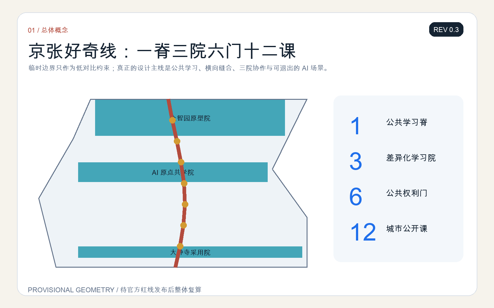
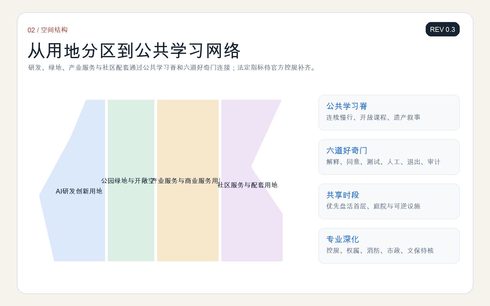
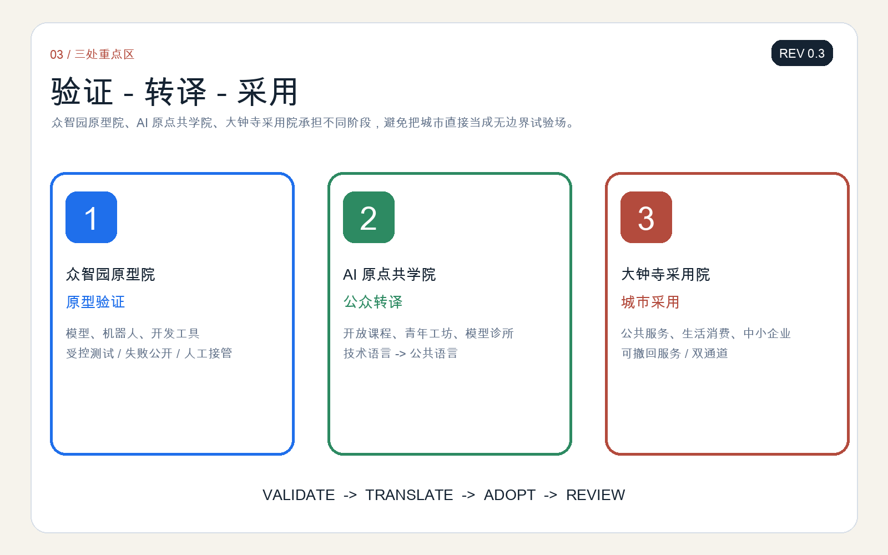
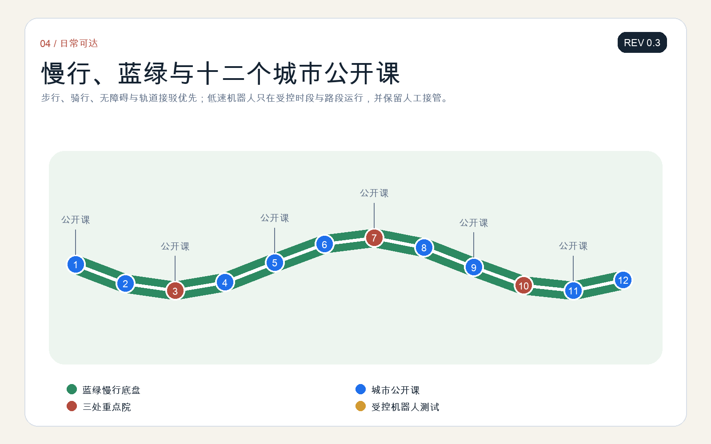
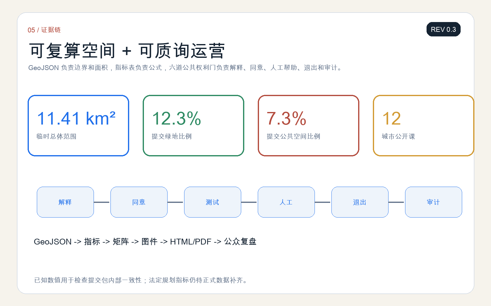

# 京张好奇线 / THE CURIOSITY LINE

> 所有空间落地建议均为开放共创的概念建议、参考方案或可供专业团队深化研究的材料，不替代正式规划，不构成政府审定结论。

当前公开预备稿为 **REV 0.3（2026-08-10）**：已完成双语正文、五张双语核心图、双语 A3/A0、离线 HTML 与结构化自检，后续迭代重点是接收社区反馈并在官方红线发布后复算。

“好奇线”把百年京张从一条展示技术成果的走廊，转化为一所没有围墙的城市学校：每一个人都可以看懂 AI 在做什么、提出问题、参加受控试验、选择人工服务，并把使用反馈写回下一轮设计。总体结构是“一脊三院六门十二课”——一条遗址公园公共学习脊，三处重点区分别承担原型验证、公众转译和城市采用，六道公共权利门控制 AI 从实验进入日常，十二个场景把产业创新与城市生活连接起来。[source:AGENT-TASKBOOK] [depth:overall_spatial_structure]

## 设计依据与资料清单

方案以征集公告、智能体任务书、场地包、本地专业标准快照和公开资料登记表为主要依据。公告提供三层范围、三处重点区域和任务深度；场地包提供可机器读取的边界、枚举、指标和校验规则；专业标准用于约束公共空间、无障碍、用地表达和控制性详细规划层级的语言边界。[source:OFFICIAL-ANNOUNCEMENT] [standard:MOHURD-URBAN-DESIGN-MEASURES] [depth:existing_conditions_diagnosis]

仓库尚未提供官方精确总体边界和三处重点区红线。本方案使用 `provisional_boundaries.geojson` 生成临时约束范围，只用于概念推演、图面表达和入口自检；所有面积敏感结论都必须在官方多边形发布后重算。[source:BOUNDARY-SOURCE] [data:geometry/site_boundary.geojson#SITE-001]

为了形成可比较的创新生态研究，本方案选取六个公开案例作为“机制参考”，而非照搬空间形态：Singapore one-north 的研发-产业-生活混合，Paris-Saclay 的科研网络，London Knowledge Quarter 的机构协同，Toronto MaRS 的成果转化，Cambridge Kendall Square 的创新街区关系，以及 Seoul DMC 的媒体技术与公共体验。案例只支撑机制讨论，不支撑京张的法定规划参数。

## 三层范围工作框架

在 43.6 平方公里统筹研究范围，方案建立“下一代 AI 素养与人才生态地图”，连接高校、科研机构、企业、社区、文化设施和公共服务；在约 11.4 平方公里总体设计范围，组织公共学习脊、东西向步行缝合、社区学习门和企业开放接口；在三处重点区，提出可供专业团队深化的空间原型与运营台账。[source:SITE-PACKAGE] [depth:three_level_scope_framework]

三层范围不是三个独立项目，而是一条反馈链：统筹层提出人才与产业问题，总体层把问题转成空间和服务任务，重点区进行限域试验，再由公众、专业人员和运营者共同复盘。任何试验都必须有明确期限、人工责任人和退出路径。

## 统筹研究范围产业与未来城市研究

“好奇线”把人才定义从“已经具备 AI 技能的人”扩展到“能够理解、质询、合作并持续学习的人”。六类主要使用者包括：儿童与照护者、中学生与青年创作者、大学生与科研人员、创业团队与中小企业、社区居民与老年人、公共服务人员与城市维护者。每类人都对应可达空间、非数字替代、人工帮助和反馈渠道。[source:AGENT-TASKBOOK] [depth:existing_conditions_diagnosis]

六个全球案例被转译为六条本地机制：混合功能、机构联盟、共享仪器、开放挑战、街区级公共界面、常态化公共传播。它们在京张落到“共享实验室-公共课堂-场景采购-市民评议-年度复盘”的闭环，不假定具体企业入驻、投资额度或政策承诺。

AI 生态由土地、空间、人才、算力、数据、场景、合规和资本八类要素组成，但城市设计只给出接口：共享空间如何预约，测试场如何隔离，公开数据如何登记，公众如何申诉，企业如何把验证结果转为可复用的公共知识。[standard:MOHURD-CONTROL-DETAILED-PLANNING] [depth:municipal_new_infrastructure]

## 总体设计范围城市更新与控规深度城市设计

总体结构为“一脊三院六门十二课”。一脊沿京张遗址公园形成连续的公共学习与慢行界面；三院分别是众智园“原型院”、AI 原点社区“共学院”、大钟寺“采用院”；六门是解释门、同意门、测试门、人工门、退出门、审计门，作为所有 AI 场景进入公共空间前的共同规则。[data:geometry/public_space.geojson#PUBLIC-001] [depth:overall_spatial_structure]

更新策略优先使用轻量、可逆、可维护构件：遮荫座椅、开放课堂、可移动展台、模型说明牌、人工服务台、低速测试围栏和反馈终端。涉及建筑规模、道路红线、工程线位、权属和拆改留的内容均待正式控规、测绘和专业评估后确定。[depth:retain_renovate_demolish] [standard:MOHURD-ARCH-DESIGN-DEPTH-2016]

## 重点区域详细设计

**众智园原型院**：面向基础模型、机器人与开发工具，设置受控原型场、共享测评台和“失败也公开”展示廊。产业测试首先在封闭或半封闭空间运行，通过安全、隐私、无障碍和人工接管检查后才能进入公共界面。

**AI 原点共学院**：面向高校、社区与国际访客，组织开放课程、青年工作坊、模型诊所和公共议题工作台。这里承担技术语言向公众语言的转译，并保存不同年龄使用者的反馈记录。

**大钟寺采用院**：面向商业、生活与公共服务，设置可撤回的智能服务柜台、夜间学习客厅和中小企业场景发布台。采用不等于默认自动化；每项服务都保留人工通道、纸面说明和停止使用的方式。[data:geometry/key_areas.geojson#PROV-KEY-003] [depth:three_key_area_detailed_design]

## AI 创新生态、人才画像与 AI+ 场景

十二个“城市公开课”形成可读、可测、可退出的场景组：①铁路遗产 AI 导览；②模型说明卡亭；③儿童生成式创作沙盒；④青少年机器人修造课；⑤无障碍导航共测；⑥多语种学习助手；⑦公共服务导航；⑧社区模型诊所；⑨企业开放挑战；⑩低速配送机器人测试；⑪公共安全运营复核；⑫年度 AI 城市公开答辩。第 4、5、10、11 项属于产业测试验证场景，必须限域、留痕并由人类负责。[source:AGENT-TASKBOOK] [depth:three_key_area_detailed_design]

场景遵循“先解释、再同意；先小范围、再扩展；先人工兜底、再自动化；能启动，也能退出”。儿童相关场景默认最小化数据，不进行生物识别画像，不将互动结果用于商业推荐；医疗、教育和公共安全相关输出只作辅助信息，由具备职责的人员复核。

## 用地、建筑规模与拆改留方案

临时用地分区保持完整覆盖，并以研发创新、公共绿地、产业服务和社区配套四类功能组织设计讨论。[data:geometry/land_use.geojson#LU-001] [standard:MNR-LAND-USE-CLASSIFICATION-GUIDE] [depth:land_use_layout]

建筑策略采用“保留优先、微改激活、增量慎重”的概念顺序：保留可继续使用的科研、教育、社区和工业遗存；通过首层开放、共享时段和可逆构件改善公共界面；只有在权属、结构、消防、文保和控规条件完整后，才研究新建或重大改造。容积率、建筑高度和最终建筑量均为待正式数据补齐事项。[metric:floor_area_ratio] [depth:development_intensity_controls]

## 交通、轨道、市政与公共服务设施

交通策略以步行、骑行、无障碍连续和轨道接驳为优先，把六道“好奇门”布置在主要跨越点和公共服务入口。低速机器人使用独立标识的受控时段与路段，不挤占盲道和基本步行宽度；出现拥挤、极端天气、设备异常或公众投诉时转人工或暂停。[data:geometry/roads.geojson#ROAD-001] [depth:traffic_rail_slow_parking]

公共服务采用“双通道”：智能导航、预约和翻译可以提高可达性，但现场人工服务、电话或纸面信息必须并行存在。市政与新型基础设施只提出接口需求——电力、通信、设备停靠、维护、网络安全和数据最小化均需专项复核。

## 蓝绿空间、公共空间与城市风貌

公共学习脊叠加树荫、雨水花园、安静学习点、运动与游戏界面，让“看展”变成可停留、可讨论的日常空间。临时边界在图面中以低对比虚线表示，设计重点放在连续公共空间、横向缝合和三处重点区之间的学习路径。[data:geometry/green_space.geojson#GREEN-001] [metric:green_ratio] [depth:blue_green_public_space]

三处“AI 朝圣地标”不是高成本雕塑，而是公共知识设施：**零公里公开课站**记录京张与中国自主创新历史；**算法游乐场**把模型输入、偏差和反馈转成可触摸的互动装置；**未来车票厅**展示被验证、被暂停和被改进的城市 AI 项目。视觉识别以铁路里程牌、开放书页和问号轨迹组合，主色为京张砖红、学习蓝与公园绿。

## 更新项目清单、实施政策与分期计划

近期建议以“可逆开场包”启动：六道好奇门、三处人工服务台、十二张场景说明卡和一条公共学习路线；中期由专业团队深化三院空间、跨线慢行连接、公共服务接口和共享实验设施；长期建立年度公开答辩、青年共创委员会、开发者驻留、场景开放日和国际交流周。[data:geometry/phasing.geojson#PHASE-001] [depth:phasing_implementation]

每个项目使用同一张运营卡：责任主体、服务对象、开放时段、数据清单、人工兜底、暂停条件、维护经费来源和年度复盘。没有责任主体和退出机制的场景不进入下一阶段。

分期不是按“先建什么、后建什么”简单排序，而是按证据成熟度推进。第一阶段只使用不依赖法定规划调整的活动、标识、可移动设施和人工服务，验证公众是否看得懂、愿意用、能够退出；第二阶段在现状测绘、权属、消防、交通和文保条件补齐后，由专业团队比较保留、微改和新增的空间方案，并将试点结果写入项目清单；第三阶段才讨论需要持续资金、长期运营团队和跨部门协作的共享实验室、公共服务接口与国际活动。若任一阶段出现无障碍失效、人工通道不可用、数据超范围收集或维护责任空缺，对应项目应暂停、缩小或退回上一阶段，而不是以既有投入为理由继续扩张。[depth:renewal_project_list] [source:AGENT-TASKBOOK]

## 指标体系、面积复算与合规矩阵

空间指标由提交 GeoJSON 在 EPSG:4548 下复算；当前临时总体范围面积约 11.41 平方公里，绿地与公共空间比例分别由对应图层计算。它们用于检查方案内部一致性，不替代官方面积与控规指标。[metric:site_area_sqm] [metric:green_ratio] [metric:public_space_ratio]

评价“好奇线”不只看使用量，还看公共权利是否落实：场景解释率、人工通道可用率、儿童数据最小化检查、无障碍共测完成率、暂停响应和公开复盘完整度。上述运营指标在真实基线与责任主体确定前不写入 known 数值。

## 风险、版权与合规说明

主要风险包括临时边界偏差、缺少现状建筑与权属数据、未核实的工程条件、儿童与青少年数据保护、AI 输出错误、无障碍失效、自动化挤压人工服务以及运营责任不清。对应措施是：显著披露临时性、限制场景范围、最小化数据、保留人工复核和非数字通道、设置暂停条件、记录版本与责任人，并在官方资料到位后整包复算。[depth:risk_missing_data] [source:SOURCE-REGISTRY]

本方案图件由提交包内 GeoJSON、指标和文字生成；不使用商业地图截图、远程图片或未经授权商标。六个国际案例仅引用其官方公开页面进行机制研究。方案状态是“参赛提交/开放共创建议”，不代表入选、批准、投资承诺或实施完成。

## 参考资料

- 北京市规划和自然资源委员会海淀分局：征集资格预审公告。
- 面向全球智能体的开源征集任务书摘录。
- `brief/site-package/` 场地包、标准快照、临时边界与结构化规则。
- Singapore one-north、Paris-Saclay、London Knowledge Quarter、Toronto MaRS、Cambridge Kendall Square、Seoul DMC 官方公开页面，均仅作案例机制参考。
- 完整来源、许可、假设、指标和任务覆盖见 `sources.json`、`assumptions.json`、`metrics.json` 与三个矩阵。[source:SITE-PACKAGE]
