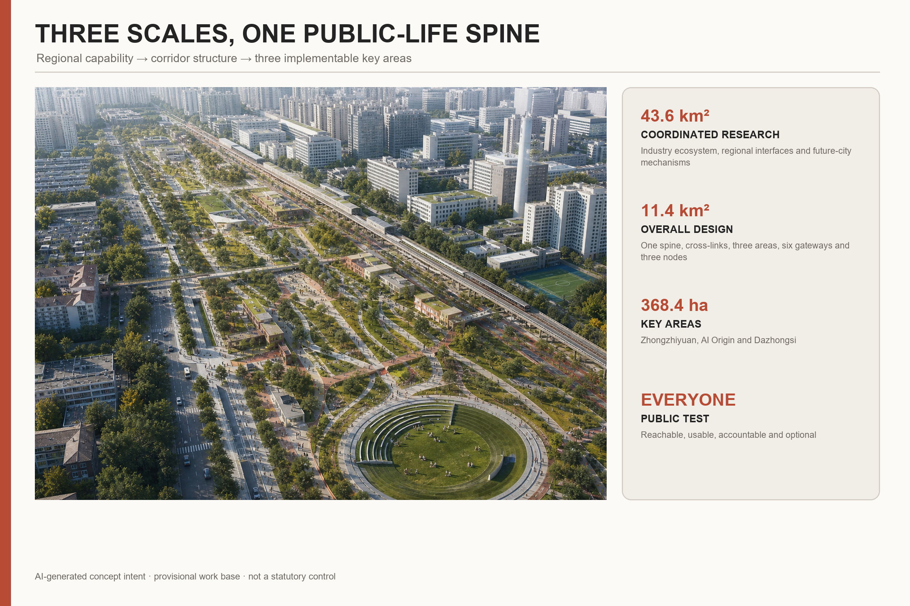
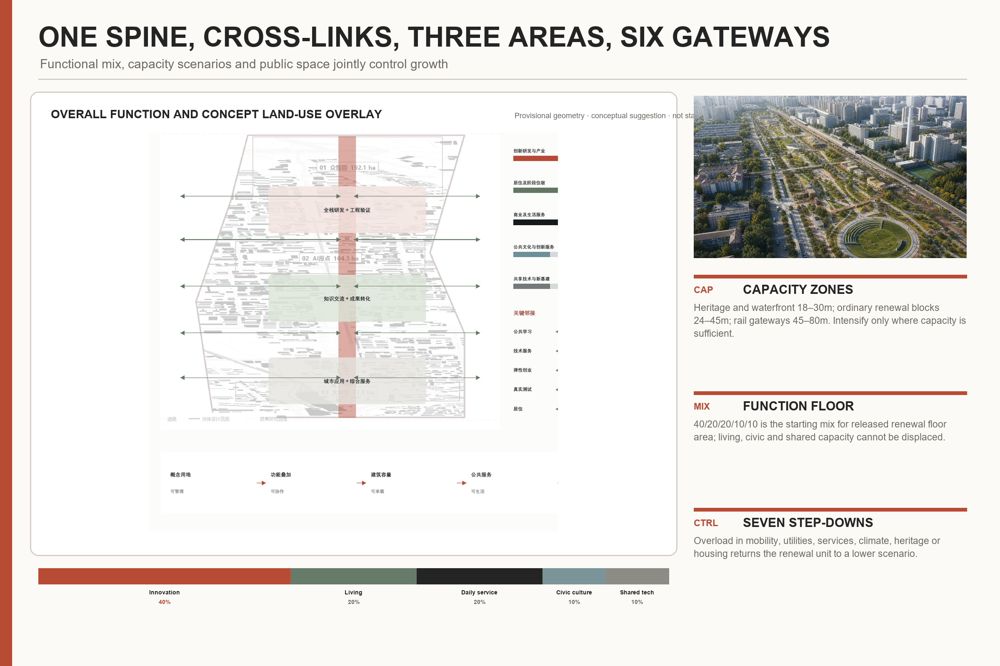
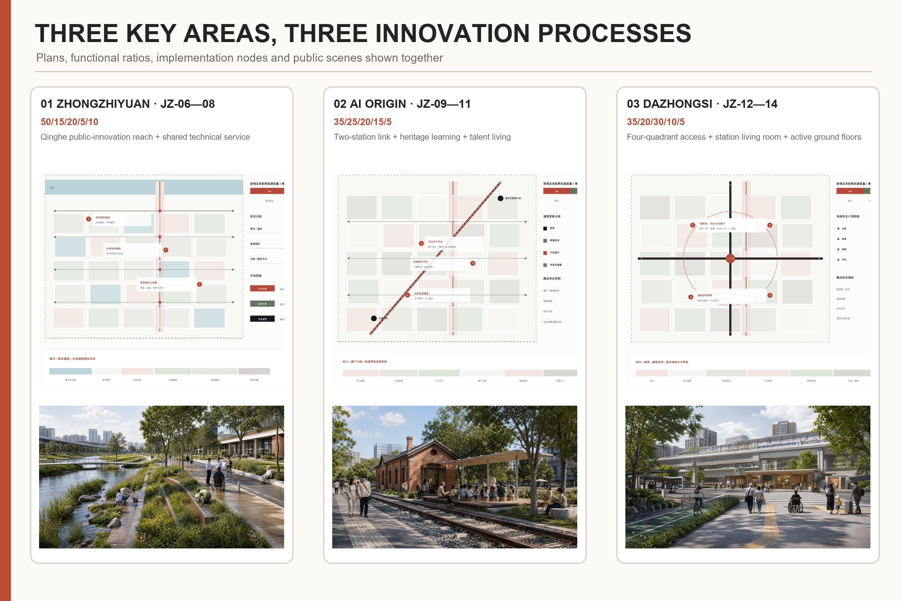
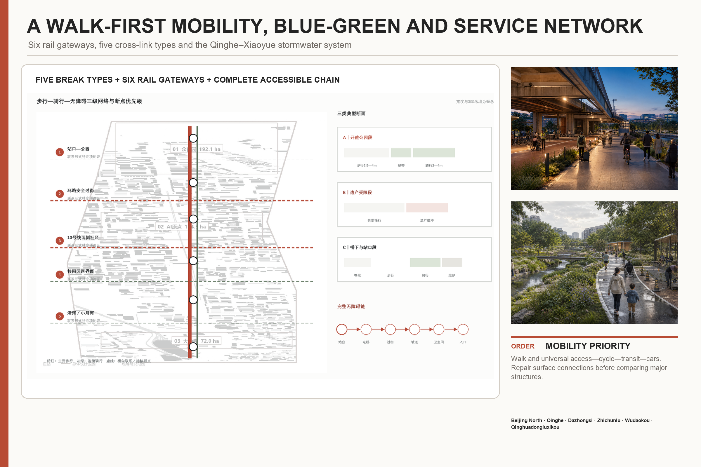
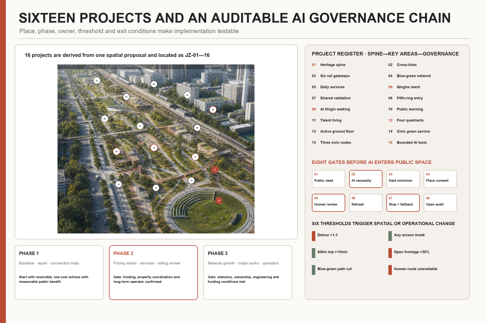

# JING-ZHANG FOR PEOPLE

City for people. AI for use.

The central judgement is clear: innovation resources are highly concentrated, but people’s everyday lives deserve more attention. “People” means everyone—existing residents, researchers, entrepreneurs, students, service workers, small businesses, children, older people, disabled people and visitors. Progress is therefore tested by whether people can arrive easily, use services equally, stay comfortably and participate in governance, not by the visibility of technology.

JING-ZHANG FOR PEOPLE is the only master brand and “City for people. AI for use.” is the only value statement. The railway changes from a barrier into a shared public-life spine. East–west paths reconnect neighbourhoods, campuses, innovation parks, stations, railway heritage and blue-green spaces. AI stays in the background and assists only when it improves movement, accessibility, care, safety, climate comfort or fair access to public resources. Human service, non-digital access and stopping mechanisms always remain available.

## Design Basis and Source List

The official announcement, AI-agent taskbook and site package are the controlling sources [source:OFFICIAL-ANNOUNCEMENT] [source:AGENT-TASKBOOK] [source:SITE-PACKAGE] [standard:PROJECT-OFFICIAL-ANNOUNCEMENT] [standard:PROJECT-AGENT-OPEN-CALL-TASKBOOK]. Every conclusion has one of three states: known condition, conceptual proposal, or subject to professional verification. The announced 43.6 km² research area, 11.4 km² overall-design area and the announced areas of the three key areas are known conditions. The current working boundary, functional ratios, capacity scenarios and node sizes are conceptual proposals. Statutory boundaries, parcel controls, ownership, building-by-building decisions, road lines, utilities and investment remain subject to professional verification [source:BOUNDARY-SOURCE] [source:KEY-AREA-SOURCE] [depth:risk_missing_data].

The current geometry is frozen only to keep the narrative, drawings, GeoJSON and metrics on one work base. It is not an official red line, approval or government commitment. Existing-condition evidence also uses the registered source inventory, processed fact pack and public road/water context [source:SOURCE-REGISTRY] [source:PROCESSED-FACT-PACK] [source:OSM-CONTEXT-20260809] [depth:existing_conditions_diagnosis]. When official geometry becomes available, it replaces the provisional base before all areas and ratios are recalculated.

The proposal responds to urban-design, regulatory-planning interface, land-use classification and later architectural-depth requirements [standard:MOHURD-URBAN-DESIGN-MEASURES] [standard:MOHURD-CONTROL-DETAILED-PLANNING] [standard:MNR-LAND-USE-CLASSIFICATION-GUIDE] [standard:MOHURD-ARCH-DESIGN-DEPTH-2016]. The architectural standard is a next-stage survey checklist; it is not used to invent unverified building decisions.

## Three-Level Scope Framework

The three scales form one chain from regional capability to corridor space and implementable key-area projects [depth:three_level_scope_framework]:

- The 43.6 km² coordinated research area defines the AI value chain, actors, talent needs, regional cooperation and future-city mechanisms [metric:announced_coordinated_research_area_sqm].
- The 11.4 km² overall-design area organises the public-life spine, cross-links, functional layout, renewal units, mobility, blue-green systems and public services [metric:announced_overall_design_area_sqm] [metric:site_area_sqm].
- The three key areas, about 368.4 ha in total, test full-stack collaboration, knowledge conversion and urban application in specific spaces and projects [metric:announced_key_area_total_sqm] [metric:key_area_count].

The “1+3+5” framework gives the chain one identity and one logic. 1 is JING-ZHANG FOR PEOPLE. 3 positions are the Centennial Jing-Zhang Cultural Belt, Metropolitan AI Life Experience Belt and AI Convergent Innovation Belt. 5 capabilities are a full-stack autonomous AI system, a world-class innovation ecosystem, an AI+ scenario-enablement model, a lively AI-enabled city and internationally credible AI governance. These are cross-cutting capabilities, not five isolated land parcels.

The spatial structure combines one public-life spine, five types of east–west link, six rail gateways, three public-contribution nodes and two supporting wings. The approximately nine-kilometre heritage park is the longitudinal public framework. Cross-links connect stations to streets, repair difficult road crossings, reconnect communities across Line 13, open safe campus/park interfaces and join the Qinghe and Xiaoyue rivers. Beijing North, Qinghe, Dazhongsi, Zhichunlu, Wudaokou and Qinghuadongluxikou are the six mobility-and-service gateways. Zhongguancun services support capital, intellectual property, transfer and international cooperation from the west; communities and public services on the Xiaoyue River side provide real urban questions from the east [depth:overall_spatial_structure].

## Coordinated Research Area: Industry and Future City Research

The innovation system is a cycle rather than a linear “park–company–investment” pipeline: public question registration—fundamental research—open collaboration—controlled testing—engineering transfer—urban feedback. Universities and institutes, platform and growth firms, developers and professional services, public agencies, communities and real users all have defined roles. Computing, data, finance, talent, space, scenarios, safety and operation are enabling conditions. Urban design directly provides public-question interfaces, shared technical spaces, bounded test sites and conversion spaces.

Six international cases contribute operating disciplines rather than images to copy: Montréal Mila/Mile-Ex for an open research community; Paris-Saclay DataIA for university-research coordination; Singapore Punggol for synchronising digital and public infrastructure; Seoul Yangjae for growth-company support; Helsinki AI Register for public algorithm registration; and Toronto Quayside as a warning that data rights and accountability must precede deployment [source:CASE-MONTREAL-MILA] [source:CASE-PARIS-SACLAY-DATAIA] [source:CASE-SINGAPORE-PUNGGOL] [source:CASE-SEOUL-AI-HUB] [source:CASE-HELSINKI-AI-REGISTER] [source:CASE-TORONTO-QUAYSIDE-AUDIT] [source:CASE-TORONTO-QUAYSIDE-WITHDRAWAL] [metric:international_case_count].

Regional interfaces are based on complementary capabilities, not unconfirmed alliances. Beijing AI Beiwei and Future Science City support research, talent and transfer; Huairou Science City supports major science facilities; Beijing Economic-Technological Development Area supports engineering and manufacturing scenarios; the Beijing–Tianjin–Hebei network provides wider applications [source:REGIONAL-AI-BEIWEI] [source:REGIONAL-FUTURE-SCIENCE-CITY] [source:REGIONAL-HUAIROU-SCIENCE-CITY] [source:REGIONAL-BDA-AI-CITY] [source:REGIONAL-JJJ-AI-SYNERGY]. These are proposed two-way interfaces for people, knowledge, projects and scenarios, not signed government arrangements.

Named industrial indicators are defined without fabricating baselines. The AI Innovation Index combines original results, open-source contribution, controlled verification, engineering transfer and closure of public problems. Talent density compares stable workers and learners with AI floor space or district area. AI-enterprise concentration, output value, AI-industry floor space and total regional building capacity remain pending until authoritative statistics, enterprise registers and statutory building data are available [depth:metrics_recalculation].

## Overall Design Area: Urban Renewal and Regulatory-Plan-Level Urban Design

### Spatial layout

The corridor is structured as one longitudinal spine, multiple cross-links, three key areas, two supporting wings, six gateways and three nodes. Cross-links are placed at real station entrances, junctions, underpasses, campus edges and waterfront access points. The three key areas occupy the northern, central and southern sections. The six rail gateways and three contribution nodes organise public activity and service [data:geometry/public_space.geojson#PUBLIC-001] [data:geometry/roads.geojson#ROAD-001].

The conceptual land-use structure coordinates AI innovation, public life, mixed services, living support and blue-green space. For new and released renewal floor area, the recommended corridor-wide starting ratio is 40:20:20:10:10: innovation/research 40%, housing and temporary accommodation 20%, commercial and daily services 20%, public culture and innovation services 10%, shared technical and new infrastructure 10%. Each category may move about five percentage points after capacity testing, but daily support and public/shared capacity may not be displaced by office development [data:geometry/land_use.geojson#LU-001] [depth:land_use_layout].

### Capacity, intensity and height

Three scenarios apply only to renewal-potential units. Existing-stock optimisation holds building volume around ±5% and improves use, ground floors and public space. Balanced uplift, the recommended primary direction, tests a 5–15% net increase mainly for daily services, shared technology and public facilities. Node intensification tests 15–25% only around a few stations with adequate transport, utilities and public space. Indicative FAR bands of 1.5–2.5, 2.5–3.5 and 3.5–4.5 are used for morphology/capacity comparison. Height tests are 18–30 m at heritage/waterfront edges, 24–45 m in ordinary renewal blocks and 45–80 m at selected rail gateways. Buildings above 80 m are excluded from the current concept [depth:development_intensity_controls] [depth:height_massing_character]. These are test parameters, not statutory controls; the overall FAR remains unknown [metric:floor_area_ratio].

### Renewal and carrying capacity

Buildings follow five actions: retain, repair, adaptive reuse, temporary use and conditional replacement. Decisions depend on heritage value, structure/fire safety, current use, adaptability, existing users, public contribution and implementation conditions. No final building-by-building decision is made without survey [data:geometry/buildings.geojson#BLDG-001] [metric:building_footprint_area_sqm] [depth:retain_renovate_demolish]. Every increase must pass seven checks—transport/utilities, public services, blue-green capacity, sunlight/wind, heritage/landscape, housing/daily support and long-term operation. A non-compensable overload sends the unit back to a lower scenario.

## Detailed Design of Key Areas

All three key areas use the same five functional categories but apply different mixes and spatial sequences [depth:three_key_area_detailed_design]:

| Key area | Position and spatial sequence | Five-category test ratio | Priority projects and conceptual scale |
| --- | --- | --- | --- |
| Zhongzhiyuan AI Autonomous Innovation Acceleration Area, announced at about 192.1 ha | Qinghe public-innovation reach—shared technical node—Fifth Ring gateway—growth R&D and living-support renewal; a garden-based full-stack district | 50/15/20/5/10 | 500–800 m Qinghe demonstration reach; 3,000–8,000 m² shared technology/engineering validation space; 150–250 m gateway walk catchment [metric:announced_zhongzhiyuan_area_sqm] |
| Beijing AI Origin Community, announced at about 104.3 ha | two-station connection—campus-city sharing—railway heritage/public learning—conversion—talent living; a campus-adjacent knowledge-conversion community | 35/25/20/15/5 | 1,000–2,500 m² heritage learning space; 1,500–4,000 m² small conversion space; 800–1,500 m² daily-service ground floors [metric:announced_ai_origin_area_sqm] |
| Dazhongsi AI Industry Cluster, announced at about 72.0 ha | four station quadrants—public living room—mixed green space—AI-native urban frontage—university coordination; an urban intelligent-economy and international-exchange district | 35/20/30/10/5 | surface-first four-quadrant connection; 50–70% active/public ground floor and entrances no more than 80 m apart; 300–800 m² removable event unit [metric:announced_dazhongsi_area_sqm] |

Zhongzhiyuan keeps high-load, high-energy, sensitive-data and safety testing inside controlled professional buildings, while verified results, standards discussions and public courses face the waterfront and public paths. AI Origin uses the Wudaokou–Qinghuadongluxikou–Qinghuayuan heritage connection as its framework. Its “talent special zone” is an inclusion mechanism—affordable temporary housing, low-cost conversion space, talent services and community co-production—not a gated enclave. Dazhongsi starts from four-quadrant accessibility and links nearby universities, major firms, mature communities and planned green space into an all-day mixed district that non-consuming visitors can use.

The three public-contribution nodes have functional names rather than separate brands: Zhongzhiyuan Shared Technical Service Node, AI Origin Railway Heritage and Public Learning Node, and Dazhongsi Station Public Living Room. Seven common components are physical wayfinding, accessible service desk, movable shaded seating, public discussion table, human help point, offline information board and optional digital interface [metric:pilgrimage_node_count] [metric:public_space_component_type_count].

## AI Innovation Ecosystem, Personas, and AI+ Scenarios

AI planning innovation follows one auditable chain: real problem—necessity test—minimum data—spatial/service prototype—professional and public review—bounded pilot—metric evaluation—stop, revise or expand. Every scenario names the problem owner, space operator, technology owner, human reviewer, data list, failure threshold and non-digital alternative. A model cannot make statutory planning decisions, allocate public rights or take final high-risk decisions.

Eight stress-test groups are children/carers, older people, disabled people, night/service workers, existing residents/small businesses, university/research users, start-ups/employees and first-time visitors [metric:persona_count]. Ten everyday scenarios are located on real spatial carriers: school routes, home–station–clinic journeys, late-night routes, cool walks on the spine, bookable shared ground floors, heritage community rooms, resident-defined problems, Zhongzhiyuan controlled testing, arrival interpretation at Dazhongsi and storm-safe routes [metric:daily_ai_scenario_card_count].

Three industry tests complete the input–agent–human–space–metric chain [metric:industry_test_scenario_count]:

| Test | Input and agent task | Human decision and spatial interface | Stop conditions and metrics |
| --- | --- | --- | --- |
| T01 Zhongzhiyuan model, computing and safety governance | Public, synthetic or authorised data; assist reliability, energy, red-team and scheduling analysis | Safety lead and independent review decide continuation; testing stays in controlled space and only verified results reach the public interface | Stop on unauthorised access, sensitive-data leakage, inexplicable high-risk judgement or energy exceedance; measure validation completion, issue closure and energy per task |
| T02 AI Origin open-agent collaboration and conversion | Versions, dependencies, licences and a community-defined problem; assist dependency checks, reproducibility and contribution records | Human panel decides adoption/resources and residents can veto reframing of the problem; online sandbox and shared ground floor operate together | Stop on licence conflict, failed reproduction, drift from the public problem or missing maintainer; measure reproducibility, problem closure and maintenance commitment |
| T03 Dazhongsi accessible public service | Station facility status, public transport information and voluntarily supplied needs; assist guidance, interchange and multilingual service | On-site staff override the system and real disabled users join acceptance testing; service desk, physical signs and optional terminal run in parallel | Stop on unsafe misdirection, broken accessible chain, forced download or unavailable human service; measure task completion, help requests and misinformation |

Public space is not a passive laboratory. Children are not face-tracked, night safety does not create identity trails, disabled people participate in real acceptance testing and everyone may refuse digital service. AI is assessed by reduced detours, continuous accessibility, lower heat exposure, better fault response and wider equal use—not device counts.

## Land Use, Building Scale, and Retain-Renovate-Demolish Strategy

The conceptual land-use layer covers the full working area and uses recognised classification logic for compatibility; the five capability goals are not presented as statutory land-use classes [data:geometry/land_use.geojson#LU-001]. Building work begins with renewal units and public-contribution nodes. A later building survey records age, structure, fire safety, energy, ownership, occupants, heritage value, active uses and adaptation cost before final action [depth:land_use_layout] [depth:retain_renovate_demolish].

Massing follows public space. It steps down towards the heritage park, Qinghe, Xiaoyue River and mature neighbourhoods. Ground floors prioritise public services, small businesses, shared R&D, learning/display and accessible courtyards. Rail-node growth must add public passages, daily services, housing support and utility capacity; office-only intensification is rejected. The current 72,086 m² conceptual public-node footprint is a machine-check value, not the total regional building stock [metric:building_footprint_area_sqm].

Total floor area, overall FAR, density, setbacks and road lines remain subject to professional verification. The next stage keeps three ledgers—official control, verified existing stock and proposed increment—and allocates the recommended scenario to named renewal units [depth:development_intensity_controls] [depth:height_massing_character].

## Transport, Rail, Municipal Infrastructure, and Public Services

Mobility is prioritised in this order: walking and universal access, cycling, public transport, private cars. Six rail gateways integrate entrances, buses, cycle parking, drop-off, wayfinding and staffed service. East–west breaks are repaired with surface crossings and street changes first; grade separation is compared only when flow, structure, utilities and accessibility demonstrate necessity. Priority checks include the Fifth Ring, both sides of Line 13, Wudaokou, Qinghuadongluxikou, the four Dazhongsi quadrants and major-firm frontages [data:geometry/roads.geojson#ROAD-001] [depth:traffic_rail_slow_parking].

Public services form three levels: regional/station gateways for arrival and all-day support; the three key-area centres for combined innovation and daily services; and community paths with toilets, childcare, health, food, rest, night and accessibility support. Concept tests use an approximately 800 m real walking catchment, 10–15 minute access and about 300 m rest support rather than simple circles.

Municipal and new infrastructure is distributed, reversible and manually recoverable. Shared computing and edge nodes stay in professional buildings; distributed energy and storage first protect essential public services; stormwater works with the Qinghe–Xiaoyue blue-green network; basic information survives network failure. Utilities, drainage/flood, energy, fire, communications and maintenance data are prerequisites [data:geometry/constraints.geojson#CONSTRAINTS] [depth:municipal_new_infrastructure].

## Blue-Green Network, Public Space, and Urban Character

Blue-green performance begins with bodily experience: continuous shade on the north–south route, rest and cooling on cross-links, a safe route home during storms, and waterfronts that reconcile flood conveyance, ecology and public access. Qinghe, Xiaoyue River and the heritage park form one network, with the Zhongzhiyuan Qinghe reach, Dazhongsi mixed green space and Xiaoyue community links as priority demonstrations [data:geometry/green_space.geojson#GREEN-001] [data:geometry/public_space.geojson#PUBLIC-001] [metric:green_ratio] [metric:public_space_ratio] [depth:blue_green_public_space].

The heritage park is organised in northern, central and southern reaches. The north strengthens Qinghe and the Fifth Ring gateway; the centre links campuses, Qinghuayuan heritage and public learning; the south connects Dazhongsi, everyday city life and international exchange. Parking, sport, innovation exchange and bounded technology demonstration are integrated with the implemented area and original park concept. Ring-road and terminal landmarks prioritise movement, legibility and public use rather than monumental technology objects.

Urban character combines railway heritage, Zhongguancun innovation culture and everyday contemporary life. Valuable railway remains keep their scale and materials; new buildings use clear bases, accessible ground floors, restrained setbacks and step-down profiles. Interpretation includes engineering achievement as well as workers, residents, commuters, students and small businesses. Heritage remains alive through childcare, learning, small shops, making and public discussion.

## Renewal Projects, Implementation Policy, and Phasing

Sixteen projects are derived from the overall design and three key areas [metric:concept_project_package_count] [depth:renewal_project_list]:

| ID | Project and place | Scale / suggested stage / cost | Lead responsibility and prerequisite |
| --- | --- | --- | --- |
| JZ-01 | Beijing North–Fifth Ring public-life spine continuity | L / 1–2 / III | Parks and district coordination; verify park, heritage, construction interfaces and paths |
| JZ-02 | Repair east–west breaks at ring roads, rail and campus edges | L / 1–3 / III | Transport and district coordination; obtain flows, lines, structures, utilities and safety review |
| JZ-03 | Integrate six rail gateways | L / 1–2 / III | Transport and rail operators; verify entrances, flow, fire safety and interchange |
| JZ-04 | Qinghe–Xiaoyue blue-green stormwater network | L / 1–3 / III | Water and parks authorities; obtain river, flood, drainage, soil and utility data |
| JZ-05 | Fill gaps in three-level public and daily services | L / 1–2 / II | District public-service lead; survey population, jobs and service deficits |
| JZ-06 | Zhongzhiyuan 500–800 m Qinghe public-innovation reach | M / 1–2 / II | Park public-service operator; confirm waterfront controls, ownership and hours |
| JZ-07 | Zhongzhiyuan 3,000–8,000 m² shared technology/validation space | M / 1–2 / II | Park operator; verify building, energy, fire, data and operating demand |
| JZ-08 | Zhongzhiyuan Fifth Ring and park entrance improvement | M / 1–3 / III | Transport and district lead; complete ring-road option study |
| JZ-09 | AI Origin station–campus–community active network | M / 1–2 / II | Transport and district lead; jointly survey campus edges and key paths |
| JZ-10 | AI Origin railway heritage reuse and public learning | M / 1–2 / II | Heritage and district lead; complete value, structure, ownership and operation assessment |
| JZ-11 | AI Origin small-scale conversion and talent living | M / 1–2 / II | District and property operators; verify rental, planning, fire and anti-displacement conditions |
| JZ-12 | Dazhongsi four-quadrant pedestrian connection | M / 1–3 / III | Transport and district lead; obtain station, flow, junction, utility and fire data |
| JZ-13 | Dazhongsi active ground floors and mixed-block renewal | M / 1–2 / II | District and property operators; survey parcels, businesses and building safety |
| JZ-14 | Dazhongsi public service and mixed green-space use | M / 1–2 / II | District and parks lead; confirm green-space status, demand and management |
| JZ-15 | Three representative public-contribution nodes | M / 1–2 / II | Three space operators; secure site, public opening and maintenance responsibility |
| JZ-16 | Ten daily scenarios and three bounded industry tests | S–M / 1–3 / I–II | Service owner, space operator and technology owner jointly pass necessity/exit review |

Stage 1 covers surveys, records, maintenance, path repair, temporary use and low-risk trials. Stage 2 delivers professionally verified public-space, building-renewal and service projects. Stage 3 starts major cross-line, station-city and water works only when statutory planning, ownership, funding, transport/utilities, ecology/heritage and long-term operation are all secured [data:geometry/phasing.geojson#PHASE-001] [depth:phasing_implementation]. Stages begin when a project is authorised; they are not announced government construction dates.

Each project assigns eight responsibilities: problem definition, statutory decision, resources, design/construction, operation/maintenance, professional review, public oversight and pause/exit. Every project has one daily operating owner and emergency contact. “Use first, then formalise” means reversible actions test public value before capital work; projects that cannot protect existing residents, small businesses, disabled users and long-term maintenance do not advance.

## Metrics, Area Recalculation, and Compliance Matrix

Metrics assess people’s lives first and industrial growth second. People-first indicators include door-to-door rail-crossing time, continuous accessibility, effective summer shade, storm-safe movement, public-service access, retention of affordable housing/small businesses and coverage of human/non-digital service. Industrial indicators include the AI Innovation Index, talent density, enterprise concentration, shared technical service, controlled validation and conversion. Each record has a baseline, target or threshold, responsible body, spatial object and adjustment action.

The current working geometry recalculates to about 11.41 km², with a conceptual green ratio of about 24.3% and public-space ratio of about 14.3%; these are consistency checks, not official controls [metric:site_area_sqm] [metric:green_ratio] [metric:public_space_ratio]. The package also records the announced areas, three key areas, eight user groups, ten daily scenarios, three industry tests, three contribution nodes, seven component types, six cases, sixteen projects, 23 task responses, six standards and fifteen depth items [metric:announced_coordinated_research_area_sqm] [metric:announced_overall_design_area_sqm] [metric:announced_key_area_total_sqm] [metric:announced_zhongzhiyuan_area_sqm] [metric:announced_ai_origin_area_sqm] [metric:announced_dazhongsi_area_sqm] [metric:persona_count] [metric:daily_ai_scenario_card_count] [metric:industry_test_scenario_count] [metric:pilgrimage_node_count] [metric:public_space_component_type_count] [metric:international_case_count] [metric:concept_project_package_count] [metric:compliance_requirement_count] [metric:registered_standard_count] [metric:design_depth_item_count].

Structured evidence represents the work boundary, key areas, conceptual land use, public building nodes, mobility links, green space, public space, constraints and phasing [data:geometry/site_boundary.geojson#SITE-001] [data:geometry/key_areas.geojson#PROV-KEY-001] [data:geometry/key_areas.geojson#PROV-KEY-002] [data:geometry/key_areas.geojson#PROV-KEY-003] [data:geometry/land_use.geojson#LU-001] [data:geometry/buildings.geojson#BLDG-001] [data:geometry/roads.geojson#ROAD-001] [data:geometry/green_space.geojson#GREEN-001] [data:geometry/public_space.geojson#PUBLIC-001] [data:geometry/constraints.geojson#CONSTRAINTS] [data:geometry/phasing.geojson#PHASE-001]. The compliance matrix connects 17 announcement tasks and agent.1–agent.6 to narrative, drawings, geometry, metrics, sources and risks—23 responses in total.

## Risk, Copyright, and Compliance

Seven risk groups are actively managed: boundary/statutory controls, buildings/ownership, transport/utilities, river/ecology, heritage/character, industry/operation and data/AI [depth:risk_missing_data]. Each has prerequisite information, a reviewer and a stopping condition. No exact engineering alignment, demolition decision, investment or construction date is promised before the required professional evidence exists.

AI governance requires data minimisation, purpose limitation, public registration, human review, refusal, appeal, failure degradation and exit/deletion. The proposal uses no classified, internal or non-public spatial data and claims no official endorsement, approval or implementation commitment. Algorithms cannot replace statutory planning approval, final allocation of public resources or high-risk safety decisions. Privacy leakage, discrimination, inexplicable high-risk output, unavailable human access or damage to public-space rights triggers immediate suspension and restoration of non-digital service.

Images, maps, fonts, cases, code and data follow registered sources and licence limits. Renderings show conceptual intent and are not presented as existing photographs or built facts. Company marks, portraits and third-party brands are not endorsements. Drawings and pages consistently identify conceptual proposals, provisional geometry and matters requiring professional verification.

## References

Official and evidence sources: [source:SITE-PACKAGE] [source:SOURCE-REGISTRY] [source:PROCESSED-FACT-PACK] [source:BOUNDARY-SOURCE] [source:KEY-AREA-SOURCE] [source:OFFICIAL-ANNOUNCEMENT] [source:AGENT-TASKBOOK] [source:OSM-CONTEXT-20260809].

Regional sources: [source:REGIONAL-AI-BEIWEI] [source:REGIONAL-FUTURE-SCIENCE-CITY] [source:REGIONAL-HUAIROU-SCIENCE-CITY] [source:REGIONAL-BDA-AI-CITY] [source:REGIONAL-JJJ-AI-SYNERGY].

Case sources: [source:CASE-MONTREAL-MILA] [source:CASE-PARIS-SACLAY-DATAIA] [source:CASE-SINGAPORE-PUNGGOL] [source:CASE-SEOUL-AI-HUB] [source:CASE-HELSINKI-AI-REGISTER] [source:CASE-TORONTO-QUAYSIDE-AUDIT] [source:CASE-TORONTO-QUAYSIDE-WITHDRAWAL].

Design-depth index: [depth:existing_conditions_diagnosis] [depth:three_level_scope_framework] [depth:overall_spatial_structure] [depth:land_use_layout] [depth:development_intensity_controls] [depth:height_massing_character] [depth:retain_renovate_demolish] [depth:traffic_rail_slow_parking] [depth:municipal_new_infrastructure] [depth:blue_green_public_space] [depth:three_key_area_detailed_design] [depth:renewal_project_list] [depth:phasing_implementation] [depth:metrics_recalculation] [depth:risk_missing_data].
