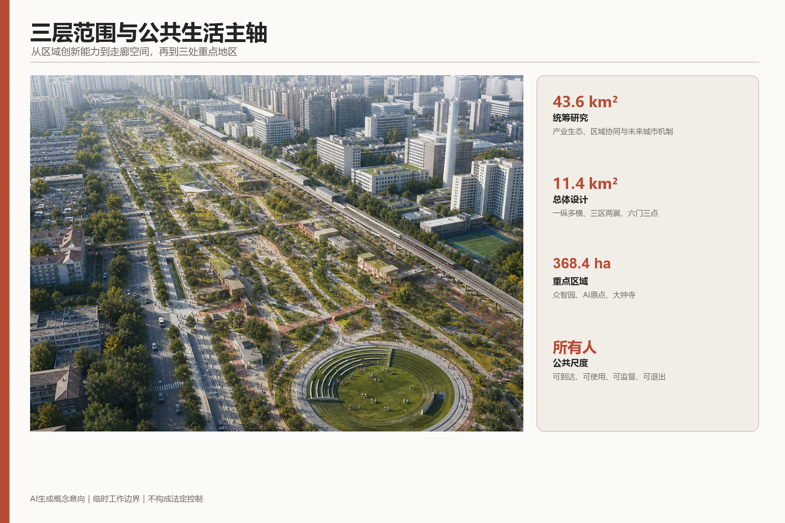
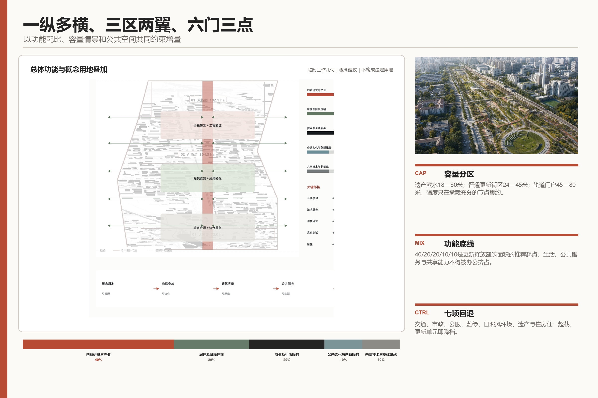
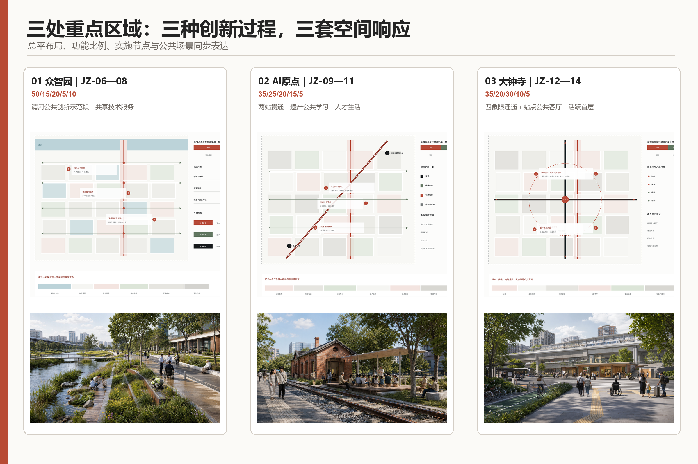
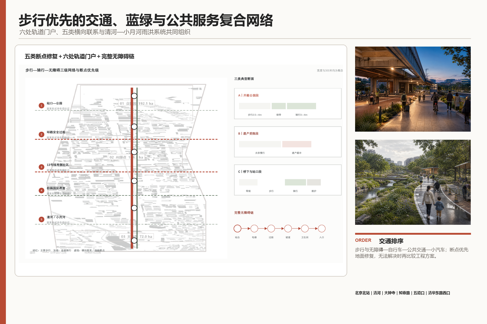
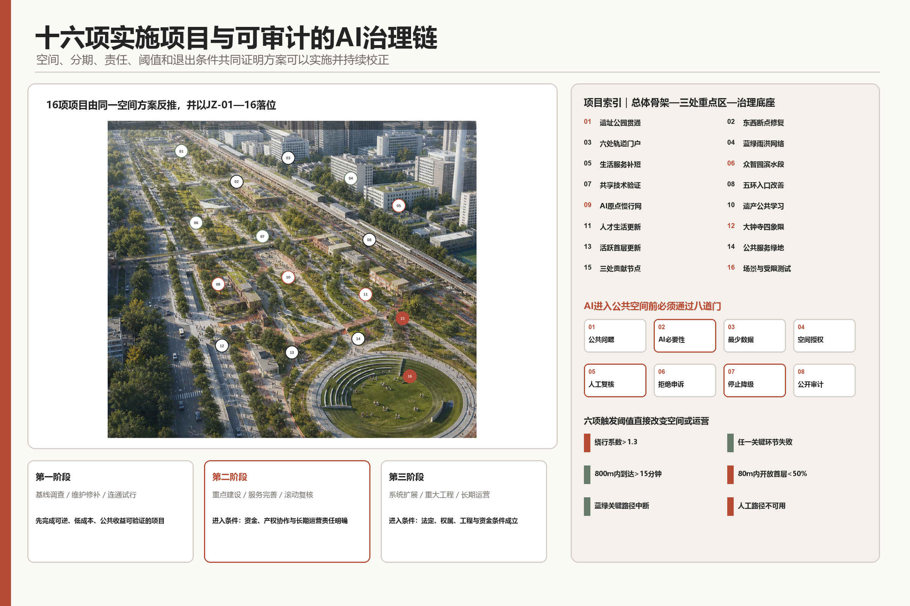

# 人间京张 / JING-ZHANG FOR PEOPLE

城市为人，AI为用。

本方案的核心判断是：创新资源高度集聚，但人的生活更应当被关注。“人”明确指所有人，包括原有居民、科研人员、创业者、学生、服务劳动者、小商户、儿童、老人、残障人士和来访者。方案不以技术地标证明先进，而以人能否顺畅到达、平等使用、安心停留和参与治理检验城市创新。

“人间京张”是唯一主品牌，“城市为人，AI为用。”是唯一价值宣言。京张铁路由分隔城市的基础设施转化为共享公共生活主轴；东西向路径把社区、校园、园区、轨道站、铁路遗产和蓝绿空间重新缝合；AI退居后台，只在交通、无障碍、照护、安全、环境与公共资源配置中提供可解释的辅助，并保留人工服务、非数字入口和停止机制。

## 设计依据与资料清单

方案以官方公告、智能体任务书和赛事资料包为主控依据，以公开案例与专业标准为辅助依据 [source:OFFICIAL-ANNOUNCEMENT] [source:AGENT-TASKBOOK]。所有结论采用三级状态：已知条件、概念建议、待专业复核。43.6平方公里统筹研究范围、11.4平方公里总体设计范围和三处重点区域的公告面积属于已知条件；当前提交边界、功能比例、容量情景和节点尺度属于概念建议；法定边界、逐地块控规、权属、逐栋建筑、道路红线、管线和投资属于待专业复核 [depth:risk_missing_data]。

当前工作边界由资料包与公开空间信息形成，并在本次提交中冻结，以保证文字、图纸、GeoJSON和指标使用同一工作底盘；它不构成官方红线、审批依据或政府承诺。现状判断综合来源登记和处理后的事实包 [source:SOURCE-REGISTRY] [source:PROCESSED-FACT-PACK]。正式深化时首先替换官方边界和现状底图，再统一复算全部面积与指标，而不是将临时几何继续精细化 [depth:existing_conditions_diagnosis]。

专业控制分别响应城市设计、控规衔接和用地分类要求 [standard:MOHURD-URBAN-DESIGN-MEASURES] [standard:MOHURD-CONTROL-DETAILED-PLANNING] [standard:MNR-LAND-USE-CLASSIFICATION-GUIDE]。建筑设计深度标准仅作为下一阶段调查和专项设计清单，不用于制造未经调查的建筑结论。

## 三层范围工作框架

三层范围是一条由区域能力到城市空间、再到重点地区实施的推导链 [depth:three_level_scope_framework]：

- 43.6平方公里统筹研究范围研究AI产业链、创新主体、人才需求、区域协同和未来城市机制，回答京张需要形成什么能力 [metric:announced_coordinated_research_area_sqm]。

- 11.4平方公里总体设计范围组织公共生活主轴、横向联系、功能布局、更新单元、交通蓝绿和公共服务，回答能力如何进入城市结构 [metric:announced_overall_design_area_sqm] [metric:site_area_sqm]。

- 三处重点区域共约368.4公顷分别验证全栈协作、知识转化和城市应用，回答空间、项目与运营能否落地 [metric:announced_key_area_total_sqm] [metric:key_area_count]。

“1+3+5”统领三层范围：1是“人间京张”；3是百年京张文化带、都市AI生活体验带、AI融合创新带；5是AI全栈自主创新体系、世界级AI创新生态、AI+场景赋能新范式、智能化AI活力城市和AI治理全球话语权。三大定位说明京张成为什么，五大功能说明必须建设什么城市能力，不对应五块孤立用地。

总体结构为一条公共生活主轴、五类横向联系、六处轨道门户、三处公共贡献节点、两侧协同支撑。约9公里京张铁路遗址公园承担纵向公共骨架；五类横向联系分别处理站点到街区、道路安全过街、轨道两侧社区、公园与校园园区开放界面、清河与小月河蓝绿贯通；北京北站、清河、大钟寺、知春路、五道口、清华东路西口形成六处换乘与公共服务门户；中关村科技服务资源从西侧提供资本、知识产权、技术转移和国际合作，小月河东侧社区和公共服务提供真实应用条件 [depth:overall_spatial_structure]。

## 统筹研究范围产业与未来城市研究

区域创新不再按“园区—企业—招商”线性组织，而采用公共问题登记—基础研究—开源协作—受控测试—工程转化—城市反馈的循环。高校与科研机构、平台型企业和成长企业、开发者与专业服务机构、城市治理和公共服务部门、社区与真实使用者共同进入循环；算力、数据、资本、人才、空间、场景、安全和运营是八类支撑条件。规划直接组织公共问题入口、共享技术空间、限定测试场和成果转化界面，产业政策与数据治理负责其余条件。

六个国际案例用于提取运行机制，而非复制形象：蒙特利尔Mila/Mile-Ex强调开放研究社区，巴黎萨克雷DataIA强调校研协同 [source:CASE-MONTREAL-MILA] [source:CASE-PARIS-SACLAY-DATAIA]。

新加坡Punggol强调数字园区与公共基础设施同步，首尔Yangjae强调成长企业服务，赫尔辛基AI Register强调算法公开登记 [source:CASE-SINGAPORE-PUNGGOL] [source:CASE-SEOUL-AI-HUB] [source:CASE-HELSINKI-AI-REGISTER]。

多伦多Quayside作为反向警示，说明数据、权利和责任必须先于技术部署 [source:CASE-TORONTO-QUAYSIDE-AUDIT] [source:CASE-TORONTO-QUAYSIDE-WITHDRAWAL] [metric:international_case_count]。

区域协同按照能力互补而非口号联盟组织：北京AI北纬社区和未来科学城提供科研、人才与转化联系，怀柔科学城提供大科学装置和基础研究协同 [source:REGIONAL-AI-BEIWEI] [source:REGIONAL-FUTURE-SCIENCE-CITY] [source:REGIONAL-HUAIROU-SCIENCE-CITY]。

北京经济技术开发区提供工程化与制造场景，京津冀网络提供更广泛的产业应用和测试环境 [source:REGIONAL-BDA-AI-CITY] [source:REGIONAL-JJJ-AI-SYNERGY]。本方案只提出“人员、知识、项目与场景”双向接口，不把尚未签订的合作写成既定安排。

产业目标采用可校准定义：AI创新指数由原创成果、开源贡献、受控验证、工程转化和公共问题闭环五类证据组成；人才密度以稳定从业与学习人口相对于AI产业空间或片区面积统计；企业聚集度、产值规模、AI产业空间规模和区域建筑总规模均保留基线空位，待官方统计、企业名录和控规建筑量取得后校准。指标缺值不影响空间方案表达，但不得用推测值替代 [depth:metrics_recalculation]。

## 总体设计范围城市更新与控规深度城市设计

### 总体布局

总体设计以“一纵多横、三区两翼、六门三点”形成空间骨架。“一纵”是京张公共生活主轴；“多横”是五类横向联系在具体路口、站口、桥下、校园边界和滨水入口的连续落实；北部众智园、中部AI原点、南部大钟寺形成三处重点区域；西侧科技服务与东侧生活服务形成两翼；六处轨道门户与三处公共贡献节点共同组织公共活动和服务 [data:geometry/public_space.geojson#PUBLIC-001] [data:geometry/roads.geojson#ROAD-001]。

概念用地协调AI创新、公共生活、混合服务、居住支持与蓝绿空间。对新增及更新释放建筑面积采用统一五类口径和40:20:20:10:10推荐起点：创新研发与产业40%，居住及阶段住宿20%，商业及生活服务20%，公共文化与创新公共服务10%，共享技术及新型基础设施10%；各类可在总体承载校核下调整约5个百分点，公共服务、生活支持和共享基础能力不得被产业办公挤占 [data:geometry/land_use.geojson#LU-001] [depth:land_use_layout]。

### 容量、强度与高度

容量只作用于更新潜力单元。本方案推荐“均衡提升为主、敏感界面存量优化、少数轨道节点集约”：存量优化以现状建筑量±5%为测试条件；均衡提升在更新潜力单元测试净增5%—15%，主要补充生活服务、共享技术和公共设施；节点集约仅在承载充分的轨道节点测试净增15%—25%。容积率暂按1.5—2.5、2.5—3.5、3.5—4.5三档进行形态与承载比较；高度按遗产滨水18—30米、普通更新街区24—45米、轨道门户45—80米测试，超过80米不纳入当前概念方案 [depth:development_intensity_controls] [depth:height_massing_character]。全部数值为方案测试值，不是法定指标；总容积率保持待确认 [metric:floor_area_ratio]。

### 更新与承载

建筑按保留、修缮、适应性改造、临时利用、有条件重建五类处理，判断次序为历史价值、结构消防、现状使用、空间适应性、原使用者权益、公共贡献和实施条件。未经逐栋普查，不给出最终拆改留结论 [data:geometry/buildings.geojson#BLDG-001] [metric:building_footprint_area_sqm] [depth:retain_renovate_demolish]。任何增量必须同时通过交通市政、公共服务、蓝绿空间、日照风环境、遗产景观、住房生活支持和运营维护七项承载校核；任一项出现不可补偿超载即回退情景。

## 重点区域详细设计

三处重点区域使用相同的五类功能口径，但因创新过程不同形成差异化组合 [depth:three_key_area_detailed_design]：

| 重点区域 | 核心定位与空间结构 | 五类功能测试比例 | 重点项目与概念尺度 |
| --- | --- | --- | --- |
| 众智园AI自主创新加速区，公告约192.1公顷 | 清河公共创新示范段—共享技术服务节点—五环联系门户—成长研发与生活服务更新单元；形成花园型全栈创新街区 | 50/15/20/5/10 | 500—800米清河示范段；3000—8000平方米共享技术与工程验证载体；150—250米五环门户步行影响范围 [metric:announced_zhongzhiyuan_area_sqm] |
| 北京AI原点社区，公告约104.3公顷 | 两站贯通—校城共享—铁路遗产公共学习—成果转化—人才生活更新；形成近校型知识转化社区 | 35/25/20/15/5 | 1000—2500平方米遗产公共学习空间；1500—4000平方米小尺度转化载体；800—1500平方米生活服务首层 [metric:announced_ai_origin_area_sqm] |
| 大钟寺AI产业聚集区，公告约72.0公顷 | 站点四象限—公共客厅—复合绿地—AI原生城市界面—高校协同更新；形成城市型智能经济与国际交往街区 | 35/20/30/10/5 | 四象限地面优先连通；活跃或公共首层50%—70%、入口间距不大于80米；300—800平方米可撤除活动单元 [metric:announced_dazhongsi_area_sqm] |

众智园将高荷载、高能耗、敏感数据与安全测试纳入专业受控建筑，把授权成果解释、标准讨论、开放课程和滨河交往布置在公共界面；普通公众能够理解创新但不被动进入测试。AI原点以五道口—清华东路西口—清华园车站旧址为联系骨架，将人才特区落实为可负担阶段居住、低成本转化空间、人才服务与社区共建机制，而不是封闭飞地。大钟寺以站点四象限可达性为先，联动周边高校、重点企业、成熟社区和规划绿地，形成全天混合且可由非消费人群使用的公共客厅。

三处公共贡献节点不另设品牌：众智园共享技术服务节点展示可核验的工程验证和安全治理；AI原点铁路遗产公共学习节点把遗产、社区课堂与开源协作结合；大钟寺站点公共客厅提供换乘、人工问询、无障碍协助、便民服务和国际来访支持。七类通用组件为实体导视、无障碍服务台、可移动遮荫座椅、公共讨论台、人工求助点、断网信息板和可选数字界面 [metric:pilgrimage_node_count] [metric:public_space_component_type_count]。

## AI 创新生态、人才画像与 AI+ 场景

AI规划创新采用同一条可审计链：真实问题提出—必要性判断—最少数据—空间与服务原型—专业及公众复核—限定时空试运行—指标评价—停止、修正或扩展。每个场景必须写明需求提出者、空间运营者、技术责任者、人工复核者、数据清单、失败阈值和非数字替代；模型不得决定法定规划、公共权利或资源最终分配。

八类压力测试人群覆盖儿童与照护者、老人、残障人士、夜班与服务劳动者、原有居民与小商户、高校师生与科研人员、创业团队与企业员工、初次来访者 [metric:persona_count]。十类日常场景分别落到社区—学校路径、家门—站点—医疗路径、夜间归家路线、京张主轴清凉步行、共享首层、遗产社区客厅、居民问题共创、众智园受控测试、大钟寺到站导览和暴雨安全回家路 [metric:daily_ai_scenario_card_count]。

三类产业测试形成完整“输入—智能体任务—人工决策—空间界面—评价”证据 [metric:industry_test_scenario_count]：

| 测试 | 输入与智能体任务 | 人工决策和空间界面 | 停止条件与指标 |
| --- | --- | --- | --- |
| T01 众智园模型、算力与安全治理 | 公开、合成或授权数据；辅助可靠性、能耗、安全红队和调度分析 | 安全负责人和独立审查决定是否继续；在受控测试空间运行，公共界面只展示核验结果 | 越权、敏感数据泄露、不可解释高风险判断或能耗超限即停止；评价验证完成率、问题关闭率和单位任务能耗 |
| T02 AI原点开源智能体协作与转化 | 版本、依赖、许可与社区问题；辅助依赖检查、复现和协作记录 | 人类评审决定采用与资源分配，居民对问题定义保有否决权；在线沙盒与共享首层并行 | 许可冲突、无法复现、偏离原问题或无维护主体即停止；评价复现率、公共问题闭环率和维护承诺 |
| T03 大钟寺无障碍公共服务 | 站点设施状态、公开交通信息和主动提交需求；辅助导览、换乘和多语服务 | 现场人员覆盖系统判断，真实无障碍使用者参加验收；服务台、实体导视和可选终端并行 | 错误导向安全风险、无障碍链中断、强制下载或人工入口不可用即停止；评价任务完成率、人工求助率和误导率 |

公共空间不是被动实验室。儿童不进行人脸追踪，夜间安全不建立身份轨迹，残障人士参与实际验收，任何人均可拒绝数字服务。AI的价值以缩短绕行、改善无障碍、减少热暴露、提高故障响应和扩大平等使用来衡量，而非设备数量。

## 用地、建筑规模与拆改留方案

概念用地图完整覆盖当前工作范围，采用现行分类标准表达功能兼容关系，不将“五大功能”误作法定用地类别 [data:geometry/land_use.geojson#LU-001]。建筑层面先形成更新单元和公共贡献节点，逐栋普查至少包括年代、结构、消防、能耗、权属、租用人、历史价值、现状活动和改造成本；在此之前只确定五类措施的判定方法 [depth:land_use_layout] [depth:retain_renovate_demolish]。

建筑体量服从公共空间：面向遗址公园、清河、小月河和成熟社区逐级降低；首层优先安排公共服务、小店、共享研发、学习展示和可进入庭院；沿公共生活主轴形成连续入口和可停留界面。轨道节点的增量必须同步提供公共通道、生活服务、住房支持与市政容量，不接受只增加办公面积的单项增容。现有概念建筑节点基底约72,086平方米，仅用于机器校核，不代表区域建筑总量 [metric:building_footprint_area_sqm]。

总建筑规模、容积率、建筑密度、退线和道路红线在缺少正式底图与控规条件时保持待专业复核。正式深化按“官方控制—现状复核—方案增量”三本账计算，并将推荐情景落实到具体更新单元，防止把概念区间误读为审定指标 [depth:development_intensity_controls] [depth:height_massing_character]。

## 交通、轨道、市政与公共服务设施

交通系统按步行与无障碍—自行车—公共交通—小汽车排序。六处轨道门户整合站口、公交、骑行停车、落客、导向和人工服务；东西向断点优先采用地面安全过街与街道改善，只有在客流、结构、管线和无障碍均证明必要时再比较立体方案。重点核查北五环、13号线两侧、五道口、清华东路西口、大钟寺四象限及重点企业周边 [data:geometry/roads.geojson#ROAD-001] [depth:traffic_rail_slow_parking]。

公共服务构成三级网络：六处轨道与区域门户提供综合到达和全天服务；三处重点区域中心提供创新、生活和公共服务复合节点；社区路径补充卫生间、托育照护、健康、餐饮、休息、夜间和无障碍支持。方案以约800米实际步行覆盖、10—15分钟到达和约300米连续休息支持作为概念测试值，不用直线服务半径替代真实路径。

市政与新型基础设施采用“分布、可退、人工接管”的原则：共享算力与端侧节点进入专业建筑，分布式能源与储能先服务关键公共设施，雨洪系统与清河—小月河蓝绿网络协同，信息节点在断网时保持基本服务。正式实施前必须取得管线、排水防洪、能源、消防、通信与运维资料 [data:geometry/constraints.geojson#CONSTRAINTS] [depth:municipal_new_infrastructure]。

## 蓝绿空间、公共空间与城市风貌

蓝绿系统以人的身体感受为首要绩效：纵向路径连续有荫，横向联系具备休息和降温，暴雨时仍有安全回家路线，滨水空间兼顾行洪、生态与公共可达。清河—小月河—遗址公园形成连续网络，众智园清河段、大钟寺复合绿地和小月河生活联系承担重点示范 [data:geometry/green_space.geojson#GREEN-001] [data:geometry/public_space.geojson#PUBLIC-001] [depth:blue_green_public_space]。

京张铁路遗址公园按北、中、南三段组织：北段强化清河与五环门户，中段连接校园、车站旧址与公共学习，南段连接大钟寺、城市生活和国际交往；停车、体育、创新交往、科技测试展示均作为分段复合功能，在已实施区与原设计基础上校核。跨环路及南北端节点以通行、识别和公共使用为先，不以巨型科技构筑物制造地标。

风貌以铁路遗产、中关村创新文化和当代日常生活共同构成。保留清华园车站旧址及有价值铁路遗存的尺度和材料，新增建筑采用清晰基座、可进入首层、适度退台和面向公园逐级降低的体量；导视同时讲述工程成就、铁路工人、沿线居民、通勤者、学生和小商户。遗产通过托育、学习、小店、创作和公共讨论继续被使用，而不是隔离陈列。

## 更新项目清单、实施政策与分期计划

十六项项目由总体设计和三处重点区域反推形成 [metric:concept_project_package_count] [depth:renewal_project_list]：

| 编号 | 项目及位置 | 规模/建议阶段/成本 | 牵头责任与关键前置条件 |
| --- | --- | --- | --- |
| JZ-01 | 北京北站—北五环京张公共脊柱贯通 | L/一至二/Ⅲ | 园林绿化与属地统筹；核实公园边界、文保、工程衔接和现状路径 |
| JZ-02 | 环路、轨道和校园边界东西向断点修复 | L/一至三/Ⅲ | 交通与属地统筹；取得客流、红线、桥梁、管线和安全评价 |
| JZ-03 | 六处轨道门户一体化改善 | L/一至二/Ⅲ | 交通与轨道运营主体统筹；复核站口、客流、消防和换乘组织 |
| JZ-04 | 清河—小月河蓝绿雨洪网络 | L/一至三/Ⅲ | 水务与园林绿化统筹；取得蓝线、行洪、排水、土壤和管线资料 |
| JZ-05 | 三级公共与生活服务补短 | L/一至二/Ⅱ | 属地公共服务部门统筹；完成人口就业与设施缺口调查 |
| JZ-06 | 众智园500—800米清河公共创新示范段 | M/一至二/Ⅱ | 园区公共服务运营主体统筹；确认滨水控制、权属和开放时段 |
| JZ-07 | 众智园3000—8000平方米共享技术与工程验证载体 | M/一至二/Ⅱ | 园区运营主体统筹；完成建筑、能源、消防、数据和需求复核 |
| JZ-08 | 众智园五环与公园入口改善 | M/一至三/Ⅲ | 交通与属地统筹；开展五环联系与工程可行性论证 |
| JZ-09 | AI原点站点—校园—社区慢行网络 | M/一至二/Ⅱ | 交通与属地统筹；共同踏勘校园开放边界与关键路径 |
| JZ-10 | AI原点铁路遗产再利用与公共学习 | M/一至二/Ⅱ | 文保与属地统筹；完成价值、结构、权属和运营评估 |
| JZ-11 | AI原点小尺度创新与人才生活更新 | M/一至二/Ⅱ | 属地与产权运营主体统筹；核实租住、控规、消防和防挤出条件 |
| JZ-12 | 大钟寺站四象限步行连通 | M/一至三/Ⅲ | 交通与属地统筹；取得站点、客流、路口、管线和消防资料 |
| JZ-13 | 大钟寺活跃首层与混合街区更新 | M/一至二/Ⅱ | 属地与产权运营主体统筹；调查重点地块、现状经营和建筑安全 |
| JZ-14 | 大钟寺公共服务与绿地复合利用 | M/一至二/Ⅱ | 属地与园林绿化统筹；确认绿地性质、服务需求和开放管理 |
| JZ-15 | 三处代表性公共贡献节点 | M/一至二/Ⅱ | 三处空间运营主体分别牵头；落实场地、公共开放和维护责任 |
| JZ-16 | 十类日常场景与三类受限产业测试 | S—M/一至三/Ⅰ—Ⅱ | 业务责任、空间运营和技术责任三方联合；通过AI必要性与退出审查 |

阶段一为调查建档、维护修缮、路径连通、临时使用和低风险运营试行；阶段二推进完成专业论证的公共空间、建筑更新和服务补短；阶段三只在法定规划、权属、资金、交通市政、生态文保和长期运营条件同时成立后实施跨线、站城和水务等重大工程 [data:geometry/phasing.geojson#PHASE-001] [depth:phasing_implementation]。阶段从项目获得授权时起算，不等同于政府已经确定的建设时序。

每个项目明确八项责任：需求提出、法定决定、资源提供、设计建设、运营维护、专业复核、公众监督、暂停退出。任何项目必须有唯一日常运营责任人和应急联系人。实施遵循“先使用、再定型”：先用可逆行动验证公共收益，再固化有效设施；无法保障原居民、小商户、无障碍使用和长期维护的项目不得进入下一阶段。

## 指标体系、面积复算与合规矩阵

指标优先评价所有人的生活，其次评价产业增长。人本指标包括跨铁路门到门时间、无障碍连续率、夏季有效遮荫、暴雨安全通行、公共服务可达、可负担居住与小店保全、原居民留存、人工与非数字服务覆盖；产业指标包括AI创新指数、人才密度、企业聚集、共享技术服务、开放验证和成果转化。每个指标均记录基线、目标或阈值、责任主体、空间对象和触发的调整动作。

当前工作边界复算面积约11.41平方公里，概念绿地比例约24.3%，概念公共空间比例约14.3%；这些数值只用于提交几何一致性校核 [metric:site_area_sqm] [metric:green_ratio] [metric:public_space_ratio]。

公告面积、三处重点区面积、八类人群、十类日常场景、三类产业测试、三处贡献节点、七类公共空间组件、六个国际案例和十六项项目均已在相应章节建立结构计数。合规层面另建立23项任务响应、6项专业标准和15项设计深度 [metric:compliance_requirement_count] [metric:registered_standard_count] [metric:design_depth_item_count]。

空间数据分别表达工作边界、三处重点区域、概念用地、公共节点、交通联系、蓝绿空间、公共空间、约束和分期 [data:geometry/site_boundary.geojson#SITE-001] [data:geometry/key_areas.geojson#PROV-KEY-001] [data:geometry/phasing.geojson#PHASE-001]。合规矩阵把17项公告任务和agent.1—agent.6逐项连接到正文、图纸、图层、指标、来源和风险，总计23项，不把官方数据缺口误判为参赛者缺项。

## 风险、版权与合规说明

规划风险分为七类：边界与控规、建筑与权属、交通市政、河道与生态、文保与风貌、产业与运营、数据与AI。每类风险都设置前置资料、复核主体和停止条件 [depth:risk_missing_data]。临时边界仅用于概念研究；未取得道路红线、管线、消防、行洪、权属和逐栋建筑调查前，不承诺具体工程线位、拆改留、投资和开工时序。

AI治理坚持数据最少、目的限定、公开登记、人工复核、拒绝权、申诉权、故障降级和退出删除。空间分析仅使用经许可公开发布或赛事明确提供的数据；任何来源与使用权限无法核验的数据均不得进入方案证据链，也不得采集与任务无关的身份信息或伪造官方背书、审批结论和实施承诺。算法不得替代规划审批、公共资源最终决定和高风险安全判断；一旦出现隐私泄露、歧视、不可解释高风险输出、人工入口失效或公共空间权利受损，立即停止测试并恢复非数字服务。

所有图片、地图、字体、案例、代码与数据按来源登记和许可边界使用。效果图表达概念意图，不冒充现状摄影或已建成事实；企业标识、肖像和第三方品牌不作为方案背书。图纸、网页与结构化数据统一标注“概念建议/临时工作边界/待专业复核”，使视觉吸引力不以误导性精确为代价。

## 参考资料

主控依据由赛事资料包、官方公告和智能体任务书构成 [source:SITE-PACKAGE] [source:OFFICIAL-ANNOUNCEMENT] [source:AGENT-TASKBOOK]。

现状底账、区域协同与国际案例的完整编号、网址、许可和提取结论统一登记在sources.json [source:SOURCE-REGISTRY] [source:OSM-CONTEXT-20260809]。

全部15项设计深度的正文、图纸、空间数据、指标、来源、假设与自检对应关系见design_depth_matrix.json [depth:existing_conditions_diagnosis] [depth:overall_spatial_structure] [depth:risk_missing_data]。
