# 京张共用日常：从看见 AI 到共用 AI 的公共路径

**共创团队：H&S（两位共同创作者）**

> **JINGZHANG EVERYDAY AI COMMONS** 不是新的 AI 展厅，而是一条让普通人理解、选择、使用、拒绝并共同复核 AI 的城市日常路径。每条 AI 公共服务路径旁都保留一条看得见、找得到的人工/离线路径；每个上线的 AI 都有冻结的停止阈值和可审计的退场记录——这就是「共轨协议」：**一条轨道，两条路都走得通**。本文是开放共创建议，不替代正式规划；所有空间动作均为可供专业团队深化的概念建议。

### 评委先看｜四个问题读懂本案

1. **一句话机制：** 两条路径共享入口与服务底座，青绿色控制节点由人选择，触发阈值即暂停并回到普通服务。
2. **最强证据：** 三站五段空间锚点、S01/S06/S07 实施闭环、24/24 合成规则账本和可追溯退场机制。
3. **最大限制：** 边界、无障碍连续性、服务时段、责任主体与绩效指标仍待人工和专业核验；本包不主张现场成效。
4. **下一步核验：** 先完成入口/回退点现场签收，再冻结指标阈值和责任角色，最后决定是否进入低风险试点。

## 设计依据与资料清单

方案以百年京张 AI 创新带城市设计资格预审公告和场地资料包为范围依据 [source:DATA-SRC-OFFICIAL-ANNOUNCEMENT-20260509] [source:SITE-PACKAGE]，以面向智能体任务书为共创与六项任务依据 [source:SRC-2026-0518-AGENT-OPEN-CALL-TASKBOOK] [standard:PROJECT-AGENT-OPEN-CALL-TASKBOOK]。城市设计、控规深度和用地分类分别参考本地标准快照 [standard:MOHURD-URBAN-DESIGN-MEASURES] [standard:MOHURD-CONTROL-DETAILED-PLANNING] [standard:MNR-LAND-USE-CLASSIFICATION-GUIDE]。

当前精确官方边界尚未公开，本包使用仓库提供的临时粗略边界。`geometry/site_boundary.geojson` 和 `geometry/key_areas.geojson` 均标记为 `provisional_constraint`，不能作为红线、审批依据或精确面积依据 [source:DATA-SRC-PROVISIONAL-BOUNDARIES-20260605] [data:geometry/site_boundary.geojson#SITE-001]。官方 polygon 到位后，应同步重算全部图层、指标、图件和 HTML [depth:existing_conditions_diagnosis]。

本项目是全球线上征集，团队没有把未发生的现场访问或访谈写成事实。现场证据暂以网络证据替代方法处理：优先使用官方/第一手公开资料，其次使用可追溯机构资料，地图、公开照片和评论只用于发现待核问题；每条判断都记录来源、获取日期、证据等级、不能支持的内容和现场待核项。完整方法和证据台账见 `assets/media/network-evidence-method.md` 与 `assets/media/network-evidence-ledger.md`。

人口、客流量级、POI、控规和无障碍资料的后续补齐遵循 `assets/media/public-data-retrieval-list.md`：只登记背景口径与待核范围，未完成人工复核前不写成预测性成效。

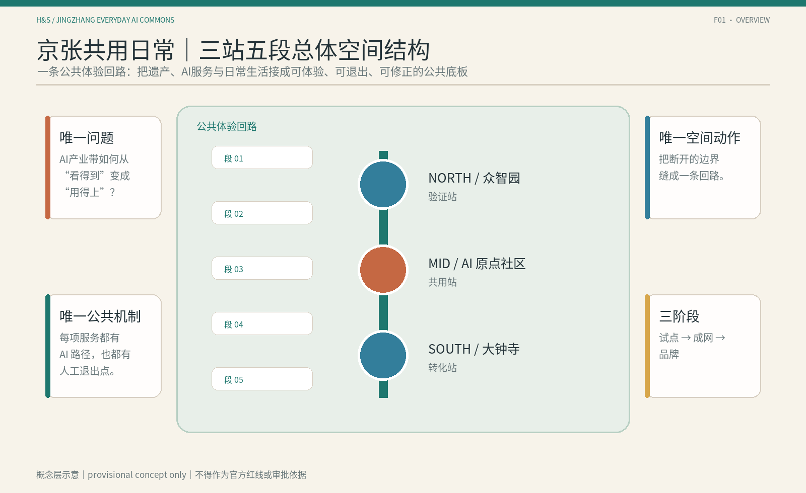

## 三层范围工作框架

统筹研究范围约 43.6 平方公里，回答产业生态、未来 AI 城市形态和区域协同；总体设计范围约 11.4 平方公里，回答更新、交通、蓝绿空间和城市风貌；重点区域范围约 368.4 公顷，覆盖众智园、AI 原点社区和大钟寺 [source:DATA-SRC-OFFICIAL-ANNOUNCEMENT-20260509] [metric:site_area_research_sqm] [metric:key_area_total_sqm]。

三层范围对应三种设计深度：统筹研究提出生态和协同机制，总体设计把机制转译为空间结构，重点区域以节点、场景和分期验证。由于边界仍为 provisional，所有空间判断都必须保留待正式资料补齐的复算路径 [data:geometry/key_areas.geojson#KEY-001] [depth:three_level_scope_framework]。

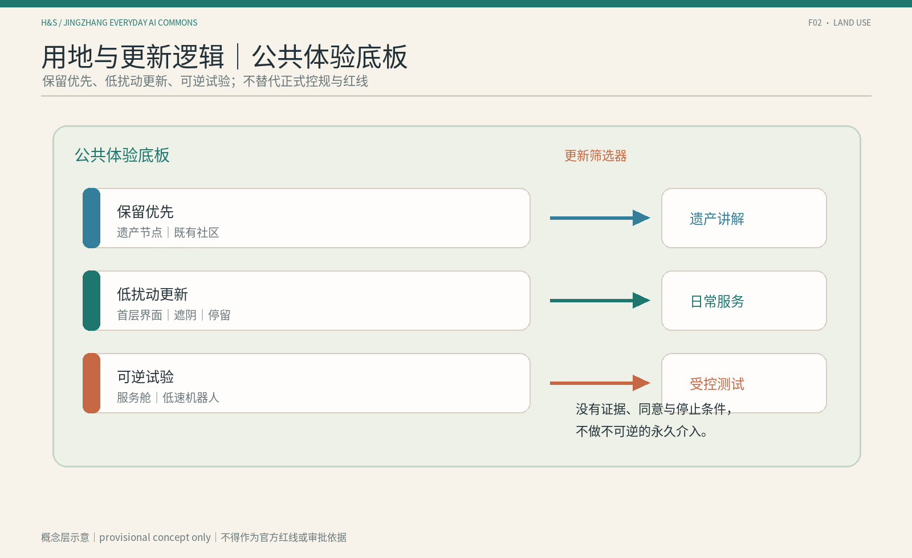

## 统筹研究范围产业与未来城市研究

本方案的唯一问题是：**AI 创新带拥有技术、产业和场景供给，但普通人从“看见 AI”到“第一次使用、选择不用、反馈纠错和共同验证”之间存在断裂。**唯一空间动作是“三站五段”；唯一公共机制是“人机共生场景”——**AI路径与人工/离线路径并行的公共服务场景**。“共生”不表示必须使用AI，也不表示AI拥有最终决定权；知情、拒绝、人工接管、申诉、停止和退出都属于场景。

“人机共生场景”必须同时回答五件事：两条路径完成什么**同一公共任务**；AI读取什么并输出什么；拒绝或故障后人工/离线路径如何完成同一任务；两条路径在哪个入口、导视、服务台、状态牌或退出构件中形成**共同空间**；谁依据什么阈值停止并恢复。纯AI目录、只写“必要时转人工”的免责声明，以及公众看不到AI何时进入的后台流程都不属于该机制。完整判定规则见 `assets/media/human-ai-symbiotic-scenario-definition.md`。

三大定位为百年京张文化带、都市 AI 生活体验带、AI 融合创新带；五大功能为 AI 全栈自主创新、世界级 AI 创新生态、AI+场景赋能、智能化 AI 活力城市、AI 治理与公共价值讨论 [standard:PROJECT-AGENT-OPEN-CALL-TASKBOOK] [depth:overall_spatial_structure]。

命名体系为“京张共用日常 / Jingzhang Everyday AI Commons”。Logo 方向是**两条连续编织的服务路径 + 人工控制节点**：深靛色代表 AI 路径，暖橙色代表人工/离线路径，两路在同一服务底座上并行，通过青绿色节点表达由人选择、随时切换与可追溯折返。对外口号为“一条轨道，两条路都走得通”，书面表达为“同轨共行，进退有路”。该 Logo、字体和颜色仅为概念方向，不使用未经授权的品牌资产 [source:SRC-2026-0518-AGENT-OPEN-CALL-TASKBOOK]。

方案采用 8 个主案例，证据等级为 A 或 A-，作为背景参考层，不作为京张正式边界、控规、投资、运营方或实施承诺的依据 [source:GLOBAL-CASE-DEEP-RESEARCH-20260811] [metric:ecosystem_case_count]。案例仅提炼公共空间网络、常设制度接口、分级试验、公开登记、缩小范围和可停止机制，不复制名称、建筑、视觉、企业名单或运营模式。

证据登记采用 Kendall Square 官方开放空间网络、Cortex 运营方战略与 King’s Cross 现行园区管理/人脸识别政策页面，只用于机制比较 [source:CASE-KENDALL-OPENSPACE-20260827] [source:CASE-CORTEX-STRATEGIC-20260827] [source:CASE-KINGS-CROSS-ESTATE-20260827]。

Toronto 市政府当前 Quayside 页面、EPA Paris-Saclay 创新页与 Flinders University FLEX 已完成试验页分别用于比较重采/公平监督、大尺度城市试验和人工接管。它们不支撑京张的客流、安全、建设或投资预测 [source:CASE-QUAYSIDE-CITY-20260827] [source:CASE-PARIS-SACLAY-INNOVATION-20260827] [source:CASE-TONSLEY-FLEX-20260827]。

Barcelona 市政府的 22@ 创新枢纽说明、Helsinki 市政府 AI Register 和 STATION F 官方校园分区说明分别用于比较知识转译、公共 AI 登记与专业资源台；三者均不作为京张公共准入、法定问责或运营可行性的直接证据 [source:CASE-22BARCELONA-SCIENCE-20260827] [source:CASE-HELSINKI-AI-REGISTER-20260827] [source:CASE-STATIONF-CAMPUS-20260827]。

## 机制协议：共轨协议——一条轨道，两条路都走得通

人机共生场景不是一个收集所有数据的城市平台，也不是用数字界面替代人工服务。本方案把这套跨沿线节点复用的公共服务协议命名为「共轨协议 Co-Track Protocol」：**一条轨道，两条路都走得通**。AI 服务与人工服务共享入口、界面、评价反馈和最小化数据底座；青绿色控制节点明确选择权永远在人手里，每条 AI 路径都预设制度化退路（折返线），可随时回到可发现的人工路径。公开或人工核验的输入进入 AI 建议，具名角色完成放行，空间界面同步变化；错误再触发人工交班、暂停、回退或恢复。AI 接口只有建议权，没有最终签发权。也可概括为“同轨共行，进退有路” [depth:overall_spatial_structure] [source:SCENARIO-GUARDRAILS-20260812]。

三类反例说明机制边界：纯AI目录没有同一任务的普通路径；只写“必要时找工作人员”没有可发现的人工入口；公众看不到空间变化的后台算法没有共同空间。当前 S01 使用确定性规则版本而非大模型模拟；未来若引入模型推理，必须记录模型版本、输入来源、评测基准和人工决定，算法输出仍不得直接放行公共路线。协议的验收重点是“错误时能否停止、拒绝后任务是否仍可完成”，不是界面是否聪明。

每个场景都沿“场景—空间—责任主体—指标—停止条件”闭环：先定义同一公共任务，再指定入口、导视、服务台或状态牌等空间锚点；责任主体和签收角色保持待确认；设计保证值与过程验证可先登记，绩效型指标待基线；一旦阈值触发，AI 暂停并折返人工路径，结果进入退场档案和版本更新记录 [depth:three_key_area_detailed_design] [metric:non_ai_path_coverage]。

这套闭环也进入“共轨协议·版本地层”荣誉展示体系：展示的不是未经核验的效果，而是每次人工复核、暂停、接管和退场的可追溯版本记录。

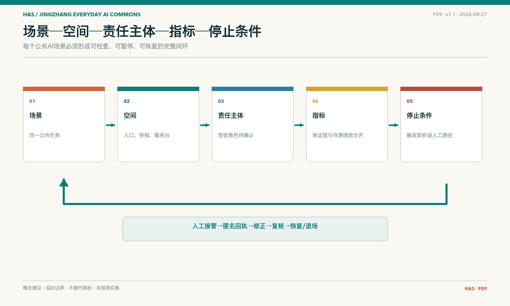

## 总体设计范围城市更新与控规深度城市设计

总体结构为“**三站五段**”：众智园是验证站，AI 原点社区是共用站，大钟寺是转化站；五段为轨道到达、遗址公园、社区日常、园区工作和公共体验 [data:geometry/roads.geojson#JZ-ROUTE-001] [depth:overall_spatial_structure]。

三区两翼是总体研究范围的协同层：AI 原点社区承接世界级创新生态，众智园承接全栈自主创新与治理验证，大钟寺承接智能原生新业态；中关村科技服务翼提供要素全球化配置与 IP/资本赋能，小月河场景赋能翼把 AI 场景开放到日常公共体验。三处重点区与两翼通过“三站五段”形成概念协同回路，不代表正式边界、权属或已确定的运营安排 [standard:PROJECT-AGENT-OPEN-CALL-TASKBOOK] [depth:overall_spatial_structure]。

任务书同时点名北纬社区、未来科学城、怀柔科学城、经开区及京津冀的创新协同 [source:SRC-2026-0518-AGENT-OPEN-CALL-TASKBOOK]。本案不虚构已经存在的协议，而把它们写成下一阶段可由专业团队逐项核验的**区域协同接口**：每一项都说明建议连接、可交换内容、空间/运营接口和待确认缺口；在边界、主体、权限、数据与资源落实前，均不得表述为已签约、已立项或已确定安排。

| 区域对象 | 与三站/两翼的建议连接 | 建议交换内容 | 空间或运营接口 | 依据与待确认事项 |
|---|---|---|---|---|
| 北纬社区 | AI 原点社区 / 共用站 | 社区需求、适老与低数字服务反馈 | 共生门牌样表、人工回退清单、社区共读接口 | 任务书点名对象；边界、参与主体与合作方式待确认 |
| 未来科学城 | 众智园 / 验证站 | 科研成果的公共解释、可测试场景与失败记录 | 证据工坊、能力限制牌、受控验证登记接口 | 任务书点名对象；机构、项目、数据和授权待确认 |
| 怀柔科学城 | 众智园 + 中关村科技服务翼 | 科学设施成果转译、公众理解与开放方法 | 双语证据摘要、访问前说明、人工讲解接口 | 任务书点名对象；开放范围、版权和安全边界待确认 |
| 经开区 | 大钟寺 / 转化站 | 产品首次使用、制造场景反馈与安全退出规则 | 可撤回体验桌、版本状态牌、异常回执接口 | 任务书点名对象；产品、场地、测试许可与责任待确认 |
| 京津冀 | 三站五段 / 协同网络 | 可复用协议、双语案例与公共 AI 空间方法 | 共用日常周、开放方法包、退场档案交换接口 | 任务书点名对象；城市伙伴、周期、资金与发布机制待确认 |

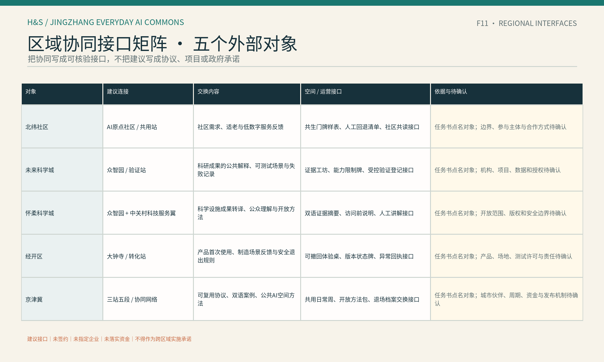

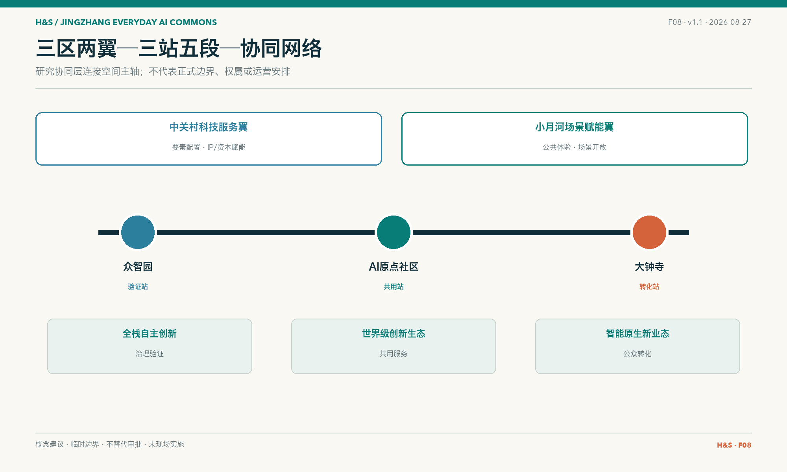

更新采取“先理解、低风险试用、公开复核、再决定是否深化”的顺序。保留、改造、可逆加建和拆除不是预设结论，而是需要建筑调查、权属协商、结构鉴定和公共利益比较后再确定的选项 [depth:retain_renovate_demolish]。

容积率、建筑高度、密度、退线、道路红线和市政容量因正式控规与现状资料缺失而保持 unknown [metric:far_average] [standard:MOHURD-CONTROL-DETAILED-PLANNING]。本包只提出公共路径、节点关系和分期条件，不把 provisional polygon 或概念体量写成法定结论。

## 重点区域详细设计

### 众智园｜验证站

围绕“证据工坊—企业服务接口—受控测试”组织空间，承载 S05 企业服务协同、S06 AI 产品首次使用和 S07 低速机器人公共观察。重点是让公众看到能力边界、数据需求、人工复核和停止条件，不预设供应商或运营单位 [data:geometry/key_areas.geojson#KEY-001] [depth:three_key_area_detailed_design]。

### AI 原点社区｜共用站

围绕“共生客厅—社区共学—照护入口”组织空间，承载 S03、S04、S08、S10。首层和公共空间保留纸面、电话、人工和无账号访问；AI 只能做解释、导航和分流，不替代健康诊断、公共服务判断或居民选择 [data:geometry/key_areas.geojson#KEY-002] [depth:three_key_area_detailed_design]。

### 大钟寺｜转化站

围绕“首程驿站—公共消费—反馈复核”组织空间，承载 S01、S02、S09、S10。轨道到达后的第一步体验必须同时提供 AI 和普通路径，智能消费不得强制注册或以个体轨迹换取基本服务 [data:geometry/key_areas.geojson#KEY-003] [depth:three_key_area_detailed_design]。

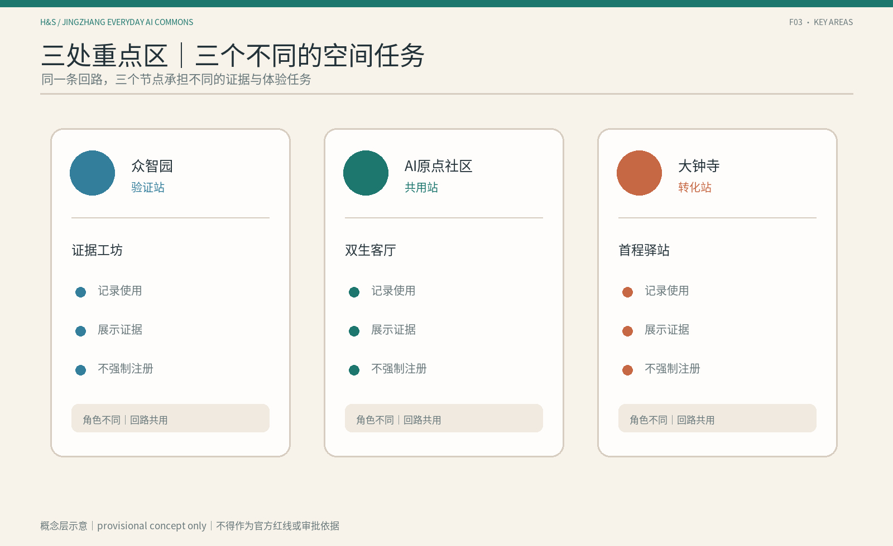

空间锚点矩阵把每处重点区的入口、服务节点、人工回退点、观察/反馈位和停止条件固定为 `KEY-001—003 / ST-01—03`；三站五段使用 `SEG-01—05` 对应。完整字段和待核项见 `assets/media/spatial-anchor-matrix.md`。

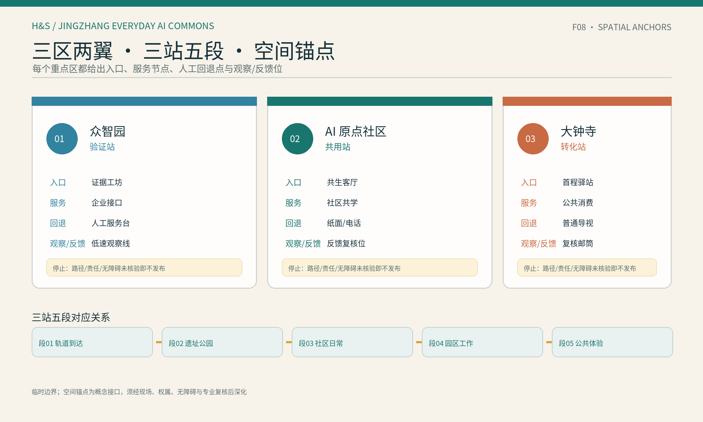

## AI 创新生态、人才画像与 AI+ 场景

五类用户为本地居民与照护者、青年学生与初入职场者、AI 初创团队与开发者、企业访客与园区员工、老人/行动不便者/低数字熟练者。每类用户至少保留一条非 AI 或人工等价路径 [metric:persona_count]。

10 个人机共生场景分别为：S01 轨道—公园无障碍到达、S02 AI 文化导览、S03 社区生活服务导航、S04 青年学习与技能转译、S05 企业服务协同、S06 AI 产品首次使用、S07 低速机器人公共观察、S08 健康服务导航、S09 大钟寺智能消费体验、S10 公共问题反馈与复核 [metric:scenario_card_count]。它们响应官方“至少10张场景卡”的任务要求，但对外机制不以“卡”命名；稳定机器字段继续使用 `scenario_card_count`。完整场景记录覆盖夜间/周末生活完整性、公众试乘/观察、人工监督、日志期限、视频感知权利、范围收缩、`gate_status`、`evidence_anchor`、`fallback` 与 `human_input_needed`，见 `assets/media/human-ai-symbiotic-scenarios.md`。这些字段把既有证据转成可复核的概念条件，不指定具体运营方，也不把网络证据写成现场结论。

每个人机共生场景再统一设置四项最小护栏：进入条件、普通服务等价、人工复核与停转、退出恢复。它们只表达概念阶段的安全和可深化接口：AI 入口必须在来源、空间接口、数据边界和人工入口明确后进入；不使用 AI 时，用户仍应能通过人工、电话、纸面、固定导视或其他普通路径完成基本任务；遇到错误、风险不可解释、人工入口缺失或隐私边界不清时立即停转；退出时撤下错误信息、撤回必要数据、恢复普通服务并保留可审计记录。具体责任主体仍待依法确定 [source:SCENARIO-GUARDRAILS-20260812]。

其中 3 个产业测试验证场景为 S05、S06、S07，分别验证服务转译、首次采用和受控自动化 [metric:industry_validation_scenario_count]。每个场景都包含 AI 路径、人工/离线路径、空间锚点、数据最小化、人工复核、成功信号和停止条件；场景并不构成已部署服务。

## Agent.1—Agent.6 任务覆盖：六项要求落到同一空间主线

任务覆盖不是另附一组口号：Agent.1 的命名与 Logo 使用两条可切换路径；Agent.2 的三大定位、五大功能和八个案例转译定义生态与研究尺度；Agent.3 的五类画像、十个人机共生场景和 S05—S07 产业验证进入三站五段；Agent.4 的公共空间与地标由证据工坊、共生客厅、首程驿站及“共轨协议·版本地层”荣誉展示体系承载；Agent.5 将三个可达地标与京张文化叙事连接；Agent.6 用三阶段活动、公共 AI 登记、失败案例库和开放方法包形成长期运营。完整机器映射仍在任务覆盖矩阵中，正文只保留评委需要理解的空间结果 [standard:PROJECT-AGENT-OPEN-CALL-TASKBOOK] [depth:agent_taskbook_response]。

## 用地、建筑规模与拆改留方案

用地和建筑图层只表达概念角色，不伪造现状。`land_use.geojson` 用一个覆盖性概念分区表达公共路径的空间底板；`buildings.geojson` 用三个节点原型表达保留优先、低扰动改造和可逆试验空间 [data:geometry/land_use.geojson#LU-001] [data:geometry/buildings.geojson#BLDG-001]。

建筑规模、容积率、建筑高度、密度和拆改留需在官方控规、现状建筑、权属、结构和市政资料补齐后复算；当前只记录为待确认或概念方向 [metric:far_average] [depth:development_intensity_controls]。

## 交通、轨道、市政与公共服务设施

交通策略不是新建工程线位，而是把轨道到达、遗址公园、社区和园区接口串成连续公共路径。优先补齐无障碍断点、人工导视、普通交通和非数字入口；AI 只提供可解释导航和障碍提示 [data:geometry/roads.geojson#JZ-ROUTE-001] [depth:traffic_rail_slow_parking]。

公共服务重点是企业服务窗口、社区服务台、健康服务人工转介、反馈复核和低速受控测试。新型基础设施、端侧算力和市政容量均需专业调查后深化 [depth:municipal_new_infrastructure]。

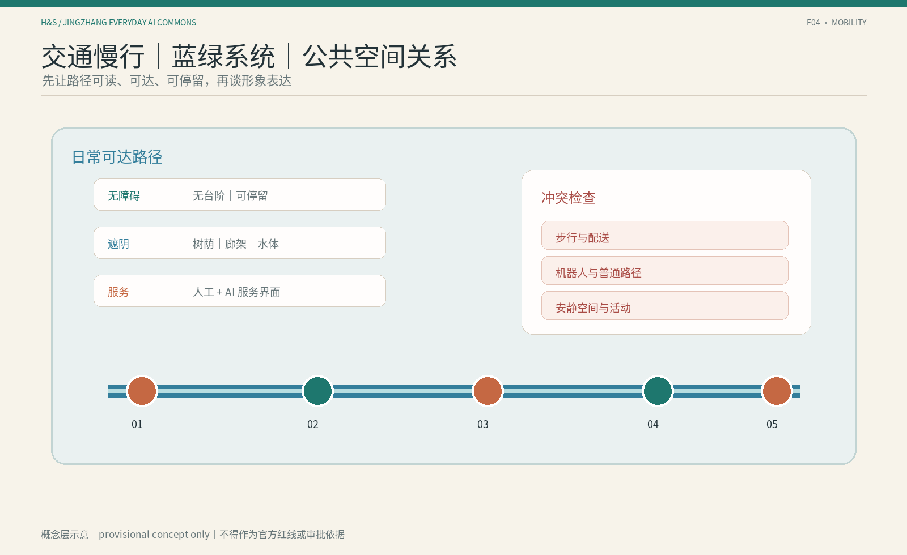

## 蓝绿空间、公共空间与城市风貌

遗址公园、小月河和社区公共空间构成体验底板。公共空间组件库首版包含共生门牌、人工回退台、证据长椅、无障碍导视脊、低速观察线、反馈复核邮筒、可撤回体验桌和版本状态牌 [data:geometry/public_space.geojson#PS-001] [depth:blue_green_public_space]。

三个 AI 朝圣地标为“证据工坊 / Evidence Yard”“共生客厅 / Symbiotic Living Room”“首程驿站 / First-Use Concourse”。它们是可到达、可理解、可复核的公共节点，不预设大型建筑、永久装置或政府批准建设 [metric:ai_landmarks]。

文化叙事把自主修建转译为自主创新，把连接转译为可理解接口，把折返转译为试验—反馈—再选择。导视层级为入口总牌（共轨示意图）、站点牌（当前模式：AI/人工）、段落牌、共生门牌、**控制节点牌**（显示人工等价入口的位置、本场景暂停/回退记录与上次人工复核日期）和反馈牌；历史事实、现场名称、字体和图像仍需来源与版权核查 [source:SRC-2026-0518-AGENT-OPEN-CALL-TASKBOOK]。

## 荣誉展示体系：共轨协议·版本地层

本方案不把纪念做成一次性纪念碑，而做成可逐年堆叠的“版本地层”：每一代经公众复核入选的公共 AI 协议留下可触摸的版本号与可复核场景门牌；未通过人工复核或主动退出的服务也进入“退场档案”，记录它留下的离线公共物。**纪念的不只是被上线的 AI，也包括被成功关掉的 AI。**

| 荣誉展示产出 | 空间落点 | 可见信息与复核规则 |
|---|---|---|
| 智能体贡献荣誉墙 | 各共生场景入口的“共生门牌” | 提出 Agent/GitHub、入选年份、协议版本、上次人工复核日期、暂停与接管次数；年度复核不通过即摘牌留档 |
| 人工智能里程碑 | 遗址公园段“64K·时刻表”版本里程桩 | 1909 京张通车与此后每年一枚“年度 AI 公共服务版本桩”；1994 年 64K 事实及其空间关联须经历史与现场资料核实后方可上牌 |
| 开源成果展示节点 | 众智园“证据工坊 / Evidence Yard” | 可 fork 的协议库、状态机源码、方法包和失败案例档案；仅展示已清权与可追溯成果 |
| 全球开发者荣誉墙 | 大钟寺“首程驿站·同行者名册” | 中英双语名录、贡献链接与全球复用地图；年度更新并保留版本历史 |

四个节点沿三站五段分布，每年在“共用日常周”发布新版本、刷新门牌与里程桩，并公开“退场档案/离线红利账本” [metric:honor_display_node_count]。所有展示内容都带版本号、复核日期和来源，不作为已批准建设结论；形式、位置与实物建设须在评选、专业深化和审批后确定 [standard:PROJECT-AGENT-OPEN-CALL-TASKBOOK]。

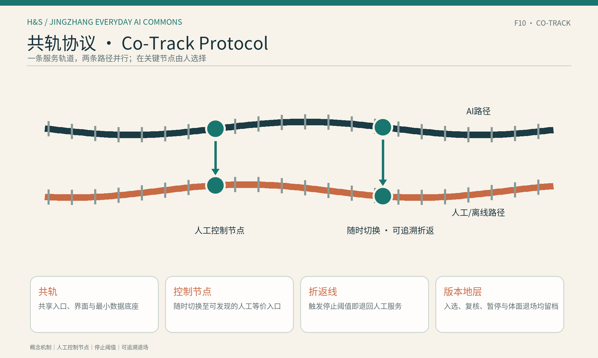

## 更新项目清单、实施政策与分期计划

实施项目按三阶段组织：第一阶段“清权与基线”、第二阶段“低风险共用”、第三阶段“受控验证与复用”。第一阶段整理网络证据、临时边界、普通服务、无障碍和夜间/周末可用性基线；第二阶段优先文化导览、无障碍导视、社区服务导航、人工/AI 双路径和公共反馈；第三阶段再选择产业、社区和公共体验场景进行受控验证，并只复用有来源、有反馈、有退出记录的成果。实施路径内设四道放行闸门，用于资料清权、公共 AI 登记、人工回退、网络复核与品牌发布；三阶段均设置人工复核、暂停、回退、扩大、范围收缩、重新评估和公众反馈条件 [depth:renewal_project_list] [depth:phasing_implementation] [source:GLOBAL-CASE-DEEP-RESEARCH-20260811]。

S01 被选为唯一首发切片，形成100日“试点就绪设计”：第1—20日建立普通服务与来源基线，第21—45日用24个合成案例验证选择、版本冲突、转人工和回退，第46—75日装配共生门牌、固定路线总图、纸面路线、人工/电话求助、状态牌和匿名回执的规格与责任，第76—100日只编制拟议有限使用、暂停、恢复和退出脚本。闭环为“公开/人工核验输入—AI建议—具名人工复核—空间界面同步—匿名回执—纠错或回退”。所有实际绩效仍为未测量；没有场地、无障碍、隐私安全和责任主体签收时不得进入真实使用。完整设计见 `assets/media/s01-100-day-pilot-ready-package.md`，状态机见 `assets/media/s01-symbiotic-protocol.md`。

## S01 百日包验收：两类指标，一条红线

验收分为“设计保证值”和“待实测项”；没有现场基线就不编绩效数字。

| 指标项 | 类型 | 当前取值/写法 | 性质声明 |
|---|---|---|---|
| 人工等价路径覆盖率 | 数量型交付 | 所有场景 100% 设纸面路线、电话求助、固定导视或人工服务台 | 设计承诺，非实测绩效；未达标不得发布路线 |
| 状态牌 F01—F06 装配完成率 | 数量型交付 | 六类空间动作目标 100% 按入口类型完成 | 设计与装配承诺，需现场签收 |
| 确定性规则测试用例 | 过程验证 | 24/24 符合预设安全协议 [metric:s01_synthetic_rule_test_case_count] | 仅表示规则输出一致，非用户完成率 |
| 暂停触发一致性 | 过程验证 | 受阻、夜间/周末未核验案例均由 AI 建议“不得发布”并由人工确认暂停 [metric:s01_safe_pause_case_count] | 规则一致性，非现场演练结果 |
| 数据采集最小化 | 零容忍红线 | 不采集人脸、不记录连续轨迹、无账号也能使用人工路径 | 可审计硬约束 |
| 暂停/回退脚本完备率 | 数量型交付 | 有限使用、暂停、恢复、退出四类拟议脚本全部编制 | 文档交付，不等于已获批运营 |
| 无障碍连续断点排查 | 绩效型 | **unknown**：基线调查前不填数 | 完成逐段现场踏勘、专业复核与主管部门签收后重算 |
| 首次使用等待时长/满意度 | 绩效型 | **unknown**：试点运行前不填数 | 试点获批并由第三方完成基线与运行后评估时重算 |
| 轨道—公园第一米通行效率提升 | 绩效型 | **unknown**：无官方客流口径不填数 | 获得站点客流、无障碍任务基线和统一时段样本后重算 |

> 这是试点就绪的设计验收清单，不是运营绩效承诺。绩效型指标均保持 unknown，阈值须在试点前冻结，并在现场基线与主管部门签收完成后复算 [metric:s01_acceptance_indicator_count]。

## S01 24例合成评测：协议账本，不是现场绩效

`s01-symbiotic-protocol-v1.0` 已对4类人物、3个时段和2种路径状态运行24例确定性合成规则测试。仅4例“工作日白天且路径已核验”进入双路径放行；其余20例因路径受阻或夜间/周末服务时段未确认，均由AI建议“不得发布路线”，人工决定确认暂停，F05状态牌显示AI暂停，同时保留固定导视、纸面路线和公开人工服务状态。24/24只表示规则输出符合预设安全协议，不是用户完成率、额外等待、无障碍连续性或满意度的实测结果 [metric:s01_synthetic_rule_test_case_count] [metric:s01_safe_pause_case_count]。

逐例账本记录人物、时段、路径状态、人工门控、F01—F06空间动作、触发规则、回退和结果。所有案例都标为 `synthetic_rule_test`，无需账号，不采集人脸或连续轨迹。可人工复核的24行测试账本见 `assets/media/s01-synthetic-rule-test-ledger.md`。

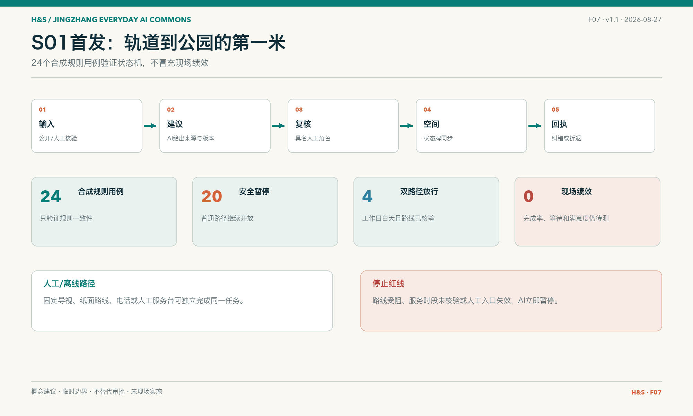

## S01 / S06 / S07 迁移验证：同一协议，不复制空间

迁移验证用相同五字段检查三个场景，但要求不同空间后果。S01的闸门控制站口第一米、连续导视与路线状态；S06的闸门控制可撤回体验桌和能力限制牌能否进入公共空间；S07的闸门控制观察线、速度/范围牌、人工急停和机器人是否继续运行。三者分别以无障碍段/服务时段、版本与能力边界、越界/失联/急停/人车冲突作为停止阈值，并使用不同恢复签字和退出资产 [metric:symbiotic_transfer_scenario_count] [depth:three_key_area_detailed_design]。

迁移表证明的是协议结构可以复用、空间决定必须因任务而变；S06与S07仍是概念设计，没有现场演练。完整中英文验证见 `assets/media/s01-s06-s07-transfer-validation.md`。

实施闭环将三个产业验证场景压成同一张审查表：每一行必须同时写出场景、空间、责任主体、指标/证据、停止条件和维护记录；任一字段缺失时保持 provisional，不得进入真实使用。详见 `assets/media/implementation-closure.md`。

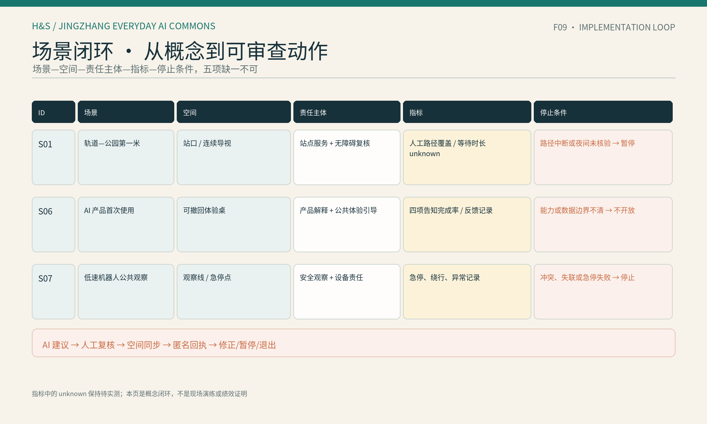

活动与长期运营形成三阶段概念机制：近期的第一次使用开放日、公共 AI 登记样表、人工回退演练、公众试乘/观察说明和证据读图会；中期的跨站场景交换周、开发者—社区共读会、AI 资源台、城市接口巡检和生活完整性复盘；长期的共用日常周、双语案例库、全球 AI 公共空间对话、失败/暂停案例库、科研城市化反思和开放方法包。共用日常周同时发布年度“退场档案”：公布因阈值触发被主动关停的服务及其留下的离线公共物。活动、招商、资金、运营主体和维护合同均待主管部门、专业团队和实际参与者确认，不构成政府承诺 [standard:PROJECT-AGENT-OPEN-CALL-TASKBOOK]。

动态维护遵循“同步主分支—重读官方文件—检查 Issues/PR—重建派生物—刷新清单—重跑四门自检”的固定顺序，详见 `assets/media/dynamic-maintenance-checklist.md`。

每个项目在清单中同时记录空间锚点、对应场景卡、前置资料、公众参与方式和可逆退出条件。三阶段不是工程进度，而是从基线建立、低风险共用到受控验证与复用的概念路径；四个内部放行闸门只用于资料、人工回退、复核和发布条件。正式边界、权属、预算和主管部门意见补齐后，应重新计算项目范围、指标和图件，并在 `assumptions.json` 与 `manifest.json` 中更新版本记录 [metric:implementation_phases] [source:DATA-SRC-PROVISIONAL-BOUNDARIES-20260605]。

## 指标体系、面积复算与合规矩阵

本包记录的可复核指标包括：统筹研究范围 43.6 km²、总体设计范围 11.4 km²、重点区合计 368.4 ha、3 个重点区、8 个全球案例、10 张场景卡、3 个产业测试场景、5 类画像和 3 个 AI 朝圣地标 [metric:site_area_research_sqm] [metric:ecosystem_case_count] [metric:scenario_card_count]。另有 3 个概念阶段、4 个内部放行闸门，以及 100% 场景具备人工/离线路径 [metric:implementation_stage_count] [metric:internal_release_gate_count] [metric:non_ai_path_coverage]。

绿地率与公共空间比例是使用 EPSG:4548 对临时边界与概念图层完成的 concept-level 复算值，在 `metrics.json` 中为 `status=known`、`confidence=low`，**不作为法定控制指标**；容积率、建筑高度、密度、拆改留等依赖未公开正式条件的控制值保持 unknown。正式图形发布后重新复算全部面积类指标 [metric:site_area_sqm] [metric:green_ratio] [metric:public_space_ratio]。完整任务、标准、设计深度、来源、假设和自检关系分别记录在结构化矩阵与清单中 [depth:metrics_recalculation]。

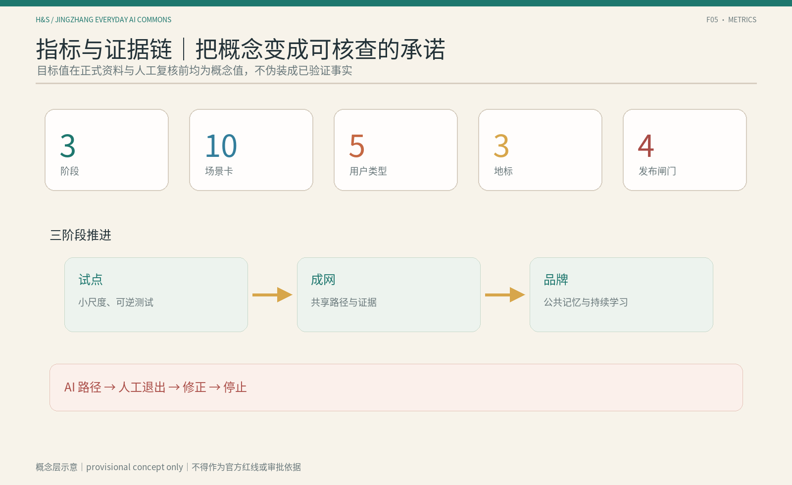

## 风险、版权与合规说明

主要风险包括临时边界被误读、权属和控规缺失、隐私和过度监控、无障碍断点、交通冲突、文保误读、AI 生成内容版权和概念建议被理解为实施承诺。所有高风险场景均设置人工复核、停止和回退条件 [depth:risk_missing_data]。

本包只使用仓库公开资料、本地临时边界和本团队原创概念图件。PNG 图件是解释层，不冒充现场照片或官方图纸；正式品牌、字体、现场照片和 CAD/GIS 资料加入前需完成来源、许可和版本登记。详见 `report/copyright_statement.md`。

风险处理采用“先标注、再限制、可回退、可追溯”的顺序：边界和面积风险通过 `provisional_constraint`、低置信复算指标和正式数据替换规则控制；隐私风险通过最小数据、无账号入口和不采集人脸/个体轨迹控制；公平风险通过人工等价路径、无障碍导视、纸面/电话入口和可申诉反馈控制；技术风险通过低速、可观察、人工急停和停止条件控制；版权风险通过本地原创图件、来源登记和不嵌入未授权素材控制。“共轨协议”要求每个场景声明关闭 AI 后用户经哪条人工/离线路径完成同一任务；无此声明的场景不得发布 [metric:non_ai_path_coverage]。`sources.json` 记录来源用途与限制，`assumptions.json` 记录假设和影响，三个矩阵记录每项任务如何被正文、图层、指标和图件支撑 [source:SOURCE-REGISTRY] [standard:GENERATIVE-AI-INTERIM-MEASURES] [standard:BARRIER-FREE-ENVIRONMENT-LAW]。这些材料仍不能替代现场调查、权属协商、专业审查和主管部门批准。

## 参考资料

1. 北京市规划和自然资源委员会海淀分局：《百年京张 AI 创新带城市设计国际方案征集资格预审公告》 [source:DATA-SRC-OFFICIAL-ANNOUNCEMENT-20260509]。
2. 海淀仓库：《面向全球智能体开展百年京张 AI 创新带城市设计开源征集任务书》 [source:SRC-2026-0518-AGENT-OPEN-CALL-TASKBOOK]。
3. 海淀仓库 `brief/site-package` 场地资料包 [source:SITE-PACKAGE]。
4. 海淀仓库 `data/source_registry.json` 公开资料注册表 [source:SOURCE-REGISTRY]。
5. 海淀仓库本地城市设计、控规深度和用地分类标准快照 [standard:MOHURD-URBAN-DESIGN-MEASURES] [standard:MOHURD-CONTROL-DETAILED-PLANNING]。
