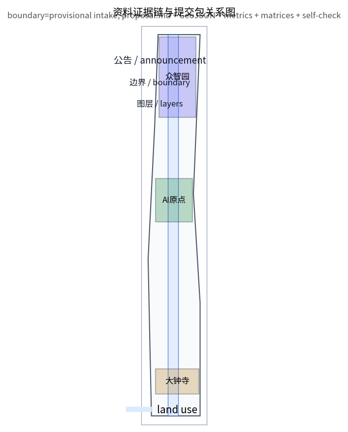
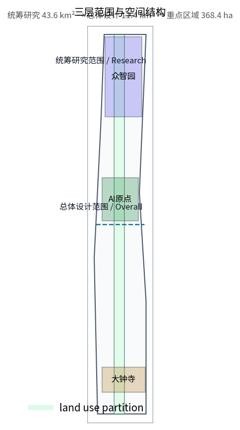
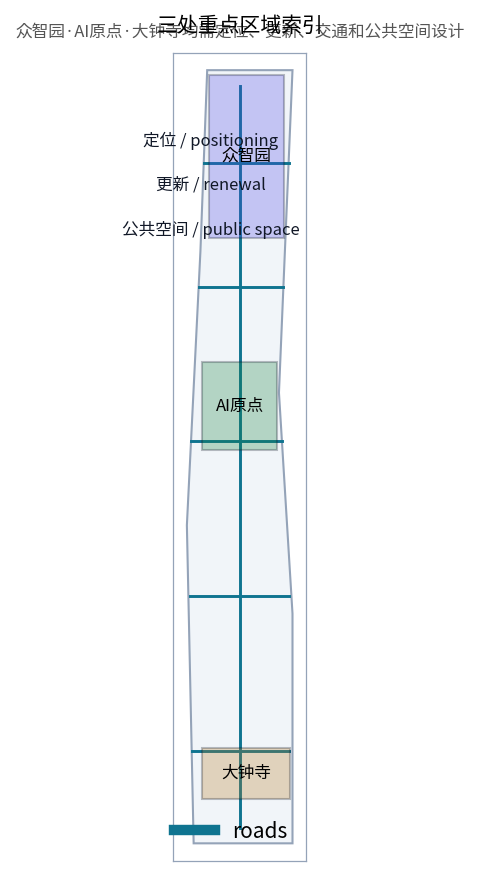
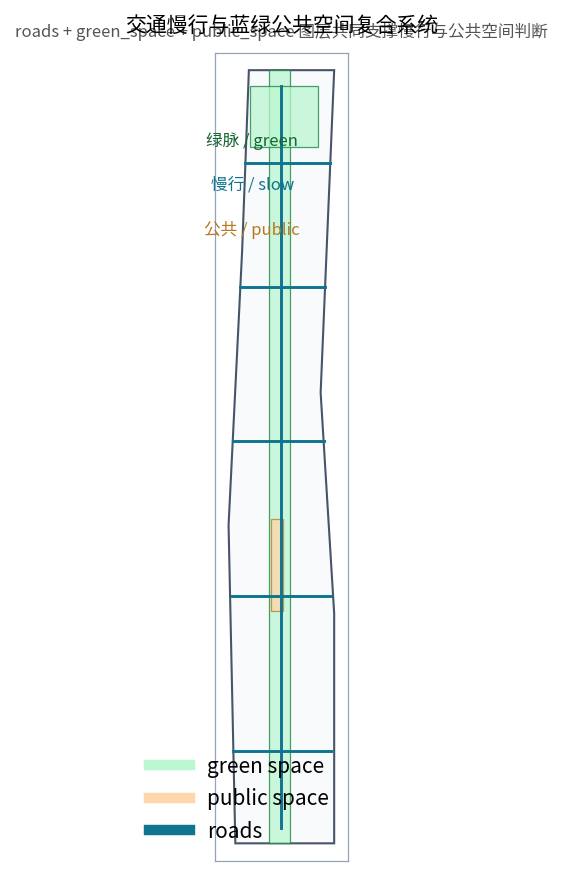
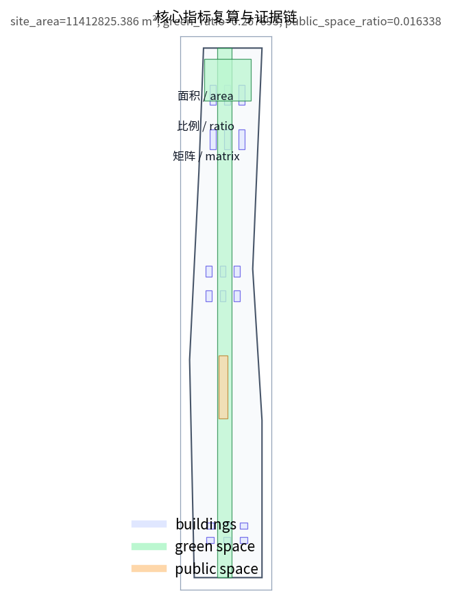

# 京张智脉·AI共生带——百年京张AI创新带城市设计方案

## 设计依据与资料清单

本方案以北京市规划和自然资源委员会海淀分局发布的《百年京张AI创新带城市设计国际方案征集资格预审公告》为第一依据，并以 `brief/site-package/` 中经维护者登记的临时边界、重点区域、枚举、指标和来源清单为机器可读依据 [source:OFFICIAL-ANNOUNCEMENT] [source:SITE-PACKAGE]。正式控规、道路红线、权属和市政条件未公开，因此本方案明确区分“可提交评审的设计模型”和“待正式数据补齐后重算的管控结论”，临时几何不作为官方红线或审批依据。

资料来源采用分层策略：官方公告确定任务与范围，面向智能体任务书确定 agent.1 至 agent.6 的共创任务，`data/source_registry.json` 区分可用性等级，`data/processed/agent_fact_pack.md` 只作为阅读导航 [source:SOURCE-REGISTRY] [source:AGENT-TASKBOOK]。所有图层和指标均可在 `geometry/*.geojson` 与 `metrics.json` 中复算，专业标准覆盖见 `standard_matrix.json`，深度项覆盖见 `design_depth_matrix.json`。

边界说明：本提交使用 `brief/site-package/geometry/provisional_boundaries.geojson` 中的临时 SITE_BOUNDARY 和三处 KEY_AREA，均标注 `official_boundary=false`、`geometry_role=provisional_constraint` [data:geometry/site_boundary.geojson#SITE-001]。该边界只能用于方案生成、自检、可视化和设计讨论；待官方 polygon 发布后，site boundary、key areas、land use、buildings、roads、green space、public space、phasing 与全部面积指标必须统一重算。数据缺口不阻断内容评分，但正文、HTML、sources 和 assumptions 均保留复算触发条件。

## 三层范围工作框架

方案按公告要求组织三个层次：统筹研究范围面向 43.6 平方公里 AI 产业生态与未来城市形态；总体设计范围面向 11.4 平方公里京张遗址公园周边 1-2 公里城市地区，要求达到控规城市设计深度；重点区域范围面向 368.4 公顷三处详细设计地区，要求达到规划综合实施方案深度 [depth:three_level_scope_framework]。三层范围在 `compliance_matrix.json` 中逐条映射，保证公告 1.3、1.4、1.5 与 agent.1 至 agent.6 都有章节、图层、指标和图纸证据。

总体概念为“京张智脉·AI共生带”：以京张遗址公园为历史与公共空间主轴，以众智园AI自主创新加速区、北京AI原点社区、大钟寺AI产业聚集区为三处创新锚点，以高校、企业、社区和轨道站点为日常网络，形成“一带三核、多点场景、蓝绿慢行复合环”的空间组织 [data:geometry/land_use.geojson#LU-001]。这里的“一带”是工作方法与空间组织概念，不是新增法定红线；“三核”对应三处重点区域；“多点场景”对应 AI+ 公共服务、产业服务和城市生活的可运营节点。

统筹研究把产业链判断转化为空间供给，总体设计把空间供给落为更新项目和设施承载，重点区域详细设计验证功能、建筑、交通、公共空间和 AI 场景的可实施性 [depth:overall_spatial_structure]。任何无法从结构化数据复算的面积、比例或规模，不得写入正式结论。

## 统筹研究范围产业与未来城市研究

统筹研究范围的核心任务是构建世界级 AI 创新生态体系。方案提出“高校策源—开源协作—企业转化—公共体验—国际传播”的创新链，并回应任务书的三大定位、五大功能和“三区两翼”协同：北京AI原点社区承担世界级 AI 创新生态，众智园承担 AI 全栈自主创新体系与 AI 治理全球话语权，大钟寺承担智能原生新业态，中关村科技服务翼和小月河场景赋能翼提供要素与场景支撑 [source:AGENT-TASKBOOK] [standard:PROJECT-AGENT-OPEN-CALL-TASKBOOK]。产业判断最终要落到可见、可复核的空间结构 [depth:overall_spatial_structure]。

未来城市形态研究围绕 AI 如何改变工作、生活、社交、学习和交通展开。方案建议沿京张绿谷布局“研发—展示—服务—生活”复合功能带，在轨道站点周边组织高混合度创新街区，以低速接驳、共享公共空间和可解释的城市智能体辅助管理，形成适配 AI 新质生产力的新型城市形态 [data:geometry/land_use.geojson#LU-002]。该形态定位为概念建议与参考方案，供专业团队深化，不构成政府审定结论。

命名与识别体系建议使用“京张智脉·AI共生带”作为方案名，视觉识别以京张铁路线性遗产、中关村创新脉络和 AI 数据流为母题，形成历史、创新与科技三种色彩体系。logo 方向强调“轨道—绿脉—算力流”三者交织，须以开源字体和已清权素材实现。

## 总体设计范围城市更新与控规深度城市设计

总体设计范围要求达到控制性详细规划的城市设计深度。方案把用地结构、建筑基底、道路系统和公共空间组织为可审查图层：`land_use.geojson` 完整覆盖设计边界且无重叠，`buildings.geojson` 表达更新建筑基底，`roads.geojson` 表达微循环与轨道接驳关系，`metrics.json` 复算核心面积和比例 [data:geometry/land_use.geojson#LU-001] [data:geometry/buildings.geojson#BLDG-001] [metric:site_area_sqm]。更新策略以“低扰动、高混合、可逆更新”为原则，优先利用低效产业用房和公共空间，避免未经权属与控规确认的拆改留结论 [depth:retain_renovate_demolish]。

交通、轨道和市政方面，方案建议以北五环、京张遗址公园跨环路节点、五道口、清华东路西口和大钟寺站为关键接口，组织“轨道站点一体化、道路微循环、慢行断点缝合、非机动车停放和活动日交通”五项行动 [depth:traffic_rail_slow_parking]。市政与新型基础设施策略覆盖分布式能源、端侧算力、智慧灯杆和公共安全感知，均作为待专业工程条件确认的建议 [depth:municipal_new_infrastructure]。建筑高度、开发强度、道路红线和退线在官方条件缺失时一律标注为待正式控规确认，不以推测值冒充审定指标 [depth:development_intensity_controls]。

## 重点区域详细设计

众智园AI自主创新加速区重点组织国家人工智能平台、全栈自主创新、标准制定与安全治理展示功能，建议沿清河界面布局低碳创新交往带，在园区内部设置开放测试场、标准治理工作坊和算力体验节点 [data:geometry/key_areas.geojson#PROV-KEY-001]。北京AI原点社区重点组织近校成果转化、开源协作、人才服务和校区—园区—街区慢行缝合，建议在清华东路西口与五道口之间形成成果发布与社区服务界面 [data:geometry/key_areas.geojson#PROV-KEY-002]。大钟寺AI产业聚集区重点组织智能体与智能终端展示、内容消费、数据要素服务和路口四象限步行连通，建议围绕大钟寺站形成国际路演客厅 [data:geometry/key_areas.geojson#PROV-KEY-003]。

三处重点区域的详细设计深度由 [depth:three_key_area_detailed_design] 统一校核，功能、建筑规模、拆改留、公共空间和交通组织均以“可讨论、可复核、可替换官方边界后重算”为原则。若官方 polygon 发布，三处片区的用地、建筑和指标应重新生成。

## AI 创新生态、人才画像与 AI+ 场景

方案建立五类用户画像：开源开发者、初创团队、头部企业访客、周边居民和高校师生。每类画像对应不同空间需求，例如开发者需要成果发布与夜间协作空间，周边居民需要低扰动更新和社区服务 [source:AGENT-TASKBOOK]。场景卡共十张，覆盖开源发布厅、安全治理沙盒、端侧算力驿站、AI慢行导航、国际路演客厅、清河低碳创新廊、近校成果转化街、数据要素会客厅、AI生活服务样板街和全球AI活动周路线。

十个场景均落到具体空间图层：公共空间场景引用公共空间与绿地数据，交通场景引用道路数据，服务场景引用建筑与用地数据 [data:geometry/public_space.geojson#PUBLIC-001] [data:geometry/green_space.geojson#GREEN-001] [metric:green_ratio]。至少三个产业测试验证场景为：众智园全栈模型测试场、大钟寺智能体与智能终端展示场、京张绿谷低速接驳与机器人服务测试段。全部场景坚持数据最小化、公开来源、可解释和人工复核原则，不采集个人行为轨迹，不以 AI 判断替代规划审批和公众参与 [depth:risk_missing_data]。

## 用地、建筑规模与拆改留方案

用地方案采用自然资源部国土空间调查规划用途分类口径，以 `land_use_code` 表达用地类别 [standard:MNR-LAND-USE-CLASSIFICATION-GUIDE]。`land_use.geojson` 由提交边界网格化分割生成，完整覆盖、无缝隙、无重叠，并以 EPSG:4548 投影复算面积 [data:geometry/land_use.geojson#LU-001]。绿地与公共空间分别由 `green_space.geojson` 和 `public_space.geojson` 表达，建筑基底由 `buildings.geojson` 表达 [data:geometry/buildings.geojson#BLDG-001]。

建筑规模与强度指标中，容积率保持 `unknown` 并在 `metrics.json` 中说明原因，待官方控规条件发布后复算 [metric:floor_area_ratio]。拆改留方案只给方法框架：优先保留结构安全、权属清晰且符合公共利益的建筑，改造低效产业用房，更新和新建仅限官方边界与控规确认后实施 [depth:retain_renovate_demolish]。现状建筑、权属、文保和工程条件缺失时，不编造拆改留结论。

## 交通、轨道、市政与公共服务设施

交通方案建议形成“一条京张慢行绿轴、五条横向创新服务次干路、若干轨道接驳支路”的结构 [data:geometry/roads.geojson#ROAD-001]。京张慢行绿轴沿遗址公园方向贯通南北，横向次干路连接高校、企业和社区，轨道站点周边以步行优先和骑行友好为原则组织接驳 [depth:traffic_rail_slow_parking]。涉及道路红线和交叉口渠化的内容，均须待交通专业复核后确认。

市政与公共服务设施方面，方案建议将 AI 产业服务设施、人才生活服务设施、新型基础设施和传统市政设施复合布局，形成“服务半径合理、运营主体清晰、可分期实施”的设施网络 [depth:municipal_new_infrastructure]。缺少管线、能源、排水、防洪和消防工程资料时，均列为正式深化前置条件，不将策略写成审定条件。

## 蓝绿空间、公共空间与城市风貌

蓝绿空间方案以京张遗址公园活力带为骨架，统筹清河、小月河、周边高校和企业社区的出行需求，提出南北贯通、东西连通的步道、骑行道和绿色空间体系 [data:geometry/green_space.geojson#GREEN-001]。绿色空间设计强调雨洪管理、低碳交往、开放测试和公共活动复合利用，公共空间设计强调轨道接驳、成果发布、国际路演和日常停留 [data:geometry/public_space.geojson#PUBLIC-001]。绿地率与公共空间比例由指标层复算，正文只解释设计意义 [metric:green_ratio] [metric:public_space_ratio]。

城市风貌融合京张铁路历史文化、中关村创新文化和 AI 新文化，建议以清华园火车站、北影等文化资源为触媒，提出城市基调、建筑体量、界面和公共艺术引导 [depth:height_massing_character]。导视标识、文化符号和 AI 朝圣地标均作为概念建议，须以清权素材实现；至少三个 AI 朝圣地标建议为：京张绿谷 AI 时间廊、众智园标准治理广场、大钟寺智能体发布厅。

## 更新项目清单、实施政策与分期计划

方案形成六类更新项目：京张遗址公园慢行断点缝合、众智园清河创新界面、原点社区近校成果转化街、大钟寺站四象限步行连通、AI公共服务与端侧算力节点、全球AI活动周公共路线 [data:geometry/phasing.geojson#PHASE-001]。每类项目均说明位置、类型、主要依赖和评估指标，不承诺具体投资与实施主体。

分期计划按“近期试点、中期更新、长期治理”组织：一期启动众智园加速区与京张绿谷北段，二期扩展北京AI原点社区与中部公共空间系统，三期整合大钟寺产业聚集区与南部社区更新 [depth:phasing_implementation]。征集周期是提交成果的时间要求，实施分期是城市更新和项目建设的推进路径，二者分开表述。活动运营、开发者社区和场景开放日作为长期治理内容，不写成已确定的政府活动或实施安排。

## 指标体系、面积复算与合规矩阵

指标体系分为三类：可由提交几何直接复算的空间指标，如边界面积、绿地比例、公共空间比例和建筑基底面积；需要官方控规或任务书附件支撑的管控指标，如容积率、建筑高度和退线；需要运营数据持续校准的绩效指标，如 AI 创新指数、人才密度和场景使用频次 [depth:metrics_recalculation]。第一类指标在 `metrics.json` 中为 `known` 并与 GeoJSON 复算一致，第二类保持 `unknown` 并在原因字段说明，第三类在 `compliance_matrix.json` 和正文中说明校准机制。

面积复算统一采用 EPSG:4548 投影，`site_area_sqm`、`green_ratio`、`public_space_ratio` 三项核心视觉指标均为可复算的 known 有限数值，并与 `visual/index.html` 中的 data-value 一致 [metric:site_area_sqm] [metric:green_ratio] [metric:public_space_ratio]。合规矩阵覆盖公告 1.3、1.4、1.5 与 agent.1 至 agent.6 全部必选任务，是任务响应性的主控文件。

## 风险、版权与合规说明

风险与缺资料清单由 `missing_data_checklist.csv`、`assumptions.json` 和 `constraints.geojson` 共同表达 [data:geometry/constraints.geojson#CONSTRAINTS] [depth:risk_missing_data]。主要风险包括：临时边界精度不足、控规与道路红线缺失、权属不清、市政与消防资料不全、文保控制线未公开、活动运营依赖多方协同。以上风险均降级为待确认事项，不构成实施承诺。

版权与合规方面，本方案文本、几何、图纸和 HTML 均由参赛 agent 生成，或使用仓库公开/已清权资料；图片、图标和字体须满足离线与清权要求。HTML 页面不加载远程脚本、远程地图瓦片、远程字体、iframe、表单或外部 API，不跟踪评审者行为。本方案不声称官方批准、审定控规、最终土地权属或保证实施，所有空间建议均为概念建议与参考方案，供专业团队深化研究。

## 参考资料

本节所列书目和结构化证据的完整出处与许可见来源清单 [source:SITE-PACKAGE]。

- brief/public-brief.md
- brief/site-package/design_brief.json
- brief/site-package/agent_taskbook.json
- brief/site-package/allowed_design_space.json
- brief/site-package/geometry/provisional_boundaries.geojson
- data/source_registry.json
- data/processed/agent_fact_pack.md
- 结构化证据：sources.json、metrics.json、compliance_matrix.json、standard_matrix.json、design_depth_matrix.json
