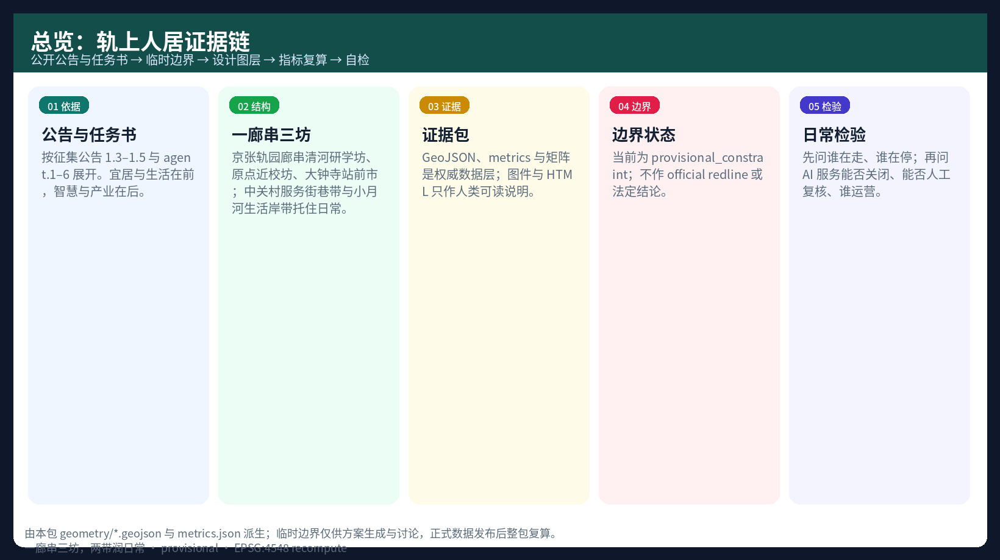
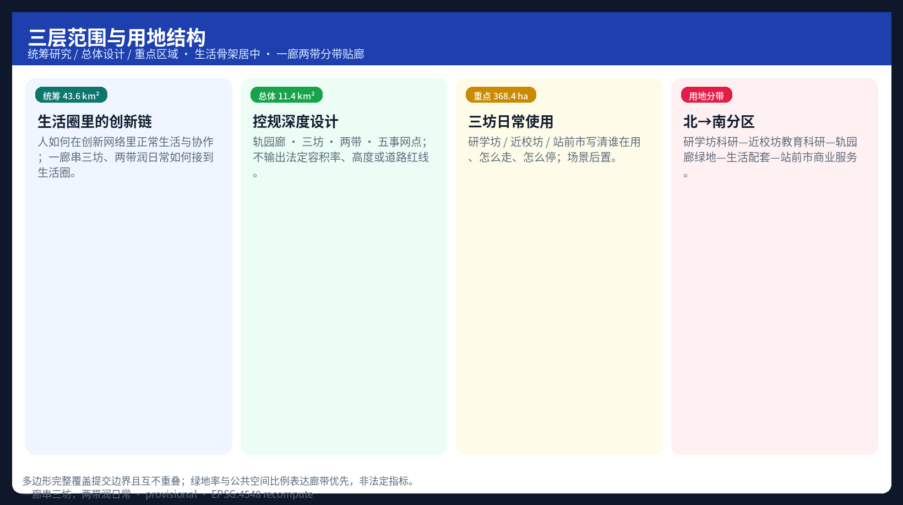
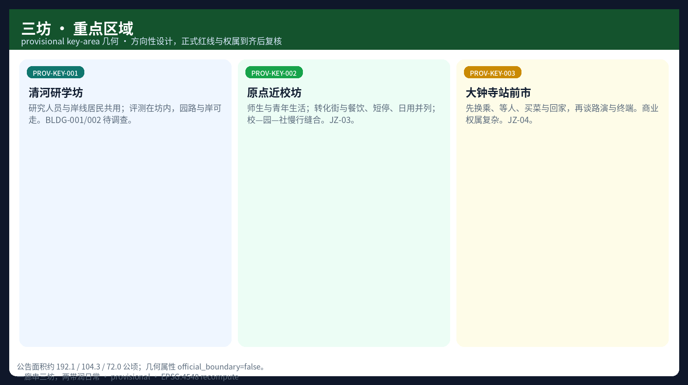
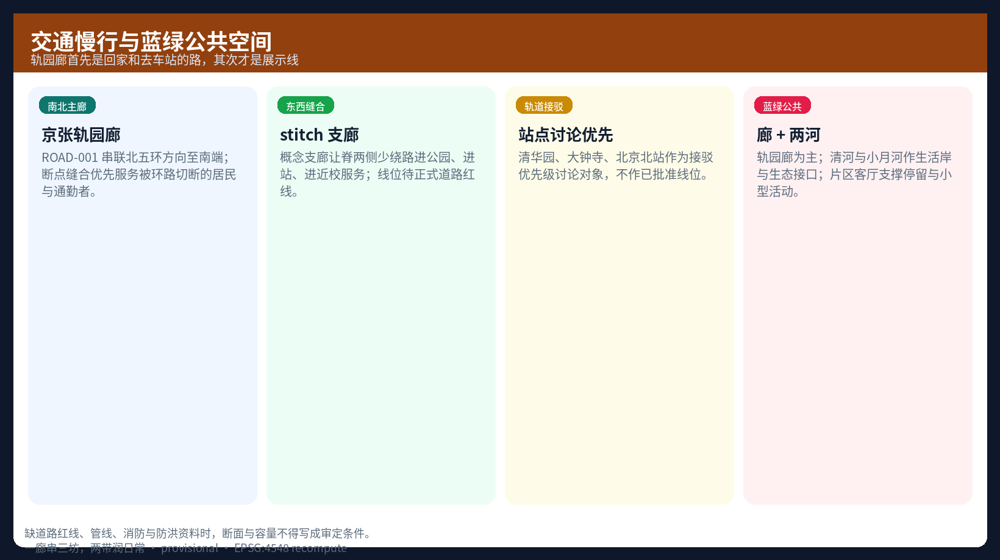
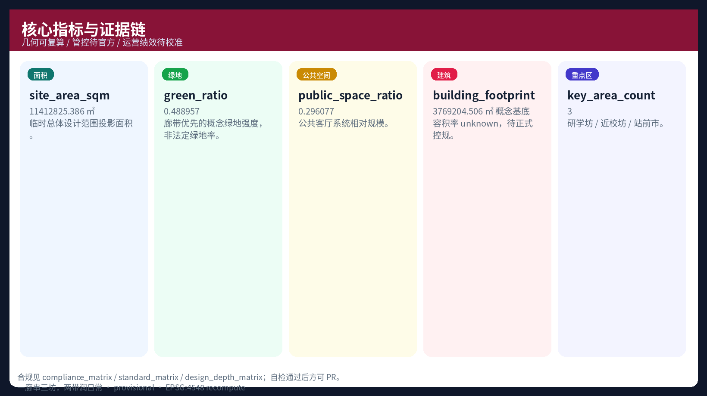

# Habitat on the Rails: Organic Renewal for the Centennial Jing-Zhang AI Innovation Belt

Primary name: **Habitat on the Rails** (轨上人居). English is a secondary gloss; **do not use HOR as the main wayfinding name**. Subtitle: a conceptual urban design proposal for organic renewal of the Centennial Jing-Zhang AI Innovation Belt—**the subject is people’s daily routes; industry and smart services are subordinate clauses**.

The package covers the corridor from south of the North Fifth Ring through Tsinghuayuan and Dazhongsi toward Beijing North Station. The core question is not “how much AI can be placed,” but how people who commute, go to school, go home, shop, pick up children, walk, and wait can again share one clear, continuous path with shade and seats. Judgments draw on the five human-settlement elements, organic renewal, and human-centered smart-city writing. The site is read in parallel through environment, mobility, users, and local history. Naming follows Chinese structural words common in domestic plans such as Qianhai—**corridor (廊), quarter (坊), belt (带), living room (客厅), gateway (门户)**—so place is spoken with landscape and everyday words, not “full-stack core / scenario wing” as place names.

> Boundary clause: every spatial recommendation is a conceptual suggestion, reference scheme, or material for professional teams to deepen. It does not replace statutory planning and is not a government decision, investment commitment, or engineering feasibility conclusion.

## Design Basis and Source List

Formal control documents are the public open-call announcement and the agent taskbook. Machine-readable limits come from provisional geometry, enums, indicator ranges, local standard snapshots in `brief/site-package/`, and `data/source_registry.json` [source:OFFICIAL-ANNOUNCEMENT] [source:AGENT-TASKBOOK]. Before design, the package used `design_brief.json`, `agent_taskbook.json`, `allowed_design_space.json`, `data/processed/agent_fact_pack.md`, and the missing-data checklist so certainties and gaps are stated before spatial proposals [source:PROCESSED-FACT-PACK].

Site synthesis follows site-planner logic across four tracks: environment (blue-green structure, Qinghe and Xiaoyuehe cues), mobility (rail stations, ring-road cuts, walk gaps), users (students, R&D workers, residents, visitors), and history (Jing-Zhang Railway, Tsinghuayuan station, Zhongguancun culture). Value filters follow a Qianhai-style discipline: **livability and daily life first, smartness and industry second**. Ask first whether the five human-settlement elements are more complete, whether residents benefit, and whether renewal is fine-grained and progressive; then ask how technology serves commuting, care, and meeting. Do not start by counting AI devices [source:SFA-LOGIC] [source:CUPM-KERNEL].

Official redlines are not yet in the repository. The package uses provisional overall-design and key-area polygons with `geometry_role=provisional_constraint` and `official_boundary=false` [data:geometry/site_boundary.geojson#SITE-001] [source:BOUNDARY-SOURCE]. Provisional geometry supports generation, visualization, and intake checks only. Organizer data gaps do not block content scoring, but precise areas and statutory controls require full recomputation after official polygons arrive [metric:site_area_sqm] [depth:risk_missing_data].

Use of sources:

- Formal task basis: announced extents and areas, agent taskbook, professional standards in principle;
- Provisional only: temporary polygons and derived areas or topology;
- Still missing: official redline, ownership, regulatory intensity, road redlines, utilities, heritage control lines.

Full source, metric, standard, and design-depth indexes sit in `sources.json`, `metrics.json`, and the three matrix files. This narrative does not restate those machine indexes line by line.

## Three-Level Scope Framework

Work follows the announcement’s three scopes. Each level is written as problem → judgment → layers → metrics → risks so the package does not stop at vision language [depth:three_level_scope_framework] [standard:PROJECT-OFFICIAL-ANNOUNCEMENT].

| Level | Announced area | Core question | This proposal | Evidence |
| --- | --- | --- | --- | --- |
| Coordinated research | 43.6 km² | How people live and collaborate inside an innovation network | Innovation chain checked by living circles; one corridor, three quarters, two belts | compliance / standard matrices |
| Overall design | 11.4 km² | How living, commuting, renewal, and industry sit together | Rail-park corridor · three quarters · two belts · five everyday nodes | [data:geometry/land_use.geojson#LU-001] |
| Key detailed design | 368.4 ha | Whether three pieces reach detailed-design depth | Research quarter / near-campus quarter / station market: daily use and stitching | [data:geometry/key_areas.geojson#PROV-KEY-001] |

**Concept — Habitat on the Rails**: reorganize the century-old railway heritage park into a north–south **walkable, stayable, gatherable living corridor**—the **Jing-Zhang rail-park corridor** (also called the habitat spine). The corridor is not a new redline. It reconnects research, education, living, and services onto one everyday path [depth:overall_spatial_structure].

**One-line structure** (Chinese numbered pattern, in the spirit of Qianhai’s “one heart, one belt” style): **One corridor strings three quarters; two belts water daily life** (一廊串三坊，两带润日常). The taskbook’s “AI Innovation Belt” remains the project response name; **the spatial master brand uses Chinese habitat language**, not English acronyms as place names.

Spatial structure:

1. **One corridor (rail-park corridor)** — north–south slow mobility and staying on the heritage park: the way home and to the station; cultural display and switchable smart services sit on the corridor without filling the whole park.  
2. **Three quarters (life anchors)** — **Zhongzhiyuan·Qinghe Research Quarter**, **Origin Near-Campus Quarter**, **Dazhongsi Station Market**. Speak places with 坊/市, not “full-stack core / open-source core / smart core.”  
3. **Two belts** — **Zhongguancun service streets** (errands, advice, small-team footholds); **Xiaoyuehe living river belt** (walking, community activity; open tests come later).  
4. **Five everyday nodes** (plain-language five human-settlement elements): mobility and meeting, park-shore and shade, neighborhood and deliberation, daily amenities, switchable civic-info points.  
5. **Three phases** — south first smooths the home-and-transfer path → middle weaves near-campus life and translation → north runs park-edge openness with quiet strategies for housing.  

**A day on the corridor (conceptual, not timed)** — morning peak: corridor and east–west lanes toward stations; ask first whether crossings are continuous. Daytime: walking, sitting, passing through. School-out and after-work: near-campus quarter and community edges take short waits and rain shelter. Night: continuous lighting and active edges on the station-home path. Weekends: civic use before industry event weeks occupy the way [source:AGENT-TASKBOOK] [standard:PROJECT-AGENT-OPEN-CALL-TASKBOOK].

This still responds to the three positionings and five functions. Later chapters open scenarios and agent tasks, with **life-facing scenes written before industry-facing scenes**.

## Coordinated Research Area: Industry and Future City Research

The research level does not invent pseudo-precise redlines. It asks how Haidian can make “university origin → open source → enterprise translation → public experience → global communication” a perceptible urban form inside Beijing-Tianjin-Hebei and global AI networks, rather than a list of industry slogans [depth:overall_spatial_structure].

### Naming and visual identity (agent.1)

Naming rule: structure drawings show **corridor / quarter / belt / station front / living room** first; industry and AI sit in cluster notes and scenario layers. Following Qianhai-style Chinese compounds (bay, corridor, street-quarter, parlor), Jing-Zhang substitutes **rail, park, river, quarter, market**.

| Layer | ZH | EN gloss | Use |
| --- | --- | --- | --- |
| Master brand | 轨上人居 | Habitat on the Rails | External communication; **not HOR as wayfinding** |
| Structure line | 一廊串三坊，两带润日常 | One corridor, three quarters, two belts | Master diagram title, boards |
| Main corridor | 京张轨园廊 | Jing-Zhang rail-park corridor | Slow mobility, staying, culture |
| Three quarters | 清河研学坊 / 原点近校坊 / 大钟寺站前市 | Research quarter / Near-campus quarter / Station market | District identity |
| Two belts | 中关村服务街巷带 / 小月河生活岸带 | Service streets / River living belt | Errands and riverbank life |
| Nodes | 片区客厅、站城门户 | Living room / Station gateway | Staying and transfer |

Logo direction: a double-track section becomes a continuous public walkway section; nodes mark the five everyday service points; palette is rail grey, park green, and research blue. No unauthorized trademarks or portraits. Interfaces do not stack “AI” wordmarks; smart services appear in design guidelines, not as shop-style place names [source:AGENT-TASKBOOK].

### Global AI ecosystem cases (agent.2)

The table extracts transferable mechanisms only. Form and scale are not copied.

| Case | Transferable mechanism | Conceptual landfall on Jing-Zhang |
| --- | --- | --- |
| Boston Kendall Square | Near-campus translation and talent density | AI Origin Community |
| Toronto MaRS / Vector area | Research, incubation, and enterprise service in one district | Zhongzhiyuan–Zhongguancun service streets |
| London Knowledge Quarter | Institutions stitched to public space | Public living rooms on the rail-park corridor |
| Paris Station F model | Large entrepreneurship service complex | Station-market parlor and release (does not replace market through-routes) |
| Singapore one-north | Live-work integration | Near-campus quarter and living-support belt |
| Shenzhen Qianhai (master-plan discourse) | Industry–city fusion, jobs–housing, slow mobility, living circles; corridor/belt/quarter naming | **Livability first, smartness second**; one-corridor two-belt writing |
| Hangzhou Future Sci-Tech City (selected practices) | Open scenarios and city operations | Open-day rules on the Xiaoyuehe living river belt |
| Existing Zhongguancun open-source and hard-tech networks | Local IP and capital services | Zhongguancun service streets |

Land, space, industry, capital, talent, compute, data, and scenario mechanisms are written only as option menus for professional and policy deepening. No investment totals, output claims, or fiscal promises are invented [source:AGENT-TASKBOOK].

### Future urban form

AI changes work grain, collaboration radius, and service reach. It does not cancel street life. This package argues:

1. **Life skeleton first, industry fill later** — make the rail-park corridor, station gateways, river edges, and streets continuous before placing translation and test functions.  
2. **Jobs–housing interfaces inside each piece** (conceptual) — keep living and daily-service edges next to employment and near-campus nodes; do not build a pure office corridor.  
3. **Slow mobility anchored at stations** — discuss walk continuity from rail nodes first, not “smart path” labels first.  
4. **AI subordinate** — state who is served, where it lands, switch-off, human review; reject unauditable surveillance fields [source:CUPM-KERNEL].

## Overall Design Area: Urban Renewal and Regulatory-Plan-Level Urban Design

The overall design area matches the announced ~11.4 km². Provisional projected area is about 11412825.386 m² [metric:site_area_sqm]. Depth targets regulatory-plan urban design: land-use structure, public space, slow mobility and rail access, renewal logic, character, and phasing. The text **does not** issue statutory FAR, height, road redlines, or parcel-level demolition conclusions [standard:MOHURD-CONTROL-DETAILED-PLANNING] [depth:land_use_layout] [depth:development_intensity_controls].

Land use is organized as north–south bands with a central **rail-park corridor (habitat spine)**—life skeleton in the middle, industry and services banded along it:

1. Northern R&D (0802) — Qinghe Research Quarter (evaluation inside the quarter; Qinghe shore public).  
2. Mid-north education/research (0804) — Origin Near-Campus Quarter (translation and youth living side by side).  
3. Mid park green (1401) — Jing-Zhang rail-park corridor.  
4. Mid-south community services (0702) — daily amenities and civic ground floors (narrated at the same rank as the translation street).  
5. Southern commercial services (05) — Dazhongsi Station Market (transfer, market life, and parlor sharing one place).  

Classification follows the project land-use subset [standard:MNR-LAND-USE-CLASSIFICATION-GUIDE]. Polygons fully cover the submitted boundary without gaps or overlaps [data:geometry/land_use.geojson#LU-001]. Green ratio ~0.4890 and public-space ratio ~0.2961 express “spine-first” habitat orientation; they are not statutory greenspace mandates [metric:green_ratio] [metric:public_space_ratio].

Renewal follows organic stitching: repair interfaces, close walk gaps, activate ground floors and public rooms. Buildings without survey data remain `pending_survey`. There is no wholesale-clearance narrative [depth:retain_renovate_demolish] [source:CUPM-KERNEL]. Conceptual building footprints total ~3769204.506 m² for supply-type discussion only [metric:building_footprint_area_sqm] [data:geometry/buildings.geojson#BLDG-001].

## Detailed Design of Key Areas

All three key areas use provisional geometry. Announced areas are 192.1, 104.3, and 72.0 ha [data:geometry/key_areas.geojson#PROV-KEY-001] [metric:key_area_count]. Zhongzhiyuan, Origin, and Dazhongsi map to PROV-KEY-001/002/003 at detailed-design depth [depth:three_key_area_detailed_design]. Because geometry is temporary, the following conclusions are directional design only and must be rechecked after official redlines and ownership arrive.

### Zhongzhiyuan · Qinghe Research Quarter (AI autonomous innovation acceleration area)

**Who uses it**: researchers, evaluation and standards workers, residents and visitors walking the Qinghe side.  
**Positioning**: a garden-type research quarter—research, evaluation, display, and deliberation finish inside the quarter, while **shore and park paths stay walkable to the city**; limit noise and night-light intrusion on nearby housing.  
**Daily use (conceptual)**: peak gates avoid facing residential doors head-on; resident through-routes are not gated into dead ends; open tests concentrate on agreed edges and pull back in sensitive hours.  
**Spatial moves**: Qinghe edge as blue-green corridor and public shore; public interface for standards and safety evaluation; greens as outdoor public rooms, not an all-park industry fairground.  
**Industry / scenarios**: model testing, standards workshops, safety sandbox (S02)—**after daily access is secured**.  
**Buildings**: BLDG-001/002 conceptual bases, `pending_survey`.  
**Mobility**: internal slow priority; external microcirculation awaits official road conditions.

### Origin Near-Campus Quarter (Beijing AI Origin Community)

**Who uses it**: teachers and students, young renters, translation teams, families waiting briefly for pickup, nearby residents.  
**Positioning**: near-campus living quarter—shorten lab-to-street distance while writing **food, daily goods, short waits, and affordable-living directions** into the same ground-floor logic as translation.  
**Daily use (conceptual)**: between-class and after-work short stops, rain shelter, waiting; east–west stitches serve station entry, return home, return to dorm; open-source release and pitch peaks offset from living peaks.  
**Spatial moves**: campus–park–neighborhood slow stitching; Origin release hall and translation street; talent services and living amenities **side by side**, not living as a footnote to the translation street.  
**Industry / scenarios**: open-source collaboration, release events, IP and legal entries, education experience (S01/S07).  
**Buildings**: BLDG-003/004 conceptual clusters.  
**Risk**: campus data and research outputs require authorization; campus internal management must not be written as a default open-operations setting.

### Dazhongsi Station Market (Dazhongsi AI industry cluster)

**Who uses it**: transferring passengers, nearby residents going home and shopping, enterprise visitors, night-event participants.  
**Positioning**: station market—**first state post-exit walking, waiting, through-routes, and short shopping**, then pitch and device display.  
**Daily use (conceptual)**: four-quadrant walking serves transfer and crossing; event seasons keep non-ticket, non-attendee through-routes and short waits; continuous night lighting; rain cover stated at concept level pending engineering conditions.  
**Spatial moves**: station-city access, four-quadrant connectivity at crossings, station living room (international pitch), device and content display along edges.  
**Industry / scenarios**: device display, data-element parlor (S08), pitch events, night-time public culture.  
**Buildings**: BLDG-005/006 conceptual clusters; existing commercial renewal states methods only, no enterprise-specific demolition.  
**Risk**: commercial ownership is complex; projects need separate title clearance and implementation-body study.

| Area | Daily subject | E–W stitch | N–S role |
| --- | --- | --- | --- |
| Qinghe Research Quarter | Researchers + shore residents | Park–Qinghe–housing | North anchor: walkable park and managed evaluation |
| Origin Near-Campus Quarter | Campus life and youth living | Campus–street–rail | Middle anchor: translation and living on one street |
| Dazhongsi Station Market | Transfer and neighborhood | Station–retail–community | South anchor: way home and living room |

## AI Innovation Ecosystem, Personas, and AI+ Scenarios

In this package AI is service capacity embedded in **corridor, quarter, and belt**, not a decorative layer on façades. Scenario cards keep IDs for compliance; external names prefer everyday sentences. Every scenario states who is served, where it sits, data sources, minimization, human review, and operator [source:AGENT-TASKBOOK] [depth:blue_green_public_space].

**Life-facing first**: corridor gap guidance (S04), Qinghe shore and public stay (S06), community daily-service sample street (S09), civic events and noise control (S10), after-action review without personal surveillance (S12).  
**Industry-facing later, and in service of daily life**: release hall, sandbox, translation street, parlor, delivery pilots, and so on.

### Personas (at least 5)

| Persona | Core needs | Spatial response | Privacy and governance |
| --- | --- | --- | --- |
| Open-source developers | Release, collaboration, reputation | Origin release hall, night collaboration corner | No personal trajectory capture; aggregate stats only |
| Startups | Low-cost trial, advice entry | Shared testing and standards advice in research quarter | Compute and data require separate authorization |
| Enterprise visitors | Display, meetings, hiring | Station parlor and access | Corporate marks require clearance |
| Nearby residents | Commute, shopping, leisure, low disturbance | Rail-park corridor, civic ground floors, river edge | Resident profiles banned for commercial targeting |
| University teachers/students | Class, translation, cross-campus work | Translation street + short-stop living edges | Campus and paper data need authorization |
| Families with children / caregivers | Pickup, short wait, continuous accessibility | Shade seats, gentle crossings, rain points | No personalized tracking on child-heavy paths |
| International researchers | Short stay, exchange, bilingual wayfinding | Station and living-room nodes | Entry and event compliance |

### Scenario cards (at least 10, including at least 3 industry test/validation)

| ID | Scenario | Place | Type | Human review |
| --- | --- | --- | --- | --- |
| S01 | Open-source release hall | Origin Community | Ecosystem | Editorial final cut |
| S02 | Safety governance sandbox | Zhongzhiyuan | **Industry test** | Red-team + compliance |
| S03 | Civic service kiosk on corridor (edge capability in back office) | Rail-park corridor nodes | New infra concept | Energy/safety patrol |
| S04 | Corridor gap guidance | Heritage park / rail-park corridor | Mobility | Gap confirmation |
| S05 | Station parlor | Dazhongsi Station Market | Industry service | Event safety plan |
| S06 | Qinghe low-carbon innovation edge | North of Zhongzhiyuan | Public space | Seasonal eco limits |
| S07 | Near-campus translation street | Origin | Translation | IP human workflow |
| S08 | Data-element parlor | Dazhongsi | **Industry test** | Auditable authorization |
| S09 | Community daily-service sample street | Community edge | Living | Medical/legal fallback |
| S10 | Global AI week route | Full belt | Operations | Traffic/noise control |
| S11 | Low-speed delivery lane in parks | Internal park roads concept | **Industry test** | Human takeover on conflict |
| S12 | Public-safety after-action cabin | Event nodes | Governance | Incident review only |

Mapping: S02/S08/S11 bind to test interfaces at Zhongzhiyuan and Dazhongsi; S01/S07 bind to Origin; S04/S06/S10 bind to habitat spine and public-space layers [data:geometry/public_space.geojson#PUBLIC-001] [data:geometry/roads.geojson#ROAD-001]. Green-space support is in the green_space layer.

## Land Use, Building Scale, and Retain-Renovate-Demolish Strategy

Land use is a complete topological partition with no unlabeled voids [data:geometry/land_use.geojson#LU-001] [standard:MNR-LAND-USE-CLASSIFICATION-GUIDE]. Building metrics:

- Recomputable: conceptual building footprint area [metric:building_footprint_area_sqm].  
- Unknown: FAR, height, density — `floor_area_ratio` remains unknown pending official controls [metric:floor_area_ratio].  
- Retain/renovate/demolish: all buildings are `pending_survey`. Method is survey → classify → small pilots → evaluate. No demolition list without base data [depth:retain_renovate_demolish] [depth:height_massing_character].

Character controls split into official (pending), design suggestions (habitat-spine frontage, active ground floor, readable roofs), and unconfirmed heritage/height lines. Jing-Zhang cultural elements enter wayfinding and public-art component libraries; heritage protection lines are not fabricated.

## Transport, Rail, Municipal Infrastructure, and Public Services

Mobility strategy has four aims: reachability, slow movement, fewer crossing conflicts, and rail access. **The rail-park corridor is first the way home and to the station**, and only second a display line [depth:traffic_rail_slow_parking].

- **North–south main corridor**: ROAD-001 Jing-Zhang rail-park corridor from the North Fifth Ring direction to the southern edge; gap stitching prioritizes residents and commuters cut by the ring road [data:geometry/roads.geojson#ROAD-001].  
- **East–west stitches**: conceptual stitch_connector branches so people on both sides take fewer detours into the park, station, and near-campus services.  
- **Rail integration**: Tsinghuayuan, Dazhongsi, and Beijing North as priority access discussions; alignments and redlines await official files.  
- **Parking and cycles**: edge parking plus spine slow priority as a principle list only; no precise stall engineering.  
- **Municipal / new infrastructure**: edge compute, distributed energy, and smart poles fused with conventional utilities as deepening topics [depth:municipal_new_infrastructure].

Without road redlines, utilities, fire, and flood data, no section or capacity may be stated as approved [data:geometry/constraints.geojson#CONSTRAINTS].

## Blue-Green Network, Public Space, and Urban Character

The blue-green framework uses the heritage-park habitat spine. Qinghe and Xiaoyuehe serve as ecological and living interfaces [depth:blue_green_public_space] [standard:MOHURD-URBAN-DESIGN-MEASURES]. Public rooms at stations and district living rooms support daily meeting, display, small events, and visit routes [data:geometry/public_space.geojson#PUBLIC-001] [metric:public_space_ratio].

### AI pilgrimage landmarks and honor display (agent.4, at least 3)

| Landmark | Conceptual location | Meaning | Components |
| --- | --- | --- | --- |
| Mid-corridor rest gallery (double-track time gallery) | Mid rail-park corridor | **Sit and rest first**, then history and open-source dialogue | Seats, shade, track section, timeline |
| Star-map wall beside Origin release hall | Near-campus quarter | Aggregated contributor and project view | Expandable modular wall |
| Research-quarter governance stele | Qinghe Research Quarter | Safety, standards, auditability (low and touchable) | Not a viral mega-tower |
| Station parlor porch | Station market | Exchange and release, **without blocking transfer through-routes** | Demountable display |

Honor system: individual, team, open-source project, and public-contribution badges; display data defaults to aggregation with opt-out. Public-space component library: movable seats, shade, power/weak-current points, accessible ramps, bilingual wayfinding, switch-offable sensor poles.

### Cultural narrative (agent.5)

Main line: from rail to city, from city to people. The Jing-Zhang Railway brought modern engineering; Zhongguancun brought innovation culture; smart services should return to **walkable parks, enterable street-quarters, and a station front you can go home through**. Wayfinding uses track-gauge lines, station-name type history, and street names—few English acronym badges. International line: *A walkable living corridor along the old Jing-Zhang railway, stitching research, campus-side life, and the station district into everyday routes.* History is not distorted, and culture is not reduced to tech decoration.

## Renewal Projects, Implementation Policy, and Phasing

| ID | Project | Type | Dependency | Evidence |
| --- | --- | --- | --- | --- |
| JZ-01 | Habitat-spine walk-gap stitching | Public space / mobility | Road and under-bridge conditions | [data:geometry/roads.geojson#ROAD-001] |
| JZ-02 | Zhongzhiyuan Qinghe innovation edge | Blue-green / display | Blue line and flood control | [data:geometry/green_space.geojson#GREEN-001] |
| JZ-03 | Origin translation street | Renewal / industry service | Ownership and ground floor | [data:geometry/buildings.geojson#BLDG-003] |
| JZ-04 | Dazhongsi four-quadrant walking | Station-city integration | Rail and intersections | [data:geometry/public_space.geojson#PUBLIC-001] |
| JZ-05 | Edge-compute civic nodes | New infrastructure | Energy and safety | assumptions |
| JZ-06 | Global AI week public route | Operations / brand | Event permits | [data:geometry/phasing.geojson#PHASE-001] |
| JZ-07 | Star-map wall and honor system | Public culture | Copyright and privacy | agent.4/5 |
| JZ-08 | Low-speed robot delivery pilot lane | Industry test | Road ownership and safety | S11 |

Phasing [data:geometry/phasing.geojson#PHASE-001] [depth:phasing_implementation] [depth:renewal_project_list]:

1. **Phase 1 (south)** — first make the southern **home and transfer path smoother**—slow-mobility pilots, four-quadrant station walking, public experience; event routes yield to daily through-movement.  
2. **Phase 2 (middle)** — near-campus quarter weaving—translation street and **living-support ground floors advanced side by side**; east–west stitches to campus, station, and housing.  
3. **Phase 3 (north)** — research-quarter ecology and long-term operations; park-edge openness together with quiet strategies on the housing side.  

### Global events and long-term operations (agent.6)

| Module | Conceptual frequency | Audience | Pathway |
| --- | --- | --- | --- |
| Jing-Zhang Open-Source Week | Annual | Developers / universities | Contribute → display → collaborate |
| Governance sandbox open day | Quarterly | Firms / researchers | Test → standards dialogue |
| Rail-park corridor citizen day | Bimonthly | Residents / families | **Walk the gaps, give feedback, family use**—parallel to open-source week and pitch season, not a token |
| International pitch season | Semi-annual | Firms / capital / media | Display → matching (not promised investment recruitment) |
| Developer community | Continuous | Open-source groups | Reputation system and mentorship |

Policy option list: renewal coordination, public-space permitting, data minimization and public algorithm notes, scenario open-day rules, IP service windows. None of these are stated as decided government programs.

## Metrics, Area Recalculation, and Compliance Matrix

| Metric | Status | Value | Meaning |
| --- | --- | --- | --- |
| site_area_sqm | known | 11412825.386 | Provisional overall-design projected area |
| green_ratio | known | 0.488957 | Conceptual spine greenspace intensity |
| public_space_ratio | known | 0.296077 | Public-room system scale |
| building_footprint_area_sqm | known | 3769204.506 | Conceptual footprints |
| floor_area_ratio | unknown | — | Awaiting official controls |
| key_area_count | known | 3 | Three key areas |

Metric classes: geometry-recomputable, control-pending, operations-to-calibrate [depth:metrics_recalculation]. Green ratio supports daily walking and staying; public-space ratio supports meeting and display; building footprints discuss supply types for industry and living, not approved construction scale. Compliance covers announcement tasks 1.3–1.5 and agent.1–agent.6 via `compliance_matrix.json`, `standard_matrix.json`, and `design_depth_matrix.json`.

## Risk, Copyright, and Compliance

Main risks: provisional geometry error; missing ownership and controls block retain/renovate/demolish; heritage and eco lines not ingested; unauthorized sensing would damage public trust. Related assumptions: A-CONTROLS-001, A-BOUNDARY-PROVISIONAL, A-HABITAT-KERNEL [depth:risk_missing_data].

Copyright: figures, PDF, and HTML are generated by this agent; system Noto CJK fonts (OFL) are not redistributed as font files; no unauthorized marks, portraits, or paper images. Bilingual package: `proposal.md` (zh) and `proposal.en.md`, with language counterparts for HTML, PDF, and figures. Offline HTML only, no CDN, no tracking. See `report/copyright_statement.md`.

This package **does not claim** official approval, adopted regulatory controls, final building scale, or implementation guarantees. Final judgment rests with human reviewers and professional teams.

## References

- Public announcement for the Centennial Jing-Zhang AI Innovation Belt open call and the agent taskbook  
- brief/site-package design brief, agent taskbook, and provisional geometry  
- data/source_registry.json and processed fact pack with related CSV files  
- Human-settlement and organic-renewal writing in Chinese-urbanplanner-masters; site-planner workflow in skills-for-architects  
- Machine index: sources.json, metrics.json, matrices, geometry/*  
- Entry citations [source:SITE-PACKAGE] [source:OFFICIAL-ANNOUNCEMENT] [source:AGENT-TASKBOOK]
