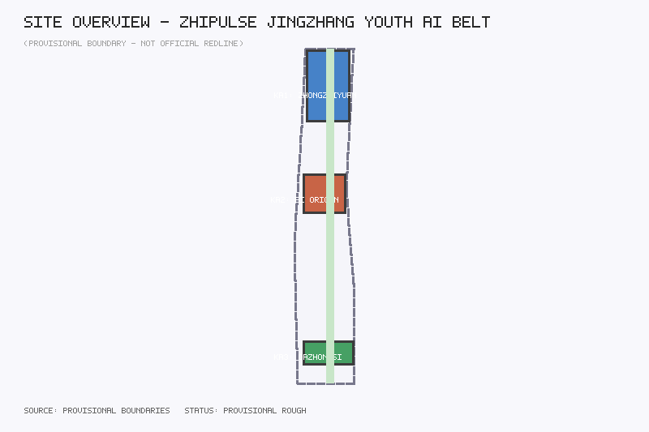
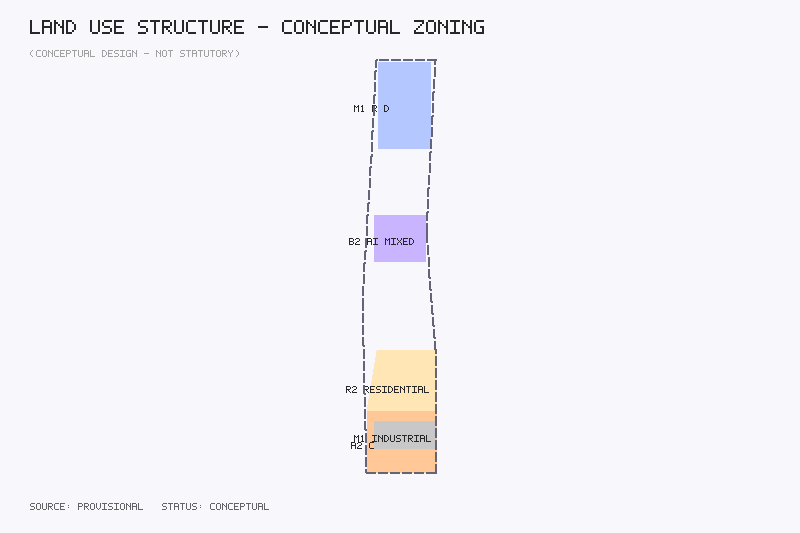

# ZhiPulse — Jingzhang Youth AI Innovation Belt

## Design Basis and Source Inventory

This proposal is based on the Centennial Jingzhang AI Innovation Belt urban design open call taskbook. Sources used: official announcement (May 9, 2026), agent-facing taskbook excerpt (May 18, 2026), provisional boundaries (June 5, 2026), Urban Design Management Measures (MOHURD, 2017), Regulatory Detailed Planning Compilation and Approval Measures, and National Territorial Space Land Use Classification Guide (MNR, 2023).

**Provisional Boundary Statement:** All spatial geometry in this proposal is based on repository provisional boundaries derived from announcement text descriptions and approximate area constraints. All area calculations, land use partitions, and spatial structures are conceptual proposals requiring recalculation when official data becomes available.

## Three-Level Scope Framework

The proposal establishes a "Coordinated Research Area — Overall Design Area — Key Area Detailed Design" three-level progressive framework.

- **Coordinated Research Area** (~43.6 sqkm): Covers the broader corridor from North 5th Ring Road to Beijing North Station, focusing on global AI innovation ecosystem comparison and regional industrial synergy.
- **Overall Design Area** (~11.4 sqkm): Covers the urban area 1-2 km around the Jingzhang railway heritage park, completing conceptual urban design for spatial structure, land use, transportation, and public space systems.
- **Key Area Detailed Design** (~368.4 ha, three key areas combined): Zhongzhiyuan AI Acceleration Area (~192.1 ha), Beijing AI Origin Community (~104.2 ha), and Dazhongsi AI Industry Cluster (~72.0 ha).

## Coordinated Research Area: Industry and Future City Research

### Overall Concept and Naming System

The proposal introduces "ZhiPulse" (智·脉) as the belt's overall concept name. "Zhi" (wisdom) points to the core driving force of AI innovation, while "Mai" (pulse) metaphorically references the Jingzhang railway's historical identity as a urban artery and the pulsing vitality of the AI innovation belt.

The naming system follows a "trunk-node-scenario" three-level structure: trunk naming as "ZhiPulse Innovation Corridor," node naming for three areas and two wings, and scenario naming using "function + space + AI" tripartite format.

### Three Positioning, Five Functions, and Three-Area-Two-Wing Synergy

**Three Positioning:** Centennial Jingzhang Cultural Belt (cultural foundation), Urban AI Life Experience Belt (scenario driver), AI Integration Innovation Belt (innovation engine).

**Five Functions:** AI Full-Stack Innovation System, World-Class AI Innovation Ecosystem, AI+ Scenario Empowerment Paradigm, Intelligent AI Vitality City, AI Governance Global Discourse.

**Three Areas and Two Wings:** Zhongzhiyuan Acceleration Area (R&D—testing—acceleration) → AI Origin Community (exhibition—exchange—living) → Dazhongsi Industry Cluster (commerce—consumption—services), with two wings providing element services and scenario testing.

### Global AI Innovation Ecosystem Cases

Seven cases are studied: Silicon Valley Sand Hill Road, London King's Cross Knowledge Quarter, Tokyo Shibuya Stream, Shenzhen Bay Entrepreneurship Plaza, Boston Kendall Square, Amsterdam Marineterrein, and Seoul DMC.

## Overall Design Area: Urban Renewal and Regulatory-Plan Depth Urban Design

The spatial structure adopts "one pulse, three cores, two wings extending." The "one pulse" is the Jingzhang railway heritage park activity belt; the "three cores" are the three key areas; the "two wings" are the Zhongguancun technology service wing and the Xiaoyue River scenario empowerment wing.

Land use divides the overall design area into six zones: AI R&D land (M1), AI innovation service land (B2), AI industry-commercial land (A2/B2), residential supporting land (R2), green and plaza land (G), and road and transport facility land (S). Green ratio ~24.9%, public space ratio ~36.9%, road ratio ~33.5%.

## Key Area Detailed Design

### Zhongzhiyuan AI Acceleration Area
Positioning: World-class AI full-stack innovation system engine. Spatial structure: "R&D core—testing ring—service outer ring" concentric layout. New construction includes Zhongzhiyuan Innovation Tower (conceptual 12 floors), AI Testing Validation Lab (conceptual 5 floors), and Open Source Achievement Gallery (conceptual 2 floors).

### Beijing AI Origin Community
Positioning: Public experience interface for the world-class AI innovation ecosystem. Spatial structure: "AI Origin Plaza—Exhibition Experience Street—Living Settlement." New construction includes AI Origin Experience Center (conceptual 6 floors) and Developer Apartment Building A (conceptual 15 floors). Retained and renovated: Jingzhang Railway Memorial (3 floors).

### Dazhongsi AI Industry Cluster
Positioning: Intelligent native new business consumption and commercial service cluster. Renovation includes Dazhongsi AI Commercial Complex (conceptual 8 floors) and Smart Retail Center (conceptual 6 floors).

### Key Node Scene Visualization with Global Case Benchmarking

To give the key nodes of the three key areas a perceivable scene imagery, conceptual scene visualization representations are developed for the north, center, and south core nodes, each benchmarked against a leading global innovation district or campus. Scene studies use publicly accessible panorama data (e.g., Baidu Street View) as a research basis for understanding existing street interfaces — for perspective and interface reference only, without embedding any street view imagery, avoiding copyright risk. All visualizations are conceptual scene imagery marked as "conceptual proposals," not photographs of built conditions.

**North Node — Zhongzhiyuan Innovation Plaza (Benchmark: High Tech Campus Eindhoven, Netherlands)**: Eindhoven's campus organizes its research buildings around a central green spine ("The Strip"), creating a walkable, green-wrapped R&D exchange ground. The north node translates this mechanism: the Zhongzhiyuan waterfront green belt serves as the "central green valley," with Innovation Plaza placed at the intersection of the green valley and the R&D core. Visualization viewpoint: looking south from the green valley toward the Innovation Tower — foreground of open lawn and tiered seating, middle ground of modular smart rest pavilions (FM-02) and conversation terraces, background of the tower's transparent ground-floor lab interface. The composition emphasizes "R&D visibility" (ground-floor labs transparently displayed to public space); the atmosphere is a weekday midday exchange and afternoon pitch scene. The node's discipline theme is the "Heart of Science" (AI×Science & Engineering): the ground-floor interface adds AI for Science visualization installations and cross-disciplinary laboratory vitrines, making computation in physics, materials, and life sciences a visible public spectacle of the plaza.

**Center Node — AI Origin Plaza (Benchmark: One-North, Singapore)**: One-North is known for its vertical "work-live-learn-play" mixing and borderless campus, with R&D, residence, and commerce compounded within a 500m walking radius. The center node translates this mechanism: AI Origin Plaza serves as the core living room of a borderless innovation community. Visualization viewpoint: looking west from the plaza's east entrance toward the Honor Wall — foreground of pulse-wave lamp post sequences and Youth Story Belt timeline paving, middle ground of large/medium/small gathering facilities (FM-04) and AI interactive installations, background of the Experience Center's elevated ground floor and developer apartment towers. The composition emphasizes "vertical functional mixing" (ground-floor public display, second-level exchange platform, upper-level living/office); the atmosphere is a mixed-use evening scene shared by off-work youth, residents, and visitors. The node's discipline theme is the "Heart of Humanities" (AI×Humanities & Arts): the plaza adds human-AI co-creation art installations and an AI ethics dialogue pavilion, with the Experience Center embedding the digital-humanities interface of the AI-restored Centennial Jingzhang Archives exhibition.

**South Node — Dazhongsi Connection Plaza (Benchmark: Silicon Alley, Manhattan, New York)**: Silicon Alley demonstrates that innovation blocks can embed in high-density built-up urban districts — block-scale, stock-renovation-based, and characterized by tech-media-commerce mixing. The south node translates this mechanism: Connection Plaza is grounded in the intelligent renovation of existing commercial buildings. Visualization viewpoint: looking south from the plaza's north entrance toward the Smart Retail Center — foreground of Jingzhang railway historical paving textures and narrative installations, middle ground of flexible outdoor seating areas, smart rest bench clusters (FM-01), and robot delivery pilot routes, background of the renovated AI Commercial Complex's transparent commercial interface and rooftop gardens. The composition emphasizes "block-scale innovation" (no walls, 24-hour access, commerce and business sharing the same interface); the atmosphere is a nighttime vitality scene with extended lighting, outdoor consumption, and sports court lights coexisting. The node's discipline theme is the "Heart of Life" (AI×Life & Living): the commercial interface adds smart life-health experience and biosensing interactive scenes, introducing AI wellness and smart healthcare consumption formats.

The shared visual language of all three node visualizations: unified palette (rail-gray base + innovation-blue functional + youth-orange accent), continuous pulse-wave lamp post motif, and "contemporary translation of historical elements" in paving and installations. All benchmarking is mechanism translation, not form copying; case information comes from public sources [source:DATA-SRC-AGENT-TASKBOOK-20260518].

The three nodes also carry the discipline theme division of the "AI×X Discipline Matrix": the north node as the "Heart of Science" (AI×Science & Engineering), the center node as the "Heart of Humanities" (AI×Humanities & Arts), and the south node as the "Heart of Life" (AI×Life & Living) — see the next section.

## Multidisciplinary AI Innovation: The AI×X Discipline Matrix

AI innovation should not, and cannot, be a solo performance of computer science. Global experience confirms this: the MIT Media Lab organizes art-science-engineering collisions in an explicitly "antidisciplinary" way; Stanford's Institute for Human-Centered AI (HAI) is co-led by technologists and humanities scholars; AlphaFold's breakthrough in protein structure prediction is widely recognized as a milestone of "AI for Science"; and Ars Electronica in Linz continuously showcases the frontier of AI-art co-creation. The depth of AI innovation comes from the support of multiple disciplines; the breadth of AI innovation comes from their application. Haidian District hosts the full disciplinary spectrum of Tsinghua, Beihang, BUPT, BNU, CUG, and BLCU — mathematics and physics, life sciences, humanities, and arts — providing globally rare soil for practicing multidisciplinary AI innovation on the ZhiPulse belt.

The proposal organizes this idea into the "AI×X Discipline Matrix" — each discipline forms a two-way empowerment relationship with AI: on one hand **supporting AI to develop faster and better** (X→AI), on the other hand **constituting major directions and scenarios of AI application** (AI→X):

| Discipline | X→AI: Supporting AI development | AI→X: AI application directions & scenarios | Node theme |
|-----------|-------------------------------|---------------------------------------------|------------|
| Mathematical & Physical Sciences | Algorithm theory, optimization, new computing paradigms (brain-inspired/quantum) | AI for Science: physics simulation, new materials discovery, climate computing | North · Zhongzhiyuan |
| Engineering & Technology | Computing hardware, chip architecture, sensor networks | Intelligent manufacturing, robotics, autonomous driving | North · Zhongzhiyuan |
| Life Sciences | Brain science and neuro-inspired intelligence, cognitive science | AI drug discovery, protein structure prediction, brain-computer interfaces, synthetic biology | South · Dazhongsi (research scenes extend north) |
| Humanities | Value alignment, AI ethics & governance, linguistics and LLM corpora | Digital humanities, cultural heritage digitization (AI restoration of Jingzhang archives), AI education | Center · AI Origin |
| Art & Design | Human-computer interaction, aesthetic evaluation of generative models, embodied intelligence | Generative art, human-AI co-creation, digital curation and public art | Center · AI Origin |

**Discipline theme division across the three nodes**: aligned with the functional positioning of the three key areas, the discipline matrix forms three "discipline hearts" at the north, center, and south core nodes —

- **North — Zhongzhiyuan Innovation Plaza, the "Heart of Science" (AI×Science & Engineering)**: Leveraging adjacent universities' strengths in mathematics, physics, and engineering, the plaza's ground-floor interface features "AI for Science visualization installations" (real-time aesthetic rendering of materials simulation and fluid computation), and the Innovation Tower reserves "cross-disciplinary laboratory vitrines," making computation in physics, materials, and life sciences a visible public spectacle. This design adds MIT Media Lab-style cross-disciplinary collision to Eindhoven's "R&D visibility" mechanism.
- **Center — AI Origin Plaza, the "Heart of Humanities" (AI×Humanities & Arts)**: The plaza features "human-AI co-creation art installations" (public interfaces for real-time co-creation with generative models); the Experience Center hosts the "AI-Restored Centennial Jingzhang Archives" exhibition (a digital-humanities practice restoring historical railway imagery and engineering manuscripts with AI, linked to the Young Engineers Memorial Corner narrative); an "AI ethics and governance dialogue pavilion" is reserved as a humanities-led public-issue space. This design layers Stanford HAI's human-centered philosophy onto Ars Electronica's co-creation experience.
- **South — Dazhongsi Connection Plaza, the "Heart of Life" (AI×Life & Living)**: Drawing on adjacent medical and life-health industry resources, the plaza interface features "smart life-health experience" scenes (AI health self-testing, wearable biosensing interaction, brain-computer interface science experiences), and the AI Commercial Complex introduces AI wellness and smart healthcare consumption formats. This design borrows from Kendall Square's "biotech × AI" mixed-block experience in Boston.

The discipline matrix is also materialized as facility modules (FM-09 cross-disciplinary co-creation installations), scenario cards (SC-11 to SC-13), and activity content (AI×X cross-disciplinary events, see the activity system section), ensuring that multidisciplinary integration is not left at the level of ideas but becomes perceivable, participatory spatial content. All discipline scenes are conceptual proposals; benchmark case information comes from public sources [source:DATA-SRC-AGENT-TASKBOOK-20260518].

## AI Innovation Ecosystem, Talent Profiles, and AI+ Scenarios

### User Personas (minimum 5 types)
1. AI Researcher (25-40): R&D space + computing service + academic exchange
2. Young Entrepreneur (22-35): Exhibition/pitch space + low-cost office + social third space
3. AI Developer/Open Source Contributor (20-35): Developer's Walk + honor display + community exchange
4. University Student (18-25): Study space + sports facilities + nighttime vitality
5. Community Resident and Visitor (all ages): AI public service navigation + accessible slow mobility + cultural experience
6. Cross-disciplinary Researcher & Creator (22-45): From mathematics, physics, life sciences, humanities, arts and other non-CS disciplines; needs cross-disciplinary exchange scenes + AI tools and computing support + achievement display space — the core user group of the "AI×X Discipline Matrix"

### AI Scenario Cards (minimum 10)

| ID | Scenario | Location | Users | Privacy |
|----|----------|----------|-------|---------|
| SC-01 | AI Origin Experience Plaza | AI Origin Community | All ages | Anonymous flow data |
| SC-02 | Developer's Walk | Jingzhang Greenway | Developers, residents | Optional step sharing |
| SC-03 | Agent Contribution Honor Wall | AI Origin Community entrance | Global AI community | Public display |
| SC-04 ★ | AI Testing Validation Lab | Zhongzhiyuan | Research institutions | Isolated test data |
| SC-05 | Open Source Achievement Gallery | Zhongzhiyuan public space | All ages | No privacy collection |
| SC-06 ★ | Smart Retail Center | Dazhongsi | Consumers | Anonymized consumption data |
| SC-07 | AI Legal Consulting Station | Dazhongsi | Entrepreneurs, residents | Legal consultation confidential |
| SC-08 ★ | Robot Delivery Pilot Corridor | Dazhongsi-AI Origin | Residents, workers | Path not linked to individuals |
| SC-09 | AI+Education Shared Learning Station | AI Origin-University area | Students | Anonymized learning data |
| SC-10 | Nighttime AI Vitality Block | Dazhongsi area | Youth, residents | Environmental data, no facial recognition |
| SC-11 | AI for Science Visualization Installation | Zhongzhiyuan Innovation Plaza | Young researchers, public | De-identified research data |
| SC-12 | Human-AI Co-creation Art Installation | AI Origin Plaza | Young artists, public | Voluntary input, no personal data retention |
| SC-13 | Smart Life-Health Experience Station | Dazhongsi Connection Plaza | Residents, visitors | On-device processing, voluntary participation |

★ = Industry test/validation scenario (minimum 3)

SC-11 to SC-13 are discipline-integration scenarios of the "AI×X Discipline Matrix" — SC-11 serves the north node's "Heart of Science" (mathematics and engineering made visible), SC-12 the center node's "Heart of Humanities" (arts and humanities co-creation interface), and SC-13 the south node's "Heart of Life" (life sciences public experience).

### Privacy and Human Review Boundaries
All AI scenarios follow minimum-necessary data collection principles. Public space sensing collects only anonymous aggregate data. AI service scenarios retain human review channels. Robot delivery and autonomous driving scenarios are limited to low-speed, supervised, auditable pilots.

## Land Use, Building Scale, and Retain/Renovate/Demolish

The proposal includes 10 representative buildings with conceptual floor counts. Total conceptual floor area: ~2,913,425 sqm (design model estimate, not full-scope). Building density: ~3.64%. All values are design model estimates, not statutory control values. FAR and height controls are marked as unknown pending official regulatory conditions.

## Transportation, Rail, Municipal, and Public Services

Road system uses three longitudinal spines: Xueyuan Road (west), Zhongguancun East Road (east), and Jingzhang Slow Mobility Path (center). The slow mobility system uses the Jingzhang heritage park greenway as a central walking path connecting three key area plazas.

## Blue-Green Space, Public Space, and Urban Character

The Jingzhang railway heritage park is the physical carrier of the "one pulse" spatial structure. The blue-green framework consists of "one vertical, two horizontal" corridors: Jingzhang Greenway (north-south), Xiaoyue River Ecological Corridor (east), and Zhongzhiyuan Waterfront Green Belt (north).

### East-West Stitching: Traffic and Functional Cross-Railway Integration

The Jingzhang railway corridor, historically a north-south urban artery, also created a physical east-west barrier in the urban fabric. The east-west stitching strategy addresses this through two dimensions: traffic stitching and functional stitching.

**Traffic Stitching**: Three-layer立体化 restoration of east-west connections — surface-level pedestrian underpasses or at-grade crossings restore slow-mobility links, focusing on Dazhongsi–AI Origin Community (3 east-west slow-mobility corridors) and AI Origin Community–Zhongzhiyuan (2 corridors); underground level预留 rail station transfer passages connecting Qinghuayuan and Dazhongsi stations into an east-west pedestrian network; surface bus routes extend east-west with cross-railway stops. Accessibility standards: max 5% gradient, rest intervals ≤200m [data:geometry/roads.geojson].

**Functional Stitching**: West-side functions (university research, technology services — Tsinghua, BUAA, BUPT, Zhongguancun) and east-side functions (residential communities, commercial services — Xueyuan Road subdistrict, Beitaipingzhuang subdistrict) differ significantly. The strategy goes beyond simple connectivity to functional adaptation and coordination: "academic spillover interfaces" at university edges partially open labs, libraries, and conference facilities to the public; "innovation permeation nodes" in residential areas introduce AI experiences, shared learning, and digital culture services; "functional mixed-use belts" along the railway corridor accommodate vertical R&D–exhibition–consumption–residential mixing, enabling east-west populations to share the same public space system. Dazhongsi stitching belt connects west-side tech-commerce with east-side community retail via intelligent native consumption; AI Origin stitching belt connects west-side academic circles with east-side residential areas via innovation display and public exchange; Zhongzhiyuan stitching belt connects west-side university clusters with east-side Qinghe living area via open R&D and science popularization [depth:blue_green_public_space].

### North-South Connection: Themed Green Belt and Cultural Public Corridor

The north-south connection is not merely spatial linkage but construction of a public corridor — the "ZhiPulse Cultural Greenway" — with a distinctive theme, cultural depth, and coherent spatial order.

**Theme Narrative**: "The Innovation Pulse of a Century of Youth" overlays the Jingzhang railway's century-long historical narrative onto contemporary AI youth innovation practices. The greenway is divided into three themed segments from north to south: "Quest Pulse" (Zhongzhiyuan–Qinghuayuan segment), taking the study-abroad journeys of Zhan Tianyou and other young engineers as narrative origin, linking AI basic research, academic exchange, and open-source culture spaces; "Origin Pulse" (AI Origin Community segment), anchored at the historic moment of the Jingzhang railway's completion, hosting the AI Origin Plaza, Agent Contribution Honor Wall, and Developer's Walk, forming a spatial dialogue "from railway origin to AI origin"; "Connection Pulse" (Dazhongsi segment), taking the railway's historical function as a north-south transport artery as narrative endpoint, connecting AI industry services, intelligent native consumption, and global innovation exchange.

**Spatial Order**: Greenway width 30–80m baseline, expanding to 50–120m plaza spaces at nodes, creating a "rhythmic expansion-contraction" spatial sequence. Themed rest nodes every 300–500m with seating, shading, AI guided tours, and micro-display installations. A continuous "Youth Story Belt" embeds timeline markers of the Jingzhang railway's century-long journey and AI innovation milestones into ground paving — walking the greenway traces the narrative from 1909 (railway completion) to 2026 (AI innovation belt establishment). Continuous arcade facades and permeable ground floors ensure visual transparency and spatial continuity [data:geometry/green_space.geojson] [data:geometry/public_space.geojson].

**Cultural Alignment**: Three themed segments correspond to three spatial characters: "Quest" (north) adopts academic garden style with formal planting and knowledge signage; "Origin" (center) adopts monumental plaza style with paving textures and public art; "Connection" (south) adopts vibrant commercial street style with flexible outdoor seating and interactive installations. Visual coherence is achieved through unified paving palette (rail-gray base + innovation-blue functional + youth-orange accent), continuous lighting system (pulse-wave lamp posts), and consistent signage [depth:blue_green_public_space].

### Centennial Jingzhang Cultural Narrative and Youth Innovation Heritage

The Jingzhang railway itself is a story of "youth innovation." In 1905, Zhan Tianyou led the railway's construction as chief engineer at age 44, with a team largely composed of young engineers and returned overseas students handling key technical work. By the railway's completion in 1909, the average age of participating technicians was under 30. This historical fact provides a deep cultural anchor for the "ZhiPulse" proposal — the Jingzhang railway heritage is not merely industrial heritage but the material carrier of "a century of youth innovation spirit."

The proposal embeds this narrative into spatial design through three paths:

- **"Quest Youth" narrative path** (north segment): Modeled on Zhan Tianyou and the Chinese Educational Mission students' study-abroad experiences, a "Seekers' Trail" in the Zhongzhiyuan–Qinghuayuan section embeds public art installations and knowledge markers on modern Chinese science-technology study-abroad history, creating a cross-temporal dialogue with contemporary AI scholars' international exchange experiences
- **"Railway-Building Youth" narrative node** (center segment): A "Jingzhang Young Engineers Memorial Corner" at the AI Origin Community displays replicas of 1905–1909 young engineers' design manuscripts and stories alongside contemporary AI developers' open-source contributions, forming the narrative tension of "a century ago, building railways with hand-drawn blueprints — a century later, constructing AI agents with code"
- **"Connection Youth" narrative plaza** (south segment): A "Connection Plaza" at Dazhongsi overlays the railway's historical function as a north-south transport artery with contemporary AI industry services' function of "connecting north-south innovation resources," forming a spatial layering of history and future

The narrative is not didactic exhibition but embedded daily through paving textures, signage systems, and public art installations — users perceive it naturally through everyday use. All historical figure references come from public sources; no fabrication or excessive dramatization of historical figures is involved [source:DATA-SRC-AGENT-TASKBOOK-20260518].

### Youth-Friendly Design Strategy

Youth-friendliness is a core design principle of this proposal. The strategy systematically addresses real-life needs of young populations across five dimensions: work and communication, after-hours activities, themed hobbies, special scenarios, and basic needs — with the goal of making youth "enjoy being there" and strengthening belonging.

**Work and Communication**: Gradient work spaces across the belt — Zhongzhiyuan provides quiet research rooms and academic seminar halls for deep work; AI Origin Community provides pitch plazas and co-working spaces for entrepreneurial exchange and display; Dazhongsi provides flexible meeting pods and business negotiation spaces for industry engagement. Along the greenway, no fewer than 20 "conversation pockets" — 3–5 person semi-enclosed rest spaces with power, WiFi, and writable walls — lower the spatial threshold for informal exchange. The Developer's Walk features code display screens and open-source contribution interactive installations, integrating technical exchange into daily walking experience.

**After-Hours Activities and Sports**: The greenway system accommodates running tracks (3–5km loops) and cycling lanes with smart sports data stations and self-service supply points along the route. Nighttime sports facilities around Dazhongsi Youth Vitality Plaza — basketball half-courts, skateboarding practice zones, and small climbing walls — meet post-work sports and social needs. AI Origin Community provides community shared kitchens and craft workshops for youth hobby space. Full-belt public spaces support "nighttime economy" — extended lighting, safety monitoring (no facial recognition), and nighttime bus connections ensure public space vitality after 22:00.

**Themed Hobbies and Community Spaces**: Dedicated themed space carriers for different youth communities — open-source contributors get exclusive display space at the Developer's Walk and Honor Wall; hardware makers get prototype fabrication workstations at Zhongzhiyuan innovation pilot spaces; indie game developers get shared development pods at AI Origin Community; music and art creators get rehearsal and display spaces in Dazhongsi cultural renovation spaces. Each themed space is equipped with a community self-governance committee where youth independently operate event scheduling and space use rules, strengthening the subjective awareness of "my space."

**Special Scenarios**: Four special scenario types designed for youth — "AI Creation Marathon Camp" (48-hour creation + result display space), "Open-Source Weekend Market" (developer showcase and exchange weekend public event), "Jingzhang Historical Time-Travel Path" (VR/AR overlay of historical imagery on railway heritage experience), "Youth Innovators Hall of Fame" (using Zhan Tianyou and other historical young innovators as narrative archetypes, connecting contemporary youth with a century of innovation spirit in cross-temporal dialogue). Special scenario operations adopt a "youth co-creation" model where content and services are proposed and iterated by youth communities.

**Basic Needs**: Full-belt 15-minute living-circle-level basic services — youth apartments (live-near-work), 24-hour convenience stores and pharmacies, shared laundry and parcel lockers, community medical stations and psychological counseling points, maternal and child support facilities. The slow-mobility system ensures walking time from youth apartments to workplaces, public spaces, and transit nodes does not exceed 15 minutes. Public restrooms are distributed according to youth usage frequency and time patterns, with 60% availability during nighttime hours.

**Belonging Mechanism**: Three layers strengthen youth belonging — spatial layer: youth participate in public space design and naming (e.g., "I Name a Road" activity), making youth co-creators of space rather than passive users; institutional layer: youth representatives hold no less than 40% of seats in the community operations committee, ensuring youth voice in public affairs; cultural layer: the "Youth Story Belt" and "Innovators Hall of Fame" make youth contributions visible and memorable, forming the identification of "I left my mark here" [depth:blue_green_public_space].

### Modular Intelligent Spatial Facility System (ZhiPulse Facility Module Family)

To avoid fragmented facility provision, the proposal organizes all public space facilities into a modular, replicable "ZhiPulse Facility Module Family" (FM series). The family shares unified visual language (rail-gray + innovation-blue + youth-orange), unified interface standards (power/data/mounting), and unified privacy boundaries, deployed under a two-tier "baseline + node densification" rule — baseline modules along the greenway at baseline intervals, thematic modules densified at the three core nodes [depth:blue_green_public_space].

| Module | Name | Core Configuration | Deployment Rule |
|--------|------|-------------------|-----------------|
| FM-01 | Smart Rest Bench | PV canopy, USB-C/wireless charging, anonymous occupancy sensing, modular seating units | Greenway spacing ≤150m, grouped at nodes |
| FM-02 | Smart Rest Pavilion | 8–15 sqm PV self-sustaining pavilion, environmental sensors (temp/humidity/air quality), temporary meeting/rain shelter/micro-pitch, night safety lighting | One per 300–500m themed rest node, 2–3 at core nodes |
| FM-03 | Multi-Sensor Facilities | Anonymous flow counting, environmental monitoring, sports data stations (opt-in step/distance community ranking), anonymized aggregated movement trajectory collection | Combined with FM-01/02; data anonymized and aggregated for space usage intensity analysis |
| FM-04 | Gathering Space Gradient | Large (500+ plaza-level with stage modules and floor power), medium (50–100 amphitheater/shared living room), small (3–5 person conversation pockets) three-tier system | One large per area, 2–3 medium per area, 20+ small along greenway |
| FM-05 | Quiet Meditation Corners | Plant enclosure, noise-reducing paving, minimized signage, no screen interfaces — designated "digital sabbath zones" | 1–2 near each core node, away from activity facilities |
| FM-06 | Parent-Child Activity Scenes | Railway-themed AI interactive science installations, caregiver seating with shade, safety soft paving, maternal-child facilities | Grouped at AI Origin Community and Dazhongsi nodes |
| FM-07 | Sports & Fitness Scenes | Nighttime sports courts (basketball/skateboarding/climbing), smart fitness-testing kiosks, jogging data stations, 24h self-service fitness pods | Concentrated at Dazhongsi Vitality Plaza, jogging stations along greenway |
| FM-08 | Collective Intelligence Facilities | Cloud co-creation platform (online proposal/voting/collaboration) + offline facilities (interactive proposal screens, voting posts, co-creation whiteboard pavilions, AI brainstorming booths) | One group per core node, proposals feed community committee "youth co-creation pool" |
| FM-09 | Cross-disciplinary Co-creation Installations | AI for Science visualization screens (aesthetic rendering of scientific data), human-AI co-creation art interfaces, AI-restored Jingzhang archives exhibition modules, AI ethics dialogue pavilion | One group per core node, deployed by discipline theme: north = science, center = humanities & arts, south = life & health |

**Sensor Data and Privacy Boundaries**: The FM-03 sensing system follows four rules — (1) minimum-necessary principle: only anonymous aggregated data is collected; (2) voluntary participation: sports data ranking requires active opt-in with anytime opt-out; (3) anonymized trajectory principle: movement trajectory data is irreversibly de-identified and aggregated, used solely for big-data analysis of space usage intensity and public facility optimization, never linked to identifiable individuals; (4) open data principle: anonymized aggregate datasets are published periodically as open data for social oversight. No facial recognition is deployed anywhere in the belt; all AI-assisted decisions retain human review channels.

**Module Family and Scenario Card Linkage**: FM modules form the physical carrier layer of the AI scenario cards (SC series) — FM-03 sports data stations support SC-02 Developer's Walk optional step sharing, FM-08 co-creation platform supports youth co-creation scenario operations, and FM-06 parent-child installations link with the Jingzhang cultural narrative (railway-themed science). All modules are conceptual configuration standards; specific selection, procurement, and construction arrangements are determined at implementation stage.

### AI Pilgrimage Landmarks (minimum 3)
1. **Agent Contribution Honor Wall** (BLD-008): The AI community's "Walk of Fame"
2. **Open Source Achievement Gallery** (BLD-009): AI open source milestone visualization
3. **Jingzhang Railway Memorial** (BLD-005): Century-old railway culture + AI guided tours. Features a "Young Engineers Memorial Corner" displaying historical stories of young technicians in Zhan Tianyou's team alongside contemporary AI youth's open-source contributions, forming a cross-temporal dialogue of "a century of youth innovation."

## Renewal Project List, Policies, and Phasing

Renewal projects include 19 items across three phases: AI Origin Experience Center, Dazhongsi AI Commercial Complex renovation, Jingzhang heritage park greenway connection, Developer's Walk, Agent Contribution Honor Wall, Jingzhang Young Engineers Memorial Corner, Conversation Pockets cluster, ZhiPulse facility module baseline deployment (FM-01/02/03), node facility densification (FM-04–FM-08), ZhiPulse activity system operations launch, discipline-integration node scenes (FM-09 installations + SC-11 to SC-13 scenarios), plus more (Phases 1–3). New additions also include the Seekers' Trail (Zhongzhiyuan–Qinghuayuan segment), Youth Nighttime Sports Facilities, and Connection Plaza at Dazhongsi — all reflecting the expanded east-west stitching, north-south themed greenway, cultural narrative, youth-friendly design strategies, modular facility system, and the AI×X discipline matrix.

- **Phase 1 (Near-term):** AI Origin Community and Dazhongsi launch area (~176.2 ha), focusing on public space connection, core node construction, Young Engineers Memorial Corner, and Conversation Pockets
- **Phase 2 (Mid-term):** Zhongzhiyuan acceleration area and corridor connection (~33.8 ha), focusing on R&D spaces, talent housing, Seekers' Trail, and Youth Nighttime Sports Facilities
- **Phase 3 (Long-term):** Quality upgrade and operational maturity (~59.1 ha), focusing on smart facility upgrades, Connection Plaza, and operational mechanism refinement

### Global AI Innovation Activity System

**Three-Tier Activity System**: The proposal establishes a progressive "public activities — professional activities — achievement-release activities" three-tier system, sustaining exposure and media attention to raise the overall visibility of the space.

- **Public Activities (monthly)**: Regular all-age events — "Open-Source Weekend Market" (developer showcase weekend bazaar), "AI Experience Day" (thematic openings of AI scenario cards), "ZhiPulse Night Run League" (monthly community rankings via FM-07 sports data stations), "Parent-Child AI Science Day" (via FM-06 railway-themed installations), "Jingzhang Time-Travel Open Day" (VR/AR historical imagery), "Human-AI Co-creation Art Festival" (public generative-art co-creation via FM-09 interfaces — the monthly public interface between art and AI). Public activities feature low thresholds, high frequency, and all-age participation — a "monthly event" public space rhythm.
- **Professional Activities (quarterly)**: Brand events for the AI professional community — "Open Source Contributors Conference" (open source community alliance annual), "AI Scenario Marathon" (48-hour creation + showcase), "Youth Innovation Forum" (cross-disciplinary young scholars and entrepreneurs), "Tech Open Day" (periodic opening of Zhongzhiyuan labs and pilot spaces), "AI×X Cross-disciplinary Summit" (quarterly rotating discipline themes: mathematics & AI for Science, life sciences & brain-computer interfaces, humanities & AI ethics governance, art & generative co-creation — a standing dialogue mechanism between non-CS researchers and AI researchers). Professional events use FM-04 large/medium gathering facilities and FM-09 cross-disciplinary co-creation installations, forming periodic professional community congregation.
- **Achievement-Release Activities (annual + milestone)**: High-energy events for global communication — "Jingzhang AI Innovation Week" (spring pitch + autumn exhibition, annual flagship), "Honor Wall Annual Unveiling Ceremony" (new contributors inducted), "AI Achievement Release Conference" (annual innovation results), "AI for Science Achievement Exhibition" (annual public showcase of research breakthroughs in physics, materials, and life sciences enabled by AI, linking north and center areas), "ZhiPulse Festival" (annual culture-tech carnival). Achievement-release events use the AI Origin Plaza large gathering facilities and are the core engine of media exposure.

**Media and Communication Strategy**: Activity media centers are conceptually reserved at the three core nodes (live-broadcast rooms, press release functions, multi-camera broadcast interfaces), establishing a "live matrix + short-video co-creation + multilingual communication" system — event livestreams on major platforms, short-video content co-created by young creators, multilingual content for the international AI community. The communication path follows an "exposure — awareness — visit — participation" funnel: media exposure builds spatial visibility, content seeding forms awareness, events attract visits, and community operations convert to sustained participation.

Developer community operations led by open source community alliance; scenario open-access operations use "reservation + periodic public testing." All activities, investment, funding, and policy arrangements are conceptual proposals, not confirmed arrangements.

## Indicators, Area Recalculation, and Compliance Matrix

| Metric | Value | Status |
|--------|-------|--------|
| Site area | 11,399,492 sqm | known |
| Green ratio | 24.93% | known |
| Public space ratio | 36.94% | known |
| Road ratio | 33.45% | known |
| Building density | 3.64% | known (low) |
| FAR | — | unknown |
| Max building height | — | unknown |
| AI scenario nodes | 15 | known |

Three core visual metrics (site_area_sqm, green_ratio, public_space_ratio) are known finite values recomputable from submitted geometry. FAR and height are unknown due to unavailable official regulatory controls.

### Compliance Matrix Coverage

The six agent tasks (agent.1–agent.6) are covered item-by-item in `compliance_matrix.json` and substantively developed in this proposal text:

- **agent.1** (Overall concept and functional coordination): Naming system, Logo direction, three positioning, five functions, and three-area-two-wing synergy loop developed in the Coordinated Research Area chapter
- **agent.2** (AI full-stack innovation system): Seven global AI innovation ecosystem cases and Zhongzhiyuan full-stack system design developed in the same chapter
- **agent.3** (AI+ scenario empowerment): Thirteen scenario cards (including SC-11 to SC-13 discipline-integration scenarios), three test/validation scenarios, and six user personas (including cross-disciplinary researchers & creators) developed in the AI Innovation Ecosystem chapter, with the "AI×X Discipline Matrix" section implementing two-way empowerment between mathematics, physics, life sciences, humanities, arts, and AI
- **agent.4** (AI public space and pilgrimage landmarks): Jingzhang heritage park AI public spaces, east-west stitching (traffic + functional), north-south themed green belt and cultural public corridor, youth-friendly design strategy (work, after-hours activities, themed hobbies, special scenarios, basic needs, belonging mechanism), modular intelligent spatial facility system (FM-01 to FM-09 module family: smart benches, rest pavilions, multi-sensor facilities, gathering space gradient, meditation corners, parent-child scenes, sports scenes, collective intelligence facilities, cross-disciplinary co-creation installations), three AI pilgrimage landmarks, and honor display system developed in the Blue-Green Space chapter
- **agent.5** (Centennial Jingzhang cultural narrative): The "Centennial Jingzhang Cultural Narrative and Youth Innovation Heritage" chapter forms the core, developing the historical narrative of Zhan Tianyou and young engineers, the three-segment narrative paths (Quest Youth–Railway-Building Youth–Connection Youth), the Young Engineers Memorial Corner at the Railway Memorial, and cultural guided routes — forming a cross-temporal dialogue between the Jingzhang railway's century-long history and contemporary AI youth innovation
- **agent.6** (Global AI innovation activity system and long-term operations): Three-tier activity system (monthly public activities / quarterly professional activities / annual achievement-release activities, including discipline-integration events such as the "Human-AI Co-creation Art Festival," "AI×X Cross-disciplinary Summit," and "AI for Science Achievement Exhibition"), media and communication strategy (activity media centers, live matrix, exposure-awareness-visit-participation funnel), developer community operations, and scenario open-access operations developed in the Renewal Project List chapter

## Risk, Copyright, and Compliance

All spatial design suggestions are expressed as "conceptual proposals," "reference schemes," or "material for professional teams to deepen." This proposal does not constitute regulatory plan adjustment, FAR determination, height control, specific demolition/renovation conclusions, road alignment, rail line position, bridge/tunnel engineering, municipal pipeline, underground space engineering feasibility, land ownership, investment calculation, or approval decisions.

All results are conceptual proposals. The boundary clause is acknowledged. No forbidden final conclusions are made.

## References

1. Beijing Municipal Planning and Natural Resources Commission Haidian Branch. Centennial Jingzhang AI Innovation Belt Urban Design International Call Prequalification Announcement. May 9, 2026.
2. Agent-facing Taskbook Excerpt for the Centennial Jingzhang AI Innovation Belt Urban Design Open Call. May 18, 2026.
3. MOHURD. Urban Design Management Measures. March 14, 2017.
4. MOHURD. Regulatory Detailed Planning Compilation and Approval Measures.
5. MNR. National Territorial Space Survey, Planning, and Use Control Land Use Classification Guide. November 22, 2023.
6. Repository maintainers. Provisional boundaries for the three-level scope and three key areas. June 5, 2026.
7. Centennial Jingzhang Railway historical and cultural materials (public sources).
8. Global AI innovation ecosystem case studies (public sources).
