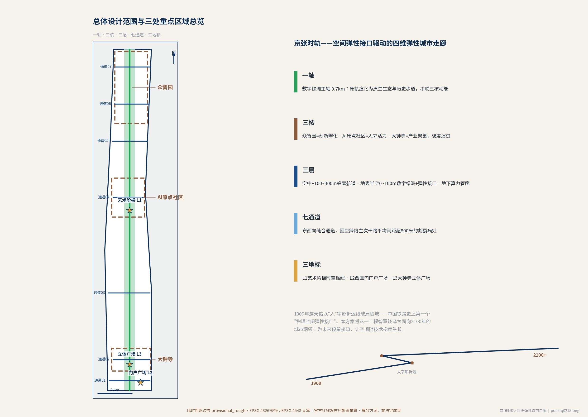
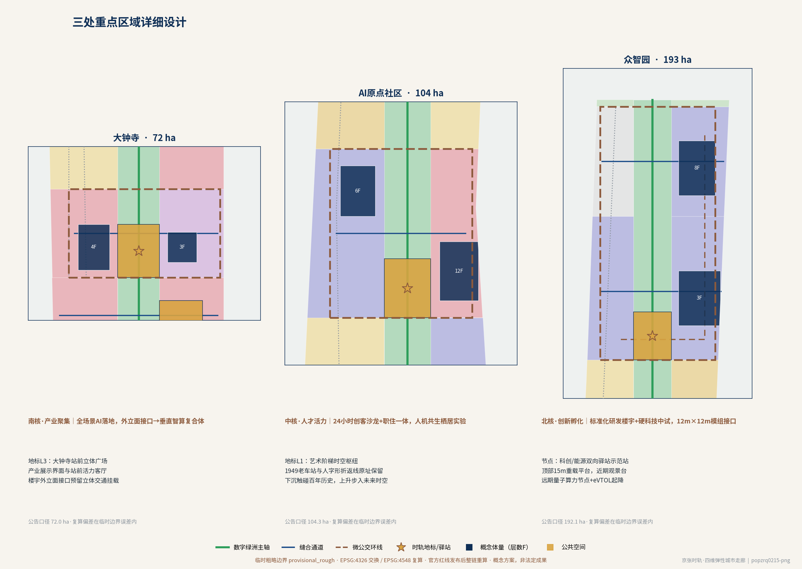
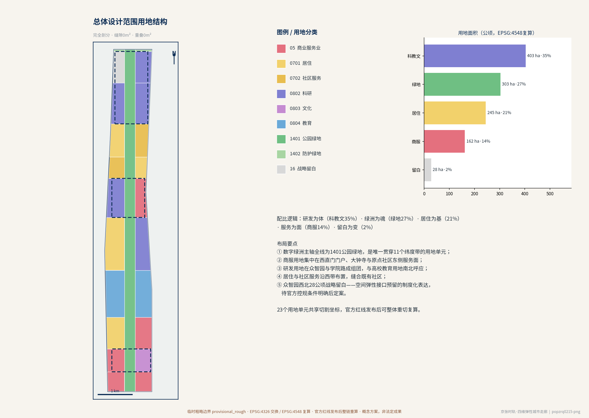
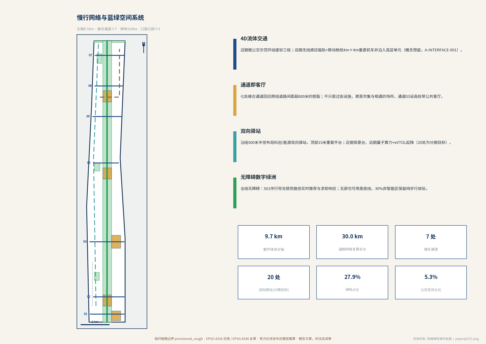
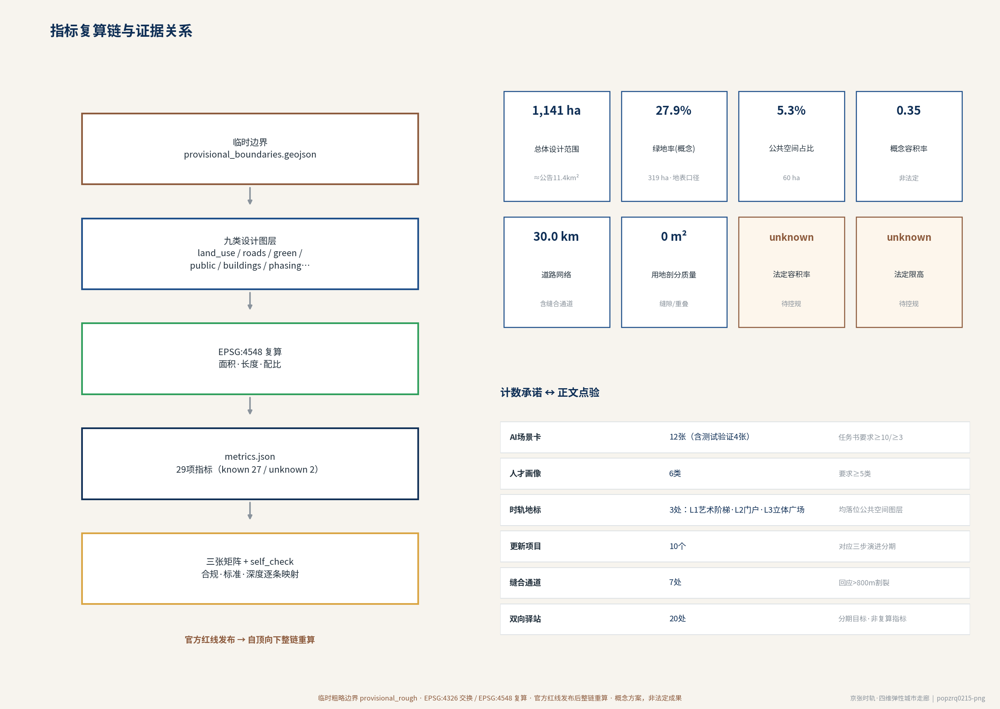

# 京张时轨：空间弹性接口驱动的四维弹性城市走廊

在海淀区北五环至西直门外大街约 43.6 平方公里的统筹研究范围内，长 9 公里的京张铁路遗址公园与其周边 11.4 平方公里的总体设计区构筑起贯穿海淀的核心脉络。1909 年詹天佑在这里用"人"字形折返线破局高山陡坡，开启了中国自主修建铁路的辉煌历史；1949 年，这根铁轨承载着中共中央"进京赶考"的历史转折；到了 2026 年，随着高铁全面入地，这段地表遗存演变为纵贯众智园 AI 自主创新加速区（192.1 公顷）、北京 AI 原点社区（104.3 公顷）与大钟寺 AI 产业聚集区（72 公顷）三大核心集群的创新轴线 [source:OFFICIAL-ANNOUNCEMENT] [source:SRC-JZ-HERITAGE-PUBLIC]。

本方案的核心在于确立**"空间弹性接口（Spatial Elastic Interface）"**这一关键技术哲学，打破传统一次性建定的静态蓝图思维，将视野拉伸至 1909 到 2100 年的两百年时空坐标系，将曾经割裂城市的物理疤痕转化为串联中关村科创资源与高校智力核的"超级城市智脊"。项目定位为：以"空间弹性接口"为核心驱动的**四维弹性城市走廊**与未来**"AI 数字绿洲"** [source:AGENT-TASKBOOK]。

本提交为面向智能体开源征集的 formal 机器可读方案包：文字叙述、GeoJSON 图层、指标复算链、图册展板与离线电子展示互为印证，全部空间与数量主张可追溯至来源、假设与复算公式 [depth:existing_conditions_diagnosis]。

## 设计依据与资料清单

本 formal 方案以《百年京张AI创新带城市设计国际方案征集资格预审公告》为第一依据，以面向智能体的开源征集任务书为任务与边界依据，并以 `brief/site-package/` 中经维护者登记的临时粗略边界、重点区域、枚举、指标与来源清单为机器可读依据 [source:OFFICIAL-ANNOUNCEMENT] [source:AGENT-TASKBOOK] [source:SITE-PACKAGE]。生成方案前已读取 `design_brief.json`、`enums/`、`ranges/`、`schemas/` 与 `data/source_registry.json`，并用 `data/processed/` 导航层建立任务、范围、资料用途与缺口清单 [source:PROCESSED-FACT-PACK]。

资料使用边界以登记表为准 [source:SOURCE-REGISTRY]：

- 公告与任务书为 formal 主控依据；文字四至不用于精确边界。
- 《国土空间调查、规划、用途管制用地用海分类指南》支撑用地代码 [source:STD-LAND-USE-CLASS]；城市设计管理办法与控规编制审批办法支撑成果组织深度 [source:STD-URBAN-DESIGN] [source:STD-CONTROL-PLAN]。
- 生成式人工智能服务管理暂行办法与无障碍环境建设法约束 AI 场景与公共空间设计 [source:STD-GENAI-MEASURES] [source:STD-BARRIER-FREE]；智慧助老政策作为数字包容背景参考 [source:BG-ELDERLY-SMART]。
- 京张铁路百年史实（1909 建成、詹天佑主持、人字形折返线、清华园老车站）仅作背景叙事，不作空间工程主张 [source:SRC-JZ-HERITAGE-PUBLIC]。

**临时边界声明**：官方红线尚未发布，本包 `geometry/site_boundary.geojson` 与 `geometry/key_areas.geojson` 来自仓库登记的临时粗略多边形，标注为 provisional_constraint，仅用于方案生成、自检、可视化与评审讨论 [source:BOUNDARY-SOURCE] [source:KEY-AREA-SOURCE]；全部面积、比例与图面在 EPSG:4548 下复算（假设 A-BOUNDARY-001），官方红线发布后须整链重算，不能只替换单个文件。

## 三层范围工作框架

方案按公告确立三层空间工作框架 [source:OFFICIAL-ANNOUNCEMENT] [depth:three_level_scope_framework]：

| 层级 | 范围 | 口径 | 本包工作深度 |
| --- | --- | --- | --- |
| 统筹研究范围 | 北五环至西直门外大街约 43.6 平方公里 | 公告文字四至，不落图 | 产业与未来城市研究、趋势判断 |
| 总体设计范围 | 京张遗址公园沿线约 11.4 平方公里 | 临时边界复算 11,412,825.386 平方米 [metric:site_area_sqm] [data:geometry/site_boundary.geojson#SITE-001] | 控规深度城市设计：用地、交通、蓝绿、体量、分期 |
| 重点区域 | 三处核心集群 [metric:key_area_count] [data:geometry/key_areas.geojson#PROV-KEY-001] | 公告口径 192.1 / 104.3 / 72 公顷 | 详细城市设计与弹性接口落位 |

三层联动的工作逻辑是：统筹研究层回答"为何是弹性接口"（趋势与危机诊断），总体设计层回答"接口如何组织城市"（一轴三核、三维分层），重点区域层回答"接口如何落地"（艺术阶梯、模组楼宇、驿站原型）[depth:overall_spatial_structure]。

## 统筹研究范围产业与未来城市研究

**大数据透视揭示的深层危机。** 9 公里长的地面轨道造就了长期的物理割裂，跨线主次干路平均间距超过 800 米，将清华、北大、北交大与中关村等核心智力要素强行阻断；同时，清华园老车站、折返线等 12 处历史遗存呈现点状零散分布，被高密度城建吞噬，缺乏连续的叙事逻辑 [source:SRC-JZ-HERITAGE-PUBLIC]。更严重的是，地表平面二维交通网的承载力已达极限，静态僵硬的传统建筑形态缺乏弹性接口，无法适应当下科技企业快速迭代与远期柔性栖居的动态需求 [depth:existing_conditions_diagnosis]。

**核心病灶在于范式的深刻错配。** 静态的平面二维城市结构缺乏适应未来三维空间演进的接口体系；历史遗存停留在博物馆式的静态陈列，失去了与最前沿科技碰撞的活力；而传统死板的功能分区完全无法满足未来兼具游牧性、弹性与人机共生特征的新型居住与工作模式 [source:AGENT-TASKBOOK]。

**演进趋势与历史原点。** 詹天佑的"人"字形折返线本质上是中国铁路工程史上第一个面对极陡坡度时的"物理空间弹性接口"。在 2026 至 2035 年的技术过渡期，自动驾驶 L4 级微循环与低空无人物流开始规模化商用，要求城市预留路权与垂直降落接口；而在 2035 至 2100 年的 AGI 与人机共生时代，物理空间需具备被 AI 实时调度与重组的能力，空间载体也将由静态建筑演变为动态的"智慧矩阵"（技术成熟度假设登记于 A-INTERFACE-001）。

基于此，规划确立**"京张时轨：百年文脉·未来智脊"**的总体愿景，并赋予片区三大定位：跨世纪工业遗产活化的全球范式、AGI 基础设施的实景实验场、三维立体自治交通示范区 [standard:PROJECT-OFFICIAL-ANNOUNCEMENT] [standard:PROJECT-AGENT-OPEN-CALL-TASKBOOK]。

## 总体设计范围城市更新与控规深度城市设计

**总体策略：体量生成与"三维分层+弹性接口"。** 方案在垂直向建立三个演进层 [depth:overall_spatial_structure]：

- **空中三维层（+100m 至 +300m）**：近期划定低空无人物流示范航线，远期平滑扩展为低空飞行器与无人物流专用蜂窝航道，并辅以数字音波屏障消除噪声（须民航与空管许可，见 A-INTERFACE-001）。
- **地表与半空层（0m 至 +100m）**：近期实现地面压减私家车、打通慢行绿道，原轨痕化为连绵的"数字绿洲"原生生态与历史步道 [data:geometry/green_space.geojson#GREEN-SPINE]；半空与建筑界面预留包括吊挂锁扣与高空转换平台在内的"空间弹性接口"，为远期悬浮结构体与"智慧矩阵"的挂载组装预留物理可能性。
- **地下数字层（0m 以下）**：近期利用原高铁隧道与地下复合管廊建设集中式数据中心，并在管廊内预留弹性算力与物流舱位，远期无缝升级为去中心化超算中心与磁悬浮管道物流网。

**空间格局："一轴串联动能，三核梯度演进"。** 数字绿洲主轴纵贯南北，串联三大核心集群梯度演进；总体设计范围以 23 个用地单元完全剖分（0 缝隙、0 重叠），达到控规深度的用地组织 [data:geometry/land_use.geojson#LU-SPINE-PARK] [standard:MOHURD-CONTROL-DETAILED-PLANNING] [depth:land_use_layout]。

**开发强度与更新方式。** 法定容积率与限高条件未随资料包公布，统一记为 unknown（假设 A-CONTROLS-001）；本包仅给出概念参考值：概念容积率 0.348 [metric:concept_far]、概念建筑密度 5.74% [metric:building_density_concept] [depth:development_intensity_controls]。更新方式以"留改拆"并举、以留为主：轨痕与历史遗存原址保留，既有楼宇优先改造并预埋接口，仅对必要节点做小范围新建 [depth:retain_renovate_demolish]。

## 重点区域详细设计

三处重点区域面积按临时多边形复算，与公告口径对照：众智园约 192.9 公顷 [metric:key_area_zhongzhiyuan_sqm]、原点社区约 104.3 公顷 [metric:key_area_origin_sqm]、大钟寺约 72.0 公顷 [metric:key_area_dazhongsi_sqm]（公告口径 192.1 / 104.3 / 72 公顷，复算值仅供参考）[depth:three_key_area_detailed_design]。

**北段·众智园 AI 自主创新加速区（创新孵化核心）**：近期建设标准化高品质研发楼宇与硬科技中试基地，建筑骨架统一预留 12m×12m 模组化扩展接口与垂直传动井，远期无缝挂载由"智慧矩阵"组成的弹性演化空间 [data:geometry/buildings.geojson#BLDG-ZZY-01]。北翼保留战略留白用地约 28.2 公顷作为接口预留的制度化表达 [metric:land_use_area_16_sqm]。

**中段·北京 AI 原点社区（人才活力核心）**：紧邻清华园历史节点，近期打造 24 小时创客露天沙龙与职住一体化青年社区，远期依托地表与高空接口平滑过渡为人机共生的新型栖居实验场，实现低空通勤起降点、移动舱泊入与生态绿道的无缝缝合 [data:geometry/buildings.geojson#BLDG-ORIGIN-01]。

**南段·大钟寺 AI 产业聚集区（产业聚集核心）**：近期依托高密度商业与办公底色推动 AI 在全场景落地，远期利用楼宇外立面预留的接口挂载立体交通与展示界面，将传统楼宇改造为垂直式智算与产业复合体 [data:geometry/buildings.geojson#BLDG-DZS-01]。

**清华园"艺术阶梯"时空枢纽——弹性接口的极致舞台。** 原址修缮的 1949 年清华园老车站与詹天佑"人"字形折返线被作为不可移动的文脉原点原汁原味地保留在地面；近期从地表向半空架设内置管线与结构接口的"艺术阶梯"景观步道，将漫步人流引导至高架观景平台；远期随着空中交通成熟，该平台无需打拆主体，即可直接通过预留接口扩建为悬浮于半空的低空起降平台与 AI 大脑发布中心，形成**"下沉触碰百年历史，上升步入未来时空"**的戏剧化叙事 [data:geometry/public_space.geojson#PUB-ART-STEPS]（文保边界待补齐，见 A-HERITAGE-001）。

三处**时轨地标**均落位于公共空间图层 [metric:ai_landmark_count]：L1 清华园"艺术阶梯"时空枢纽、L2 西直门门户站前广场（1909 起点叙事）、L3 大钟寺站前立体广场（产业展示界面）。

## AI 创新生态、人才画像与 AI+ 场景

面向"科学家、工程师、创业者、创客、居民、访客"共生的创新生态，方案建立六类人才画像 [metric:persona_count] [depth:three_key_area_detailed_design]：

| 画像 | 典型需求 | 对应空间供给 |
| --- | --- | --- |
| P1 硬科技创业者 | 中试场地、模组化扩展 | 众智园中试基地与 12m×12m 接口楼宇 |
| P2 高校研究者 | 跨校协作、成果转化 | 高校带成果转化驿站、缝合通道03公共客厅 |
| P3 青年创客 / 数字游民 | 全时段协作、低成本职住 | 24 小时创客沙龙、职住一体青年社区 |
| P4 产业工程师 / 企业服务者 | 全场景落地、客户触达 | 大钟寺垂直智算与产业复合体 |
| P5 社区居民（含银发群体） | 数字包容、安全慢行 | 数字绿洲步道、无障碍缝合通道 [source:STD-BARRIER-FREE] |
| P6 文化访客 | 百年叙事、未来体验 | 三处时轨地标与艺术阶梯 |

方案提出 12 张 AI+ 场景卡，其中 4 张为产业测试验证场景（标注▲）[metric:ai_scenario_card_count]，全部场景设人工复核与退出机制（假设 A-SCENARIO-001）[source:STD-GENAI-MEASURES]：

| 场景卡 | 层位/接口 | 阶段 | 核心内容 |
| --- | --- | --- | --- |
| S01 数字绿洲伴行导览体 | 地表层·历史步道 | 一期 | 12 处历史遗存连续叙事，AI 伴行讲解 |
| S02 缝合通道智能过街调度 | 地表层·七处通道 | 一期 | 行人优先自适应信号 [metric:crossing_count] |
| S03 低速无人微公交环线运营 | 地表层·示范环线 | 一期 | L4 微循环接驳三核 [data:geometry/roads.geojson#ROAD-BR-ZZY] |
| S04 ▲低空无人物流示范航线 | 空中层·+100~300m | 一期试点 | 需民航空管许可（A-INTERFACE-001） |
| S05 驿站能源双向调度 | 半空层·20 驿站 | 一二期 | 高压快充与削峰填谷 |
| S06 ▲模组化接口装配数字孪生 | 半空层·12m×12m 接口 | 二期 | 众智园楼宇扩展装配预演 |
| S07 企业服务智能体 | 建筑层·大钟寺 | 一期 | enterprise-service-copilot 全场景落地 |
| S08 创客沙龙 AI 协作平台 | 建筑层·原点社区 | 一期 | 24 小时跨团队协作 |
| S09 ▲职住舱智能切换模拟 | 建筑层·AOD | 二三期 | 白天办公舱/夜间居住舱切换（目标情景，A-AOD-001） |
| S10 ▲算力管廊与磁悬浮舱段预检 | 地下层·2.5m×2.5m 舱段 | 二期 | 免破土接入预演 |
| S11 公共安全与低空运行复核 | 全层位 | 一二期 | public-safety-operations-review、数字音波屏障监测 |
| S12 非智能区生态哨兵 | 地表层·边界 | 一期 | 30% 绝对非智能区外围被动监测（A-NONSMART-001） |

## 用地、建筑规模与拆改留方案

总体设计范围 23 个用地单元完全剖分，用地结构复算如下 [standard:MNR-LAND-USE-CLASSIFICATION-GUIDE] [depth:land_use_layout]：

| 用地大类 | 复算面积 | 占比 | 指标 |
| --- | --- | --- | --- |
| 科教文化（08）| 403.1 公顷 | 35.3% | [metric:land_use_area_08_sqm] |
| 绿地开敞（14）| 303.0 公顷 | 26.6% | [metric:land_use_area_14_sqm] |
| 居住社区（07）| 245.1 公顷 | 21.5% | [metric:land_use_area_07_sqm] |
| 商业服务（05）| 161.9 公顷 | 14.2% | [metric:land_use_area_05_sqm] |
| 战略留白（16）| 28.2 公顷 | 2.5% | [metric:land_use_area_16_sqm] |

**建筑规模（概念示范）**：七处概念体量总基底约 65.5 公顷 [metric:building_footprint_area_sqm]、概念总建筑规模约 397.4 万平方米 [metric:concept_total_floor_area_sqm]，均预埋空间弹性接口，非法定控制值（A-CONTROLS-001）[data:geometry/buildings.geojson#BLDG-ORIGIN-02] [depth:height_massing_character]。

**AOD 开发模式。** 针对传统 TOD 静态容积率在应对未来空间演进时的不足，方案比选并确立"基于时间轴与弹性接口的 **AOD（人工智能导向开发）模式**"：近期采用"传统 TOD 容积率 + 弹性接口预留奖励"机制，保证开发商与政府在前 20 至 30 年内的建设可行性与投资回报；中远期随着 AI 调度的成熟，平滑过渡为 AOD 动态容积率模式，利用空间弹性接口实现白天办公舱与夜间居住舱的智能挂载与切换。方案叙事中"空间综合利用效率提升 300%、地表绿化率提高至 65% 以上"为 2070–2100+ 远期情景目标，已登记为假设 A-AOD-001，不作为本包复算指标或当前量化承诺 [depth:development_intensity_controls]。

**拆改留方案（方向性）**：留——轨痕、12 处历史遗存、成熟社区与高校设施全部保留；改——大钟寺与学院路既有楼宇立面与结构预埋接口改造；拆——仅限安全鉴定不合格且无保留价值的零星构筑物（现状数据缺失，结论待复核，A-EXISTING-001）[depth:retain_renovate_demolish]。

## 交通、轨道、市政与公共服务设施

**4D 流体立体交通网络。** 近期在遗址公园沿线建立低速无人驾驶微公交示范环线；中远期全面过渡为全立体自治交通，地面路面接口直接激活无线感应磁轨，依靠低速无人驾驶移动舱运行，舱体可经由建筑内预留的 4m×4m 垂直机车井直接升降泊入高层单元（工程参数为概念预留值，A-INTERFACE-001）[depth:traffic_rail_slow_parking]。

概念路网总长约 29.96 公里 [metric:road_network_length_m]，含数字绿洲慢行主轴 [data:geometry/roads.geojson#ROAD-SPINE-GREENWAY]、西侧自行车联络道与七处东西向缝合通道 [metric:crossing_count]——直接回应跨线主次干路平均间距超 800 米的割裂病灶；通道具体形式（平接/上跨/下穿）待轨道保护资料补齐后确定（A-TRANSPORT-001）。

**科创/能源双向驿站。** 沿线按 500 米服务半径嵌入 20 个"科创/能源双向驿站"，顶部统一预留直径 15 米的重载承重平台与高压快充接口，近期作为观景台，远期升级为下设量子算力节点、上设 eVTOL 垂直起降场（Vertiport）的三维枢纽；本包在众智园南缘落位首个示范站 [data:geometry/public_space.geojson#PUB-STATION-DEMO]（20 站全网布局为分期目标，非本包复算指标）。

**市政与新型基础设施。** 地下复合管廊专门划定一格 2.5m×2.5m 的弹性留空舱段，远期无需破土动工即可接入量子光网与磁悬浮管道物流；原高铁隧道近期改造为集中式数据中心，配套数字音波屏障消除低空噪声 [depth:municipal_new_infrastructure]。公共服务按职住一体社区标准配置，全部通道与驿站执行无障碍设计 [source:STD-BARRIER-FREE] [standard:MOHURD-ARCH-DESIGN-DEPTH-2016]。

## 蓝绿空间、公共空间与城市风貌

**数字绿洲。** 原轨痕化为连绵的原生生态与历史步道：绿地复算约 318.7 公顷 [metric:green_space_area_sqm]，设计绿地率约 27.9% [metric:green_ratio]（地表口径，与 A-AOD-001 登记的远期 65% 情景目标口径不同，不可直接比较）；主体为数字绿洲主轴与北五环防护绿带 [data:geometry/green_space.geojson#GREEN-N-EDGE]，辅以三处口袋公园 [depth:blue_green_public_space]。

**公共空间体系。** 五处结构性公共空间复算约 60.4 公顷 [metric:public_space_area_sqm]，占比约 5.29% [metric:public_space_ratio]，由三处时轨地标、缝合通道03公共客厅与驿站示范站构成 [data:geometry/public_space.geojson#PUB-DZS-FORUM]。

**城市数字伦理红线——30% 绝对非智能区。** 面对算法依赖、低空安全与高科技带来的异化感，方案强制保留地表 30% 的"绝对非智能区"，将其作为锚固人类情感的永恒空间弹性接口，仅留下最原始的泥土、自然水系与百年铁轨。当未来科技不断飞入云端，这片保留着厚重记忆的泥土与轨痕，将成为对抗科技异化、锚固人类情感与文化记忆的压舱石（治理承诺目标，落图机制见 A-NONSMART-001）。

**风貌意象。** 三维分层塑造"下部百年肌理、中部绿洲连绵、上部轻盈智构"的整体风貌：地表以红砖、锈轨、乡土植物延续工业记忆；半空接口构筑物以轻质通透材质与可逆连接表达"未完成的城市"；夜间以低亮度点状照明保护非智能区暗夜环境 [standard:MOHURD-URBAN-DESIGN-MEASURES] [depth:height_massing_character]。

## 更新项目清单、实施政策与分期计划

十个更新项目构成近远期衔接的实施骨架 [metric:renewal_project_count] [depth:renewal_project_list]：

| 项目 | 内容 | 阶段 |
| --- | --- | --- |
| R01 数字绿洲主轴贯通 | 轨痕生态修复与历史步道 [data:geometry/green_space.geojson#GREEN-SPINE] | 一期 |
| R02 艺术阶梯时空枢纽一期 | 老车站修缮+景观步道+观景平台 | 一期 |
| R03 七处缝合通道近期工程 | 无障碍过街与桥下空间激活 | 一期 |
| R04 众智园研发楼宇与中试基地 | 12m×12m 接口预埋 [data:geometry/buildings.geojson#BLDG-ZZY-02] | 一期 |
| R05 原点社区创客沙龙与青年社区 | 24 小时创客沙龙、职住一体 | 一期 |
| R06 大钟寺消费枢纽与展示馆 | 智能终端与内容消费、产业展示 [data:geometry/buildings.geojson#BLDG-DZS-02] | 一期 |
| R07 驿站示范站与微公交环线 | 15m 重载平台+快充接口 | 一二期 |
| R08 地下算力管廊与数据中心 | 2.5m×2.5m 弹性舱段预留 | 一二期 |
| R09 低空示范航道与音波屏障 | 民航空管许可前提（A-INTERFACE-001） | 二期 |
| R10 智慧矩阵悬浮模组示范 | 首个挂载单元技术验证 | 二三期 |

**实施政策。** 近期以"传统 TOD 容积率 + 弹性接口预留奖励"撬动市场参与；设立弹性接口技术标准与验收规程；组建政府-高校-企业共治的"时轨管委会"，对低空航线、算力设施与非智能区实行分级许可 [source:STD-GENAI-MEASURES] [depth:phasing_implementation]。

**三步演进分期。** 第一阶段（2026–2035）文脉固本与近期落地，覆盖约 606.3 公顷 [metric:phase_1_area_sqm] [data:geometry/phasing.geojson#PHASE-1]：抢救性保护历史遗存，全线贯通地表绿色慢行主轴，完成三大核心区近阶段实体建设，在建筑、地下管廊与路网中全面植入"空间弹性接口"，铺设地下算力管廊并启动低空测试航道。第二阶段（2035–2070）三维重构与智轨扩展，覆盖约 263.7 公顷 [metric:phase_2_area_sqm]：激活预留接口，逐步挂载"智慧矩阵"悬浮模组，全域普及无人移动舱与低空通勤。第三阶段（2070–2100+）自适应生境完全闭环，覆盖约 271.3 公顷 [metric:phase_3_area_sqm]：空间在 AI 调度与弹性接口支撑下实现物理与功能的自新陈代谢，形成高度自我演化的"数字绿洲"。

## 指标体系、面积复算与合规矩阵

全部 known 指标由 GeoJSON 图层在 EPSG:4548 下复算，公式与置信度记录于 `metrics.json`；法定容积率与限高显式记为 unknown，等待官方条件（A-CONTROLS-001）[depth:metrics_recalculation] [standard:MOHURD-CONTROL-DETAILED-PLANNING]。

核心指标摘要：总体范围 1,141.3 公顷 [metric:site_area_sqm]；绿地率 27.9% [metric:green_ratio]；公共空间率 5.29% [metric:public_space_ratio]；概念容积率 0.348 [metric:concept_far]；路网 29.96 公里 [metric:road_network_length_m]。

计数承诺与正文一一对应：场景卡 12 [metric:ai_scenario_card_count]、画像 6 [metric:persona_count]、时轨地标 3 [metric:ai_landmark_count]、更新项目 10 [metric:renewal_project_count]、缝合通道 7 [metric:crossing_count]。

合规覆盖由三张矩阵承载：`compliance_matrix.json` 覆盖公告 1.3/1.4/1.5 与 agent.1–agent.6 全部必做任务；`standard_matrix.json` 覆盖六项标准 [standard:PROJECT-OFFICIAL-ANNOUNCEMENT] [standard:PROJECT-AGENT-OPEN-CALL-TASKBOOK]，含城市设计、控规、用地分类与建筑深度规范 [standard:MOHURD-URBAN-DESIGN-MEASURES] [standard:MNR-LAND-USE-CLASSIFICATION-GUIDE]；`design_depth_matrix.json` 覆盖 15 项设计深度条目 [depth:existing_conditions_diagnosis] [depth:risk_missing_data]。

## 风险、版权与合规说明

**数据缺口风险。** 官方红线、控规条件、现状建筑、轨道保护与文保边界五类数据缺失，分别登记为假设 A-BOUNDARY-001、A-CONTROLS-001、A-EXISTING-001、A-TRANSPORT-001、A-HERITAGE-001，均附复算触发条件；组织方数据缺口不阻断内容评分，但全部相关结论以"临时口径"标注 [source:BOUNDARY-SOURCE] [depth:risk_missing_data]。

**技术不确定性风险。** 智慧矩阵、磁悬浮物流、eVTOL、动态容积率等远期技术路线存在不确定性：全部接口工程参数登记为概念预留值（A-INTERFACE-001），300%/65% 效率与绿化主张登记为情景目标（A-AOD-001）；依托"空间弹性接口"的物理留白与结构兼容特性，即使远期技术路线发生改变，预留接口仍可作为通用结构或绿化共享平台使用，实现方案的动态自我优化。

**伦理与安全治理。** 算法依赖、低空安全与科技异化风险由三重机制对冲：30% 绝对非智能区（A-NONSMART-001）、全部 AI 场景的人工复核与退出机制（A-SCENARIO-001）、低空航线与公共安全运行复核场景 S11 [source:STD-GENAI-MEASURES]。

**版权与许可。** 本包以 COMMUNITY-DISPLAY-ONLY 许可提交，仅用于社区展示与评审；全部图面与文本由 AI agent 生成，未复制受版权保护的图纸或文本；背景史实引用限于广为人知的公开事实 [source:SRC-JZ-HERITAGE-PUBLIC] [source:SOURCE-REGISTRY]。

## 参考资料

完整来源登记与使用边界见 `sources.json`，以下为正文引用索引：

- 征集公告（第一依据）[source:OFFICIAL-ANNOUNCEMENT]
- 面向智能体开源征集任务书 [source:AGENT-TASKBOOK]
- 项目机器可读资料包 [source:SITE-PACKAGE]
- 公共资料可用性登记表 [source:SOURCE-REGISTRY]
- 维护者整理阅读导航层 [source:PROCESSED-FACT-PACK]
- 临时边界与重点区多边形 [source:BOUNDARY-SOURCE] [source:KEY-AREA-SOURCE]
- 城市设计管理办法 [source:STD-URBAN-DESIGN]
- 控规编制审批办法 [source:STD-CONTROL-PLAN]
- 用地用海分类指南 [source:STD-LAND-USE-CLASS]
- 生成式人工智能服务管理暂行办法 [source:STD-GENAI-MEASURES]
- 无障碍环境建设法 [source:STD-BARRIER-FREE]
- 智慧助老政策背景 [source:BG-ELDERLY-SMART]
- 京张铁路公开史实（背景）[source:SRC-JZ-HERITAGE-PUBLIC]
