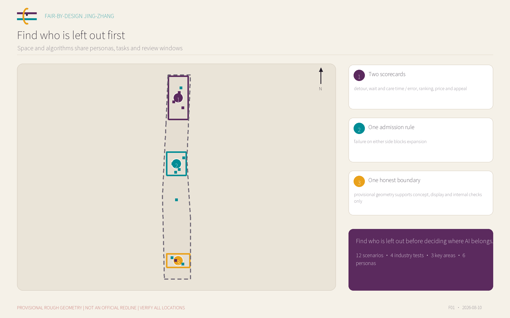
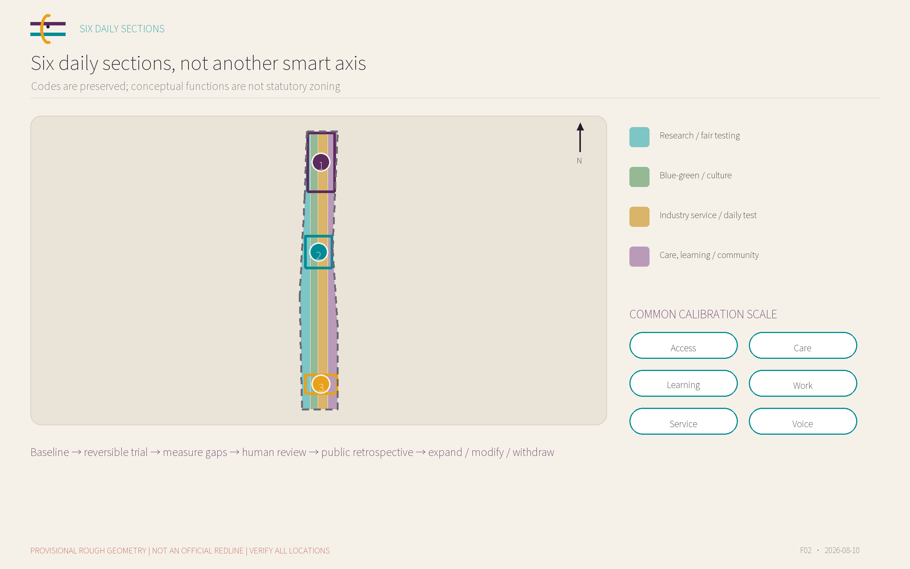
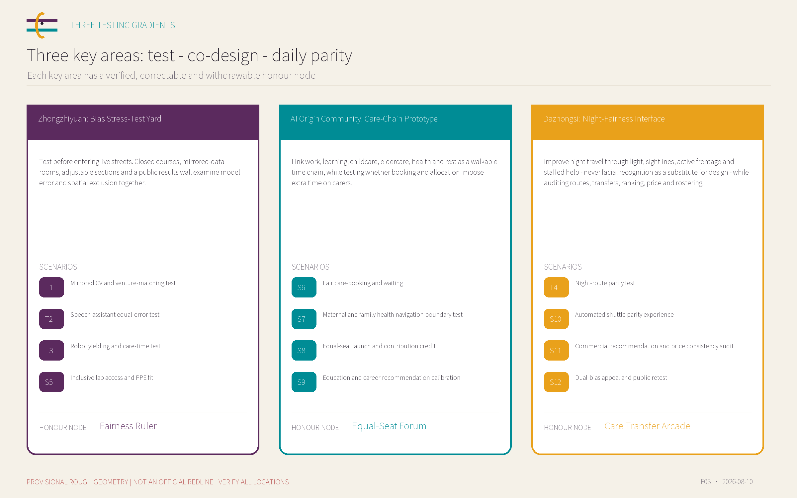
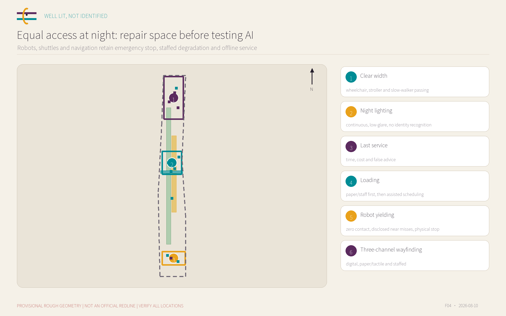
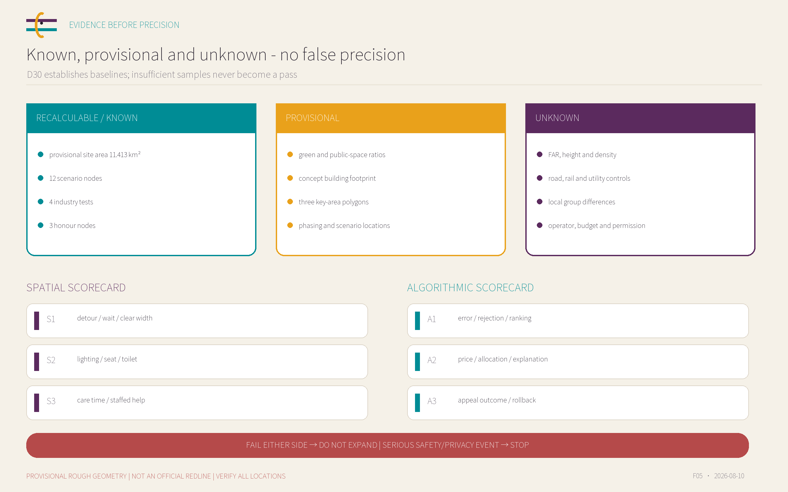

# FAIR-BY-DESIGN JING-ZHANG: A Dual Calibration Protocol for Space and Algorithms

> **Find who is left out before deciding where AI belongs.**

“Fair-by-design” does not claim that either space or an algorithm is already bias-free. It is an auditable, appealable, stoppable and reversible procedure. Using gender and care as an entry point, the proposal tests night travel, accessibility, care work, low digital capability and algorithmic bias in one urban framework. Six test personas, twelve calibration scenarios and three key-area laboratories require every AI service to pass a spatial-access scorecard and an algorithmic-fairness scorecard. Failure on either side blocks expansion. Every spatial statement is a concept on provisional geometry, not statutory planning, approval or engineering authorisation.

## Design Basis and Source List

The evidence hierarchy has four levels. The official announcement establishes the three planning scales, three key areas, tasks and submission context. The Agent taskbook establishes Three Positions, Five Functions, Three Areas and Two Wings, and tasks agent.1 through agent.6. The repository site package supplies provisional geometry, internal area recalculation and a missing-data list. Chinese laws, international institutional guidance and city cases are methodological references only; they are not upgraded into local statutory controls. The task boundary comes directly from the official announcement [source:OFFICIAL-ANNOUNCEMENT], while use restrictions follow the source registry [source:SOURCE-REGISTRY].

No official polygon is available for the overall design area or the three key areas. `SITE-001` therefore remains `official_boundary=false`, `geometry_role=provisional_constraint` and `boundary_precision=provisional_rough`. Its EPSG:4548 area of 11,412,825.386 m² checks internal package consistency only. The key areas are likewise rough placeholders. `PROV-KEY-003` has a repository-recorded semantic-location uncertainty relative to Dazhongsi; this submission preserves the canonical geometry instead of silently moving it [data:geometry/site_boundary.geojson#SITE-001].

There has been no site visit, resident interview, enterprise interview or live human-subject experiment. Personas reveal possible blind spots; they are not local demographic findings. Group differences are hypotheses for testing, not proven local inequities. Parcels, buildings, ownership, road redlines, rail works, utilities, fire, flood, heritage and facility data remain incomplete. FAR, height, density, setbacks and other controls remain unknown. Official inputs must trigger complete clipping, recalculation and conflict review.

Every source, judgement and licence boundary is registered in `sources.json`, `assumptions.json` and the copyright statement. External cases contribute short method summaries only. The maps, diagrams, visual identity direction and boards are original geometric expressions created for this package.

## Three-Level Scope Framework

| Level | Design question | Work in this proposal | Explicit non-claim |
| --- | --- | --- | --- |
| Coordinated research area (announcement: about 43.6 km²) | How industry, talent, care, mobility and services support fair AI | A development-co-design-experience-service-feedback loop across Three Areas and Two Wings | No precise industrial parcels or promises on firms, investment or output |
| Overall design area (announcement: about 11.4 km²) | How repeatable dual-bias audits fit ordinary journeys | Six daily sections: access, care, learning, work, consumption/service, and voice | The provisional boundary is not a redline, acquisition, approval or engineering basis |
| Three key areas (announcement total: about 368.4 ha) | How to stage testing, co-definition and daily use | Zhongzhiyuan tests; AI Origin co-designs; Dazhongsi checks daily parity | No parcel demolition, intensity, height, roads or construction schedule |

The three levels are one decision chain. The coordinated research area asks what industry, public-service and governance interfaces fair AI needs. The overall design area translates those interfaces into six daily sections and reviewable layers. The key areas run 30/60/90-day pilots to test space, algorithms and operations together. Every project moves from problem registration to baseline, controlled trial, difference measurement, human review and public retrospective, ending only in expand, modify or withdraw [depth:three_level_scope_framework].

Replacing the provisional boundary requires recalculating site area, land use, green and public-space ratios, building footprint and phase area, then rechecking every scenario node, road and public-space feature. Any conflict with heritage, utilities, transport, ecology or ownership is withdrawn or relocated, never explained away. The current area status is locked jointly by geometry and metric metadata [metric:site_area_sqm].

The framework asks who is omitted before selecting technology. It identifies beneficiaries, risk bearers and possible objectors; makes the non-digital service and spatial condition workable first; and then tests whether AI actually reduces time, mobility and cognitive burdens. It therefore addresses a world-class AI ecosystem without turning public space into an equipment showroom.

## Coordinated Research Area: Industry and Future City Research

The three official positions become testable obligations. The Centennial Jing-Zhang Cultural Belt recognises not only visible innovators but also carers, maintainers, learners and public-service workers. The Urban AI Life Experience Belt measures whether different people can reach, understand, participate and benefit. The AI Integrated Innovation Belt requires models, robots and intelligent services to pass technical-bias, spatial-exclusion and operational-accountability tests before public use. This is a taskbook interpretation, not a statutory control [source:AGENT-TASKBOOK].

The Five Functions form an accountability chain. Zhongzhiyuan records controlled full-stack model, robot and interface tests, including failure. AI Origin co-defines problems between universities, communities, carers and talent services. Dazhongsi conducts limited trials in consumption, business, night travel and daily services. The Zhongguancun Technology Service Wing may conceptually support law, standards, intellectual property, capital and independent evaluation; the Xiaoyue River Scenario Wing may conceptually support continuous public-space stress tests. No named organisation or commitment is assumed.

| International mechanism | Chinese reference | Transfer and boundary | Evidence |
| --- | --- | --- | --- |
| Vienna gender mainstreaming in urban planning | 维也纳性别主流化城市规划 | 把性别影响检查从规划延伸至公园、交通和项目设计；京张转译为‘每一空间动作先做组间时间与可达性检查’ | [source:VIENNA-GENDER] |
| World Bank gender-inclusive urban planning handbook | 世界银行性别包容城市规划手册 | 用可达、安全、健康、韧性与参与框架检查公共空间；作为方法参照，不证明本地需求 | [source:WORLD-BANK-GENDER] |
| UN Women Safe Cities and Safe Public Spaces | UN Women 安全城市与安全公共空间 | 把参与式夜行审计、跨部门修复和结果复核组合；不把安全等同于增加监控 | [source:UNWOMEN-SAFE-CITIES] |
| UN-Habitat Her City | UN-Habitat Her City | 让女童和年轻女性进入评估、设计、实施过程；京张转译为青年女性测试陪审团 | [source:UNHABITAT-HER-CITY] |
| Barcelona VilaVeïna | 巴塞罗那 VilaVeïna | 以邻里设施组织照护咨询、喘息与公共空间；转译为原点社区照护时间链 | [source:BARCELONA-VILAVEINA] |
| UNESCO Recommendation on the Ethics of AI | UNESCO 人工智能伦理建议书 | 把性别视角、影响评估、透明度与人类监督放入 AI 生命周期 | [source:UNESCO-AI-ETHICS] |
| NIST SP 1270 and AI RMF | NIST SP 1270 与 AI RMF | 把偏差视为数据、技术、人和制度共同产生的社会技术风险；支撑双成绩单和版本复测 | [source:NIST-AI-BIAS] |
| OECD gender mainstreaming toolkit | OECD 性别平等主流化工具包 | 把影响评估、预算与采购责任连成治理闭环；转译为场景准入和停用条款 | [source:OECD-GENDER-TOOLKIT] |

Vienna, the World Bank, UN Women, UN-Habitat and Barcelona contribute care, safety, participation and spatial-equity methods. UNESCO, NIST and OECD contribute AI-lifecycle, sociotechnical-risk, governance and procurement methods. None proves a local disparity or becomes a Beijing statutory rule. They help define questions that local baselines must answer [standard:PROJECT-AGENT-OPEN-CALL-TASKBOOK].

The name FAIR-BY-DESIGN describes a procedure, not a zero-bias achievement. The visual mark uses two common-scale lines and an open calibration aperture: a railway abstraction for shared measurement and an opening for discovery, correction and retesting. Aubergine, cyan and amber communicate care, public visibility and warning without stereotyping gender as pink. The international line is: *Find who is left out before deciding where AI belongs.*

## Overall Design Area: Urban Renewal and Regulatory-Plan-Level Urban Design

The overall structure is an open audit network of six daily sections, not another abstract smart axis. Access asks whether walkers, wheelchair and stroller users, cyclists, night travellers and people with low digital capability reach the same destination. Care asks whether rest, toilets, breastfeeding, child and elder support form a continuous chain. Learning asks whether different ages, languages and abilities can understand AI provenance, limits and appeals. Work asks whether researchers, founders, service and night workers receive fair presentation, collaboration and rest. Consumption/service asks whether people without a phone, account or marketing consent receive an equivalent service. Voice asks whether different bodies and time constraints receive equal opportunities to stay, speak, receive credit and correct errors [depth:overall_spatial_structure].

The dual-calibration loop is: fairness baseline -> small reversible trial -> difference measurement -> human review -> public retrospective -> expand, modify or withdraw. The spatial scorecard measures detour, waiting, clear width, lighting, seating, toilets, care time and staffed help. The algorithmic scorecard measures misrecognition, rejection, ranking, price, allocation, explanation and appeal outcomes. Both use the same personas, task and time window so one side cannot hide failure on the other.

Renewal first repairs basic space and staffed service, then adds removable test components, and only later considers permanent facilities. Ground floors prioritise open testing, public service, care and exchange. Every device publishes purpose, status, fields, retention, owner and physical off switch. Industrial space, talent life and basic service are not interchangeable. `LU-001` through `LU-004` form a complete conceptual partition, never a parcel regulation [data:geometry/land_use.geojson#LU-001].

Land use, buildings, roads, blue-green space, public space and phasing jointly address regulatory-plan-level urban-design objects. Missing intensity, height, setback, road and facility controls remain unknown. Generative precision never substitutes for professional depth or official confirmation.

## Detailed Design of Key Areas

| Key area and role | Detailed-design translation | Pilgrimage/honour node | Spatial evidence |
| --- | --- | --- | --- |
| Zhongzhiyuan: Bias Stress-Test Yard | Test before entering live streets. Closed courses, mirrored-data rooms, adjustable sections and a public results wall examine model error and spatial exclusion together. | Fairness Ruler | [data:geometry/key_areas.geojson#PROV-KEY-001] |
| AI Origin Community: Care-Chain Prototype | Link work, learning, childcare, eldercare, health and rest as a walkable time chain, while testing whether booking and allocation impose extra time on carers. | Equal-Seat Forum | [data:geometry/key_areas.geojson#PROV-KEY-002] |
| Dazhongsi: Night-Fairness Interface | Improve night travel through light, sightlines, active frontage and staffed help - never facial recognition as a substitute for design - while auditing routes, transfers, ranking, price and rostering. | Care Transfer Arcade | [data:geometry/key_areas.geojson#PROV-KEY-003] |

The Zhongzhiyuan Bias Stress-Test Yard runs from controlled evaluation rooms through semi-outdoor courts and variable-clearance courses to a public results wall. Mirrored CV, equal speech error, robot yielding and inclusive lab access tests remain controlled. Systems do not enter live streets without grouped testing and human review. The wall discloses success, failure, takeover, suspension and unresolved defects. Buildings and courses are functional prototypes, not a demolition or road-operation proposal [data:geometry/key_areas.geojson#PROV-KEY-001].

The AI Origin Care-Chain Prototype links work, learning, childcare, eldercare, health, rest and return travel as a walkable time chain. The equal-seat commons contains an adjustable lectern, quiet work-and-care rooms, staffed desks, paper course trees and contribution provenance. It tests whether booking, waitlists, learning recommendations, health navigation and event selection impose extra time on carers, older people or people without smartphones. Co-design requires future interviews; no community or university support is claimed [data:geometry/key_areas.geojson#PROV-KEY-002].

The Dazhongsi Night-Fairness Interface uses light, sightlines, active frontage, sheltered rest, staffed help and accountable operations - never face, gait or emotion recognition as a substitute for design. Two comparable walk segments examine routes, last service, automated transfer, recommendation and price. Because `PROV-KEY-003` has high location uncertainty, this is a functional model, not a parcel or station-interface design [data:geometry/key_areas.geojson#PROV-KEY-003].

The three honour nodes are the Fairness Ruler, Equal-Seat Forum and Care Transfer Arcade. They recognise verifiable corrections rather than corporate popularity; credit requires consent, provenance, correction and withdrawal. Until heritage, landscape, structure, fire, ownership and site approval, they remain temporary-display concepts [depth:three_key_area_detailed_design].

## AI Innovation Ecosystem, Personas, and AI+ Scenarios

The six personas expose blind spots and do not represent local population shares. Women appear as research leaders, founders, testers and decision makers, not only protected users. Male carers are explicit so care is not reassigned to women. Night workers and maintainers are co-producers of the innovation ecosystem. No system infers gender, pregnancy, disability, health or family role from faces, voices, behaviour or routes. Self-description is voluntary, skippable and stored separately.

| ID | Test persona | Core task | Primary risk |
| --- | --- | --- | --- |
| P1 | woman AI founder working late | a predictable chain between funding, hiring, labs and late transport | ranking bias, night detours, and portraying women only as protected users |
| P2 | male engineer with primary childcare duties | stroller access, childcare booking, flexible events and child-welcoming work space | care being reassigned to women, or booking systems penalising atypical schedules |
| P3 | pregnant or breastfeeding postdoctoral researcher | lab safety, fitting PPE, health navigation, rest and return-to-work continuity | leakage of sensitive health data and indirect exclusion by access or rostering systems |
| P4 | older woman without a smartphone who walks slowly | legible wayfinding, frequent rest, toilets, staffed help and paper proof | combined exclusion by digital identity, default walking speed and speech errors |
| P5 | night-shift cleaning, retail or delivery worker | visible rest points, night interchange, safe loading and appealable algorithmic scheduling | serving visitors while overlooking essential workers, and replacing spatial safety with surveillance |
| P6 | visitor using a wheelchair, mobility aid or stroller | continuous clear width, gentle gradients, entrance choice, robot yielding and accessible event seating | accessible routes becoming longer second-class routes, or robots passing only idealised tests |

Every scenario submits two scorecards. Numerical gates are preregistered after a D30 baseline by statistical, safety, accessibility and ethics leads. Insufficient samples are reported as insufficient evidence, never as fairness. Each scenario has a staffed or non-digital fallback, but fallback is a safety floor rather than the brand proposition. Spatial carriers cross-reference public-space geometry [data:geometry/public_space.geojson#PUBLIC-001].

| ID | Type | Scenario | Spatial carrier | Priority groups | Spatial scorecard | Algorithm scorecard |
| --- | --- | --- | --- | --- | --- | --- |
| T1 | industry test | Mirrored CV and venture-matching test | controlled evaluation room and public results wall in the Zhongzhiyuan bias stress-test yard | women founders, carers and researchers across ages | difference in access to equal-size booths, equal time slots and accessible pitching seats | group gaps in selection, ranking and explanation completeness for qualification-matched mirrored CVs |
| T2 | industry test | Speech assistant equal-error test | noise-adjustable meeting booths with text input and human note-taking | speakers across pitch, accent, age and assistive-device use | device reach and task-time gaps across stature and hearing needs | group gaps in word error, command completion and correction burden |
| T3 | industry test | Robot yielding and care-time test | a low-speed closed course with variable clear widths, separate from live streets | wheelchair, walker and stroller users across stature and speed | minimum clearance, detour, waiting time and parity of accessible routes | group gaps in detection, yielding, near misses and human takeover |
| T4 | industry test | Night-route parity test | two comparable walking segments at the Dazhongsi night-fairness interface | night workers, women founders and slow or mobility-aid users | gaps in time, cost, lighting continuity, active frontage, rest and last-service connection | group gaps in route ranking, cost estimation, interchange feasibility and false alerts |
| S5 | public service | Inclusive lab access and PPE fit | height-adjustable access prototype, PPE fitting zone and staffed visitor desk | pregnant or breastfeeding researchers, short-stature and wheelchair users, and visitors | reach, clear width, PPE size coverage and queue-time gaps | group gaps in rejection, false alarms and human override time |
| S6 | public service | Fair care-booking and waiting | care advice desk and quiet waiting area in the AI Origin equal-seat commons | single-parent households, male carers, older people and people without smartphones | gaps in walk distance, seats, toilets, stroller parking and waiting | group gaps in booking, waitlist ranking, reminder reach and no-show penalties |
| S7 | public service | Maternal and family health navigation boundary test | private consultation room, public service-directory wall and staffed referral desk | pregnant and breastfeeding people, partner-carers and families across ages | privacy, accessibility, referral walk time and companion seating | information completeness, mis-referral and escalation of high-risk questions |
| S8 | innovation service | Equal-seat launch and contribution credit | equal-seat forum, adjustable lectern, quiet prep room and contribution-provenance display | women scientists, start-ups, students, carers and frontline maintainers | gaps in prime slots, accessible seats, speaking time and backstage preparation | group gaps in recommendation exposure, speaker order and omitted credit |
| S9 | public service | Education and career recommendation calibration | shared learning tables, paper course trees and staffed career advice | girls and women students, returning carers, older learners and account-free visitors | time-slot, quiet-seat, care-compatibility and no-account information gaps | group gaps in field and job exposure, salary bands and advanced-course recommendations |
| S10 | urban service | Automated shuttle parity experience | off-station mock waiting island, staffed guide desk and accessible boarding prototype | night workers, wheelchair or stroller users, slow older walkers and visitors | gaps in waiting, boarding, ramp availability and sheltered seating | group gaps in dispatch wait, detour, denied boarding and takeover time |
| S11 | urban service | Commercial recommendation and price consistency audit | public price interfaces and no-login lookup terminals in the everyday parity arcade | local workers, visitors, older people, carers and multilingual users | gaps in visibility, queue, seating and accessible reach for equivalent offers | mirrored-profile gaps in ranking, discount, price display and event recommendation |
| S12 | governance | Dual-bias appeal and public retest | three calibration desks, phone and paper entry, and quarterly public retest sessions | all users, prioritising affected people and those with low digital skills | distance to appeal, wait, accessibility, resolution time and visibility of spatial repairs | group gaps in intake, human review, rollback and correction outcome |

| ID | Minimum data | Privacy boundary | Operator and reviewer | Baseline | Window | Success gate | Stop gate |
| --- | --- | --- | --- | --- | --- | --- | --- |
| T1 | synthetic CVs, volunteer ratings and a human benchmark; no live recruitment database | synthetic identities only; publish aggregate results, never individual scores | yard operator plus independent employment and algorithm reviewers | two pre-launch mirrored baselines, with sample size preregistered by a statistician | 30/60/90 d | all mirrored-group gaps stay within preregistered tolerance and 100% receive readable explanations | any group breaches tolerance twice, rankings cannot be explained, or real personal data appears |
| T2 | consented volunteer recordings, synthetic speech and human transcripts | no voiceprint identification; delete raw audio on schedule; text-only participation available | test-yard operator plus linguistics and accessibility reviewers | separate human and model baselines by noise level and interaction mode | 30/60/90 d | completion gaps meet preregistered tolerance without degrading fallback completion | misrecognition causes a high-risk command, recordings cannot be deleted, or text fallback fails |
| T3 | closed-course event logs, human observation and anonymous volunteer feedback | no facial or gender inference; video retained briefly for redacted safety review only | robot provider, independent transport-safety supervisor and public observers | human cart and no-robot runs form same-route controls | 30/60/90 d | zero collisions; near-miss and group-yielding gaps below preregistered thresholds | one collision, clustered near misses, failed emergency stop, or blocked clear width |
| T4 | public timetables, manual lux readings, volunteer walk logs and observation | no faces or inferred gender; one-time route IDs and aggregate publication | district operator, transport and lighting reviewers, and worker representatives | record human-recommended and existing digital routes at matching times | 30/60/90 d | no group is systematically routed farther, darker, or past the last service | a route cannot be completed safely, last-service advice fails, or surveillance replaces spatial repair |
| S5 | synthetic credentials, manual access checks and voluntary fit feedback | no pregnancy or health labels; credentials and feedback stored separately | lab safety lead and accessibility adviser | time existing staffed access in parallel with the prototype | 30/60/90 d | all participants pass independently or receive staffed help within two minutes | lock-in, requested health status, or admission with clearly ill-fitting PPE |
| S6 | test slots, synthetic household situations, and paper and phone task logs | no real child data; conduct a separate sensitive-data assessment before live service | community operator, care providers and public reviewers | compare app, phone and paper channels against identical test capacity | 30/60/90 d | channel completion and wait gaps fall within preregistered tolerance | phone-less users cannot complete, care status is commercialised, or waitlist logic is opaque |
| S7 | public service directories and human-edited answers; no medical records | no diagnosis or retained health queries; clear sessions on exit | public-service navigator and clinical-content reviewer | staffed directory-search accuracy and completion time form the baseline | 30/60/90 d | directory accuracy meets the human-reviewed target and all high-risk questions reach staff | diagnostic advice, stored health data, or recommendation of stale services |
| S8 | voluntarily submitted event materials and human-verified contribution records | anonymous or team credit permitted; no inferred identity attributes | event curator and contribution-verification group | audit the scheduling template first without claiming a local disparity as fact | 30/60/90 d | every display has verified provenance and seat/time allocation reasons are public | misattribution, identity marketing, unexplained exposure demotion, or occupied accessible seating |
| S9 | synthetic learner profiles and public course/job categories; no live education records | no inferred gender or family role; optional self-selected profiles only | learning-space operator plus education and employment reviewers | human directory choices under a shared task list form the control | 30/60/90 d | mirrored synthetic profiles receive equal field breadth and advancement opportunity | stereotypes narrow choices, live student records appear, or personalisation cannot be disabled |
| S10 | simulated services and volunteer tasks; no live public-transport dispatch | no facial ticketing or inferred mobility; anonymised task records | transport-test operator plus accessibility and safety reviewers | matching-time controls using staffed shuttle and walking alternatives | 30/60/90 d | zero denied boardings and waiting/boarding gaps within preregistered tolerance | denied boarding, ramp failure, unavailable takeover, or wrong last-service information |
| S11 | public catalogues, synthetic sessions and manual cross-sectional records | no fingerprinting or cross-shop tracking; clear terminals after every session | commercial operator and consumer-rights reviewer | same-time, same-offer comparison across synthetic sessions | 30/60/90 d | same-condition prices match and differentiated recommendation is explained and switchable | hidden differential price, unswitchable tracking, unknown price source or sensitive profiling |
| S12 | minimal incident records, public issue categories and anonymised outcomes | separate appeal and operations logs; access, correction and consent withdrawal available | independent appeal officer, scenario owner and public observers | publish intake criteria, owner, deadline and escalation route before the pilot | 30/60/90 d | 100% of appeals have receipt, owner and deadline, with traceable retest results | appeal affects eligibility, unexplained overdue cases, impossible rollback or retaliation |

T1 through T4 are industry tests: mirrored CVs, equal speech error, robot yielding and night-route parity. T1/T2 focus on model and interface bias; T3/T4 combine device or route performance with daily human cost. No live employment, health, public-service or transport eligibility decision is automated here. S5-S12 apply the same discipline to access, care booking, health navigation, equal-seat launches, learning recommendations, shuttles, commercial price and public appeals.

Fairness does not demand identical outcomes. It publishes tasks, reasonable accommodation and permitted reasons for difference, then tests whether any group systematically absorbs more delay, detour, price, failure or appeal burden. Expansion requires zero serious safety/privacy events, both scorecards passing, completed human review, a rehearsed stop mechanism and accountable signatures [standard:GENERATIVE-AI-INTERIM-MEASURES].

## Land Use, Building Scale, and Retain-Renovate-Demolish Strategy

Four seamless conceptual land-use polygons allow recalculation within the provisional site. `LU-001` research land supports fair testing, R&D and public evaluation. `LU-002` park green space supports blue-green, cultural and low-impact display. `LU-003` commercial service land supports industry services, translation and daily consumption tests. `LU-004` community-service land supports care, learning and staffed assistance. Repository-registered national land-use codes are preserved; functional text neither changes the codes nor claims existing or statutory use [standard:MNR-LAND-USE-CLASSIFICATION-GUIDE].

Retain-renovate-demolish is conditional. Retain space confirmed by formal study as heritage-significant, structurally safe, reusable or essential to basic services. Renovate ground-floor openness, accessibility, care, lighting, wayfinding, acoustics and reversibility first. New-build suggestions are limited to light removable test booths, service porches and data units. No parcel-level demolition judgement is made. Building survey, heritage, planning, ownership, fire and municipal processes precede permanent action [depth:retain_renovate_demolish].

`BLDG-001` is a conceptual footprint to validate the building layer and spatial relationship, not an existing-condition survey, designed building or quantity. Its footprint area can be calculated, but total floor area, FAR, density and height cannot [metric:building_footprint_area_sqm]. These values remain unknown in `metrics.json` and must be recalculated with official data.

Professional deepening adds anti-displacement observation: low-cost services, rent, small businesses and night-worker burden. Expansion pauses if a pilot raises access costs, displaces basic services or shifts data work and risk onto workers. Equipment counts and招商 narratives are never proxies for spatial quality.

## Transport, Rail, Municipal Infrastructure, and Public Services

Transport design does not draw unapproved roads or rail. It protects an unbroken task chain: arrival, transfer, walk, building entry, service and return. Six personas record detour, wait, gradient, clear width, lighting, last-service information and staffed help. `ROAD-001` is a conceptual equal-access greenway, not an existing road or redline. Stations, entrances, parking and catchments await official transport data [data:geometry/roads.geojson#ROAD-001].

Walking improvements first repair discontinuity, steps, wheelchair/stroller passing, night light and temporary obstruction. Loading begins with time allocation, signs and staffed negotiation before algorithmic scheduling. Robots and automated shuttles stay in closed or explicitly authorised environments with a physical emergency stop. Contact, obstruction of the only accessible route or failed stop halts the test. No bridge, tunnel, widening or station-city feasibility is claimed [depth:traffic_rail_slow_parking].

New infrastructure is edge-first, data-minimised, vendor-neutral, portable and physically switchable. Sensors disclose purpose, fields, retention and owner, with identity recognition disabled. Every system has staffed degradation and offline service. Data, compute, energy, drainage, fire and network capacity require professional calculation; a generated diagram cannot prove municipal capacity [depth:municipal_new_infrastructure].

Public services follow the care-time chain: rest, toilets, water, breastfeeding, quiet space, staffed enquiry, paper proof, accessibility repair and night support. Facility count, catchment and existing supply are not yet surveyed, so the diagram shows priorities without false quantities.

## Blue-Green Network, Public Space, and Urban Character

The Jing-Zhang heritage park, Xiaoyue River and related blue-green space are directional public-space backbones only. Official green/blue lines, river, heritage, ecological and flood conditions are missing. No bridge, tunnel, bank or permanent water-engineering conclusion is offered. `GREEN-001` and `PUBLIC-001` are conceptual carriers whose ratios compare internal package allocation only [data:geometry/green_space.geojson#GREEN-001].

The component library includes movable seating, shade and rain shelter, different table heights, care storage, water and sanitation, short quiet rooms, paper/tactile/audio/plain bilingual wayfinding, staffed help, fault reporting and a public audit plate. The plate states device purpose, status, data, owner and off switch. Temporary equipment never blocks the sole accessible path and undergoes accessibility, fire, heritage, green-space and road review before fixation [depth:blue_green_public_space].

“Well lit, not identified” is the night-character baseline. It prioritises continuous light, low glare, clear sightlines, active frontage and accountable staff, not face, gait, voiceprint or emotion recognition. The character is precise but open, technological but not spectacular: equipment recedes while stay, care, work and exchange remain foreground. Every provisional boundary uses a low-contrast dash.

The cultural story translates the railway's shared measure into a shared test for the AI era. Honour displays record consented and verified algorithm fixes, space maintenance, care support, public testing and failure reports, never popularity. The three nodes are not approved monuments; permanent forms require cultural, copyright and site permission. The current green ratio remains tied to provisional geometry [metric:green_ratio].

## Renewal Projects, Implementation Policy, and Phasing

| ID | Concept project | Suggested locus | Scenarios | Prerequisite and boundary |
| --- | --- | --- | --- | --- |
| JZ-F01 | Zhongzhiyuan closed dual-bias test yard | PROV-KEY-001 | T1-T3 | 需运营主体、测试伦理、安全审批和企业自愿接入；不进入真实街道 |
| JZ-F02 | AI Origin care-time-chain segment | PROV-KEY-002 | S6-S9 | 需现场测绘、设施权属、服务机构和分时基线 |
| JZ-F03 | Dazhongsi night-fairness segment | PROV-KEY-003 | T4,S10-S11 | 需站点/道路条件、夜间照度、运营许可和安全复核 |
| JZ-F04 | Three dual-bias appeal desks | 三处重点区 | S12 | 需独立责任人、期限、数据隔离和版本回滚协议 |
| JZ-F05 | Equal-section public-space component library | SITE-001 | 全场景 | 需无障碍、消防、文保、绿地及道路专业深化 |
| JZ-F06 | Quarterly baseline and annual public retest | 运营网络 | 全场景 | 需预算、采购条款、公众观察员和匿名发布规范 |
| JZ-F07 | Three contribution and calibration honour nodes | 三处重点区 | S8,S12 | 仅为概念性展示系统，需文化策展、版权和场地许可 |
| JZ-F08 | Fair procurement and scenario admission clauses | 治理层 | T1-T4 | 需法务、行业监管与专业团队确认，非已定政策 |

Roles and locations are suggestions, not commitments by government, companies, universities, communities or operators. Before pilot admission, each project answers: who owns it, whom it serves, what resources and permission it needs, what baseline applies, when it is reviewed, what success and stop gates apply, and how staff take over. The phase geometry is a conceptual area, not land, construction or funding allocation [data:geometry/phasing.geojson#PHASE-001].

Preparation (0-3 months) obtains official polygons, existing-condition, ownership, heritage, transport and municipal data; performs site visits and stakeholder interviews; and confirms insurance, permission, fields and a two-key stop process. Missing prerequisites block deployment. Near term (4-12 months) uses only removable, low-impact and staff-replaceable scenarios, each with 30/60/90-day review. Medium term (1-3 years) deepens only dual-calibrated and legally approved projects. Long term converts verified methods into open protocols and bilingual knowledge, while permanent works still follow independent statutory procedures [depth:phasing_implementation].

The proposed annual programme is FAIR-BY-DESIGN Jing-Zhang Open Calibration Season. Spring publishes baselines and data gaps; summer runs industry and night/care tests; autumn bilingual sessions show passes, failures, corrections and withdrawals; winter reports adopted, not adopted and insufficient-evidence items. Monthly red-team walks, quarterly scenario open days and half-year independent review provide rhythm, not an event or investment commitment.

Conversion is fixed: register problem -> controlled test -> human review -> limited pilot -> public evaluation -> continue, modify or withdraw. A showcase never jumps directly to procurement or permanent construction. The professional depth matrix verifies the renewal list [depth:renewal_project_list].

## Metrics, Area Recalculation, and Compliance Matrix

Metrics have three classes. Geometry-derived values include provisional site area, conceptual building footprint, green/public-space ratios, key-area count, scenario nodes and phase geometry. Official-control metrics include FAR, height, density, setbacks, redlines, rail catchment, parking, utilities, fire, flood, heritage and facility standards; all remain unknown. Operational metrics include task completion, maximum persona gap, staffed fallback, withdrawal readiness, field minimisation, serious incidents and appeal response; none is reported as observed without a pilot [depth:metrics_recalculation].

Dual pass rate is scenarios passing both scorecards divided by active scenarios. Maximum persona gap is highest minus lowest completion among valid test groups. Staffed fallback and withdrawal readiness target 100%; serious safety/privacy events target zero. All gates are preregistered after D30. Insufficient samples mean insufficient evidence, not a pass. Known spatial values use EPSG:4548 and identical inputs [metric:site_area_sqm].

`compliance_matrix.json` covers 17 announcement requirements and agent.1-agent.6. `standard_matrix.json` links the announcement, taskbook, urban design, regulatory planning, land use, accessibility and AI governance. `design_depth_matrix.json` covers all 15 required formal-depth items. Complete/addressed means this concept package supplies method, layer, drawing and explicit gap response; it does not mean missing controls are confirmed.

Known values stay identical in proposal, GeoJSON, HTML and drawings. Any later edit requires re-rendering, raw-byte manifest hash update and a full self-check. Replacing the official boundary is not a one-line area edit; it triggers recalculation of every spatial layer and metric.

## Risk, Copyright, and Compliance

Principal risks are misuse of provisional geometry; uncertainty of the Dazhongsi placeholder; algorithmic discrimination; sensitive data and excessive surveillance; robot and night safety; automation bias; worker surveillance and burden shift; displacement of basic services; vendor lock-in; heritage, green or blue-line conflict; and falsely presenting a small test group as community consensus. Each risk appears in assumptions, self-checks, figure warnings and stop gates. Boundary use is controlled by `A-BOUNDARY-001` and the common repository clause [depth:risk_missing_data].

Direct beneficiaries include the six personas and general public-space users. Risk bearers include minors, passers-by, delivery/cleaning/maintenance workers, accessibility users, small businesses and credited contributors. Possible objectors include firms concerned about audit cost or IP, residents concerned about surveillance/noise, maintenance teams concerned about workload, professionals concerned about heritage/ecology, and advocates concerned about token participation. Formal pilots interview these groups and record dissent and reasons for non-adoption.

A two-key governance model allows either the site-safety lead or independent public-interest/ethics lead to stop the trial. Anyone identifying immediate safety or privacy harm can trigger emergency pause. Expansion requires signatures from both roles. A model, developer or single vendor cannot self-authorise. Health, employment, education and public-service AI remains test or navigation support, never eligibility decision or professional replacement [standard:GENERATIVE-AI-INTERIM-MEASURES].

Text, maps, identity direction, charts, HTML and PDFs were generated in this Codex collaboration from cleared sources. Noto Sans SC (SIL OFL 1.1) renders all boards and PDFs; the font file is not distributed. External cases are summarised and cited without copying images, charts, logos or portraits. Tool, rights and use details appear in `report/copyright_statement.md` and `sources.json`.

This submission claims no official approval, adopted regulatory plan, land right, building scale, funding, procurement, event or guaranteed implementation. Submission, merge, score, gallery display or selection does not mean government adoption, planning approval, construction authorisation or completion.

## References

Only claim-adjacent anchors appear in the narrative. The complete source, use and rights register follows. External authoritative material remains methodological background; local conclusions still require official data and field research. The announcement and Agent taskbook are the primary task sources [source:AGENT-TASKBOOK].

- **SITE-PACKAGE**: brief/site-package/ - 任务、枚举、限制、schema 与临时几何使用边界。
- **SOURCE-REGISTRY**: data/source_registry.json - 区分正式、背景、临时与待复核资料。
- **PROCESSED-FACT-PACK**: data/processed/agent_fact_pack.md - 阅读导航，不作为新的权威来源。
- **BOUNDARY-SOURCE**: brief/site-package/geometry/provisional_boundaries.geojson - 临时总体范围，仅用于概念生成、展示与复核。
- **KEY-AREA-SOURCE**: brief/site-package/geometry/provisional_boundaries.geojson - 三处临时重点区，非 official polygon。
- **OFFICIAL-ANNOUNCEMENT**: https://ghzrzyw.beijing.gov.cn/zhengwuxinxi/tzgg/hd/202605/t20260509_4643047.html - 项目目的、范围、任务与成果语境。
- **AGENT-TASKBOOK**: brief/site-package/agent_taskbook.json - 智能体六项任务、定位、功能、三区两翼、品牌与运营要求。
- **VIENNA-GENDER**: https://www.wien.gv.at/stadtplanung/handbuch-gender-mainstreaming-stadtentwicklung-stadtplanung - 性别主流化规划方法背景；不复制图文。
- **WORLD-BANK-GENDER**: https://www.worldbank.org/en/topic/urbandevelopment/publication/handbook-for-gender-inclusive-urban-planning-and-design - 性别包容城市设计框架背景；不证明京张现状。
- **UNWOMEN-SAFE-CITIES**: https://www.unwomen.org/en/digital-library/publications/2020/02/safe-cities-and-safe-public-spaces-international-compendium-of-practices-2 - 参与式安全审计方法背景；不复制受版权保护图像。
- **UNHABITAT-HER-CITY**: https://unhabitat.org/her-city-a-guide-for-cities-to-sustainable-and-inclusive-urban-planning-and-design-together-with - 青年女性共同设计流程背景。
- **BARCELONA-VILAVEINA**: https://www.barcelona.cat/ciutatcuidadora/en/noticia/vila-veina-the-new-community-care-initiative-2_1130635 - 邻里照护单元机制背景。
- **UNESCO-AI-ETHICS**: https://www.unesco.org/en/legal-affairs/recommendation-ethics-artificial-intelligence - AI 伦理、性别影响与人类监督背景。
- **NIST-AI-BIAS**: https://www.nist.gov/publications/towards-standard-identifying-and-managing-bias-artificial-intelligence - 社会技术偏差识别与管理方法背景。
- **NIST-AI-RMF**: https://www.nist.gov/publications/artificial-intelligence-risk-management-framework-ai-rmf-10 - 风险治理与持续复测框架背景。
- **OECD-GENDER-TOOLKIT**: https://www.oecd.org/en/publications/toolkit-for-mainstreaming-and-implementing-gender-equality-2023_3ddef555-en.html - 影响评估、预算与采购工具背景。
- **GENERATIVE-AI-MEASURES**: https://www.gov.cn/zhengce/zhengceku/202307/content_6891752.htm - 仅在适用范围内说明生成式 AI 服务防歧视要求。
- **BARRIER-FREE-LAW**: https://www.gov.cn/yaowen/liebiao/202306/content_6888910.htm - 无障碍环境建设的国家法律背景。
- **BEIJING-WOMEN-CHILDREN-PLAN**: https://www.beijing.gov.cn/zhengce/zhengcefagui/202112/t20211215_2561570.html - 北京市妇女儿童发展与女性科技创新的政策背景。
- **PIPL**: https://www.gov.cn/xinwen/2021-08/20/content_5632486.htm - 真实试点个人信息与敏感信息保护边界。
- **FONT-NOTO-SANS-SC**: https://github.com/google/fonts/tree/main/ofl/notosanssc - 所有本案图件与 PDF 的开源字体渲染，SIL OFL 1.1。字体文件不随投稿分发。

The package also contains `sources.json`, `assumptions.json`, `metrics.json`, three matrices, nine GeoJSON layers, bilingual HTML, ten language-specific figures, bilingual A3 booklets and bilingual A0 boards. AI output remains subject to participant review and cannot replace planning, legal, ethical, accessibility, heritage, transport, municipal or engineering judgement.
