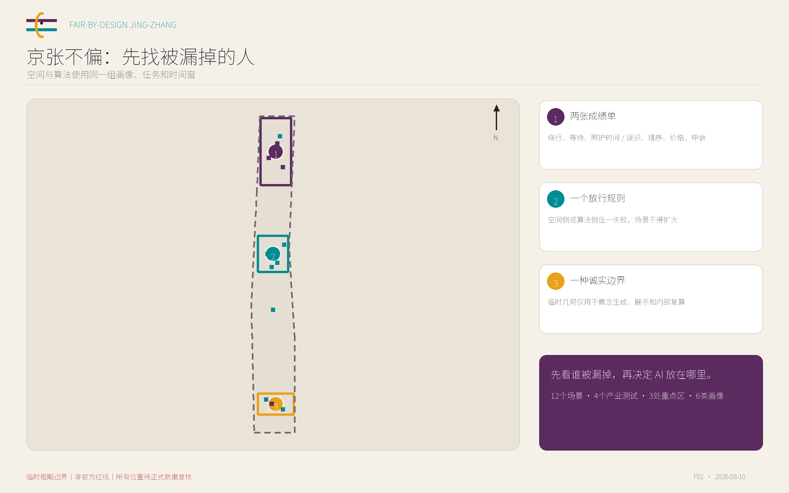
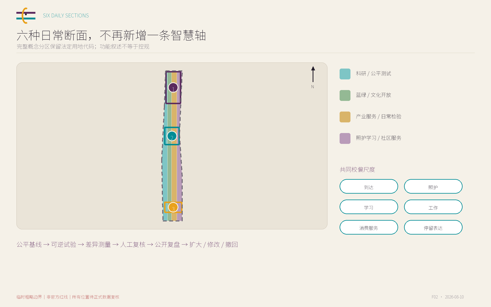
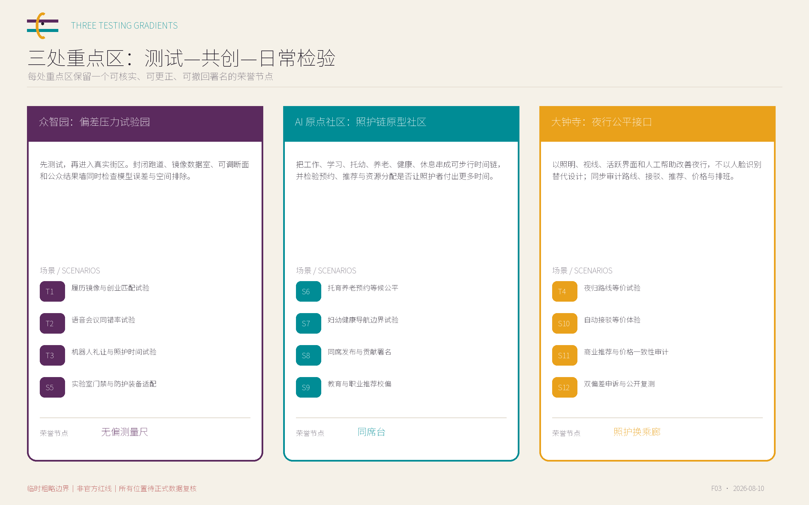
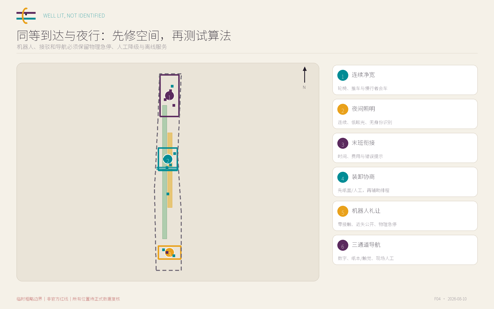
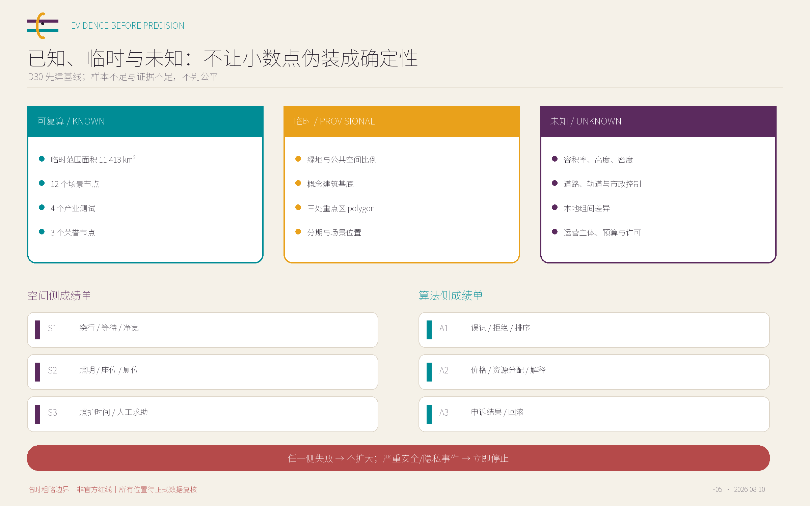

# 京张不偏 / FAIR-BY-DESIGN JING-ZHANG：空间-算法双重校偏协议

> **先看谁被漏掉，再决定 AI 放在哪里。**

“不偏”不是宣称空间或算法已经没有偏差，而是一套可审计、可申诉、可叫停、可撤回的设计程序。本案以性别与照护公平为切口，把夜间出行、无障碍、照护劳动、低数字能力和算法偏差放进同一套城市测试框架。六类测试画像、十二个校偏场景和三处重点区试验场要求每个 AI 场景同时通过空间可达性与算法公平性检查；任何一侧失败都不能扩大试点。全部空间结论均为临时边界上的概念建议，不替代正式规划、政府审定或工程审批。

## 设计依据与资料清单

本方案采用四级证据结构：官方公告确认三层范围、三处重点区、任务目标与成果性质；面向智能体任务书确认三大定位、五大功能、三区两翼和六项智能体任务；仓库场地包形成临时几何、面积复算和缺资料清单；国内法规、国际机构指南和城市案例只作为设计方法与治理机制参照，不升级为本地法定规划条件。公告及任务书是任务边界的直接依据 [source:OFFICIAL-ANNOUNCEMENT]，场地资料用途则以来源登记表为准 [source:SOURCE-REGISTRY]。

当前没有总体设计范围或三处重点区的 official polygon。`SITE-001` 必须保持 `official_boundary=false`、`geometry_role=provisional_constraint`、`boundary_precision=provisional_rough`；其 EPSG:4548 复算面积 11,412,825.386 m² 只用于本包内部一致性检查，不得被解释为精确红线。三处重点区同样是临时粗略几何；尤其 `PROV-KEY-003` 与“大钟寺”的语义位置存在仓库已记录的不确定性，本案保留 canonical 几何而不自行移动，待官方 polygon 后整体替换 [data:geometry/site_boundary.geojson#SITE-001]。

本次工作没有开展现场踏勘、居民访谈、企业访谈或真实人群实验。画像是暴露设计盲点的测试角色，不是本地人口统计；组间差异是待验证假设，不是已证实的本地不公平事实。现状地块、建筑、权属、道路红线、轨道工程、市政、消防、防洪、文保和服务设施资料不完整，容积率、高度、密度、退线等控制全部保持 unknown。正式资料到位后须重裁所有图层、重算指标并撤回冲突内容。

资料、判断和许可边界均在 `sources.json`、`assumptions.json` 与版权声明中逐项登记。对外部案例只摘要方法，不复制图表、标志或人物素材；所有地图、图形、Logo 方向与图版均为本案原创几何表达。

## 三层范围工作框架

| 层级 | 设计判断 | 本方案工作 | 不越界事项 |
| --- | --- | --- | --- |
| 统筹研究范围（公告约43.6 km²） | 产业、人才、照护、交通与公共服务如何共同支撑公平 AI | 形成三区两翼的开发-共创-体验-服务-反馈回路 | 不绘制精确产业地块，不承诺招商、资金、企业或产值 |
| 总体设计范围（公告约11.4 km²） | 如何在日常路径中布置可重复的双偏差审计 | 叠加到达、照护、学习、工作、消费服务、停留表达六类断面 | 临时边界不作为红线、征拆、审批或工程依据 |
| 三处重点区（公告合计约368.4 ha） | 如何把测试、共同定义问题和日常应用分阶段组织 | 众智园测试、AI原点社区共创、大钟寺日常检验 | 不确定地块拆改留、强度、高度、道路或建设时序 |

三层不是三套彼此分离的愿景。统筹研究范围确定“公平 AI 需要哪些产业、公共服务和治理接口”；总体设计范围把接口落实到六种日常断面和可复核图层；重点区域用 30/60/90 天小规模试验检验空间、算法和运营是否同时成立。每个项目从问题登记开始，经公平基线、受控试验、差异测量、人工复核和公开复盘，最终只能进入“扩大、修改或撤回”三种人类决定 [depth:three_level_scope_framework]。

正式边界替换后必须重算 `site_area_sqm`、各用地面积、绿地与公共空间比例、建筑基底和分期面积，并重新检查全部场景节点、道路和公共空间是否越界。任何与文保、市政、交通、生态或权属冲突的内容不做“适配性解释”，而是直接撤回或重新选址。边界与面积的当前状态由几何和指标共同锁定 [metric:site_area_sqm]。

这套工作框架把“谁被漏掉”放在技术选型之前：先明确受益者、风险承担者和潜在反对者，再决定是否需要 AI；先证明非数字服务和空间条件本身可用，再比较 AI 是否真正降低时间、移动和认知门槛。因而它既回应世界级 AI 创新生态，也避免把公共空间简化为设备展场。

## 统筹研究范围产业与未来城市研究

“京张不偏”把三大定位转译为可检验任务：百年京张文化带不仅纪念被看见的创新者，也记录照护者、维护者、青年学习者和公共服务劳动者的贡献；都市 AI 生活体验带衡量不同人是否更容易到达、理解、参与和受益；AI 融合创新带要求进入公共环境的模型、机器人或智能服务先通过技术偏差、空间排斥和运营责任三重测试。该转译来自智能体任务书而非法定控制 [source:AGENT-TASKBOOK]。

五大功能形成一条责任链。众智园负责全栈模型、机器人和交互系统的受控测试与失败记录；AI 原点社区负责高校-社区共同定义问题、公共 AI 素养、照护与人才支持；大钟寺负责消费、商务、夜间出行和生活服务中的有限试用；中关村科技服务翼概念上提供法律、标准、知识产权、资本和第三方评估支持；小月河场景赋能翼概念上承担连续公共空间和压力测试。任何组织角色均为建议，不代表已确定机构或承诺。

| 国际机制 | 英文名称/机制 | 京张转译边界 | 证据 |
| --- | --- | --- | --- |
| 维也纳性别主流化城市规划 | Vienna gender mainstreaming in urban planning | 把性别影响检查从规划延伸至公园、交通和项目设计；京张转译为‘每一空间动作先做组间时间与可达性检查’ | [source:VIENNA-GENDER] |
| 世界银行性别包容城市规划手册 | World Bank gender-inclusive urban planning handbook | 用可达、安全、健康、韧性与参与框架检查公共空间；作为方法参照，不证明本地需求 | [source:WORLD-BANK-GENDER] |
| UN Women 安全城市与安全公共空间 | UN Women Safe Cities and Safe Public Spaces | 把参与式夜行审计、跨部门修复和结果复核组合；不把安全等同于增加监控 | [source:UNWOMEN-SAFE-CITIES] |
| UN-Habitat Her City | UN-Habitat Her City | 让女童和年轻女性进入评估、设计、实施过程；京张转译为青年女性测试陪审团 | [source:UNHABITAT-HER-CITY] |
| 巴塞罗那 VilaVeïna | Barcelona VilaVeïna | 以邻里设施组织照护咨询、喘息与公共空间；转译为原点社区照护时间链 | [source:BARCELONA-VILAVEINA] |
| UNESCO 人工智能伦理建议书 | UNESCO Recommendation on the Ethics of AI | 把性别视角、影响评估、透明度与人类监督放入 AI 生命周期 | [source:UNESCO-AI-ETHICS] |
| NIST SP 1270 与 AI RMF | NIST SP 1270 and AI RMF | 把偏差视为数据、技术、人和制度共同产生的社会技术风险；支撑双成绩单和版本复测 | [source:NIST-AI-BIAS] |
| OECD 性别平等主流化工具包 | OECD gender mainstreaming toolkit | 把影响评估、预算与采购责任连成治理闭环；转译为场景准入和停用条款 | [source:OECD-GENDER-TOOLKIT] |

八组案例互补而不互相代替：维也纳、世界银行、UN Women、UN-Habitat 与巴塞罗那支撑日常照护、安全、参与和空间公平视角；UNESCO、NIST 与 OECD 支撑 AI 生命周期、社会技术偏差、治理、预算和采购责任。它们不证明京张存在某种具体差异，也不直接成为北京法定标准，而是帮助定义需要本地基线检验的问题 [standard:PROJECT-AGENT-OPEN-CALL-TASKBOOK]。

名称系统以 `FAIR-BY-DESIGN` 强调过程而非零偏差结果。Logo 方向由“两条共尺线+一个开放刻度口”构成：铁路意象被抽象为共同尺度，开放口表示偏差可被发现、修正和重新测量。视觉采用深紫灰、青蓝和琥珀黄，分别表达审慎、公开与警示；拒绝把性别公平等同于粉色，也不使用企业标志或人物肖像。国际传播语为：*Find who is left out before deciding where AI belongs.*

## 总体设计范围城市更新与控规深度城市设计

总体结构不是新增一条抽象“智慧轴”，而是六种日常断面叠加的开放审计网络。到达断面检查步行、轮椅、推车、骑行、夜间和低数字能力者能否到同一目的地；照护断面检查休息、卫生、哺乳、儿童和老人照护是否连续；学习断面检查不同年龄、语言与数字能力能否理解 AI 来源、限制和申诉；工作断面检查研发、创业、服务和夜班劳动者的展示、协作与休息条件；消费服务断面检查无手机、无账号和不授权营销数据者是否仍获等价服务；停留表达断面检查不同身体和时间条件者能否平等发言、署名和纠错 [depth:overall_spatial_structure]。

空间-算法双重校偏采用六步闭环：公平基线 -> 小规模可逆试验 -> 差异测量 -> 人工复核 -> 公开复盘 -> 扩大、修改或撤回。空间侧记录绕行、等待、净宽、照明、座位、厕位、照护时间和人工求助；算法侧记录误识、拒绝、排序、价格、资源分配、解释和申诉结果。两张成绩单必须使用相同画像、相同任务和相同时间窗，避免空间改善掩盖算法排除，或算法平均准确率掩盖现实路径中断。

更新优先级是：先补基本空间与人工服务，再放置可拆卸测试组件，最后才讨论永久设施。地面层优先承载可进入的测试、公共服务、照护与交流，设备必须公开用途、运行状态、数据字段、保存期限、责任人和物理关闭方式。产业空间、人才生活和公共服务不可互相替代，不能以“创新空间”名义削弱日常服务。概念用地由 `LU-001` 至 `LU-004` 完整分区表达，但不成为地块控规 [data:geometry/land_use.geojson#LU-001]。

用地、建筑、道路、蓝绿、公共空间和分期共同回应控规深度城市设计的审查对象；缺少官方条件的强度、高度、退线、道路和设施标准不填估算值。每项建议都需在正式数据后重新校核，不以生成精度替代专业深度。

## 重点区域详细设计

| 重点区与角色 | 详细设计转译 | 朝圣/荣誉节点 | 空间证据 |
| --- | --- | --- | --- |
| 众智园：偏差压力试验园 | 先测试，再进入真实街区。封闭跑道、镜像数据室、可调断面和公众结果墙同时检查模型误差与空间排除。 | 无偏测量尺 | [data:geometry/key_areas.geojson#PROV-KEY-001] |
| AI 原点社区：照护链原型社区 | 把工作、学习、托幼、养老、健康、休息串成可步行时间链，并检验预约、推荐与资源分配是否让照护者付出更多时间。 | 同席台 | [data:geometry/key_areas.geojson#PROV-KEY-002] |
| 大钟寺：夜行公平接口 | 以照明、视线、活跃界面和人工帮助改善夜行，不以人脸识别替代设计；同步审计路线、接驳、推荐、价格与排班。 | 照护换乘廊 | [data:geometry/key_areas.geojson#PROV-KEY-003] |

众智园“偏差压力试验园”遵循从封闭评测室、半室外测试庭、可变净宽跑道到公开结果墙的安全梯度。履历镜像、语音同错率、机器人礼让及实验室门禁只在受控条件中测试；未经分组测试和人工复核的系统不进入真实街道。结果墙同时展示成功、失败、人工接管、暂停和未修复项，使失败成为可学习的产业基础设施。建筑与跑道均为功能原型，不指定现状建筑拆除或真实道路运营 [data:geometry/key_areas.geojson#PROV-KEY-001]。

AI 原点社区“照护链原型社区”把工作、学习、托幼、养老、健康、休息和返程串成可步行的时间链。同席共学场包括可调讲台、安静工作与照护室、人工服务桌、纸质课程树和贡献来源屏，检验预约、候补、教育推荐、健康导航和活动遴选是否让照护者、老人或无手机者付出额外时间。共同设计只能在真实访谈后成立，本投稿不声称获得高校、社区或居民支持 [data:geometry/key_areas.geojson#PROV-KEY-002]。

大钟寺“夜行公平接口”以照明、视线、活跃界面、遮雨停留、人工帮助和可申诉运营改善夜间体验，不用人脸识别、步态或情绪识别替代空间设计。两条可比较夜行样段同步检查路线、末班衔接、自动接驳、推荐与价格。由于临时 `PROV-KEY-003` 定位不确定性较高，这里只表达功能模型，不表达具体地块、车站出入口或工程关系 [data:geometry/key_areas.geojson#PROV-KEY-003]。

三处荣誉节点分别是众智园“无偏测量尺”、AI 原点“同席台”和大钟寺“照护换乘廊”。它们纪念可核实的修正贡献，而不是企业热度；所有署名须有同意、来源、更正和撤回路径。在文保、景观、结构、消防、产权与正式选址复核前，只以临时展示或图示表达 [depth:three_key_area_detailed_design]。

## AI 创新生态、人才画像与 AI+ 场景

六类画像用于暴露设计盲点，不代表本地人口比例，也不把任何人固定为单一身份。女性既是科研主理人、创业者、测试者和决策者，也可能承担照护；男性照护者被明确纳入，避免照护再次女性化；夜班劳动者与维护者被视为产业生态的共同生产者而非背景服务。算法不得从人脸、声音、行为或路径推断性别、孕期、残障、健康和家庭角色，自我描述只能自愿、可跳过、分离保存。

| ID | 测试画像 | 核心任务 | 主要风险 |
| --- | --- | --- | --- |
| P1 | 夜间工作的女性 AI 创业者 | 融资匹配、招聘、实验室与末班交通之间形成可预期的连续行程 | 排序偏差、夜归绕行、把女性只画成被保护对象 |
| P2 | 承担主要育儿责任的男性工程师 | 推车通行、托育预约、弹性活动时间与可带儿童的协作空间 | 照护被再次默认分配给女性，或预约系统惩罚非典型时间表 |
| P3 | 孕期或哺乳期博士后 | 实验室安全、适配防护装备、健康导航、休息与返岗连续性 | 健康敏感信息泄露、门禁与排班系统形成间接排除 |
| P4 | 无智能手机且行动较慢的老年女性 | 可读导视、短距离休息、厕所、人工问询与纸质凭证 | 被数字身份门槛、默认步速和语音识别错误同时排除 |
| P5 | 夜班保洁、零售或配送劳动者 | 可见休息点、夜间换乘、合理装卸与可申诉的算法排班 | 只服务访客而忽略维持街区运转的人，并以监控代替空间安全 |
| P6 | 使用轮椅、助行器或推车的访客 | 连续净宽、平缓坡度、可选择入口、机器人礼让与可达活动座位 | 无障碍路径成为更长的次等路线，或机器人只在理想条件下通过测试 |

所有场景同时交两张成绩单。数值门槛必须在 D30 基线后由统计、安全、无障碍和伦理负责人预注册；样本不足写“证据不足”，不得把没有观察到差异写成公平。每个场景保留人工或非数字降级路径，但该路径只是安全底线，不是本案品牌。场景空间载体与公共空间图层相互校核 [data:geometry/public_space.geojson#PUBLIC-001]。

| ID | 类型 | 场景 | 空间载体 | 重点画像 | 空间侧成绩单 | 算法侧成绩单 |
| --- | --- | --- | --- | --- | --- | --- |
| T1 | 产业测试 | 履历镜像与创业匹配试验 | 众智园偏差压力试验园的封闭评测室与公开结果墙 | 女性创业者、照护者、跨年龄研发人员 | 同等面积展位、同等时段与无障碍陈述席的获得差 | 资格相同的镜像履历在入选率、排序、解释完整度上的组间差 |
| T2 | 产业测试 | 语音会议同错率试验 | 可调噪声的会议亭、文字输入台与人工记录席 | 不同音高、口音、年龄及辅具使用者 | 不同身高与听觉需求者的设备可达率和任务完成时间差 | 字错率、指令完成率与纠错负担的组间差 |
| T3 | 产业测试 | 机器人礼让与照护时间试验 | 不进入真实街道的低速封闭跑道与可变净宽断面 | 轮椅、助行器、推车、不同身高与步速参与者 | 最小净距、绕行距离、停等时间与无障碍路线等价性 | 识别率、礼让成功率、近失事件和人工接管率的组间差 |
| T4 | 产业测试 | 夜归路线等价试验 | 大钟寺夜行公平接口的两条可比较步行样段 | 夜班劳动者、女性创业者、慢行与辅具使用者 | 总时长、费用、照明连续性、活跃界面、休息点和末班衔接差 | 路线排序、费用估计、换乘可行性与错误告警的组间差 |
| S5 | 公共服务 | 实验室门禁与防护装备适配 | 可调高度门禁样机、装备试穿区与人工访客台 | 孕哺期研究者、矮身高者、轮椅使用者与访客 | 可触达率、净宽、装备尺码覆盖和排队时间差 | 拒绝率、误报率和人工解锁耗时的组间差 |
| S6 | 公共服务 | 托育养老预约等候公平 | AI 原点社区同席共学场的照护咨询桌与安静等候区 | 单亲家庭、男性照护者、老人及无智能手机者 | 步行距离、座位、厕位、推车停放和等候时间差 | 预约成功率、候补排序、提醒可达率和爽约惩罚差 |
| S7 | 公共服务 | 妇幼健康导航边界试验 | 私密咨询室、公开服务目录墙与人工转介台 | 孕哺期人员、伴侣照护者、跨年龄家庭 | 私密度、可达性、转介步行时间与陪同座位 | 信息完整率、错误转介率和高风险问题升级率 |
| S8 | 创新服务 | 同席发布与贡献署名 | 同席台、可调讲台、安静准备室和贡献来源屏 | 女科学家、初创团队、青年学生、照护者与基层维护者 | 黄金时段、可达座位、发言时长与后台准备空间差 | 推荐曝光、讲者排序和贡献署名遗漏率差 |
| S9 | 公共服务 | 教育与职业推荐校偏 | 共学桌、纸质课程树和人工职业咨询席 | 女学生、转岗照护者、老年学习者与无账号访客 | 课程时段、安静座位、照护兼容性和无账号信息可得性 | 专业/职位曝光、薪酬区间和进阶课程推荐差 |
| S10 | 城市服务 | 自动接驳等价体验 | 站点外的模拟候车岛、人工引导台和无障碍登乘样机 | 夜班劳动者、轮椅/推车使用者、慢行老人和访客 | 候车时间、登乘时间、坡板可用率与避雨座位差 | 派车等待、绕行、拒载和人工接管时间差 |
| S11 | 城市服务 | 商业推荐与价格一致性审计 | 日常同权廊的公开价目界面与不登录查询终端 | 本地劳动者、访客、老人、照护者与多语言使用者 | 相同商品/活动的可见度、排队、座位与无障碍到达差 | 排序、折扣、价格展示和活动推荐的镜像画像差 |
| S12 | 治理 | 双偏差申诉与公开复测 | 三处校偏台、电话/纸面入口和季度公开复测会 | 所有使用者，优先保障受影响者与低数字技能者 | 申诉入口距离、等候、可达性、解决时长与修复位置公开度 | 申诉受理、人工复核、版本回滚和组间纠正结果差 |

| ID | 最小数据 | 隐私边界 | 建议运营/复核 | 基线 | 窗口 | 成功阈值 | 停止阈值 |
| --- | --- | --- | --- | --- | --- | --- | --- |
| T1 | 合成履历、志愿测试者评分和人工基准；不接入真实招聘库 | 只用合成身份；公开聚合结果，不发布单条评分 | 园区测试运营方+独立就业与算法复核组 | 上线前完成至少两轮镜像基线，样本量由统计负责人预注册 | 30/60/90 d | 各镜像组差异不超过预注册容差，且100%提供可读解释 | 任一组持续越界两轮、无法解释排序或出现真实个人数据 |
| T2 | 志愿者知情录音、合成语音与人工转写基准 | 声纹不作身份识别，原始录音限期删除，允许只读文本参与 | 测试场运营方+语言学/无障碍复核者 | 按噪声等级和交互方式分别记录人工与模型基线 | 30/60/90 d | 任务完成率组间差进入预注册容差且替代通道完成率不降低 | 误识导致高风险指令、无法删除录音或文字替代失效 |
| T3 | 测试跑道事件日志、人工观察和志愿者匿名反馈 | 不做人脸或性别推断；视频仅用于短期安全复核并脱敏 | 机器人企业+独立交通安全监理+公众观察员 | 人工推车与无机器人状态作为同路线对照 | 30/60/90 d | 零碰撞，近失率与组间礼让差均低于预注册阈值 | 碰撞一次即停；近失聚集、无法人工急停或侵占连续净宽也停 |
| T4 | 公开时刻表、照度人工测量、志愿夜行日志和现场观察 | 不采人脸、不自动推断性别；路线日志采用一次性编号和聚合发布 | 街区运营方+交通/照明复核者+劳动者代表 | 同日同时段人工推荐路线与现有数字路线并行记录 | 30/60/90 d | 没有群体被系统性导向更长、更暗或错过末班的路线 | 出现无法安全完成路线、末班误导或以监控替代空间修复 |
| S5 | 合成凭证、人工可达性检查与自愿适配反馈 | 不记录孕期或健康标签；凭证与反馈分库保存 | 实验室安全负责人+无障碍顾问 | 现有人工通行流程与样机并行计时 | 30/60/90 d | 所有参与者可独立或在两分钟内获人工协助完成通行 | 门禁锁困、健康信息被要求、装备明显不适配仍准入 |
| S6 | 测试名额、合成家庭情境、纸面与电话任务日志 | 不采真实儿童信息；正式服务前另做敏感信息影响评估 | 社区服务运营方+照护机构+公众复核员 | 手机、电话、纸面三通道在相同名额条件下对照 | 30/60/90 d | 三通道完成率和等候差均进入预注册容差 | 无手机者无法完成、照护身份被商业使用或候补规则不可解释 |
| S7 | 公开服务目录与人工编审问答；不接入病历 | 不诊断、不存健康问答，结束即清会话 | 公共服务导航员+医疗内容复核者 | 人工目录检索的准确率与完成时间作为基线 | 30/60/90 d | 服务目录准确率达到人工复核目标且所有高风险问题转人工 | 出现诊断性建议、存储健康信息或过期服务仍被推荐 |
| S8 | 自愿提交的活动资料、人工核验贡献记录 | 允许匿名或团队署名，不推断身份属性 | 活动策展方+贡献核验小组 | 先审计既有活动排期模板，不声称存在本地差异事实 | 30/60/90 d | 每项展示均有可核验来源且席位/时段分配理由公开 | 冒用贡献、身份营销、不可解释的曝光降级或无障碍席被占 |
| S9 | 合成学习档案、公开课程和职位分类；不接入真实学籍 | 不得推断性别或家庭角色，画像由参与者主动选择且可跳过 | 学习空间运营方+教育/就业复核者 | 统一任务清单下的人工目录选择作为对照 | 30/60/90 d | 合成镜像画像获得同等专业广度和进阶机会 | 以性别刻板印象缩窄选择、出现真实学籍或无法关闭个性化 |
| S10 | 仿真班次与志愿者任务，不接入真实公共交通调度 | 不使用人脸验票，不推断行动能力；任务记录匿名化 | 交通测试运营方+无障碍/安全复核组 | 人工小巴与步行替代的等时段对照 | 30/60/90 d | 全组零拒载，等候与登乘差进入预注册容差 | 拒载、坡板故障、无人工接管或错误末班信息 |
| S11 | 公开商品目录、合成会话和人工截面记录 | 不采设备指纹或跨店跟踪；审计终端每次清空会话 | 商业运营方+消费者权益复核者 | 同一时刻、同一商品、不同合成会话的价格与排序对照 | 30/60/90 d | 同条件价格一致且差异化推荐理由可见、可关闭 | 隐性差价、无法关闭跟踪、价格来源不明或诱导敏感画像 |
| S12 | 最小化事件记录、公开问题分类和匿名处理结果 | 申诉与运营日志分离；当事人可查、可更正、可撤回授权 | 独立申诉专员+场景责任人+公众观察员 | 试点前公布受理标准、责任人、期限和升级路径 | 30/60/90 d | 100%申诉有回执、责任人和时限，复测结果可追溯 | 申诉影响服务资格、超期无解释、无法回滚或当事人遭报复 |

T1-T4 是四项产业测试：履历镜像、语音同错率、机器人礼让与夜归路线等价。T1/T2 主要检验模型和交互偏差，T3/T4 同时检查设备、路线与人的日常成本；任何真实就业、医疗、公共服务或交通决定都不在本投稿中自动化。S5-S12 把门禁、照护预约、健康导航、同席发布、学习推荐、接驳、商业价格和申诉复测放入可撤回的城市服务界面。

公平并非追求所有群体得到完全相同结果，而是先公开任务、合理便利和允许差异的理由，再检查是否有人被系统性增加等待、绕行、费用、失败和申诉负担。扩大试点必须同时满足零严重隐私/安全事件、两张成绩单过门、人工复核完成、停止机制演练通过和责任人签署 [standard:GENERATIVE-AI-INTERIM-MEASURES]。

## 用地、建筑规模与拆改留方案

概念用地保持四个无缝分区，以便在临时总体边界内复算：`LU-001` 科研用地承载公平测试、研发与公共评测；`LU-002` 公园绿地承载蓝绿、文化与低影响展示；`LU-003` 商业服务业用地承载产业服务、转化和日常消费检验；`LU-004` 社区服务设施用地承载照护、学习与现场人工服务。分类采用仓库登记的国土空间用途代码，功能叙述不改变其代码，也不声称现状或法定用地已如此安排 [standard:MNR-LAND-USE-CLASSIFICATION-GUIDE]。

拆改留采用条件式方法：经正式调查确认具有文保价值、结构安全、可持续使用或承担基本民生服务的空间优先保留；改造优先改善首层开放、无障碍、照护、照明、导视、隔声和设备可撤回性；新建只建议轻量可拆的测试亭、服务门廊和数据设施；本阶段不作地块级拆除判断。正式建筑鉴定、文保、规划、权属、消防和市政程序是任何永久动作的前置条件 [depth:retain_renovate_demolish]。

`BLDG-001` 只是用于验证建筑基底图层和空间关系的概念 footprint，不是现状调查、设计建筑或工程量。其面积可由几何复算，但不推导总建筑规模、容积率、建筑密度或高度 [metric:building_footprint_area_sqm]。这些控制值在 `metrics.json` 中保持 unknown；正式数据到位后，需用同一坐标系重新裁切、复算和审查。

正式深化还须增加反排斥观察：调查低成本服务、租金、小微经营和夜班劳动负担；若试点显著提高使用成本、挤出基本服务或把数据负担转嫁给劳动者，应暂停扩张。建筑与空间品质不能用设备数量或招商假设替代。

## 交通、轨道、市政与公共服务设施

交通策略不绘制未经批准的新道路或轨道，而以“任务链不断裂”为目标。六类画像分别走查到达、换乘、步行、进入建筑、获得服务和返程，记录绕行、等候、坡度、净宽、照明、末班信息和人工求助。`ROAD-001` 是概念性同等到达绿道，不是现状道路或红线；站点、出入口、停车和服务半径均待正式交通资料 [data:geometry/roads.geojson#ROAD-001]。

慢行先修路径中断、台阶、推车/轮椅会车、夜间照明和临时占道；装卸与配送先用分时、标识和现场协商，随后再测试辅助排程。机器人与自动接驳只在封闭或明确许可环境中运行，安全员拥有物理急停，任何身体接触、唯一无障碍通道被阻断或急停失效立即停止。方案不以概念图判断桥隧、道路拓宽或站城工程可行性 [depth:traffic_rail_slow_parking]。

新型基础设施遵循端侧优先、最小上传、供应商中立、可迁移和可物理关闭。传感器现场显示用途、字段、保存期和责任人，默认关闭身份识别；每个系统提供人工降级和离线服务。数据、算力、能源、排水、消防和网络容量均须专业测算，不能用生成式估算宣称市政承载充足 [depth:municipal_new_infrastructure]。

公共服务按照护时间链组织休息、卫生、饮水、哺乳、安静空间、人工问询、纸质凭证、无障碍小修和夜间支持。设施数量、服务半径与既有供给尚未盘点，因此图面只表达优先服务类型，不填伪精确数量。

## 蓝绿空间、公共空间与城市风貌

京张遗址公园、小月河及相关蓝绿空间只作为方向性公共空间骨架。正式绿线、蓝线、河道、文保范围、生态和防洪条件缺失，本案不提出桥隧、岸线、永久构筑物或水利工程结论。`GREEN-001` 与 `PUBLIC-001` 是概念性设计载体，其比例只用于比较本包内部空间分配 [data:geometry/green_space.geojson#GREEN-001]。

公共空间组件库包括可移动座椅、遮荫避雨、不同高度桌面、照护置物、饮水卫生、短时安静空间、纸本/触觉/语音/简明中英导视、现场人工求助、故障报告和“公开审计牌”。审计牌说明设备用途、运行状态、数据、责任和关闭方式。临时设备不占唯一无障碍通道，固定前完成无障碍、消防、文保、绿地和道路专业复核 [depth:blue_green_public_space]。

“照亮但不识别”是夜间风貌底线：优先连续照明、减少眩光、清晰视线、活跃界面和有责任人的服务点，不用人脸、步态、声纹或情绪识别制造安全感。城市气质是“精确但不封闭、科技但不炫技”：设备退居背景，人的停留、照护、劳动和交流居于前景；临时边界始终用低对比虚线。

文化叙事从京张铁路的“共同尺度”转向 AI 时代的“共同检验尺度”。荣誉展示只记录经核实、经同意、可更正和可撤回的贡献，包含算法修正、空间维护、照护支持、公众测试与失败报告；不按流量决定谁被纪念。三处节点不是已批准纪念物，任何永久形式都需文化策展、版权和场地许可。当前绿地比例的数值与临时边界绑定 [metric:green_ratio]。

## 更新项目清单、实施政策与分期计划

| 编号 | 概念项目 | 建议位置 | 场景 | 前置条件与边界 |
| --- | --- | --- | --- | --- |
| JZ-F01 | 众智园双偏差封闭测试场 | PROV-KEY-001 | T1-T3 | 需运营主体、测试伦理、安全审批和企业自愿接入；不进入真实街道 |
| JZ-F02 | AI 原点照护时间链样段 | PROV-KEY-002 | S6-S9 | 需现场测绘、设施权属、服务机构和分时基线 |
| JZ-F03 | 大钟寺夜行公平样段 | PROV-KEY-003 | T4,S10-S11 | 需站点/道路条件、夜间照度、运营许可和安全复核 |
| JZ-F04 | 三处双偏差申诉校偏台 | 三处重点区 | S12 | 需独立责任人、期限、数据隔离和版本回滚协议 |
| JZ-F05 | 同等断面公共空间组件库 | SITE-001 | 全场景 | 需无障碍、消防、文保、绿地及道路专业深化 |
| JZ-F06 | 季度公平基准与年度公开复测 | 运营网络 | 全场景 | 需预算、采购条款、公众观察员和匿名发布规范 |
| JZ-F07 | 三处贡献与校偏荣誉节点 | 三处重点区 | S8,S12 | 仅为概念性展示系统，需文化策展、版权和场地许可 |
| JZ-F08 | 公平采购与场景准入条款 | 治理层 | T1-T4 | 需法务、行业监管与专业团队确认，非已定政策 |

这些责任组合和位置均是建议，不代表任何政府、企业、高校、社区或运营者已承诺参与。项目先满足“谁负责、为谁服务、需要什么资源与许可、基线是什么、何时复核、成功/停止是什么、如何人工接管”八个问题，才能进入试点。分期图层只表达概念实施范围，不成为土地、建设或财政安排 [data:geometry/phasing.geojson#PHASE-001]。

准备期 0-3 个月补 official polygon、现状、权属、文保、交通和市政数据，开展现场踏勘、利益相关者访谈，确认保险、许可、数据字段和双钥匙停止程序；前置条件缺失不得部署。近期 4-12 个月只实施可拆、低影响、可人工替代的场景，并逐项完成 30/60/90 天周期。中期 1-3 年仅深化通过双重校偏且取得法定审批的项目；长期把经验证的方法转成开放协议和双语知识资产，永久工程仍走独立法定程序 [depth:phasing_implementation]。

年度活动建议名为“FAIR-BY-DESIGN 京张校偏开放季”：春季发布基线和数据缺口，夏季做产业测试与夜行/照护开放测试，秋季双语展示通过、失败、修正和撤回，冬季发布采纳、未采纳、证据不足和下一年度计划。日常节奏是每月红队漫步、每季度场景开放日、每半年独立复核；活动不是招商或政府承诺。

转化路径固定为问题登记 -> 受控测试 -> 人工复核 -> 有限试点 -> 公开评估 -> 继续/修改/撤回，禁止从路演展示直接跳到采购或永久建设。项目清单的完整性由专业深度矩阵复核 [depth:renewal_project_list]。

## 指标体系、面积复算与合规矩阵

空间指标分三类。第一类可由提交几何复算：临时 site area、概念建筑基底、绿地与公共空间比例、重点区数量、场景节点和分期范围；第二类依赖官方控制：容积率、高度、密度、退线、道路红线、轨道服务半径、停车、市政、消防、防洪、文保和设施标准，全部保持 unknown；第三类依赖运营基线：任务完成、最大画像差、人工替代、撤回准备、字段最小化、严重事件与申诉时效，当前均不得填成已观测结果 [depth:metrics_recalculation]。

双重通过率定义为同时通过空间侧和算法侧门槛的场景数/活跃场景数；最大画像差是有效测试组任务完成率最大值减最小值；人工替代覆盖率与撤回准备度都要求 100%；严重隐私和安全事件要求 0。所有门槛在 D30 基线后预注册，样本量不足时结果为证据不足，不判通过。空间已知数值则按 EPSG:4548 和相同输入复算 [metric:site_area_sqm]。

`compliance_matrix.json` 覆盖公告 17 项与 agent.1-agent.6 共 23 项任务；`standard_matrix.json` 连接公告、任务书、城市设计、控规、用地、无障碍与 AI 治理；`design_depth_matrix.json` 覆盖 15 个正式深度项。三矩阵的“complete/addressed”表示本投稿已给出概念层级的方法、图层、图纸与缺口响应，不表示缺失控制条件已被确认。

所有已知数值必须在 proposal、GeoJSON、HTML 和图纸保持一致，任何后续编辑都需重新渲染、更新 manifest 原始字节哈希并完整自检。正式边界替换不是修改一行面积，而是触发全部空间图层与指标的重新计算。

## 风险、版权与合规说明

主要风险包括：临时边界被误用，大钟寺临时重点区定位不确定，算法歧视，敏感信息和过度监控，机器人与夜间安全，自动化偏信，劳动监控与负担转移，基本服务挤出，供应商锁定，文保/绿地/蓝线冲突，以及把少量测试者写成居民共识。每项风险都在 assumptions、自检、图面警示和停止阈值中交叉控制；边界用途尤其受 `A-BOUNDARY-001` 与仓库统一条款约束 [depth:risk_missing_data]。

直接受益者包括六类测试画像与一般公共空间使用者；主要风险承担者包括未成年人、路人、配送/保洁/维护劳动者、无障碍使用者、小微经营者和被记录贡献者；潜在反对者可能是担心审计成本与知识产权的企业、担心监控/噪声的居民、担心运营负担的维护团队、担心文保生态影响的专业主管方，以及担心象征性参与的性别和无障碍倡议者。正式试点前必须分别访谈并记录异议与未采纳原因。

建议采用“双钥匙治理”：场地安全负责人和独立公共利益/伦理负责人均可叫停，任何人发现即时安全或隐私风险可触发紧急暂停；扩大试点须两类负责人共同签署，模型、开发商或单一供应商无权自行放行。涉及健康、就业、教育和公共服务的 AI 只做测试或导航，不作资格决定，不替代专业意见 [standard:GENERATIVE-AI-INTERIM-MEASURES]。

文字、地图、Logo 方向、图表、HTML 和 PDF 均由本次 Codex 协作基于清权资料生成；字体使用 Noto Sans SC（SIL OFL 1.1）渲染，字体文件不随投稿分发。外部案例只作摘要和引用，不复制图片、图表、商标或肖像。详细生成工具、权利状态和引用边界见 `report/copyright_statement.md` 与 `sources.json`。

本方案不声称官方批准、审定控规、土地权属、建设规模、资金、采购、活动或保证实施。投稿、合并、评分、展示或入选均不等于政府采纳、规划批准、建设授权或已经建成。

## 参考资料

正文只在相关判断附近保留少量证据锚点，完整来源、用途和许可登记如下；外部权威资料均作为方法背景，具体本地判断仍需官方数据与现场研究。公告与任务书为任务主依据 [source:AGENT-TASKBOOK]。

- **SITE-PACKAGE**: brief/site-package/ - 任务、枚举、限制、schema 与临时几何使用边界。
- **SOURCE-REGISTRY**: data/source_registry.json - 区分正式、背景、临时与待复核资料。
- **PROCESSED-FACT-PACK**: data/processed/agent_fact_pack.md - 阅读导航，不作为新的权威来源。
- **BOUNDARY-SOURCE**: brief/site-package/geometry/provisional_boundaries.geojson - 临时总体范围，仅用于概念生成、展示与复核。
- **KEY-AREA-SOURCE**: brief/site-package/geometry/provisional_boundaries.geojson - 三处临时重点区，非 official polygon。
- **OFFICIAL-ANNOUNCEMENT**: https://ghzrzyw.beijing.gov.cn/zhengwuxinxi/tzgg/hd/202605/t20260509_4643047.html - 项目目的、范围、任务与成果语境。
- **AGENT-TASKBOOK**: brief/site-package/agent_taskbook.json - 智能体六项任务、定位、功能、三区两翼、品牌与运营要求。
- **VIENNA-GENDER**: https://www.wien.gv.at/stadtplanung/handbuch-gender-mainstreaming-stadtentwicklung-stadtplanung - 性别主流化规划方法背景；不复制图文。
- **WORLD-BANK-GENDER**: https://www.worldbank.org/en/topic/urbandevelopment/publication/handbook-for-gender-inclusive-urban-planning-and-design - 性别包容城市设计框架背景；不证明京张现状。
- **UNWOMEN-SAFE-CITIES**: https://www.unwomen.org/en/digital-library/publications/2020/02/safe-cities-and-safe-public-spaces-international-compendium-of-practices-2 - 参与式安全审计方法背景；不复制受版权保护图像。
- **UNHABITAT-HER-CITY**: https://unhabitat.org/her-city-a-guide-for-cities-to-sustainable-and-inclusive-urban-planning-and-design-together-with - 青年女性共同设计流程背景。
- **BARCELONA-VILAVEINA**: https://www.barcelona.cat/ciutatcuidadora/en/noticia/vila-veina-the-new-community-care-initiative-2_1130635 - 邻里照护单元机制背景。
- **UNESCO-AI-ETHICS**: https://www.unesco.org/en/legal-affairs/recommendation-ethics-artificial-intelligence - AI 伦理、性别影响与人类监督背景。
- **NIST-AI-BIAS**: https://www.nist.gov/publications/towards-standard-identifying-and-managing-bias-artificial-intelligence - 社会技术偏差识别与管理方法背景。
- **NIST-AI-RMF**: https://www.nist.gov/publications/artificial-intelligence-risk-management-framework-ai-rmf-10 - 风险治理与持续复测框架背景。
- **OECD-GENDER-TOOLKIT**: https://www.oecd.org/en/publications/toolkit-for-mainstreaming-and-implementing-gender-equality-2023_3ddef555-en.html - 影响评估、预算与采购工具背景。
- **GENERATIVE-AI-MEASURES**: https://www.gov.cn/zhengce/zhengceku/202307/content_6891752.htm - 仅在适用范围内说明生成式 AI 服务防歧视要求。
- **BARRIER-FREE-LAW**: https://www.gov.cn/yaowen/liebiao/202306/content_6888910.htm - 无障碍环境建设的国家法律背景。
- **BEIJING-WOMEN-CHILDREN-PLAN**: https://www.beijing.gov.cn/zhengce/zhengcefagui/202112/t20211215_2561570.html - 北京市妇女儿童发展与女性科技创新的政策背景。
- **PIPL**: https://www.gov.cn/xinwen/2021-08/20/content_5632486.htm - 真实试点个人信息与敏感信息保护边界。
- **FONT-NOTO-SANS-SC**: https://github.com/google/fonts/tree/main/ofl/notosanssc - 所有本案图件与 PDF 的开源字体渲染，SIL OFL 1.1。字体文件不随投稿分发。

本包另包含 `sources.json`、`assumptions.json`、`metrics.json`、三套矩阵、九类 GeoJSON、双语 HTML、双语五图、双语 A3 文册和 A0 展板。AI 输出由提交者负责复核，不能替代规划、法律、伦理、无障碍、文保、交通、市政和工程专业判断。
