# Jingzhang New Era · Creative AI Time-Track — Formal Submission for the Centennial Jing-Zhang AI Innovation Belt Urban Design Open Call

> Nature: a conceptual urban design proposal. All spatial suggestions are open, co-created reference schemes and do not constitute an approved planning conclusion, government approval, implementation commitment, or engineering feasibility conclusion. This proposal was written by an AI agent based on public materials and cleared user materials (task book excerpt, 2026-05-18); the asset rights registry is in `sources.json` and `report/copyright_statement.md`; formal citation must be verified against the source list and registry.

> **Core design hypothesis (the first judgment of this proposal).** The Jingzhang New Era · Creative AI Time-Track is a city-scale testbed that, within the reviewed sample (search criteria in §3.2), has no directly comparable case — running autonomous vehicles and robots on the retained original rails along a real railway-heritage park; more fundamentally, it treats **time as the primary planning variable** — a 'Time-Track' framework (timeline × tracks) that lets industry, population, economy, and experience evolve over time instead of freezing into a static blueprint. This is the methodological separation from most static spatial masterplans; the conclusion is a limited-sample observation and not exhaustive; co-track operation still requires heritage and site protection, safety assessment, track ownership, and on-site permit verification [depth:overall_spatial_structure].

## Design Basis and Source List

The design basis has four categories: official call documents, the agent taskbook, professional standards and policy documents, and local real data assets. All sources are registered in this proposal's `sources.json` (with authority level, verification status, license, and use boundaries); this narrative places verifiable anchors only at key judgments, while the complete machine index is held in `sources.json`, `metrics.json`, and the compliance matrices.

**(1) Official call document.** The Haidian Branch's pre-qualification announcement for the Centennial Jing-Zhang AI Innovation Belt international design call is the task origin [source:OFFICIAL-ANNOUNCEMENT]. The textual four-boundaries and area figures cannot substitute official GIS/CAD polygons; all boundary statements here are based on provisional rough polygons and explicitly labeled.

**(2) Agent taskbook.** The taskbook excerpt defines six agent tasks (agent.1 through agent.6) covering naming and visual identity, global AI ecosystem cases, AI+ scenario cards, public space and AI landmarks, cultural narrative, and long-term operations [source:AGENT-TASKBOOK]. It also requires all spatial ideas to be phrased as conceptual suggestions or directions for professional teams to deepen.

**(3) Professional standards and policy.** The proposal follows the MOHURD Urban Design Measures [standard:MOHURD-URBAN-DESIGN-MEASURES] and the Control Detailed Planning rules [standard:MOHURD-CONTROL-DETAILED-PLANNING], and uses the MNR land-use classification guide terminology [standard:MNR-LAND-USE-CLASSIFICATION-GUIDE]. It also absorbs key provisions of the Haidian District Plan (2017–2035). Three policies provide reference frameworks: first, the Haidian Jing-Zhang Railway Heritage Park corridor (AI Innovation District key area) HD00—1601 block control detailed plan (2024–2035, organized by the Haidian District Government and Beijing Municipal Commission of Planning and Natural Resources, prepared by CAUPD) — Article 9 defines the "one belt, one axis, two cores, multiple nodes" spatial structure, with the "belt" being the Jing-Zhang Railway Heritage Park industrial innovation belt, and implements Zhongguancun Science City's goal of becoming a globally influential AI innovation leader and industry cluster, giving the co-track test line its upper-level planning reference [source:POLICY-01-HD-CONTROL-PLAN]; second, the Beijing Measures to Accelerate Agent-Led Development (Jing Fa Gai [2026] No.1185), Article 7, requires "building range environments and trusted sandboxes" plus a "tiered and classified regulatory mechanism", giving the machine-verifiable permit sandbox its policy origin [source:POLICY-02-AGENT-MEASURES]; third, the Beijing Autonomous Vehicle Regulation (effective 2025-04-01) establishes the "road test → demonstration → safety assessment → road application pilot" chain, with Articles 23 and 47 providing a statutory reference framework for unmanned shuttles and functional unmanned vehicles on urban roads; the co-track test line sits within heritage-park facilities, and its operation permits must be separately processed under law and do not directly apply urban-road autonomous-driving permits [source:POLICY-03-AUTONOMOUS-DRIVING].

**(4) Local real data assets.** Spatial analysis is based on three-level provisional polygons [source:BOUNDARY-SOURCE]; existing conditions are based on 8 Amap POI layers (1,127 features) and Beijing transport open data. Existing-condition diagnosis is governed by [depth:existing_conditions_diagnosis].

**Data gap note.** Official redlines, formal polygons, regulatory controls, road redlines, parcel ownership, building footprints, and municipal utilities are unavailable; all such items are marked "pending formal data" rather than fabricated [standard:MOHURD-CONTROL-DETAILED-PLANNING].

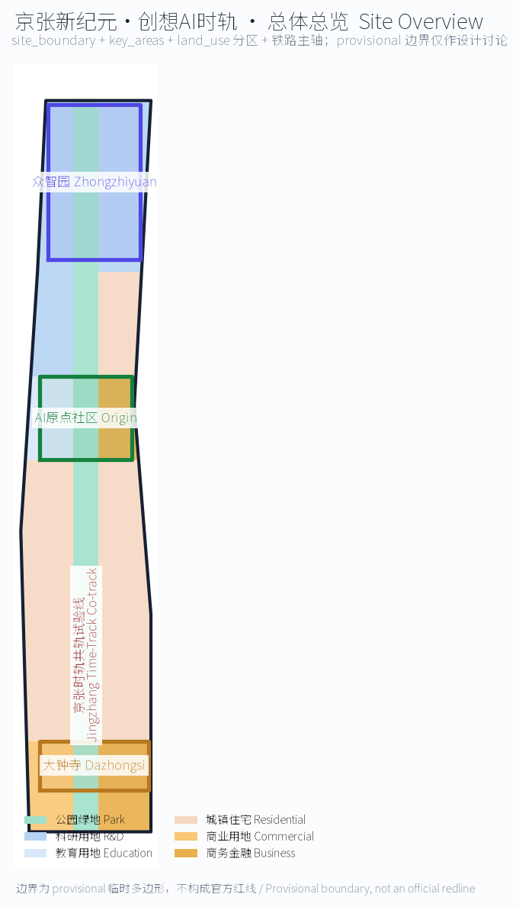

## Three-Level Scope Framework

The proposal establishes a three-level framework — coordinated research area, overall design area, and key detailed design areas — following the call's depth requirements [depth:three_level_scope_framework].

**(1) Coordinated research area** (~43.6 km² along the Jing-Zhang railway heritage park corridor) [source:BOUNDARY-SOURCE]. Its goal is to answer how a world-class AI innovation ecosystem grows here.

**(2) Overall design area**, corresponding to provisional polygon PROV-SITE-001 (~11.4 km²) [data:geometry/site_boundary.geojson#SITE-001] [metric:site_area_sqm], targeting regulatory-plan-level urban design depth.

**(3) Key detailed design areas** — the Zhongzhiyuan AI acceleration area, the Beijing AI Origin Community, and the Dazhongsi AI industry cluster — corresponding to PROV-KEY-001/002/003 [data:geometry/key_areas.geojson#PROV-KEY-001] [metric:key_area_count].

All three levels are currently provisional polygons for generation and self-check only; they must be recalculated after official polygons are released [source:BOUNDARY-SOURCE].

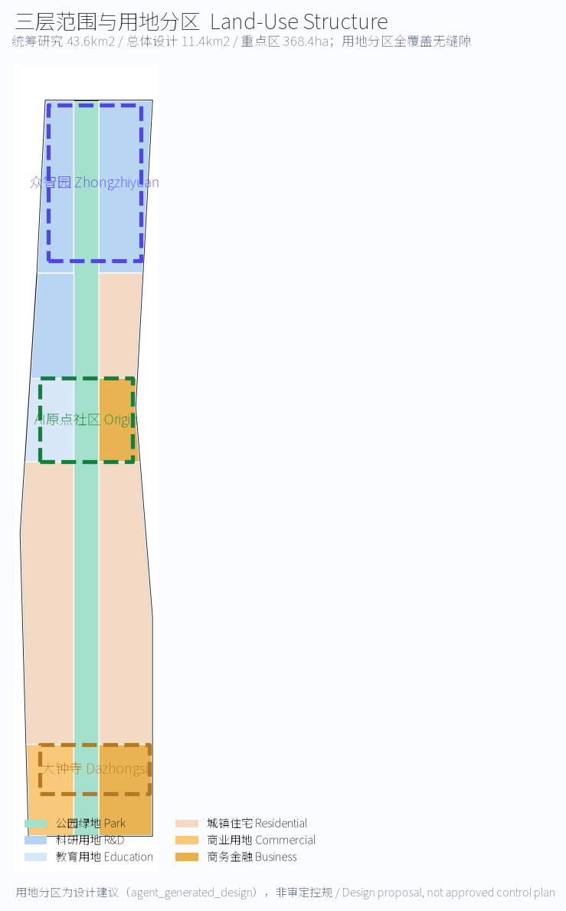

## Coordinated Research Area: Industry and Future City Research

### Naming and Logo

The core concept is named **"Jingzhang New Era · Creative AI Time-Track"**, with a five-layer naming logic:

- **Jingzhang — the anchor of history and space.** From Zhan Tianyou's Jing-Zhang railway (China's first trunk railway independently surveyed, designed, and built) to the intelligent Jing-Zhang high-speed rail serving the Winter Olympics, "Jingzhang" is not just a geographic concept but a symbol of China's self-reliance and innovation [source:AGENT-TASKBOOK].
- **New Era — a paradigm shift.** It signals breaking convention, positioning the project as the starting point and bellwether of next-generation intelligent development.
- **Creative — the core catalyst.** It stands for human creativity, open association, and a "directorial" macro vision — the subjective force driving the project forward.
- **AI — the core rendering engine.** In today's context, AI acts as a "super-renderer" and agent orchestrator, breaking silos and automating coordination to fuse scattered elements.
- **Time-Track — the structural backbone.** A condensation of "Timeline × Track", borrowing the architecture of professional audiovisual editing to metaphorize multi-dimensional composite development.

**Brand positioning: the Intelligent Director.** The proposal signals that Jingzhang New Era is using AI to direct time and space, weaving a century of historical depth with future technological height into an era-defining masterpiece.

The logo direction upgrades from "herringbone line × code fork" to **"Timeline × Track"**: a multi-track editing timeline as the motif — a horizontal time axis (1909 / 2026 / 2049) crossed by parallel tracks (city collaboration / cultural ecology / AI technology), coupled by the flowing nodes of the AI rendering engine. The palette stays heritage rust-red, AI tech-blue, and Jing-Zhang green.

### The Time-Track framework: timeline × tracks

The proposal borrows the timeline × track architecture of video editing and elevates it into a development blueprint, replacing the conventional "static spatial masterplan" method [depth:overall_spatial_structure].

**Horizontal = Time — the timeline's forward progress (narrative order).** The timeline threads three spatio-temporal stages from a century of railway history, through present AI empowerment, to boundless future possibility: **historical accumulation → present momentum → future imagination**. It gives the project direction, continuous vitality, and unstoppable forward momentum.

**Vertical = Track — the tracks' vertical stacking (space and dimensions).** In editing, video, audio, effects, and subtitles run in parallel on different tracks; here "track" metaphorizes the project's multi-dimensional industry layout — three tracks laid in parallel, non-interfering, yet overlapping and compounding vertically into a high-density, three-dimensional creative ecosystem:

| Track | Content | Corresponding space/mechanism |
|---|---|---|
| Track 3: AI technology / infrastructure base | co-track test line, shared compute, digital twin, permit sandbox | Zhongzhiyuan acceleration area, test-line spine |
| Track 2: cultural heritage / green-ecological industry | century narrative, blue-green ecology, cultural tourism | Jing-Zhang heritage park belt, three landmarks |
| Track 1: city collaboration / developer ecosystem | developer community, employment transition, AI-inclusive services (investment in people) | Origin Community, corridor neighborhoods |

**The final convergence — panoramic intelligent rendering (output).** The horizontal time flow and the vertical track flow, under AI (agent ecosystem / large-model engine), are no longer isolated lines but undergo high-frequency real-time computation and fusion; like the final "mix and pixel render" of audio-video tracks, AI fuses the cross-era, cross-domain "time" and "track" into a single high-fidelity, high-synchronization "Jingzhang epic cut" delivered to the world.

### Four-dimensional dynamics: time as the primary planning variable

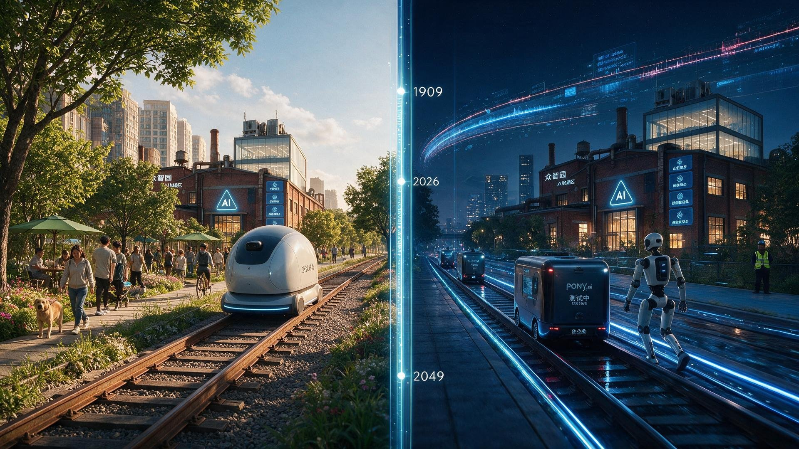

The source of separation is a methodological switch: most proposals draw space; this proposal composes space-time — industry, population, economy, and experience all evolve over time rather than freezing into one page.

- **Industry × time = the innovation diffusion clock.** Industry is not a static allocation ("21% research land") but grows along an S-curve: validation (0–2 years, the test line attracts testing demand) → agglomeration (2–5 years, hidden champions set up R&D) → anchoring (5–10 years, anchor headquarters + ecosystem closure). Land-use share is a function of time L(x, t).
- **Population × time = tidal rhythm.** Vitality is not a constant but a time function with amplitude: weekday developer tides, morning/evening commute tides, weekend visitor tides. Tidal amplitude becomes a new human-centric vitality indicator.
- **Economy × time = time-mismatch value.** Compute billed by the minute, testing billed per run (unlike conventional annual rents); renewal revenue recycles into public space via time-mismatched financing. The same space has different value at different times.
- **Experience × time = the time-sharing script.** One day of the co-track test line carries different functions: pre-dawn data training / daytime semi-open testing + commuting / night closed testing / weekend public opening. The same rail, time switches the function.

These four dynamics unify into the operating mechanism of the Time-Track, detailed in the Metrics section (a new time-indicator group: time-sharing ratio, growth rate, tidal amplitude, innovation diffusion stage).

### Methodological separation: AI-augmented six-layer mapping

**Making traditional mapping data-driven and machine-verifiable.** Mature international urban-renewal projects do not produce "one masterplan" but a multi-method mapping system — from Lynch's mental maps to Gehl's public-life surveys, from Space Syntax to cultural mapping. This proposal upgrades it into an "AI-augmented six-layer mapping method": traditional mapping relies on human experience and subjective judgment, whereas this proposal designs a **machine-readable six-layer mapping workflow** (a recomputable, self-checkable, iterable research method framework) rather than claiming six layers of completed empirical analysis — each layer's execution status, current input, generated output, and gap are listed below. No directly comparable method was found in the reviewed sample of Chinese urban-design competitions.

| Layer | Method source | Execution status | Current input | Generated output | Gap |
|---|---|---|---|---|---|
| L1 form | Transect + Space Syntax | Executed | roads / rail_lines / land_use (existing data) | Typical sections + road integration analysis | — |
| L2 behavior | Gehl PSPL + Whyte | To collect / pending authorization | POI heat (existing) | Preliminary POI heat distribution | Signaling data pending authorization; manual counts to be carried out |
| L3 culture | Cultural Mapping | Based on existing data (partial) | Heritage archives + 7 industrial relics | Preliminary cultural-resource GIS | Full archive to be completed |
| L4 cognition | Lynch mental maps | To collect | None (survey to be designed) | Survey framework | Three-persona interviews pending collection |
| L5 narrative | GIS narrative mapping | Based on existing data (partial) | Centennial Jing-Zhang archive | Digital narrative map framework | Interactive map to be refined |
| L6 generation | Mapping Urbanism | To execute | L1–L5 machine-readable data | Industry-space-scenario matrix framework | Scenario push to run after L2/L4 data is complete |

**Convergence of five frontier ideas.** 2024–2026 frontier ideas converge on "people-first, culture as soul, digital as wing, stitching as method"; five best-fit ideas are selected: **city stitching** (Jingzhang's essence is repairing the urban fabric divided by the railway, from "city edge line" to "development axis"), **culture-led regeneration** (old stations/rails/factories into cultural facilities, AI×culture dual IP), **15-minute innovation circle** (mixed R&D + apartments + commerce around stations), **meta-life city** (all-modality spatio-temporal model + agent "city as a service", linking the OPC community and data flywheel), and **computational design** (MOHURD 2025 official discourse, AI-assisted heritage conservation — a compliance basis) [source:AGENT-TASKBOOK].

### Global case benchmarking and survey summary

**(1) No directly comparable precedent in the reviewed sample.** Survey of 50 urban renewal cases (30 domestic + 20 international). **Reviewable search index**: search date 2026-08-10; inclusion criteria = projects directly relevant to any of the four quadrants (linear heritage activation / innovation cluster / rail TOD / city-center renewal), implemented or under implementation, and verifiable via official sites / project owners / authoritative media / international professional institutions; exclusion criteria = purely conceptual unbuilt projects, subjects with unverifiable sources, or projects without direct mapping to the Jingzhang scenario. Across four quadrants: New York High Line (2.4 km pure public space), Shanghai Yangpu Riverside (15.5 km waterfront), and Paris Rive Gauche (130 ha planar) have no AI-testbed property; Cambridge Kendall, Barcelona 22@, and Shanghai Zhangjiang are planar districts without a linear heritage spine; King's Cross and Hudson Yards are point-station developments; Toronto Quayside is the only AI-city concept but failed and tiny. The Jingzhang combination "linear railway-heritage activation × central-city stock renewal × AI innovation cluster" has no directly comparable case within the reviewed sample. **This conclusion is a limited-sample observation and not exhaustive**: the 50 cases are a "screening-inclusion" count, not a claim of global exhaustiveness; the item-by-item source index (search keywords, inclusion/exclusion criteria, and per-case sources) is in Chapter 7 (7.1–7.5) of the attached global urban-renewal case library, where cases without individually archived URLs serve only as qualitative reference and do not participate in exclusivity assertions.

**(2) Six key mechanisms (selected benchmark).**

| Case | Core mechanism | Transferable mechanism |
|---|---|---|
| Stanford Research Park (US) | University-enterprise-capital closed loop | "10-minute innovation circle"; open campus boundary |
| King's Cross (UK) | Old railway district renewed as knowledge quarter | Heritage park as interaction spine; renewal revenue feeds public space |
| Punggol Digital District (SG) | Smart buildings + digital twin platform | "One platform, multiple scenarios" test infrastructure |
| Pangyo Techno Valley (KR) | Government-led park + incubation chain | One-stop services embedded in buildings |
| High Tech Campus Eindhoven (NL) | Open innovation model | Shared pilot and compute facilities; developer community |
| Hangzhou Future Sci-Tech City (CN) | Talent policy + scenario opening + VC | Compute subsidy, scenario opening, financing |

**(3) Five transferable lessons.** First, anchor institutions first (Kendall, Mission Bay, King's Cross). Second, public-space ignition (High Line, Yangpu, Rive Gauche). Third, institutional authorization (Barcelona 22@ legislation, Copenhagen Ørestad land-value financing, Hudson Yards air rights). Fourth, cultural narrative (Beijing Longfusi, Shanghai Panlong). Fifth, long-term operation (Tokyo Marunouchi, Yokohama MM21) [source:AGENT-TASKBOOK].

**(4) Cautionary tale: Toronto Quayside.** Sidewalk Labs' AI-city project was terminated in 2020 over data-governance disputes, public-trust deficit, and unclear scale/power boundaries — technology does not equal trust. This confirms the institutional track (machine-verifiable permit sandbox + data sovereignty + public-participation veto) is a precondition, not an optional accessory [source:AGENT-TASKBOOK].

**(5) Existing-condition POI diagnosis.** The spatial baseline comes from 8 Amap POI layers with 1,127 features [data:geometry/land_use.geojson]. Five diagnoses: (i) AI-enterprise POIs number only 4 and internet firms 3 — the AI industry is physically sparse, so the co-track test line is the pre-recruitment infrastructure; (ii) education/research POIs number 173 (75 research institutes + 70 universities + 28 academies) — intellectual density is Jingzhang's hardest asset, underpinning AI4S and the academia-industry loop [data:geometry/education.geojson]; (iii) only 27 parks — the data root of the "green vs parking" dispute [data:geometry/green_space.geojson]; (iv) 50 parking lots + 39 charging stations — strong parking and charging demand directly supporting the smart parking hub (S11) and ecological parking (U6); (v) only 7 heritage sites — heritage scarcity must be compensated by the "century relay" narrative and new AI landmarks [data:geometry/cultural_heritage.geojson].

**(6) Multi-party feedback problem list (design from problems).** The proposal plans to survey residents, visitors, enterprises, and government (method design; samples not yet collected); the following is a **preliminary problem list** based on public reports and the survey framework, to be calibrated after collection: the biggest resident tension is the "green-to-parking" dispute (Tianheng Xueyuan-li east side), demanding ecology-first, transparent disclosure, and compromise design, plus mosquito, sandpit-drainage, and shade micro-pain-points; the visitor "check-in economy" has formed (Wudaokou flower sea, 1909 train restaurant) but parking, facilities, and queues are three hard problems; enterprises say "computing is expensive, financing is hard" and "cross-city paperwork" needs to be pushed down to the building; government is reported open — all 5 public comments adopted, a "super AI testbed", Origin Community as "core of cores" (public-report wording, subject to official release). The proposal's spatial and scenario designs (ecological parking, environmental sensing S9, affordable compute U5, policy accompaniment, smart parking S11) respond one-to-one, forming a "survey finds problems → proposal responds" loop.

### Positioning, functions, and synergy loop

Three positionings — the Centennial Jing-Zhang Cultural Belt, the Urban AI Life Experience Belt, and the AI Convergence Innovation Belt — with five functions and a "three cores + two wings" structure [source:OFFICIAL-ANNOUNCEMENT]. The synergy loop is "source – validate – apply": cores originate, the test line and governance sandbox validate, and corridor communities apply and feed back.

### Future city form and continuous green space

The proposal proposes "rail as skeleton, green as vein, compute as network" [depth:blue_green_public_space].

### Investment in people (the heart)

The core value judgment: AI and industry must ultimately serve human civilization. The Jingzhang Time-Track Testbed is therefore not "a testbed for AI" but "a testbed for human-machine civilization". The graded test sections carry a dual meaning — technical validation plus social-trust grading: closed sections = machine-only testing; semi-open sections = building human-machine trust; open sections = social-acceptance testing [depth:three_key_area_detailed_design]. Four mechanisms realize this: AI-inclusive services (education, healthcare, eldercare), developer night schools and resident AI-literacy courses, employment transition (traditional roles → AI-collaborative roles), and resident participation rights in the permit sandbox. The human-centric indicator group is recorded in `metrics.json`.

## Overall Design Area: Urban Renewal and Regulatory-Plan-Level Urban Design

### The dual-track testbed (Track 3 realized)

**Physical track (spatial spine).** The S1 co-track test line is elevated from a scenario card to the spatial spine: run autonomous vehicles, logistics robots, and future mobility equipment on the retained rails, with graded sections from closed to semi-open to open [data:geometry/roads.geojson#ROAD-001] [data:geometry/green_space.geojson#GREEN-001].

**Institutional track (the differentiation barrier).** A machine-verifiable institution runs parallel: (1) a machine-auditable permit sandbox for test access and supervision; (2) data sovereignty and data-revenue sharing; (3) a public-participation check-and-balance mechanism (suspension, hearing, and negotiation triggers on major safety and environmental matters, with authority and procedure determined by the legally competent body) — the lesson of Toronto Quayside: without data governance and public trust, the scheme collapses.

### Spatial structure

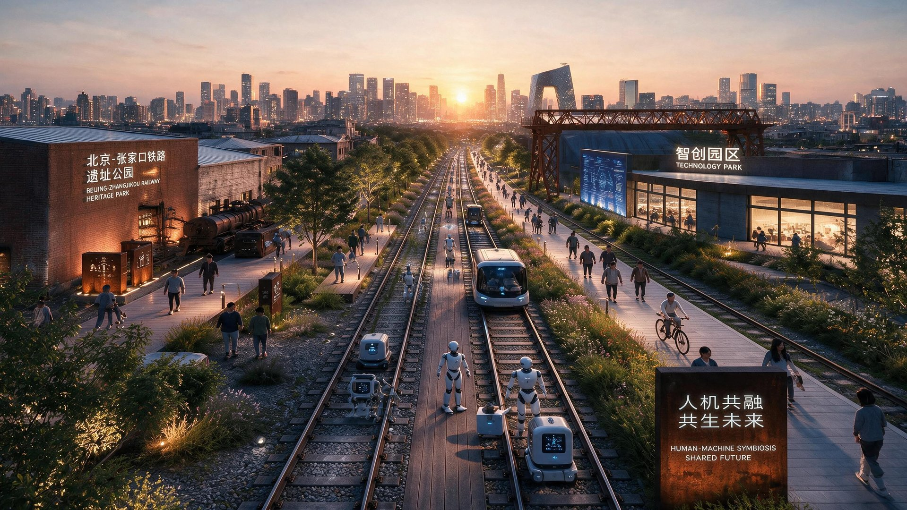

On the base of the "one belt, one axis, two centers, multiple points" structure [source:OFFICIAL-ANNOUNCEMENT], the proposal proposes "one rail, one axis, three cores, multiple corridors": the retained rail as the test line, the Chengfu–Zhichun–Xueyuan corridor as the development axis, three key areas as cores, and perpendicular green/slow-mobility corridors [depth:overall_spatial_structure].

### Industry goals and functional layout

Based on existing POI data, the proposal lays out the vertical "base–technology–application" industry chain and the horizontal "data, compute, scenario, capital" service chain [data:geometry/land_use.geojson#LU-001]. The design land-use partition fully covers the boundary without gaps or overlaps; research land (0802), residential land (0701), and park green (1401) form the three main bodies [metric:land_use_area_by_code_sqm].

**First principle: do "intelligence × scenario × policy", not "compute hardware".** Industry-location research shows Jingzhang's comparative advantage is not chip-making or big-factory construction (capital-heavy, locked in by Yizhuang and Lingang) but the combination of intellectual density (publicly reported 30+ universities and research institutes; 135 AI2000 scholars per the public ranking, about 34% of China — indicative figures, subject to official statistics) × scenario density (9 km of real rail + park + business + campus) × policy tools (compute subsidy, token vouchers, scenario opening) — ideal soil for the model, agent, data, embodied, and AI4S layers, forming "R&D in Haidian, mass production in Yizhuang" synergy rather than homogeneous competition.

**Three local industry closed loops (observable public starting points, not drawn from scratch)** (enterprise names, platform scale and transfer figures are indicative references from publicly reported sources, subject to official-announcement verification [source:CHAIN-ENTERPRISES-INDICATIVE]): (i) **embodied-intelligence "real-scenario data flywheel"** — real-scenario deployment collects embodied data (Lightwheel Intelligence, publicly described as an "embodied-data unicorn", is reported to be rooted on the belt) → annotation/synthesis → training → pilot → back to real scenarios; the 9 km linear real scenario is a natural scaled data-collection field and a differentiator; (ii) **agent economy "OPC one-person-company cluster"** — the OPC order platform (publicly reported 78 ordering enterprises, 1,230 registered users) dispatches orders → one-person companies develop (publicly reported nearly 180, mostly aged 25–30) → shared workstations + elastic compute → delivery and monetization; no "one-person-company city" form was found in the reviewed sample, making it a differentiator; (iii) **AI4S "research–transfer–accelerate–industry"** — university basic research → Qingzhiyuan transfer (publicly reported 150 projects, 60 landed) → Zhongzhiyuan AI4S acceleration → AI+medicine/materials/life-science landing.

### Regional synergy matrix (suggested mechanisms)

The proposal identifies factor flows (R&D, test/pilot, mass production, talent, compute, data, capital) with five regional partners. **All entries are suggested mechanisms, not settled cooperation or government arrangements**; formal agreements are required for implementation:

| Partner | R&D | Test/pilot | Mass production | Talent | Compute | Data | Capital | Interface suggestion |
|---|---|---|---|---|---|---|---|---|
| Beiyuan Community | co-development of human-centric apps | community-level AI service pilots | — | elderly/child care jobs | edge compute | authorized community service data | public service procurement | spread belt pilots to communities |
| Future Science City | basic-research source | frontier tech piloting | frontier equipment production | senior R&D talent | large compute cluster | authorized research data | Science City fund | "frontier R&D transfers on the belt" mechanism |
| Huairou Science City | large-science-facility support | materials/process piloting | — | scientist mobility | big-science compute sharing | open research data | national funds | compute and data sharing channel |
| Yizhuang (EDA) | applied R&D | vehicle/robot integrated testing | vehicle & robot mass production | engineering talent | in-vehicle compute | production test data | Yizhuang industry fund | "R&D in Haidian, mass production in Yizhuang" two-way corridor |
| Beijing-Tianjin-Hebei | university synergy | multi-city scenario pilots | supply-chain production | university talent circle | regional compute network | authorized regional government data | regional synergy fund | scenario-opening and industry-migration corridor |

### Urban renewal framework

Four renewal object types: rail heritage and corridor public space (retain and activate), existing industry buildings (re-functionalize), old residential surroundings (livelihood improvement), and inefficient land (rectification) [depth:retain_renovate_demolish].

### Public space, transport, and municipal support

The park belt is the spine for public space; transport is organized around rail TOD anchors; municipal and new infrastructure are layered [depth:traffic_rail_slow_parking].

### Character control and pending items

Segmented character — low and permeable along the heritage belt, compact and modern in industry areas, coordinated and livable in residential areas [standard:MOHURD-URBAN-DESIGN-MEASURES]; height and density controls await official regulatory conditions [depth:development_intensity_controls].

## Detailed Design of Key Areas

All three key areas use provisional polygons; conclusions are directional and will be recalculated [depth:three_key_area_detailed_design].

### Zhongzhiyuan AI acceleration area

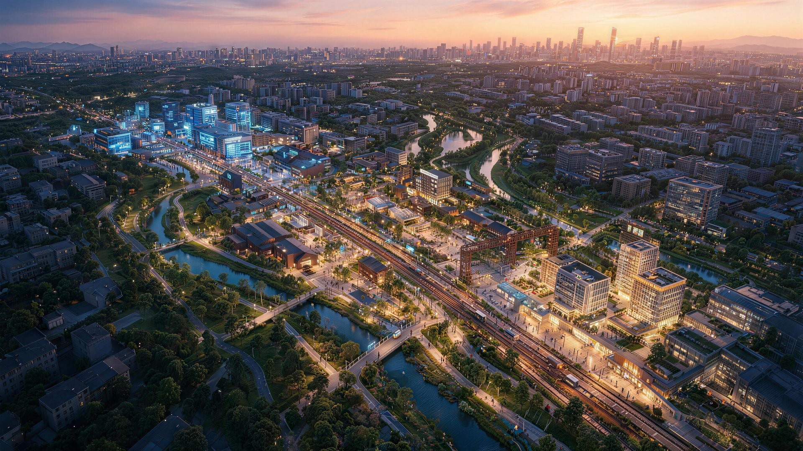

Positioning as an "accelerator block" for early-stage AI teams. Spatial structure: "test line – pilot workshop – shared compute building – roadshow plaza". Building renewal retains sound old structures for shared labs and compute rooms. Scenarios S2/S3. Risks: scattered ownership, pilot noise, compute power capacity.

### Beijing AI Origin Community

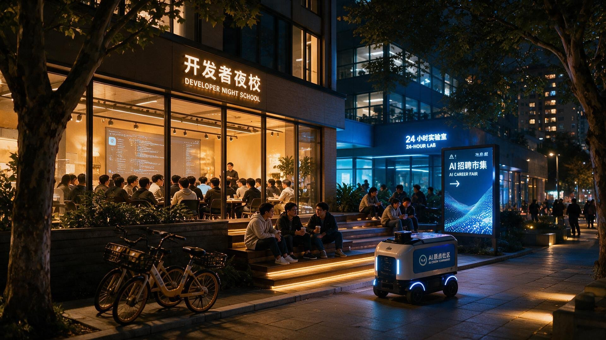

Positioning as the "core of cores" around the Wudaokou Origin Tower, serving developers, students, and researchers. Spatial structure: a "10-minute innovation circle" linking universities, co-working, cafes, and 24-hour labs. Building renewal inserts in-building service stations. Scenarios S5/S6. Risks: university-boundary coordination, high-density flow, holiday crowds.

### Dazhongsi AI industry cluster

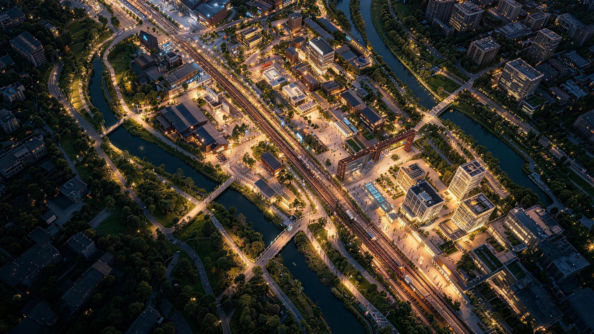

Positioning as a cluster for scaled AI application enterprises, connecting the southern hub. Spatial structure: "station – commercial – office – residential" vertical mixed blocks. Scenarios S8/S11. Risks: hub construction disruption, uncertain commercial model, complex underground ownership.

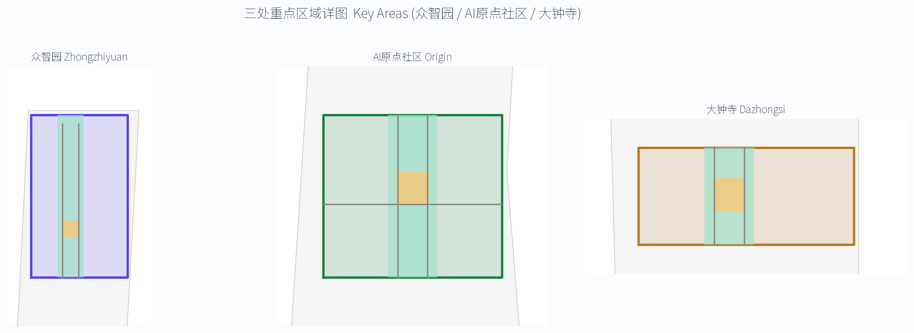

### West wing · Zhongguancun tech-service wing (capital & entrepreneurship)

Positioning as a top-tier platform linking global innovation actors and factors by leveraging the entrepreneurship IP and capital ecosystem, echoing the Zhongguancun Science City "tech core" role [source:OFFICIAL-ANNOUNCEMENT]. Spatial structure: a "capital service – startup incubation – technology transfer" service belt along the west side of Zhongguancun Street, horizontally supporting the three key areas [depth:three_key_area_detailed_design]. Scenarios: AI HUB finance nights, Qingzhiyuan venture matchmaking, OPC order platform (S6/S11). Capital anchor: Zhongguancun Science City Company (Haidian state capital) led investments in Zhipu, Shengshu, ModelBest, LinkerBot, and Lightwheel Intelligence in 2024–2026, binding "investment + scenario" to attract hidden champions [source:OFFICIAL-ANNOUNCEMENT]. Risks: capital-cycle volatility, fragmented building ownership, insufficient cross-border landing support.

### East wing · Xiaoyuehe scenario-enabling wing (embodied intelligence & AI+ livelihood)

Positioning to build distinctive clusters for embodied intelligence, AI+ healthcare, and AI+ film along Xiaoyuehe, making smart-city application models visible [source:OFFICIAL-ANNOUNCEMENT]. Spatial structure: an "embodied-intelligence pilot – AI+ healthcare community – AI+ film content" belt along the Xiaoyuehe blue-green corridor, penetrating eastward from the main axis [depth:three_key_area_detailed_design]. Scenarios: robot pilot track, AI+ healthcare community assistant, AI+ heritage digital tour (S3/S7/S10). Scenario anchor: Galbot (Haidian Street No.3), Spirit AI, Robotera and other embodied-intelligence firms, plus Yidu Tech (AI+ healthcare), make Xiaoyuehe a natural landing point for "real scenario + inclusive application" [source:OFFICIAL-ANNOUNCEMENT]. Risks: complex riverside land ownership, embodied-intelligence test safety boundaries, healthcare data compliance and rights.

## AI Innovation Ecosystem, Personas, and AI+ Scenarios

### Five personas

| Persona | Needs | Primary space |
|---|---|---|
| P1 Resident developers/entrepreneurs | Cheap compute, open testing, fast financing, one-stop services | Zhongzhiyuan, Origin Community |
| P2 Students and researchers | Study, labs, lectures, internships, belonging | University periphery, Origin Community |
| P3 Surrounding residents | Childcare, accessible paths, shade, parking | Park belt, residential periphery |
| P4 Visitors | Parking, dining, restrooms, queue management, photo spots | Flower sea, 1909 train restaurant, test line |
| P5 Enterprise operators and governance | Scenario interfaces, data return, monitoring, compliance | Digital twin platform |

### Eleven scenario cards (3 industrial test scenarios)

**S1 Jingzhang Time-Track co-track test line (industrial test)** on the retained rails [data:geometry/roads.geojson#ROAD-001]. **S2 Affordable compute station (industrial test)** [source:AGENT-TASKBOOK]. **S3 Urban governance sandbox (industrial test)**. **S4 AI+ traffic green-wave corridor**. **S5 AI+ education developer night school**. **S6 AI+ legal compliance service window**. **S7 AI+ healthcare community assistant** [data:geometry/medical.geojson#medical]. **S8 AI+ unmanned retail and robot delivery**. **S9 AI+ public space environmental sensing** [source:AGENT-TASKBOOK]. **S10 AI+ heritage digital tour**. **S11 AI+ smart parking hub**.

### Unified scenario-card specification (11 scenarios × 10 fields)

> For direct deepening by operations and professional teams, S1–S11 follow the unified fields below. All are concept-level designs; operators and prerequisites are suggested directions only.

| ID | Target users | Concrete space | Input data & lawful source | Minimization | Operator | Human review/takeover | Appeals & decommissioning | Maturity | KPIs & prerequisites |
|---|---|---|---|---|---|---|---|---|---|
| S1 co-track line | AV/robot firms, test engineers, residents (observers) | retained rails (Zhongzhiyuan–Origin section priority, graded segments) | vehicle/robot telemetry, environmental sensing, safety logs; from test firms + public sensors | no pedestrian biometrics; crowd counts only | testbed operating company + industry alliance | safety officers on site, remote takeover, emergency brake; supervisor final call | public complaint channel; stop on major incident; period-end review | pilot (concept) | KPIs: co-track km / incident rate / pass rate; prereq: heritage approval, safety assessment, insurance |
| S2 compute station | AI firms, developers, students | Zhongzhiyuan shared compute building | usage, queue time; from operator system | statistics only, no task content | district platform + cloud provider | quota manual approval; abnormal usage halt | appeal channel; quota disputes reviewable | pilot (concept) | KPIs: subsidized hours / utilization / queue; prereq: power capacity |
| S3 governance sandbox | agent developers, government departments | transport/environment/urban-mgmt API sandbox | de-identified governance data; authorized government interfaces | minimum fields; no personal data out of sandbox | government data platform + third-party audit | manual release and review of test results | stop on violation; public complaints | experiment (concept) | KPIs: interfaces / tests / fix rate; prereq: data governance review |
| S4 green-wave corridor | commuters, transit riders | signal nodes along corridor | rail/bus operation data; from transit authority | vehicle-level aggregation, no personal trajectories | traffic authority + platform | signal changes confirmed manually | authority may disable anytime | experiment (concept) | KPIs: avg speed / on-time rate; prereq: data interface authorization |
| S5 developer night school | developers, career switchers, students | Origin community classrooms / online | enrollment, course progress; user-submitted | minimum course data | district platform + university/community operators | instructors review manually | drop-out and appeal possible | mature | KPIs: enrollment / job conversion; prereq: venue and faculty |
| S6 legal compliance window | startups, developers | Origin service window / online | user-uploaded contracts (explicit consent); user-submitted | only documents needed; no over-retention | law firm + platform | licensed lawyers review AI conclusions | user may withdraw consent | mature | KPIs: service volume / satisfaction; prereq: lawyer pool |
| S7 community health assistant | residents, elderly/children | community health terminals / online | self-reported health, vitals (explicit consent); user-submitted | health data separately tiered; minimum fields | medical institution + platform | medical professionals review; AI not a diagnosis | withdraw consent, delete data | pilot (concept) | KPIs: reach / follow-up rate; prereq: medical partnership, compliance |
| S8 retail & robot delivery | park employees, residents, visitors | pilot routes in key areas | pickup codes, delivery location (consent); user-submitted | minimum delivery data | operating firm + merchants | on-site staff handle exceptions | refuse delivery, complaints | pilot (concept) | KPIs: delivery time / satisfaction; prereq: low-speed right-of-way, safety |
| S9 environmental sensing | all citizens | park belt, key-area green space | environmental telemetry (temp/humidity/noise/insects); public sensors | no personal data, environment only | park authority + vendor | environment decisions confirmed manually | public feedback | pilot (concept) | KPIs: mosquito complaints / comfort; prereq: deployment & maintenance |
| S10 heritage digital guide | visitors, students, residents | AR nodes along heritage park | location (consent), browsing preference; user-submitted | location tiered; shortest retention | culture authority + content operator | history content curated/reviewed by humans | can disable location, complaints | pilot (concept) | KPIs: usage / satisfaction; prereq: history & copyright review |
| S11 smart parking | visitors, residents | eco parking (Tianheng xueyuan-li east etc.) | plate (consent), reservation; user-submitted | scheduling-only, delete after use | parking operator + district platform | abnormal billing handled manually | appeal and delete data | pilot (concept) | KPIs: utilization / search time; prereq: resident consultation, plan publication |

### Permit-sandbox rule architecture (concept-level)

> The "machine-verifiable permit sandbox" is specified as a reviewable rule architecture. **Code verification and automated audit are supporting tools; they do not replace statutory licensing, administrative approval, or professional judgment.**

1. **Admission**: legal entities with qualifications, safety plans, test plans, and liability insurance may apply; individuals and entities without responsible ownership are excluded.
2. **Test tiers**: closed (internal) → semi-open (time/area-limited with safety officers) → open (daily) — progressive release by assessment.
3. **Logs and audit**: full telemetry logs retained, auditable, reviewable; key events (collision, hard stop, boundary breach) mandatory reporting.
4. **Human discretion**: safety officers/supervisors hold final discretion over operations; AI is advisory only; no automated decision replaces human judgment on safety and compliance.
5. **Incident halt**: automatic halt on safety events plus human review; testing does not resume until review passes.
6. **Public appeals**: open complaint channel, time-bound response, test suspension possible; suspension/hearing/negotiation triggers on safety and environmental-impact matters (see 10.6).
7. **Exit**: period-end assessment; exit on failure, major incident, or public suspension/reassessment trigger; test data returned or deleted per rules.

### Data and privacy tiers (concept-level)

> Data across S1–S11 is managed in three tiers. **Health, location, and urban-governance data are separately tiered**; "no biometrics collection" is not a blanket privacy answer.

- **Tier 1 (ordinary)**: environmental telemetry, statistical crowd counts, compute usage — minimize, aggregate/desensitize, public by default.
- **Tier 2 (location/behavior)**: trajectories, dwell time, reservations — separate consent, shortest retention, access logging.
- **Tier 3 (health/governance)**: health self-reports and vitals, governance API data — separate management, explicit legal basis (consent/statutory duty), strict audit, independent deletion/exit channels.

Per-scenario notes: S1 no pedestrian biometrics (crowd counts only); S7 health data Tier 3 (explicit consent + medical professional review + deletable); S9 environment only (Tier 1, no personal data); S10 location Tier 2 (shortest retention + can disable); S11 plate Tier 2 (scheduling-minimized, deleted after use); S3/S4 governance data Tier 3 (authorized interface + manual release + no personal data out of sandbox). All scenarios include human review/takeover, appeal, deletion, and exit channels, registered in the asset rights & privacy registry of `sources.json`.

### 6.2e AI-era People's Good Life: six living scenes
> The S1–S11 scenarios above cover industrial, public-service, and city-governance dimensions. This section adds six concrete 'AI-era people's good life' scenes, expressing the citizen view of 'retaining the original rails for shared-track autonomous vehicles, robots, and future mobility equipment, and delivering a Jingzhang-era masterwork' — technology is not a cold industrial tool but serves everyday life across consumption, culture, sport, health, elderly care, child development, and care for persons with disabilities. The six scenes are:
| ID | Scene | Key figures & elements |
|---|---|---|
| AI | Campus Lifestyle | developers collaborate with humanoid robots and drones inside a glass-walled tech park; young innovators work alongside robots in shared labs. |
| Community | Market | elderly citizens select fresh produce with robot assistance, children interact nearby, drones deliver overhead — neighborhood life coexists with AI services. |
| Future | City Pavilion | families experience the Jingzhang century narrative inside a curved projection hall; autonomous vehicles and robots wait outside. |
| Inclusive | Neighborhood | robots accompany elders and children; wheelchair users can reach the mural wall and corner plaza. |
| Wellbeing | Garden | elders and children walk through a greenhouse flower field while robots offer wayfinding and dietary suggestions. |
| Co-track | Street | autonomous vehicles, delivery robots, cleaning robots, humanoid robots, and robotaxis share the retained rails and a street intersection; elders and children cross safely — the everyday future of human-machine coexistence. |

The following six figures are concept illustrations (AI-generated, explanatory layer; not field photos, measured data, or approval conclusions; text, imagery, and persons are subject to separate clearance):

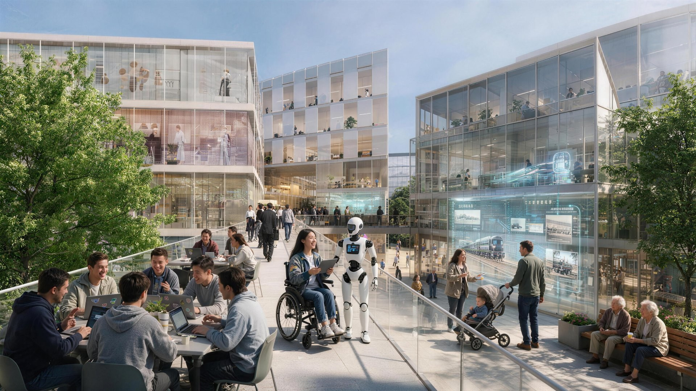
*AI Campus Lifestyle*

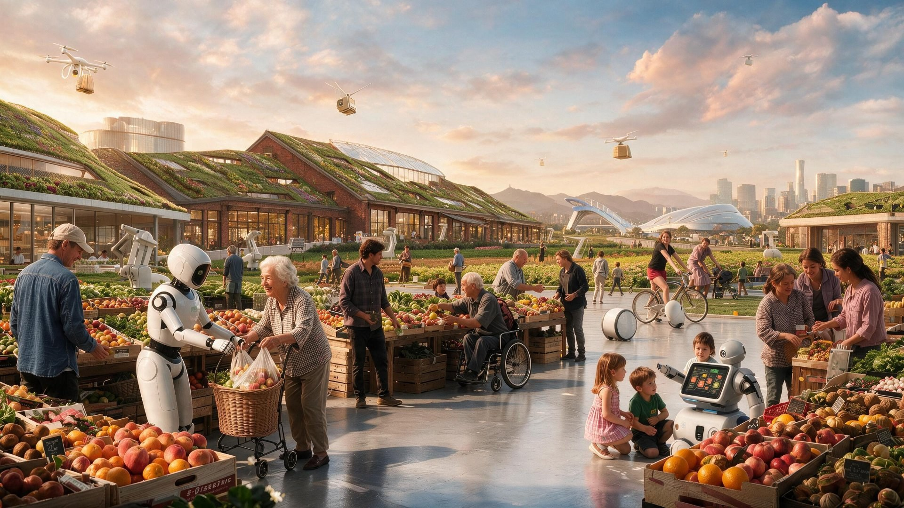
*Community Market*

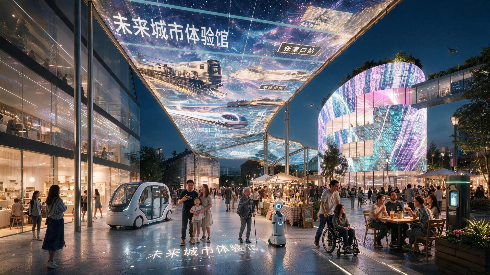
*Future City Pavilion*

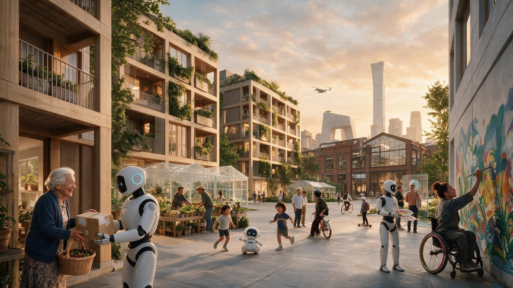
*Inclusive Neighborhood*

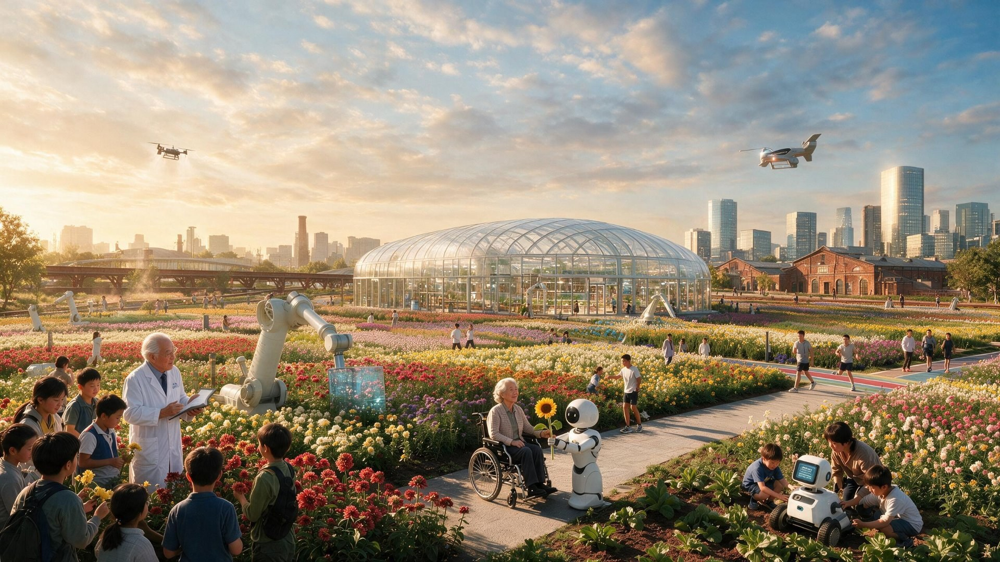
*Wellbeing Garden*

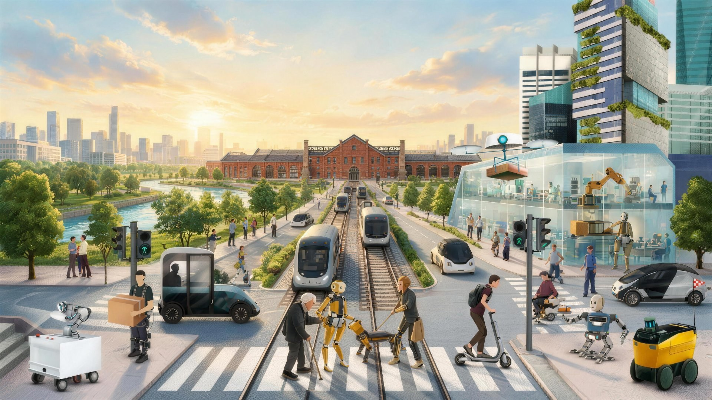
*Co-track Street*

### Anchor-enterprise map and cooperation models

**Core judgment: the anchor enterprises show an indicative pattern of "naturally growing on the belt".** Cross-checked via public sources (pending formal verification): Moonshot AI is registered at 27 Zhichun Road (current office subject to official confirmation), Cambricon's is at Zhi Zhen Tower, 7 Zhichun Road, Galbot is registered at 3 Haidian Street, Ninebot's domestic HQ is in Zhongguancun Dongsheng Tech Park, and ByteDance reportedly has an HQ cluster at Dazhongsi — "anchor recruitment" is really about plugging the leading firms already circling the 9 km linear space into one "real-scenario operating system" (an indicative judgment, not a recruitment or settlement conclusion) [source:CHAIN-ENTERPRISES-INDICATIVE]. A startup "golden circle" — "south of Tsinghua, east of Peking University, west of Xueyuan Road, north of Dazhongsi" — is cited in public reports as an indicative description (the exact source and wording require verification against the original report); the three-cores-two-wings core area overlaps observably with this range, providing indicative spatial evidence for anchor clustering [source:CHAIN-ENTERPRISES-INDICATIVE].

**8 anchor categories** (full verified list in `sources.json`): ① foundation models (Zhipu, Moonshot, Shengshu, ByteDance Doubao) ② embodied intelligence (Galbot, Spirit AI, Robotera, Lightwheel, LinkerBot) ③ chips & compute (Moore Threads, Cambricon, Kunlunxin) ④ agent platforms (ByteDance Coze, ModelBest) ⑤ industry applications (Yidu Tech, Glodon, Megvii, Unisound) ⑥ platforms (ByteDance, Baidu, Kuaishou, Xiaomi, Meituan, JD) ⑦ data factors (National Blockchain Technology Innovation Center, Lightwheel) ⑧ autonomous driving & low-speed unmanned vehicles (Neolix, Ninebot, Haomo, WeRide, Pony.ai).

**6 cooperation models** (who contributes, who gains, what mechanism makes it work): ① **test validation** — firms contribute robots/unmanned vehicles to real 9 km scenarios in exchange for the scarcest real physical-world data; the belt gains "a rare real-scenario AI data infrastructure among the samples reviewed" brand premium; ② **compute & data supply** — Moore Threads, Cambricon, Kunlunxin supply domestic compute and Lightwheel supplies the simulation-data engine in exchange for scaled real orders; ③ **scenario opening & orders** — ByteDance's Dazhongsi HQ, the OPC order platform, and Haidian's "ten application demonstration projects" release billable benchmark orders; ④ **industry-academia-research** — Tsinghua/Peking/CAS joint labs feed results directly into co-track validation; ⑤ **investment & incubation** — Zhongguancun Science City Company led investments in Zhipu, Shengshu, ModelBest, LinkerBot, and Lightwheel in 2024–2026, binding "investment + scenario" [source:CHAIN-ENTERPRISES-INDICATIVE]; ⑥ **data-factor circulation** — Lightwheel's data factory plus the National Blockchain Center's "data stays in domain, usable but not visible".

**Three most persuasive models**: first, "test validation + data-factor circulation" (scenario for data, data for industry) hits the industry's two hardest pain points — scarce real data and hard road permits; second, "investment & incubation" — the state-fund list is already drawn, only "investment" needs binding to "co-track scenario landing"; third, "scenario opening & orders" — ByteDance Dazhongsi, OPC, and the ten application projects are ready-to-run levers that upgrade the 9 km space from a "test field" into a "cash-flow-generating operating field" [source:CHAIN-ENTERPRISES-INDICATIVE].

### agent.1–agent.6 itemized mapping to official task titles

The table below adopts the official agent.1–agent.6 titles from `agent_taskbook.json` verbatim and lists this proposal's actual delivery locations; the "relation" column states whether the proposal inherits, refines, or supplements each task requirement.

| Official task title | Proposal delivery location | Relation and depth |
|---|---|---|
| agent.1 Overall belt concept and function-integration scheme | §3.2–3.5, §3.6, §4 | Inherit + refine: three scope levels (coordinated/overall/key) map to "overall belt concept"; three positionings, five functions, three-areas-two-wings map to "function integration"; naming and Logo direction in §3.1 |
| agent.2 AI full-stack autonomous innovation system and world-class AI ecosystem | §5.1 Zhongzhiyuan, §5.4 Zhongguancun tech-service wing, §6.3 anchor map | Inherit: Zhongzhiyuan maps to "full-stack autonomous system"; AI Origin Community and anchor ecosystem map to "world-class AI ecosystem"; 5–8 global cases in §3.2 and the 50-case appendix |
| agent.3 AI+ scenario empowerment paradigm and intelligent AI living city | §6.2a scenario matrix, §6.2b 11 scenario cards, §6.2e good-life scenarios | Inherit + refine: 11 scenario cards (≥10 required) + 3 industrial test scenarios (S1/S2/S3) + 5 personas map to "scenario empowerment"; §6.2e six life scenarios map to "intelligent AI living city" |
| agent.4 AI public space, native intelligent new business, and pilgrimage landmark | §6.5 public-space components, §5.3 Dazhongsi, §3.1 brand landmark | Inherit + supplement: six public-space components map to "AI public space"; Dazhongsi native intelligent consumption/business map to "new business"; Dual-Origin Plaza/honor wall/open-source gallery map to "pilgrimage landmark" |
| agent.5 Centennial Jing-Zhang culture, Zhongguancun culture, and AI new-culture narrative | §3.5 cultural narrative, §6.6 wayfinding & outreach | Inherit: century relay (1909→2026→2049) maps to "centennial Jing-Zhang culture"; Zhongguancun innovation culture maps to "Zhongguancun culture"; the "timeline × tracks" brand maps to "AI new-culture fusion" |
| agent.6 Global AI innovation activity system and long-term operation | §10.1/10.3, §6.3 conversion path, U1–U8 | Inherit + refine: annual open-source week/monthly roadshow/developer community map to "global AI activity system"; U1–U8 matrix and "visit → connect → settle" map to "long-term operation" |

**Five-function mapping**: the taskbook's five functions — AI full-stack autonomous innovation system / world-class AI innovation ecosystem / AI+ scenario empowerment paradigm / intelligent AI living city / AI governance global voice — map to this proposal's five derived functions in §3.6 as follows:

| Taskbook five functions | Proposal derived functions (§3.6) | Relation |
|---|---|---|
| AI full-stack autonomous innovation system | Independent innovation sourcing | Inherit (Zhongzhiyuan full-stack system) |
| World-class AI innovation ecosystem | Talent-gathering service | Refine (ecosystem decomposed into talent + capital + scenario) |
| AI+ scenario empowerment paradigm | Scenario-open experimentation | Inherit (scenario cards + sandbox) |
| Intelligent AI living city | Livable-life carrying | Refine (livable dimension of the living city) |
| AI governance global voice | (folded into the institutional track and permit sandbox, §3.7) | Supplement (machine-verifiable sandbox carries governance voice) |
| — (not in taskbook; proposal addition) | Heritage-culture display | Proposal addition (centennial Jing-Zhang cultural narrative) |

### Public-space component library (concept-level)

1. **Slow-mobility green belt**: corridor-wide pedestrian + cycling system (all corridor; U2 park belt).
2. **Station plaza**: multi-purpose gathering square (Dazhongsi; U4 station-city).
3. **Pocket park**: 10-minute-walk neighborhood green space (Origin community / corridor housing; U6 green compromise).
4. **Cultural nodes**: Dual-Origin Plaza, Developer Honor Wall, Open-Source Gallery (three nodes; U7 landmark system).
5. **Smart furniture**: smart benches, environment screens, emergency-help terminals (key areas & scenario nodes; U8 smart municipal).
6. **Co-track observation deck**: safe viewing of test operations with science narration (semi-open segment; U1 co-track line).

Components are concept-level design requirements; dimensions and selection require professional and accessibility review before implementation.

### Wayfinding and international outreach (concept-level)

**Three-tier signage**: regional (metro stations, block entries), street (intersections, nodes), and scenario (facilities, test-zone markers); bilingual plus multimodal (text/voice/tactile), meeting accessible-information requirements (per 10.5 baseline).

**International interface**: the co-track test line, Developer Honor Wall, and Open-Source Gallery serve as external communication interfaces, converting visits into settlement ("visit → connect → settle"). Content is human-curated; historical facts and copyright materials are reviewed before publication; concept renderings are never presented as field photos, measured data, or approval conclusions.

## Land Use, Building Scale, and Retain-Renovate-Demolish Strategy

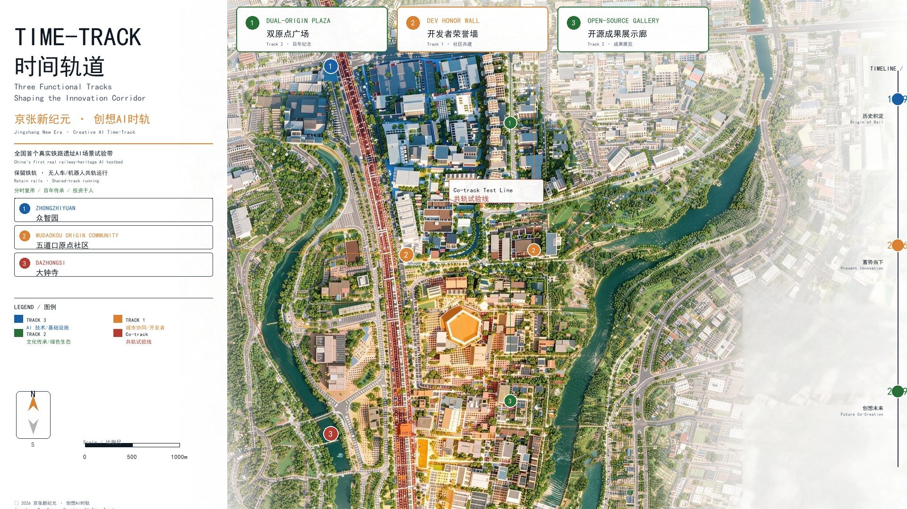

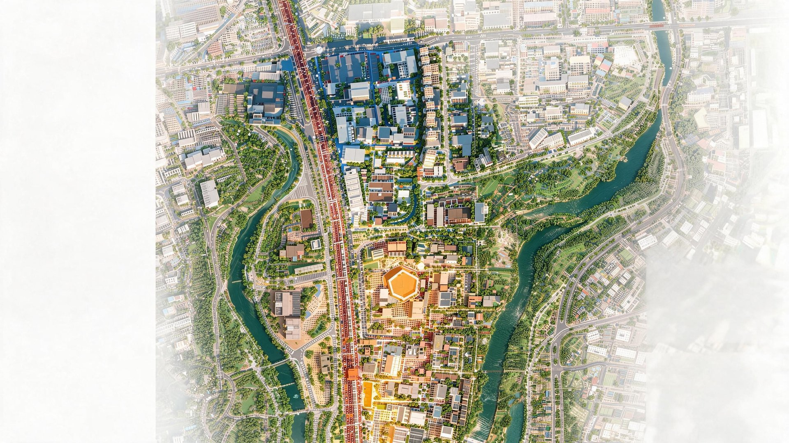

**Land use.** Uses the MNR classification guide terminology [standard:MNR-LAND-USE-CLASSIFICATION-GUIDE] [depth:land_use_layout]. The design partition fully covers the boundary without gaps or overlaps: park green (1401) ~249 ha, research land (0802) ~241 ha, residential land (0701) ~436 ha, business-finance (0902) and commercial (0901) for industry services [data:geometry/land_use.geojson#LU-001] [metric:land_use_area_by_code_sqm].

**Building scale and intensity.** All scale, footprint, and intensity figures are conceptual, recomputed from geometry under EPSG:4548 [metric:building_footprint_area_sqm] [metric:building_density]. FAR, height, and density controls are marked "pending formal data" [metric:floor_area_ratio].

**Retain-renovate-demolish.** Retain rail heritage, historical buildings, and sound structures; renovate existing industry buildings and inefficient commercial; demolish only professionally confirmed dangerous or illegal construction; new-build only necessary public service, green, and new infrastructure. No parcel-level demolition conclusion is made [depth:retain_renovate_demolish].

## Transport, Rail, Municipal Infrastructure, and Public Services

**(1) Transport.** "Rail as skeleton, bus as vein, slow mobility as network, parking as node" [data:geometry/transport_supplement.geojson#transport_supplement] [depth:traffic_rail_slow_parking]. Designed road centerlines express the test-line slow lanes and lateral connectors [data:geometry/roads.geojson#ROAD-001] [metric:road_ratio].

**(2) Rail and regional transport.** Reserve rail-corridor connection conditions per the Haidian District Plan [source:OFFICIAL-ANNOUNCEMENT].

**(3) Municipal and new infrastructure.** Traditional utilities upgrade with renewal; new infrastructure includes edge compute nodes, distributed energy, smart drainage, sensing terminals, and a digital twin base [depth:municipal_new_infrastructure].

**(4) Public services.** Fill "15-minute living circle" gaps using POI data; embed enterprise services in buildings.

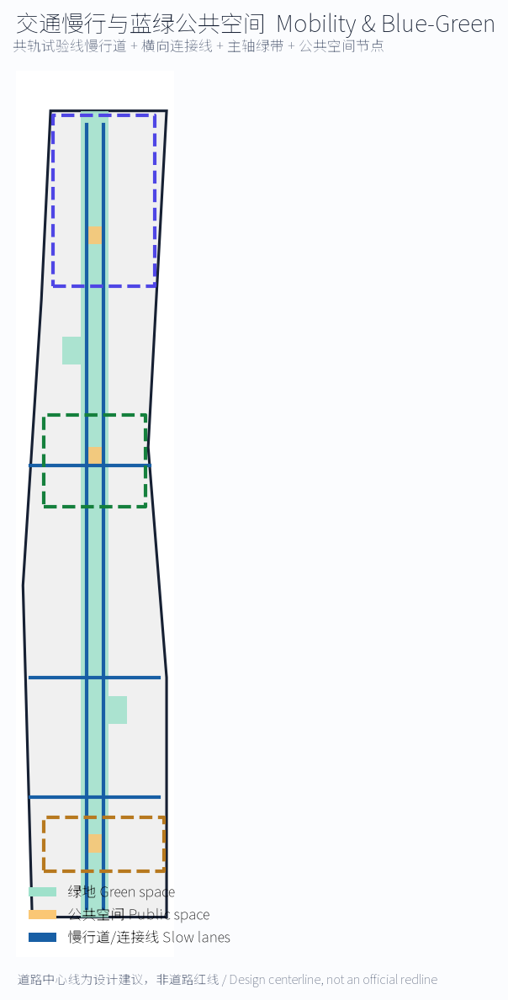

## Blue-Green Network, Public Space, and Urban Character

### Blue-green network and public space

The park belt is the spine linking the Qinghe/Xiaoyuehe blue-green system into a "one belt, multiple corridors, multiple nodes" network [depth:blue_green_public_space] [data:geometry/green_space.geojson#GREEN-001] [metric:green_ratio]. Public space nodes sit in the three key areas [data:geometry/public_space.geojson#PUBLIC-001] [metric:public_space_ratio].

### Three AI pilgrimage landmarks

**L1 Dual-Origin Plaza** near the old Qinghuayuan Station. **L2 Global Developer Honor Wall and Agent Contribution Monument** along the park belt. **L3 Open-Source Achievement Gallery** near Wudaokou. All are conceptual; identities and logos require clearance.

### Cultural narrative: the century relay and the 2049 vision

The "century relay" organizes the narrative: **first leg** — 1905–1909, Zhan Tianyou's Jing-Zhang railway with the herringbone line conquering the 33‰ grade [source:OFFICIAL-ANNOUNCEMENT]; **second leg** — new China's railway construction and the heritage park's activation; **third leg** — the AI-era co-track test line turning the rails from heritage back into an innovation carrier; **fourth leg (the 2049 anchor)** — becoming the "connector between human civilization and future AI civilization". The three time points 1909 → 2026 → 2049 form the time axis.

### Urban character control

Segmented character with the three-color palette [standard:MOHURD-URBAN-DESIGN-MEASURES] [depth:height_massing_character].

## Renewal Projects, Implementation Policy, and Phasing

### Renewal project list (indicative)

| No. | Type | Location | Dependency | Suggested lead | Phase |
|---|---|---|---|---|---|
| U1 | Co-track test line first section | Zhongzhiyuan–Origin | Heritage approval, safety | Testbed operator + alliance | Near |
| U2 | Park belt slow-mobility and facilities | Corridor-wide | Phase II experience | District + landscape dept | Near |
| U3 | Origin Community building retrofit | Wudaokou | Ownership coordination | District platform + owners | Near |
| U4 | Dazhongsi station-city unit | Dazhongsi | Rail hub schedule | Municipal rail + district | Mid |
| U5 | Affordable compute station | Zhongzhiyuan | Power capacity, investment | District platform + cloud | Near |
| U6 | Green vs parking compromise | Tianheng etc. | Resident consultation | Street + landscape dept | Mid |
| U7 | AI landmark system | Three nodes | Clearance and approval | District + developer community | Mid |
| U8 | Smart municipal and digital twin | Corridor-wide | Data governance | District platform + dept | Mid–long |

Phasing is expressed in `geometry/phasing.geojson` [data:geometry/phasing.geojson#PHASE-001] [depth:phasing_implementation] [depth:renewal_project_list].

**U1–U8 concept-level implementation matrix.** Roles, funding, decision gates, O&M, monitoring, and exit are suggested directions, not settled government arrangements or budget commitments.

| ID | Lead | Co-leads | Funding category | Key decision gate | O&M responsibility | Monitoring | Suspend/exit |
|---|---|---|---|---|---|---|---|
| U1 | testbed operating company | industry alliance, rail heritage owner | concession + industry fund | heritage approval, safety assessment | operator + alliance | co-track km, incidents, complaints | stop on safety failure or major incident; period-end review |
| U2 | district park authority | subdistrict, designers | district budget + private capital | plan publication, resident consultation | park authority + property | slow-mobility usage, green view, complaints | defer if publication fails |
| U3 | district platform | owners, property, universities | retrofit fund + rent income | ownership coordination, owner vote | platform + property | shared-space utilization, tenants | defer if owner vote fails |
| U4 | municipal rail enterprise | district, developers | rail construction fund + air-rights income | hub schedule, plan adjustment | rail enterprise + mall mgmt | hub ridership, vitality, schedule | re-phase on delay |
| U5 | district platform | cloud provider, grid | public compute subsidy + market fees | power capacity review | cloud provider | utilization, subsidized hours, queue | defer if power fails |
| U6 | subdistrict | park authority, resident reps | district budget + parking income | resident consultation, plan publication | subdistrict + parking operator | green area, utilization, satisfaction | redesign if publication fails |
| U7 | district government | developer community, culture bodies | culture fund + corporate sponsorship | clearance & approval | operator + community | visits, reach, maintenance | defer if clearance unresolved |
| U8 | district platform | governance bodies, data bureau | municipal budget + data-service income | data governance compliance review | platform + governance bodies | interface count, incident response | defer if compliance fails |

### Implementation policy

All policy suggestions are conceptual: FAR incentives and use-conversion facilitation, scenario-open interfaces and data-return mechanisms, compute subsidy and financing, transparent public notification, and developer-community tax and talent policies.

### Long-term operation: a global AI activity system

Annual brand "Jingzhang Time-Track Open-Source Week" (each May); monthly "co-track roadshow day" and "developer night school"; standing open-source community, scenario-open application platform, and agent honor system; international outreach converting visits into settlement [source:AGENT-TASKBOOK].

### Public participation and maintenance

"Transparent notification + compromise design" as the base process [source:OFFICIAL-ANNOUNCEMENT]; a "government-led, enterprise-operated, community-participated, developer-co-built" maintenance model.

### Inclusive-service baseline (accessibility & digital inclusion)

Seven baselines apply to all public spaces and AI scenarios, mapped to medical, legal, transport, parking, and event contexts:

1. **Continuous accessible paths**: corridor-wide barrier-free continuity for slow lanes, metro connections, and public-space nodes (S1/S4/S11, U2/U6).
2. **Readable/hearable/touchable information**: signage and screens in text, voice, and Braille/tactile modes (S10, U7).
3. **Non-digital booking & payment**: manual windows, phone, and on-site queues coexist; smart booking is not the only entry (S5/S6/S11).
4. **On-site human service**: human desks and assistance retained at key nodes (S6; S8 keeps on-site staff).
5. **Guardian/proxy assistance**: minors, seniors, and persons with disabilities may be assisted by guardians or proxies (S5/S7/S11).
6. **Low-digital-literacy support**: digital-literacy classes and one-on-one assistance; no requirement to master smart devices first (beyond S5 night school).
7. **Emergency help**: one-touch help and emergency response at public spaces and scenario nodes (S1/S8/S9).

The baseline is a concept-level design requirement; implementation follows barrier-free regulations and professional accessibility review, with testing involving seniors and persons with disabilities.

### Public-participation mechanism (concept process)

To avoid unfulfillable blanket terms, participation is specified as a reviewable process:

- **Participants**: corridor residents, merchants, developers, university students, visitors, and minority-group representatives (dedicated channels for seniors/persons with disabilities/low-digital-literacy groups).
- **Veto scope**: for **major safety and environmental-impact matters** (e.g., co-track segment opening, green-space redevelopment, noise-source placement), the proposal recommends setting trigger conditions for suspension, hearing, negotiation, or reassessment; the specific authority, scope, and procedure must be determined by the legally competent body (government and statutory regulators) — this proposal provides conceptual suggestions only and makes no quasi-administrative commitment.
- **Information disclosure**: plans, test schedules, data uses, and monitoring results are published; period and form vary by matter tier.
- **Opinion recording**: a unified opinion register (online + offline), each item numbered and traceable.
- **Dispute handling**: tiered response — general opinions within 7 working days; major objections trigger hearings or negotiation.
- **Feedback-time principle**: time limits are publicly committed; on timeout, the matter escalates to review, public explanation, or an extended deadline — silence is not treated as default consent or adoption.
- **Minority representation**: participation samples cover seniors, persons with disabilities, and low-digital-literacy groups to avoid digital-divide distortion.

## Metrics, Area Recalculation, and Compliance Matrix

### Core metrics and design meaning

| Metric | Meaning | Recalculation | Status |
|---|---|---|---|
| Overall design area | Constrains allocation | EPSG:4548 | known |
| Land-use area by code | Supports structure | partition recalc | known |
| Building footprint area & density | Industry space supply | buildings recalc | known |
| Green area & ratio | Talent livability | green recalc | known |
| Public space area & ratio | Innovation exchange | public recalc | known |
| Road length/area & ratio | Slow-mobility connectivity | roads recalc | known |
| Phasing area | Implementation grip | phasing recalc | known |
| Key area count & areas | Detailed coverage | key_areas recalc | known |
| FAR/height/density | Regulatory depth | pending controls | unknown |
| Human-centric group (4) | "Investment in people" | operational data | design_target |

All known metrics are recomputed from geometry under EPSG:4548 [depth:metrics_recalculation]; full values, formulas, source files, and confidence are in `metrics.json` [metric:site_area_sqm]. Unknown metrics (FAR, height, density) are marked "pending formal data" [metric:floor_area_ratio].

The **human-centric indicator group** — employment transition rate, skill uplift coverage, community service reach, and public participation rate — is registered as `design_target` in `metrics.json`, to be calibrated by operational and labor data: technical indicators prove AI can run; human-centric indicators prove AI is worth running.

### Compliance matrix coverage

`compliance_matrix.json` covers all announcement tasks 1.3/1.4/1.5 and agent.1–agent.6; `standard_matrix.json` covers the three mandatory standards [standard:MOHURD-URBAN-DESIGN-MEASURES] [standard:MOHURD-CONTROL-DETAILED-PLANNING] [standard:MNR-LAND-USE-CLASSIFICATION-GUIDE]; `design_depth_matrix.json` covers all required depth items.

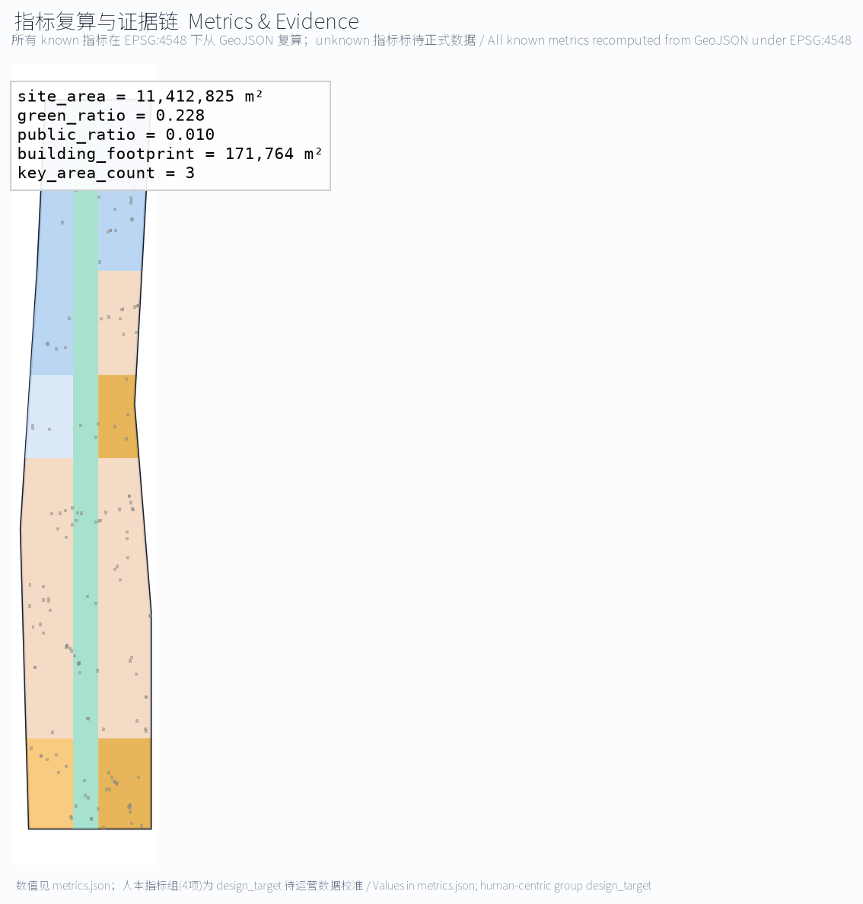

## Risk, Copyright, and Compliance

**Source legality.** The proposal mainly uses official public documents, public reports, and cleared local data; some policy documents and industry information are pending-verification indicative references (authority level and verification status per entry in `sources.json`, wording aligned accordingly); non-public materials are excluded [source:OFFICIAL-ANNOUNCEMENT].

**Copyright and clearance.** Logo direction, landmarks, portraits, historical images, and enterprise identities require clearance; sources are attributed; AI-generated content is attributed.

**Boundary and area limits.** All boundaries are provisional polygons used for design discussion only and do not constitute official redlines; the content is reviewable, and metrics will be recomputed after the official geometry is released [source:BOUNDARY-SOURCE] [depth:risk_missing_data].

**No approval or commitment.** The proposal contains no approved construction, government arrangement, investment commitment, or parcel-level demolition conclusion [source:AGENT-TASKBOOK].

**Privacy.** Personal data in scenario operations must be de-identified; the test line does not collect pedestrian biometrics.

**Professional review.** Rail-heritage protection, safety assessment, regulatory conditions, municipal capacity, and engineering feasibility require professional review; this proposal provides conceptual direction only.

## References

1. Haidian Branch, Beijing Municipal Commission of Planning and Natural Resources: Pre-qualification announcement for the Centennial Jing-Zhang AI Innovation Belt international design call (2026-05-09).
2. Taskbook excerpt for the global agent open call (user-provided, cleared, 2026-05-18).
3. MOHURD: Urban Design Measures (2017-03-14).
4. MOHURD: Measures for the Approval of Control Detailed Planning for Cities and Towns.
5. MNR: Land and Sea Use Classification Guide for Territorial Spatial Survey, Planning, and Use Control (2023-11-22).
6. Haidian District Plan (2017–2035) key chapters (local extract, 2026-08-09).
7. Beijing transport open data: bus, rail, roadside parking, public bike (local download, 2026-08-08).
8. Amap POI collection: 8 layers, 1,127 features (local, 2026-08-09).
9. Jing-Zhang AI Innovation Belt multi-party feedback survey (local, 2026-08-09).
10. Complete machine index: `sources.json`, `metrics.json`, `compliance_matrix.json`, `standard_matrix.json`, `design_depth_matrix.json`.

## Appendix: 50-case reviewable search index (for §3.2 scope statement)

**Search date**: 2026-08-08 to 2026-08-10 (background and industrial-heritage supplementary search 2026-08-08~10; case screening and collection 2026-08-10; 14 search groups, 139 results).

**Search keywords**: domestic — industrial heritage activation, old factory regeneration, Shougang Park, Yangpu Riverside, Eastern Suburb Memory, Langyuan, 751, West Bund, Pazhou, Erchang, 1905 Cultural Park, Ersha, Textile Valley, Old Steel Plant, Shenzhen Bay, Yunqi Town, Zhongguancun Software Park, Optics Valley, Future Sci-Tech City, Zhangjiang, Dongsheng, Jiaozi Park, Lize, Dachong, Yongqingfang, Shang Sheng Xin Suo, Suzhou Industrial Park, Meixi Lake, Longfusi, Panlong Tiandi, TIT Creative Park, OCT-LOFT; international — linear heritage park, rail heritage revitalization, industrial heritage adaptive reuse, AI innovation district, innovation cluster, transit-oriented development, urban regeneration case, High Line, Paris Rive Gauche, Battersea, 22@ Barcelona, Zürich-West, Kendall Square, Mission Bay, South Lake Union, one-north, Digital Media City Seoul, King's Cross, Marunouchi, Shibuya, Hudson Yards, Ørestad, HafenCity, MM21, Docklands Melbourne, Quayside, Kop van Zuid.

**Inclusion criteria**: projects directly relevant to any of the four quadrants (A linear heritage activation / B innovation cluster / C rail TOD / D city-center renewal), implemented or under implementation, and verifiable via official sites / project owners / authoritative media / international professional institutions.

**Exclusion criteria**: purely conceptual unbuilt projects; information available only through second-hand reposts with unverifiable subjects; projects without direct mapping to the Jingzhang scenario.

**Item-by-item source index (50 cases)**: the 30 domestic cases (Shougang, Yangpu Riverside, Eastern Suburb Memory, Langyuan Station, 751D·PARK, West Bund, Pazhou West, Erchang, 1905 Cultural Park, Ersha, Textile Valley, Old Steel Plant, Shenzhen Bay Science Park, Yunqi Town, Zhongguancun Software Park, Optics Valley, Future Sci-Tech City, Zhangjiang, Dongsheng, Jiaozi Park, Lize, Dachong, Yongqingfang, Shang Sheng Xin Suo, Suzhou Industrial Park, Meixi Lake, Longfusi, Panlong Tiandi, TIT Creative Park, OCT-LOFT) are all public web search (government/official/authoritative media) without individually archived URLs, serving only as qualitative reference and not participating in exclusivity assertions; of the 20 international cases, 15 have verifiable domains — High Line thehighline.org, Paris Rive Gauche ga-paris.fr, Battersea batterseapowerstation.co.uk, 22@ ecocites.logement.gouv.fr, Zürich-West atlasofurbantech.org, Mission Bay mbaydevelopment.com, South Lake Union aboutamazon.com, King's Cross kingscross.co.uk, Hudson Yards wikipedia, Ørestad wikipedia, HafenCity hafencity.com, Docklands development.vic.gov.au, Quayside toronto-future.com, Kop van Zuid upi-planning.org.cn — while Kendall, one-north, DMC, Marunouchi, Shibuya, and MM21 (5 cases) have no individually archived URLs.

**Conclusion limit**: the 50 cases are a "screening-inclusion" count and do not represent global exhaustiveness; exclusivity statements are always limited to "no directly comparable case found within the stated search scope, not an exhaustive assertion".
