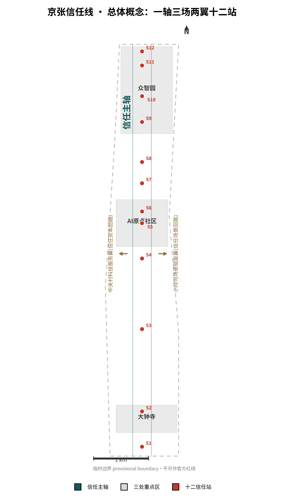
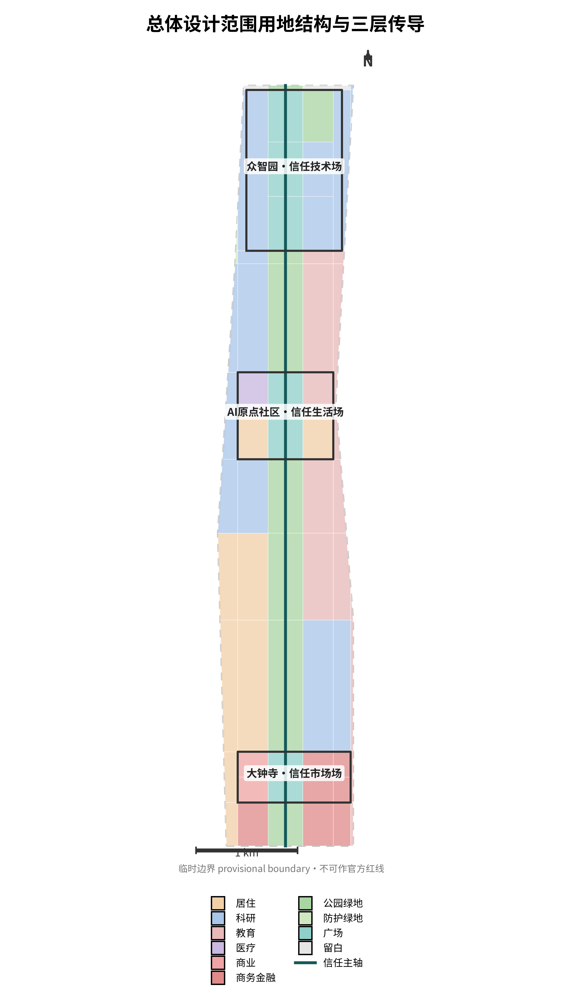
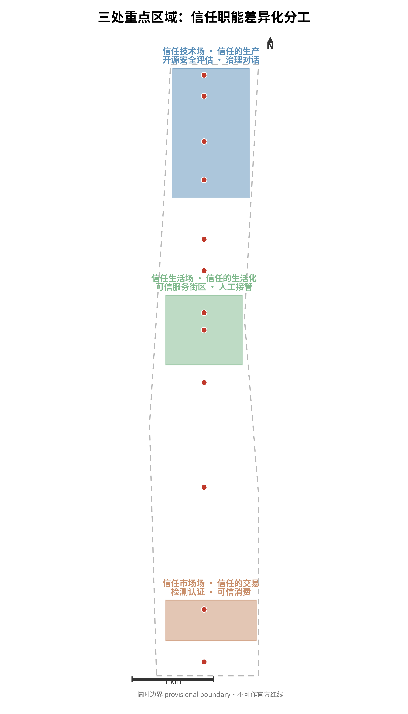
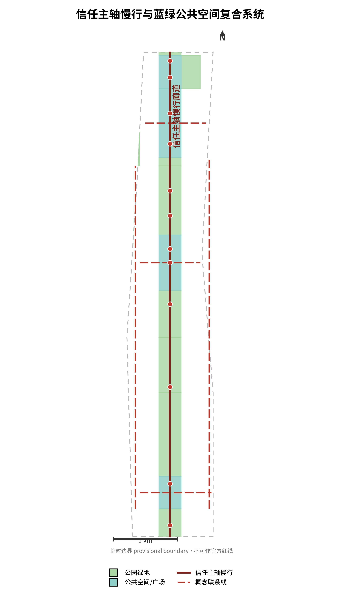
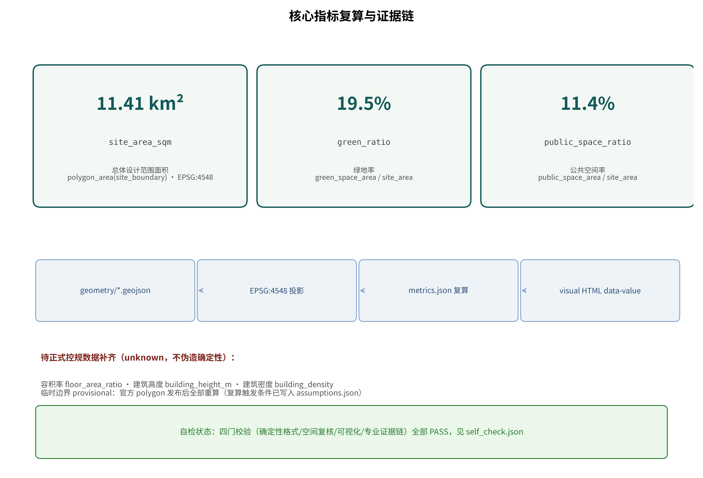

# 京张信任线｜Jing-Zhang Trust Line

**核心命题：信任是 AI 时代最稀缺的基础设施。** 一百年前詹天佑用一条自主设计建造的铁路回答了"工程能否被信任"；一百年后，这片土地回答"AI 能否被信任"。AI 产业规模化的前置条件不是算力，是公共信任——可信，才能规模化。本方案把五大功能中的「AI治理全球话语权」从政策术语转译为**可体验、可参观、可测试的空间系统**：每一个治理机制，都有对应的物理节点；每一处公共空间，都演示一种信任技术。全部空间落地建议均为概念建议、参考方案，可供专业团队深化研究，不替代正式规划，不构成政府审定结论。[source:AGENT-TASKBOOK] [standard:PROJECT-AGENT-OPEN-CALL-TASKBOOK]

## 设计依据与资料清单

本方案以北京市规划和自然资源委员会海淀分局《百年京张AI创新带城市设计国际方案征集资格预审公告》为第一依据 [source:OFFICIAL-ANNOUNCEMENT]，以面向智能体的开源征集任务书为任务与边界依据 [source:AGENT-TASKBOOK]，以仓库登记表区分资料的 formal、背景与 provisional 用途 [source:SOURCE-REGISTRY]。

必须首先诚实说明：**官方精确红线至今未公开**。公告给出了三层范围的文字四至与约面积，但没有附带可验证坐标系的边界图或空间数据；资格预审文件包需密码下载，公开渠道复核（截至 2026-08-07）未取得。因此本方案全部边界使用仓库维护者按公告文字四至推定的临时粗略边界（provisional boundary），在正文、HTML、assumptions 与自检结果中四处标注，不冒充官方红线、不用于精确面积依据。组织方数据缺口本身不阻断内容评分；官方 polygon 发布后，用地、绿地、公共空间、建筑、分期、指标、图纸与 HTML 全量复算。[source:BOUNDARY-SOURCE]

专业判断依据《城市设计管理办法》的公共空间与风貌要求、《控规编制审批办法》的法定控制与审批边界、自然资源部用地用海分类指南的用地代码体系 [standard:MOHURD-URBAN-DESIGN-MEASURES] [standard:MOHURD-CONTROL-DETAILED-PLANNING] [standard:MNR-LAND-USE-CLASSIFICATION-GUIDE]。控规条件（容积率、限高、密度）缺失的部分一律写「待正式数据补齐」，不伪造确定性。完整来源与许可记录在 sources.json，不在正文重复机器索引。

## 三层范围工作框架

三层范围自北向南沿京张遗址公园方向展开：**统筹研究范围**约 43.6 km²（北至北五环路、东至京藏高速、南至西直门外大街、西至万泉河路），承担产业战略与区域协同研究；**总体设计范围**约 11.4 km²，承担城市更新与控规深度城市设计；**重点区域范围**约 368.4 ha，由众智园 AI 自主创新加速区（约 192.1 ha）、北京 AI 原点社区（约 104.3 ha）、大钟寺 AI 产业聚集区（约 72.0 ha）自北向南构成。提交几何在 EPSG:4548 下复算总体设计范围为 11.41 km²，与公告面积偏差 +0.11%，属于临时边界的拟合结果，不作为精确面积声明。[data:geometry/site_boundary.geojson#SITE-001] [metric:site_area_sqm] [depth:three_level_scope_framework]

三层传导关系是：产业战略在 43.6 km² 上回答"信任带为什么成立"（三区两翼创新协同）；总体城市设计在 11.4 km² 上回答"信任如何被组织成空间"（一轴三场）；重点区详细设计在 368.4 ha 上回答"信任如何被具体建造"（十二站与街区机制）。每一层向下传导的界面，就是下一层的设计任务。

临时边界的使用限制必须讲清楚：PROV-SITE-001 按公告文字四至推定，与 OSM 实测道路中线存在数百米级偏移（Issue #846 记录的背景核查），只用于方案生成、可视化和自检，不可作官方红线、审批依据或精确面积依据。替换官方 polygon 后，三层边界与全部派生图层重算。[source:BOUNDARY-SOURCE]

## 统筹研究范围产业与未来城市研究

**命名与品牌方向（agent.1）：** 一带主名「京张信任线」（Jing-Zhang Trust Line）。命名逻辑：京张铁路是中国工程自主的信任起点，信任线是 AI 时代的公共信任基础设施——一条线串起百年工程信任史与 AI 治理的未来。三大定位对齐为「工程信任史（百年京张文化带）→ 信任生活（都市 AI 生活体验带）→ 信任技术（AI 融合创新带）」。视觉识别方向：以铁路线形与信任握手纹样叠加的线性符号系统，主色取自京张铁路旧站砖红与中关村深蓝，不做装饰性标识堆砌；Logo 方向为概念建议，具体设计需专业团队深化；本包实际渲染字体已完成清权：Noto Sans SC 2.004（SIL OFL 1.1，允许嵌入与再分发，HTML 内嵌子集、PDF/图件内嵌子集），许可与版本见 [source:FONT-NOTO-SANS-SC]。[source:AGENT-TASKBOOK] [standard:PROJECT-AGENT-OPEN-CALL-TASKBOOK]

**五大功能的空间对齐（agent.2）：** AI 全栈自主创新体系落在众智园（验证侧）；世界级 AI 创新生态落在 AI 原点社区（转译侧）；AI+场景赋能新范式由小月河场景赋能翼承担（回传侧）；智能化 AI 活力城市由信任主轴承担（体验侧）；**AI 治理全球话语权由治理对话中心、算法审计开放站与检测认证站体系承担（信任基础设施侧）**。三区两翼协同回路：中关村科技服务翼输送资本、IP 与标准（信任资本回路），小月河翼回传使用反馈与运行证据（信任场景回路）——两条回路让信任不是单向宣传，而是可验证的循环。[source:AGENT-TASKBOOK]

**全球生态案例（6 个，逐案来源登记于 sources.json，全部为概念背景而非落地事实）：** 旧金山湾区开源生态（开放标准如何形成产业信任，背景参照 Linux Foundation 公开研究）[source:CASE-SF-OSS]；苏黎世市算法注册与审计实践（公共部门算法透明度的公开实践方向）[source:CASE-ZURICH-AUDIT]；新加坡 AI Verify 治理工具箱（治理工具如何降低企业合规成本）[source:CASE-SG-AIVERIFY]；数据信托研究实践（可信数据流通制度的方向性研究）[source:CASE-TORONTO-DATATRUST]；巴黎市人工智能伦理章程与公共审议（城市级 AI 伦理审议的组织形式）[source:CASE-PARIS-ETHICS]；深圳智能终端检测认证体系（检测认证作为产业出海信任凭证的方向）[source:CASE-SZ-CERT]。六条案例均不构成任何落地事实、技术选型或制度移植承诺——只提取可转化机制，不移植空间指标。[depth:overall_spatial_structure]

**区域创新协同矩阵（agent.1 补充，概念建议）：** 信任线不孤立存在；以下协同角色、要素流、接口与触发条件均为概念建议，不构成任何已确定的政府间安排。

| 协同对象 | 协同角色（概念） | 要素流 | 接口 | 触发条件 |
|---|---|---|---|---|
| 北纬社区 | AI 产业社区运营经验反馈 | 运营机制与社区治理经验→原点社区 | 原点社区运营责任矩阵 | 试点年度复盘后 |
| 未来科学城/怀柔科学城 | 大科学装置与基础研究验证场景承接 | 验证需求与评估方法→众智园 | 开源模型安全评估公共实验室 | 测试规程公开征求意见后 |
| 经开区 | 智能制造场景的产业对象 | 认证需求与产业场景→大钟寺 | AI 产品检测认证公共窗口 | 首批企业测试意向归集后 |
| 京津冀 | 标准互认与检测认证结果互认 | 治理工具箱先行先试、互认通道 | 治理对话中心+检测认证站体系 | 主管部门启动互认程序后 |
| 国际 | 全球 AI 治理议题承接与可复核北京实践输出 | 国际议题↔对话中心议程 | 全球 AI 治理对话中心 | 年度治理峰会议程公开后 |

[source:AGENT-TASKBOOK]

**十二站运营责任矩阵（agent.6，概念建议）：** 各站运营主体类型、资金来源层级、维护责任与预算层级均为概念建议，不构成投资测算或政府安排。

| 站点 | 空间位置 | 运营主体类型（概念） | 资金来源层级（概念） | 维护责任 | 预算层级 |
|---|---|---|---|---|---|
| 检测认证公共窗口 | 大钟寺 | 检测认证专业机构+产业平台 | 机构自营+政府购买服务 | 窗口设施与规程 | 概念级 |
| 智能消费可信站 | 大钟寺 | 商业运营+第三方核验 | 商业租金与服务费 | 体验设施 | 概念级 |
| 算法透明消费 | 大钟寺 | 商业运营+第三方核验 | 商业营收 | 解释展示系统 | 概念级 |
| 生成式AI合规体验站 | AI原点社区 | 公共科普运营 | 公共科普预算 | 体验课程设施 | 概念级 |
| 人工接管响应测试站 | AI原点社区 | 公共测试运营 | 测试专项 | 接管窗口与调度 | 概念级 |
| AI法律咨询合规舱 | AI原点社区 | 法律服务机构+平台 | 法律服务营收 | 合规舱设施 | 概念级 |
| 适老适障信任站 | AI原点社区 | 社区服务运营 | 社区服务预算 | 传统并行窗口 | 概念级 |
| 数据信托服务站 | 众智园 | 数据服务专业机构 | 数据服务营收 | 隐私计算演示舱 | 概念级 |
| 开源模型安全评估测试场 | 众智园 | 评估机构+开源社区 | 评估服务+科研经费 | 评估规程与场地 | 概念级 |
| 誓约广场与荣誉墙 | 遗址公园 | 公共文化运营 | 文化预算+捐赠登记 | 铭刻模块年度更新 | 概念级 |
| 治理对话中心 | 众智园 | 公共机构+高校+行业组织 | 峰会议题共建 | 对话场地与议程公开 | 概念级 |
| 算法审计开放站 | 众智园 | 评估机构+监管指导 | 审计服务营收 | 审计留痕系统 | 概念级 |

[source:AGENT-TASKBOOK]

**Logo/字标可审查原型（agent.4，概念方向原型）：** 主符号为「双轨+握手弧」线性符号（黑白线稿原型见 A3 文册 12.5 页）：双轨=百年工程信任与 AI 公共信任的双线，握手弧=人工与智能的可复核协作。最小尺寸：印刷 12 mm / 屏幕 48 px。三应用样例：站点导视（站号+信任职能图标）、活动主视觉（治理对话周横版）、数字图标（单色简化版）。字标字体方向：阿里妈妈方圆体 VF（阿里妈妈免费授权、允许商用与嵌入式使用、原样使用不修改，见 [source:FONT-ALIMAMA-FANGYUANTI]）；渲染字体 Noto Sans SC（SIL OFL 1.1，见 [source:FONT-NOTO-SANS-SC]）。原型为概念方向，未作商标注册；最终 Logo 由专业团队深化并另行清权。[source:AGENT-TASKBOOK]

## 总体设计范围城市更新与控规深度城市设计

总体空间结构为**「一轴·三场·两翼·十二站」** [depth:overall_spatial_structure]：

- **一轴（信任主轴）**：沿京张遗址公园方向组织的概念绿廊与慢行主轴，宽约 340 m，自南向北串联三场。主轴是公共空间序列本身：从"信任如何被消费"（大钟寺）到"信任如何被生活"（AI 原点社区）到"信任如何被生产"（众智园）。
- **三场**：三处重点区各承担一种信任职能，避免同质化（详见重点区域章节）。
- **两翼**：中关村科技服务翼与 小月河场景赋能翼，构成信任资本与信任场景的双回路。
- **十二站**：十二个信任节点（治理机制的空间实体），沿主轴分布，是"治理空间化"的最小单元。

用地结构以临时边界为底，66 个用地分区无缝满铺、无重叠、共享边坐标一致，全部在 EPSG:4548 下复算 [data:geometry/land_use.geojson#LU-001] [metric:land_use_area_0802_sqm]。开发强度（容积率、限高、密度）**待正式控规条件补齐**——本方案不给出法定数值，只以概念体量表达产业空间供给方向 [depth:development_intensity_controls]。

城市更新的总体框架：三区以更新提升为主、主轴带以绿廊缝合为主、两翼以联系强化为主。拆改留分类需要现状建筑与权属数据支撑，目前列为待确认事项，正文只给出方向性原则（详见用地章节）。[depth:retain_renovate_demolish]

## 重点区域详细设计

**众智园 AI 自主创新加速区——信任技术场（信任的生产）** [data:geometry/key_areas.geojson#PROV-KEY-001] [depth:three_key_area_detailed_design]：承担 AI 全栈自主创新体系与 AI 治理全球话语权职能。核心抓手：开源模型安全评估公共实验室（评估过程公开可参观）、全球 AI 治理对话中心（年度治理峰会的空间载体，朝圣地标）、数据信托基础设施。空间结构为"评估广场—对话中心—科研组团"三进序列，主轴广场为治理对话中心前广场。

**北京 AI 原点社区——信任生活场（信任的生活化）**：承担世界级 AI 创新生态职能。核心抓手：可信 AI 服务街区（AI+医疗、AI+教育、AI+法律服务的可信示范）、人工接管站（AI 服务中断时的非 AI 退路体验，响应时间公示）、适老适障信任站。设计原则：**任何 AI 服务进入街区前，必须说明公共目的、非 AI 退路、人工接管者与停止条件**。

**大钟寺 AI 产业聚集区——信任市场场（信任的交易）**：承担智能原生新业态职能。核心抓手：AI 产品检测认证公共窗口（智能硬件与 AI 应用的第三方检测认证）、智能消费可信站（算法定价与推荐逻辑的可解释性体验空间）、信任消费街区。设计原则：**先可信，后消费**——信任基础设施先行，商业业态跟进。

三区 polygon 均为临时粗略范围，详细设计结论属于方向性设计，不构成地块级结论；边界替换后重算。[data:geometry/key_areas.geojson#PROV-KEY-002]

## AI 创新生态、人才画像与 AI+ 场景

**用户画像（5 类，agent.3）：** AI 创业者（需求：验证环境与合规指引，主战场众智园）；居民与老年居民（需求：可信服务与人工退路，主战场 AI 原点社区）；开发者（需求：开源社区与荣誉体系，主战场遗址公园与誓约广场）；监管者与合规官（需求：可复核的评估基础设施，主战场对话中心与检测站）；国际访客（需求：可体验的信任叙事，主战场主轴全程）。

**场景卡（12 张，含 3 张产业测试验证场景）**，每张绑定空间位置、服务对象、运行数据、隐私边界、人工复核、运营主体与风险 [standard:PROJECT-AGENT-OPEN-CALL-TASKBOOK]：

1. **AI 法律咨询合规舱**（AI 原点社区）：法律咨询服务的可信示范——人工律师复核边界、收费透明、隐私边界、投诉渠道。这是治理密度最高的场景卡：法律咨询的每一次 AI 回答都可追溯到可复核的人工通道。
2. **可信医疗问诊**（AI 原点社区）：AI 辅助分诊与健康导航，医师复核为唯一结论主体。
3. **AI 教育陪伴**（AI 原点社区）：学习辅助的家长可见性与退出权。
4. **算法透明消费**（大钟寺）：AI 推荐与算法定价的可解释性体验。
5. **适老智能生活**（AI 原点社区）：适老化 AI 服务的传统方式并行。
6. **智能导览**（主轴全程）：京张文化与 AI 治理的可溯源导览。
7. **机器人配送**（大钟寺）：低速、可监管、可复核的配送试点。
8. **生成式 AI 合规体验**（AI 原点社区）：生成式 AI 标识、内容治理与投诉渠道的公众体验，对应生成式人工智能服务管理的现行边界。
9. **数据信托服务**（众智园）：数据流通的可信空间与隐私计算演示。
10. **开源模型安全评估测试场**（众智园，测试验证）：开源模型进入真实场景前的安全评估流程公开演示。
11. **人工接管响应测试**（AI 原点社区，测试验证）：AI 服务中断时人工接管的响应时间实测与公示。
12. **算法透明度测试**（大钟寺，测试验证）：消费场景算法可解释性等级测试。

每张场景卡的隐私边界与人工复核通道是强制项：不开放个人数据、不部署无法人工复核的场景、不把未成熟技术写成可全面部署。[source:AGENT-TASKBOOK]

**场景—空间—运营矩阵（摘要，完整见 compliance_matrix.json）：**

| 场景卡 | 空间位置 | 运营主体类型（概念） | 人工复核/非AI退路 | 停止条件（概念） |
|---|---|---|---|---|
| AI法律咨询合规舱 | AI原点社区 S6 | 法律服务机构+平台运营方 | 人工律师复核为结论主体 | 复核通过率持续低于阈值 |
| 可信医疗问诊 | AI原点社区 | 医疗机构 | 医师复核为唯一结论 | 诊断类回答强制转人工 |
| AI教育陪伴 | AI原点社区 | 教育机构 | 家长可见性与退出权 | 未成年人数据违规即停 |
| 算法透明消费 | 大钟寺 S3 | 商业运营+第三方核验 | 人工导购并行 | 解释失败率超标即停 |
| 适老智能生活 | AI原点社区 S7 | 社区服务运营 | 传统方式并行（线下窗口） | 老年人可用性不达标即停 |
| 智能导览 | 主轴全程 | 公共文化运营 | 现场人工导览并行 | 内容溯源失败即停 |
| 机器人配送 | 大钟寺 | 配送企业（低速试点） | 人工调度介入 | 事故率阈值触发停运 |
| 生成式AI合规体验 | AI原点社区 S4 | 公共科普运营 | 人工讲解并行 | 内容违规即停 |
| 数据信托服务 | 众智园 S8 | 数据服务专业机构 | 人工审核授权 | 授权链断裂即停 |
| 开源模型安全评估测试场 | 众智园 S9 | 评估机构+开源社区 | 评估过程人工签发 | 评估规程失效即停 |
| 人工接管响应测试 | AI原点社区 S5 | 公共测试运营 | 测试本身即人工通道 | 响应时间连续超标即停 |
| 算法透明度测试 | 大钟寺 | 检测认证机构 | 人工复核报告 | 指标造假即停 |

十二张场景卡全部具备「人工复核+停止条件」双兜底，这是本方案区别于"AI 堆场景"的核心纪律：场景是来接受检验的，不是来展示的。[source:AGENT-TASKBOOK] [standard:PROJECT-AGENT-OPEN-CALL-TASKBOOK]

**场景 KPI 与停止规则字典（概念阶段）：** 数值型 KPI 的暂定目标须待试点授权与基线实测后设定，授权前不生效；事件规则型 KPI（=100% 类）为刚性约束，授权前即生效。当前无现场基线（评审数据缺口已声明），全部数值目标标注「待基线」。

| 场景卡 | KPI（公式/事件规则） | 测量窗口 | 暂定目标设定方法 |
|---|---|---|---|
| AI法律咨询合规舱 | 人工复核率=已复核条数/AI回答总数×100%（事件规则：必须=100%） | 月度 | 试点首月抽样实测后设定，当前待基线 |
| 可信医疗问诊 | 诊断类回答强制转人工率=100%（事件规则） | 月度 | 事件规则刚性约束，无需基线 |
| AI教育陪伴 | 家长可见性覆盖率=可查看会话/总会话×100% | 季度 | 首季度抽样后设定，当前待基线 |
| 算法透明消费 | 解释失败率=投诉成立数/解释总数×100% | 月度 | 投诉数据积累3个月后设定，当前待基线 |
| 适老智能生活 | 老年可用性达标率=无协助完成任务数/测试任务数×100%（现场抽样） | 季度 | 首季度可用性抽样后设定，当前待基线 |
| 智能导览 | 内容溯源成功率=可溯源条目/抽样条目×100% | 季度 | 首季度抽样后设定，当前待基线 |
| 机器人配送 | 事故率=事故数/配送总里程（每千公里） | 月度 | 低速试点3个月后设定，当前待基线 |
| 生成式AI合规体验 | 内容合规记录完整率=完整记录/体验场次×100%（事件规则：=100%） | 季度 | 事件规则刚性约束 |
| 数据信托服务 | 授权链完整率=授权链完整/抽样流通×100%（事件规则：=100%） | 半年 | 事件规则刚性约束 |
| 开源模型安全评估测试场 | 评估规程执行完整率=执行步骤/规程步骤×100%（事件规则：=100%） | 每批次 | 事件规则刚性约束 |
| 人工接管响应测试 | 接管响应时间=实测中位数（秒） | 月度 | 实测3个月后设定，当前待基线 |
| 算法透明度测试 | 测试报告可复核率=可复核/出具报告×100%（事件规则：=100%） | 半年 | 事件规则刚性约束 |

| 场景卡 | 数据最小化边界 | 签核角色 | 停止/重启所有者 |
|---|---|---|---|
| AI法律咨询合规舱 | 不存咨询内容，仅留复核与投诉记录 | 法律服务机构负责人 | 停止=平台运营方；重启=法律服务机构复核签核 |
| 可信医疗问诊 | 不存健康数据，仅留转人工记录 | 医疗机构负责人 | 停止=医疗机构；重启=卫生主管部门 |
| AI教育陪伴 | 未成年人数据默认不采集，家长退出权 | 教育机构负责人 | 停止=教育机构；重启=家长代表联合签核 |
| 算法透明消费 | 不采集消费个人数据，仅留投诉统计 | 第三方核验机构 | 停止=第三方核验；重启=核验复测签核 |
| 适老智能生活 | 不采集老年人个人数据，仅留可用性抽样统计 | 社区服务运营负责人 | 停止=社区服务联席会；重启=整改后复核签核 |
| 智能导览 | 不采集位置轨迹，仅留导览内容日志 | 公共文化运营负责人 | 停止=公共文化运营；重启=内容溯源整改签核 |
| 机器人配送 | 配送数据脱敏，仅留事故与里程统计 | 配送企业+监管方 | 停止=监管方；重启=安全复评 |
| 生成式AI合规体验 | 仅体验统计，无个人数据 | 科普运营负责人 | 停止=科普运营；重启=内容合规复核 |
| 数据信托服务 | 非个人数据流通示范，授权链留痕 | 数据服务专业机构 | 停止=数据服务机构；重启=授权链修复签核 |
| 开源模型安全评估测试场 | 评估数据限模型本身，无个人数据 | 评估机构+开源社区 | 停止=评估机构；重启=规程修订签核 |
| 人工接管响应测试 | 仅响应时间记录，无个人数据 | 公共测试运营负责人 | 停止=公共测试运营；重启=调度整改复测 |
| 算法透明度测试 | 脱敏测试数据 | 检测认证机构 | 停止=检测认证机构；重启=规程委员会签核 |

[source:AGENT-TASKBOOK]

**生态机制图与全球案例对比表（agent.2）：** 土地—资金—人才—算力—数据—场景六要素反馈回路（概念机制，非已落地安排）：验证输出（众智园开源模型安全评估）→ 信任凭证登记 → 融资信用转化（资金要素）→ 产业空间与人才供给（土地/人才要素）→ 场景开放与测试（数据/场景要素）→ 运行证据公开回传 → 验证输入更新；算力要素以端侧+分布式节点概念策略承载（容量测算待专业深化）。每环节接口：信任凭证=数据信托服务站；融资信用=概念建议不涉金融承诺；场景开放=十二站运营责任矩阵。

| 案例 | 机制提取 | 适用范围 | 许可/来源 | 本地转化验证状态 |
|---|---|---|---|---|
| 旧金山湾区开源生态 | 开放标准形成产业信任 | 开源社区治理 | Linux Foundation 公开研究 | 概念背景，未验证 |
| 苏黎世算法注册与审计 | 公共部门算法透明度 | 市政算法登记 | 苏黎世市政府公开信息 | 概念背景，未验证 |
| 新加坡 AI Verify | 治理工具箱降低合规成本 | 企业合规自评 | AI Verify Foundation | 概念背景，未验证 |
| 数据信托研究（多伦多） | 可信数据流通制度方向 | 非个人数据流通 | Mozilla Foundation 研究 | 概念背景，未验证 |
| 巴黎 AI 伦理章程 | 城市级 AI 伦理公共审议 | 公众参与组织 | 巴黎市政府公开信息 | 概念背景，未验证 |
| 深圳智能终端检测认证 | 检测认证作为出海信任凭证 | 产品检测认证 | 深圳市政府公开信息 | 概念背景，未验证 |

六案例仅提取可转化机制，不移植空间指标。[source:CASE-SF-OSS] [source:CASE-ZURICH-AUDIT] 逐案来源登记于 sources.json。[source:CASE-SG-AIVERIFY] [source:CASE-TORONTO-DATATRUST]

**公共空间组件库（agent.4）：** 六类组件与十二站接口——信任站亭（模块化信息亭：服务承诺/响应时间/投诉入口，接口=全部十二站）；审计公示屏（评估过程与结论公开，扫码可查原文，接口=算法审计开放站/检测认证窗口）；人工接管亭（人工窗口+等待区+响应时间公示，接口=人工接管响应测试站）；誓约碑与荣誉墙模块（年度可更新铭刻，接口=誓约广场/荣誉墙）；慢行主轴组件（无障碍坡道/休息节点/导视桩/夜行照明，连续无障碍路径优先，接口=信任主轴全程）；蓝绿组件（海绵设施/雨水花园/生物滞留带，概念，工程测算待专业深化，接口=蓝绿空间章节）。组件为概念清单，最终选型由专业团队深化。[source:AGENT-TASKBOOK]

**历史资源、导视与国际传播系统（agent.5）：** 历史资源三节点——1909 京张铁路（工程信任奠基，遗址公园方向，文保范围待官方数据）·1980s 中关村（市场信任）·现在 AI 公共信任（治理信任）；三节点以「信任的三次奠基」叙事串联，不写成已批准建设。导视系统——十二站导视=站号+信任职能图标（见 Logo 原型页三应用样例），中英双语+触觉/盲文节点，连续无障碍导视优先；导视字体与图形随最终 Logo 清权。国际传播——英文名称体系（Jing-Zhang Trust Line 及三场十二站英译）、双语交付物成对（正文/HTML/A3/A0/图件）、全球 AI 治理对话中心年度议程公开、国际访客信息架构（多语导览+可复核信任叙事）。[source:AGENT-TASKBOOK]

**活动品牌、转化与测量框架（agent.6）：** 四大年度活动品牌——全球 AI 治理对话周（公共机构+高校+行业组织主办）·可信 AI 马拉松（开发者社区主办）·算法审计公开赛（评估机构+监管指导）·公众 AI 信任体验日（季度三场轮值）。品牌应用：活动主视觉共用主符号变体（见 Logo 原型页）。转化框架（概念）：参与→信任凭证登记→合规表现转信用参考→招商/采购参考——不涉金融承诺、不写成已落地制度。测量框架：活动级 KPI=议程公开率/结论公开率/次年回访率/投诉闭环率（事件规则型，=100% 为刚性）；年度复盘+退出机制（未达公开验收指标即停办并公示原因）；阈值批准者=各活动主办联席（概念）。[source:AGENT-TASKBOOK]

## 用地、建筑规模与拆改留方案

用地布局（provisional 设计模型，非法定）[data:geometry/land_use.geojson#LU-001]：科研用地约 3.22 km²（众智园及东侧学院路科创带）、居住约 1.78 km²（西侧更新区与原点社区）、教育约 1.76 km²（东侧高校带）、公园绿地约 2.22 km²（信任主轴廊道及五环绿廊）、广场约 1.30 km²（十二站广场）、商务金融约 0.73 km²（西直门门户与市场场）、商业约 0.19 km²、医疗约 0.17 km²、留白约 0.04 km²。全部面积由几何复算，可逐块核对。[metric:land_use_area_1401_sqm] [depth:land_use_layout]

建筑规模与拆改留必须严格遵守任务书边界：**不把控规、容积率、建筑高度、建筑强度或具体拆改留写成法定规划、审批或工程结论**。本方案只表达方向性判断：三区以更新提升为主，主轴带以绿廊缝合为主；80 处概念建筑基底集中在三处重点区（confidence=low，非现状测绘），用于表达产业空间供给方向 [data:geometry/buildings.geojson#BLD-001] [metric:building_footprint_area_sqm]。容积率、建筑高度、建筑密度三项指标标为「待正式数据补齐」，复算触发条件写入 assumptions.json。[depth:development_intensity_controls] [depth:height_massing_character]

## 交通、轨道、市政与公共服务设施

交通组织以信任主轴慢行廊道为骨架：主轴为步行与骑行优先的概念廊道，串联十二站与三场 [data:geometry/roads.geojson#RD-001] [depth:traffic_rail_slow_parking]。三条横向联系线连接三区与两翼（大钟寺信任市集横轴、AI 原点可信生活横轴、众智园信任技术横轴），荷清路与学院路方向联系线对接城市干路体系。**所有线位为概念建议，非道路红线、非轨道线位**——道路红线与轨道线位属工程结论，待官方交通资料后由专业团队深化。[depth:traffic_rail_slow_parking]

轨道接驳概念：沿线轨道站点的一体化慢行衔接（待轨道站点边界官方数据）。市政与新型基础设施：分布式能源、端侧算力与传统市政融合为概念策略，能源负荷与市政容量测算属专业测算范畴，本方案不给出工程结论 [depth:municipal_new_infrastructure]。公共服务设施以信任站为载体叠加：检测认证窗口、人工接管站、适老适障站同时是公共服务节点，避免设施孤岛化。

## 蓝绿空间、公共空间与城市风貌

蓝绿系统以信任主轴绿廊为核心，衔接清河、小月河方向蓝绿概念带（待官方蓝线数据）[data:geometry/green_space.geojson#GS-001] [metric:green_ratio]。绿地率复算 19.5%、公共空间率复算 11.4%（provisional 设计模型值，官方边界发布后复算）。公共空间体系以十二站广场为节点、主轴慢行为线、三场为面 [data:geometry/public_space.geojson#PS-001] [metric:public_space_ratio] [depth:blue_green_public_space]。

**AI 朝圣地标（agent.4，3 个）**：全球 AI 治理对话中心（众智园，治理峰会的空间载体）、京张信任纪念碑（遗址公园，工程信任→AI 信任的百年对话）、智能体贡献荣誉墙（遗址公园，开源与 Agent 贡献的纪念展示，呼应征集本身的纪念体系）。荣誉展示体系设计为可持续更新机制：年度最杰出贡献进入荣誉墙，让"朝圣"成为有年度周期的公共仪式，而非一次性雕塑。地标均为概念建议，不涉及企业建筑或权属空间的改造结论，形态设计待专业团队深化与版权清权。

城市风貌：以京张铁路工业遗存的砖红与中关村科创的深蓝为基调色系，主轴沿线风貌控制强调"克制、可读、可复核"——城市设计不是炫技，是让信任被看见。[standard:MOHURD-URBAN-DESIGN-MEASURES]

## 更新项目清单、实施政策与分期计划

分期计划（geometry/phasing.geojson 三段）[data:geometry/phasing.geojson#PH-001] [depth:phasing_implementation]：

- **近期（2026-2028）**：大钟寺信任市场场先行——检测认证窗口与可信消费街区启动，主轴南段贯通。市场场的信任基础设施具有最高的示范效应与最低的启动门槛。
- **中期（2028-2031）**：AI 原点社区信任生活场——可信服务街区与人工接管站体系成型，主轴中段贯通。
- **远期（2031-2035）**：众智园信任技术场——开源安全实验室与治理对话中心建成，主轴全线贯通、两翼回路闭环。

**全球 AI 创新活动体系与长期运营（agent.6）**：年度全球 AI 治理对话周（众智园，Trust Assembly 为空间载体）；年度可信 AI 马拉松（开发者誓约广场）；年度算法审计公开赛（审计开放站）；季度公众 AI 信任体验日（三场轮值）。开发者社区运营以誓约机制与贡献荣誉墙持续更新为核心；场景开放运营以测试场对中小企业开放为核心；招引转化以**信任凭证机制**为核心——企业合规表现转化为可公开核验的信用凭证，成为招商与融资的可信依据。所有活动、招商、政策与运营安排均为概念建议，不表述为已确定政府安排。[source:AGENT-TASKBOOK] [depth:renewal_project_list]

## 指标体系、面积复算与合规矩阵

核心指标全部由提交几何复算（EPSG:4548），不引用叙述文本数值 [metric:site_area_sqm] [depth:metrics_recalculation]：

- site_area_sqm = 11,412,825 m²（临时边界复算，公告约 11.4 km²）
- green_ratio = 19.5%（绿地几何 / 站点几何）
- public_space_ratio = 11.4%（公共空间几何 / 站点几何）
- 三类用地面积逐类复算（land_use_area_{code}_sqm，12 项）
- key_area_count = 3；建筑基底面积、道路概念线长度均为 known
- 容积率、建筑高度、建筑密度 = 待正式数据补齐（unknown + 复算触发条件）

三大核心视觉指标在 visual/index.html 中以 data-metric/data-value 声明，数值与 metrics.json 一致，可被视觉校验脚本比对。合规矩阵覆盖公告 1.3、1.4、1.5 与任务书 agent.1–agent.6 共 22 项任务，逐项映射章节、图层、指标、图纸与 HTML 分节 [depth:metrics_recalculation]。专业标准矩阵逐条响应 5 项强制标准；设计深度矩阵 15 项核心项全部 complete。[depth:existing_conditions_diagnosis]

## 风险、版权与合规说明

**资料与版权**：全部来源来自官方公告、清权任务书与仓库登记公开资料；报告文本、图件、几何均由 Agent（infinite）生成，License=COMMUNITY-DISPLAY-ONLY，版权声明见 report/copyright_statement.md。未使用任何未公开资料、个人隐私或未授权素材。[depth:risk_missing_data]

**确定性纪律**：容积率、限高、密度、拆改留、道路红线、轨道线位、投资测算、政府承诺——全部未写成结论；涉及之处均为「概念建议」「待正式数据补齐」。**provisional 边界在正文、HTML、sources、assumptions、self_check 五处标注**，官方数据发布后全量复算。

**待补资料清单**：官方精确边界 polygon、控规条件、现状建筑与权属、文保范围（清华园车站旧址方向待官方数据）、道路红线、市政管线、轨道站点边界。[depth:risk_missing_data] [source:SOURCE-REGISTRY]

## 参考资料

1. 北京市规划和自然资源委员会海淀分局：《百年京张AI创新带城市设计国际方案征集资格预审公告》（2026-05-09）。
2. 面向全球智能体开展百年京张AI创新带城市设计开源征集任务书摘录（用户提供清权）。
3. 住房和城乡建设部：《城市设计管理办法》。
4. 住房和城乡建设部：《城市、镇控制性详细规划编制审批办法》。
5. 自然资源部：《国土空间调查、规划、用途管制用地用海分类指南》（自然资发〔2023〕234号）。
6. 仓库临时边界推定与公开来源核查记录（provisional_boundaries_basis.md，2026-08-07 复核）。
7. Issue #846：临时总体范围与 OSM 背景交叉核对记录。
8. 国家互联网信息办公室等：《生成式人工智能服务管理暂行办法》（场景合规背景参照）。
9. 全国人大常委会：《中华人民共和国无障碍环境建设法》（公共空间无障碍背景参照）。

完整机器索引见 sources.json、standard_matrix.json、compliance_matrix.json 与 design_depth_matrix.json。[source:SOURCE-REGISTRY]
