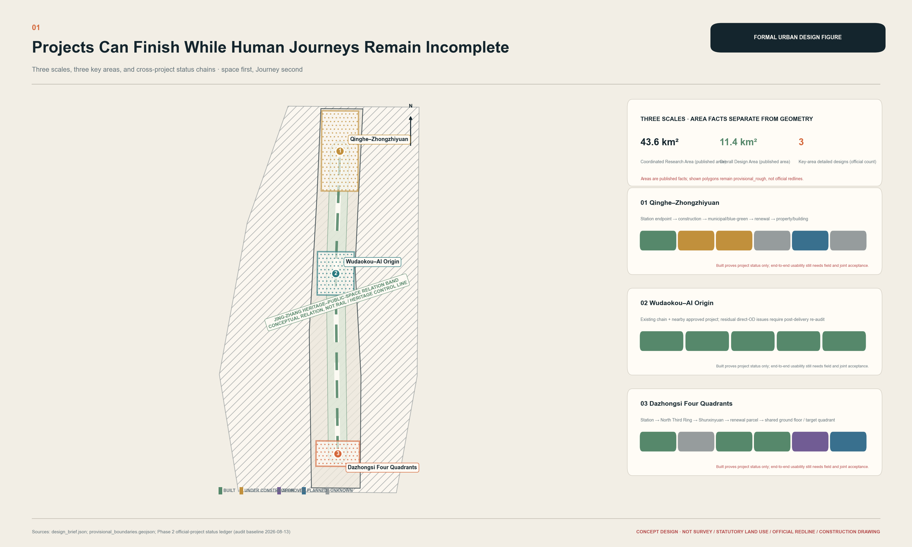
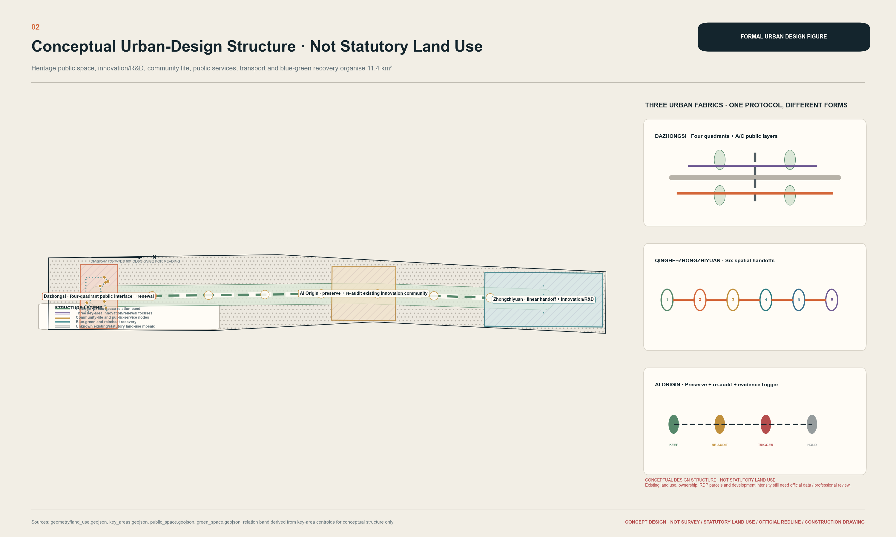
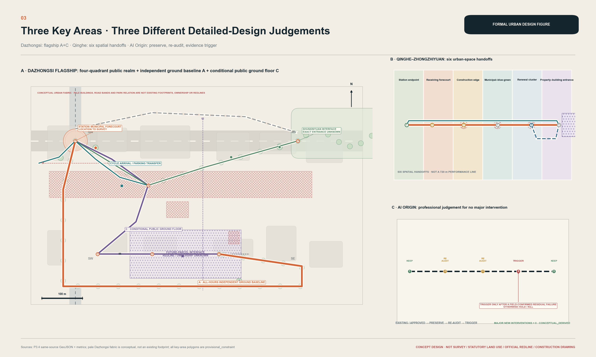
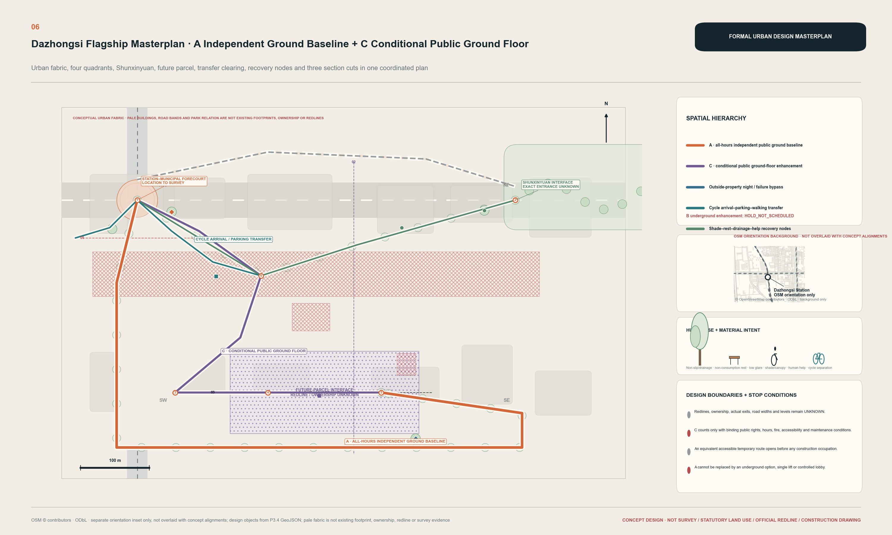
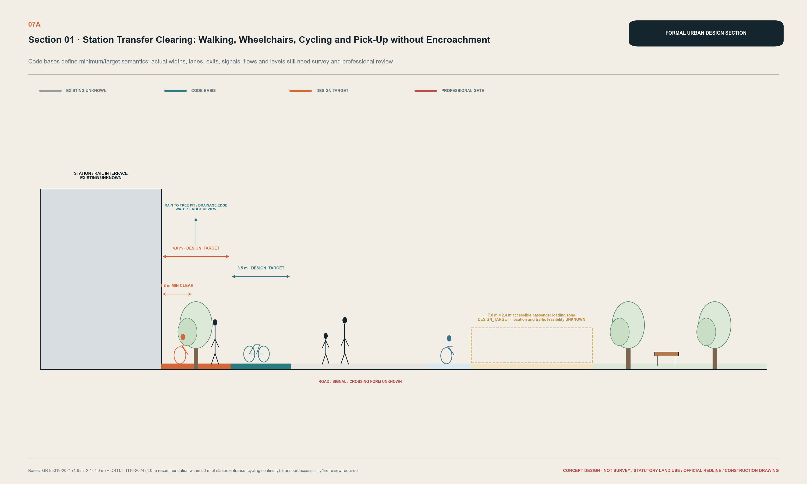
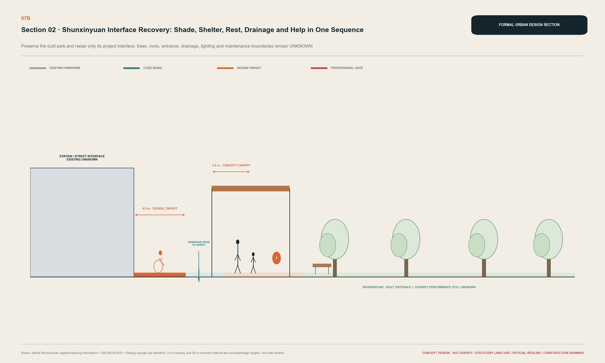
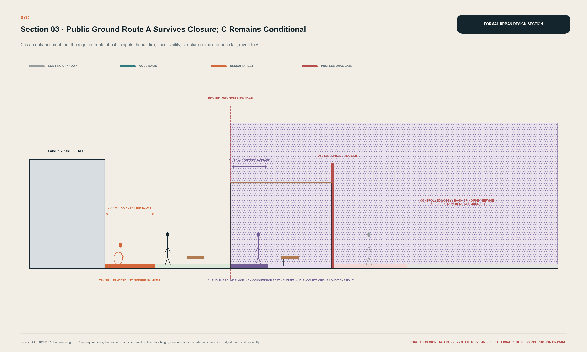
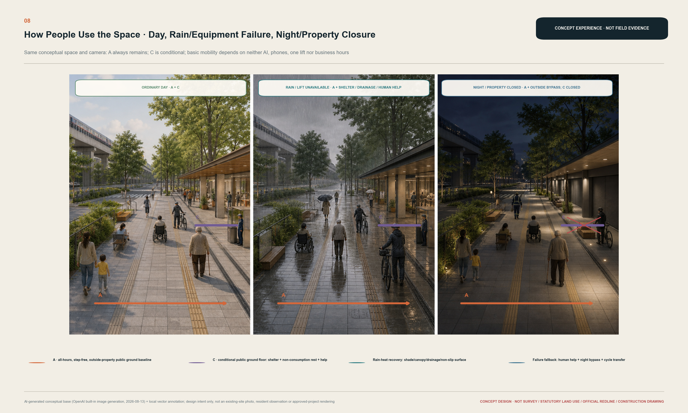
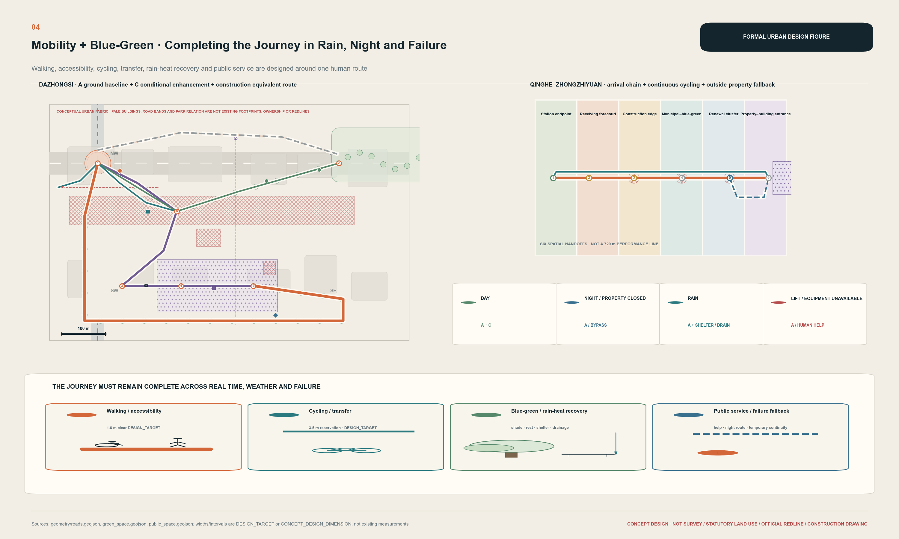
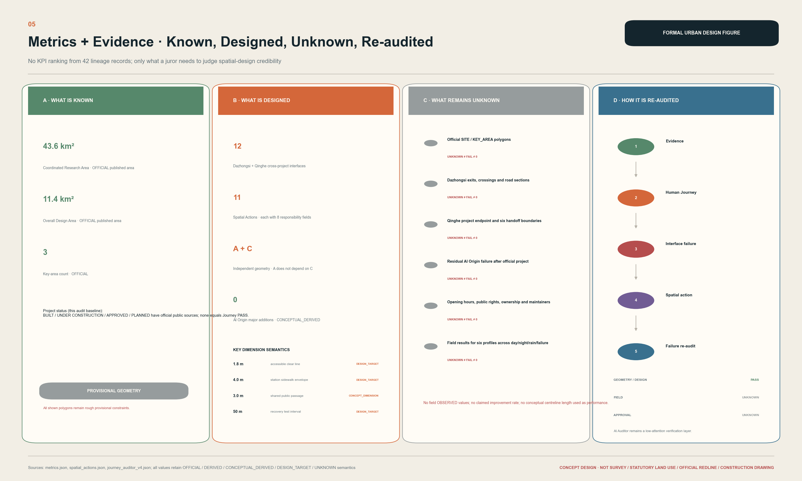

# Shared Delivery of the Complete Cross-Project Journey

> **Project completion does not necessarily mean journey completion.** Stations, roads, parks and renewal parcels along the Jing-Zhang corridor can each be built while an everyday Journey still crosses their redlines, schedules and operating boundaries. This proposal treats the complete human Journey as a shared delivery unit: a station, road, park and parcel are jointly complete only when every target group has an end-to-end usable route, or a compliant equivalent alternative, during critical periods and failure scenarios. [source:PACKAGE-EVIDENCE-LEDGER] [depth:overall_spatial_structure]

The judgment comes from three different bodies of evidence. Dazhongsi contains a complex chain of built station-road-park assets, approved parcels and planned connections. Official evidence at Qinghe falsified the early assumption that east-west passage inside the station was absent, shifting design attention beyond the station project endpoint. Around AI Origin, approved public-space works already cover some fence, walking/cycling and parking issues, so no new major intervention is proposed until a residual failure is demonstrated. [source:DZS-IMPLEMENTATION-PLAN] [source:QH-CITY-CORRIDOR] [source:WDK-SEVEN-NODE-APPROVAL]

The spatial answer is stated immediately. **A is an all-hours public ground baseline that does not depend on property opening, a lift or a digital service. C is a conditional public ground-floor enhancement that counts only after public rights, fire safety, accessibility and maintenance are secured.** When C closes, the Journey falls back to A. Underground option B has no fixed alignment and remains `HOLD_NOT_SCHEDULED`. [data:geometry/roads.geojson#ROAD-DZS-GROUND-BASELINE-01] [metric:dazhongsi_independent_public_route_count]

| Evidence status | Use in this proposal |
| --- | --- |
| OFFICIAL | Official brief, law, project or asset status; never extrapolated into field performance |
| OBSERVED | Field observation; this phase has no new result that may be claimed |
| DERIVED | Reproducible from registered data |
| CONCEPTUAL_DERIVED | Derived from provisional boundaries or concept geometry; neither existing nor statutory |
| DESIGN_TARGET | A design target pending survey and professional review |
| SCENARIO_SIMULATION | A stress test of stated design conditions, not built performance |
| UNKNOWN | Not established by field, as-built or professional evidence; never recoded as zero, PASS or FAIL |

## Design Basis and Source List

The design basis comprises the official call announcement, the Agent taskbook, the current repository Skill and site package. The auditable layer comprises more than forty registered sources, concept GeoJSON, metrics and the Evidence Ledger. Core facts return to official primary pages; processed repository material is used as navigation only and never as the sole basis for a spatial or compliance conclusion. [source:OFFICIAL-ANNOUNCEMENT] [source:AGENT-TASKBOOK] [standard:PROJECT-OFFICIAL-ANNOUNCEMENT]

The repository still contains no official `SITE_BOUNDARY` or official polygons for the three `KEY_AREA` locations. Dashed extents are organizer-repository provisional constraints for concept design, recalculation and discussion only. They are not statutory redlines, ownership evidence, approval boundaries or precise-area evidence. Once official polygons appear, geometry, metrics, figures and claim mapping must be rebuilt together rather than replacing one background map. [source:BOUNDARY-SOURCE] [data:geometry/site_boundary.geojson#PROV-SITE-001] [depth:existing_conditions_diagnosis]

The largest remaining gaps are official precise boundaries, current survey, complete regulatory plans, station-area and municipal as-built drawings, ownership and public-opening hours, six-profile field walks, drainage and utility capacity, and heritage-control boundaries. Each chapter therefore answers four questions: why this design, where it is, what supports it, and what remains unknown. Missing evidence is not disguised as precise planning. [source:SOURCE-REGISTRY] [depth:risk_missing_data]

## Three-Level Scope Framework

The three levels are an evidence-and-depth ladder from strategic relationships to regulatory-plan-level urban design and then interface-level detailed design; they are not three duplicated masterplans. [depth:three_level_scope_framework] [source:OFFICIAL-ANNOUNCEMENT]

| Level | Question answered | Spatial delivery | Explicit exclusion |
| --- | --- | --- | --- |
| 43.6 km² coordinated research | How are cross-project Journeys and interface types recognized through stations, heritage/public-space assets and innovation destinations? | Collaboration framework, industry-talent-resident relationships, links among the three areas and two wings | No fabricated detailed land-use or building plan for 43.6 km² |
| Approx. 11.4 km² overall design | How do renewal, mobility, blue-green space and public services coordinate when the complete Journey is the shared object? | Conceptual land-use structure, public ground network, project edges and phasing gates | Conceptual land use is not statutory land use |
| Three key areas | How do different project states require different professional responses? | Dazhongsi A+C, Qinghe's six handovers, AI Origin preserve-and-re-audit | No replicated one-axis/three-core formula |

All three levels use the same test. When station, municipal, park, development and property boundaries are delivered at different times, can an adult, wheelchair user, older or slow walker, parent with a child, cyclist, and night worker still complete the Journey? An average improvement cannot offset the exclusion of one target group. [source:BARRIER-FREE-LAW] [depth:three_key_area_detailed_design]

## Coordinated Research Area: Industry and Future City Research

At 43.6 km², the proposal does not draw a falsely precise regional plan. It organizes the Jing-Zhang railway heritage and public-space framework, rail nodes, universities and research, startups and growth companies, community life and public-adoption scenarios as a network that can be audited segment by segment. The useful regional typology is not a density of AI icons but a set of station endpoints, road sections, park and waterfront edges, parcel ground floors, property thresholds and temporary construction routes. [source:AGENT-TASKBOOK] [depth:overall_spatial_structure]

The taskbook's official positioning is listed separately from this proposal's spatial response, so proposal language does not overwrite the official Chinese terms. [standard:PROJECT-AGENT-OPEN-CALL-TASKBOOK] [depth:three_level_scope_framework]

| Official level | Official term / working English translation | Existing spatial response in this proposal |
| --- | --- | --- |
| Three position statements | 百年京张文化带 / Centennial Jing-Zhang Cultural Belt | Legible heritage, everyday access and continuous maintenance |
| Three position statements | 都市AI生活体验带 / Urban AI Life Experience Belt | Public ground, services and human help usable without an account |
| Three position statements | AI融合创新带 / AI-Integrated Innovation Belt | Proximity among research, controlled validation, public adoption and feedback |
| Five functions | AI全栈自主创新体系 / Full-Stack Independent AI Innovation System | Authorized co-creation, testing and operations forecourt at Zhongzhiyuan |
| Five functions | 世界级AI创新生态 / World-Class AI Innovation Ecosystem | Open-source/talent exchange at AI Origin with conceptual support from the two wings |
| Five functions | AI+场景赋能新范式 / New Paradigm of AI-Enabled Scenarios | Authorized testing, public experience and post-delivery re-audit |
| Five functions | 智能化AI活力城市 / Intelligent AI-Vibrant City | All-hours public ground, six user profiles and everyday public services |
| Five functions | AI治理全球话语权 / Global Discourse Power in AI Governance | Readable evidence levels, human review, privacy boundaries and STOP conditions |

| Official area/wing | Official taskbook role | Proposal judgment, kept separate from the official role |
| --- | --- | --- |
| AI原点社区 / Beijing AI Origin Community | 世界级AI创新生态 / World-Class AI Innovation Ecosystem | Preserve existing/approved works, re-audit after delivery, and make no major change without evidence |
| 众智园AI自主创新加速区 / Zhongzhiyuan AI Independent Innovation Acceleration Area | AI全栈自主创新体系与AI治理全球话语权 / Full-Stack Independent AI Innovation System and Global Discourse Power in AI Governance | Continue from the Qinghe project endpoint through six spatial handovers to controlled validation |
| 大钟寺AI产业集聚区 / Dazhongsi AI Industry Cluster | 智能原生新业态 / AI-native new formats | Keep public ground A as the baseline; use conditional public ground floor C for public adoption/display and consumption/business interfaces |
| 中关村科技服务翼 / Zhongguancun Technology Services Wing | 要素全球化配置、中关村IP与资本赋能 / global factor allocation plus Zhongguancun IP and capital enablement | A conceptual service interface for talent/developer/company conversion, not a fourth detailed-design area |
| 小月河场景赋能翼 / Xiaoyue River Scenario Enablement Wing | AI场景赋能与智能化AI活力城市 / AI scenario enablement and an Intelligent AI-Vibrant City | A conceptual scenario interface for controlled validation, public experience and feedback, not a fifth detailed-design area |

This table makes the taskbook structure visible. The proposal's “deepen Dazhongsi / six Qinghe handovers / preserve and re-audit AI Origin” is a differentiated professional response to project states; it does not replace the official names or functions of the Three Zones and Two Wings.

Beijing's measures for agent-led development are used only as industry and policy context for real business scenarios, device-edge-cloud collaboration, open source and safety validation. They do not prove funding, procurement, institutional commitment or deployment approval for Jing-Zhang. FDE, one-person-company services, open-source communities and safety testing remain optional operating scenarios for later professional teams, not confirmed tenant or investment lists. [source:BEIJING-AGENT-MEASURES] [source:PACKAGE-EVIDENCE-LEDGER]

## Overall Design Area: Urban Renewal and Regulatory-Plan-Level Urban Design

The approximately 11.4 km² overall structure combines a heritage-public-space relationship framework, rail arrival gates, a cross-project public ground network and conditional public parcel edges. Renewal does not unify the area through wholesale demolition. It first retains built stations, roads, parks and buildings with public value, then sets spatial performance gates at station forecourts, road sections, park entrances, development ground floors and construction hoardings. [standard:MOHURD-URBAN-DESIGN-MEASURES] [data:geometry/land_use.geojson#LU-CONCEPT-FOCUS-001] [depth:overall_spatial_structure]

The land-use structure is a **CONCEPTUAL DESIGN STRUCTURE**. It expresses relationships among public movement, innovation services, mixed activity and blue-green recovery. It does not replace the current regulatory plan, national land-use classification, FAR, height, approved floor area, road redline or demolition decision. When official land-use controls arrive, concept polygons must be reclassified, rechecked for overlap and recalculated. [standard:MNR-LAND-USE-CLASSIFICATION-GUIDE] [metric:concept_land_use_coverage_ratio]

The mobility and public-space principle is “deliver public ground first.” Rail and bus arrival areas separate the accessible clear line from bicycle parking, pickups, delivery and emergency access. Cycling changes to walking at parcel and station edges. Blue-green space provides shade, rest, rain shelter, drainage, wayfinding and non-commercial pause. Actual toilet, water, seating and staffed-help locations and hours remain UNKNOWN; the proposal shows only design targets and service interfaces. [standard:BEIJING-ROAD-SPACE-DB11] [depth:traffic_rail_slow_parking]

Phasing is not inferred backwards from a vision image. Phase 0 obtains boundaries, survey, field and professional evidence. Phase 1 delivers independent public ground continuity. Phase 2 coordinates municipal, park, blue-green and station interfaces. Phase 3 introduces public ground floors and building entries only when future-parcel rights and approvals are secured. Underground B remains `HOLD_NOT_SCHEDULED`. [data:geometry/phasing.geojson#PHASE-0-SURVEY-GATES-01] [depth:phasing_implementation]

## Detailed Design of Key Areas

### Dazhongsi: four-quadrant public space through A+C

The evidence chain is Dazhongsi Station BUILT — Dazhongsi South Street BUILT — Shunxinyuan BUILT — HD00-1603-01/03A parcels APPROVED — station-parcel vertical/shared-layer connection PLANNED — precise position, public rights and operation UNKNOWN. It proves that one arrival depends on multiple projects and schedules; it does not prove that an existing crossing or accessible route fails. [source:DZS-PARK-OPENING] [source:DZS-SOUTH-STREET] [source:DZS-LAND-CONFIRMATION]

**Public ground baseline A** links the station threshold, municipal forecourt, four quadrants, Shunxinyuan edge and the exterior of the future parcel through an all-hours, step-free route outside property control. The station forecourt separates the wheelchair and walking clear line from cycle arrival and parking, bus waiting, taxi and ride-hailing pickup, delivery and fire/emergency access. Clear width, turning paths, signals and entrance positions require survey, passenger-flow, transport and accessibility review. [data:geometry/public_space.geojson#PUB-DZS-DESIGN-ENVELOPE-01] [metric:public_ground_route_width_target_m]

**Conditional public ground floor C** provides sheltered movement, non-commercial rest, visible human help, cycle-to-walk transition and an entrance landing at the future parcel. It does not pass through a controlled lobby and cannot depend on opening hours or one lift. C becomes a required segment only when official redlines, architecture/fire/egress/accessibility review, binding public-access hours and maintenance acceptance all exist. Otherwise, it remains removable enhancement. [data:geometry/buildings.geojson#BLDG-DZS-FUTURE-ENVELOPE-01] [metric:shared_public_passage_width_target_m]

**Underground or vertical enhancement B remains on hold.** Planning implementation requirements support studying a connection; they do not authorize this proposal to fix a bridge, tunnel, lift, ramp or underground alignment. It is unscheduled if any rail safety, utility, structure, fire/egress, accessibility, ownership, operating-hour or maintenance gate fails. Even if approved later, B cannot weaken A. [source:DZS-IMPLEMENTATION-PLAN] [metric:vertical_link_professional_feasibility]

Six interfaces run from station interior/exit to station municipal ground, the four-quadrant road section, Shunxinyuan entrance, future-parcel public edge, and shared ground-floor/vertical layer. The quadrants are not unified by one monument; each independently reaches A and contains cycle-walk transition, rest and service points. Shunxinyuan is retained as an existing park. Entrance clearance, shade/rest, help and cultural pause are repaired only where trees, drainage and maintenance permit. [metric:dazhongsi_interface_count] [data:geometry/green_space.geojson#GREEN-DZS-RECOVERY-01]

The three sections foreground transfer conflict, park-edge recovery and the public-private threshold. Heat, heavy rain, night, property closure, lift failure and construction are Journey stress tests. During rain or lift failure, A remains available with shade, shelter, drainage/non-slip surfaces, seating and human help. At night or when property closes, C withdraws and the low-glare exterior A route remains. Construction may occupy the original route only after an equivalent temporary path has been inspected and handed to a maintainer. [metric:dazhongsi_failure_scenarios_tested_count] [depth:three_key_area_detailed_design]

This image is an **AI-generated conceptual experience image, not a site photograph, resident observation or approved rendering**. It tests one spatial judgment: after removing AI, a phone, the operating ground floor or one lift, people can still use the city. [source:PACKAGE-EVIDENCE-LEDGER] [standard:BARRIER-FREE-ENVIRONMENT-LAW]

### Qinghe–Zhongzhiyuan: six spatial handovers

Official evidence confirms Qinghe Station's B1 city corridor and surrounding underground slow-mobility system. The proposal therefore retracts the early assumption that east-west passage inside the station is absent. Remaining research starts beyond the station project endpoint. This demonstrates that evidence can correct design rather than being selected only to support it. [source:QH-CITY-CORRIDOR] [source:QH-SLOW-SYSTEM]

| Handover | Spatial change | Public value at risk | If the next project is not delivered |
| --- | --- | --- | --- |
| 1 Station endpoint to receiving forecourt | Rail operating space to public arrival ground | Accessible line, wayfinding, temporary route | Do not count the station exit as Journey completion |
| 2 Forecourt to construction edge | Operating public realm to construction organization | Cycle-walk transition and hoarding continuity | Deliver and inspect the equivalent temporary route first |
| 3 Project edge to municipal space | Project redline to road/plaza | Level change, light and receiving responsibility | Project completion does not prove external usability |
| 4 Municipal to blue-green edge | Hard transport space to river/park edge | Flood/drainage, waterfront safety and rest | Do not fix geometry before boundary and hydrology evidence |
| 5 Blue-green edge to renewal group | Public asset to planned development | Opening sequence, entrances and cycling | Keep the existing public line; do not wait for a future parcel |
| 6 Renewal group to property/building entry | Public edge to controlled threshold | Access rights, hours and human help | Keep an after-hours fallback outside property control |

The construction endpoint, municipal/river/park boundaries, Zhongzhiyuan implementation boundary, destination entrances and property hours remain UNKNOWN. Qinghe demonstrates the delivery structure in which the next project must receive the Journey; it does not establish that today's external Journey physically fails. [source:QH-SCENE-PROGRESS] [source:ZZY-UPDATE] [metric:qinghe_interface_count]

### AI Origin: preserve, re-audit and patch only when triggered

AI Origin is a detailed-design area where restraint also requires evidence. The Wudaokou seven-node public-space project is approved and covers some fence, walking/cycling and parking issues; this proposal does not rename that official work as its own originality. Construction/delivery status, exact overlap with the direct OD, current accessibility/night/rain-heat performance and the property threshold remain UNKNOWN. [source:WDK-SEVEN-NODE-APPROVAL] [source:AIO-DIRECTIONS]

The spatial sequence is `Existing/Approved → PRESERVE → RE-AUDIT → TRIGGER`. Preserve official works and existing public paths, then audit them after delivery with six profiles and night, rain and threshold conditions. Only a verified residual failure can trigger a removable minimal patch between Chengfu Road public realm and the AI Origin property threshold. No evidence, duplication of approved work, or failure of property/professional/maintenance consent keeps the patch on HOLD or kills it. [metric:ai_origin_major_intervention_count] [data:geometry/constraints.geojson#CON-AIO-OPTIONAL-PATCH-HOLD-01]

## AI Innovation Ecosystem, Personas, and AI+ Scenarios

Six international cases compare need-space-user-operation mechanisms. They do not use company names, investment totals or campus scale to endorse Jing-Zhang:

| Official case | Transferable spatial mechanism | Restrained Jing-Zhang translation |
| --- | --- | --- |
| Singapore one-north | Research, enterprise, education, daily life and green links | Connect the three areas and two wings through public Journeys; do not copy scale [source:CASE-ONE-NORTH] |
| Singapore Punggol Digital District | University, industry, community facilities and real-world testbeds in proximity | Allow only authorized testing at Zhongzhiyuan; residents are not default test subjects [source:CASE-PUNGGOL] |
| Helsinki Maria 01 | Phased reuse of a former hospital for startups, investors and events | Reuse existing buildings and ground floors before demolition for an innovation image [source:CASE-MARIA01] |
| Paris STATION F | Dense co-location of startup programs, services and events | Separate public passage/non-commercial rest from controlled work areas [source:CASE-STATIONF] |
| Toronto MaRS | Research labs, startups, global firms and a public mission | Create a public adoption/display interface at Dazhongsi without displacing daily service [source:CASE-MARS] |
| Berlin Adlershof | Research, high-tech companies, startup services and a long-term operator | Link professional facility review, operations and talent development [source:CASE-ADLERSHOF] |

Personas are not social scores. Residents and commuters need a public baseline without AI. Startups and one-person companies need low-threshold workspace, testing and service windows. FDE and field-deployment engineers need isolatable testing, maintenance and incident-review space. Researchers and students need open-source collaboration and prototype links. Public-asset maintainers need reachable plant, human takeover and handover records. International visitors and developers need bilingual wayfinding, short-term co-creation and access not tied to a commercial platform. [source:AGENT-TASKBOOK] [depth:three_level_scope_framework]

### Regional innovation collaboration interfaces (concept response, not collaboration fact)

The following entries define only capability/resource types and Jing-Zhang spatial interfaces for later discussion. They do not establish an existing partnership, signed agreement, confirmed project, secured resource or government support. [standard:PROJECT-AGENT-OPEN-CALL-TASKBOOK]

| Regional counterpart | Potential capability/resource type, subject to confirmation | Conceptual relationship to Jing-Zhang space/scenario | Current status |
| --- | --- | --- | --- |
| 北纬社区 / Beiwei Community | Community co-creation and resident-experience feedback | AI Origin public exchange and post-delivery Journey re-audit | CONCEPTUAL COLLABORATION INTERFACE / NOT CONFIRMED PARTNERSHIP |
| 未来科学城 / Future Science City | Frontier research, experimental platforms and specialist talent | Zhongzhiyuan authorized co-creation/controlled validation and the Technology Services Wing | CONCEPTUAL COLLABORATION INTERFACE / NOT CONFIRMED PARTNERSHIP |
| 怀柔科学城 / Huairou Science City | Scientific facilities, research validation and public translation | Zhongzhiyuan validation space and the Xiaoyue River public-experience interface | CONCEPTUAL COLLABORATION INTERFACE / NOT CONFIRMED PARTNERSHIP |
| 经开区 / Beijing Economic-Technological Development Area | Advanced manufacturing, systems integration and application testing | Zhongzhiyuan controlled validation and Dazhongsi public adoption/display | CONCEPTUAL COLLABORATION INTERFACE / NOT CONFIRMED PARTNERSHIP |
| 京津冀 / Beijing-Tianjin-Hebei | Regional talent, enterprise, user and station-arrival types | Rail arrival gates, bilingual public Journeys and annual public-adoption exchange | CONCEPTUAL COLLABORATION INTERFACE / NOT CONFIRMED PARTNERSHIP |

### Spatial conversion pathway for talent, developers and companies

The entire pathway is a **DESIGN / OPERATION CONCEPT — NOT A CONFIRMED PROGRAM**. It orders existing Three-Zone and Two-Wing content into a spatial sequence with an explicit exit:

| Stage | Primary spatial mapping | Function and exit gate |
| --- | --- | --- |
| Participate | AI Origin public exchange + Zhongguancun Technology Services Wing | Understand a public problem and find service/bilingual human entry; registration or investment recruitment is not a precondition |
| Co-create | AI Origin + Zhongzhiyuan + Technology Services Wing | Turn a real public problem into a human-reviewable prototype; return if data rights or responsible roles are absent |
| Controlled validation | Zhongzhiyuan + Xiaoyue River Scenario Enablement Wing | Test technology, safety, operations and human takeover only in authorized space; stop when a gate fails |
| Public adoption/display | Dazhongsi public ground A + conditional ground floor C + Scenario Enablement Wing | Daily service comes first; show only content that passes relevant safety, publicness and maintenance gates |
| Feedback, deepen or exit | Re-audit across the three zones with support from both wings | Six-profile Journeys and maintenance evidence determine return to co-creation, professional deepening or exit; participation is not reported as a recruitment result |

The proposal has one AI tool: the **Cross-Project Journey Auditor**. It performs evidence reading, Journey modeling, interface identification, option comparison, failure testing and re-audit. It does not site projects automatically, approve works or score people, and by default collects no faces, device IDs or personal trajectories. If the tool disappears, A, C, the six handovers and minimal-intervention judgment remain buildable and maintainable. [source:PIPL] [source:DATA-SECURITY-LAW]

Compute for the Auditor is neither new infrastructure nor a prerequisite for any spatial action. Only when a defined task such as evidence organization, route-topology comparison or failure-scenario testing occurs may an authorized executing role call legally available external public, research or enterprise compute channels on a task basis; this proposal makes no capacity, hardware, vendor or budget claim. Resources are released when the task ends. Compute cannot replace human judgment, professional review, approval or FIELD evidence, and it gives no resource provider, user or test subject additional rights of public passage, spatial occupation or data use. [source:AGENT-TASKBOOK] [standard:DATA-SECURITY-LAW]

| Scenario card | Main space/user | AI role | Current status |
| --- | --- | --- | --- |
| S01 Cross-project Journey audit | Dazhongsi station-street-park-parcel; six profiles | Order evidence and interfaces | GEOMETRY_DESIGN_PASS; FIELD UNKNOWN |
| S02 Accessibility re-audit | Entire step-free line; wheelchair/aid users | Worst-usability safeguard | VALIDATION / NOT_RUN |
| S03 Night Journey | Exterior fallback; night workers | Check hours, light and human help | VALIDATION / NOT_RUN |
| S04 Heavy-rain Journey | Shelter, non-slip/drainage and recovery nodes | Combine failure conditions | VALIDATION / NOT_RUN |
| S05 Lift failure | Ground A and vertical enhancement; mobility-limited users | Test an independent equivalent route | DESIGN_PASS; FIELD UNKNOWN |
| S06 Construction detour | Temporary accessible route; all profiles | Check delivery before occupation | NOT_RUN / NOT_AUTHORIZED |
| S07 Public-service gap | Toilet, water, seating, shade and help | Identify nodes requiring field evidence | NOT_RUN |
| S08 Project-interface handover | Qinghe's six handovers; delivery/receiving roles | Compare as-built endpoint with onward line | INDUSTRY TEST / NOT_RUN / NOT_AUTHORIZED |
| S09 A/C comparison | Dazhongsi ground and ground floor | Compare publicness, failure and approval dependency | DESIGN_PASS |
| S10 Post-completion re-audit | Three key areas; six profiles | Re-run the same evidence model | NOT_RUN / NOT_AUTHORIZED |
| S11 FDE co-creation test | Authorized Zhongzhiyuan test/operations forecourt | Organize failure, version and human-takeover evidence | INDUSTRY TEST / NOT_AUTHORIZED |
| S12 OPC/startup-service Journey | AI Origin exchange node; solo founders/startups | Audit space-service-human-window continuity | INDUSTRY TEST / NOT_RUN |

The three directly identifiable AI industry test-and-validation scenarios are the existing S08, S11 and S12, all using the same Journey Auditor. S08 takes authorized as-built endpoints, handover boundaries and six-interface evidence as inputs; it tests continuous delivery from the station-project endpoint through municipal, blue-green, park, campus-threshold and building-entry interfaces, using the Qinghe Arrival Chain as its spatial carrier. It stops when verifiable inputs, an onward public line, an equivalent temporary accessible route or a receiving maintenance role is absent; it never emits FIELD or approval PASS. Delivery and receiving roles provide human takeover and an equivalent temporary route, followed by joint acceptance and post-completion re-audit with the six target groups. None of the three scenarios depends on sensitive personal data or claims authorization or live operation. [source:AGENT-TASKBOOK] [source:PACKAGE-EVIDENCE-LEDGER] [standard:PIPL]

The three taskbook “pilgrimage landmarks” become useful public nodes: open R&D/co-creation/safety validation at Zhongzhiyuan; open-source and talent exchange at AI Origin; public adoption, city display and everyday services at Dazhongsi. Each must first offer accessibility, non-commercial pause, bilingual wayfinding, human help and an updateable contribution/honor display. No giant AI sculpture, glowing tower or robot monument is proposed. [standard:PROJECT-AGENT-OPEN-CALL-TASKBOOK] [depth:three_key_area_detailed_design]

AI public space in the Jing-Zhang Railway Heritage Park does not depend on adding digital gadgets. East-west stitching occurs across station-road-park-parcel handovers; north-south continuity follows the heritage public-space framework and rail arrival gates. The public-space component library only names existing actions: continuous clear line, cycle-walk transition, shade/rain shelter and seating, drainage/non-slip surfaces, low-glare wayfinding, and visible human help. It is not a new procurement list. Dazhongsi's AI-native consumption and business scenarios stay within conditional C and the public-adoption/display interface; they cannot turn A into a route that requires payment, login or business hours.

## Land Use, Building Scale, and Retain-Renovate-Demolish Strategy

The land-use layer is a conceptual urban-design structure. The building layer contains two design envelopes only: a Dazhongsi future-parcel envelope for testing the public ground floor and exterior fallback, and a Qinghe destination envelope for testing the property threshold and building entry. They are not existing footprints, architectural schemes or approved floor areas. [data:geometry/buildings.geojson#BLDG-DZS-FUTURE-ENVELOPE-01] [depth:land_use_layout]

| Category | Current spatial judgment | Evidence or stop condition |
| --- | --- | --- |
| Retain | Built stations, roads, Shunxinyuan, approved AI Origin works and usable public lines | Official status supports retention; re-audit on new field/safety evidence |
| Renovate | Transfer conflict, park entrance recovery, public ground floor, night fallback and service nodes | DESIGN_TARGET; do not harm trees, drainage, fire access, accessibility or existing public routes |
| Potential renewal | Public-edge and interface conditions only within approved/planned parcels | No massing before redline, ownership, regulatory and architectural evidence |
| Demolish/new-build | No building-specific demolition and no giant landmark | Prohibited without survey, assessment, ownership, heritage and approval evidence |

FAR, height, building density, total floor area, setbacks, parking ratios and demolition quantities remain UNKNOWN. Massing principles are limited to a visible ground-floor public line outside controlled lobbies, a continuous exterior fallback, clear views at station/park/cultural pauses, and service, maintenance, delivery and fire operations outside the accessible clear line. [standard:MOHURD-CONTROL-DETAILED-PLANNING] [depth:development_intensity_controls]

## Transport, Rail, Municipal Infrastructure, and Public Services

Walking and accessibility use A as a continuous clear line. Cycling converts to walking before station and parcel entries rather than placing parking in the walking line. Rail and bus are represented only through known arrival and operating interfaces; the proposal does not invent rail structures or exits. Taxi/ride-hailing, delivery and fire/emergency movements are separated from walking in the station section and require turning-path and operational review. No demand or capacity forecast is made without passenger, traffic and road-class data. [standard:BEIJING-ROAD-SPACE-DB11] [source:METRO-OPS-RULE]

Municipal design uses “interface reservation plus professional deepening gate.” Inlets, rain gardens, tree pits, canopies, lighting, help points, building plant and utilities cannot occupy the accessible clear line or block fire access. Exact levels, drainage capacity, utility positions, electrical load and communications capacity are UNKNOWN and are not fabricated in concept drawings. [standard:BEIJING-SPONGE-DB11] [depth:municipal_new_infrastructure]

Public services follow the Journey rather than an arbitrary facility count. Visible help, seats, shade/rain shelter, drinking water and toilet wayfinding are reserved at station transfers, park entrances, future-parcel public edges and Qinghe handovers. Their existing locations, accessibility, hours, price and maintenance remain UNKNOWN. Drawn nodes are DESIGN_TARGETS pending field walking and receiving-owner confirmation. [metric:recovery_interval_design_target_m] [depth:traffic_rail_slow_parking]

## Blue-Green Network, Public Space, and Urban Character

The first performance of blue-green space is Journey usability, not a claim of “more green ratio.” Shunxinyuan entrance and Qinghe blue-green handovers coordinate tree shade, rest, rain shelter, non-slip surfaces, wayfinding, non-commercial pause, infiltration/overflow and maintenance access. Planting, tree pits, waterfronts and sponge facilities cannot obscure sightlines, narrow the accessible route or block emergency access. Without hydrology, soil, trees and existing-green baselines, the proposal claims no runoff reduction, cooling or green-ratio improvement. [standard:BEIJING-SPONGE-DB11] [metric:existing_green_space_area_sqm]

The cultural narrative has three explicit layers. Jing-Zhang railway culture is infrastructure, engineering history and everyday arrival. Zhongguancun innovation culture is open collaboration, prototype iteration and shared knowledge. AI new culture is readable evidence, accountable human judgment and the right to exit. They enter space through verified movement, views, pause, interpretation nodes and the open-source contribution wall, rather than decorative switches, signs, signals or sleepers. The precise heritage-control boundary around Dazhongsi/Juesheng Temple remains UNKNOWN, so no precise control line is drawn. [source:CULTURAL-RELICS-LAW] [depth:height_massing_character]

Wayfinding/signage/symbol direction uses only the existing bilingual place names, A/C/HOLD/UNKNOWN states, low-glare ground guidance and verified heritage interpretation; it does not imitate railway or corporate logos. The international narrative retains one auditable claim: project completion does not equal completion of the human Journey. It does not present unapproved concepts as city achievements.

The visual identity remains a working direction: warm paper for the everyday public ground, graphite for professional constraints, terracotta for all-hours A, purple for conditional C, green for recovery, and dotted or hatched fields for UNKNOWN/provisional conditions. A logo cannot introduce a second thesis. Contribution and honor display use an updateable open-source record wall at the three useful public nodes, without unauthorized logos, portraits or paper images. [standard:PROJECT-AGENT-OPEN-CALL-TASKBOOK] [depth:blue_green_public_space]

## Renewal Projects, Implementation Policy, and Phasing

The implementation unit is a spatial action, not a new governance platform. Each machine-readable action records `interface_from / interface_to / beneficiary / responsible_role / evidence / approval_dependency / maintenance_owner / stop_condition`. Prose retains only what helps construction decisions. When a real party has not accepted a duty in writing, only a role is named. [source:PACKAGE-EVIDENCE-LEDGER] [depth:renewal_project_list]

| Spatial action | Preconditions | Responsible/maintenance roles | Stop condition | Cost class* |
| --- | --- | --- | --- | --- |
| Dazhongsi A and transfer clearing | Survey plus transport/rail/accessibility/emergency review | Municipal public-realm delivery with rail operator; maintain by asset boundary | No safe continuous clear line | MEDIUM |
| Shunxinyuan entrance/recovery | Tree, drainage, light, accessibility and asset consent | Park maintainer plus municipal interface | Tree/drainage harm, narrowed clear line or no maintainer | LOW–MEDIUM |
| Future-parcel C | Statutory boundary, architecture/fire/accessibility, access-hours agreement | Future developer/property plus exterior public maintainer | Depends on business hours, one lift or controlled lobby | HIGH |
| Qinghe six handovers | As-built, handover boundary and water/municipal/property review | Construction and receiving public-asset roles by boundary | Onward public line, temporary route or maintainer unconfirmed | MEDIUM–HIGH |
| AI Origin preserve/re-audit/removable patch | Verified post-delivery residual failure | Existing asset/property maintenance roles | No failure, duplicates official work, or approval/maintenance fails | LOW / HOLD |

\* Cost class indicates relative implementation complexity only; **it is not an estimate**. Without quantities, materials, subsurface conditions and unit rates, no total investment is invented. Potential funding categories—existing-asset repair, municipal/park interface work, renewal-parcel conditions and temporary construction traffic—all require confirmation by actual delivery and funding parties. [source:PACKAGE-EVIDENCE-LEDGER] [depth:renewal_project_list]

| Phase | Required delivery | Gate not to cross |
| --- | --- | --- |
| Phase 0 | Official boundaries/controls/as-builts, survey, six-profile field study and professional reviews | Concept drawings do not replace approval |
| Phase 1 | Independent, all-hours ground A and temporary construction continuity | Does not wait for C or B |
| Phase 2 | Station clearing, municipal section, park/blue-green recovery and service interfaces | No fixed solution before water, tree, drainage and maintenance evidence |
| Phase 3 | Future-parcel C, exterior fallback, building entry and human service | Any rights/fire/accessibility/maintenance failure returns to A |
| B | HOLD_NOT_SCHEDULED | Not Phase 4; no schedule until every professional and publicness gate passes |

Long-term operation does not replace daily maintenance with one major event. A proposed rhythm is quarterly public-Journey re-audit, a semiannual open-source/safety-validation day, and an annual Jing-Zhang public-adoption forum, while preserving community use, human service and asset-maintenance windows. Event brand and communication reuse the proposal title, bilingual wayfinding and existing status graphics rather than adding another city master brand. The developer community enters through public issues and authorized co-creation. AI scenarios open only after spatial, data, safety, human-takeover and maintenance gates pass. Public-experience/landmark operation must protect everyday service first. International communication and recruitment point only to the visible participate–co-create–validate–adopt/display–feedback/deepen/exit pathway. All are operating proposals, not commitments by government, businesses or institutions. [source:AGENT-TASKBOOK] [depth:phasing_implementation]

## Metrics, Area Recalculation, and Compliance Matrix

Metrics do not mix facts, derived values and targets. The current site area is approximately 11,412,825 m², but it derives from a provisional boundary and is CONCEPTUAL_DERIVED. Concept green-recovery envelopes occupy 0.000415 of that temporary boundary and concept public-space envelopes 0.001671. Neither is an existing green-space ratio, existing public-space ratio or statutory indicator, and neither supports an improvement claim. [metric:site_area_sqm] [metric:green_ratio] [metric:public_space_ratio]

| Metric | Value | Status | Permitted and prohibited interpretation |
| --- | ---: | --- | --- |
| concept_land_use_coverage_ratio | 1.0 | DERIVED | Concept polygons cover the provisional boundary; statutory land use is not complete |
| concept_land_use_overlap_ratio | 0.0 | DERIVED | Concept polygons do not overlap internally; ownership and existing conditions are not proved |
| dazhongsi_interface_count | 6 | DERIVED | Six model interfaces, not an official project count |
| qinghe_interface_count | 6 | DERIVED | Six handovers, not six proven physical failures |
| dazhongsi_independent_public_route_count | 1 | CONCEPTUAL_DERIVED | Counts only mandatory baseline A, which is independent, all-hours and outside property control; C is conditional and B remains HOLD; not a count of currently usable routes |
| ai_origin_major_intervention_count | 0 | CONCEPTUAL_DERIVED | No new major intervention is selected; it does not mean there are zero problems |
| FIELD_PASS | UNKNOWN | UNKNOWN | No field result; never display 0%, 100%, PASS or FAIL |

Locked comparison dimensions—1.8 m accessible clear line, 4.0 m station-sidewalk concept envelope, 3.5 m cycle-arrival reservation, 2.4 × 7.0 m accessible pickup reservation, 3.0 m public-ground-floor concept width and 50 m recovery-node test interval—are DESIGN_TARGET or CONCEPT_DESIGN_DIMENSION. Road class, topography, flow, fire, architecture and accessibility applicability may cause professionals to adjust or delete them. [metric:accessible_clear_route_width_target_m] [standard:GB55019]

After the layer-enum rebuild, topology checks pass 198/198 and spatial review retains only three provisional-key-area notices. The Journey Auditor reports GEOMETRY_DESIGN_PASS / DESIGN_PASS for the three modeled Journeys, while approval and field gates remain UNKNOWN. These results prove internal concept-geometry consistency only, not field performance, statutory compliance or engineering feasibility. [source:PACKAGE-EVIDENCE-LEDGER] [depth:metrics_recalculation]

## Risk, Copyright, and Compliance

Principal spatial risks are treating provisional extents as official redlines, upgrading APPROVED/PLANNED to BUILT, presenting concept envelopes as existing green/public space, fixing underground B without rail/utility/fire/ownership evidence, drawing a precise heritage line without its boundary, or claiming Journey failure/pass without field evidence. UNKNOWN, HOLD and recalculation/stop conditions control these risks. [source:PACKAGE-EVIDENCE-LEDGER] [depth:risk_missing_data]

This proposal makes no legal conclusion. Subsequent work requires appropriate professionals for territorial/regulatory planning and renewal; roads, transit and rail operations safety; architecture, structure, fire and accessibility; heritage; water, sponge-city, trees and ecology; municipal utilities and energy; and data security, personal information and generative-AI scope. The worst-usability safeguard is a conservative design rule, not a quoted law or official acceptance algorithm. [standard:BARRIER-FREE-ENVIRONMENT-LAW] [standard:FIRE-LAW] [standard:CULTURAL-RELICS-LAW]

The Cross-Project Journey Auditor defaults to public, non-personal or aggregated evidence. Any deployment must first determine whether it processes personal information or offers generative-AI services to the public, and then address necessity, security, transparency, complaints/human review and applicable procedures. Basic movement requires no app, login, face or trajectory. [source:PIPL] [source:DATA-SECURITY-LAW] [source:GENERATIVE-AI-MEASURES]

Copyright and generation disclosure: text, concept GeoJSON, code-generated diagrams and offline HTML are participant/Codex-assisted outputs. The five canonical figures and support diagrams are locally code-rendered. The Dazhongsi human-scale image is a presentation-only concept made with OpenAI built-in image generation and no third-party image input. OSM appears only in the Dazhongsi orientation background with © OpenStreetMap contributors / ODbL attribution and does not support boundary or engineering claims. Microsoft YaHei and Arial are rasterized locally; font files are not redistributed. Pages use no CDN, remote font, map tile, API, iframe or external form. [source:PACKAGE-EVIDENCE-LEDGER] [depth:risk_missing_data]

The current machine state of this formal package is governed by `manifest.json` and `self_check.json`: `package_state=ready_for_review`, `self_checked=true`, `readiness_contract=persisted-self-check-v1` and `known_blockers=[]`, supported by the current exact-head four-gate self-check. The bilingual A0/A3 booklets and drawing PDFs have completed formal competition-layout integration. This state does not mean that maintainers have scored or selected the proposal or that any project is approved; every subsequent file edit requires another manifest refresh and persisted self-check. [source:SITE-PACKAGE] [depth:risk_missing_data]

## References

Core site and project sources include the call announcement and Agent taskbook; Shunxinyuan registry/opening, Dazhongsi South Street, HD00-1603-01/03A transaction and planning requirements; Qinghe city corridor/slow system, station-scene project progress and Zhongzhiyuan renewal; and AI Origin visitor information and the Wudaokou seven-node approval. Publisher, URL, date, rights/reuse note, supported proposition and prohibited extrapolation are recorded in `sources.json`. [source:OFFICIAL-ANNOUNCEMENT] [source:PACKAGE-EVIDENCE-LEDGER]

Professional references include the Measures for the Administration of Urban Design, control detailed planning rules, national land-use classification guidance, accessibility law and Beijing regulation, GB 55019-2021, DB11/T 1116-2024, rail operations, fire, cultural relics, Beijing sponge-city, personal information, data security and generative-AI measures. The matrices are a preliminary design-risk framework, not a substitute for competent authorities, licensed professionals or project-specific legal advice. [standard:MOHURD-URBAN-DESIGN-MEASURES] [standard:GB55019] [standard:GENERATIVE-AI-INTERIM-MEASURES]
