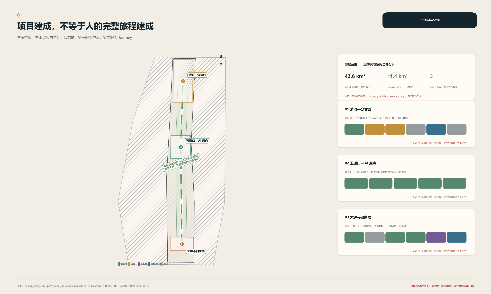
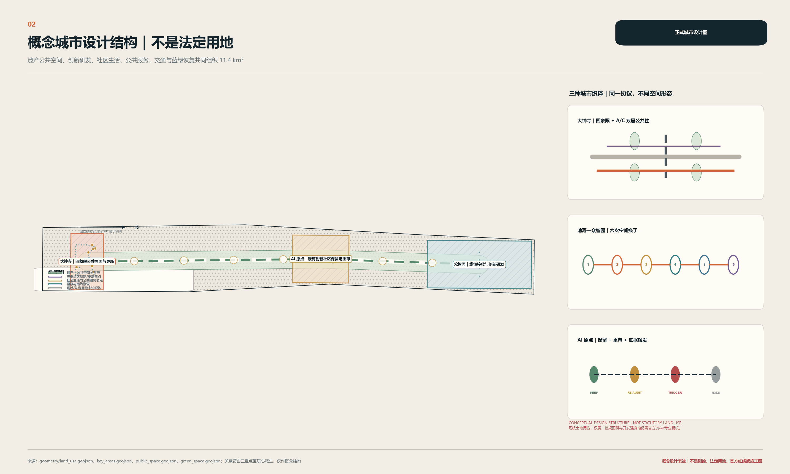
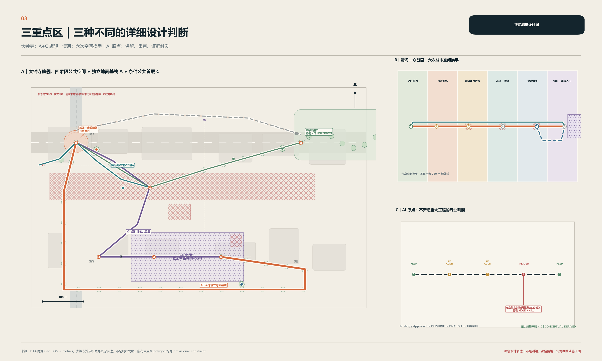
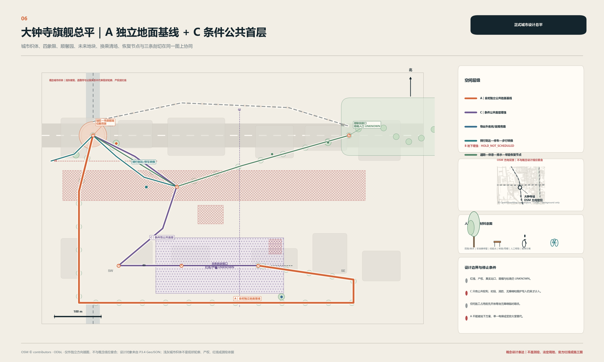
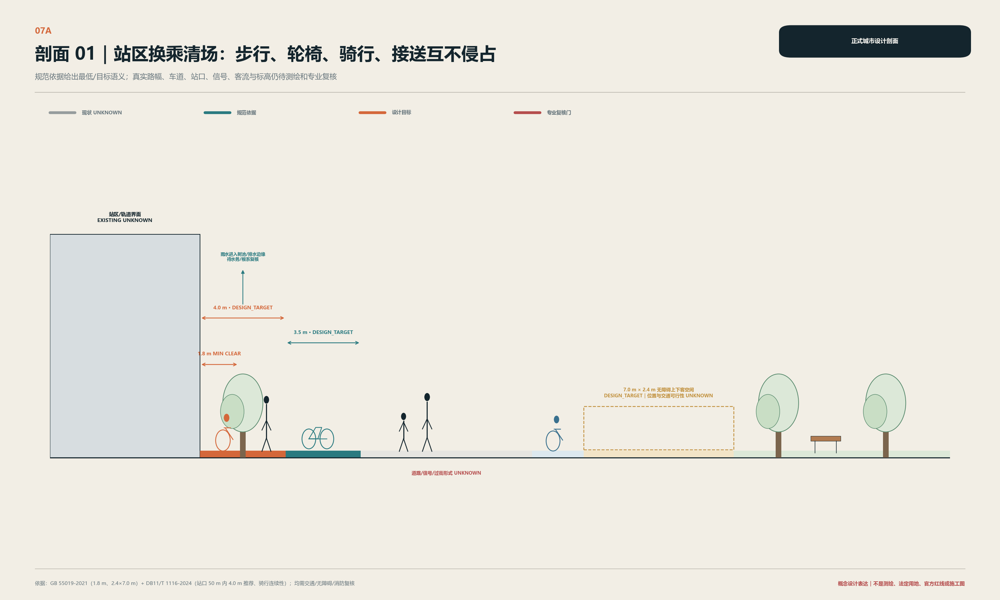
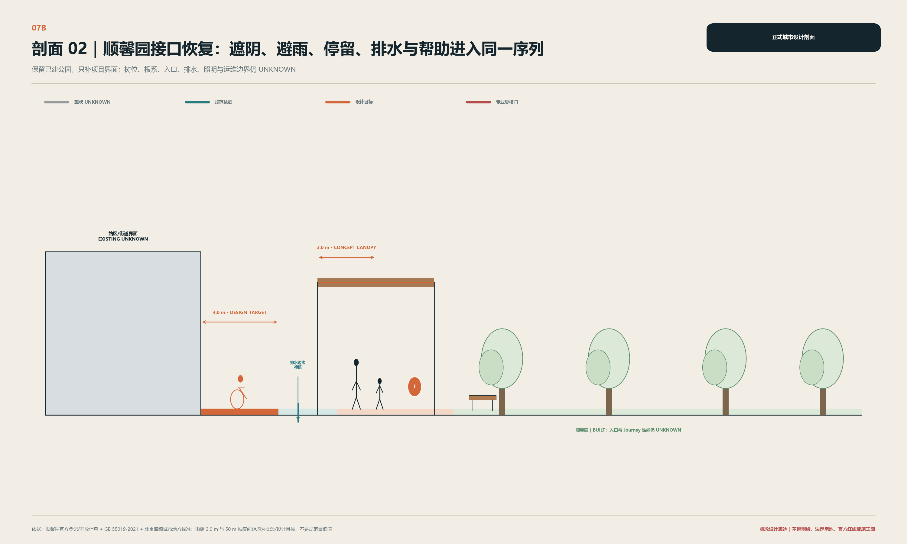
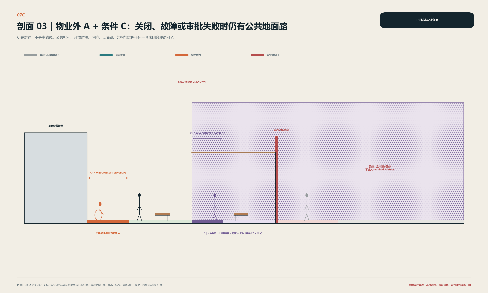
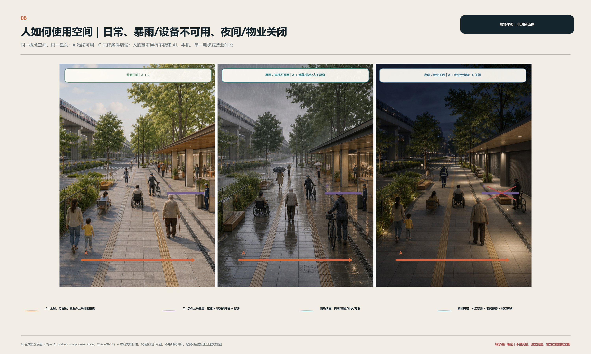
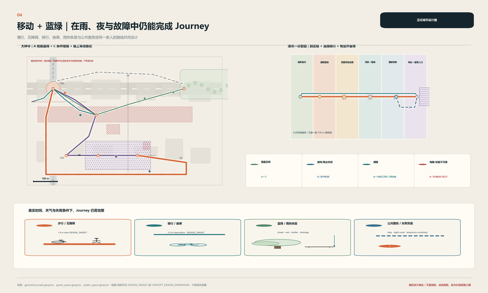
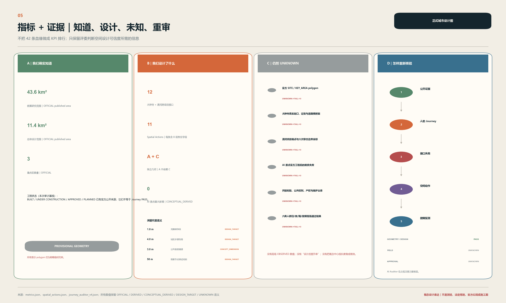

# 跨项目完整旅程共同交付

> **项目完成，不等于旅程完成。** 京张沿线的站点、道路、公园和更新地块可以分别建成，但人的日常 Journey 会跨越它们的红线、工期和运营边界。本案把人的完整 Journey 设为共同交付单元：站点、道路、公园和地块只有在任一目标人群、关键时段与故障情景下均存在端到端可用路径，或有合规的等价替代，才算共同完成。[source:PACKAGE-EVIDENCE-LEDGER] [depth:overall_spatial_structure]

这个判断来自三种不同证据。大钟寺呈现“已建站点—道路—公园、已批地块、规划衔接”的复杂交付链；清河的官方证据推翻了“站内不能东西穿越”的早期假设，设计对象因而转向站区工程端点之外；AI 原点周边已有获批公共空间工程，所以在新的剩余失败被证实前不新增重大干预。[source:DZS-IMPLEMENTATION-PLAN] [source:QH-CITY-CORRIDOR] [source:WDK-SEVEN-NODE-APPROVAL]

空间回答也在首页明确：**A 是不依赖物业开放、电梯或数字服务的全时地面公共基线；C 是只在公共权利、消防、无障碍和维护条件被锁定后才成立的公共首层增强。** C 关闭时回到 A；地下 B 不定线、不排期。[data:geometry/roads.geojson#ROAD-DZS-GROUND-BASELINE-01] [metric:dazhongsi_independent_public_route_count]

| 证据语义 | 正文使用方式 |
| --- | --- |
| OFFICIAL | 官方任务、法规、项目或资产状态；不外推现场性能 |
| OBSERVED | 现场观察；本次没有新增可声明的结果 |
| DERIVED | 可从已登记数据复算的结果 |
| CONCEPTUAL_DERIVED | 从 provisional 边界和概念几何派生，不是现状或法定指标 |
| DESIGN_TARGET | 待测绘、交通、无障碍等专业复核的设计目标 |
| SCENARIO_SIMULATION | 对设计条件的压力测试，不是建成绩效 |
| UNKNOWN | 尚未被现场、竣工或专业证据证明；不得写成 0、PASS 或 FAIL |

## 设计依据与资料清单

本方案以征集公告、面向智能体任务书、仓库当前 Skill 与 site package 为项目要求依据；以包内 40 余条已登记来源、概念 GeoJSON、指标和 Evidence Ledger 为可复核层。核心事实优先回到官方原页；二次处理包只做导航，不独立支撑空间或合规结论。[source:OFFICIAL-ANNOUNCEMENT] [source:AGENT-TASKBOOK] [standard:PROJECT-OFFICIAL-ANNOUNCEMENT]

当前仓库仍未提供 official `SITE_BOUNDARY` 和三处 official `KEY_AREA` polygon。图中虚线为组织者仓库提供的临时粗略约束，只用于概念设计、复算和讨论，不是法定红线、权属、审批或精确面积依据。官方 polygon 出现后，须统一重建 geometry、metrics、figures 和 claim mapping，不能只换一张底图。[source:BOUNDARY-SOURCE] [data:geometry/site_boundary.geojson#PROV-SITE-001] [depth:existing_conditions_diagnosis]

资料的最大缺口是官方精确边界、现状测绘、完整控规、站区及市政竣工图、权属/公共开放时段、现场六人群走测、排水与管线能力、文保控制边界。因此正文回答“为什么这样设计、空间在哪里、证据是什么、还不知道什么”，而不把缺资料包装成精确规划。[source:SOURCE-REGISTRY] [depth:risk_missing_data]

## 三层范围工作框架

三层范围不是三套重复规划，而是从战略网络到控规级城市设计、再到关键接口详细设计的证据精度梯度。[depth:three_level_scope_framework] [source:OFFICIAL-ANNOUNCEMENT]

| 层级 | 正文回答 | 空间交付 | 明确不做 |
| --- | --- | --- | --- |
| 43.6 km² 协同研究 | 从站点、遗产公共空间、科研/产业目的地中识别跨项目 Journey 与接口类型 | 协同骨架、产业—人才—居民关系、三区两翼连接 | 不伪造 43.6 km² 的精细用地和建筑设计 |
| 约 11.4 km² 总体设计 | 完整 Journey 成为共同交付对象后，更新、交通、蓝绿和公共服务如何同图协同 | 概念用地结构、公共地面网、项目边缘和分期门 | 不把概念用地当 statutory land use |
| 三重点区 | 不同工程状态如何导出不同的专业介入 | 大钟寺 A+C、清河六次换手、AI 原点保留重审 | 不把三区复制成“一轴三核” |

三层共用一个检验问题：当站点、市政、公园、开发地块和物业的项目边界先后发生时，普通成年人、轮椅使用者、老人/慢行者、亲子、骑行者和夜班劳动者是否仍能完整到达。这一问题连接了区域战略与首层界面，但不用平均改善抵消某一人群的不可达。[source:BARRIER-FREE-LAW] [depth:three_key_area_detailed_design]

## 统筹研究范围产业与未来城市研究

43.6 km² 层面不画一张伪精确大总平，而是把京张铁路遗产与公共空间骨架、轨道节点、高校科研、初创/成长企业、社区生活和公共采用场景组织为可被逐段审核的网络。区域级识别的不是“AI 地标密度”，而是站场端点、道路横断、公园/水边、地块首层、物业门槛和施工临时线等接口类型。[source:AGENT-TASKBOOK] [depth:overall_spatial_structure]

任务书的官方定位与本案空间响应分列，不用本案术语改写官方原词：[standard:PROJECT-AGENT-OPEN-CALL-TASKBOOK] [depth:three_level_scope_framework]

| 官方层级 | 官方原词 | 本案已有空间响应 |
| --- | --- | --- |
| 三大定位 | 百年京张文化带 | 遗产可读、日常可达与持续维护 |
| 三大定位 | 都市AI生活体验带 | 不需账号即可使用的公共地面、服务和人工帮助 |
| 三大定位 | AI融合创新带 | 研发、受控验证、公共采用与反馈的近距离关系 |
| 五大功能 | AI全栈自主创新体系 | 众智园的授权共创、测试和运维前场 |
| 五大功能 | 世界级AI创新生态 | AI原点的开源/人才交流与两翼概念支撑 |
| 五大功能 | AI+场景赋能新范式 | 授权测试、公共体验与建成后 re-audit |
| 五大功能 | 智能化AI活力城市 | 全时公共地面、六人群和日常公共服务 |
| 五大功能 | AI治理全球话语权 | 证据等级、人工复核、隐私边界与 STOP 条件的可读表达 |

| 官方空间 | 官方职能 | 本案空间判断（与官方职能分列） |
| --- | --- | --- |
| AI原点社区 | 世界级AI创新生态 | 保留已有/已批工程，交付后重审，无证据不大改 |
| 众智园AI自主创新加速区 | AI全栈自主创新体系与AI治理全球话语权 | 从清河站区工程端点继续六次空间换手，对接受控验证 |
| 大钟寺AI产业集聚区 | 智能原生新业态 | 以 A 公共地面为基线，C 公共首层承载条件性公共采用/展示和消费商务接口 |
| 中关村科技服务翼 | 要素全球化配置、中关村IP与资本赋能 | 为人才/开发者/企业转化提供概念服务接口，不是第四处重点详细设计 |
| 小月河场景赋能翼 | AI场景赋能与智能化AI活力城市 | 为受控验证、公共体验与反馈提供概念场景接口，不是第五处重点详细设计 |

上表是任务书官方结构的显性响应；本案“大钟寺深化 / 清河六次换手 / AI 原点保留并重审”只是基于工程状态的专业介入差异，不替代三区两翼的官方名称和职能。

北京市加快智能体引领发展的措施只作为产业与政策语境：它支持真实业务场景、全端边云协同、开源生态与安全验证，但不证明任何京张项目已获资金、采购、机构承诺或部署批准。因此 FDE、OPC、开源社区与安全测试被写成可供后续专业团队选择的运营场景，不写成已确定招商名单。[source:BEIJING-AGENT-MEASURES] [source:PACKAGE-EVIDENCE-LEDGER]

## 总体设计范围城市更新与控规深度城市设计

约 11.4 km² 总体设计形成“遗产—公共空间关系骨架 + 轨道到达门 + 跨项目公共地面网 + 条件性地块公共边缘”。更新不以大拆大建统一空间，而是首先保留已建且有公共价值的站点、道路、公园与建筑，再对站口清场、横断连续、公园入口、开发地块首层和施工围挡的交接处设定空间性能门。[standard:MOHURD-URBAN-DESIGN-MEASURES] [data:geometry/land_use.geojson#LU-CONCEPT-FOCUS-001] [depth:overall_spatial_structure]

图中 land-use structure 是 **CONCEPTUAL DESIGN STRUCTURE**：用于说明公共通行、创新服务、混合活力和蓝绿恢复的关系，不替代现行控规、国土空间用地分类、容积率、高度、建筑面积、道路红线或拆迁结论。当正式用地和控规条件到位时，概念多边形必须重分类、重叠检查并重算指标。[standard:MNR-LAND-USE-CLASSIFICATION-GUIDE] [metric:concept_land_use_coverage_ratio]

交通与公共空间的主线是“公共地面先交付”：轨道与公交到达口先清除骑停、接送、配送与消防/应急对无障碍净线的挤占；骑行在地块前缘完成骑—步转换；蓝绿空间承担遮阴、休息、避雨、排水、导向与非消费停留；厕所、饮水、座椅和人工帮助的实际位置/时段仍为 UNKNOWN，正文只设 DESIGN_TARGET 与设施接口。[standard:BEIJING-ROAD-SPACE-DB11] [depth:traffic_rail_slow_parking]

总体分期不由一张远景图倒推施工：Phase 0 取得边界、测绘、现场和专业证据；Phase 1 先交付独立地面连续；Phase 2 同步市政、公园、蓝绿和站区接口；Phase 3 只在未来地块权利与审批条件成立后加入公共首层与建筑入口。地下 B 为 `HOLD_NOT_SCHEDULED`。[data:geometry/phasing.geojson#PHASE-0-SURVEY-GATES-01] [depth:phasing_implementation]

## 重点区域详细设计

### 大钟寺：四象限公共空间的 A+C 旗舰

大钟寺的证据链是“大钟寺站 BUILT — 大钟寺南街 BUILT — 顺馨园 BUILT — HD00-1603-01/03A 地块 APPROVED — 站地块竖向/共享层衔接 PLANNED — 精确位置、公共权利与运营 UNKNOWN”。这条链能证明一次到达依赖多个项目和时序，却不能证明现状某个过街或无障碍路已经失败。[source:DZS-PARK-OPENING] [source:DZS-SOUTH-STREET] [source:DZS-LAND-CONFIRMATION]

**A 地面公共基线**以物业控制外的全时、无台阶公共线连接站口、市政前场、四象限、顺馨园边缘和未来地块外缘。站口前场在同一横断上分开轮椅/步行净线、骑行到达与停放、公交候车、出租/网约上下客、配送和消防/应急通道。其净宽、转弯轨迹、信号和站口位置都必须由测绘、客流和交通专业复核。[data:geometry/public_space.geojson#PUB-DZS-DESIGN-ENVELOPE-01] [metric:public_ground_route_width_target_m]

**C 条件性公共首层**在未来地块设置遮蔽通行、非消费停留、可见人工帮助、骑停转换和建筑入口平台，但它不穿越受控大堂，不依赖营业或单一电梯。只有正式红线、建筑/消防/疏散/无障碍审查、有约束力的公共通行时段和维护接收同时成立时，C 才纳入必经 Journey；否则它是可删除的增强。[data:geometry/buildings.geojson#BLDG-DZS-FUTURE-ENVELOPE-01] [metric:shared_public_passage_width_target_m]

**B 地下/竖向增强继续 HOLD。** 规划实施要求只支持“需研究衔接”，不支持本案固定桥、隧、电梯、坡道或地下线位。轨道安全、管线、结构、消防疏散、无障碍、产权、开放时段和维护任一门未通过，就不排期；即使通过也不得削弱 A。[source:DZS-IMPLEMENTATION-PLAN] [metric:vertical_link_professional_feasibility]

六个关键接口从站内/站口、站前市政地、四象限横断、顺馨园入口、未来地块公共边缘到共享首层/竖向层。四象限不靠一个地标点统一，而由每个象限都可以独立进入 A，且骑行、步行、休息和公共服务在转换节点发生。顺馨园不重做一个新公园，只在树根、排水和维护容许时恢复入口净线、休息/遮阴、帮助与文化停留。[metric:dazhongsi_interface_count] [data:geometry/green_space.geojson#GREEN-DZS-RECOVERY-01]

三个断面分别把换乘冲突、公园恢复和公共/私有门槛放到前景。高温、暴雨、夜间、物业关闭、电梯故障与施工都是 Journey stress test：暴雨/电梯不可用时依靠 A 及树荫、雨棚、排水/防滑、座椅和人工帮助；夜间/物业关闭时 C 退出，使用物业外、低眩光且可见求助的 A；施工只有在等价临时路已完成检查与维护交接后才能占用原路。[metric:dazhongsi_failure_scenarios_tested_count] [depth:three_key_area_detailed_design]

上图是 AI 生成的**概念体验图，不是现场照片、居民观察或批准效果图**。它只检查一个空间判断：删掉 AI、手机、营业首层或单一电梯后，人仍能使用城市。[source:PACKAGE-EVIDENCE-LEDGER] [standard:BARRIER-FREE-ENVIRONMENT-LAW]

### 清河—众智园：六次空间换手

清河站 B1 城市通廊和周边地下慢行系统有官方建成证据，所以本案正式撤回“站内东西不能穿越”的早期假设。剩余研究从站区工程端点向外展开；这是证据可以纠正设计、而非设计只选支持自己的证据。[source:QH-CITY-CORRIDOR] [source:QH-SLOW-SYSTEM]

| 空间换手 | 空间类型变化 | 易丢失的公共性 | 下一项目未交付时 |
| --- | --- | --- | --- |
| 1 站区端点→接收前场 | 轨道运营空间→站前公共地 | 无障碍线、导向、临时路 | 不把站口当 Journey 终点 |
| 2 接收前场→在建场景工程边 | 已运营→施工组织 | 骑步转换、围挡连续 | 先交付并检查等价临时路 |
| 3 工程边→市政空间 | 项目红线→道路/广场 | 竖向高差、照明、接收责任 | 不以“已完成本项目”替代外部可用 |
| 4 市政→蓝绿空间 | 硬质交通→河道/公园边 | 防洪、排水、水边安全、休息 | 边界与水文未核前不固定几何 |
| 5 蓝绿→更新组团 | 公共资产→谋划中开发 | 开放时序、入口位置、连续骑行 | 保留现有公共线，不等待未来地块 |
| 6 更新组团→物业/建筑入口 | 公共边缘→受控门槛 | 公共权利、夜间时段、人工帮助 | 保留物业外 after-hours fallback |

在建场景项目的精确竣工端点、市政/河道/公园边界、众智园实施边界、目的地入口和物业时段仍为 UNKNOWN。因此清河能证明“项目端点之后还需要接住”的交付结构，不能证明现状外部 Journey 已经失败。[source:QH-SCENE-PROGRESS] [source:ZZY-UPDATE] [metric:qinghe_interface_count]

### AI 原点：保留、重审与最小补丁

AI 原点是“不大改”也需要证据的详细设计区。五道口七节点公共空间工程已获批，已覆盖部分拆围栏、步骑和停车问题；本案不把官方工程重新命名为自己的原创。当前工程建设/交付状态、与直接 OD 的精确重合、现状无障碍/夜间/雨热表现和物业门槛仍为 UNKNOWN。[source:WDK-SEVEN-NODE-APPROVAL] [source:AIO-DIRECTIONS]

空间动作顺序是 `Existing/Approved → PRESERVE → RE-AUDIT → TRIGGER` 。先保留官方项目和现有公共路径，在交付后用六人群、夜间、降雨和门槛条件复核；只有真实剩余失败被证实时，才能在成府路公共地—AI 原点物业门槛之间测试可移除的最小补丁。没有确证、重复已批工程、未取得物业/专业/维护同意任一情况都保持 HOLD/KILL。[metric:ai_origin_major_intervention_count] [data:geometry/constraints.geojson#CON-AIO-OPTIONAL-PATCH-HOLD-01]

## AI 创新生态、人才画像与 AI+ 场景

六个国际案例只用来比较“需求—空间—用户—运营”机制，不用企业、投资额或规模数字为京张背书：

| 官方案例 | 可迁移空间机制 | 京张的克制转译 |
| --- | --- | --- |
| 新加坡 one-north | 科研、企业、教育、生活与绿地连接 | 用公共 Journey 连接三区两翼，不复制其规模 [source:CASE-ONE-NORTH] |
| 新加坡 Punggol Digital District | 大学、产业、社区设施与真实测试相邻 | 众智园只开放经授权的测试空间，不把居民当默认实验对象 [source:CASE-PUNGGOL] |
| 赫尔辛基 Maria 01 | 存量医院分步转化为初创、投资与活动共享场所 | 优先改造已有建筑和公共首层，不为创新形象先拆除 [source:CASE-MARIA01] |
| 巴黎 STATION F | 稠密孵化项目、服务与活动共址 | 在建筑首层分清公共通行、非消费停留与受控工作区 [source:CASE-STATIONF] |
| 多伦多 MaRS | 研究实验室、初创、大企业与公共使命相连 | 在大钟寺设公共采用/展示接口，但不让展示挤出日常服务 [source:CASE-MARS] |
| 柏林 Adlershof | 科研机构、高技术企业、初创服务与长期运营者协同 | 把专业设施审查、运维与人才培养放在同一实施链 [source:CASE-ADLERSHOF] |

人才与用户画像不作社会评分：社区居民/通勤者需要不依赖 AI 的公共基线；初创团队/一人公司需要低门槛工位、测试及服务窗口；FDE/现场部署工程师需要可隔离测试、运维和事故复盘空间；科研者/学生需要开源协作和原型连接；公共资产运维者需要可达的检修、人工接管和交接记录；国际访客/开发者需要双语导向、短期共创和不依赖商业平台的访问路径。[source:AGENT-TASKBOOK] [depth:three_level_scope_framework]

### 区域创新协同接口（概念响应，非合作事实）

以下只定义可供后续沟通的能力/资源类型与京张空间接口，不证明已合作、已签约、已确定项目、已获得资源或政府支持。[standard:PROJECT-AGENT-OPEN-CALL-TASKBOOK]

| 区域对象 | 可交换的能力/资源类型（待确认） | 与京张的概念空间/场景关系 | 当前状态 |
| --- | --- | --- | --- |
| 北纬社区 | 社区共创、居民体验反馈类型 | AI原点公共交流与建成后 Journey 重审 | CONCEPTUAL COLLABORATION INTERFACE / NOT CONFIRMED PARTNERSHIP |
| 未来科学城 | 前沿研究、实验平台、专业人才类型 | 众智园授权共创/受控验证与科技服务翼 | CONCEPTUAL COLLABORATION INTERFACE / NOT CONFIRMED PARTNERSHIP |
| 怀柔科学城 | 科学设施、科研验证、科普转译类型 | 众智园验证空间与小月河公共体验接口 | CONCEPTUAL COLLABORATION INTERFACE / NOT CONFIRMED PARTNERSHIP |
| 经开区 | 先进制造、系统集成、应用测试类型 | 众智园受控验证与大钟寺公共采用/展示接口 | CONCEPTUAL COLLABORATION INTERFACE / NOT CONFIRMED PARTNERSHIP |
| 京津冀 | 区域人才、企业、用户与站城到达类型 | 轨道到达门、双语公共 Journey 与年度公共采用交流 | CONCEPTUAL COLLABORATION INTERFACE / NOT CONFIRMED PARTNERSHIP |

### 人才、开发者与企业的空间化转化路径

该路径状态统一为 **DESIGN / OPERATION CONCEPT — NOT A CONFIRMED PROGRAM**，只把已有三区两翼内容排成可退出的空间序列：

| 阶段 | 主要空间映射 | 作用与退出门 |
| --- | --- | --- |
| 参与 | AI原点公共交流节点 + 中关村科技服务翼 | 公开了解问题、找到服务和双语人工入口；不以注册或招商作为前提 |
| 共创 | AI原点 + 众智园 + 科技服务翼 | 将真实公共问题转为可人工复核的原型；无清权数据或责任角色则退回 |
| 受控验证 | 众智园 + 小月河场景赋能翼 | 只在授权空间内做技术、安全、运维和人工接管测试；门未通过则停止 |
| 公共采用/展示 | 大钟寺 A 公共地面 + 条件性 C 公共首层 + 场景赋能翼 | 日常服务优先，仅展示已通过相应安全、公共性和维护门的内容 |
| 反馈、深化或退出 | 三区重审 + 两翼支撑 | 用六人群 Journey 与运维证据决定返回共创、专业深化或退出；不把参与写成招引成果 |

本案只有一个 AI 工具：**跨项目完整旅程审计器**。它只做“证据读取 → Journey 建模 → 接口识别 → 方案比较 → 故障测试 → re-audit”；不自动选址、不自动审批、不给人评分，默认不采集人脸、设备 ID 或个人轨迹。删掉工具后，A、C、六次换手和最小干预仍然可以被建设和维护。[source:PIPL] [source:DATA-SECURITY-LAW]

审计器的算力不是新建基础设施，也不是任何空间动作的建设前提。只有在证据整理、路径拓扑比对或故障情景测试等明确任务发生时，获授权的执行角色才可按任务调用依法可用的公共、科研或企业外部计算资源渠道；本案不主张容量、设备、供应商或预算。任务结束即释放资源；算力不能替代人工判断、专业审查、审批或 FIELD evidence，也不能让资源提供者、使用者或被测试对象取得额外公共通行、空间占用或数据权利。[source:AGENT-TASKBOOK] [standard:DATA-SECURITY-LAW]

| 场景卡 | 主要空间/用户 | AI 作用 | 当前状态 |
| --- | --- | --- | --- |
| S01 跨项目 Journey 审计 | 大钟寺站—街—园—地块；六人群 | 排序证据和接口 | GEOMETRY_DESIGN_PASS；FIELD UNKNOWN |
| S02 无障碍重审 | 全程无台阶线；轮椅/助行者 | 以最弱可用性守门 | VALIDATION / NOT_RUN |
| S03 夜间 Journey | 物业外备用路；夜班劳动者 | 检查时段、照明与人工帮助 | VALIDATION / NOT_RUN |
| S04 暴雨 Journey | 遮蔽、防滑、排水和恢复节点 | 故障条件组合 | VALIDATION / NOT_RUN |
| S05 电梯故障 | 地面 A 与竖向增强；轮椅/老人/亲子 | 检查是否有独立等价路 | DESIGN_PASS；FIELD UNKNOWN |
| S06 施工绕行 | 临时无障碍路；全人群 | 检查先交付后占用 | NOT_RUN / NOT_AUTHORIZED |
| S07 公共服务缺口 | 厕所、饮水、座椅、遮阴、帮助 | 指出需要现场补证的节点 | NOT_RUN |
| S08 项目接口交付 | 清河六次空间换手；建设/接收角色 | 对照竣工端点与下一公共线 | INDUSTRY TEST / NOT_RUN / NOT_AUTHORIZED |
| S09 A/C 比选 | 大钟寺地面与首层 | 对比公共性、故障与审批依赖 | DESIGN_PASS |
| S10 建成后 re-audit | 三重点区；六人群 | 用同一模型重审 | NOT_RUN / NOT_AUTHORIZED |
| S11 FDE 共创测试 | 众智园授权测试室/运维前场 | 组织故障、版本与人工接管证据 | INDUSTRY TEST / NOT_AUTHORIZED |
| S12 OPC/创业服务 Journey | AI 原点开源交流节点；一人公司/初创者 | 检查场地—服务—人工窗口连续 | INDUSTRY TEST / NOT_RUN |

三项可直接识别的 AI 产业测试验证场景是既有 S08、S11、S12，均只使用同一个 Journey Auditor。S08 的输入是经授权的竣工端点、交接边界和六接口证据，测试对象是从站区工程端点到市政、蓝绿、公园、园区阈值和建筑入口的连续交付，空间载体就是清河 Arrival Chain；缺少可核验输入、下一公共线、临时无障碍路或维护接收角色时立即停止，不输出现场/审批 PASS，由建设与接收角色提供人工接管和等价临时路线，并在联合验收及六类人群建成后复核中重审。三项均不依赖个人敏感数据，也不代表已经获准或现场运行。[source:AGENT-TASKBOOK] [source:PACKAGE-EVIDENCE-LEDGER] [standard:PIPL]

任务书要求的三个“朝圣地标”被转译为三个有日常价值的公共节点：众智园是开放研发/共创/安全验证节点；AI 原点是开源与人才交流节点；大钟寺是公共采用、城市展示与日常服务节点。三者都必须先提供可达、非消费停留、双语导向、人工帮助与可更新的贡献/荣誉展示；不建巨型 AI 雕塑、发光塔或机器人纪念物。[standard:PROJECT-AGENT-OPEN-CALL-TASKBOOK] [depth:three_key_area_detailed_design]

京张遗址公园 AI 公共空间不靠新增数字装置成立：东西缝合落在站口—道路—公园—地块的横向换手，南北贯通落在遗产公共空间骨架与轨道到达门的连续。公共空间组件库只归纳已有设计动作：连续净线、骑—步转换、遮阴/避雨与座椅、排水/防滑、低眩光导向、可见人工帮助；它不是新设备采购清单。大钟寺的智能原生消费与商务场景只位于条件性 C 和公共采用/展示接口，不得使 A 变成付费、登录或营业时段才可通过的路。

## 用地、建筑规模与拆改留方案

用地层只表达概念城市设计结构，建筑层只表达两类设计包络：大钟寺未来地块中用于检验公共首层与外部备用路关系的概念建筑包络，以及清河更新组团中用于检验物业门槛与建筑入口的目的地包络。它们不是现状建筑轮廓、建筑方案或批准建筑面积。[data:geometry/buildings.geojson#BLDG-DZS-FUTURE-ENVELOPE-01] [depth:land_use_layout]

| 分类 | 本阶段空间判断 | 证据等级/停止条件 |
| --- | --- | --- |
| 保留 | 已建站点、道路、顺馨园、AI 原点已批工程及仍可用的公共线 | 官方状态可支持；现场安全或专业证据更新时重审 |
| 改造 | 站前换乘冲突、公园入口恢复、公共首层、夜间外绕和服务节点 | DESIGN_TARGET；不得损害树木、排水、消防、无障碍或现有公共路 |
| 潜在更新 | 只在已批/规划地块中设计公共边缘与接口条件 | 精确红线、权属、控规和建筑专业未到位前不定体量 |
| 拆除/新建 | 本阶段不对任何具体建筑作拆除结论；不新建巨型地标 | 无测绘、鉴定、权属、文保和审批证据，禁止做决定 |

现阶段 FAR、高度、建筑密度、总建筑面积、退线、停车配比和拆迁量全部为 UNKNOWN。形态原则只要求：首层公共线可见、不穿越门禁大堂；物业外备用路连续；站口、公园和文化停留的视线不被巨大设备/广告占据；服务、检修、配送和消防不占无障碍净线。[standard:MOHURD-CONTROL-DETAILED-PLANNING] [depth:development_intensity_controls]

## 交通、轨道、市政与公共服务设施

步行与无障碍以 A 为连续净线；骑行在站前和地块入口前完成骑—步转换，不把停车推入人行净线；轨道与公交只在已知站点/运营边界上设到达门，不新判定轨道结构或出入口；出租/网约、配送和消防/应急在站前横断中与步行分区并经转弯轨迹和运营复核。没有客流、车流和道路等级数据，不作容量预测。[standard:BEIJING-ROAD-SPACE-DB11] [source:METRO-OPS-RULE]

市政采用“接口预留 + 专业深化门”：雨水口、浅凹绿地、树池、雨棚、照明、帮助点、建筑设备与管线不得占用无障碍净线或阻断消防；精确标高、排水能力、管线位置、电力负荷、通信容量均为 UNKNOWN，不在概念图中伪造。[standard:BEIJING-SPONGE-DB11] [depth:municipal_new_infrastructure]

公共服务按 Journey 而非按设施数量布置：在站口换乘区、公园入口、未来地块公共边缘和清河换手点预留可见帮助、座椅、遮阴/避雨、饮水和厕所导向。其现状位置、无障碍性、开放时段、收费与维护仍为 UNKNOWN；图上节点只是 DESIGN_TARGET，待现场走测和接收主体确认。[metric:recovery_interval_design_target_m] [depth:traffic_rail_slow_parking]

## 蓝绿空间、公共空间与城市风貌

蓝绿空间的首要绩效是 Journey 可用，而非一个“绿化率提升”口号。顺馨园入口和清河蓝绿换手点把树荫、休息、避雨、防滑、导向、非消费停留、雨水入渗/溢流与维护通道同图校核。植物、树池、水边和海绵设施不得遮挡视线、缩窄无障碍线或阻断应急。没有水文、土壤、树木和现状绿地基线时，不声称减少径流、降温或提高绿地率。[standard:BEIJING-SPONGE-DB11] [metric:existing_green_space_area_sqm]

文化叙事明确分为三层：京张铁路文化是基础设施、工程历史与日常到达；中关村创新文化是开放协作、原型迭代与知识共享；AI 新文化是可读证据、人工负责和允许退出。三者通过经核实的移动、视线、停留、讲述节点和开源贡献墙进入空间，不被缩减为道岔、路签、信号或轨枕装饰；大钟寺/觉生寺精确文保边界为 UNKNOWN，未取得时不画精确控制线。[source:CULTURAL-RELICS-LAW] [depth:height_massing_character]

导视/标识/符号方向只使用本案已有的中英双语站点名、A/C/HOLD/UNKNOWN 状态、低眩光地面导向和可核实的遗产解说，不仿制铁路或企业 Logo。国际传播叙事保持一句可复核的主张：项目完成，不等于人的完整旅程完成；不把未批准设想写成城市成就。

整体视觉识别保持为工作方向：温暖纸色表示日常公共底图，石墨色表示专业约束，陶橙色表示全时地面 A，紫色表示条件性 C，绿色表示恢复节点，点划/网纹表示 UNKNOWN 或 provisional。Logo 不引入新的总概念；贡献/荣誉展示以可更新的开源记录墙进入三个公共节点，不使用未授权的企业标识、人物肖像或论文图像。[standard:PROJECT-AGENT-OPEN-CALL-TASKBOOK] [depth:blue_green_public_space]

## 更新项目清单、实施政策与分期计划

实施单元是空间动作，不是新设一个治理平台。每个动作在机器清单中均有 `interface_from / interface_to / beneficiary / responsible_role / evidence / approval_dependency / maintenance_owner / stop_condition`；正文只保留能帮助建设决策的要素。责任主体尚未被书面确认时只写 role，不写某部门或某企业已经接受义务。[source:PACKAGE-EVIDENCE-LEDGER] [depth:renewal_project_list]

| 空间动作 | 前置条件 | 责任/维护角色 | 停止条件 | 成本等级* |
| --- | --- | --- | --- | --- |
| 大钟寺 A 地面基线与站前清场 | 测绘、交通/轨道/无障碍/应急复核 | 市政公共地交付角色 + 轨道运营角色；按资产边界维护 | 不能安全保留连续净线 | MEDIUM |
| 顺馨园入口/恢复节点 | 树木、排水、照明、无障碍与资产同意 | 公园维护角色 + 市政交界角色 | 伤树、阻水、缩窄净线或无维护接收 | LOW–MEDIUM |
| 未来地块 C 公共首层 | 法定边界、建筑/消防/无障碍、公共权利/时段协议 | 未来开发/物业角色 + 外部公共地维护角色 | 依赖营业、单一电梯或受控大堂 | HIGH |
| 清河六次换手 | 竣工图、交接边界、水务/市政/物业复核 | 施工与接收的公共资产角色按边界交接 | 下一公共线、临时路或维护人未确认 | MEDIUM–HIGH |
| AI 原点保留重审/可移除补丁 | 已批工程交付后的真实剩余失败证据 | 现有资产/物业维护角色 | 无剩余失败、重复官方工程或审批/维护门失败 | LOW / HOLD |

\* 成本等级只表示相对实施复杂度，**不是工程概算**。缺工程量、材料、地下条件和市场单价时不给总投资。可能的资金类型包括现有公共资产维修、市政/公园接口工程、更新地块建设条件和施工临时交通组织，均待真实建设与资金主体确认。[source:PACKAGE-EVIDENCE-LEDGER] [depth:renewal_project_list]

| 分期 | 必须交付 | 不得越过的门 |
| --- | --- | --- |
| Phase 0 | 官方边界/控规/竣工图、测绘、六人群现场、交通/轨道/市政/文保/消防/无障碍审查 | 不用概念图替代审批 |
| Phase 1 | 独立、全时、物业外的地面 A 与施工临时连续 | 不等待 C 或 B |
| Phase 2 | 站区清场、市政横断、公园/蓝绿恢复与公共服务接口 | 水务、树木、排水、维护不明时不定型 |
| Phase 3 | 未来地块 C、物业外备用路、建筑入口与人工服务 | 公共权利、消防、无障碍或维护任一失败即退回 A |
| B | HOLD_NOT_SCHEDULED | 不是 Phase 4；专业与公共性门全部通过前不进时序 |

长期运营不以一次大型活动替代日常维护。建议形成“季度公共 Journey 复核—半年度开源/安全验证日—年度京张公共采用论坛”的工作节律，同时保留社区日常、人工服务和资产检修时段。活动品牌/传播沿用本案标题、双语导向和现有视觉状态，不再增一套城市总品牌。开发者社区从公开议题和授权共创进入；AI 场景只在空间、数据、安全、人工接管和维护门通过后开放；公共体验/地标运营必须先保证日常服务；国际传播与招引只指向上述“参与—共创—验证—采用/展示—反馈/深化/退出”路径。这些均为运营建议，不代表政府、企业或机构已承诺。[source:AGENT-TASKBOOK] [depth:phasing_implementation]

## 指标体系、面积复算与合规矩阵

指标不混合事实、派生值和目标。当前可复算的 site area 约 11,412,825 m²，但来自 provisional boundary，只是 CONCEPTUAL_DERIVED；概念绿色恢复包络占临时边界的 0.000415，概念公共空间包络占 0.001671，它们不是现状绿地率、现状公共空间率或法定指标，更不能用来声称“提升”。[metric:site_area_sqm] [metric:green_ratio] [metric:public_space_ratio]

| 指标 | 当前值 | 语义 | 可说/不可说 |
| --- | ---: | --- | --- |
| concept_land_use_coverage_ratio | 1.0 | DERIVED | 只说概念面完整覆盖临时边界；不说法定用地已完成 |
| concept_land_use_overlap_ratio | 0.0 | DERIVED | 只说概念面内部无重叠；不证明权属或现状正确 |
| dazhongsi_interface_count | 6 | DERIVED | 是设计模型中的接口数，不是官方项目数 |
| qinghe_interface_count | 6 | DERIVED | 是六次空间换手，不证明六个物理故障 |
| dazhongsi_independent_public_route_count | 1 | CONCEPTUAL_DERIVED | 只计独立、全时、物业外的 mandatory baseline A；C 是条件增强，B 为 HOLD；不是现状可用路径计数 |
| ai_origin_major_intervention_count | 0 | CONCEPTUAL_DERIVED | 当前设计决定不新增重大干预；不是“问题为 0” |
| FIELD_PASS | UNKNOWN | UNKNOWN | 没有现场结果；不可显示 0%、100%、PASS 或 FAIL |

为设计比选锁定的 1.8 m 无障碍净线、4.0 m 站口人行概念包络、3.5 m 骑行到达预留、2.4 × 7.0 m 无障碍上下客预留、3.0 m 公共首层概念净宽和 50 m 恢复节点测试间距，均为 DESIGN_TARGET 或 CONCEPT_DESIGN_DIMENSION。具体道路等级、地形、人流、消防、建筑和无障碍适用性会使它们被专业团队调整或删除。[metric:accessible_clear_route_width_target_m] [standard:GB55019]

几何重建后拓扑检查 198/198 通过，空间审查只保留三条 provisional key-area 提示；Journey Auditor 对三条 Journey 输出 GEOMETRY_DESIGN_PASS / DESIGN_PASS，但 approval gate 和 field gate 仍为 UNKNOWN。这些结果只证明概念几何与内部条件自洽，不是城市现场、法规符合性或工程可行性通过。[source:PACKAGE-EVIDENCE-LEDGER] [depth:metrics_recalculation]

## 风险、版权与合规说明

主要空间风险是：把 provisional 边界当官方红线；把 APPROVED/PLANNED 写成 BUILT；把概念包络写成现状绿地/公共空间；在无轨道、管线、消防和产权证据时固定地下 B；在无文保边界时画精确控制线；在无现场证据时声称 Journey 失败或通过。这些均以 UNKNOWN、HOLD 和重算/停止条件控制。[source:PACKAGE-EVIDENCE-LEDGER] [depth:risk_missing_data]

本案不作法律结论。后续每个对象应由相应专业人员复核：国土空间/控规与城市更新；道路、公交、轨道运营安全；建筑、结构、消防与无障碍；文物/历史文化；水务、海绵、树木和生态；市政管线与能源；数据安全、个人信息与生成式 AI 适用边界。最弱可用性保护是本案更保守的设计准则，不冒充法律条文或官方验收算法。[standard:BARRIER-FREE-ENVIRONMENT-LAW] [standard:FIRE-LAW] [standard:CULTURAL-RELICS-LAW]

跨项目完整旅程审计器默认只使用公开、非个人或聚合证据。任何实际部署都必须先确定是否处理个人信息、是否对公众提供生成式 AI 服务，并分别完成最小必要性、安全、透明、投诉/人工复核和适用程序判断。基本通行不需安装 App、登录、人脸或轨迹换取。[source:PIPL] [source:DATA-SECURITY-LAW] [source:GENERATIVE-AI-MEASURES]

版权与生成披露为：正文、概念 GeoJSON、程序化图件和离线 HTML 由参赛者/Codex 辅助生成；五张核心图及支撑图为本地代码绘制；大钟寺人视图为 OpenAI 内置图像生成的 presentation_only 概念图，无第三方输入图像；OSM 只出现于大钟寺方向背景并标注 © OpenStreetMap contributors / ODbL，不支撑边界或工程结论；微软雅黑与 Arial 只在本地栅格化，不再分发字体文件。网页不加载 CDN、远程字体、地图瓦片、API、iframe 或外部表单。[source:PACKAGE-EVIDENCE-LEDGER] [depth:risk_missing_data]

本正式包的当前机器状态以 `manifest.json` 与 `self_check.json` 为准：`package_state=ready_for_review`、`self_checked=true`、`readiness_contract=persisted-self-check-v1`、`known_blockers=[]`，并由当前 exact-head 四门自检支持。A0/A3 双语图册与 drawing PDF 已完成正式竞赛版式整合；上述状态不等于维护者已评分、已入选或项目已获批，任何后续文件修改都必须重新刷新 manifest 并持久化自检。[source:SITE-PACKAGE] [depth:risk_missing_data]

## 参考资料

核心项目与场地来源包括：征集公告和智能体任务书；顺馨园登记/开放、大钟寺南街、HD00-1603-01/03A 交易与规划实施要求；清河站城市通廊/慢行系统、站区场景项目进展和众智园更新项目；AI 原点到访信息和五道口七节点批复。所有条目的发布者、URL、日期、许可/复用说明、可证明内容与禁止外推保存在 `sources.json`。[source:OFFICIAL-ANNOUNCEMENT] [source:PACKAGE-EVIDENCE-LEDGER]

专业依据包括《城市设计管理办法》、控制性详细规划编制审批相关规定、国土空间用地分类指南、《无障碍环境建设法》与北京市条例、GB 55019-2021、DB11/T 1116-2024、轨道运营、消防、文物保护、北京海绵城市、个人信息、数据安全和生成式 AI 管理文件。矩阵仅是设计前置风险框架，不替代主管机关、注册专业人员或项目法律意见。[standard:MOHURD-URBAN-DESIGN-MEASURES] [standard:GB55019] [standard:GENERATIVE-AI-INTERIM-MEASURES]
