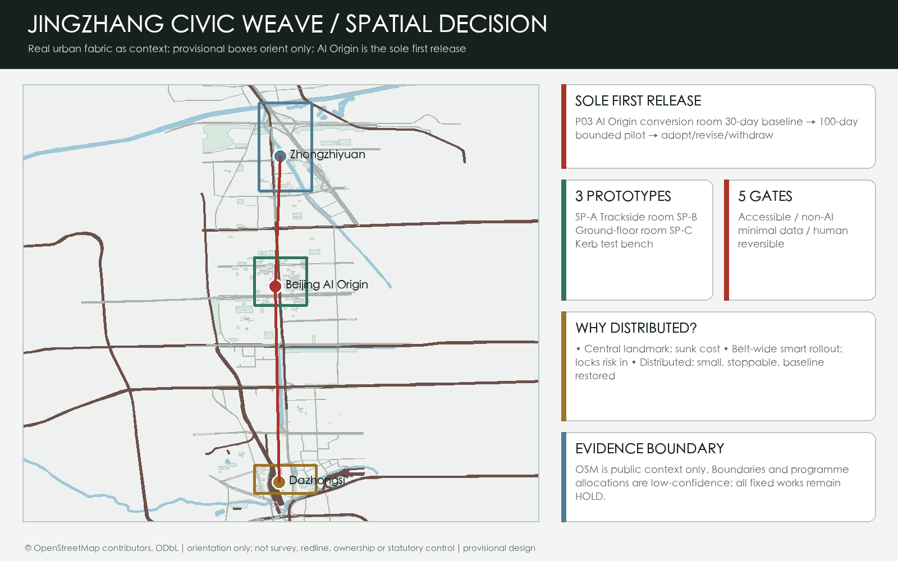
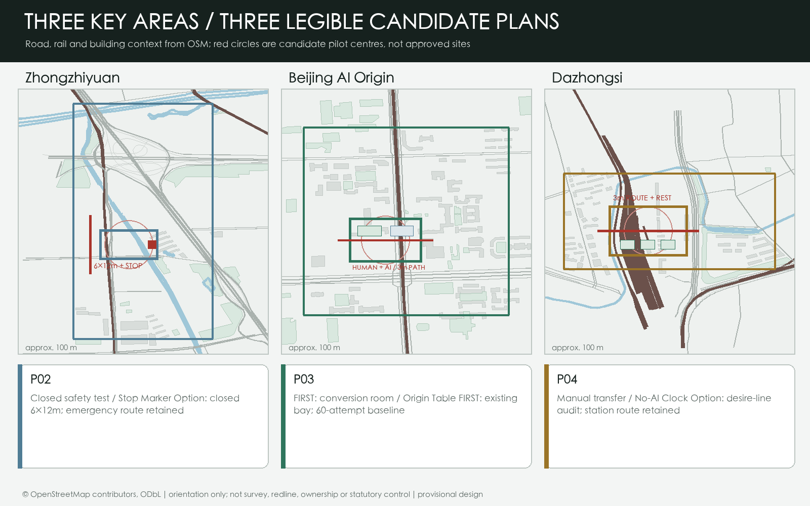
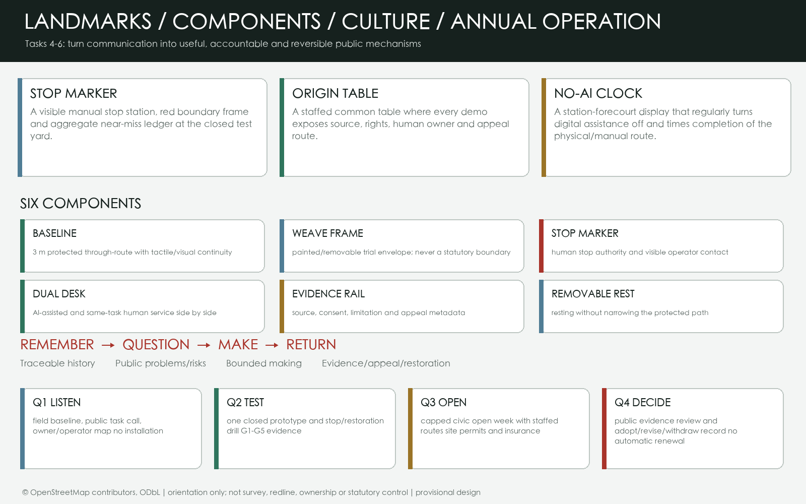
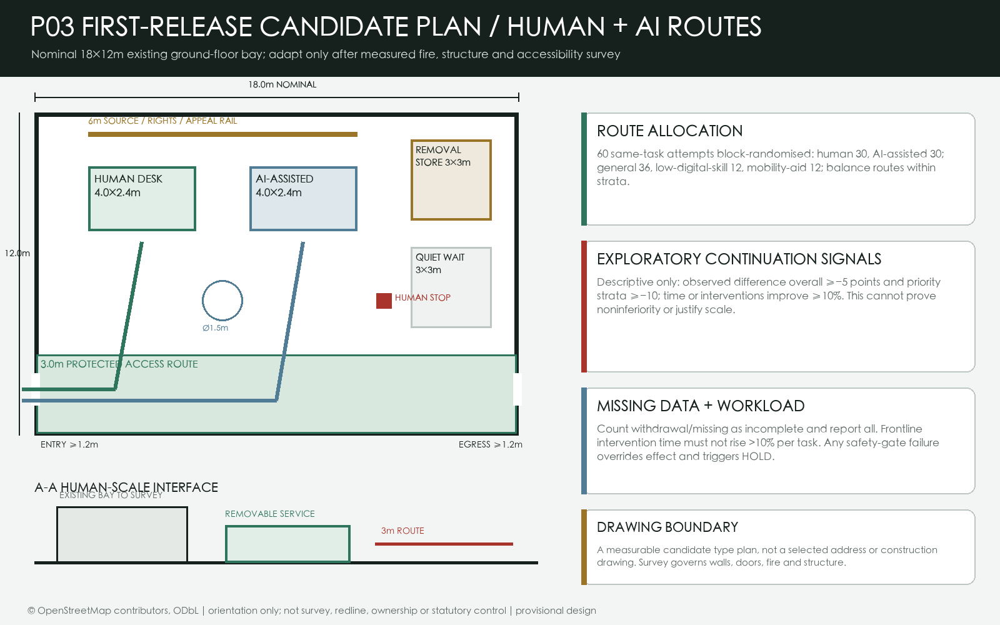
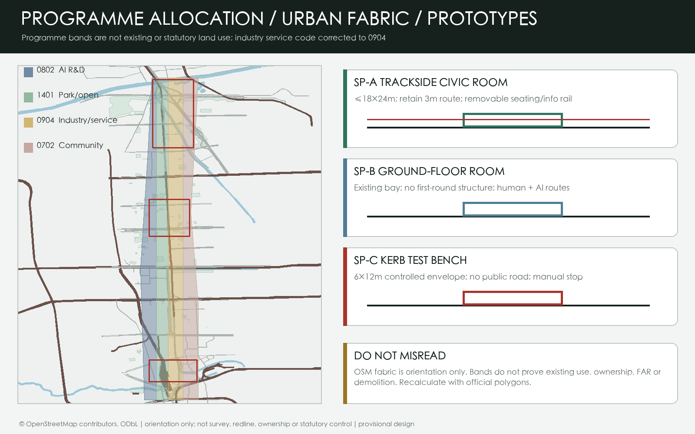
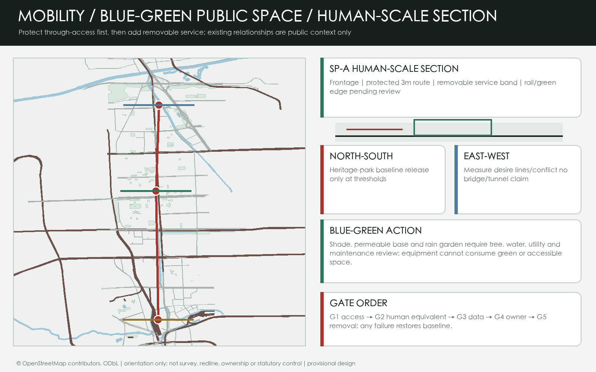
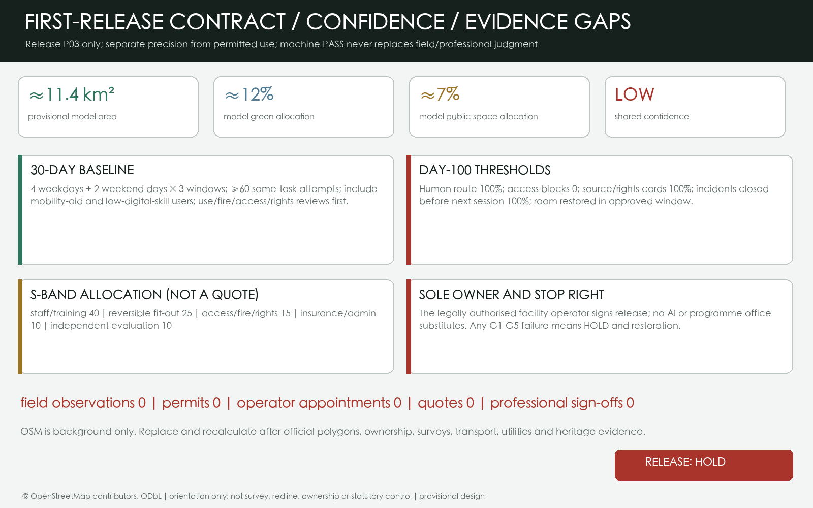

# JINGZHANG CIVIC WEAVE: Reversible, Acceptable AI Urban Pilots

> Package status: `professional_design_package` / `ready_for_review` (provisional-boundary intake; recalculate the complete package when official polygons arrive).

**60-second judgment.** This proposal treats the AI Innovation Belt as a public-space operating contract, not a corridor filled with smart devices. An AI service earns only a time-limited right to use public space after passing five gates: accessible continuity, a non-AI equivalent, data minimization, named human accountability, and reversibility. Its carriers are three reusable human-scale prototypes rather than an expensive landmark: a trackside civic room no larger than 18 m x 24 m, a ground-floor conversion room inside an existing bay, and a controlled kerb test bench no larger than 6 m x 12 m. A 30-day field baseline precedes one bounded 100-day pilot. Failure of any gate restores the original non-AI service. No uncollected survey, permit, operator, quotation, or professional sign-off is represented as complete; release is `HOLD` [source:LOCAL-DELIVERY-CONTRACTS] [depth:risk_missing_data].

## Design Basis and Source List

The official three-level scope, agent taskbook, and repository source register are translated into a readable, reproducible, spatially reviewable package. Official boundaries, regulatory controls, road redlines, ownership, municipal, and heritage attachments are absent from the current site package. `site_boundary.geojson` and `key_areas.geojson` therefore remain maintainer-supplied rough polygons for generation, discussion, and intake self-check only, never official redlines or precise planning controls [source:OFFICIAL-ANNOUNCEMENT] [source:BOUNDARY-SOURCE] [depth:existing_conditions_diagnosis].

The core judgment is that with official boundaries, field evidence, and operators unresolved, scientific urban design should protect daily access and public-service baselines before installing equipment. The Jing-Zhang heritage park supplies a continuous public path; each key area hosts a different bounded pilot; two wings connect campuses, enterprises, neighborhoods, and scenario resources. AI assists defined tasks but never owns final decisions in approval, medicine, law, safety, or spatial operations [standard:PROJECT-AGENT-OPEN-CALL-TASKBOOK] [data:geometry/public_space.geojson#PUBLIC-001].

The evidence hierarchy is GeoJSON, `metrics.json`, the three matrices, manifest/source/assumptions/self-check, then narrative, drawings, and HTML. Sources, generation, rights, and missing conditions are recorded in `sources.json` and `report/copyright_statement.md`.

## Three-Level Scope Framework

The work is organized as "read the belt, weave the whole, test three nodes." The coordinated research area is about 43.6 km2; the overall design area about 11.4 km2; the three key areas total about 368.4 ha. Figures come from the announcement, while polygons remain provisional [source:OFFICIAL-ANNOUNCEMENT] [data:geometry/site_boundary.geojson#SITE-001] [depth:three_level_scope_framework].

| Level | Question | Design move | Evidence |
| --- | --- | --- | --- |
| Coordinated research area | How can the AI value chain coexist with city life? | Campus origin, open collaboration, enterprise translation, public experience, global communication | `agent_taskbook.json`, `compliance_matrix.json` |
| Overall design area | How do renewal, mobility, land use, and public space become spatial? | One belt, three nodes, two wings, two spines, three loops, distributed scenarios | `land_use.geojson`, `roads.geojson`, `phasing.geojson` |
| Three key areas | How do nodes become testable, usable districts? | Full-stack testing, campus-to-street translation, industry and daily life | `key_areas.geojson`, A3/A0 drawings |

## Coordinated Research: Industry and Future City

### Naming and spatial identity

"Jingzhang Civic Weave" is operational, not decorative: first repair public paths severed by traffic, walls, steps, and digital barriers; then place movable services inside removable spatial units; finally use acceptance evidence to retain, revise, or withdraw them. A continuous baseline, three weave frames, and a red stop mark express uninterrupted public access, limited spatial authorization, and an explicit stop right. This is conceptual identity, not an official mark [source:AGENT-TASKBOOK] [depth:overall_spatial_structure].

The Centennial Jing-Zhang Culture Belt supports memory and walking; the Urban AI Life Experience Belt supports everyday public service, learning, work, and social life; the AI Integrated Innovation Belt supports open testing from research to enterprise and algorithm to urban scenario. Research, ecosystem, scenarios, vitality, and governance form the loop. The three nodes are joined by Zhongguancun technology services and Xiaoyuehe scenario empowerment [source:AGENT-TASKBOOK] [standard:PROJECT-AGENT-OPEN-CALL-TASKBOOK].

### Ecosystem mechanisms and global references

Six cases contribute mechanisms, not imported scale, law, or claimed performance: Helsinki AI Register suggests system explanations plus feedback; Seoul AI Hub suggests staged talent, startup, infrastructure, and open-innovation support; Singapore's National AI Strategy supplies cross-agency capacity and trusted-adoption context; Barcelona Innova supplies a challenge, open call, real setting, and experimental-protocol sequence; Mila suggests joint technical, legal, social-science, and policy governance; London LOTI suggests shared local-government capacity, responsible procurement, information governance, and digital inclusion [source:CASE-HELSINKI-AI-REGISTER] [source:CASE-SEOUL-AI-HUB] [source:CASE-BARCELONA-INNOVA].

Together they support one choice: establish shared interfaces for task, space, accountability, data, and exit before buying a finished smart-city system. Singapore, Mila, and LOTI are context only and do not prove transferability; local operators, procurement, law, and spatial conditions require independent professional and authority review [source:CASE-SINGAPORE-SMART-NATION] [source:CASE-MILA-GOVERNANCE] [source:CASE-LONDON-LOTI].

## Overall Design Area: Renewal and Regulatory-Plan-Level Design

The structure is one heritage public-life belt, three key nodes, two service wings, a heritage slow-mobility spine, an east-west campus-enterprise-neighborhood spine, three access/public-space/AI-experience loops, and distributed scenarios. It joins history, industry, daily life, and governance in a walkable, explainable network [data:geometry/land_use.geojson#LU-001] [data:geometry/roads.geojson#ROAD-NS-001] [depth:overall_spatial_structure].

Four conceptual zones cover the same provisional boundary without gaps or overlaps: AI R&D, park/open space, industry and commercial services, and community/civic support. Codes reference the Ministry of Natural Resources vocabulary but do not replace the statutory plan [standard:MNR-LAND-USE-CLASSIFICATION-GUIDE] [data:geometry/land_use.geojson#LU-001] [depth:land_use_layout].

Renewal is public-first and light-first: near-term wayfinding, slow-mobility safety, public code walls, bookable scenarios, and low-impact green repair; medium-term conversion of inefficient spaces, campus-enterprise service rooms, and station interfaces; structural renewal or construction only after ownership, heritage, planning, fire, utility, and engineering review. Building layers are conceptual footprints and renewal types, not demolition or construction conclusions [data:geometry/buildings.geojson#P03-ENV] [depth:retain_renovate_demolish].

### Three spatial prototypes and alternatives

**SP-A Trackside Civic Room** stays within 18 m x 24 m and preserves a 3 m through-route. Only professionally checked shade, permeable base, and power isolation are considered permanent; movable seating, information rails, and staffed service occupy the reversible layer. **SP-B Ground-Floor Conversion Room** uses an existing bay without first-round structural work, joining open clinics, a human helpdesk, and removable test benches. **SP-C Kerb Test Bench** stays within 6 m x 12 m and begins only in closed or controlled space; it cannot enter public roads without permission [source:LOCAL-DELIVERY-CONTRACTS] [depth:three_key_area_detailed_design].

Three paths were compared. A central AI landmark is visible but has high sunk cost, weak daily reach, and rapid obsolescence. A belt-wide smart-infrastructure rollout is consistent but freezes privacy, maintenance, and operator risk before evidence exists. Distributed civic rooms coordinate more slowly, yet scale only after evidence and restore baseline service after failure. The third path is selected because "largest and fastest" is not treated as innovation [source:LOCAL-DELIVERY-CONTRACTS].

## Detailed Design of Key Areas

| Key area | First pilot | Human-scale spatial decision | 100-day acceptance and stop |
| --- | --- | --- | --- |
| Zhongzhiyuan AI Acceleration Area | P02 Safety Validation Yard | SP-C; emergency route retained; low-speed devices stay inside a closed envelope | Measured manual stop, zero boundary violation, near-miss log; stop if operator absent or severe near miss unresolved |
| Beijing AI Origin Community | P03 Open-Source Conversion Room | SP-B; existing bay; no first-round structural work | Human desk available for the same task; every demo has provenance and rights; stop for profiling or missing human service |
| Dazhongsi AI Industry Cluster | P04 Station-Forecourt Transfer Room | SP-A; measure walking desire lines first; no station, fire, or accessible route obstruction | Wayfinding works with digital systems off; stop if crowd conflict grows or staffing cannot continue |

All polygons are provisional and announced areas are task evidence. Professional teams must recalibrate each node against official drawings, ownership, transport, utilities, and heritage conditions [data:geometry/key_areas.geojson#PROV-KEY-001] [depth:three_key_area_detailed_design].

## AI Ecosystem, Personas, and AI+ Scenarios

### Seven user personas

| User | Need | Spatial response | Human boundary |
| --- | --- | --- | --- |
| Wheelchair or mobility-aid user | Continuous route, turning, rest, help | Every prototype protects access baseline | No release if gate G1 fails |
| Older or low-digital-skill resident | No account, clear explanation, in-person completion | P06 dual-route public-service station | Human route completes the same task with AI off |
| Commuter and cyclist | Predictable route, no event obstruction | Continuous heritage-park baseline | Testing cannot consume through-access |
| Open-source developer or researcher | Sourced tests, attribution, appeal, collaboration | P03 open-source conversion room | No personal trajectories; rights cleared item by item |
| Startup or enterprise tester | Clear access, insurance, data, exit | P02 safety validation yard | No public road or real service without permission |
| Front-line service or maintenance worker | Stop authority, fair workload, incident support | Named human for every shift | G4 fails without an authorized human stop right |
| Visitor, child carer, international participant | Bilingual non-digital guidance and rest | P04 station room, P07 contribution wall | No exclusion through face, identity, or commercial ranking |

### Twelve scenario cards and three industry tests

1. **Slow-mobility gap co-audit:** AI aggregates public reports; professionals and users walk every claimed gap.
2. **Closed-course low-speed robot test:** perception and routing stay inside a controlled envelope; a handcart is the baseline.
3. **Public model-safety evaluation:** cleared task sets only; an independent host decides publication.
4. **Low-carbon compute load drill:** AI forecasts trial loads but never controls the grid or facilities.
5. **Open-source clinic:** AI assists documentation and triage; an in-person clinic and paper guide remain.
6. **Campus-enterprise translation desk:** AI structures problems; mentors and owners decide collaboration.
7. **Public-service navigation:** explains public information only; no approval, diagnosis, or legal decision.
8. **Jing-Zhang memory route:** optional multilingual stories use cleared sources; physical bilingual signs remain.
9. **Accessible-wayfinding review:** audio guidance follows professional review and never replaces tactile, visual, or human help.
10. **Station crowd cue:** authorized aggregate estimates only, with no individual identification.
11. **Contribution-evidence exhibition:** AI searches metadata; independent curators and appeals determine recognition.
12. **Open-week scheduler:** AI drafts capacity-constrained timetables; a named organizer signs release.

Scenarios 2, 3, and 4 are industry validation tests. `visual/assets/delivery_contracts.json` binds every card to a prototype, principal user, AI role, non-AI baseline, and operating responsibility. They are pending pilots, not operating projects [source:LOCAL-DELIVERY-CONTRACTS] [data:geometry/public_space.geojson#PUBLIC-001] [depth:municipal_new_infrastructure].

## Three Civic Landmarks, Cultural Storyline, and Long-Term Operation

The three pilgrimage landmarks are useful accountability devices rather than large sculptural objects. Zhongzhiyuan's **Stop Marker** joins a closed test bench, human emergency stop, and aggregate near-miss ledger. AI Origin's **Open-Source Origin Table** shows source, rights, human owner, and appeal route for every demo. Dazhongsi's **No-AI Clock** periodically switches digital help off and times the same transfer task through physical signs and staffed service. Exact locations await official boundaries, ownership, and professional review; landmark status never permits obstruction of access, green, heritage, or station space [source:LOCAL-DELIVERY-CONTRACTS] [depth:blue_green_public_space].

Six components form the public-space library: a protected 3 m baseline, removable weave frame, red stop marker, paired AI/human desk, source-and-appeal evidence rail, and removable seating/shade. The honor system displays verifiable public contributions, not personal or corporate popularity. Every item needs a public source, consent, independent curator, limitation, and appeal status; paid ranking, face recognition, commercial leaderboards, and implied government endorsement are forbidden [source:LOCAL-DELIVERY-CONTRACTS].

The cultural storyline is **REMEMBER - QUESTION - MAKE - RETURN**. Cleared records explain railway history along the path; the three thresholds expose public problems and risk; controlled prototypes show collaborative making; the contribution wall records success, failure, appeal, and baseline restoration. Overall identity and historical signage are separate layers, and every historical item requires rights and provenance [source:AGENT-TASKBOOK].

Operation follows a four-quarter cycle without claiming approved events: Q1 Listen establishes the field baseline and task call; Q2 Test releases one closed pilot; Q3 Open hosts a small permitted and insured week; Q4 Decide publishes adopt, revise, or withdraw records. The conversion path is public problem, independent gate review, operator permits/insurance, 100-day evidence, then a multi-party decision. Participation never guarantees procurement, investment, or policy support [source:LOCAL-DELIVERY-CONTRACTS] [depth:phasing_implementation].

### Sole first release: AI Origin Open-Source Conversion Room

Only P03 starts. Its candidate carrier is one existing ground-floor bay inside the provisional AI Origin area; the address remains unselected until owner consent, fire/access review, and official boundary confirmation. The sole decision owner is the legally authorised facility operator. The 30-day baseline uses four weekdays, two weekend days, three daily windows, and at least 60 same-task attempts, with accessible recruitment of mobility-aid and low-digital-skill users. Day-100 thresholds require a no-account staffed route in 100% of sessions, zero accessible-route blockages, rights/source cards on 100% of demos, every incident resolved before the next session, and restoration within one approved closure window [source:LOCAL-DELIVERY-CONTRACTS].

Effect evaluation block-randomizes the 60 same-task attempts by time window: 30 staffed manual-route and 30 AI-assisted-route attempts. The strata are 36 general-user, 12 low-digital-skill, and 12 wheelchair or mobility-aid attempts, equally split between routes. This is an exploratory feasibility sample: it cannot establish statistical noninferiority or authorize expansion. Observed differences of at least -5 percentage points overall and -10 points within each priority stratum, plus at least 10% improvement in median completion time or staff interventions, authorize design refinement only. Before any expansion, an independent statistician must preregister the primary outcome, one-sided alpha, at least 80% power, expected staffed-route completion, attrition, confidence-interval method, and resulting total and stratum sample sizes. Expansion requires the adequately powered confirmatory result plus every safety gate. Withdrawal, missing outcome, or crossover counts as incomplete in the exploratory analysis, with an as-treated sensitivity table published separately. Frontline minutes per completed task may not rise by more than 10%; safety and human stop authority always override descriptive signals [source:LOCAL-DELIVERY-CONTRACTS].

The S-band work allocation is staffing/training 40%, reversible fit-out 25%, accessibility/fire/rights review 15%, insurance/administration 10%, and independent evaluation 10%; it is not a quote. Owner consent, use check, fire/egress, licensed accessibility review, event/insurance, privacy, and content review come first. The other nodes remain later options [source:LOCAL-DELIVERY-CONTRACTS].

## Land Use, Building Scale, and Retain-Renovate-Demolish

Land-use polygons cover the submitted boundary as low-confidence programme allocation, not existing use or statutory zoning; industry service now uses code `0904`, never wetland code `05`. Building and road layers use an OpenStreetMap public snapshot retrieved on 2026-08-25 solely as visual context for street, rail, and fabric relationships. It is not a formal boundary, survey, ownership record, planning metric, or demolition basis. Green and public-space ratios remain low-confidence required design-model readings; FAR, floor area, height, density, setbacks, and road area remain `unknown` [source:OSM-CONTEXT-20260825] [standard:MOHURD-CONTROL-DETAILED-PLANNING] [metric:floor_area_ratio].

Retain usable structures and public memory; renovate inefficient ground floors and edges; keep demolition/new construction as post-survey options; label unresolved objects pending confirmation. Parcel conclusions require ownership, survey, heritage, fire, structure, and utility review [depth:height_massing_character] [depth:retain_renovate_demolish].

## Transport, Rail, Municipal Infrastructure, and Public Services

Rail arrival, slow-mobility distribution, and service accessibility guide mobility. Station forecourts need continuous accessible walking, bicycle parking, local circulation, and public-service links. Roads show conceptual connections, not redlines [data:geometry/roads.geojson#ROAD-NS-001] [standard:MOHURD-URBAN-DESIGN-MEASURES] [depth:traffic_rail_slow_parking].

New infrastructure must be explainable, disconnectable, and maintainable. Systems involving personal, research, enterprise, or safety data require minimization, tiered authorization, human review, and exit. Utility capacity, fire, stormwater, and energy connections remain pending rather than engineered claims [standard:PROJECT-AGENT-OPEN-CALL-TASKBOOK] [depth:municipal_new_infrastructure].

## Blue-Green Network, Public Space, and Character

The heritage park becomes a calm linear living room of memory points, shade, bookable events, accessible signs, low-impact night lighting, and rain gardens. Blue-green layers express intent, not statutory green-space standards [data:geometry/green_space.geojson#GREEN-001] [data:geometry/public_space.geojson#PUBLIC-001] [metric:green_ratio].

Character uses light historical touch, open innovation edges, and usable ground floors. Heritage interfaces protect signs and views; innovation nodes support changeable display; neighborhood edges prioritize comfort and accessibility. Material, height, and skyline await official conditions [standard:MOHURD-URBAN-DESIGN-MEASURES] [depth:blue_green_public_space].

## Project List, Delivery Policy, and Phasing

Eight independently adoptable packages are P01 continuous heritage-park access baseline; P02 Zhongzhiyuan safety validation yard; P03 AI Origin open-source conversion room; P04 Dazhongsi station-forecourt transfer room; P05 Xiaoyuehe rainwater and slow-mobility repair; P06 dual-route public-service station; P07 three-node contribution-evidence wall; P08 annual Civic Weave open week. `visual/assets/delivery_contracts.json` records accountable and supporting roles, 30-day work, 100-day output, permit/consent prerequisites, resource band, acceptance evidence, and stop condition [source:LOCAL-DELIVERY-CONTRACTS] [depth:renewal_project_list].

| Time gate | Allowed action | Mandatory evidence | Cannot cross |
| --- | --- | --- | --- |
| Days 0-30, baseline | Walk-through; ownership/operator map; access, utilities, and fire screening; user and front-line interviews | Baseline map, conflict ledger, data/rights inventory, named responsibility matrix | No fixed equipment, personal data, or implementation claim |
| Days 31-100, bounded pilot | One prototype, one task, one staffed period; stop and restoration drills | G1-G5 evidence, incident/near-miss log, restoration acceptance, public and staff feedback | No area expansion, concurrent copying, public-road entry, or high-consequence service |
| After day 100 | Asset owner, service owner, professionals, and public representative adopt, revise, or withdraw | Decision record, handover, resource/maintenance plan, conditional triggers | Machine scores never replace permits, professional sign-off, or public judgment |

Resource bands compare concepts only. S means a temporary staffed pilot below CNY 1 million working order; M means a CNY 1-5 million public-space sample or multi-party pilot. Neither is a quotation. Capital work above CNY 5 million is L and excluded from first release. Quotes, drawings, quantities, approvals, and funding await formal process [source:LOCAL-DELIVERY-CONTRACTS] [depth:phasing_implementation].

## Metrics, Recalculation, and Compliance

Current low-confidence readings are about 11.4 km2 for the provisional overall polygon, 12% design green ratio, 7% public-space ratio, and three key areas. The building layer records only three candidate reversible trial envelopes, capped at 720 m2 in total; it is not existing footprint, development capacity, or a demolition basis. Delivery includes three prototypes, eight packages, twelve scenarios, three industry tests, and seven personas [metric:site_area_sqm] [metric:green_ratio] [metric:public_space_ratio].

FAR, floor area, height, density, setbacks, road redlines, ownership, and utility capacity remain pending. `compliance_matrix.json` covers announcement 1.3, 1.4, 1.5 and `agent.1` through `agent.6`; `standard_matrix.json` covers professional standards; all fifteen formal depth items record design evidence while provisional geometry still requires official replacement and review [metric:floor_area_ratio] [depth:metrics_recalculation] [source:SOURCE-REGISTRY].

## Risk, Copyright, and Compliance

The principal risk is misreading rough polygons as official redlines, so narrative, HTML, drawings, and self-check label them explicitly and require whole-package recalculation. AI scenarios also carry privacy, bias, false-positive, cybersecurity, and operational-accountability risk. Public scenarios require minimized data, explainability, human review, appeal, and exit; individual profiling and mandatory collection are excluded [depth:risk_missing_data] [data:geometry/constraints.geojson#HOLD-ALL-001].

The implementation zero state is explicit: field observations 0, confirmed permits 0, appointed named operators 0, procurement quotations 0, professional sign-offs 0; every pilot is `HOLD`. Entry requires official polygons and controls, ownership/operator mapping, access and traffic surveys, utility/fire/heritage conditions, community and front-line participation, insurance, and a permit path. A rendering, desktop exercise, or machine PASS cannot substitute for those facts [source:LOCAL-DELIVERY-CONTRACTS] [depth:risk_missing_data].

Evidence figures are generated locally with Python/Pillow and ReportLab using system fonts and cleared repository material. The OpenAI image tool generated the conceptual cover, which is not a site photograph or official rendering. No commercial map tiles, unauthorized people or company marks, private material, or remote resource is used. PDF, PNG, and HTML explain; GeoJSON, metrics, and matrices evidence. This AI-agent open co-creation proposal is not government approval, a statutory plan, engineering design, investment commitment, or built project [source:AI-GENERATED-COVER] [source:AGENT-TASKBOOK].

## References

- Beijing Haidian Branch of the Beijing Municipal Commission of Planning and Natural Resources, official pre-qualification announcement, https://ghzrzyw.beijing.gov.cn/zhengwuxinxi/tzgg/hd/202605/t20260509_4643047.html;
- `brief/site-package/design_brief.json`, `allowed_design_space.json`, and `agent_taskbook.json`;
- `data/source_registry.json` and `data/processed/agent_fact_pack.md`;
- local reference snapshots under `brief/site-package/standards/references/`;
- Machine-readable source boundaries are recorded at [source:SOURCE-REGISTRY].
