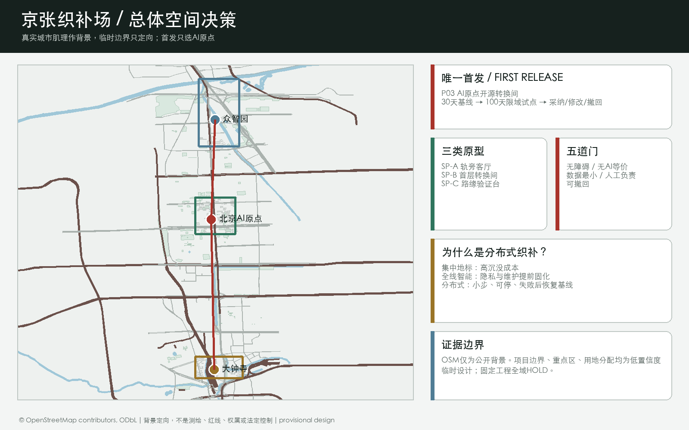
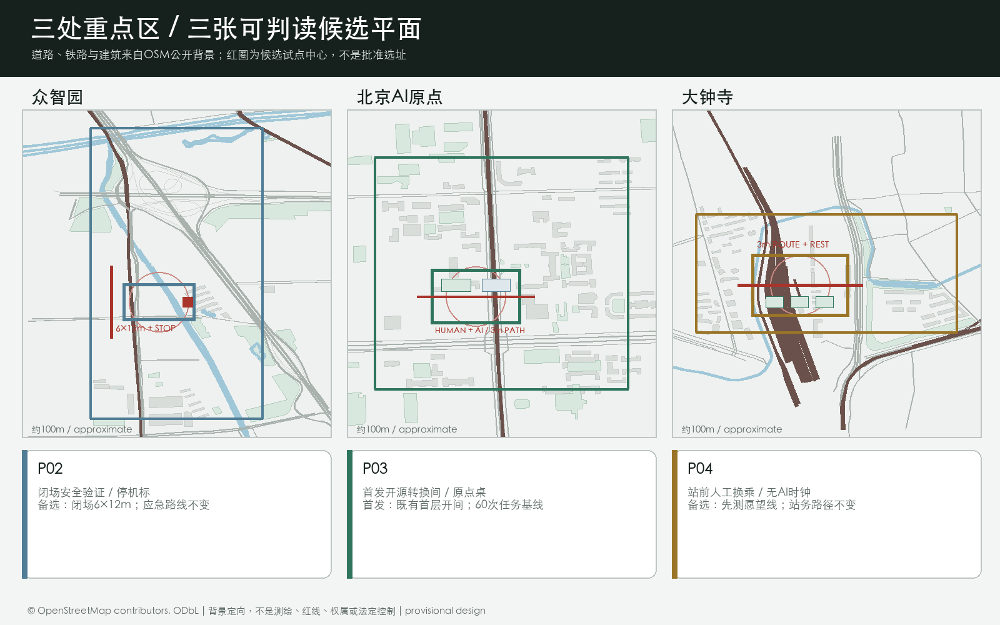
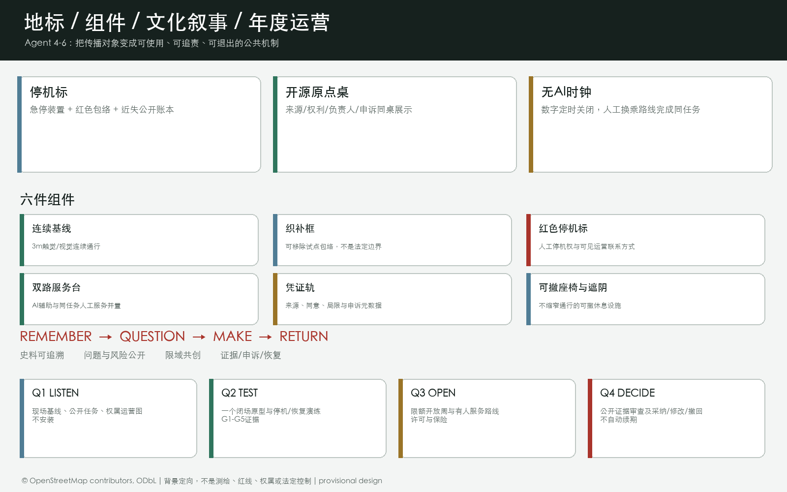
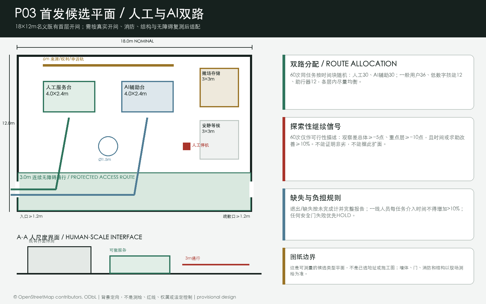
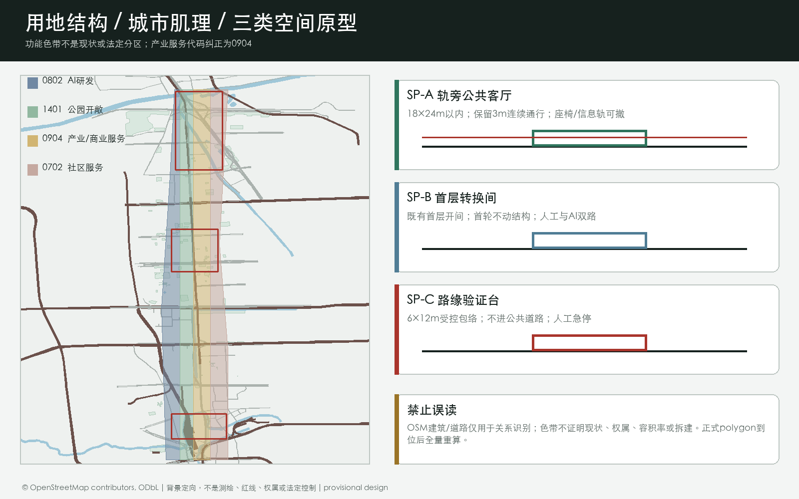
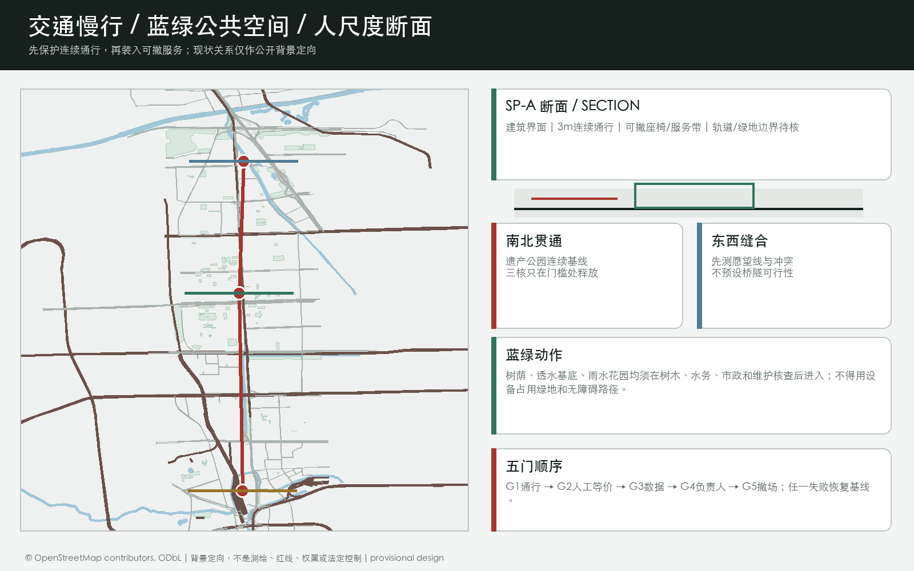
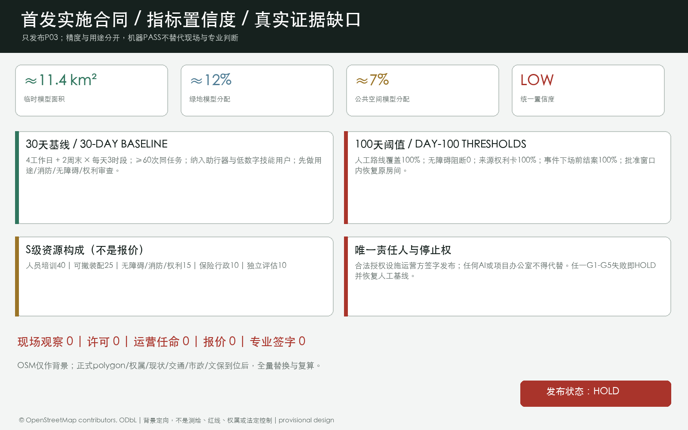

# 京张织补场：把公共空间变成可逆、可验收的AI城市试点

> 参赛包状态：`professional_design_package` / `ready_for_review`（临时边界 intake；正式 polygon 到位后整体复算）

**60 秒判断。** 本方案不再把“AI创新带”理解为一条布满智能设施的展示带，而把它设计为一套公共空间使用制度：任何 AI 服务只有通过无障碍连续、无 AI 等价、数据最小、具名人工负责、可撤回五道门，才取得一段公共空间的限时试用权。空间载体不是一座昂贵地标馆，而是三种可复用的人尺度原型：18 m × 24 m 以内的“轨旁公共客厅”、利用既有开间的“首层转换间”、6 m × 12 m 以内的“路缘验证台”。先做 30 天现场基线，再释放一个 100 天限域试点；任一门失败，恢复原有无 AI 服务。本包没有把未取得的现场调查、许可、运营方、报价或专业签字伪装成完成成果，当前实施状态明确为 `HOLD` [source:LOCAL-DELIVERY-CONTRACTS] [depth:risk_missing_data]。

## 设计依据与资料清单

本方案把公告确定的三层工作范围、面向智能体任务书和仓库公开资料登记表转成可阅读、可复算、可空间复核的设计包。正式边界、控规条件、道路红线、权属、市政和文保附件尚未公开进入当前 site package，因此 `site_boundary.geojson` 与 `key_areas.geojson` 采用维护者提供的临时粗略 polygon；它们只承担生成、展示、讨论和 intake 自检，不表达官方红线或精确规划控制 [source:OFFICIAL-ANNOUNCEMENT] [source:BOUNDARY-SOURCE] [depth:existing_conditions_diagnosis]。

设计判断是：当官方边界、现场数据和运营主体都尚未确定时，最科学的城市设计不是预先铺满设备，而是先保护日常通行与公共服务基线，再用可逆空间试点逐步取得证据。京张遗产公园承担连续公共路径，三处重点区各发布一个不同任务的试点，两翼连接高校、企业、社区与场景资源；AI 只辅助明确任务，不拥有审批、医疗、法律、安全或空间运营的最终决定权 [standard:PROJECT-AGENT-OPEN-CALL-TASKBOOK] [data:geometry/public_space.geojson#PUBLIC-001]。

本包的权威层级依次是 GeoJSON、`metrics.json`、三类矩阵、manifest/source/assumptions/self-check；正文负责解释设计判断，图纸和 HTML 负责让人快速看懂。所有外部来源、生成方法、版权和待补条件均写入 `sources.json` 与 `report/copyright_statement.md`。

## 三层范围工作框架

方案将工作分为“看清一带、织好总体、验证三核”三步。统筹研究范围约 43.6 km²，负责产业生态、未来城市和文化叙事；总体设计范围约 11.4 km²，负责城市更新、用地结构、交通市政和京张遗址公园活力带；重点区域约 368.4 ha，负责三个节点的详细设计。面积数字来自公告，空间 polygon 在正式资料到位前保持 provisional [source:OFFICIAL-ANNOUNCEMENT] [data:geometry/site_boundary.geojson#SITE-001] [depth:three_level_scope_framework]。

| 层级 | 关键问题 | 方案动作 | 主要证据 |
| --- | --- | --- | --- |
| 统筹研究范围（约43.6 km²） | AI 产业链如何与城市生活共生？ | 形成“高校策源—开源协作—企业转化—公共体验—国际传播”的创新链 | `agent_taskbook.json`、`compliance_matrix.json` |
| 总体设计范围（约11.4 km²） | 产业、更新、交通和公共空间如何落地？ | 一带三核两翼、双脉三环、多点场景；用地分区完整覆盖临时边界 | `land_use.geojson`、`roads.geojson`、`phasing.geojson` |
| 三处重点区（公告合计约368.4 ha） | 节点如何成为可测试、可体验的街区？ | 分别承担全栈创新、近校转化、智能原生产业生活 | `key_areas.geojson`、A3/A0 图纸 |

## 统筹研究范围产业与未来城市研究

### 命名与空间识别

主名称为“京张织补场”，英文名为 **JINGZHANG CIVIC WEAVE**。“织补”不是装饰性隐喻，而是三条可执行规则：先修补被交通、围墙、台阶和数字门槛切断的公共路径；再将可移动的服务与试验装入可撤回的空间单元；最后用验收凭证决定保留、改进或撤场。视觉识别建议采用“连续基线 + 三类织补框 + 红色停机标记”，分别表达不可中断的公共路径、有限空间授权和明确停止权。这是概念识别方向，不是注册商标或官方规范 [source:AGENT-TASKBOOK] [depth:overall_spatial_structure]。

三大定位被转成三种可感知的体验：**百年京张文化带**是记忆、步行和讲述；**都市 AI 生活体验带**是每天可用的公共服务、学习、工作与社交；**AI 融合创新带**是从科研到企业、从算法到场景的开放测试网络。五大功能用“研发—生态—场景—活力—治理”串成回路；三区两翼为“众智园 AI 自主创新加速区—北京 AI 原点社区—大钟寺 AI 产业聚集区”，加上“中关村科技服务翼”和“小月河场景赋能翼” [source:AGENT-TASKBOOK] [standard:PROJECT-AGENT-OPEN-CALL-TASKBOOK]。

### 生态机制与全球参考

六个国际案例只提取机制，不复制规模、法律或绩效：Helsinki AI Register 提供“系统说明 + 反馈入口”的公开登记启发；Seoul AI Hub 提供按人才、初创、研发基础设施和开放创新分阶段服务的启发；Singapore National AI Strategy 提供跨部门能力建设与可信采用的背景；Barcelona Innova 提供“城市挑战 - 公开征集 - 真实场景试验 - 实验协议”的流程；Mila 提供技术、法律、社会科学和公共政策共同治理的研究协作模式；London LOTI 提供地方政府共享能力、负责任采购、信息治理和数字包容的工具思路 [source:CASE-HELSINKI-AI-REGISTER] [source:CASE-SEOUL-AI-HUB] [source:CASE-BARCELONA-INNOVA]。

这些案例共同支持一个取舍：海淀不应先采购一套“智能城市完成品”，而应先建立任务、空间、责任、数据和退出的共同接口。Singapore、Mila 与 LOTI 仅作为能力与治理背景，不证明其制度能直接移植；所有本地运营、采购、法律和空间条件仍需专业团队与主管部门独立判断 [source:CASE-SINGAPORE-SMART-NATION] [source:CASE-MILA-GOVERNANCE] [source:CASE-LONDON-LOTI]。

## 总体设计范围城市更新与控规深度城市设计

总体结构建议为“一带、三核、两翼、双脉、三环、多点”：一带是京张遗址公园公共生活带；三核是三处重点区；两翼是科技服务与小月河场景赋能；双脉是遗址慢行主脉与东西向校企社区连接脉；三环是轨道接驳环、蓝绿公共环、AI 场景体验环。它把历史、产业、生活和治理放在一个可步行、可解释、可持续迭代的网络中 [data:geometry/land_use.geojson#LU-001] [data:geometry/roads.geojson#ROAD-NS-001] [depth:overall_spatial_structure]。

用地结构采用四类概念分区：AI 研发创新、公园绿地与开敞空间、产业服务与商业服务、社区服务与配套。它们以同一临时边界切分，避免相邻 polygon 独立手绘造成缝隙或重叠；用地代码与语义参照自然资源部用地分类指南，但不替代正式控规 [standard:MNR-LAND-USE-CLASSIFICATION-GUIDE] [data:geometry/land_use.geojson#LU-001] [depth:land_use_layout]。

更新策略是“先公共、后空间；先轻量、后结构”：近期先做导视、慢行安全、公共代码墙、可预约场景和低扰动绿地修补；中期推进低效空间的功能置换、校企服务客厅和轨道站点界面；长期才在正式权属、文保、控规、消防、市政与工程条件明确后，由专业团队研究建筑更新或新建。建筑图层表达的是概念基底与更新类型，不构成拆迁、改造或工程结论 [data:geometry/buildings.geojson#P03-ENV] [depth:retain_renovate_demolish]。

### 三类空间原型与替代方案

空间决策落到三个尺度。**SP-A 轨旁公共客厅**限定在 18 m × 24 m 以内，并保留 3 m 连续通行；永久层只考虑经专业核查后的树荫、透水基底与断电点，可移动层承载座椅、信息轨和有人值守服务。**SP-B 首层转换间**利用既有首层开间，首轮不做结构改造，用开放门诊、人工服务台与可移除测试台连接校园、企业和社区。**SP-C 路缘验证台**限定在 6 m × 12 m 以内，首轮只在封闭或受控空间测试，严禁未经许可进入公共道路 [source:LOCAL-DELIVERY-CONTRACTS] [depth:three_key_area_detailed_design]。

方案比较了三种路径。集中式 AI 地标馆可见度高，但沉没成本高、日常覆盖弱、容易随模型与展陈过时；全线铺设智能设施品牌连续，但在现场数据、隐私、维护和运营方未明确前会提前固化风险；分布式织补场协调成本更高、传播速度更慢，却能在每一处取得证据后再扩容，并能在失败时恢复原有服务。因此选择第三种，而不是把“最大、最快”当成创新 [source:LOCAL-DELIVERY-CONTRACTS]。

## 重点区域详细设计

| 重点区 | 第一试点 | 人尺度空间裁决 | 100 天验收与停止条件 |
| --- | --- | --- | --- |
| 众智园 AI 自主创新加速区 | P02 安全验证院 | 采用 SP-C 路缘验证台；保留应急通道；低速设备只在闭场包络运行 | 手动停机可达且实测，零越界发布，近失事件留痕；操作员缺席或出现未解决严重近失即停 |
| 北京 AI 原点社区 | P03 开源转换间 | 采用 SP-B 首层转换间；利用既有开间；首轮不做结构改造 | 每次开放都保留同任务人工台，全部演示有来源与权利说明；个人画像或人工服务缺席即停 |
| 大钟寺 AI 产业聚集区 | P04 站前换乘客厅 | 采用 SP-A 轨旁公共客厅；先实测步行愿望线，不占站务、消防和无障碍路径 | 关掉数字设施后导向仍有效，站口与应急路径不受阻；拥挤冲突增加或无法持续值守即停 |

三个重点区的 polygon 都是临时约束，公告面积仅用于任务核对。每个节点都应由专业团队用正式图纸、权属、交通、市政和文保条件重新校准 [data:geometry/key_areas.geojson#PROV-KEY-001] [depth:three_key_area_detailed_design]。

## AI 创新生态、人才画像与 AI+ 场景

### 七类用户画像

| 用户 | 关键需求 | 空间回应 | 人本边界 |
| --- | --- | --- | --- |
| 轮椅与助行器使用者 | 连续路径、转身、休息与人工协助 | 所有原型先保护通行基线 | 无障碍门 G1 未通过，不得发布 |
| 老年与低数字技能居民 | 无账号、可听懂、可当面办理 | P06 公共服务双路驿站 | AI 关闭后人工路径仍能完成同一任务 |
| 日常通勤者与骑行者 | 路径可预测，活动不阻断穿行 | 遗产公园连续通行基线 | 不以展演或测试挤占连续通行 |
| 开源开发者与研究者 | 有来源的测试、署名、申诉与合作 | P03 开源转换间 | 不采个人轨迹，演示材料逐项清权 |
| 初创团队与企业测试人员 | 明确准入、保险、数据和退出 | P02 安全验证院 | 未经许可不进入公共道路或真实公共服务 |
| 一线服务与维护人员 | 有权停机、合理负荷与事故支持 | 每班具名人工负责人 | 无授权人工可停机时，门 G4 失败 |
| 访客、儿童照护者与国际参与者 | 双语、非数字导向与可休息路径 | P04 站前客厅、P07 贡献凭证墙 | 不用人脸、身份或商业排名制造排斥 |

### 十二张场景卡与三类产业测试

1. **慢行断点共查**：AI 只聚合公开报修，实际断点由专业人员和使用者实走复核；
2. **低速机器人闭场验证**：只在受控包络测试感知与路径规划，同任务人工推车作为基线；
3. **模型安全公开评测**：使用已清权任务集，发布决定由独立评测主持人作出；
4. **低碳算力负荷演练**：AI 只预测试验负荷，不取得电网或设施控制权；
5. **开源门诊**：AI 辅助文档与问题分流，现场保留人工门诊与纸质指南；
6. **校企问题翻译台**：AI 帮助结构化问题，导师与项目方决定是否合作；
7. **公共服务导航**：只解释公开信息，不作审批、诊断或法律结论；
8. **京张记忆导览**：可选多语讲述必须来自清权史料，实体双语导视始终可用；
9. **无障碍导向复核**：音频导航必须在专业审查后上线，不能替代触觉、视觉和人工协助；
10. **站前拥挤提示**：只有在获授权且不识别个人时才使用聚合客流估计；
11. **贡献凭证展**：AI 只辅助元数据检索，荣誉认定由独立策展与申诉机制负责；
12. **开放周排程助手**：AI 只起草容量约束时刻表，具名组织者签字发布。

其中 2、3、4 是产业测试验证场景。每张卡都在 `visual/assets/delivery_contracts.json` 绑定空间原型、主要用户、AI 角色、无 AI 基线与运营责任；它们是待批准试点，不是已运行项目 [source:LOCAL-DELIVERY-CONTRACTS] [data:geometry/public_space.geojson#PUBLIC-001] [depth:municipal_new_infrastructure]。

## 三处公共地标、文化叙事与长期运营

三个“朝圣地标”不是大型造型物，而是能被日常使用、能暴露责任的公共装置。北段众智园设置 **停机标**：闭场验证台、人工急停与近失事件公开账本形成一体；中段 AI 原点设置 **开源原点桌**：每项演示同时显示来源、权利、人工负责人和申诉路径；南段大钟寺设置 **无 AI 时钟**：数字服务定时关闭，以实体导视和人工路线完成同一换乘任务并记录耗时。三处均须在正式选址、权属和专业审查后落位，不以地标名义侵占通行、绿地、文保或站务空间 [source:LOCAL-DELIVERY-CONTRACTS] [depth:blue_green_public_space]。

公共空间组件库包括 3 m 连续基线、可移除织补框、红色停机标、AI/人工双路服务台、来源与申诉“凭证轨”、可撤座椅和遮阴六件。荣誉体系展示“可核实的公共贡献”而不是个人或企业热度；每条贡献必须有公开来源、同意、独立策展人、局限和申诉状态，禁止付费排名、人脸识别、商业榜单和暗示政府背书 [source:LOCAL-DELIVERY-CONTRACTS]。

文化叙事采用 **记住 REMEMBER - 提问 QUESTION - 共创 MAKE - 归还 RETURN** 四步。遗产路径只使用可追溯史料讲述京张铁路；三个门厅把中关村的协作文化转成公开问题与风险台账；限域原型展示共同制作；贡献墙同时记录成功、失败、申诉与恢复基线。双语导视分为“整体识别”和“文化史料标识”两层，后者必须逐条清权，不把科技装饰冒充历史 [source:AGENT-TASKBOOK]。

长期运营按四个季度循环，而不许诺具体活动已经获批：Q1 听见，完成现场基线和公开任务征集；Q2 验证，只开放一个闭场试点；Q3 开放，在许可、保险和容量约束下做小规模开放周；Q4 决定，公开采纳、修改或撤回记录。转化路径固定为“公开问题 - 独立闸门审查 - 运营方补齐许可/保险 - 100 天证据 - 多方决定”，开发者或企业不会因参展自动获得采购、招商或政策支持 [source:LOCAL-DELIVERY-CONTRACTS] [depth:phasing_implementation]。

### 唯一首发：AI 原点开源转换间

首发只选 P03，不同时启动三核。候选载体是 AI 原点临时范围内一个既有首层开间，具体地址待资产方同意、消防/无障碍核查和正式边界后选择。唯一决策负责人是合法授权的设施运营方。30 天基线包含 4 个工作日、2 个周末、每天 3 个时段，至少 60 次同任务尝试，并通过无障碍方式纳入助行器使用者和低数字技能使用者。100 天发布阈值为：每场 100% 保留无账号人工路线、试点包络内无障碍阻断为 0、演示来源与权利卡覆盖率 100%、全部事件/近失在下场前结案、撤场演练在批准闭场窗口内恢复原房间 [source:LOCAL-DELIVERY-CONTRACTS]。

效果评估将 60 次同任务尝试按时段区组随机分配为人工路线 30 次、AI 辅助路线 30 次；其中一般使用者 36 次、低数字技能使用者 12 次、轮椅或助行器使用者 12 次，各层内两路线均分。这只是探索性可行性样本，不能统计证明非劣，也不能授权扩面。观察差达到总体不低于 -5 个百分点、两个重点层各不低于 -10 个百分点，且中位完成时间或人工介入改善至少 10%，只允许继续改进设计。任何扩面之前，必须由独立统计人员预注册主要结局、单侧显著性水平、至少 80% 功效、人工路线预期完成率、失访、置信区间方法及据此计算的总体和分层样本量；只有充分功效的确认性结果与全部安全门同时通过才可扩面。退出、缺失结局或跨路线在探索分析中按未完成计，并另发按实际路线敏感性表；一线人员每项完成任务的投入分钟数不得增加超过 10%，安全和人工停机权始终优先 [source:LOCAL-DELIVERY-CONTRACTS]。

资源构成只作为 S 级工作量分配：人员与培训 40%、可撤装配 25%、无障碍/消防/权利审查 15%、保险行政 10%、独立评估 10%，不是报价。必须先取得资产方同意、用途核对、消防疏散、持证无障碍审查、活动/保险和隐私内容审查；其余两核只保留为后续备选 [source:LOCAL-DELIVERY-CONTRACTS]。

## 用地、建筑规模与拆改留方案

用地分区完整覆盖提交边界，但只是低置信度的功能分配，不是现状用地或法定分区；产业服务区代码采用 `0904`，不再误用湿地代码 `05`。建筑和道路图层改用 2026-08-25 获取的 OpenStreetMap 公开快照作为视觉背景，只帮助判断道路、铁路与建筑肌理，不作为正式边界、测绘、权属、规划指标或拆改留依据。绿地与公共空间比例仍是临时设计模型的必需读数，统一标记低置信度；容积率、总建筑规模、建筑高度、建筑密度、退线和道路面积保持 `unknown` [source:OSM-CONTEXT-20260825] [standard:MOHURD-CONTROL-DETAILED-PLANNING] [metric:floor_area_ratio]。

拆改留采用四级判读：保留公共记忆与可继续使用的建筑；改造低效首层和公共界面；拆除/新建仅作为待正式调查后的备选；无法判断的对象标为待确认。任何具体地块的拆改结论都必须待权属、现状测绘、文保、消防、结构和市政资料核实后，由专业团队深化 [depth:height_massing_character] [depth:retain_renovate_demolish]。

## 交通、轨道、市政与公共服务设施

交通策略是“轨道到达—慢行分配—服务可达”。建议将轨道站点周边做成可读的换乘前厅，建立连续无障碍步行、骑行停放、微循环和公共服务接驳；道路图层仅表达概念联系，不代表道路红线。三条接口分别服务众智园对外到达、AI 原点校企慢行、大钟寺站四象限步行；两翼补充中关村科技服务和小月河场景赋能 [data:geometry/roads.geojson#ROAD-NS-001] [standard:MOHURD-URBAN-DESIGN-MEASURES] [depth:traffic_rail_slow_parking]。

新型基础设施建议采用“能解释、可断开、可维护”的原则：公共服务节点可承载预约、导视、设施报修、场景测试和低碳算力展示；涉及个人信息、科研数据、企业数据和公共安全的系统必须最小化采集、分级授权、人工复核并提供退出机制。市政管线、容量、消防、雨洪和能源接入均为待核实条件，不写成已确定工程 [standard:PROJECT-AGENT-OPEN-CALL-TASKBOOK] [depth:municipal_new_infrastructure]。

## 蓝绿空间、公共空间与城市风貌

京张遗址公园活力带建议被组织为“可停留的线性客厅”：遗址讲述点、树荫座椅、可预约展演、无障碍导视、低干扰夜间照明和雨水花园形成连续但不喧闹的公共体验。蓝绿图层表达的是方案空间意向，公共空间比例为本包几何读数，不是城市绿地率或法定指标 [data:geometry/green_space.geojson#GREEN-001] [data:geometry/public_space.geojson#PUBLIC-001] [metric:green_ratio]。

城市风貌建议“历史材料轻触、创新界面开放、首层连续可用”：遗址邻近界面控制标识与视线，创新节点采用可变展陈和夜间可读性，社区界面优先安静、舒适和无障碍。色彩、材质、建筑高度和天际线仍需正式风貌控制、文保和建筑设计条件确认 [standard:MOHURD-URBAN-DESIGN-MEASURES] [depth:blue_green_public_space]。

## 更新项目清单、实施政策与分期计划

八个可独立采纳的实施包分别是：P01 遗产公园连续通行基线、P02 众智园安全验证院、P03 AI 原点开源转换间、P04 大钟寺站前换乘客厅、P05 小月河雨洪与慢行织补、P06 公共服务双路驿站、P07 三核贡献凭证墙、P08 织补场年度开放周。每包均在 `visual/assets/delivery_contracts.json` 写明第一责任角色、协作角色、30 天工作、100 天成果、许可/同意前置、资源量级、验收凭证与停机条件 [source:LOCAL-DELIVERY-CONTRACTS] [depth:renewal_project_list]。

| 时间门 | 允许动作 | 必交凭证 | 禁止跨越 |
| --- | --- | --- | --- |
| 0-30 天 基线 | 现场实走、权属/运营图、通行与无障碍、管线/消防初筛、用户和一线人员访谈 | 基线图、冲突台账、数据与权利清单、具名责任矩阵 | 不安装固定设备，不采集个人数据，不宣传已落地 |
| 31-100 天 限域试点 | 只选一个原型、一个任务、一个有人值守时段；做停机和撤场演练 | G1-G5 逐门证据、事件/近失记录、恢复验收、公众与一线人员反馈 | 不扩区、不并发复制、不进入公共道路或高后果服务 |
| 100 天后 采纳/修改/撤回 | 由资产方、服务方、专业团队与公众代表基于证据决定 | 决策记录、责任交接、资源与维护计划、条件触发清单 | 机器自检分数不能代替许可、专业签字和公众判断 |

资源量级仅用于方案比较：S 为临时装配与有人值守试点的百万人民币以内工作量级，M 为公共空间样段或多方试点的 100-500 万元工作量级，均不是采购报价；超过 500 万元或涉及资本性工程的 L 级工作不进入首轮发布。现场报价、施工图、工程量、审批与资金均待正式流程 [source:LOCAL-DELIVERY-CONTRACTS] [depth:phasing_implementation]。

## 指标体系、面积复算与合规矩阵

当前低置信度空间读数：临时总体设计 polygon 约 11.4 km²；绿地设计读数约 12%；公共空间读数约 7%；重点区 3 处。建筑图层只记录三处候选可逆试点包络，合计上限 720 m²，不是现状建筑基底、建设容量或拆改依据。设计交付还包括 3 类空间原型、8 个实施包、12 张场景卡、3 类产业验证场景和 7 类用户画像 [metric:site_area_sqm] [metric:green_ratio] [metric:public_space_ratio]。

待正式数据补齐的指标包括容积率、总建筑面积、建筑高度、建筑密度、退线、道路红线、权属和市政容量。`compliance_matrix.json` 覆盖公告 1.3、1.4、1.5 与 `agent.1`—`agent.6`；`standard_matrix.json` 覆盖专业标准；`design_depth_matrix.json` 的十五项 formal 深度均以 complete 记录设计证据，但 provisional geometry 仍需正式资料替换后复核 [metric:floor_area_ratio] [depth:metrics_recalculation] [source:SOURCE-REGISTRY]。

## 风险、版权与合规说明

最大风险是把临时 polygon 误读为官方红线。因此全文、HTML、图纸和自检均显式标注 provisional；正式 polygon 到位后必须整体重算，不能只替换一个文件。其次是 AI 场景的隐私、偏见、误报、网络安全和运维责任；每个公共场景均应以最小化数据、可解释输出、人工复核、申诉和退出机制为前提，不以个人画像或强制采集作为必要条件 [depth:risk_missing_data] [data:geometry/constraints.geojson#HOLD-ALL-001]。

实施真实性采用“零状态”披露：截至生成日，现场观察 0、确认许可 0、具名运营方任命 0、采购报价 0、专业签字 0，所有试点均为 `HOLD`。这不把组织方缺资料当成当前扣分项，但明确列出进入现场前必须补齐的官方 polygon 与控规、权属与运营图、无障碍和交通调查、市政/消防/文保条件、社区与一线人员参与、保险与许可路径。任何效果图、桌面演练或机器 PASS 都不得冒充这些证据 [source:LOCAL-DELIVERY-CONTRACTS] [depth:risk_missing_data]。

本包证据图由本地 Python/Pillow 与 ReportLab 生成，字体使用系统字体，仅使用仓库公开/清权资料和本包自绘图形；封面由 OpenAI 图像工具生成并明确标注为概念表达，不是现场照片或官方效果图。没有使用商业地图瓦片、未授权人物/企业标识、私人资料或远程资源。PDF、PNG、HTML 是解释层，GeoJSON、metrics 和矩阵是证据层。方案为 AI agent 的开放共创建议，不是政府批准、控规成果、工程设计、投资承诺或已建成项目 [source:AI-GENERATED-COVER] [source:AGENT-TASKBOOK]。

## 参考资料

- 北京市规划和自然资源委员会海淀分局：《百年京张AI创新带城市设计国际方案征集资格预审公告》，https://ghzrzyw.beijing.gov.cn/zhengwuxinxi/tzgg/hd/202605/t20260509_4643047.html；
- `brief/site-package/design_brief.json`、`allowed_design_space.json`、`agent_taskbook.json`；
- `data/source_registry.json` 与 `data/processed/agent_fact_pack.md`；
- `brief/site-package/standards/references/` 中的城市设计、控规、用地分类、AI 服务和无障碍参考快照；
- 机器可读来源索引与用途边界见 [source:SOURCE-REGISTRY]。
