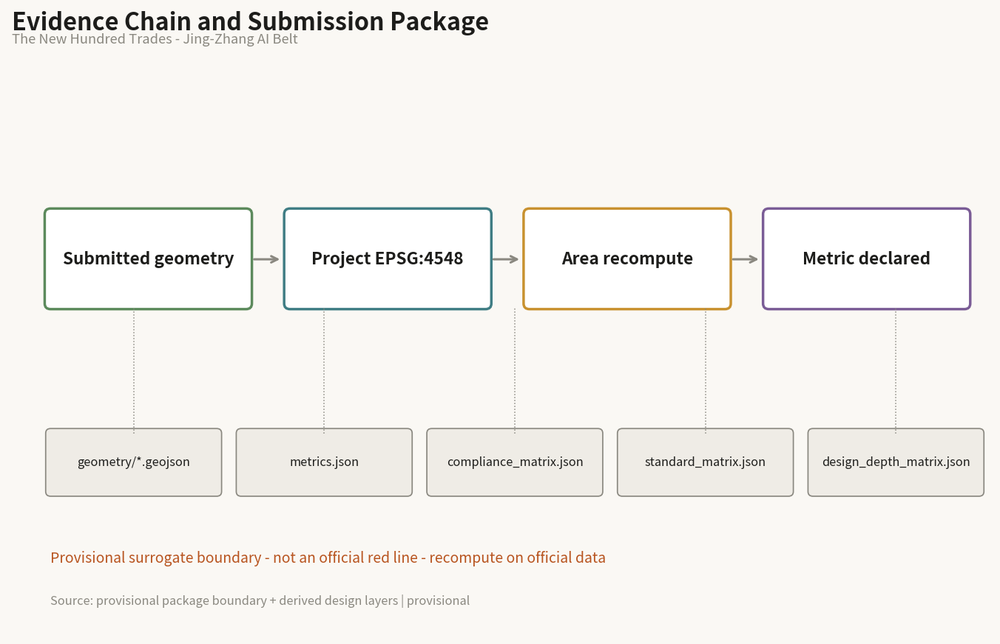
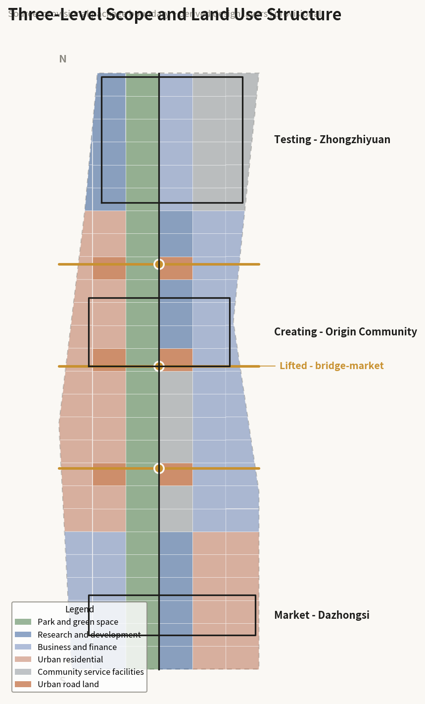
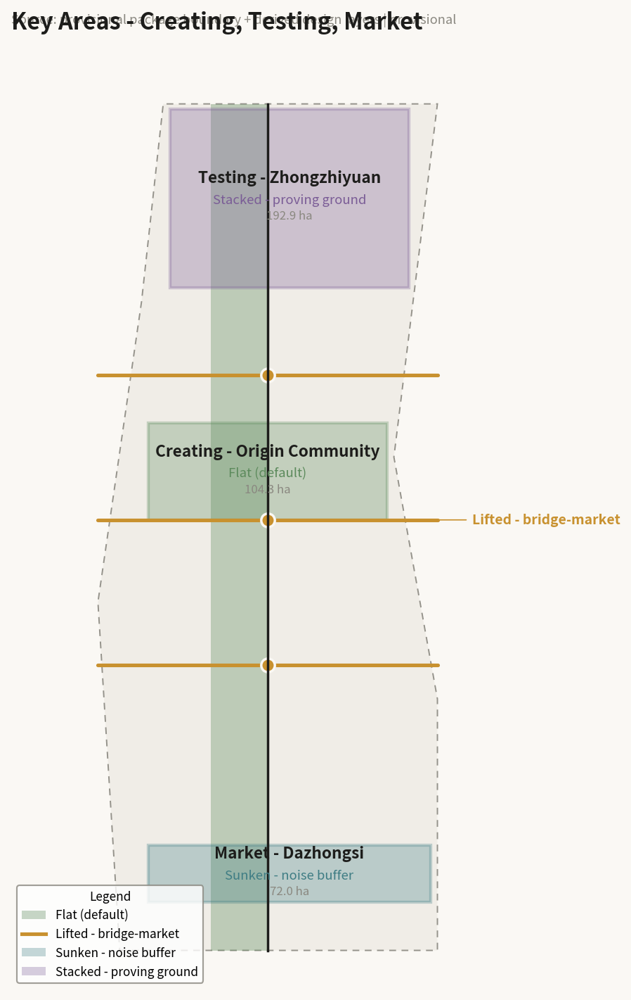
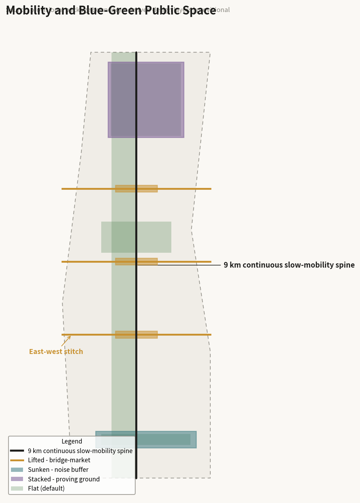
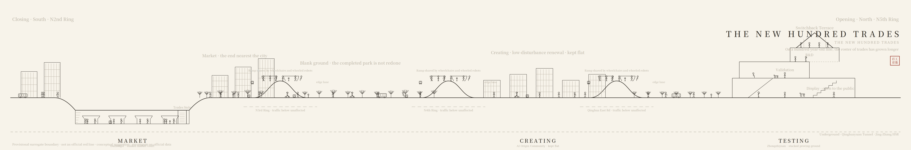
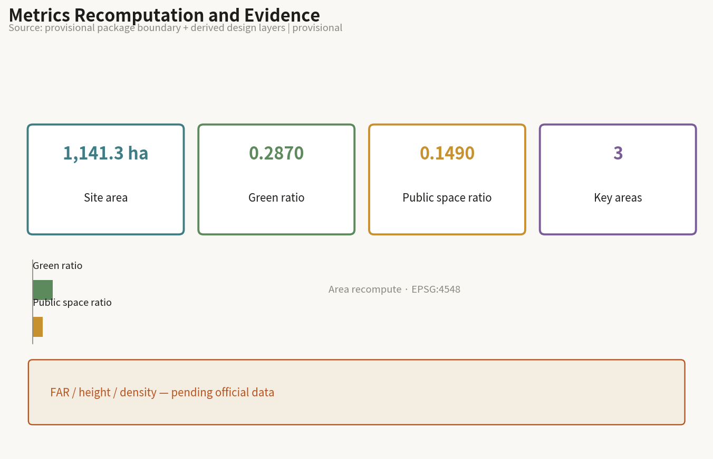

# The New Hundred Trades - Urban Design for the Centennial Jing-Zhang AI Innovation Belt

**In one line**: On a hundred-year-old line, the roster of trades has grown longer; the new trades must find their place on this street.

## Design Basis and Source Inventory

The evidence base has three parts. First, the official announcement and taskbook: the three-level scope (coordinated research area approx. 43.6 km², overall design area approx. 11.4 km², key areas approx. 368.4 ha), the three-area two-wing structure, and the areas of Zhongzhiyuan approx. 192.1 ha, Beijing AI Origin Community approx. 104.3 ha, and Dazhongsi approx. 72.0 ha [source:OFFICIAL-ANNOUNCEMENT]. The six agent tasks form mandatory narrative content [source:AGENT-TASKBOOK].

Second, spatial data. Official polygons have not been released. All design layers are generated from the provisional surrogate boundary supplied in the site package and are explicitly tagged `geometry_role="provisional_constraint"` and `boundary_precision="provisional_rough"` [data:geometry/site_boundary.geojson#SB-001]. All areas, green ratio, and public-space ratio are design-model outputs and must be recomputed once official data is published [metric:site_area_sqm].

Third, verification of public information. One premise must be stated: **phase two of the Jing-Zhang Rail Park was completed and opened in August 2026, connecting the full approx. 9 km line**. Turning the rail heritage into a green corridor is therefore an accomplished fact, not an open question. Accordingly this proposal's position is not to redo the line. In addition, the Jing-Zhang high-speed rail already runs underground north of Xueyuan South Road and the at-grade tracks were largely removed; the remaining at-grade rail and principal noise source along the corridor is Metro Line 13, which is the real object of the "sink" move [source:PROCESSED-FACT-PACK]. These are conclusions from checking public information, not official determinations, and must be confirmed with the competent authorities during professional deepening.

Data gaps: regulatory planning controls (floor area ratio, building height, building density, setback) are not public. The corresponding metrics remain `unknown` with `value: null` rather than being filled by design guesswork [metric:floor_area_ratio]. Official key-area boundaries, the final alignment and timing of the Line 13 capacity split, and property-rights information all require official data.

## Three-Level Scope Framework

The coordinated research area (approx. 43.6 km²) answers what role the belt plays in the city; its output is industrial organisation logic, not parcel-level design. The overall design area (approx. 11.4 km²) reaches regulatory-plan urban design depth, resolving spatial structure, the renewal framework, mobility, and the public-space system. The key areas (approx. 368.4 ha) reach implementation-scheme depth with a readable scheme for each [depth:three_level_scope].

One judgment runs through all three levels: **the question is no longer whether to build this line, but how it is used now that it is built**. The research level therefore answers how industry is arranged along the line, the overall level answers how the flat line stays continuous while stitching east and west, and the key-area level answers how each of the three thickenings is made.

The limits of the provisional boundary must be stated: the submitted `site_boundary` is a rough surrogate of approx. 1,141 ha, comparable in magnitude to the official overall design area of approx. 1,140 ha but not an official red line, and must not be used for precise area accounting or control-line judgments [data:geometry/constraints.geojson#CN-002]. Once official polygons are released, the land-use partition, green ratio, and public-space ratio must all be recomputed [metric:green_ratio].

## Industry and Future-City Study for the Coordinated Research Area

### Naming and Identity System

The proposal is named **THE NEW HUNDRED TRADES / 新百工图**.

The name has three origins. First, the *Kaogongji*, China's earliest technical canon on crafts, states that those who create things and those who transmit and keep the craft are called *gong*, and its passage on the artisan laying out the capital is a founding text of Chinese city planning. In Chinese, *gong* has never meant only a craftsman; it directly means the one who builds the city. Second, the 1909 Jing-Zhang railway was itself the work of a hundred trades: engineers, surveyors, masons, and track workers together completed the first trunk railway built by Chinese engineers. A century later the same line carries a different group: algorithm engineers, developers, founders, and agents capable of doing concrete work. **One line, two generations of trades.** Third, the handscroll format of *Along the River During the Qingming Festival* supplies the representational model: many trades active at once along a single line, depicting work rather than scenery.

The relation between the trades and AI needs no detour. The original meaning of the hundred trades is the division of labour, each with its own craft. The most direct change AI brings is that the roster of trades on this line has grown a new row. Inspection, delivery, low-speed shuttling, surveying, and guiding are beginning to be carried by agents. They are not tools; they are newly joined trades. This proposal therefore claims neither that AI replaces people nor that AI serves people. It states a designable fact: **the roster has grown longer, and the new trades need space, right-of-way, working surfaces, and a way to be supervised.** That is precisely the remit of urban design.

The identity uses the character 工 (*gong*, "trade/work") as its primitive: the upper stroke is the lifted bridge-market, the lower stroke the existing tunnel below, and the vertical stroke the 9 km continuous slow-mobility spine. The figure is isomorphic with the section strategy and can drive wayfinding, chainage markers, and the scenario-card numbering system [source:AGENT-TASKBOOK].

The naming system extends downward. The three key areas take their names from the sequence in the *Kaogongji*: **Creating the Thing** (Origin Community, where makers create), **Testing the Vessel** (Zhongzhiyuan, where what is made is tested), and **Reaching the Market** (Dazhongsi, where what is tested enters the market). The three ring-road nodes are **bridge-markets**; untouched stretches are **blank ground**; scenario cards are **trade cards**.

### Three Positions, Five Functions, Three Areas and Two Wings

Three positions: a global first-release ground for original AI research; an urban sample of people and machines sharing one street; an open validation line that the public can supervise.

Five functions: original research, pilot validation, commercialisation, public life, cultural narrative.

The three-area two-wing loop is organised by stage of industrial growth. This is the proposal's core original judgment, compatible with the given official positioning but going further: **the belt is not a one-way chain from north to south but grows from the Creating segment in the middle towards both ends.** The Origin Community sits at the centre beside Tsinghua and Wudaokou, the source of talent and ideas. Northward, Zhongzhiyuan is the largest and least constrained and carries pilot testing and validation. Southward, Dazhongsi is closest to the city and carries market conversion. The two wings supply factors along the whole length: the Zhongguancun service wing supplies capital and professional services, the Xiaoyue River wing supplies real application scenarios. The 9 km continuous spine is therefore not only a landscape corridor but the conveyor between rungs of the ladder: a team starting at Creating, going north to Test, then south to Market, travels the same line [data:geometry/phasing.geojson#PH-001].

### Global AI Ecosystem and Linear Heritage Cases

The six cases below were selected by section condition and governance model rather than by fame. Together they yield a tightening conclusion: vertical moves must be few and evidenced, and flatness carries most of the social life.

| Case | Isomorphism with Jing-Zhang | Key facts | Transferable lesson |
|---|---|---|---|
| Gyeongui Line Forest Park, Seoul | Rail buried, surface became a linear park, crosses a university district | Approx. 6.3 km, width varying roughly 10–60 m | The closest control case; it stayed flat and is socially very active, showing flatness works |
| La Sagrera, Barcelona | High-speed rail buried, park decked on top stitching two districts | Approx. 3.7 km deck park with large housing programme and a high affordable share | The deck is a manufactured ground; but a multi-level government vehicle has run over twenty years without completion |
| Atlanta BeltLine | Disused rail loop, TOD, many neighbourhoods | Approx. 35 km, financed largely by tax increment | Scale and finance are instructive; equity is its greatest failure |
| Cheonggyecheon, Seoul | Sunken linear public space | Corridor 3–4°C cooler than 400 m away, wind speed up roughly 50%, species counts sharply recovered; 22 crossing bridges | Sinking works and does not sever east-west movement; but retrofitted accessibility and rainy-season safety remain problems |
| Seoullo 7017, Seoul | Elevated walkway | Longitudinal evaluation finds it succeeds as a visitor attraction but shows seasonal programming gaps and limited links to the local economy | Warns that lifting easily becomes an isolated attraction; hence lifting is used here only for crossing |
| Shougang Park, Beijing | Same city, industrial heritage converted to technology and robotics | The real bottleneck is approval rather than design; innovative approval routes were explored and folded into municipal renewal policy tools | Same-city transferable experience; its "R&D above, validation below, display on the street" is a vertical industrial model |

Case facts come from public reporting and public research and serve as background evidence only, not as mandatory basis, with sources and uncertainty preserved [source:SOURCE-REGISTRY].

## Urban Renewal and Regulatory-Depth Urban Design for the Overall Design Area

### Overall Spatial Strategy: Flat by Default, Thickened at Five Points

The spatial strategy can be stated as one rule: **flat by default, deformed only where a condition triggers it.** This answers both the Gyeongui Line evidence (a ground-hugging green ribbon carries the most social life) and an accomplished fact (the park is already built). Section states are assigned by site condition rather than by composition, so the whole line remains recomputable and explainable:

- **Flat** (default): unconflicted stretches, ground-hugging, stitching both sides. This is the state of the great majority of the line [data:geometry/green_space.geojson#GS-001].
- **Lifted** (trigger: ring-road and arterial crossings): North 3rd Ring, North 4th Ring, and Qinghua East Road lift into bridge-markets, keeping the 9 km unbroken [data:geometry/public_space.geojson#PS-001].
- **Sunken** (trigger: adjacency to at-grade rail): the Dazhongsi segment sinks to buffer noise and sightlines [data:geometry/public_space.geojson#PS-004].
- **Stacked** (trigger: key area with fewest constraints): Zhongzhiyuan stacks into a vertical proving ground [data:geometry/public_space.geojson#PS-005].

The proposal declares its restraint deliberately: vertical moves occur only at three crossings and two key areas, and the line is predominantly flat. This makes it less spectacular in rendering than a fully three-dimensional scheme, but it conflicts neither with the completed park nor with the official requirement of low-disturbance organic renewal in the Origin Community.

### Stitching East-West and Connecting North-South

Both difficulties named in the brief are section problems: stitching east-west is how to cross, connecting north-south is whether the longitudinal profile stays continuous. One move solves both: **lifting the slow-mobility line at ring roads.** North-south therefore stays continuous, and each lift generates an east-west crossing [data:geometry/roads.geojson#RD-002].

The three bridge-markets are not merely crossings. Following the figure of the Rainbow Bridge as the busiest passage of the Qingming scroll, the centre of the deck is given to dwelling and market use while machines run on an edge lane: **people and machines share the frame, but not the right-of-way.** The approach ramps are designed to accessibility standards and shared by wheelchairs and wheeled robots. The Cheonggyecheon lesson, where accessibility was retrofitted at higher cost and incompletely, is inverted here into a positive move: one investment resolves both human access and machine right-of-way.

### Renewal Framework

Renewal is keyed to low disturbance and organic change, prioritising retention and adaptation over new construction. Renewal blocks along the line are shown indicatively in `geometry/buildings.geojson` as conceptual suggestions and do not constitute parcel-level retain/renovate/demolish conclusions [data:geometry/buildings.geojson#BD-001]. Total building scale cannot be given because regulatory controls are missing, and the related metrics remain pending official data [metric:building_height_m].

## Detailed Design for the Three Key Areas

### Creating the Thing - Beijing AI Origin Community (approx. 104.3 ha)

**Position**: original research and first choice for young founders; the start of the ladder.

**Spatial structure**: the official brief explicitly requires exploring a low-disturbance, organic renewal mode. This segment therefore **stays flat with no large vertical move** - a deliberate restraint on this proposal's own spatial preference. Integrated design focuses on the Wudaokou and Qinghua East Road West Gate station areas, with the priority being continuous slow-mobility links between campuses and parks rather than new landmarks.

**Building renewal**: mainly functional replacement and frontage improvement within existing structures, retaining current urban grain. Retain/renovate/demolish classification must await clarified ownership and regulatory conditions and is left to professional teams.

**Public space and AI scenarios**: small-grain, high-frequency everyday space - occupiable street corners, open ground floors, third places for students and young teams. AI scenarios are low-disturbance types: guiding, enterprise-service copilots, accessible-route recognition.

**Risk**: this segment has the highest density of residents and activity, so any construction directly affects daily life; phasing must be shortest and disturbance least [data:geometry/key_areas.geojson#KA-002].

### Testing the Vessel - Zhongzhiyuan AI Acceleration Area (approx. 192.1 ha)

**Position**: pilot testing and validation; the only home of the vertical AI park.

**Spatial structure**: the official brief calls for a garden-type innovation district, integrated design of buildings, green space and water, interpretation of Qing River culture, and explicitly for exploring how green space can serve AI development through functional scenarios. This segment is the largest and least constrained and therefore carries the stacking move: R&D above, validation in the middle, display below [data:geometry/public_space.geojson#PS-005].

**Why stacking is technically justified**: the environment embodied AI and robots actually need is one with level changes, steps, ramps, and real pedestrian interference. Flat open ground does not surface the hard problems. The section complexity of this segment is therefore not an aesthetic choice but a technical precondition of validation. The display layer is open to the public so that testing can be observed and supervised.

**Risk**: vertical stacking involves structure, fire safety, and evacuation. This proposal offers no engineering feasibility conclusion; these must be deepened to code by professional teams [data:geometry/key_areas.geojson#KA-001].

### Reaching the Market - Dazhongsi AI Industry Cluster (approx. 72.0 ha)

**Position**: AI-native consumption and business; the end where results enter the market.

**Spatial structure**: this segment adjoins the North 3rd Ring and suffers the worst noise and severance on the line. Published research has noted that the severance effect of the railway and parallel rail depressed land value along the corridor over the long term. The segment therefore **sinks**, using a sunken court to buffer noise and sightlines [data:geometry/public_space.geojson#PS-004].

**Sunken but not quiet**: a handscroll traditionally fades at its close, yet this segment is the most urban and should be the busiest. The move is therefore to hold the life of the street market inside the court. Following Cheonggyecheon, where 22 crossing bridges preserved east-west movement, sinking does not sever lateral connection but raises it overhead. Accessibility and rainy-season drainage are designed in from the outset rather than retrofitted.

**Alignment opportunity**: according to public rail planning information, after the Line 13 capacity split the southern 13A section will be realigned south of Dazhongsi station, so the existing at-grade alignment may be released. This is a spatial opportunity that can be received without asserting any engineering conclusion, but the final alignment and timing must follow official releases; this proposal offers only a directional suggestion [data:geometry/key_areas.geojson#KA-003].

## AI Innovation Ecosystem, Talent Profiles, and AI+ Scenarios

### How the Three Dimensions Correspond

AI is treated at three levels, each with a spatial counterpart, to avoid three chapters that never speak to each other. At the planning level AI is industry, community, and organisation, corresponding to the growth ladder arranged along the line. At the architectural level AI is scenario, activity, and vehicle, and among these **validation is a new building type barely present in cities today** - half laboratory, half public, able to run real tests while being seen and supervised. At the technical level the three families make sharply different spatial demands: low-speed shuttling and autonomous driving need continuous, bounded right-of-way, matching flat; embodied AI and robots need complex terrain and real pedestrian flow, matching lift, sink, and stack; generative AI occupies almost no space and acts on the narrative and display layer. Admitting that one family needs no new building makes the proposal more credible, not less.

### Five User Profiles

1. **Students and young researchers**: frequent short trips; care most about continuous slow mobility between campus and park, and night-time safety.
2. **Start-up team members**: need low-cost, short-lease, rapidly expandable space and walkable access to compute, capital, and scenarios.
3. **Residents along the line**: approx. 450,000 people, the daily users; care most about noise, access, and services, and bear the main equity risk.
4. **Validation engineers**: need bookable, reproducible, recordable real test environments and working surfaces.
5. **Visitors and study groups**: need a readable narrative, visitable display frontages, and clear wayfinding.

### Trade Cards (12 AI scenario cards)

Each card carries all three levels at once: who operates it, on which section and where, with what technology, and where the human review boundary lies. The brief forbids scenarios involving privacy intrusion, excessive surveillance, or absent human review, so the human review boundary is part of the design rather than a disclaimer.

| ID | Trade card | Section / location | Served | Technology | Human review boundary | Operator |
|---|---|---|---|---|---|---|
| T-01 | Low-speed shuttle | Flat, whole line | Residents, students | Autonomous driving | One-touch human takeover on board; route changes need human approval | Local operating platform |
| T-02 | Robot delivery | Flat, edge lane | Parks, merchants | Embodied AI | Night speed limits and no-go hours set by humans | Firms and district |
| T-03 | Accessible route sensing | Flat, bridge ramps | People with reduced mobility | Sensing | No personal imagery retained; outputs route status only | Public body |
| T-04 | Bridge-market event scheduling | Lifted, three bridges | All | Generative AI and scheduling | Crowd caps and closure decided by on-site staff | District and community |
| T-05 | AI guiding | Flat, heritage nodes | Visitors | Generative AI | Historical content human-reviewed before release | Cultural operator |
| T-06 | Enterprise service copilot | Creating segment | Start-ups | Large models | Policy interpretation confirmed by humans; no commitments | Service agency |
| T-07 | Result release and matching | Creating segment | Teams, capital | Matching algorithms | Recommendations human-reviewed; no automatic deals | Service agency |
| T-08 | Robot complex-terrain validation | Stacked, Testing segment | R&D firms | Embodied AI | Tests booked, publicly noticed, stoppable on site | Validation platform |
| T-09 | Low-speed vehicle road validation | Flat and lifted, Testing segment | R&D firms | Autonomous driving | Safety operator present; data boundary declared in advance | Validation platform |
| T-10 | Green-space service validation | Stacked, Testing segment | R&D, public | Sensing and scheduling | Public-facing sensing must publish its coverage | Validation platform |
| T-11 | Sunken court market operation | Sunken, Market segment | Merchants, residents | Scheduling and generative AI | Stall allocation rules public, human arbitration | Commercial operator |
| T-12 | Public safety operations review | Whole line | Managers | Sensing | All disposition decided by humans; no automated enforcement | Public body |

T-08, T-09, and T-10 are AI industry test and validation scenarios, satisfying the requirement of at least three [source:AGENT-TASKBOOK].

**Overall privacy and human-review principle**: sensing coverage must be published; no personal identification in public-facing areas; every step involving disposition, enforcement, or resource allocation must be decided by a human; any test can be stopped on site. This principle is also how the proposal delivers its stated position as an open validation line the public can supervise.

## Land Use, Building Scale, and Retain/Renovate/Demolish Logic

`geometry/land_use.geojson` partitions the submitted boundary completely without gaps or overlaps, at 100% coverage, with adjacent parcels sharing boundary coordinates [data:geometry/land_use.geojson#LU-001]. Six categories are used - innovation and R&D, mixed use, park and green space, residential and services, public facilities, transport and municipal - organised longitudinally by the three ladder segments and laterally by distance from the spine.

Building scale cannot be given: floor area ratio, height, and density all depend on unpublished regulatory conditions, so the metrics remain `unknown` rather than filled with design guesswork [metric:building_density]. Retention and adaptation are prioritised as a matter of principle, but specific classification must await clarified ownership and controls and is left to professional teams; no parcel-level conclusion is drawn.

## Mobility, Rail, Municipal, and Public Service Facilities

The slow-mobility spine is a 9 km continuous right-of-way, unbroken along its length, shared by pedestrians and low-speed shuttles [data:geometry/roads.geojson#RD-001]. East-west stitching relies on the three bridge-markets, with ring-road traffic beneath unaffected.

On rail, the Jing-Zhang high-speed line already runs underground, while Metro Line 13 is predominantly at grade and elevated and is the principal remaining noise and severance source along the corridor, and thus the real object of the sink move [data:geometry/constraints.geojson#CN-001]. The Line 13 capacity split and new stations will change accessibility along the belt; this is taken as known planning background, but no conclusion is drawn on alignment, bridges, tunnels, or engineering feasibility.

On municipal systems, the shallow composite layer suggested here, including the possibility of compute capacity and waste-heat recovery, is a concept pending verification and is not an underground engineering conclusion. Public facilities are differentiated along the three segments: everyday provision for students and youth in Creating, R&D support and display in Testing, retail and community services in Market.

## Blue-Green Space, Public Space, and Urban Character

Green ratio is approx. 28.7% and public-space ratio approx. 14.9%, both recomputed from the submitted geometry as design-model outputs requiring recomputation once official boundaries are released [metric:green_ratio] [metric:public_space_ratio].

### Three Pilgrimage Landmarks

1. **Switchback Terrace (Testing segment)**: the top level of the stacked deck, open to the public, overlooking the proving ground and the Qing River. The name recalls the Qinglongqiao switchback: the historic Jing-Zhang was forced to climb by terrain, while this flat segment deliberately manufactures level change - the same spatial archetype used in reverse a century later.
2. **Bridge-market at the North 4th Ring (lifted)**: the busiest point on the line, the climactic passage of the scroll, and the densest public stage where people and machines share the frame.
3. **Trades Stele (sunken court, Market segment)**: an honour display composed of contributor identifiers (GitHub IDs) from this open call, answering to the colophons and seals successive viewers left on a handscroll. It acknowledges a fact: the planning process of this belt was itself carried out by more than a thousand participants.

Urban character is keyed to restraint: existing heritage structures keep the marks of time rather than being refinished as replicas, and new structures are light, reversible, and demountable so that later adjustment remains possible.

### Cultural Narrative

The narrative model is the handscroll of *Along the River During the Qingming Festival*: many trades active at once along one line, depicting work rather than scenery. The A0 boards are organised accordingly - opening at the right with the North 5th Ring (the outskirts, the Qing River, the Testing segment), passing three bridge-markets and the Creating segment, closing at the left with the North 2nd Ring and the Market segment, one horizon line running through the whole scroll with level change only at five points. Along the chainage the scroll is filled with the people and machines of the line today: students, commuters, residents out walking, engineers debugging equipment, a delivery robot giving way.

The value of this narrative is that it can keep growing: a handscroll can be extended with new paper, and each time a new trade joins, the scroll lengthens. This matches the intention of building a durable mechanism rather than a single terminal master plan.

## Renewal Project List, Implementation Policy, and Phasing

Phasing follows the dependency of spatial moves rather than administrative divisions [data:geometry/phasing.geojson#PH-001]:

- **Phase 1: three bridge-markets and continuous right-of-way.** North-south continuity and east-west stitching come first because all later industrial movement depends on this continuous line.
- **Phase 2: the stacked proving ground in the Testing segment.** Only once the continuous right-of-way exists can the proving ground actually be used.
- **Phase 3: the sunken court and received alignment in the Market segment.** Timing must align with the actual progress of the Line 13 realignment and cannot be fixed in advance.

On implementation policy, transferable mechanisms already exist in the same city: the real bottleneck in converting industrial heritage is often approval rather than design, and Beijing has explored innovative approval routes for old plants and industrial heritage and folded them into municipal urban-renewal policy tools. This proposal suggests using such existing mechanisms rather than creating new ones [source:SOURCE-REGISTRY].

An equity risk must be stated. Following the Atlanta BeltLine lesson, improving a linear public space raises value on both sides and can displace existing residents and small businesses. The approx. 450,000 residents along the line bear this risk. It is suggested that space-protection provisions for young people and existing residents be built into the phasing as auditable items rather than as accompanying notes. No investment estimate is provided; all of the above are conceptual suggestions.

## Indicators, Area Recomputation, and Compliance Matrix

The three core metrics are recomputed from the submitted geometry with formulas and source files fully declared in `metrics.json`: site area approx. 1,141.28 ha [metric:site_area_sqm], green ratio approx. 0.2867 [metric:green_ratio], public-space ratio approx. 0.1487 [metric:public_space_ratio]. The recomputation path is: project to EPSG:4548, union the layer geometry, sum areas, compute ratios - independently reproducible by a third party.

Metrics depending on official regulatory controls (floor area ratio, building height, building density) remain pending official data with `value: null` and a stated reason, and are not substituted by design guesswork [metric:floor_area_ratio].

Coverage of announcement tasks 1.3, 1.4, and 1.5 and of agent tasks agent.1 through agent.6 is recorded item by item in `compliance_matrix.json`; professional standard responses are in `standard_matrix.json`; design-depth evidence is in `design_depth_matrix.json` [depth:metrics_recompute].

## Risk, Copyright, and Legal Boundary Statement

**Nature**: this is a conceptual suggestion co-created by an open-source community. It is not statutory planning and does not constitute an approved outcome, government action, implementation commitment, investment commitment, or engineering feasibility conclusion. All spatial ideas are reference material for professional teams to deepen.

**Data risk**: official polygons have not been released. All geometry and areas derive from a provisional surrogate boundary, tagged as provisional as required, and must not serve as an official red line or precise area basis. Conclusions drawn from public information on rail planning and park completion must follow official releases.

**Engineering boundary**: no feasibility conclusion is offered on bridges, tunnels, underground space, or structural and fire safety. Lifting, sinking, and stacking are stated as section strategies and conceptual suggestions.

**Social risk**: gentrification and displacement are flagged explicitly in the text with a suggestion to make protections auditable. Privacy and human-review boundaries for sensing scenarios are declared card by card.

**Copyright**: text, drawings, and geometry are original to the participant under the licence required by the repository [source:SITE-PACKAGE]. Case material paraphrases public reporting and research without reproducing original wording. *Along the River During the Qingming Festival* and the *Kaogongji* are public-domain cultural heritage, referenced here only for figure and etymology, with no protected reproduction used.

## References

Evidence sits in three layers, each independently checkable. First, official and package material: the announcement and prequalification documents give the three-level scope and the areas of the three key areas, the agent taskbook gives the six mandatory tasks, and the package geometry gives the provisional surrogate boundary [source:OFFICIAL-ANNOUNCEMENT] [source:AGENT-TASKBOOK]. Second, verification of public information: the park completion status, the undergrounding of the high-speed line and the current state of Metro Line 13, the 13A realignment, and the key facts of the six international cases all come from public reporting and public research. These serve as background evidence rather than mandatory basis, with sources and uncertainty preserved [source:SOURCE-REGISTRY]. Third, the geometry and metrics derived by this proposal, all recomputed from the submitted GeoJSON in EPSG:4548, with formulas and source files declared item by item in `metrics.json` and reproducible by a third party [metric:site_area_sqm].

The full source list with usability grading is in `sources.json`; assumptions and items pending verification are in `assumptions.json`, five of which are load-bearing: the extent of park completion, the identification of Line 13 as the noise source, the alignment released by the 13A realignment, the conceptual status of the section moves, and the recomputation obligation created by the provisional boundary. Every judgment in the text can be traced to a structured file through the `[source:...]`, `[data:...]`, `[metric:...]`, and `[depth:...]` markers: readable without opening the JSON, verifiable by opening it [depth:metrics_recompute].
