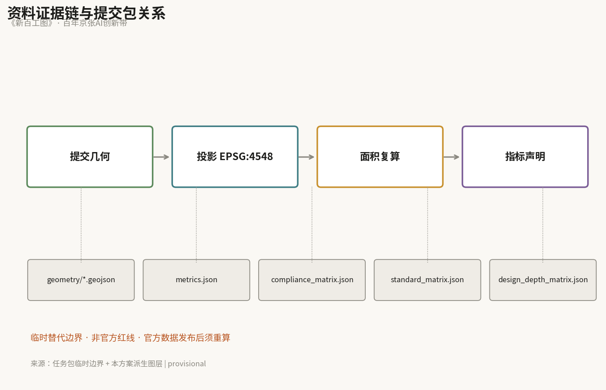
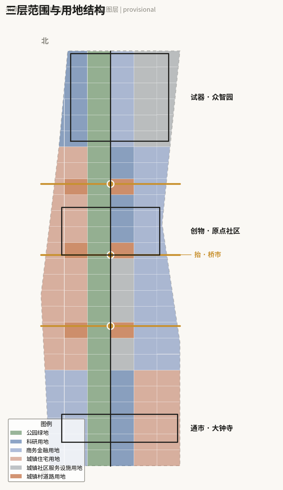
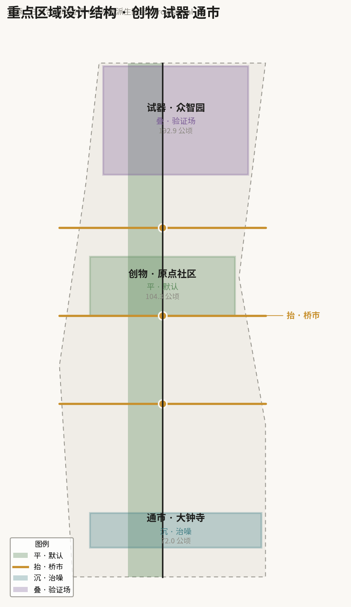
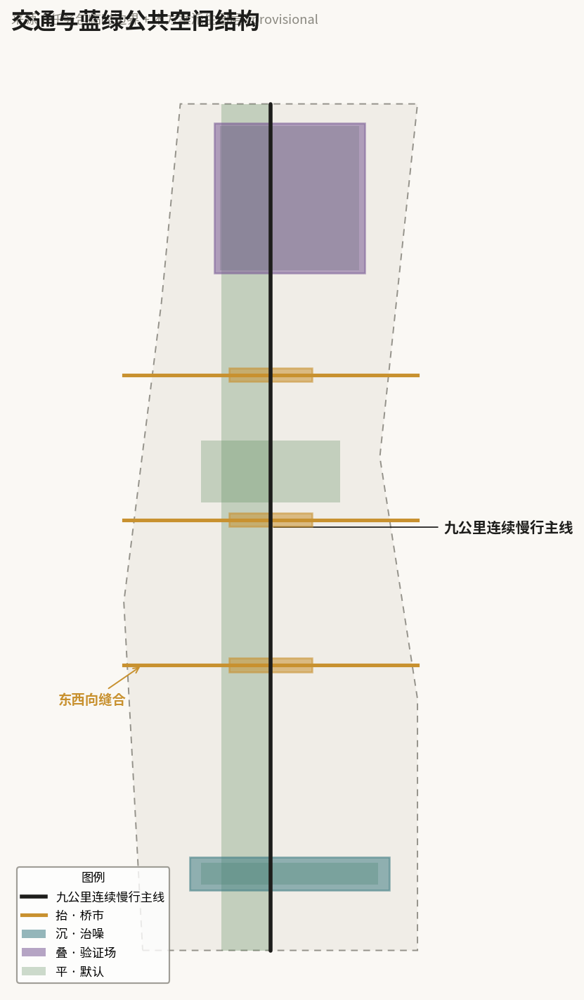
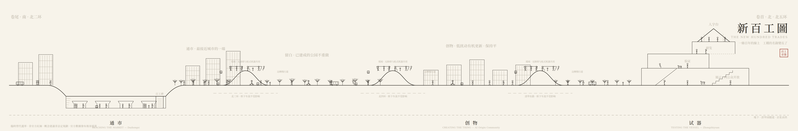
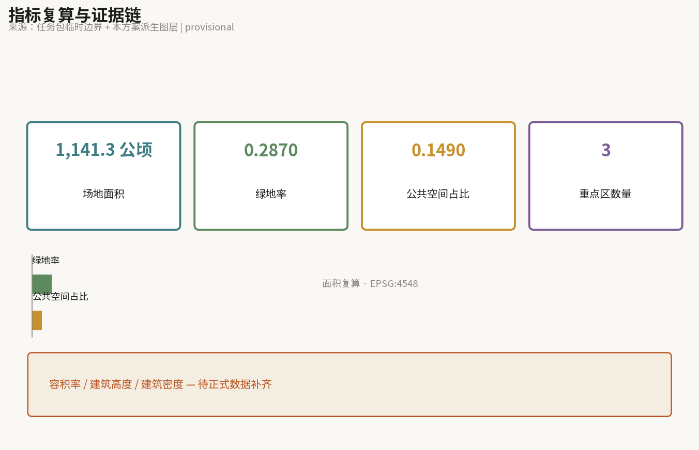

# 新百工图 · 百年京张AI创新带城市设计

**一句话**：一条百年的线上，工种的名录变长了；新的工种要在这条街上找到自己的位置。

## 设计依据与资料清单

本方案的资料基础分三类。第一类是官方公告与任务书：三层范围（统筹研究范围约43.6平方公里、总体设计范围约11.4平方公里、重点区域约368.4公顷）、三区两翼结构、以及众智园约192.1公顷、北京AI原点社区约104.3公顷、大钟寺约72.0公顷的面积口径，均以此为准 [source:OFFICIAL-ANNOUNCEMENT]。面向智能体任务书的六项任务构成正文必答内容 [source:AGENT-TASKBOOK]。

第二类是空间数据。官方 polygon 尚未发布，本方案使用任务包提供的临时替代边界生成全部设计图层，并在 `geometry/*.geojson` 中以 `geometry_role="provisional_constraint"`、`boundary_precision="provisional_rough"` 明确标注 [data:geometry/site_boundary.geojson#SB-001]。所有面积、绿地率与公共空间占比均为设计模型输出，官方数据发布后必须重算 [metric:site_area_sqm]。

第三类是公开信息核查。本方案有一个前提性判断需要说明：**京张铁路遗址公园二期已于2026年8月建成开放，全线约9公里贯通**。这意味着"把遗址公园做成一条绿廊"已是既成事实，而非待议方案。因此本方案的立场是不重做这条线。同时，京张高铁在学院南路以北已入地运行，地面轨道基本拆除；沿线现存的地面运行轨道与噪声源主要是地铁13号线，这是"下沉"动作的真实对象 [source:PROCESSED-FACT-PACK]。以上属公开信息核查结论，非官方认定，正式深化时须以主管部门发布为准。

资料缺口：控规条件（容积率、建筑高度、建筑密度、退线）均未公开，本方案对应指标保持 `unknown` 且 `value: null`，不以设计推测填充 [metric:floor_area_ratio]。三个重点区的官方边界、13号线扩能拨线的最终线位与时序、沿线产权与权属信息，均需正式数据补齐。

## 三层范围工作框架

统筹研究范围（约43.6平方公里）解决"这条带子在城市中的角色"，工作成果是产业组织逻辑与生态策略，不落到地块。总体设计范围（约11.4平方公里）达到控规深度城市设计，解决空间结构、更新框架、交通与公共空间体系。重点区域（约368.4公顷）达到规划综合实施方案深度，逐个给出可读小方案 [depth:three_level_scope]。

三层之间由一条判断贯穿：**这条线的问题已经不是"建不建",而是"建成之后如何被使用"**。因此统筹层回答产业如何沿线排布，总体层回答平线如何保持连续并缝合东西，重点区层回答三处加厚各自怎么做。

临时边界的限制必须写明：本方案提交的 `site_boundary` 为粗略替代范围，面积约1141公顷，与官方总体设计范围约1140公顷量级相当但并非官方红线，不得用于精确面积核算或控制线判断 [data:geometry/constraints.geojson#CN-002]。官方 polygon 发布后，land_use 分区、绿地率、公共空间占比三项均需重算 [metric:green_ratio]。

## 统筹研究范围产业与未来城市研究

### 命名与标识系统

方案定名 **《新百工图》/ THE NEW HUNDRED TRADES**。

命名有三重出处。其一，《考工记》"知者创物，巧者述之守之，世谓之工"，以及"匠人营国"——在中文语境中，"工"从来不只是手艺人，它直接就是营建城市的人。其二，1909年京张铁路本身就是百工的成果：工程师、测量员、石匠、路工共同完成了中国人自主修建的第一条干线铁路。百年之后，同一条线上换成了另一群人：算法工程师、开发者、创业者，以及能够承担具体工作的智能体。**同一条线，两代百工**。其三，《清明上河图》式的长卷图式提供了表达母本：一条线上各行各业同时在活动，画的不是风景，是活计。

"百工"与AI的关系不需要绕：百工的本义是分工，各有其艺、各司其事；而AI带来的最直接变化，是这条线上的分工表出现了新的行。巡检、配送、低速接驳、测绘、导览等活计，开始由智能体承担。它们不是工具，是新加入的工种。因此本方案不宣称"AI取代人"，也不宣称"AI服务人"，只陈述一个可设计的事实：**名录变长了，新工种需要被安排空间、路权、作业面与被监督的方式**。这正是城市设计的职责范围。

标识以"工"字为原型：上横为抬起的桥市，下横为地下的既有隧道，中竖为九公里连续慢行主线。该字形与本方案的剖面策略同构，可直接用于导视、里程标识与场景卡编号系统 [source:AGENT-TASKBOOK]。

命名体系向下派生：三个重点区按《考工记》工序命名为**创物**（原点社区，知者创物，从无到有）、**试器**（众智园，器成而试）、**通市**（大钟寺，器成入市）；三处跨环路节点称**桥市**；不做大动作的路段称**留白**；场景卡称**工种卡**。

### 三大定位、五大功能与三区两翼

三大定位：全球AI原创策源的首发地、人与机器共处的城市样本、可被公众监督的开放验证线。

五大功能：原创策源、中试验证、成果转化、公共生活、文化叙事。

三区两翼的协同回路按产业成长阶段组织，这是本方案的核心原创判断，与任务书给定的定位相容但更进一步：**这条带子不是从北到南的单向链条，而是从中间的创物段向两端生长**。原点社区居中，紧邻清华、五道口，是人才与想法的源头；向北至众智园，面积最大、周边约束最少，承担中试与验证；向南至大钟寺，离城最近，承担市场与新业态转化。两翼贯穿全程供给要素：中关村科技服务翼供资本与专业服务，小月河场景赋能翼供真实应用场景。九公里的连续慢行主线因此不只是景观廊道，而是阶梯之间的传送带——一个团队从创物出发、北上试器、南下通市，走的是同一条线 [data:geometry/phasing.geojson#PH-001]。

### 全球AI创新生态与线性遗产案例

以下六个案例按剖面条件与治理模式挑选，而非按知名度。它们共同提供了一条收紧的结论：垂直动作必须少而有据，"平"才是社会活力的主力。

| 案例 | 与京张的同构点 | 关键事实 | 可转化经验 |
|---|---|---|---|
| 首尔京义线森林道 | 铁路入地、地表变线性公园、穿越大学区 | 约6.3公里，宽度在10–60米之间浮动 | 最接近的对照组；它选择保持水平且社会活力很高，证明"平"有效 |
| 巴塞罗那 La Sagrera | 高铁埋入地下、公园盖在顶上缝合两区 | 约3.7公里顶盖公园，周边配套住宅规模大、保障房比例高 | 顶盖即"人造地面"；但多级政府平台推进二十余年仍未完成，警示长周期风险 |
| 亚特兰大 BeltLine | 废弃铁路环、TOD、跨越多社区 | 约35公里，以税收增额融资为主要来源 | 尺度与融资可参照；但公平性争议是最大教训 |
| 首尔清溪川 | 下沉线性公共空间 | 走廊内温度较400米外低3–4℃，风速提升约50%，物种数显著回升；设22座跨越桥 | 证明"沉"有效且不切断东西向穿行；但无障碍事后加装、雨季安全是持续难题 |
| 首尔路7017 | 抬升步道 | 纵向评估显示作为访客景点成功，但文化活动季节性落差明显、与本地经济连接有限 | 警示"抬"易沦为孤立打卡点，故本方案仅用于跨越 |
| 北京首钢园 | 同城、工业遗产转科技与机器人产业 | 真正堵点在审批而非设计；已探索创新审批模式并纳入市级更新政策工具箱 | 同城可转移经验；其"研发在楼上、验证在楼下、展示在街区"即垂直产业模型 |

案例事实来自公开报道与公开研究，属背景性证据，不作为本方案的强制性依据；引用时保留了来源与不确定性说明 [source:SOURCE-REGISTRY]。

## 总体设计范围城市更新与控规深度城市设计

### 空间总策略：平为默认，五处加厚

本方案的空间策略可以用一条规则表述：**默认为平，遇条件才变形**。这既回应了首尔京义线的实证（贴地绿带的社会活力最高），也回应了一个既成事实（公园已建成）。断面状态由现场条件指派，而非由构图决定，因此全线可复算、可解释：

- **平**（默认）：无冲突路段，贴地，缝合两侧。这是全线绝大部分路段的状态 [data:geometry/green_space.geojson#GS-001]。
- **抬**（触发：环路与主干道交叉）：北三环、北四环、清华东路三处抬升为桥市，保住南北九公里不断头 [data:geometry/public_space.geojson#PS-001]。
- **沉**（触发：临地面运行轨道）：大钟寺段下沉，缓冲噪声与视线 [data:geometry/public_space.geojson#PS-004]。
- **叠**（触发：重点区且约束最少）：众智园叠合为垂直验证场 [data:geometry/public_space.geojson#PS-005]。

本方案主动声明其克制：垂直动作只发生在三个跨越点与两个重点区，全线以平为主。这会使方案在效果图层面不如"全线立体化"的设想炫目，但它与已建成的公园、与官方对原点社区"低扰动、有机更新"的要求都不冲突。

### 东西缝合与南北贯通

任务书点名的两个难题本质上都是剖面问题：东西缝合是如何跨过去，南北贯通是纵断面能否连续。本方案用同一个动作同时解决：**让慢行线在环路处抬起**——南北因此连续，而每一次抬起自然生成一个东西向的跨越点 [data:geometry/roads.geojson#RD-002]。

三处桥市不只是通道。参照《清明上河图》中虹桥是全卷最热闹处的图式，本方案将桥面中部设为停留与市集空间，机器沿边侧慢行道通行——**人机同框，但路权分离**。上桥缓坡按无障碍标准设计，轮椅与轮式机器共用同一坡道：清溪川无障碍事后加装、成本更高且不完整的教训，在此转为正向设计，一次投入同时解决人本可达与机器路权。

### 更新框架

更新以"低扰动、有机更新"为总基调，优先保留与改造，慎重新建。沿线更新载体在 `geometry/buildings.geojson` 中以示意方式表达，属概念建议，不构成地块级拆改留结论 [data:geometry/buildings.geojson#BD-001]。建筑总规模因控规条件缺失而无法给出，相关指标保持待正式数据补齐 [metric:building_height_m]。

## 重点区域详细设计

### 创物 · 北京AI原点社区（约104.3公顷）

**定位**：原创策源与青年创业首选地，是整条阶梯的起点。

**空间结构**：官方明确要求"探索低扰动、有机更新的实施模式"，因此本段**保持平，不做大体量垂直动作**——这是本方案对自身空间偏好的一次主动收束。围绕五道口、清华东路西口站点做一体化设计，重点是打通校区与园区之间的慢行联系，而非新增地标。

**建筑更新**：以既有载体的功能置换与界面改善为主，保留现状肌理。拆改留分类须待权属与控规条件明确后由专业团队判断，本方案不作结论。

**公共空间与AI场景**：以小尺度、高频次的日常空间为主——可停留的街角、开放的首层、面向学生与青年团队的第三空间。AI场景以低干扰类型为主：导览、企业服务副驾、无障碍路径识别。

**风险**：本段人口与活动密度最高，任何施工都会直接影响居民与师生日常，分期须最短、扰动须最小 [data:geometry/key_areas.geojson#KA-002]。

### 试器 · 众智园AI自主创新加速区（约192.1公顷）

**定位**：中试与验证，是"垂直AI公园"的唯一主场。

**空间结构**：官方要求建设"花园型"创新街区、开展建筑绿地水系一体化设计、挖掘展示清河文化，并明确提出"探索绿色空间服务人工智能发展的功能场景设计"。本段面积最大、周边约束最少，因此承担叠合动作：研发在上、验证在中、展示在下的垂直堆叠 [data:geometry/public_space.geojson#PS-005]。

**为什么叠合在技术上成立**：具身智能与机器人真正需要的测试环境，恰恰是有高差、有台阶、有坡道、有真实人流干扰的复杂地形——平整空旷的场地测不出关键问题。因此本段的剖面复杂度不是审美选择，而是验证功能的技术前提。展示层向公众开放，使测试过程可被观察、可被监督。

**风险**：垂直堆叠涉及结构、消防与疏散，本方案不提供工程可行性结论；相关内容须由专业团队按规范深化 [data:geometry/key_areas.geojson#KA-001]。

### 通市 · 大钟寺AI产业聚集区（约72.0公顷）

**定位**：智能原生消费与商务，是成果入市的一端。

**空间结构**：本段紧邻北三环，是全线噪声与割裂最重处。已有公开研究指出，铁路及并行轨道的隔绝性导致沿线用地长期低价化。因此本段采取**下沉**：以下沉庭院缓冲噪声与视线 [data:geometry/public_space.geojson#PS-004]。

**沉而不弱**：手卷收尾传统上渐弱，但本段是全线最接近城市、最应热闹的一端。因此处理方式是把街市的热闹扣进庭院——参照清溪川以22座跨越桥保持东西穿行的做法，下沉不切断横向连接，而是把穿行抬到头顶。无障碍与雨季排水自方案起始即纳入设计，不做事后加装。

**线位机遇**：据公开轨道规划信息，地铁13号线扩能拆分后，13A线南段将由大钟寺站以南拨线南延，既有地面线位存在被腾空释放的可能。这是一个不需要提出工程结论即可承接的空间机会，但最终线位与时序须以官方发布为准，本方案仅作方向性建议 [data:geometry/key_areas.geojson#KA-003]。

## AI 创新生态、人才画像与 AI+ 场景

### 三个维度的对应关系

AI在本方案中被拆为三层，每层各有空间对应，避免写成互不说话的平行章节。规划层，AI是产业、社区与组织，对应成长阶梯的沿线排布。建筑空间层，AI是场景、活动与载体，其中"验证"是一种新的、当前城市中几乎不存在的建筑类型——半实验室半公共，既能跑真实测试，又能被看见和监督。技术层，三类技术对空间的要求截然不同：低速接驳与自动驾驶要求连续、边界可控的路权，对应"平"；具身智能与机器人要求复杂地形与真实人流，对应"抬沉叠"；AIGC几乎不占空间，作用在叙事与展示层。承认有一类技术不需要新建筑，反而使方案更可信。

### 用户画像（五类）

1. **在校学生与青年研究者**：高频、短距、日常穿行，最在意校园与园区之间的慢行连续性与夜间安全。
2. **初创团队成员**：需要低成本、可短租、可快速扩张的空间，以及步行可达的算力、资本与场景对接。
3. **沿线居民**：约45万人，日常使用者，最在意噪声、可达性与生活配套，是公平性风险的主要承受方。
4. **产业验证工程师**：需要可预约、可复现、可记录的真实测试环境与作业面。
5. **访客与研学者**：需要可读的叙事、可参观的展示界面与清晰导视。

### 工种卡（AI场景卡，共12张）

每张卡同时承载三层：谁来运营、发生在哪个断面、用什么技术、以及人工复核边界在哪。任务书明令禁止隐私侵害、过度监控与无法人工复核的场景，因此"人工复核边界"是设计的一部分，不是免责声明。

| 编号 | 工种卡 | 断面/位置 | 服务对象 | 技术 | 人工复核边界 | 运营主体 |
|---|---|---|---|---|---|---|
| T-01 | 低速接驳 | 平 · 全线 | 居民、学生 | 自动驾驶 | 车端可一键人工接管；线路变更须人工批准 | 属地运营平台 |
| T-02 | 机器配送 | 平 · 全线边侧道 | 园区、商户 | 具身智能 | 夜间限速与禁行时段由人工设定 | 企业＋属地 |
| T-03 | 无障碍路径识别 | 平 · 桥市缓坡 | 行动不便者 | 感知 | 不留存个人影像；仅输出路径状态 | 公共部门 |
| T-04 | 桥市活动调度 | 抬 · 三处桥市 | 全体 | AIGC＋调度 | 人流上限与闭场由现场人工决定 | 属地＋社区 |
| T-05 | AI导览 | 平 · 遗址节点 | 访客 | AIGC | 史实内容须人工审校后发布 | 文化运营方 |
| T-06 | 企业服务副驾 | 创物段 | 初创团队 | 大模型 | 政策解读须人工确认，不作承诺 | 服务机构 |
| T-07 | 成果发布与对接 | 创物段 | 团队、资本 | 匹配算法 | 推荐结果人工复核，不自动成交 | 服务机构 |
| T-08 | 机器人复杂地形验证 | 叠 · 试器段 | 研发企业 | 具身智能 | 测试须预约、须公示、可被现场叫停 | 验证平台 |
| T-09 | 低速车辆道路验证 | 平＋抬 · 试器段 | 研发企业 | 自动驾驶 | 安全员在场；数据边界事先声明 | 验证平台 |
| T-10 | 绿色空间服务验证 | 叠 · 试器段 | 研发、公众 | 感知＋调度 | 面向公众的感知设备须公示范围 | 验证平台 |
| T-11 | 下沉庭院市集运营 | 沉 · 通市段 | 商户、居民 | 调度＋AIGC | 摊位分配规则公开，人工仲裁 | 商业运营方 |
| T-12 | 公共安全运行复核 | 全线 | 管理方 | 感知 | 一切处置须人工决策；不做自动执法 | 公共部门 |

其中 T-08、T-09、T-10 为AI产业测试验证场景，满足不少于三项的要求 [source:AGENT-TASKBOOK]。

**隐私与人工复核总原则**：感知设备的覆盖范围必须公示；面向公众区域不做个人身份识别；所有涉及处置、执法、资源分配的环节必须由人工决策；任何一次测试可被现场叫停。这条原则同时是本方案对"可被公众监督的开放验证线"这一定位的兑现。

## 用地、建筑规模与拆改留方案

`geometry/land_use.geojson` 对提交边界做了无缝隙、无重叠的完整划分，覆盖率100%，相邻用地共享边界坐标 [data:geometry/land_use.geojson#LU-001]。用地类型分为创新研发、混合功能、公园绿地、居住与配套、公共服务、交通与市政六类，沿纵向按三段阶梯、横向按与主线的距离组织。

建筑规模无法给出：容积率、建筑高度、建筑密度均依赖未公开的控规条件，本方案保持 `unknown` 而非以设计推测填充 [metric:building_density]。拆改留以"保留与改造优先"为原则性判断，具体分类须待权属与控规明确后由专业团队完成，本方案不作地块级结论。

## 交通、轨道、市政与公共服务设施

慢行主线为九公里连续路权，全线不断头，是低速接驳与人行共用的基础 [data:geometry/roads.geojson#RD-001]。东西向缝合依托三处桥市，桥下环路车流不受影响。

轨道方面，京张高铁已入地运行；地铁13号线为地面与高架为主的线路，是沿线现存的主要噪声与割裂源，也是"沉"的真实对象 [data:geometry/constraints.geojson#CN-001]。13号线扩能拆分与新增车站将改变沿线可达性格局，本方案将其作为已知规划背景纳入考虑，但不对线位、桥隧或工程可行性作出结论。

市政方面，本方案提出的浅层复合利用（含算力与余热回收的可能性）为概念设想，属待复核内容，不构成地下空间工程结论。公共服务设施沿三段阶梯按人群差异配置：创物段侧重青年与学生日常，试器段侧重研发配套与展示，通市段侧重商业与社区服务。

## 蓝绿空间、公共空间与城市风貌

绿地率约28.7%，公共空间占比约14.9%，均由提交几何复算得出，属设计模型输出，官方边界发布后须重算 [metric:green_ratio] [metric:public_space_ratio]。

### 三处朝圣地标

1. **人字台（试器段）**：叠合平台的最高层，向公众开放，可俯瞰验证场与清河。命名取自青龙桥人字形展线——历史上京张因高差被迫爬升，今天这段平原线主动造出起伏，同一空间原型在百年后反向使用。
2. **桥市·北四环（抬）**：全线最热闹处，是《新百工图》长卷的高潮段落，也是人与机器同框最密集的公共舞台。
3. **百工碑（通市段下沉庭院）**：以开源征集的贡献者标识（GitHub ID）构成的荣誉展示界面，对应长卷传统中历代观者的题跋与钤印。它承认一件事实：这条带子的规划过程本身是由上千个参与者共同完成的。

城市风貌以克制为基调：既有遗址构筑物保留其时间痕迹，不做仿古翻新；新增构筑以轻质、可逆、可拆解为原则，为后续调整留出余地。

### 文化叙事

叙事母本是《清明上河图》式的长卷：一条线上各行各业同时活动，画的是活计而非风景。本方案的A0展板即以此组织——右起北五环（郊、清河、试器段），经三处桥市与创物段，左收北二环（城、通市段），一根地平线贯穿全卷，起伏只在五处。卷上按里程画满今天这条线上的人与机器：学生、通勤者、遛弯的居民、调试设备的工程师、让路的配送机器人。

这条叙事线索的价值在于它是可持续生长的：长卷可以接纸续画，每一次新的工种加入，卷就长一段。这与"不做一张终局总图、做一套持续机制"的思路一致。

## 更新项目清单、实施政策与分期计划

分期按空间动作的依赖关系组织，不按行政区划切分 [data:geometry/phasing.geojson#PH-001]：

- **一期：三处桥市与连续路权**。先解决南北不断头与东西缝合，因为后续所有产业流动都依赖这条连续线。
- **二期：试器段叠合验证场**。在连续路权建成后，验证场才具备被使用的条件。
- **三期：通市段下沉与线位承接**。时序上须与13号线扩能拨线的实际进度对齐，不可提前锁定。

实施政策方面，同城已有可参照的机制经验：工业遗存改造的真正堵点常在审批而非设计，北京已探索针对老旧厂房与工业遗存的创新审批模式并纳入市级城市更新政策工具箱。本方案建议沿用此类既有机制而非另设新政 [source:SOURCE-REGISTRY]。

必须写明的公平性风险：参照亚特兰大BeltLine的教训，线性公共空间品质提升会推高两侧价值，可能挤出现有居民与小微业态。沿线约45万居民是主要承受方。建议在分期中同步设置面向青年与既有居民的空间保障条款，并将其作为可考核项而非附带说明。本方案不提供投资测算，以上均为概念建议。

## 指标体系、面积复算与合规矩阵

三项核心指标均由提交几何复算，公式与来源文件在 `metrics.json` 中完整声明：场地面积约1141.28公顷 [metric:site_area_sqm]、绿地率约0.2867 [metric:green_ratio]、公共空间占比约0.1487 [metric:public_space_ratio]。复算流程为：投影至 EPSG:4548 → 各图层几何合并 → 面积求和 → 比值计算，可由第三方独立复现。

依赖官方控规条件的指标（容积率、建筑高度、建筑密度）保持待正式数据补齐状态，`value` 为 `null` 并说明原因，不以设计推测替代 [metric:floor_area_ratio]。

公告1.3、1.4、1.5各项任务与智能体任务书 agent.1 至 agent.6 的覆盖情况在 `compliance_matrix.json` 中逐项记录；专业标准响应见 `standard_matrix.json`；设计深度证据见 `design_depth_matrix.json` [depth:metrics_recompute]。

## 风险、版权与合规说明

**性质声明**：本方案是开源社区共创的概念建议，不是法定规划，不构成审定成果、政府批准行为、实施承诺、投资承诺或工程可行性结论。所有空间设想均为供专业团队深化的参考材料。

**数据风险**：官方 polygon 未发布，全部几何与面积基于临时替代边界生成，已按要求标注为 provisional，不得用作官方红线或精确面积依据。轨道规划、公园建成情况等公开信息核查结论须以主管部门发布为准。

**工程边界**：本方案不提供桥梁、隧道、地下空间或结构消防的工程可行性结论；抬升、下沉、叠合均表述为剖面策略与概念建议。

**社会风险**：绅士化与挤出效应已在正文中明确提示，并建议纳入可考核条款。感知类场景的隐私与人工复核边界已在工种卡中逐项声明。

**版权**：本方案文字、图纸与几何数据为参与者原创，采用仓库要求的展示许可 [source:SITE-PACKAGE]。案例部分引用的公开报道与研究均为转述，未复制原文表述；《清明上河图》《考工记》为公有领域文化遗产，本方案仅作图式与词源引用，未使用任何受保护的复制品图像。

## 参考资料

本方案的证据分三层，均可独立复核。第一层是官方与任务包材料：公告与资格预审文件提供三层范围与三个重点区的面积口径，智能体任务书提供六项必答任务，任务包几何提供临时替代边界 [source:OFFICIAL-ANNOUNCEMENT] [source:AGENT-TASKBOOK]。第二层是公开信息核查：遗址公园建成情况、京张高铁入地与地铁13号线现状、13A拨线规划，以及六个国际案例的关键事实，均来自公开报道与公开研究，属背景性证据，不作为强制依据，引用时保留了来源与不确定性 [source:SOURCE-REGISTRY]。第三层是本方案自身派生的几何与指标，全部由提交的 GeoJSON 在 EPSG:4548 下复算得出，公式与来源文件在 `metrics.json` 中逐项声明，第三方可独立重现 [metric:site_area_sqm]。

完整来源清单与可用性分级见 `sources.json`；假设与待验证项见 `assumptions.json`，其中五条为本方案的承重假设：公园建成范围、13号线噪声源判断、13A拨线释放线位、剖面动作的概念属性、以及临时边界带来的指标重算义务。正文中每一处判断都可通过 `[source:...]`、`[data:...]`、`[metric:...]`、`[depth:...]` 标记回溯到结构化文件，不需要打开 JSON 也能读懂，但打开 JSON 就能验证 [depth:metrics_recompute]。
