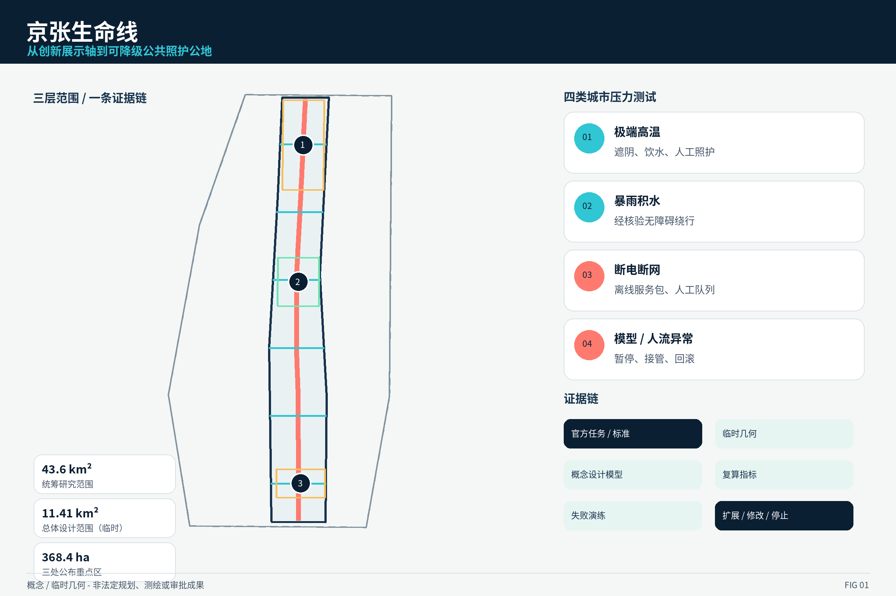
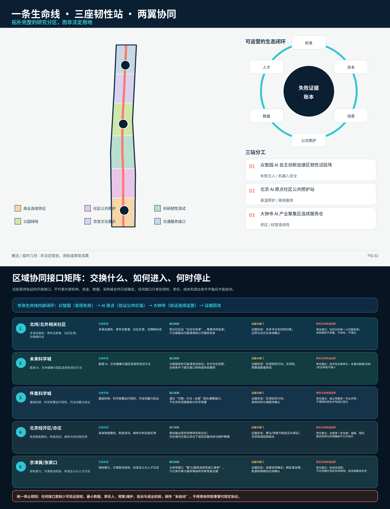
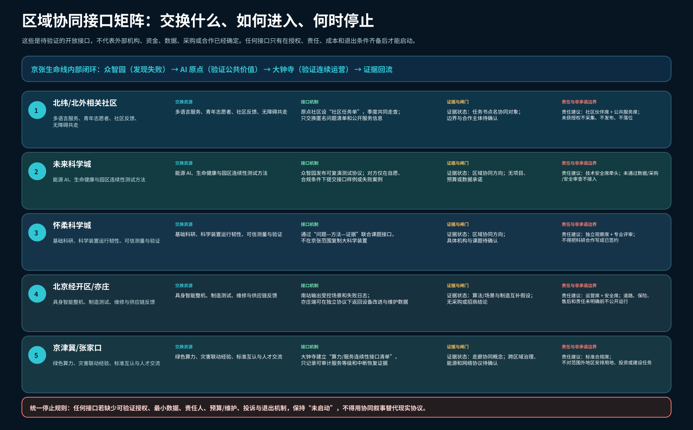
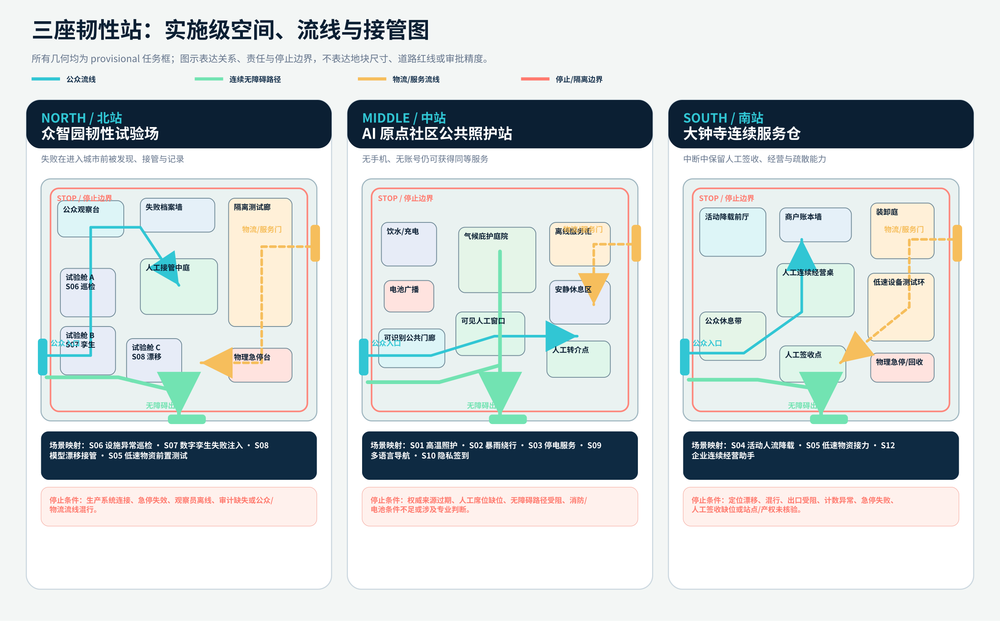
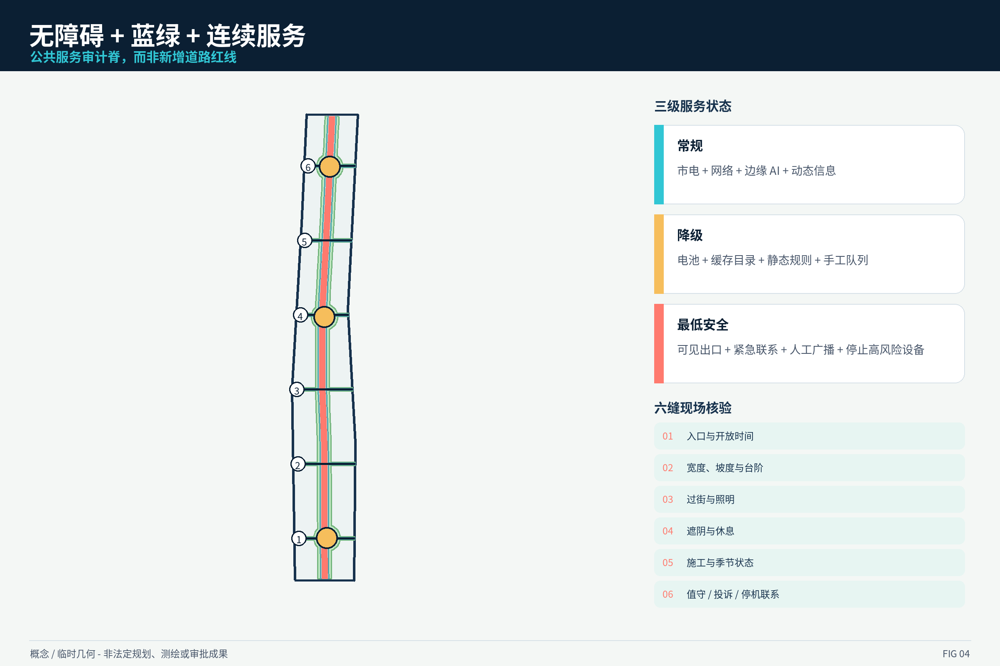
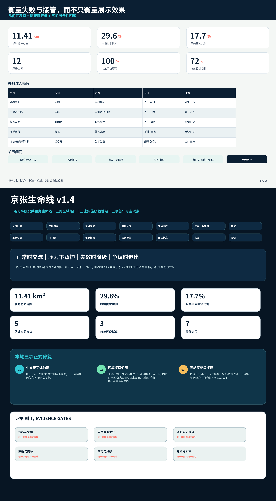

# 京张生命线：可降级城市韧性与公共照护公地

**价值主张。** 百年京张不只是一条展示“未来技术”的走廊，更应是一条在高温、暴雨、停电、网络故障、模型漂移和大型活动拥挤时仍能提供基础公共服务的城市生命线。本方案以“正常时可交流，压力下可照护，失效时可降级，争议时可退出”为总原则，把 AI 放入空间、设施、运营与人工责任的闭环中。72 小时仅作为桌面推演和可逆试点的连续性设计目标，不是既有绩效或实施承诺。[source:AGENT-TASKBOOK] [metric:continuity_target_hours]

## 设计依据与资料清单

本方案建立四级证据秩序。第一级是公告、仓库任务书、标准登记和 source registry，可用于定义任务、审查边界与专业移交；第二级是仓库维护者提供的 provisional geometry，只用于方向性构图和 EPSG:4548 复算；第三级是政府、国际组织与城市官方案例，只用于比较和设计推理；第四级是本包原创的概念几何、图件、原型和测试合同，不得冒充现状、官方控制或公众意见。每条结论都要能回到 `sources.json`、`assumptions.json`、GeoJSON、指标或矩阵。[source:SOURCE-REGISTRY] [depth:existing_conditions_diagnosis]

正式任务依据包括 2026 年项目公告、面向智能体任务书及仓库内的图层枚举、用地代码、道路类型、建筑类型、schema 和校验脚本。总体设计范围和三处重点区域均使用维护者给出的粗略替代 geometry：它们可支撑相对空间关系、面积级别和可视化，但不能定义地块、权属、道路红线、轨道保护、文保控制、市政容量或施工位置。[source:OFFICIAL-ANNOUNCEMENT] [data:geometry/site_boundary.geojson#PROV-SITE-001] [data:geometry/key_areas.geojson#PROV-KEY-001]

背景证据包括世界卫生组织 2026 年高温健康行动指南、联合国减灾署韧性计分卡、应急管理部与自然资源部的应急避难场所专项规划编制指南、北京海绵城市设计标准，以及 Barcelona 气候庇护网络、Helsinki Testbed、Seoul 生活实验室、JTC one-north、NYC Smart City Testbed 等官方案例。它们提示“治理、预警、脆弱人群、真实城市测试、居民参与和不绕过采购”等方法，但不直接给出北京阈值、设施标准、审批或运营主体。[source:WHO-HEAT-HEALTH-2026] [source:MEM-SHELTER-PLANNING-GUIDE]

当前关键缺口有五类：官方 polygon 与地形测绘；现状建筑、权属和结构消防；法定控规与专项控制线；轨道、道路、管网、能源和通信容量；运营、采购、成本、保险、数据授权和应急责任。方案因此把容积率、建筑高度、总建筑量和投资统一记为 `unknown`，把 72 小时、演练频次与场景绩效记为“待验证设计目标”。缺失信息不是文本尾注，而是每个方案动作的启动闸门。[assumption:A-CONTROLS-001] [metric:floor_area_ratio]

## 三层范围工作框架

**统筹研究范围。** 公告给出的约 43.6 平方公里是产业、人才、资本、算力、数据、场景和城市生活协同的研究尺度。该层不做地块控制，而是建立“三区两翼”之间的连续服务协议：中关村科技服务翼提供标准、合规、金融和人才接口，小月河场景赋能翼提供蓝绿、热健康、雨洪和公共空间测试接口，三座韧性站则承担不同的验证与运营角色。[source:OFFICIAL-ANNOUNCEMENT] [metric:coordinated_research_area_sqm]

**总体设计范围。** 本包 provisional polygon 经 EPSG:4548 复算为约 **11.41 平方公里**。这一层提出“一条生命线、三座韧性站、六条无障碍核验缝、两翼接口”的总体城市设计，以连续公共空间、慢行、蓝绿缓冲和可降级服务为骨架；它不是法定控规，所有空间比例均是从提交几何得到的概念设计量。[data:geometry/site_boundary.geojson#PROV-SITE-001] [metric:site_area_sqm]

**重点区域范围。** 众智园 AI 自主创新加速区、北京 AI 原点社区和大钟寺 AI 产业聚集区公布近似面积合计 368.4 公顷。三处临时 polygon 均在总体范围内且不重叠，分别承担“失败可控的试验场”“人人可用的照护站”“供应和经营连续性的服务仓”。详细设计深度聚焦空间结构、建筑载体、交通慢行、公共空间、AI 场景、运营与退出规则，不给出精确地块或审批结论。[data:geometry/key_areas.geojson#PROV-KEY-003] [metric:announced_key_area_total_sqm]

当 official polygon 到位时，替换流程是：锁定版本与来源，重投影到 EPSG:4548，重裁剪九类图层，重新计算面积与比例，重排所有地图，检查重点区包含与重叠，更新指标、矩阵、图册和 self-check。任何无法自动迁移的节点必须回到现场和专业团队核验。这样，provisional 不是“先画了再说”，而是可追踪的临时输入合同。[assumption:A-BOUNDARY-001] [depth:three_level_scope_framework]

## 统筹研究范围产业与未来城市研究

方案名称为 **“京张生命线 / JZ-LIFE”**。标志由两条平行轨道形成开放环：内环代表百年京张的工业记忆，外环代表面向未来的公共照护；环上三处断点对应三座韧性站，刻意保留“可进入、可退出、可人工接管”的开口。品牌不使用企业或铁路官方标识，也不宣称已成为政府品牌。命名将三大定位重组为一句可操作的话：文化是记忆底座，AI 是可审计工具，公共生活是最终绩效。[source:AGENT-TASKBOOK] [assumption:A-HERITAGE-001]

产业生态采用“八要素、三站、两翼、一个证据账本”。八要素是土地、空间、产业、资本、人才、算力、数据和场景；众智园站把算法、机器人、传感器、端侧算力和数字孪生置于隔离测试与失败注入中；原点社区站把高温照护、公共服务、无障碍、人才生活和社区共创放在首位；大钟寺站验证低速物流、市场连续性、企业应急清单和活动人流降载。两翼输出标准、合规、资金和蓝绿场景，证据账本记录每次测试的输入、版本、人工接管、失败、投诉、修复和退出。[source:HD-AI-BELT-2026] [depth:overall_spatial_structure]

全球案例不是“复制对象”，而是用于提炼机制：JTC one-north 的启示是把研发、创业、生活与交流空间邻接，但需补上公共责任与失败退出；Helsinki Testbed 强调真实城市环境、居民共同测试和试点不绕过公共采购；NYC Testbed 提供机构—企业—学术团队的受控试点入口；Barcelona 气候庇护网络说明公共设施可形成可查询的降温网络；WHO 高温指南要求治理、预警、脆弱人群、沟通和评估联动；UNDRR 计分卡强调韧性要能被跨部门复核；Seoul 生活实验室展示技术、社会工作者和居民共同改进服务，但其数据做法不能直接照搬。[source:JTC-ONE-NORTH] [source:HELSINKI-TESTBED] [source:NYC-SMART-CITY-TESTBED]

| 案例 | 可转化机制 | 本方案的限制性改写 |
|---|---|---|
| JTC one-north | 研发、创业、生活、交流邻接 | 加入公共服务底线、人工接管和无账号路径 |
| Helsinki Testbed | 真实城市测试、居民参与、不绕过采购 | 所有试验先隔离、授权、可停止，结果进入证据账本 |
| NYC Smart City Testbed | 城市机构与企业、学术协作 | 不预设采购或合作，先定义责任和退出 |
| Barcelona climate shelters | 可查询的降温服务网络 | 阈值、开放状态和设施能力必须由北京本地协议确认 |
| WHO HHAP | 治理、预警、重点人群、沟通、监测 | 不做医疗诊断，转为城市空间与服务连续性接口 |
| UNDRR Scorecard | 跨部门自评与差距识别 | 用四季演练和公开整改账本替代“韧性口号” |
| Seoul Living Lab | 居民与一线服务者共同改进 | 禁止个人评分、情绪推断和默认监控 |

对 agent.1，本方案用“一条生命线 + 三站 + 两翼”完成总体概念与功能统筹；对 agent.2，用八要素生态、全球案例和四类产业测试构成全栈自主创新体系。产业价值不以设备数量衡量，而以“能否在真实城市条件下发现失败、完成接管、留下证据、形成可采购或可退出的明确结论”衡量。[metric:industrial_test_scenario_count] [standard:PROJECT-AGENT-OPEN-CALL-TASKBOOK]

### 区域协同接口矩阵：从“方向性联动”升级为可审计交换

带内“三区两翼”解决的是京张生命线内部如何形成能力—公共价值—运营证据闭环；带外协同则必须回答五个具体问题：交换什么、由谁发起、用什么证据进入、什么条件下停止、哪些事项明确不构成承诺。本方案因此设置五类开放接口，不把协同对象画进本次用地范围，也不把概念接口写成已签约合作。[source:AGENT-TASKBOOK] [metric:regional_interface_count]

| 协同对象 | 可交换资源 | 接口机制 | 证据状态与进入闸门 | 责任建议与非承诺边界 |
|---|---|---|---|---|
| 北纬/北外相关社区 | 多语言服务、青年志愿者、社区反馈、无障碍共走 | 原点社区发布“社区任务单”，季度共同走查；只交换匿名问题清单与公开服务信息 | 任务书点名协同对象；边界、主体和授权待确认 | 社区伙伴席 + 公共服务席；未获授权不采集、不发布、不落位 |
| 未来科学城 | 能源 AI、生命健康与园区连续性测试方法 | 众智园发布可复演协议，对方可在独立协议下提交接口样例或失败案例 | 区域协同方向；无项目、预算、数据或采购承诺 | 技术安全席；未通过数据、采购和安全审查不接入 |
| 怀柔科学城 | 基础科研、科学装置韧性、可信测量与验证 | 采用“问题—方法—证据”联合课题接口，不在京张范围复制大科学装置 | 区域协同方向；具体机构和课题待确认 | 独立观察席 + 专业评审；不得把研究意向写成已签约 |
| 北京经开区/亦庄 | 具身智能整机、制造测试、维修与供应链反馈 | 南站输出受控场景和失败日志，制造端在独立协议下返回设备改进与维护证据 | 算法/场景与制造互补假设；无采购或招商结论 | 运营席 + 安全席；道路、保险、售后和责任未明确前不公开运行 |
| 京津冀/张家口 | 绿色算力、灾害联动经验、标准互认和人才交流 | 大钟寺维护“算力/服务连续性接口清单”，只记录可审计服务等级与恢复证据 | 走廊协同概念；跨区域治理、能源和网络协议待确认 | 标准合规席；不对范围外地区安排用地、投资或建设任务 |

所有接口默认状态为 `not_activated`。只有当授权、最小数据、责任人、预算/维护、投诉和退出机制均可验证时，才允许进入可逆试点；任一项缺失即保持未启动。区域协同的绩效不是“签了多少合作”，而是完成多少个可复演的交换闭环、发现多少个边界问题、又有多少接口因证据不足被正确停止。

## 总体设计范围城市更新与控规深度城市设计

现状诊断从四种压力切入。第一，线性公园和创新园区可能在日常开放，但在高温、暴雨、停电或拥挤时缺少连续、可确认的公共服务；第二，AI 试点常有“演示成功”而无故障、责任和退出证据；第三，轨道、道路、社区、园区和公共空间之间存在无障碍、开放时间和运营边界；第四，法定控规、竣工、管线和权属资料缺失，容易让概念图被误读为实施图。总体设计因此优先修复“连续性”和“证据性”，而不是先增加地标造型。[source:BEIJING-JZ-PARK-PHASE2-PLAN] [assumption:A-PHASE2-ASBUILT-001]

空间结构为 **一线、三站、六缝、两翼、多点**。一线是约 **9.66 公里**的概念生命线慢行脊，叠合蓝绿缓冲、公共照护、离线导视和人工服务；三站是北部试验场、中部照护站、南部连续服务仓；六缝是横向无障碍核验路线，代表需要逐项核查的过街、站点、社区和园区接口；两翼是中关村标准合规接口和小月河蓝绿场景接口；多点包括可逆遮阴、饮水、充电、休息、广播、手工登记和人工接管桌。[data:geometry/roads.geojson#ROAD-LIFELINE-001] [metric:connector_audit_count]

用地研究层把总体范围完整分为商业连续供应、社区照护、科研测试、公园绿地、文化展示和交通接口六类带状单元。它们采用仓库允许的国土空间用途代码，只为组织城市设计议题；不等同现状用地、规划用地或用地审批。公共空间与绿地跨越用地带，说明韧性服务应连续而非被单一地块截断。建筑包络是可逆适应性改造的候选载体，需经过权属、结构、消防、无障碍和运营六道闸门。[data:geometry/land_use.geojson#LU-001] [standard:MNR-LAND-USE-CLASSIFICATION-GUIDE]

更新策略依次为“审计—微更新—可逆试点—证据复盘—条件性扩展”。审计阶段不建设永久设备，先完成入口、坡度、遮阴、电源、通信、消防、运营和投诉路径清单；微更新优先补充可拆卸遮阴、坐凳、饮水、指引和人工服务桌；试点必须可撤除、可离线、可人工接管；复盘公开失败和纠错；扩展只有在主体、审批、成本、维护和公共利益证据齐备后才进入下一轮。该流程把实施可行性前置，而不是用远期效果图代替近期行动。[depth:phasing_implementation] [assumption:A-OPERATIONS-001]

控规层面的高度、容积率、总建筑量、停车、道路断面和市政容量均保持 unknown。方案可以讨论“低层、可逆、轻触地面、保留视廊、首层开放、屋顶降温”的设计原则，但不写法定数值。任何建筑新建、拆除或改造都必须由正式规划条件和专业审查触发。本包中的建筑基底面积是概念载体复算量，不是现状或批准建设规模。[metric:building_height_m] [depth:development_intensity_controls]

## 重点区域详细设计

`key-areas.png` 已在 v1.4.1 直接替换为专业接续层：明确入口/出口、人工接管点、公众与物流流线、连续无障碍路径、隔离/急停边界、服务组件及 S01-S12 对应关系。图中没有地块尺寸、道路红线或审批精度，任何落位仍由 official polygon、现场和专业审查触发。[depth:three_key_area_detailed_design]

### 北站：众智园 AI 自主创新加速区韧性试验场

定位是“让失败在进入城市之前可见”。空间结构为一条隔离测试廊、一个人工接管中庭、三个可重构试验舱和一处公众观察台。候选建筑优先采用既有载体适应性改造，但本包不判断哪栋建筑可保留；所有设备与机器人测试先在封闭或半封闭环境，用合成/授权数据，不连接生产控制。交通上设置物流与公众步行分离、急停区、观察员视线和设备回收路线。公共空间不是产品秀场，而是展示“失败案例—人工接管—修复版本—是否退出”的证据墙。[data:geometry/key_areas.geojson#PROV-KEY-001] [assumption:A-SITE-VERIFY-001]

核心场景包括基础设施异常巡检、数字孪生失败注入、模型漂移与人工接管、低速物资接力的前置测试。每次测试必须定义数据、边界、观察员、停止条件、回滚、投诉和删除规则。近期可从桌面推演和封闭场内测试开始；若轨道保护、消防、场地授权或混行风险不清楚，不进入公开道路。该站的产业产出是可审计测试报告、接口规范和退出结论，而非“测试次数越多越好”。[source:HELSINKI-TESTBED] [metric:industrial_test_scenario_count]

### 中站：北京 AI 原点社区公共照护站

定位是“没有智能手机也能获得同等服务”。空间结构为可识别的公共门廊、气候庇护庭院、人工窗口、离线服务柜和无障碍休息环。它把高温照护、暴雨绕行、停电公告、多语言公共服务、隐私保护签到和社区活动放在同一处可逆空间中。AI 只帮助检索、翻译、路由和容量提示；医疗、法律、应急处置和权益判断转交有资格人员。所有数字服务都配置纸质地图、电话、人工窗口或现场指引作为等价路径。[data:geometry/key_areas.geojson#PROV-KEY-002] [standard:BARRIER-FREE-ENVIRONMENT-LAW]

建筑策略优先首层开放和轻量化改造：遮阴、自然通风、饮水、充电、可移动坐凳、清晰字体、听觉/触觉提示和电池广播形成最小服务包。蓝绿庭院仅是概念海绵载体，需水文和管网模型验证。运营上由“公共服务值守 + 社区伙伴 + 技术维护 + 隐私联络”四席组成；任何一席缺位，高风险功能自动降级。近期试点先做一个夏季高温周和一次断网断电桌面演练，不预设永久建设。[source:WHO-HEAT-HEALTH-2026] [assumption:A-CLIMATE-THRESHOLD-001]

### 南站：大钟寺 AI 产业聚集区连续服务仓

定位是“让小微企业、活动和社区供应在中断中有手工备份”。空间结构为可转换装卸庭、低速物流测试环、商户连续经营桌、活动人流降载前厅和公共休息带。这里不以自动化替代商户和一线人员，而是把货单、备用联系、开放时间、人工签收、应急电源接口和可撤销的 AI 建议组织成标准化服务包。低速设备只在授权路线、固定时段、观察员可见和急停有效的条件下运行。[data:geometry/key_areas.geojson#PROV-KEY-003] [assumption:A-DAZHONGSI-ANCHOR-001]

南站当前最大的空间风险是 provisional polygon 并非站点锚定，因此本方案不绘制精确站城连廊、换乘距离或产权落位，只提出“取得官方范围—完成站点步行审计—核实装卸和消防—再选址”的移交流程。大型活动场景采用匿名计数、人工限流和静态疏散规则，禁止人脸和个体风险评分。商业连续性助手只提供清单草案，合同、税务、法律和财务决策必须转人工专业服务。[source:NYC-SMART-CITY-TESTBED] [assumption:A-OPERATIONS-001]

三站共享同一空间语言：低层、可逆、易维护、可见出口、人工窗口在前、技术设备在后；共享同一证据语言：谁负责、何时接管、如何停止、怎样申诉、何时删除、什么条件下不扩展。三站不是三个孤立“智慧园区”，而是沿生命线交换人员、物资、经验和失败证据的连续系统。[depth:three_key_area_detailed_design] [metric:resilience_station_count]

## AI 创新生态、人才画像与 AI+ 场景

人物画像不是营销人群，而是用于检查空间和服务是否排除某些人。**PER-01 老年居民**关心遮阴、休息、可信信息、无手机服务和人工帮助；**PER-02 轮椅/行动不便者**关心连续无台阶路线、坡度、过街和可达卫生间；**PER-03 AI 工程师**需要隔离测试、合成数据、可观察失败和明确上线闸门；**PER-04 小微商户**需要停电、物流和人员不足时的连续经营清单；**PER-05 公共/应急运营者**需要权威来源、值守责任、停机权限和可复盘日志；**PER-06 访客/学生**需要多语言、文化背景、可理解风险和不被追踪的公共体验。[metric:persona_count] [assumption:A-DATA-001]

十二张场景卡把“空间—对象—数据—人工—停止—证据”绑定在一起：

| ID | 场景与空间位置 | 正常模式 | 降级/人工等价路径 | 关键停止条件 |
|---|---|---|---|---|
| S01 | 原点社区高温照护路线 | 权威预警 + 开放点路由 | 缓存地图、纸质导视、人工值守 | 来源过期或开放状态未确认 |
| S02 | 小月河翼暴雨无障碍绕行 | 已核验通行状态提示 | 静态安全出口图、现场人员 | 路线未踏勘或积水状态不明 |
| S03 | 原点社区停电连续服务 | 边缘公告、求助和资源清单 | 纸笔登记、电池广播、人工排队 | 消防、电池或值守不足 |
| S04 | 南站活动人流降载 | 匿名计数与分区预约 | 人工限流、单向步行、纸牌 | 出口受阻或计数异常 |
| S05* | 南站低速物资接力测试 | 授权路线设备运行 | 手推车、人工签收 | 定位漂移、混行或急停失败 |
| S06* | 北站设施异常巡检测试 | 合成/授权数据识别 | 人工巡检清单、双人复核 | 数据过期或不确定度超限 |
| S07* | 北站数字孪生失败注入 | 隔离环境注入故障 | 固定脚本、白板推演 | 任何生产连接或越界调用 |
| S08* | 北站模型漂移与接管 | 漂移监测、提示接管 | 静态规则、人工审批 | 审计缺失、责任人离线 |
| S09 | 原点社区多语言服务导航 | 公开信息检索与翻译 | 人工窗口、电话、纸质卡 | 无权威来源或涉及专业判断 |
| S10 | 原点社区隐私保护签到 | 自愿匿名容量签到 | 无设备纸卡、经同意人工 | 无有效同意或出现强迫 |
| S11 | 生命线文化导览 | 可追溯公开史料导览 | 实体铭牌、志愿讲解 | 来源不明或文保审查未通过 |
| S12 | 南站企业连续经营助手 | 中断应对清单草案 | 标准模板、人工咨询 | 涉及法律、税务和高风险决策 |

带星号的 S05-S08 是产业测试验证场景。每张卡在 `simulation.json` 中包含触发、正常模式、可降级模式、最小数据、人工权限、停止规则和验证证据；十二张均有无账号或手工等价路径，因此 `manual_fallback_coverage_ratio=1.0` 表示设计合同覆盖，不表示现场已验证。[data:geometry/public_space.geojson#PUBLIC-LIFELINE-001] [metric:manual_fallback_coverage_ratio]

三类可测试原型形成比“概念场景”更深的证据层。**PT-01 离线服务包**测试断网和主电源中断后的缓存、纸图、广播、手工队列及恢复删除；**PT-02 人工接管时钟**注入漂移、过期数据和责任人缺位，测量暂停、解释、接管和回滚；**PT-03 可逆公共空间组件**把遮阴、饮水、充电、无障碍休息、人工桌和物流湾做成季节性模块，接受消防、维护、拥挤和公众反馈检查。[source:UNDRR-RESILIENCE-SCORECARD] [metric:scenario_card_count]

统一 AI 治理合同包含六项硬约束：最小必要数据；权威来源和时间戳；模型置信度不替代专业责任；人工可暂停、覆盖、回滚；公众可解释、申诉、退出；失败、投诉和纠错进入证据账本。禁止人脸识别、情绪推断、通讯录关系分析、持续精确轨迹、跨场景身份拼接和以 AI 结果直接触发医疗、执法、规划许可或高风险资源分配。[standard:GENERATIVE-AI-INTERIM-MEASURES] [assumption:A-AI-SAFETY-001]

## 用地、建筑规模与拆改留方案

`geometry/land_use.geojson` 以六个拓扑连续分区完整覆盖 provisional site，分别使用 09、0702、0802、1401、0803 和 1207 等仓库允许代码，承担连续供应、社区照护、科研测试、公园绿地、文化展示和交通接口议题。分区边界是研究切片，不能用于地籍、用地审批或现状判断。用地表达的关键不是“某块地变成什么”，而是确认公共照护、测试、蓝绿和交通接口能否跨地块连续。[data:geometry/land_use.geojson#LU-004] [standard:MNR-LAND-USE-CLASSIFICATION-GUIDE]

绿地概念层约占总体范围 **29.6%**，公共空间概念层约占 **17.7%**；二者允许重叠，因为一处降温公地既可能是绿地也是公共服务空间。建筑候选包络占地约 **4.2%**，仅表示适应性改造和三站载体的概念需求，不代表现状建筑密度。以上指标由提交 GeoJSON 复算，官方边界、现场或方案调整后必须同步更新。[metric:green_ratio] [metric:public_space_ratio] [metric:building_footprint_ratio]

拆改留不做“先分类后核验”，而采用六道决策闸门：权属与使用权；结构、消防和抗震；遗产与城市风貌；无障碍和公共可达；能源、通信、给排水及维护；运营主体与全生命周期成本。通过全部闸门的载体才可进入“保留并轻改”；局部不满足但可逆修复的进入“限期改造”；存在重大安全或规划冲突的对象由专业团队另行研究。当前所有包络均标注 `pending_field_structure_ownership_review`，本包不作拆除结论。[data:geometry/buildings.geojson#BLDG-001] [depth:retain_renovate_demolish]

建筑形态遵循“人工在前、设备在后；低层可逆、轻触地面；连续遮阴、可见出口；保留京张工业尺度与材料诚实；屋顶优先降温、光伏/储能仅作待工程验证接口”。地标也不是高塔竞赛，而是三种公共证据空间：北站的“失败档案墙”、中站的“人工接管亭”、南站的“连续经营账本”。高度、退线、容积率、总建筑量和地下空间均不设数值，等待法定控规、测绘和工程条件。[metric:floor_area_ratio] [metric:building_height_m]

空间供给采用“基础包 + 季节包 + 事件包”。基础包是全天可理解的导视、坐凳、人工求助和无障碍；季节包为夏季遮阴饮水、雨季可移动挡水与绕行提示；事件包为临时物流、活动限流、公共演练和技术测试。所有包均应可拆除、可维修、可转为人工模式，避免依赖单一供应商或高维护设备。[assumption:A-COST-001] [depth:height_massing_character]

## 交通、轨道、市政与公共服务设施

交通策略先把生命线作为 **慢行与公共服务审计脊**，而不是新增道路。六条横向核验缝分别检查社区—园区、站点—公共空间、东西向过街和可能的轨道界面。每条缝需记录入口、宽度、坡度、台阶、过街时间、照明、遮阴、开放时间、施工占用、冬季和雨季状态；未完成踏勘前，图上路线只表达“需要连通的问题”。机动车、非机动车、低速设备和步行在重点区采用时间与空间分离，机器人不得在开放混行环境中无观察员运行。[data:geometry/roads.geojson#ROAD-SEAM-01] [assumption:A-ACCESS-001]

轨道与铁路相关表达保持谨慎：公开资料可说明京张遗址公园和轨道背景，但本包没有轨道保护范围、竣工、出入口、站点步行或施工条件。因此不绘制桥隧、跨线或新增站点，不把 provisional 大钟寺框解释为站点锚定。正式深化需要轨道运营、铁路保护、交通、消防、产权和无障碍联合审查。[source:BEIJING-JZ-PARK-PHASE1] [assumption:A-DAZHONGSI-ANCHOR-001]

市政连续性采用“常规—降级—最低安全”三级服务。常规模式可使用市电、网络、边缘计算和动态信息；降级模式保留电池照明、离线目录、静态规则、手工登记和有限充电；最低安全模式只保留清晰出口、紧急呼叫、人工广播和停止高风险设备。72 小时目标主要用于检查信息、人工值守和最小照护是否连续，不等于建筑能量自给或正式应急设施能力。[metric:continuity_target_hours] [assumption:A-CONTINUITY-TARGET-001]

新型基础设施包括端侧计算、可断开网络、设备身份、时间同步、审计日志、数据删除、备用通信和公开状态牌。所有设备接口应可由不同供应商替换，重要控制采用物理急停和人工许可。传统市政包括饮水、卫生、消防、排水、垃圾、照明、无障碍和应急电源接口；在这些基础条件未确认前，不允许用“智能化”遮盖容量不足。[standard:MEM-SHELTER-PLANNING-GUIDE] [depth:municipal_new_infrastructure]

停车与装卸只提出原则：优先共享、错峰、无障碍泊位和短时装卸；低速物流在南站使用授权时窗；测试车辆在北站有隔离回收区；原点社区把公共步行和无障碍放在首位。数量、位置和道路断面等待交通调查、控规和产权条件，不在本包设定。[metric:connector_audit_count] [assumption:A-CONTROLS-001]

## 蓝绿空间、公共空间与城市风貌

蓝绿系统由生命线缓冲、三站气候庭院和六条横向绿色核验缝组成。其空间目标有四个：降低步行暴露和热压力；为雨洪提供分散、可维护的滞蓄界面；连接京张遗址公园、社区和创新园区；为公共服务、文化导览和受控测试提供可逆场地。提交绿地面积可复算，但没有降雨模型、土壤和管网数据，因此不宣称调蓄量或内涝削减绩效。[source:BEIJING-SPONGE-STANDARD] [assumption:A-HYDROLOGY-001]

高温照护把“凉快”转成可运营服务：开放状态和权威预警时间戳必须可见；提供遮阴、饮水、休息、无障碍、人工帮助和转介；不要求注册；不做健康诊断；闭馆或故障时给出下一处经确认点位与人工电话。Barcelona 气候庇护网络和 WHO 指南启发网络化服务，但北京的触发阈值、开放时间、设施分类和责任主体需本地协议。[source:BARCELONA-CLIMATE-SHELTERS] [source:WHO-HEAT-HEALTH-2026]

城市风貌采用“铁路尺度、工业诚实、照护可见、技术克制、夜间友好”五条原则。材料优先耐久、可维修、可回收；设备柜、传感器和机器人不占据主要公共立面；夜间照明避免炫光和过度媒体化；Logo、字体和导视保持原创且不模仿官方或企业品牌。AI 不是霓虹屏幕，而是隐藏在清晰服务流程和可见人工责任之后。[standard:MOHURD-URBAN-DESIGN-MEASURES] [assumption:A-HERITAGE-001]

三处“AI 朝圣地标”不是纪念某个模型或企业，而是纪念公共贡献。**北站失败档案墙**展示被发现并修复的模型、机器人和基础设施失败；**中站人工接管亭**把暂停、申诉、退出和无账号服务做成可见空间；**南站连续经营账本**记录商户、社区与运营者如何在中断中互助。每个地标都附来源、版本、纠错和撤下规则，未获文保、场地和安全审查前只作为概念展示。[metric:landmark_count] [source:BEIJING-JZ-PARK-PHASE1]

文化叙事以“铁路连接城市—创新连接知识—生命线连接照护”为三幕。第一幕讲京张工程、工业和城市生长；第二幕讲中关村、科研、开发者和开放协作；第三幕讲未来城市的技术价值取决于是否让老人、残障人士、商户、访客和一线运营者在压力下仍有选择。导览可由 AI 检索和翻译，但史实必须可追溯，争议内容可纠错，线下铭牌和志愿讲解始终可用。[source:BEIJING-JZ-PARK-PHASE2-PLAN] [data:geometry/public_space.geojson#PUBLIC-LIFELINE-001]

## 更新项目清单、实施政策与分期计划

更新项目按“先证据、后建设”排序，共十二项：P01 官方边界与现状资料移交；P02 六缝无障碍和开放状态踏勘；P03 三站运营责任与停机权协议；P04 原点社区夏季可逆气候庇护；P05 离线服务包与人工队列演练；P06 北站失败注入实验室；P07 南站低速物资接力封闭测试；P08 生命线导视和公共求助最小包；P09 蓝绿水文与管网专项模型；P10 三处贡献地标的文保和公众审查；P11 证据账本与投诉纠错机制；P12 独立成本、维护、采购和扩展评估。[metric:project_count] [data:geometry/phasing.geojson#PHASE-01]

**近期 0-18 个月**只做资料、踏勘、桌面演练和可逆试点，优先验证高温、停电、人工接管与无障碍；**中期 18-36 个月**在取得场地和专业审查后联调三站，实施必要的公共空间微更新；**远期 36-72 个月**根据证据决定扩展、修改或终止。每一阶段都设置“不扩展条件”：无主体、无预算、无维护、无投诉路径、无停机权、无消防/无障碍/隐私审查，或试点未形成可复演证据。[depth:phasing_implementation] [assumption:A-OPERATIONS-001]

政策建议是建立“城市试验许可证 + 公共利益合同 + 失败证据账本”三件套。许可证明确空间、时间、数据、设备、观察员和停止条件；公共利益合同明确无账号等价、无障碍、人工责任、数据删除和公众申诉；证据账本记录成功、失败、投诉、修复、回滚和退出。试点不能绕过采购、规划、道路、消防、数据或应急规则，也不能以“创新”为由把维护成本转给公共空间运营者。[source:HELSINKI-TESTBED] [assumption:A-COST-001]

长期运营采用“4+1 席位”：公共服务/场地运营席、技术与网络安全席、无障碍与社区伙伴席、隐私与投诉席，加一个可独立宣布暂停的安全负责人。季度演练主题依次为断网断电、高温照护、暴雨无障碍、拥挤与供应连续性；年度公开报告不仅列成果，也列失败、未解决缺口和终止项目。演练次数是概念运营目标，不代表任何机构已承诺。[metric:planned_rehearsal_count_per_year] [assumption:A-OPERATIONS-001]

### 首年三项可逆试点、验收证据与责任接口

首年不以永久建设开局，而用三个可以明确判定成功或失败的试点验证方案核心主张。每项试点都先指定“建议责任席位”，它只定义应承担的功能，不代表任何现实机构已承诺。

| 首年试点 | 最小动作 | 关键验收证据 | Go / No-Go 决策门 | 退出与回滚 |
|---|---|---|---|---|
| Y1-01 人工接管样板站 | 在原点社区候选载体布置可撤人工窗口、纸质目录、离线服务柜和接管计时器 | 断网/数据过期注入记录；暂停到人工接管的时间；无账号用户完成率；投诉闭环 | 场地授权、公共服务值守、消防/无障碍审查和数据最小化均通过才 Go | 任一高风险服务只能由 AI 进入、接管席缺位或投诉不可处理即停用并恢复纯人工服务 |
| Y1-02 连续照护核验缝 | 选择一条不涉及永久工程的代表性路径，完成入口、坡度、遮阴、静态导视、断网导航和人工求助核验 | 全程无台阶/可替代路径记录；夜间与雨天复查；绕行距离；故障时纸图和人工求助可用性 | 权属/开放时间、过街安全、无障碍连续性和维护责任明确才 Go | 路径任何关键段不可达、开放状态不可确认或维护无主体即撤下“连续路线”标识 |
| Y1-03 可降级产业测试场 | 在众智园封闭环境注入断电、断网、数据过期、模型漂移和设备故障 | 急停、隔离、人工复核、回滚和证据日志；零生产连接；失败案例修复报告 | 场地、保险、观察员、网络隔离、设备回收和责任协议全部通过才 Go | 生产连接、急停失效、责任人离线或公众/物流混行即中止并封存版本 |

**责任矩阵。** 建议设置七席：授权/场地、公共服务、运营维护、技术安全、数据与隐私、无障碍/社区、独立观察。启动前必须把每一项 `Responsible / Accountable / Consulted / Informed` 写进试点协议；没有最终停机权的试点不得开始。

**全生命周期成本闸门。** 在首年只采用 L/M/H 级别估算，不伪造金额；但必须覆盖设计与审批、构件与设备、能源与通信、人工值守、清洁维修、软件/模型更新、保险与培训、退出拆除八类成本，并明确资金来源假设、年度维护责任和最大可接受退出成本。未完成独立成本复核不得从试点转为永久建设。

**服务水平证据。** 公开界面至少记录来源新鲜度、系统状态、人工接管计时、无账号等价、申诉响应、故障恢复和撤下决定。72 小时仍是待验证设计目标；首年只证明“失败时能否安全降级与留下证据”，不宣称已经形成正式应急能力。[metric:first_year_pilot_count] [metric:responsibility_seat_count] [assumption:A-PILOT-AUTH-001]

全球活动体系命名为 **Life-Line Open Rehearsal / 生命线开放演练**，包括开发者红队周、无障碍共走、气候照护季、低速物流安全日、京张记忆夜校和城市连续性论坛。活动以受控测试、知识交换和问题修复为目标，不把公众当作未经同意的实验对象。招引转化看重审计、维护、人工接管和跨供应商兼容，而不是单次演示效果。[source:NYC-SMART-CITY-TESTBED] [standard:PROJECT-AGENT-OPEN-CALL-TASKBOOK]

## 指标体系、面积复算与合规矩阵

核心空间指标全部从提交几何在 EPSG:4548 中复算：总体范围约 **11.41 平方公里**，绿地概念比例 **29.6%**，公共空间概念比例 **17.7%**，建筑候选包络比例 **4.2%**，生命线长度约 **9.66 公里**。绿地和公共空间可重叠，建筑包络不是现状；面积精度受 provisional boundary 限制。`metrics.json` 给出公式、来源、置信度和假设，HTML 的核心数值与其严格一致。[metric:site_area_sqm] [metric:green_ratio] [metric:public_space_ratio]

| 指标 | 本包值/状态 | 设计含义 | 证据与限制 |
|---|---:|---|---|
| 总体范围面积 | 11,412,825 sqm | 所有比例的概念分母 | provisional polygon，官方到位后全量重算 |
| 绿地概念比例 | 29.6% | 降温、雨洪、生物与慢行的复合载体 | 面积可复算，水文绩效未知 |
| 公共空间概念比例 | 17.7% | 无账号服务、人工接管、休息和演练空间 | 不代表已开放或产权状态 |
| 建筑包络比例 | 4.2% | 可逆改造载体需求 | 不是现状建筑或批准规模 |
| 生命线长度 | 9.66 km | 连续服务审计脊 | 不是新增道路或已建连续路线 |
| 场景卡 | 12 | 空间、数据、人工、停止和证据闭环 | 其中 4 项产业测试 |
| 人工等价覆盖 | 100% 设计合同 | 所有数字服务都有无账号/手工路径 | 待现场验证，不是绩效认证 |
| 72 小时连续性 | 设计目标 | 用于失败注入与复盘 | 非既有能力或承诺 |
| FAR/高度/成本 | unknown | 防止概念越权 | 待控规、测绘、工程和造价 |

指标不是“越大越好”。绿地和公共空间比例用于检查公共照护是否获得足够空间；建筑包络比例用于控制轻量化和可逆性；场景数必须对应测试、人工和退出；72 小时必须通过分阶段演练验证。若一项 AI 功能不能在失效时安全降级，即使正常模式准确率高，也不进入公共空间扩展。[source:UNDRR-RESILIENCE-SCORECARD] [assumption:A-CONTINUITY-TARGET-001]

23 项官方与 Agent 任务在 `compliance_matrix.json` 中逐项指向正文、图层、指标、图册、来源、标准、假设和四道自检；5 项强制专业标准与扩展标准在 `standard_matrix.json` 中区分 addressed 与 data_gap；15 项设计深度在 `design_depth_matrix.json` 中覆盖现状诊断、范围、总体结构、用地、强度、建筑、交通、市政、蓝绿、重点区、项目、分期、指标和风险。结构化矩阵是审计索引，不替代正文和图纸。[depth:metrics_recalculation] [standard:PROJECT-OFFICIAL-ANNOUNCEMENT]

## 风险、版权与合规说明

风险按八个维度管理。**数据隐私**：禁止生物识别、关系画像和持续轨迹，最小数据、短期删除、无账号等价；**实施复杂度**：用可逆组件和三阶段闸门，未确认主体不扩展；**公众接受度**：把人工窗口、投诉、解释、退出放在设备之前；**运维成本**：跨供应商、可维修、物理急停，成本 unknown；**政策不确定性**：试点不绕过规划、采购、消防、道路、数据和应急制度；**空间争议**：provisional 全程可见，官方 geometry 到位后重算；**技术成熟度**：隔离测试、失败注入、漂移监测和回滚；**公平包容**：无障碍共走、纸质/电话/人工等价、重点人群参与。[assumption:A-DATA-001] [assumption:A-COST-001]

最关键的风险不是“AI 不够聪明”，而是服务在错误时仍被相信。因此公众界面必须显示来源、更新时间、服务状态和人工责任；当置信度低、数据过期、网络中断、模型漂移、审计缺失或值守人员离线时，系统必须降级或停止。高风险行动只由有权限的人作出，模型输出保留为建议和证据，不直接控制公共安全、医疗、规划许可或权益分配。[assumption:A-AI-SAFETY-001] [standard:GENERATIVE-AI-INTERIM-MEASURES]

应急和健康边界明确：三座韧性站是城市设计概念，不是经认定的应急避难场所、医疗机构或指挥中心；高温路线不是医疗建议；72 小时不是认证；低速物流和机器人不是获准道路运营；离线电源不是建筑能源保障。相关场景需在本地气象、卫健、应急、消防、交通、轨道、数据和场地责任协议下深化。[source:MEM-SHELTER-PLANNING-GUIDE] [assumption:A-CLIMATE-THRESHOLD-001]

版权方面，文字、Logo、图件、HTML、PDF 排版和概念几何为本次原创生成；没有使用第三方人物、企业标识、地图瓦片、照片、音乐或视频。外部案例只引用公开事实并登记于 `sources.json`，不再分发其媒体。所有图都标注概念/provisional 状态，不把生成图像冒充现场或公众意见。中文 HTML 可见层使用 Noto Sans CJK SC 的构建期字形轮廓（SIL Open Font License 1.1），不随包分发字体文件；同位透明语义层保留搜索、复制和辅助技术文本。这样即使审查环境没有任何 CJK 系统字体，标题、正文、表格、脚注与证据标签仍由矢量路径显示。完整许可与生成方法见 `report/copyright_statement.md`。[source:SOURCE-REGISTRY] [assumption:A-HERITAGE-001]

提交前，账号持有人必须阅读全部材料、确认模型披露、运行仓库当前版本四道 self-check，并对 PR 承担责任。任何文件改动都会使 manifest hash 和 self-check 失效，需要重新运行。由于当前工作区无法代表维护者环境，本包不声称已经获得官方四门 PASS，也不声称会被选中；其目标是让维护者能快速复核空间、指标、风险和实施证据。[depth:risk_missing_data] [data:geometry/constraints.geojson]

## 参考资料

1. 海淀区项目公告：三层范围、重点区域与专业设计任务。[source:OFFICIAL-ANNOUNCEMENT]
2. `agent_taskbook.json`：十条共创原则、三大定位、五大功能、三区两翼和六项 Agent 任务。[source:AGENT-TASKBOOK]
3. 仓库 site package、source registry、schemas、enums 与 standards：提交与证据合同。[source:SITE-PACKAGE]
4. 北京市园林绿化局、北京市人民政府关于京张铁路遗址公园的公开资料。[source:BEIJING-JZ-PARK-PHASE1]
5. WHO《Heat-health action plans: guidance, second edition》，2026。[source:WHO-HEAT-HEALTH-2026]
6. 应急管理部、自然资源部《应急避难场所专项规划编制指南》，应急〔2023〕135号。[source:MEM-SHELTER-PLANNING-GUIDE]
7. 北京市《海绵城市建设设计标准》DB11/T 1743-2020。[source:BEIJING-SPONGE-STANDARD]
8. UNDRR Disaster Resilience Scorecard。[source:UNDRR-RESILIENCE-SCORECARD]
9. Barcelona Climate Shelters、JTC one-north、Helsinki Testbed、Seoul Living Lab 与 NYC Smart City Testbed 官方资料，作为机制比较，不作为项目控制依据。[source:BARCELONA-CLIMATE-SHELTERS]

结构化完整清单见 `sources.json`；来源使用限制、访问日期、发布主体和不可推断内容均在该文件记录。核心空间证据见九类 GeoJSON，指标见 `metrics.json`，任务覆盖、专业标准和设计深度分别见三类矩阵，失败注入和人工接管合同见 `simulation.json`。[data:geometry/phasing.geojson#PHASE-03] [metric:phase_count]
