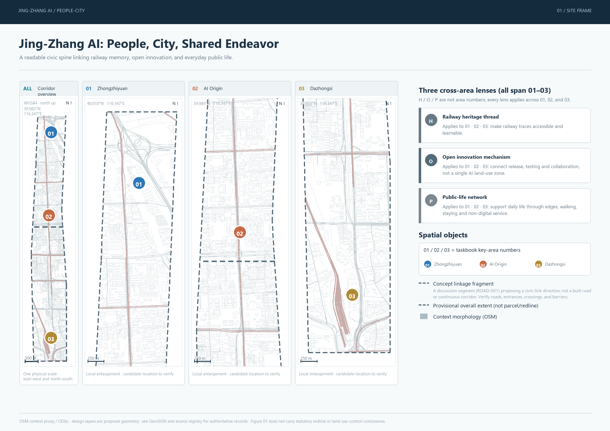
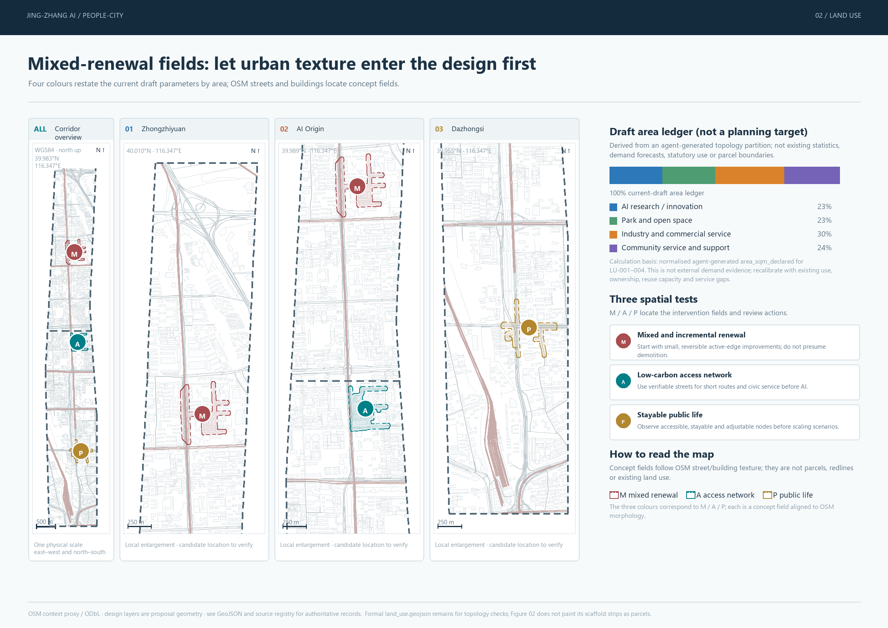
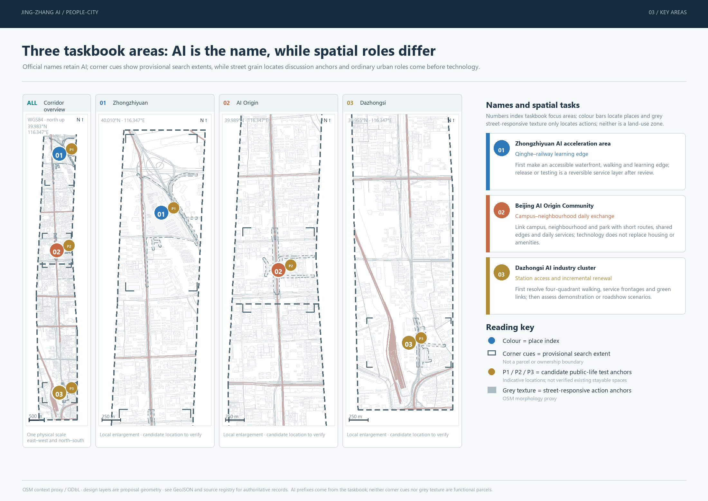
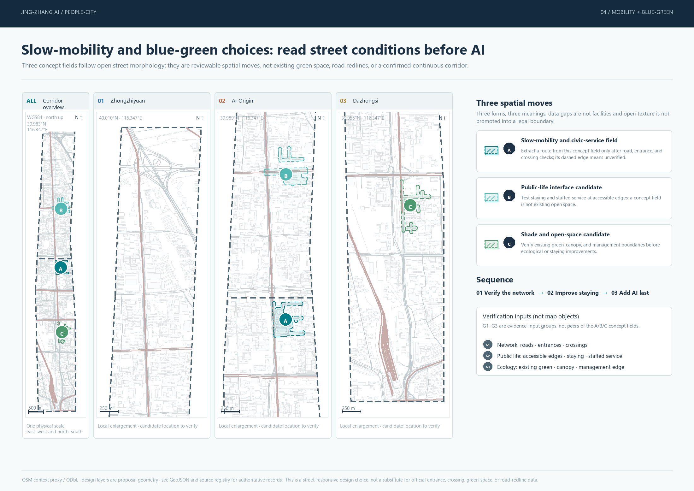
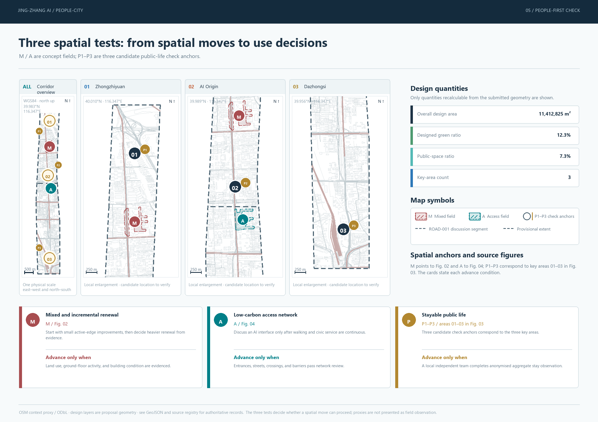

# Jing-Zhang AI: A New Chapter for People, City, and Shared Endeavor

This proposal treats the Jing-Zhang railway heritage as a working civic interface rather than a historical backdrop. Its design objective uses three stations and one corridor, five user groups, and twelve everyday scenarios to organize a public-life chain among Zhongzhiyuan, the Beijing AI Origin Community, and Dazhongsi. Research releases, enterprise testing, community services, youth learning, and international exchange are embedded in urban space that prioritizes walking, cycling, and public transport. The current ROAD-001 is only a conceptual segment near the AI Origin Community and does not prove a continuous connection among the three key areas; the actual corridor must be rebuilt after road, station-entrance, crossing, and barrier data are obtained. Every spatial move is a conceptual recommendation for professional development, not a statutory plan, engineering-feasibility finding, or government implementation commitment. [source:AGENT-TASKBOOK] [data:geometry/roads.geojson#ROAD-001] [depth:overall_spatial_structure]

People, City, and Shared Endeavor connects three layers of value into a new chapter: a railway timeline preserves the industrial memory of the centennial Jing-Zhang line; an innovation-collaboration chain connects universities, enterprises, communities, and open-source developers; and a public-life chain makes AI capabilities tangible to residents through accessible wayfinding, urban diagnostics, low-carbon travel, and public cultural services. The proposed visual identity combines parallel rails and open brackets into the letters JZ, using railway crimson, algorithm cyan, and park green. Every wayfinding element retains Chinese, English, tactile, and high-contrast versions. [standard:BARRIER-FREE-ENVIRONMENT-LAW] [depth:urban_character_and_identity]

## Design Basis and Source List

The primary basis for this proposal is the Prequalification Announcement for the International Urban Design Open Call for the Centennial Jing-Zhang AI Innovation Belt, issued by the Haidian Branch of the Beijing Municipal Commission of Planning and Natural Resources. The machine-readable basis consists of the provisional coarse boundaries, key areas, enumerations, metrics, and source lists registered by maintainers in brief/site-package/. The design process reads design_brief.json, allowed_design_space.json, sources.json, enums/, ranges/, schemas/, data/source_registry.json, and data/processed/agent_fact_pack.md, then uses four processed tables to establish task, scope, permitted-use, and data-gap lists. The people-first urban theories added in this revision are used only to frame questions and define observation methods; site facts must still come from public, rights-cleared, or official material. Every design judgment is separated into traceable sources, recalculable metrics, verifiable layers, and assumptions subject to human review. Narrative cannot replace GeoJSON, the metrics register, the A3 booklet, the A0 boards, or the electronic HTML presentation.

The proposal is not an independent vision statement; it organizes its deliverables from the announcement, the agent-facing taskbook, and the site materials. This section places only the most important evidence beside each judgment [source:OFFICIAL-ANNOUNCEMENT] [source:AGENT-TASKBOOK] [depth:existing_conditions_diagnosis]. Complete source and standards coverage is retained in sources.json, standard_matrix.json, and design_depth_matrix.json rather than duplicating machine indexes in the narrative.

The Source Registry is used within the following limits [source:SOURCE-REGISTRY]:

- data/source_registry.json records the permitted uses of public, rights-cleared, and provisional material.
- The current registry summary contains 7 sources usable for formal work, 1 background source, and 1 provisional-only source.
- The agent must not promote background_only or provisional_only material into an official boundary, statutory regulatory-plan control, formal scoring evidence, or government implementation commitment.

data/processed/agent_fact_pack.md is a reading and navigation layer, not a new authoritative source [source:PROCESSED-FACT-PACK]. It helps the agent organize the three scope levels, three key areas, announcement tasks, agent.1-agent.6, source usability, and missing-data items into a readable proposal. Factual judgments must still return to the registered original materials [source:OFFICIAL-ANNOUNCEMENT] [source:AGENT-TASKBOOK], while sources.json preserves the complete provenance relationships.

Because the official SITE_BOUNDARY and three KEY_AREA polygons have not been supplied, this version uses brief/site-package/geometry/provisional_boundaries.geojson as a temporary constraint. geometry/site_boundary.geojson and geometry/key_areas.geojson are both marked provisional_constraint and official_boundary=false. They may support proposal generation, self-checking, visualization, data discovery, and design discussion only; they are not official planning boundaries, approval evidence, precise-area evidence, or statutory controls. This organizer-side data gap does not block content scoring. When authenticated official polygons are supplied, the site boundary, key areas, land use, roads, green space, public space, buildings, phasing, and metrics must all be recalculated.

The boundary status of this submission is: **provisional boundary, precision warning retained, and recalculation required after official data release; content scoring remains eligible**. The spatial structure, scenarios, projects, and metrics are therefore written so they can be discussed and audited and then recalculated after the official boundary is substituted. When the official boundary and key-area polygons are updated, the design layers, metrics, drawings, and HTML will be regenerated together rather than changing only one file.

The boundary explanation can be checked against the overall-scope layer and area calculation [data:geometry/site_boundary.geojson#SITE-001] [metric:site_area_sqm]. The three key areas can be checked against their independent layer and count metric [data:geometry/key_areas.geojson#PROV-KEY-001] [metric:key_area_count]. Readers can therefore move from the narrative to the evidence without first parsing a block of machine identifiers.

## Three-Level Scope Framework

The proposal follows the three levels defined by the announcement. The 43.6-square-kilometre Coordinated Research Area addresses the AI industrial ecosystem, strategic positioning, innovation chain, and future urban form. The 11.4-square-kilometre Overall Design Area covers urban and industrial areas approximately 1-2 kilometres around the Jing-Zhang Railway Heritage Park and must establish an overall urban-renewal framework, industrial-space layout, transport and municipal support, and urban-character controls. The Key-Area Detailed Design Area covers 368.4 hectares across three sites and must define functions and uses, building scale, demolish-renovate-retain classifications, public-space connections, and transport organization. Every level is mapped in compliance_matrix.json, ensuring that the mandatory tasks in announcement sections 1.3, 1.4, and 1.5 and agent.1-agent.6 have narrative, layer, metric, drawing, and HTML evidence.

The depth of the three-level framework is governed by [depth:three_level_scope_framework] and [depth:overall_spatial_structure]. Spatial evidence comes from [data:geometry/site_boundary.geojson#SITE-001] and [data:geometry/key_areas.geojson#PROV-KEY-001]; the task basis comes from [standard:PROJECT-OFFICIAL-ANNOUNCEMENT]; and the three-scope table in project_scope_summary.csv, indexed through [source:PROCESSED-FACT-PACK], provides navigation.

The 23%, 23%, 30%, and 24% shown in Figure 02 are normalised from the four agent-generated `area_sqm_declared` parameters and rounded by the largest-remainder method. They only restate the area composition of the current closed-topology scaffold; they are not demand estimates, proposal priorities, planning targets, or existing statistics. The ledger must be reallocated and recalculated when official land-use and parcel evidence becomes available.

The three levels are not separate sets of drawings. Coordinated research determines judgments about the industrial chain and future urban form; overall design translates those judgments into renewal projects, spatial structure, and facility capacity; and key-area detailed design tests implementation at the level of parcels, buildings, transport, public space, and AI-enabled scenarios. The agent must first lock the official or provisional boundaries and constraints used by the submission, then generate land use, buildings, roads, green space, public space, phasing, and AI-service nodes. Metrics are recalculated from those layers, and the narrative explains which conclusions remain limited by a provisional boundary. No area, ratio, scale, or project count that cannot be recalculated from structured data may be stated as a formal conclusion.

The overall concept is Jing-Zhang AI: A New Chapter for People, City, and Shared Endeavor. The Jing-Zhang Railway Heritage Park forms the historical and public-space axis; Zhongzhiyuan, the Beijing AI Origin Community, and Dazhongsi are the three innovation anchors; and universities, enterprises, communities, and transit stations form an everyday network. Together they create one public-life chain, three key areas with their public nodes, and multiple scenarios with explicit exit conditions. The New Chapter is neither an additional planning boundary nor a corridor filled indiscriminately with AI devices. It first organizes public life through spatial moves, then uses three people-first spatial tests—mixed renewal, accessible network, and public life—to decide whether a scenario can advance. In Figures 01 and 03, 01/02/03 identify the three key areas only. P in Figure 01 is the cross-area “public-life network” narrative line, while P in Figure 02 is one public-life concept field; Figure 05 no longer adds a summary P or connector lines and instead shows P1/P2/P3 from Figure 03 directly. They share a public-life theme but are not the same spatial object. H/O/P are three lenses that span all three areas, while P1/P2/P3 are candidate public-life test anchors within the three areas, not key-area numbers or evidence of existing qualifying public space. Figures 02, 03, and 04 explain the mixed-use interface, key-area tasks and candidate test anchors, and slow-mobility/blue-green system respectively; Figure 05 and the A0 board point these three moves back to one overall map by their plain-language labels. All maps use a WGS84 north-up schematic frame; colours, line types, and numbers in different figures are valid only within that figure's legend.

Railway heritage, open innovation, and public life are not three overlapping functional zones. Railway heritage is a historical and spatial thread across all three focus areas; open innovation is a mode of release, learning, testing, and cross-organization collaboration; and public life is an everyday network of ground-floor edges, walking, staying, and civic services. They may occur together in one place, but are reviewed separately as a thread, an operating mechanism, and a spatial network rather than represented by coincident colour blocks. AI is a service layer introduced only after public access, spatial capacity, human fallback, and governance conditions are met.

| Scope level | Design question | Proposal response | Evidence location |
| --- | --- | --- | --- |
| Coordinated Research Area | How should the AI industrial ecosystem and future urban form be organized? | Establish an innovation chain linking university research, open-source collaboration, enterprise conversion, public experience, and international communication | compliance_matrix.json, standard_matrix.json |
| Overall Design Area | How should industrial space, urban renewal, transport, municipal systems, and urban character be mapped? | Express them jointly through the land-use, building, road, green-space, public-space, and phasing layers | [data:geometry/land_use.geojson#LU-001], [data:geometry/roads.geojson#ROAD-001] |
| Key-Area Detailed Design Area | How can the three sites reach detailed-design depth? | Define positioning, spatial moves, AI scenarios, and implementation dependencies for each site | [data:geometry/key_areas.geojson#PROV-KEY-001], [data:geometry/key_areas.geojson#PROV-KEY-002], [data:geometry/key_areas.geojson#PROV-KEY-003] |

## Coordinated Research Area: Industry and Future City Research

The core task of the Coordinated Research Area is to build a world-class AI innovation ecosystem. The proposal must inventory Haidian's universities and research institutes, leading enterprises, computing, algorithm and data resources, incubators, listed companies, unicorns, and technology-service providers, then define a spatial coordination framework for AI innovation, industry, talent, and urban-service chains. The naming and logo system should strengthen the shared identity of the centennial Jing-Zhang cultural belt, metropolitan AI life-experience belt, and AI integrated-innovation belt. It cannot remain a slogan and must explain its relationship to the industrial ecosystem, public space, and cultural resources. The agent-facing taskbook also requires responses to the Five Functions and coordination of the Three Zones and Two Wings, with a naming system, visual identity, overall spatial-structure diagram, scenario access, and operating mechanism capable of further development. [source:AGENT-TASKBOOK] and [standard:PROJECT-AGENT-OPEN-CALL-TASKBOOK] identify these as open-call tasks for agents rather than statutory planning controls.

The coordinated research does not introduce false precision or new planning boundaries. Under [standard:MOHURD-URBAN-DESIGN-MEASURES], it coordinates urban character, public space, and building layout, then links those judgments to [data:geometry/land_use.geojson#LU-001], [data:geometry/public_space.geojson#PUBLIC-001], and [depth:overall_spatial_structure]. The industrial strategy must ultimately become a visible, auditable spatial structure.

Future-city research must explain how artificial intelligence changes work, daily life, social interaction, learning, mobility, and public services. AI transport, continuous green space, innovation-service facilities, and an international living and working environment must become locatable functional areas, nodes, corridors, and scenarios instead of remaining a generic technology vision. The agent should place industrial-strategy indicators, an AI innovation index, talent density, spatial-supply types, and priority areas for vertical AI-enabled applications in the metrics system, distinguishing official facts, design recommendations, and items awaiting calibration against formal data. Global AI events, developer communities, open scenarios, or pilgrimage routes must be described as conceptual recommendations, reference proposals, or subjects for professional development, never as confirmed government events or implementation arrangements.

### Three People-First Spatial Tests

The three tests translate registered urban-design research into spatial decisions rather than turning authors' names into graphic labels. First, **mixed and incremental renewal** uses different primary uses, short route choices, and gradually improved ground-floor edges to support daily activity across times; the M field in Figure 02 and M in Figure 05 use the same geographic anchor and local-view extent. Second, **low-carbon access** makes station, walking, cycling, and public-transport continuity a prerequisite for any smart-mobility interface; A in Figure 04 is only a candidate slow-mobility and civic-service field following open street morphology, from which a continuous route can be extracted only after entrances, crossings, and barriers are verified; Figure 05 and the A0 board use the same A anchor. Third, **stayable, observable, adjustable public life** asks how people walk, stay, sit, talk, and obtain non-digital services before spatial components or AI scenarios are selected. In Figure 03, 01-03 always denote the three key areas; P1-P3 are candidate public-life check anchors paired with those areas. Figure 05 shows P1-P3 directly, without a non-geographic summary P or connector lines; these presentation anchors do not claim that stayable public spaces already exist. [source:JACOBS-1961-DEATH-LIFE] [source:NEWMAN-KENWORTHY-1999-SUSTAINABILITY-CITIES] [source:GEHL-2010-CITIES-FOR-PEOPLE]

| Spatial test | Visible spatial move | Figure focus | Review that decides whether it can advance |
| --- | --- | --- | --- |
| Mixed and incremental renewal | Bring research, service, community, and open-space uses together at shared ground-floor edges; start with small, reversible improvements and retain usable buildings | M in Figure 02; “mixed renewal” in Figure 05 / A0 | Check official or rights-cleared land use, ground-floor use, building condition, and time-of-day surveys; without demonstrated diversity or public access, enterprise-only space cannot enter a trial |
| Low-carbon access network | Propose candidate walking, cycling, civic-service, and railway-memory links along verifiable street morphology before adding AI services | A in Figure 04; “accessible network” in Figure 05 / A0 | Check station entrances, buses, crossings, barriers, and network analysis; without a verifiable network, the proposal does not claim a continuous slow-mobility corridor |
| Stayable, observable, adjustable public life | Screen accessible, stayable, observable, adjustable public-life candidate locations and non-digital service fallbacks in the three key areas | Key areas 01-03 and candidate anchors P1-P3 in Figure 03; Figure 05 reuses P1-P3 directly | An independent local team conducts anonymized aggregate observation; without observation, candidate anchors are not called public spaces and the proposal does not claim that the site is already safe, comfortable, or vital |

The three principles are admission conditions with veto power, not stylistic references. Data audit and human review are neither candidate links, candidate shade/open-space fields, key areas, boundaries, nor land-use classes in the figures, and they are not parallel to them. Their sequence is: spatial move proposed -> compliant-source and recalculable-data audit -> human professional review -> trial, adjustment, or exit. Spatial figures draw only the objects proposed in the first step; audit and review decide whether the objects and AI scenarios may enter the next step. Because the participant cannot visit the site, this revision uses compliant open networks, public directories, and remote-sensing material only to establish location-selection and morphology proxy baselines, preserving licenses, queries, raw hashes, coordinate systems, and processing limitations. A local professional team or rights-cleared community partner must later complete anonymized observation. The acquired OSM mobility and buildings are low-contrast context morphology only, not an official boundary, redline, field observation, or formal metric basis. Data that are unavailable or cannot be recalculated do not appear in figures as `unknown` or "to be supplemented" design information; their source boundary, data requirement, and review path remain in assumptions.json, metrics.json, and visual/assets/people-first-research.json. Proxy baselines can support location selection and diagnosis, but cannot replace human review.

## Overall Design Area: Urban Renewal and Regulatory-Plan-Level Urban Design

The Overall Design Area translates urban-renewal judgments into auditable objects. Land use and ground-floor uses support mixed daily activity; road and station networks support low-carbon access; and public-space and frontage surveys support stayable public life. The current land_use.geojson, buildings.geojson, and roads.geojson are validation structures rather than a complete existing-conditions baseline. Until official or rights-cleared data are available, the proposal does not use them to infer actual block length, building age, ground-floor vitality, or station coverage.

Under [standard:MOHURD-CONTROL-DETAILED-PLANNING], this section separates regulatory-plan-level content into reviewable objects. [data:geometry/land_use.geojson#LU-001] represents land-use structure, [data:geometry/buildings.geojson#BLDG-001] represents building footprints, and [data:geometry/roads.geojson#ROAD-001] represents transport organization. [metric:building_footprint_area_sqm] checks building-footprint area, while [depth:land_use_layout] and [depth:development_intensity_controls] govern deliverable depth.

The overall design must also support transport, rail, municipal systems, and public facilities. It should define spatial layouts and implementation paths for transit-station integration, road-network circulation, bicycle parking, general parking supply, innovation-service platforms, talent and daily-life services, new infrastructure, distributed energy, and edge computing. Building height, development intensity, road boundaries, setbacks, and facility standards must be labeled as pending formal regulatory-plan conditions when official controls are absent; agent-generated estimates may not be presented as approved indicators.

## Detailed Design of Key Areas

Detailed design of the key areas is mandatory. “AI” remains in the three formal area names because it is the taskbook's scope label; it does not make every spatial task an AI installation. Zhongzhiyuan should first turn the Qinghe edge and railway memory into accessible demonstration, learning, open-release, and low-carbon exchange space. The Beijing AI Origin Community should prioritize shared services, daily support, and short campus-neighbourhood-park links; AI scenarios are an optional, reversible service layer. Dazhongsi should first resolve four-quadrant station walking connections, active service frontages, mixed use of planned green space, and incremental renewal before discussing smart devices, content consumption, or international roadshows. In Figure 03, 01-03 denote only the three key areas; adjacent P1-P3 symbols are public-life check anchors pending field verification, and key-area colours do not denote land-use classes.

The three key-area designs must cite [data:geometry/key_areas.geojson#PROV-KEY-001], [data:geometry/key_areas.geojson#PROV-KEY-002], and [data:geometry/key_areas.geojson#PROV-KEY-003]. [depth:three_key_area_detailed_design] checks whether they reach the depth of an Integrated Planning Implementation Plan. A generic claim to create a demonstration area without functional, building, transport, public-space, and implementation-project evidence is incomplete.

All three key areas must appear in geometry/key_areas.geojson. When the repository provides official polygons, they must be used as official_constraint; when official polygons are missing, provisional_constraint may be used temporarily, but the narrative, HTML, sources, assumptions, and self-check must state that it is not evidence for formal scoring or approval. compliance_matrix.json must separately cover announcement tasks 1.5.3.1, 1.5.3.2, and 1.5.3.3. The design must address functions and uses, building scale, building form, demolish-renovate-retain classifications, public-space systems, transport organization, walking and cycling connections, and implementation projects. The HTML should allow reviewers to switch among the three key areas, while the A3 booklet and A0 boards should include an overall plan, local detail drawings, and metrics for each key site.

| Key area | Design positioning | Spatial moves | AI industry and operating scenarios | Evidence |
| --- | --- | --- | --- | --- |
| Zhongzhiyuan AI Independent Innovation Acceleration Area | Garden-style full-stack independent innovation district | Strengthen the Qinghe interface, industrial exhibition, low-carbon innovation exchange, and external transport; use green space for open testing and standards-governance displays | Independent-model testing, standard-setting workshops, safety-governance exhibitions, and low-carbon computing experiences | 01 in Figure 03 is the key-area number; P1 is a candidate public-life test anchor awaiting field review; [data:geometry/key_areas.geojson#PROV-KEY-001], [depth:three_key_area_detailed_design] |
| Beijing AI Origin Community | University-adjacent commercialization and talent community | Connect campuses, innovation parks, and neighbourhoods through walking and cycling; add research-result release, talent services, daily-life support, and open-source collaboration space | Open-source community, research-result release, talent special-zone services, and university-adjacent incubation | 02 in Figure 03 is the key-area number; P2 is a candidate public-life test anchor awaiting field review; [data:geometry/key_areas.geojson#PROV-KEY-002], [source:AGENT-TASKBOOK] |
| Dazhongsi AI Industry Cluster | Urban smart-economy and international-exchange district | Coordinate Dazhongsi Station integration, pedestrian links among four intersection quadrants, commercial services, and public-realm renewal around major enterprises | Agent and smart-device exhibitions, content consumption, data factors, and international roadshows | 03 in Figure 03 is the key-area number; P3 is a candidate public-life test anchor awaiting field review; [data:geometry/key_areas.geojson#PROV-KEY-003], [metric:key_area_count] |

## AI Innovation Ecosystem, Personas, and AI+ Scenarios

The five user profiles are design checks rather than behavioural profiles. They test whether the public realm serves open-source developers, start-up teams, enterprise visitors, nearby residents, and university students and staff at the same time. Every AI-enabled scenario must state its intended users, spatial location, admission question, minimum data, human-service fallback, pause and exit conditions, operating responsibility, and publicly reportable evaluation metric. If any item is missing, the scenario remains a concept card and cannot enter a public-space trial.

AI-enabled scenarios must have clear spatial and governance boundaries. Public-space scenarios cite [data:geometry/public_space.geojson#PUBLIC-001], walking and transport scenarios cite [data:geometry/roads.geojson#ROAD-001], and open-space scenarios cite [data:geometry/green_space.geojson#GREEN-001], [metric:public_space_ratio], and [metric:green_ratio]. These references indicate intended spatial carrier types, but the current single-object layers do not prove actual placement. The agent-facing taskbook requires at least 10 AI-enabled scenario cards, at least 3 industrial testing and validation scenarios, and at least 5 personas. For all ten cards, visual/assets/people-first-research.json records the people-first tests, minimum evidence, human fallback, pause condition, steward function, and public-return metric. Steward functions are operating requirements awaiting assignment, not proof that any organization has accepted an appointment. Actual placement still requires each scenario to be linked to a verified node, public-life baseline, and transport network.

| Persona | Typical needs | Spatial response | Self-check boundary |
| --- | --- | --- | --- |
| Open-source developer | Release, collaboration, testing, and community reputation | Open-source release hall in the AI Origin Community, public code wall, and evening collaboration space | Do not collect individual movement traces; aggregate event data only |
| Start-up team | Affordable workspace, computing access, and product trial space | Shared testing ground in Zhongzhiyuan, edge-computing service point, and standards-governance advice | Computing and data services require separate authorization |
| Leading-enterprise visitor | Exhibition, business meetings, international reception, and recruitment | Dazhongsi international roadshow lounge, transit connection, and improved public realm around major enterprises | Enterprise marks and case material must be rights-cleared |
| Nearby resident | Commuting, recreation, community services, and low-disruption renewal | Jing-Zhang Railway Heritage Park walking and cycling loop, embedded community services, and graded lighting and evening activities | Do not use resident profiles for commercial recommendations |
| University student or staff member | Research commercialization, cross-campus collaboration, and daily walking and cycling | Campus-to-innovation-park connection, commercialization station, and AI learning experience point | Campus data and research outputs require authorization |

| Scenario card | Spatial carrier | Design description |
| --- | --- | --- |
| 01 Open-Source Release Hall | Beijing AI Origin Community | Serves universities, open-source communities, and start-ups with research releases, code-contribution displays, and small roadshows |
| 02 Safety-Governance Sandbox | Zhongzhiyuan | Translates standard setting, safety evaluation, and model red-team testing into a visitable, bookable, and supervised exhibition and collaboration node |
| 03 Edge-Computing Station | Node within the Overall Design Area | Combines public services, enterprise services, and low-carbon energy strategy as a new-infrastructure prototype requiring further development |
| 04 AI Walking and Cycling Navigation | Jing-Zhang Railway Heritage Park activity belt | Uses explainable wayfinding and low-impact sensing to identify network breaks, crowded points, and accessibility needs |
| 05 Dazhongsi International Roadshow Lounge | Dazhongsi AI Industry Cluster | Supports exhibitions, meetings, media releases, and international exchange for agent, smart-device, and content-consumption enterprises |
| 06 Qinghe Low-Carbon Innovation Corridor | Zhongzhiyuan interface with the Qinghe River | Combines green space, stormwater, walking, cycling, and AI exhibition as the innovation district's public living room |
| 07 University-Adjacent Commercialization Street | Beijing AI Origin Community | Organizes incubation, exhibition, legal, intellectual-property, investment, and financing services for university research commercialization |
| 08 Data-Factor Salon | Dazhongsi area | Presents an urban-service interface for data factors and digital-asset circulation, subject to compliance, authorization, and auditability |
| 09 AI Daily-Life Service Demonstration Street | Community and commercial interface | Places AI-enabled health, education, legal, and daily-life services in an operable small-scale neighbourhood setting |
| 10 Global AI Week Public Route | Public-space system along the belt | Creates a walkable and communicable route from railway heritage and open-source communities to industrial exhibition and international roadshows |

AI-governance recommendations generated by the agent must follow data minimization, public sourcing, explainability, and human-review principles. Urban agents may help identify walking-network breaks, public-space activity patterns, facility-maintenance needs, enterprise-service demand, and event-safety risks, but they cannot replace planning approval, produce unauthorized personal profiles, or claim official implementation commitments. Every AI-enabled scenario node should enter a structured layer or the compliance matrix so reviewers can see how it relates to industry, space, and the public interest.

## Land Use, Building Scale, and Retain-Renovate-Demolish Strategy

Figure 02 presents the four **proposed land-use types** as a 100% conceptual supply ledger and does not locate them through map fill. The proportions are derived from `area_sqm_declared` for `LU-001` through `LU-004` in `geometry/land_use.geojson`: the four agent-generated design parameters are summed and each is divided by that total, yielding approximately 23.4%, 22.7%, 29.5%, and 24.4% (the board uses largest-remainder display rounding: 23%, 23%, 30%, and 24%, summing to 100%). These values only restate the area composition of the current agent-generated closed-topology scaffold; they are not demand estimates, proposal priorities, planning targets, existing statistics, market forecasts, statutory quotas, official parcel areas, or property boundaries. They must be reallocated and recalculated when official land-use and parcel evidence arrives. The four full-length strip polygons in land_use.geojson are an early design scaffold used for closed topology and area recalculation; they are not an existing land-use survey and do not replace parcel boundaries, regulatory uses, or property lines. The M / A / P concept fields use OSM street and building morphology to locate discussable spatial moves, but they likewise are not parcels or road redlines. Reliable parcel use, ground-floor activity, building age and condition, vacancy, ownership, heritage controls, contamination, and structural-safety evidence are not available at this stage. No colour block therefore means that an entire area should be demolished or already has the proposed use. The building strategy should distinguish retained, renovated, renewed, newly built, and pending-confirmation objects, stating the recommendation level for footprints, functions, scale, character, roof form, massing, and height controls. When existing buildings, ownership, regulatory plans, and engineering conditions are missing, the proposal may provide only a method and a calibration list; it must not invent demolish-renovate-retain decisions.

Land-use classification follows [standard:MNR-LAND-USE-CLASSIFICATION-GUIDE]. [depth:height_massing_character] governs building height, massing, frontage, and character, while [depth:retain_renovate_demolish] governs the demolish-renovate-retain method. The main land-use and building evidence is [data:geometry/land_use.geojson#LU-001], [data:geometry/buildings.geojson#BLDG-001], and [metric:building_footprint_area_sqm].

Renewal difficulty is not substituted by a colour or conceptual district. The design uses a “light first, heavy later” sequence: every proposed land-use type first looks for low-disturbance public-space, ground-floor, and service improvements, and only moves to building renovation, additions, or reconstruction when the relevant evidence is available. This makes mixed and incremental renewal an actual spatial constraint:

| Renewal level | Spatial move that can be proposed | Required evidence | Current conclusion |
| --- | --- | --- | --- |
| 01 Operations and public-interface repair | Wayfinding, shade, seating, accessibility, temporary activity, negotiated ground-floor opening, and walking-break repair | Public access, management permission, fire-safety, and accessibility review | Concept pilot only; existing usability is not assumed |
| 02 Adaptive reuse and small retrofit | Convert existing ground floors, underused space, and street edges to community, learning, exhibition, or industry service uses | Building use, ownership, lease, structure, fire safety, heritage, and continuity-of-operation survey | No building receives a predetermined retain/renovate decision |
| 03 Service completion and cautious addition | Add facilities at verified service gaps, interchange points, and open-space edges | Official regulatory plan, road redlines, municipal capacity, daylight, ecology, and approvals | Professional-deepening direction only |
| 04 Conditional reconstruction | Discuss reconstruction only when public benefit, existing incompatibility, and renewal value are demonstrated together | Ownership and relocation, heritage, structural safety, contamination, finance, approvals, and public consultation | No reconstruction area or demolition quantity is drawn or calculated |

The four proposed land-use types therefore have different first moves: park and open space starts with level 01 repair and continuity; community and industry services start with level 01–02 frontage and adaptive reuse; research and innovation space first reuses sound buildings and shared facilities, and any new development waits for level 03–04 conditions. These are design methods, not factual parcel classifications. Later review should use building-parcel-ground-floor inventory coverage, retain/renovate/pending building area, and publicly accessible frontage length to recalibrate [data:geometry/land_use.geojson#LU-001] [depth:retain_renovate_demolish].

Building-scale and development-intensity indicators must match metrics.json and the spatial layers. Where official conditions for total building floor area, Floor Area Ratio, Building Coverage Ratio, building height, green-space ratio, setbacks, or building control lines are absent, the indicators must use status=unknown. The reason and assumptions fields must state the missing prerequisites, current assumptions, and recalculation path after formal data arrive; fixed values cannot be used to create false precision. The A3 booklet should include a renewal-project list and metrics review table, the A0 boards should communicate the main spatial structure and key areas, and the HTML should link metrics to layers.

## Transport, Rail, Municipal Infrastructure, and Public Services

The transport strategy responds to the announcement's requirements for transit-station integration, local road circulation, breaks in the walking and cycling network, external transport, parking, bicycle parking, and a green transport system. It should cover the North Fifth Ring Road, crossings between the ring road and Jing-Zhang Railway Heritage Park, Wudaokou, Qinghuadongluxikou, Dazhongsi Station, and transport links around major enterprises. Road and walking/cycling layers must stay within the submission boundary and be checked against public space, green space, industrial nodes, and key areas. When the submission boundary is provisional, transport conclusions remain provisional design discussion.

Professional depth for transport and municipal systems is governed by [depth:traffic_rail_slow_parking] and [depth:municipal_new_infrastructure]. Layer evidence cites [data:geometry/roads.geojson#ROAD-001], [data:geometry/public_space.geojson#PUBLIC-001], and [data:geometry/constraints.geojson#CONSTRAINTS]. When road boundaries, utility lines, fire-safety conditions, and municipal information are absent, the assumptions must identify the missing inputs instead of presenting strategies as approved conditions.

Mobility development follows the low-car test. In Figure 04, A represents a candidate slow-mobility and civic-service linkage following open street morphology; B represents a candidate stayable public-life interface; and C represents a shade and open-space candidate field. They are distinct design moves, not existing corridors or green space. Data audit and human review do not appear in the figure as a fourth spatial object. The baseline must then assemble station entrances, bus stops, walking and cycling networks, crossings, and impermeable barriers, and calculate 400-metre and 800-metre network-analysis bands, station coverage, route directness, and frequent-transit access. These distances are comparative design-analysis parameters, not statutory Beijing service radii. Data lacking formal inputs are described only through their review prerequisites in the metric and assumption records, not as `unknown` visual information [source:NEWMAN-KENWORTHY-1999-SUSTAINABILITY-CITIES].

Municipal infrastructure and public services should integrate AI industry services, innovation-service platforms, talent and daily-life services, new infrastructure, distributed energy, edge computing, and conventional municipal facilities. The proposal should state facility standards, spatial layout, service radius, operating model, and phased implementation logic. Missing information on utilities, energy, drainage, flood protection, or fire safety is a prerequisite for formal professional development.

## Blue-Green Network, Public Space, and Urban Character

The blue-green strategy uses the Jing-Zhang Railway Heritage Park activity belt as its backbone and coordinates the Qinghe River, Xiaoyue River, nearby universities, enterprises, and community travel demand. It proposes a north-south and east-west network of walking paths, cycleways, and green space. The design should identify walking and cycling breaks, ring-road crossings, and landscape nodes at the north and south ends of the park, then propose mixed-use strategies for parking, sports, innovation exchange, technology testing, application exhibition, and public services.

Blue-green public space is checked jointly through the design-depth item and the green-space and public-space layers [depth:blue_green_public_space] [data:geometry/green_space.geojson#GREEN-001] [data:geometry/public_space.geojson#PUBLIC-001]. The narrative explains the design meaning of green-space and public-space ratios, while metrics.json retains the complete recalculation. Coordination of urban character, public space, and building controls returns to the professional standards matrix [standard:MOHURD-URBAN-DESIGN-MEASURES].

Area ratios describe allocation but do not prove that a place works for people. In Figure 03, 01-03 are key-area numbers; the paired P1-P3 symbols are candidate check anchors for future public-life observation, not symbols of verified vitality or built public space. Open network and remote-sensing data first screen 12 future observation locations and identify breaks, barriers, station entrances, service gaps, and potential shade deficits. They do not produce findings about actual walking, cycling, staying, seating use, or comfort. A later independent local survey must record anonymized aggregate observations across four time windows. Until that survey exists, the proposal does not claim that the site is already vital, safe, or comfortable. Observation of whether people choose to stay and surveys of whether daily activity persists across different times jointly adjust candidate anchors P1-P3 and the Figure 02 interfaces rather than applying a pass label to an existing design [source:GEHL-2010-CITIES-FOR-PEOPLE] [source:JACOBS-1961-DEATH-LIFE].

The urban-character strategy should integrate the history of the Jing-Zhang railway, Zhongguancun innovation culture, and AI innovation culture. It should use cultural resources such as Qinghuayuan Railway Station and the Beijing Film Academy to guide the overall urban tone, architectural character, roof forms, massing, frontages, and public art. The agent should also propose wayfinding, cultural symbols, an international communication narrative, AI pilgrimage landmarks, and contribution-wall or honour-display systems, but every brand, font, image, portrait, and enterprise mark must have a rights-cleared source. Character controls must distinguish official controls, design recommendations, and pending conditions; false-precision control lines are prohibited when heritage-protection or regulatory-plan evidence is absent.

## Renewal Projects, Implementation Policy, and Phasing

The implementation strategy should provide a reviewable renewal-project list stating each project's location, type, function, responsible entity, dependencies, implementation phase, risks, and evaluation indicators. Policy recommendations should cover coordinated urban-renewal implementation, spatial supply, operating mechanisms, industrial services, public participation, data governance, and property-rights coordination. geometry/phasing.geojson should represent phased areas, while compliance_matrix.json should link every task to a phase and drawing.

The project-list and phasing depth is governed by [depth:renewal_project_list] and [depth:phasing_implementation], with [data:geometry/phasing.geojson#PHASE-001] as the spatial phasing evidence. When ownership, funding, implementing entities, and approval pathways are unknown, the proposal must record an implementation risk rather than promise delivery.

| Project ID | Project name | Type | Main dependencies | Evidence |
| --- | --- | --- | --- | --- |
| JZ-01 | Repair breaks in the Jing-Zhang Railway Heritage Park walking and cycling network | Public space / transport | Road boundaries, under-bridge space, and transport-organization review | [data:geometry/roads.geojson#ROAD-001] |
| JZ-02 | Zhongzhiyuan Qinghe innovation interface | Blue-green space / industrial exhibition | River blue line, ecology, and flood-protection conditions | [data:geometry/green_space.geojson#GREEN-001] |
| JZ-03 | University-adjacent commercialization street in the AI Origin Community | Urban renewal / industrial services | Campus boundary, ownership, and ground-floor uses | [data:geometry/buildings.geojson#BLDG-001] |
| JZ-04 | Four-quadrant pedestrian connections at Dazhongsi Station | Transit-station integration / walking and cycling | Station access, road intersection, and municipal utility lines | [data:geometry/public_space.geojson#PUBLIC-001] |
| JZ-05 | AI public-service and edge-computing node | New infrastructure / public services | Energy, computing, safety, and operating entity | [data:geometry/constraints.geojson#CONSTRAINTS] |
| JZ-06 | Global AI Week public route | Operations / brand | Public-space permission, event safety, and rights clearance | [data:geometry/phasing.geojson#PHASE-001] |

Implementation phasing must be distinguished from the 100-day open-call design period: the open-call period sets the deadline for design deliverables, while implementation phasing defines how urban-renewal and construction projects advance. The proposal should define near-term pilots, medium-term renewal, and a long-term governance framework, identifying which items can begin with lightweight facilities, operating activities, and service platforms and which must await formal regulatory-plan, municipal, transport, and ownership conditions. Annual events, developer-community operations, scenario-access days, public-experience routes, and international communication mechanisms must state their operating audience, frequency, responsibility boundary, conversion pathway, and risks rather than remaining promotional slogans.

## Metrics, Area Recalculation, and Compliance Matrix

The metrics system should include at least Overall Design Area, key-area area, green-space and public-space ratios, building footprints, renewal-project count, AI-enabled scenario nodes, walking and cycling connectivity, industrial-space indicators, talent-service indicators, and self-check status. Every known metric must be recalculable from GeoJSON or a trusted source. Indicators not yet ready for calculation state their reason, data requirement, and formal-submission prerequisite only in machine-readable records, rather than appearing as legends or visual states in design figures. Results from scripts/spatial_review.py and scripts/visual_review.py are important formal self-check evidence.

Metric recalculation follows the shared design-depth requirement [depth:metrics_recalculation]. The narrative emphasizes each indicator's design meaning, such as how the overall boundary constrains spatial allocation and how blue-green and public-space ratios support everyday interaction. metrics.json retains complete values, formulas, source files, and confidence. Example key indicators can be checked against the overall scope and green-space data [metric:site_area_sqm] [data:geometry/green_space.geojson#GREEN-001].

The compliance matrix is the controlling record for task responsiveness. Every announcement and agent-taskbook task must map to report sections, layers, metrics, drawings, HTML pages, sources, assumptions, and self-check items. A proposal that fails to cover any mandatory task in announcement sections 1.3, 1.4, or 1.5 or agent.1-agent.6 cannot enter formal professional scoring.

During formal professional development, the agent should divide indicators into three classes. The first consists of spatial indicators recalculable directly from submitted geometry, such as boundary area, green-space ratio, public-space ratio, building-footprint area, and phasing area. The second consists of control indicators requiring official regulatory plans or taskbook attachments, such as Floor Area Ratio, building height, Building Coverage Ratio, setbacks, road boundaries, and facility standards. The third consists of performance indicators requiring continuing operational or industrial calibration, such as an AI innovation index, talent density, satisfaction with industrial services, walking and cycling accessibility, event participation, and scenario-use frequency. The three classes should be registered respectively in metrics.json, assumptions.json, and compliance_matrix.json so an operating vision is not misrepresented as an approved planning condition.

This revision adds ten people-first metrics: land-use mix entropy, pedestrian intersection density, walkable block length, active-frontage ratio, public-life observations, accessible-route continuity, station walking coverage, route directness, frequent-transit access, and shade coverage, together with inventory-coverage requirements for renewal decisions. They are not a numerical list intended to fill the exhibition board. Formulas and required evidence are published first; reproducible open-data results are labeled proxy baselines, while stay-and-observe measures requiring field evidence remain in machine-readable pending-review records until independent local observation and professional review close the loop. Figure 05 and the A0 board show only quantities recalculable from the submitted geometry and the plain-language sequence “mixed renewal / accessible network / public life”; estimated values are not used to create superficial completeness.

## Risk, Copyright, and Compliance

**Bilingual delivery is required.** The primary proposal may be written in Chinese or English but must provide a complete counterpart in proposal.en.md or proposal.zh.md. A3/A0 drawings, HTML, and text-bearing figures must also have counterparts in the other language and should use the recommended translations in docs/terminology-glossary.md. For a v2 package, finalize and CI block submission if any required translation, language mapping, or valid file is absent. The source, license, and authorization status of every image, drawing, icon, data asset, and code asset must be recorded in sources.json or report/copyright_statement.md. HTML must not load remote scripts, remote map tiles, remote fonts, iframes, forms, or external APIs, and it must not track reviewers.

The risk and missing-data list is checked jointly against the risk-depth item, constraints layer, and site package [depth:risk_missing_data] [data:geometry/constraints.geojson#CONSTRAINTS] [source:SITE-PACKAGE]. The gaps in official boundary, key areas, regulatory planning, roads, parcels, buildings, municipal systems, heritage protection, and public services listed in missing_data_checklist.csv must enter assumptions.json, the self-check, and the narrative risk section. Any conclusion lacking official regulatory-plan, road-boundary, ownership, municipal, fire-safety, or heritage-protection conditions must be downgraded to a pending item; the professional standards matrix retains the full review.

This proposal does not claim official approval, an approved regulatory plan, final land ownership, final development scale, or guaranteed implementation. The AI agent is responsible for facts, sources, copyright, spatial data, metrics, and representation. Maintainers and professional reviewers may require revision or reject the proposal based on the self-check, spatial review, and compliance matrix.

## References

- brief/public-brief.md
- brief/site-package/design_brief.json
- brief/site-package/allowed_design_space.json
- brief/site-package/enums/
- brief/site-package/ranges/planning_limits.json
- data/processed/agent_fact_pack.md
- data/processed/project_scope_summary.csv
- data/processed/agent_task_requirements.csv
- data/processed/source_use_matrix.csv
- data/processed/missing_data_checklist.csv
- Jane Jacobs, *The Death and Life of Great American Cities*, 1961 [source:JACOBS-1961-DEATH-LIFE]
- Peter Newman and Jeffrey Kenworthy, *Sustainability and Cities: Overcoming Automobile Dependence*, 1999 [source:NEWMAN-KENWORTHY-1999-SUSTAINABILITY-CITIES]
- Jan Gehl, *Cities for People*, 2010 [source:GEHL-2010-CITIES-FOR-PEOPLE]
- People-first urban design and data evidence plan: visual/assets/people-first-research.json
- Complete machine index: sources.json, metrics.json, compliance_matrix.json, standard_matrix.json, and design_depth_matrix.json
- This bibliography entry point follows the site-package registry; the structured source list contains complete citations and permissions [source:SITE-PACKAGE]
