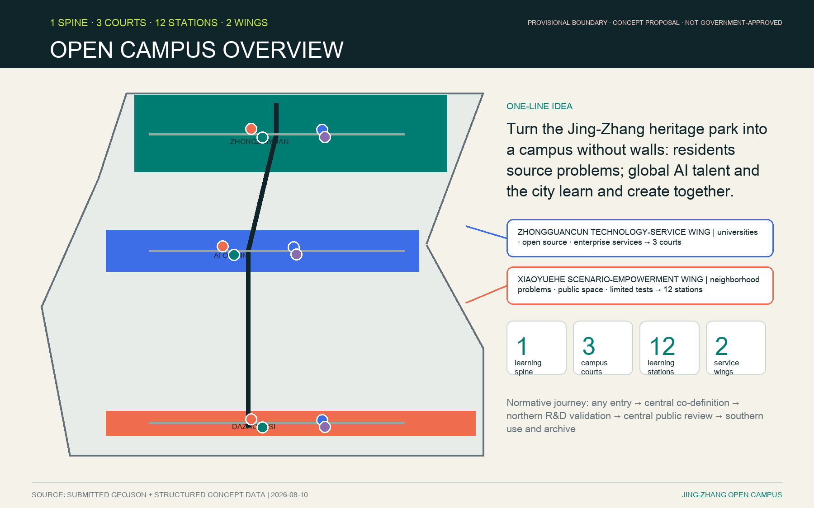
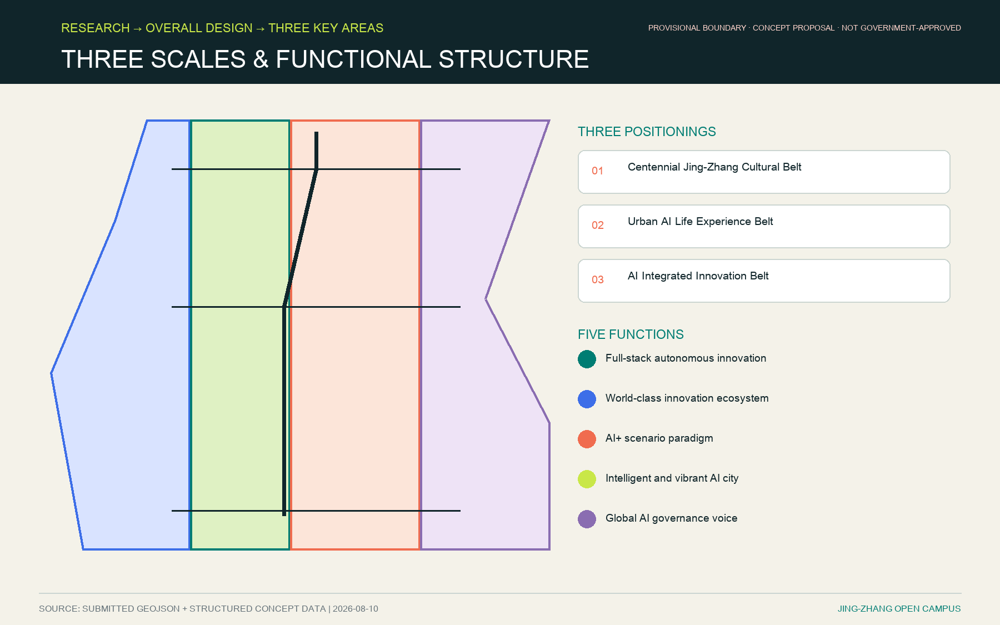
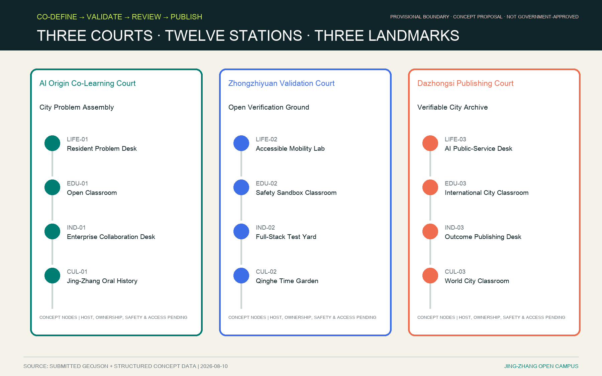
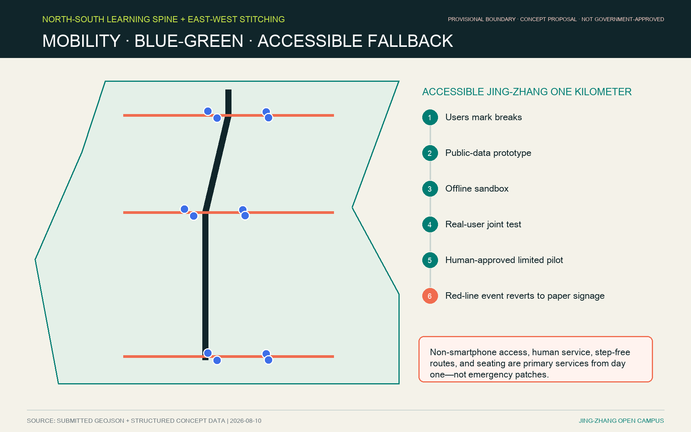
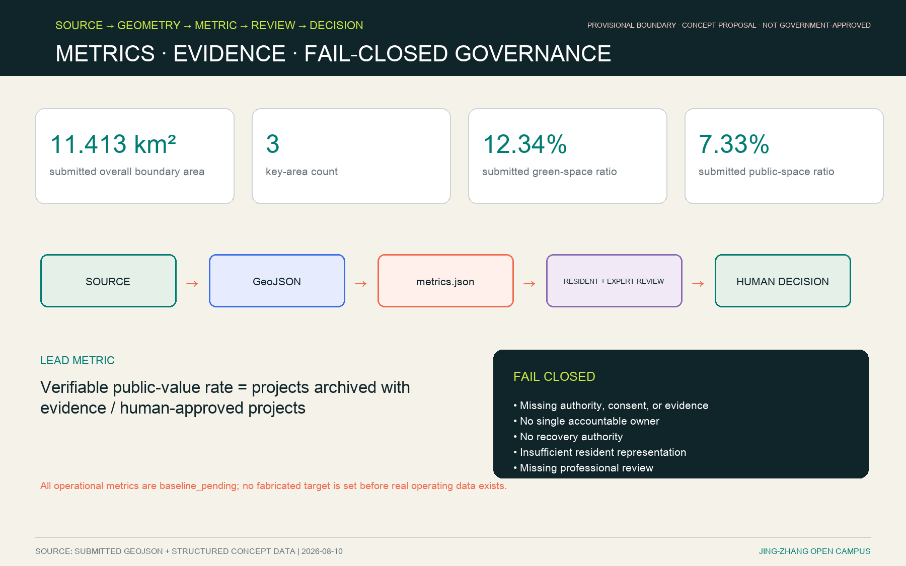

# Jing-Zhang Open Campus

## Design Basis and Source List

This formal AI urban-design package is governed first by the official open-call announcement and then by the registered brief, provisional geometry, enums, ranges, schemas, source registry, and processed fact-pack in this repository [source:OFFICIAL-ANNOUNCEMENT] [source:AGENT-TASKBOOK] [depth:existing_conditions_diagnosis]. Each design claim is separated into a traceable source, recalculable metric, reviewable geometry, or explicitly pending assumption.

The public package does not yet contain trusted official polygons. `site_boundary.geojson` and `key_areas.geojson` therefore remain `provisional_constraint` with `official_boundary=false`. They support content review, visualization, and automated checks, but are not an official redline, statutory control, precise approval area, or construction basis [data:geometry/site_boundary.geojson#SITE-001] [metric:site_area_sqm]. This organizer data gap does not block content scoring. All dependent layers and metrics must be recalculated when cleared official polygons become available. The exact authority and use limits of the announcement and temporary polygons are copied from `data/source_registry.json` into `sources.json` [source:SOURCE-REGISTRY].

The proposal is fully bilingual. Chinese is the primary submission language, while this file, English figures, English A3/A0 PDFs, and the English HTML counterpart carry the same concept and status boundaries.

## Three-Level Scope Framework

The official framework includes an approximately 43.6 km² coordinated research area, an approximately 11.4 km² overall design area, and three detailed-design areas totaling approximately 368.4 ha. The figures are official task magnitudes; the submitted polygons are provisional approximations and are never presented as statutory boundaries [depth:three_level_scope_framework] [standard:PROJECT-OFFICIAL-ANNOUNCEMENT].

The core idea is **JING-ZHANG OPEN CAMPUS**: the heritage park and its surrounding neighborhoods become a campus without walls. Residents and public institutions contribute real problems; global AI talent, universities, enterprises, and residents form teams; and every outcome passes through co-definition, sandbox validation, resident review, human approval, a reversible limited pilot, and evidence archiving.

The spatial shorthand is **one learning spine, three campus courts, twelve learning stations, and two collaborative wings**. The spine is a conceptual and operational sequence, not a new legal boundary. The three courts correspond to the required key areas. The twelve stations are balanced across daily life, education, industry, and culture, three in each category. The **Zhongguancun Technology-Service Wing** brings university, open-source, and enterprise services into all three courts; the **Xiaoyuehe Scenario-Empowerment Wing** brings neighborhood problems, public space, and limited tests into all twelve stations. Both are service relationships, not new land boundaries.

| Scope | Design question | Open Campus response | Evidence location |
| --- | --- | --- | --- |
| Coordinated research area | How should the AI ecosystem and future city form be organized? | Link university origination, open-source collaboration, enterprise transfer, public experience, and international communication | `compliance_matrix.json`; `standard_matrix.json` |
| Overall design area | How do industry space, renewal, mobility, municipal support, and character become spatial? | Coordinate land use, buildings, roads, green space, public space, and phasing | [data:geometry/land_use.geojson#LU-001] [data:geometry/roads.geojson#ROAD-001] |
| Three key areas | How does each area reach detailed-design depth? | Give each a distinct role, spatial action, AI scenario, and implementation dependency | [data:geometry/key_areas.geojson#PROV-KEY-001] [depth:three_key_area_detailed_design] |

The brand uses an original “rail brackets + open nodes” visual language. Two parallel lines signify railway and time; twelve variable nodes signify the stations; and an open bracket signifies public access. No third-party trademark, company logo, portrait, or unlicensed image is used.

## Coordinated Research Area: Industry and Future City Research

Open Campus translates the three positionings—Centennial Jing-Zhang Cultural Belt, Urban AI Life Experience Belt, and AI Integrated Innovation Belt—into one operating system. The five functions are mapped to shared courses, a governed sandbox, enterprise conversion services, perceptible public-life scenarios, and transparent AI governance [source:AGENT-TASKBOOK] [standard:PROJECT-AGENT-OPEN-CALL-TASKBOOK].

Seven primary-source precedents provide mechanisms rather than forms:

| Case | Transferable mechanism | Adaptation for Jing-Zhang |
| --- | --- | --- |
| MIT Senseable City Lab | Government, citizens, communities, and researchers make city-learning tools | Resident problem ownership and reproducible methods, without copying the lab brand |
| Smart Kalasatama / Forum Virium Helsinki | District living labs and design sprints | Short problem sprints with an unconditional participant exit right |
| AMS Urban Living Lab | Structured co-creation, testing, and scaling activities | A ten-state auditable project workflow |
| Eindhoven UDI | A permanent regional living lab with a quadruple helix | Government-community-university-enterprise governance |
| Singapore one-north | Work-live-play-learn mixed innovation district | Everyday station services so the campus is not event-only |
| Barcelona 22@ / Innova Lab | Urban renewal plus real-life public-interest tests | Public-interest criteria and human approval before field use |
| Waterfront Toronto | Independent digital-governance review exposes public-private risk | A caution: innovation never overrides privacy or public scrutiny |

The MIT, Helsinki, and AMS records are registered in `sources.json` [source:CASE-MIT] [source:CASE-HELSINKI] [source:CASE-AMS]. The Eindhoven and one-north records are registered there as well [source:CASE-EINDHOVEN] [source:CASE-ONENORTH]. Barcelona and Toronto complete the primary-source set [source:CASE-BARCELONA] [source:CASE-TORONTO]. They support conceptual mechanisms only and do not prove local feasibility.

## Overall Design Area: Urban Renewal and Regulatory-Plan-Level Urban Design

At overall-design scale, the campus reuses the existing heritage-park spine, ground floors, courtyards, transit thresholds, green edges, and service spaces before proposing additions. The land-use, buildings, roads, green-space, public-space, and phasing layers express a discussion framework and remain subordinate to official controls [data:geometry/land_use.geojson#LU-001] [data:geometry/buildings.geojson#BLDG-001] [metric:building_footprint_area_sqm]. Land-use layout and development-intensity controls are tracked as separate design-depth obligations [depth:land_use_layout] [depth:development_intensity_controls].

The operating sequence provides spatial clarity: a problem may enter at any station; the central Origin Community hosts co-definition; northern Zhongzhiyuan hosts R&D and sandbox validation; the proposal returns to the center for resident and professional review; and southern Dazhongsi hosts only approved limited application, public communication, and archiving. This is a learning journey, not a mandate for new construction.

East-west stitching, accessible travel, rail interchange, municipal capacity, fire safety, ownership, conservation, and building intensity all require professional confirmation. No FAR, building height, demolition decision, road redline, tunnel, bridge, utility, or investment conclusion is asserted.

## Detailed Design of Key Areas

| Key area | Design positioning | Spatial action | AI-industry and operating scenarios | Evidence |
| --- | --- | --- | --- | --- |
| Zhongzhiyuan AI Autonomous-Innovation Acceleration Area | Garden-based full-stack innovation district | Strengthen the Qinghe interface, low-carbon encounter space, industry display, and external access | Autonomous-model tests, standards workshops, safety-governance display, low-carbon computing experience | [data:geometry/key_areas.geojson#PROV-KEY-001] [depth:three_key_area_detailed_design] |
| Beijing AI Origin Community | Near-campus transfer and talent community | Stitch campus, park, and neighborhood walking; add publication, talent, daily-life, and open-source services | Open-source community, outcome publishing, talent services, near-campus incubation | [data:geometry/key_areas.geojson#PROV-KEY-002] [source:AGENT-TASKBOOK] |
| Dazhongsi AI Industry Cluster | Urban intelligent-economy and international-exchange district | Coordinate Dazhongsi Station, four-quadrant walking, commercial service, and public-realm renewal | Agents and smart devices, content consumption, governed data services, international roadshows | [data:geometry/key_areas.geojson#PROV-KEY-003] [metric:key_area_count] |

| Court | Spatial archetype | Four stations | Civic landmark / honor node |
| --- | --- | --- | --- |
| Zhongzhiyuan “Validation Court” | Green sandbox + demountable modules | Accessible Mobility Lab, Safety Sandbox Classroom, Full-Stack Test Yard, Qinghe Time Garden | **Jing-Zhang Open Verification Ground**, showing reproducible process rather than unapproved products |
| AI Origin Community “Co-Learning Court” | Open ground floors + civic forum | Resident Problem Desk, Open Classroom, Enterprise Collaboration Desk, Jing-Zhang Oral History | **City Problem Assembly**, where residents can frame, review, correct, and withdraw |
| Dazhongsi “Publishing Court” | Transit foyer + adaptable gallery | AI Public-Service Desk, International City Classroom, Outcome Publishing Desk, World City Classroom | **Verifiable City Archive**, recording evidence for reviewed methods |

The three provisional area features are [data:geometry/key_areas.geojson#PROV-KEY-001], [data:geometry/key_areas.geojson#PROV-KEY-002], and [data:geometry/key_areas.geojson#PROV-KEY-003]. Their official areas and design controls remain pending. Each court favors retaining and adapting existing assets, reversible installations, open ground floors, and continuous public routes; all building-specific interventions require later ownership, conservation, structural, fire, and planning review [depth:three_key_area_detailed_design].

## AI Innovation Ecosystem, Personas, and AI+ Scenarios

The station mix follows the selected balanced 5A option:

| Category | Three stations | Core service | Accountable operator / fallback |
| --- | --- | --- | --- |
| Daily life | Resident Problem Desk; Accessible Mobility Lab; AI Public-Service Desk | Problem intake, non-digital participation, health/government navigation | Community / public-service officer |
| Education | Open Classroom; Safety Sandbox Classroom; International City Classroom | AI basics, data ethics, cross-cultural teams | University / community educator |
| Industry | Enterprise Collaboration Desk; Full-Stack Test Yard; Outcome Publishing Desk | Problem matching, reproducible validation, compliant transfer | Enterprise and university / public authority approves public trials |
| Culture | Jing-Zhang Oral History; Qinghe Time Garden; World City Classroom | Historical verification, time-based narrative, international communication | Cultural/public institution / resident history committee |

Six personas make the inclusion contract reviewable:

| Persona | Typical needs | Spatial response | Self-check boundary |
| --- | --- | --- | --- |
| Open-source developers | Publication, collaboration, testing, contributor credit | Origin Community publishing space, contribution display, evening collaboration | No individual movement tracking; activity data only in aggregate |
| Startups | Affordable workspace, computing access, product test ground | Zhongzhiyuan shared test yard, edge-computing service, standards advice | Computing and data access require separate authorization |
| Enterprise visitors | Display, business, international reception, recruiting | Dazhongsi roadshow lounge, transit connection, improved public realm | Every logo and case needs clearance |
| Nearby residents | Commute, leisure, community service, low-disruption renewal | Heritage-park walking loop, embedded services, graded lighting and events | Resident profiles cannot drive commercial recommendations |
| University communities | Transfer, cross-campus work, daily walking | Campus-park stitching, transfer stations, AI education points | Campus data and research outputs require authorization |
| Children, older people, and disabled people | Safety, low cognitive load, accessibility, non-digital participation | Step-free routes, seating, human desks, graphic and audio channels | Neither face recognition nor a smartphone may be mandatory |

Every service has a human and non-smartphone channel. Face recognition and persistent individual tracking are excluded. The current accessibility journeys are desk-reviewed assumptions, not real-user evidence; field trials with wheelchair users, blind/low-vision users, children/caregivers, and non-Chinese speakers are mandatory before any pilot.

| Scenario card | Spatial carrier | Design statement |
| --- | --- | --- |
| SC-01 Resident Problem Co-Definition | LIFE-01 Resident Problem Desk | Register real problems offline and online, with source, consent, correction, and exit records |
| SC-02 Accessible Jing-Zhang One Kilometer | LIFE-02 Accessible Mobility Lab | Public-space-data prototype, real-user joint test, and paper-signage fallback |
| SC-03 AI Public-Service Navigation | LIFE-03 AI Public-Service Desk | Health and government navigation with human takeover and purpose-limited authorized data |
| SC-04 Open AI Literacy | EDU-01 Open Classroom | No-personal-data learning for problem framing and public-value judgment |
| SC-05 AI Safety Sandbox | EDU-02 Safety Sandbox Classroom | Data ethics, red-teaming, and rollback drills; no release before review |
| SC-06 International City Methods Studio | EDU-03 International City Classroom | Cross-cultural teams with explicit visa, language, accessibility, consent, and exit conditions |
| SC-07 Enterprise Service Copilot | IND-01 Enterprise Collaboration Desk | Mutual matching of public problems and tools, without implying a signed partnership |
| SC-08 Reproducible Full-Stack Validation | IND-02 Full-Stack Test Yard | Preserve version, source, test log, human judgment, and rollback evidence |
| SC-09 Verifiable Outcome Publishing | IND-03 Outcome Publishing Desk | Publish reviewed outcomes together with limits and negative results |
| SC-10 Jing-Zhang Oral-History Co-Creation | CUL-01 Jing-Zhang Oral History | Resident-historian verification; generated content never replaces historical evidence |
| SC-11 Low-Speed Robot Coexistence Test | CUL-02 Qinghe Time Garden | Test only with markings, safety staff, time and speed limits, and immediate stop |
| SC-12 Open City Semester Public Route | CUL-03 World City Classroom | Connect all three courts and twelve stations while disclosing status, evidence, failures, and licenses |

The structured cards in `visual/assets/scenario-cards.json` use a one-card-to-one-primary-station mapping and cover all twelve station IDs exactly once. Cross-station collaboration belongs in the scenario description rather than duplicating a primary `station_id`. At least three cards are industrial validation scenarios; none is represented as already approved. Their spatial context is traceable to public space, mobility, and green-space layers [data:geometry/public_space.geojson#PUBLIC-001] [data:geometry/roads.geojson#ROAD-001] [data:geometry/green_space.geojson#GREEN-001].

The two displayed ratios locate open-space claims in recalculable evidence [metric:public_space_ratio] [metric:green_ratio].

The flagship **Accessible Jing-Zhang One Kilometer** is a minimum testable loop: disabled users and residents mark breaks; a university team creates a low-risk prototype from public spatial data; an offline sandbox excludes face and fine-grained trajectory data; users, mobility professionals, and community reviewers test it; a human authority may approve a time- and route-limited trial; any red-line event reverts immediately to paper signage.

International applicants move through `submitted → eligibility_checked → matched → consented → enrolled → active → completed/withdrawn`. Missing visa, accessibility, consent, safeguarding, or data-compliance conditions fail closed. Participants may withdraw immediately. The operator assigns a handover lead; resident materials are withdrawn or anonymized according to consent; pre-existing and jointly produced IP follows the prior agreement.

## Land Use, Building Scale, and Retain-Renovate-Demolish Strategy

The design uses the repository land-use enum and separates official controls, design proposals, and pending conditions [standard:MNR-LAND-USE-CLASSIFICATION-GUIDE]. Retain-first reuse is the default: adapt ground floors, courtyards, park thresholds, and existing service spaces; add lightweight demountable station elements only when a host, maintenance budget, accessibility review, and safety review exist. The submitted land-use and building layers remain the recalculable evidence base [data:geometry/land_use.geojson#LU-001] [data:geometry/buildings.geojson#BLDG-001] [metric:building_footprint_area_sqm].

Submitted building geometry is schematic and cannot support a parcel-specific retain-renovate-demolish decision. FAR, height, density, setbacks, fire access, municipal load, property rights, and engineering feasibility remain unknown or pending. Any future design team must replace the provisional base and rerun every area calculation [depth:retain_renovate_demolish].

## Transport, Rail, Municipal Infrastructure, and Public Services

The mobility concept combines a legible north-south campus spine, east-west neighborhood links, rail thresholds, walking/cycling, rest points, accessible alternatives, and an always-available non-digital wayfinding layer [data:geometry/roads.geojson#ROAD-001] [depth:traffic_rail_slow_parking].

The three mechanism cards are: (1) **East-West Stitching**, where crossings, under-bridge spaces, and campus edges are verified before intervention; (2) **Developer Community**, using steward rotations, problem bounties as a proposal, contributor records, and explicit licenses; and (3) **Regional Collaboration**, proposing course, problem, and method exchange with Beiwei Community, Future Science City, Huairou Science City, BDA, and the Beijing-Tianjin-Hebei region. No partnership is claimed as signed.

Municipal, energy, drainage, flood, fire, parking, and edge-computing proposals are service concepts only. Capacity and engineering feasibility must be confirmed by competent professionals [data:geometry/constraints.geojson#CONSTRAINTS] [depth:municipal_new_infrastructure].

## Blue-Green Network, Public Space, and Urban Character

The heritage park is the public learning spine. Qinghe and Xiaoyuehe edges, campus and enterprise boundaries, park thresholds, and transit nodes are treated as places to restore daily continuity before adding spectacle [depth:blue_green_public_space] [data:geometry/green_space.geojson#GREEN-001] [data:geometry/public_space.geojson#PUBLIC-001]. The design meaning of these areas is checked through recalculable ratios [metric:green_ratio] [metric:public_space_ratio] and professional urban-design guidance [standard:MOHURD-URBAN-DESIGN-MEASURES].

Three landmarks form a civic pilgrimage route: the City Problem Assembly, Jing-Zhang Open Verification Ground, and Verifiable City Archive. Recognition is earned through evidence: problem origin, contributors, review decision, pilot status, failures, and license. The honor system values corrections, safe closures, and documented negative results as well as successful pilots.

The narrative joins railway time, Zhongguancun innovation culture, and responsible AI culture. It does not generate fictional history or use AI outputs as historical evidence. Oral-history content requires source records, contributor consent, and historian/resident correction.

## Renewal Projects, Implementation Policy, and Phasing

Six conceptual projects are tracked under the renewal-project and phasing depth obligations [depth:renewal_project_list] [depth:phasing_implementation]. Each remains conditional on relevant statutory and professional review.

| Project | Name | Type | Main dependency | Evidence |
| --- | --- | --- | --- | --- |
| JZ-01 | Heritage-park accessibility stitching | Public space / mobility | Road redline, under-bridge space, traffic review | [data:geometry/roads.geojson#ROAD-001] |
| JZ-02 | Zhongzhiyuan Qinghe innovation interface | Blue-green / industry display | River line, ecology, flood conditions | [data:geometry/green_space.geojson#GREEN-001] |
| JZ-03 | Origin Community near-campus co-learning street | Renewal / industry service | Campus edge, ownership, ground-floor uses | [data:geometry/buildings.geojson#BLDG-001] |
| JZ-04 | Dazhongsi four-quadrant walking connection | Rail integration / walking | Station, junction, utilities | [data:geometry/public_space.geojson#PUBLIC-001] |
| JZ-05 | Governed AI public-service and edge-computing nodes | Infrastructure / public service | Energy, computing, safety, operator | [data:geometry/constraints.geojson#CONSTRAINTS] |
| JZ-06 | Open City Semester public route | Operations / identity | Public-space permit, event safety, rights clearance | [data:geometry/phasing.geojson#PHASE-001] |

**Open City Semester** is an annual operating loop: weeks 1‑4 problem calls and offline hearings; 5‑8 global recruitment, screening, and mutual matching; 9‑20 a twelve-week co-creation semester; 21‑24 resident review, professional review, and public demonstration; 25‑44 limited pilots operated by station stewards; 45‑52 evaluation, archiving, closure, and the next intake. Every station needs a primary steward, a backup, and a funded maintenance baseline before week 25.

The project state machine is `submitted → screened → co_defined → matched → sandboxed → resident_reviewed → human_approved → limited_pilot → evaluated → archived/scaled`. L0 is offline/no-personal-data learning; L1 is public-data sandboxing; L2 is authorized-data limited testing; L3 affects safety, health, minors, or public rights and requires independent professional review.

The selected 6A governance model assigns one accountable party per asset: the community owns problem definition, resident materials, and public evaluation; universities own method and experiment integrity; enterprises own sandbox tools, pre-existing IP, and product safety; government or legally competent public institutions own public-service data, field approval, emergency stop, and recovery. A project without one accountable owner, a recovery authority, traceable data, or representative resident participation cannot enter a field pilot.

| Governance asset / gate | Status | Sole A | R | Backup | Stop authority | Recovery authority | Escalation |
| --- | --- | --- | --- | --- | --- | --- | --- |
| Resident problem record | Concept pending | Community | Station problem desk | Community coordinator | Resident / community | Community lead | District public-participation lead |
| Resident materials and consent | Concept pending | Community | Project operations | Privacy liaison | Data subject / community | Community lead | Data-protection lead |
| Method and experiment record | Concept pending | University | Research team | Independent reviewing faculty | University ethics/safety lead | University project lead | Independent professional review |
| Sandbox tools and product safety | Concept pending | Enterprise | Engineering and safety team | Enterprise safety lead | Any red-line reporter / safety officer | Enterprise product-safety lead | Competent government authority |
| Public-service data | Authorization pending | Government / competent public institution | Authorized data team | Data security officer | Data-owning authority | Original authorizing body | Higher data authority |
| Limited field pilot | Approval pending | Government / competent public institution | Station operations | On-site safety lead | Anyone reports; site lead stops immediately | Original approving body | Relevant professional authority |
| Public review and objection record | Concept pending | Community | Resident review panel | Independent facilitator | Resident review panel | Community lead | District public-participation lead |
| Outcome license and archive | Agreement pending | University | Archive steward | Enterprise/community license liaison | Rights holder / archive lead | University project lead | Independent IP review |

The same machine-auditable matrix is stored in `visual/assets/governance-state-machine.json`. These roles are proposed, not committed; named people, authorization IDs, and reachable backups are mandatory before field use.

## Metrics, Area Recalculation, and Compliance Matrix

Known spatial metrics in `metrics.json` are recalculated from submitted geometry, while FAR and statutory controls remain unknown [depth:metrics_recalculation]. Provisional geometry limits their authority even when computations pass. The submitted-area, key-area-count, and open-space calculations remain traceable [metric:site_area_sqm] [metric:key_area_count] [metric:green_ratio]. Building-footprint and public-space calculations are separately recorded [metric:building_footprint_area_sqm] [metric:public_space_ratio]. The compliance, standards, depth, source, assumption, and self-check files form the machine-reviewable evidence chain.

The lead operational metric is **verifiable public-value rate**: `archived_with_evidence / human_approved_projects`. Supporting metrics include resident-originated problem share, accessible participation, response to objections, sandbox-to-field conversion, serious incidents, recovery time, open-license coverage, and pilot-closure rate. All remain `baseline_pending` until real operation data exists; no fabricated target is declared.

## Risk, Copyright, and Compliance

All outcomes are open co-creation proposals. They do not replace statutory planning and do not constitute a government-approved conclusion. Official boundaries, controls, parcel rights, roads, rail, bridges, tunnels, utilities, conservation, fire, capacity, energy, investment, phasing, and approvals remain subject to competent professional confirmation.

The primary risks are provisional geometry; uneven resident representation; accessibility assumptions without field evidence; participant consent and withdrawal; privacy and security; unsafe transition from sandbox to public space; long-term steward and budget gaps; IP conflicts; cultural misrepresentation; and overstatement of partnerships or implementation. These are tracked against the risk-depth obligation, constraints layer, and site package [depth:risk_missing_data] [data:geometry/constraints.geojson#CONSTRAINTS] [source:SITE-PACKAGE]. The fail-closed rule is simple: missing authority, evidence, consent, accountable owner, recovery path, or professional review stops progression.

All drawings and figures are original programmatic outputs built from submitted geometry and declared concept data. System fonts are used for rendering and are not redistributed. Primary-source links are registered for reference; no third-party image is copied. The offline HTML contains no remote script, map tile, font, iframe, form, analytics, or external API.

The current product and UX reviews were desk-based adversarial reviews. They are not real resident, disability, child-safeguarding, or international-participant tests. The 30-second spatial-recognition test, four accessibility journeys, and one-kilometer route remain explicit hypotheses to validate before public use.

## References

- `brief/public-brief.md`
- `brief/site-package/design_brief.json`
- `brief/site-package/allowed_design_space.json`
- `brief/site-package/agent_taskbook.json`
- `data/processed/agent_fact_pack.md`
- MIT Senseable City Lab: https://senseable.mit.edu/
- Forum Virium Helsinki: https://forumvirium.fi/en/introducing-tools-for-urban-innovators/
- AMS Institute Urban Living Lab: https://www.ams-institute.org/how-we-work/ull/the-ams-urban-living-lab-way-of-working/
- Brainport Eindhoven UDI: https://brainporteindhoven.com/udi/en/approach
- JTC one-north: https://www.jtc.gov.sg/find-land/jtc-key-estates/one-north?estate=one-north
- Barcelona Innova Lab / 22@: https://ajuntament.barcelona.cat/imi/sites/default/files/2024-01/relat_scewc_2023_eng.pdf
- Waterfront Toronto Digital Panel: https://www.waterfrontoronto.ca/news/waterfront-toronto-concludes-digital-panel-and-thanks-panelists-lasting-impact
- Complete machine indexes: `sources.json`, `metrics.json`, `compliance_matrix.json`, `standard_matrix.json`, and `design_depth_matrix.json` [source:SITE-PACKAGE].
