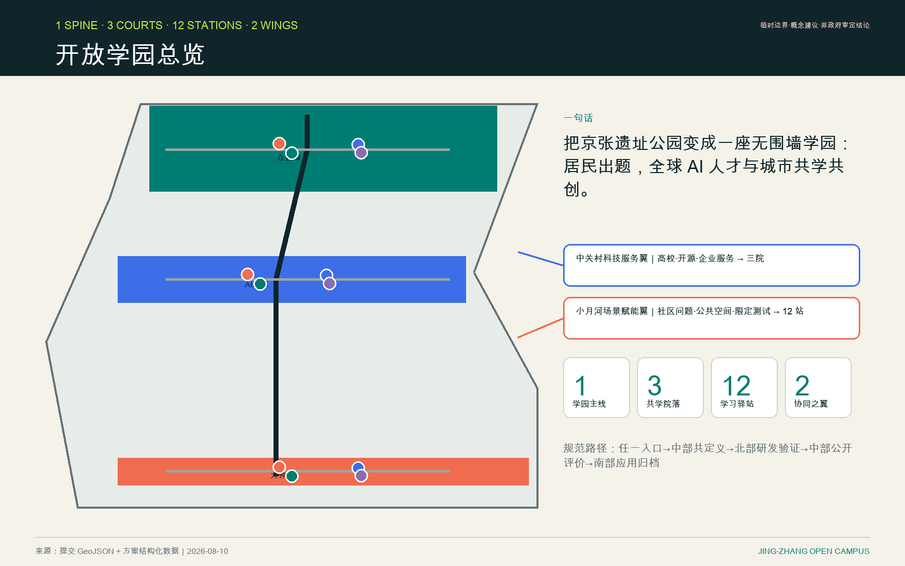
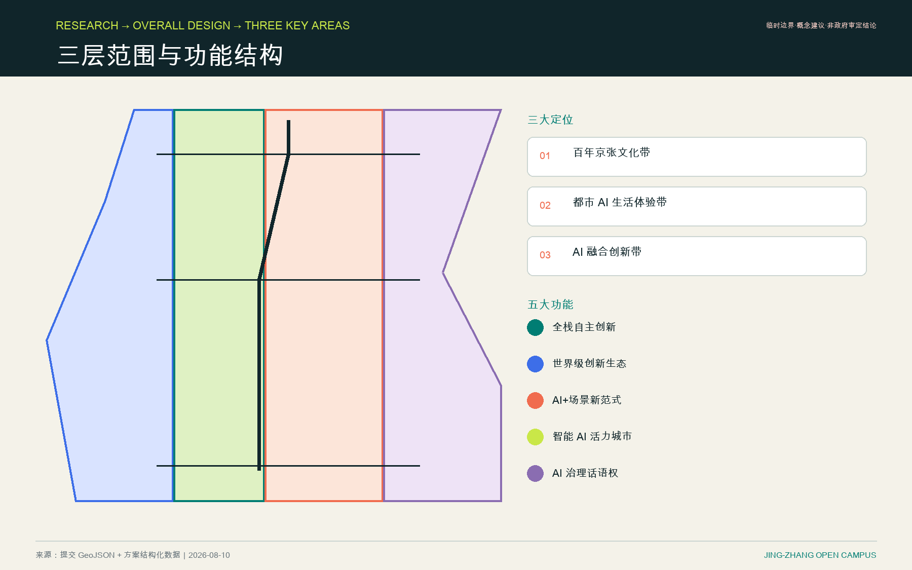
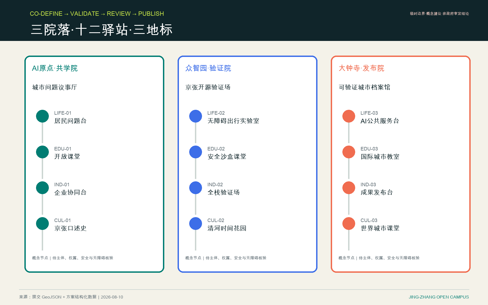
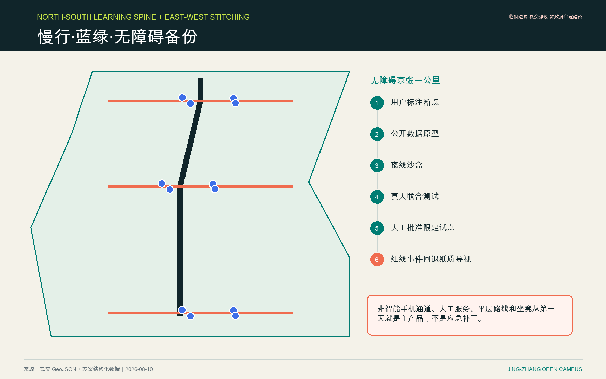
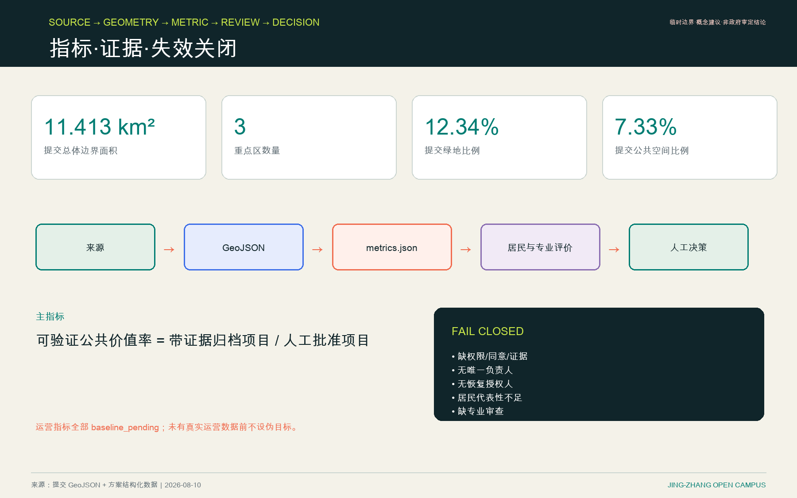

# 京张开放学园

## 设计依据与资料清单

本 AI 城市设计正式成果包首先遵循官方征集公告，其次遵循仓库中已登记的任务书、临时几何、枚举、区间、schema、来源登记表和处理后事实包 [source:OFFICIAL-ANNOUNCEMENT] [source:AGENT-TASKBOOK] [depth:existing_conditions_diagnosis]。每项设计主张均拆分为可追溯来源、可复算指标、可审查几何或明确待确认的假设。

公开资料包尚未提供可信的官方 polygon。因此，`site_boundary.geojson` 与 `key_areas.geojson` 保持 `provisional_constraint` 和 `official_boundary=false`。它们可用于内容评审、可视化和自动检查，但不是官方红线、法定控制、精确审批面积或施工依据 [data:geometry/site_boundary.geojson#SITE-001] [metric:site_area_sqm]。这一组织方资料缺口不阻断内容评分；取得清权后的官方 polygon 时，所有依赖图层和指标必须重算。公告与临时 polygon 的权威等级和用途限制已从 `data/source_registry.json` 原样登记到 `sources.json` [source:SOURCE-REGISTRY]。

本方案执行完整双语契约：中文是主提交语言；本文件与英文稿、双语图件、双语 A3/A0 PDF 和双语 HTML 具有相同概念、主张、证据位置与状态边界。

## 三层范围工作框架

官方框架包括约 43.6 km² 统筹研究范围、约 11.4 km² 总体设计范围，以及合计约 368.4 ha 的三处重点详细设计区。这些数值是官方任务量级；提交 polygon 是临时近似，绝不作为法定边界 [depth:three_level_scope_framework] [standard:PROJECT-OFFICIAL-ANNOUNCEMENT]。

核心概念是 **京张开放学园 / JING-ZHANG OPEN CAMPUS**：把京张遗址公园及周边街区变成没有围墙的学园。居民和公共机构提供真实问题；全球 AI 人才、高校、企业与居民共同组队；每项成果依次经过共同定义、沙盒验证、居民评价、人工审批、可逆限定试点和证据归档。

空间简式是 **1 条学习主线、3 个学园院落、12 个学习驿站、2 个协同之翼**。主线是概念与运营顺序，不是新法定边界；三院对应三处重点区；12 站在生活、教育、产业、文化四类中各 3 站。**中关村科技服务翼**把高校、开源和企业服务接入三院；**小月河场景赋能翼**把社区问题、公共空间和限定测试接入 12 站。两翼均为服务关系，不是新增用地边界。

| 层级 | 设计问题 | 开放学园回答 | 证据落点 |
| --- | --- | --- | --- |
| 统筹研究范围 | AI 生态与未来城市形态如何组织 | 串联高校策源、开源协作、企业转化、公共体验和国际传播 | `compliance_matrix.json`；`standard_matrix.json` |
| 总体设计范围 | 产业空间、更新、交通、市政和风貌如何落地 | 协调用地、建筑、道路、绿地、公共空间和分期 | [data:geometry/land_use.geojson#LU-001] [data:geometry/roads.geojson#ROAD-001] |
| 三处重点区 | 每区如何达到详细设计深度 | 赋予不同定位、空间动作、AI 场景与实施依赖 | [data:geometry/key_areas.geojson#PROV-KEY-001] [depth:three_key_area_detailed_design] |

品牌采用原创的“轨道括号 + 开放节点”视觉语言：两条平行线代表铁路与时间，12 个可变节点代表驿站，未闭合括号代表公共开放。不使用第三方商标、企业标识、人物肖像或未授权图片。

## 统筹研究范围产业与未来城市研究

开放学园把“百年京张文化带、都市 AI 生活体验带、AI 融合创新带”三大定位转化为一个运营系统；五大功能分别落到共享课程、受治理沙盒、企业转化服务、可感知的公共生活场景和透明 AI 治理 [source:AGENT-TASKBOOK] [standard:PROJECT-AGENT-OPEN-CALL-TASKBOOK]。

七个一手案例只提供机制，不复制形式：

| 案例 | 可迁移机制 | 京张取舍 |
| --- | --- | --- |
| MIT Senseable City Lab | 政府、市民、社区和研究者共同制作城市学习工具 | 居民拥有问题来源与可复现方法，不复制实验室品牌 |
| Smart Kalasatama / Forum Virium Helsinki | 街区生活实验室与设计冲刺 | 短周期问题冲刺，但参与者可无条件退出 |
| AMS Urban Living Lab | 结构化共创、测试与扩展 | 十状态、可审计的项目流程 |
| Eindhoven UDI | 永久区域生活实验室与四螺旋协作 | 政府—社区—高校—企业四方治理 |
| Singapore one-north | 工作—生活—休闲—学习混合创新区 | 强化驿站日常服务，避免只做节事 |
| Barcelona 22@ / Innova Lab | 城市更新与真实公共利益测试 | 现场前先满足公共利益标准与人工审批 |
| Waterfront Toronto | 独立数字治理审查暴露公私合作风险 | 反例：创新不能跳过隐私和公共审议 |

MIT、Helsinki 和 AMS 记录已登记在 `sources.json` [source:CASE-MIT] [source:CASE-HELSINKI] [source:CASE-AMS]。Eindhoven 与 one-north 记录同样已登记 [source:CASE-EINDHOVEN] [source:CASE-ONENORTH]。Barcelona 与 Toronto 构成最后两项一手来源 [source:CASE-BARCELONA] [source:CASE-TORONTO]。它们只支持概念机制，不证明本地可行性。

## 总体设计范围城市更新与控规深度城市设计

在总体设计尺度，方案优先复用现有遗址公园主线、建筑首层、院落、轨道门槛、绿色边缘和服务空间，再考虑新增。用地、建筑、道路、绿地、公共空间和分期图层表达讨论框架，并服从官方控制 [data:geometry/land_use.geojson#LU-001] [data:geometry/buildings.geojson#BLDG-001] [metric:building_footprint_area_sqm]。用地布局与开发强度控制作为两项独立设计深度义务记录 [depth:land_use_layout] [depth:development_intensity_controls]。

运营顺序赋予空间清晰度：问题可从任一驿站进入；中部 AI 原点社区负责共同定义；北部众智园负责研发和沙盒验证；再返回中部进行居民与专业评价；南部大钟寺只承载通过审批的限定应用、公共传播和归档。这是一条学习旅程，不是新建建筑指令。

东西向缝合、无障碍出行、轨道换乘、市政容量、消防、权属、文保和建筑强度均待专业确认。本方案不主张容积率、建筑高度、拆除决定、道路红线、隧道、桥梁、管线或投资结论。

## 重点区域详细设计

| 重点区域 | 设计定位 | 空间动作 | AI 产业与运营场景 | 证据 |
| --- | --- | --- | --- | --- |
| 众智园 AI 自主创新加速区 | 花园型全栈创新街区 | 强化清河界面、低碳交往、产业展示和对外交通 | 自主模型测试、标准工作坊、安全治理展示、低碳算力体验 | [data:geometry/key_areas.geojson#PROV-KEY-001] [depth:three_key_area_detailed_design] |
| 北京 AI 原点社区 | 近校成果转化与人才社区 | 缝合校园、公园和街区慢行，补足发布、人才、生活和开源服务 | 开源社区、成果发布、人才服务、近校孵化 | [data:geometry/key_areas.geojson#PROV-KEY-002] [source:AGENT-TASKBOOK] |
| 大钟寺 AI 产业聚集区 | 城市型智能经济与国际交往区 | 协调大钟寺站、四象限步行、商业服务和公共环境更新 | 智能体与智能终端、内容消费、合规数据服务、国际路演 | [data:geometry/key_areas.geojson#PROV-KEY-003] [metric:key_area_count] |

| 院落 | 空间原型 | 四个驿站 | 公共地标 / 荣誉节点 |
| --- | --- | --- | --- |
| 众智园“验证院” | 绿色沙盒 + 可拆卸模块 | 无障碍出行实验室、安全沙盒课堂、全栈验证场、清河时间花园 | **京张开源验证场**：展示可复现过程，不展示未审批产品 |
| AI 原点社区“共学院” | 首层开放 + 公共论坛 | 居民问题台、开放课堂、企业协同台、京张口述史 | **城市问题议事厅**：居民可以定义、评价、更正和退出 |
| 大钟寺“发布院” | 轨道门厅 + 可变展廊 | AI 公共服务台、国际城市教室、成果发布台、世界城市课堂 | **可验证城市档案馆**：为通过评审的方法记录证据 |

三处临时范围分别是 [data:geometry/key_areas.geojson#PROV-KEY-001]、[data:geometry/key_areas.geojson#PROV-KEY-002] 和 [data:geometry/key_areas.geojson#PROV-KEY-003]；官方面积和控制条件仍待补。每院优先保留改造既有资产、采用可逆设施、开放首层并维持公共路线连续；具体建筑干预仍须权属、文保、结构、消防和规划审查 [depth:three_key_area_detailed_design]。

## AI 创新生态、人才画像与 AI+ 场景

驿站组合采用用户选择的均衡 5A 方案：

| 类别 | 三个驿站 | 核心服务 | 最终责任 / 备份 |
| --- | --- | --- | --- |
| 生活 | 居民问题台；无障碍出行实验室；AI 公共服务台 | 问题登记、非数字参与、健康/政务导航 | 社区 / 公共服务专员 |
| 教育 | 开放课堂；安全沙盒课堂；国际城市教室 | AI 入门、数据伦理、跨文化组队 | 高校 / 社区教育者 |
| 产业 | 企业协同台；全栈验证场；成果发布台 | 问题匹配、可复现验证、合规转化 | 企业与高校 / 公共机构审批公共试点 |
| 文化 | 京张口述史；清河时间花园；世界城市课堂 | 历史核验、时间叙事、国际传播 | 文化/公共机构 / 居民史料委员会 |

六类画像把包容性契约转化为可审查内容：

| 用户画像 | 典型需求 | 空间响应 | 自检边界 |
| --- | --- | --- | --- |
| 开源开发者 | 发布、协作、测试、贡献署名 | 原点社区发布空间、贡献展示、夜间协作 | 不追踪个人移动；活动数据只做聚合 |
| 初创团队 | 低成本空间、算力入口、产品试验场 | 众智园共享测试场、端侧算力服务、标准咨询 | 算力和数据访问需单独授权 |
| 企业访客 | 展示、商务、国际接待、招聘 | 大钟寺路演客厅、轨道接驳、公共环境更新 | 标识与案例均须清权 |
| 周边居民 | 通勤、休闲、社区服务、低扰动更新 | 遗址公园慢行环、嵌入服务、分级照明与活动 | 居民画像不得用于商业推荐 |
| 高校师生 | 转化、跨校协作、日常慢行 | 校园—公园缝合、转化驿站、AI 教育点 | 校园数据和科研成果需授权 |
| 儿童、老人与障碍人士 | 安全、低认知负担、无障碍、非数字参与 | 平层路线、座椅、人工服务、图形与声音通道 | 人脸识别和智能手机均不得成为必需入口 |

每项服务都保留人工与非智能手机通道；排除人脸识别和持续个人追踪。现有无障碍旅程只是案头审查假设，不是真人证据；任何试点前必须由轮椅使用者、盲人/低视力者、儿童/看护人和非中文参与者进行现场测试。

| 场景卡 | 空间载体 | 设计说明 |
| --- | --- | --- |
| SC-01 居民问题共定义 | LIFE-01 居民问题台 | 线上线下登记真实问题，记录来源、同意、更正与退出 |
| SC-02 无障碍京张一公里 | LIFE-02 无障碍出行实验室 | 公开空间数据原型、真人联合测试、纸质导视回退 |
| SC-03 AI 公共服务导航 | LIFE-03 AI 公共服务台 | 健康与政务导航支持人工接管，授权数据限定用途 |
| SC-04 开放 AI 素养课 | EDU-01 开放课堂 | 不使用个人数据，训练问题定义与公共价值判断 |
| SC-05 AI 安全沙盒 | EDU-02 安全沙盒课堂 | 数据伦理、红队和回退演练；审查前不离开沙盒 |
| SC-06 国际城市方法工作坊 | EDU-03 国际城市教室 | 跨文化组队，明确签证、语言、无障碍、同意与退出 |
| SC-07 企业服务协同助手 | IND-01 企业协同台 | 公共问题与工具双向匹配，不暗示合作已签约 |
| SC-08 全栈模型可复现验证 | IND-02 全栈验证场 | 保留版本、来源、测试日志、人工判断和回退证据 |
| SC-09 可验证成果发布 | IND-03 成果发布台 | 同时公开通过审查的成果、局限和负面结果 |
| SC-10 京张口述史共创 | CUL-01 京张口述史 | 居民与历史学者共同核验，生成内容不替代史料 |
| SC-11 低速机器人人机共行测试 | CUL-02 清河时间花园 | 仅在标线、安全员、限时限速和立即停止条件下测试 |
| SC-12 Open City Semester 公共路线 | CUL-03 世界城市课堂 | 串联三院十二站，公开状态、证据、失败和许可 |

`visual/assets/scenario-cards.json` 采用“一卡对应一个主驿站”的映射，并恰好覆盖 12 个 station ID；跨站协作写入说明，不重复主 `station_id`。至少三张卡属于产业验证场景，且没有任何场景被写成已获批准。空间上下文可追溯到公共空间、交通和绿地图层 [data:geometry/public_space.geojson#PUBLIC-001] [data:geometry/roads.geojson#ROAD-001] [data:geometry/green_space.geojson#GREEN-001]。

两项公开展示比例把开放空间主张连接到可复算证据 [metric:public_space_ratio] [metric:green_ratio]。

旗舰问题 **“无障碍京张一公里”** 是最小可测闭环：障碍者和居民标注断点；高校团队用公开空间数据制作低风险原型；离线沙盒排除人脸和精细轨迹；用户、交通专业人员和社区共同测试；法定人工主体可批准限时、限路段试点；任一红线事件立即回退纸质导视。

国际申请者经历 `submitted → eligibility_checked → matched → consented → enrolled → active → completed/withdrawn`。缺签证、无障碍、同意、保障或数据合规条件时 fail closed。参与者可立即退出；运营方指定交接人；居民材料按同意书撤回或匿名；既有 IP 与联合成果按事前协议处理。

## 用地、建筑规模与拆改留方案

方案使用仓库用地枚举，并区分官方控制、设计建议和待确认条件 [standard:MNR-LAND-USE-CLASSIFICATION-GUIDE]。保留优先：先改造首层、院落、公园门槛和既有服务空间；只有在落实宿主、维护预算、无障碍审查和安全审查后，才增加轻量可拆卸驿站设施。提交的用地与建筑图层是可复算证据 [data:geometry/land_use.geojson#LU-001] [data:geometry/buildings.geojson#BLDG-001] [metric:building_footprint_area_sqm]。

提交建筑几何是示意，不能支持地块级拆改留结论。容积率、高度、密度、退线、消防、市政荷载、权属和工程可行性均为 unknown 或 pending；未来设计团队必须替换临时底图并重算所有面积 [depth:retain_renovate_demolish]。

## 交通、轨道、市政与公共服务设施

交通概念由清晰的南北学园主线、东西街区联系、轨道门槛、步行骑行、休息点、无障碍替代路线和始终可用的非数字导视构成 [data:geometry/roads.geojson#ROAD-001] [depth:traffic_rail_slow_parking]。

三张机制卡分别是：**东西缝合**，先核验路口、桥下空间和校园边缘再干预；**开发者社区**，采用看护人轮值、问题赏金建议、贡献记录和明确许可；**区域协同**，建议与北纬社区、未来科学城、怀柔科学城、经开区和京津冀交换课程、问题和方法。所有合作均未声明已经签约。

市政、能源、排水、防洪、消防、停车和端侧算力均只是服务概念；容量与工程可行性须由胜任的专业主体确认 [data:geometry/constraints.geojson#CONSTRAINTS] [depth:municipal_new_infrastructure]。

## 蓝绿空间、公共空间与城市风貌

京张遗址公园是公共学习主线。清河与小月河边缘、校园和企业边界、公园门槛与轨道节点首先恢复日常连续性，再考虑标志性表达 [depth:blue_green_public_space] [data:geometry/green_space.geojson#GREEN-001] [data:geometry/public_space.geojson#PUBLIC-001]。这些空间的设计意义通过可复算比例 [metric:green_ratio] [metric:public_space_ratio] 和专业城市设计指引 [standard:MOHURD-URBAN-DESIGN-MEASURES] 共同校核。

城市问题议事厅、京张开源验证场、可验证城市档案馆组成公共朝圣路线。荣誉来自证据：问题来源、贡献者、评价决定、试点状态、失败与许可；更正、安全关闭和负面结果与成功试点同样被认可。

叙事连接铁路时间、中关村创新文化和负责任 AI 文化；不虚构历史，也不把 AI 输出当成史料。口述史须有来源记录、贡献者同意以及历史学者/居民更正。

## 更新项目清单、实施政策与分期计划

六个概念项目纳入更新项目与分期深度义务 [depth:renewal_project_list] [depth:phasing_implementation]；每项仍以相应法定与专业审查为条件。

| 项目 | 名称 | 类型 | 主要依赖 | 证据 |
| --- | --- | --- | --- | --- |
| JZ-01 | 遗址公园无障碍断点缝合 | 公共空间 / 交通 | 道路红线、桥下空间、交通复核 | [data:geometry/roads.geojson#ROAD-001] |
| JZ-02 | 众智园清河创新界面 | 蓝绿 / 产业展示 | 河道蓝线、生态、防洪条件 | [data:geometry/green_space.geojson#GREEN-001] |
| JZ-03 | 原点社区近校共学街 | 更新 / 产业服务 | 校园边界、权属、首层业态 | [data:geometry/buildings.geojson#BLDG-001] |
| JZ-04 | 大钟寺四象限步行连接 | 轨道一体化 / 步行 | 轨道站、交叉口、管线 | [data:geometry/public_space.geojson#PUBLIC-001] |
| JZ-05 | 受治理 AI 公共服务与端侧算力节点 | 基础设施 / 公共服务 | 能源、算力、安全、运营主体 | [data:geometry/constraints.geojson#CONSTRAINTS] |
| JZ-06 | Open City Semester 公共路线 | 运营 / 品牌 | 公共空间许可、活动安全、权利清理 | [data:geometry/phasing.geojson#PHASE-001] |

**Open City Semester 开放城市学期**是年度闭环：第 1‑4 周公开征题与线下听证；5‑8 周全球招募、审核与双向匹配；9‑20 周十二周共创；21‑24 周居民评价、专业审查与公开演示；25‑44 周由驿站看护人运营限定试点；45‑52 周评价、归档、关闭并进入下一周期。第 25 周前，每站必须有主看护人、备份和基本维护预算。

项目状态机为 `submitted → screened → co_defined → matched → sandboxed → resident_reviewed → human_approved → limited_pilot → evaluated → archived/scaled`。L0 是离线、无个人数据学习；L1 是公开数据沙盒；L2 是授权数据限定测试；L3 涉及安全、健康、未成年人或公共权利，须独立专业审查。

用户选择的 6A 治理为每项资产指定一个最终责任方：社区负责问题定义、居民材料和公开评价；高校负责方法与实验完整性；企业负责沙盒工具、既有 IP 和产品安全；政府或具有法定职责的公共机构负责公共服务数据、现场批准、紧急停止与恢复。没有唯一 A、恢复授权、可追溯数据或有代表性的居民参与时，不得进入现场试点。

| 治理资产 / 关口 | 状态 | 唯一 A | R | 备份 | 停止权 | 恢复授权 | 升级路径 |
| --- | --- | --- | --- | --- | --- | --- | --- |
| 居民问题记录 | 概念待落地 | 社区 | 驿站问题台 | 社区协调员 | 居民 / 社区 | 社区负责人 | 区级公众参与主管 |
| 居民材料与同意 | 概念待落地 | 社区 | 项目运营组 | 隐私联络员 | 材料主体 / 社区 | 社区负责人 | 数据保护负责人 |
| 方法与实验记录 | 概念待落地 | 高校 | 研究团队 | 独立复核教师 | 高校伦理/安全负责人 | 高校项目负责人 | 独立专业评审 |
| 沙盒工具与产品安全 | 概念待落地 | 企业 | 工程与安全团队 | 企业安全负责人 | 任一红线报告人 / 安全员 | 企业产品安全负责人 | 胜任的政府主管部门 |
| 公共服务数据 | 待授权 | 政府 / 法定公共机构 | 授权数据团队 | 数据安全官 | 数据主管机构 | 原授权主体 | 上级数据主管部门 |
| 现场限定试点 | 待批准 | 政府 / 法定公共机构 | 驿站运营组 | 现场安全负责人 | 任何人报告，现场负责人立即停 | 原批准主体 | 相应专业主管部门 |
| 公开评价与异议记录 | 概念待落地 | 社区 | 居民评议组 | 独立主持人 | 居民评议组 | 社区负责人 | 区级公众参与主管 |
| 成果许可与归档 | 协议待签 | 高校 | 归档看护人 | 企业/社区许可联络人 | 权利人 / 档案负责人 | 高校项目负责人 | 独立知识产权复核 |

同一机器可审计矩阵保存在 `visual/assets/governance-state-machine.json`。以上角色均为建议而非已承诺主体；现场使用前必须补充实名、授权编号和可联系备份。

## 指标体系、面积复算与合规矩阵

`metrics.json` 中的 known 空间指标由提交几何复算，容积率与法定控制保持 unknown [depth:metrics_recalculation]。临时几何即使计算通过，权威性仍受限；总体面积、重点区数量和绿地计算可追溯 [metric:site_area_sqm] [metric:key_area_count] [metric:green_ratio]，建筑基底和公共空间计算独立记录 [metric:building_footprint_area_sqm] [metric:public_space_ratio]。合规、标准、深度、来源、假设和自检文件共同构成机器可审计证据链。

主运营指标是 **可验证公共价值率**：`archived_with_evidence / human_approved_projects`。辅助指标包括居民出题占比、无障碍参与、异议回应、沙盒转现场、严重事件、恢复时长、开放许可覆盖和试点关闭率。在获得真实运营数据前全部为 `baseline_pending`，不声明伪目标。

## 风险、版权与合规说明

所有成果均为开放共创建议，不替代法定规划，也不构成政府批准结论。官方边界、控制条件、地块权利、道路、轨道、桥隧、管线、文保、消防、容量、能源、投资、分期和审批均由胜任的专业主体确认。

主要风险包括临时几何、居民代表不均、无真人证据的无障碍假设、同意与退出、隐私安全、从沙盒到公共空间的不安全跃迁、长期看护人与预算缺口、IP 冲突、文化误述以及夸大合作或实施。这些风险分别由风险深度义务、约束图层和场地包校核 [depth:risk_missing_data] [data:geometry/constraints.geojson#CONSTRAINTS] [source:SITE-PACKAGE]。Fail closed 规则很简单：缺权限、证据、同意、唯一负责人、恢复路径或专业审查时，停止推进。

所有图纸与图件均为基于提交几何和声明概念数据生成的原创程序化输出；系统字体只用于渲染，不再分发。外部一手来源只做链接和转述，不复制第三方图片。离线 HTML 不包含远程脚本、地图瓦片、字体、iframe、表单、分析或外部 API。

当前产品与 UX 审查是案头对抗检查，不是真实居民、障碍人士、儿童保障或国际参与者测试。“30 秒空间识别”、四条无障碍旅程和一公里路线仍是公开待验证假设，公共使用前必须验证。

## 参考资料

- `brief/public-brief.md`
- `brief/site-package/design_brief.json`
- `brief/site-package/allowed_design_space.json`
- `brief/site-package/agent_taskbook.json`
- `data/processed/agent_fact_pack.md`
- MIT Senseable City Lab: https://senseable.mit.edu/
- Forum Virium Helsinki: https://forumvirium.fi/en/introducing-tools-for-urban-innovators/
- AMS Institute Urban Living Lab: https://www.ams-institute.org/how-we-work/ull/the-ams-urban-living-lab-way-of-working/
- Brainport Eindhoven UDI: https://brainporteindhoven.com/udi/en/approach
- JTC one-north: https://www.jtc.gov.sg/find-land/jtc-key-estates/one-north?estate=one-north
- Barcelona Innova Lab / 22@: https://ajuntament.barcelona.cat/imi/sites/default/files/2024-01/relat_scewc_2023_eng.pdf
- Waterfront Toronto Digital Panel: https://www.waterfronttoronto.ca/news/waterfront-toronto-concludes-digital-panel-and-thanks-panelists-lasting-impact
- 完整机器索引：`sources.json`、`metrics.json`、`compliance_matrix.json`、`standard_matrix.json` 和 `design_depth_matrix.json` [source:SITE-PACKAGE]。
