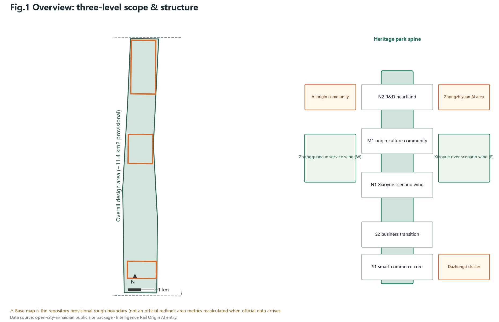
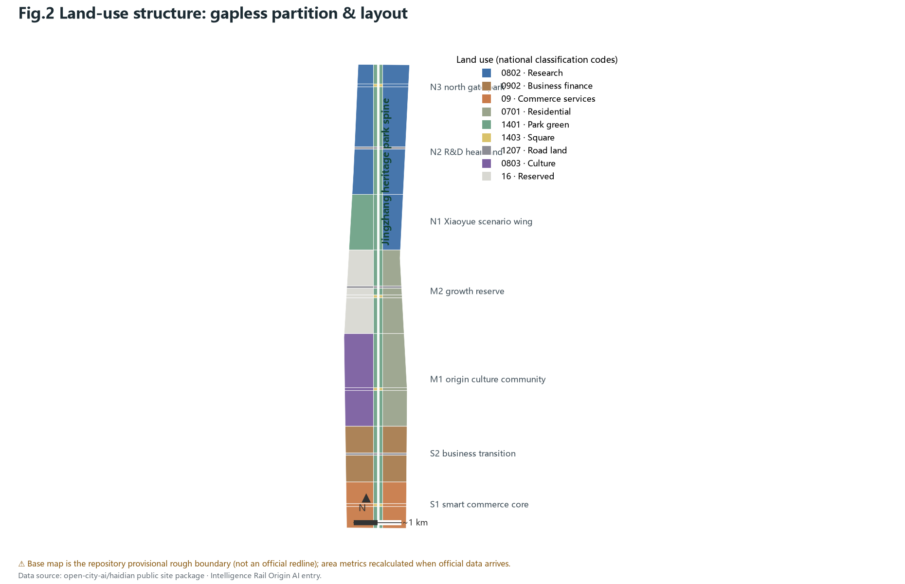
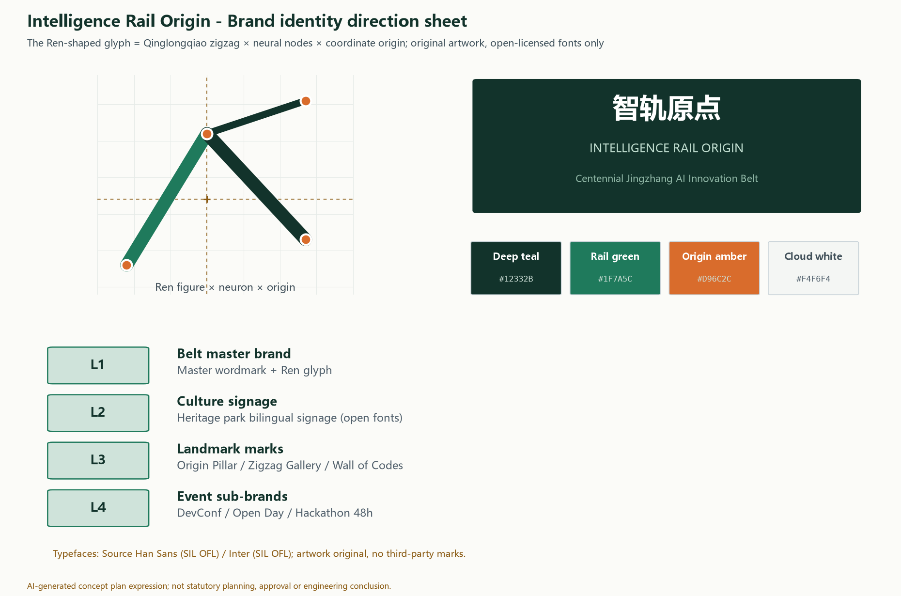
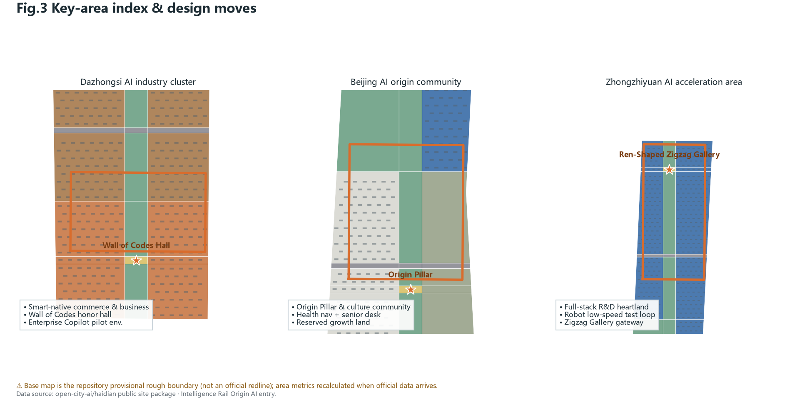
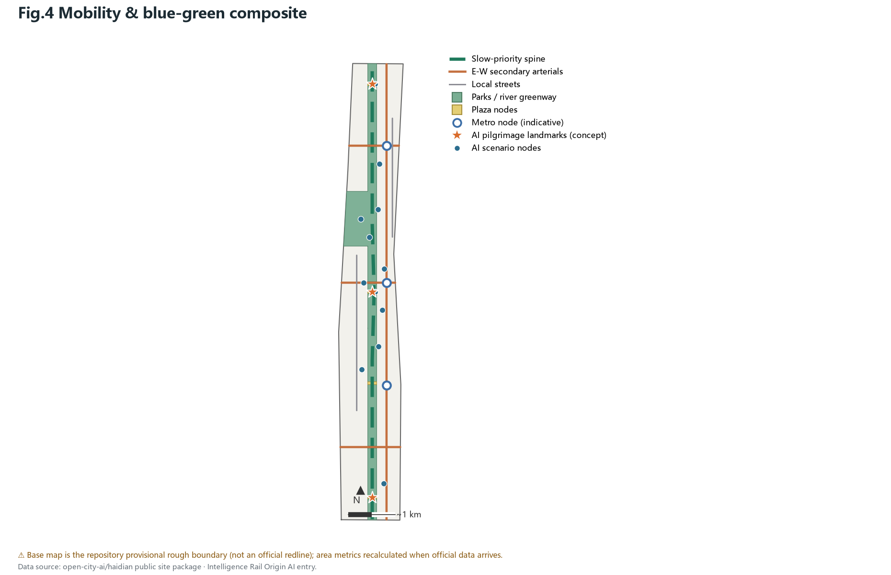
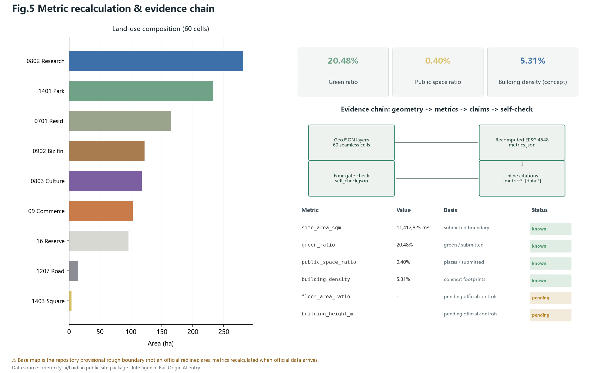

# The Intelligence Rail Origin - Urban Design of the Centennial Jingzhang AI Innovation Belt

## Design Basis and Source List

The controlling basis of this proposal is the pre-qualification announcement issued by the Haidian Branch of the Beijing Municipal Planning and Natural Resources Commission, which defines the three-level scope, official area values and the design task framework; the open call taskbook for AI agents further defines the three positions, five functions, three districts and two wings, and six mandatory tasks. Together they form the compliance baseline of this entry [source:SRC-2026-BJ-GH-QUAL-PREANNOUNCEMENT] [source:SRC-2026-0518-AGENT-OPEN-CALL-TASKBOOK]. The professional logic follows the Urban Design Measures on public space and character control, the Control Detailed Planning Measures on separating known controls from design suggestions, and the national land-use classification guide on verifiable use codes [standard:MOHURD-URBAN-DESIGN-MEASURES] [standard:MOHURD-CONTROL-DETAILED-PLANNING] [standard:MNR-LAND-USE-CLASSIFICATION-GUIDE].

A critical data boundary must be stated: the official precise SITE_BOUNDARY and KEY_AREA polygons have not yet been published. This proposal uses the repository's provisional rough boundary for generation and self-check throughout; it is suitable for design generation, visualization and intake self-check only, and must not be used as an official redline, approval basis or precise-area claim [source:SRC-PROVISIONAL-BOUNDARIES-2026]. All area metrics will be fully recalculated in EPSG:4548 once the official boundary arrives, and this trigger is recorded in the assumptions and sources. Global AI ecosystem cases are cited from public reporting as narrative references only - background-level material that supports no boundary or control claim [source:SRC-CASE-KINGS-CROSS] [source:SRC-CASE-KENDALL] [source:SRC-CASE-ONE-NORTH]. The proposal uses no commercial map tiles, no non-public data and no uncleared imagery.

## Three-Level Scope Framework

The three levels form a progressive framework of strategic research, overall design and key-area deepening. The coordinated research area covers about 43.6 square kilometers bounded by the North Fifth Ring Road, the G6 Expressway, Xizhimenwai Street and Wanquanhe Road, hosting industry-synergy and future-city studies. The overall design area of about 11.4 square kilometers is the urban district and industry area within one to two kilometers of the Jingzhang heritage park; it carries the submitted geometry at regulatory-plan urban design depth. The key detailed design area of 368.4 hectares comprises the Zhongzhiyuan AI acceleration area, the Beijing AI origin community and the Dazhongsi AI industry cluster from north to south [source:SRC-2026-BJ-GH-QUAL-PREANNOUNCEMENT] [data:geometry/site_boundary.geojson#PROV-SITE-001].

All level area values come from the official announcement text, while the submitted boundary polygons are the repository's provisional rough geometry. The recalculated submitted area is about 11.41 square kilometers, consistent with the official 11.4 square kilometer value, yet precise only to block scale [metric:site_area_sqm].

 The three key areas likewise use provisional polygons whose official values are 192.1, 104.3 and 72.0 hectares; the recalculated totals will be replaced once official redlines arrive [data:geometry/key_areas.geojson#PROV-KEY-001] [metric:key_areas_area_sqm]. The narrative therefore confines all precision-sensitive conclusions to directional design judgments pending official data.

## Coordinated Research Area: Industry and Future City Research

On industry, the proposal reads the belt as a second departure of the "AI origin": the Jingzhang Railway was the first mainline railway independently surveyed, designed and built by Chinese engineers, and today's original AI strength in Haidian is the autonomous-innovation origin of the intelligent era; the two share the same spirit of moving from introduction to autonomy [source:SRC-2026-BJ-GH-QUAL-PREANNOUNCEMENT]. Beijing's "three districts and two wings" deployment supplies the collaborative loop of the Zhongguancun technology-service wing and the Xiaoyue-river scenario wing, which this proposal treats as two-way supplies of services and scenarios rather than a simple functional zoning [source:SRC-2026-BJ-KW-THREE-AREAS-WINGS].

Seven global cases yield transferable lessons: King's Cross in London shows that railway-hub regeneration should start with public realm and slow networks; Kendall Square in Boston reveals the vitality formula of research-industry coupling at walking scale; Singapore's one-north mixed units and testbed mechanism, Paris Station F's adaptive reuse of a rail depot, Toronto MaRS's innovation service platform, Hangzhou West Sci-Tech Corridor's transit coordination and Shenzhen Nanshan's park-street integration together point to four operable principles: public realm first, mixed use, testbed mechanisms and service platforms [source:SRC-CASE-KINGS-CROSS] [source:SRC-CASE-KENDALL] [source:SRC-CASE-ONE-NORTH]. The future-city hypothesis: the competitiveness of an AI-native district lies not in building density but in scenario density - a network of testable, visible and participatory AI scenarios becomes new infrastructure.

**Case study table (seven cases; background_only narrative references - they support no boundary, control or performance claims)**:

| Case | Key mechanism lesson | Translation to the belt | Source |
|---|---|---|---|
| King's Cross, London | Public realm and slow networks first | Heritage spine delivered first | [source:SRC-CASE-KINGS-CROSS] |
| Kendall Square, Boston | Walking-scale research-industry coupling | R&D clusters at walking scale | [source:SRC-CASE-KENDALL] |
| one-north, Singapore | Mixed units + testbed mechanism | White reserve + robot test loop | [source:SRC-CASE-ONE-NORTH] |
| Station F, Paris | Rail depot reuse as startup landmark | Origin Hall & Wall of Codes retrofit | [source:SRC-CASE-STATION-F] |
| MaRS, Toronto | Centralized innovation service platform | Zhongguancun service wing | [source:SRC-CASE-MARS] |
| Hangzhou West Corridor | Transit-oriented R&D corridor | Slow spine linking three districts | [source:SRC-CASE-HZ-CORRIDOR] |
| Shenzhen Nanshan | Park-street integration | Origin community mixed frontages | [source:SRC-CASE-SZ-NANSHAN] |

The naming system follows: the belt is named "智轨原点" (Zhi Gui Yuan Dian), in English "The Intelligence Rail Origin". "Intelligence rail" denotes the innovation track carried by the railway heritage; "origin" marks the spatial coordinate of two centennial origins of Chinese engineering and AI self-innovation. The system derives place names such as Origin Plaza, Origin Hall and the Origin Pillar. The logo direction is a "Ren-shaped glyph" fusing the Qinglongqiao zigzag alignment with a neural-graph structure into an upward origin mark, in deep teal with an amber accent; typefaces are limited to commercially licensed open fonts, avoiding any unauthorized font or corporate mark. The spatial structure is "one axis, one loop, two wings, three districts and many nodes", where the axis is the Jingzhang heritage park spine [depth:overall_spatial_structure] [standard:PROJECT-AGENT-OPEN-CALL-TASKBOOK].

Brand identity is organized in four levels with a reviewable direction sheet: L1 master brand (bilingual wordmark + Ren glyph), L2 culture signage (bilingual heritage-park wayfinding), L3 landmark marks (Origin Pillar, Ren-Shaped Zigzag Gallery, Wall of Codes), L4 event sub-brands (Developers Conference, Open Source Open Day, Hackathon 48h). The glyph uses the Qinglongqiao alignment as its skeleton, neural nodes as endpoints and a coordinate-origin crosshair as datum; standard, reversed and mono lockups are provided. The palette is deep teal #12332B, rail green #1F7A5C, origin amber #D96C2C and cloud white #F4F6F4; typefaces are Source Han Sans (SIL OFL) and Inter (SIL OFL), all open-licensed and registered in the copyright record; the artwork is original and contains no third-party marks [source:SRC-CASE-KINGS-CROSS] [source:SRC-CASE-KENDALL] [source:SRC-CASE-ONE-NORTH].

Regional synergy follows "capability exchange, interfaces first" as a conceptual matrix - suggestions only, with no implied signed agreements: with Huairou Science City, a two-way channel between large-scale research compute and local scenario validation; with Future Science City, linking energy and life-science R&D into AI+energy and health trials; with the Beijing Economic-Technological Development Area (Yizhuang), connecting advanced manufacturing and vehicle-road cooperation for mutually recognized low-speed robot test standards; across the Beijing-Tianjin-Hebei region, developer tours and regional hackathon stations widening the open-source radius; with surrounding street communities, co-creation workshops and a community-planner scheme hosting daily-life scenario pilots. The starting toolkit is an open-scenario list, joint workshops and a data-compliance agreement template, to be deepened once implementation bodies are confirmed [source:SRC-2026-BJ-KW-THREE-AREAS-WINGS].

On AI governance and global voice, three conceptual mechanisms are proposed: an auditable open-source governance window anchored by the Wall of Codes, where governance rules accumulate publicly as code and contribution records; an annual governance-and-ethics track inside the event system forming a rule-discussion arena for the global developer community; and packaging the "explainable, traceable, recallable" baseline into a reusable governance template that other cities can cite - accumulating voice through practice rather than slogans [standard:GENERATIVE-AI-INTERIM-MEASURES].

## Overall Design Area: Urban Renewal and Regulatory-Plan-Level Urban Design

The spatial structure takes the Jingzhang heritage park spine as the organizing axis: a continuous park-greenway band about 9.7 kilometers long and 190 meters wide with a slow-priority promenade. The two wings host the Zhongguancun technology-service wing and the Xiaoyue-river scenario wing. North-south organization follows seven functional bands: the Dazhongsi smart-native commerce core, a business transition band, the origin culture community, a white growth reserve, the Xiaoyue scenario wing, the Zhongzhiyuan R&D heartland and the north gate park [data:geometry/land_use.geojson#LU-001].

The land-use plan achieves full coverage with 60 seamlessly partitioned cells: research land of about 282.3 hectares concentrates in the Zhongzhiyuan section; commercial and business land of about 225.8 hectares anchors the southern Dazhongsi section; culture land of about 118.0 hectares supports the origin community; park green space of about 233.8 hectares forms the spine and river greenway; residential land of about 165.0 hectares retains the existing communities; about 96.5 hectares remain white reserve land, with about 15.4 hectares of road land [metric:land_use_total_sqm]. The partition has no gaps or overlaps, all adjacent cells share boundary coordinates, and everything is recomputable from the submitted geometry [standard:MNR-LAND-USE-CLASSIFICATION-GUIDE].

The renewal framework follows "spine-led, node-breaking, wing-coordinated" logic: public-realm investment along the spine leads value; the three key areas act as renewal engines; the wings provide scenario openness and technology services. It must be emphasized that statutory controls - FAR, height, density - are missing from the cleared materials; they are uniformly recorded as pending official data and no approved value is fabricated. What this plan expresses is a conceptual supply and intensity structure for professional refinement under regulatory conditions [standard:MOHURD-CONTROL-DETAILED-PLANNING] [depth:development_intensity_controls].

## Detailed Design of Key Areas

**Dazhongsi AI industry cluster (official value ~72.0 ha)**: positioned as the southern gateway of smart-native commerce and business scenarios. Anchored by the Wall of Codes Hall - an honor hall for global developers retrofitted onto existing commercial frontages - the business band hosts the enterprise-service Copilot pilot environment and smart-native retail. Metro connection and separated logistics-delivery flows are organized at the district scale; the Cloud Plaza hosts launches and developer events. The main risk is complex commercial ownership: all suggestions remain frontage-level and operation-level concepts, never engineering conclusions on third-party property [data:geometry/key_areas.geojson#PROV-KEY-003].

**Beijing AI origin community (official value ~104.3 ha)**: positioned as "the AI origin that lives", a mixed district of culture, daily life and innovation. The Origin Pillar stands on the central plaza, commemorating the 1909 railway and the AI era as twin origins of self-innovation. Culture land carries the Origin Hall, community co-creation workshops and health-navigation service desks; white reserve land allows future growth; the slow spine and pocket parks guarantee all-age friendliness, with senior-friendly digital desks operating alongside traditional counters [data:geometry/key_areas.geojson#PROV-KEY-002]. This district leads the near-term phase.

**Zhongzhiyuan AI acceleration area (official value ~192.1 ha)**: positioned as the R&D heartland of the full-stack autonomous innovation system. Research clusters encircle a central green; a low-speed robot delivery test loop runs on the outer ring with enforceable speed limits and recall; the north gateway features the Ren-Shaped Zigzag Gallery, a spatial translation of the Qinglongqiao zigzag whose night lighting renders an artistic sequence of public training curves [data:geometry/key_areas.geojson#PROV-KEY-001]. All three designs are expressed at implementation-plan depth while remaining directional under the provisional boundary [depth:three_key_area_detailed_design].

## AI Innovation Ecosystem, Personas, and AI+ Scenarios

The ecosystem design answers the taskbook's dual demand for a full-stack autonomous system and a world-class ecology: Zhongzhiyuan hosts the full-stack testbed from compute and frameworks to model services; the origin community hosts the developer community and cultural identity; Dazhongsi hosts industrialization and smart-native consumption. The Zhongguancun service wing supplies policy, capital, IP and translation services; the Xiaoyue wing supplies open scenarios and data trials. Seven mechanisms - land, space, capital, talent, compute, data and scenarios - organize around the loop of "open scenario application, community co-creation, honor incentives and translation to implementation" [source:SRC-2026-0518-AGENT-OPEN-CALL-TASKBOOK].

The proposal offers twelve AI scenario cards, four of which are industry test-and-validation scenarios. The walkability assessment platform outputs aggregated indicators from public road data and anonymized flows, with results open to public review; the enterprise Copilot pilot answers from publicly released policy and event information with cited sources and human-confirmation prompts; the safety operations review assistant requires human review before any disposition and performs no identity tracking; the low-speed robot delivery testbed runs on published campus routes with speed limits and pedestrian priority. The other eight cards cover cultural guiding, health navigation, the open-source window, community workshops, senior-friendly desks, campus AI-literacy classes, multilingual event reception and green-space ecology monitoring; every card binds users, location, data and privacy boundaries [standard:PROJECT-AGENT-OPEN-CALL-TASKBOOK] [metric:scenario_node_count].

**Scenario handover matrix (12 cards; operator type = suggested category; all conceptual)**:

| Card | Suggested operator | Data category (minimized) | Human review | Fallback / exit |
|---|---|---|---|---|
| SC-01 Cultural guide | Public-culture platform | Aggregated check-in counts | Content traceability sampling | Falls back to static signage |
| SC-02 Health navigation | Community health center | Public service info | Human confirmation of referrals | Permanent human counter |
| SC-03 Walkability | Transport coordination platform | Anonymized aggregate flows | Public review of indicators | Indicators off = facilities remain |
| SC-04 Enterprise Copilot | Service-wing operator | Public policy/event info | Human confirm on key items | Reject answers without citations |
| SC-05 Safety review | Public-space operator | Duty logs (no imaging) | Review before disposition | Suspended if review absent |
| SC-06 Robot delivery | Campus operator | Published campus routes | Human handling of incidents | One-switch pause + speed recall |
| SC-07 Open-source window | Wall of Codes operator | Public repo aggregates | Display content review | Static honor wall fallback |
| SC-08 Co-creation workshop | Community center | Public agendas/minutes | Confirmation before publishing | Human-moderated workshop |
| SC-09 Senior-friendly desk | Community service center | Public service guides | Full human parallel service | Human window is the fallback |
| SC-10 Campus AI classes | Schools & science outlets | Public course materials | Teacher content review | Regular teaching aids |
| SC-11 Event reception | Event organizer | Public schedules | Editable scheduling results | Manual event desk |
| SC-12 Ecology monitoring | Green-space maintainer | Fixed-sensor aggregates | Human judgment on anomalies | Manual inspection rounds |

Five personas are defined: returnee AI researchers needing compliant compute and an international academic community; young developers needing affordable desks, testbeds and open-source belonging; senior residents needing parallel human counters and barrier-free streets; international visitors needing multilingual reception and a one-day pilgrimage route; students needing safe science paths and hands-on practice. All scenarios follow the principles of explainability, traceability and recallability; generative content services are designed strictly within the boundaries of the interim generative-AI measures, public services keep human counters, and accessibility law and senior-inclusion policy are respected [standard:GENERATIVE-AI-INTERIM-MEASURES] [standard:BARRIER-FREE-ENVIRONMENT-LAW] [standard:ELDERLY-SMART-TECH-PLAN-2020-45].

For professional handover, the twelve scenario cards carry transferable operating elements (all conceptual; body type means the suggested category of operator). Cultural guiding (SC-01/07/08/10): a public-culture operating platform; KPIs of service visits and content-traceability coverage; appeals via the guide page answered within seven days. Health navigation (SC-02/09): community health centers; KPIs of referral success and human-counter parallel rate; no health data retention. Walkability (SC-03/11): a transport coordination platform; KPIs of indicator release frequency and adopted public reviews. Enterprise Copilot (SC-04): the technology-service wing operator; KPIs of citation completeness and human-confirmation precision. Safety review (SC-05): public-space operators; human review before any disposition, with records kept. Low-speed delivery (SC-06/12): campus operators; KPIs of speed-limit compliance and recall-drill counts, with any safety incident triggering suspension. Every scenario has a one-switch recall and a fallback to ordinary public service; annual review summaries are published [source:SRC-2026-0518-AGENT-OPEN-CALL-TASKBOOK] [standard:GENERATIVE-AI-INTERIM-MEASURES].

## Land Use, Building Scale, and Retain-Renovate-Demolish Strategy

The land-use and scale plan holds three principles: credible structure, restrained massing and honest boundaries. Among the 60 cells, research and commercial-office parcels carry new "intelligence-rail" buildings at a conceptual six floors; culture parcels favor renovation preserving existing fabric and depot memory; residential parcels are entirely retained with no demolition proposed; white reserve parcels receive no permanent buildings [data:geometry/buildings.geojson#BLD-001] [depth:retain_renovate_demolish].

On conceptual massing: total footprints reach about 605,000 square meters, about 5.3% of the submitted boundary; the conceptual gross floor area is about 2.88 million square meters. These are low-confidence design-model outputs that indicate the order of magnitude of spatial supply - not statutory values, investment or engineering commitments [metric:building_density] [metric:conceptual_gfa_sqm]. Real controls of height and intensity must come from approved regulatory plans and aviation, landscape and heritage checks; before official conditions arrive this plan draws no height conclusion and records such metrics as pending official data [depth:height_massing_character].

The retain-renovate-demolish logic is open and checkable: cultural and existing public buildings along the spine are renovated first; sound existing housing and park buildings are retained; new buildings fall only inside design parcels other than research, commercial and reserve, never occupying green or plaza cells. For character, new buildings along the spine suggest deep-teal and warm-grey palettes with fair-faced concrete, terracotta and light metal panels echoing the industrial railway heritage; roofs integrate photovoltaics and edge-compute micro nodes as a concept, with final form decided by individual building design [depth:land_use_layout].

## Transport, Rail, Municipal Infrastructure, and Public Services

Transport puts slow mobility first: the heritage-park slow spine runs through the district linking three key areas and four plazas, forming a road and slow-traffic skeleton of about 28.7 kilometers; three east-west secondary arterials strengthen crossings of the rail corridor, with community and R&D local streets separating passenger and goods flows [data:geometry/roads.geojson#RD-001] [metric:road_total_length_m].

 Rail connection relies on existing metro nodes shown indicatively; station entrances, transfer passages and railway safety zones await official data for deepening, and no bridge, tunnel or underground engineering feasibility conclusion is drawn [depth:traffic_rail_slow_parking].

Parking follows an "edge-interception, car-free spine" strategy: vehicle parking sits along the arterials and key-area edges while the spine hosts walking, cycling and low-speed shuttles; bicycles and delivery robots share the low-speed network with time management. For municipal and new infrastructure, the plan proposes rooftop photovoltaics with edge-compute micro nodes, reserved distributed-energy connections and multi-function smart poles - all conceptual; traditional utilities capacity must be verified against official pipeline records, and no existing network capacity is assumed [depth:municipal_new_infrastructure].

Public services follow a "15-minute innovation life circle": community digital service desks provide dual online-offline channels for government affairs, health navigation and multilingual inquiry; the Origin Hall hosts academic and community events; campus literacy classes serve youth. All facilities keep human service windows to guarantee digital inclusion [standard:ELDERLY-SMART-TECH-PLAN-2020-45].

## Blue-Green Network, Public Space, and Urban Character

The blue-green system consists of "one belt, one river, many nodes": the Jingzhang heritage park belt of about 233.8 hectares including the north gate park and the Xiaoyue river greenway forms the continuous ecological and activity skeleton, while a plaza network of about 4.6 hectares provides hardscape public space at the Dazhongsi Cloud Plaza, Origin Plaza, community plaza and the Ren-Shaped Zigzag Gallery forecourt [data:geometry/green_space.geojson#GS-001] [data:geometry/public_space.geojson#PS-001]. The recalculated green ratio is about 20.48% and the public-space ratio about 0.40%, both recomputable from the submitted geometry; counting activity grounds inside the park belt would raise广义 public supply significantly, and this plan keeps the stricter plaza-only basis for conservatism [metric:green_ratio] [metric:public_space_ratio] [depth:blue_green_public_space].

AI public space is the signature: all plazas are pre-wired with scenario interfaces for guiding, monitoring and event scheduling under "recallable and explainable" baselines, so that any scenario, once offline, leaves a fully usable ordinary public space. Three AI pilgrimage landmarks anchor the honor display system - the Origin Pillar, the Ren-Shaped Zigzag Gallery and the Wall of Codes Hall - commemorating the century of autonomous innovation, saluting engineering wisdom and displaying public contributions of global developers; the honor system also includes an annual open-source contribution board and a youth science-and-innovation honor wall, all driven by publicly verifiable data [standard:PROJECT-AGENT-OPEN-CALL-TASKBOOK] [metric:pilgrimage_landmark_count].

Character guidance sets deep teal and warm grey as base tones along the spine, with fair-faced concrete, terracotta and light metal as principal materials echoing the railway industrial heritage; signage joins the Intelligence Rail Origin visual system using open bilingual typefaces; historical display relies strictly on public records without fabricated details, and cultural elements are never trivialized [standard:MOHURD-URBAN-DESIGN-MEASURES].

## Renewal Projects, Implementation Policy, and Phasing

The renewal list holds ten conceptual projects. Near-term five: the southern heritage-park connection, Origin Plaza with a conceptual underground interface reservation, Origin Hall adaptive reuse, the community digital service desk network, and slow-network gap closures. Mid-term three: the Ren-Shaped Zigzag Gallery, the Zhongzhiyuan robot test loop, and rooftop PV with edge-compute micro nodes. Long-term two: the Wall of Codes frontage retrofit and the pocket-park program. Phasing geometry shows about 453.9 hectares near-term, 416.2 hectares mid-term and 271.2 hectares long-term; the three phases together cover the whole submitted boundary and match the metrics.json recalculation [data:geometry/phasing.geojson#P1-ZONE] [metric:phase1_area_sqm] [metric:phase2_area_sqm] [metric:phase3_area_sqm] [depth:renewal_project_list].

**Renewal project handover matrix (10 items; prerequisites, operators and acceptance are conceptual)**:

| Project | Prerequisite materials | Operator type | Phase acceptance (concept) |
|---|---|---|---|
| PR-01 Southern park connection | Official redline (pending), rail safety zones | Public-space platform | Segment open + slow-flow spot checks |
| PR-02 Origin Plaza | Site ownership & utility records | Public-space platform | Plaza open + scenario interface check |
| PR-03 Origin Hall retrofit | Building safety & ownership review | Culture facility operator | Works done + event program |
| PR-04 Service desks x3 | Service list & venues | Community service centers | 100% human-parallel pilot |
| PR-05 Slow-network gaps x3 | Road redlines & rail-crossing terms | Transport coordination platform | Connectivity + safety assessment |
| PR-06 Zigzag Gallery | Siting & height verification | Culture facility operator | Open + accessibility acceptance |
| PR-07 Robot test loop | Campus right-of-way & insurance | Campus operator | Speed-compliance pilot passed |
| PR-08 PV + edge-compute | Roof ownership & grid connection | Campus operator | Generation & compute metrics |
| PR-09 Wall of Codes retrofit | Frontage ownership & merchant talks | Cluster operator | Honor system online |
| PR-10 Pocket park program | Green-space ownership & budget | Public-space platform | Open area & canopy rate |

Policy suggestions follow three lines: an open scenario list to lower trial thresholds for AI enterprises; joint public-realm operation inviting social actors to maintain the spine; and honor plus event systems accumulating community assets. The annual event system comprises the Jingzhang AI Developers Conference, the Open Source Open Day, the Jingzhang AI Hackathon 48h, Origin Nights and the International AI City Biennale - all conceptual suggestions rather than confirmed arrangements [depth:phasing_implementation]. The developer-community mechanism proposes the loop of "contributions accumulate, honors display, scenarios open for application"; international communication tells the story of two origins, inviting global developers into the work; the conversion pathway follows events, community, incubation and implementation, with conversion data to be measured in operation [source:SRC-2026-0518-AGENT-OPEN-CALL-TASKBOOK].

Public participation runs throughout: public exhibition, co-creation workshops, a community-planner scheme and annual open days are embedded in the operation mechanism; all operators, funding and policy arrangements remain suggestions awaiting decisions by government and implementation bodies.

For long-term operations governance, a "four-party joint council" concept is suggested: the authority in charge oversees compliance; the public-space and scenario platform runs daily operations; community representatives join demand ranking and satisfaction review; developer and academic representatives join technical review and event co-creation. Funding is suggested as a mix of public-realm maintenance budgets, event partnerships and scenario service income - all conceptual. The annual KPI frame covers five items: event attendance and return-visit rate; open-source contribution growth and contributor retention; scenario availability and recall response time (target within 24 hours); public appeal handling time (target within seven days); and the parallel rate of accessibility and senior-friendly counters. A public annual review summary is published; underperforming items enter next year's rectification list, and scenarios failing twice consecutively trigger an exit assessment. Data governance registers per-scenario data categories, minimization scope, retention periods and the anonymization owner - "anonymizable" is a design principle only, requiring dedicated verification before launch [source:SRC-2026-0518-AGENT-OPEN-CALL-TASKBOOK] [depth:phasing_implementation].

## Metrics, Area Recalculation, and Compliance Matrix

Metrics are organized in three tiers: core visual metrics, structural metrics and pending metrics. Core visual metrics are recomputable from the submitted geometry in EPSG:4548 - the submitted area is about 11,412,825 square meters, the green ratio about 20.48% and the public-space ratio about 0.40%, matching the visual dashboard values [metric:site_area_sqm] [metric:green_ratio] [metric:public_space_ratio]. Structural metrics include total land use, footprints, conceptual GFA, road length, key-area area, scenario nodes, landmarks, renewal projects and phase areas, each with formula, sources and confidence recorded in metrics.json [depth:metrics_recalculation].

Pending metrics are honestly unknown: FAR and height await approved regulatory conditions, with reasons and recalculation triggers recorded - no approved value is fabricated [metric:floor_area_ratio]. The recalculation method is uniform: GeoJSON exchanges in EPSG:4326 and areas are computed in EPSG:4548; the land-use partition matches the submitted boundary exactly; green and public spaces derive directly from partition cells, keeping geometry, metrics and figures from the same source.

The compliance matrix covers all sub-items of announcement tasks 1.3, 1.4 and 1.5 plus agent tasks agent.1 through agent.6: concept and naming, ecosystem cases and mechanisms, scenario cards and personas, pilgrimage landmarks and honors, culture narrative, and events and operations are all substantively developed in the text; the standard matrix answers five mandatory standards and three reference standards; all fifteen design-depth items are complete. The machine-audit layer and the human reading layer index each other through evidence markers, so reviewers understand the proposal without opening JSON and can trace every claim when needed [standard:PROJECT-OFFICIAL-ANNOUNCEMENT] [depth:metrics_recalculation].

## Risk, Copyright, and Compliance

Principal risks and responses. First, boundary precision: the provisional rough boundary makes all areas and locations directional; the response is prominent labeling throughout and full recalculation once official data arrives [source:SRC-PROVISIONAL-BOUNDARIES-2026]. Second, missing controls: FAR and height are pending; the response is recording them as pending official data and keeping conceptual massing at low confidence. Third, implementation complexity: renewal beside an active railway involves multiple owners; suggestions remain frontage- and operation-level without engineering conclusions. Fourth, technology maturity: robot delivery and similar scenarios are presented as test-and-validation, never as deployable at scale. Fifth, equity and inclusion: all public services keep human counters and meet accessibility requirements [standard:BARRIER-FREE-ENVIRONMENT-LAW].

Copyright and compliance: geometry and figures are AI-generated from the repository's public package, with process and tools recorded in the copyright statement; global cases cite public facts with sources and copy no copyrighted imagery; the naming, logo direction and signage are original concepts using no unauthorized fonts, trademarks, portraits or corporate marks; all generated media is labeled synthetic and never poses as site photos, resident opinion or official documents. On privacy, no scenario depends on personal identity tracking, aggregated data is anonymizable, and recognition outputs require human review [standard:GENERATIVE-AI-INTERIM-MEASURES]. This proposal is not a government-approved conclusion, investment commitment or engineering basis; see report/copyright_statement.md [depth:risk_missing_data].

## References

1. Beijing Municipal Planning and Natural Resources Commission Haidian Branch: Pre-qualification announcement of the Centennial Jingzhang AI Innovation Belt urban design open call, 2026-05-09.
2. Taskbook excerpt for global AI agents of the open call (user-cleared document), 2026-05-18.
3. Beijing Municipal Science and Technology Commission and Zhongguancun Administrative Committee: public reporting on the "three districts and two wings" deployment, 2026-04-03.
4. Ministry of Housing and Urban-Rural Development: Urban Design Measures.
5. Ministry of Housing and Urban-Rural Development: Measures for the Compilation and Approval of Control Detailed Planning.
6. Ministry of Natural Resources: Guide to Land and Sea Use Classification for Territorial Space Survey, Planning and Use Control.
7. Cyberspace Administration of China and six departments: Interim Measures for Generative AI Services.
8. Standing Committee of the National People's Congress: Law on Building a Barrier-Free Environment.
9. General Office of the State Council: Implementation Plan for Helping Older People Overcome Smart-Technology Difficulties (Guo Ban Fa [2020] No.45).
10. open-city-ai/haidian repository: brief/site-package public materials, provisional boundary geometry and its basis note.
11. Public materials on global cases including King's Cross, Kendall Square, one-north, Station F, MaRS, Hangzhou West Sci-Tech Corridor and Shenzhen Nanshan (narrative references, background only).

Items 1 and 2 are the controlling bases of this proposal [source:SRC-2026-BJ-GH-QUAL-PREANNOUNCEMENT] [source:SRC-2026-0518-AGENT-OPEN-CALL-TASKBOOK]; item 10 is the direct source of geometry and boundaries [source:SRC-PROVISIONAL-BOUNDARIES-2026]. The complete machine-readable index resides in sources.json and the three matrix files.
