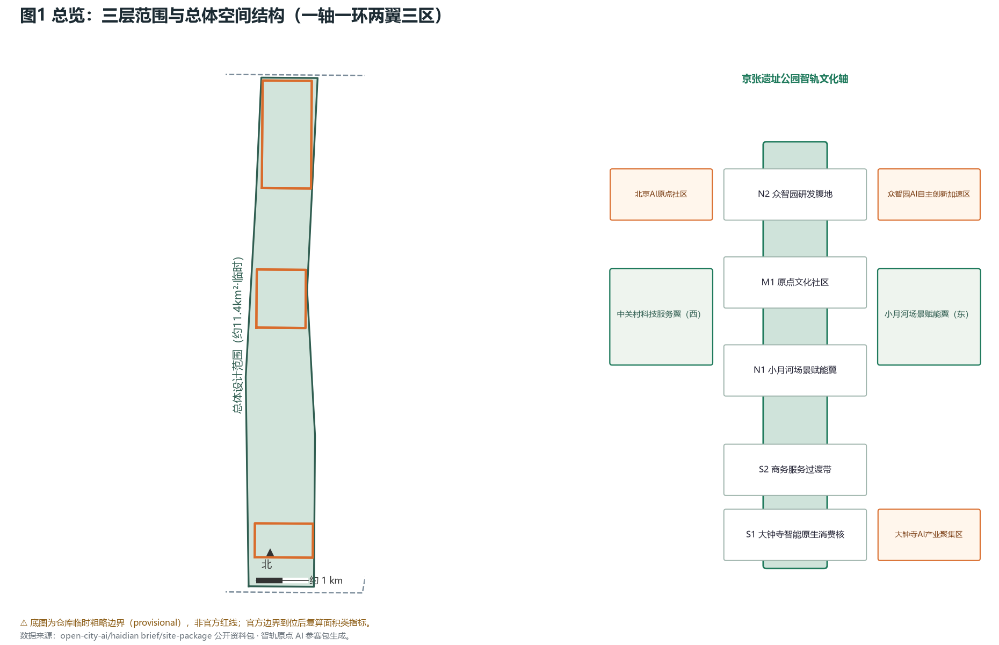
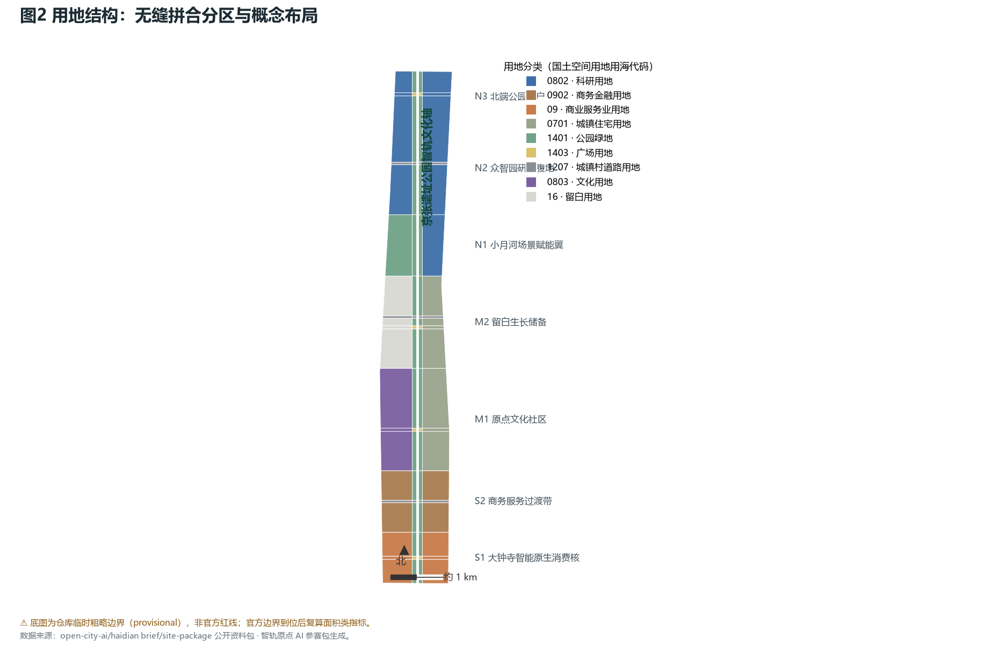
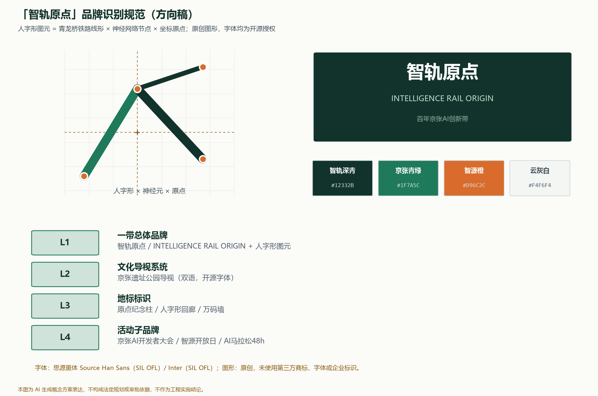
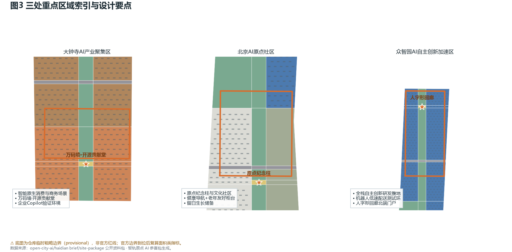
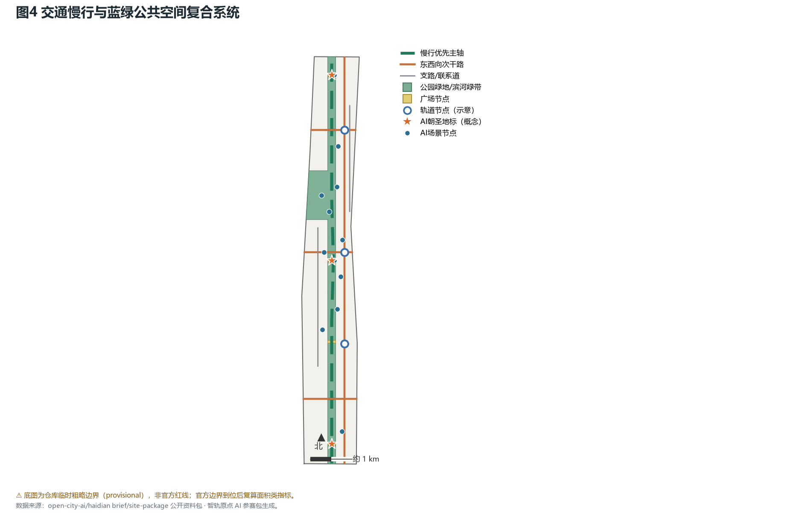
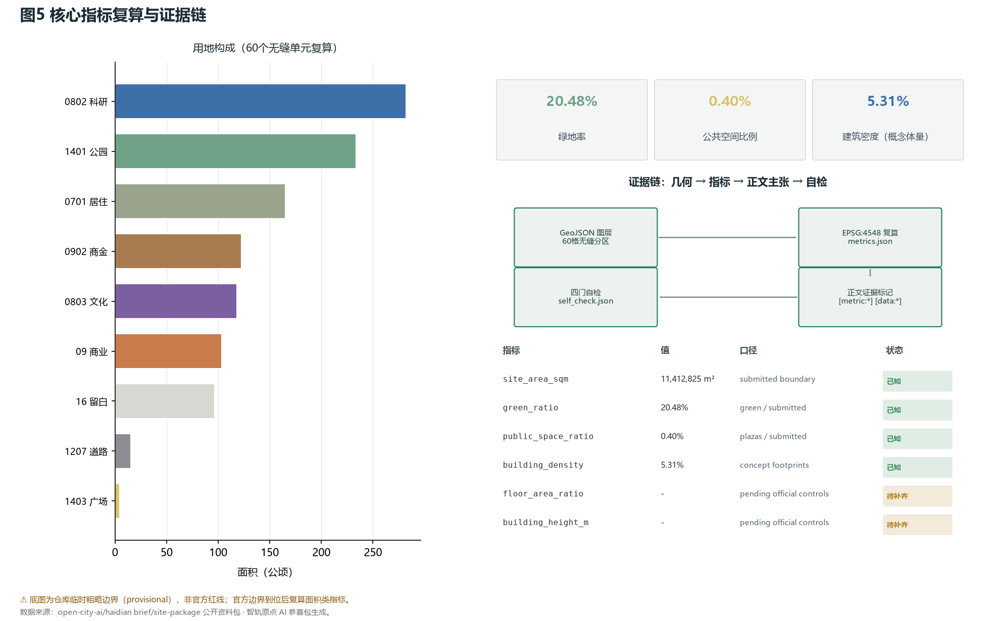

# 智轨原点——百年京张AI创新带城市设计

## 设计依据与资料清单

本方案的主控依据是北京市规划和自然资源委员会海淀分局发布的资格预审公告，其给出三层范围、官方面积值与设计任务框架；面向全球智能体的开源征集任务书则规定了三大定位、五大功能、三区两翼与六项必答任务，两者共同构成本提案的合规基线 [source:SRC-2026-BJ-GH-QUAL-PREANNOUNCEMENT] [source:SRC-2026-0518-AGENT-OPEN-CALL-TASKBOOK]。专业编制逻辑遵循《城市设计管理办法》关于公共空间与风貌管控的要求、《控制性详细规划编制审批办法》关于区分已知控制与设计建议的要求，以及国土空间用地用海分类指南对可校验用地代码的统一规定 [standard:MOHURD-URBAN-DESIGN-MEASURES] [standard:MOHURD-CONTROL-DETAILED-PLANNING] [standard:MNR-LAND-USE-CLASSIFICATION-GUIDE]。

必须说明的资料边界是：官方精确的 SITE_BOUNDARY 与 KEY_AREA 多边形尚未发布，本方案全程使用仓库提供的临时粗略边界生成与自检，它只可用于方案生成、可视化和入库自检，不可作为官方红线、审批依据或精确面积结论 [source:SRC-PROVISIONAL-BOUNDARIES-2026]。所有面积类指标在官方边界到位后将按 EPSG:4548 全量复算，这一触发条件已写入假设与来源记录。全球AI创新生态案例仅取公开报道作叙事参照，属背景级别资料，不用于任何边界或管控主张 [source:SRC-CASE-KINGS-CROSS] [source:SRC-CASE-KENDALL] [source:SRC-CASE-ONE-NORTH]。本方案不使用商业地图瓦片、非公开数据或未经清权的图像素材。

## 三层范围工作框架

三层范围构成"战略研究—总体设计—重点深化"的递进工作框架。统筹研究范围约43.6平方公里，北至北五环路、东至京藏高速、南至西直门外大街、西至万泉河路，承担产业协同与未来城市形态研究；总体设计范围约11.4平方公里，即京张遗址公园周边1至2公里的城市地区与产业区，是本方案提交几何的覆盖范围，达到控制性详细规划深度的城市设计；重点详细设计范围368.4公顷，自北向南为众智园AI自主创新加速区、北京AI原点社区、大钟寺AI产业聚集区三处，达到规划综合实施方案深度的精细化设计 [source:SRC-2026-BJ-GH-QUAL-PREANNOUNCEMENT] [data:geometry/site_boundary.geojson#PROV-SITE-001]。

三层范围的面积值均来自官方公告文字，而本次提交的边界多边形为仓库临时粗略几何，提交边界复算面积约1141.3公顷，与官方11.4平方公里的公告值一致，但精度仅到街区尺度 [metric:site_area_sqm]。三处重点区同样采用临时多边形，其官方面积值分别为192.1、104.3与72.0公顷，本包复算合计值将在官方红线到位后替换 [data:geometry/key_areas.geojson#PROV-KEY-001] [metric:key_areas_area_sqm]。因此本方案在正文中将所有精度敏感的结论限定为方向性设计判断，待正式数据补齐后再行复核。

## 统筹研究范围产业与未来城市研究

产业研究层面，本方案将创新带理解为"AI原点"的第二次出发：京张铁路是中国人自主勘测、设计并施工的第一条干线铁路，而今天海淀聚集的AI原创力量是智能时代的自主创新原点，两者共享"从引进到自主"的精神谱系 [source:SRC-2026-BJ-GH-QUAL-PREANNOUNCEMENT]。北京市"三区两翼"的产业部署为创新带提供了中关村科技服务翼与小月河场景赋能翼的协同回路，本方案据此把两翼理解为服务与场景的双向供给，而非简单的功能分区 [source:SRC-2026-BJ-KW-THREE-AREAS-WINGS]。

全球案例研究给出七条可转译经验：伦敦国王十字证明铁路枢纽更新应先行公共领域与慢行网络；波士顿肯德尔广场揭示科研与产业在步行尺度耦合的活力公式；新加坡one-north的混合单元与试验场机制、巴黎Station F的既有站房改造、多伦多MaRS的创新服务平台、杭州城西科创大走廊的公交协同与深圳南山高新区园区街区化的实践，共同指向"公共领域先行、功能混合、试验场机制、服务平台托底"四个可操作原则 [source:SRC-CASE-KINGS-CROSS] [source:SRC-CASE-KENDALL] [source:SRC-CASE-ONE-NORTH]。未来城市假设是：AI原生城区的竞争力不在建筑密度而在场景密度——可试、可看、可参与的AI场景网络将成为新的基础设施。

**逐案例研究表（七例，均为 background_only 叙事参照，不支撑边界、管控或绩效主张）**：

| 案例 | 关键机制经验 | 在本带的转译应用 | 来源 |
|---|---|---|---|
| 伦敦国王十字 | 公共领域与慢行网络先行，带动更新价值 | 遗址公园轴带先行贯通 | [source:SRC-CASE-KINGS-CROSS] |
| 波士顿肯德尔广场 | 科研-产业步行尺度耦合 | 众智园研发腹地步行组团 | [source:SRC-CASE-KENDALL] |
| 新加坡 one-north | 混合单元 + 试验场机制 | 留白用地与机器人测试环 | [source:SRC-CASE-ONE-NORTH] |
| 巴黎 Station F | 既有铁路站房改造为创业地标 | 原点会堂与万码墙改造 | [source:SRC-CASE-STATION-F] |
| 多伦多 MaRS | 集中式创新服务平台 | 中关村科技服务翼 | [source:SRC-CASE-MARS] |
| 杭州城西科创大走廊 | 公交轴协同研发走廊 | 慢行主轴串联三区 | [source:SRC-CASE-HZ-CORRIDOR] |
| 深圳南山高新区 | 园区街区化与街头经济 | 原点社区混合界面 | [source:SRC-CASE-SZ-NANSHAN] |

命名体系据此确定：一带主名称为「智轨原点」，英文名 Intelligence Rail Origin；"智轨"指以京张铁路遗产为载体的智能创新轨道，"原点"指中国工程自主与AI自主创新两个百年原点的空间坐标。命名体系衍生出原点广场、原点会堂、原点纪念柱等系列地名。Logo方向为"人字形图元"：将青龙桥"人字形"铁路线形与神经网络图结构同构，形成向上的坐标原点符号，主色采用深青绿与智源橙的搭配，字体方向为可商用开源黑体，避免任何未授权字体与企业标识。总体空间结构为"一轴一环两翼三区多节点"，其中一轴即京张遗址公园智轨文化轴，一环为串联三区两翼的AI公共体验环 [depth:overall_spatial_structure] [standard:PROJECT-AGENT-OPEN-CALL-TASKBOOK]。

品牌识别按四级层级组织并给出可审查的方向稿：L1一带总体品牌（智轨原点双语字标+人字形图元）、L2文化导视系统（京张遗址公园双语导视）、L3地标标识（原点纪念柱、人字形回廊、万码墙各自延展）、L4活动子品牌（开发者大会、智源开放日、AI马拉松48小时）。图元以青龙桥铁路线形为骨架、神经元节点为端点、坐标原点为定位基准，提供标准组合、反白与单色版本；色彩体系为智轨深青#12332B、京张青绿#1F7A5C、智源橙#D96C2C与云灰白#F4F6F4；字体指定思源黑体（SIL OFL）与Inter（SIL OFL），全部开源授权并在版权记录登记，图形为原创、不含任何第三方商标 [source:SRC-CASE-KINGS-CROSS] [source:SRC-CASE-KENDALL] [source:SRC-CASE-ONE-NORTH]。

区域协同按"能力交换、接口先行"原则提出概念性创新协同矩阵，全部为建议方向、不构成任何已签合作协议：与怀柔科学城探索大科学装置算力与本带场景验证的双向通道；与未来科学城对接能源、生命健康研发力量，转化为AI+能源与健康场景试验；与北京经济技术开发区（亦庄）衔接高端制造与车路协同能力，共建低速配送与机器人测试标准互认；面向京津冀腹地组织开发者巡回与区域赛站，扩大开源社区半径；与周边街道社区（如北纬社区类生活片区）以社区共创工作坊和社区规划师制度承接生活服务型场景试点。上述接口均以"场景开放清单+联合工作坊+数据合规协议模板"为起步工具，待实施主体确定后深化 [source:SRC-2026-BJ-KW-THREE-AREAS-WINGS]。

在AI治理与全球话语权维度，本方案提出三项概念机制：其一，依托万码墙与开源贡献堂建立可核查的开源治理展示窗口，让治理规则以代码与贡献记录形式公开沉淀；其二，依托年度活动体系组织AI伦理与治理专题议程，形成面向全球开发者社区的规则讨论场；其三，把"可解释、可溯源、可撤回"的场景底线整理为可复用的治理模板，供其他城市与社区引用，以实践参与而非口号参与的方式积累话语权 [standard:GENERATIVE-AI-INTERIM-MEASURES]。

## 总体设计范围城市更新与控规深度城市设计

总体设计范围的空间结构以京张遗址公园智轨文化轴为纲：轴带贯穿全区约9.7公里，宽约190米，是连续的公园绿地与慢行主轴；东西两翼分别为中关村科技服务翼（研发服务与专业服务集聚）与小月河场景赋能翼（滨河绿带与AI场景试验）；南北按七段功能带组织——大钟寺智能原生消费核、商务服务过渡带、原点文化社区、留白生长储备、小月河场景赋能翼、众智园研发腹地与北端公园门户 [data:geometry/land_use.geojson#LU-001]。

用地布局采用60个无缝拼合的用地单元实现完整覆盖：科研用地约282.3公顷集中于众智园段，商业服务业与商务金融用地约225.8公顷布局于南端大钟寺段，文化用地约118.0公顷支撑原点社区，公园绿地约233.8公顷构成轴带与滨河绿带，城镇住宅用地约165.0公顷为东西两翼既有社区，另设留白用地约96.5公顷作为弹性生长储备，道路用地约15.4公顷 [metric:land_use_total_sqm]。分区拼合无重叠无缝隙，全部单元共享边界坐标，可从提交几何直接复算 [standard:MNR-LAND-USE-CLASSIFICATION-GUIDE]。

更新总体框架按"轴带牵引、节点突破、翼区协同"组织：轴带以公共空间投资带动沿线价值，节点选择三处重点区作为更新引擎，翼区通过场景开放与科技服务形成支撑。必须强调的是，容积率、建筑高度、建筑密度等法定管控条件在清权资料中缺失，本方案将其统一记为待正式数据补齐，不虚构任何审定数值；本方案表达的是概念性的空间供给与强度分区设想，供专业团队在控规条件下深化 [standard:MOHURD-CONTROL-DETAILED-PLANNING] [depth:development_intensity_controls]。

## 重点区域详细设计

**大钟寺AI产业聚集区（约72.0公顷官方值）**：定位为智能原生消费与商务场景的南端门户。空间上以万码墙·开源贡献堂为锚点，改造既有商业界面形成面向全球开发者的荣誉展示堂；商务金融带提供企业服务Copilot的验证环境与智能原生新业态店铺；交通上接驳既有轨道节点并组织货运与配送的分离流线；公共空间以云广场承接发布会与开发者活动。风险在于既有商业权属复杂，所有改造建议均为界面级与运营级概念，不涉及权属空间的工程改造结论 [data:geometry/key_areas.geojson#PROV-KEY-003]。

**北京AI原点社区（约104.3公顷官方值）**：定位为"居住着的AI原点"，是文化、生活与创新的混合社区。原点纪念柱立于社区核心广场，纪念1909年京张铁路通车与AI时代两个自主创新原点；文化用地承载原点会堂、社区共创工作坊与健康服务导航驿站；留白用地为未来人才社区与设施预留生长空间；慢行主轴与口袋公园体系保障全龄友好的日常体验，老年友好数字助手柜台与传统人工窗口并行设置 [data:geometry/key_areas.geojson#PROV-KEY-002]。该区是近期启动的核心，更新项目优先在此落位。

**众智园AI自主创新加速区（约192.1公顷官方值）**：定位为AI全栈自主创新体系的研发腹地。科研用地组团围合中心绿带布局，机器人低速配送测试环沿研发组团外圈组织，限速、可监管、可撤回；北端门户设人字形回廊，以青龙桥铁路线形的空间转译致敬工程智慧，夜间灯光呈现公开训练曲线的艺术化序列；研发支路与东西向干道保证货运、通勤与测试流线互不干扰 [data:geometry/key_areas.geojson#PROV-KEY-001]。三区详细设计均达到规划综合实施方案深度的表达，但受临时边界限制，所有结论为方向性设计 [depth:three_key_area_detailed_design]。

## AI 创新生态、人才画像与 AI+ 场景

创新生态设计回应任务书对全栈自主体系与世界级生态的双重要求：众智园承载从算力、框架到模型服务的全栈自主试验场，原点社区承载开发者社区与文化认同，大钟寺承载产业转化与智能原生消费；中关村科技服务翼提供政策、资本、知识产权与转化服务，小月河场景赋能翼提供开放场景与数据试验环境，土地、空间、资金、人才、算力、数据与场景七类机制围绕"场景开放申请—社区共创—荣誉激励—转化落地"的回路组织 [source:SRC-2026-0518-AGENT-OPEN-CALL-TASKBOOK]。

本方案提出12张AI场景卡，其中4个为产业测试验证场景。交通慢行评估开放平台以公开道路资料与匿名化人流统计输出聚合指标，评估结果接受公众复核；企业服务Copilot验证环境以公开发布的政策与活动信息为语料，回答附引用来源并提示人工确认；公共安全运营复核助手坚持识别结果必须经人工复核后处置、不做身份追踪；机器人低速配送测试场在园区内公开路线上限速运行、避让行人优先。其余八张覆盖文化导览、健康服务导航、开源之窗可视化、社区共创工作坊、老年友好柜台、校园通识课堂、会展智能接待与绿地生态监测，每卡均绑定服务对象、空间落位、运行数据与隐私边界 [standard:PROJECT-AGENT-OPEN-CALL-TASKBOOK] [metric:scenario_node_count]。

**场景可移交矩阵（12卡逐项；主体类型为建议承担方类别，全部为概念建议）**：

| 卡 | 建议主体类型 | 数据类别（最小化口径） | 人工复核 | 降级 / 退出机制 |
|---|---|---|---|---|
| SC-01 京张AI文化导览 | 公共文化运营平台 | 点位签到计数（聚合） | 内容溯源抽检 | 撤回后为普通导览标识 |
| SC-02 健康服务导航 | 社区卫生服务中心 | 公共服务信息 | 转介结果人工确认 | 并行人工柜台常设 |
| SC-03 交通慢行评估 | 交通协调平台 | 匿名聚合人流 | 指标公众复核 | 指标下线不影响慢行设施 |
| SC-04 企业Copilot | 科技服务翼运营方 | 公开政策活动信息 | 重要事项人工确认 | 引用缺失即拒答 |
| SC-05 安全运营复核 | 公共空间运营方 | 值守记录（不留影像） | 处置前必须复核 | 复核缺位即停用 |
| SC-06 机器人低速配送 | 园区运营方 | 园区公开路线 | 安全事件人工处置 | 一键暂停+限速撤回 |
| SC-07 开源之窗 | 万码墙运营方 | 公开仓库聚合统计 | 展示内容审核 | 静态荣誉墙兜底 |
| SC-08 社区共创工作坊 | 社区中心 | 公开议程纪要 | 成果发布前确认 | 转人工主持工作坊 |
| SC-09 老年友好柜台 | 社区服务中心 | 办事指南公开信息 | 全程人工并行 | 人工窗口即兜底 |
| SC-10 校园通识课堂 | 学校与科普机构 | 公开课程资料 | 教师复核内容 | 转常规教具 |
| SC-11 会展排程接待 | 活动主办方 | 公开会务日程 | 排程结果可改 | 转人工会务台 |
| SC-12 绿地生态监测 | 绿地管养方 | 固定传感聚合读数 | 数据异常人工研判 | 转人工巡检 |

用户画像共五类：归国AI研究员需要算力合规通道与国际化学术社区；青年开发者需要低成本工位、试验场与开源社区归属；原住老年居民需要传统服务柜台并行与无障碍环境；跨国访客需要多语接待与一日朝圣体验线；研学学生需要安全的科普路径与动手实践。所有场景遵循"可解释、可溯源、可撤回"原则，生成式内容服务仅在符合生成式AI管理规定的边界内设计，公共服务场景保留人工办理通道，并参照无障碍环境建设法与适老化政策要求设置并行服务 [standard:GENERATIVE-AI-INTERIM-MEASURES] [standard:BARRIER-FREE-ENVIRONMENT-LAW] [standard:ELDERLY-SMART-TECH-PLAN-2020-45]。

为便于专业团队接手深化，十二张场景卡补充可移交的运营要素（均为概念建议，主体类型指建议的承担方类别）：文化导览（SC-01/07/08/10）建议由公共文化运营平台承担，KPI取服务人次与内容溯源覆盖率，申诉经导览页面入口提交并七日内答复；健康导航（SC-02/09）建议由社区卫生服务中心承担，KPI取转介成功率与人工柜台并行率，涉健康数据一律不留存；交通慢行（SC-03/11）建议由交通协调平台承担，KPI取指标发布频次与公众复核采纳数；企业Copilot（SC-04）建议由科技服务翼运营方承担，KPI取回答引用完整率与人工确认触发准确率；安全复核（SC-05）建议由公共空间运营方承担，处置前必须人工复核并留存复核记录；低速配送（SC-06/12）建议由园区运营方承担，KPI取限速合规率与撤回演练次数，任一安全事件即触发暂停。全部场景设一键撤回开关与降级为普通公共服务的预案，年度复盘结果公开摘要发布 [source:SRC-2026-0518-AGENT-OPEN-CALL-TASKBOOK] [standard:GENERATIVE-AI-INTERIM-MEASURES]。

## 用地、建筑规模与拆改留方案

用地与建筑规模方案坚持"结构可信、规模克制、边界诚实"三原则。60个用地单元中，科研与商业办公类用地承载新增智轨建筑，概念层数6层为主；文化用地以改造更新为主，保留既有肌理与站房记忆；居住用地全部划为保留类，不提出任何拆除建议；留白用地暂不布置永久建筑 [data:geometry/buildings.geojson#BLD-001] [depth:retain_renovate_demolish]。

概念体量方面，全部建筑基底合计约60.5万平方米，占提交边界约5.3%，按概念层数折算的计容体量约288万平方米——该数值仅为设计模型的低置信度输出，用于说明空间供给的量级判断，不是法定控制值，更不构成投资或工程承诺 [metric:building_density] [metric:conceptual_gfa_sqm]。建筑高度与开发强度的真实控制条件必须来自获批控规与航空、景观、文保限高核查，本方案在获得官方条件前不作任何高度结论，相应指标记为待正式数据补齐 [depth:height_massing_character]。

拆改留的判定逻辑公开可查：沿轴带的文化与既有公共建筑优先改造，品质较好的既有住宅与园区建筑保留，新增建筑仅落在科研、商业与留白以外的设计地块内且不压占任何绿地与广场单元。风貌上，轴带沿线新建建筑建议以深浅青绿基色与浅色材料呼应铁路遗产的工业气质，屋面考虑光伏与端侧算力微节点的一体化设计，但具体形态以单体建筑设计为准 [depth:land_use_layout]。

## 交通、轨道、市政与公共服务设施

交通组织以慢行优先为第一原则：京张遗址公园慢行主轴贯穿全区，串联三处重点区与四个广场节点，形成约2.9万米长的道路与慢行网络骨架；三条东西向次干路加密过铁联系，西侧社区支路与东侧研发支路实现客货分离、到发分离 [data:geometry/roads.geojson#RD-001] [metric:road_total_length_m]。

轨道接驳依托沿线既有轨道节点组织，本方案仅作方向性示意，站点出入口、换乘通道与铁路安全保护区的精确资料待官方核校后深化，不给出任何桥隧或地下工程可行性结论 [depth:traffic_rail_slow_parking]。

停车与非机动车采取"边缘截留、轴带无车"策略：机动车停车主要沿东西向干道与重点区边缘布局，轴带内部以步行、骑行与低速接驳为主；非机动车与配送机器人共用低速路网并分时管理。市政与新型基础设施方面，提出屋顶光伏与端侧算力微节点示范、分布式能源接入预留与智慧杆件合杆设计，全部为概念建议；传统市政（给排水、电力、燃气、热力）承载能力需以官方管线资料复核，本方案不假设既有管网容量 [depth:municipal_new_infrastructure]。

公共服务设施按"一刻钟创新生活圈"配置：社区数字服务驿站提供政务、健康导航与多语问询的线上线下双通道；原点会堂承接学术会议与社区活动；校园通识外延课堂与科普站服务青少年；全部设施均保留人工服务窗口，确保数字包容 [standard:ELDERLY-SMART-TECH-PLAN-2020-45]。

## 蓝绿空间、公共空间与城市风貌

蓝绿空间体系由"一带一河多点"构成：京张遗址公园带约233.8公顷（含北端门户公园与小月河滨河绿带），是全区连续的生态与活动骨架；广场节点群提供约4.6公顷的硬质公共空间，分布于大钟寺云广场、原点广场、社区广场与人字形回廊前广场 [data:geometry/green_space.geojson#GS-001] [data:geometry/public_space.geojson#PS-001]。绿地率复算约20.48%、公共空间比例约0.40%，两者均可从提交几何直接复算；若将公园带内的活动场地计入广义公共空间，公共空间总供给将显著提高，本方案按广场口径从严计算以保持保守 [metric:green_ratio] [metric:public_space_ratio] [depth:blue_green_public_space]。

AI公共空间是本方案的风貌特色：全部广场节点预置AI场景接口（导览、监测、活动排程），但以"可撤回、可解释"为底线，任何场景下线后空间仍作为普通公共空间完整可用。三个AI朝圣地标构成荣誉展示体系的锚点——原点纪念柱、人字形回廊与万码墙·开源贡献堂，分别纪念自主创新的百年谱系、致敬工程智慧、展示全球开发者的公开贡献；荣誉体系同时包括年度开源贡献榜与青少年科创荣誉墙，全部采用公开可查数据 [standard:PROJECT-AGENT-OPEN-CALL-TASKBOOK] [metric:pilgrimage_landmark_count]。

城市风貌控制引导为：轴带沿线建筑基调色取深青绿与暖灰，材料以清水混凝土、陶板与浅色金属板为主，呼应铁路工业遗产气质；广告与标识系统纳入"智轨原点"视觉体系，导视采用开源字体与双语标注；历史展示严格依据公开史料，不虚构历史细节，不将文化元素娱乐化或低俗化 [standard:MOHURD-URBAN-DESIGN-MEASURES]。

## 更新项目清单、实施政策与分期计划

更新项目清单共十项，全部为概念建议：近期五项包括京张遗址公园南段贯通、原点广场及地下接口概念预留、原点会堂既有建筑改造、社区数字服务驿站网络与慢行环断点打通；中期三项包括人字形回廊新建、众智园机器人测试环与屋顶光伏算力微节点示范；远期两项包括万码墙界面改造与口袋公园群提升。分期几何显示近期范围约453.9公顷、中期约416.2公顷、远期约271.2公顷，三期合计覆盖提交边界全境，数值与metrics.json复算一致 [data:geometry/phasing.geojson#P1-ZONE] [metric:phase1_area_sqm] [metric:phase2_area_sqm]；中期与远期面积分别对应加速成带与南端成型 [metric:phase3_area_sqm]。项目清单与分期机制达到正式深度要求 [depth:renewal_project_list]。

**更新项目可移交矩阵（10项；前置资料、责任主体与验收条件均为概念建议）**：

| 项目 | 实施前置资料 | 责任主体类型 | 阶段验收条件（概念） |
|---|---|---|---|
| PR-01 遗址公园南段贯通 | 临时边界→官方红线、铁路安全区资料 | 公共空间运营平台 | 段落贯通与慢行流量抽测 |
| PR-02 原点广场 | 场地权属与地下管线资料 | 公共空间运营平台 | 广场开放+场景接口验收 |
| PR-03 原点会堂改造 | 既有建筑安全与权属核查 | 文化设施运营方 | 改造完工与活动排期 |
| PR-04 数字服务驿站×3 | 服务事项清单与场地 | 社区服务中心 | 人工并行率100%试运行 |
| PR-05 慢行断点打通×3 | 道路红线与过铁条件 | 交通协调平台 | 断点连通与安全评估 |
| PR-06 人字形回廊 | 选址与限高核查 | 文化设施运营方 | 建成开放与无障碍验收 |
| PR-07 机器人测试环 | 园区路权与保险规则 | 园区运营方 | 限速合规率试运行达标 |
| PR-08 光伏+算力微节点 | 屋顶产权与电网接入条件 | 园区运营方 | 发电与算力并网指标 |
| PR-09 万码墙界面改造 | 界面权属与商户协商 | 聚集区运营方 | 荣誉体系上线 |
| PR-10 口袋公园群 | 绿地权属与养护预算 | 公共空间运营平台 | 开放面积与林荫率 |

实施政策建议围绕三条主线：以场景开放清单降低AI企业试验门槛，以公共空间联合运营引入社会主体参与轴带维护，以荣誉体系与活动体系持续积累社区资产。年度活动体系包括京张AI开发者大会、智源开放日、京张AI马拉松48小时、原点夜话与国际AI城市双年展五项，全部为概念建议而非已确定安排 [depth:phasing_implementation]。开发者社区运营机制提出"贡献可积累、荣誉可展示、场景可申请"的循环：开发者通过开源贡献获得荣誉展示，通过场景开放申请获得试验环境，通过活动体系获得交流与转化机会。国际传播以"两个原点的故事"为叙事主线，向全球开发者与AI社区发出参与邀请；招引转化路径为活动—社区—孵化—落地的四级漏斗，转化数据待运营后实测 [source:SRC-2026-0518-AGENT-OPEN-CALL-TASKBOOK]。

公众参与贯穿全程：方案公示、场景共创工作坊、社区规划师制度与年度开放日均写入运营机制；所有运营主体、资金与政策安排均为建议方向，最终以政府与实施主体决策为准。

长期运营的治理结构建议采用"四方联席"概念框架：政府主管部门负责统筹与合规监督，公共空间与场景运营平台承担日常运维，社区代表参与需求排序与满意度评议，开发者与学术代表参与技术复核与活动共创；资金来源建议为公共空间运维预算、活动合作资源与场景服务性收入的混合模式，全部为概念建议。年度KPI框架取五项：活动参与人次与复访率、开源贡献增量与贡献者留存、场景可用率与撤回响应时限（目标24小时内）、公众申诉处理时限（目标七日内）、无障碍与适老服务并行率；每年发布公开复盘摘要，未达标项列入下一年度整改清单，连续两年未达标的场景触发退出评估。数据治理按场景逐条登记数据类别、最小化范围、留存期限与匿名化责任方，"可匿名化"仅指设计原则，上线前须完成专项验证 [source:SRC-2026-0518-AGENT-OPEN-CALL-TASKBOOK] [depth:phasing_implementation]。

## 指标体系、面积复算与合规矩阵

指标体系分三层：核心视觉指标、结构指标与待补指标。核心视觉指标均可从提交几何在EPSG:4548下复算——提交边界面积约1141.3万平方米，绿地率约20.48%，公共空间比例约0.40%，三者与可视化看板数值一致 [metric:site_area_sqm] [metric:green_ratio] [metric:public_space_ratio]。结构指标包括用地总规模、建筑基底、概念体量、道路总长、重点区面积、场景节点数、地标数、更新项目数与三期面积，全部在metrics.json中给出公式、来源与置信度 [depth:metrics_recalculation]。

待补指标诚实登记为未知：容积率与建筑高度等待获批控规条件，原因与复算触发条件已写入指标记录，不虚构审定值 [metric:floor_area_ratio]。面积复算方法统一为：GeoJSON以EPSG:4326交换、以EPSG:4548计算面积，用地分区与提交边界完全吻合，绿地与广场由分区单元直接派生，保证几何、指标与图件三者同源。

合规矩阵覆盖公告任务1.3、1.4、1.5全部子项与智能体任务agent.1至agent.6：总体概念与命名体系、生态案例与机制、场景卡与画像、朝圣地标与荣誉体系、文化叙事、活动与运营均在正文实际展开，任务覆盖矩阵逐项登记证据链；专业标准矩阵逐条回应五项强制性标准与三项参照标准；设计深度矩阵十五项全部完成。机器审计层与人类阅读层通过证据标记互相索引，评审者无需打开JSON即可理解方案，需要复核时又可逐条追溯 [standard:PROJECT-OFFICIAL-ANNOUNCEMENT] [depth:metrics_recalculation]。

## 风险、版权与合规说明

主要风险及对策：其一，边界精度风险——临时粗略边界导致所有面积与定位为方向性结论，对策是全程显著标注并在官方数据到位后全量复算 [source:SRC-PROVISIONAL-BOUNDARIES-2026]；其二，管控缺失风险——容积率、高度等条件缺失，对策是记为待正式数据补齐并保留概念体量的低置信度标注；其三，实施复杂度风险——铁路两侧更新涉及多方权属，对策是全部建议停留在界面级与运营级，不给出工程结论；其四，技术成熟度风险——机器人配送等场景以测试验证定位呈现，不宣称可全面部署；其五，公平包容风险——全部公共服务保留人工通道并满足无障碍要求 [standard:BARRIER-FREE-ENVIRONMENT-LAW]。

版权与合规声明：本方案几何与图件由AI基于仓库公开资料包生成，过程与工具已在版权声明中记录；全球案例仅引用公开事实并标注出处，不复制任何受版权保护的图像；命名、Logo方向与导视为原创概念，未使用未授权字体、商标、人物肖像或企业标识；所有生成媒体均标注合成属性，不冒充现场照片、居民意见或官方文件。隐私保护上，全部场景不依赖个人身份追踪，聚合数据可匿名化，识别类输出必须人工复核 [standard:GENERATIVE-AI-INTERIM-MEASURES]。本方案不构成政府审定结论、投资承诺或工程实施依据；详细声明见 report/copyright_statement.md [depth:risk_missing_data]。

## 参考资料

1. 北京市规划和自然资源委员会海淀分局：百年京张AI创新带城市设计国际方案征集资格预审公告，2026-05-09。
2. 面向全球智能体开展百年京张AI创新带城市设计开源征集任务书摘录（用户清权文件），2026-05-18。
3. 北京市科学技术委员会、中关村科技园区管理委员会：海淀区"三区两翼"产业部署公开报道，2026-04-03。
4. 住房和城乡建设部：《城市设计管理办法》。
5. 住房和城乡建设部：《城市、镇控制性详细规划编制审批办法》。
6. 自然资源部：《国土空间调查、规划、用途管制用地用海分类指南》。
7. 国家互联网信息办公室等七部门：《生成式人工智能服务管理暂行办法》。
8. 全国人民代表大会常务委员会：《中华人民共和国无障碍环境建设法》。
9. 国务院办公厅：《关于切实解决老年人运用智能技术困难的实施方案》（国办发〔2020〕45号）。
10. open-city-ai/haidian 仓库：brief/site-package 公开资料包、临时边界几何及其依据说明。
11. 伦敦国王十字、波士顿肯德尔广场、新加坡one-north、巴黎Station F、多伦多MaRS、杭州城西科创大走廊、深圳南山高新区等全球案例公开资料（叙事参照，background only）。

以上第1、2条为本方案的主控依据 [source:SRC-2026-BJ-GH-QUAL-PREANNOUNCEMENT] [source:SRC-2026-0518-AGENT-OPEN-CALL-TASKBOOK]；第10条为几何与边界的直接来源 [source:SRC-PROVISIONAL-BOUNDARIES-2026]。完整机器索引以 sources.json 与三个矩阵文件为准。
