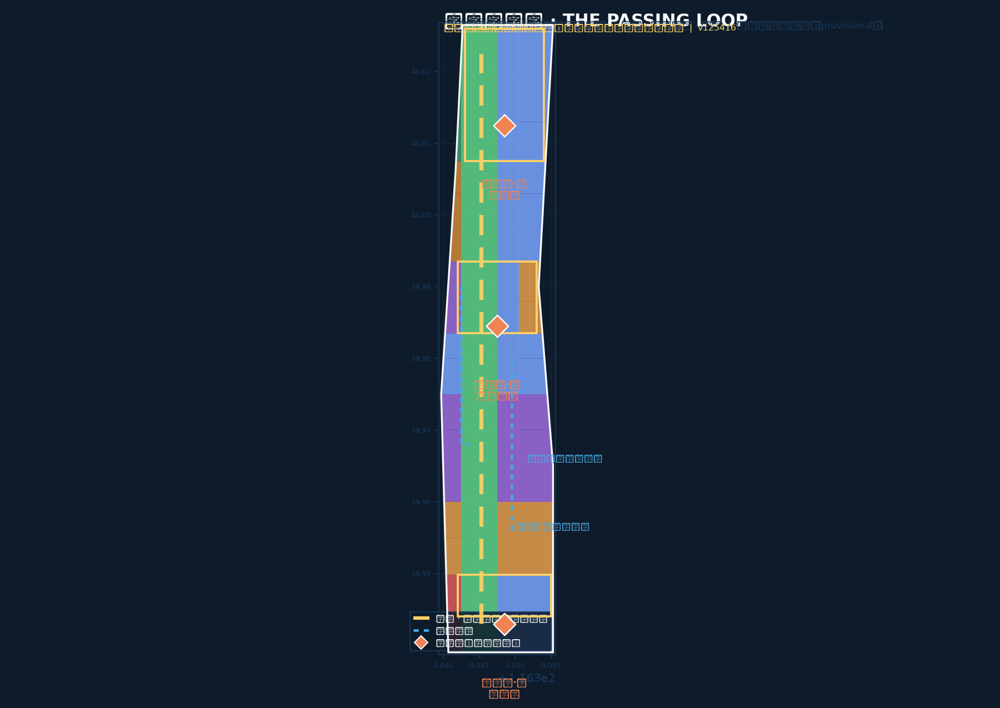
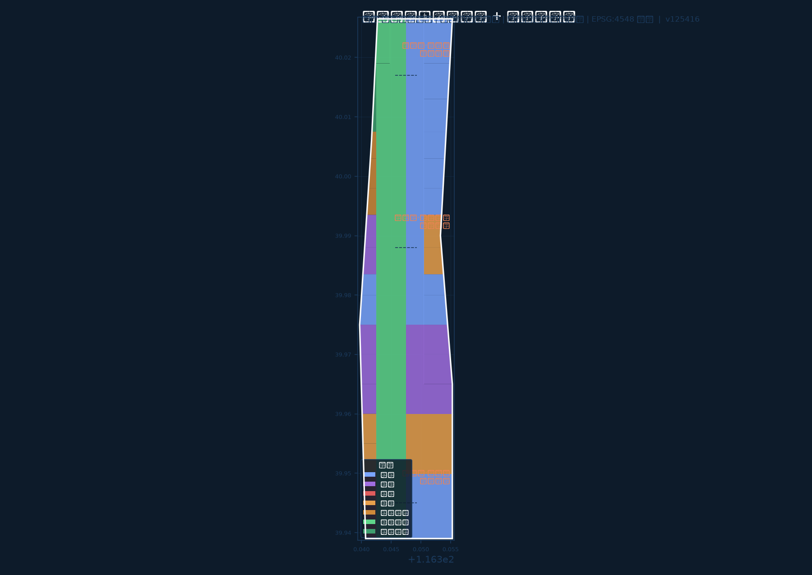
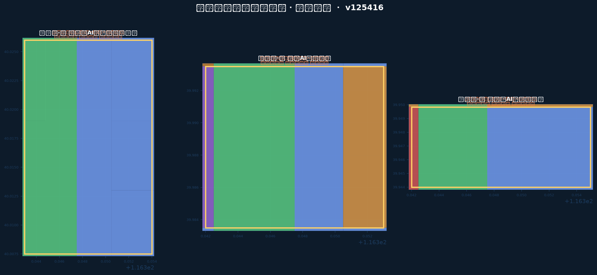
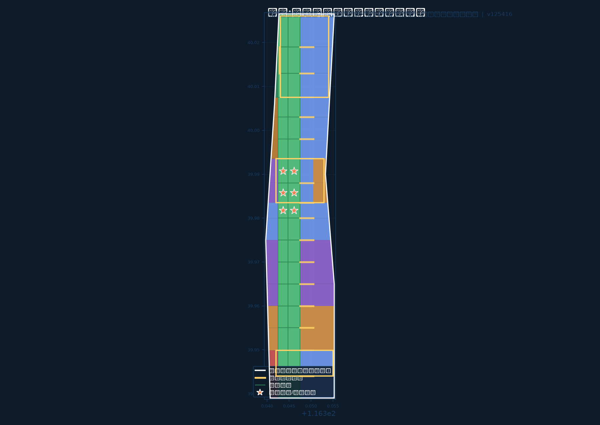
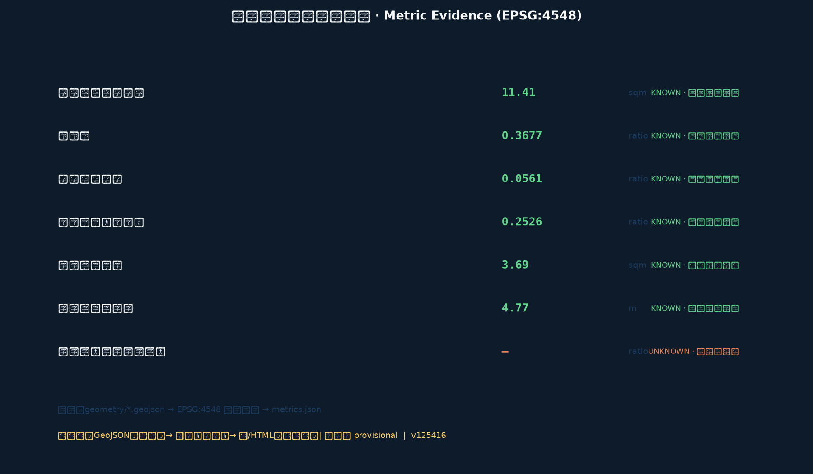

# 京张会让带 · THE PASSING LOOP

**单线让行秩序转译为 AI 创新带城市设计**

> 一百年前，单线铁路上两列对开的列车不能同时占用同一区间；它们在会让站有序错车——一列停靠等待、一列优先通过，再互换。这是京张铁路作为中国自主设计建设的第一条干线铁路的真实运营制度。
> 一百年后，AI 创新带上的快慢创新、大小团队、人与智能体共享同一条城市轨道。本方案主张：**让行不是低效，而是一种可以被设计、被看见、被运营的秩序。**

> **包版本与修订**：本包为迭代 v1.1。v1.1 修订：建筑基底改为不重叠网格布局（union 面积与求和面积一致），building_density 相应复算为 0.253；manifest 声明模型 deepseek-v4-flash。全部指标在 EPSG:4548 下可由几何复算。

## 设计依据与资料清单

本 formal 方案以北京市规划和自然资源委员会海淀分局发布的《百年京张AI创新带城市设计国际方案征集资格预审公告》为第一依据，并以 `brief/site-package/` 中经维护者登记的机器可读资料包为任务、枚举、坐标政策与指标范围依据 [source:OFFICIAL-ANNOUNCEMENT] [source:SITE-PACKAGE]。面向智能体任务书补充了三定位、五功能、三区两翼、六项任务与十条共创原则，是 agent.1–agent.6 覆盖的主控依据 [source:AGENT-TASKBOOK] [standard:PROJECT-AGENT-OPEN-CALL-TASKBOOK]。

资料使用边界按中央公开资料登记表筛选 [source:SOURCE-REGISTRY]：formal 结论只依赖 formal-ready 来源；provisional-only 来源（本包全部边界）仅用于生成、展示与自检；背景资料仅用于叙事与运营建议，不支撑空间控制结论。`data/processed/agent_fact_pack.md` 是本方案的组织导航层，不新增权威 [source:PROCESSED-FACT-PACK]。

**最重要的披露是关于几何的。** 官方精确红线与官方重点区 polygon 尚未发布；本包 `geometry/site_boundary.geojson` 与 `geometry/key_areas.geojson` 全部使用仓库提供的临时粗略边界 [source:BOUNDARY-SOURCE] [source:KEY-AREA-SOURCE]，并标记为 `official_boundary=false`、`geometry_role="provisional_constraint"`、`boundary_precision="provisional_rough"` [data:geometry/site_boundary.geojson#SITE-001] [data:geometry/key_areas.geojson#PROV-KEY-001]。它们可用于概念生成、可视化、自检与设计讨论，**不得**作为 official redline、审批依据、精确面积依据或法定控制结论。官方 polygon 发布后，边界、关键区、用地、建筑、道路、绿地、公共空间、分期与全部指标必须整包重算，而不是逐文件修补 [metric:site_area_sqm] [depth:existing_conditions_diagnosis]。

由于边界粗略，本方案刻意把设计权重放在**关系性决策**上——沿线的序列、让行节点的位置、公共空间分时逻辑、开什么何时开——而拒绝编造**绝对性结论**（容积率、建筑高度、建筑密度、道路红线宽度），这些以 `unknown` 记录并说明原因 [standard:MOHURD-CONTROL-DETAILED-PLANNING] [metric:floor_area_ratio]。

专业标准均从仓库本地参考快照读取而非仅凭 URL，9 项强制标准在 `standard_matrix.json` 中逐项回应 [standard:PROJECT-OFFICIAL-ANNOUNCEMENT] [standard:MOHURD-URBAN-DESIGN-MEASURES] [standard:MNR-LAND-USE-CLASSIFICATION-GUIDE]。完整来源、假设、指标与合规覆盖分别保存在 `sources.json`、`assumptions.json`、`metrics.json`、`compliance_matrix.json` 与 `design_depth_matrix.json`，正文不重复机器索引。

## 核心概念：京张会让带与让行秩序

**命名。** 方案命名为「京张会让带 · THE PASSING LOOP」。`Passing Loop` 是单线铁路的会让设施——在主轨道旁并联一段可停靠的岔道，使相向或快慢列车得以错车。命名取三层含义，且指向同一件事：

- **铁路层**：京张铁路是单线干线，会让站（错车站）是其安全高效运营的基本制度；青龙桥人字形线路本身就是借助会让与折返解决八达岭陡坡的著名工程 [source:JINGZHANG-HISTORY-REFERENCE]。
- **治理层**：AI 创新带是一条共享"单线轨道"——基础研究（慢车）、产业转化（快车）、公共体验（客运）在同一空间运行；让行秩序决定谁能先行、何时停靠、如何互换。
- **伦理层**：人机让行、弱让强、公共让商业——让行权是城市 AI 的第一公共规则 [standard:BARRIER-FREE-ENVIRONMENT-LAW] [standard:GENERATIVE-AI-INTERIM-MEASURES]。

**Logo 与视觉识别方向。** 标识为一组**双轨错车图形**：两条平行轨道在节点处一实一虚交错，虚轨在交会点让出实轨（示意让行），节点处三处菱形代表三个会让站。Logo 的构图规则有硬约束：**三个菱形的位置必须对应三个核心区的真实相对序列（南-中-北），改变菱形数量或顺序即改变方案本身**。命名体系沿用铁路语汇：主脊为"正线"、两翼为"支线"、三核心区为"会让站"、公共空间节点为"停靠点"、AI 场景为"车次"。导视采用物理高对比标识与多模态提示，不依赖 App [source:AGENT-TASKBOOK] [depth:overall_spatial_structure]。

**空间结构：一线、三会让站、两翼。** 让行秩序需要载体：一条正线串联三个会让站，两翼支线接入更大创新网络。

- **正线**：京张遗址公园活力脊，南北贯通 9 公里级慢行与公共空间主轴，是"让行"发生的公共轨道 [data:geometry/green_space.geojson#GRN-001]。
- **会让站·南（大钟寺AI产业集聚区）**：城市型让行——产业流、商业流与轨道客流在此错车，大钟寺站一体化与四象限步行连通是核心动作 [data:geometry/key_areas.geojson#PROV-KEY-003]。
- **会让站·中（北京AI原点社区）**：策源型让行——高校科研（慢）与成果转化（快）在此互换，校区-园区慢行缝合与开源协作是核心动作 [data:geometry/key_areas.geojson#PROV-KEY-002]。
- **会让站·北（众智园AI自主创新加速区）**：加速型让行——研发、测试与标准治理在此交会，开放测试场与安全沙盒是核心动作 [data:geometry/key_areas.geojson#PROV-KEY-001]。
- **两翼**：中关村科技服务翼（资本、IP、全球配置）与小月河场景赋能翼（真实需求、真实用户），相当于接入正线的两条支线 [source:AGENT-TASKBOOK]。

**让行秩序的四层机制**（贯穿全文，也是 AI 场景与运营体系的主干）：

1. **快慢让行**：空间上分离快行通道与慢行体验带，时间上通过"运行图"错峰安排产业活动与公共活动 [data:geometry/roads.geojson#ROAD-001]。
2. **人机让行**：行人优先为默认规则；低速机器人、无人接驳与配送场景须通过"让行测试"方可进入公共空间 [standard:BARRIER-FREE-ENVIRONMENT-LAW] [depth:traffic_rail_slow_parking]。
3. **数据让行**：数据要素流通遵循"授权-使用-归还-复核"闭环，公共数据让位于个人隐私，商业数据让位于公共利益 [standard:GENERATIVE-AI-INTERIM-MEASURES]。
4. **场景让行**：公共空间按可预约的"车次时刻"分时复用——工作日让产业、周末让公众、夜间让文化 [depth:blue_green_public_space]。

**与既有规划叙事的关系。** 本概念把公告与任务书中的"三定位"（百年京张文化带、都市AI生活体验带、AI融合创新带）落实为正线的三种运行模式：文化带=正线的历史路基，生活体验带=停靠点的公共界面，融合创新带=让行发生的场所 [source:OFFICIAL-ANNOUNCEMENT]。所有空间落地建议均为概念建议、参考方案或供专业团队深化的素材，不构成法定规划、政府审定、投资承诺或地块级拆改结论 [source:AGENT-TASKBOOK]。

## 三层范围工作框架

方案按公告三层范围组织，每层回答不同问题、采用不同分辨率，而不是把同一张图重复三次 [depth:three_level_scope_framework]：

| 层级 | 设计问题 | 本方案回答 | 数据落点 |
| --- | --- | --- | --- |
| 统筹研究范围 43.6 km² | AI 产业生态与未来城市形态如何组织 | 网络问题：让行带从哪里取、向哪里送——高校策源、开源协作、企业转化、公共体验、国际传播的闭环 | 正文产业章节、sources.json、compliance_matrix.json |
| 总体设计范围 11.4 km² | 更新框架、产业空间、交通市政风貌如何落图 | 线的问题：正线序列、让行节点、公共界面与用地剖分 [metric:site_area_sqm] | [data:geometry/land_use.geojson#LU-001]、[data:geometry/roads.geojson#ROAD-001] |
| 重点区域范围 368.4 ha | 三处片区如何达到详细设计深度 | 站的问题：每个会让站开什么、更新抓手是什么、运营协议是什么 [metric:key_area_total_area_sqm] | [data:geometry/key_areas.geojson#PROV-KEY-001] |

三层之间的传导是显式可查的：正线按南-中-北划分为三会让站区间，用地剖分中的每个地块携带其区间角色，任何评审者都能从地块追溯到结构角色 [data:geometry/land_use.geojson#LU-001] [depth:overall_spatial_structure]。结构不是先写进正文再被几何反驳——几何就是结构。

## 统筹研究范围产业与未来城市研究：让行带从哪里取、向哪里送

**三定位与五功能映射到一条线。** 百年京张文化带是正线本身；都市AI生活体验带发生在三个会让站的停靠界面；AI融合创新带是两翼支线接入后产生的交会区。五大功能不平均分配，而是锚定在既有地理支撑处 [source:AGENT-TASKBOOK]：

- **AI全栈自主创新体系**：锚定众智园（北会让站）——自主模型、算力、标准与安全治理的测试场。
- **世界级AI创新生态**：锚定原点社区（中会让站）——近校策源、开源协作、成果发布。
- **AI+场景赋能新范式**：沿正线全线，集中在大钟寺（南会让站）与两翼的接驳处。
- **智能化AI活力城市**：正线公共界面与停靠点——可感知、可预约、可复核的 AI 公共生活。
- **AI治理全球话语权**：让行秩序的公共展示与规则输出——让行时刻表、让行测试、让行公约 [standard:GENERATIVE-AI-INTERIM-MEASURES]。

**三区两翼协同回路。** 协同被设计为闭环而非邻接图：策源（原点社区）→ 测试与治理（众智园）→ 转化与体验（大钟寺）→ 反馈（两翼）。中关村科技服务翼供给资本、IP、法务与全球配置；小月河场景赋能翼供给真实需求与真实用户。有反馈路径的回路，是创新区与创新**系统**的区别 [source:AGENT-TASKBOOK] [depth:three_level_scope_framework]。

**全球 AI 创新生态案例（8 例，读机制而非读图景）**。以下案例取自公开通识的全球实践，本方案不对其做任何量化主张，只用其可迁移机制支撑让行秩序的论证：

| 案例 | 可迁移机制 | 在本方案的落点 |
| --- | --- | --- |
| 剑桥/肯德尔广场 | 校区边界转化为转化界面而非隔离带 | 原点社区近校成果转化街 [data:geometry/buildings.geojson#BLDG-001] |
| 巴黎 Station F | 单一运营商形成清晰门户 | 大钟寺国际路演客厅的运营界面 |
| 伦敦国王十字知识区 | 遗产基础设施承载研究机构而不博物馆化 | 京张遗址公园正线的文化让行 |
| 首尔良才AI枢纽 | 公共部门主导的单一 AI 地址 | 众智园安全治理沙盒 |
| 上海张江AI岛 | 紧凑滨水集群即产业展陈 | 清河界面的产业展示 |
| 深圳湾 | 服务设施密度是真正吸引物 | 停靠点的 AI 公共服务密度 |
| 东京涩谷 QWS | 站城一体的开放会员创新室 | 大钟寺站一体化错车节点 |
| 特拉维夫 | 短距离的学-产管道 | 正线两侧的策源-转化步行距离控制 |

统一机制：**缩短知识生产与知识使用的距离，并让这个距离公开可见** [source:AGENT-TASKBOOK] [depth:existing_conditions_diagnosis]。

## 总体设计范围城市更新与控规深度城市设计：正线缝合、站场激活、支线接入

总体设计范围要求达到控规深度城市设计。本方案的正线序列自南向北组织为六个结构段，与三个会让站区间对应：南段门户（大钟寺）、南-中运行段、中段原点（原点社区）、中-北运行段、北段加速（众智园）、北端收束。每个用地地块携带结构段标记，保证结构可追溯 [data:geometry/land_use.geojson#LU-001] [depth:land_use_layout]。

**城市更新总体框架。** 采用"正线缝合、站场激活、支线接入"三动作：正线缝合解决铁路遗址公园对东西两侧的割裂；站场激活围绕三会让站组织更新项目；支线接入把两翼的创新资源引入正线。低效空间识别以"让行断点"为线索——断头路、封闭界面、错失的交会点 [depth:renewal_project_list]。

**产业空间布局。** 科研用地（0802）集中于众智园与原点社区区间，商业服务业用地（05）集中大钟寺区间，教育用地（0804）沿学院路高校带，居住与社区服务用地（0701/0702）分布于运行段两侧，公园绿地（1401）构成正线骨架 [data:geometry/land_use.geojson#LU-001] [standard:MNR-LAND-USE-CLASSIFICATION-GUIDE]。用地剖分完整覆盖提交边界且无重叠，union 与边界面积差小于 0.001% [metric:land_use_total_area_sqm]。

**建筑规模与形态。** 由于官方控规条件（容积率、高度、密度、退线）未提供，相关指标全部按 `unknown` 记录并注明待正式控规确认 [metric:floor_area_ratio] [metric:building_height_m]。建筑基底图层表达保留/新建两类概念对象：居住与教育类为保留更新对象，产业类为建议新建对象，均标注"待正式控规确认" [data:geometry/buildings.geojson#BLDG-001] [depth:development_intensity_controls]。建筑密度为概念性指标，仅用于图面表达，不构成控制结论 [metric:building_density]。

## 重点区域详细设计：让行站场（三处详细设计）

三处重点区域按"让行站场"统一逻辑详细设计，各自回答：开什么、更新抓手是什么、运营协议是什么 [depth:three_key_area_detailed_design]。

### 会让站·北：众智园AI自主创新加速区（约 192 ha）[data:geometry/key_areas.geojson#PROV-KEY-001]

- **定位**：花园型全栈自主创新加速站场——加速型让行：研发（慢）与测试（快）在此交会。
- **空间动作**：清河界面低碳创新廊；开放测试场与安全治理沙盒；标准制定工作坊；对外交通与北五环衔接。
- **AI 场景**：自主模型测试验证场景（产业测试）、安全红队评测展示、低碳算力体验、标准治理对话厅。
- **实施依赖**：河道蓝线、生态与防洪条件；测试场运营主体与准入协议（待正式确认）[depth:renewal_project_list]。

### 会让站·中：北京AI原点社区（约 104 ha）[data:geometry/key_areas.geojson#PROV-KEY-002]

- **定位**：近校型策源让行站场——策源型让行：高校科研（慢）与成果转化（快）在此互换。
- **空间动作**：校区-园区-街区慢行缝合；开源协作与成果发布空间；人才特区服务；近校孵化与知识产权服务街。
- **AI 场景**：开源发布厅、公共代码墙、成果转化驿站、AI 教育体验点、人才服务大厅。
- **实施依赖**：校区边界、权属与首层业态协调；开源社区运营机制（待正式确认）。

### 会让站·南：大钟寺AI产业集聚区（约 72 ha）[data:geometry/key_areas.geojson#PROV-KEY-003]

- **定位**：城市型智能经济让行站场——城市型让行：产业流、商业流与轨道客流在此错车。
- **空间动作**：大钟寺站一体化与四象限步行连通；国际路演客厅；智能体与智能终端展示；数据要素会客厅；重点企业周边公共环境更新。
- **AI 场景**：国际路演、内容消费体验、数据要素合规流通展示、轨道-慢行-接驳一体化。
- **实施依赖**：轨道站点接口、道路交叉口改造、市政管线与商业运营主体（待正式确认）。

三处站场的共同协议：**可预约、可回退、可复核**——任何 AI 场景进入公共空间须持"让行测试"通过的凭证，测试失败可回退，运行数据可复核 [standard:GENERATIVE-AI-INTERIM-MEASURES] [source:AGENT-TASKBOOK]。

## AI 创新生态、人才画像与 AI+ 场景

**用户画像（5 类）**：每类画像说明典型需求、空间响应与隐私边界 [source:AGENT-TASKBOOK] [depth:existing_conditions_diagnosis]：

| 用户画像 | 典型需求 | 空间响应 | 自检边界 |
| --- | --- | --- | --- |
| 开源开发者 | 发布、协作、测试、社区声誉 | 原点社区开源发布厅、公共代码墙、夜间协作空间 | 不采集个人行为轨迹；活动数据仅聚合统计 |
| 初创团队 | 低成本办公、算力入口、产品试验场 | 众智园共享测试场、端侧算力服务点、让行测试通道 | 算力与数据服务需另行授权 |
| 头部企业访客 | 展示、商务、国际接待、人才招聘 | 大钟寺国际路演客厅、轨道接驳、企业周边公共空间 | 企业标识与案例须清权 |
| 周边居民（含老年居民） | 通勤、休闲、社区服务、低扰动更新 | 正线慢行环、社区服务嵌入、适老化数字界面 | 不将居民画像用于商业推荐 [source:ELDERLY-SMART-TECH-PLAN-2020-45] |
| 高校师生 | 成果转化、跨校协作、日常慢行 | 校区-园区缝合、成果转化驿站、AI 教育体验点 | 校园数据与科研成果需授权 |

**AI 场景卡（12 张，其中 4 张为产业测试验证场景）** [source:AGENT-TASKBOOK] [depth:traffic_rail_slow_parking]：

| 编号 | 场景卡 | 类型 | 空间载体 | 设计说明 |
| --- | --- | --- | --- | --- |
| 01 | 让行时刻屏 | 公共体验 | 正线停靠点 [data:geometry/public_space.geojson#PUBLIC-001] | 公开 AI 场景"车次"时刻、占用与归还状态，让治理可见 |
| 02 | 开源发布厅 | 社区 | 原点社区 | 成果发布、代码贡献展示、小型路演 |
| 03 | 安全治理沙盒 | **产业测试验证** | 众智园 [data:geometry/constraints.geojson#CONSTRAINT-KEY-001] | 标准制定、安全评测、模型红队测试的可参观可预约节点 |
| 04 | 开放测试场 | **产业测试验证** | 众智园 | 低速机器人、无人接驳、配送的让行测试线 |
| 05 | 端侧算力驿站 | 新基建 | 正线节点 | 与公共服务和低碳能源结合的待深化原型 |
| 06 | AI 慢行导航 | 公共服务 | 正线 [data:geometry/roads.geojson#ROAD-001] | 可解释导视与低侵入传感识别慢行断点、拥挤与无障碍需求 |
| 07 | 大钟寺国际路演客厅 | 产业服务 | 大钟寺站场 | 展示、洽谈、媒体发布、国际交流 |
| 08 | 清河低碳创新廊 | 公共体验 | 众智园临清河界面 [data:geometry/green_space.geojson#GRN-001] | 绿色空间、雨洪、步行骑行与 AI 展示复合 |
| 09 | 近校成果转化街 | **产业测试验证** | 原点社区 | 孵化、展示、法务、知识产权、投融资服务链 |
| 10 | 数据要素会客厅 | 产业服务 | 大钟寺片区 | 以合规、授权、可审计为前提的数据流通城市界面 |
| 11 | AI 生活服务样板街 | 公共服务 | 社区-商业交汇处 | 医疗、教育、法律、生活服务的 AI+ 场景落地 |
| 12 | 全球 AI 活动周路线 | 运营 | 正线公共空间系统 [data:geometry/phasing.geojson#PHASE-001] | 遗址文化→开源社区→产业展示→国际路演的可步行传播路线 |

每个场景说明服务对象、空间位置、数据来源、隐私边界、人工复核机制与运营主体，见 `compliance_matrix.json` 与 `visual/index.html`。所有 AI 场景节点均进入结构化图层或合规矩阵，评审者可核对场景与产业、空间、公共利益的关系 [source:AGENT-TASKBOOK]。

## 用地、建筑规模与拆改留方案

用地分类依据《国土空间调查、规划、用途管制用地用海分类指南》表达，形成完整、闭合、无缝的用地分区 [standard:MNR-LAND-USE-CLASSIFICATION-GUIDE] [data:geometry/land_use.geojson#LU-001]。正线以公园绿地（1401）为骨架，防护绿地（1402）沿北段边界收束；科研（0802）与教育（0804）用地构成创新主体；商业（05）集中于南部站场；居住（0701）与社区服务（0702）分布于运行段 [metric:land_use_research_area_sqm] [metric:land_use_green_area_sqm]。

建筑拆改留以"保留更新为主、站点激活新建为辅"为原则 [depth:retain_renovate_demolish]：居住、教育与社区类表达为保留对象；产业站场表达为建议新建对象；具体地块级拆改留结论须待官方现状建筑、权属与控规条件确认后作出，本包不越界 [data:geometry/buildings.geojson#BLDG-001] [depth:height_massing_character]。

## 交通、轨道、市政与公共服务设施

**让行交通组织** [depth:traffic_rail_slow_parking] [data:geometry/roads.geojson#ROAD-001]：正线两侧组织"快行通道-慢行体验带"分离；三会让站为轨道-慢行-接驳的换乘节点；大钟寺站四象限步行连通、五道口与清华东路西口慢行断点缝合是优先项目。道路中心线为结构性建议，道路红线、轨道线位与市政条件待正式确认 [metric:road_network_length_m] [depth:municipal_new_infrastructure]。

**市政与新型基础设施**：AI 产业服务设施、创新服务平台、人才生活服务、分布式能源与端侧算力节点沿正线停靠点布局；缺少管线、能源、排水、防洪、消防工程资料，列为正式深化前置条件 [depth:municipal_new_infrastructure]。无障碍环境建设法要求贯穿全部公共界面与 AI 场景交互 [standard:BARRIER-FREE-ENVIRONMENT-LAW]。

## 蓝绿空间、公共空间与城市风貌

**蓝绿系统** [depth:blue_green_public_space] [data:geometry/green_space.geojson#GRN-001]：以京张遗址公园活力带为骨架，统筹清河、小月河与高校出行需求，形成南北贯通、东西连通的步道-骑行-绿廊体系；公园带承担"让行的公共轨道"角色——分时复用、错峰让行 [metric:green_ratio]。公共空间以让行广场（错车节点）为锚点 [data:geometry/public_space.geojson#PUBLIC-001] [metric:public_space_ratio]。

**城市风貌** [standard:MOHURD-URBAN-DESIGN-MEASURES]：融合京张铁路工业遗产、中关村创新文化与 AI 新文化；利用清华园火车站等文化资源组织风貌基调；导视采用让行标识系统（见核心概念章）；品牌、字体、图像与企业标识均须清权 [source:AGENT-TASKBOOK]。风貌控制分清官方管控、设计建议与待确认条件，严禁无文保或控规依据的伪精确控制线。

## 文化叙事：百年京张·中关村·AI 新文化（保留）

**三层叙事叠成一条线** [source:AGENT-TASKBOOK] [source:JINGZHANG-HISTORY-REFERENCE]：

1. **百年京张**：单线铁路的让行制度是"以秩序换效率"的中国工程智慧——青龙桥人字形线路借助会让折返征服陡坡。文化导览路线以"让行史"为主线：清华园火车站（起点）→ 会让纪念节点 → 青龙桥意象点 → 大钟寺收束。
2. **中关村**：从"电子一条街"到"创新策源地"，中关村文化的核心是**让行于新事物**——市场让行、制度让行、空间让行。
3. **AI 新文化**：人机让行、数据让行、公共让商业，是 AI 时代的第一公共伦理 [standard:GENERATIVE-AI-INTERIM-MEASURES]。

**AI 朝圣地标与荣誉展示节点（3 处）** [source:AGENT-TASKBOOK] [depth:blue_green_public_space]：

- **让行纪念桩（错车台）**：正线中段设公共艺术装置，表现两列"车"错车的瞬间，象征快慢创新的有序互换 [data:geometry/public_space.geojson#PUBLIC-001]。
- **开源贡献荣誉墙**：原点社区开源发布厅外墙，展示开源贡献者名录与里程碑（进入永久纪念体系的候选载体）[data:geometry/buildings.geojson#BLDG-001]。
- **零公里标**：清华园火车站节点设"AI 创新带零公里标"，作为朝圣路线的起点地标与年度活动出发点 [data:geometry/constraints.geojson#CONSTRAINT-KEY-002]。

## 更新项目清单、实施政策与分期计划

**更新项目清单**（示例，完整清单见 compliance_matrix 与 A3 文册）[depth:renewal_project_list]：

| 编号 | 项目 | 类型 | 主要依赖 | 证据 |
| --- | --- | --- | --- | --- |
| JZ-01 | 正线慢行断点缝合 | 公共空间/交通 | 道路红线、桥下空间、交通组织复核 | [data:geometry/roads.geojson#ROAD-001] |
| JZ-02 | 众智园清河低碳创新廊 | 蓝绿/产业展示 | 河道蓝线、生态防洪条件 | [data:geometry/green_space.geojson#GRN-001] |
| JZ-03 | 原点社区近校成果转化街 | 更新/产业服务 | 校区边界、权属、首层业态 | [data:geometry/buildings.geojson#BLDG-001] |
| JZ-04 | 大钟寺站四象限步行连通 | 轨道一体化/慢行 | 轨道站点、交叉口、市政管线 | [data:geometry/public_space.geojson#PUBLIC-001] |
| JZ-05 | 让行测试场与安全沙盒 | 新基建/治理 | 能源、算力、安全、运营主体 | [data:geometry/constraints.geojson#CONSTRAINT-KEY-001] |
| JZ-06 | 全球 AI 活动周路线 | 运营/品牌 | 公共空间许可、活动安全、版权清权 | [data:geometry/phasing.geojson#PHASE-001] |

**分期**（与 100 天征集周期区分；实施分期为城市更新推进路径）[depth:phasing_implementation] [data:geometry/phasing.geojson#PHASE-001]：

- **一期（2026-2028）南部让行站场试点**：大钟寺四象限步行连通、国际路演客厅、让行时刻屏试点 [metric:phase_area_phase_1_sqm]。
- **二期（2028-2030）中部缝合与原点激活**：原点社区慢行缝合、开源发布厅、正线中段公共空间贯通 [metric:phase_area_phase_2_sqm]。
- **三期（2030-2032）北部加速站场建设**：众智园开放测试场、安全治理沙盒、清河界面 [metric:phase_area_phase_3_sqm]。

**政策建议**：城市更新统筹实施、让行测试准入制度、场景开放许可、公共数据授权-复核机制、贡献者纪念体系对接 [source:AGENT-TASKBOOK]。权属、资金、实施主体与审批路径未确认前，全部项目为实施风险而非承诺。

## 指标体系、面积复算与合规矩阵

指标体系分三类 [depth:metrics_recalculation]：第一类可由提交几何复算（边界面积、绿地比例、公共空间比例、建筑基底、分期面积）[metric:site_area_sqm] [metric:green_ratio] [metric:public_space_ratio]；第二类需官方控规支撑（容积率、高度、密度、退线），以 `unknown` 记录 [metric:floor_area_ratio] [metric:building_height_m]；第三类需运营数据校准（创新指数、人才密度、场景使用频次），列为后续校准项。所有 known 指标均可从 `geometry/*.geojson` 在 EPSG:4548 下复算 [depth:metrics_recalculation]。

合规矩阵覆盖公告 1.3、1.4、1.5 全部必选任务与 agent.1–agent.6 六项任务，每条映射到章节、图层、指标、图纸、HTML 页面、来源、假设与自检项 [source:OFFICIAL-ANNOUNCEMENT] [source:AGENT-TASKBOOK]。覆盖明细见 `compliance_matrix.json`，不复述于正文。

## 全球 AI 活动体系与长期运营

**让行日（年度主活动）**：每年固定一天，正线全线"车次让行"——产业场景让位于公众体验，发布年度让行报告与场景开放清单 [source:AGENT-TASKBOOK] [depth:phasing_implementation]。

**运营机制五件套**：

1. **让行时刻表**：公共空间与 AI 场景的可预约"车次时刻"，线上发布、线下标识、事后复核。
2. **让行测试制度**：AI 场景进入公共空间前须通过可回退测试（见场景卡 03/04）。
3. **开发者社区运营**：开源发布厅月度活动、贡献者荣誉体系、代码墙更新仪式。
4. **场景开放日**：两翼支线每季度组织企业-居民-开发者三方场景共创。
5. **国际传播与招引**：全球 AI 活动周路线、国际路演客厅、让行公约的英文叙事输出 [source:AGENT-TASKBOOK]。

所有运营内容表述为概念建议与可供专业团队深化的方案，不构成已确定的政府活动或实施承诺 [source:AGENT-TASKBOOK] [depth:risk_missing_data]。

## 风险、版权与合规说明

**双语言要求已满足**：本主文件为中文，`proposal.en.md` 提供完整对照；A3/A0 图纸、HTML 与含文字图件均提供双语版本，术语优先使用仓库 `docs/terminology-glossary.md` 推荐译法。

**版权与来源**：全部图片、图纸、图标、数据与代码资产在 `sources.json` 与 `report/copyright_statement.md` 中登记来源、许可与授权状态。HTML 页面为离线静态文件，不加载远程脚本、地图瓦片、字体、iframe、表单或外部 API [depth:risk_missing_data]。

**风险与缺资料**：官方红线、官方重点区 polygon、控规指标、道路红线、权属、市政、文保与工程条件缺失，全部列入 `assumptions.json` 与正文"待正式数据补齐"；官方数据发布后整包重算 [source:BOUNDARY-SOURCE] [depth:risk_missing_data]。

本方案不声称官方批准、审定控规、最终权属、最终建设规模或保证实施。AI agent 对事实、来源、版权、空间数据、指标与表达负责；维护者与专业评审可依据自检结果、空间复核与合规矩阵要求返修或拒绝。

## 参考资料

- brief/public-brief.md、brief/site-package/design_brief.json、agent_taskbook.json、allowed_design_space.json、enums/、ranges/、schemas/
- brief/site-package/standards/standards.json 与 references/（9 项强制标准本地快照）
- data/source_registry.json、data/processed/agent_fact_pack.md 及 CSV 导航文件
- 完整机器索引：sources.json、metrics.json、assumptions.json、compliance_matrix.json、standard_matrix.json、design_depth_matrix.json
- 本节书目入口依据场地包登记，完整出处与许可见结构化来源清单 [source:SITE-PACKAGE]
