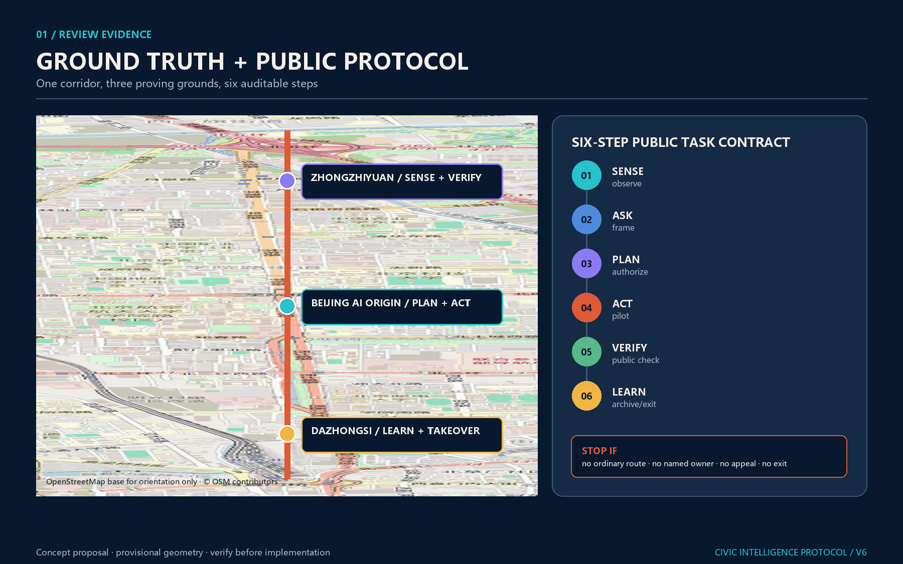
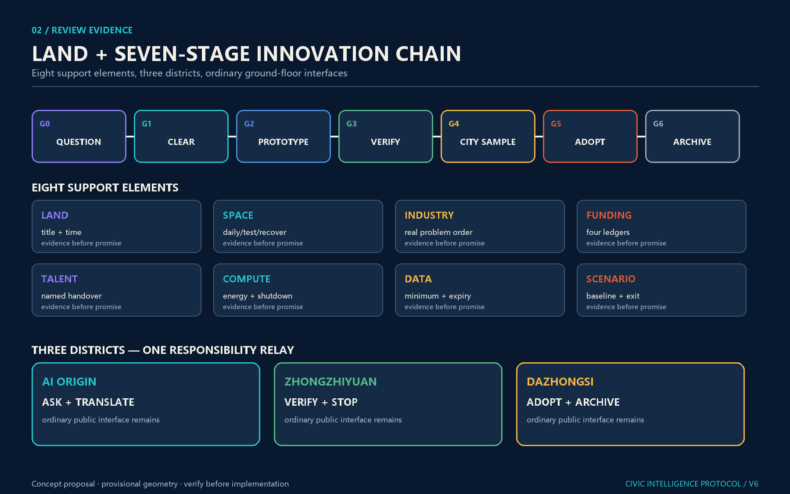
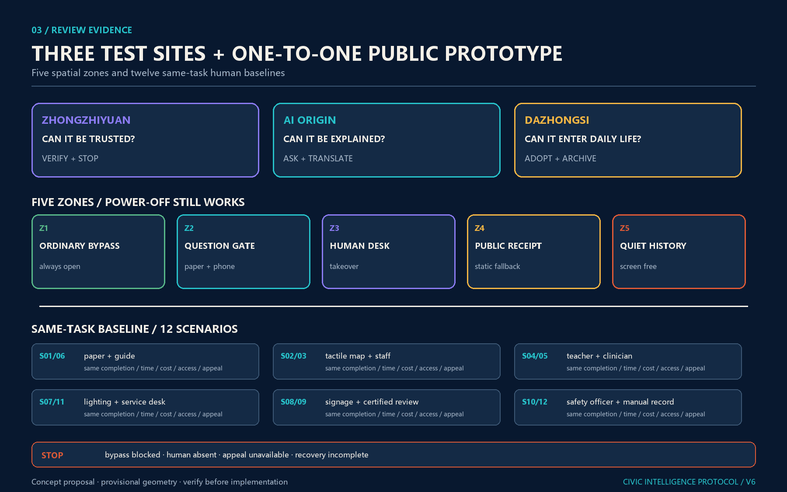
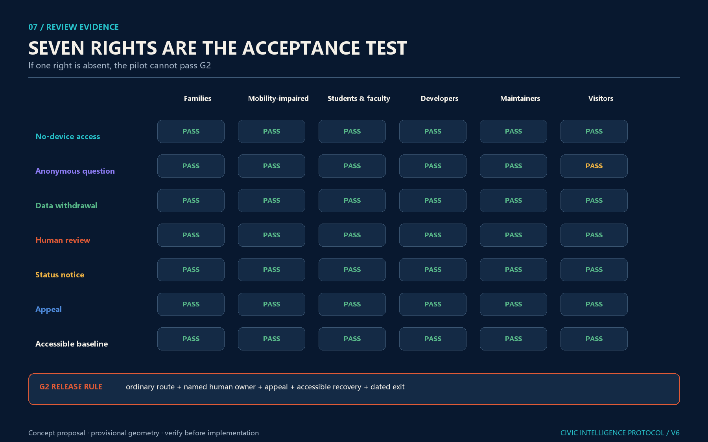
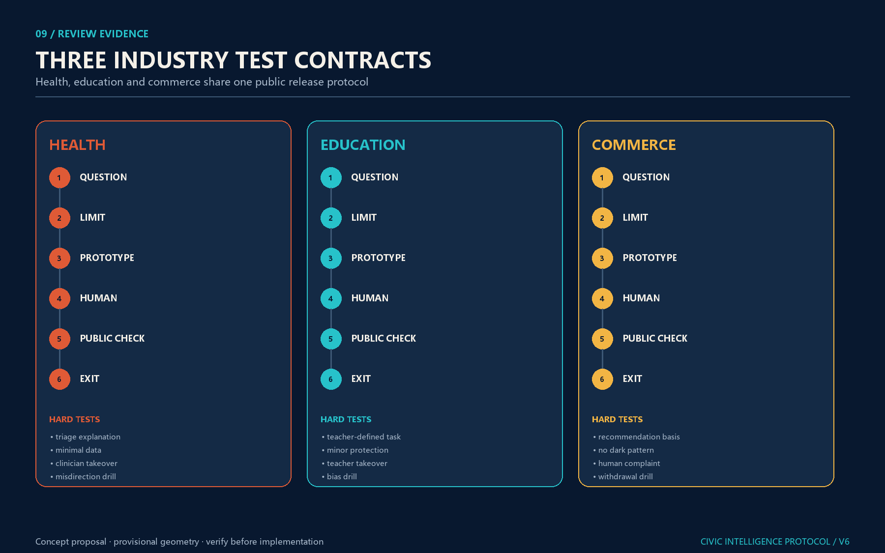
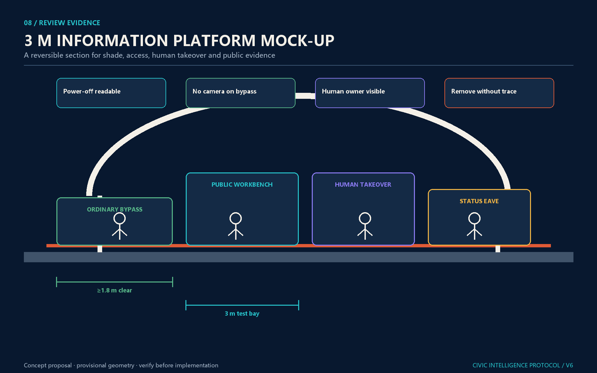
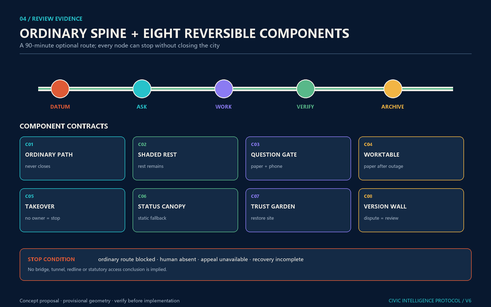
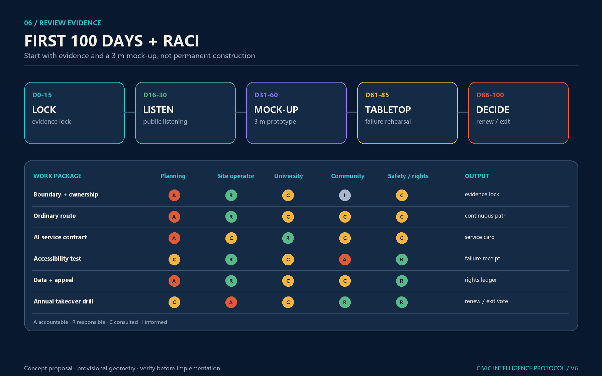
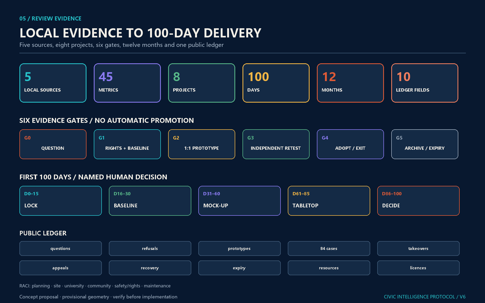

<!-- PARTICIPANT-DESIGN: Jing-Zhang City as Agent. Prepared by Codex for www41818520-coder. All spatial moves are conceptual suggestions for professional deepening; provisional geometry is explicitly retained pending organiser-supplied official files. -->

# Jing-Zhang Civic Intelligence Protocol: A Capable City, Governed by Its People

> **Core proposition: give the city capability and give people authority. People ask; the city responds.**

“City as Agent” is neither software vocabulary pasted onto the city nor a proposal to hand the city to a super-AI. A city is already a continuously operating public system. What the existing city lacks is a closed loop in which problems are visible, tools are callable, actions are verifiable, processes are accountable and people can take over. The proposal translates the Agent cycle of sensing, asking, collaborating, acting, verifying and learning into one walkable public baseline, three task platforms, nine civic interfaces and a long-term operating institution.

The V7 revision compresses the design into five handover-ready outputs: **one six-step civic-intelligence protocol, one spatial prototype of an “ordinary mainline + AI test siding”, three first-issue implementation contracts, a First 100 Days RACI, and seven public rights**. The six stages SENSE—ASK—PLAN—ACT—VERIFY—LEARN are each tied to a spatial carrier, accountable human, ordinary equivalent, evidence output and stop condition. The contracts bind each key area to a suggested lead, prerequisites, cost band, phases, indicators, operating gaps and exit condition. The first 100 days makes ownership, timing and exit auditable. The rights make no-device access, anonymity, data exit, human review, status information, appeal and accessibility enforceable spatial rules rather than slogans. [standard:PROJECT-AGENT-OPEN-CALL-TASKBOOK] [depth:phasing_implementation]

> **One-line delivery: AI may become an urban siding, but ordinary public service remains the mainline; every intelligent node must survive disconnection, shutdown, removal and human takeover.**

## Design Basis and Source List

The proposal follows the official announcement, the agent taskbook and the repository site package. The public materials still do not provide organiser-owned precise official redlines or key-area polygons suitable for approval. `geometry/site_boundary.geojson` and `geometry/key_areas.geojson` therefore remain `provisional_constraint` with `official_boundary=false`. They support conceptual design, visual placement and machine recalculation only; they are not parcel, road, heritage or engineering redlines. When official files are released, boundary, key areas, land use, roads, green space, public space, buildings, phasing and metrics must be updated together. [source:OFFICIAL-ANNOUNCEMENT] [source:AGENT-TASKBOOK] [depth:existing_conditions_diagnosis]

The OpenStreetMap base in Figure 1 provides orientation only; it does not prove a redline, area or ownership. The red vertical line is the conceptual public baseline and the three coloured anchors are task indexes for the key areas. The intended reading sequence is real orientation, the six-step protocol, then the three area contracts, preventing an abstract governance process from being mistaken for a placeless digital platform. [source:OSM-ORIENTATION] [data:geometry/key_areas.geojson#PROV-KEY-003]

Every spatial judgement follows three evidence rules: public information is never upgraded into an approval conclusion; a design suggestion must locate itself in a layer, metric or implementation project; and missing official information remains unknown rather than hidden behind false precision. [source:SOURCE-REGISTRY] [standard:PROJECT-OFFICIAL-ANNOUNCEMENT]

## Three-Level Scope Framework

The task has three scales: the 43.6 km² coordinated research area organises the AI innovation ecosystem and future urban form; the approximately 11.4 km² overall design area organises renewal, transport, municipal infrastructure, public space and character around the Jing-Zhang heritage park; and three key areas totalling approximately 368.4 ha test spatial prototypes, scenarios and delivery mechanisms. Machine-recalculated provisional geometry is used only for internal package consistency and cannot replace announced scale or official redlines. [data:geometry/site_boundary.geojson#SITE-001] [data:geometry/key_areas.geojson#PROV-KEY-001] [depth:three_level_scope_framework]

### Why the city becomes an Agent

The Chinese voice of the Jing-Zhang Railway is not a nostalgic motif but an engineering ethic: confront real terrain and constraints, measure, test, correct, maintain and take responsibility. AI-enabled city-building one century later must follow the same principles. Technology becomes urban capability only after it declares its boundary, accepts human review, allows public correction and retains an accountable record.

The spatial structure is “One Public Baseline, Three Task Platforms and Nine Civic Interfaces.” The heritage park retains walking, resting, photography and non-digital service. A continuous but expanding and contracting Information Canopy shows anonymised task state. Zhongzhiyuan, Beijing AI Origin and Dazhongsi respectively undertake sensing and calibration, collaboration and tool use, and takeover and memory. Nine interfaces connect universities, enterprises, communities, rail stations, public services and park operations. [depth:overall_spatial_structure] [standard:MOHURD-URBAN-DESIGN-MEASURES]

## Coordinated Research Area: Industry and Future City Research

The ecosystem is not an enterprise inventory but a complete chain of basic research, open-source rights clearance, engineering incubation, professional testing, small urban samples, and industrial and international communication. Universities produce knowledge and methods; enterprises and developers make tools; professional bodies verify safety and boundaries; real neighbourhoods provide low-risk feedback; and capital, intellectual property and international collaboration support only outcomes that have passed public-value review. [source:AGENT-TASKBOOK] [standard:PROJECT-AGENT-OPEN-CALL-TASKBOOK]

“City as Agent” also creates a new innovation space: laboratories, semi-open working platforms, real urban interfaces and public-memory spaces together become research infrastructure. The ecosystem is judged not by screen count but by whether research reaches real tasks, people can refuse or correct a service, and failures become readable knowledge for the next cycle.

Six global cases contribute mechanisms, not borrowed forms:

| Case | Transferable mechanism | Jing-Zhang translation | What is not copied |
| --- | --- | --- | --- |
| Barcelona 22@ | Innovation district renewed with housing, public space, facilities and transport | Bind AI R&D to the railway park, community service and slow-mobility interfaces | Property growth does not substitute for public value |
| LaunchPad @ one-north, Singapore | Modular space, incubators, capital networks and real-world testbeds | Link laboratory, Information Platform, small-sample pilot and industry service | No promise of company count, investment or investment-attraction result |
| Kendall Square, Cambridge | Innovation space, mixed uses, active ground floors, open space and public review | Require publicly accessible ground floors and neighbourhood return from R&D carriers | No transfer of US zoning or development intensity |
| Knowledge Quarter, London | Membership collaboration among research, culture, business and local government | Use railway culture and universities to form annual cross-institution questions | Proximity is not treated as automatic collaboration |
| Helsinki AI Register | Public visibility of municipal AI use, accountability and feedback | The Information Canopy shows task state, owner, pause and exit | No personal trajectory or sensitive operational data |
| Barcelona Decidim | Open, traceable participation integrating online and face-to-face processes | Paper, staffed, no-account and digital entries share one task receipt | Clicks are not evidence of resident authorisation |

Together they yield four Haidian rules: innovation space must be mixed rather than closed; testing requires a real context and exit; industry networks need public interfaces; and algorithms require understandable information, feedback and offline participation. [source:CASE-22BARCELONA] [source:CASE-LAUNCHPAD] [source:CASE-HELSINKI-AI-REGISTER]

Regional collaboration uses an input—test—return loop rather than a nameplate alliance. North Latitude Community can contribute resident and everyday-life questions; Future Science City, engineering and industrial test needs; Huairou Science City, research questions related to major scientific infrastructure; Beijing E-Town, manufacturing and industry-application questions; and Beijing-Tianjin-Hebei partners, cross-regional validation settings. The Jing-Zhang belt publishes questions, organises bounded mock-ups and creates auditable work orders, then returns verified tools, failure records and open standards. Every partner, dataset, budget and event remains subject to separate authorisation.

The identity uses railway rust red, signal bone white, information cyan-blue and verification green. Red represents the historical baseline and the right to pause; cyan-blue represents task flow; bone white represents a maintainable public base; green represents completion after public verification. The Chinese slogan “A capable city, governed by its people” communicates a global proposition: autonomous innovation, engineering responsibility, public value and people’s governance must stand together.

The mark combines a railway switch with a task receipt: two parallel rails form a switch at the centre while the outer contour reads as an open speech box. Bone-white lines mean ordinary state, cyan means a question is open, rust red means human review is pending and green means public verification is complete. It avoids faces, “city brain” imagery and government emblems; the same state semantics apply to canopies, path markers, webpages, work orders and the honour wall.

## Overall Design Area: Urban Renewal and Regulatory-Plan-Level Urban Design

The overall design does not blanket 11.4 km² with devices. It aligns four systems:

1. **Land use and renewal:** AI research, open park, industrial services and community support reinforce one another.
2. **Mobility and stitching:** the north-south heritage-park slow-mobility spine meets nine east-west interfaces that connect rail, campuses, communities and industry.
3. **Blue-green public space:** railway park, rain gardens, continuous shade and public verification places form the ordinary urban baseline.
4. **Information and tasks:** status canopy, three platforms, human windows and work-unit relays make civic tasks visible, routable and open to takeover.

Current land-use, building, road and phasing layers are conceptual design proposals. Development intensity, building height, precise retain-renovate-demolish decisions, road redlines and engineering feasibility remain pending. Professional teams must deepen them after official controls, ownership, survey, heritage, municipal and transport information is available. [data:geometry/land_use.geojson#LU-001] [data:geometry/roads.geojson#ROAD-001] [depth:development_intensity_controls]

## Detailed Design of Key Areas

The three key areas do not repeat one form; together they complete one city-scale Agent. [data:geometry/key_areas.geojson#PROV-KEY-001] [data:geometry/key_areas.geojson#PROV-KEY-002] [depth:three_key_area_detailed_design]

### 1. Zhongzhiyuan: Public Verification Garden — SENSE + VERIFY

The urban problem is the missing public interface between strong innovation capacity and communities, ecology and everyday experience. Spatial moves include a low-intervention environmental calibration belt, an accessible public verification loop, a university-park joint test bench, a non-collection bypass and a staffed explanation desk. University laboratories, park operators, community representatives and professional reviewers share responsibility. Display cannot substitute for certification, and sensitive or commercially confidential data cannot enter the public interface.

### 2. Beijing AI Origin: Civic Works Commons — PLAN + TOOL USE

Universities, enterprises and public space are close to one another, yet they lack a common workplace that converts real problems into projects and maintains them over time. A flagship Information Platform, open-source tool bench, small urban test field, human takeover point and accountable sign-off desk form a semi-open intelligent workplace. People can ask; developers and enterprises can call tools; but action boundaries, owners, pause state and human alternatives must remain visible.

### 3. Dazhongsi: City Echo Exchange — TAKEOVER + MEMORY

Rail, commerce and community flows converge, yet complaints, scenario feedback and innovation outcomes rarely become public memory. A station-city service interface, dispute-review hall, open-source gallery, contribution wall and annual shutdown drill allow human takeover when services fail. The proposal makes no claims about station operation, property rights, tenancy, road reconstruction or underground engineering feasibility.

### V7 anchor check: three independently useful segments, not one promised continuous walk

The Tsinghua Yuan Former Station, Qinghua Donglu Xikou Metro Station (Line 15), and Dazhongsi Metro Station (Lines 12 and 13) are used as experience-planning anchors. An Amap service snapshot retrieved on 21 August 2026 estimated the walking route from the former station to Dazhongsi at about 4.13 km and 55 minutes. The proposal therefore treats heritage interpretation, knowledge arrival, and daily-life service as independently useful public segments; it does not present them as an accessibility-certified route, construction commitment, or statutory spatial conclusion. [source:AMAP-SPATIAL-SNAPSHOT-20260821]

| Node project card | First action | Human responsibility and verifiable result | Exit condition |
| --- | --- | --- | --- |
| P09 Tsinghua Yuan quiet interpretation entry | Use removable paper guides, screen-free historical markers, and ordinary rest rather than a check-in device. | Heritage/site professionals review interpretation; every revision retains version, source, and public-objection access. | Remove temporary media and restore no-device guidance if protection requirements are unconfirmed, ordinary passage is blocked, or interpretation is disproved. |
| P10 Line 15 knowledge-arrival interface | Without changing the station, test a street-level question, human-answer, public-receipt desk. | A named attendant records equivalent paper/phone channels; completion, wait time, appeals, and human takeover are joint acceptance measures. | Pause the intelligent part and retain ordinary wayfinding if the attendant is absent, non-digital access fails, or appeal is unavailable. |
| P11 Dazhongsi daily-service interface | Offer non-mandatory information for transfers, community health, and nearby daily life; a recommendation may never be a condition of passage. | Service owner publishes recommendation basis, complaint access, and monthly withdrawals; corrected time after human review is measured. | Remove recommendation modules and retain static service information when misleading output, dark patterns, data overreach, or incomplete recovery occurs. |

Each key area first uses existing public paths and reversible sites. A 3 m prototype tests use, safety, light and sound, accessibility and human fallback before expansion. Official polygons will trigger clipping, recalculation and interface relocation.

The three first-issue contracts are the starting point for professional handover. Zhongzhi Garden suggests a joint lead by authorised local planning, a university laboratory and park operator, after drainage, winter slip, fire, ownership, data-security and human-takeover checks. AI Origin suggests local planning, park operation and universities, after accessibility, night quiet, staffed-window and open-source responsibility checks. Dazhongsi suggests local planning, rail or commercial operation and community leadership, after fire, flow, noise, stormwater and station-city coordination. Each moves from G0 data lock to a G1 3 m mock-up. Only when the ordinary route, human alternative and stop rule all pass can it enter a G2 node pilot. G3 annually decides renewal, limitation, relocation or exit. [data:geometry/phasing.geojson#PHASE-001] [depth:three_key_area_detailed_design]

The three sites are not one facility copied three times. They answer a sequence of different questions: Can Zhongzhiyuan be trusted? Can AI Origin be explained? Can Dazhongsi enter daily life and recover after failure? Each begins with one 3 m test bay that records the ordinary route, staffed window, shutdown state, complaints and recovery before any expansion. The site is therefore where the protocol earns release, not a background for the concept.

## AI Innovation Ecosystem, Personas, and AI+ Scenarios

Five core personas are corridor residents and families; wheelchair users and people with limited mobility; university students and teachers; AI developers and entrepreneurs; and city-service and maintenance staff. Visitors and global developers form an optional sixth group but cannot displace everyday rights. Every person has the right to know what a system does, refuse data collection, request human help, challenge a result and leave a scenario. [source:AGENT-TASKBOOK] [depth:traffic_rail_slow_parking]

“Governed by its people” becomes seven field-checkable rights. No-device participation maps to paper, phone and staffed windows; anonymous proposal to unregistered entry; data exit to deletion and withdrawal desks; human review to accountable sign-off and dispute review; task-status information to the canopy and paper notice; result appeal to human reconsideration; and accessibility/minimum openness keeps an accessible route usable through setup, failure and closure. If any right is missing, the AI scenario cannot enter G2. [standard:PROJECT-AGENT-OPEN-CALL-TASKBOOK] [depth:public_service_facilities]

| ID | AI+ scenario | Primary place | Human boundary and exit |
| --- | --- | --- | --- |
| S01 | Ecological calibration and rain observation | Zhongzhiyuan | Professional judgement; sensor-free path retained |
| S02 | Accessible route explanation | Corridor walk | Physical signs and staffed enquiry remain primary |
| S03 | Community-service navigation | Community interface | Service remains available without registration or face recognition |
| S04 | City-question proposal | AI Origin | Voluntary submission; no behavioural profiling |
| S05 | Public AI tutor test | Education space | Teacher review; protection of minors |
| S06 | Health-service navigation | Dazhongsi | Resource and referral navigation only; no diagnosis |
| S07 | Low-disturbance night safety guidance | Whole corridor | Human patrol and ordinary lighting cannot be replaced |
| S08 | Cycling parking and transfer assistance | Station interface | No automatic penalty; human appeal retained |
| S09 | Transparent commercial recommendation | Dazhongsi | Basis, price, complaint and withdrawal are visible |
| S10 | Explainable enterprise-service matching | Technology-services wing | Human consultant review; no policy-result promise |
| S11 | Bilingual railway-culture guide | Heritage park | Paper, physical signs and human guide run in parallel |
| S12 | City-question echo and archive | Three platforms | Aggregated anonymity; public can request adjustment or pause |

Three priority hard tests are: misinformation, privacy and clinical human fallback for health services; bias, minor protection and teacher takeover for education; and recommendation basis, complaint, withdrawal and non-digital alternatives for commerce and public service. Every scenario contract includes a real problem, minimum data, professional responsibility, human alternative, public verification and scheduled exit.

The rights matrix does not translate participation into click volume. Every user group must complete the core task without registration, face recognition or a smartphone. For people with limited mobility, the bypass, staffed window and failure recovery remain continuous. For minors and health-service users, qualified professionals retain final responsibility that the model cannot replace. [metric:rights_acceptance_count] [depth:public_service_facilities]

The three sectors share a six-step release contract but not the same professional owner. A qualified service professional confirms the health boundary; a teacher defines and takes over the education task; a commercial recommendation must reveal its basis and withdrawal path. Tabletop tests deliberately introduce misinformation, bias, network loss, complaint backlog and staff absence, then check whether ordinary service recovers. A prototype that cannot recover does not enter G2. [metric:industry_hard_test_count] [depth:risk_missing_data]

## Complete delivery index for the six Agent tasks

V7 turns taskbook coverage into six handover contracts. Each names its spatial object, users, operator, evidence, stop condition and next professional owner. Institutional roles remain suggestions until authorised. [source:AGENT-TASKBOOK] [standard:PROJECT-AGENT-OPEN-CALL-TASKBOOK]

| Task | Core delivery | Reviewable carrier | First professional question |
| --- | --- | --- | --- |
| agent.1 | protocol, naming tree, mark, three positions and five functions | narrative and five primary figures | Do name, symbol and space share one public meaning? |
| agent.2 | seven-stage chain, eight support elements, six cases, five relays | cases, metrics and sources | How does research enter the city without promising adoption? |
| agent.3 | eight personas, twelve cards, three sector tests, 84 cases | scenario table and receipts | Can the task finish without AI, network or staff? |
| agent.4 | ordinary spine, eight components, four landmarks, public route | spatial figures and prototype section | Is each element usable, stoppable and removable? |
| agent.5 | six-stop story, five sign levels and bilingual syntax | narrative and signage rules | Does culture emerge through work rather than decoration? |
| agent.6 | twelve-month programme, six gates, annual ledger and exits | 100-day plan and RACI | Who maintains, answers and decides to exit? |

### Agent.1 | Naming, mark and spatial grammar

**Official proposal name: Jing-Zhang Civic Intelligence Protocol. Public line: A city that can answer, and people who can take over.** Key-area names follow place + public task + operating verb; temporary projects show a question ID and current Gate. The mark combines parallel rails, an open dialogue box and a switch. Rust red means datum/stop, cyan means question/in progress, green means publicly replayed, and bone white means ordinary service. Colour always has text and shape equivalents.

The three positions become a railway ethics route, twelve daily AI scenarios with ordinary alternatives, and an Origin-question—Zhongzhiyuan-verification—Dazhongsi-adoption relay. The five functions become a seven-stage innovation chain, public test spaces, daily service, visible governance and a bilingual archive.

### Agent.2 | Seven-stage innovation chain and eight support elements

The ecosystem is **basic question → open source and rights clearance → engineering prototype → independent verification → urban small sample → professional adoption → public archive**. Every stage has input, custodian, evidence gate and return path. Unverified prototypes cannot enter the investment narrative as industry outcomes. Global cases transfer mechanisms only. [source:CASE-22BARCELONA] [source:CASE-LAUNCHPAD] [source:CASE-KENDALL]

| Element | Jing-Zhang interface | Minimum delivery | Cannot replace |
| --- | --- | --- | --- |
| land/space | existing fabric, 3 m reversible platform | title/time; ordinary-test-recovery states | land, permit, structure or fire decision |
| industry/funding | real problem order, L1-L3 resource bands | boundary; capital/operation/removal ledgers | firm, order, public budget or return promise |
| talent/compute | role relay, edge sample | named handover; energy/shutdown/fallback | staffing or data-centre scheme |
| data/scenario | minimum fields, three sites and feedback wing | licence, expiry, baseline, negatives, exit | profiles or demonstration as performance |

Regional collaboration is a problem relay. Community, Future Science City, Huairou Science City, BDA and Jing-Jin-Ji nodes exchange definitions, protocols, anonymous results, failures and retest requests—not raw personal data or invented partnerships. [metric:regional_collaboration_input_count]

### Agent.3 | Eight personas, twelve scenarios and 84 tabletop cases

Eight design lenses locate failure cost: neighbours/care families; older or no-smartphone users; disabled people; children/students/teachers; researchers/developers; start-ups/SMEs; maintainers/frontline staff; visitors/global talent. They require quiet hours, paper and staffed routes, continuous accessibility, minor protection, reproducible tests, non-promissory services, manual stops and factual bilingual guidance.

Each S01-S12 scenario runs one valid baseline plus six negatives—owner absent, data ceiling exceeded, ordinary route failed, cannot pause, appeal backlog, or recovery incomplete—creating 84 repeatable cases. The baseline continues; all 72 negatives stop and issue a reason, human owner, recovery action and retest date. Passing proves rules closure only, not field safety, efficacy or approval. Health remains referral navigation under a qualified person; education is teacher-defined; commerce discloses basis, price, refund and staffed service. [metric:ai_scenario_count] [metric:public_right_count]

### Agent.4 | Ordinary spine, eight components and four landmarks

The city must still work when AI stops. The ordinary line keeps walking, accessibility, shade, seating, physical wayfinding and staffed help. Eight reversible components are the ordinary path, shaded rest island, question gate, civic worktable, takeover seat, status canopy, verification garden, and contribution/version wall. Each has daily, test and removal states.

Four landmarks are public work rather than sculpture: Tsinghua Garden Question Gate, AI Origin Open-source Switch, Zhongzhiyuan Trust Garden and Dazhongsi City Echo Station. They form an optional 90-minute sequence—datum, ask, work, verify, adopt, archive—while the ordinary route remains complete if a node closes. [metric:pilgrimage_landmark_count]

### Agent.5 | The measure-switch-open-replay cultural route

Railway history contributes engineering ethics: measure real ground, test, correct and accept responsibility. Zhongguancun contributes problem-led open collaboration. AI culture adds minimum data, human review, appeal and withdrawal. Six stops translate these into public actions: Measure (FACT/UNKNOWN), Build (CONSTRAINT/RESPONSE), Switch (PAUSE/TAKE OVER), Open (VERSION/LICENCE), Verify (BASELINE/RETEST), Archive (DECISION/EXPIRY).

Five sign levels separate ordinary access, historical fact, AI task status, risk/takeover, and version/credit. International copy avoids unprovable comparisons: **Beijing built its first railway by measuring the ground; the next century of AI begins by making every urban experiment answerable.**

### Agent.6 | Twelve-month programme, six conversion gates and annual ledger

The calendar moves from January expiry audit, February access baseline and March questions through April rights clearance, May mock-up check, June failure rehearsal, July professional health/education tests, August transparent commerce, September global maintainer week, October public replay, November lifecycle budget review and December Failure and Improvement Assembly. Each month leaves a defined receipt.

Long-term conversion follows **question G0 → rights/baseline G1 → reversible prototype G2 → independent retest G3 → professional adoption G4 → archive or expiry G5**. Rejection, pause and exit are valid outcomes. Firms and capital services enter only after G3 for compliance, IP, pre-procurement testing or financing advice; none is a policy, order or investment promise. The annual ledger records questions, refusals, prototypes, negative branches, takeovers, appeals, recovery time, exits, resource bands and source/licence changes. [metric:annual_operation_cycle_count]

### Local evidence ledger: verifiable interfaces for Three Zones and Two Wings

V7 adds five local public sources to calibrate real questions, places and institutional interfaces rather than inflate the proposal with publicity figures. Beijing's science authority confirms the approximately nine-kilometre heritage-park innovation link and Three Zones and Two Wings direction; the Beijing Government report describes the AI Origin one-kilometre transfer ecosystem; Tsinghua's history source anchors the station narrative; the Beijing cultural-heritage source confirms protection and construction-control zones but is not digitised into a redline without the official drawing. Published counts retain their date and publisher wording and never become project baselines by default. [source:BEIJING-THREE-ZONES-20260403] [source:BEIJING-AI-ORIGIN-20260401] [source:TSINGHUA-STATION-HISTORY] [source:TSINGHUA-STATION-CONSERVATION]

Five proposed regional interfaces connect university problems and capabilities, Origin translation, Zhongzhiyuan verification, professional services in the western wing, daily-life and ecological feedback in the eastern wing, and Dazhongsi adoption/archiving. Each interface requires a provider, receiver, minimum data, licence, expiry and fallback; otherwise it remains an intention, not a partnership claim. [metric:regional_interface_count]

### One-to-one off-station prototype and same-task human baseline

The first physical product is not an AI screen. It is a reversible three-metre test bay outside the heritage fabric plus a continuous ordinary bypass. Five zones provide: Z1 ordinary passage; Z2 paper/phone question gate; Z3 staffed human desk; Z4 privacy-safe public receipt; and Z5 screen-free quiet heritage edge. The bay length and suggested 1.8-metre clear bypass are prototype parameters, not approved construction dimensions. Survey, structure, fire, loading, conservation and accessibility checks remain mandatory. [metric:prototype_length_m] [metric:ordinary_route_clear_width_m] [metric:prototype_spatial_zone_count]

A complete demonstration deliberately runs normal service, power loss, human takeover, removal and site recovery. It stops if the ordinary path is blocked, the named human is absent, appeal is unavailable or recovery is incomplete. The package claims no site permission.

All twelve scenarios use same-task equivalence. A person without a device, declining data permission or arriving during outage must still complete the same basic task through paper, fixed signs, telephone, a teacher or health professional, a staffed counter, safety personnel or manual observation. Release compares completion, time, cost, accuracy, accessibility and appeal—not whether the AI route looks more impressive. [metric:same_task_equivalence_scenario_count]

### Eight-project evidence gates, resource bands and stop contracts

G0 registers the question; G1 locks rights, human baseline, responsibility and recovery; G2 permits only a small reversible prototype; G3 independently retests and publishes failure; G4 decides adopt, reduce, revise or retire; G5 archives version, contribution, source and expiry. The eight-project portfolio covers the ordinary spine, Question Gate prototype, three east-west stitches, Zhongzhiyuan trust garden, Origin translation desk, Dazhongsi Echo Station, Xiaoyue River citizen science and the annual open-verification season. Each has a next gate, near-term action, L1/L2 resource band and explicit stop condition. [metric:operation_conversion_gate_count] [metric:implementation_project_count]

The first 100 days consist of five work packages: evidence lock; public and same-task baseline; one one-to-one reversible prototype; 84 tabletop cases plus outage/takeover/recovery drills; and a named human decision to continue, modify or exit. The RACI covers planning, site operation, university, community, safety/rights and maintenance; it proposes responsibility and does not assert authorisation. [metric:first_100_days_work_package_count] [metric:first_100_days_action_count]

### Annual public ledger: from event traffic to public value and exit capacity

A proposed secretariat maintains the calendar, brand, sources and annual report; three district stations receive projects; two professional wings provide bounded services; and a public committee reviews high-impact scenarios, non-device baselines, complaints and exits. Human governance must establish the actual institutions, budget and powers.

The twelve-month programme moves from expiry audit, non-device baseline and public questions through rights clearance, prototyping, negative testing, professional health/education tests, commerce/refund tests, international protocol exchange, public retest, maintenance/removal and a failure-and-improvement assembly. Each month must leave a receipt. [metric:annual_operation_cycle_count]

The annual ledger publishes ten fixed fields: registered questions; refusals and reasons; prototypes; tabletop results; human takeovers; appeals; recovery time; expiry/retirement; maintenance/removal resource band; and source/licence updates. Investment, attendance and publicity are appendices, never substitutes for same-task equity, transparent failure and recovery capacity. [metric:annual_public_ledger_field_count]

## Land Use, Building Scale, and Retain-Renovate-Demolish Strategy

Conceptual land use comprises continuous zones for research and innovation, open park, industrial service and community support. It explains functional coordination rather than statutory reclassification. The building layer only shows a potential renewal carrier for professional discussion. Complete existing-building, ownership, structure, fire, heritage and regulatory information is absent, so the proposal makes no parcel-level demolition, construction, height or FAR decision. [data:geometry/land_use.geojson#LU-001] [data:geometry/buildings.geojson#BLDG-001] [depth:retain_renovate_demolish]

Retain-renovate-demolish is a decision protocol rather than a predetermined result: verify heritage and ownership first; assess structure and use safety; prioritise repair and reversible adaptation where existing space can carry public service; use demountable modules for new structures and avoid rail relics, trees, utilities and fire access; obtain separate approval for every permanent intervention.

## Transport, Rail, Municipal Infrastructure, and Public Services

Ordinary urban capability comes first: continuous walking and cycling, accessible detours, rail transfer, shaded rest, legible wayfinding and staffed enquiry must work with AI switched off. Nine east-west interfaces express collaborative directions between campuses, communities, industry, stations and park; they are not bridge, tunnel or road alignments. [data:geometry/roads.geojson#ROAD-001] [depth:traffic_rail_slow_parking]

The Information Platform is the core facility prototype. Its continuous ribbon roof provides shade and rain cover while displaying project state. The civic workbench supports computers, tools and authorised information interfaces. A staffed window handles minimisation, takeover and complaints. A work-unit relay routes tasks to a university, enterprise, community service or public agency. Results return to the same place for public verification. The canopy displays anonymised task state, never personal trajectories. [data:geometry/public_space.geojson#PUBLIC-001] [depth:municipal_new_infrastructure]

Begin with a reversible 3 m prototype and expand through an approximately 6 m conceptual module. Final span, structure, material, waterproofing, luminance, acoustics, power, network, fire, accessibility and utility conditions require survey and specialist design.

The section fixes four performance tests rather than an architectural form: an ordinary equivalent path with a suggested clear width of at least 1.8 m and no collection; a civic workbench whose task state remains readable after power loss; a staffed takeover point with named responsibility and complaint route; and a demountable, low-luminance, silent status canopy that does not block fire or accessible movement. Three metres is a test-bay length, not a construction dimension; survey and specialist design must verify it. [metric:ordinary_route_clear_width_m] [metric:prototype_length_m]

## Blue-Green Network, Public Space, and Urban Character

The railway heritage is first an everyday public space, not an AI-exhibition background. Walking, photography, play, reading and shaded rest remain. Rain gardens, continuous canopy, low-disturbance night lighting and Information Platforms support this ordinary baseline. Water extends beyond local board boundaries as an ecological context, but it does not replace river blue lines or flood conclusions. [data:geometry/green_space.geojson#GREEN-001] [data:geometry/public_space.geojson#PUBLIC-001] [depth:blue_green_public_space]

The architecture combines reflective stainless steel, bone-white structure, low-luminance cyan-blue information light and railway-signal red. Its technological character comes from visible information flow, real work, modular maintenance and day-night state change, not from a sealed black object. The cultural route follows Measure—Build—Switch Track—Open Source—Verify, linking Jing-Zhang engineering culture, Zhongguancun innovation culture and public responsibility for AI.

Three AI pilgrimage landmarks create a continuous narrative from history to future. The Public Calibration Ring at Zhongzhi Garden records how a question is verified. The Open-source Switch at AI Origin shows tools, versions, accountable owners and pause state. The Civic Echo Monument Court at Dazhongsi combines the Agent Contribution Honour Wall, AI milestones and annual outcome nodes. Engraving is limited to selected, rights-cleared contributions and visibly distinguishes submitted, reviewed, selected, deepened and implemented status.

## Renewal Projects, Implementation Policy, and Phasing

| Project | Content | Place | Critical dependency |
| --- | --- | --- | --- |
| P01 Continuous public baseline | Slow mobility, accessibility, shade, human service | Whole corridor | Survey, heritage, transport, park operation |
| P02 Three task platforms | Calibration, collaboration, takeover | Three key areas | Site authority, accountable host, fire and maintenance |
| P03 Nine civic interfaces | University, community, enterprise, station collaboration | Corridor nodes | Ownership, roads, rail and flow data |
| P04 Information Canopy system | Status display, relay, human takeover | Platforms and work units | Privacy, network, luminance, energy and safety |
| P05 Public railway memory | Developer walk, outcome gallery, honour wall | Heritage park | Heritage, copyright and distinction between proposal, selection and implementation |
| P06 Twelve AI+ scenarios | Health, education, commerce and others | Real neighbourhoods | Sector responsibility, legal data use and non-AI alternative |
| P07 Annual open verification season | Questions, prototype, verification, archive | Four-season cycle | Host, budget, safety and international-authorisation conditions |
| P08 Data and exit institution | Minimum data, shutdown and recalculation | Whole lifecycle | Audit, complaint, archive and accountable sign-off |

Delivery uses four reversible gates. G0 (0–3 months) completes survey, ownership, utilities, heritage, needs and data audits. G1 (3–6 months) tests a 3 m prototype for shutdown, light and sound, accessibility and human fallback. G2 (6–18 months) pilots one node in each key area and publishes work-order status. G3 annually decides continuation, restriction, relocation or exit according to public value, safety and maintenance capacity. [data:geometry/phasing.geojson#PHASE-001] [depth:renewal_project_list] [depth:phasing_implementation]

The first 100 days does not promise construction. It performs five reversible actions: D0–15 locks boundary, ownership, utilities, heritage and data responsibility; D16–30 records needs through paper, on-site and no-device methods; D31–60 builds one 3 m prototype; D61–85 rehearses network loss, misinformation, complaint backlog, staff absence and accessible bypass; D86–100 lets accountable parties continue, revise or exit against public receipts. RACI expresses suggested responsibility only; authorised bodies must confirm actual ownership. [metric:first_100_days_work_package_count] [depth:phasing_implementation]

Initial resources use bands instead of invented investment values. L1 means signs, paper work orders and movable furniture within existing space; L2 means a reversible 3 m prototype, temporary power and staffed operation; L3 means a semi-permanent node requiring specialist design and approval. No item enters L3 before site, maintenance budget, fire, structure and night management are verified. Annual operating cost must cover the staffed window, accessible maintenance, complaint handling, system shutdown and site restoration, not merely software subscription.

The annual loop is Spring City Questions, Summer Open Co-creation, Autumn Public Verification and Winter Works Archive. It is a reference operating framework, not an announced government event or implementation commitment.

Four standing mechanisms close the operating loop. Monthly community paper and on-site questions protect no-device participation. Universities and open-source communities maintain tools, tests and rights clearance quarterly. Enterprises enter only through real problems, test resources and named accountability; they cannot purchase public conclusions. International partners exchange through a bilingual question library, annual open-verification season and reusable protocol. Each year publishes the question list, mock-up records, verification statements, exit list and next-year agenda; any project without an operator or evidence of public value is not renewed.

## Metrics, Area Recalculation, and Compliance Matrix

| Metric | Current status | Meaning |
| --- | --- | --- |
| Overall design scale | Announced approx. 11.4 km²; provisional geometry recalculates 11.4128 km² | Internal package consistency only; recalculate with official boundary |
| Key areas | 3 | Provisional rough extents pending official polygons |
| Green ratio | 12.34% | Recalculated from submission design layer; not an existing or approved index |
| Public-space ratio | 7.33% | Recalculated from submission design layer; not a statutory control |
| Illustrative building footprint | 310,807 m² | Design-proposal layer, not approved building scale |
| FAR, building height and precise retain-renovate-demolish | unknown | No official controls or complete professional survey; no invented conclusion |

GeoJSON and `metrics.json` support recalculation; `compliance_matrix.json` checks task coverage; `standard_matrix.json` and `design_depth_matrix.json` record standards and professional depth. Official data will trigger replacement of provisional geometry, metric recalculation, key-area placement review, and synchronised updates to drawings, narrative and manifest. [metric:site_area_sqm] [metric:green_ratio] [depth:metrics_recalculation]

## Risk, Copyright, and Compliance

This is an open co-creation proposal, not a planning approval, engineering-feasibility study or construction document. It cannot establish road redlines, property disposition, building demolition, station alteration, bridge, tunnel or underground feasibility, traffic capacity, structural safety, medical judgement or public-investment commitment. [data:geometry/constraints.geojson#CONSTRAINTS] [depth:risk_missing_data] [standard:MOHURD-CONTROL-DETAILED-PLANNING]

Professional deepening must obtain official boundary and controls; cadastral and ownership records; heritage and archaeology requirements; existing-building and structural survey; transport, rail and parking information; municipal utilities and energy; fire, flood and accessibility requirements; visitor flow and operation; funding and security governance; and the legal basis and public-interest case for each AI service. Images, marks, fonts, datasets, cases and contributor names require rights clearance before implementation.

Every AI service requires an accountable operator, human reviewer, escalation and complaint route, non-AI alternative, minimum-data rule, scheduled exit and named authority for return to service. People are not data sources “kept in the loop”; they are urban subjects with the rights to ask, verify, refuse and take over.

## References

References are not a decorative end list. The proposal separates them into task authority, spatial constraints, public background and participant-generated design. The official announcement establishes the three scope levels, professional outputs and mandatory tasks. The agent taskbook establishes the six Agent tasks, scenario counts, review dimensions and co-creation limits. The site package supplies currently available provisional geometry, enumerations, metric structure and validation contract. The source registry determines whether a source can support a formal claim, background narrative or provisional lead. Complete titles, links, limits and processing paths are recorded in `sources.json`. [source:OFFICIAL-ANNOUNCEMENT] [source:AGENT-TASKBOOK]

Spatial layers and metrics are not new authoritative sources; they are reproducible participant-generated design evidence derived from the registered materials. `geometry/site_boundary.geojson` and `geometry/key_areas.geojson` explicitly retain provisional status. Land use, buildings, roads, green space, public space and phasing express design logic only. `metrics.json` records formula, source file, confidence and recalculation conditions. Official redlines, regulatory controls, ownership, heritage, utilities and engineering information remain professional-deepening gaps and cannot be replaced by OSM, renderings or provisional rectangles. [source:SITE-PACKAGE] [source:SOURCE-REGISTRY]

Reviewers can move from claim-adjacent `[source:...]`, `[data:...]`, `[metric:...]`, `[standard:...]` and `[depth:...]` labels into machine evidence, then return to the A0/A3 drawings to understand spatial judgement. This two-way relationship prevents drawings from becoming unsupported slogans and prevents JSON from becoming a black box that humans must decipher unaided.
