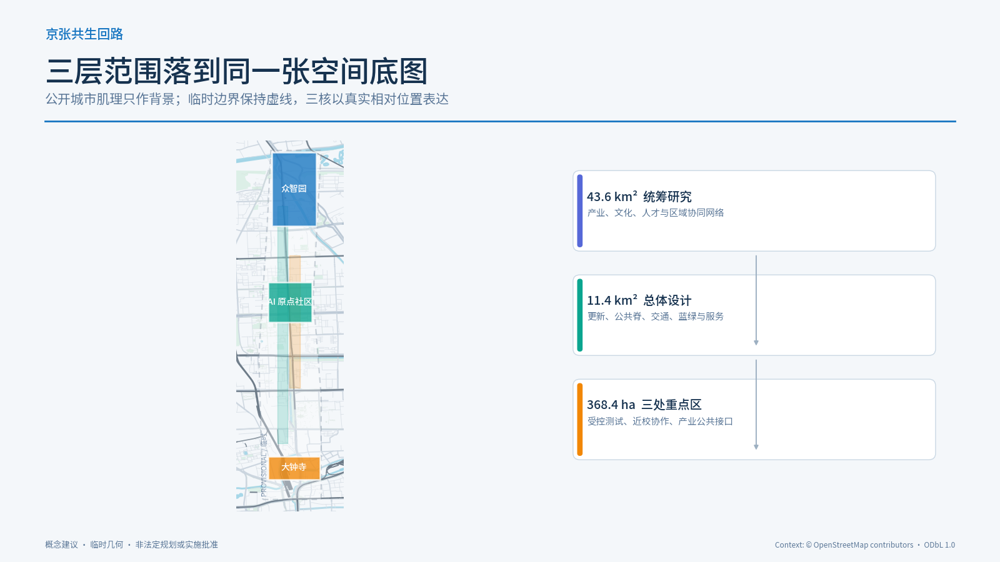
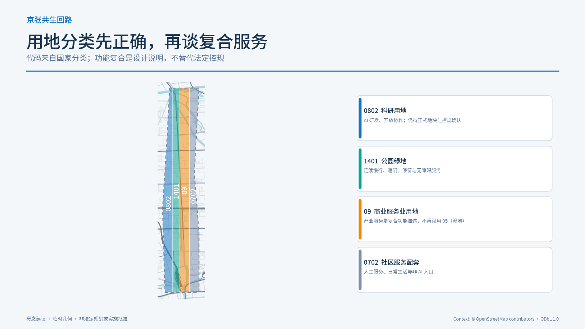
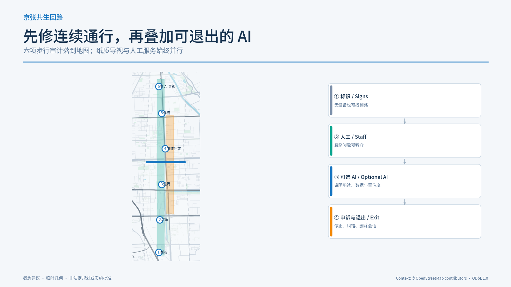
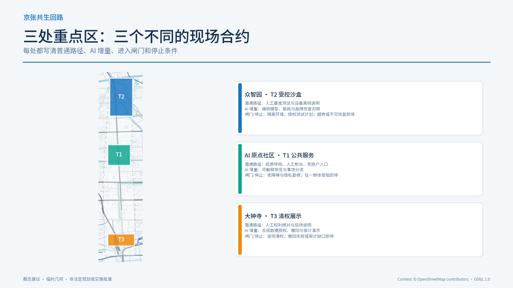
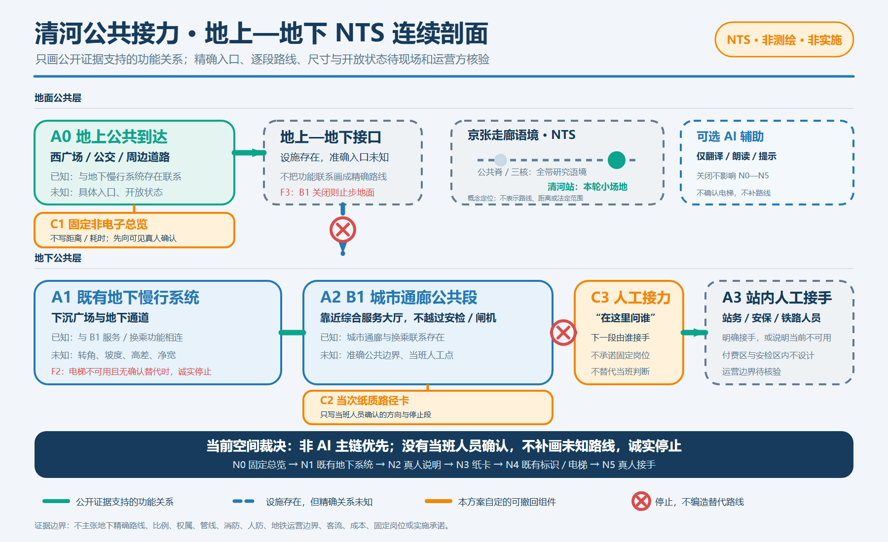
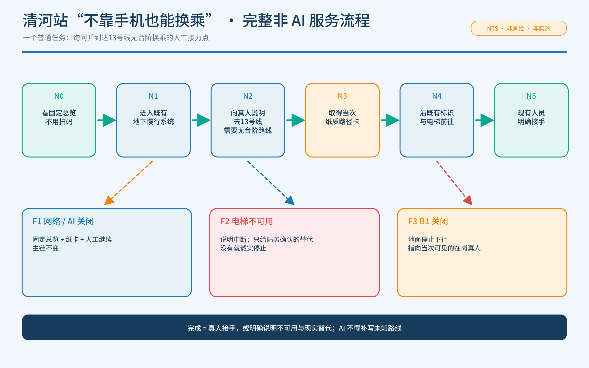
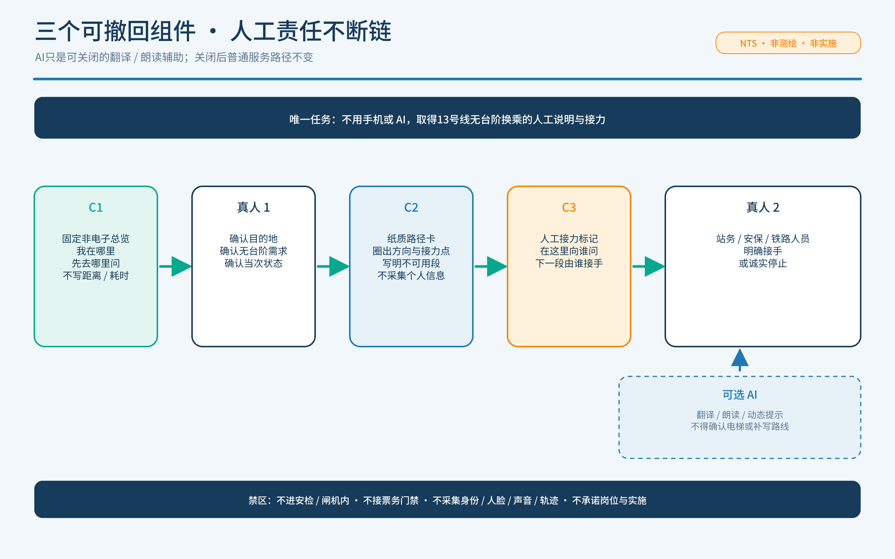
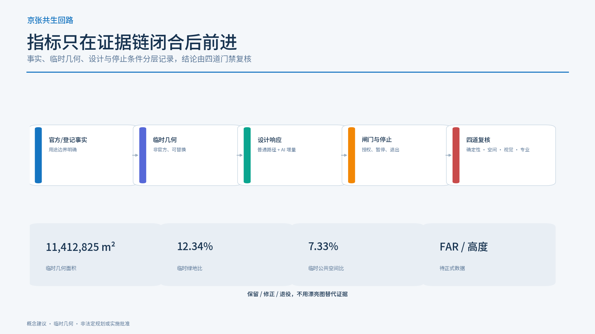

# 京张共生回路：面向日常公共服务的AI创新带

## 0. 一句话判断

本方案不把 AI 当成城市的装饰性“智能层”，而把它组织成一条可被普通人使用的公共服务回路：先保证连续通行、人工说明、无账户替代、退出和申诉，再叠加可解释的 AI 辅助。京张遗址公园是公共脊，众智园、北京 AI 原点社区、大钟寺 AI 产业集聚区是三个差异化节点；三核之间由蓝绿慢行和公共服务换乘串联。[source:OFFICIAL-ANNOUNCEMENT] [source:AGENT-TASKBOOK] [depth:overall_spatial_structure]

这是概念建议与参考方案，不是法定规划、政府审定、建设许可、招商承诺、采购方案或运营授权。公开资料没有提供正式 SITE_BOUNDARY 与 KEY_AREA 多边形，本包使用临时约束范围；正式数据到位后，所有几何、指标、图纸和网页必须整体重算。[data:geometry/site_boundary.geojson#SITE-001] [data:geometry/key_areas.geojson#PROV-KEY-001] [metric:site_area_sqm]

五张核心图以同一坐标系叠加投稿包几何与 OpenStreetMap 道路、轨道、水系、公园和站点上下文。OSM 只帮助审阅者辨认城市肌理，不参与边界、地块、道路红线、工程或审批判断；图中临时范围始终保持低对比虚线，查询时间、范围、许可与查询/响应哈希记录在来源登记中。[source:OSM-CONTEXT-20260818]

## 1. 设计依据与资料清单

本节把“事实、设计建议、待专业确认”分开。设计意图是让审阅者能够从公告与任务书进入空间方案，再从空间方案回到 GeoJSON、指标、来源和假设；临时边界不被包装成官方红线，缺失的权属、道路、市政、文保与运营资料不被补写成确定事实。空间影响由 `site_boundary.geojson`、`key_areas.geojson` 与设计图层表达，指标影响由 `metrics.json` 重算，数据缺口由 `assumptions.json` 追踪；正式资料到位后必须整体替换并复核。[source:SITE-PACKAGE] [data:geometry/site_boundary.geojson#SITE-001] [metric:site_area_sqm]

方案依据项目公告、智能体任务书、公开来源登记、站点资料包、临时边界和专业标准快照编制。正式可用的事实只来自已登记的公开或清权材料；临时几何只用于方案生成、空间讨论和自检，不用于法定红线、精确面积或控规结论。[source:SITE-PACKAGE] [source:SOURCE-REGISTRY] [standard:PROJECT-OFFICIAL-ANNOUNCEMENT]

### 1.1 新增官方事实与设计响应

本轮新增资料不是“背景堆叠”，而是形成七条可追溯的设计约束：

| 类型 | 可核验事实 | 本方案据此作出的判断 | 明确不作的推断 |
| --- | --- | --- | --- |
| 区级统计 | 2025 年末海淀区常住人口 311.1 万人；全国重点实验室 92 家；备案上线大模型 123 款，公报注明 2025 年数据为初步数。[source:HD-STATS-2025] | 公共服务节点应同时服务居民、研究者、创业团队和流动人才，并以通用、可解释、可人工办理为默认。 | 不把全区总量按比例分摊到临时边界，不据此预测客流、建筑规模或项目收益。[metric:haidian_resident_population_2025] |
| 已建公园 | 京张铁路遗址公园一期位于清华东路至知春路，官方报道长度 2.5 公里、面积 16.8 公顷，并以遗迹保护、功能织补、东西缝合和公共服务为目标。[source:JZ-PARK-PHASE1] | “公共脊”不是新造一条科技景观轴，而是接入并补强既有公共空间，优先找断点、入口、休息和人工服务缺口。 | 不把一期面积与临时方案面积合并，不把未建区段写成已开放。[metric:jingzhang_park_phase1_length_m] |
| 控规程序 | 2024 年 12 月至 2025 年 1 月曾公示沿线街区控规草案；采信通告显示北三环—四道口路等立交表达被调整或仍需下一阶段深化。[source:JZ-CONTROL-DRAFT-RESPONSE] | 环路和主干路交叉点只做“连通性问题清单”和多方案接口，不画成已经批准的桥隧或道路红线。 | 不把公示采信通告当作已批控规，不从网页文字反推法定边界。[assumption:A-CONTROL-PLAN-006] |
| 既有服务 | AI 原点社区已落地人才服务流动站，官方披露 5 类 17 项高频事项、智能问答与市区镇三级人工帮办。[source:AI-ORIGIN-TALENT-SERVICE-2026] | 原点社区继续作为全带既有公共服务背景，设计原则保留无账户入口、纸质说明、人工转介与失败复盘。 | 不重复宣称 17 项服务为本方案成果；公开资料没有证明服务站的准确楼栋、楼层、容量、开放时间或系统接口。[metric:ai_origin_high_frequency_talent_services_2026] |
| 清河站公共接口 | 官方多层轴测图分开展示 2F、1F、B1、B2，并标出无障碍电梯、地下通道、下沉广场/通廊等要素；官方页面另确认北侧地下市政慢行通道连接公交、西广场及周边道路。[source:QH-STATION-MAP-2026] [source:QH-UNDERGROUND-WALK-2026] | 选择安检/闸机外的地上到达—地下慢行—B1城市通廊作为唯一小场地样板，只设计固定总览、纸质路径卡和人工接力。 | 示意图不是测绘或建筑底图；不据此推断尺寸、标高、准确入口、电梯路线、开放时段或运营边界。[assumption:A-QH-MAP-009] |
| 文物保护 | 北京市文物局公布了清华园车站旧址保护范围及Ⅰ类、Ⅴ类建设控制地带，部分地带禁止新建或仅允许与保护展示相关的建设。[source:QINGHUAYUAN-HERITAGE-CONTROLS-2026] | “第一条路”地标改为可移动、低干预的解释路线；正式文保 GIS 到位前不确定站房附近的新建落位。 | 不把网页中的文字距离自行数字化为官方 polygon，不提出开挖、固定设备或构筑物。[assumption:A-HERITAGE-005] |
| 慢行绿道 | 北京市慢行行动强调连续路权、无障碍、林荫和水—路—绿融合；绿道指南服务于已批绿道专项规划的实施。[source:BEIJING-SLOW-MOBILITY-2024] [source:BEIJING-GREENWAY-GUIDE-2025] | 首期审计对象从“布置智能设施”调整为断点、过街、遮阴、盲道冲突、停留点和非 AI 导视六项。 | 不把市级年度任务或指南写成本站点获批工程，不替代道路、园林和无障碍专业设计。 |

结构化证据中，事实写入 `sources.json` 和 `metrics.json`；设计判断留在正文和矩阵；文保 GIS、法定控规、权属及实施责任等待确认项写入 `assumptions.json`。网页未显示明确开放复用许可时，本包只作短句转述与链接引用，不复制图片、地图、logo 或界面素材。[assumption:A-RIGHTS-008]

## 三层范围工作框架

三层范围不是三张互不相干的图，而是从产业网络到城市空间、再到重点片区的同一条证据链：统筹研究范围提出创新生态与文化叙事，总体设计范围把判断落到公共脊、蓝绿系统、交通和更新项目，重点区域用三核差异化设计验证服务接口。临时范围只支持概念比选，不支持法定面积、红线或实施结论；正式边界变化时，三层范围、用地分区、指标和图纸必须联动复算。[source:OFFICIAL-ANNOUNCEMENT] [depth:three_level_scope_framework] [data:geometry/key_areas.geojson#PROV-KEY-001]

三层范围采用同一套“公共服务回路”方法：

| 层级 | 公开资料中的尺度 | 本方案的空间判断 | 需要补齐的证据 |
| --- | --- | --- | --- |
| 统筹研究范围 | 约 43.6 km² | 用高校、企业、算力、人才、文化和公共服务建立创新网络 | 正式研究边界、现状产业与交通底数 |
| 总体设计范围 | 约 11.4 km² | 以京张遗址公园为公共脊，组织城市更新、产业服务、蓝绿慢行和新型基础设施 | 正式规划边界、权属、市政和道路资料 |
| 重点区域 | 约 368.4 ha，三处重点区 | 三核分别承担安全测试、开放协作、产业展示 | 三处正式 polygon、文保与控规条件 |

## 2. 总体概念、命名体系与视觉识别

主名称为“京张共生回路”，英文为 “Jing-Zhang Civic Loop”。“京张”保留铁路、工程和跨区域连接的记忆；“共生”强调人、社区、企业、专业团队与智能体共同校正；“回路”强调服务必须有入口、替代路径、人工接力、停止和反馈，而不是单向推送。

建议形成三层命名：

- 品牌层：京张共生回路 / Jing-Zhang Civic Loop；
- 空间层：一条京张公共脊、三核、两翼、多点场景；
- 服务层：开源发布厅、可信测试沙盒、公共服务换乘、数据治理展厅、AI 慢行导览等概念节点。

Logo 样张采用“一条可回到原点的折线 + 三个开放节点”：折线引用线路与回路，三个节点以深蓝、青绿、暖橙区分测试、协作、展示。离线可视化页给出可审阅的中英文字标与几何样张；它是本方案原创概念标记，不是注册商标、获批导视或既有铁路标识。样张仅使用系统字体回退，不使用第三方 Logo、企业标识、人物肖像或未经授权的铁路图像；未来若进入应用，字体嵌入、图形复用、名称注册和第三方素材必须逐项清权。[source:AGENT-TASKBOOK] [assumption:A-RIGHTS-008]

三大定位是“百年京张文化带、都市 AI 生活体验带、AI 融合创新带”；五大功能是“AI 全栈自主创新体系、世界级 AI 创新生态、AI+ 场景赋能新范式、智能化 AI 活力城市、AI 治理全球话语权”。三区两翼协同为：北京 AI 原点社区负责开放协作，众智园负责自主创新与治理测试，大钟寺负责产业展示与服务接口；中关村科技服务翼提供高校、资本、知识产权、专业服务的连接，小月河场景赋能翼把实验转成日常公共体验。[depth:three_level_scope_framework] [data:geometry/key_areas.geojson#PROV-KEY-002]

## 核心概念与原创机制

原创主张不是再建一条“智能设施走廊”，而是建立一套**可逆公共服务回路**：AI 必须在普通服务基线已经能独立完成任务之后才进入，并且每个场景都有明确边界、人工接力、停止、申诉、撤回和恢复。它由三项相互咬合的机制构成：第一，纸质、人工、离线平台与可选 AI 的**普通基线机制**，避免把账户、扫码或模型变成公共服务门槛；第二，OPEN、PILOT、PAUSE、RESTORE 的**四态运行机制**，把空间组件、数据权限和现场责任放入同一状态体系；第三，“问题—证据—复用—交接”的**证据交换机制**，让社区、企业、高校、专业团队和区域节点共享失败与修正，而不是复制未经验证的技术模式。三核不是同质园区：众智园验证隔离与恢复，原点社区验证普通人的可达性，大钟寺验证产业展示能否成为可审计、可撤回的公共接口。这样，“回路”既是品牌命名、空间网络和视觉符号，也是可被审查的治理模式与规划创新。

## 3. 统筹研究范围产业与未来城市研究

生态不按企业名单或投资额做未经核实的排名，而按“能力要素—空间载体—公共回报”组织：高校与研究、开源协作、算力与数据、产品和产业服务、人才生活、公共场景、国际传播。可参考的全球生态类型包括研究型园区、开发者社区、产业测试区、城市服务实验室、数字公共基础设施、创客与教育网络；本方案不把案例中的制度、企业或资金直接移植为海淀事实。[source:AGENT-TASKBOOK] [standard:MOHURD-URBAN-DESIGN-MEASURES]

### 3.1 五个全球案例的“可借鉴/不可移植”矩阵

| 官方案例 | 可借鉴的方法 | 对本方案的落点 | 不可直接移植 |
| --- | --- | --- | --- |
| 新加坡 Punggol Digital District | 高校、产业、社区和开放数字平台共同构成测试环境。[source:CASE-PUNGGOL-DIGITAL-DISTRICT] | 众智园只在授权、隔离和可停机条件下提供测试；数据接口先列用途、权限和退出。 | 传感器规模、平台治理、投资和运营体系。 |
| Barcelona 22@ | 在存量城市中把创新、创意、照护、公共设施与日常经济并置。[source:CASE-BARCELONA-22AT] | 大钟寺首层界面不能只有企业展厅，要并置社区可进入的服务与公共空间。 | 巴塞罗那规划工具、土地经济、项目品牌与产业配额。 |
| Amsterdam Nieuwe Meer | 公共交通、居住、工作、服务、知识机构与数字基础设施形成混合创新区。[source:CASE-AMSTERDAM-NIEUWE-MEER] | 三核之间用公共交通和慢行连接，并把生活服务作为创新生态的基本设施。 | 50/40/10 等当地功能比例及建筑控制。 |
| Cambridge Kendall Square / Volpe | 通过公众参与把科研创新、住房、社区中心、步行联系与开放空间共同规划。[source:CASE-KENDALL-VOLPE-2026] | 把公共空间和社区收益写进每个测试项目的进入条件，而非技术上线后的附加项。 | 已批规模、地产安排、资金和社区收益协议。 |
| Paris-Saclay Gif-sur-Yvette | 高校科研与住房、邻里服务、公园、公共空间和区域能源系统共同组织。[source:CASE-PARIS-SACLAY-GIF-2026] | 以“研究—生活—公共空间—基础设施”四项齐备检查重点区，而非只看企业密度。 | 法国法定程序、轨道时序和公共开发机构模式。 |

五案共同支持三条方法：创新空间必须可被日常生活使用；测试必须有明确治理与退出；公共空间、交通和社区服务应与研发设施同步设计。它们只构成比较研究，不证明海淀已经具备相同制度、预算、数据或交付能力。

### 3.2 全栈生态要素—空间载体—公共回报（概念映射）

| 能力要素 | 概念空间载体 | 普通服务基线 | 可选增量与公共回报 | 未确认边界 |
| --- | --- | --- | --- | --- |
| 高校研究与开源协作 | 原点社区概念节点、众智园测试接口、公共脊可移动发布点 | 纸质问题卡、人工说明、公开失败记录 | 经清权的代码/协议检索与复现实验说明；回报为可复用方法而非企业宣传 | 具体高校、团队、场地、活动与知识产权均未确认 |
| 模型、算力与恢复 | 众智园隔离测试载体；不把设备落位到公共绿地 | 人工基准、离线说明、普通信息服务 | 授权后记录端侧延迟、能耗与恢复失败；回报为可审计测试记录 | 算力来源、设备、能耗上限、网络与责任主体未知 |
| 数据、授权与审计 | 大钟寺可撤回展示接口 | 人工权利核对、纸质用途/撤回说明 | 仅用逐项清权的合成数据演示；回报为公众可理解的权利链 | 数据主体、品牌、许可、保留期和展项位置未知 |
| 人才生活与社区服务 | 中关村科技服务翼、原点社区和沿线普通服务点 | 人工咨询、纸质转介、无账号办理路径 | 可选多语解释与预约提示；回报为明确接手/停止状态 | 不推断人群规模、岗位、房源、服务量或就业结果 |
| 资本、知识产权与专业服务 | 中关村科技服务翼及大钟寺人工服务接口 | 公开服务目录、人工咨询与申诉 | 可选材料检查，不做自动决策；回报为权利清晰的转介 | 机构、资金、收费、融资、专利和转化结果未确认 |
| 日常场景与国际传播 | 小月河场景赋能翼、京张公共脊和可撤回活动界面 | 普通通行、人工讲解、纸质报名/退出 | 把已核验场景译成双语证据卡并返还失败；回报为可复用/不可复用说明 | 不声称既有活动、国际伙伴、频次、客流或稳定资源 |

这张图谱只定义“什么证据进入什么载体、普通人得到什么”，不构成产业名单、资金配置、算力采购、招商目标或空间落位。[assumption:A-CONTEXT-007] [assumption:A-RIGHTS-008] [depth:industry_future_city_research]

总体结构是“1 条公共脊 + 3 个创新核 + 2 条协同翼 + 10 类可复用场景”。空间上，把公共服务节点布置在轨道接驳、遗产公园、社区日常路径和产业展示接口的交汇处；运营上，用同一套证据卡片记录服务对象、数据边界、人工替代、停止条件和复核责任。

## 4. 总体设计范围城市更新与控规深度城市设计

总体设计把 1—2 公里尺度的城市地区看成一条公共服务回路，而不是把 AI 设施孤立在园区内部。用地、建筑、道路、绿地、公共空间和分期图层共同回答空间如何承载服务；`metrics.json` 只报告提交层可复算结果，容积率、高度、红线和权属等控制条件保持待确认。正式边界、轨道站点接口、市政管线、消防、停车、文保和公共服务底数缺失时，方案以“先核验、再试点、可退回”为实施前提。[data:geometry/land_use.geojson#LU-001] [data:geometry/roads.geojson#ROAD-001] [depth:overall_spatial_structure]

## 用地、建筑规模与拆改留方案

### 4.1 用地与更新逻辑

用地结构是“公共服务与创新共享、蓝绿慢行与社区生活、产业服务与展示、保留/更新协作节点”的组合，而不是新增一个封闭园区。`land_use.geojson` 覆盖提交的临时边界，采用可校验用地分类表达；其面积、比例和分类仅是设计层复算，不替代法定规划。[data:geometry/land_use.geojson#LU-001] [standard:MNR-LAND-USE-CLASSIFICATION-GUIDE] [depth:land_use_layout]

建筑采用“保留优先、改造可逆、新建谨慎、拆除待核”的分类：有历史、社区或公共服务价值的建筑优先保留并改善首层可达性；改造建议先做轻量、可撤回的公共界面；新建只作为待专业团队深化的容量选项；没有权属、结构、文保和控规资料时，不作具体拆除或高度结论。[data:geometry/buildings.geojson#BLDG-001] [depth:retain_renovate_demolish]

容积率、总建筑面积、建筑高度、退线、道路红线、停车配建和工程管线均标为待正式数据补齐。城市设计深度用于说明空间关系、风貌导则和复核路径，不把概念指标写成已批准控制条件。[metric:floor_area_ratio] [standard:MOHURD-CONTROL-DETAILED-PLANNING] [depth:development_intensity_controls]

## 交通、轨道、市政与公共服务设施

### 4.2 交通、轨道、慢行和蓝绿公共空间

交通策略是“连续通行优先”：围绕轨道接驳、京张遗址公园跨环路节点、社区入口、产业服务节点形成步行和骑行的连续网络；AI 导航只提供可解释的建议，不替代标识、人工询问和无障碍通行。首期采用“断点—过街—遮阴—盲道冲突—停留—非 AI 导视”六项步行审计，先检查连续路权与行动不便者体验，再讨论智能设施。停车、消防和市政管线待正式资料核验。[source:BEIJING-SLOW-MOBILITY-2024] [data:geometry/roads.geojson#ROAD-001] [depth:traffic_rail_slow_parking]

蓝绿系统把遗产公园、小月河、社区公共空间和产业开放界面连成复合环；设置遮阴、休息、夜间照明、低刺激导视和人工服务点，并把水—路—绿连通性作为方案复核项。[source:BEIJING-GREENWAY-GUIDE-2025] [data:geometry/green_space.geojson#GREEN-001] [data:geometry/public_space.geojson#PUBLIC-001]

公共空间不是“屏幕广场”，而是可停留、可观察、可不使用 AI 的日常场所。[depth:blue_green_public_space]

### 4.3 市政与新型基础设施

提出“端侧优先、分级算力、公共接口、可断网运行”的参考原则：对低风险导览和公共信息采用本地缓存与端侧能力；对需要数据交换的服务建立最小化、可审计接口；不在未授权场地部署摄像、语音采集或生产系统接入。能源、消防、通信、排水、算力和机房条件均需专业核验。[depth:municipal_new_infrastructure]

## 蓝绿空间、公共空间与城市风貌

蓝绿系统是公共服务回路的日常底盘：京张遗址公园承担文化脊，小月河与社区空间承担连续步行、休息、遮阴和低刺激导视，产业界面承担可进入的展示和人工接待。城市风貌建议以铁路工程尺度、开放协作界面、连续首层和可识别但不喧闹的节点标识为原则；不新增未经批准的红线、建筑高度或文保结论。`green_space.geojson` 与 `public_space.geojson` 用于表达空间关系，绿地率与公共空间率为临时设计层复算，正式边界、断面、管线、无障碍和文保资料到位后需重算并由专业团队确认。[data:geometry/green_space.geojson#GREEN-001] [data:geometry/public_space.geojson#PUBLIC-001] [depth:blue_green_public_space]

## 5. 三处重点区域详细设计

### 5.1 众智园 AI 自主创新加速区：先测再扩

概念角色是可信测试与端侧算力的“受控沙盒”。空间上把人工基准测试台、隔离测试房、低干扰解释廊、设备维护间和人工服务台组织为由外到内的权限梯度；普通访客即使不进入测试区，也能通过纸质说明、人工讲解和离线展项理解测试目的。AI 的增量只发生在经授权、与生产系统隔离的测试单元；进入前必须锁定用途、数据、设备、能耗/延迟基线、责任人和恢复演练，出现权限越界、无法解释的输出或无法恢复的故障即停机、断开接口并转人工复盘。不承诺算力供给、招商、投资或政府采购。[data:geometry/key_areas.geojson#PROV-KEY-001] [depth:three_key_area_detailed_design]

### 5.2 北京 AI 原点社区：让普通人能参与

概念角色是开源发布、居民反馈和跨代协作的“公共客厅”。公开资料证明 AI 原点社区已有覆盖 17 项高频事项、数字问答和人工帮办的人才服务流动站，但没有证明其准确楼栋、楼层或空间接口，因此本轮不把服务站绑定到某栋建筑或 B1。只保留“纸质说明和人工办理先独立完成任务，再比较可解释 AI 是否减少理解负担”的原则；任何群体被阻挡、替代路径不可用、信息采集越界或申诉无法处理时，立即停止 AI 分流并恢复人工路径。[source:AI-ORIGIN-TALENT-SERVICE-2026] [data:geometry/key_areas.geojson#PROV-KEY-002] [depth:three_key_area_detailed_design]

### 5.3 大钟寺 AI 产业集聚区：把产业展示变成公共接口

概念角色是产业服务、数据治理展示和国际交流的“公共接口”。由于重点区准确 polygon 和站点接口均未公开，本轮不再给大钟寺指定“站点到首层”的连续路线、固定服务台或比例断面，只保留纸质权利说明、人工讲解、合成数据演示和可撤回展陈的治理要求。企业案例、商标、产品、数据和国际合作必须逐项清权；来源不明、无法撤回或审计记录断裂即撤下展项并转人工说明，不写成已入驻企业或招商结果。[data:geometry/key_areas.geojson#PROV-KEY-003] [assumption:A-BOUNDARY-002] [depth:three_key_area_detailed_design]

### 5.4 跨尺度公共服务样板：清河站“不靠手机也能换乘”

本轮只用一个真实小场地检验全带原则：清河站西广场/公交到达—地下慢行系统—B1 城市通廊—安检外人工接力。官方资料支持多层关系、地下通道和 B1 综合服务大厅等要素。[source:QH-STATION-MAP-2026] [source:QH-B1-SERVICE-HALL-2024] 官方复核还覆盖无障碍设施要素与真实人工接力个案，但不支持精确入口、转角、距离、标高或岗位位置。[source:QH-ACCESS-AUDIT-2025] [source:QH-HUMAN-HANDOFF-2026] 因此图件永久标注 NTS（非比例、非定位）；没有获准底图或实测时，不进入 1:200 或 1:100。图中小窗只把清河标记为京张走廊研究语境中的本轮小场地，不表示路线、距离或法定范围。[assumption:A-QH-SCALE-012]

唯一任务是：首次到访、没有智能手机或选择不用手机、需要无台阶路线的乘客，从地面到达后向真人提出“我要去 13 号线，需要无台阶路线”，取得可带走的纸质说明，并在安检/闸机外与既有工作人员完成接力。正常路径为固定总览—既有地下慢行—B1 人工询问—纸质路径卡—既有电梯—人工接力；完成也包括在电梯或 B1 不可用时得到明确限制和现实人工替代，而不是由 AI 编造一条路线。[data:spatial.json#qinghe-ground-arrival] [data:spatial.json#qinghe-human-handoff]

三个拟议组件只有固定非电子总览、可手写的纸质路径卡和人工接力标记；不新增摄像、语音采集、定位、账号、固定数字屏或铁路/地铁系统接口。AI 仅可辅助翻译、朗读或动态提示，关闭后主链不变。网络/AI 不可用时照常运行；电梯不可用时明确说明无法完成无台阶换乘；B1 关闭时在地面停止下行。实际设置仍需责任主体依法确认，本方案不把许可或实施写进时间表。[data:spatial.json#qinghe-fixed-overview] [data:spatial.json#qinghe-paper-route-card] [data:spatial.json#qinghe-handoff-marker]

## AI 创新生态、人才画像与 AI+ 场景

AI 生态的空间目标不是制造全自动城市，而是让研究、开源、测试、产业服务、人才生活和公共体验在三核之间形成可往返的学习回路。生态案例只作类型参照，不虚构企业、投资额、产值或政策承诺；五类用户画像和十张场景卡把抽象功能转成可被体验、人工解释、暂停与复核的服务。空间上以重点区、公共脊、蓝绿线和轨道接驳承载场景，活动频率、用户数量、服务绩效和企业入驻情况均待真实运营数据验证。[source:AGENT-TASKBOOK] [data:geometry/key_areas.geojson#PROV-KEY-001] [metric:ai_scenario_cards]

## 6. AI+ 场景卡、用户画像与产业验证

### 6.1 十张场景卡

1. **开源发布厅**：发布代码、模型说明和失败复盘；不采集身份轨迹。
2. **可信测试沙盒**：展示测试协议、红队结果和暂停条件；不连接生产系统。
3. **端侧算力驿站**：提供低风险本地推理体验；断网仍可使用普通信息服务。
4. **清河非 AI 换乘接口**：固定总览、纸质路径卡和人工接力先独立完成任务；AI 只作可关闭的翻译或朗读辅助。
5. **遗产口述工作坊**：由授权参与者提供故事；不把合成声音当作历史原声。
6. **清河低碳创新廊**：解释雨洪、遮阴、骑行和能源关系；不虚构环境绩效。
7. **成果转化驿站**：连接高校成果与专业服务；不承诺融资、专利或转化结果。
8. **数据要素会客厅**：展示授权、用途和审计链；不展示个人或敏感数据。
9. **社区服务样板街**：把生活服务做成可人工办理的小尺度接口；不强制扫码。
10. **全球 AI 公共路线**：以开放活动和公共展陈串联三核；活动日期与参与者待确认。

### 6.2 五类用户画像

开源开发者需要发布、协作和可复现实验；初创团队需要低成本测试、人工合规咨询和端侧算力入口；周边居民需要通勤、休闲、社区服务和不使用 AI 的选择；高校师生需要成果转化、跨校协作和安静学习空间；头部企业与国际访客需要可审计展示、轨道接驳、人工接待和公共规则说明。画像是设计工具，不是对真实人口的统计结论。[depth:overall_spatial_structure]

### 6.3 三个产业测试/验证场景

| 测试与落位 | 不用 AI 的基线 | AI 增量与最小数据 | 进入闸门 | 停止、接管与退出 | 形成的证据 |
| --- | --- | --- | --- | --- | --- |
| **T1 公共服务可达性 / 清河站安检外接口** | 固定总览、纸质路径卡和人工接力不依赖手机、账号或 AI | AI 只辅助翻译或朗读；不保留身份、声音或精确轨迹 | 公开证据足以支持 NTS 流程；任何现场测试仍需管理方和无障碍使用者确认 | 电梯/B1不可用或人工无法确认时诚实停止；不得由模型自行补路线 | 若获准测试，只记录完成/停止原因与修正清单；没有真实测试就不报告完成率 |
| **T2 端侧模型与低碳运行 / 众智园** | 人工基准测试、离线说明和普通信息服务可独立运行 | 隔离环境比较本地推理、延迟、能耗与故障恢复；不用生产数据 | 权利主体、专业人员和测试负责人签认用途、边界、基线与恢复演练 | 权限越界、超过预先声明的能耗/延迟上限或恢复失败即断开；人工记录接管并封存日志 | 可复现实验记录、失败模式与是否继续的建议；不是部署许可或性能认证 |
| **T3 数据授权与产业展示 / 大钟寺** | 人工权利核对、纸质说明和现场讲解可完成参观 | 仅用逐项清权的合成数据演示授权、撤回和审计 | 来源、许可、品牌、用途、保留期限和撤回方式逐项签认 | 撤回失败、来源不明、审计断链或观众误认真实数据即撤展；人工解释并删除演示数据 | 权利清单、撤回记录和审计缺口；不是合规认证或招商成果 |

三个测试都采用“基线先跑—小范围进入—人工监看—故障即停—年度保留/修正/退役”的共同语法，但基线、数据、空间和停止原因各不相同。验证结果只决定下一轮是否值得继续，不自动触发采购、部署、扩区或建设。[metric:industry_validation_scenarios] [data:geometry/key_areas.geojson#PROV-KEY-001] [depth:three_key_area_detailed_design]

### 6.4 小月河场景赋能翼—十张场景卡运营映射

| 卡 | 主要概念载体 | 小月河翼的运营接口 | 普通基线 / 停止门 |
| --- | --- | --- | --- |
| S01 开源发布厅 | 原点社区 / 公共脊可移动发布点 | 只接收已清权发布卡和失败复盘 | 纸质索引与人工说明；来源或许可不明即不发布 |
| S02 可信测试沙盒 | 众智园隔离测试载体 | 只展示状态卡与可复现结论，不把测试搬到公共绿地 | 普通安全说明；连接生产系统或恢复失败即停 |
| S03 端侧算力驿站 | 待授权的室内服务节点 | 翼内只提供普通信息与测试结果说明，不预设室外设备 | 离线信息可用；设备、能耗、网络与责任未确认则不布置 |
| S04 清河非 AI 换乘接口 | 清河站安检/闸机外 NTS 原型 | 把“普通链先行、未知即停”作为可复用规则返还全带 | 固定总览、纸卡、人工接力；无当班确认即诚实停止 |
| S05 遗产口述工作坊 | 京张文化脊 / 经确认活动点 | 接收经授权故事与来源卡，不存放未经同意的声音 | 人工讲述与纸卡；权利撤回或史实争议即下架 |
| S06 清河低碳创新廊 | 清河及蓝绿慢行研究界面 | 以观察表解释遮阴、雨洪、骑行和能源关系 | 普通导视；无测量就不报告环境绩效 |
| S07 成果转化驿站 | 原点社区 / 中关村科技服务翼 | 人工把主动咨询转给待确认专业服务角色 | 公开目录与人工转介；不承诺融资、专利或转化 |
| S08 数据要素会客厅 | 大钟寺可撤回展示接口 | 用合成数据展示授权、用途、撤回与审计 | 纸质权利说明；来源不明或撤回失败即撤展 |
| S09 社区服务样板街 | 小月河翼社区普通服务界面 | 先验证不扫码、可人工办理的小尺度任务 | 纸质/人工可完成；普通路径受阻即停 AI |
| S10 全球 AI 公共路线 | 公共脊与逐次确认的活动接口 | 只串联已确认节点和双语证据卡，不预设日期或伙伴 | 普通路线与人工讲解；主办/许可/节点未确认即不启动 |

小月河翼是**场景翻译与返还接口**，不是十个场景的统一物理落位，更不由这张表产生建筑、设备或活动授权。每张卡只能在其载体、责任和权利逐项确认后，从“文档”进入 P1/P2。[metric:ai_scenario_cards] [assumption:A-CONTEXT-007] [depth:overall_spatial_structure]

## 7. AI 公共空间、朝圣地标与文化叙事

三个 AI 朝圣地标是概念性公共节点：**“第一条路”京张记忆路线**以可移动、低干预标识讲自主建造与公共工程；**“共同校正”原点代码墙**展示经授权的开源贡献和失败复盘；**“可回到原点”共生环广场**把三核、蓝绿线和年度公共活动汇成可步行路线。清华园车站旧址已有正式文字版保护范围和建设控制要求，但本包缺少官方 GIS，因此“第一条路”不确定站房附近的新建构筑物、设备或开挖位置，必须先做文保范围叠合与主管部门审查。三个地标都不是纪念设施批复或企业荣誉墙。[source:QINGHUAYUAN-HERITAGE-CONTROLS-2026] [assumption:A-HERITAGE-005] [depth:blue_green_public_space]

文化叙事采用“詹天佑的自主建造—中关村的开放创新—AI 时代的公共共创”三段式，不把历史人物、铁路设施、企业和社区故事做未经授权的再现。所有展陈内容应能被普通人理解，并允许不观看、不扫码、不提供数据。

### 7.1 全带公共空间组件库与荣誉展示规则（概念）

| 组件族 | 进入条件与普通服务基线 | 可选 AI 增量 | 维护责任与确认门 | 撤除 / 退役条件 |
| --- | --- | --- | --- | --- |
| **B01 公共服务基线** | 先有固定非电子总览、纸卡和人工接力；不以手机、账号或扫码为门槛 | 只做可关闭的翻译、朗读和提示，不确认未知现场状态 | 场地和公共服务责任位明确后才进入 P1；开放时段、纸卡更新和投诉入口由待指定运营角色维护 | 普通路径受阻、责任位空缺或授权到期即撤下 AI 层；纸质与人工基线保留 |
| **B02 文化导视** | 采用可移动、低干预的来源卡与文字说明；先完成文保叠合和内容权利核验 | 可选多语解释，不生成人物言论、历史事实或精确路线 | 内容来源、图像许可、主管确认和无障碍可读性均有记录后开放 | 来源失效、权利撤回、保护要求冲突或内容无法更正即下架 |
| **B03 活动接口** | 只有已确认的主办角色、时间、普通报名/现场咨询和静音日常基线 | 可选议程问答与翻译；不得把报名数据转作画像或招商 | 每场活动逐次确认主办、场地、数据、品牌和安全边界；不由年度概念自动授权 | 活动结束即撤除临时物料；未确认主体、许可或普通服务即不启动 |
| **B04 荣誉展示** | 只展示可核验的公开奖项、认证或开源贡献；证据卡写明授予方、事项、对象、日期/状态、有效期、来源和权利状态 | 只辅助检索已核验记录和无障碍朗读，不生成排名、评价或背书 | 待指定内容责任位逐项复核来源、商标/图像许可、状态和过期时间；不得使用付费榜单或未核实 Logo | 来源不可访问、状态到期、权利撤回、对象提出异议或审计断链即撤下；不暗示官方认可或既有荣誉墙 |

四类身份必须保持可辨：**全带 Logo**只识别总体方法；**文化导视**解释京张历史与现场来源；**活动品牌**仅对应一次已确认活动；**荣誉展示**只对应一条可撤回的核验证据。任何一类都不得借用另一类的权威感，也不得从概念样张推导现状设施、合作关系或建设承诺。[assumption:A-CONTROLS-001] [assumption:A-HERITAGE-005] [assumption:A-RIGHTS-008] [depth:blue_green_public_space]

## 更新项目清单、实施政策与分期计划

更新项目清单的设计意图是把总体概念转成可审阅的工作包，每个项目都有空间载体、公共价值、依赖条件、暂停条件和后续复核对象。项目清单不等于立项或建设时序；`phasing.geojson` 只表达先后关系，`assumptions.json` 记录权属、预算、责任主体、文保、市政与审批缺口，正式资料到位后再评估保留、修正、扩展或退役。政策建议聚焦公共数据最小化、人工服务并行、开放失败复盘、清权展陈和年度去留决定。[data:geometry/phasing.geojson#PHASE-001] [depth:renewal_project_list] [depth:phasing_implementation]

建议更新项目清单包括：JZ-01 京张遗址公园慢行断点缝合，JZ-02 清河站安检外非 AI 换乘接口，JZ-03 原点社区近校成果转化街，JZ-04 大钟寺数据权利说明界面，JZ-05 AI 公共服务与端侧算力节点，JZ-06 全球 AI 公共路线。它们均为参考项目，依赖正式边界、权属、专业设计和授权，不代表实施承诺。[depth:renewal_project_list]

## 8. 全球活动体系、社区运营与分期

建议形成四类长期活动：季度“问题季”公开真实公共问题；季度“开源季”发布可复用工具和失败记录；年度“城市 Beta 季”进行经授权的低风险体验；年度“Proof Week”展示证据链而非广告。无活动日、普通日、静音时段和故障状态同样被设计，公共服务不能只在节庆时存在。

分期采用“先公开、后测试、再深化”：

- **P0 资料与授权**：补齐正式边界、重点区、权属、文保、交通、市政和运营责任；不满足条件不进入现场。
- **P1 轻量公共体验**：先做纸质导视、人工服务、可撤回的展陈和开放讨论，验证连续通行与可理解性。
- **P2 受控验证**：由专业团队和权利主体确认后，在三核分别开展 T1-T3，设置暂停、申诉、退出和事故复盘。
- **P3 深化与退役**：只有在证据充分且公共价值明确时，才研究长期空间与基础设施；无法证明价值的功能保留公共知识并退役。

`phasing.geojson` 只表达参考顺序，不构成时间、预算、责任主体或实施承诺。[data:geometry/phasing.geojson#PHASE-001] [depth:phasing_implementation]

### 8.1 责任、测量和区域协同

运营责任采用明确接力而不是模糊的“多方协同”：公共服务运营方负责普通路线、现场接待和申诉；空间资产方对场地开放负责；AI 试点运营方只负责可关闭的辅助层；现场安全负责人拥有立即停止权；无障碍使用者及交通、消防、隐私等专业人员进入咨询和阶段审查。这里的角色都是待指定责任位，不声称清河站或任何现有机构已经接受本方案责任。

只有在取得现场测试授权后，才比较纸质自助、人工服务和可选 AI 辅助；样本量、时段和分层由实际运营方、无障碍使用者与专业人员共同确定，本方案不预设阈值。记录必须包含未完成、中止、转人工和投诉，技术失败不得删除；没有获准测试就不报告完成率、平均时延或服务绩效。普通路线受阻、强制账户/扫码、未告知采集、模型自行补路线或安全事件未结案均直接触发 PAUSE。

区域协同不虚构合作关系，而建立“问题—证据—复用”交换：北纬社区提供创业者与使用者问题，未来科学城提供企业与研究任务，怀柔科学城提供科学仪器和公众传播案例，经开区提供工程化与中试核验问题，京津冀城市提供跨城复用对照。只有取得相应主体确认后，案例才进入年度 Proof Week；对外传播统一使用双语状态词、证据卡和失败说明，不把建议节点写成合作伙伴。[source:AGENT-TASKBOOK]

### 8.2 开发者社区、场景开放与国际转化接口（待确认）

| 接口 | 输入 | 输出 | 权利边界与确认门 | 反馈闭环 |
| --- | --- | --- | --- | --- |
| **开发者问题诊所** | 可复现问题、去识别样例、普通服务基线与失败说明 | 公开问题卡、测试协议和是否继续的建议 | 不接收生产凭证、个人数据或来源不明代码；主办、数据权利、普通参与方式和维护角色确认后才开放 | 按获准周期回看修复、未解决和退役项；本方案不承诺频次或社区已经存在 |
| **场景开放征集** | 候选普通公共任务、非 AI 完成链、潜在影响和停止条件 | P1/P2 场景简报、确认清单与停用标准 | 不以征集替代场地、采购或实施授权；责任主体、权利、无障碍与专业审查均通过才升级 | 记录未采用、暂停、失败和申诉；证据不足则退回 P0 |
| **双语国际传播** | 已核验案例、来源、局限、状态词和权利记录 | 中英证据卡、人工讲解稿与可撤回发布包 | 不复制未授权素材，不把交流对象写成伙伴、背书方或已落地项目；译审与清权后发布 | 活动后核对误解、纠错和撤回记录；没有确认活动就不声称传播效果 |
| **人才 / 企业后续接力** | 参与者主动提出并明确同意的咨询请求 | 最小化人工转介记录与明确接收/停止状态 | 不做隐性画像、自动招商或结果承诺；先确认接收角色、用途、保存期和撤回方式 | 只记录是否已接手、退出或需补资料，不把转介写成落户、融资、就业或合作成果 |
| **区域证据交换** | 经相关主体确认的问题、可复用证据与差异条件 | 去品牌化复用卡、适用/不适用说明和返还问题 | 节点名称不代表合作；输入输出、许可、传播范围和确认人逐案登记 | 接收方反馈能否复用、失败原因与修订项，再决定保留、修正或退役 |

以上都是**接口规范，不是现有组织、活动、合作或转化业绩**。未确认具体接收角色、权利边界、普通参与路径与反馈周期时，只能停留在 P0 文档层，不进入现场、招募或对外发布。[assumption:A-CONTEXT-007] [assumption:A-RIGHTS-008] [depth:phasing_implementation]

### 8.3 可复用责任—准入—测量—资源模板

| 模板 | 必填项 | 否决 / 暂停条件 | 当前状态 |
| --- | --- | --- | --- |
| **R1 责任确认表** | 法定/运营主体名称，职责范围，现场停止权，普通服务接手位，投诉与撤回入口，签认日期、有效期、交接/退出方式 | 任一责任位未具名或停止权不清，不得从 P0 进入现场 | 仅有角色定义；无现有机构被视为已接受 |
| **G1 准入证据清单** | 正式边界/权属许可，普通路径可独立完成，无障碍复核，文保/消防/隐私等专业意见，内容/品牌/数据权利，人工接力，事故/申诉与恢复方案 | 普通路径依赖 AI、权利不清、专业否决或恢复不可执行即不进入 | 清河只具公开 NTS 功能证据，仍缺现场授权与专业复核 |
| **M1 获授权后测量计划** | 任务、分母、时段、分层、纸质/人工/可选 AI 比较方式，未完成/中止/投诉记录，复核人和停止门 | 未获测试授权、样本定义不清或失败被排除即不测量/不发布 | 无现场样本、无完成率、无时延、无阈值主张 |
| **L1 长期资源台账** | 纸卡/标识更新、人工服务时段、内容清权、无障碍维护、设备/能耗（如有）、资金来源、采购/续期、退役与档案责任 | 无责任主体、无合法资金/采购路径、普通服务资源不足或撤除成本未确认即不承诺持续运营 | 不填金额、人员数量、成本或资金承诺；待责任主体依法确定 |

模板是后续专业团队和责任主体的**空白检查结构**，不代替合同、审批、预算、测量方案或人员安排；任何未填项都保持为阻断条件，而不是由 AI 推断补齐。[depth:phasing_implementation]

交接包分为四类：规划设计团队接收清河证据关系图、NTS 路径图、组件注册表和待补官方图层；公共服务运营方接收非 AI 主链、失败分支、纸卡小样和责任清单；数据与权利团队只接收无需个人数据的内容清单与可选 AI 禁止事项；传播团队接收双语标识、状态语言和限制说明。任何接收方未明确时，相应工作包不得从 P1 升级到 P2。

## 指标体系、面积复算与合规矩阵

指标体系的设计意图是把空间叙事变成可重新计算、可解释、可质询的证据链。面积类指标从 GeoJSON 读取并按要求投影到 EPSG:4548；场景、用户画像、产业验证和任务覆盖来自结构化记录；容积率、建筑高度、法定绿地率、道路红线、服务绩效和活动参与度只在正式数据与授权具备后计算。每个指标都记录状态、数值、单位、公式、来源文件、置信度和假设；正式边界替换后必须同步更新空间层、图件、PDF、HTML、矩阵和自检哈希。合规矩阵把公告任务与 agent.1—agent.6 逐条连接到章节、几何层、指标、图纸和可视化入口；标准矩阵再区分官方要求、设计建议和待确认条件，避免用漂亮图面掩盖资料不足。当前提交的面积、绿地比例和公共空间比例都只是临时设计层的复算示例，不能作为法定控制或工程规模；正式数据发布后需要由专业人员复核坐标、拓扑、分类、统计口径与来源许可。[metric:site_area_sqm] [metric:green_ratio] [depth:metrics_recalculation]

## 9. 指标、面积复算、标准响应与合规

当前提交范围复算面积约 11,412,825 平方米；绿地比例约 12.34%，公共空间比例约 7.33%，重点区数量为 3 [metric:key_area_count]。这些数值来自临时设计层，只能说明包内几何关系，不能代替法定规划指标；容积率等控制指标保持“待正式数据补齐”。所有已知指标、公式、来源文件、置信度和假设均在 `metrics.json`，专业标准逐条映射在 `standard_matrix.json`，深度项在 `design_depth_matrix.json`。[metric:green_ratio] [metric:public_space_ratio]

用地分区在 EPSG:4548 下分别复算为：0802 科研用地 2,674,562 平方米 [metric:land_use_0802_area_sqm]，1401 公园绿地 2,589,339 平方米 [metric:land_use_1401_area_sqm]，09 商业服务业用地 3,366,138 平方米 [metric:land_use_09_area_sqm]，0702 社区服务配套 2,782,793 平方米 [metric:land_use_0702_area_sqm]。这些只是完整覆盖临时范围的概念分区；其中 09 的产业服务属于复合功能说明，不能再写成 05（湿地），也不能据此推断已批用地。

| 补充复算对象 | 结果与边界 |
| --- | --- |
| 概念建筑基底 | 310,807 平方米 [metric:building_footprint_area_sqm]，占临时范围约 2.72% [metric:building_density]；不是现状或法定建筑密度。 |
| 蓝绿与公共空间 | 绿地设计层 1,408,601 平方米 [metric:green_space_area_sqm]，公共空间设计层 836,346 平方米 [metric:public_space_area_sqm]；都需随正式边界重算。 |
| 参考分期 | 参考工作包覆盖 4,587,014 平方米 [metric:phasing_area_sqm]；只表达先后关系，不是建设规模或投资计划。 |
| 三处重点区 | 众智园 1,929,202 平方米 [metric:key_area_zhongzhiyuan_area_sqm]；AI 原点 1,043,237 平方米 [metric:key_area_ai_origin_area_sqm]；大钟寺 720,454 平方米 [metric:key_area_dazhongsi_area_sqm]。三者均从临时 polygon 复算，不替代公告约面积或官方红线。 |

道路目前只有概念中心线，没有正式红线和断面，因此道路面积比保持未知 [metric:road_area_ratio]；建筑总规模同样缺少现状调查与已批条件，保持未知 [metric:total_floor_area_sqm]。未知不是空白，而是后续取得正式资料时的明确触发项。

另有六项“官方背景指标”单独登记：海淀全区常住人口、全国重点实验室和备案上线大模型数量 [metric:haidian_registered_large_models_2025]，京张公园一期长度与面积，以及原点社区高频人才服务事项数。它们只回答“为什么需要复合公共服务、真实测试和既有服务衔接”，不参与本方案用地、容量、客流和绩效计算。[metric:haidian_national_key_labs_2025] [metric:jingzhang_park_phase1_area_sqm] [metric:ai_origin_high_frequency_talent_services_2026]

本包的合规矩阵覆盖公告 1.3、1.4、1.5 及 `agent.1`—`agent.6`：命名与总体结构、AI 生态、场景卡和用户画像、公共空间与地标、文化叙事、全球活动与长期运营均有正文、图层、指标或图纸落点。标准响应区分公告要求、城市设计管理、控规深度、用地分类和资料缺口；建筑工程设计深度文件当前仅作待补资料，不伪装成正式依据。[source:AGENT-TASKBOOK] [standard:MOHURD-ARCH-DESIGN-DEPTH-2016] [depth:risk_missing_data]

## 风险、版权与合规说明

风险控制的设计意图是让 AI 场景即使失败，也不会把人排除在公共服务之外。空间层面用低对比虚线标出临时边界，清河站只画 NTS 功能关系；服务层面保留无账户和人工路径，数据层面不需要身份、面部、声音或精确轨迹，运营层面设置停止、申诉、纠错、撤回和退役。`risk.json` 将空间争议、政策、隐私、公平、实施、公众接受、技术成熟度和运维成本八个维度分别评分。[data:geometry/constraints.geojson#CONSTRAINTS] [depth:risk_missing_data] 版权层面只使用公开或清权资料；官方站区图只作核验与链接，不复制进成果。最大数据缺口还包括清河站准确公共/运营边界、入口—电梯逐段路线、开放状态和人工岗位。[source:SOURCE-REGISTRY] [assumption:A-QH-BOUNDARY-011]

## 10. 风险、版权、法律边界与下一步

最大风险是临时边界和基础资料不足导致的精度误读；其次是把概念 AI 场景误认为已部署服务，把生成图像误认为现状或建成效果，把企业或活动建议误认为承诺。处理方式是低对比显示临时范围、明确“待正式数据补齐”、保存可重算公式、保留人工和非 AI 路径，并要求专业团队核验道路、管线、权属、文保、消防、无障碍、数据安全和运营责任。[data:geometry/constraints.geojson#CONSTRAINTS] [depth:risk_missing_data]

本包不使用个人数据、私密地图、未经授权的企业标识、人物肖像、声音、音乐或第三方图片。图件、HTML、GeoJSON 和 PDF 为本次投稿的概念表达；它们不代表政府、规划机构、企业或居民的正式意见。下一步是完成 v0.1.5 本地一致性和视觉校验并供人工复核；提交或推送需另行决定。任何现实落地都必须重新取得正式资料、专业判断、权利授权和法定审批。

## 参考资料

本节的阅读顺序是先看项目公告和任务书，再看 `design_brief.json`、`allowed_design_space.json`、`source_registry.json` 和临时几何，最后核对本包的 `metrics.json`、`assumptions.json`、矩阵与图纸。所有来源与许可边界都应回到结构化记录，而不是依赖无法复现的叙述。[source:OFFICIAL-ANNOUNCEMENT] [source:AGENT-TASKBOOK]

- `brief/site-package/design_brief.json`、`agent_taskbook.json`、`allowed_design_space.json`、`sources.json`、`geometry/provisional_boundaries.geojson`。
- `data/source_registry.json` 与本包 `sources.json`、`assumptions.json`、`metrics.json`。
- 北京市/海淀区统计、园林绿化、规划自然资源、交通、站区管理、文物、人社部门官方页面。[source:HD-STATS-2025] [source:JZ-PARK-PHASE1] 清河站区图与清华园车站文保控制使用各自专门条目。[source:QH-STATION-MAP-2026] [source:QINGHUAYUAN-HERITAGE-CONTROLS-2026]
- 新加坡、巴塞罗那、阿姆斯特丹、剑桥和巴黎萨克雷官方项目页面；完整发布日期、检索日期、用途、许可边界和不可迁移条件见 `sources.json`。[source:SOURCE-REGISTRY]

## 11. 提交状态

本地包目标为 `package_type=professional_design_package`、`package_state=ready_for_review`、`proposal_format_version=2`、`bilingual_contract_version=1`。正式自检前不宣称通过；GitHub PR 合并也不等于专业批准、公共服务上线或工程实施。[source:SITE-PACKAGE]
