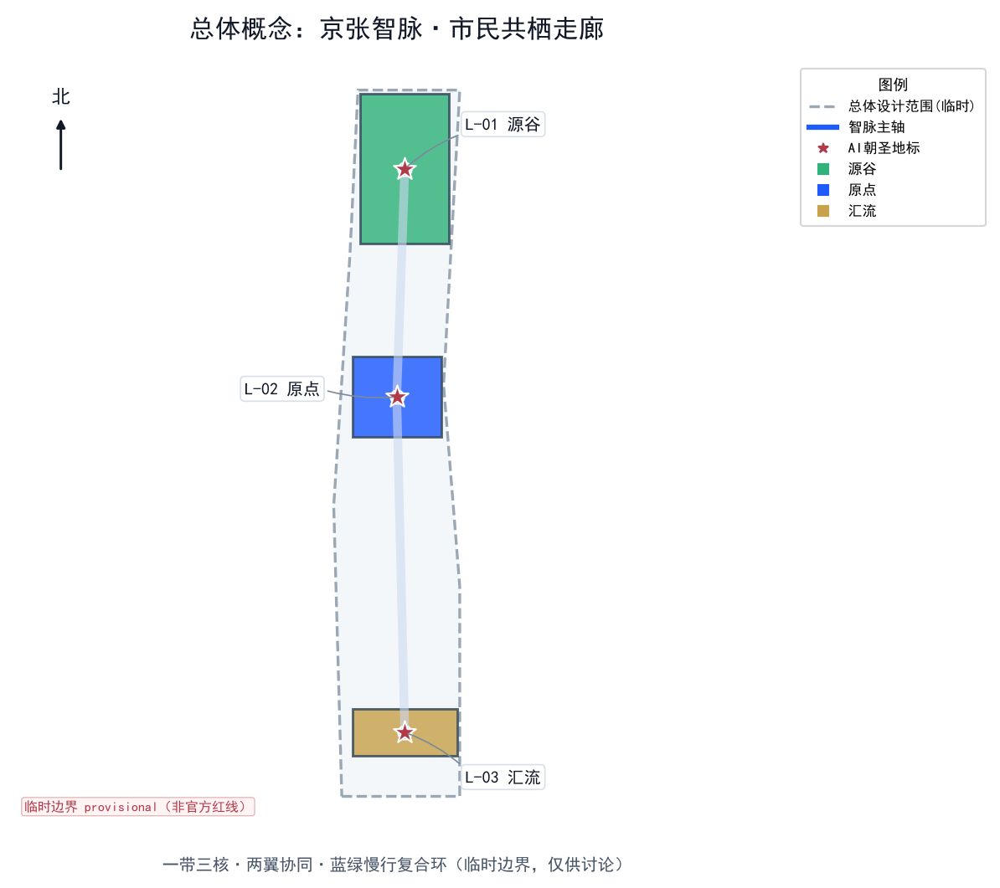
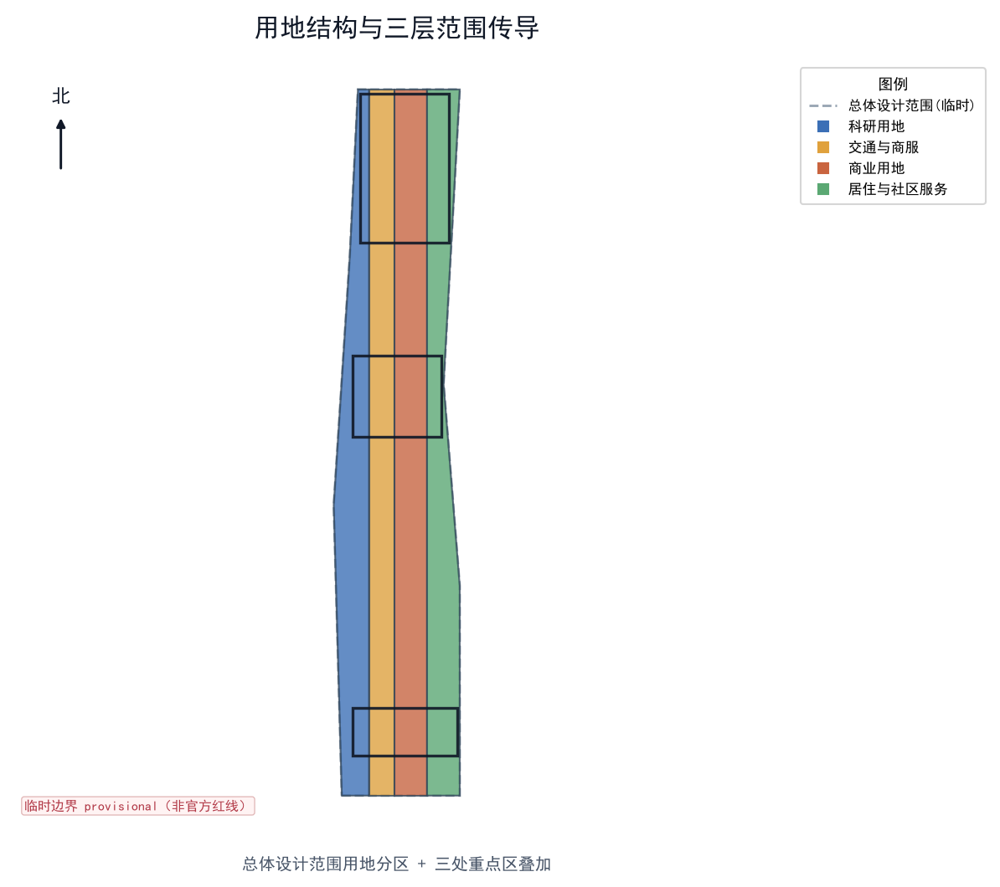
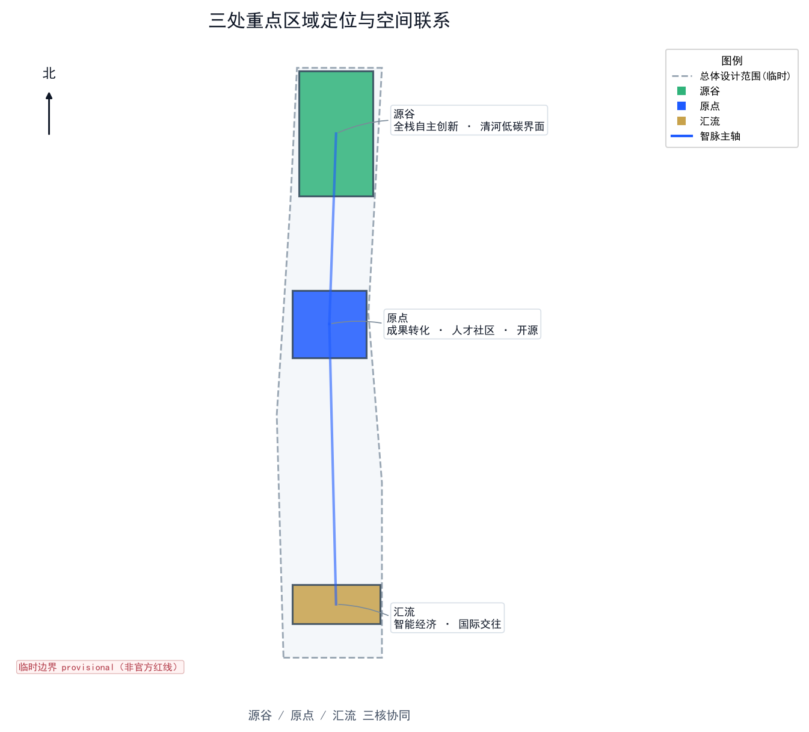
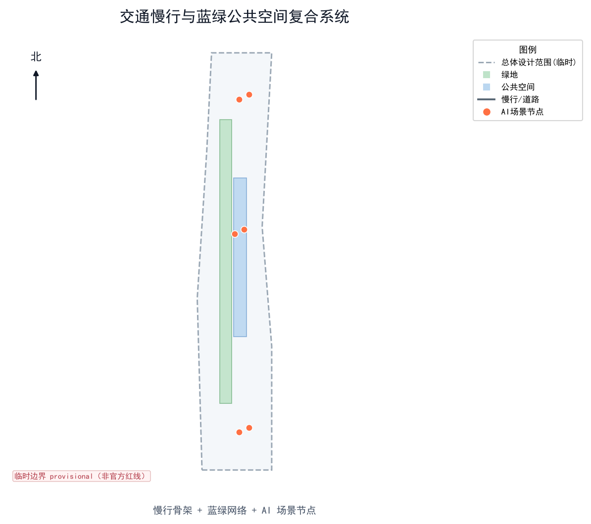
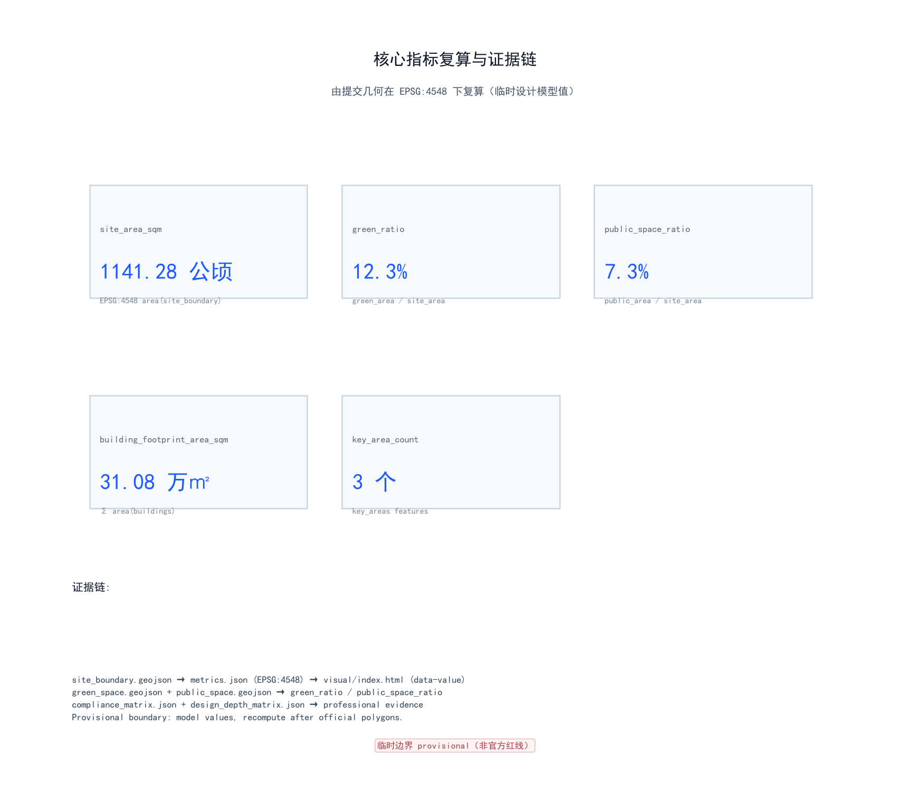

# 百年京张AI创新带：京张智脉·市民共栖型AI活力走廊总体城市设计

## 设计依据与资料清单

本 formal 方案以北京市规划和自然资源委员会海淀分局发布的《百年京张AI创新带城市设计国际方案征集资格预审公告》为第一依据，并以 `brief/site-package/` 中经维护者登记的临时粗略边界、重点区域、枚举、指标和来源清单为机器可读依据 [source:OFFICIAL-ANNOUNCEMENT] [source:SITE-PACKAGE]。AI agent 在生成方案前读取了 `design_brief.json`、`allowed_design_space.json`、`sources.json`、`enums/`、`ranges/`、`schemas/`、`data/source_registry.json` 与 `data/processed/agent_fact_pack.md`，并用 `project_scope_summary.csv`、`agent_task_requirements.csv`、`source_use_matrix.csv`、`missing_data_checklist.csv` 建立了任务、范围、资料用途与缺口清单 [source:PROCESSED-FACT-PACK]。所有设计判断都拆分为可追溯来源、可复算指标、可校验图层和可人工复核假设；公告要求方案达到控制性详细规划的城市设计深度与规划综合实施方案深度，因此文本叙述不能替代 GeoJSON、指标表、A3 文册、A0 展板与 HTML 电子展示成果。

资料登记表的使用边界如下 [source:SOURCE-REGISTRY]：data/source_registry.json 登记了公开、清权与临时资料的用途边界；当前登记摘要为 formal 可用资料 7 条、背景资料 1 条、provisional-only 资料 1 条。agent 不得把 background_only 或 provisional_only 资料升级为 official boundary、法定控规、正式评分依据或政府实施承诺。

`data/processed/agent_fact_pack.md` 是本方案的阅读导航层，不是新的权威来源 [source:PROCESSED-FACT-PACK]。事实判断仍需回到已登记原始材料 [source:OFFICIAL-ANNOUNCEMENT] [source:AGENT-TASKBOOK]；完整来源关系由 `sources.json` 保存。

**边界精度声明（必须醒目）：** 提交包中的 `geometry/site_boundary.geojson` 与 `geometry/key_areas.geojson` 均使用 `brief/site-package/geometry/provisional_boundaries.geojson` 的临时粗略边界，标记为 `provisional_constraint`、`official_boundary=false` [data:geometry/site_boundary.geojson#SITE-001] [data:geometry/key_areas.geojson#PROV-KEY-001]。它们只能用于方案生成、自检、可视化和设计讨论，不能作为 official redline、审批依据、精确面积依据或法定控制结论。该组织方数据缺口本身不阻断内容评分；替换 official polygons 后，site boundary、key areas、land use、roads、green space、public space、buildings、phasing 与 metrics 均需统一重算 [depth:risk_missing_data]。

边界解释可回到总体范围图层和面积复算 [data:geometry/site_boundary.geojson#SITE-001] [metric:site_area_sqm]；三处重点区由独立图层和数量指标核对 [data:geometry/key_areas.geojson#PROV-KEY-001] [metric:key_area_count]。读者可从正文进入证据，但不必先读一串机器编号。

## 三层范围工作框架

方案按公告确定的三个层次组织工作：统筹研究范围关注 43.6 平方公里的 AI 产业生态、战略定位、创新链与未来城市形态；总体设计范围关注 11.4 平方公里京张遗址公园周边 1–2 公里城市地区与产业区，要求形成城市更新总体框架、产业空间布局、交通市政支撑与城市风貌控制；重点区域范围关注 368.4 公顷三处详细设计地区，要求明确功能业态、建筑规模、拆改留分类、公共空间连通与交通组织 [source:OFFICIAL-ANNOUNCEMENT]。三层范围在 `compliance_matrix.json` 中逐条映射，保证公告 1.3、1.4、1.5 与 agent.1–agent.6 的必选任务都有章节、图层、指标、图纸与 HTML 证据。

三层工作框架由 [depth:three_level_scope_framework] 与 [depth:overall_spatial_structure] 约束，空间证据以 [data:geometry/site_boundary.geojson#SITE-001] 与 [data:geometry/key_areas.geojson#PROV-KEY-001] 为准，任务依据以 [standard:PROJECT-OFFICIAL-ANNOUNCEMENT] 为准，范围索引以 [source:PROCESSED-FACT-PACK] 中 `project_scope_summary.csv` 的三层范围表为导航。

### 主概念：京张智脉共生带

本方案提出的总体概念为 **“京张智脉·市民共栖走廊”**（英文 *Jing-Zhang Civic Intelligence Corridor*）。核心意象是把京张铁路这条近代中国第一条自主设计铁路的“动脉”，转译为人工智能时代的“智脉”——一条把历史遗产、高校策源、产业转化、公共生活与国际交往缝合在一起的智能活力走廊 [source:AGENT-TASKBOOK] [depth:overall_spatial_structure]。

空间组织概括为 **“一带三核、两翼协同、蓝绿慢行复合环”**：
- **一带**：以京张遗址公园为历史与公共空间主轴，不额外画出新红线，而是把公告三层范围转译为工作方法。
- **三核**：众智园AI自主创新加速区（全栈自主）、北京AI原点社区（成果转化与人才）、大钟寺AI产业聚集区（智能经济国际交往），分别对应三处重点区域 [data:geometry/key_areas.geojson#PROV-KEY-001] [data:geometry/key_areas.geojson#PROV-KEY-002] [data:geometry/key_areas.geojson#PROV-KEY-003]。
- **两翼**：中关村科技服务翼（要素全球化配置）与小月河场景赋能翼（AI场景赋能与活力城市），支撑三核并向京津冀与未来/怀柔科学城协同 [source:AGENT-TASKBOOK]。
- **复合环**：慢行、绿地、公共空间与活动路线联动，构成日常可体验的网络。

| 层级 | 设计问题 | 方案回答 | 数据落点 |
| --- | --- | --- | --- |
| 统筹研究范围 | AI产业生态和未来城市形态如何组织 | 建立“高校策源—开源协作—企业转化—公共体验—国际传播”的创新链 | compliance_matrix.json、standard_matrix.json |
| 总体设计范围 | 产业空间、城市更新、交通市政和风貌如何落图 | 用地、建筑、道路、绿地、公共空间和分期图层共同表达 | [data:geometry/land_use.geojson#LU-001]、[data:geometry/roads.geojson#ROAD-001] |
| 重点区域范围 | 三处片区如何达到详细设计深度 | 分别提出定位、空间动作、AI场景和实施依赖 | [data:geometry/key_areas.geojson#PROV-KEY-001]、[data:geometry/key_areas.geojson#PROV-KEY-002]、[data:geometry/key_areas.geojson#PROV-KEY-003] |

### 品牌识别与命名体系（agent.1 必答）

为服务“百年京张文化带、都市AI生活体验带、AI融合创新带”的整体辨识度与全球传播力，方案提出一套可延展的命名系统与视觉识别方向 [source:AGENT-TASKBOOK] [standard:PROJECT-AGENT-OPEN-CALL-TASKBOOK]：

- **总体品牌**：京张智脉（英文 *Jing-Zhang Pulse*，副标题 *The Civic AI Corridor*）。“智脉”呼应京张铁路作为近代第一条自主设计铁路的“动脉”，以及人工智能的“神经网络”，强调历史与未来的延续。
- **三核子品牌**：众智园→**源谷 / Origin Valley**（全栈自主策源）；北京AI原点社区→**原点 / The Origin**（成果转化与人才）；大钟寺AI产业聚集区→**汇流 / Confluence**（智能经济国际交往）。
- **两翼子品牌**：中关村科技服务翼→**中枢 / Hub Wing**；小月河场景赋能翼→**涟漪 / Ripple Wing**。
- **Logo 方向（概念，非定稿）**：以“钢轨断面 + 神经网络节点 + 绿脉”三元素融合的极简徽标；主色 智蓝 `#1E5BFF`、园绿 `#2FB37A`、京韵金 `#C8A24B`。标志为自绘矢量，未使用任何受版权或商标保护的图形；最终落地须经专业品牌团队与清权审核。
- **导视与符号**：沿用铁路“里程碑”语汇（0公里原点碑、公里数标识）与神经网络节点图形，形成一带统一的空间叙事与可识别界面 [depth:height_massing_character]。

命名系统不替代法定规划名称，仅作为开放共创的品牌建议，可供专业团队深化 [source:AGENT-TASKBOOK]。

## 统筹研究范围产业与未来城市研究

统筹研究范围的核心任务是构建世界级 AI 创新生态体系 [source:AGENT-TASKBOOK]。方案梳理海淀高校院所、头部企业、算力算法数据要素、孵化平台、上市企业、独角兽与科技服务资源，提出“AI创新链—产业链—人才链—城市服务链”的四链空间协同框架。面向智能体任务书还要求回应“五大功能”（AI全栈自主创新体系、世界级AI创新生态、AI+场景赋能新范式、智能化AI活力城市、AI治理全球话语权）与“三区两翼”协同 [source:AGENT-TASKBOOK] [standard:PROJECT-AGENT-OPEN-CALL-TASKBOOK]。

### 全球AI创新生态案例（agent.2 必答：5–8 个）

方案借鉴 6 个公开、可核查的全球 AI 创新生态案例，提炼对京张可转化的机制 [source:AGENT-TASKBOOK] [depth:three_level_scope_framework]：

| 编号 | 案例 | 核心机制 | 对京张的可转化启示 |
| --- | --- | --- | --- |
| C-01 | 多伦多–蒙特利尔 AI 走廊（Vector Institute + Mila + MaRS） | 高校基础研究策源 + 独立研究院 + 转化平台的“研究—转化”双轮 | 原点社区可复制“高校—研究院—孵化”近校转化链 |
| C-02 | 深圳南山区 AI 产业集群（腾讯、大疆、鹏城实验室） | 龙头民企 + 重大科技基础设施（算力） + 硬件产业链 | 众智园需配置共享算力与测试设施，而非仅招商楼宇 |
| C-03 | 杭州城西科创大走廊（之江实验室、阿里达摩院、未来科技城） | 国家实验室 + 民企研究院 + 人才社区一体化 | 以“实验室—人才特区—生活配套”降低人才迁移成本 |
| C-04 | 新加坡 AI Singapore / Punggol Digital District | 国家 AI 计划 + 智慧园区 + 开放数据集 | 以官方开放数据集驱动场景开放运营 |
| C-05 | 巴黎 Station F + 法兰西岛 AI 生态 | 旗舰孵化器 + 初创密度 + 国际人才签证 | 大钟寺国际路演客厅承载国际交往与招引 |
| C-06 | 埃因霍温 Brainport / High Tech Campus | 产学研紧密耦合 + 硬件创新集群 + 中试平台 | 在京张布局中试与硬件验证场景，补足“从样机到产品” |

上述案例均来自公开资料，未声称与京张存在官方合作；其启示作为概念建议供专业团队深化 [depth:three_level_scope_framework] [source:AGENT-TASKBOOK]。

#### 案例来源、事实范围与复用边界（逐项核验）

为保障案例事实可核查、复用边界清晰，下表对 C-01—C-06 逐项列出公开来源、事实范围、获取时间与复用边界；来源编号在末列标注。全部案例均来自公开资料梳理，未声称与京张存在任何官方合作、隶属或数据交换；机构名称仅用于说明机制，不构成招引或落地承诺。

| 编号 | 来源（公开可核查） | 事实范围（可核验内容） | 获取时间 | 复用边界 | 来源编号 |
| --- | --- | --- | --- | --- | --- |
| C-01 | Vector Institute（vectorinstitute.ai）、Mila（mila.quebec）、MaRS Discovery District（marsdd.com）公开官网与年度报告 | Vector Institute 为 2017 年成立于多伦多的独立非营利 AI 研究院；Mila 为蒙特利尔机器学习研究院；MaRS 为多伦多创新枢纽。均为公开机构事实 | 2026-08 | 仅作"高校—研究院—孵化"机制类比；不声称存在官方合作 | [source:CASE-C01] |
| C-02 | 深圳市南山区政府公开资料、鹏城实验室（pcnicl.ac.cn）、腾讯与大疆公开资料 | 南山区聚集龙头民企，鹏城实验室为国家级实验室（含算力设施）；属公开产业地理常识 | 2026-08 | 仅作"共享算力 + 硬件产业链"机制类比 | [source:CASE-C02] |
| C-03 | 之江实验室、阿里达摩院、杭州未来科技城公开资料 | 国家实验室 + 民企研究院 + 人才社区一体化布局为公开规划事实 | 2026-08 | 仅作"实验室—人才特区—生活配套"机制类比 | [source:CASE-C03] |
| C-04 | AI Singapore（ai.gov.sg）、Punggol Digital District 公开资料 | 新加坡国家 AI 计划与智慧园区、开放数据集为公开政策事实 | 2026-08 | 仅作"开放数据集驱动场景运营"机制类比 | [source:CASE-C04] |
| C-05 | Station F（stationf.co）、法兰西岛大区公开资料 | Station F 为巴黎大型创业孵化器的公开事实；国际人才签证为法国公开政策 | 2026-08 | 仅作"国际交往与招引"机制类比 | [source:CASE-C05] |
| C-06 | Brainport Eindhoven（brainport.nl）、High Tech Campus Eindhoven 公开资料 | 产学研紧密耦合、硬件创新集群与中试平台为公开区域创新事实 | 2026-08 | 仅作"中试与硬件验证"机制类比 | [source:CASE-C06] |

#### 区域创新协同关系（三核两翼 × 区域创新网络）

本方案在"一带三核两翼"基础上，明确与周边区域创新节点的差异化角色、要素流与协同接口。除本方案三核两翼内部关系外，下表所列跨节点合作关系均为概念建议，未经正式确认 [source:AGENT-TASKBOOK]。

| 节点 | 差异化角色 | 要素流（输入 / 输出） | 协同接口 | 合作状态 |
| --- | --- | --- | --- | --- |
| 众智园·源谷（本方案三核之一） | 全栈自主策源加速 | 输入：高校成果、开源模型；输出：自主技术、标准 | 自有关键区 | 本方案内部 |
| 北京AI原点社区·原点（本方案三核之一） | 成果转化与人才社区 | 输入：研究成果、人才；输出：孵化企业、社区贡献 | 自有关键区 | 本方案内部 |
| 大钟寺·汇流（本方案三核之一） | 智能经济国际交往 | 输入：国际资源、资本；输出：路演、品牌 | 自有关键区 | 本方案内部 |
| 中关村科技服务翼·中枢 | 要素全球化配置 | 输入 / 输出：资本、服务、全球网络 | 中关村创新网络 | 概念建议 |
| 小月河场景赋能翼·涟漪 | AI 场景赋能与活力城市 | 输入 / 输出：场景、数据、公共体验 | 小月河公共空间 | 概念建议 |
| 北纬社区（走廊北端社区带，含清河—北沙滩—西三旗一带人才社区；概念建议节点） | 人才居住与近校生活配套 | 输入：居住与生活服务；输出：人才留存、近校转化 | 社区—校区慢行缝合 | 概念建议 |
| 未来科学城（昌平） | 大科学装置与能源 / 先进制造研究 | 输入：应用场景；输出：装置与研究设施 | 场景需求对接 | 概念建议 |
| 怀柔科学城 | 综合性国家科学中心 / 基础研究 | 输入：AI 方法；输出：基础研究成果 | 基础研究协作 | 概念建议 |
| 经开区（亦庄） | 智能制造与产业转化承载 | 输入：AI 技术；输出：制造产能、产品 | 中试—量产接口 | 概念建议 |
| 京津冀（区域协同） | 区域产业链与场景市场 | 输入 / 输出：产业链、场景、市场 | 区域协同接口 | 概念建议 |

> 说明：上表"合作状态"除本方案三核两翼内部关系外，均为概念建议，不代表已签署协议或获得官方确认；具体协同需在正式规划与招商阶段另行论证 [source:AGENT-TASKBOOK]。

未来城市形态研究回答人工智能如何改变工作、生活、社交、学习、交通与公共服务。方案把 AI 交通系统、连续绿色空间、创新服务设施与国际化生活工作氛围落实为可定位的功能区、节点、廊道与场景，而非泛泛描述技术愿景 [depth:overall_spatial_structure]。

## 总体设计范围城市更新与控规深度城市设计

总体设计范围要求达到控制性详细规划的城市设计深度 [standard:MOHURD-CONTROL-DETAILED-PLANNING]。方案提出城市更新总体空间结构、低效空间识别、更新项目清单、实施政策建议、产业功能比例、空间组织模式、建筑总规模与综合承载能力评估 [depth:land_use_layout] [depth:development_intensity_controls]。

本节按控规深度拆成可审查对象：[data:geometry/land_use.geojson#LU-001] 表达用地结构，[data:geometry/buildings.geojson#BLDG-001] 表达建筑基底，[data:geometry/roads.geojson#ROAD-001] 表达交通组织，[metric:building_footprint_area_sqm] 复核建筑基底面积 [depth:height_massing_character]。

总体设计还支撑交通、轨道、市政与配套设施 [depth:traffic_rail_slow_parking] [depth:municipal_new_infrastructure]。涉及建筑高度、开发强度、道路红线、退线与设施标准的内容，若尚无官方控制条件，均写为“待正式控规条件确认”，不以 agent 推测值冒充审定指标 [depth:development_intensity_controls]。

## 重点区域详细设计

重点区域详细设计是必选项，三处片区必须在 `geometry/key_areas.geojson` 中出现 [data:geometry/key_areas.geojson#PROV-KEY-001] [data:geometry/key_areas.geojson#PROV-KEY-002] [data:geometry/key_areas.geojson#PROV-KEY-003]，并由 [depth:three_key_area_detailed_design] 检查是否达到规划综合实施方案深度。若只描述“打造示范区”而无功能、建筑、交通、公共空间与实施项目证据，视为未完成。

| 重点片区 | 子品牌 | 设计定位 | 空间动作 | AI产业与运营场景 | 证据引用 |
| --- | --- | --- | --- | --- | --- |
| 众智园AI自主创新加速区 | **源谷 / Origin Valley** | 花园型全栈自主创新街区 | 强化清河界面、产业展示、低碳创新交往、对外交通；以绿色空间承载开放测试与标准治理展示 | 自主模型测试、标准制定工作坊、安全治理展示、低碳算力体验 | [data:geometry/key_areas.geojson#PROV-KEY-001]、[depth:three_key_area_detailed_design] |
| 北京AI原点社区 | **原点 / The Origin** | 近校型成果转化与人才社区 | 组织校区—园区—街区慢行缝合；补足成果发布、人才服务、居住生活与开源协作空间 | 开源社区、成果发布、人才特区服务、近校孵化 | [data:geometry/key_areas.geojson#PROV-KEY-002]、[source:AGENT-TASKBOOK] |
| 大钟寺AI产业聚集区 | **汇流 / Confluence** | 城市型智能经济与国际交往街区 | 围绕大钟寺站一体化、四象限步行连通、商业服务与重点企业公共环境更新 | 智能体与智能终端展示、内容消费、数据要素与国际路演 | [data:geometry/key_areas.geojson#PROV-KEY-003]、[metric:key_area_count] |

三处重点区均按“概念建议 / 参考方案 / 可供专业团队深化研究”表述，不构成政府审定结论 [source:AGENT-TASKBOOK]。

### AI 朝圣地标与荣誉展示体系（agent.4 必答：不少于 3 个）

为把“全球AI创新朝圣地”目标转化为可体验、可传播的空间对象，方案提出 3 处 AI 朝圣地标与一套荣誉展示体系 [source:AGENT-TASKBOOK] [depth:three_key_area_detailed_design]：

| 编号 | 朝圣地标 | 位置 | 设计内容 | 荣誉/展示机制 |
| --- | --- | --- | --- | --- |
| L-01 | 京张零公里·AI原点碑 | 清华园站遗址（原点社区北端） | 以铁路“0公里”语汇标记一带起点，设双语解说与打卡点 | 年度AI贡献榜在此发布，记录开源与个人贡献 |
| L-02 | 开源贡献长墙 | 北京AI原点社区 | 公共代码墙与贡献者姓名/项目滚动展示 | 实时累计社区贡献，支持“朝圣护照”盖章 |
| L-03 | 全球AI创新指数钟塔 | 大钟寺AI产业聚集区 | 公共数据装置，可视化开放创新指标 | 年度指标发布与城市级创新叙事载体 |

**荣誉展示体系**：① 年度 AI 贡献榜（企业、团队、个人）；② 朝圣护照（Pilgrimage Passport），在 L-01–L-03 与重点场景节点盖章打卡，串联“遗址文化—开源社区—产业展示—国际路演”体验路线；③ 公共空间组件库（座椅、导视、照明、展牌）统一风格，供各专业团队按需深化 [depth:blue_green_public_space]。所有地标与展示内容均为概念建议，不涉及文保或权属空间的擅自改造 [depth:risk_missing_data]。

## AI 创新生态、人才画像与 AI+ 场景

方案建立面向 AI 人才与企业的空间需求画像，覆盖研发办公、开源协作、成果发布、企业服务、人才居住、社交学习、消费生活、运动休闲与国际交往 [depth:three_level_scope_framework]。AI+ 场景围绕公告提出的交通、服务、消费、医疗、教育、法律、生活服务方向，形成产业发展场景与 AI 赋能城市功能场景；每个场景说明服务对象、空间位置、数据来源、隐私边界、人工复核机制与运营主体 [source:AGENT-TASKBOOK] [depth:three_key_area_detailed_design]。

AI 场景落到空间与治理边界：公共空间场景引用 [data:geometry/public_space.geojson#PUBLIC-001]，慢行与交通场景引用 [data:geometry/roads.geojson#ROAD-001]，开放空间场景引用 [data:geometry/green_space.geojson#GREEN-001] 与 [metric:public_space_ratio]、[metric:green_ratio]。上述空间证据共同支撑蓝绿公共空间的设计深度 [depth:blue_green_public_space]。

### 用户画像（agent.3 必答：不少于 5 类）

| 用户画像 | 典型需求 | 空间响应 | 隐私与人工复核边界 |
| --- | --- | --- | --- |
| 开源开发者 | 发布、协作、测试、社区声誉 | 原点社区开源发布厅、公共代码墙、夜间协作空间 | 不采集个人行为轨迹；活动数据仅做聚合统计 |
| 初创团队 | 低成本办公、算力入口、产品试验场 | 众智园共享测试场、端侧算力服务点、标准治理咨询 | 算力与数据服务需另行授权 |
| 头部企业访客 | 展示、商务、国际接待、人才招聘 | 大钟寺国际路演客厅、轨道站点接驳、重点企业周边公共空间 | 企业标识与案例须清权 |
| 周边居民 | 通勤、休闲、社区服务、低扰动更新 | 京张遗址公园慢行环、社区服务嵌入、夜间照明与活动分级 | 不将居民画像用于商业推荐 |
| 高校师生 | 成果转化、跨校协作、日常慢行 | 校区—园区慢行缝合、成果转化驿站、AI教育体验点 | 校园数据与科研成果需授权 |
| 国际访客 / 朝圣者 | 参访、打卡、学习、传播 | AI朝圣地标、朝圣护照、双语导视 | 访客数据匿名化，仅用于客流统计 |

### AI 场景卡（agent.3 必答：不少于 10 张）

| 编号 | 场景卡 | 空间载体 | 设计说明 | 类别 |
| --- | --- | --- | --- | --- |
| S-01 | 开源发布厅 | 北京AI原点社区 | 面向高校、开源社区与初创团队，提供成果发布、代码贡献展示与小型路演空间 | 体验场景 |
| S-02 | 安全治理沙盒 | 众智园（源谷） | 把标准制定、安全评测、模型红队测试转译为可参观、可预约、可监管的展示与协作节点 | **产业测试验证场景** |
| S-03 | 端侧算力与机器人验证场 | 总体设计范围节点（原点社区） | 面向端侧智能与机器人的中试/验证，结合公共服务与低碳能源策略，作为新型基础设施原型 | **产业测试验证场景** |
| S-04 | AI慢行导航 | 京张遗址公园活力带 | 用可解释导视与低侵入传感识别慢行断点、拥挤节点与无障碍需求 | 体验场景 |
| S-05 | 大钟寺国际路演客厅 | 大钟寺AI产业聚集区 | 服务智能体、智能终端与内容消费企业的展示、洽谈、媒体发布与国际交流 | 体验场景 |
| S-06 | 清河低碳创新廊 | 众智园临清河界面 | 把绿色空间、雨洪、步行骑行与AI展示结合，作为园区公共客厅 | 体验场景 |
| S-07 | 近校成果转化街 | 北京AI原点社区 | 面向高校成果转化，组织孵化、展示、法务、知识产权与投融资服务 | 体验场景 |
| S-08 | 数据要素会客厅 | 大钟寺片区 | 以合规、授权、可审计为前提，展示数据要素与数字资产流通的城市服务界面 | 体验场景 |
| S-09 | AI生活服务样板街 | 社区与商业交汇处 | 把医疗、教育、法律、生活服务等AI+场景落到可运营的小尺度街区空间 | 体验场景 |
| S-10 | 全球AI活动周路线 | 一带公共空间系统 | 从遗址文化、开源社区、产业展示到国际路演的可步行、可传播体验路线 | 体验场景 |
| S-11 | AI医疗影像辅助验证诊室 | 社区公共服务节点 | 以医生复核为前提的医学影像辅助诊断验证场景，仅作科研/体验，不作独立诊断结论 | **产业测试验证场景** |
| S-12 | 智慧无障碍伴行 | 轨道站点与慢行系统 | 为老人、儿童与残障者提供可解释的路径与设施引导，全程人工可介入 | 体验场景 |

其中 **S-02、S-03、S-11 为明确的产业测试验证场景**（≥3），均表述为“测试/验证/体验”而非已批准运营；其余为可体验、可展示、可推广的 AI 城市场景 [depth:three_key_area_detailed_design] [source:AGENT-TASKBOOK]。

agent 生成的 AI 治理建议遵守数据最小化、公开来源、可解释与人工复核原则。城市智能体可辅助识别慢行断点、公共空间热力、设施维护、企业服务需求与活动安全风险，但不能替代规划审批、不能输出未经授权的个人画像、不能声称获得官方实施承诺 [depth:risk_missing_data]。

## 用地、建筑规模与拆改留方案

用地方案依据国土空间调查、规划、用途管制分类等公开标准表达，形成完整、闭合、无缝的用地分区 [standard:MNR-LAND-USE-CLASSIFICATION-GUIDE]。建筑方案区分保留、改造、更新、新建或待确认对象，明确建筑基底、功能、规模、风貌、屋顶、体量与高度控制的建议层级 [depth:retain_renovate_demolish] [depth:height_massing_character]。

用地分类依据 [standard:MNR-LAND-USE-CLASSIFICATION-GUIDE]，建筑高度、体量、界面与风貌控制由 [depth:height_massing_character] 管理，拆改留方法由 [depth:retain_renovate_demolish] 管理。用地与建筑的主要证据是 [data:geometry/land_use.geojson#LU-001]、[data:geometry/buildings.geojson#BLDG-001] 与 [metric:building_footprint_area_sqm]。

建筑规模和强度指标必须与 `metrics.json` 和图层一致。若总建筑规模、容积率、建筑高度、建筑密度、绿地率、退线与建筑控制线缺少官方条件，统一使用 `status=unknown`，并在 `reason` / `assumptions` 中说明待补条件、当前假设与正式数据到位后的复算路径，不用固定数值制造精确感 [depth:development_intensity_controls]。

## 交通、轨道、市政与公共服务设施

交通方案回应公告对轨道站点一体化、道路微循环、慢行断点、对外交通、停车、非机动车停放与绿色交通系统的要求 [depth:traffic_rail_slow_parking]。重点覆盖北五环、京张遗址公园跨环路节点、五道口、清华东路西口、大钟寺站及重点企业周边交通联系。道路与慢行图层保持在提交边界内，并与公共空间、绿地、产业节点和重点片区相互校核；若提交边界为 provisional，交通结论仅作临时设计讨论 [data:geometry/roads.geojson#ROAD-001]。

交通与市政专业深度分别由 [depth:traffic_rail_slow_parking] 与 [depth:municipal_new_infrastructure] 约束；图层证据引用 [data:geometry/roads.geojson#ROAD-001]、[data:geometry/public_space.geojson#PUBLIC-001] 与 [depth:risk_missing_data]。当道路红线、管线、消防与市政条件缺失时，通过 assumptions 说明待补，而非把策略写成审定条件 [depth:risk_missing_data]。

市政与公共服务设施覆盖 AI 产业服务设施、创新服务平台、人才生活服务设施、新型基础设施、分布式能源、端侧算力与传统市政设施融合，说明设施标准、空间布局、服务半径、运营模式与分期实施逻辑 [depth:municipal_new_infrastructure]。

## 蓝绿空间、公共空间与城市风貌

蓝绿空间方案以京张遗址公园活力带为骨架，统筹清河、小月河、周边高校、企业、社区出行需求，提出南北贯通、东西连通的步道、骑行道与绿色空间体系 [depth:blue_green_public_space]。识别慢行断点、上跨环路节点、公园南端与北端景观节点，提出停车、体育、创新交往、科技测试、应用展示与公共服务复合利用策略 [data:geometry/green_space.geojson#GREEN-001] [data:geometry/public_space.geojson#PUBLIC-001]。

蓝绿公共空间由设计深度项与绿地、公共空间图层共同校核 [depth:blue_green_public_space] [data:geometry/green_space.geojson#GREEN-001] [data:geometry/public_space.geojson#PUBLIC-001]；绿地与公共空间比例在正文解释设计意义，完整复算保存在 `metrics.json` [metric:green_ratio] [metric:public_space_ratio]；城市风貌、公共空间与建筑控制的统筹回到专业标准矩阵 [standard:MOHURD-URBAN-DESIGN-MEASURES]。

城市风貌融合京张铁路历史文化、中关村创新文化与 AI 创新文化，利用清华园火车站、北影等文化资源，提出城市基调、建筑风貌、屋顶形态、体量、界面与公共艺术引导 [depth:height_massing_character] [source:AGENT-TASKBOOK]。所有品牌、字体、图像、肖像与企业标识都必须有清权来源；风貌控制分清官方管控、设计建议与待确认条件，严禁在没有文保或控规依据时给出伪精确控制线 [depth:risk_missing_data]。

### 百年京张—中关村—AI 新文化融合叙事（agent.5 必答）

方案构建“三段时空叠合”的文化叙事主线，把场地从铁路遗产、创新街区到智能未来的脉络转译为可阅读的空间故事线 [source:AGENT-TASKBOOK] [depth:height_massing_character]：

1. **京张铁路历史文化（1909 詹天佑）**：以清华园火车站、铁路线性遗产与“自主建造”精神为起点，保留并活化遗址界面，作为一带的历史根脉。
2. **中关村创新文化（1980s 电子一条街至今）**：把“敢闯敢试、产学研一体”的创新基因延续到 AI 时代，以原点社区承载成果转化叙事。
3. **AI 新文化**：以开放、协作、可信、向善为价值内核，把算法伦理、开源贡献与公共福祉写入空间符号与活动仪式。

空间文化系统沿走廊布置“里程碑—节点—广场”三级叙事载体：里程碑标记历史与里程，节点承载场景体验，广场承载公共仪式与年度活动；导视、标识与符号系统统一使用自绘铁路语汇 + 神经网络图形，避免与一带整体 Logo 系统混淆 [standard:MOHURD-URBAN-DESIGN-MEASURES]。国际传播叙事以双语门户、全球媒体伙伴与朝圣护照承载，区分“投稿/评审/入选/落地”状态，不把概念方案描述为已获批准或已建成 [source:AGENT-TASKBOOK]。

## 更新项目清单、实施政策与分期计划

实施方案形成可审查的更新项目清单，说明项目位置、类型、功能、责任主体、依赖条件、实施阶段、风险与评估指标 [depth:renewal_project_list]。政策建议覆盖城市更新统筹实施、空间供给、运营机制、产业服务、公共参与、数据治理与产权协同 [depth:phasing_implementation]。`geometry/phasing.geojson` 表达分期范围，[data:geometry/phasing.geojson#PHASE-001] 为分期空间证据。

| 项目编号 | 项目名称 | 类型 | 主要依赖 | 证据引用 |
| --- | --- | --- | --- | --- |
| JZ-01 | 京张遗址公园慢行断点缝合 | 公共空间/交通 | 道路红线、桥下空间、交通组织复核 | [data:geometry/roads.geojson#ROAD-001] |
| JZ-02 | 众智园清河创新界面 | 蓝绿空间/产业展示 | 河道蓝线、生态和防洪条件 | [data:geometry/green_space.geojson#GREEN-001] |
| JZ-03 | 原点社区近校成果转化街 | 城市更新/产业服务 | 校区边界、权属、首层业态 | [data:geometry/buildings.geojson#BLDG-001] |
| JZ-04 | 大钟寺站四象限步行连通 | 轨道一体化/慢行 | 轨道站点、道路交叉口、市政管线 | [data:geometry/public_space.geojson#PUBLIC-001] |
| JZ-05 | AI公共服务与端侧算力节点 | 新基建/公共服务 | 能源、算力、安全和运营主体 | [depth:risk_missing_data] |
| JZ-06 | 全球AI活动周公共路线 | 运营/品牌 | 公共空间许可、活动安全、版权清权 | [data:geometry/phasing.geojson#PHASE-001] |

分期区分“100 天征集设计周期”与“城市更新实施分期”：近期试点（轻量设施、运营活动、服务平台先行）、中期更新（待控规/市政/交通/权属确认后推进）、长期治理（年度活动、社区运营、品牌资产沉淀）[depth:phasing_implementation]。

## 全球AI创新活动体系与长期运营设计（agent.6 必答）

为把“全球AI创新活动体系与长期运营”从口号转为机制，方案提出可运营的年度活动体系、开发者社区运营、场景开放运营与国际传播招引转化路径 [source:AGENT-TASKBOOK] [depth:phasing_implementation]：

- **年度活动体系**：① 全球AI活动周（秋季，串联 L-01–L-03 与重点场景）；② 京张开源黑客松（季度）；③ AI朝圣路线开放日（月度）；④ 年度AI贡献榜发布（年底，于 L-01 原点碑）。
- **品牌与传播视觉系统**：沿用“京张智脉”主品牌与三核两翼子品牌，统一活动主视觉、双语物料与社交传播模板；所有素材自绘或清权，区分投稿/评审/入选/落地状态 [standard:PROJECT-AGENT-OPEN-CALL-TASKBOOK]。
- **开发者社区运营**：成立线上+线下“京张AI开发者公会”，以贡献积分、开源榜单与朝圣护照沉淀长期社区资产；社区治理遵循数据最小化与人工复核原则。
- **AI 场景开放运营**：搭建“城市AI场景开放平台”，企业/团队可申请在指定公共空间部署验证型场景（含 S-02/S-03/S-11 等测试验证场景），须经合规、授权与安全审核，且仅为测试/体验而非已批准运营 [depth:three_key_area_detailed_design]。
- **公共体验与地标运营**：以 L-01–L-03 朝圣地标与京张遗址公园活力带组织可步行、可传播体验路线，配套双语导视与无障碍服务。
- **国际传播与招引转化**：双语门户 + 全球媒体伙伴 + 朝圣护照承载国际传播；构建“人才→企业→资本→场景”转化闭环，明确每类主体的后续转化路径与责任边界，不把招商、政策、资金写成确定承诺 [depth:three_level_scope_framework]。

上述活动与运营均为概念建议 / 参考方案，不构成已确定政府安排；实际落地须经专业运营团队与相关部门确认 [source:AGENT-TASKBOOK]。

## 指标体系、面积复算与合规矩阵

指标体系包含总体设计范围面积、重点区域面积、绿地与公共空间比例、建筑基底、更新项目数量、AI场景节点、慢行连通指标、产业空间指标、人才服务指标与自检状态 [depth:metrics_recalculation]。所有 known 指标从 GeoJSON 或可信来源复算；unknown 指标给出原因与正式提交前置条件。`scripts/spatial_review.py` 与 `scripts/visual_review.py` 的结果是 formal 自检的重要证据 [metric:site_area_sqm] [metric:green_ratio] [metric:public_space_ratio]。

合规矩阵是任务响应性的主控文件。每条公告任务与 agent_taskbook 任务对应到报告章节、图层、指标、图纸、HTML 页面、来源、假设与自检项 [depth:metrics_recalculation]。未能覆盖公告 1.3、1.4、1.5 或 agent.1–agent.6 的任一必选任务，方案不得进入 formal professional scoring。

指标分三类：第一类可由提交几何直接复算（边界面积、绿地比例、公共空间比例、建筑基底、分期面积）；第二类需官方控规或任务书附件支撑（容积率、建筑高度、建筑密度、退线、道路红线、设施标准）；第三类需运营或产业数据持续校准（AI创新指数、人才密度、产业服务满意度、慢行可达性、活动参与度、场景使用频次）。三类分别进入 `metrics.json`、`assumptions.json` 与 `compliance_matrix.json`，避免把运营愿景误写成审定规划条件 [depth:metrics_recalculation]。

## 风险、版权与合规说明

**边界与数据边界：** 全部空间落地建议表述为“概念建议 / 参考方案 / 可供专业团队深化研究”，不替代正式规划，不构成政府审定结论 [source:AGENT-TASKBOOK]。不编造企业名单、投资额、产值或财政承诺；不把内部数据或未经核实政策写成事实；不把产业招商、资金支持或政策安排写成已确定事项 [depth:risk_missing_data]。

**公开合规性：** 所有图片、图纸、图标、数据与代码资产在 `sources.json` 与 `report/copyright_statement.md` 中说明来源、许可与授权状态。品牌、字体、图像、肖像与企业标识均使用清权或自绘资源，未使用未经授权的商标、字体、论文图像或版权材料 [depth:risk_missing_data]。

**隐私与人工复核：** 城市智能体仅辅助识别公共空间与设施问题，不输出未经授权的个人画像，不声称获得官方实施承诺；涉及个人数据均匿名化、聚合化并保留人工复核入口 [depth:three_key_area_detailed_design]。

**待补资料（数据缺口）：** `missing_data_checklist.csv` 列出的 official boundary、key area、控规、道路、地块、建筑、市政、文保与公共服务缺口，必须进入 `assumptions.json`、自检与正文风险章节；任何缺少官方控规、道路红线、权属、市政、消防或文保条件的结论，都降级为待确认事项 [depth:risk_missing_data] [depth:risk_missing_data]。

本方案不声称官方批准、审定控规、最终土地权属、最终建设规模或保证实施。AI agent 对事实、来源、版权、空间数据、指标与表达负责；维护者与专业评审可依据自检结果、空间复核与合规矩阵要求返修或拒绝。

## 参考资料

- brief/public-brief.md
- brief/site-package/design_brief.json
- brief/site-package/allowed_design_space.json
- brief/site-package/enums/
- brief/site-package/ranges/planning_limits.json
- data/processed/agent_fact_pack.md
- data/processed/project_scope_summary.csv
- data/processed/agent_task_requirements.csv
- data/processed/source_use_matrix.csv
- data/processed/missing_data_checklist.csv
- 完整机器索引：见 `sources.json`、`metrics.json`、`compliance_matrix.json`、`standard_matrix.json` 与 `design_depth_matrix.json`
- 本节书目入口依据场地包登记，完整出处和许可见结构化来源清单 [source:SITE-PACKAGE]
