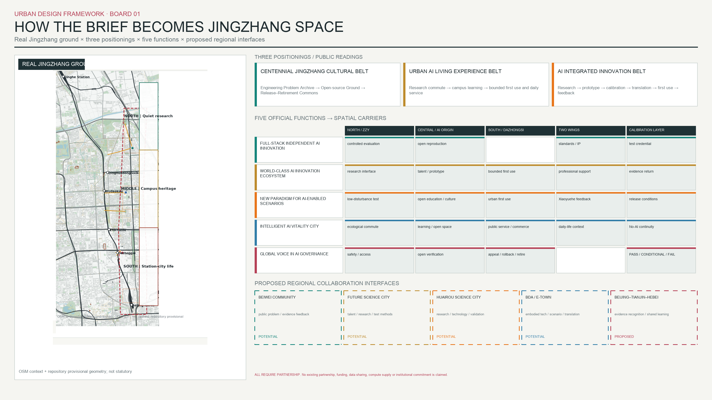
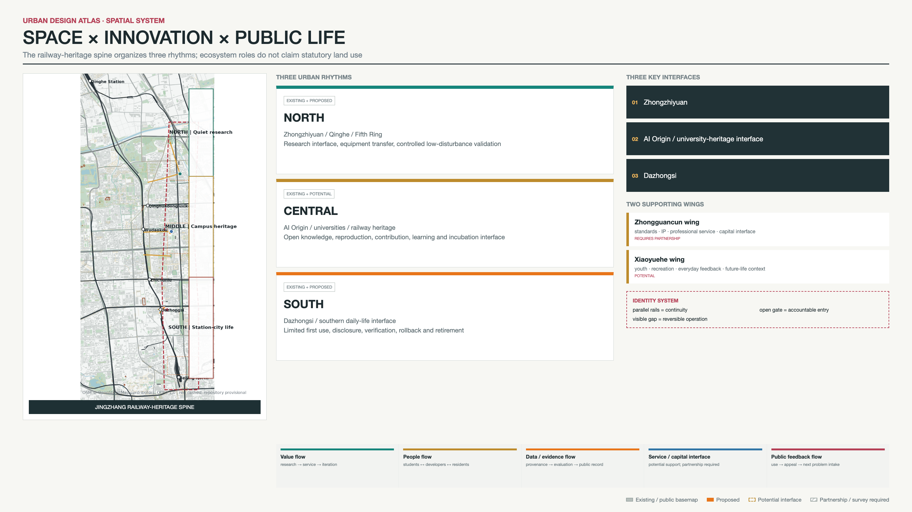
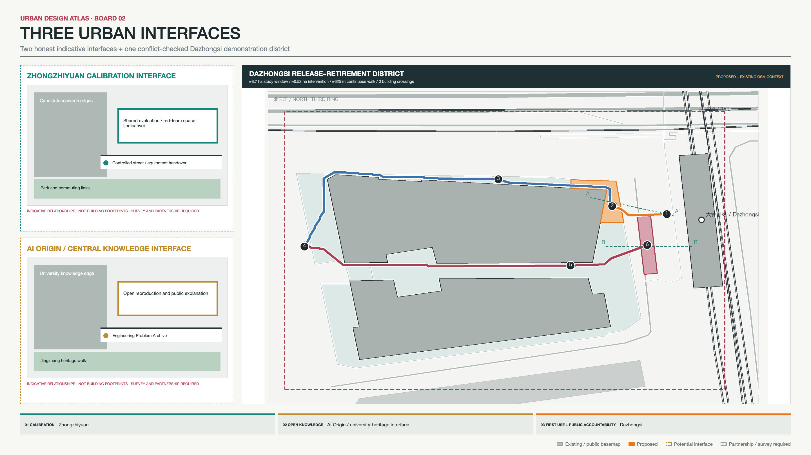
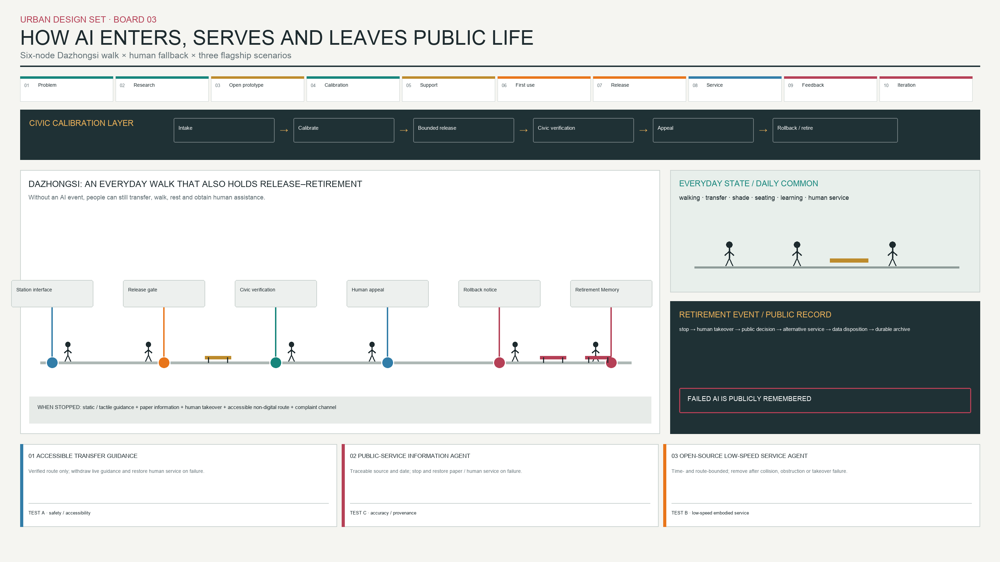
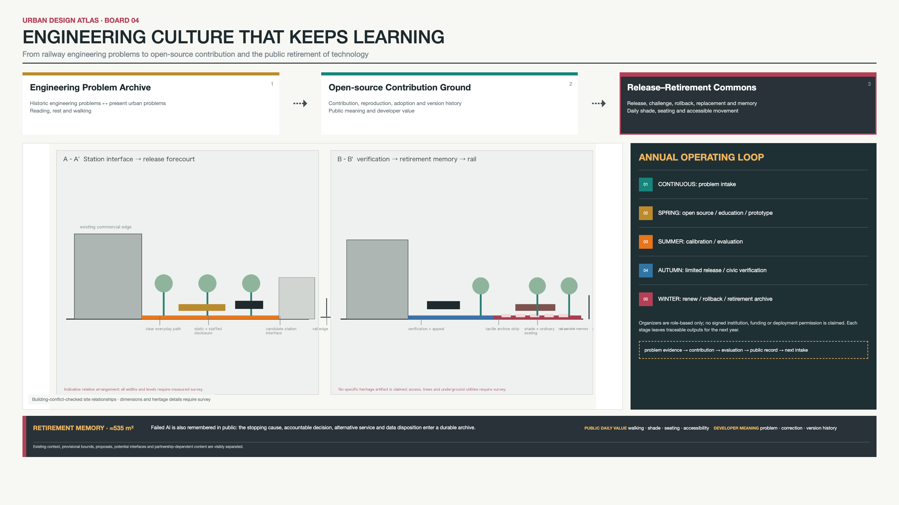

# Jingzhang Civic Calibration Grounds

**Jingzhang AI Innovation Belt × Civic Calibration Layer**

Jingzhang is an urban belt that turns a century of engineering culture into an AI innovation ecosystem. Real urban problems enter university and research networks, pass through open source, prototyping, calibration and incubation interfaces, receive bounded first use at Dazhongsi, and return through public feedback for iteration or retirement. The Civic Calibration Grounds do not substitute for the whole belt; they provide its shared admission, verification and exit layer for public life. [standard:PROJECT-AGENT-OPEN-CALL-TASKBOOK] [data:visual/assets/innovation_belt_program.json] [depth:overall_spatial_structure]

The spatial design still works without AI. The north links Qinghe, the North Fifth Ring, innovation sites and low-disturbance research commutes. The centre links universities, AI Origin, Jingzhang heritage and open knowledge. The south links everyday station-city life at Dazhongsi, commercial-public interfaces and the direction of Beijing North Station. Public space first supports walking, rest, learning, interchange and neighbourhood life, then accommodates innovation display and civic verification. [source:JZ-PARK-PHASE2-PLAN] [source:OSM-BBBIKE-BEIJING-20260808]

## Design Basis and Source List

The formal basis comprises the official announcement, site package, Agent Taskbook, source registry, schemas, professional-standard snapshots and current validation scripts. Site understanding uses government public material and the 8 August 2026 OpenStreetMap Beijing extract. A 15 August 2026 OSM Map API window checks the Dazhongsi station reference, roads, commercial pedestrian precinct and selected building context. OSM is attributed under ODbL 1.0 and remains public context rather than an official survey, road redline, cadastre or complete building inventory. [source:SITE-PACKAGE] [source:OSM-BBBIKE-BEIJING-20260808] [source:OSM-API-DAZHONGSI-20260815]

The proposal selects eight global innovation-ecosystem precedents from governments, universities, research institutes or official project sites. It transfers principles rather than brands, funding, institutions, tenancy systems, scale or performance. The ecosystem, operating seasons, capital interfaces and test protocols are design proposals; no signed partnership, data authorization, site permission or measured performance is claimed. [data:visual/assets/innovation_belt_program.json] [assumption:A-INNOVATION-ECOSYSTEM-001] [assumption:A-EVALUATION-PROTOCOL-001]

Evidence remains classified as EXISTING, PROPOSED, POTENTIAL, PROVISIONAL, REQUIRES PARTNERSHIP, DATA GAP, UNKNOWN or CANNOT VERIFY. Where statutory planning, road redlines, ownership, building height and condition, utilities, heritage controls, station engineering or footfall surveys are unavailable, the proposal records a data pathway rather than inferring a conclusion from a diagram. [assumption:A-CONTROLS-001] [depth:risk_missing_data]

## Three-Level Scope Framework

The 43.6 km² figure is the announced coordinated research scope for universities, industry, ecology, transport, two support wings and regional collaboration. The approximately 11.4 km² figure is the projected area of the repository-provisional polygon used for GeoJSON clipping, topology and machine recalculation. The three key-area identities come from the Taskbook, but their polygons remain provisional. Neither scope is a substitute for the other or a statutory redline. [source:OFFICIAL-ANNOUNCEMENT] [metric:site_area_sqm] [assumption:A-SCOPE-436-001]

The research level reads Jingzhang in relation to Qinghe, the North Fifth Ring, Wudaokou, university and research districts, the Zhongguancun service network, Dazhongsi and Beijing North Station. The overall-design level organizes the railway-heritage spine, three urban rhythms, three key areas and two wings. The key-area level proposes survey-dependent interfaces at Zhongzhiyuan and AI Origin while retaining the approximately 8.7 ha conflict-checked Dazhongsi demonstration district. The middle repository polygon and the OSM-mapped park are offset by about 0.4 km; drawings show both rather than hiding the conflict. [data:geometry/site_boundary.geojson#SITE-001] [data:geometry/key_areas.geojson] [assumption:A-BOUNDARY-MISMATCH-001]

## Coordinated Research Area: Industry and Future City Research

### Global precedents: from a park to an operating ecosystem

| Case | Observable mechanism | Jingzhang translation | What is not copied |
|---|---|---|---|
| Singapore one-north / LaunchPad | Modular space, incubators, investor interfaces, testbeds and ground-floor showcases sit together | Connect prototypes, first use and community through small adaptable interfaces | Tenancy, company counts, funding and operation |
| Paris-Saclay | Universities, research, innovation places, industry and an annual event are coordinated | Operate the belt through a recurring cycle and cross-place network | Statutory tools, protected-area system, brand and performance |
| Kendall Square | Research, startups, housing, retail, culture and open space mix | Put innovation within ordinary urban life and short walks | Ownership, development ratios and MIT commitments |
| Toronto / Vector Institute | Research, talent, trustworthy adoption and industry collaboration form one system | Make both talent and adoption pathways explicit | Funding, partners and programme rules |
| Montréal / Mila | Open science, transfer, startups, ethics and public policy coexist | Link open contribution with public responsibility | Institutional identity, scale and partner network |
| London Knowledge Quarter | Independent academic, cultural and technology anchors form a station-centred network | Connect institutions through heritage, parks and public realm | Membership, governance body and one-mile radius |
| Seoul AI Hub | Education, incubation, compute, PoC and global collaboration are staged | Separate controlled evaluation, incubation and urban first use | Subsidies, compute allocation, exceptions and operating consortium |
| Helsinki Maria 01 | An old hospital becomes a startup community linked to city services | Prioritize adaptive use, programme turnover and durable public realm | Tenancy, ownership, finance and schedule |

Together, these cases show that an innovation ecosystem needs research anchors, short exchanges, shared interfaces, talent and operating networks, and public-facing daily life. Jingzhang therefore does not copy a technology park. It connects universities, railway heritage, AI Origin, Zhongzhiyuan and Dazhongsi along a real urban spine. [source:GLOBAL-SINGAPORE-LAUNCHPAD] [source:GLOBAL-PARIS-SACLAY] [source:GLOBAL-KENDALL-MIT]

### The Jingzhang value chain and five flows

The innovation-belt value chain is: real problem → university/research → open source/prototype → Calibration → incubation/professional support → pilot/first use → Release → public-service/market interface → feedback → iteration or Retirement. It is not a one-way investment pipeline. Public feedback returns to the following year's problem register, and failure also becomes public knowledge. [data:visual/assets/innovation_belt_program.json] [assumption:A-INNOVATION-ECOSYSTEM-001]

The value flow turns problems into usable services. The people flow links students, researchers, developers, field staff and the public. The data/evidence flow moves from problem record to evaluation receipt, release card, correction and retirement archive. The service/capital-support flow shows only standards, IP, professional services and a potential capital interface. The public-feedback flow returns observation, appeal and correction to research. Funding, compute, data and operating relations remain REQUIRES PARTNERSHIP rather than existing resource flows. [source:HAIDIAN-AI-INDUSTRY] [source:AI-ORIGIN-COMMUNITY] [assumption:A-INNOVATION-ECOSYSTEM-001]

## Overall Design Area: Urban Renewal and Regulatory-Plan-Level Urban Design

The overall structure is “one Jingzhang heritage spine, three urban rhythms, three innovation interfaces, two service wings and one public calibration layer.” The north uses Zhongzhiyuan, Qinghe and the North Fifth Ring for research and low-disturbance calibration. The centre uses AI Origin, universities and the heritage park for open knowledge, talent and prototypes. The south uses Dazhongsi for bounded first use, urban life, commercial-public services and feedback. The Zhongguancun Technology Service Wing provides potential standards, IP, enterprise and capital interfaces. The Xiaoyuehe Scenario Empowerment Wing provides youth, recreation, public life and future-scenario feedback. [data:visual/assets/innovation_belt_program.json] [data:geometry/key_areas.geojson] [depth:overall_spatial_structure]

### Brief alignment matrix: positionings, functions, and space

The matrix maps the three positionings directly to five working functions and spatial carriers. It is a design crosswalk, not a claim that potential networks are established institutional partnerships. [standard:PROJECT-AGENT-OPEN-CALL-TASKBOOK] [data:visual/assets/innovation_belt_program.json]

| Three positionings | Research | Open Source | Translation / Incubation | Public Service | Cultural Experience |
|---|---|---|---|---|---|
| Jingzhang Cultural Belt | Railway engineering problems become contemporary research briefs | Central-segment public sources and reproduction records | Engineering experience is translated into verifiable public problems | Heritage interpretation retains human and static service | Engineering Problem Archive—Open-source Contribution Ground—Release-Retirement Commons |
| Urban AI Living Experience Belt | Low-disturbance northern tests produce evidence about everyday needs | Reviewable public problems and version explanations | Bounded first use at Dazhongsi, not corridor-wide deployment | Navigation, information and No-AI continuity | Everyday walking, rest, challenge, appeal and retirement memory |
| AI Integrated Innovation Belt | Zhongzhiyuan and university research interfaces | AI Origin open knowledge and prototype reproduction | Incubation/professional-service interfaces require partnership | The release gate turns prototypes into bounded urban services | Contribution, correction and exit form an accountable AI culture |

The three areas and two wings carry different stages: north/Zhongzhiyuan hosts research and controlled calibration; central/AI Origin hosts open source, talent and translation interfaces; south/Dazhongsi hosts bounded first use, public service and civic verification. Zhongguancun is a potential professional-service interface and Xiaoyuehe is an everyday-life feedback context. External coordination remains partnership-dependent: Beiwei Community is a POTENTIAL public-problem and community-feedback interface; Future Science City and Huairou Science City are POTENTIAL research and evaluation exchange interfaces; the Beijing Economic-Technological Development Area is a POTENTIAL embodied-device and industrial first-use learning interface; Beijing-Tianjin-Hebei is a PROPOSED cross-regional evidence-recognition and learning framework. All five are REQUIRES PARTNERSHIP and do not imply a contract, authorization or existing resource flow. [data:visual/assets/innovation_belt_program.json] [assumption:A-INNOVATION-ECOSYSTEM-001]

The identity direction avoids a corporate technology logo. Two parallel lines represent railway-infrastructure continuity; an open crossbar represents the release gate; deliberate gaps beside nodes reserve human judgment and exit. Existing context, provisional data, ecosystem flow, public gates, open knowledge and blue-green space use six stable colours. The naming system distinguishes Belt, Ground, Interface and Commons so that a concept node is not misread as a building. [data:visual/assets/innovation_belt_program.json] [standard:PROJECT-AGENT-OPEN-CALL-TASKBOOK]

Land use remains an honest combination of a full-site data gap and located design overlays. Code 16 covers the provisional geometry pending formal base data; the proposal does not invent existing use, FAR, height, demolition, retention or underground capacity. It proposes only stock-first renewal, active ground floors, reversible components, shared courts and more permeable interfaces. [data:geometry/land_use.geojson#LU-RESIDUAL-DATA-GAP] [metric:floor_area_ratio] [depth:land_use_layout]

## Detailed Design of Key Areas

**Zhongzhiyuan: Research + Controlled Calibration.** The public brief and selected OSM context support its role as a northern research interface but not a precise building plan. The conceptual intervention zone orders entry from research building to shared court and controlled street: problems and prototypes enter by appointment; test material remains authorized or synthetic; field staff can observe and take over; and an evaluation receipt leaves the site. Lines from Qinghua East Road West, northern parks and the area remain commute and equipment-link needs, not surveyed paths, entrances, roads or ownership claims. [data:geometry/constraints.geojson#PUBLIC-ZZ-CAL-001] [data:geometry/buildings.geojson#BLDG-ZZ-001] [assumption:A-BUILDING-CONTEXT-001]

**AI Origin and the central segment: Open Knowledge + Prototype.** Official public material places Wudaokou, universities and AI Origin within a talent and innovation context. The university-heritage conceptual court adds open-knowledge tables, reproduction records, public problem briefs and human review without inventing a building or entrance. Students and researchers can translate research questions into publicly understandable tasks; developers leave version and reproduction conditions; residents can challenge omissions in the problem definition. Campus-to-park crossing, rest and learning remain the primary daily uses. [source:AI-ORIGIN-COMMUNITY] [data:geometry/constraints.geojson#PUBLIC-MID-VERIFY-001] [assumption:A-ENGINEERING-CULTURE-001]

**Dazhongsi: First Use + Release Gate.** The proposal retains every Reality-QA-tested spatial relationship: the approximately 8.7 ha study window, approximately 0.52 ha intervention, three linked walks totalling about 625 m, six lifecycle nodes, two public spaces totalling about 1,220 m², sections A–A' and B–B', and the approximately 535 m² Retirement Memory. Only its ecosystem role expands. Evaluation receipts become public release cards at the forecourt; bounded services receive first use at commercial-public interfaces; and corrections return along the walk toward research. [source:BJ-LINE12-OPEN-20241215] [data:geometry/constraints.geojson#DISTRICT-DZ-STUDY-001] [metric:road_centerline_length_m]

The Dazhongsi route continues to avoid all four selected buildings in the downloaded OSM window. Public spaces and lifecycle nodes remain outside those buildings. Official entrances, access rights, gradients, tactile paving, surfacing and peak footfall still require engineering and field verification. “No conflict” refers only to the current public-data window and is not an implementation approval. [data:geometry/roads.geojson#ROAD-DZ-003] [data:geometry/public_space.geojson#PUBLIC-RETIRE-001] [assumption:A-DAZHONGSI-REALITY-001]

**Dazhongsi implementation verification checklist.** The current plan remains unchanged, but any detailed design or pilot must first complete seven prerequisites: (1) station-responsible parties verify entrance location and operating status; (2) right-of-way, road boundary and temporary-occupation conditions are verified; (3) gradient, crossfall and level changes are surveyed; (4) A–A', B–B' and critical turns receive field section surveys; (5) accessibility professionals and representative users conduct a peer audit; (6) weekday/weekend peak pedestrian movement and dwell are observed; and (7) crossing, device stopping and mixed-movement conditions receive a traffic-safety evaluation. Each result may change route annotations, components, operating time or pilot envelope; none is claimed as completed here. [data:visual/assets/innovation_belt_program.json] [assumption:A-DAZHONGSI-REALITY-001]

## AI Innovation Ecosystem, Personas, and AI+ Scenarios

### Three flagship cases

| Flagship | Spatial journey | Agent and data boundary | Release, failure and fallback |
|---|---|---|---|
| Accessible Transfer Guidance | Dazhongsi Release Gate—verification—appeal | Compares verified accessible routes only; entrance, lift and closure status require operator confirmation | Release requires verified routes plus static and human equivalents; unsafe or inaccessible guidance is withdrawn |
| Public-Service Information Agent | Dazhongsi release—public challenge—Retirement Memory | Reads only an approved dated directory; profiling, payment credentials and unrelated traces are prohibited | Lost provenance, harmful fabrication or failed fallback stops the service and restores paper and staffed information |
| Open-source Low-speed Public-Service Agent | Zhongzhiyuan controlled validation—AI Origin reproduction—Dazhongsi limited first use—Jingzhang civic verification | Performs only a non-critical carrying or wayfinding task; device state, remote stop, maintenance and takeover roster are required | First use requires a surveyed route, accessible bypass and human takeover; collision, near miss, obstruction or stop failure removes it from public space |

The third flagship is a PROPOSED EVALUATION PROTOCOL, not a deployed robot. Its purpose is to create a real research, open-source, calibration and first-use journey across the three key areas. Device, operator, route permission and test results all remain subject to partnership and field evidence. [data:visual/assets/innovation_belt_program.json] [data:geometry/constraints.geojson#CASE-ZZ-ROBOT-001] [assumption:A-EVALUATION-PROTOCOL-001]

### Ten AI scenarios and one continuity System Card

Beyond the three flagships, seven supporting scenarios cover open education and reproduction, health/ageing service navigation, multilingual local-service information, Jingzhang engineering-culture interpretation, park maintenance and thermal comfort, non-decision public legal/administrative navigation, and an Innovation Translation Pathway Agent. The last maps a prototype at the AI Origin–Zhongguancun professional-service interface to dated, sourced standards, IP, calibration and incubation-service directories; it does not decide eligibility, approval, funding, investment or provider selection. The ten AI scenarios share data-source, human-responsibility, release, verification, failure and fallback fields but do not each create a new centre or receive equal visual weight. A separate No-AI Continuity System Card preserves human help, static signage, paper information, an accessible non-digital route and a complaint channel when the AI layer stops; it is not counted as an AI scenario. [data:visual/assets/innovation_belt_program.json] [metric:ai_scenario_count] [metric:system_card_count]

The health case does not diagnose or perform emergency triage. Legal and administrative navigation does not decide eligibility or predict cases. Commercial information does not rank users or read payments. The park case does not track individuals or issue automatic work orders. Heritage interpretation uses only cited public history. High-risk automated decisions are therefore excluded from the supporting library. [assumption:A-AI-DATA-001] [standard:PROJECT-GENERATIVE-AI-INTERIM-MEASURES]

### Seven real user groups and three industry tests

The users are not generic “residents, companies and government.” They are users with mobility, sensory or cognitive access needs; older residents and caregivers; students and researchers; developers and startup teams; commuters and unfamiliar visitors; local service workers and small businesses; and public-service staff and field operators. Each maps need to place, service and human fallback. [data:visual/assets/innovation_belt_program.json] [metric:user_type_count]

TEST A examines Agent safety and accessibility. TEST B examines a limited embodied-device route, accessible bypass and human takeover. TEST C examines public-information accuracy, provenance, stale data and offline degradation. None reports a measured result or invented threshold. Formal thresholds require representative users, an approved plan, lawful data, calibrated instruments and independent review. [data:visual/assets/innovation_belt_program.json] [metric:industrial_test_count] [assumption:A-EVALUATION-PROTOCOL-001]

### Civic Calibration Layer

Every scenario passes through Problem Intake → Calibration → Release → Civic Verification → PASS/Scale, CONDITIONAL/Recalibrate or FAIL/Rollback/Retirement. The innovation ecosystem explains how technology creates value; the Calibration Layer explains the conditions under which it may enter public life. They are upper and lower layers, not competing process diagrams. [data:geometry/constraints.geojson#NODE-CAL-001] [metric:lifecycle_gate_count]

## Land Use, Building Scale, and Retain-Renovate-Demolish Strategy

The spatial model retains ten selected OSM existing-building candidates totalling about 58,500 m². `buildings.geojson` counts only six candidates within the provisional site, approximately 23,100 m²; four Dazhongsi candidates remain out-of-range context for conflict checks. They are not a complete inventory, proposed buildings, ownership findings or development capacity. [data:geometry/buildings.geojson] [data:geometry/constraints.geojson#BLDG-DZ-001] [metric:building_footprint_area_sqm]

The renewal strategy is stock-first, interface-first and reversible. Zhongzhiyuan and AI Origin receive only adaptive-use directions for courts, ground floors, public tables and observation interfaces. Dazhongsi removes none of the selected existing buildings and locates walks and reversible components between them and along the station edge. Height, FAR, structure, fire safety, underground space and retain-renovate-demolish decisions require building-by-building investigation. [depth:retain_renovate_demolish] [depth:height_massing_character] [assumption:A-DESIGN-DEPTH-CONCEPT-001]

## Transport, Rail, Municipal Infrastructure, and Public Services

Movement distinguishes three systems: ordinary commute and campus-to-park crossing; innovation-belt movement of people, prototypes and evidence; and the public Dazhongsi lifecycle walk of approximately 625 m. Only the three Dazhongsi links form the formal design-length metric. Four north/central lines remain connection needs rather than walk alignments, road redlines or implementation commitments. [data:geometry/roads.geojson] [metric:road_centerline_length_m] [depth:traffic_rail_slow_parking]

Public-service infrastructure begins with a non-AI baseline: continuous accessible surfaces, lighting, shade and seating, bicycle parking, staffed help, static and tactile wayfinding, paper information, complaint access and power/network-failure procedures. Sensors, edge compute and device interfaces enter only as removable layers when necessity, authorization, maintenance responsibility and exit are established. [data:visual/assets/innovation_belt_program.json] [depth:municipal_new_infrastructure] [assumption:A-CONTROLS-001]

The Zhongguancun Technology Service Wing indicates only potential standards, IP, professional-service, enterprise-network and capital interfaces, not money flows. The Xiaoyuehe Scenario Empowerment Wing uses existing park and everyday life for youth, recreation and public feedback, without constructing a new abstract AI corridor. [data:visual/assets/innovation_belt_program.json] [assumption:A-INNOVATION-ECOSYSTEM-001]

## Blue-Green Network, Public Space, and Urban Character

`green_space.geojson` still counts only six traceable OSM candidates totalling about 208,000 m² and does not claim a full-site green-space total. Northern Xiaoyuehe and Qinghe-related green context supports low-disturbance research commutes and thermal-comfort observation. Chendu Garden, Weishi Garden and the heritage-park context support learning and crossing in the centre. Southern green context supports station-city life. Any maintenance scenario requires approved non-personal environmental data and retains manual inspection. [data:geometry/green_space.geojson] [metric:green_space_area_sqm] [assumption:A-OSM-BASE-001]

Public space keeps the rhythm of quiet in the north, learning and crossing in the centre, and arrival, disclosure and memory in the south. Machine area counts only the two building-clear Dazhongsi public spaces totalling approximately 1,220 m². Zhongzhiyuan and central conceptual intervention zones do not enter the public-space ratio. [data:geometry/public_space.geojson] [metric:public_space_area_sqm] [depth:blue_green_public_space]

The **Jingzhang Engineering Culture Route** uses “from railway engineers to civic Agents: how technology is verified, enters public life, is corrected and is eventually replaced” as a design interpretation. It does not turn Jeme Tien Yow or railway history into an AI endorsement. Three pilgrimage nodes remain ordinary public spaces. The Engineering Problem Archive provides shade, seating, orientation and readable problems. The Open-source Contribution Ground provides a study table, reproduction record and campus-to-park crossing. The Release-Retirement Commons uses the building-conflict-checked Dazhongsi spaces for waiting, rest, challenge and a durable archive. [source:JZ-PARK-PHASE1-OPEN] [data:visual/assets/innovation_belt_program.json] [assumption:A-ENGINEERING-CULTURE-001]

The honour system is not a celebrity ranking. It records problem, contribution, reproduction, adoption, correction and retirement/current status. The component library consists only of shaded ordinary seating with tactile archive strips, source/date markers, non-screen notice slots, accessible public tables and a paper/static fallback cabinet. All remain reversible components for professional development. [data:visual/assets/innovation_belt_program.json] [metric:pilgrimage_node_count]

## Renewal Projects, Implementation Policy, and Phasing

The near-term package remains the frozen Dazhongsi demonstration district: verify entrances, access rights, gradients and footfall before an accompanied accessibility audit, reversible release-forecourt markings, staffed appeal table, offline fallback and Retirement Memory sample. The medium term adds controlled-calibration interfaces at Zhongzhiyuan and open-knowledge and culture-route interfaces at AI Origin. The long term adds northern ecological commutes and two-wing service coordination. Formal base data, field survey, operating responsibility, public deliberation and funding mechanisms trigger every phase. [data:geometry/phasing.geojson] [depth:phasing_implementation] [assumption:A-COST-001]

The annual operating loop has five stages: continuous problem intake; spring open knowledge and prototypes; summer controlled calibration; autumn limited release and civic verification; and winter renewal, rollback and retirement archive. Each leaves an input for the next cycle: problem brief, reproduction record, evaluation receipt, release card, correction and appeal log, renewal condition or retirement record. This is not a list of disconnected forums. [data:visual/assets/innovation_belt_program.json] [metric:annual_operation_stage_count] [assumption:A-ANNUAL-OPERATION-001]

Responsibilities are role-based. Belt stewardship and public-space management maintain the problem register. University/open-source roles organize reproduction. Site and registered service operators own testing and service delivery. Independent evaluators, accessibility representatives and the public participate in review. An archive role maintains contribution and retirement records. Institutions, venue rights, budgets and dates remain REQUIRES PARTNERSHIP. [assumption:A-ANNUAL-OPERATION-001] [depth:renewal_project_list]

### Proposed operational framework

The RACI assigns roles, not real institutions. For problem intake, belt stewardship is Responsible and the public-space management role is Accountable. For protocol design and data authorization, the registered service operator is Responsible, a data-accountability role is Accountable, and independent evaluators and representative users are Consulted. Test teams are Responsible for controlled calibration and the site-operations role is Accountable. The service operator submits release evidence; the public release-gate accountability role decides, with independent evaluation, accessibility representatives and field management Consulted. The service operator is Responsible for maintenance and takeover, with the site operator Accountable. Field duty staff are Responsible for incident stopping and the service-accountability role is Accountable. An independent complaint handler is Responsible for appeal review and a public-governance role is Accountable. The archive role is Responsible for retirement records and the service-accountability role remains Accountable. Affected staff and the public are Informed at the relevant steps. [data:visual/assets/innovation_belt_program.json] [assumption:A-ANNUAL-OPERATION-001]

Data governance applies purpose limitation and minimization. Before release, every case records provenance, authorization basis, necessary fields, retention period, access roles, deletion/anonymization action and post-exit disposition; data without confirmed authorization cannot enter service. Human operation requires an identifiable duty/takeover role for every shift, tested human/static/paper fallback, incident classification records and maintenance responsibility. Collision or near miss, unsafe routing, lost provenance, materially harmful information, failed remote stop or takeover, unavailable fallback, or repeated unresolved appeals triggers suspension. Restoration must repeat accountable review and the release gate. [standard:PROJECT-GENERATIVE-AI-INTERIM-MEASURES] [assumption:A-AI-DATA-001]

Public governance provides on-site and off-site complaint channels with a traceable receipt. The operator first corrects service; an independent complaint role reviews disputes; the public-governance accountability role decides continued, conditional, recalibrated or stopped operation. Appeal outcomes, evidence limits and alternative service are published in public-readable form. This framework is PROPOSED; institutions, rosters, data systems, statutory time limits and maintenance contracts all REQUIRES PARTNERSHIP. [data:visual/assets/innovation_belt_program.json] [assumption:A-ANNUAL-OPERATION-001]

## Metrics, Area Recalculation, and Compliance Matrix

Spatial machine metrics remain recalculated in EPSG:4548. The provisional geometry is 11,412,825.386 m² and appears to readers as approximately 11.4 km². Selected within-site building candidates total approximately 23,100 m² and selected green context approximately 208,000 m². Two Dazhongsi public spaces total approximately 1,220 m² and three designed links approximately 625 m. They describe current layer objects, not statutory totals or implementation commitments. [metric:site_area_sqm] [metric:public_space_area_sqm] [metric:road_centerline_length_m]

The scenario system comprises three flagship and seven supporting AI scenarios. A separate No-AI Continuity System Card is not counted as an AI scenario. Eight global precedents provide transferable principles, while the three industry tests remain proposed evaluation protocols. Complete structured records for users, cultural nodes, annual operation, key areas and wings are in `visual/assets/innovation_belt_program.json`; they do not represent built facilities or operating programmes. [metric:global_precedent_count] [metric:ai_scenario_count] [metric:user_type_count]

The compliance matrix records task-specific evidence and a `response_status` for every official requirement; `partial`, `data_gap` and `requires_partnership` are not presented as `complete`. The design-depth matrix uses the same evidentiary discipline. The honest depth is competition-level conceptual urban design on a public basemap, with conflict-checked design at Dazhongsi and indicative interface designs at Zhongzhiyuan and AI Origin. [data:visual/assets/innovation_belt_program.json] [assumption:A-DESIGN-DEPTH-CONCEPT-001] [depth:metrics_recalculation]

## Risk, Copyright, and Compliance

The primary spatial risks remain the offset between provisional geometry and real Jingzhang context and unverified Dazhongsi entrances, access rights, gradients and peak footfall. The primary ecosystem risk is reading a potential interface as a partnership or fund. The primary AI risks are missing data authorization, service overreach, broken human fallback and misrepresenting a proposed protocol as measured performance. The primary cultural risk is turning historic people, heritage or open-source contribution into marketing. [assumption:A-BOUNDARY-MISMATCH-001] [assumption:A-EVALUATION-PROTOCOL-001] [assumption:A-ENGINEERING-CULTURE-001]

Status labels, role-based operators, No-AI Continuity, reversible public space, public appeal and Rollback/Retirement reduce but do not remove these risks. They do not replace survey, heritage, transport, accessibility, ethics, data-protection, engineering or operating review. No scenario may enter public release without a responsible operator, lawful data, site permission and a non-digital equivalent. [standard:PROJECT-GENERATIVE-AI-INTERIM-MEASURES] [standard:PROJECT-BARRIER-FREE-ENVIRONMENT-LAW] [assumption:A-AI-DATA-001]

Original text, graphics, identity direction and design attributes follow the package licence. OSM attribution and ODbL terms appear in `sources.json` and the copyright statement. Global cases are cited and paraphrased without copying images, logos, trademarks or visual language. This is an open co-creation proposal, not gallery publication, award selection, implementation approval or government endorsement. [source:SOURCE-REGISTRY] [depth:risk_missing_data]

## References

- The official announcement, Site Package, Agent Taskbook and source registry define task and data boundaries. [source:OFFICIAL-ANNOUNCEMENT] [source:SITE-PACKAGE] [source:AGENT-TASKBOOK]
- Beijing and Haidian AI, urban-renewal and accessibility policies inform context and risk. [source:BEIJING-AI-PLUS-ACTION] [source:HAIDIAN-AI-INDUSTRY] [source:BARRIER-FREE-ENVIRONMENT-LAW]
- Public Jingzhang park, AI Origin, Dazhongsi station-city and rail sources inform site understanding. [source:JZ-PARK-PHASE2-PLAN] [source:AI-ORIGIN-COMMUNITY] [source:BJ-LINE12-OPEN-20241215]
- The OSM Beijing extract and Dazhongsi API window provide public context and current conflict checks. [source:OSM-BBBIKE-BEIJING-20260808] [source:OSM-API-DAZHONGSI-20260815]
- Global cases include Singapore LaunchPad, Paris-Saclay and MIT Kendall Square. [source:GLOBAL-SINGAPORE-LAUNCHPAD] [source:GLOBAL-PARIS-SACLAY] [source:GLOBAL-KENDALL-MIT]
- AI research and adoption cases include Vector Institute, Mila and Seoul AI Hub. [source:GLOBAL-TORONTO-VECTOR] [source:GLOBAL-MONTREAL-MILA] [source:GLOBAL-SEOUL-AI-HUB]
- Knowledge-district and adaptive-reuse cases include London Knowledge Quarter and Helsinki Maria 01. [source:GLOBAL-LONDON-KQ] [source:GLOBAL-HELSINKI-MARIA01]

Complete source fields, access dates, use limits and caveats are in `sources.json`. Complete ecosystem, scenario, persona, test, culture and operating data are in `visual/assets/innovation_belt_program.json`.
