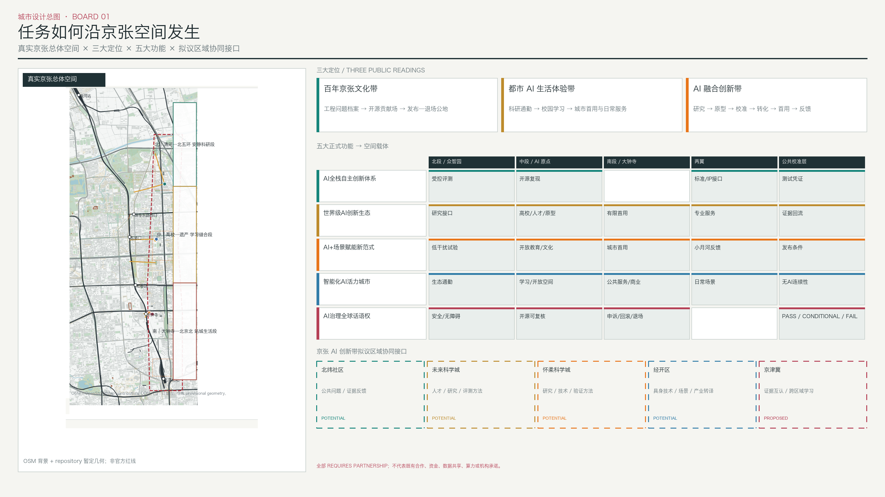
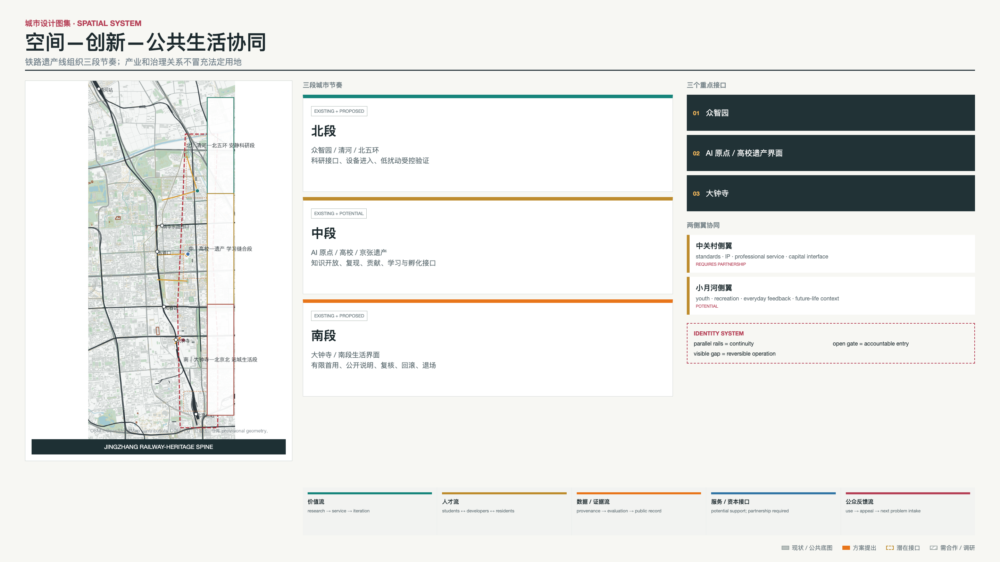
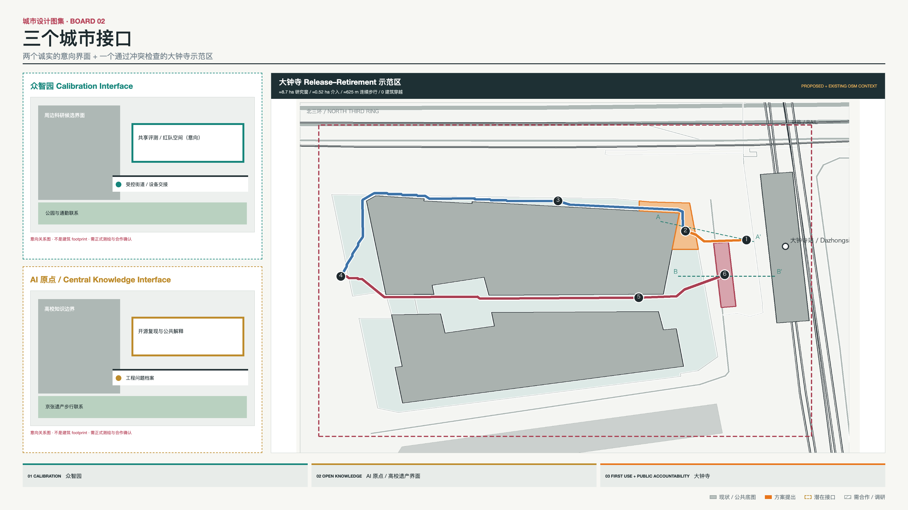
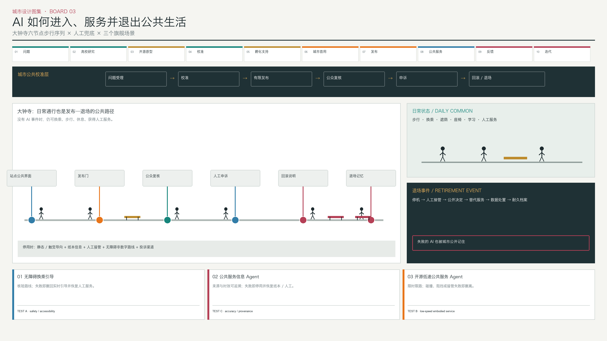
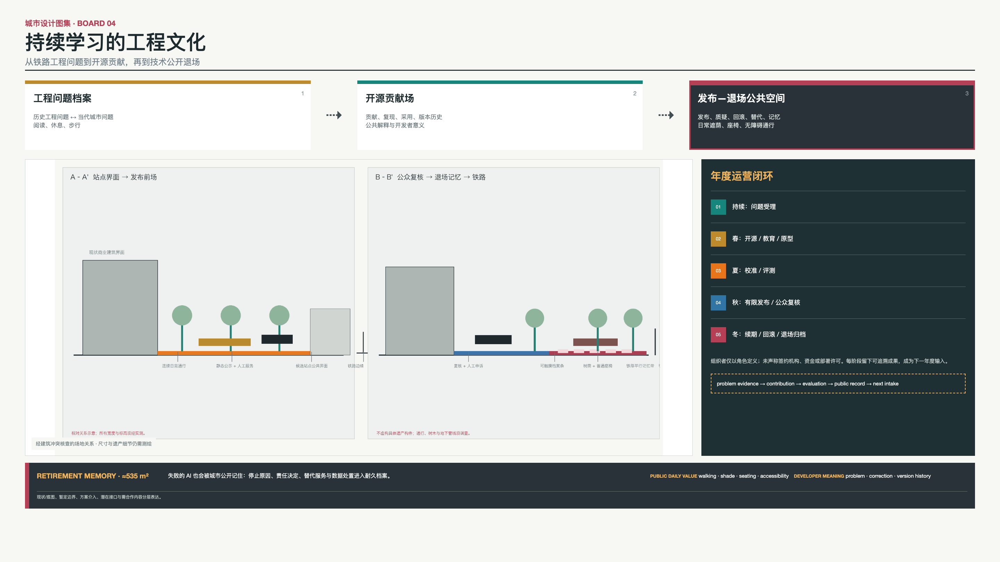

# 京张城市校准场

**Jingzhang AI Innovation Belt × Civic Calibration Layer**

京张是一条把百年工程文化转化为 AI 创新生态的城市带：真实城市问题进入高校与研究网络，经开源、原型、校准和孵化接口，在大钟寺获得有限首用，再由公众反馈推动迭代或退场。城市校准场不代替整条创新带；它是所有创新进入公共生活时共同使用的准入、复核和退出层。[standard:PROJECT-AGENT-OPEN-CALL-TASKBOOK] [data:visual/assets/innovation_belt_program.json] [depth:overall_spatial_structure]

即使拿掉 AI，空间结构仍成立：北段连接清河、北五环、园区与低干扰科研通勤；中段连接高校、AI 原点、京张遗产与开放知识；南段连接大钟寺站城生活、商业公共界面和北京北站方向。公共空间先服务步行、休息、学习、换乘和社区日常，再承载创新展示与公众复核。[source:JZ-PARK-PHASE2-PLAN] [source:OSM-BBBIKE-BEIJING-20260808]

## 设计依据与资料清单

正式任务依据为官方公告、site package、Agent Taskbook、source registry、schema、专业标准快照和最新版校验脚本。场地认知使用政府公开资料与 2026-08-08 OpenStreetMap 北京提取；大钟寺示范区使用 2026-08-15 OSM Map API 小窗口复核站点参照、道路、商业步行空间和建筑候选。OSM 依据 ODbL 1.0 署名，只作为公共背景，不是官方测绘、道路红线、地籍或完整建筑普查。[source:SITE-PACKAGE] [source:OSM-BBBIKE-BEIJING-20260808] [source:OSM-API-DAZHONGSI-20260815]

方案选取 8 个全球创新生态案例，全部来自政府、大学、研究机构或项目官方页面，只提取可转译原则，不复制其品牌、资金、机构、租赁制度、规模或绩效。创新生态、运营季节、资本接口和测试协议均为设计建议；没有任何已签合作、数据授权、场地许可或实测表现声明。[data:visual/assets/innovation_belt_program.json] [assumption:A-INNOVATION-ECOSYSTEM-001] [assumption:A-EVALUATION-PROTOCOL-001]

资料继续分为 EXISTING、PROPOSED、POTENTIAL、PROVISIONAL、REQUIRES PARTNERSHIP、DATA GAP、UNKNOWN 和 CANNOT VERIFY。正式控规、道路红线、权属、建筑高度与状况、市政、文保控制、站点工程图和人流调查缺失时，方案给出补数路径，不从示意图反推结论。[assumption:A-CONTROLS-001] [depth:risk_missing_data]

## 三层范围工作框架

43.6 km² 是公告中的统筹研究范围，用于理解高校科研、产业、生态、交通、两侧翼和区域协同；≈11.4 km² 是仓库 provisional polygon 的投影面积，用于本包 GeoJSON 裁切、拓扑与机器复算。三处重点区身份来自任务书，其几何仍是 provisional；两类范围用途不同，不能互相替代或被称为法定红线。[source:OFFICIAL-ANNOUNCEMENT] [metric:site_area_sqm] [assumption:A-SCOPE-436-001]

研究层判断京张与清河、北五环、五道口、高校科研区、中关村服务网络、大钟寺和北京北站方向的关系；总体设计层组织铁路遗产脊柱、北中南三段、三重点区与两侧翼；重点设计层在众智园和 AI 原点提出待调查的 indicative interface，在大钟寺保留已完成建筑冲突核查的约 8.7 ha 示范区。仓库中段 provisional geometry 与 OSM 所示京张公园存在约 0.4 km 错位，图件同时显示两者而不掩盖冲突。[data:geometry/site_boundary.geojson#SITE-001] [data:geometry/key_areas.geojson] [assumption:A-BOUNDARY-MISMATCH-001]

## 统筹研究范围产业与未来城市研究

### 全球案例：从“园区”转向“可运转生态”

| 案例 | 可观察机制 | 对京张的转译 | 不能复制 |
|---|---|---|---|
| Singapore one-north / LaunchPad | 模块空间、孵化器、投资接口、试验与首层展示相邻 | 用小型适应性接口连接原型、首用和社区 | 租赁条件、企业数量、资金与运营安排 |
| Paris-Saclay | 高校、科研、创新场所、产业和年度活动协同 | 用年度循环和跨场所网络运营整条带 | 法定工具、保护区制度、品牌和绩效 |
| Kendall Square | 研究、创业、生活、零售、文化与开放空间混合 | 让创新进入普通街区生活和短距离步行 | 土地权属、开发比例和 MIT 承诺 |
| Toronto / Vector Institute | 研究、人才、可信采用和产业协作一体化 | 把人才路径与采用路径同时画清 | 资金、合作方和项目制度 |
| Montréal / Mila | 开放科学、技术转化、创业、伦理和公共政策并存 | 把开源贡献与公共责任连接 | 机构身份、规模和伙伴网络 |
| London Knowledge Quarter | 车站周边独立学术、文化和科技锚点组成网络 | 用遗产、公园和公共空间连接机构 | 成员体系、治理机构和一英里范围 |
| Seoul AI Hub | 教育、孵化、算力、PoC 和全球协作按成长阶段组织 | 区分受控评估、孵化和城市首用 | 补贴、算力额度、监管例外和运营联合体 |
| Helsinki Maria 01 | 旧医院适应性利用、创业社区与城市服务连接 | 存量优先、项目轮换、公共空间耐久 | 租期、产权、融资和建设进度 |

案例共同说明：创新生态需要研究锚点、短距离交流、共享接口、人才与运营网络，也需要面向公众的生活空间。京张的转译不是复制园区，而是把高校、铁路遗产、AI 原点、众智园和大钟寺沿一条真实城市脊柱组织起来。[source:GLOBAL-SINGAPORE-LAUNCHPAD] [source:GLOBAL-PARIS-SACLAY] [source:GLOBAL-KENDALL-MIT]

### 京张价值链与五类流

创新带的价值链为：真实问题 → 高校/研究 → 开源/原型 → Calibration → 孵化/专业支持 → 试点/首用 → Release → 公共服务/市场界面 → 反馈 → 迭代或 Retirement。它不是单向招商流水线：公众反馈回到下一年度问题库，失败同样成为公共知识。[data:visual/assets/innovation_belt_program.json] [assumption:A-INNOVATION-ECOSYSTEM-001]

价值流描述问题怎样变成可用服务；人员流连接学生、研究者、开发者、现场人员和公众；数据/证据流从问题记录到测试凭证、发布卡、纠错和退场档案；服务/资本支持流只表示标准、知识产权、专业服务和潜在资本接口；公众反馈流把观察、申诉和修正返回研究端。任何资金、算力、数据或运营关系都标注 REQUIRES PARTNERSHIP，不画成已存在的资源流。[source:HAIDIAN-AI-INDUSTRY] [source:AI-ORIGIN-COMMUNITY] [assumption:A-INNOVATION-ECOSYSTEM-001]

## 总体设计范围城市更新与控规深度城市设计

总体空间结构是“一条京张遗产脊柱、三段城市节奏、三处创新接口、两条服务侧翼、一层公共校准”。北段以众智园、清河和北五环为研究与低干扰校准环境；中段以 AI 原点、高校和遗产公园为开放知识、人才和原型界面；南段以大钟寺为有限首用、城市生活、商业公共服务和反馈界面。中关村科技服务翼提供潜在标准、知识产权、企业和资本接口，小月河场景赋能翼提供青年、休闲、公共生活和未来场景反馈。[data:visual/assets/innovation_belt_program.json] [data:geometry/key_areas.geojson] [depth:overall_spatial_structure]

### 赛题定位—功能—空间对齐矩阵

下表把三大定位与五类工作功能直接映射到空间载体；它是设计 crosswalk，不把潜在网络写成既有机构协作。[standard:PROJECT-AGENT-OPEN-CALL-TASKBOOK] [data:visual/assets/innovation_belt_program.json]

| 三大定位 | Research | Open Source | Translation / Incubation | Public Service | Cultural Experience |
|---|---|---|---|---|---|
| 百年京张文化带 | 铁路工程问题进入当代研究 brief | 中段公开来源与复现记录 | 工程经验转译为可核查公共问题 | 遗产解释保留人工与静态服务 | 工程问题档案—开源贡献场—发布退场公地 |
| 都市 AI 生活体验带 | 北段低干扰测试提出生活问题证据 | 可复核的公共问题与版本说明 | 大钟寺有限首用，不作全域部署 | 导航、信息与无 AI 连续性 | 日常步行、休息、质询、申诉与退场记忆 |
| AI 融合创新带 | 众智园与高校研究接口 | AI 原点开放知识和原型复现 | 孵化/专业服务接口均需合作 | 发布门把原型转成有边界的城市服务 | 贡献、纠错与退出共同构成 AI 新文化 |

三区两翼承担上述功能的不同阶段：北段/众智园承载研究与受控校准，中段/AI 原点承载开源、人才与转化接口，南段/大钟寺承载有限首用、公共服务和公众复核；中关村翼是潜在专业服务接口，小月河翼是日常生活与反馈语境。外部区域协同仅提出待合作关系：北纬社区作为 POTENTIAL 公共问题与社区反馈接口；未来科学城、怀柔科学城作为 POTENTIAL 研究与评估交流接口；经开区作为 POTENTIAL 具身设备与产业首用经验接口；京津冀作为 PROPOSED 跨区域证据互认与经验交流框架。五项均为 REQUIRES PARTNERSHIP，不代表已签约、已授权或已有资源流。[data:visual/assets/innovation_belt_program.json] [assumption:A-INNOVATION-ECOSYSTEM-001]

视觉识别不制造企业式科技 Logo。两条平行线代表铁路基础设施连续性，开放短横线代表发布门，节点旁的留白代表人工判断与退出；现状、provisional、生态流、公共门、开放知识和蓝绿空间使用六类稳定颜色。命名体系严格区分 Belt、Ground、Interface 和 Commons，避免把概念节点包装成建筑。[data:visual/assets/innovation_belt_program.json] [standard:PROJECT-AGENT-OPEN-CALL-TASKBOOK]

用地继续采用“全域资料缺口 + 局部设计叠加”。provisional geometry 全域用代码 16 表示待正式底图深化，不虚构现状用途、FAR、建筑高度、拆改留或地下规模；设计只提出存量优先、首层公共性、可逆组件、院落共享和边界透化原则。[data:geometry/land_use.geojson#LU-RESIDUAL-DATA-GAP] [metric:floor_area_ratio] [depth:land_use_layout]

## 重点区域详细设计

**众智园：Research + Controlled Calibration。** 公开任务和 OSM 候选背景支持其作为北段科研接口，但不支持精确建筑方案。概念介入区把科研楼—共享院落—受控街段组织成设备与人员进入顺序：问题和原型预约进入，测试数据保持授权或合成，现场人员可观察和接管，结果形成测试凭证再离开园区。清华东路西口、北部公园与园区之间的线只表示通勤和设备联系需求，精确入口、道路和权属待调查。[data:geometry/constraints.geojson#PUBLIC-ZZ-CAL-001] [data:geometry/buildings.geojson#BLDG-ZZ-001] [assumption:A-BUILDING-CONTEXT-001]

**AI 原点与中段：Open Knowledge + Prototype。** 官方公开资料将五道口、高校院所和 AI 原点联系为人才创新背景。高校—遗产概念院落叠加开放知识桌、复现记录、公共问题说明和人本复核，不新造建筑或假入口。学生和研究者可把研究问题解释为公众可理解的任务，开发者留下版本与复现条件，居民可指出问题定义中的遗漏；场地仍以校园—公园穿越、休息和学习为首要日常功能。[source:AI-ORIGIN-COMMUNITY] [data:geometry/constraints.geojson#PUBLIC-MID-VERIFY-001] [assumption:A-ENGINEERING-CULTURE-001]

**大钟寺：First Use + Release Gate。** 方案保留通过 Reality QA 的全部几何关系：约 8.7 ha 研究窗、约 0.52 ha 介入、三段约 625 m 连续步行线、六个生命周期节点、两处约 1,220 m² 公共空间、A–A'、B–B'及约 535 m² Retirement Memory 均不移动。新增的是其在完整生态中的角色：测试凭证在发布前场转成公众可读发布卡，有限服务在商业和公共界面首用，纠错沿步行序列返回研究端。[source:BJ-LINE12-OPEN-20241215] [data:geometry/constraints.geojson#DISTRICT-DZ-STUDY-001] [metric:road_centerline_length_m]

大钟寺路线继续绕开已下载 OSM 窗口中的四个建筑候选，公共空间与节点均不落入这些建筑。正式站口、通行权、坡度、盲道、铺装和高峰人流仍待测绘及现场核验；“无冲突”只针对当前公共数据窗口，不代表工程批准。[data:geometry/roads.geojson#ROAD-DZ-003] [data:geometry/public_space.geojson#PUBLIC-RETIRE-001] [assumption:A-DAZHONGSI-REALITY-001]

**大钟寺实施前验证清单。** 现有总平面保持不变，但任何深化或试点必须先完成七项 prerequisite：①由站区责任方核实站口位置与开放状态；②核实通行权、道路边界与临时占用条件；③实测坡度、横坡和高差；④完成 A–A'、B–B'及关键转折的现场断面测量；⑤由无障碍专业人员和代表性使用者进行同行审计；⑥观察工作日/周末高峰行人和停留行为；⑦完成过街、设备停靠和混行的交通安全评价。每项结果都可能触发路线标注、构件、运营时段或试点范围的调整；本方案未声称这些调查已经完成。[data:visual/assets/innovation_belt_program.json] [assumption:A-DAZHONGSI-REALITY-001]

## AI 创新生态、人才画像与 AI+ 场景

### 三个旗舰案例

| 旗舰 | 空间旅程 | Agent 与数据边界 | Release、失败与兜底 |
|---|---|---|---|
| Accessible Transfer Guidance | 大钟寺发布门—复核—申诉 | 只比较经核无障碍路径；入口、电梯和关闭信息需运营者确认 | 路线核实且静态/人工等价成立才发布；危险或不可达即撤回实时引导 |
| Public-Service Information Agent | 大钟寺发布—公众质询—退场记忆 | 只读获批且标日期目录；禁止画像、支付凭证和无关轨迹 | 来源丢失、虚构有害信息或兜底中断即停用，恢复纸本与人工服务 |
| Open-source Low-speed Public-Service Agent | 众智园受控验证—AI 原点复现—大钟寺限时限路首用—京张公众复核 | 仅做非关键搬运或导向；需要设备状态、远停、维护和接管排班 | 路线调查、可达绕行和人工接管成立才首用；碰撞、近失、阻挡或远停失败即撤离公共空间 |

第三个旗舰是 PROPOSED EVALUATION PROTOCOL，不是已部署机器人。它的价值在于让研究、开源、校准和首用真正跨越三个重点区；具体设备、运营者、路线许可和测试结果均待合作与现场数据。[data:visual/assets/innovation_belt_program.json] [data:geometry/constraints.geojson#CASE-ZZ-ROBOT-001] [assumption:A-EVALUATION-PROTOCOL-001]

### 十个 AI 场景与一张连续性系统卡

三旗舰之外设置七个支撑场景：开放教育与复现、健康/老龄服务导航、社区商业多语信息、京张工程文化解释、公园维护与热舒适、非决策型公共法律/政务导航，以及创新转化路径 Agent。最后一项在 AI 原点—中关村专业服务接口中，把原型映射至有来源、有日期的标准、知识产权、校准与孵化服务目录；它不作资格、审批、融资、投资或供应商选择。十个 AI 场景共享数据来源、人工责任、发布、复核、失败和兜底字段，但不各建一个中心，也不占用同等图面。另设一张“无 AI 连续性”（No-AI Continuity）系统卡，AI 停止时由人工、静态导视、纸本信息、无障碍非数字路线和投诉渠道维持服务；该卡不计入 AI 场景数量。[data:visual/assets/innovation_belt_program.json] [metric:ai_scenario_count] [metric:system_card_count]

健康场景不诊断、不做紧急分诊；法律与政务场景不判断资格、不预测案件；商业场景不排名、不读取支付信息；公园场景不跟踪个人、不自动派单；文化场景只解释有来源的公开史料。高风险自动决策因此不进入支撑场景库。[assumption:A-AI-DATA-001] [standard:PROJECT-GENERATIVE-AI-INTERIM-MEASURES]

### 七类真实用户与三类产业测试

用户不是“居民、企业、政府”的泛称，而是行动/视听/认知障碍使用者、老年人与照护者、学生与研究者、开发者与创业团队、通勤者与陌生访客、本地服务人员与小微商户、公共服务人员与现场运营者。每类用户都映射到需要、地点、服务和人工 fallback。[data:visual/assets/innovation_belt_program.json] [metric:user_type_count]

TEST A 检查 Agent 安全与无障碍；TEST B 检查具身设备限定路线、可达绕行和人工接管；TEST C 检查公共信息准确性、来源、陈旧数据和离线降级。三者均无实测结果，不设伪阈值；正式阈值需代表性用户、批准方案、合法数据、仪器和独立复核后确定。[data:visual/assets/innovation_belt_program.json] [metric:industrial_test_count] [assumption:A-EVALUATION-PROTOCOL-001]

### Civic Calibration Layer

所有场景共同经历 Problem Intake → Calibration → Release → Civic Verification → PASS/Scale、CONDITIONAL/Recalibrate 或 FAIL/Rollback/Retirement。创新生态解释技术如何产生价值；Calibration Layer 解释它在什么条件下可以进入公共生活。两者是上下层关系，不是两套相互竞争的流程。[data:geometry/constraints.geojson#NODE-CAL-001] [metric:lifecycle_gate_count]

## 用地、建筑规模与拆改留方案

空间模型继续保留 10 个选择性 OSM 现状建筑候选，合计约 5.85 万 m²；`buildings.geojson` 只统计 provisional site 内 6 个候选约 2.31 万 m²，大钟寺 4 个候选只作范围外冲突检查背景。它们不是完整建筑普查、拟建建筑、权属结论或开发规模。[data:geometry/buildings.geojson] [data:geometry/constraints.geojson#BLDG-DZ-001] [metric:building_footprint_area_sqm]

更新策略是“存量优先、接口优先、可逆优先”。众智园和 AI 原点只提出庭院、首层、公共桌面和观察界面的适应性利用方向；大钟寺不拆现状候选建筑，只在建筑之间和站边开放空间布置路线与可逆组件。建筑高度、FAR、结构、消防、地下空间和拆改留必须逐栋调查后决定。[depth:retain_renovate_demolish] [depth:height_massing_character] [assumption:A-DESIGN-DEPTH-CONCEPT-001]

## 交通、轨道、市政与公共服务设施

交通系统区分三类流线：日常通勤和校园—公园穿越；创新带中的人员、原型与证据联系；大钟寺约 625 m 的公开生命周期步行线。只有大钟寺三段线作为正式设计长度；北中段四条线仍只是 connection need，不是可走线位、道路红线或建设承诺。[data:geometry/roads.geojson] [metric:road_centerline_length_m] [depth:traffic_rail_slow_parking]

公共服务设施首先提供无 AI 也成立的底线：连续无障碍面、照明、遮荫座椅、自行车停放、人工服务、静态和触觉导向、纸本信息、投诉入口和断网/断电流程。传感器、边缘计算和设备接口只有在必要性、授权、维护责任与退出方案明确后，才作为可拆卸层进入。[data:visual/assets/innovation_belt_program.json] [depth:municipal_new_infrastructure] [assumption:A-CONTROLS-001]

中关村科技服务翼只表达 standards、IP、专业服务、企业网络和 capital interface 的潜在支持，不画资金流；小月河场景赋能翼依托现有公园和日常生活提供青年、休闲与公众反馈，不建设新的抽象 AI corridor。[data:visual/assets/innovation_belt_program.json] [assumption:A-INNOVATION-ECOSYSTEM-001]

## 蓝绿空间、公共空间与城市风貌

`green_space.geojson` 仍只计算 6 处可追溯 OSM 绿地候选，合计约 20.8 万 m²，不宣称全域绿地总量。北段以小月河、清河方向绿地支持低干扰科研通勤与热舒适观察；中段以晨读园、唯实园和遗产公园背景支持学习与穿越；南段以元大都遗址公园等背景连接站城生活。公园维护场景必须使用获批的非个人环境数据，并保留人工巡检。[data:geometry/green_space.geojson] [metric:green_space_area_sqm] [assumption:A-OSM-BASE-001]

公共空间继续遵循北段“静”、中段“学与穿”、南段“到达、公开与记忆”的节奏。机器面积只计算大钟寺两处建筑净空公共空间约 1,220 m²；众智园和中段概念介入区不进入公共空间比例。[data:geometry/public_space.geojson] [metric:public_space_area_sqm] [depth:blue_green_public_space]

**京张工程文化路线**以“从铁路工程师到城市智能体：技术如何被验证、进入公共生活、被纠正并最终被替代”为设计解释，不把詹天佑或铁路史工具化为 AI 背书。三个朝圣节点都是普通公共空间：工程问题档案站提供树荫、座椅、方向与问题阅读；开源贡献场提供学习桌、复现记录和校园—公园穿越；发布—退场公地使用已完成建筑冲突检查的大钟寺空间，让等候、休息、质询和耐久档案共存。[source:JZ-PARK-PHASE1-OPEN] [data:visual/assets/innovation_belt_program.json] [assumption:A-ENGINEERING-CULTURE-001]

荣誉展示不做名人榜，而记录 problem、contribution、reproduction、adoption、correction 和 retirement/current status。组件库只有遮荫座椅与触觉档案条、来源日期标记、无屏公告槽、无障碍公共桌和纸本/静态 fallback 柜，均为待专业深化的可逆构件。[data:visual/assets/innovation_belt_program.json] [metric:pilgrimage_node_count]

## 更新项目清单、实施政策与分期计划

近期冻结为大钟寺示范区：先核站口、通行权、坡度和人流，再做无障碍同行审计、发布前场可逆标记、人工申诉台、离线 fallback 和退场记忆样段。中期补众智园受控校准接口、AI 原点开放知识与文化路径；远期补北段生态通勤和两侧翼服务协同。每一阶段都以正式底图、场地调查、运营责任、公共协商和资金机制为触发条件。[data:geometry/phasing.geojson] [depth:phasing_implementation] [assumption:A-COST-001]

年度运营形成五段循环：持续问题受理；春季开放知识与原型；夏季受控校准；秋季有限发布与公众复核；冬季续期、回滚和退场归档。每段都留下下一轮可用的产物：问题 brief、复现记录、测试凭证、发布卡、纠错与申诉日志、续期条件或退场档案，而不是只举办论坛。[data:visual/assets/innovation_belt_program.json] [metric:annual_operation_stage_count] [assumption:A-ANNUAL-OPERATION-001]

责任只写角色：创新带统筹与公共空间管理角色维护问题库；高校/开源角色组织复现；场地运营者和注册服务运营者负责测试与服务；独立评估、无障碍代表和公众参与复核；档案角色维护贡献与退场记录。具体机构、场地权利、预算和活动日期均 REQUIRES PARTNERSHIP。[assumption:A-ANNUAL-OPERATION-001] [depth:renewal_project_list]

### Proposed operational framework

RACI 只分配角色，不指认现实机构：问题受理由创新带统筹角色 Responsible、公共空间管理角色 Accountable；协议与数据授权由注册服务运营者 Responsible、数据责任角色 Accountable，并咨询独立评估和代表性用户；受控校准由测试团队 Responsible、场地运营角色 Accountable；发布决定由服务运营者提交，公共发布门责任角色 Accountable，独立评估、无障碍代表与现场管理者 Consulted；运行维护和人工接管由服务运营者 Responsible、场地运营角色 Accountable；事故停止由现场值守 Responsible、服务责任角色 Accountable并立即通知公众；申诉复核由独立投诉处理角色 Responsible、公共治理责任角色 Accountable；退场归档由档案维护角色 Responsible、服务责任角色 Accountable。所有公众和受影响服务人员在相应环节 Informed。[data:visual/assets/innovation_belt_program.json] [assumption:A-ANNUAL-OPERATION-001]

数据治理遵循目的限定和最小化：每个场景在发布前记录数据来源、授权基础、必要字段、保存期限、访问角色、删除/匿名化动作和退出后的处置；无法确认授权的数据不得进入服务。人工运行要求每班可识别的值守与接管角色、可测试的人工/静态/纸本 fallback、事件分级记录和维护责任。碰撞或近失、危险导航、来源丢失、重大有害信息、远停/人工接管失败、兜底不可用或重复未关闭申诉均触发暂停；恢复必须重新经过责任复核和发布门。[standard:PROJECT-GENERATIVE-AI-INTERIM-MEASURES] [assumption:A-AI-DATA-001]

公众治理使用现场与非现场投诉入口：受理时给出可追踪记录，运营角色先纠正服务，独立投诉处理角色复核争议，公共治理责任角色决定维持、附条件运行、重新校准或停止；申诉结果、证据边界和替代服务以公众可读方式发布。该框架为 PROPOSED，具体机构、值班表、数据系统、法定时限和维护合同均 REQUIRES PARTNERSHIP。[data:visual/assets/innovation_belt_program.json] [assumption:A-ANNUAL-OPERATION-001]

## 指标体系、面积复算与合规矩阵

空间机器指标继续由 EPSG:4548 复算：provisional site geometry 为 11,412,825.386 m²，人读为≈11.4 km²；选择性建筑候选约 2.31 万 m²、绿地背景约 20.8 万 m²；大钟寺两处设计公共空间约 1,220 m²、三条步行线约 625 m。它们是当前图层对象，不是法定总量或建设承诺。[metric:site_area_sqm] [metric:public_space_area_sqm] [metric:road_centerline_length_m]

场景体系由 3 个旗舰和 7 个支撑 AI 场景组成；另设 1 张 No-AI Continuity 系统卡，后者不计入 AI 场景数量。8 个全球案例用于提取转译原则，3 类产业测试均为拟议评估协议；用户、文化节点、年度运营、重点区与侧翼的完整结构化记录见 `visual/assets/innovation_belt_program.json`，不代表已建成设施或已运营项目。[metric:global_precedent_count] [metric:ai_scenario_count] [metric:user_type_count]

任务覆盖矩阵逐项记录每条官方要求的专属证据与 `response_status`；`partial`、`data_gap` 和 `requires_partnership` 不被包装为 `complete`。设计深度矩阵同样按实际成果填写。本方案的真实深度是基于公共底图的竞赛级概念城市设计：大钟寺完成建筑冲突核查，众智园和 AI 原点仍是 indicative interface design。[data:visual/assets/innovation_belt_program.json] [assumption:A-DESIGN-DEPTH-CONCEPT-001] [depth:metrics_recalculation]

## 风险、版权与合规说明

最高空间风险仍是 provisional geometry 与真实京张空间错位，以及大钟寺站口、通行权、坡度和高峰人流未核；最高生态风险是把 potential interface 误读为合作或资金；最高 AI 风险是数据授权不足、服务越界、人工兜底中断和测试协议被误写成实测绩效；最高文化风险是把历史人物、遗产或开源贡献变成营销符号。[assumption:A-BOUNDARY-MISMATCH-001] [assumption:A-EVALUATION-PROTOCOL-001] [assumption:A-ENGINEERING-CULTURE-001]

本方案通过状态标签、角色型运营主体（role-based operator）、无 AI 连续性、可逆公共空间、公众申诉和回滚/退场机制降低风险，但不能替代正式测绘、文保、交通、无障碍、伦理、数据保护、工程和运营评审。任何场景在责任主体、合法数据、现场许可和非数字等价不足时都不得进入公共发布。[standard:PROJECT-GENERATIVE-AI-INTERIM-MEASURES] [standard:PROJECT-BARRIER-FREE-ENVIRONMENT-LAW] [assumption:A-AI-DATA-001]

原创文本、图件、身份方向和设计属性按本包声明许可；OSM 署名与 ODbL 见 `sources.json` 和版权声明。全球案例仅作引用和转译，没有复制图片、Logo、商标或视觉语言。方案是开放共创建议，不是 gallery publication、获奖认定、实施批准或政府背书。[source:SOURCE-REGISTRY] [depth:risk_missing_data]

## 参考资料

- 项目公告、Site Package、Agent Taskbook 与 source registry 构成正式任务和数据边界。[source:OFFICIAL-ANNOUNCEMENT] [source:SITE-PACKAGE] [source:AGENT-TASKBOOK]
- 北京和海淀 AI、城市更新及无障碍政策用于背景与风险判断。[source:BEIJING-AI-PLUS-ACTION] [source:HAIDIAN-AI-INDUSTRY] [source:BARRIER-FREE-ENVIRONMENT-LAW]
- 京张遗址公园、AI 原点、大钟寺站城与轨道公开资料用于场地认知。[source:JZ-PARK-PHASE2-PLAN] [source:AI-ORIGIN-COMMUNITY] [source:BJ-LINE12-OPEN-20241215]
- OSM 北京提取与大钟寺 API 窗口用于公共背景和当前冲突核查。[source:OSM-BBBIKE-BEIJING-20260808] [source:OSM-API-DAZHONGSI-20260815]
- 全球案例来源包括 Singapore LaunchPad、Paris-Saclay 和 MIT Kendall Square。[source:GLOBAL-SINGAPORE-LAUNCHPAD] [source:GLOBAL-PARIS-SACLAY] [source:GLOBAL-KENDALL-MIT]
- AI 研究与采用案例包括 Vector Institute、Mila 和 Seoul AI Hub。[source:GLOBAL-TORONTO-VECTOR] [source:GLOBAL-MONTREAL-MILA] [source:GLOBAL-SEOUL-AI-HUB]
- 知识区与适应性利用案例包括 London Knowledge Quarter 和 Helsinki Maria 01。[source:GLOBAL-LONDON-KQ] [source:GLOBAL-HELSINKI-MARIA01]

完整来源字段、访问日期、使用范围和限制见 `sources.json`；完整场景、用户、测试、生态、文化和运营数据见 `visual/assets/innovation_belt_program.json`。
