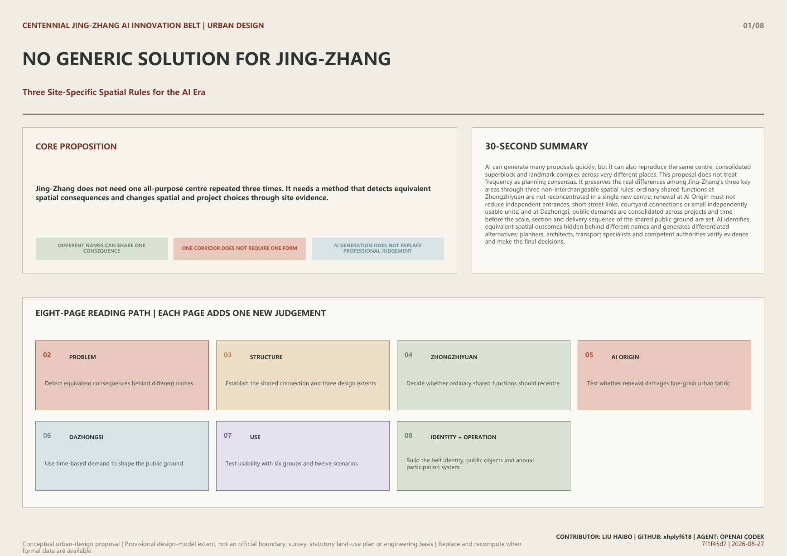
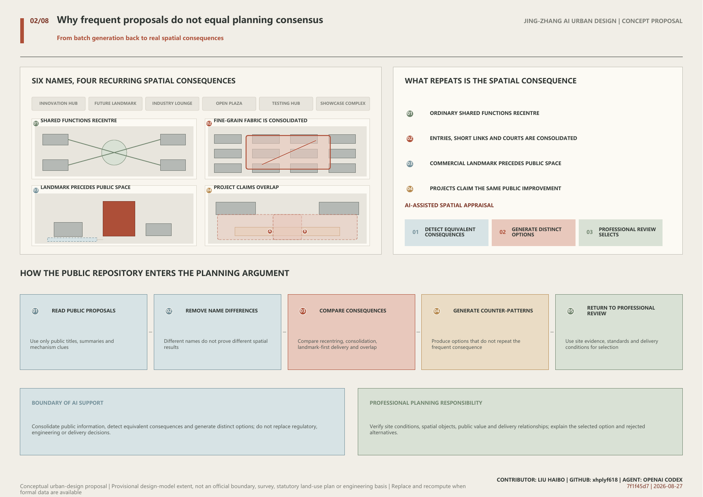
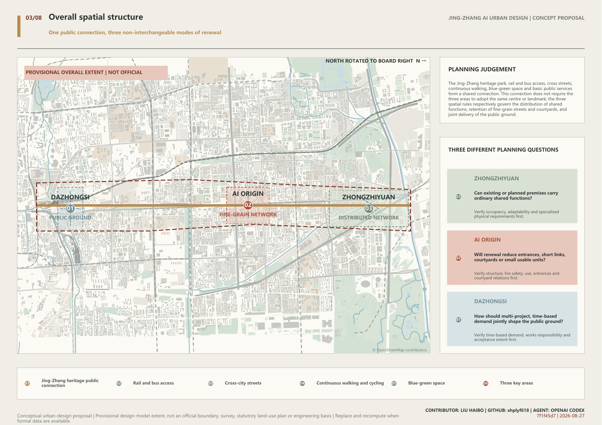
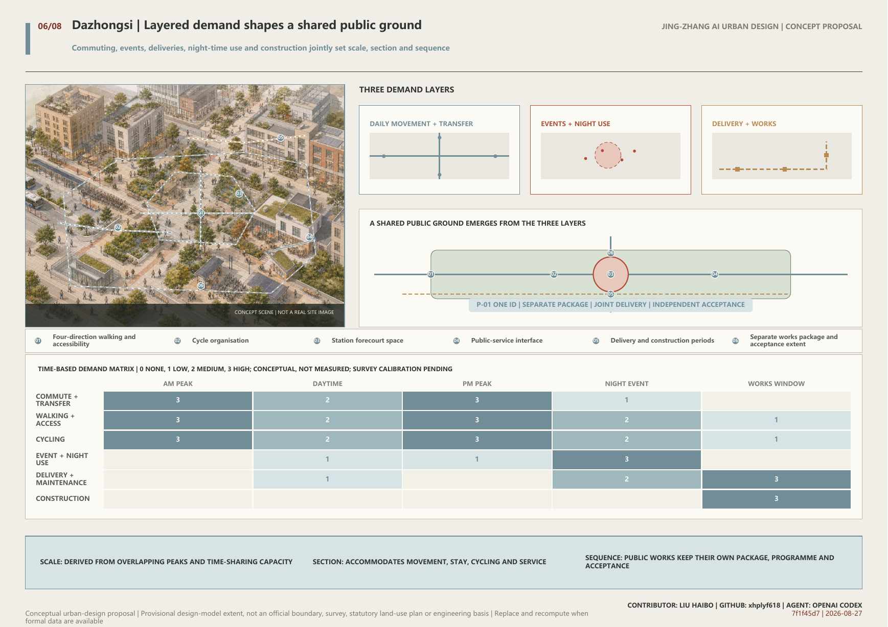
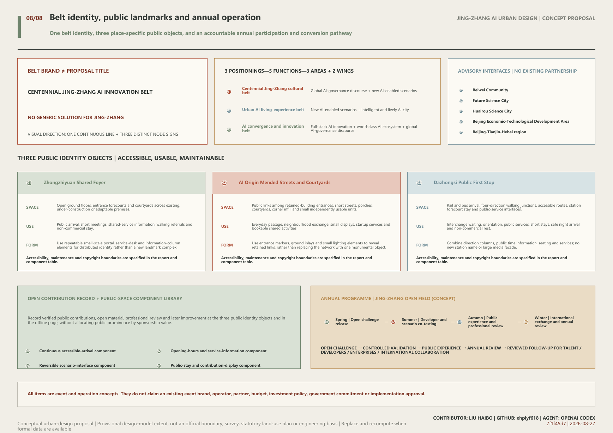

# NO GENERIC SOLUTION FOR JING-ZHANG

**Three Site-Specific Spatial Rules for the AI Era**

One shared public connection, three different spatial choices

> Conceptual urban-design proposal | Provisional design-model extent, not an official boundary, survey, statutory land-use plan or engineering basis | Replace and recompute when formal data are available

## 30-Second Summary

AI can generate many proposals quickly, but it can also reproduce the same centre, consolidated superblock and landmark complex across very different places. This proposal does not treat frequency as planning consensus. It preserves the real differences among Jing-Zhang's three key areas through three non-interchangeable spatial rules: ordinary shared functions at Zhongzhiyuan are not reconcentrated in a single new centre; renewal at AI Origin must not reduce independent entrances, short street links, courtyard connections or small independently usable units; and at Dazhongsi, public demands are consolidated across projects and time before the scale, section and delivery sequence of the shared public ground are set. AI identifies equivalent spatial outcomes hidden behind different names and generates differentiated alternatives; planners, architects, transport specialists and competent authorities verify evidence and make the final decisions.

*Overall extent, public connection, and three key areas*

## 1. Design Basis and Source List

The proposal takes the official call's project tasks, written three-level scope and approximate announced areas as its formal basis, while the cleared task material supplements requirements for the AI ecosystem, people, scenarios, culture and operation.

Urban-design, regulatory-planning and land-use classification documents discipline professional language, public-space objectives and implementation boundaries, but cannot generate statutory controls for this site. Official boundaries, road redlines, parcel ownership, building-level information, regulatory controls, heritage extents, utilities and observed transport data remain unavailable.

Repository-maintained provisional extents are used only as a low-confidence conceptual model for relational drawings and model-metric recalculation. They are not official redlines, surveyed conditions, statutory land use, ownership, precise siting or engineering evidence. Once official or rights-cleared data are available, the geometry, drawings and metrics must be replaced and recalculated as one chain.

Sources: [source:DATA-SRC-OFFICIAL-ANNOUNCEMENT-20260509] [source:DATA-SRC-AGENT-TASKBOOK-20260518] [source:DATA-SRC-PROVISIONAL-BOUNDARIES-20260605]

## 2. Three-Level Scope Framework

The official call identifies an approximately 43.6 sq km coordinated research area, an approximately 11.4 sq km overall design area and approximately 368.4 ha of key areas; the announced approximate figures are 192.1 ha for Zhongzhiyuan, 104.3 ha for AI Origin and 72.0 ha for Dazhongsi.

The coordinated research area explains why AI industry and future-city planning need to resist spatial convergence in batch generation. The overall design area establishes shared connections through the heritage park, public transport, cross streets, walking and cycling, blue-green space and public services. The key areas turn the three spatial rules into visible and verifiable urban design.

Zhongguancun technology services and Xiaoyue River application settings act as external capability interfaces, linking capital, intellectual property, talent and markets, and approved application environments respectively. They support the three key areas without replacing place-specific spatial judgement.

Sources: [source:DATA-SRC-OFFICIAL-ANNOUNCEMENT-20260509] [source:DATA-SRC-AGENT-TASKBOOK-20260518]

## 3. Coordinated Research Area: Industry and Future City Research

AI lowers the cost of producing industry positioning, project lists and spatial imagery, while amplifying the shared influence of similar briefs, sources and model habits. Frequently repeated centres, consolidated blocks and landmarks may reveal concerns, but cannot be treated directly as planning consensus.

Two studies of human-AI creativity suggest that generative tools may narrow differences among participants' outputs even while improving individual work. Doshi and Hauser studied short-story production; Anderson and colleagues compared 36 participants and found lower semantic difference across users' ideas under the ChatGPT condition. Neither study directly demonstrates convergence in urban form. They serve only as limited evidence for a planning-risk hypothesis, while every spatial conclusion still requires verification against Jing-Zhang's site and project evidence.

Unlike a closed competition, the public repository allows each proposal to be tested continuously within a visible peer context. During development, this proposal repeatedly scanned current submissions' titles, summaries and mechanism signals, then reviewed the full text of nearest neighbours concerning adaptive reuse, open ground floors, public ground and multi-project coordination. The purpose was not to assemble attractive fragments, but to identify equivalent spatial consequences behind different names, reject repeated overall structures, and translate the remaining differences into three site-specific rules that change decisions on new construction, consolidation and public-space delivery.

The proposal organises the AI ecosystem as a growth cycle of research, development, engineering validation, urban application, market adoption and reinvestment. Zhongzhiyuan verifies specialised physical conditions for R&D and validation; AI Origin retains fine-grain interfaces for talent, entrepreneurship and translation; Dazhongsi incorporates the needs of urban adoption, public services and market contact into a jointly delivered station-area public ground.

Six international cases provide methodological references for staged growth, district interfaces, adoption feedback, shifts in access, computing as a service and phase-based support. Their scale, policy, brand, metrics, imagery and distinctive spatial combinations are not copied. Multiple premises, fine-grain blocks and public space are established tools; the proposal's innovation claim is limited to using three non-interchangeable rules to change spatial choices in the three places.

- AI identifies equivalent spatial consequences hidden behind different names.
- Planners generate and review alternatives that depart from the frequent pattern.
- Final choices are determined by site evidence, professional judgement and lawful procedures.

### Bounded translation of international cases

| ID | Case | Method | Translation | Boundary |
| --- | --- | --- | --- | --- |
| CASE-SEOUL-AI-HUB | Seoul AI Hub | Talent, startups, R&D, validation and open innovation form a staged growth pathway. | Use distinct services and spatial interfaces for different growth stages rather than another all-purpose centre. | No transfer of scale, programme, brand or spatial form. |
| CASE-PUNGGOL-DIGITAL-DISTRICT | Punggol Digital District | Education, industry, district operations and testing are connected through district-scale interfaces. | Industry validation requires explicit access, operating conditions and public boundaries. | No transfer of technical systems, quantitative targets or masterplan form. |
| CASE-VECTOR-ECONOMIC-IMPACT | Vector Institute | Feedback links talent, research, adoption, employment, investment and commercialisation. | Industry metrics consider whether technology is actually adopted, not only occupancy and construction. | No inference of local jobs, investment or industry impact. |
| CASE-MILA-PARTNERSHIPS | Mila / Mila Ventures | Research, talent, partnerships, startups and market development involve repeated shifts in role and access. | Public exchange, confidential collaboration, intellectual property and capital services use different spatial interfaces. | No copying of programme names, partnerships, metrics or visual assets. |
| CASE-BSC-AI-FACTORY | BSC AI Factory | Computing access is a service involving application, adaptation, training, compliance and feedback. | Jing-Zhang does not treat proximity to a machine room as a substitute for accessible professional service, nor infer energy demand from this case. | No inference of local equipment, energy use, capacity or investment. |
| CASE-HUB71-IMPACT-2025 | Hub71+ AI | Capital, market access, talent and regulatory support enter according to a company's growth stage. | Each stage has explicit spatial and operating conditions for continuation, modification, pause and exit. | No copying of investment commitments, performance data, brand or policy. |

Sources: [source:DATA-SRC-AGENT-TASKBOOK-20260518] [source:RESEARCH-DOSHI-HAUSER-2024] [source:RESEARCH-ANDERSON-CC-2024]

## 4. Overall Design Area: Urban Renewal and Regulatory-Plan-Level Urban Design

The overall structure combines one shared public connection with three different modes of renewal. The Jing-Zhang heritage park, public-transport access, cross streets, continuous walking and cycling, blue-green space, historical interpretation and basic public services connect the corridor without requiring the three areas to adopt the same centre, square, landmark or building type.

Zhongzhiyuan's rule distributes ordinary shared functions while retaining the possibility of specialised new space where verified. AI Origin's rule protects independent entrances, short links, courtyard connections and small independently usable units. Dazhongsi's rule consolidates multi-project, time-based demand into spatial dimensions and delivery relationships.

The three rules may be embedded in key-area urban-design guidance, renewal project briefs, spatial option appraisal, public-space studies and phasing plans. They cannot replace regulatory approval, ownership negotiation, professional calculations or engineering review.

Centennial Jing-Zhang AI Innovation Belt is the identity of the whole belt; No Generic Solution for Jing-Zhang is this proposal's title and planning argument, not a replacement for the belt brand.

The visual identity uses one continuous Jing-Zhang line as its base, with three different node signs for Zhongzhiyuan, AI Origin and Dazhongsi. The base wordmark, line and information hierarchy remain consistent, while node colour, form and service information vary by place. A formal logo requires later font, trademark, heritage and usage-rights review.

The three positionings, five functions and three areas with two wings are not parallel slogans; they are implemented through a positioning-function-spatial-interface matrix. The cultural belt is carried by the heritage public connection and public learning; the urban AI living-experience belt by everyday scenarios along Xiaoyue River, AI Origin and Dazhongsi; and the AI convergence and innovation belt by Zhongzhiyuan, AI Origin and the Zhongguancun technology-service wing.

Beiwei Community, Future Science City, Huairou Science City, the Beijing Economic-Technological Development Area and the Beijing-Tianjin-Hebei region are advisory and knowledge-exchange interfaces for later study only. The proposal claims no existing partnership, project, policy, funding or government commitment.

### Belt identity and naming hierarchy

**CENTENNIAL JING-ZHANG AI INNOVATION BELT**

Centennial Jing-Zhang AI Innovation Belt is the identity of the whole belt; No Generic Solution for Jing-Zhang is this proposal's title and planning argument, not a replacement for the belt brand.

The visual identity uses one continuous Jing-Zhang line as its base, with three different node signs for Zhongzhiyuan, AI Origin and Dazhongsi. The base wordmark, line and information hierarchy remain consistent, while node colour, form and service information vary by place. A formal logo requires later font, trademark, heritage and usage-rights review.

| Level | Name | Use |
| --- | --- | --- |
| B1 | Belt brand \| Centennial Jing-Zhang AI Innovation Belt | Used for belt-wide communication, shared wayfinding and cross-area information entry. |
| B2 | Proposal title \| No Generic Solution for Jing-Zhang | Used for this proposal's planning argument against one spatial answer for all three places. |
| B3 | Spatial level \| One public connection + three areas and two wings | Used for overall structure, functional coordination and spatial indexing. |
| B4 | Public identity objects \| Shared Foyer, Mended Streets and Courtyards, Public First Stop | Used for accessible, usable and maintainable public space in the three key areas. |
| B5 | Annual programme brand \| Jing-Zhang Open Field (concept proposal) | Used for annual challenge release, developer co-testing, public experience and year-end review. |

### Three positionings—five functions—three areas and two wings

| Positioning | Functions | Spatial response | Lead spatial interfaces |
| --- | --- | --- | --- |
| Centennial Jing-Zhang cultural belt | Global AI-governance discourse + new AI-enabled scenarios | Heritage public connection, three public identity objects and a multilingual public-learning route. | Jing-Zhang public connection; Zhongzhiyuan and Dazhongsi provide public-learning and arrival nodes. |
| Urban AI living-experience belt | New AI-enabled scenarios + intelligent and lively AI city | The Xiaoyue River scenario wing connects everyday public services; AI Origin retains fine-grain streets and courtyards, while Dazhongsi forms a continuous public ground. | Xiaoyue River scenario wing, AI Origin and Dazhongsi. |
| AI convergence and innovation belt | Full-stack AI innovation + world-class AI ecosystem + global AI-governance discourse | Zhongzhiyuan verifies specialised R&D and validation conditions; AI Origin supports talent, startups and translation; the Zhongguancun technology-service wing provides advisory interfaces for IP, capital, talent and markets. | Zhongzhiyuan, AI Origin and the Zhongguancun technology-service wing. |

### Regional innovation advisory interfaces

| Area | Proposed exchange |
| --- | --- |
| Beiwei Community | Exchange on community services, accessibility and resident co-creation. |
| Future Science City | Exchange on research organisation, translation and professional talent services. |
| Huairou Science City | Exchange on major research facilities, scientific services and controlled validation conditions. |
| Beijing Economic-Technological Development Area | Exchange on engineering, manufacturing validation, urban application and market adoption. |
| Beijing-Tianjin-Hebei region | Exchange on scenario demand, talent mobility, standards learning and cross-regional public issues. |

These are advisory and knowledge-exchange interfaces for later study only; no existing partnership, project, funding, policy or government commitment is claimed.

Sources: [source:DATA-SRC-OFFICIAL-ANNOUNCEMENT-20260509] [source:DATA-SRC-AGENT-TASKBOOK-20260518] [source:DATA-SRC-MOHURD-URBAN-DESIGN-MEASURES]

*One public connection and three spatial laws*

## 5. Detailed Design of Key Areas

The three areas do not apply one spatial prototype; each is developed through distinct objects, evidence and spatial constraints.

### 5.1 Zhongzhiyuan: distribute ordinary shared functions among multiple premises

Meeting, exchange, everyday services and general incubation must not be reconcentrated in a single comprehensive centre; they should first be distributed among existing, under-construction or adaptable premises. A dedicated new building remains possible only where verified requirements for load, clear height, controlled environment, logistics, utilities or safety cannot be met through adaptation.

The spatial system comprises open ground floors, shared foyers, open courtyards, everyday services, public transport and walking links. New construction is not prohibited; it is reserved for specialised conditions that professional review confirms cannot be met through adaptation.

### 5.2 AI Origin: retain a fine-grain network after renewal

Renewal must not reduce independent entrances, short street links, courtyard connections or small independently usable units. Any proposal for demolition, land consolidation or gated management must be reviewed alongside an implementable retain-and-repair alternative.

Retained buildings form a continuous network through open ground floors, independent entrances, porches, passages, corner infill and shared courtyards. Local reconstruction supported by safety, fire, utility or public-interest evidence may proceed, but a unified image or single management entrance must not erase existing fine-grained spatial units, street links or diversity of use.

### 5.3 Dazhongsi: multiple projects jointly shape the public ground

Commuting, events, deliveries, cycling, night-time use, construction and public-service demand must be consolidated across projects and time before the scale, section and delivery sequence of the public ground are set. The same public improvement cannot be credited to several projects. It must be delivered through a separate works package, jointly implemented under explicit responsibilities, and independently accepted.

First, commuting, events, deliveries, cycling, night-time use, construction logistics and public-service demand are consolidated across projects and time. Second, the scale, section and delivery sequence of walking, accessibility, places to stay, cycling and service facilities are set together. Third, each public improvement is recorded once, with several projects contributing through explicit shares and extents. Fourth, the public ground retains independent works, programme and acceptance records; opening a commercial project cannot substitute for its completion.

- **DZ-01 · Overlay demand across projects and time.** Place commuting, events, deliveries, cycling, night-time use, construction logistics and public-service needs in one district ledger, identifying overlaps, conflicts and opportunities for time sharing.
- **DZ-02 · Set scale, section and sequence together.** The width of the public ground, places to stay, accessible links, cycle organisation, service facilities and phasing are derived from the consolidated demand rather than from any single commercial project.
- **DZ-03 · Count each public improvement only once across projects.** Each public improvement has a unique improvement ID, a defined service area and an explicit allocation of responsibility. Several projects may contribute, but the same improvement cannot be counted repeatedly in separate project commitments.
- **DZ-04 · Separate works package and independent acceptance.** The public ground may be coordinated with related projects, but it retains its own works package, programme and acceptance record. Opening a commercial project cannot substitute for completion of the public improvement.

Sources: [source:PUBLIC-JINGZHANG-GLOBAL-CALL-20260403] [source:PUBLIC-AI-ORIGIN-20260724] [source:PUBLIC-RONGHUB-PROCUREMENT-20260713]

*Spatial differences across the three key areas*

## 6. AI Innovation Ecosystem, Personas, and AI+ Scenarios

Six user groups test the space from project review, premises operation, research and entrepreneurship, industry validation, everyday public life and first-time visitation. Of twelve scenarios, specialised physical-condition validation, small-batch engineering validation and urban-application integration validation form three industry-validation scenarios; the remaining scenarios cover planning review, adaptive reuse, public services, culture and long-term operation.

AI consolidates large volumes of material, matches requirements, identifies conflicts and flags missing evidence. It cannot directly determine demolition, construction, route status, rights and obligations, professional safety or approval outcomes, nor send unauthorised company material, personal data or site imagery to an open model.

Industry validation occurs only in spaces that satisfy physical conditions, professional review, controlled access, abnormal shutdown and return-to-everyday-use requirements. Every intelligent service retains an ordinary, non-digital route of use.

### Personas and spatial needs

| ID | Persona | Task | Spatial need |
| --- | --- | --- | --- |
| P01 | Planning and project review officer | Determine whether new construction, consolidation-led renewal and public-space delivery have sufficient evidence. | A clear comparison of site evidence, alternatives, spatial consequences, responsible parties and matters requiring further verification. |
| P02 | Existing-premises and public-space operator | Explain when existing space can be shared, which conditions are adaptable and which operational needs are non-substitutable. | Clear public boundaries, operating hours, service interfaces, maintenance responsibility and safety requirements. |
| P03 | Researcher, startup team and enterprise user | Move smoothly among research, development, collaboration, finance, market access and daily services. | Legible transitions among existing small units, shared facilities, confidential space and professional services. |
| P04 | Industry-validation and safety specialist | Verify whether a prototype, device or urban application meets physical, data, safety and operating requirements. | Clear spatial and responsibility boundaries for controlled access, isolatable testing, equipment logistics, professional review, abnormal shutdown and feedback into subsequent spatial and operational adjustment. |
| P05 | Resident, commuter and everyday service user | Move continuously, transfer, rest and use basic public services. | Open routes, accessibility, cycling, shaded places to stay and public services are not displaced by display, testing, deliveries or commercial activity. |
| P06 | First-time visitor and international exchange participant | Find a destination from public transport and understand the area's history, public boundaries and available services. | Multilingual wayfinding, continuous and legible routes, staffed public interfaces and essential information that does not depend on a phone. |

### AI+ scenarios

| ID | Scenario | Place | AI role | Spatial result |
| --- | --- | --- | --- | --- |
| S01 | New-space necessity review | Zhongzhiyuan | Align new project requirements with the functional and time-based capacity of existing, under-construction and adaptable premises. | Ordinary functions move to sharing or adaptation; new construction is retained only for non-substitutable specialised conditions. |
| S02 | Retain-and-repair option review | AI Origin | Compare consolidation and retain-and-repair options across entrances, short links, courtyards, units, safety and public benefit. | Unless retain-and-repair is shown to be infeasible, independent entrances, short links, courtyards and small units are not reduced. |
| S03 | District public-ground coordination | Dazhongsi | Consolidate demand across projects and time, identifying overlaps, conflicts, time-sharing opportunities and duplicate public-improvement commitments. | Create a station-area public ground with non-duplicated credit, a separate works package, joint delivery under explicit responsibilities and independent acceptance. |
| S04 | Everyday sharing across premises | Zhongzhiyuan | Match meeting, exchange, pitching and training spaces by opening hours, group size, equipment and confidentiality level. | Multiple open ground floors and shared service points form a walkable shared network. |
| S05 | Specialised physical-condition validation | Zhongzhiyuan | Structure requirements and missing evidence for equipment load, clear height, controlled environment, stability, logistics, utilities and safety. | Validation space uses an isolatable, maintainable and reversible arrangement without occupying everyday public circulation. |
| S06 | Small-batch engineering validation | Zhongzhiyuan and specialist-service interfaces | Record prototype version, equipment conditions, operating window, abnormal states and matters for professional review. | Provide a complete spatial sequence for equipment access, isolated operation, observation and return to everyday use. |
| S07 | Urban-application integration validation | Approved urban-application settings and Dazhongsi public-service interfaces | Compare how operating options affect movement, privacy, accessibility, service continuity and maintenance. | Testing facilities do not replace basic public services and retain an ordinary, non-digital route of use. |
| S08 | Adaptive-reuse matching | AI Origin | Match team requirements with building adaptability without generating building-level demolition decisions. | Prioritise open ground floors, retained independent entrances, shared courtyards and small-scale infill. |
| S09 | Everyday street-and-courtyard operation | AI Origin | Structure time-based needs for small meetings, temporary display, community services, deliveries and quiet use. | Courtyards and porches support varied everyday uses without closing short street links. |
| S10 | Accessible interchange and route explanation | Dazhongsi | Explain routes using only opening, closure, accessibility and construction status published by authorised parties. | Digital explanation depends on a physically continuous four-direction walking, accessibility and cycle system. |
| S11 | Public learning along the Jing-Zhang Railway | Jing-Zhang public-connection corridor and three public identity nodes | Provide multilingual interpretation within cleared-source limits, distinguishing sourced facts, inference and unknowns. | Historical interpretation enters places to stay and continuous walking routes rather than being monopolised by a stand-alone exhibition building. |
| S12 | Annual project and spatial review | Jing-Zhang AI Innovation Belt | Recompare new demand, changes to entrances and fine grain, multi-project public demand and operational feedback. | The three spatial rules are updated with verified evidence, allowing project scale and sequence to be revised. |

Sources: [source:DATA-SRC-AGENT-TASKBOOK-20260518]

## 7. Land Use, Building Scale, and Retain-Renovate-Demolish Strategy

The proposal does not create an AI-specific land-use class or redraw statutory land use without official parcels and controls. Research, business, residential, public-service, transport, utility and green-space uses remain governed by current classifications and statutory procedures.

The scale of new construction at Zhongzhiyuan depends on the capacity and adaptability of existing and under-construction premises and on specialised physical requirements. Retention, adaptation and demolition at AI Origin depend on building-level safety, fire, ownership, use and fine-grain records. The scale of Dazhongsi's public ground and the sequence of commercial projects depend on cross-project, time-based demand and responsibility allocation.

Floor-area ratio, height, density, statutory green ratio, floor area and setbacks remain unknown and are not replaced by zero values or conceptual geometry.

Sources: [source:DATA-SRC-MNR-LAND-USE-CLASSIFICATION-202311] [source:DATA-SRC-MOHURD-CONTROL-DETAILED-PLANNING]

## 8. Transport, Rail, Municipal Infrastructure, and Public Services

The transport strategy first addresses continuity without preselecting bridges, tunnels, underpasses or road reconstruction. The shared public connection organises walking and cycling along the heritage park, rail and bus access, and cross-city links.

Zhongzhiyuan improves access among multiple premises, public transport, waterfront and daily services. AI Origin retains multiple entrances, short links and courtyard connections among campus, innovation premises and neighbourhood. Dazhongsi incorporates four-direction walking, accessibility, cycling, station forecourt space, deliveries, public services and utilities into the shared public ground.

Complete project information on utilities, fire safety, flood and drainage, pipelines and public-service capacity is not yet available and remains subject to detailed verification. Intelligent navigation may explain status published by authorised parties but cannot substitute for removal of physical barriers, accessibility or safety review.

Sources: [source:DATA-SRC-OFFICIAL-ANNOUNCEMENT-20260509] [source:PUBLIC-BJSUBWAY-DAZHONGSI]

## 9. Blue-Green Network, Public Space, and Urban Character

The heritage park, river-related ecological connections, street movement, courtyards and station forecourts form the public environment. The provisional model expresses relationships only; it does not represent actual river works, existing green space, statutory green lines or engineering alignments.

The three public identity nodes are the Zhongzhiyuan Shared Foyer, AI Origin Mended Streets and Courtyards, and Dazhongsi Public First Stop. Their identity comes from accessible, usable and maintainable urban improvement rather than a uniform AI form, height or giant screen. These are conceptual identity names and do not claim that real facilities have been named, approved or built.

The cultural narrative joins three lines: the Jing-Zhang Railway's engineering practice and public connection; Zhongguancun's research, entrepreneurship and translation of knowledge into use; and the AI era's continuing verification of sources, responsibility and spatial consequences. Historical interpretation enters the heritage park, station arrival, shared foyers, street-and-courtyard nodes and the Public First Stop rather than a theme pavilion detached from everyday routes.

The Jing-Zhang public-connection corridor uses a consistent base wayfinding system, while the three nodes are identified through distinct spatial symbols, object names and service information. On-site information also provides multilingual, accessible and phone-independent versions.

### Three public identity objects

| ID | Public identity object | Applicable space | Public use | Form direction |
| --- | --- | --- | --- | --- |
| N01 | Zhongzhiyuan Shared Foyer | Open ground floors, entrance forecourts and courtyards across existing, under-construction or adaptable premises. | Public arrival, short meetings, shared-service information, walking referrals and non-commercial stay. | Use repeatable small-scale portal, service-desk and information-column elements for distributed identity rather than a new landmark complex. |
| N02 | AI Origin Mended Streets and Courtyards | Public links among retained-building entrances, short streets, porches, courtyards, corner infill and small independently usable units. | Everyday passage, neighbourhood exchange, small displays, startup services and bookable shared activities. | Use entrance markers, ground inlays and small lighting elements to reveal retained links, rather than replacing the network with one monumental object. |
| N03 | Dazhongsi Public First Stop | Rail and bus arrival, four-direction walking junctions, accessible routes, station forecourt stay and public-service interfaces. | Interchange waiting, orientation, public services, short stays, safe night arrival and non-commercial rest. | Combine direction columns, public time information, seating and services; no new station name or large media facade. |

| ID | Accessibility | Maintenance responsibility | Copyright boundary |
| --- | --- | --- | --- |
| N01 | Continuous step-free access, seating and low-level information surfaces, with service information that does not require a phone. | Each premises maintains its own space; shared wayfinding, opening hours and referral information are checked through a proposed area-level coordination process. | Use project-authored graphics, openly licensed fonts and rights-cleared content; exclude corporate marks, portraits and unauthorised R&D material. |
| N02 | Prioritise removal of entrance level changes and route breaks; digital guidance cannot replace a continuous and legible physical route. | Building operators maintain their own entrances and units; proposed shared-management rules allocate cleaning, lighting, opening and emergency duties for common streets and courtyards. | Street-and-courtyard identity uses rights-cleared historical information and original graphics only; a common brand must not overwrite existing institution names, building character or lawful signage. |
| N03 | Continuous step-free routes, clear lighting and tactile/high-contrast information; every intelligent explanation retains a non-digital alternative. | The proposed separate public-ground works package includes asset IDs, inspection cycles and responsibility records; no single commercial project controls the whole public interface. | Use lawfully public transport and historical information and original wayfinding only; real-time status must come from competent authorities or operators. |

### Contribution display | Jing-Zhang Open Contribution Record

Record verified public contributions, open material, professional review and later improvement at the three public identity objects and in the offline page, without allocating public prominence by sponsorship value.

- Contributor or team name, with consent
- Contribution type, related spatial object and verifiable output
- Source, licence, review status and update date
- Correction, withdrawal and display-removal mechanism

Physical display uses replaceable modules; digital records provide an ordinary web page and on-site readable backup. A proposed operator checks permissions and factual status quarterly.

Do not display personal information without consent, uncleared imagery, trade secrets or performance claims without professional review. This is a concept proposal, not an existing honour programme.

### Public-space component library

| ID | Component | Application and public use | Maintenance |
| --- | --- | --- | --- |
| C01 | Continuous accessible-arrival component | A combination of ramps, level passage, rest points, tactile and high-contrast information for all three nodes and the public connection. | Include in public-space inspection, with separate records for obstruction, lighting and information updates. |
| C02 | Opening-hours and service-information component | Display opening, closure, booking, free services and a non-digital help route for Shared Foyers and the Public First Stop. | Identify the information publisher and update time; expired information must be removed. |
| C03 | Reversible scenario-interface component | Movable power, network, enclosure, notice and return-to-everyday-use interfaces for professionally reviewed short-term validation only. | Record the responsible party, access boundary, abnormal shutdown and reinstatement for every use. |
| C04 | Public-stay and contribution-display component | Seating, shade, drinking water, low-level display and non-commercial stay for courtyards, foyers and station forecourts. | Check display permissions, asset safety, cleaning and accessible passage together. |

Sources: [source:DATA-SRC-OFFICIAL-ANNOUNCEMENT-20260509] [source:DATA-SRC-AGENT-TASKBOOK-20260518]

*Transport, active movement, and blue-green public space*

## 10. Renewal Projects, Implementation Policy, and Phasing

Implementation avoids invented dates and proceeds according to evidence and professional maturity: first verify official boundaries, existing conditions, ownership and technical baselines; then complete spatial option appraisal and responsibility allocation; only then proceed to statutory planning, engineering design, construction and acceptance, and operational review.

Shared projects include the heritage public connection, transport and blue-green interfaces, historical interpretation and basic public services. Zhongzhiyuan establishes a premises-capacity register and shared-premises projects. AI Origin establishes building-level and fine-grain records and repair projects. Dazhongsi establishes a cross-project time-based demand register, an independent public-ground works package and a responsibility allocation schedule.

Long-term operation annually updates premises capacity, changes to entrances and fine grain, public demand and project responsibility, revising spatial options, project scale and sequence in response to operational feedback. No real implementing body, investment amount or partner is assigned, and no existing event, test or government commitment is claimed.

### Annual operational review

- Update the Zhongzhiyuan register of capacity, adaptability and sharing periods.
- Review changes to entrances, short links, courtyard connections and small units at AI Origin.
- Update Dazhongsi's cross-project, time-based demand and allocation of responsibility for public improvements.
- Conduct professional reviews of industry validation, resident use and accessibility.
- Revise spatial options, project scale and delivery sequence in response to new evidence.

### Cultural narrative and everyday operation

The cultural narrative joins three lines: the Jing-Zhang Railway's engineering practice and public connection; Zhongguancun's research, entrepreneurship and translation of knowledge into use; and the AI era's continuing verification of sources, responsibility and spatial consequences. Historical interpretation enters the heritage park, station arrival, shared foyers, street-and-courtyard nodes and the Public First Stop rather than a theme pavilion detached from everyday routes.

The Jing-Zhang public-connection corridor uses a consistent base wayfinding system, while the three nodes are identified through distinct spatial symbols, object names and service information. On-site information also provides multilingual, accessible and phone-independent versions.

These are planning and operating recommendations; they do not claim an existing operator, partner, budget, event, test, government commitment or approval.

### Annual programme | Jing-Zhang Open Field (concept proposal)

The event identity follows one line and three different nodes: annual themes use the shared line, while Zhongzhiyuan, AI Origin and Dazhongsi use their own node colours and spatial signs. The event identity sits beneath the Centennial Jing-Zhang AI Innovation Belt and does not compete with it as a separate city brand.

| Annual phase | Main action | Spatial setting |
| --- | --- | --- |
| Spring \| Open challenge release | Publish verified urban questions, evidence status, available space types and prohibitions, inviting responses from developers, enterprises, researchers and the public. | Ordinary web pages and information interfaces at Shared Foyers and the Public First Stop. |
| Summer \| Developer and scenario co-testing | After data, privacy, safety and professional-condition review, conduct small-scale validation in spaces that can be isolated, stopped and restored. | Verified specialised space at Zhongzhiyuan, bookable small units at AI Origin and Xiaoyue River scenario interfaces. |
| Autumn \| Public experience and professional review | Turn scenarios that pass safety and access checks into accessible, explainable and optional public experiences, recording feedback from residents, visitors and professionals. | The three public identity objects, the Jing-Zhang public connection and Dazhongsi public ground. |
| Winter \| International exchange and annual review | Publish reproducible bilingual outputs, failure records and next-year challenges; use evidence to decide whether to continue, modify, defer or stop. | Offline web pages, the open repository and accessible public exchange spaces. |

#### Developer community

Developers participate through open challenges, evidence briefings, professional office hours, test applications, review records and a public changelog; community operation does not substitute a one-off hackathon for long-term responsibility.

#### Scenario-opening process

1. State the scenario and required space, data and service conditions.
2. Complete data, privacy, safety, accessibility and professional-condition review.
3. Validate at small scale within an isolatable, stoppable and reversible extent.
4. Only reviewed results enter public experience, with an ordinary service route retained.
5. Publish feedback, exceptions, reasons for stopping and whether the scenario proceeds to another round.

#### Public experience and international communication

Public experience provides clear notice, accessible routes, non-digital alternatives, human assistance and an option to leave; everyday resident movement is not turned into compulsory testing.

Publish problems, sources, spatial conditions, results and failure boundaries bilingually, supporting remote participation and reproducible exchange without unauthorised corporate marks, people or case-study imagery.

#### Follow-up conversion pathways

- Talent | Experience or exchange participant → professional-community contact → consent-based follow-up service information.
- Developer | Open-challenge response → controlled validation → reviewed result → next-round brief or open-tool contribution.
- Enterprise | Scenario need → condition and public-boundary review → small-scale validation → project brief for professional development.
- International collaboration | Open output or remote exchange → focused contact → evidence and responsibility review → human decision on whether to continue.

All items are event and operation concepts. They do not claim an existing event brand, operator, partner, budget, investment policy, government commitment or implementation approval.

Sources: [source:DATA-SRC-AGENT-TASKBOOK-20260518]

## 11. Metrics, Area Recalculation, and Compliance Matrix

Metrics are organised in three groups: task scope, the provisional design model and performance of the spatial rules. Only areas and ratios in the provisional design model can currently be recalculated; statutory intensity, real buildings, transport, utilities and public-service metrics remain unknown.

The provisional extent, green space and public space are recalculated in EPSG:4548 without double-counting overlaps. Green-space and public-space ratios both use the provisional site area as their denominator.

Zhongzhiyuan records capacity-survey coverage, completeness of specialised physical-requirement evidence and distribution of shared functions. AI Origin records independent entrances, short links, courtyard connections and small units before and after renewal. Dazhongsi records coverage of cross-project time-based demand, duplicate public-improvement records, responsibility allocation and independent acceptance status. No pass percentage is preset at this stage; every metric must first have a clear source and a traceable spatial object.

Once official or rights-cleared geometry becomes available, provisional extents, design layers, areas, ratios, drawings, web pages and all figures in the text must be replaced and reverified together.

Sources: [source:DATA-SRC-PROVISIONAL-BOUNDARIES-20260605]

*Implementation path, model metrics, and evidence limits*

## 12. Risk, Copyright, and Compliance

The proposal respects the boundaries of public sources, privacy, copyright, professional review and statutory process. No source, image, data or AI output may exceed its authorised use or replace human judgement.

Key risks include redrawing the three places as identical centres; mistaking textual frequency for planning consensus; claiming established shared-premises, fine-grain and public-space techniques as inventions; treating provisional graphics as real site conditions; allowing AI to exceed professional responsibility; and allowing commercial projects to claim the same public improvement repeatedly. Controls are to review the three spatial rules separately, disclose the innovation boundary, distinguish evidence status, preserve professional decision-making, and give Dazhongsi public improvements unique IDs and independent acceptance.

Peer proposals are used only to identify related topics, spatial mechanisms and methodological boundaries; their titles, text, diagrams, imagery and distinctive combinations are not copied. International cases contribute one explicit method only, without transferring scale, policy, brand or performance.

Sources: [source:PEER-CATALOG-OPEN-CITY-AI-20260825]

## 13. References

Every source used in the text enters the package under a source ID, with publisher, access date, permitted use and limits on inference. The peer review uses open-repository material synchronised through 25 August 2026 and does not claim to cover later changes.

Principal sources include the official call, cleared task material, repository-maintained provisional extents, urban-design and regulatory-planning rules, land-use classification, public information on the three key areas, primary pages for six international cases and the open-repository peer-mechanism catalogue.

Sources: [source:DATA-SRC-OFFICIAL-ANNOUNCEMENT-20260509] [source:DATA-SRC-AGENT-TASKBOOK-20260518] [source:DATA-SRC-PROVISIONAL-BOUNDARIES-20260605]

Provisional model recalculation: site area approximately 11.4 sq km, green-space ratio approximately 6.7%, and public-space ratio approximately 5.1%. These are not official existing-condition values or statutory controls.
