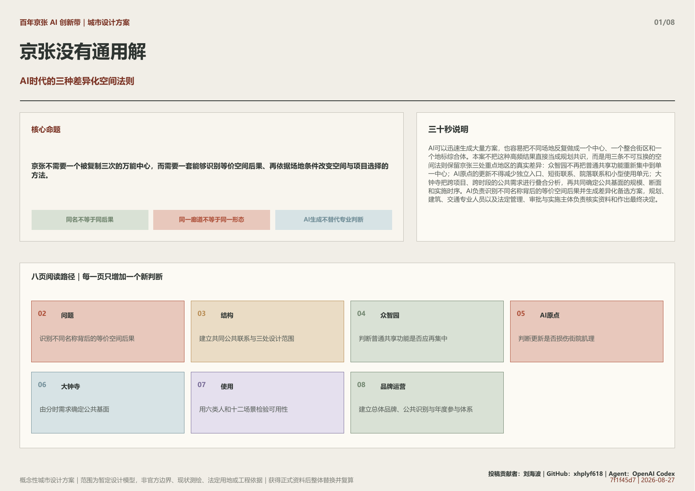
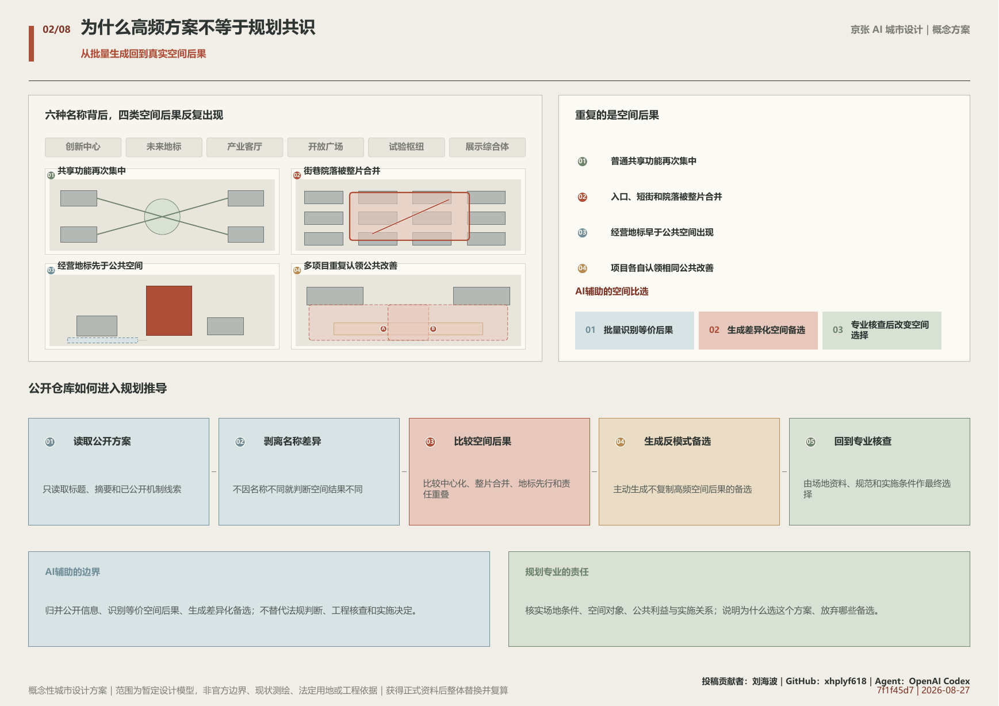
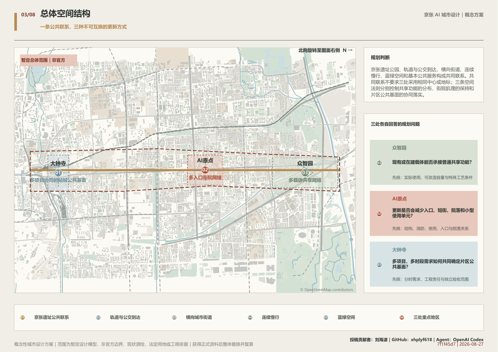
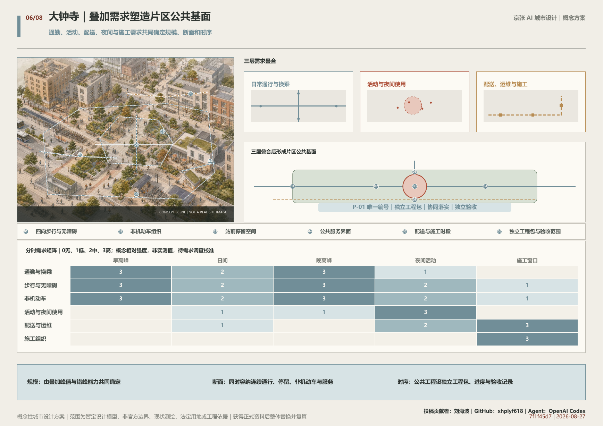
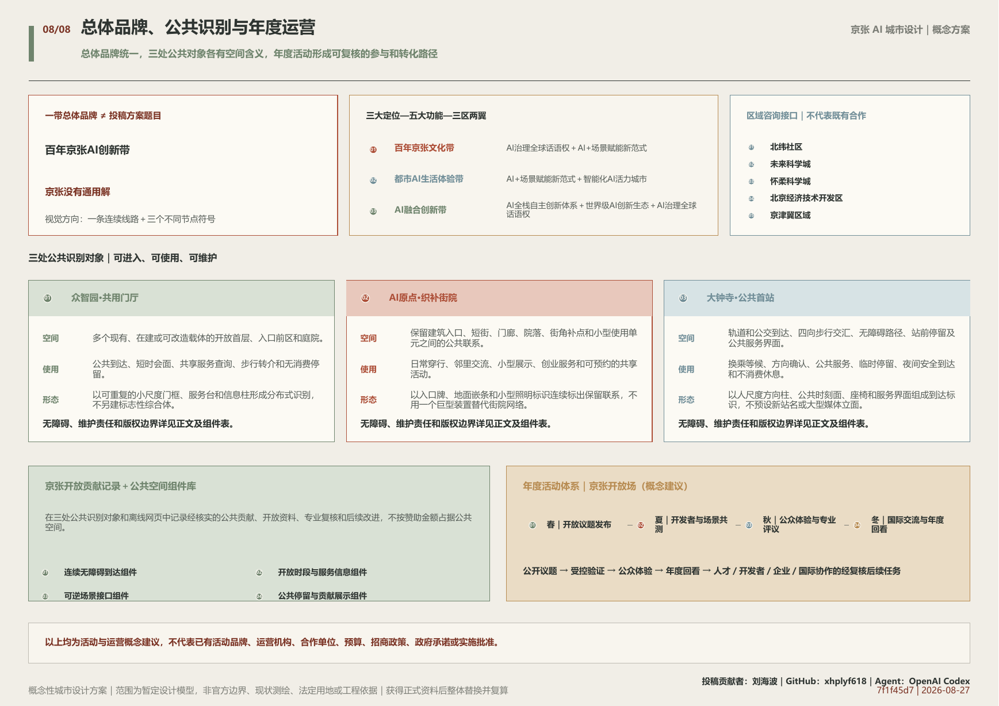

# 京张没有通用解

**AI时代的三种差异化空间法则**

同一条公共联系，三处不同的空间选择

> 概念性城市设计方案｜范围为暂定设计模型，非官方边界、现状测绘、法定用地或工程依据｜获得正式资料后整体替换并复算

## 三十秒说明

AI可以迅速生成大量方案，也容易把不同场地反复做成一个中心、一个整合街区和一个地标综合体。本案不把这种高频结果直接当成规划共识，而是用三条不可互换的空间法则保留京张三处重点地区的真实差异：众智园不再把普通共享功能重新集中到单一中心；AI原点的更新不得减少独立入口、短街联系、院落联系和小型使用单元；大钟寺把跨项目、跨时段的公共需求进行叠合分析，再共同确定公共基面的规模、断面和实施时序。AI负责识别不同名称背后的等价空间后果并生成差异化备选方案，规划、建筑、交通专业人员以及法定管理、审批与实施主体负责核实资料和作出最终决定。

*总体范围、公共联系与三处重点地区*

## 1. 设计依据与资料清单

本案以资格预审公告确定的项目任务、三层范围文字和公告约数面积为正式任务依据，以经确认可使用的任务资料补充AI生态、人物、场景、文化和运营要求。

城市设计、控制性详细规划和用地分类文件用于规范专业语言、公共空间目标和实施边界，但不能据此生成本项目的法定指标。当前仍缺少官方范围、道路红线、地块权属、逐栋建筑、控规指标、文保范围、市政管线和交通实测。

仓库维护的暂定粗略范围仅作为低置信度概念模型，用于生成关系图和复算模型指标；它不是官方红线、现状测绘、法定用地、权属、精确落位或工程依据。官方或清权资料到位后，须整体替换几何并同步复算图件和指标。

来源: [source:DATA-SRC-OFFICIAL-ANNOUNCEMENT-20260509] [source:DATA-SRC-AGENT-TASKBOOK-20260518] [source:DATA-SRC-PROVISIONAL-BOUNDARIES-20260605]

## 2. 三层范围工作框架

公告提出约43.6平方公里统筹研究范围、约11.4平方公里总体设计范围和约368.4公顷重点区域；三处重点区公告约数分别为众智园192.1公顷、AI原点104.3公顷和大钟寺72.0公顷。

统筹研究范围回答AI产业和未来城市为什么需要抵抗批量生成的空间趋同；总体设计范围建立遗址公园、公共交通、横向街道、慢行、蓝绿空间和公共服务的共同联系；重点地区把三条空间法则转化为可见、可核查的城市设计。

中关村科技服务和小月河场景赋能作为外部能力接口，分别连接资本、知识产权、人才、市场以及经批准的应用环境；它们服务三处重点地区，不替代三地自身的空间判断。

来源: [source:DATA-SRC-OFFICIAL-ANNOUNCEMENT-20260509] [source:DATA-SRC-AGENT-TASKBOOK-20260518]

## 3. 统筹研究范围产业与未来城市研究

AI降低了生成产业定位、项目清单和空间意象的成本，也放大了相同任务、相近资料和模型习惯的共同影响。频繁出现的中心、整合街区和地标可以提示关注点，却不能直接视为规划共识。

两项人机创意研究提示，生成式工具在改善个体产出的同时，可能缩小不同参与者之间的内容差异：Doshi与Hauser研究的是短篇故事实验；Anderson等人的比较研究包含36名参与者，并观察到ChatGPT条件下跨用户想法的语义差异更小。两项研究都不能直接证明城市形态趋同，本案只把它们作为提出规划风险假设的有限旁证，空间结论仍须由京张场地和项目资料核实。

与传统封闭征集不同，本次公开仓库使方案能够在持续可见的同行语境中接受检验。本案在形成过程中持续扫描当前投稿的标题、摘要和机制线索，并对与存量复用、开放首层、公共地面、多项目协同等相邻方向进行全文核查。比较不是为了拼接亮点，而是识别不同名称背后的等价空间后果，主动淘汰重复的总体结构，再把保留下来的差异转化为会改变新建、拆并和公共空间实施关系的三条场地规则。

本案把AI产业生态组织为研究、开发、工程验证、城市应用、市场采用和再投入的成长回路。众智园重点核实研发与验证所需的专用物理条件；AI原点保留人才、创业和成果转化所需的细密空间接口；大钟寺把面向城市采用、公共服务和市场接触的需求纳入多项目协同的站城公共基面。

六个国际案例只提供成长阶段、地区接口、采用反馈、权限转换、算力服务和分阶段支持等方法参照；本案不复制其规模、政策、品牌、指标、图像或独特空间组合。多载体、小街区和公共空间均为成熟手段，方案的创新主张仅限于用三条不可互换的法则改变三地的空间选择。

- AI识别不同名称背后的等价空间后果。
- 规划师生成并核查违反高频模式的备选。
- 最终选择由场地资料、专业判断和合法程序决定。

### 国际案例的有限转译

| 编号 | 案例 | 方法参照 | 转译 | 边界 |
| --- | --- | --- | --- | --- |
| CASE-SEOUL-AI-HUB | Seoul AI Hub | 人才、初创、研发、验证和开放创新形成成长阶梯。 | 不同成长阶段使用不同服务和空间接口，避免再建万能中心。 | 不移植规模、功能表、品牌或空间形态。 |
| CASE-PUNGGOL-DIGITAL-DISTRICT | Punggol Digital District | 教育、产业、地区运行和测试通过地区级接口连接。 | 产业验证必须具有权限、运行条件和公共边界。 | 不移植技术系统、量化目标或总体形态。 |
| CASE-VECTOR-ECONOMIC-IMPACT | Vector Institute | 人才、研究、采用、就业、投资和商业化之间形成反馈。 | 产业指标同时关注技术是否被真实采用，而非只计入驻和建设。 | 不推导本地就业、投资或产业成效。 |
| CASE-MILA-PARTNERSHIPS | Mila / Mila Ventures | 研究、人才、合作、创业和市场发展之间存在多次身份转换。 | 公开交流、保密协作、知识产权和资本服务采用不同空间界面。 | 不复制项目名称、合作关系、指标或视觉资产。 |
| CASE-BSC-AI-FACTORY | BSC AI Factory | 算力是一套申请、适配、培训、合规和反馈服务。 | 京张不以机房邻近替代可获得的专业服务，也不据此推导能源规模。 | 不推导本地设备、能耗、容量或投资。 |
| CASE-HUB71-IMPACT-2025 | Hub71+ AI | 资本、市场、人才和监管支持按企业成长阶段进入。 | 每个阶段明确继续、修改、暂停和退出的空间与运营条件。 | 不复制投资承诺、绩效数据、品牌或政策。 |

来源: [source:DATA-SRC-AGENT-TASKBOOK-20260518] [source:RESEARCH-DOSHI-HAUSER-2024] [source:RESEARCH-ANDERSON-CC-2024]

## 4. 总体设计范围城市更新与控规深度城市设计

总体结构为一条京张公共联系廊道和三种不同更新方式。京张遗址公园、公共交通到达、横向街道、连续慢行、蓝绿空间、历史信息和基本公共服务把沿线连接起来，但不要求三地使用相同中心、广场、地标或建筑类型。

众智园的空间法则分布普通共享功能，并为经核实的专用条件保留新建可能；AI原点的空间法则守住独立入口、短街、院落联系和小型使用单元；大钟寺的空间法则把多项目、多时段需求合并为空间尺度和实施关系。

三条法则可进入重点区城市设计导则、更新项目任务书、空间方案比选、公共空间专项和分期计划；它们不能替代控规审批、产权协商、专业计算和工程审查。

“百年京张AI创新带”是整条带的总体品牌；“京张没有通用解”是本次投稿的方案题目和规划判断，不替代总体品牌。

视觉识别以一条连续的京张线路为基础骨架，以三个不同的节点符号表达众智园、AI原点和大钟寺的差异；基础字标、线形和信息层级保持一致，节点色彩、图形和服务信息允许按场地延展。正式Logo须在字体、商标、文保与使用权核查后另行深化。

三大定位、五大功能和三区两翼不是并列口号，而通过“定位—功能—空间接口”矩阵落实：文化带由遗址公共联系和公共学习承载，都市AI生活体验带由小月河、AI原点和大钟寺的日常场景承载，AI融合创新带由众智园、AI原点和中关村科技服务翼承载。

北纬社区、未来科学城、怀柔科学城、北京经济技术开发区和京津冀仅作为可供后续研究的咨询与经验交流接口，本案不声称已经建立合作、项目、政策、资金或政府承诺。

### 总体品牌与命名层级

**百年京张AI创新带**

“百年京张AI创新带”是整条带的总体品牌；“京张没有通用解”是本次投稿的方案题目和规划判断，不替代总体品牌。

视觉识别以一条连续的京张线路为基础骨架，以三个不同的节点符号表达众智园、AI原点和大钟寺的差异；基础字标、线形和信息层级保持一致，节点色彩、图形和服务信息允许按场地延展。正式Logo须在字体、商标、文保与使用权核查后另行深化。

| 层级 | 名称 | 使用范围 |
| --- | --- | --- |
| B1 | 一带总体品牌｜百年京张AI创新带 | 用于总体传播、共同导视和跨片区信息入口。 |
| B2 | 方案题目｜京张没有通用解 | 用于说明本案反对三地采用同一空间答案的规划判断。 |
| B3 | 空间层级｜一条公共联系＋三区两翼 | 用于总体结构、功能协同和空间索引。 |
| B4 | 公共识别对象｜共用门厅、织补街院、公共首站 | 用于三处重点地区的可进入、可使用、可维护公共空间。 |
| B5 | 年度活动品牌｜京张开放场（概念建议） | 用于年度议题发布、开发者共测、公众体验和年度回看。 |

### 三大定位—五大功能—三区两翼协同矩阵

| 定位 | 对应功能 | 空间响应 | 主要空间接口 |
| --- | --- | --- | --- |
| 百年京张文化带 | AI治理全球话语权＋AI+场景赋能新范式 | 遗址公共联系、三处公共识别对象和多语公共学习路线。 | 京张公共联系廊道；众智园与大钟寺提供公共学习和到达节点。 |
| 都市AI生活体验带 | AI+场景赋能新范式＋智能化AI活力城市 | 小月河场景赋能翼连接日常公共服务；AI原点保留细密街院，大钟寺形成连续公共基面。 | 小月河场景赋能翼、AI原点和大钟寺。 |
| AI融合创新带 | AI全栈自主创新体系＋世界级AI创新生态＋AI治理全球话语权 | 众智园核实专用研发验证条件；AI原点承接人才、创业和转化；中关村科技服务翼提供知识产权、资本、人才与市场咨询接口。 | 众智园、AI原点和中关村科技服务翼。 |

### 区域创新咨询接口

| 区域 | 建议交流内容 |
| --- | --- |
| 北纬社区 | 社区服务、无障碍和居民共创经验交流。 |
| 未来科学城 | 科研组织、成果转化和专业人才服务经验交流。 |
| 怀柔科学城 | 重大科研设施、科学服务和受控验证条件经验交流。 |
| 北京经济技术开发区 | 工程化、制造验证、城市应用和市场采用经验交流。 |
| 京津冀区域 | 场景需求、人才流动、标准学习和跨区域公共议题交流。 |

以上均为可供后续研究的咨询和经验交流接口，不表示已经建立合作关系、项目、资金、政策或政府承诺。

来源: [source:DATA-SRC-OFFICIAL-ANNOUNCEMENT-20260509] [source:DATA-SRC-AGENT-TASKBOOK-20260518] [source:DATA-SRC-MOHURD-URBAN-DESIGN-MEASURES]

*一条公共联系与三条空间法则*

## 5. 重点区域详细设计

三区不套用同一空间原型，而以不同的对象、核实资料和空间约束分别深化。

### 5.1 众智园：普通共享功能分布到多个载体

会议、交流、日常服务和一般孵化不得重新集中为单一综合中心，应优先分布到现有、在建或可改造载体。只有荷载、层高、洁净、物流、市政或安全等特殊物理条件经专业核实确实无法承接时，才保留专门新建。

空间由开放首层、共用门厅、开放庭院、日常服务、公共交通和步行联系组成。新建并非被禁止，而是只为经过专业核实、无法由改造承接的专用条件服务。

### 5.2 AI原点：更新后仍保有细密街院

更新不得减少独立入口、短街联系、院落联系和小型使用单元。任何拆除、并地或封闭管理方案，都须与可实施的保留修补方案并列核查。

保留建筑通过开放首层、独立入口、门廊、通道、街角补点和院落共享形成连续网络。确有安全、消防、市政或公共利益依据的局部重构可以继续深化，但不得用统一形象和单一管理入口消除原有细粒度空间单元、街巷联系与多样使用关系。

### 5.3 大钟寺：多项目共同塑造公共基面

通勤、活动、配送、非机动车、夜间使用、施工和公共服务需求必须跨项目、跨时段进行叠合分析，再共同确定公共基面的规模、断面和实施时序。同一项公共改善不得被多个项目重复认领，须形成独立工程包，由相关项目按责任协同落实并独立验收。

第一层，跨项目、跨时段叠合分析通勤、活动、配送、非机动车、夜间使用、施工组织和公共服务需求；第二层，共同确定步行、无障碍、停留、非机动车、服务设施的规模、断面和实施时序；第三层，每一项公共改善只记录一次，多个项目按明确比例和范围承担；第四层，公共基面形成独立工程包、进度和验收记录，经营项目开业不能替代其完成。

- **DZ-01 · 跨项目、跨时段需求叠合分析**：把通勤、活动、配送、非机动车、夜间使用、施工组织和公共服务需求放入同一片区台账，识别同时发生、相互冲突和可错峰的需求。
- **DZ-02 · 共同确定规模、断面和时序**：公共基面的宽度、停留空间、无障碍联系、非机动车组织、服务设施和分期顺序，由合并后的需求共同推导，不由某一个经营项目单独决定。
- **DZ-03 · 同一公共改善不得重复计入多个项目**：每一项公共改善设置唯一项目编号、明确服务范围和责任分配；多个项目可以共同承担，但不得把同一改善分别计入多份项目承诺。
- **DZ-04 · 独立工程包、独立验收**：公共基面可以与相关项目协调建设，但必须形成独立工程包、独立进度和独立验收记录；经营项目开业不能替代公共改善完成。

来源: [source:PUBLIC-JINGZHANG-GLOBAL-CALL-20260403] [source:PUBLIC-AI-ORIGIN-20260724] [source:PUBLIC-RONGHUB-PROCUREMENT-20260713]

*三处重点地区的空间差异*

## 6. AI 创新生态、人才画像与 AI+ 场景

六类使用者从项目审查、载体运营、研发创业、产业验证、日常公共生活和首次到访六个角度检验空间。十二个场景中，专用物理条件验证、小批工程化验证和城市应用接入验证构成三类产业验证场景，其余场景覆盖规划核查、适应性改造、公共服务、文化和长期运营。

AI负责归并大量资料、匹配需求、识别冲突和提示缺失证据。它不得直接决定拆除、建设、道路状态、权利义务、专业安全或审批结论，也不得把未经授权的企业材料、个人数据和现场影像送入开放模型。

产业验证只在满足物理条件、专业复核、权限控制、异常退出和恢复日常使用要求的空间中发生；任何智能服务都保留普通、非数字的使用路径。

### 人物与空间需要

| 编号 | 人物 | 任务 | 空间需要 |
| --- | --- | --- | --- |
| P01 | 规划与项目审查人员 | 判断新增建设、拆并更新和公共空间实施安排是否有充分依据。 | 能够对照场地资料、备选方案、空间后果、责任主体和后续核实事项。 |
| P02 | 既有载体与公共空间运营者 | 说明现有空间何时可共享、哪些条件可改造、哪些运行需求不可替代。 | 清楚的开放边界、使用时段、服务接口、维护责任和安全要求。 |
| P03 | 研究者、创业团队与企业使用者 | 在研究、开发、协作、融资、市场和日常服务之间顺畅转换。 | 既有小型单元、共享设施、保密空间和专业服务之间有可理解的转介关系。 |
| P04 | 产业验证与安全专业人员 | 核查原型、设备或城市应用是否满足物理环境、数据、安全和运行要求。 | 分级进入、可隔离测试、设备物流、专业复核、异常退出以及结果反馈至下一轮空间与运营调整，均有明确的空间与责任边界。 |
| P05 | 居民、通勤者与日常服务使用者 | 连续通行、换乘、休息并使用基本公共服务。 | 开放路径、无障碍、非机动车、遮荫停留和公共服务不被展示、测试、配送或经营活动挤占。 |
| P06 | 首次到访者与国际交流参与者 | 从公共交通找到目的地，理解历史、开放边界和可使用服务。 | 多语导视、连续清晰且可辨认的路径、有人负责的公共界面和不依赖手机的基础信息。 |

### AI+场景

| 编号 | 场景 | 地点 | AI作用 | 空间结果 |
| --- | --- | --- | --- | --- |
| S01 | 新增空间必要性核查 | 众智园 | 把新项目需求与现有、在建及可改造载体的功能和时段条件并列整理。 | 普通功能转入共享或改造；仅为不可替代的专用条件保留新建。 |
| S02 | 保留修补方案核查 | AI原点 | 把拆并方案与保留修补方案按入口、短街、院落、单元、安全和公共利益并列整理。 | 无法证明保留修补不可行时，不减少独立入口、短街、院落和小型单元。 |
| S03 | 片区公共空间统筹 | 大钟寺 | 归并跨项目、跨时段需求，识别重叠、冲突、可错峰事项和重复的公共改善承诺。 | 形成同一公共改善不重复计入多个项目、以独立工程包按责任协同落实并独立验收的站城公共基面。 |
| S04 | 跨载体日常共享 | 众智园 | 按开放时间、人数、设备和保密等级匹配会议、交流、路演和培训空间。 | 多个开放首层和共用服务点形成可步行到达的共享网络。 |
| S05 | 专用物理条件验证 | 众智园 | 整理设备荷载、层高、洁净、环境稳定、物流、市政和安全需求及缺失资料。 | 验证空间采用可隔离、可维护和可退出的专用布置，不占用日常公共通行。 |
| S06 | 小批工程化验证 | 众智园与专业服务接口 | 记录原型版本、设备条件、运行窗口、异常状态和复核事项。 | 形成设备进出、隔离作业、观察记录和恢复日常使用的完整空间序列。 |
| S07 | 城市应用接入验证 | 经批准的城市应用场景与大钟寺公共服务界面 | 比较不同运行方案对通行、隐私、无障碍、服务连续性和维护的影响。 | 测试设施不替代基础公共服务，并保留普通、非数字的使用路径。 |
| S08 | 适应性改造匹配 | AI原点 | 把团队需求与建筑可改造条件匹配，不生成逐栋拆除结论。 | 优先形成首层开放、独立入口保留、院落共享和小空间补点。 |
| S09 | 街院日常运营 | AI原点 | 按时段整理小型会议、临时展示、社区服务、配送和安静使用的空间需求。 | 院落和门廊在不封闭短街联系的前提下支持多种日常使用。 |
| S10 | 无障碍换乘与路径解释 | 大钟寺 | 只调用法定管理或运营主体发布的开放、关闭、无障碍和施工状态解释路径。 | 智能解释依附于真实连续的四向步行、无障碍和非机动车系统。 |
| S11 | 京张铁路公共学习 | 京张公共联系廊道与三处识别节点 | 在清权资料范围内提供多语解释，并明确事实来源、推断和未知。 | 历史信息进入可停留的公共节点和连续步行路线，不被独立展馆垄断。 |
| S12 | 年度项目与空间回看 | 京张AI创新带 | 重新比较新增需求、入口与街院变化、多项目公共需求和实际运行反馈。 | 三条空间法则随核实资料更新，项目规模和时序可以被修正。 |

来源: [source:DATA-SRC-AGENT-TASKBOOK-20260518]

## 7. 用地、建筑规模与拆改留方案

本案不新设AI专用地类，也不在缺少官方地块和控规条件时重画法定用地。研发、商务、居住、公共服务、交通、市政和绿地仍由现行分类和法定程序确定。

众智园的新建规模取决于现有和在建载体的容量、改造能力及专用物理需求；AI原点的拆改留取决于逐栋安全、消防、权属、使用和街院肌理记录；大钟寺的公共基面规模和经营项目时序取决于跨项目、跨时段需求及责任分配。

容积率、高度、密度、法定绿地率、建筑面积和退线当前均保持未知，不以零值或模型图形替代。

来源: [source:DATA-SRC-MNR-LAND-USE-CLASSIFICATION-202311] [source:DATA-SRC-MOHURD-CONTROL-DETAILED-PLANNING]

## 8. 交通、轨道、市政与公共服务设施

交通策略先处理连续关系，不预判桥、隧、地下通道和道路改造形式。京张公共联系廊道组织遗址公园沿线慢行、轨道与公交到达及横向城市联系。

众智园重点改善多个载体与公共交通、滨水和生活服务的到达；AI原点重点保持校区、园区和街区之间的多入口、短街与院落联系；大钟寺把四向步行、无障碍、非机动车、站前停留、配送、公共服务和市政条件纳入片区公共基面。

市政、消防、防洪排涝、管线和公共服务容量尚无完整项目资料，当前只列为深化核查事项。智能导航只能解释法定管理或运营主体发布的真实状态，不能替代物理障碍修复、无障碍和安全审查。

来源: [source:DATA-SRC-OFFICIAL-ANNOUNCEMENT-20260509] [source:PUBLIC-BJSUBWAY-DAZHONGSI]

## 9. 蓝绿空间、公共空间与城市风貌

遗址公园、河流相关生态联系、街道慢行、院落和站前公共空间共同构成公共环境。暂定模型只表达关系，不表示真实岸线改造、现状绿地、法定绿线或工程线位。

三处公共识别节点分别为众智园·共用门厅、AI原点·织补街院和大钟寺·公共首站。它们的识别度来自可进入、可使用和可维护的城市改善，不来自统一的AI造型、高度或巨型屏幕。上述名称是概念识别名，不代表现实设施已定名、批准或建成。

文化叙事由三条相互连接的线索构成：京张铁路的工程实践与公共连接，中关村的科研、创业与成果转化，以及AI时代对来源、责任和空间后果的持续核实。历史信息进入遗址公园、站点到达、共用门厅、街院节点和公共首站，不另造一座脱离日常路线的主题展馆。

京张公共联系廊道使用一致的基础导视，三处节点以不同的空间符号、对象名称和服务信息识别。现场信息同时提供多语、无障碍和不依赖手机的基础版本。

### 三处公共识别对象

| 编号 | 公共识别对象 | 适用空间 | 公共使用 | 形态方向 |
| --- | --- | --- | --- | --- |
| N01 | 众智园·共用门厅 | 多个现有、在建或可改造载体的开放首层、入口前区和庭院。 | 公共到达、短时会面、共享服务查询、步行转介和无消费停留。 | 以可重复的小尺度门框、服务台和信息柱形成分布式识别，不另建标志性综合体。 |
| N02 | AI原点·织补街院 | 保留建筑入口、短街、门廊、院落、街角补点和小型使用单元之间的公共联系。 | 日常穿行、邻里交流、小型展示、创业服务和可预约的共享活动。 | 以入口牌、地面嵌条和小型照明标识连续标出保留联系，不用一个巨型装置替代街院网络。 |
| N03 | 大钟寺·公共首站 | 轨道和公交到达、四向步行交汇、无障碍路径、站前停留及公共服务界面。 | 换乘等候、方向确认、公共服务、临时停留、夜间安全到达和不消费休息。 | 以人尺度方向柱、公共时刻面、座椅和服务界面组成到达标识，不预设新站名或大型媒体立面。 |

| 编号 | 无障碍要求 | 维护责任 | 版权边界 |
| --- | --- | --- | --- |
| N01 | 连续无障碍到达、坐席和低位信息面；同时保留不依赖手机的服务信息。 | 各载体维护自身空间；共同导视、开放时段和转介信息由拟议的片区协调机制定期核对。 | 使用项目自有图形、开放许可字体和清权内容；不使用企业商标、人物肖像或未经授权的研发成果。 |
| N02 | 优先消除入口高差和通行中断；数字导览不能替代连续、可辨识的实体路线。 | 建筑运营者维护各自入口和单元，街院公共部分由拟议的共管规则明确清洁、照明、开放和应急责任。 | 街院识别只使用清权历史信息和原创图形；不得借统一品牌覆盖原有机构名称、建筑特征或合法标识。 |
| N03 | 连续无障碍路线、清晰照度和触觉／高对比信息；任何智能解释均保留非数字替代。 | 公共基面的拟议独立工程包同步建立设施编号、巡检周期和责任记录；不由单一商业项目代管全部公共界面。 | 只使用依法公开的交通与历史信息及原创导视；实时状态须来自法定管理或运营主体发布。 |

### 荣誉展示体系｜京张开放贡献记录

在三处公共识别对象和离线网页中记录经核实的公共贡献、开放资料、专业复核和后续改进，不按赞助金额占据公共空间。

- 贡献者或团队名称（经本人同意）
- 贡献类型、对应空间对象和可核查成果
- 资料来源、许可、复核状态和更新时间
- 纠错、撤回和停止展示机制

实体展示采用可更换模块，数字记录提供普通网页和现场可读备份；拟议运营方按季度核对授权与事实状态。

不展示未经同意的个人信息、未清权图像、企业秘密或未通过专业复核的绩效结论；这里是概念建议，不表示已有荣誉制度。

### 公共空间组件库

| 编号 | 组件 | 适用与公共使用 | 维护要求 |
| --- | --- | --- | --- |
| C01 | 连续无障碍到达组件 | 坡道、平整通行、休息点、触觉和高对比信息的组合；适用于三处节点和公共联系。 | 纳入公共空间巡检；障碍、照明和信息更新分别记录。 |
| C02 | 开放时段与服务信息组件 | 同时显示开放、关闭、预约、免费服务和非数字求助路径；适用于共用门厅和公共首站。 | 信息发布者署名并标注更新时间；失效信息须撤下。 |
| C03 | 可逆场景接口组件 | 可移动电源、网络、围合、提示和恢复日常使用的接口；只用于经专业复核的短期验证。 | 每次使用登记责任人、开放边界、异常退出和复原状态。 |
| C04 | 公共停留与贡献展示组件 | 座椅、遮荫、饮水、低位展示和无消费停留的组合；适用于街院、门厅和站前空间。 | 展示授权、设施安全、清洁和无障碍通行同步检查。 |

来源: [source:DATA-SRC-OFFICIAL-ANNOUNCEMENT-20260509] [source:DATA-SRC-AGENT-TASKBOOK-20260518]

*交通、慢行与蓝绿公共空间*

## 10. 更新项目清单、实施政策与分期计划

实施不使用虚构年份，按资料和专业工作成熟度推进：先核实官方范围、现状、权属和专业底数，再完成空间方案比选和责任分配，之后进入法定规划、工程设计、建设验收和运行回看。

共同项目包括遗址公共联系、交通与蓝绿接口、历史信息和基本公共服务；众智园形成载体容量记录和多载体共享项目；AI原点形成逐栋与街院肌理记录及修补项目；大钟寺形成跨项目分时需求台账、公共基面独立工程包和责任分配表。

长期运营每年更新载体容量、入口与街院变化、公共需求和项目责任；根据运行反馈修正空间方案、项目规模和时序。这里不指定现实建设主体、投资额或合作单位，也不宣称已有活动、测试或政府承诺。

### 年度运行回看

- 更新众智园载体容量、改造能力和共享时段记录。
- 复核AI原点的入口、短街、院落联系和小型单元变化。
- 更新大钟寺跨项目、跨时段需求及公共改善责任分配。
- 组织产业验证、居民使用和无障碍体验的专业回看。
- 根据新证据修正空间方案、项目规模和实施时序。

### 文化叙事与日常运营

文化叙事由三条相互连接的线索构成：京张铁路的工程实践与公共连接，中关村的科研、创业与成果转化，以及AI时代对来源、责任和空间后果的持续核实。历史信息进入遗址公园、站点到达、共用门厅、街院节点和公共首站，不另造一座脱离日常路线的主题展馆。

京张公共联系廊道使用一致的基础导视，三处节点以不同的空间符号、对象名称和服务信息识别。现场信息同时提供多语、无障碍和不依赖手机的基础版本。

上述安排是规划与运营建议，不代表已有运营机构、合作单位、预算、活动、测试、政府承诺或批准。

### 年度活动体系｜京张开放场（概念建议）

活动视觉沿用一条线路和三个差异节点：年度议题使用共同线形，众智园、AI原点和大钟寺分别采用自身节点色与空间符号。活动标识从属于百年京张AI创新带，不另造与总体品牌竞争的城市品牌。

| 年度阶段 | 主要行动 | 空间载体 |
| --- | --- | --- |
| 春｜开放议题发布 | 公开经核实的城市问题、资料状态、可用空间类型和禁止事项，接受开发者、企业、研究者和公众提出响应。 | 普通网页、共用门厅和公共首站的信息界面。 |
| 夏｜开发者与场景共测 | 经过数据、隐私、安全和专业条件审查后，在可隔离、可退出、可复原的空间开展小规模验证。 | 众智园经核实的专用空间、AI原点可预约小型单元和小月河场景接口。 |
| 秋｜公众体验与专业评议 | 把通过安全与权限检查的场景转化为可访问、可解释、可退出的公众体验，并记录居民、访客和专业人员反馈。 | 三处公共识别对象、京张公共联系和大钟寺公共基面。 |
| 冬｜国际交流与年度回看 | 发布中英双语的可复现成果、失败记录和下一年度议题；根据证据决定继续、修改、延后或停止。 | 离线网页、开放资料库和具备无障碍条件的公共交流空间。 |

#### 开发者社区

开发者通过公开议题、资料说明会、专业办公时段、测试申请、复核记录和公开变更日志持续参与；社区运营不以一次黑客松替代长期责任。

#### 场景开放流程

1. 提出场景与所需空间、数据和服务条件。
2. 完成数据、隐私、安全、无障碍和专业条件复核。
3. 在可隔离、可退出和可恢复日常使用的范围内小规模验证。
4. 只有通过复核的结果进入公众体验，并同时保留普通服务路径。
5. 公开记录反馈、异常、停止原因和是否进入下一轮。

#### 公众体验与国际传播

公众体验提供明确知情、无障碍路线、非数字替代、人工求助和退出选择；不把居民日常通行变成强制测试。

以中英双语公开问题、来源、空间条件、结果和失败边界，支持远程参与和可复现交流；不使用未经授权的企业标识、人物或案例图像。

#### 后续转化路径

- 人才｜体验或交流参与者 → 专业社群联系 → 经本人同意的后续服务信息。
- 开发者｜公开议题响应 → 受控验证 → 复核结果 → 下一轮任务或开放工具沉淀。
- 企业｜场景需求提出 → 条件与公共边界核查 → 小规模验证 → 可供专业团队深化的项目任务。
- 国际协作｜公开成果或远程交流 → 专题对接 → 资料和责任核查 → 是否继续合作的人工决定。

以上均为活动与运营概念建议，不代表已有活动品牌、运营机构、合作单位、预算、招商政策、政府承诺或实施批准。

来源: [source:DATA-SRC-AGENT-TASKBOOK-20260518]

## 11. 指标体系、面积复算与合规矩阵

指标分为任务范围、暂定方案模型和空间法则成效三类。当前只能复算暂定设计模型中的面积和比例；法定强度、真实建筑、交通、市政和公共服务指标保持未知。

暂定范围、绿地与公共空间统一采用EPSG:4548复算，重叠范围不重复计入。绿地和公共空间比例均以暂定场地面积为基数。

众智园记录容量调查覆盖、专用物理需求资料完整性和共享功能分布；AI原点记录更新前后的独立入口、短街、院落联系和小型单元；大钟寺记录跨项目分时需求覆盖、公共改善重复记录数、责任分配和独立验收状态。当前不预设合格比例，先保证每项指标来源清楚、可回到空间对象。

官方或清权几何到位后，暂定范围、设计图层、面积、比例、图件、网页和正文中的数字必须整体替换并重新核验。

来源: [source:DATA-SRC-PROVISIONAL-BOUNDARIES-20260605]

*实施路径、模型指标与资料边界*

## 12. 风险、版权与合规说明

本案同时遵守公开资料、隐私、版权、专业复核和法定程序边界。任何来源、图像、数据或AI结论都不能越过授权范围，也不能替代人工判断。

最大风险包括：三地重新画成同构中心；把文本频率误作规划共识；把成熟的多载体、小街区和公共空间手段冒充原创；把暂定图形误作现实场地；让AI越过专业责任；以及让经营项目用同一项公共改善重复记功。对应控制是分别核查三条空间法则、公开创新边界、区分资料状态、保留专业决定，并为大钟寺的公共改善建立唯一编号和独立验收。

同行方案只用于识别相近议题、空间机制和方法边界，不复制其标题、文字、图式、图像或独特组合。国际案例只转译明确的一条方法，不转移规模、政策、品牌或绩效。

来源: [source:PEER-CATALOG-OPEN-CITY-AI-20260825]

## 13. 参考资料

正文实际使用的资料均以来源编号进入成果包，并注明发布者、访问日期、允许用途和不可用于推断的事项。同行方案核验采用截至2026年8月25日同步的开放仓库内容，不外推为之后的绝对最新。

主要资料包括官方征集公告、经确认可使用的任务资料、仓库维护的暂定范围、城市设计和控规管理文件、国土空间用地分类、三处重点地区公开资料、六个国际案例的一手页面及开放仓库同行机制目录。

来源: [source:DATA-SRC-OFFICIAL-ANNOUNCEMENT-20260509] [source:DATA-SRC-AGENT-TASKBOOK-20260518] [source:DATA-SRC-PROVISIONAL-BOUNDARIES-20260605]

暂定模型复算：场地面积约 11.4 平方公里，绿地比例约 6.7%，公共空间比例约 5.1%。这些数值不是官方现状或法定控制指标。
