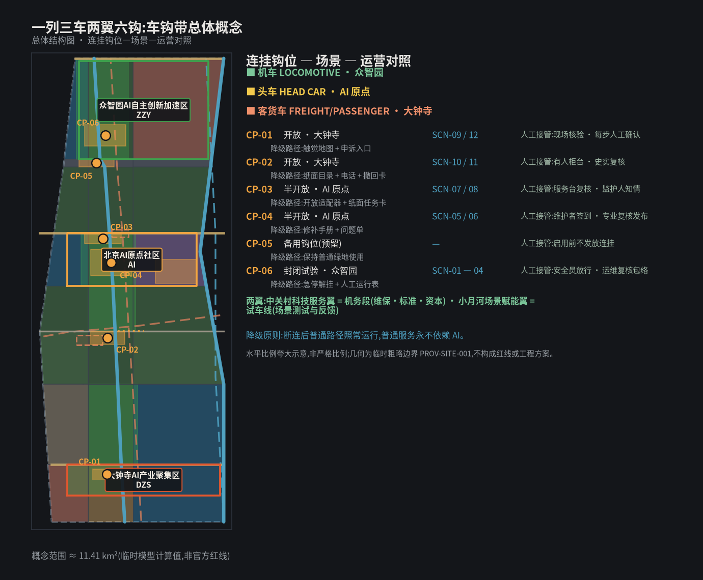
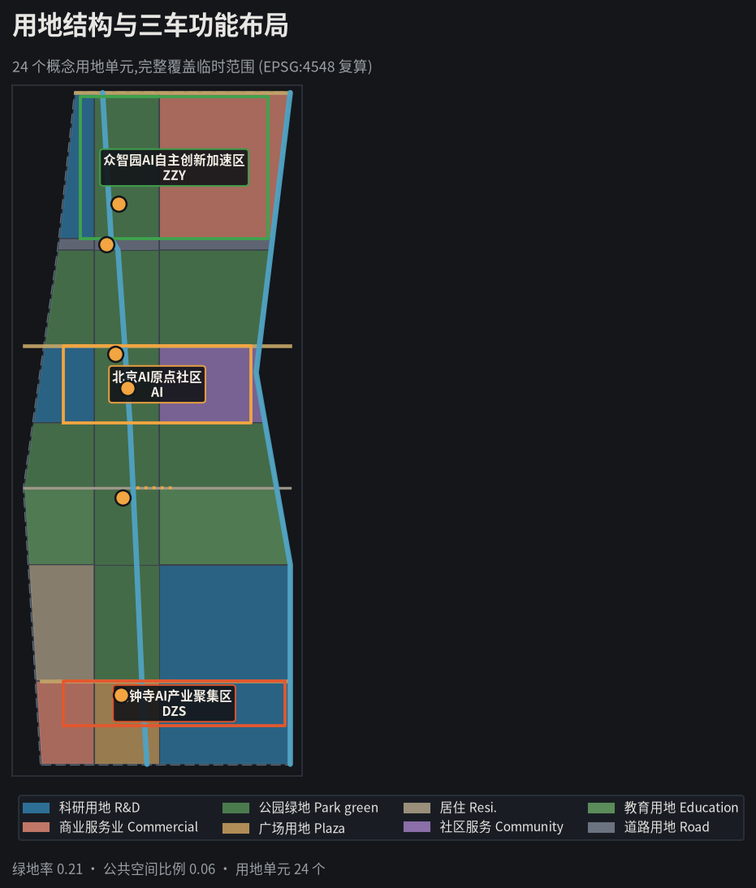
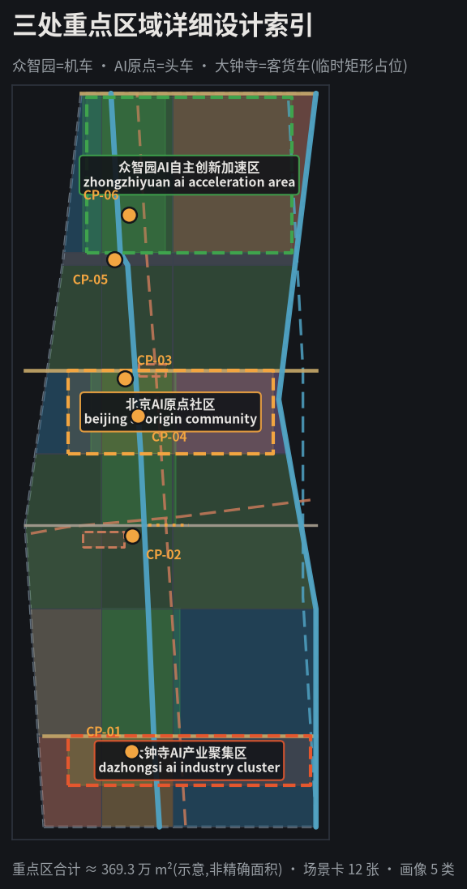
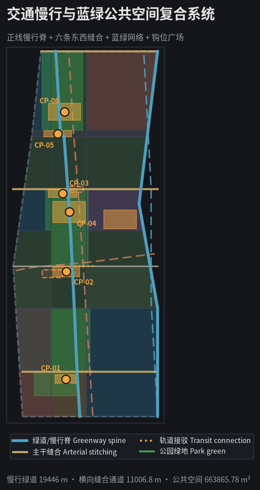
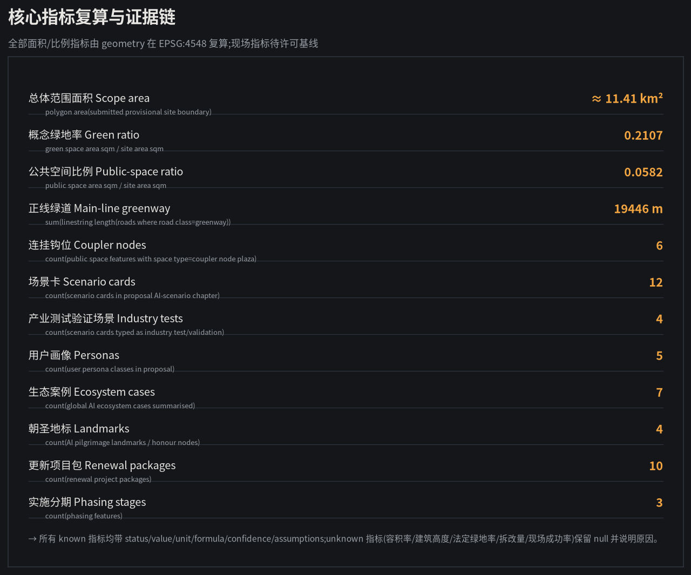

# 京张车钩带：标准接口、可连可解,一列城市列车

> **STANDARD INTERFACES · COUPLE AND UNCOUPLE · ONE URBAN CONSIST。** 早年的铁路列车,车厢与车厢之间靠人工插销连挂,遇险难解、脱钩频发;自动车钩的出现让连挂变成一次标准化的机械动作——可快速连挂、可随时解挂、可重新编组,而缓冲装置让每一次冲击都有余地。本案把这条百年工程智慧转译为 AI 创新带的城市协议:**每个 AI 场景像一节车厢,必须携带标准化接口并经由具名人工确认连挂,才能并入城市列车;标准接口、可连可解、缓冲降级、重编组有据。** [assumption:A-COUPLER-001] [assumption:A-COUPLER-HISTORY-001] [source:COUPLER-HISTORY-REF]

## 执行摘要

京张铁路 1905—1909 年由詹天佑主持建成,是中国人完全依靠自己力量修筑的第一条干线铁路,也是中国铁路标准化进程的现场:统一轨距、统一造桥筑路规程、统一部件检查,让"铁路如何被建造"成为可复制的工程知识 [source:OFFICIAL-JINGZHANG-HISTORY]。今天,这条百年正线已部分转化为京张铁路遗址公园:一期 2.5 公里、16.8 公顷位于清华东路至知春路之间,恢复老线、修复清华园站房,并利用旧铁轨、道岔、机车等元素缝合两侧城市 [source:OFFICIAL-PARK-PHASE1-2023]。我们问的是:**当 AI 创新带每天都有新模型、新机器人、新场景提出"接入城市",城市靠什么保证它们连得安全、停得干脆、退得干净?** 答案不是更复杂的平台,而是一个更古老的构件:车钩。

本案以"自动车钩"为核心机制,把全线组织为 **一列三车两翼六钩**:一条沿旧铁路的连挂正线(京张遗址公园活力带)是整列车的公共骨架;三处重点区转译为三节车厢——众智园=机车(全栈动力与测试牵引)、AI 原点=头车(驾驶舱与开源决策)、大钟寺=客货车(产业落地与日常生活);中关村科技服务翼=机务段(维保、标准与资本服务),小月河场景赋能翼=试车线(场景测试与反馈)(两翼);全线沿正线布置六处"连挂钩位"公共空间,承担场景与城市的连挂、解挂与缓冲展示 [data:geometry/constraints.geojson#CX-001] [metric:coupler_node_count]。每个 AI 场景是一节"车厢":接口是否标准、由谁确认连挂、断连后城市能否照常运行、失败时缓冲装置是否有效,全部写进每张场景卡的"连挂路单"(coupling route table) [metric:coupling_route_table_coverage_ratio]。

车钩不是新系统,而是把"连接"做成可见、可逆、可审计的对象:**标准接口(数据/权限/审计三接口)+ 具名人工确认 + 缓冲降级 + 解挂规程**,四者缺一不可。允许任务、数据边界、人工复核、停机条件与退出流程,全部登记在每张场景卡的路单里。AI 是车厢,不是铁轨;没有标准接口与人工确认,再强的模型也不能随便挂上城市列车。

空间上,本案在临时范围内划分 24 个概念用地单元,完整覆盖约 11.4 平方公里的临时总体范围(EPSG:4548 复算) [data:geometry/land_use.geojson] [metric:land_use_parcel_count];概念绿地率约 21.1%、公共空间比例约 5.8%,复算过程见蓝绿章节 [data:geometry/green_space.geojson] [metric:green_ratio] [metric:public_space_ratio];连挂正线与两翼绿道合计约 19.4 公里 [metric:spine_length_m],六处连挂钩位构成空间骨架 [data:geometry/public_space.geojson#CP-01] [metric:coupler_node_count]。所有几何基于仓库临时粗略边界,官方 polygon 发布后整链重算 [assumption:A-BOUNDARY-001]。

实施从"两钩三厢"开始,而不是一次铺满全线:众智园先发 1 个封闭试验钩位与试车线测试区,大钟寺先发 1 个开放体验钩位;AI 原点以影子运行方式先做"接口门诊与模型说明工坊" [metric:phasing_stage_count]。每一节车厢都以四句验收语收束:**接口是否公开可见;连挂是否具名确认;断连后普通服务是否照常;解挂后数据与设备是否干净撤离。** [data:risk.json] [depth:risk_missing_data]

## 设计依据与资料清单

方案证据分四层。

第一层是征集公告与智能体任务书,只界定三层空间、三大定位、五大功能、三区两翼与六项任务,是任务响应的主控依据:公告界定范围与深度 [source:OFFICIAL-ANNOUNCEMENT],任务书界定六大任务 [source:AGENT-TASKBOOK];两者对应两条强制标准 [standard:PROJECT-OFFICIAL-ANNOUNCEMENT] [standard:PROJECT-AGENT-OPEN-CALL-TASKBOOK]。

第二层是北京、海淀主管部门公开的公园建设与铁路遗产事实,用于建立"已有何物、为何更新"的背景 [source:OFFICIAL-PARK-PHASE1-2023] [source:OFFICIAL-JINGZHANG-HISTORY];AI 产业与智能体政策信息仅作产业语境,不推断到具体地块 [source:OFFICIAL-AGENTIC-AI-2026] [source:OFFICIAL-AI-ORIGIN-2026]。

第三层是仓库资料包、来源注册表与临时几何,用于可复算设计 [source:SITE-PACKAGE] [source:SOURCE-REGISTRY] [source:DATA-SRC-PROVISIONAL-BOUNDARIES-20260605]。

第四层是车钩制度科普与海外案例,只提取接口标准化、缓冲降级与可逆连接机制,不把境外制度或数值移植为北京标准 [source:COUPLER-HISTORY-REF] [source:CASE-NIST-AI-RMF];其余案例仅作机制比较,包括欧洲传感器治理经验 [source:CASE-AMSTERDAM-SENSING]、联合国人居署包容试点 [source:CASE-UNHABITAT-PEOPLE],以及亚洲两处工业遗产与数字园区实践 [source:CASE-SEOUL-OIL-TANK] [source:CASE-SINGAPORE-PUNGGOL]。

| 资料状态 | 本版可做 | 本版绝不做 | 触发下一版的证据 |
|---|---|---|---|
| 官方公告与任务书 | 界定范围、任务、深度与语言 | 推定现状主体、投资或审批 | 官方补遗与征集文件附件 |
| 官方公开事实(公园一期、铁路史、AI 产业) | 建立"已有何物、为何更新"背景 | 推断到具体地块或工程线位 | 官方现状测绘与项目资料 |
| 临时范围与九组 GeoJSON | 拓扑检查、概念分区、面积复算 | 官方红线、权属、征拆或工程结论 | official polygon 与测绘成果 |
| 车钩机制与海外案例 | 提取接口、缓冲、解挂机制 | 移植境外制度或数值 | 中国法律与专业团队深化 |

车钩机制的历史事实来自公开科普条目:自动车钩让车辆连挂无需人工插销,连挂可靠、解挂快捷,并可支持列车解钩重编组,缓冲装置吸收连挂与运行冲击 [source:COUPLER-HISTORY-REF] [assumption:A-COUPLER-HISTORY-001]。本案只借用其机制,不主张任何现行铁路规章适用于 AI 服务,也不把"城市车钩"写成法定审批制度 [assumption:A-COUPLER-001]。

完整来源、指标、标准、深度与任务覆盖存放在 sources.json、metrics.json 与三张矩阵中,正文只保留近端可核的引用。当前范围与重点区仍为临时几何,精度与替换条件如实披露 [data:geometry/site_boundary.geojson#PROV-SITE-001] [assumption:A-BOUNDARY-001]。

## 三层范围工作框架

三层不是三份各自成立的规划,而是同一套车钩逻辑从产业战略到空间再到试点的传导链 [depth:three_level_scope_framework]。

| 层级 | 核心问题 | 本版交付 | 不能越过的边界 |
|---|---|---|---|
| 统筹研究范围 | AI 产业、人才、公共问题与区域伙伴如何通过标准接口互连 | 车钩生态、7 案例、5 类画像、年度活动体系 | 不虚构伙伴、企业、资金或落地 |
| 总体设计范围 | 走廊怎样在技术更替中保持"可连、可解、可重编"的秩序 | 一列三车两翼六钩、24 个用地单元 | 临时 PROV-SITE-001 不是官方红线 |
| 三处重点区域 | 一次 AI 试验如何安全连挂、缓冲降级、干净解挂 | 12 张场景卡路单、三种车厢剖面、10 个项目包 | 临时矩形不是地块、权属或工程范围 |

每层使用同一条验收句:**接口是否公开可见;连挂是否具名确认;断连后城市是否照常运行;解挂后谁恢复、如何审计。** 统筹层若没有真实公共问题与接收方,不进入总体层;总体层若没有普通人工路径,不进入重点层;重点层若没有缓冲降级、维护主体与解挂规程,不进入试点 [depth:risk_missing_data]。

临时总体范围约 11.4 平方公里 [metric:site_area_sqm],三处重点区按公告名称、顺序与约面积粗略定位为矩形占位 [data:geometry/key_areas.geojson#PROV-KEY-001] [assumption:A-KEYAREA-001] [metric:key_area_total_sqm]。official polygon 到位后必须锁定版本、重裁全部图层、重算面积与比例、重新归属场景与项目、更新中英图件与 PDF,并发布差异日志 [depth:metrics_recalculation] [assumption:A-BOUNDARY-001]。

## 统筹研究范围产业与未来城市研究

任务书三大定位在本案中翻译为三种"连挂模式" [source:AGENT-TASKBOOK] [standard:PROJECT-AGENT-OPEN-CALL-TASKBOOK]:

| 三大定位 | 车钩翻译 | 五大功能落点 |
|---|---|---|
| 百年京张文化带 | 从"自主修第一条铁路"的工程文化,转向"自主修可信接口基础设施"的标准化文化 | AI 治理全球话语权 |
| 都市AI生活体验带 | 公众在同一正线上比较"无钩普通服务"与"持钩 AI 服务" | AI+场景赋能新范式、智能化 AI 活力城市 |
| AI 融合创新带 | 研发、测试、开源、转化与公共使用按"连挂-运行-缓冲-解挂"顺序运行 | AI 全栈自主创新体系、世界级 AI 创新生态 |

**三区两翼的车钩回路。** 众智园机车签发"试验连挂",在封闭钩位与试车线验证具身智能、端侧算力与安全解挂 [source:OFFICIAL-AI-TESTFIELD-2026] [source:OFFICIAL-EMBODIED-PARK-2025];AI 原点头车签发"开源连挂",把通过验证的模型、适配器与说明文件开放为可复用公共件 [source:OFFICIAL-AI-ORIGIN-2026];大钟寺客货车签发"运营连挂",在开放钩位运行面向公众的产业体验与生活服务。中关村科技服务翼提供法律、标准、资本与专业服务方向,小月河场景赋能翼提供公共问题、生态与生活反馈方向;两翼不绕过三车的确认闸门 [depth:three_key_area_detailed_design]。

区域协同只提出待同意的"输入—可分享输出",不虚构伙伴:北纬社区可提出居民问题,未来科学城可提供测试方法方向,怀柔科学城可提供测量与校准方向,经开区可提供工程制造反馈,京津冀只接收去地点化协议、失败包与版本差异。任何坐标、个人数据、审批结论或合作名义不跨区默认流动 [assumption:A-PRIVACY-001]。

**七个全球生态案例压缩为七种可迁移机制** [metric:ai_ecosystem_case_count] [assumption:A-ECOSYSTEM-001]:

| 案例/框架 | 可迁移机制 | 京张转译 | 明确拒绝照搬 |
|---|---|---|---|
| Punggol Digital District [source:CASE-SINGAPORE-PUNGGOL] | 开放平台、产学城混合、运行环境试验 | 三车按封闭/半开放/开放分型验证 | 不复制新城规模、投资与中央平台 |
| NIST AI RMF [source:CASE-NIST-AI-RMF] | 全生命周期风险与停用记录 | 车钩生命周期=连挂-运行-缓冲-解挂 | 不以框架替代专业安全责任 |
| Amsterdam Responsible Sensing [source:CASE-AMSTERDAM-SENSING] | 从自由、控制与隐私出发设计传感器 | 传感器必须有可见用途、接口与拔线权 | 不把公共空间默认成数据源 |
| UN-Habitat People-Centred [source:CASE-UNHABITAT-PEOPLE] | 数字公共品、包容、小规模试点 | 无钩普通服务与持钩 AI 服务并行 | 不把非约束指南当审批依据 |
| Seoul Oil Tank Culture Park [source:CASE-SEOUL-OIL-TANK] | 工业遗产转为公共文化空间 | 车钩、道岔、机车成为可触摸记忆 | 不复制建筑形式或改造结论 |
| 自动车钩普及史 [source:COUPLER-HISTORY-REF] | 接口标准、可靠连挂、可逆解挂 | 城市车钩=具名人工确认的标准接口 | 不主张铁路规章直接适用 |
| 京张铁路建设史 [source:OFFICIAL-JINGZHANG-HISTORY] | 自主设计、统一标准、精密测量 | "自主修 AI 接口"的工程纪律叙事 | 不把历史事实推演为工程结论 |

**命名、Logo 与视觉识别** 围绕"一只标准车钩"展开:中文主名"京张车钩带",英文主名 THE JING-ZHANG COUPLER BELT,国际传播口令 STANDARD INTERFACES · COUPLE AND UNCOUPLE · ONE URBAN CONSIST。Logo 方向为一只自动车钩端面与半环咬合的抽象符号:主钩代表"公共正线",环槽代表"数据、权限、审计"三个接口,半环缺口代表"可解挂";色彩使用轨枕褐、耐候钢灰、信号朱红与钢青,红只标"停/解挂",青标"连挂/通行",灰标"标准件"。命名与 Logo 均为概念方向,不伪装官方标识 [assumption:A-VERB-001]。

## 总体设计范围城市更新与控规深度城市设计

总体结构为"**一列三车两翼六钩**":一条沿旧铁路方向的连挂正线(京张遗址公园活力带)串联三节车厢——众智园=机车、AI 原点=头车、大钟寺=客货车 [data:geometry/roads.geojson#RD-001] [metric:spine_length_m];六处连挂钩位 CP-01—CP-06 沿正线布置,优先修补东西向缝合,同时承担连挂确认与缓冲展示 [data:geometry/public_space.geojson#CP-01] [metric:coupler_node_count];整体空间结构由约束图层直接支撑 [depth:overall_spatial_structure]。

24 个概念用地单元使用官方分类代码,完整覆盖临时 PROV-SITE-001,无空隙无重叠 [data:geometry/land_use.geojson#LU-001] [metric:land_use_parcel_count] [standard:MNR-LAND-USE-CLASSIFICATION-GUIDE]。科研、产业与公共服务贴近三车,居住与社区服务分布于东西两翼,正线以公园绿地与广场用地保持公共连续 [depth:land_use_layout] [standard:MOHURD-URBAN-DESIGN-MEASURES]。"车厢""钩位"是运营叠加标签,不改变土地用途。

**三节车厢按风险分型:** 众智园机车为"试验车厢",机器人与传感器只允许出现在物理受控的封闭钩位,普通路径与消防通道永不作为测试变量 [assumption:A-DELIVERY-001];AI 原点头车为"开源半开放车厢",前廊只放可公开、可复用、可撤回的版本,知识产权与商业秘密留在受控后室;大钟寺客货车为"运营开放车厢",AI 服务只做增益,不做终局决定,真实支付、医疗、法律、执法与评分一律保留人工 [depth:traffic_rail_slow_parking] [assumption:A-AI-001]。

**六处连挂钩位 CP-01—CP-06** 同时是东西横缝与连挂交接点:每条横缝以人行优先连接两侧住区与园区,钩位广场承担"接口展示—人工确认—公众查询"三种功能 [data:geometry/public_space.geojson#CP-01] [metric:coupler_node_count]。钩位不是安检站,而是"看得见的连接":接口清单实物陈列、确认人具名、查询屏只显示连挂状态与有效期,不采集通行者个人信息 [depth:blue_green_public_space] [assumption:A-PRIVACY-001]。

**城市更新顺序** 是:保留现状公共价值 → 修补通行、遮荫、排水与人工服务 → 安装可逆构件 → 影子运行持钩 AI → 审计 → 决定保留、修改或拆除。建筑高度、容积率、密度、退线、停车、市政容量与拆除量统一登记 unknown,概念体量不代表法定控制值 [assumption:A-CONTROLS-001] [depth:development_intensity_controls]。其中 FAR、高度与法定绿地率的具体值均待官方控制条件,不反推、不估值 [metric:floor_area_ratio] [metric:building_height_control_m] [metric:green_ratio_statutory]。
## 重点区域详细设计

三处重点区均使用组织方临时粗略 polygon,矩形边不代表道路、地块或权属 [data:geometry/key_areas.geojson#PROV-KEY-001] [assumption:A-KEYAREA-001]。

| 重点区 | 车厢 | 连挂类型 | 空间剖面 | 首批场景 |
|---|---|---|---|---|
| 众智园 AI 自主创新加速区 | 机车 | 试验连挂(封闭) | 公共观察花园—可触摸安全库—受控试验钩位—隔离后勤 | SCN-01—04 |
| 北京 AI 原点社区 | 头车 | 开源连挂(半开放) | 无账号前廊—修补长桌—开放零件墙—受控驾驶后室 | SCN-05—08 |
| 大钟寺 AI 产业聚集区 | 客货车 | 运营连挂(开放) | 全天普通路径—触觉地图—有人柜台—限时合成沙盒 | SCN-09—12 |

**众智园=机车。** 具身智能、端侧算力、红队测试只在有物理边界、人工急停与隔离后勤的封闭钩位进行;公众观察花园是"安全库"而非品牌看台,可触摸测试障碍、阅读失败原因、比较断网模式 [source:OFFICIAL-AI-TESTFIELD-2026] [source:OFFICIAL-EMBODIED-PARK-2025]。测试通过不等于监管或产品批准;能源容量、平台资质、责任主体与生态条件另行核查 [depth:three_key_area_detailed_design]。

**AI 原点=头车。** 空间以"修补"而非"路演"为中心:一张公共长桌承接开源 issue 门诊、接口适配、双语模型说明与青年反向导师课;模型卡、适配器、失败档案与维修手册是开放零件墙的常设内容 [source:OFFICIAL-AI-ORIGIN-2026] [source:OFFICIAL-AGENTIC-AI-2026]。AI 停机后,桌、工具、手册、纸面流程与人际网络仍能运行。

**青年友好作为贯穿原则。** 青年友好不是单一场景,而是贯穿空间与治理的常设机制:SCN-08 反向导师课升级为常态化的"青年共治论坛",在 AI 原点公共长桌旁设"青年连挂钩位"实体空间;青年不仅作为学习者,也作为连挂机制的共同设计者与评审者——定期参与路单草稿评议与解挂节复盘,评议席位与流程由运营团队按现行青少年参与实践设计,不预设法定权限 [assumption:A-VERB-001]。

**大钟寺=客货车。** 先做地面、首层与静态信息,不以桥隧或地下连通的工程想象替代现状调查;触觉地图、有人柜台与京张记忆步道全天可用,消费智能体只在合成交易与逐步人工确认下限时出现 [source:OFFICIAL-PARK-PHASE1-2023] [depth:height_massing_character]。只要普通路径被堵、真实支付被接入、人工柜台离岗或申诉不可用,场景立即解挂停运。

## AI 创新生态、人才画像与 AI+ 场景

五类画像不是营销标签,而是连挂权限设计的输入 [metric:persona_count]:研发与开源维护者、初创与产品团队、公园使用者与居民、老年与残障使用者、国际访客与区域伙伴。任何一类都不能替另一类同意;非参与者的通行、安静与普通服务优先 [assumption:A-AI-001]。

**公众作为共同治理者(概念机制)。** 三项机制把公众从"被服务者"提升为"共同治理者":① 公众连挂评议团——涉及公共空间与服务的开放钩位在连挂前,随机抽选公众代表(特别保证老年与残障代表席位)参与评议,意见作为连挂参考;② 物理车钩认知工具包——为大字版流程图、实物模型与简化操作卡等降低理解门槛的工具提供常设展示与借用点;③ 非技术背景体验官——AI 原点头车为社区老年人、青少年等非技术背景公众设置固定体验官席位,参与模型说明与失败档案审阅。具体名额、抽选方式与效力由运营与法律团队按现行公众参与制度设计,不承诺自动采纳 [assumption:A-VERB-001]。

**12 张场景卡,每张绑定一张连挂路单** [metric:scenario_card_count] [metric:coupling_route_table_coverage_ratio]:

| ID | 场景 | 车厢/钩位 | 允许任务 | 数据边界 | 人工复核 | 缓冲与解挂路径 | 类型 |
|---|---|---|---|---|---|---|---|
| SCN-01 | 自动连挂耐久试验 | 众智园 CP-06 | 多主体连挂/解挂循环演练 | 仅试验场合成数据 | 安全员具名放行 | 纸面安全边界+急停解挂 | 产业测试 |
| SCN-02 | 缓冲器标定试验 | 众智园试验钩位 | 冲击/满载/断连缓冲标定 | 仅能耗聚合读数 | 运维员复核包络 | 人工运行表+备用缓冲 | 产业测试 |
| SCN-03 | 解挂与急停演练 | 众智园/试车线 | 断电断网下的应急解挂 | 无个人数据 | 披露责任复核 | 失败卡+人工解挂规程 | 产业测试 |
| SCN-04 | 端侧算力断网韧性 | 众智园封闭钩位 | 离线/降级/能耗比较 | 仅能耗聚合读数 | 运维员复核包络 | 人工运行表+电话闭塞 | 产业测试 |
| SCN-05 | 开源车钩库维护门诊 | AI 原点 CP-04 | issue 归类、接口依赖检查 | 仅公开代码库 | 维护者签到复核 | 修补手册+问题单 | 公共 |
| SCN-06 | 双语模型说明工坊 | AI 原点 CP-04 | 草拟通俗说明与差异 | 无训练数据上传 | 专业复核后发布 | 中英术语卡模板 | 公共 |
| SCN-07 | 城市服务互操作沙盒 | AI 原点 CP-03 | 合成工单检查转接 | 仅合成数据 | 服务台复核转接 | 开放适配器+纸面流程 | 公共 |
| SCN-08 | 青年反向导师课 | AI 原点 CP-03 | 自愿学习伙伴匹配 | 最小必要,可随时退出 | 监护人知情(未成年人) | 纸面任务卡+工具目录 | 公共 |
| SCN-09 | 无障碍慢行双轨导航 | 大钟寺 CP-01 | 临时障碍与路线辅助 | 无定位留存 | 现场核验普通路线 | 触觉静态地图+热线 | 公共 |
| SCN-10 | 公共服务分诊柜台 | 大钟寺 CP-02 | 公开目录检索与材料提示 | 无敏感材料滞留 | 有人柜台复核 | 纸面目录+电话路径 | 公共 |
| SCN-11 | 京张记忆共读 | 大钟寺 CP-02 | 清权史料检索与多语解释 | 仅公开清权史料 | 史实复核 | 实体时间线+撤回卡 | 公共 |
| SCN-12 | 消费智能体拔线沙盒 | 大钟寺 CP-01 | 合成预算与逐步确认 | 无真实支付接入 | 每步人工确认 | 人工比价板+申诉入口 | 公共 |

路单是场景卡的强制字段:允许任务、禁止任务、数据边界、人工复核、缓冲触发条件、解挂流程、连挂类型缺一不可。生成式 AI 服务遵守《生成式人工智能服务管理暂行办法》对内容与责任的要求 [standard:GENERATIVE-AI-INTERIM-MEASURES] [source:DATA-SRC-GENERATIVE-AI-INTERIM-MEASURES];无障碍场景遵循《无障碍环境建设法》与国办 45 号文的适老要求,普通路径、纸面流程与有人柜台始终保留 [standard:BARRIER-FREE-ENVIRONMENT-LAW] [standard:ELDERLY-SMART-TECH-PLAN-2020-45];两部文件的公开文本分别登记于来源索引 [source:DATA-SRC-BARRIER-FREE-ENVIRONMENT-LAW] [source:DATA-SRC-ELDERLY-SMART-TECH-PLAN-2020-45]。

**电子车钩与 AI 技术架构(概念方向)。** 电子车钩建议采用"标准接口+版本化连接"结构:连挂时生成带确认人标识与哈希链的连接凭证,验证时不采集个人身份,解挂时写入物理与数据撤离记录;具体加密、防篡改与互认协议由数据与信息安全专业团队按现行标准设计 [assumption:A-COUPLER-001]。模型部署采用"端侧优先、云端备案、边缘可断"的分级策略:试验区以端侧与边缘推理为主,断网演练为必测项;模型准入需通过性能基线、安全测试与失败档案三项技术门槛,版本更新走 C0—C7 闸门 [depth:municipal_new_infrastructure]。数据管道只处理公开或授权数据,清洗、脱敏与删除流程写入路单 [assumption:A-PRIVACY-001]。

**电子车钩字段原型与路线对比(概念)。** 为便于工程评估,电子车钩建议至少包含:coupler_id(连接号)、confirmer(确认人标识)、coupled_at(连挂时间)、expires_at(有效期)、platform_id(接入正线/钩位)、model_hash(模型版本哈希)、route_table_ref(路单版本)、buffer_trigger(缓冲触发条件)、uncouple_status(解挂状态)。存证与验证存在至少三种可比较的技术方向:中心化数据库(简单、成本低、单点风险)、联盟链存证(可审计、多机构互认、成本与运维更高)、零知识证明式隐私验证(验证不暴露额外信息、技术门槛最高);优劣、成本与适用区间应由数据与信息安全专业团队结合试点规模评估,本包不作选型结论 [assumption:A-COUPLER-001]。

**非空间 AI 服务的车钩边界。** 对不占用公共空间的纯数据服务(远程推理、后台模型),车钩机制以"数据车钩"形式适用:只授权公开/授权数据集的进入与输出,不授权个人敏感数据跨区流动;若服务最终输出进入公共空间展示或交互,则升级为对应钩位的空间车钩 [assumption:A-COUPLER-001] [assumption:A-PRIVACY-001]。

每张卡还登记"缓冲触发与解挂流程":设备如何断电、数据如何删除或归档、人工流程如何接管、失败档案存于何处 [depth:municipal_new_infrastructure] [depth:retain_renovate_demolish]。现场绩效指标在获得许可基线前保持 null,不填 0、不填 100%、不做估值 [metric:live_service_success_rate] [assumption:A-METRICS-001]。

## 用地、建筑规模与拆改留方案

概念用地 24 个单元在临时 PROV-SITE-001 内闭合,不是法定面积 [data:geometry/land_use.geojson#LU-001] [metric:site_area_sqm]。用地结构沿正线分层:三车周边为科研与产业用地,两翼为居住、教育与社区服务,正线以 1401 公园绿地与 1403 广场保持公共连续,钩位局部保留可逆试验缓冲 [standard:MNR-LAND-USE-CLASSIFICATION-GUIDE] [depth:land_use_layout]。

建筑图层只含概念占位体量,总轮廓面积约 95.3 万平方米用于内部关系诊断 [data:geometry/buildings.geojson#BLDG-001] [metric:building_footprint_area_sqm] [assumption:A-BUILDING-001]。任何真实建筑进入方案前,依次完成现状、年代、结构、权属、消防、文保、租赁、首层可达与维护调查;决策树只有四个出口:保留原状、修缮、可逆适配性再用、另行论证,证据不足时默认保留,不产生拆除清单 [depth:retain_renovate_demolish] [metric:construction_demolition_scale]。

三种车厢都把公共层放在最外侧与首层:机车的观察花园不穿过测试区;头车的公共长桌不进入受控数据后室;客货车的触觉地图与有人柜台不依赖商业租户。智能设备只挂接可逆插接轨,到期连电缆、基座与数据一并解挂撤除,不留下围栏、断路、空屏或无人维护的"数字废墟" [depth:height_massing_character]。

## 交通、轨道、市政与公共服务设施

交通策略在当前资料上只成立两项:沿正线保持一条普通公共慢行脊,优先修补六处东西横缝 [data:geometry/roads.geojson#RD-001] [metric:spine_length_m]。两翼服务通道作为概念连接,不计工程线位 [metric:flank_road_length_m];具体交通组织属专业判断,本包只表达连接意图 [depth:traffic_rail_slow_parking]。它们是连接意图而非工程线位;轨道安全、道路红线、客流、路口、停车、桥隧与地下连通须由交通与轨道专业团队另行判断 [assumption:A-CONTROLS-001]。

低速机器人只在众智园物理受控试验钩位出现,具名安全员能停、能推、能隔离;公园普通路径、无障碍净宽与消防通道永不作为"智能物流效率"测试变量 [assumption:A-DELIVERY-001]。SCN-09 导航必须同时发布触觉静态图与现场核验路线,算法建议不替代交通安全责任 [standard:BARRIER-FREE-ENVIRONMENT-LAW]。

市政与数字基础设施采用"普通系统先行、智能插件后置":雨水、照明、应急、通信、供电与消防基础功能按专业标准独立运行;传感器、边缘计算、机器人与模型接入统一可逆插接轨,登记电源、网络、数据、维护人与拔线动作 [depth:municipal_new_infrastructure]。断网、断电或供应商退出后,离线灯、人工雨尺、纸面目录与有人柜台继续提供最低服务——这就是"人工解挂"式的城市降级。

公共服务坚持四条并行路径:现场人工、纸面材料、电话、无账号数字入口。AI 可以检索与翻译,不能作医疗诊断、法律结论、福利资格、信用评分、执法或真实支付决定 [assumption:A-AI-001] [standard:GENERATIVE-AI-INTERIM-MEASURES]。任何试点的人力、班次、维护、保险与持续预算在授权前保持 unknown [assumption:A-RESOURCES-001]。

## 蓝绿空间、公共空间与城市风貌

临时范围内概念绿地约 240.5 万平方米、比例约 21.1%,概念公共空间约 66.4 万平方米、比例约 5.8%,均只用于内部复算 [data:geometry/green_space.geojson#GR-001];绿地率与绿地面积见指标索引 [metric:green_ratio] [metric:green_space_area_sqm]。公共空间比例与蓝绿系统设计深度分别见对应图层与深度项:面积与比例见指标索引 [data:geometry/public_space.geojson#CP-01] [metric:public_space_ratio] [metric:public_space_area_sqm],设计深度以蓝绿公共空间项收束 [depth:blue_green_public_space]。生态、树木、土壤、雨洪、河道、养护与文保条件尚未形成专项结论。

蓝绿系统是"无钩公共红利"的载体:连续树荫与休息、雨洪可读、安静边界、普通步行与可维修材料,全部不依赖 AI。任何自动控制不得把未经核实的数据直接写入排水或生态设施动作 [assumption:A-DELIVERY-001]。

**四个 AI 朝圣地标** [metric:landmark_count],全部可逆、不预设新建筑,附着遗产本体的动作必须经文保审查 [source:OFFICIAL-PARK-PHASE1-2023] [depth:height_massing_character]:

| 地标 | 位置 | 内容 | 意义 |
|---|---|---|---|
| 车钩塔 | 众智园 CP-06 观察花园 | 可触摸自动车钩实物墙+失败档案陈列 | 标准接口的信任感 |
| 连挂钟 | AI 原点 CP-04 公共长桌 | 旧式站钟+连挂时刻牌+贡献者名单 | 人工确认的节律 |
| 扳道员记忆廊 | 正线中段钩位 | 铁路扳道员/调度员口述与工具展示 | 普通劳动者的城市记忆 |
| 编组灯阵 | 大钟寺 CP-01 站台 | 可逆信号灯组,红停青行对应连挂状态 | 把连接状态变成公共语言 |

荣誉展示系统不只记录成功,也记录修补、停用、负面结果、维护劳动与公众纠错——这是车钩文化的核心:接口的价值在于它也可以被干净地解挂。风貌采用轨枕褐、耐候钢、浅色木、矿物铺装与可替换金属件;界面低亮度、可关闭、无巨屏 [standard:MOHURD-URBAN-DESIGN-MEASURES]。AI 生成概念图只表达材料气质与人本场景,不证明建筑、边界、植被、人数或实施效果 [source:IMAGEGEN-CONCEPT-COUPLER] [assumption:A-CULTURE-001]。
## 更新项目清单、实施政策与分期计划

十个项目包彼此可独立暂停 [metric:renewal_project_count] [depth:renewal_project_list]:

| 项目 | 核心交付 | 进入条件 | 失败后的默认动作 |
|---|---|---|---|
| PRJ-01 车钩制度沙盒 | 连挂路单 schema、样例与连挂流程 | 法律、数据、公众复核 | 归档,不进现场 |
| PRJ-02 正线公共脊审计 | 普通通行、休息、静态导向与人工求助基线 | 官方范围与现场走查 | 公示缺口,不接 AI |
| PRJ-03 众智园试验钩位 | 一个封闭试验钩位与试车线测试区 | 责任、能源、生态、安全 | 停测、复原、公开失败 |
| PRJ-04 大钟寺开放钩位 | 一个开放体验钩位与有人柜台 | 交通、权属、消费者权益、无障碍 | 只保留普通服务 |
| PRJ-05 钩位横缝修补 | 六处东西缝合与接口展示点 | 权属、交通、文保、无障碍复核 | 维持现状并隔离风险 |
| PRJ-06 AI 原点影子门诊 | 开源接口门诊与模型说明工坊 | 场地、知识产权、消防、运营 | 退回纸面门诊 |
| PRJ-07 可逆构件库 | 插接轨、离线灯、人工雨尺等 | G0—G5 | 解挂拆除并恢复 |
| PRJ-08 四座朝圣地标 | 可逆地标与贡献/失败档案 | 来源、版权、文保、维护 | 不永久展示 |
| PRJ-09 连挂发放监测 | 连接生命周期与审计记录 | 数据、法律、独立评估 | 停发并公示 |
| PRJ-10 解挂节 | 年度降级演练与开放复盘 | 许可、人员、预算、安全 | 缩小、延期或取消 |

**实施分期** [data:geometry/phasing.geojson#PH-001] [metric:phasing_stage_count] [depth:phasing_implementation]:近期(钩位先发)——众智园一个试验钩位 + 大钟寺一个开放钩位先动,车钩制度与审计在沙盒中跑通;中期(开源贯通)——AI 原点开源门诊、模型说明工坊与钩位横缝补齐,全线完成普通基线审计;远期(常态运营)——全部钩位进入持钩运营,按季度发布"连挂报告"(连挂、缓冲、解挂、失败档案统计)。

**连挂治理组织(概念)。** 车钩运行建议由四类具名角色分担,任何角色缺失即停发连挂:确认员(审核路单并确认连挂)、钩位员(在钩位核验交接)、审计员(独立复核连挂/解挂记录)、正线守护人(维护普通服务与人工缓冲路径)。四类角色可由现有公共部门、社区与专业机构人员兼任,具体职责、权限与法律责任由专业团队按现行制度设计,不预设新增编制 [assumption:A-COUPLER-001]。

**品牌与导视应用规范(方向)。** 为让车钩符号从封面走进场地,建议后续深化时按三级应用:一级导视(钩位广场入口)使用车钩端面环形标志与"连挂中/可解挂"红青状态灯箱,夜间亮度不干扰铁路视距;二级导视(场景车厢门前)使用路单二维码牌与三接口图标,牌面文字双语且高度兼顾轮椅与儿童视线;三级导视(正线慢行脊)仅用枕木色地面标线与小型铭牌,不做广告化延展。所有导视构件均为可逆安装,材质与文保缓冲区要求一致 [assumption:A-COUPLER-001]。

**公众参与协议(概念草案要点)。** 为把上述参与机制落到可执行层面,建议运营团队在试点前公示一份一页式《连挂公众参与协议(草案)》,要点包括:代表招募通过居委会公告、公园现场二维码与线上表单三渠道并行,明确任期与退出;未成年人参与一律需监护人知情同意,青年共治论坛设置成人联络人;每季度一次无障碍用户实测(邀请残障使用者走查钩位与柜台),结果并入失败档案;公众评议意见分"采纳/部分采纳/不采纳+理由"三类逐条书面回复,回复时限 15 个工作日;申诉经有人柜台或电话受理后 5 个工作日内转交审计员复核。以上均为流程设计建议,不构成对任何机构的程序性约束 [assumption:A-COUPLER-001]。

**场景准入 C0—C7 闸门。** 连挂签发按七级递进:完成路单登记 → 无钩普通基线可运行 → 持钩影子运行 → 具名人工值守下有限连挂 → 常态化运营 → 独立审计通过 → 发放年度连挂凭证。每一级都要求上一级证据闭环,任何一级失败即回到上一级,不跳过、不并行背书 [depth:phasing_implementation]。

**C0—C7 准入判据模板与记录规范(框架)。** 为使闸门可审计,每级准入建议按「判据类型—度量方法—通过阈值—复核频次—证据保存」五列登记;阈值数值一律待许可基线建立后由专业团队标定,本版只固定框架与度量口径 [depth:phasing_implementation]:C2 影子运行的判据为"断连演练 N 次全部走普通路径"(N 与采样窗在授权后标定);C4 常态化运营的判据为"人工复核覆盖率 100%、复核记录可回溯";C6 独立审计的判据为"抽样路单双盲复核一致率达标"。证据保存:路单、复核与失败卡入包内 JSON 同构格式,保存期与个人数据最小化规则由数据保护责任方确定。停运恢复记录采用统一字段模板:事件编号 / 钩位 / 触发时间 / 降级路径 / 恢复时间 / 具名确认人 / 关联失败卡编号。申诉升级阶梯:有人柜台或电话受理 → 审计员 5 个工作日复核 → 公众评议团季度会议复议 → 年度解挂节公开复盘。

**试点人力与预算量级(概念测算)。** 两个试点钩位的最小运行编制建议为:每钩位 1 名确认员(可兼钩位员)、1 名正线守护人、1 名兼职审计员,首年约 5—7 个全职等效岗位;车钩制度沙盒(PRJ-01)最低启动条件为路单 schema、一个模拟连挂环境与一次 12 周推演,预算量级以常规公共咨询与数字化项目为参照估算。上述数字均为概念测算,不构成投资、采购或财政承诺 [assumption:A-RESOURCES-001]。

**试点启动责任—证据—资源基线表(PRJ-01/PRJ-02 与两个先发钩位)。** 供专业团队接手时直接使用,均为概念建议 [assumption:A-COUPLER-001] [assumption:A-RESOURCES-001]:

| 工作项 | 牵头角色(候选方向) | 关键交付证据 | 资源量级(概念) | 完成判据 |
|---|---|---|---|---|
| 连挂路单 schema 定稿 | 确认员(候选:发改或规划部门牵头) | schema 文档、3 份模拟路单、公众可读说明页 | 1 名兼职架构师 ×6 周 | 公众评议会通过并归档 |
| 普通基线走查(PRJ-02) | 正线守护人(候选:城管/公园部门) | 分段通行/休息/求助点台账、缺口照片库 | 2 名走查员 ×4 周 + 1 名复核 | 缺口清单公示满 30 天 |
| 试验钩位场地与安全边界 | 钩位员(候选:园区管理机构) | 场地平面、围栏与消防复核意见、能源接入方案 | 视场地现状,原则上可逆构件 | 安全复核签字 + 影子运行许可 |
| 开放钩位有人柜台 | 钩位员+确认员双岗 | 值班表、无障碍动线核查、投诉响应承诺 | 每开放日 2 人 | 无障碍与消费者权益复核通过 |
| 审计与失败档案 | 审计员(候选:第三方机构) | 月度连挂/解挂记录、失败档案公开页 | 1 名兼职审计员(持续) | 首份月报公开可下载 |

表内角色均为四类具名角色的具体化,产生方式与法律责任由专业团队按现行制度确定;表中不预设任何部门的法定职责。

**试点牵头与授权路径(概念建议)。** 建议初期试点由海淀区相关政府部门(如发改、规划、城管或公园管理部门)按现行职责牵头协调,作为最终"连挂"确认责任方的候选方向;四类具名角色配备初步岗位职责说明与授权清单草案,明确职责边界与问责关系,角色产生方式(编制内兼任/购买服务/志愿)由专业团队按现行制度确定。上述均为深化方向,不构成对任何部门的职责安排或授权承诺 [assumption:A-COUPLER-001] [assumption:A-VERB-001]。

**试点启动检查清单(概念)。** 进入条件条目化为可勾选事项:责任主体确认、能源容量核验、生态与文保评估、安全预案备案、无障碍复核、普通基线走查、解挂演练一次通过——任一未勾选即不发连挂 [assumption:A-COUPLER-001]。

**成本与规模边界。** 试点人力、班次、维护、保险与预算在授权前保持 unknown [assumption:A-RESOURCES-001];本包只承诺"可独立暂停"的包结构,不给出投资测算或财政承诺 [assumption:A-VERB-001]。

项目成熟度 G0—G7 与场景准入 C0—C7 是两套独立闸门:一个场景通过不能替另一个场景背书,一个项目有预算也不能绕过"无钩不连挂"。年度运营含四项节奏:每周开源接口维修门诊;每月一次解挂降级演练(全线每年共 12 次) [metric:fallback_drill_count];每季度独立评估者、维护者与受影响公众共同发布连挂报告;每年举办"解挂节"——用中英双语展示连挂、缓冲、解挂与修补,把开放复盘做成一带最持久的品牌事件。开发者与企业的转化路径不是"路演—招商",而是"公共问题—普通基线—持钩增益—缓冲演练—开放资产—专业采用" [source:CASE-UNHABITAT-PEOPLE] [assumption:A-EVENT-001]。

## 指标体系、面积复算与合规矩阵

指标分三层。

**临时几何诊断。** 范围、绿地与公共空间比例有公式但无法定效力 [metric:site_area_sqm] [metric:green_ratio] [metric:public_space_ratio];概念建筑基底面积由几何复算 [metric:building_footprint_area_sqm],正线绿道与两翼通道见对应指标 [metric:spine_length_m] [metric:flank_road_length_m],重点区面积为临时几何复算 [metric:key_area_total_sqm]。

**车钩机制完整度。** 钩位与场景卡数量均可由包内 JSON 计数 [metric:coupler_node_count] [metric:scenario_card_count],用户画像分类见画像章节 [metric:persona_count];生态案例与朝圣地标数量见生态与风貌章节 [metric:ai_ecosystem_case_count] [metric:landmark_count],更新项目与用地单元数量见项目清单章节 [metric:renewal_project_count] [metric:land_use_parcel_count]。

路单覆盖与产业测试场景为机制验收指标 [metric:industry_test_scenario_count] [metric:coupling_route_table_coverage_ratio];年度演练与分期安排见运营章节 [metric:fallback_drill_count] [metric:phasing_stage_count]。

**现场效果。** 服务成功率、恢复时间、负担分布,目前全部 null [metric:live_service_success_rate]。

空间指标在 EPSG:4548 复算,来源、公式、单位、置信度逐项记录,并与空间复核脚本闭环校验 [depth:metrics_recalculation]。

合规矩阵覆盖公告 1.3/1.4/1.5 共 17 项与 agent.1—agent.6 共 6 项,任务书与公告分别作为主控依据 [standard:PROJECT-OFFICIAL-ANNOUNCEMENT] [standard:PROJECT-AGENT-OPEN-CALL-TASKBOOK]。

标准矩阵覆盖 5 项强制性标准与 4 项扩展标准,其中城市设计与控规口径分别登记 [standard:MOHURD-URBAN-DESIGN-MEASURES] [standard:MOHURD-CONTROL-DETAILED-PLANNING];用地分类与建筑设计深度标准亦逐项响应 [standard:MNR-LAND-USE-CLASSIFICATION-GUIDE] [standard:MOHURD-ARCH-DESIGN-DEPTH-2016]。设计深度矩阵覆盖 15 项专业判断 [depth:existing_conditions_diagnosis] [depth:metrics_recalculation]。

official polygon 到位后需全量复算,不能只手改标题数字 [assumption:A-BOUNDARY-001];现场指标在许可基线建立前保持 null,不填 0、不填 100%、不做估值 [assumption:A-METRICS-001]。

## 风险、版权与合规说明

最严重的失败不是模型输出错误,而是**接口系统失灵后,AI 服务在未确认状态下仍然占用公共空间**。因此以下均为硬停止:无标准接口;无具名人工确认;无缓冲人工流程;个人敏感数据越界;AI 作终局决定而无人工复核;公共路径、无障碍净宽或消防通道被测试占用;无法物理撤除的设备安装;文保、绿地、蓝线或交通安全约束未经审查 [data:risk.json] [depth:risk_missing_data]。

**三类高风险场景的应急响应预案(概念)。** 接口系统失灵:立即切换到人工解挂流程,全部钩位暂停 AI 服务,实物车钩与纸面台账接管,48 小时内完成审计并公布;AI 服务越界:正线守护人物理隔离、断开数据写入、冻结输出,按失败档案流程归档并解挂;供应商退出或断供:可逆插接轨断电撤除,开放适配器与维修手册接管,数据按路单删除或归档。独立审计员建议由具备数据、运营与规划资质的第三方机构人员担任,每季度至少一次,重大故障后加审 [assumption:A-COUPLER-001]。

**车钩机制自身风险评估(概念)。** 车钩制度本身存在四类需要防范的风险:连挂确认权滥用(以"无明确拒绝标准"的确认决定损害公平)、接口凭证伪造或冒用、系统宕机导致授权瘫痪、行政效率瓶颈。原则性防范措施包括:确认决定留痕并接受审计复核、接口凭证采用可验证与可追回设计、系统宕机自动回退人工流程、确认时限与公示要求写入制度草案。同时明确车钩系统对现有城市公共安全应急体系是**辅助关系**而非替代:重大公共安全事件仍按现行应急体系处置,车钩机制只负责 AI 服务的连挂与解挂 [assumption:A-COUPLER-001] [assumption:A-AI-001]。

信息与资产只在可公开复核的资料边界内使用 [assumption:A-PRIVACY-001];隐私、版权、授权与实施风险由具名人工复核,任何一项证据不足就保持 pending,不用模型推断补齐。所有空间落地均为概念建议、参考方案或可供专业团队深化研究,不替代正式规划,不构成政府审定、项目立项、采购、合作、招商、投资或实施承诺 [assumption:A-VERB-001]。

文本、结构化资产、五张核心图、HTML、PDF 与交互编排为本次投稿原创制作;概念体验底图与封面由本地渲染管线生成,人工复核无实体文字后重裁、调色与编排,逐资产记录模型、日期、提示词、用途、转换、权利与局限 [source:IMAGEGEN-CONCEPT-COUPLER]。生成图只作 concept/presentation only,不作为现状、地图、数字、工程或公众意见证据。字体、代码、媒体、来源与第三方权利分别登记在 report/copyright_statement.md 与 visual/assets/rights-ledger.json。

离线网页不加载 CDN、远程字体、地图瓦片、API、iframe、表单或跟踪器;交互可键盘操作、支持减少动态并有静态后备;视频无自动播放,提供 poster、WebVTT 字幕与 Markdown 文字稿。中英文正文、核心图、HTML 与 PDF 独立同构,不互相矛盾。

## 参考资料

1. 北京市规划和自然资源委员会海淀分局,《百年京张AI创新带城市设计国际方案征集资格预审公告》,2026-05-09。
2. 中国国家博物馆,《詹天佑测绘京张铁路线的仪器》藏品说明,2021-03-30。
3. 北京市园林绿化局,《京张铁路遗址公园(一期)全面建成开放》,2023-06-26。
4. 北京市规划和自然资源委员会,《京张铁路遗址公园规划》公开解读,2021-12-16。
5. 北京市海淀区人民政府/中关村科学城,《北京AI原点社区》公开信息,2026-01-05。
6. 北京市科委/中关村管委会,《北京具身智能产业园》公开信息,2025-02-28。
7. 北京市人民政府,《北京市智能体(Agent)相关公开政策文件》,2026-07-23。
8. 公开科普条目,《自动车钩》与"京张铁路标准化"相关词条,访问日期 2026-08-23。
9. JTC Corporation, Punggol Digital District 公开资料;NIST AI RMF Playbook;阿姆斯特丹市政府 Responsible Sensing;UN-Habitat People-Centred Smart Cities;首尔市政府 Oil Tank Culture Park——仅作机制比较。
10. 仓库资料包:brief/site-package/、data/source_registry.json、brief/site-package/geometry/provisional_boundaries.geojson。

完整机器索引以 sources.json 与三张矩阵为准;本包没有抓取或嵌入来源页面的图像、地图瓦片、Logo、视频、字体或大段原文,引用只取事实摘要与机制比较 [source:SITE-PACKAGE] [source:SOURCE-REGISTRY]。
